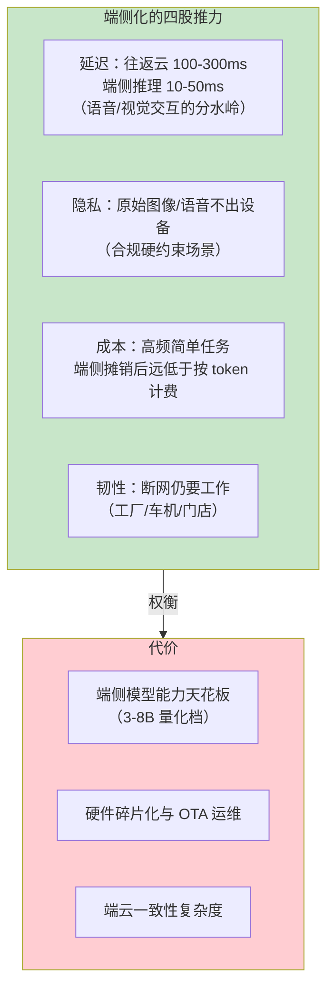
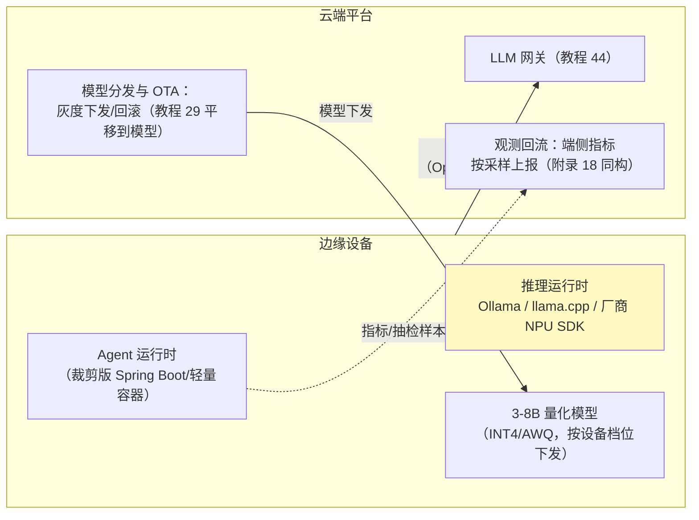

# 边缘 Agent 与端云协同

> **定位**：前沿调研篇——当 Agent 从数据中心走向端侧（手机/车机/工厂边缘盒/门店设备），架构怎么变：端云协同的五种形态、边缘推理现状（小模型量化/NPU/Ollama）、隐私与断网韧性、路由策略与经济账。呼应 [教程 65-模型路由与降级]、[教程 87-多模型协作与供应策略]（云端多模型）、[附录 15-AIInfra与推理部署]（自建推理），并以 [项目 11-工业质检与预测性维护]（边缘部署+断网续跑）为已落地的参照系。
>
> **读者画像**：评估"Agent 下沉到端侧"可行性与形态的架构师。
>
> **前置阅读**：[教程 87-多模型协作与供应策略]；[附录 15-AIInfra与推理部署/01-GPU调度与K8s部署]；[项目 11-工业质检与预测性维护/08-高可用断网续跑]。

---

## 1. 为什么边缘：延迟/隐私/成本/断网的四角



**2026 年的现实**：端侧 3-8B 量化模型（INT4）在手机 NPU/边缘盒上可用性成熟（Ollama/llama.cpp 生态、厂商 NPU SDK），能力上限≈"路由档"（[教程 44 §3] 的便宜档）——能干分类/抽取/简单问答，干不了复杂推理。**端云协同不是二选一，是分工**。

## 2. 五种协同形态

| 形态 | 机制 | 适用 | 代价 |
|------|------|------|------|
| ① 纯云 | 现状默认 | 复杂任务、无上述四压力 | 全量依赖网络 |
| ② 纯端 | 全离线 | 合规硬约束/极简任务 | 能力天花板、无法升级认知 |
| ③ 端直答 + 云复核 | 简单任务端侧直答，云端异步抽检（观测流回传） | 高频低风险（表单预填、FAQ） | 复核管道要建 |
| ④ 云主答 + 端缓存 | 语义缓存下沉到端（[附录 09-语义缓存与性能] 的边缘版） | 重复度高的固定场景 | 缓存一致性 |
| ⑤ 端起草 + 云校验（speculative） | 端侧快速生成草稿，云端强模型校验/重写 | 低延迟要求但质量敏感 | 云端仍付校验成本 |

**工程主流是 ③+④ 混合**：任务分级器（端侧小分类器或规则，[教程 65] 路由的边缘版）把流量切成"端处理/云处理/端起草云校验"三路；分级器本身也跑在端上（不能为了问"该谁答"先访问云）。

## 3. 边缘推理栈现状



要点：**协议上端云同构**——端侧推理服务暴露 OpenAI 兼容端点，Agent 运行时用同一套 Spring AI 客户端，"切换端云"退化为改 base-url 的路由决策（[教程 44 §8] 边缘混合的现实实现路径）；**模型即配置**——设备档位↔量化版本映射表，OTA 走灰度（10% 设备→观测→全量，边缘版的 [教程 62]）；观测回流要**省流量**（聚合+采样上报，原始 trace 不出端）。

## 4. 断网韧性（[项目 11] 迭代七的模式提炼）

- **任务降级链**：端模型兜底简单任务 → 规则/模板兜底关键交互 → 队列缓存待网恢复后补云处理（[教程 69-消费者与消费组] §6] 消费暂停/恢复的端侧版）
- **状态本地化**：会话状态与检查点本地优先（[教程 83]），恢复联网后同步/对账
- **诚实的降级告知**：端侧能力有限时对用户显式（"离线模式，能力受限"）——体验预期管理是韧性的一部分

## 5. 经济账与决策框架

```
端侧成本 = 硬件摊销/设备 + 模型 OTA 运维 + 能力折损（复杂任务仍要云）
云端成本 = token 单价 × 调用量
临界点：高频（>百次/日/设备）× 简单任务占比高（>70%）→ 端侧摊销成立
        低频或复杂为主 → 纯云更省（设备算力与运维费 > token 费）
```

决策先问三个问题：原始数据能不能出设备（能→云端优先）？任务分布是高频简单还是低频复杂（后者→云端）？断网是不是硬需求（不是→别为韧性付端侧税）。

## 6. 趋势研判（2026 视角）

1. **端侧模型档位化**：厂商基座模型普遍出 3B/7B 端侧档（蒸馏+量化），质量差距在"结构化抽取/分类"任务上已接近云端小档——这类任务端化最划算。
2. **NPU 标准化推进**：端侧推理从"逐厂商 SDK"走向 ONNX/WASI-NN 类中间层收敛，Agent 运行时跨设备可移植性改善中。
3. **端云协议趋同**：OpenAI 兼容 API 事实上成为端侧推理服务默认接口（[教程 44 §8] 的"事实标准"判断延伸到端）。
4. **隐私计算补位**：敏感数据不出端但需要云端认知的场景（联邦/端侧 RAG 检索+云端读摘要），在合规行业开始落地试点。

## 7. 常见误区与反模式

1. **为"先进"端化**——没有四角压力就别付端侧税（§5 决策三问）。
2. **端侧模型当全功能 Agent**——3B 档做路由/抽取/简单问答，复杂推理硬塞端侧=质量事故；分级器放行标准要保守。
3. **每设备一套配置**——设备档位分级（高/中/低三档映射三套量化模型），不是机型级长尾。
4. **OTA 无灰度**——端侧模型出问题无法秒回滚；模型分发必须带灰度+自动回退（坏模型=全网设备变砖级事故）。
5. **观测全量回传**——端侧流量/电费敏感；聚合+采样，与 [教程 07] 的采集侧治理同构。

## 8. 总结

边缘 Agent 的架构骨架：**任务分级（端侧路由器）→ 三路分流（端直答/云主答/端起草云校验）→ 协议同构（OpenAI 兼容端点让切换退化为配置）→ 模型即配置（档位化+灰度 OTA）→ 断网降级链 + 观测省流回流**。它是 [教程 65]/[教程 87] 的路由与供应思想在"设备维"上的延伸——云端多模型解决"谁最合适"，端云协同解决"在哪跑"。落地参照系：[项目 11] 的边缘部署与断网续跑迭代。

**外部来源**：[Ollama](https://ollama.com/) · [llama.cpp（端侧量化推理）](https://github.com/ggml-org/llama.cpp) · [ONNX Runtime（跨设备推理）](https://onnxruntime.ai/) · [Qualcomm AI Stack / 端侧 NPU 参考](https://www.qualcomm.com/developer/ai-stack)
