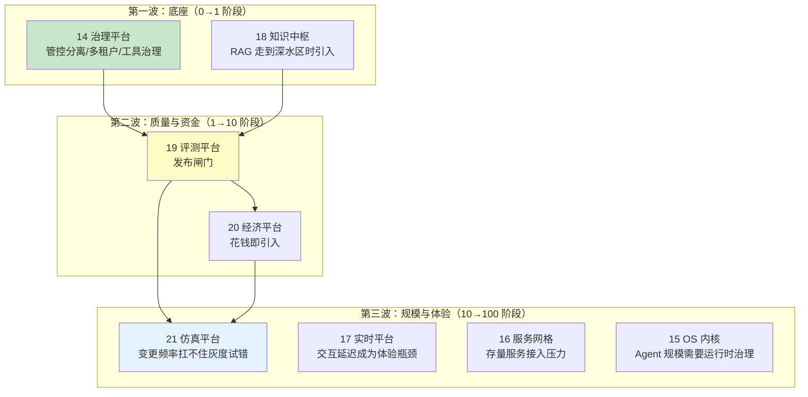
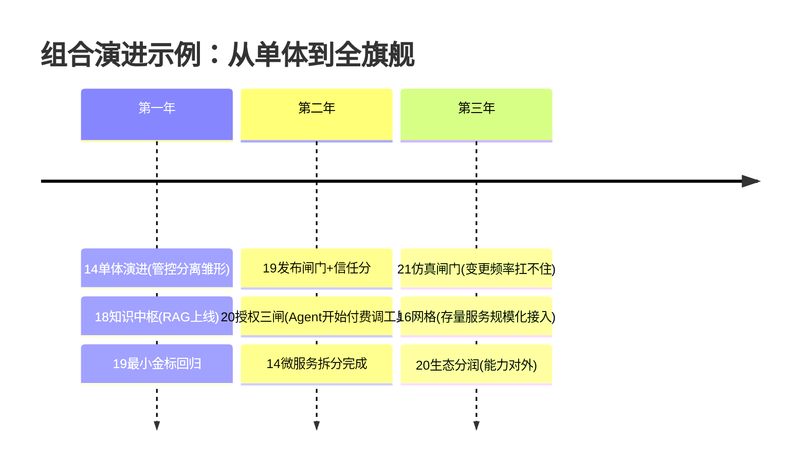

# 11-八旗舰组合蓝图：从八个视角到一家企业的完整落地

> **定位**：体系收官导读——项目板块 14-21 八个旗舰项目互相独立（阅读纪律），但真实企业落地时它们**必然组合**。本文回答：一家企业要建设完整 Agent 基础设施，八旗舰按什么顺序引入、哪些是必备底座、哪些按需选配、组合时的边界怎么划。读者画像：通读（或选读）过旗舰项目、要为企业设计总体演进路线的架构师。前置阅读：各旗舰 00 篇（本文不做单旗舰内容复述）。
>
> **纪律**：本文是"组合视角"，不引入任何旗舰的新机制；引用一律指向前沿目录之外的项目篇目，仅供架构规划参考——各项目独立阅读不受本文影响。

---

## 一、八旗舰一览：八个第一性问题

| 旗舰 | 第一性问题 | 一句话 | 引入时机 |
|------|-----------|--------|---------|
| 14 多微服务管控平台 | 治理全景 | 什么都能治 | 第一批（治理底座） |
| 15 Agent OS 内核 | 资源托管 | 像 OS 跑 | 平台化中期 |
| 16 服务网格 | 零改造 | 像网格罩 | 存量接入压力出现时 |
| 17 实时多模态 | 延迟预算 | 像真人聊 | 交互体验成为瓶颈时 |
| 18 数据与知识中枢 | 知识可信 | 答得有据 | RAG 深水区 |
| 19 信任与评测 | 效果可信 | 敢不敢上生产 | 第二批（质量闸门） |
| 20 经济与结算 | 交易可信 | 敢让它花钱 | Agent 开始花钱时 |
| 21 仿真与孪生 | 变更可信 | 敢不敢改 | 第三批（规模化后） |

## 二、为什么是这个顺序（依赖与杠杆）

**核心依赖只有一条主线**：治理底座（14）→ 质量闸门（19）→ 变更预演（21）。
- 没有治理底座，评测和经济平台没有挂载点（闸门挂在哪里？凭证发给谁？）
- 没有质量闸门，仿真平台的报告没人看、变更闸门无判据
- 其余旗舰（15/16/17/18/20）按痛点独立引入，不阻塞主线

## 三、四种组合形态（按企业形态选）

| 企业形态 | 组合 | 理由 |
|---------|------|------|
| 初创/单业务线 | 14 精简版（单体起步的演进路径） + 18（RAG） | 治理最小集+知识底座，其余等规模 |
| 中型多业务 | 14 + 18 + 19 + 20 | 完整"质量+资金"双闸门 |
| 大型平台型 | 全八旗舰 | 多租户规模化，全部痛点都会遇到 |
| 垂直深水区 | 14 + 17（语音/实时交互企业）或 14 + 15/16（Agent 密集型） | 按领域瓶颈优先 |

## 四、组合时的三条边界纪律

1. **闸门唯一**：发布/变更/花钱三类闸门各只有一个权威执行点（19 管发布、21 管变更预演、20 管消费）——多平台各设闸门必然互相打架，其他平台挂"信号"不挂"闸"。
2. **账本唯一**：计量数据只有一条权威流（20 的计量是资金账本；22 可观测的指标是运维视图）——两套数对不上是企业内耗的经典源头。
3. **流量复用**：18 的知识库快照、21 的回放集、19 的金标集是三种"影子资产"——采集管道可共享（一次镜像，三处消费），资产本身各自版本化不混库。

## 五、一家虚构企业的三年路线（组合示例）

每一步的引入信号（不要提前建设）：
- 19：第一次"改 Prompt 靠感觉、上线翻车"事故之后
- 20：第一次月账单失控或要接付费工具时
- 21：每周变更 >10 个、灰度试错成本显性化时
- 16/15：接入服务数与 Agent 数超过人工治理上限时

## 六、检验方式

- 用本文 §二主线核对贵司现状：治理底座/质量闸门/变更预演三件齐了吗？
- 用 §五"引入信号"自查：是否在信号出现前提前建设了某旗舰（浪费），或信号已出现仍未建设（欠账）？

## 七、总结

八旗舰不是八选一也不是全都要——是**一条主线（治理→质量→变更）加五个按需模块（运行时/网格/实时/知识/经济）**。主线决定"敢不敢"，模块决定"好不好"；先主线后模块，信号驱动而非规划驱动。
