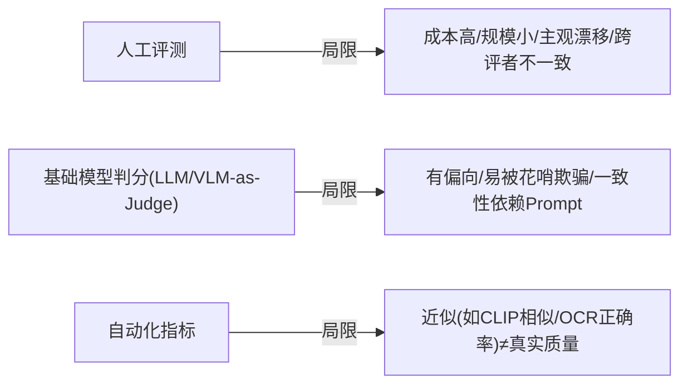

# 16-多模态人工评测局限与自动化

> **定位**：前沿调研——深挖**多模态 Agent 评测的现状与痛点**：人工评测的主观性/规模瓶颈、自动评测替代方案及其局限。与全体系关系：呼应 [91-多模态Agent开发](../教程/91-多模态Agent开发.md)、[19-评测平台](../项目/19-企业级Agent信任与评测平台/00-需求分析与架构设计.md)、[37-自我反思与评估](../教程/80-自我反思与Agent评估.md)。
>
> **性质声明**：调研性质，自动评测方法为公开工作（如基础模型判分/CLIP 式/OCR 指标）的转述，非本机实测。

---

## 1. 为什么多模态 Agent 评测更难

文本评测已有 SWE-bench 式"机器可判定"（[13-前沿](../前沿/13-Agent代码生成与SWE基准深挖.md)）；多模态（图/音/视频/工具 GUI）的**正确答案判定难**：

| 模态 | 判据难点 |
|------|---------|
| 图像理解 | 客观对错少，多为"描述是否相关/精确"主观分 |
| 视频/流 | 时序正确性难自动判定 |
| 工具/浏览器 | 过程正确（调哪个工具、动作顺序）难程序化 |
| 生成类（图/音/文） | 质量无唯一答案，只能人评或度量近似 |

## 2. 三大评测方式的局限

## 3. 应对（工程可落地）

1. **混合判分**：自动化指标 + LLM/VLM 判分 + **小比例人工校准**（人审校准自动判分漂移，[19-金标防污染](../项目/19-企业级Agent信任与评测平台/02-金标资产化.md) 思想延伸）。
2. **评估者抽取多法官+去偏**：同一样本多个 Judge 交叉，统计一致性；不一致样本上升人工（呼应 [19-交叉验证](../项目/19-企业级Agent信任与评测平台/06-信任评分与发布闸门.md) 与 [12-附录评估](../附录/11-评估与可观测生态/00-Langfuse与Ragas集成.md)）。
3. **可判定的子维度**：多模态任务拆出"能自动判定"的子项（OCR 正确/实体出现/动作完成标志）作为硬指标，主观整体分只作参考（呼应发 [35-发布闸门](../项目/19-企业级Agent信任与评测平台/06-信任评分与发布闸门.md) 的分维双卡）。
4. **轨迹级评测**：多模态 Agent 的过程（调了哪些工具/顺序）比结果更可判（[19-轨迹评估](../项目/19-企业级Agent信任与评测平台/08-轨迹级评估与模拟沙箱.md)）。

## 4. 结论

多模态 Agent 评测**无法完全自动化**——工程目标是**把"可判定的"自动化 + "主观的"结构化人审**，且用**一致性监控**防 Judge 漂移。这与全体系"混杂判分 + 金标校准 + 分维守门"的评测方法论一脉相承（[19 评测平台](../项目/19-企业级Agent信任与评测平台/00-需求分析与架构设计.md)）。

> **结语**：多模态评测的真实答案不是"全自动"或"全靠人"，而是**分层：自动化硬指标打底 + LLM/VLM 判分承接 + 人工校准小步**——这正是企业级评测平台该有的姿态。
