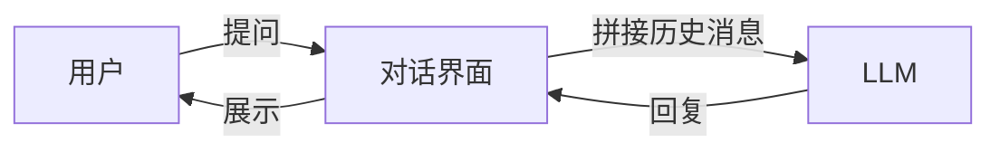
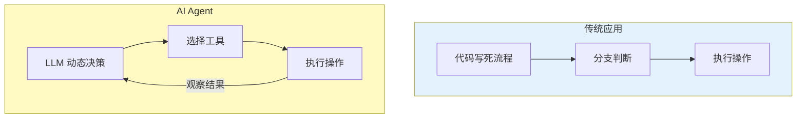
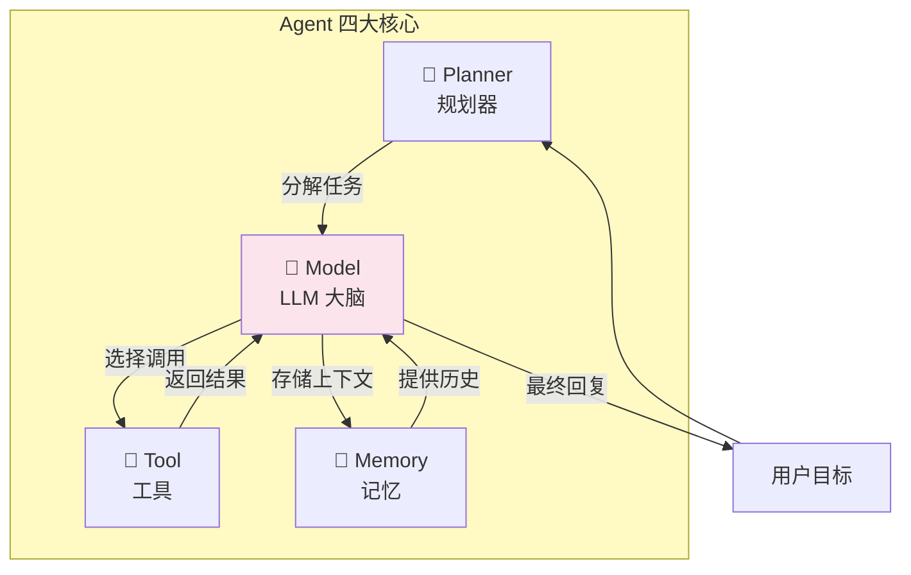
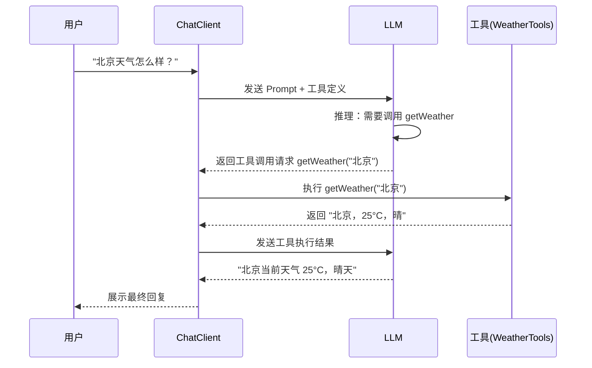
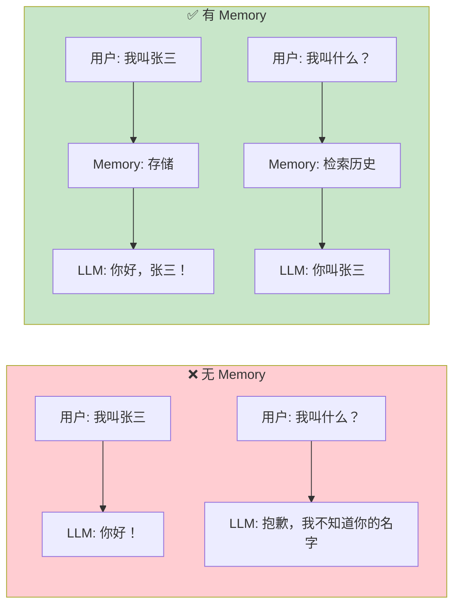
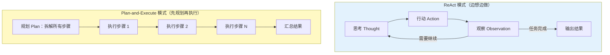
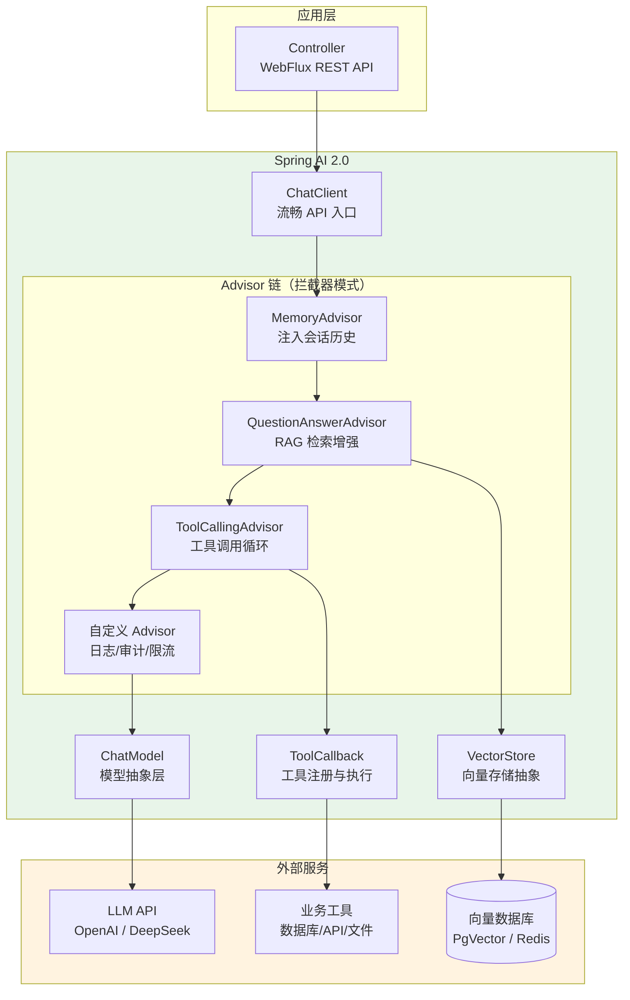
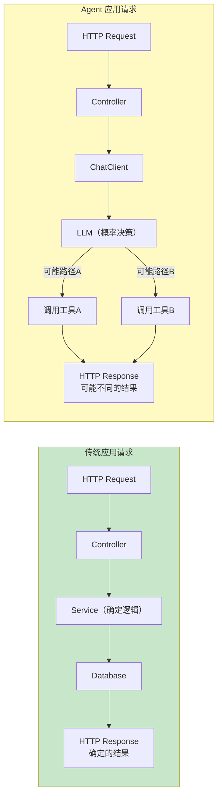
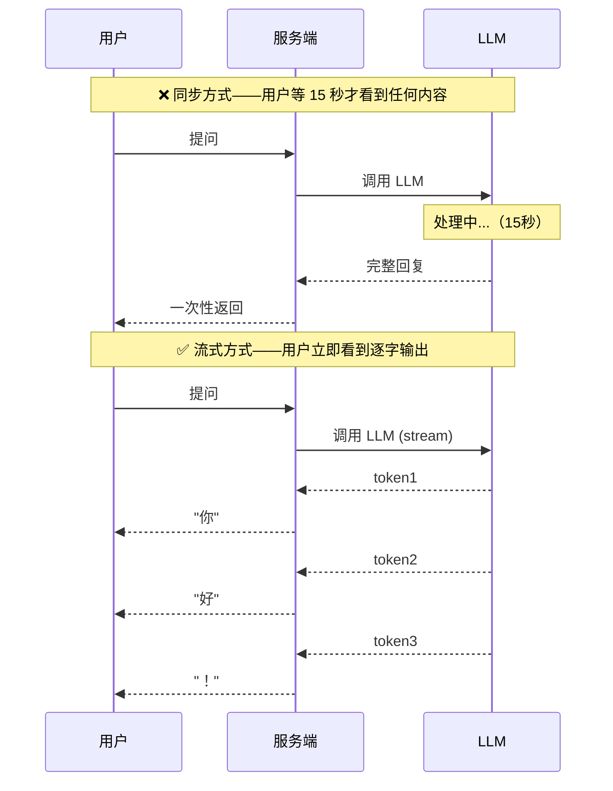
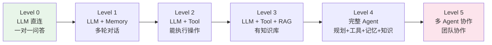

# 00-Agent 核心概念

> **定位**：本文是整个教程体系的第一篇，讲透"什么是 AI Agent"、"Agent 由什么组成"、"Agent 和普通应用有什么本质区别"。读完这篇，你将拥有理解后续所有教程的概念基础。
>
> **读者画像**：中高级 Java 开发者，有 Spring Boot 经验，刚开始接触 AI Agent 领域。
>
> **前置阅读**：无（这是起点）。

---

## 1. 从 LLM 到 Agent：一段思维演化

### 1.1 LLM 是什么：一个超强的"文本计算器"

大语言模型（LLM，Large Language Model）本质是一个**文本到文本的函数**：

```
f(文本输入) → 文本输出
```

你给它一段话，它返回一段话。听起来简单，但它能做的远超想象——写代码、翻译、总结、推理、分析数据。GPT、Claude、DeepSeek 都是 LLM。

但 LLM 有一个致命局限：**它是冻结的**。训练完成那一刻，它的知识就停止更新了。它不能：
- 查今天天气
- 访问你公司的数据库
- 执行一段代码
- 发送一封邮件

LLM 就像一个被关在房间里的顶级专家——知识渊博，但无法与外界交互。

### 1.2 Chatbot：给 LLM 加了对话外壳

第一步演化是 Chatbot（聊天机器人）。你在 LLM 外面包了一层对话管理：



Chatbot 解决了"多轮对话"的问题——LLM 本身是无状态的，每次调用都是独立的。Chatbot 通过维护消息历史，让 LLM"记住"了之前的对话。

但 Chatbot 仍然只能**聊天**——它不能采取行动。你问它"帮我订一张明天去北京的机票"，它只能告诉你怎么订，不能真的帮你订。

### 1.3 Agent：让 LLM 能感知、决策、行动

**Agent = LLM + 工具 + 记忆 + 规划**

Agent 的核心突破是让 LLM 从"只能说话"变成"能做事"。它不再只是一个文本生成器，而是一个**能感知环境、做出决策、采取行动的自主系统**。



关键区别在这里：

| 维度 | 传统应用 | AI Agent |
|------|---------|----------|
| **决策方式** | 代码写死的 if-else 分支 | LLM 根据上下文动态决策 |
| **流程** | 预定义的固定流程 | 根据目标自主规划流程 |
| **工具使用** | 编译时确定 | 运行时由 LLM 选择 |
| **适应性** | 遇到未预见情况就报错 | 遇到新情况可以调整策略 |
| **不确定性** | 确定——同样输入永远同样输出 | 不确定——同样输入可能不同输出 |

> **想深入？→ [附录 01-LLM基础理论/00-Transformer架构]**：理解 Transformer 架构和注意力机制，搞清楚 LLM 为什么能"理解"语言。

---

## 2. Agent 的四大核心组成

一个完整的 Agent 系统由四大支柱组成。后续的每一篇教程都在深入展开其中一个或多个。



### 2.1 Model（LLM 大脑）——推理引擎

Model 是 Agent 的核心推理引擎。它负责：
- **理解**用户意图
- **推理**应该怎么做
- **决策**用哪个工具
- **综合**工具返回的结果，生成最终回复

在 Spring AI 2.0 中，Model 通过 `ChatModel` 接口抽象：

```java
// Spring AI 2.0.0
// ChatModel 是所有对话模型的统一抽象
public interface ChatModel extends Model<ChatModelRequest, ChatModelResponse> {

    ChatResponse call(ChatModelRequest request);

    Flux<ChatResponse> stream(ChatModelRequest request);
}
```

Spring AI 为每个模型提供商提供了实现（`OpenAiChatModel`、`AnthropicChatModel` 等），切换模型只需改配置，不改代码。

> **遇到阻塞？→ [教程 01-Spring-AI框架入门]**：了解 Spring AI 2.0 的完整架构和项目搭建。
> **遇到阻塞？→ [教程 02-ChatClient与对话模型]**：深入 ChatClient API 和 Prompt 工程。

### 2.2 Tool（工具）——Agent 的手和眼

工具让 Agent 从"只能说话"变成"能做事"。一个工具就是一个 Java 方法，用 `@Tool` 注解标记：

```java
// Spring AI 2.0.0
import org.springframework.ai.tool.annotation.Tool;
import org.springframework.ai.tool.annotation.ToolParam;

public class WeatherTools {

    @Tool(description = "查询指定城市的当前天气")
    public String getWeather(@ToolParam(description = "城市名称") String city) {
        // 实际调用天气 API
        return "北京，25°C，晴";
    }
}
```

工作流程：



LLM 自己**不执行**工具——它只是"决定"调用哪个工具、传什么参数。实际执行由你的 Java 代码完成，结果再发回给 LLM 做最终总结。

> **遇到阻塞？→ [教程 03-工具调用]**：深入 Function Calling、工具注册与发现、@Tool 注解全解。

### 2.3 Memory（记忆）——Agent 的短期和长期记忆

LLM 是无状态的——每次调用都是独立的，它不会"记住"你上一句话说了什么。Memory 解决了这个问题。



在 Spring AI 2.0 中，Memory 通过 `ChatMemory` 接口实现：

```java
// Spring AI 2.0.0
// ChatMemory 管理会话历史
ChatMemory chatMemory = MessageWindowChatMemory.builder()
    .maxMessages(20)  // 保留最近 20 条消息
    .build();

// 通过 Advisor 自动注入到每次对话
ChatClient client = ChatClient.builder(chatModel)
    .defaultAdvisors(
        MessageChatMemoryAdvisor.builder(chatMemory).build()
    )
    .build();
```

Memory 不只是"存聊天记录"这么简单。一个成熟的 Agent 系统有三层记忆：

| 记忆层 | 作用 | 类比 |
|--------|------|------|
| **短期记忆**（上下文窗口） | 当前对话的最近几轮消息 | 人的工作记忆 |
| **长期记忆**（向量化存储） | 跨会话的用户偏好、历史事实 | 人的长期记忆 |
| **外部记忆**（RAG 检索） | 从知识库中按需检索 | 人去查资料 |

> **遇到阻塞？→ [教程 04-记忆与会话管理]**：深入 ChatMemory API、短期 vs 长期记忆、会话隔离。
> **想深入？→ [教程 39-高级记忆架构]**：三层记忆架构、语义记忆 vs 情景记忆、记忆演化与衰减。

### 2.4 Planner（规划器）——Agent 的大脑皮层

当任务复杂时，Agent 不能只靠一轮"用户提问 → LLM 回答"。它需要**规划**：把一个大目标拆解成多个小步骤，逐步执行。

两种核心规划模式：



**ReAct**（Reasoning + Acting）适合：步骤不确定、需要根据中间结果调整策略的场景。

**Plan-and-Execute** 适合：步骤比较明确、可以提前规划的场景。

Spring AI 2.0 中，规划能力通过 **Advisor 链 + 工具调用循环**实现——ChatClient 会自动在 Advisor 链中循环，直到 LLM 认为任务完成。

> **遇到阻塞？→ [教程 07-ReAct推理模式]**：深入 Thought-Action-Observation 循环。
> **遇到阻塞？→ [教程 08-Plan-and-Execute模式]**：深入规划-执行分离架构。

---

## 3. Spring AI 2.0 的 Agent 架构全景

了解了四大核心概念后，我们来看 Spring AI 2.0 是怎么把这些组装在一起的。



### 核心设计理念

Spring AI 2.0 的架构设计遵循三个原则：

**1. 可移植性（Portability）**

```java
// 切换模型只需改配置，代码零修改
// application.yml
// spring.ai.openai.chat.options.model: gpt-4o
// 改为：
// spring.ai.openai.chat.options.model: deepseek-chat
```

`ChatModel`、`VectorStore`、`EmbeddingModel` 都是接口，有多套实现。你的业务代码面向接口编程，切换提供商改配置即可。

**2. Spring 原生（Spring Native）**

```java
// 和你写 Spring Boot 的方式完全一样
@RestController
class AgentController {

    private final ChatClient chatClient;

    AgentController(ChatClient chatClient) {  // 构造器注入
        this.chatClient = chatClient;
    }

    @GetMapping("/agent")
    String ask(@RequestParam String question) {
        return chatClient.prompt()
            .user(question)
            .tools(new MyTools())
            .call()
            .content();
    }
}
```

没有新的编程范式，没有新的构建工具。你用 Spring Boot 的方式写 Agent，就像你用 Spring Boot 写 Web 应用一样。

**3. 可组合性（Composability）**

```java
// Advisor 链让你像搭积木一样组装 Agent 能力
ChatClient client = ChatClient.builder(chatModel)
    .defaultSystem("你是一个专业的客服助手")
    .defaultAdvisors(
        MessageChatMemoryAdvisor.builder(chatMemory).build(),    // 记忆
        QuestionAnswerAdvisor.builder(vectorStore).build(),       // RAG
        new SimpleLoggerAdvisor()                                 // 日志
    )
    .defaultTools(new OrderTools(), new FaqTools())               // 工具
    .build();
```

每个能力（记忆、RAG、日志、工具）都是一个 Advisor，通过链式组装。增删能力只需增删一行 Advisor 配置。

> **遇到阻塞？→ [教程 01-Spring-AI框架入门]**：从零搭建第一个 Spring AI 项目。
> **遇到阻塞？→ [教程 14-Advisor链与拦截器]**：深入 Advisor API 和中间件模式。

---

## 4. Agent vs 传统应用：架构师视角

作为架构师，你需要理解 Agent 给系统设计带来的根本变化。

### 4.1 确定性 vs 概率性

传统应用的每一步都是确定的——同样的输入永远产生同样的输出。Agent 的每一步都涉及 LLM——**同样的输入可能产生不同的输出**。



这意味着：
- **测试方式变了**：你不能用"断言固定输出"的方式测 Agent，需要用评估框架（Evaluation）
- **错误处理变了**：LLM 可能返回错误的信息（幻觉），需要兜底策略
- **监控指标变了**：除了延迟和吞吐，还要监控 Token 消耗、工具调用成功率、回答准确率

> **遇到阻塞？→ [教程 30-容错与弹性设计]**：重试、降级、熔断、超时策略。
> **遇到阻塞？→ [教程 37-自我反思与Agent评估]**：如何量化评估 Agent 效果。

### 4.2 同步阻塞 vs 流式响应

传统 Web 应用是"请求 → 处理 → 返回完整结果"。Agent 调用 LLM 可能需要 10-30 秒，如果用同步方式，用户体验极差。



Spring AI 2.0 + WebFlux 天然支持流式响应：

```java
// Spring AI 2.0.0 + WebFlux
@GetMapping(value = "/chat/stream", produces = "text/event-stream")
Flux<String> stream(@RequestParam String question) {
    return chatClient.prompt()
        .user(question)
        .stream()
        .content();  // 返回 Flux<String>，逐 token 推送
}
```

> **遇到阻塞？→ [教程 10-SSE流式通信]**：WebFlux SSE 流式响应、前端对接。

### 4.3 成本模型变了

传统应用的成本主要是服务器和带宽。Agent 应用多了一个巨大的成本项——**LLM API 调用费**。

```
每次 LLM 调用都花钱：
- 输入 Token 计费（约 $0.01-0.06 / 1K tokens）
- 输出 Token 计费（约 $0.03-0.12 / 1K tokens）
- 工具调用循环可能触发多次 LLM 调用
- RAG 检索涉及 Embedding 调用（也要计费）
```

架构师必须从一开始就考虑成本治理——Token 预算、模型路由（简单任务用小模型）、语义缓存（避免重复调用）。

> **遇到阻塞？→ [教程 27-成本治理与Token计量]**：Token 计量、预算控制、成本归因。

---

## 5. Agent 的演进路线

Agent 不是一夜之间从"只有 LLM"变成"完整 Agent"的。它有自己的成熟度模型：



| Level | 能力 | Spring AI 组件 | 对应教程 |
|-------|------|---------------|---------|
| L0 | 一问一答，无状态 | ChatClient | [教程 02-ChatClient](02-ChatClient与对话模型.md) |
| L1 | 多轮对话，有记忆 | ChatMemory + MemoryAdvisor | [教程 04-记忆](04-记忆与会话管理.md) |
| L2 | 能执行操作 | @Tool + ToolCallingAdvisor | [教程 03-工具调用](03-工具调用.md) |
| L3 | 有私有知识 | VectorStore + QuestionAnswerAdvisor | [教程 05-RAG](05-RAG检索增强生成.md) |
| L4 | 完整 Agent | 全部组件组合 | 项目实战 |
| L5 | 多 Agent 协作 | 多 ChatClient 编排 | [教程 09-多Agent协作](09-多Agent协作.md) |

**你的成长路径就是沿着这条线走**——每一篇教程都在把你的 Agent 推向下一个 Level。

---

## 6. 适用场景与不适用场景

### ✅ 适用场景

- **知识密集型问答**：客服、文档问答、技术支持（RAG 驱动）
- **多步骤任务编排**：工单处理、审批流程、数据分析报告
- **创意生成**：文案撰写、代码生成、方案设计
- **信息聚合**：从多个来源采集数据并整合
- **对话式交互**：需要理解自然语言意图的场景

### ❌ 不适用场景

- **精确计算**：需要 100% 数学精度的场景（LLM 会算错——用计算器工具）
- **高频低延迟**：要求毫秒级响应的场景（LLM 调用至少几百毫秒）
- **严格合规**：每一步都必须可审计、可追溯、不可变（Agent 的非确定性带来合规挑战）
- **简单 CRUD**：标准的增删改查不需要 LLM 参与决策

---

## 7. 本章总结

| 概念 | 一句话 |
|------|--------|
| **Agent** | LLM + 工具 + 记忆 + 规划 = 能感知、决策、行动的自主系统 |
| **Model** | 推理引擎，理解意图、做决策、生成回复（Spring AI: ChatModel） |
| **Tool** | Agent 的手和眼，让 LLM 能执行实际操作（Spring AI: @Tool） |
| **Memory** | Agent 的记忆，让 LLM 能记住上下文（Spring AI: ChatMemory） |
| **Planner** | Agent 的规划能力，把大目标拆成小步骤（ReAct / Plan-Execute） |
| **ChatClient** | Spring AI 的核心 API，流畅接口组装所有能力 |
| **Advisor** | Spring AI 的拦截器模式，像中间件一样增强 Agent |
| **确定性变了** | Agent 是概率性的，测试/监控/错误处理都要适配 |
| **成本变了** | 每次 LLM 调用都花钱，架构师必须做成本治理 |

**下一篇**：[01-Spring-AI框架入门](01-Spring-AI框架入门.md) — 从零搭建第一个 Spring AI 2.0 项目。

---

> **想深入？→ [附录 01-LLM基础理论/00-Transformer架构]**：理解 Transformer 和注意力机制，搞清楚 LLM 为什么能"理解"语言。
> **想深入？→ [附录 01-LLM基础理论/02-上下文窗口与Token]**：理解 Token 和上下文窗口的限制，这决定了 Agent 每次能"看到"多少信息。
