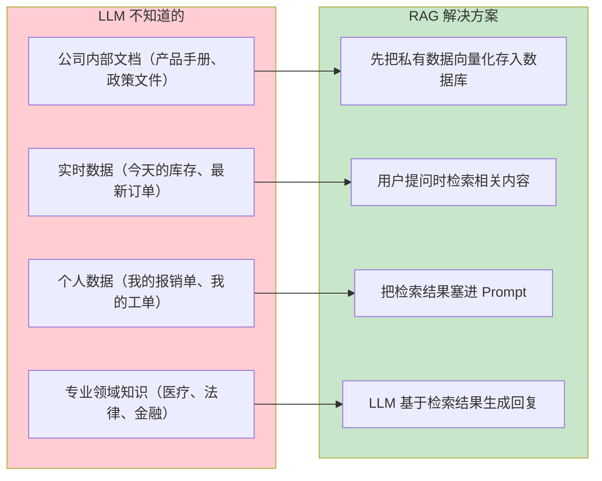
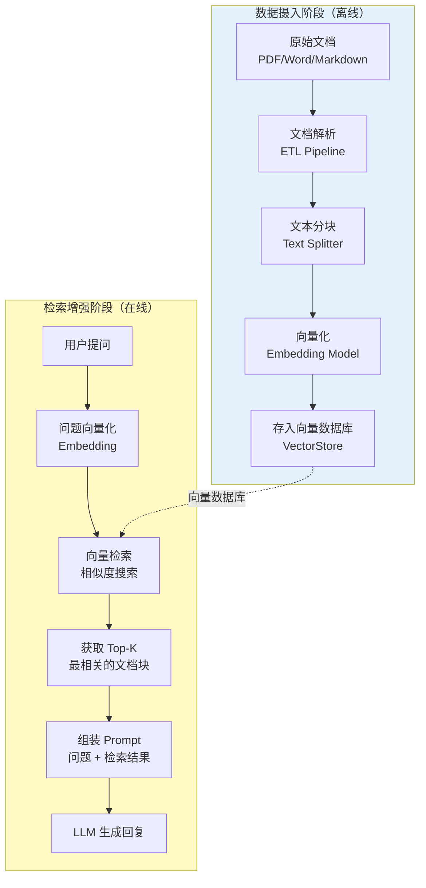
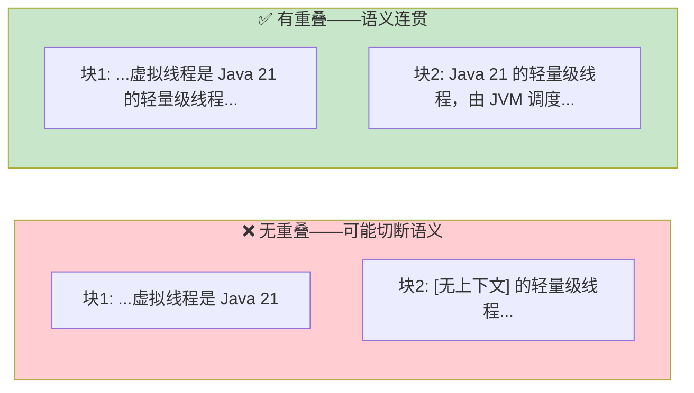
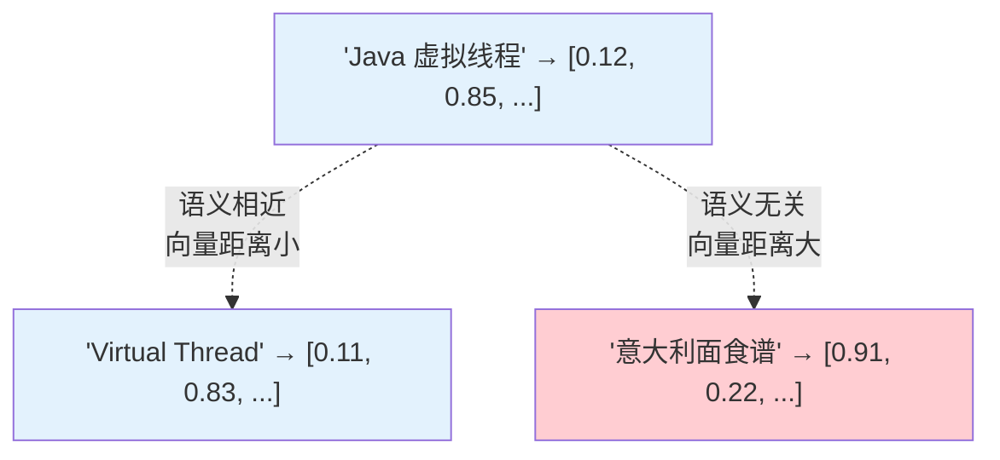
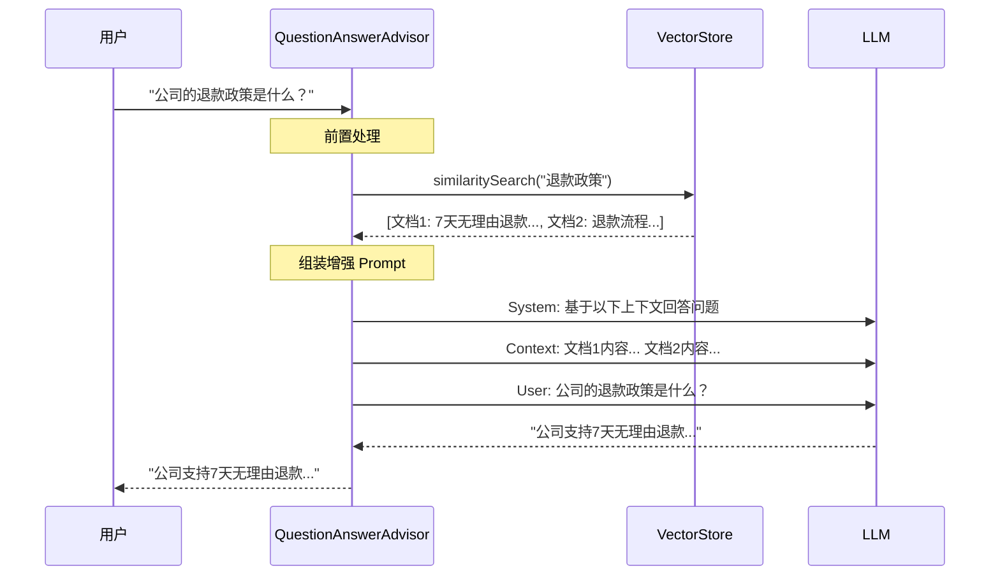

# 05-RAG 检索增强生成

> **定位**：讲透 RAG（Retrieval Augmented Generation）的完整流程——文档处理、Embedding、向量存储、检索策略、Prompt 增强。读完这篇，你的 Agent 能基于私有知识库回答问题。
>
> **读者画像**：已经掌握 ChatClient、工具调用、记忆管理，需要让 Agent 具备"知识库问答"能力。
>
> **前置阅读**：[04-记忆与会话管理](04-记忆与会话管理.md)。

---

## 1. 为什么需要 RAG

LLM 知识有限——它只知道训练数据中的内容。在企业场景中，用户问的问题通常涉及**私有数据**：



### RAG vs Fine-tuning vs Prompt Stuffing

| 方法 | 原理 | 优势 | 劣势 |
|------|------|------|------|
| **Fine-tuning** | 用私有数据重新训练模型 | 模型"内化"了知识 | 极贵、极慢、更新困难 |
| **Prompt Stuffing** | 把所有数据塞进 Prompt | 简单直接 | 超出上下文窗口限制 |
| **RAG** | 检索相关数据，只塞相关部分到 Prompt | 成本低、实时更新、可控 | 检索质量影响回复质量 |

RAG 是企业级 Agent 的标配方案——**不修改模型，只在推理时动态注入相关知识**。

---

## 2. RAG 全流程

RAG 分为两个阶段：**数据摄入**（离线）和**检索增强**（在线）。



---

## 3. 数据摄入：ETL Pipeline

### 3.1 文档读取

Spring AI 提供 `DocumentReader` 接口读取各种格式的文档：

```java
import org.springframework.ai.reader.TextReader;
import org.springframework.ai.reader.pdf.PagePdfDocumentReader;
import org.springframework.ai.reader.markdown.MarkdownDocumentReader;
import org.springframework.ai.document.Document;

// 读取纯文本
List<Document> textDocs = new TextReader("classpath:docs/policy.txt").get();

// 读取 PDF（按页）
List<Document> pdfDocs = new PagePdfDocumentReader("classpath:docs/manual.pdf").get();

// 读取 Markdown
List<Document> mdDocs = new MarkdownDocumentReader("classpath:docs/guide.md").get();
```

> **需在 pom.xml 中添加依赖**（PDF 读取）：`spring-ai-pdf-document-reader`；（Markdown 读取）：`spring-ai-markdown-document-reader`

### 3.2 文本分块

文档通常很长，不能整个塞进向量数据库。需要分块（Splitting）：

```java
import org.springframework.ai.transformer.splitter.TokenTextSplitter;

// 将文档分块——Spring AI 2.0.0：构造器自 2.0.0-M3 起弃用（forRemoval），统一使用 builder()
TokenTextSplitter splitter = TokenTextSplitter.builder()
        .withChunkSize(800)            // 每个 chunk 的目标 token 数
        .withMinChunkSizeChars(100)    // chunk 内段落最小字符数
        .withMinChunkLengthToEmbed(5)  // 短于该长度的 chunk 跳过嵌入
        .withMaxNumChunks(10000)       // 单文档最大 chunk 数
        .withKeepSeparator(true)       // 切分时保留分隔符
        .build();

List<Document> chunks = splitter.apply(documents);
```

**注意：`TokenTextSplitter` 并没有「重叠」参数**——`withMinChunkSizeChars(100)` 表示 chunk 内段落最小字符数，不是相邻块的重叠窗口。重叠是分块领域的通用策略（下图为通用示意），Spring AI 内置的 `TokenTextSplitter` 不提供；若业务确需重叠切分，需要自定义 `DocumentTransformer`。



### 3.3 向量化（Embedding）

分块后的文本需要转化为向量（高维浮点数数组），才能进行相似度搜索：

```java
import org.springframework.ai.embedding.EmbeddingModel;

// Spring AI 自动注入 EmbeddingModel（依赖 spring-ai-starter-model-openai）
@Autowired
EmbeddingModel embeddingModel;

// 单文本向量化
float[] vector = embeddingModel.embed("虚拟线程是 Java 21 的新特性");
// vector.length = 1536（OpenAI text-embedding-3-small 的维度）

// 批量向量化
List<float[]> vectors = embeddingModel.embed(List.of(
    "Java 21 虚拟线程",
    "Spring AI 框架",
    "响应式编程"
));
```

**Embedding 的原理**：语义相近的文本，在向量空间中距离也近。



> **想深入？→ [附录 01-LLM基础理论/01-Embedding原理.md]**：向量表示的数学原理、余弦相似度、语义空间的直觉理解。

### 3.4 存入向量数据库

```java
import org.springframework.ai.vectorstore.VectorStore;

// Spring AI 提供统一的 VectorStore 抽象
// 向量数据库自动存储向量 + 原始文本 + 元数据
vectorStore.add(chunks);  // 一次性写入所有分块
```

---

## 4. 向量数据库

Spring AI 2.0 支持的向量数据库（部分）：

| 向量库 | 部署方式 | 适合场景 |
|--------|---------|---------|
| **PgVector** | PostgreSQL 扩展 | 已有 PostgreSQL，不想引入新组件 |
| **Redis** | 独立部署 | 已有 Redis，需要低延迟 |
| **Chroma** | 本地/Docker | 开发调试、小规模 |
| **Milvus** | 独立部署 | 大规模生产、亿级向量 |
| **Pinecone** | 云托管 | 不想运维、按量付费 |
| **MongoDB Atlas** | 云托管 | 已有 MongoDB |

> **遇到阻塞？→ [教程 00-基础与核心/06-向量数据库选型]**：4+ 向量库的详细对比和选型决策。

### PgVector 示例

**需在 pom.xml 中添加依赖**：

```xml
<!-- 需在 pom.xml 中添加依赖 -->
<dependency>
    <groupId>org.springframework.ai</groupId>
    <artifactId>spring-ai-starter-vector-store-pgvector</artifactId>
</dependency>
```

```yaml
# application.yml
spring:
  ai:
    vectorstore:
      pgvector:
        index-type: HNSW           # 索引类型
        distance-type: COSINE_DISTANCE  # 距离度量
        dimensions: 1536           # 向量维度（匹配 Embedding 模型）
```

```java
// VectorStore 由 Spring Boot 自动配置注入
@Autowired
VectorStore vectorStore;

// 存入文档
vectorStore.add(chunks);

// 检索
List<Document> results = vectorStore.similaritySearch("虚拟线程怎么用");
```

---

## 5. 检索增强：QuestionAnswerAdvisor

### 5.1 基本用法

`QuestionAnswerAdvisor` 是 Spring AI 内置的 RAG Advisor，自动完成"检索→注入→生成"：

```java
import org.springframework.ai.chat.client.advisor.vectorstore.QuestionAnswerAdvisor;

ChatClient client = ChatClient.builder(chatModel)
        .defaultAdvisors(
                QuestionAnswerAdvisor.builder(vectorStore).build()
        )
        .build();

// 直接提问——Advisor 自动检索相关知识并注入
String answer = client.prompt()
        .user("公司的退款政策是什么？")
        .call()
        .content();
```
> **需在 pom.xml 中添加依赖**（`QuestionAnswerAdvisor` 所在模块）：2.0.0 起模块名从 `spring-ai-advisors-vector-store` 改为 `spring-ai-vector-store-advisor`（老坐标已不存在）——版本走 `spring-ai-bom`，不写 `<version>`：
>
> ```xml
> <dependency>
>     <groupId>org.springframework.ai</groupId>
>     <artifactId>spring-ai-vector-store-advisor</artifactId>
> </dependency>
> ```

### 5.2 Advisor 内部做了什么



### 5.3 自定义检索参数

```java
import org.springframework.ai.vectorstore.SearchRequest;

QuestionAnswerAdvisor qaAdvisor = QuestionAnswerAdvisor.builder(vectorStore)
        .searchRequest(SearchRequest.builder()
                .topK(5)              // 检索 Top 5 最相关的文档块
                .similarityThreshold(0.7)  // 相似度阈值（0-1，越高越严格）
                .build())
        .build();

ChatClient client = ChatClient.builder(chatModel)
        .defaultAdvisors(qaAdvisor)
        .build();
```

| 参数 | 作用 | 建议 |
|------|------|------|
| `topK` | 检索多少条结果 | 3-5 条，太多会浪费 Token |
| `similarityThreshold` | 相似度过滤阈值 | 0.6-0.8，太低会引入无关内容 |

---

## 6. 完整 RAG 示例

### 6.1 数据摄入（一次性）

```java
import org.springframework.ai.document.Document;
import org.springframework.ai.reader.pdf.PagePdfDocumentReader;
import org.springframework.ai.transformer.splitter.TokenTextSplitter;
import org.springframework.ai.vectorstore.VectorStore;
import org.springframework.stereotype.Component;
import jakarta.annotation.PostConstruct;
import java.util.List;

@Component
public class KnowledgeBaseLoader {

    private final VectorStore vectorStore;

    public KnowledgeBaseLoader(VectorStore vectorStore) {
        this.vectorStore = vectorStore;
    }

    @PostConstruct
    public void load() {
        // 1. 读取文档
        List<Document> docs = new PagePdfDocumentReader("classpath:docs/product-manual.pdf").get();

        // 2. 分块（Spring AI 2.0.0：构造器弃用，等价改写——参数逐位映射到 builder）
        TokenTextSplitter splitter = TokenTextSplitter.builder()
                .withChunkSize(800)            // 每个 chunk 的目标 token 数
                .withMinChunkSizeChars(100)    // chunk 内段落最小字符数
                .withMinChunkLengthToEmbed(5)  // 短于该长度的 chunk 跳过嵌入
                .withMaxNumChunks(10000)       // 单文档最大 chunk 数
                .withKeepSeparator(true)       // 切分时保留分隔符
                .build();
        List<Document> chunks = splitter.apply(docs);

        // 3. 添加元数据
        chunks.forEach(doc -> {
            doc.getMetadata().put("source", "product-manual.pdf");
            doc.getMetadata().put("category", "product");
        });

        // 4. 存入向量数据库（自动向量化）
        vectorStore.add(chunks);

        System.out.println("知识库加载完成：" + chunks.size() + " 个文档块");
    }
}
```

### 6.2 检索增强（在线）

```java
import org.springframework.ai.chat.client.ChatClient;
import org.springframework.ai.chat.client.advisor.vectorstore.QuestionAnswerAdvisor;
import org.springframework.ai.vectorstore.SearchRequest;
import org.springframework.ai.vectorstore.VectorStore;
import org.springframework.web.bind.annotation.*;

@RestController
public class KnowledgeController {

    private final ChatClient chatClient;

    public KnowledgeController(ChatClient.Builder builder, VectorStore vectorStore) {
        this.chatClient = builder
                .defaultSystem("你是产品知识助手。基于提供的上下文回答用户问题。" +
                        "如果上下文中没有相关信息，明确告知用户你不知道。")
                .defaultAdvisors(
                        QuestionAnswerAdvisor.builder(vectorStore)
                                .searchRequest(SearchRequest.builder()
                                        .topK(5)
                                        .similarityThreshold(0.7)
                                        .build())
                                .build()
                )
                .build();
    }

    @GetMapping("/ask")
    public String ask(@RequestParam String question) {
        return chatClient.prompt()
                .user(question)
                .call()
                .content();
    }
}
```

---

## 7. 元数据过滤

向量数据库不仅能做语义搜索，还能基于元数据过滤：

```java
// 只在"售后"类别的文档中检索
List<Document> results = vectorStore.similaritySearch(
        SearchRequest.builder()
                .query("退款流程")
                .topK(5)
                .filterExpression("category == 'after-sales'")  // 元数据过滤
                .build()
);
```

这在多租户、多产品线场景中非常重要——不同用户只检索自己有权限的文档。

> **遇到阻塞？→ [教程 04-企业级架构主干/06-多租户隔离与资源治理]**：多租户 RAG 的数据隔离与权限控制。

---

## 8. RAG 的常见问题与优化

### 8.1 检索质量不够好

| 问题 | 原因 | 解决方案 |
|------|------|---------|
| 检索到无关内容 | 相似度阈值太低 | 提高 `similarityThreshold` |
| 检索不到相关内容 | 分块太大/太小 | 调整 `chunkSize`（`TokenTextSplitter` 无重叠参数） |
| 同义词检索不到 | Embedding 模型不擅长该领域 | 换更好的 Embedding 模型 |
| 跨段落信息丢失 | 分块切断了语义 | 自定义重叠分块或改用语义分块 |

### 8.2 上下文窗口溢出

检索到的文档太多太长，超过了 LLM 的上下文窗口。解决方案：
- 减少 `topK`（少检索几条）
- 用摘要代替原文（先让 LLM 摘要每条，再拼接）
- 分级检索（先检索标题/摘要，再检索完整内容）

> **遇到阻塞？→ [教程 08-架构师进阶/00-上下文工程]**：Token 预算分配、上下文压缩。
> **遇到阻塞？→ [教程 08-架构师进阶/01-高级RAG与AgenticRAG]**：GraphRAG、多跳推理、自适应检索。

### 8.3 幻觉问题

LLM 可能无视检索到的上下文，自己编造答案。缓解策略：
- System Message 中明确要求"只基于上下文回答，不要编造"
- 如果检索结果相似度低，直接回复"我没有找到相关信息"而非强行回答
- 使用结构化输出让 LLM 标注每句话的来源

---

## 9. 适用场景与不适用场景

### ✅ 适用场景

- 企业知识库问答（产品手册、政策文件、技术文档）
- 客服系统（FAQ 检索 + 对话）
- 法律/医疗/金融等专业领域问答
- 代码库问答
- 个人笔记/知识管理

### ❌ 不适用场景

- 实时数据（用工具调用 API 更合适）
- 需要精确匹配（如订单号查询——用工具查数据库更准确）
- 数据量极小（少于 10 篇文档——直接塞进 Prompt 更简单）
- 数据更新频率极高（频繁重建向量索引成本高）

---

## 10. 本章总结

| 概念 | 一句话 |
|------|--------|
| **RAG** | 检索私有数据→注入 Prompt→LLM 基于检索结果生成回复 |
| **ETL Pipeline** | 文档读取→分块→向量化→存入向量数据库 |
| **Embedding** | 把文本转为高维向量，语义相近的文本向量距离近 |
| **VectorStore** | 统一的向量数据库抽象，支持 PgVector/Redis/Milvus 等 |
| **QuestionAnswerAdvisor** | 自动完成"检索→注入→生成"的 RAG Advisor |
| **topK + similarityThreshold** | 控制检索结果数量和质量的核心参数 |
| **元数据过滤** | 按类别/权限/租户过滤检索范围 |

**下一篇**：[07-ReAct 推理模式](07-ReAct推理模式.md) — Thought-Action-Observation 循环，Agent 的核心推理引擎。

---

> **想深入？→ [教程 08-架构师进阶/01-高级RAG与AgenticRAG]**：GraphRAG 多跳推理、Agentic RAG 自主决策检索。
> **想深入？→ [附录 01-LLM基础理论/01-Embedding原理.md]**：Embedding 的数学原理和语义直觉。
