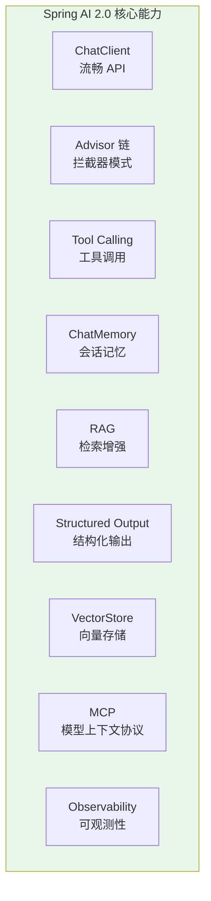
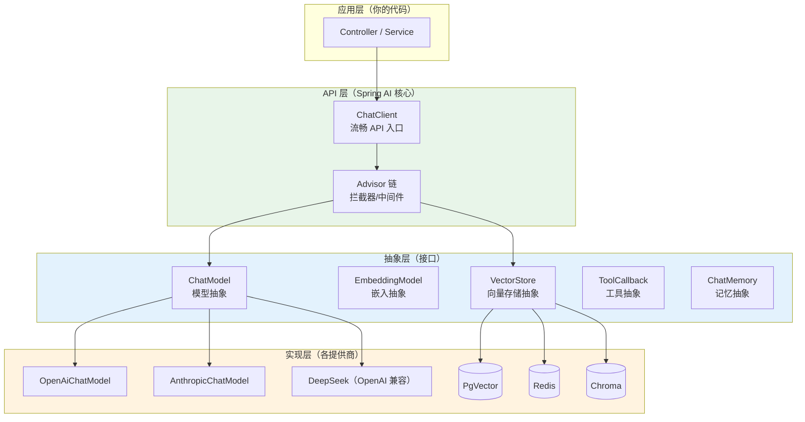
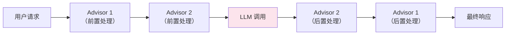
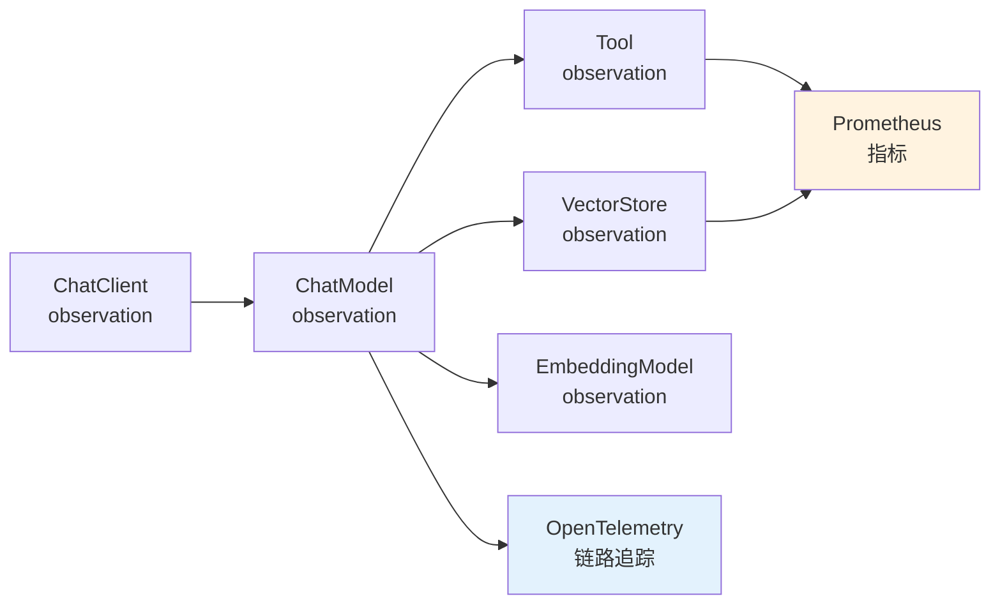

# 01-Spring AI 框架入门

> **定位**：从零搭建第一个 Spring AI 2.0 项目，理解框架架构、核心 API、配置方式。读完这篇，你能跑通一个最小可用的 AI 对话应用。
>
> **读者画像**：有 Spring Boot 经验的 Java 开发者，第一次使用 Spring AI。
>
> **前置阅读**：[00-Agent 核心概念](00-Agent核心概念.md)。

---

## 1. Spring AI 是什么

Spring AI 是 Spring 官方的 AI 应用开发框架。它的目标用一句话概括：

> **Connecting your enterprise Data and APIs with AI Models——把你的企业数据和 API 与 AI 模型连接起来。**

它不是 LangChain 的 Java 翻译版，而是一个基于 Spring 设计哲学的 AI 框架——可移植、可组合、Spring 原生。

### 1.1 核心能力一览



| 能力 | 作用 | 版本 |
|------|------|------|
| ChatClient | 与 LLM 对话的流畅 API | 2.0.0 |
| Advisor 链 | 拦截器模式增强对话流程 | 2.0.0 |
| Tool Calling | 让 LLM 调用 Java 方法 | 2.0.0 |
| ChatMemory | 多轮对话记忆管理 | 2.0.0 |
| RAG | 检索增强生成（知识库问答） | 2.0.0 |
| Structured Output | LLM 输出直接映射为 Java 对象 | 2.0.0 |
| VectorStore | 统一的向量数据库抽象 | 2.0.0 |
| MCP | Model Context Protocol 集成 | 2.0.0 |
| Observability | 基于 Micrometer 的原生可观测性 | 2.0.0 |

### 1.2 Spring AI 2.0 的新特性

Spring AI 2.0（2026 年 6 月 GA）相比 1.x 有重大升级：

- **统一 Tool Calling**：合并了 `FunctionCallback` 和 `ToolCallback` 为统一的 `@Tool` API
- **Advisor 循环支持**：Advisor 链支持循环（looping），实现 Agent 自我纠错
- **渐进式工具发现**（Progressive Tool Discovery）：工具按需加载，避免上下文爆炸
- **自纠错结构化输出**：JSON Schema 验证失败自动重试
- **MCP 原生集成**：开箱即用的 MCP 客户端和服务端
- **增强的可观测性**：全链路 Observation，gen_ai 语义约定

> **来源**：[Spring AI 2.0.0 GA Available Now](https://spring.io/blog/2026/06/12/spring-ai-2-0-0-GA-available-now)

---

## 2. 项目搭建

### 2.1 pom.xml 依赖

本项目的依赖栈：

```xml
<parent>
    <groupId>org.springframework.boot</groupId>
    <artifactId>spring-boot-starter-parent</artifactId>
    <version>4.1.0</version>
</parent>

<properties>
    <maven.compiler.source>21</maven.compiler.source>
    <maven.compiler.target>21</maven.compiler.target>
    <spring-ai.version>2.0.0</spring-ai.version>
</properties>

<dependencyManagement>
    <dependencies>
        <dependency>
            <groupId>org.springframework.ai</groupId>
            <artifactId>spring-ai-bom</artifactId>
            <version>${spring-ai.version}</version>
            <type>pom</type>
            <scope>import</scope>
        </dependency>
    </dependencies>
</dependencyManagement>

<dependencies>
    <!-- 响应式 Web 框架 -->
    <dependency>
        <groupId>org.springframework.boot</groupId>
        <artifactId>spring-boot-starter-webflux</artifactId>
    </dependency>
    <!-- OpenAI 模型集成（含 DeepSeek 兼容） -->
    <dependency>
        <groupId>org.springframework.ai</groupId>
        <artifactId>spring-ai-starter-model-openai</artifactId>
    </dependency>
    <!-- Lombok -->
    <dependency>
        <groupId>org.projectlombok</groupId>
        <artifactId>lombok</artifactId>
    </dependency>
</dependencies>
```

**为什么选 WebFlux 而不是 Web MVC？**

Agent 应用的核心交互模式是**流式响应**——LLM 逐 token 输出，服务端逐 token 推送给前端。WebFlux 基于 Reactor 的 `Flux`/`Mono` 天然支持流式，而 Web MVC 是阻塞式的。

> **想深入？→ [附录 06-WebFlux与响应式编程/02-WebFlux-vs-MVC.md]**：何时选 WebFlux 何时选 MVC 的完整对比。

### 2.2 配置文件

`application.yml`：

```yaml
spring:
  ai:
    openai:
      api-key: ${DEEPSEEK_API_KEY}  # 从环境变量读取，不硬编码
      base-url: https://api.deepseek.com  # DeepSeek 兼容 OpenAI API
      chat:
        options:
          model: deepseek-chat  # 使用 DeepSeek 模型
          temperature: 0.7      # 0=确定, 1=随机
```

**关键配置说明**：

| 配置 | 说明 |
|------|------|
| `api-key` | **必须**从环境变量读取，禁止硬编码 |
| `base-url` | DeepSeek 使用 `https://api.deepseek.com`；OpenAI 默认 `https://api.openai.com` |
| `model` | 模型名称，DeepSeek 用 `deepseek-chat`，OpenAI 用 `gpt-4o` 等 |
| `temperature` | 0=最确定（适合代码生成），1=最随机（适合创意写作） |

### 2.3 第一个 AI 应用

```java
import org.springframework.ai.chat.client.ChatClient;
import org.springframework.web.bind.annotation.*;
import reactor.core.publisher.Flux;

@RestController
public class ChatController {

    private final ChatClient chatClient;

    // Spring AI 自动配置注入 ChatClient.Builder
    public ChatController(ChatClient.Builder builder) {
        this.chatClient = builder
                .defaultSystem("你是一个专业的 Java 架构师助手。")
                .build();
    }

    // 同步调用——等待完整回复后返回
    @GetMapping("/chat")
    public String chat(@RequestParam String message) {
        return chatClient.prompt()
                .user(message)
                .call()
                .content();
    }

    // 流式调用——逐 token 返回（SSE）
    @GetMapping(value = "/chat/stream", produces = "text/event-stream")
    public Flux<String> stream(@RequestParam String message) {
        return chatClient.prompt()
                .user(message)
                .stream()
                .content();
    }
}
```

启动后测试：

```bash
# 同步调用
curl "http://localhost:8080/chat?message=什么是依赖注入"

# 流式调用
curl -N "http://localhost:8080/chat/stream?message=什么是依赖注入"
```

---

## 3. Spring AI 2.0 架构详解

### 3.1 分层架构



**关键设计**：你的业务代码只依赖 `ChatClient` 和抽象接口（`ChatModel`、`VectorStore`），不直接依赖任何具体提供商的实现。切换提供商只需改 pom 依赖和配置。

### 3.2 ChatClient：统一入口

`ChatClient` 是你 90% 时间都在用的 API。它是一个**流畅接口（Fluent API）**，类似 `WebClient` 和 `RestClient`：

```java
// 最简调用
String result = chatClient.prompt()
    .user("你好")
    .call()
    .content();

// 带系统消息
String result = chatClient.prompt()
    .system("你是一个 Python 专家")
    .user("写一个快速排序")
    .call()
    .content();

// 带工具
String result = chatClient.prompt()
    .user("北京天气怎么样？")
    .tools(new WeatherTools())
    .call()
    .content();

// 带记忆
String result = chatClient.prompt()
    .user("我叫张三")
    .advisors(a -> a.param(ChatMemory.CONVERSATION_ID, "session-1"))
    .call()
    .content();

// 带结构化输出
record Weather(String city, int temperature, String condition) {}
Weather weather = chatClient.prompt()
    .user("返回北京的天气信息")
    .call()
    .entity(Weather.class);

// 流式输出
Flux<String> stream = chatClient.prompt()
    .user("写一首诗")
    .stream()
    .content();
```

### 3.3 Advisor 链：一切增强的基石

Advisor 是 Spring AI 最核心的架构模式。所有增强能力（记忆、RAG、工具调用、日志、审计）都通过 Advisor 实现。



Spring AI 2.0 内置的 Advisor：

| Advisor | 作用 | 何时用 |
|---------|------|--------|
| `MessageChatMemoryAdvisor` | 自动注入会话历史 | 需要多轮对话时 |
| `QuestionAnswerAdvisor` | RAG 检索增强 | 需要知识库问答时 |
| `ToolCallingAdvisor` | 工具调用循环 | 注册了工具时（自动添加） |
| `SimpleLoggerAdvisor` | 日志记录 | 开发调试时 |
| `StructuredOutputValidationAdvisor` | 结构化输出校验重试 | 需要 JSON 输出时 |

```java
// 组合多个 Advisor
ChatClient client = ChatClient.builder(chatModel)
    .defaultSystem("你是客服助手")
    .defaultAdvisors(
        MessageChatMemoryAdvisor.builder(chatMemory).build(),
        QuestionAnswerAdvisor.builder(vectorStore).build(),
        new SimpleLoggerAdvisor()
    )
    .build();
```

> **遇到阻塞？→ [教程 14-Advisor链与拦截器]**：Advisor API 深入、自定义 Advisor、执行顺序。

### 3.4 可观测性：开箱即用

Spring AI 2.0 基于 Micrometer 提供原生可观测性，不需要额外配置：



每个核心组件都自动发出 Micrometer Observation，包含：
- **Metrics**（指标）：调用次数、延迟、Token 使用量（`gen_ai.client.token.usage`）
- **Traces**（链路）：ChatClient → ChatModel → Tool → VectorStore 全链路 Span
- **gen_ai 语义约定**：符合 OpenTelemetry GenAI 语义规范的标准化属性

```yaml
# 开启可观测性（通常默认开启）
spring:
  ai:
    chat:
      client:
        observations:
          log-prompt: true      # 记录 Prompt 内容（生产环境慎用）
          log-completion: true   # 记录回复内容（生产环境慎用）
```

> **遇到阻塞？→ [教程 22-全链路可观测性]**：全链路 Trace、gen_ai 语义约定、OTel 集成。

---

## 4. Spring AI 与其他框架对比

| 维度 | Spring AI 2.0 | LangChain (Python) | LangChain4j |
|------|--------------|-------------------|-------------|
| 语言 | Java | Python | Java |
| 设计理念 | Spring 原生，DI/AOP/自动配置 | Pythonic，函数式组合 | LangChain 的 Java 翻译 |
| 可移植性 | 接口抽象，切换提供商改配置 | 接口抽象 | 接口抽象 |
| 可观测性 | Micrometer 原生集成 | 需要 LangSmith | 基础日志 |
| 流式响应 | WebFlux `Flux` 天然支持 | 异步生成器 | 基础支持 |
| 企业集成 | Spring Boot 生态全家桶 | 需要自己整合 | 有限 |
| 成熟度 | 2.0.0 GA（2026.06） | 成熟 | 1.x |

**选择 Spring AI 的理由**：如果你的技术栈已经是 Spring Boot，Spring AI 是唯一不需要学习新范式的选择。你用 `@RestController`、`@Service`、构造器注入的方式写 AI 应用，和你写普通 Web 应用完全一样。

---

## 5. 适用场景与不适用场景

### ✅ 适用场景

- 企业级 AI 应用，技术栈是 Spring Boot
- 需要流式响应的对话型应用
- 需要多模型切换的应用
- 需要与 Spring 生态（Security、Data、Cloud）深度集成

### ❌ 不适用场景

- 非 Java 技术栈（用 LangChain、LlamaIndex）
- 纯研究/实验性质（Python 生态更丰富）
- 需要极致性能、极低延迟（Spring Boot 启动慢、内存占用大）

---

## 6. 本章总结

| 概念 | 一句话 |
|------|--------|
| **Spring AI 2.0** | Spring 官方 AI 框架，Spring 原生、可移植、可组合 |
| **ChatClient** | 核心入口，流畅 API，90% 时间用它 |
| **Advisor 链** | 一切增强的基石，像中间件一样组装 Agent 能力 |
| **抽象层** | ChatModel / VectorStore / EmbeddingModel 等接口，切换实现改配置 |
| **WebFlux** | 流式响应的基石，`Flux<String>` 逐 token 推送 |
| **可观测性** | Micrometer 原生，Metrics + Traces + gen_ai 语义约定 |

**下一篇**：[02-ChatClient 与对话模型](02-ChatClient与对话模型.md) — 深入 ChatClient API、Prompt 工程、SystemMessage。

---

> **想深入？→ [附录 03-Spring-AI源码解析/00-ChatClient源码.md]**：ChatClient 内部执行链的源码级解析。
> **想深入？→ [附录 06-WebFlux与响应式编程/00-Reactor核心.md]**：Mono/Flux 操作符全解，掌握响应式编程底座。
