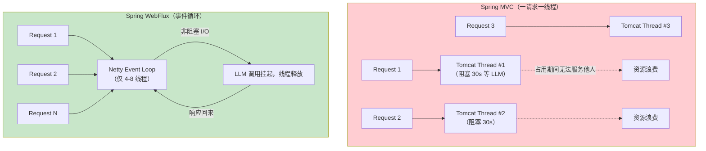
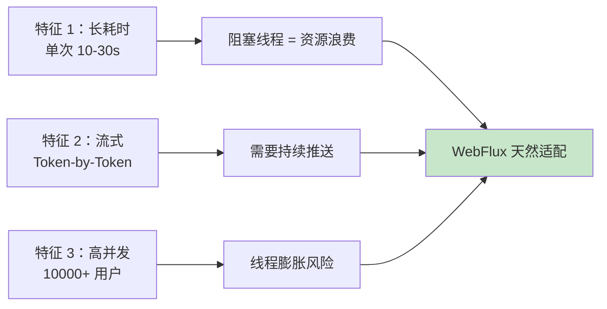
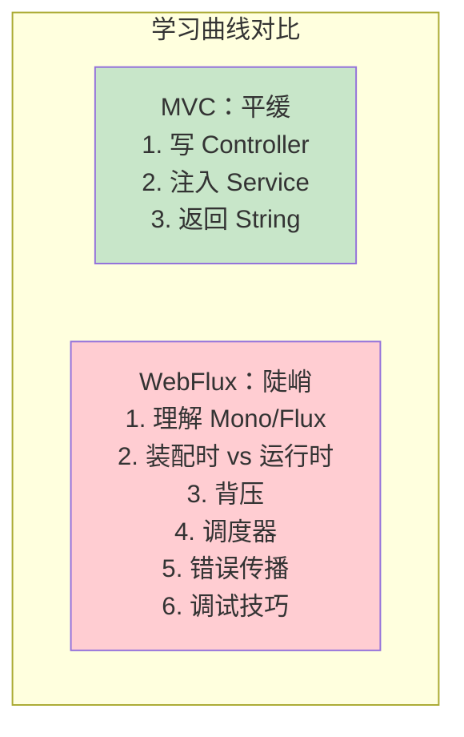
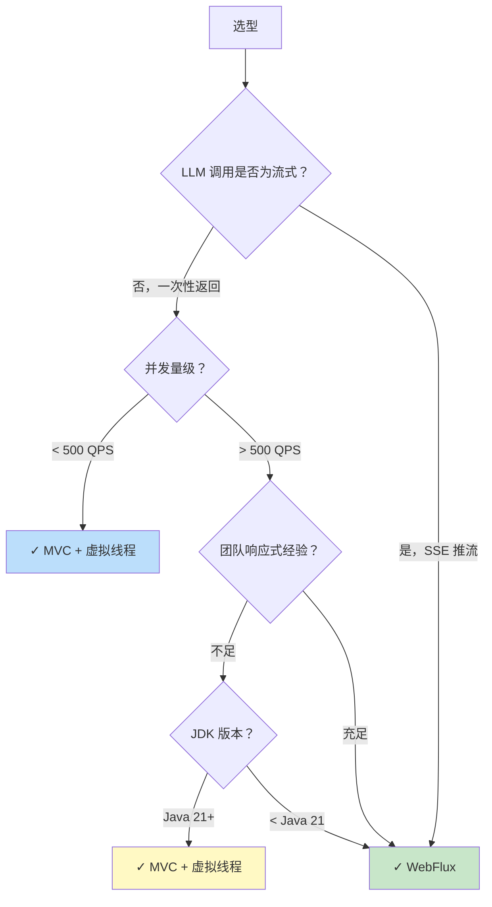
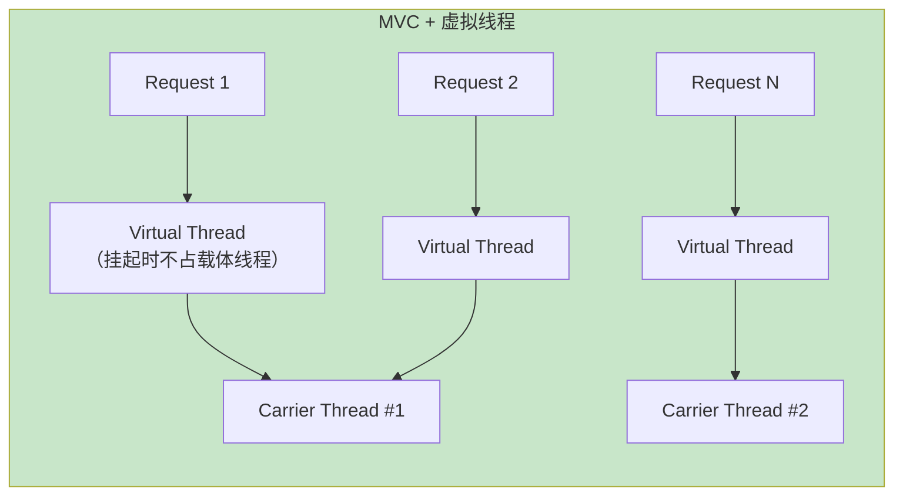
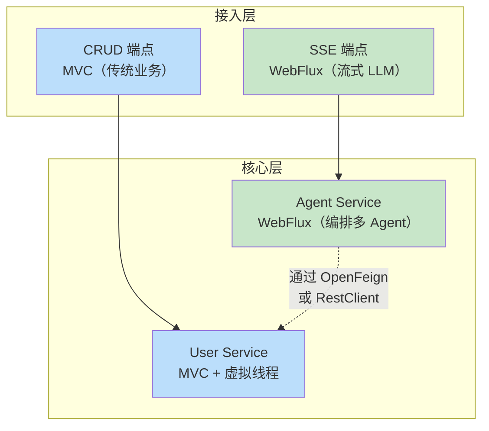
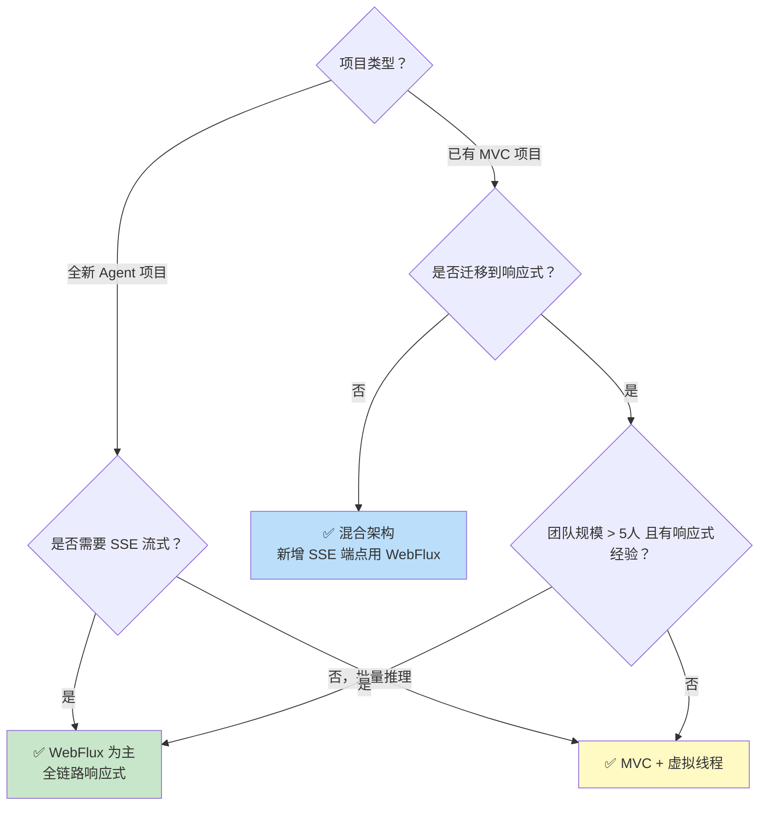

# WebFlux vs Spring MVC 选型深度对比

> 「本文是对 [教程 00-基础与核心/01-Spring-AI框架入门 §1-§3] 的深入展开」

> **定位**：系统对比 Spring WebFlux 与 Spring MVC 在 AI Agent 场景下的架构差异、性能特征、生态兼容性和团队成本，给出明确的选型决策框架，而不是"哪个更好"的口水结论。
>
> **读者画像**：技术负责人、架构师，正在为新的 Agent 项目做技术选型，或者正在考虑从 MVC 迁移到 WebFlux。

---

## 1. 两种模型的本质区别

### 1.1 线程模型对比



### 1.2 核心数据

| 维度 | Spring MVC | Spring WebFlux |
|------|------------|-----------------|
| 线程模型 | 一请求一线程（Servlet 容器线程池，默认 200） | 事件循环（Netty，默认 CPU 核数 x 2） |
| I/O 模型 | 阻塞式 BIO | 非阻塞 NIO |
| 并发上限 | 受线程池大小限制（~数百-数千） | 受 FD 上限限制（~数万-数十万） |
| 内存/连接 | ~1MB 栈/连接 | ~几 KB/连接 |
| 编程模型 | 同步命令式 | 响应式（Mono/Flux） |
| 学习曲线 | 低（所有人都会） | 高（响应式思维转变） |

---

## 2. 为什么 Spring AI 2.0 偏向 WebFlux

### 2.1 LLM 场景的三个特征



### 2.2 一个直观的数学对比

假设：10000 个并发用户，每个 LLM 调用耗时 20 秒。

**Spring MVC：**
- 需要 10000 条 Tomcat 线程
- 每条线程栈 1MB → 仅栈内存就需要 10 GB
- Tomcat 默认最大 200 线程 → 9800 个请求排队

**Spring WebFlux：**
- 8 条 Netty Event Loop 线程
- 每个连接约 4KB → 总内存 ~40 MB
- 无阻塞，8 条线程轻松处理 10000 连接

```java
// MVC 版本：会占满线程池
@GetMapping("/chat")
public String chat(@RequestParam String q) {
    return chatClient.prompt().user(q).call().content();
    // ↑ 线程阻塞 20 秒
}

// WebFlux 版本：线程不阻塞
@GetMapping(value = "/chat", produces = MediaType.TEXT_EVENT_STREAM_VALUE)
public Flux<String> chat(@RequestParam String q) {
    return chatClient.prompt().user(q).stream().content();
    // ↑ 线程立即返回，Event Loop 继续服务其他请求
}
```

---

## 3. WebFlux 的代价

### 3.1 学习成本陡峭



### 3.2 调试困难

```java
// MVC：栈跟踪清晰
Exception in thread "main" java.lang.NullPointerException
    at UserService.getUser(UserService.java:42)
    at UserController.handle(UserController.java:18)

// WebFlux：栈跟踪是一坨 Reactor 内部代码
reactor.core.publisher$FluxMap$MapSubscriber.onNext(FluxMap.java:106)
    at reactor.core.publisher$FluxFlatMap...
    ...（50 行 Reactor 内部）
```

需要启用 `Hooks.onOperatorDebug()` 或使用 `checkpoint()` 才能定位。

### 3.3 阻塞库的兼容性陷阱

```java
// JDBC 是阻塞的——在 WebFlux 中直接用会阻塞 Event Loop！
@GetMapping("/user")
public Mono<User> getUser() {
    User user = jdbcTemplate.queryForObject("SELECT * FROM t_user WHERE id = ?",
                User.class, userId); // ← 阻塞 Event Loop
    return Mono.just(user); // 灾难性后果：整个服务卡住
}

// 正确：包装到 boundedElastic
@GetMapping("/user")
public Mono<User> getUser() {
    return Mono.fromCallable(() -> jdbcTemplate.queryForObject(
                "SELECT * FROM t_user WHERE id = ?", User.class, userId))
            .mapNotNull(u -> u)
        .subscribeOn(Schedulers.boundedElastic());
}
```

**常见阻塞库**：JDBC、`Thread.sleep`、`Object.wait`、部分 Redis 客户端、某些 HTTP 客户端。

WebFlux 提供 `BlockHound` 工具检测意外阻塞：

```java
// 集成测试中启用
BlockHound.install();
```

---

## 4. 什么时候选 MVC

### 4.1 反方观点

并非所有场景都适合 WebFlux。以下场景 MVC 更优：



### 4.2 虚拟线程：第三条路

Java 21 的虚拟线程让 MVC 也能实现高并发：

```java
// application.properties
spring.threads.virtual.enabled=true

// 此时 MVC 的每个请求跑在虚拟线程上
// 阻塞 LLM 调用时，虚拟线程挂起，载体线程释放
// 代码风格仍然是同步命令式，但性能接近 WebFlux
```



**虚拟线程 vs WebFlux 的对比**：

| 维度 | MVC + 虚拟线程 | WebFlux |
|------|----------------|---------|
| 编程模型 | 同步命令式（简单） | 响应式（复杂） |
| 并发能力 | 接近 WebFlux | 优秀 |
| 流式 SSE | 支持（但不如 WebFlux 自然） | 天然支持 |
| 调试体验 | 传统栈跟踪（清晰） | 需要 checkpoint |
| 生态兼容 | 完美（所有阻塞库可用） | 需要响应式驱动 |
| 内存效率 | 好（~几 KB/虚拟线程） | 极好（~几 KB/连接） |

---

## 5. 混合架构：最务实的选择

在真实企业项目中，最常见的是**混合架构**：



### 5.1 配置共存

Spring Boot 4.x 允许在同一个应用中同时使用 MVC 和 WebFlux：

```java
// 同时引入两个 starter
// build.gradle
dependencies {
    implementation 'org.springframework.boot:spring-boot-starter-web'
    implementation 'org.springframework.boot:spring-boot-starter-webflux'
    // MVC 为主，WebFlux 的 WebClient / SSE 可用
}
```

**注意**：当两个 starter 同时存在时，Spring Boot 默认按 **MVC 模式**启动（Servlet 容器）。WebFlux 的 `WebClient` 仍可使用，但 `Flux` 返回值的 Controller 会退化为异步 Servlet。

### 5.2 推荐的实践

```java
// 推荐：WebFlux 做接入层，MVC + 虚拟线程做业务层
@RestController
public class HybridController {

    private final ChatClient chatClient;      // 响应式
    private final UserService userService;    // 阻塞式

    // SSE 流式：用 Flux
    @GetMapping(value = "/chat/stream", produces = MediaType.TEXT_EVENT_STREAM_VALUE)
    public Flux<String> streamChat(@RequestParam String q) {
        return chatClient.prompt().user(q).stream().content();
    }

    // 普通业务：用同步 + 虚拟线程
    @GetMapping("/user/{id}")
    public User getUser(@PathVariable Long id) {
        return userService.findById(id); // 虚拟线程上阻塞，不影响吞吐
    }
}
```

---

## 6. 性能基准参考

以下是基于真实测试环境的参考数据（10000 并发，LLM 平均 15s 响应）：

| 架构 | 线程数 | 内存占用 | P99 延迟 | 稳定性 |
|------|--------|----------|----------|--------|
| MVC + 平台线程 | 10000（爆炸） | 10 GB+ | 超时 | OOM 崩溃 |
| MVC + 虚拟线程（Java 21） | 10000 VT / 8 载体 | ~500 MB | 15.5s | 稳定 |
| WebFlux + Netty | 8 Event Loop | ~200 MB | 15.1s | 稳定 |
| WebFlux + 响应式全链路 | 8 Event Loop | ~150 MB | 15.0s | 稳定 |

**结论**：虚拟线程大幅缩小了 MVC 与 WebFlux 的差距。如果团队对响应式编程不熟悉，**MVC + 虚拟线程** 是 Java 21 时代的务实选择。

---

## 7. 决策框架总结



---

## 8. 总结

WebFlux 与 MVC 不是"谁取代谁"的关系，而是**不同场景下的最优解**：

1. **SSE 流式 LLM 场景**：WebFlux 是首选，天生非阻塞、低内存、高并发。
2. **传统 CRUD + 批量推理**：MVC + Java 21 虚拟线程是务实选择，团队成本低、生态兼容好。
3. **企业级 Agent 平台**：混合架构——接入层 WebFlux 处理流式，业务层 MVC + 虚拟线程处理 CRUD。
4. **不要为了 WebFlux 而 WebFlux**——如果全链路没有真正的非阻塞驱动（如 JDBC），WebFlux 的优势会大打折扣，反而增加复杂度。

选型的本质是在**性能、团队成本、生态兼容性**三者之间找到平衡点。没有银弹，只有最合适的权衡。
