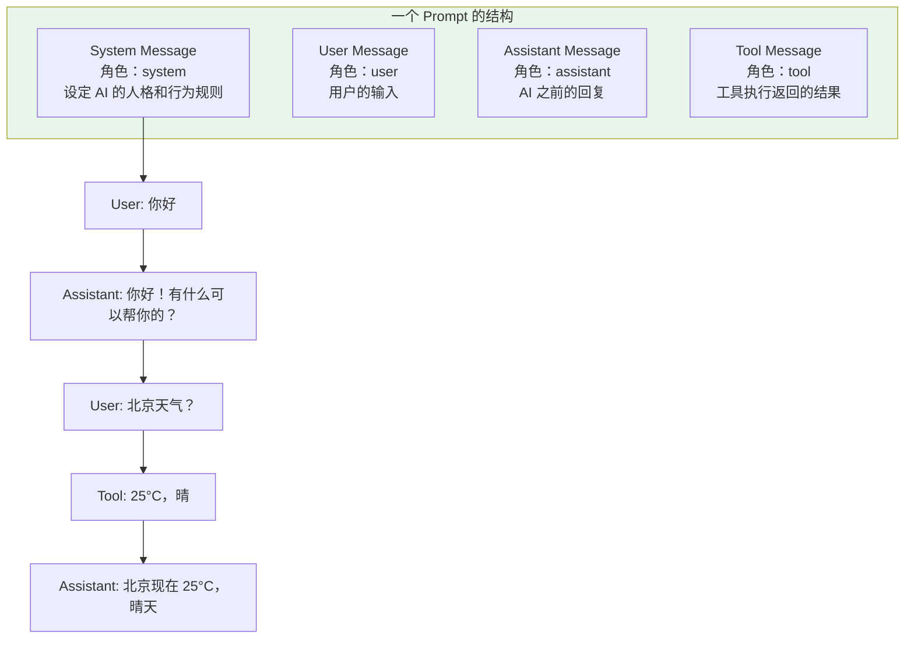
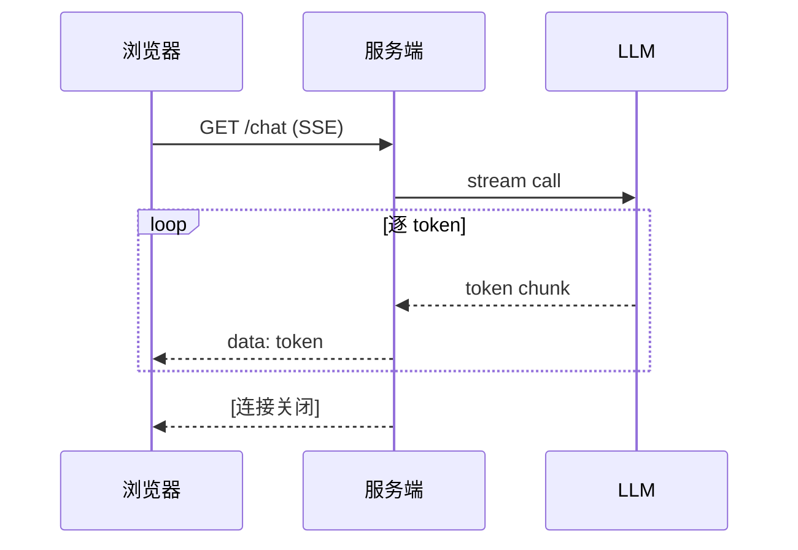

# 02-ChatClient 与对话模型

> **定位**：深入 ChatClient API 的每个细节——Prompt 构建、System/User Message、模板变量、同步/流式调用、结构化输出。读完这篇，你能熟练使用 ChatClient 完成任何对话交互。
>
> **读者画像**：已经搭建了 Spring AI 项目，需要深入理解 ChatClient API 的开发者。
>
> **前置阅读**：[01-Spring AI 框架入门](01-Spring-AI框架入门.md)。

---

## 1. Prompt 的本质

在深入 ChatClient 之前，先搞清楚 Prompt 到底是什么。

LLM 的 API 接收的不是"一段字符串"，而是一组**带角色的消息**。每条消息有一个角色（role）：



| 角色 | 作用 | 在 ChatClient 中设置 |
|------|------|---------------------|
| **system** | 全局指令，告诉 LLM"你是谁、该怎么做" | `.system()` / `.defaultSystem()` |
| **user** | 用户的提问 | `.user()` |
| **assistant** | LLM 之前的回复（多轮对话历史） | 由 Memory Advisor 自动注入 |
| **tool** | 工具执行结果 | 由 ToolCallingAdvisor 自动注入 |

---

## 2. ChatClient 创建方式

### 2.1 自动配置注入（推荐）

```java
@RestController
public class MyController {

    private final ChatClient chatClient;

    // 注入 ChatClient.Builder（prototype 作用域）
    public MyController(ChatClient.Builder builder) {
        this.chatClient = builder.build();
    }
}
```

`ChatClient.Builder` 是 Spring Boot 自动配置的 Bean，会自动接入可观测性和自定义器。

### 2.2 带默认配置创建

```java
@Configuration
public class ChatClientConfig {

    @Bean
    ChatClient chatClient(ChatClient.Builder builder) {
        return builder
                .defaultSystem("你是一个专业的 Java 架构师助手，回答简洁准确。")
                .defaultOptions(OpenAiChatOptions.builder()
                        .temperature(0.3)  // 低温度=更确定
                        .maxTokens(2000))   // Spring AI 2.0.0：defaultOptions 直接收 Builder（不带 .build()）
                .build();
    }
}
```

设置了 `defaultSystem` 后，后续每次调用只需提供 user 消息：

```java
// 不需要每次重复 system 消息
String answer = chatClient.prompt()
        .user("什么是响应式编程？")
        .call()
        .content();
```

### 2.3 多 ChatClient 实例

不同场景用不同的系统提示和模型配置：

```java
@Configuration
public class MultiChatClientConfig {

    @Bean
    @Primary
    ChatClient generalClient(ChatClient.Builder builder) {
        return builder
                .defaultSystem("你是一个通用助手")
                .build();
    }

    @Bean
    ChatClient codeReviewClient(ChatClient.Builder builder) {
        return builder
                .defaultSystem("你是一个严格的代码审查专家，逐行检查代码问题")
                .defaultOptions(OpenAiChatOptions.builder()
                        .temperature(0.0)  // 代码审查需要确定性
                        )
                .build();
    }
}
```

> **注意**：当需要完全不同的 `ChatModel`（如一个 OpenAI、一个 Anthropic）时，必须使用 `ChatClientBuilderConfigurer` 来保留可观测性。详见 [Spring AI ChatClient 文档](https://docs.spring.io/spring-ai/reference/api/chatclient.html)。

---

## 3. System Message：定义 Agent 人格

System Message 是 Prompt 中最重要的部分——它定义了 Agent 的"人格"、行为规则、输出格式。

### 3.1 基本用法

```java
// 方式一：构建时设置默认值
ChatClient client = ChatClient.builder(chatModel)
        .defaultSystem("你是客服助手，只回答产品相关问题，不回答无关问题")
        .build();

// 方式二：每次调用时覆盖
String answer = chatClient.prompt()
        .system("你现在是一个严厉的代码审查官")
        .user("帮我看看这段代码")
        .call()
        .content();
```

### 3.2 带参数的 System Message

```java
// 配置时定义模板
@Bean
ChatClient chatClient(ChatClient.Builder builder) {
    return builder
            .defaultSystem("你是{company}的{role}，回答风格{style}")
            .build();
}

// 运行时填充参数
String answer = chatClient.prompt()
        .system(s -> s
                .param("company", "阿里巴巴")
                .param("role", "高级架构师")
                .param("style", "严谨专业"))
        .user("微服务怎么拆分")
        .call()
        .content();
```

### 3.3 System Message 最佳实践

**✅ 好的 System Message**：

```
你是一个专业的客服助手，遵循以下规则：
1. 只回答与公司产品相关的问题
2. 如果用户问无关问题，礼貌引导回产品话题
3. 不确定的信息要明确告知用户"我需要确认"
4. 回答使用中文，语气友好专业
5. 如果需要查询订单，引导用户提供订单号
```

**❌ 坏的 System Message**：

```
你是一个助手。
```

区别在于：好的 System Message 包含**明确的行为规则和边界约束**，不只是"你是什么角色"。

> **想深入？→ [附录 02-Prompt工程/00-Prompt设计模式.md]**：Few-shot、CoT、Self-consistency 等 Prompt 设计模式。

---

## 4. User Message：用户输入与模板

### 4.1 简单文本

```java
String answer = chatClient.prompt()
        .user("什么是 Java 21 的虚拟线程？")
        .call()
        .content();
```

### 4.2 带变量的模板

Spring AI 使用 StringTemplate 作为默认模板引擎，变量用 `{变量名}` 标记：

```java
String answer = chatClient.prompt()
        .user(u -> u
                .text("解释 {concept} 在 {context} 中的应用")
                .param("concept", "响应式编程")
                .param("context", "AI Agent 开发"))
        .call()
        .content();
```

### 4.3 处理 JSON 内容

当 Prompt 中需要包含 JSON 数据时，`{}` 语法会和 JSON 的花括号冲突。解决方案是自定义分隔符：

```java
String json = "{\"name\":\"张三\",\"age\":25}";

String answer = chatClient.prompt()
        .user(u -> u
                .text("分析这个用户数据： <data>")
                .param("data", json))
        .templateRenderer(StTemplateRenderer.builder()
                .startDelimiterToken('<')
                .endDelimiterToken('>')
                .build())
        .call()
        .content();
```

---

## 5. 同步调用 vs 流式调用

### 5.1 同步调用（`call()`）

```java
// Spring AI 2.0.0
import org.springframework.ai.chat.model.ChatResponse;
import org.springframework.ai.chat.metadata.Usage;

// 等待 LLM 完整回复后返回
String content = chatClient.prompt()
        .user("写一个冒泡排序")
        .call()
        .content();

// 获取完整的 ChatResponse（含 metadata）
ChatResponse response = chatClient.prompt()
        .user("写一个冒泡排序")
        .call()
        .chatResponse();

// 从 metadata 中提取 Token 使用量
// javap 实证：Usage 真实方法为 getPromptTokens()/getCompletionTokens()/getTotalTokens()
Usage usage = response.getMetadata().getUsage();
System.out.println("输入 Token: " + usage.getPromptTokens());
System.out.println("输出 Token: " + usage.getCompletionTokens());
```

### 5.2 流式调用（`stream()`）

```java
// 流式返回——逐 token 输出
Flux<String> stream = chatClient.prompt()
        .user("写一个冒泡排序")
        .stream()
        .content();

// 流式返回 ChatResponse（含每个 chunk 的 metadata）
Flux<ChatResponse> stream = chatClient.prompt()
        .user("写一个冒泡排序")
        .stream()
        .chatResponse();
```

### 5.3 流式 + 前端 SSE 对接

```java
@GetMapping(value = "/chat", produces = "text/event-stream")
public Flux<ServerSentEvent<String>> chat(@RequestParam String message) {
    return chatClient.prompt()
            .user(message)
            .stream()
            .content()
            .map(chunk -> ServerSentEvent.<String>builder()
                    .data(chunk)
                    .build());
}
```



> **遇到阻塞？→ [教程 10-SSE流式通信]**：WebFlux SSE 完整实现、断线重连、前端 EventSource 对接。

---

## 5.5 调用的失效模式与错误处理（企业级必修）

demo 示例从不告诉你 LLM 调用会怎么坏。生产里 ChatClient 的失效有五类，处置各不相同：

| 失效 | 表现 | 处置 |
|------|------|------|
| 限流/配额 | 429、Retry-After 头 | `retryWhen(Retry.backoff(...))` 指数退避，尊重服务端头 |
| 超时 | 无响应挂死 | 构建期配 `timeout`（WebClient/HttpClient 层），不要裸等 |
| 内容截断 | `finishReason=length` | 检查 `ChatResponse.getResult().getMetadata().getFinishReason()`，截断≠完成，要续写或报错 |
| 流中断 | `stream()` 中途 onError | 流式部分结果要决定"保留部分输出+标注"还是整体重试——见教程 42 |
| 模型过载/降级 | 5xx | 降级路由（教程 32），不要原地重试打爆 |

```java
// 流式 + 退避重试 + 部分结果保护的骨架（Spring AI 2.0.0 / WebFlux）
Flux<String> safe = chatClient.prompt().user(q).stream().content()
    .retryWhen(Retry.backoff(2, Duration.ofSeconds(1))
        .filter(e -> e instanceof WebClientResponseException.TooManyRequests))
    .onErrorResume(e -> Flux.just("（生成中断，已保留部分内容）")); // 业务决策：保部分
```

> **遇到阻塞？→ [教程 42-响应式错误处理]**：onErrorResume/onErrorMap/retryWhen 的完整语义与流中断恢复。

## 6. 结构化输出：让 LLM 返回 Java 对象

LLM 默认返回纯文本字符串。但企业级应用通常需要结构化数据（POJO / JSON）。

### 6.1 entity() — 直接映射 POJO

```java
// 定义返回类型
public record Filmography(String actor, List<String> movies) {}

// LLM 输出直接映射为 Java 对象
Filmography result = chatClient.prompt()
        .user("生成一个演员的电影作品列表")
        .call()
        .entity(Filmography.class);

// result.actor() = "Tom Hanks"
// result.movies() = ["Forrest Gump", "Cast Away", ...]
```

Spring AI 在底层自动做了三件事：
1. 根据 `Filmography.class` 生成 JSON Schema
2. 将 Schema 作为指令追加到 Prompt 中
3. 将 LLM 返回的 JSON 字符串反序列化为 Java 对象

### 6.2 返回集合

```java
List<Filmography> result = chatClient.prompt()
        .user("生成 5 个演员的电影作品列表")
        .call()
        .entity(new ParameterizedTypeReference<List<Filmography>>() {});
```

### 6.3 Schema 验证 + 自动重试（Spring AI 2.0 新特性）

`entity(Class, Consumer<EntityParamSpec>)` 是真实重载（javap 实证），`EntityParamSpec` 提供 `validateSchema()` 与 `useProviderStructuredOutput()`：

```java
// Spring AI 2.0.0
import org.springframework.ai.chat.client.advisor.StructuredOutputValidationAdvisor;

// 方式一：entity(Class, spec) + validateSchema() —— 按 Class 生成 JSON Schema 并校验
Filmography result = chatClient.prompt()
        .user("生成一个演员的电影作品列表")
        .call()
        .entity(Filmography.class, spec -> spec.validateSchema());
```

要"校验失败自动重试"，挂 `StructuredOutputValidationAdvisor`（javap 实证：`builder().outputType(Type).maxRepeatAttempts(int)`）：

```java
// 方式二：StructuredOutputValidationAdvisor 显式开启 Schema 校验 + 重试
ChatClient client = ChatClient.builder(chatModel)
        .defaultAdvisors(StructuredOutputValidationAdvisor.builder()
                .outputType(Filmography.class)  // 输出目标类型
                .maxRepeatAttempts(2)           // 校验失败自动重试最多 2 次
                .build())
        .build();
```

> **遇到阻塞？→ [教程 13-结构化输出]**：JSON Schema、BeanOutputConverter、Provider Native Structured Output。

---

## 7. Prompt 模板管理

### 7.1 外部化 Prompt

生产环境中，Prompt 不应该硬编码在 Java 代码里。Spring AI 支持从资源文件加载：

```java
// 从 classpath 加载 Prompt 模板
@Bean
ChatClient chatClient(ChatClient.Builder builder) {
    return builder
            .defaultSystem(new ClassPathResource("prompts/customer-service.st"))
            .build();
}
```

`src/main/resources/prompts/customer-service.st`：

```
你是 {company} 的客服助手。
你的职责是回答用户关于 {product} 的问题。
回答规则：
- 语气友好专业
- 不确定的信息明确告知
- 涉及订单查询时引导用户提供订单号
```

### 7.2 运行时使用模板

```java
String answer = chatClient.prompt()
        .system(s -> s
                .text(new ClassPathResource("prompts/customer-service.st"))
                .param("company", "某某科技")
                .param("product", "智能客服系统"))
        .user(userMessage)
        .call()
        .content();
```

> **想深入？→ [附录 02-Prompt工程/01-Prompt模板管理.md]**：模板版本管理、A/B 测试、灰度发布。

---

## 8. 运行时覆盖默认配置

ChatClient 的所有 `default*` 配置都可以在运行时覆盖：

```java
// 构建时设置默认值
ChatClient client = ChatClient.builder(chatModel)
        .defaultSystem("你是通用助手")
        .defaultOptions(OpenAiChatOptions.builder().temperature(0.7))   // 2.0.0：传 Builder，不带 .build()
        .build();

// 运行时覆盖
String answer = client.prompt()
        .system("你现在是一个 Python 专家")  // 覆盖 defaultSystem
        .options(OpenAiChatOptions.builder()
                .temperature(0.0)  // 覆盖 temperature
                .model("deepseek-reasoner"))  // 切换模型（2.0.0：options 同样收 Builder）
        .user("写一个快速排序")
        .call()
        .content();
```

---

## 8.5 边界情况与常见误区（踩坑清单）

1. **ChatClient 是线程安全的，但带状态的 Advisor 链不是自动安全**——自定义 Advisor 里放可变字段（计数器/缓存）时，多请求并发共享同一实例；计数要用原子类型，上下文要走 Reactor Context（教程 26）。
2. **多轮上下文不会自动带上**——ChatClient 每次调用都是无状态的；"多轮对话"要靠 `MessageChatMemoryAdvisor`（教程 04/12），新手最常以为框架帮你记住了历史。
3. **上下文长度是硬预算**——System+历史+工具 Schema+用户输入全算 token；超长不是报错而是静默截断或 400。工具多时 Schema 占用惊人（教程 34 的五层预算分配）。
4. **`entity()` 失败的三种形态**——模型输出夹带 markdown 代码围栏、字段名对不上 Schema、返回了合法 JSON 但语义错（Schema 校验抓不住第三种，需要业务断言）。
5. **Builder 是 prototype 的**——`ChatClient.Builder` 每次注入都是新实例，所以"配置多个不同默认值的 client"互不污染；但不要把 Builder 当单例缓存复用。
6. **temperature 不是"创意旋钮"是分布形状**——0.0 也不保证完全确定（采样实现差异）；要确定性输出用结构化输出+校验，别指望温度。

## 9. 适用场景与不适用场景

### ✅ 适用场景

- 对话型交互（问答、聊天、咨询）
- 结构化数据提取（从文本中提取实体）
- 内容生成（文案、代码、摘要）
- 分类与判断（情感分析、意图识别）

### ❌ 不适用场景

- 需要精确数学计算（用工具而不是让 LLM 算）
- 需要检索大量文档（用 RAG 而不是塞进 Prompt）
- 需要实时数据（用工具调用 API 而不是问 LLM）

---

## 10. 本章总结

| 概念 | 一句话 |
|------|--------|
| **Prompt** | 不是一段字符串，而是带角色的消息序列（system / user / assistant / tool） |
| **System Message** | 定义 Agent 人格和行为规则，是 Prompt 中最重要的部分 |
| **call()** | 同步调用，等待完整回复 |
| **stream()** | 流式调用，逐 token 返回 `Flux<String>` |
| **entity()** | 结构化输出，LLM 回复直接映射为 Java 对象 |
| **模板引擎** | StringTemplate，`{变量}` 语法，支持外部化 Prompt 文件 |
| **默认配置** | `default*` 系列方法设置默认值，运行时可覆盖 |
| **失效模式** | 限流退避/超时/截断检查/流中断保部分/降级路由五类各有处置 |
| **无状态** | 多轮记忆靠 Memory Advisor，框架不自动记历史 |

**下一篇**：[03-工具调用](03-工具调用.md) — Function Calling、@Tool 注解、工具注册与发现。

---

> **想深入？→ [附录 03-Spring-AI源码解析/00-ChatClient源码.md]**：ChatClient 内部执行链的源码级解析。
> **想深入？→ [附录 02-Prompt工程/00-Prompt设计模式.md]**：Few-shot、CoT 等 Prompt 工程高级模式。
