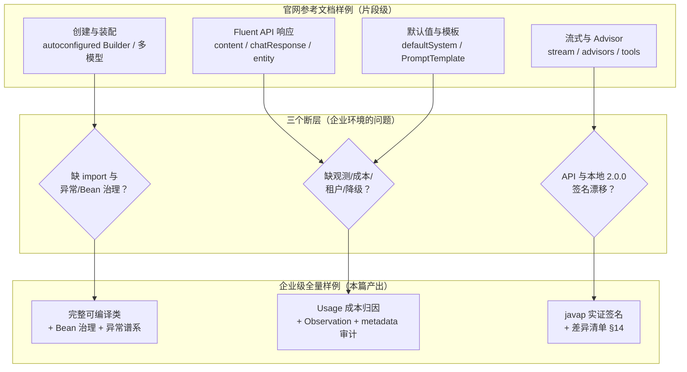
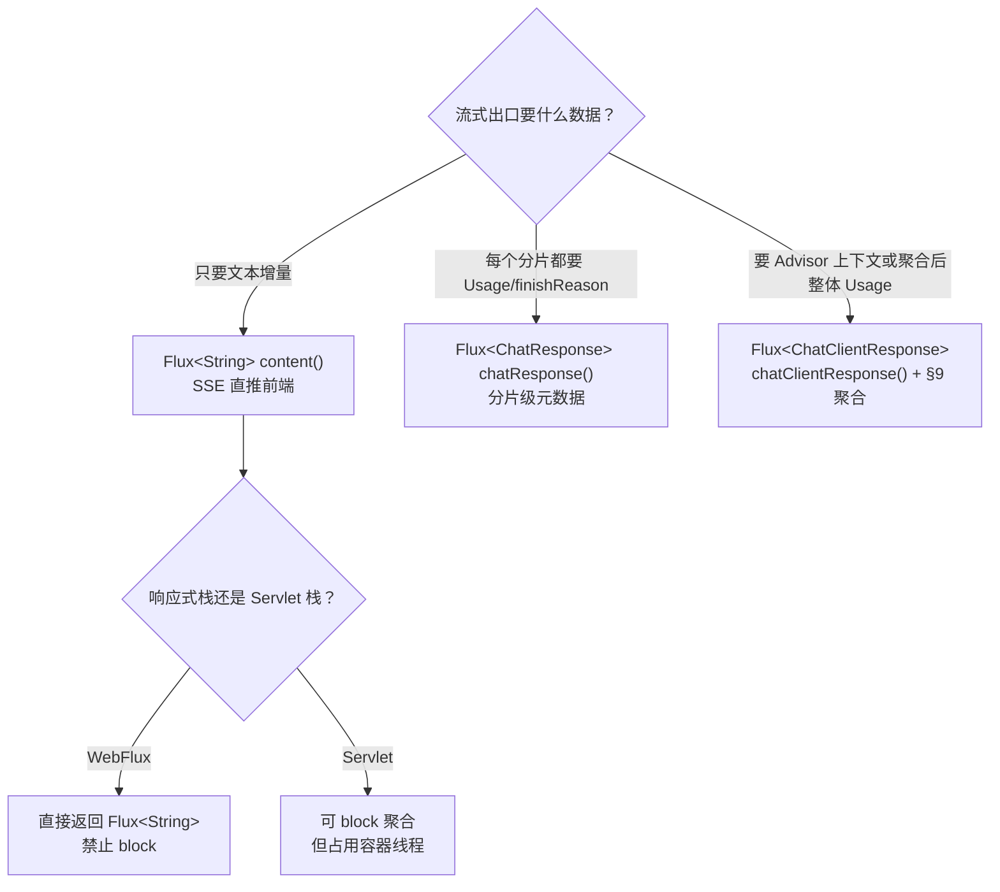
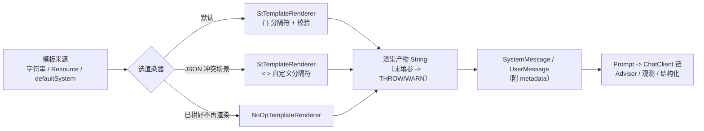
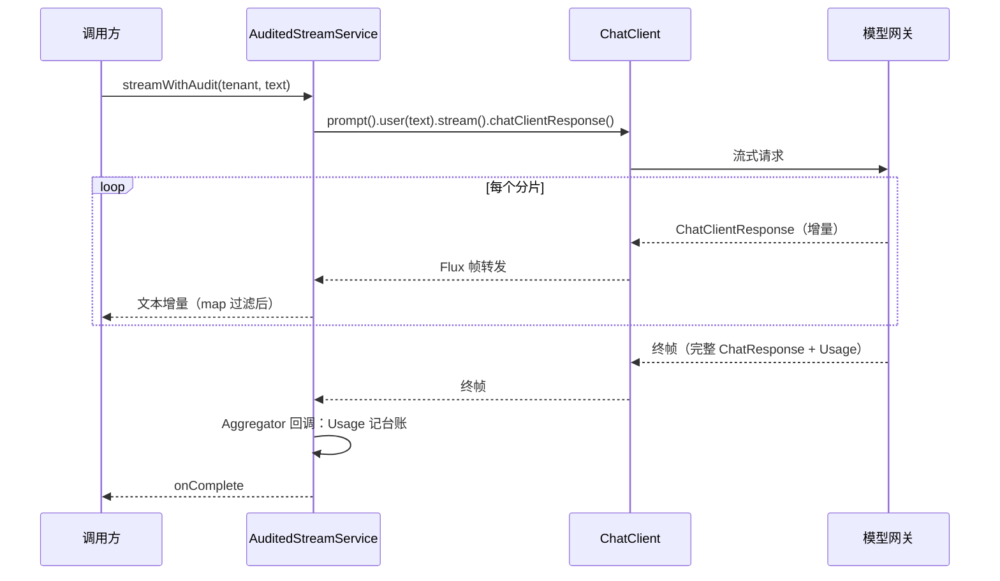

# 06 ChatClient 企业级全量样例

> **定位**：以 Spring AI 官方参考文档（Chat Client API 与 Prompts 两章，与本地锁定的 2.0.0 版本对齐）为纲，把官网每一个样例都升级为**企业级全量写法**——从零到可运行、含完整 import、一行不缺。覆盖：创建与装配（单模型/多模型/多端点）、响应解包全家桶（`call()` 六类返回值 + `stream()` 三类返回值）、System/User 全量写法与 message metadata、PromptTemplate 全量（含 List/Map 嵌套渲染与自定义分隔符）、运行时 ChatOptions 动态覆盖、多媒体 Resource 注入、多 Advisor 组合、流式+结构化组合、`mutate()` 派生多租户 client、异常谱系与降级。每一个 API 都经过本地 jar 反编译实证（javap），官网文档与本地 2.0.0 不一致的写法全部标注。读完这一篇，官网参考文档里的每一个片段你都能落成生产代码。
>
> **读者画像**：已掌握 ChatClient 基本用法的中高级 Java 开发者；正在把 demo 级 ChatClient 代码升级为带观测、多租户、成本控制、降级的读者；需要一份"官网样例 → 生产代码"对照手册的架构师。
>
> **前置阅读**：[教程 00-基础与核心/02-ChatClient与对话模型](../00-基础与核心/02-ChatClient与对话模型.md)（ChatClient 基础概念）；[教程 02-SpringAI核心机制/04-结构化输出](04-结构化输出.md)（`entity()` 原理）；Advisor 机制详解见 [教程 02-SpringAI核心机制/01-Advisor链与拦截器 §2]。

---

## 1. 这一篇解决什么问题

### 1.1 官网样例与生产代码之间的三个断层

Spring AI 官方参考文档的 Chat Client API 一章质量很高，但直接照抄到企业项目会踩三个断层：

1. **片段化**：官网样例多为三五行片段，没有 import、没有异常处理、没有资源管理，甚至没有 `@Primary`/`@Qualifier` 这类多 Bean 场景的必需注解——比如官网的"两个 ChatClient Bean"样例直接注入会启动失败。
2. **缺失企业关注点**：官网不讲成本计量、租户隔离、降级链、审计 metadata、多环境配置——这些恰恰是生产 Agent 系统的主战场。
3. **文档版本漂移**：`docs.spring.io` 上不带版本号的 reference 页面始终指向最新 `main` 分支，其中部分 API（如 `defaultOptions` 的参数类型、ChatMemory 官方仓库列表）与本地锁定的 2.0.0 jar **并不一致**。本项目 API 真实性铁律 0 要求一切以本地 jar 反编译为准——本文所有 API 均已通过 `javap` 对本地 `spring-ai-client-chat-2.0.0.jar`、`spring-ai-model-2.0.0.jar` 等 6 个 jar 实证，冲突点集中在 §14 列出。

### 1.2 本篇与兄弟篇的分工

| 主题 | 在哪里讲透 | 本篇怎么处理 |
|------|-----------|-------------|
| ChatClient 是什么、三种消息、流式原理 | [教程 00-基础与核心/02-ChatClient与对话模型] | 概念从简，样例全量 |
| Advisor 洋葱模型、Order、自定义 Advisor | [教程 02-SpringAI核心机制/01-Advisor链与拦截器] | 只讲组合与治理 |
| 结构化输出原理、BeanOutputConverter 底层 | [教程 02-SpringAI核心机制/04-结构化输出] | 只讲流式组合与可靠性开关 |
| SSE 断线重连、前端对接 | [教程 02-SpringAI核心机制/06-SSE流式通信 §4] | 不展开 |
| 工具 `@Tool` 定义与 ToolCallingManager | [教程 02-SpringAI核心机制/05-工具调用进阶与ToolCallingManager] | 只讲 ChatClient 侧的注册与自动装配治理 |

### 1.3 改造全景图

本篇的推进路线：每一章拿官网的一段样例，先指出它在企业环境的问题，再给出全量改造版。



---

## 2. ChatClient 的创建与装配

对应官网 *Creating a ChatClient* 一节。官网给了四种姿势：自动配置 Builder、单模型多 ChatClient、多模型类型、多 OpenAI 兼容端点。逐一升级。

### 2.1 自动配置注入（官网样例 → 企业级）

官网原样例（片段）：

```java
@RestController
class MyController {
    private final ChatClient chatClient;
    public MyController(ChatClient.Builder chatClientBuilder) {
        this.chatClient = chatClientBuilder.build();
    }
    @GetMapping("/ai")
    String generation(String userInput) {
        return this.chatClient.prompt().user(userInput).call().content();
    }
}
```

它依赖 `spring-ai-autoconfigure-model-chat-client` 自动装配的 `ChatClient.Builder` Bean（实证：`ChatClientAutoConfiguration` 存在于本地 jar，包名为 `org.springframework.ai.model.chat.client.autoconfigure`）。企业级改造点：**Controller 不直接持有 ChatClient，交给 Service 层**；Builder 在一个 `@Configuration` 里统一装配并挂上默认 Advisor，Controller 只依赖 Service。下面是完整可编译版本：

```java
// Spring AI 2.0.0
package com.example.agent;

import org.springframework.ai.chat.client.ChatClient;
import org.springframework.ai.chat.client.advisor.SimpleLoggerAdvisor;
import org.springframework.ai.chat.model.ChatModel;
import org.springframework.context.annotation.Bean;
import org.springframework.context.annotation.Configuration;

@Configuration
public class ChatClientConfig {

    /**
     * 自动配置已提供 ChatClient.Builder（单模型场景），
     * 这里在 Builder 上统一挂企业级默认值后构建唯一 ChatClient Bean。
     * SimpleLoggerAdvisor 挂在链尾（order 最大），先于业务 Advisor 记录最终请求。
     */
    @Bean
    ChatClient chatClient(ChatClient.Builder builder) {
        return builder
                .defaultAdvisors(SimpleLoggerAdvisor.builder().order(Integer.MAX_VALUE - 10).build())
                .build();
    }
}
```

`ChatCompletionService` 的完整实现在 §12。**为什么 Controller 不直接注入 ChatClient**：观测埋点、租户上下文、成本归因这些横切逻辑都发生在 Service 层，Controller 直接持有 ChatClient 会把 Advisor/参数拼接散落到端点里，无法统一治理；Web 层只剩一行 `chatCompletionService.complete(message)`（完整流式端点形态见 [教程 02-SpringAI核心机制/06-SSE流式通信 §9]）。

### 2.2 单模型多 ChatClient Bean（官网样例的隐性坑）

官网原样例：

```java
@Configuration
class ChatClientConfig {
    @Bean
    ChatClient defaultChatClient(ChatClient.Builder builder) {
        return builder.build();
    }
    @Bean
    ChatClient customChatClient(ChatClient.Builder builder) {
        return builder.defaultSystem("You are a helpful assistant.").build();
    }
}
```

两个 Bean 都叫 ChatClient 类型。**坑在注入侧**：后续 `@Autowired ChatClient` 会有两个候选，官网样例没有标注 `@Primary`，任何不加 `@Qualifier` 的注入点都会启动失败（`NoUniqueBeanDefinitionException`）。企业级改造：明确指定 `@Primary` + 语义化 Bean 名，注入处一律 `@Qualifier`：

```java
// Spring AI 2.0.0
package com.example.agent;

import org.springframework.ai.chat.client.ChatClient;
import org.springframework.ai.chat.prompt.ChatOptions;
import org.springframework.beans.factory.annotation.Qualifier;
import org.springframework.context.annotation.Bean;
import org.springframework.context.annotation.Configuration;

@Configuration
public class MultiChatClientConfig {

    @Bean
    @Primary
    ChatClient defaultChatClient(ChatClient.Builder builder) {
        return builder.build();
    }

    /**
     * JSON 严格模式客户端。defaultOptions 的本地 2.0.0 真实签名是
     * defaultOptions(ChatOptions.Builder) —— 接收 Builder 本身，不调用 build()
     * （官网文本写接收 ChatOptions 对象，与本地 jar 不符，见 §14）。
     */
    @Bean
    ChatClient strictJsonChatClient(ChatClient.Builder builder) {
        return builder
                .defaultSystem("You are a JSON-only assistant. Never output prose.")
                .defaultOptions(ChatOptions.builder().temperature(0.1))
                .build();
    }
}

// 注入侧（任何类中）：
// public RouterService(@Qualifier("defaultChatClient") ChatClient chatClient) { ... }
```

> **实证差异**：官网正文描述 `defaultOptions(ChatOptions chatOptions)` 接收 ChatOptions 对象，但本地 2.0.0 jar 的真实签名是 `defaultOptions(ChatOptions.Builder)`——**接收 Builder，不要调用 `build()`**。照官网写 `build()` 会在编译期报参数类型不匹配。差异全表见 §14。

### 2.3 多模型类型共存（官网大样例的简化路径）

官网为"OpenAI 与 Anthropic 两个 ChatModel 共存"给出的大样例：每个 Bean 注入 `ChatClientBuilderConfigurer`、`ObjectProvider<ObservationRegistry>`、两个 Convention 的 `ObjectProvider`、`ToolCallingAdvisor.Builder` 的 `ObjectProvider`，再用五参 `ChatClient.builder(chatModel, observationRegistry, chatClientConvention, advisorConvention, toolCallingAdvisorBuilder)` 手工装配。这段代码是对的（五参 builder 已实证存在于本地 jar），但它把每个读者都拖进自动配置的细节里。企业级实践中，**除非你要精确复刻自动配置的观测装配，否则推荐更简单的三参内默认写法**——先认识五参签名的每个槽位：

| 槽位 | 类型（已实证） | 作用 | 缺省行为 |
|------|--------------|------|---------|
| 1 | `ChatModel` | 底层模型 | 必填 |
| 2 | `ObservationRegistry` | ChatClient 请求级观测 | 不传则无观测 |
| 3 | `ChatClientObservationConvention` | 自定义观测键名 | 用默认约定 |
| 4 | `AdvisorObservationConvention` | Advisor 观测键名 | 用默认约定 |
| 5 | `ToolCallingAdvisor.Builder<?>` | 定制工具执行 Advisor | 自动注册默认版 |

企业级简化版（自动配置的 `ChatClientBuilderConfigurer` 已实证存在，其 `configure(builder)` 方法会把你的 `ChatClientCustomizer`/`ChatClientBuilderCustomizer` Bean 应用到 Builder 上——本例用 `ObjectProvider<ObservationRegistry>` 把观测注册表带进来，其余槽位走默认）：

```java
// Spring AI 2.0.0
package com.example.agent;

import io.micrometer.observation.ObservationRegistry;
import org.springframework.ai.chat.client.ChatClient;
import org.springframework.ai.chat.model.ChatModel;
import org.springframework.beans.factory.ObjectProvider;
import org.springframework.beans.factory.annotation.Qualifier;
import org.springframework.context.annotation.Bean;
import org.springframework.context.annotation.Configuration;
import org.springframework.context.annotation.Primary;

@Configuration
public class MultiModelClientConfig {

    @Bean
    @Primary
    public ChatClient openAiChatClient(ChatModel openAiChatModel,
                                       ObjectProvider<ObservationRegistry> observationRegistry) {
        // create 两参重载：ChatModel + ObservationRegistry（实证存在）
        return ChatClient.builder(openAiChatModel,
                        observationRegistry.getIfUnique(() -> ObservationRegistry.NOOP))
                .build();
    }

    @Bean
    public ChatClient deepSeekChatClient(@Qualifier("deepSeekChatModel") ChatModel deepSeekChatModel,
                                         ObjectProvider<ObservationRegistry> observationRegistry) {
        return ChatClient.create(deepSeekChatModel); // 单参 create：无观测
    }
}
```

> 多个 `ChatModel` Bean 共存时，自动配置的 `ChatClient.Builder` 会因无法决断而不装配或装配主模型——所以多模型场景**必须手工构建**，这正是官网大样例存在的意义。若你确实需要自动配置级的观测细节（Advisor 观测约定、ToolCallingAdvisor 定制），再回官网五参写法；日常多模型用上面两参版本足够。

### 2.4 多 OpenAI 兼容端点（Groq/DeepSeek 双端点）

官网 `MultiModelService` 样例演示了同一个 `OpenAiChatModel` 类、不同 `baseUrl`/`apiKey`/`model` 的双端点玩法。这在企业里最常见于 **DeepSeek/Groq/自建 vLLM 这类 OpenAI 兼容网关**。全量改造版（密钥全部环境变量化、Client 提为 Bean、日志走 SLF4J）：

```java
// Spring AI 2.0.0
package com.example.agent.endpoint;

import org.springframework.ai.chat.client.ChatClient;
import org.springframework.ai.openai.OpenAiChatModel;
import org.springframework.ai.openai.OpenAiChatOptions;
import org.springframework.context.annotation.Bean;
import org.springframework.context.annotation.Configuration;

@Configuration
public class MultiEndpointConfig {

    /**
     * 同一个 OpenAiChatModel 类型，两个不同兼容端点。
     * 用静态工厂 OpenAiChatModel.builder()（实证存在）从零构建独立模型实例，
     * 不复用自动配置的主模型——互不干扰。
     * 关键：OpenAiChatModel.Builder.options(OpenAiChatOptions) 接收的是
     * build() 之后的 OpenAiChatOptions 对象（与 ChatClient 的 options(B) 相反！见 §6.1）。
     * 密钥一律走环境变量，禁止硬编码。
     */
    @Bean
    public ChatClient deepSeekChatClient() {
        OpenAiChatModel deepSeekModel = OpenAiChatModel.builder()
                .options(OpenAiChatOptions.builder()
                        .baseUrl("https://api.deepseek.com")
                        .apiKey("${DEEPSEEK_API_KEY}")
                        .model("deepseek-chat")
                        .temperature(0.7)
                        .build())
                .build();
        return ChatClient.create(deepSeekModel);
    }

    @Bean
    public ChatClient vllmChatClient() {
        OpenAiChatModel vllmModel = OpenAiChatModel.builder()
                .options(OpenAiChatOptions.builder()
                        .baseUrl("http://llm-gateway.internal:8000/v1")
                        .apiKey("${VLLM_API_KEY}")
                        .model("qwen2.5-72b-instruct")
                        .temperature(0.5)
                        .build())
                .build();
        return ChatClient.create(vllmModel);
    }
}
```

**为什么是 `${DEEPSEEK_API_KEY}` 字符串而不是 `System.getenv`**：Spring 会把 `${...}` 占位符交给 `Environment` 解析，同一个配置在本地/容器/K8s Secret 里可以有不同的来源，比 `System.getenv` 硬编码取值更可移植；若该值未被设置，容器启动即报解析错误（fail-fast），而不是等到第一次调用才炸。

### 2.5 本节常见误区

- **误区一**：注入 `ChatClient.Builder` 后到处 `.build()` 出多个 ChatClient。Builder 是共享原型，`.build()` 每次都会复制默认值；企业级应该**一处装配、处处注入 ChatClient**，派生场景用 `mutate()`（§10）。
- **误区二**：以为 `ChatClient` 是线程不安全的需要每次新建。相反，ChatClient 是**不可变对象**（内部是 `DefaultChatClient$DefaultChatClientRequestSpec` 的不可变快照），单例共享是推荐用法；每次请求产生的中间态在 `ChatClientRequestSpec` 链上，不回写 client。
- **误区三**：多 Bean 场景忘加 `@Primary`/`@Qualifier`，启动期 `NoUniqueBeanDefinitionException`。Spring AI 自动配置只会注册一个 Builder，但它不会替你管理你自定义的多个 ChatClient Bean。

---

## 3. 响应解包全家桶

对应官网 *ChatClient Responses*、*call() return values*、*stream() return values* 三节。这是 ChatClient 的"出口"知识：`call()` 与 `stream()` 之后能拿到什么、各自服务于什么企业场景。

### 3.1 call() 的六类返回值（已实证全部签名）

| 返回值方法 | 返回类型 | 服务场景 |
|-----------|---------|---------|
| `content()` | `String` | 纯文本对话，90% 的场景 |
| `chatResponse()` | `ChatResponse` | 需要 Usage/finishReason/元数据（成本计量、审计） |
| `chatClientResponse()` | `ChatClientResponse` | 还需要 Advisor 执行上下文（如 RAG 检索到的文档） |
| `entity(Class)` / `entity(ParameterizedTypeReference)` / `entity(StructuredOutputConverter)` | `T` | 结构化输出（详见 [教程 02-SpringAI核心机制/04-结构化输出 §2]） |
| `entity(..., Consumer<EntityParamSpec>)` | `T` | 结构化输出 + 可靠性开关（§3.4） |
| `responseEntity(...)` | `ResponseEntity<ChatResponse, T>` | 同时要结构化结果与 Usage/元数据 |

`ResponseEntity<R, E>` 是本地 jar 实证的 record（`getResponse()`/`getEntity()` 或 record 风格 `response()`/`entity()`），**与 Spring MVC 的 `org.springframework.http.ResponseEntity` 同名不同类**——import 时千万别导错包，这是高频事故点。

### 3.2 chatResponse() + Usage：成本归因到租户

官网只演示了 `ChatResponse chatResponse = chatClient.prompt().user("Tell me a joke").call().chatResponse();`。企业级要往下挖两层：`ChatResponse.getMetadata().getUsage()` 拿 Token 用量，再乘以单价表归因到租户。全量实现：

```java
// Spring AI 2.0.0
package com.example.agent.cost;

import org.springframework.ai.chat.metadata.ChatResponseMetadata;
import org.springframework.ai.chat.metadata.Usage;
import org.springframework.ai.chat.model.ChatResponse;
import org.springframework.stereotype.Service;

/**
 * 租户级 Token 成本台账。
 * Usage 接口（已实证）：getPromptTokens/getCompletionTokens 返回 Integer，
 * getTotalTokens 是 default 方法求和，getCacheReadInputTokens/getCacheWriteInputTokens
 * 返回 Long（缓存命中计费口径，默认 0）。
 */
@Service
public class TenantCostLedger {

    /** 单价表：美元 / 1K tokens，实际应从配置中心或 DB 加载 */
    private static final String MODEL_ID = "deepseek-chat";
    private static final double PROMPT_PRICE_PER_1K = 0.0014;
    private static final double COMPLETION_PRICE_PER_1K = 0.0028;

    public double record(String tenantId, ChatResponse chatResponse) {
        ChatResponseMetadata metadata = chatResponse.getMetadata();
        if (metadata == null) {
            return 0.0;
        }
        Usage usage = metadata.getUsage();
        int promptTokens = usage.getPromptTokens() == null ? 0 : usage.getPromptTokens();
        int completionTokens = usage.getCompletionTokens() == null ? 0 : usage.getCompletionTokens();
        double cost = promptTokens / 1000.0 * PROMPT_PRICE_PER_1K
                + completionTokens / 1000.0 * COMPLETION_PRICE_PER_1K;
        // 落台账（此处简化为日志，生产应异步写存储并设置预算告警）
        System.out.printf("[cost] tenant=%s model=%s prompt=%d completion=%d total=%d cost=%.6f%n",
                tenantId, MODEL_ID, promptTokens, completionTokens,
                usage.getTotalTokens() == null ? 0 : usage.getTotalTokens(), cost);
        return cost;
    }
}
```

```java
// Spring AI 2.0.0
package com.example.agent;

import com.example.agent.cost.TenantCostLedger;
import org.springframework.ai.chat.client.ChatClient;
import org.springframework.ai.chat.model.ChatResponse;
import org.springframework.stereotype.Service;

@Service
public class ChatCompletionService {

    private final ChatClient chatClient;
    private final TenantCostLedger costLedger;

    public ChatCompletionService(ChatClient chatClient, TenantCostLedger costLedger) {
        this.chatClient = chatClient;
        this.costLedger = costLedger;
    }

    public String complete(String userText) {
        ChatResponse chatResponse = chatClient.prompt()
                .user(userText)
                .call()
                .chatResponse();
        // 成本归因：真实租户号来自鉴权上下文，这里演示取值
        costLedger.record("tenant-demo", chatResponse);
        return chatResponse.getResult().getOutput().getText();
    }
}
```

**为什么不用 `content()` 图省事**：`content()` 把 `ChatResponse` 里的文本抽走就丢弃了元数据，等于放弃了成本计量与审计能力。生产代码的默认返回通道应该是 `chatResponse()`，`content()` 只用于脚本与测试。

### 3.3 chatClientResponse()：Advisor 执行上下文的出口

`ChatClientResponse`（实证为 record）= `chatResponse()` + `context()`（`Map<String, Object>`）。Advisor 在执行链上塞进 context 的数据（例如 RAG Advisor 检索到的文档列表）从这里取回：`chatClient.prompt().user(...).call().chatClientResponse()` 拿到对象后，`.chatResponse()` 取模型响应、`.context()` 取 Advisor 执行期数据（具体键名取决于链上 Advisor 的实现）。它在 `stream()` 侧同样有 `Flux<ChatClientResponse>` 版本（§9.2 的聚合审计正是建立在其上）。

### 3.4 entity() 的可靠性开关：EntityParamSpec

官网 *Reliability Switches: EntityParamSpec* 是 2.0 的重要新特性。`EntityParamSpec` 只有两个方法（实证）：

- `useProviderStructuredOutput()`：改用 Provider 原生结构化输出（如 OpenAI 的 `response_format` JSON Schema），不再往 prompt 里注入格式说明文本；
- `validateSchema()`：对返回 JSON 做本地 Schema 校验。

```java
// Spring AI 2.0.0
package com.example.agent;

import java.util.List;
import org.springframework.ai.chat.client.ChatClient;
import org.springframework.stereotype.Service;

@Service
public class FilmographyService {

    private final ChatClient chatClient;

    public FilmographyService(ChatClient chatClient) {
        this.chatClient = chatClient;
    }

    public record ActorFilms(String actor, List<String> movies) {}

    public ActorFilms randomActorFilms() {
        return chatClient.prompt()
                .user("Generate the filmography for a random actor.")
                .call()
                .entity(ActorFilms.class, spec -> spec
                        .useProviderStructuredOutput()
                        .validateSchema());
    }

    public List<ActorFilms> twoActorsFilms() {
        return chatClient.prompt()
                .user("Generate the filmography of 5 movies for Tom Hanks and Bill Murray.")
                .call()
                .entity(new org.springframework.core.ParameterizedTypeReference<List<ActorFilms>>() {});
    }
}
```

两个开关的取舍与 DeepSeek 等兼容端点的实际支持度，见 [教程 02-SpringAI核心机制/04-结构化输出 §4]。另有一个实证存在的等价开关：`AdvisorParams.ENABLE_NATIVE_STRUCTURED_OUTPUT`（`Consumer<AdvisorSpec>` 静态常量），可通过 `.advisors(AdvisorParams.ENABLE_NATIVE_STRUCTURED_OUTPUT)` 在 Advisor 维度启用，效果与 `useProviderStructuredOutput()` 一致，适合挂在统一入口批量生效。

### 3.5 stream() 的三类返回值与解包决策

`stream()` 之后只有三个出口（实证）：`Flux<String> content()`、`Flux<ChatResponse> chatResponse()`、`Flux<ChatClientResponse> chatClientResponse()`。选型决策：



---

## 4. System 与 User 的全量写法

对应官网 *Using Defaults* 与 *Message Metadata* 两节。先校准一个认知：System/User 文本从 API 角度都是"带参数的模板 + 可选 metadata"，差别只在消息角色。

### 4.1 defaultSystem 基线：官网 pirate 样例 → 多环境 Resource 化

官网样例把海盗人格写在 `@Configuration` 的字符串里。企业级问题：System Prompt 是**随版本演进的核心资产**（[教程 10-调优实战与方法论/02-Prompt调优工程] 有专篇），硬编码在 Java 字符串里无法独立评审、无法多环境差异、无法热更新。改造方向：**Resource 注入 + 按 profile 覆盖**。

`src/main/resources/prompts/assistant-system.st`：

```
你是「契约助手」，为法务团队起草合同风险摘要。
角色约束：只基于用户提供的合同文本回答；发现模糊条款时列出而非猜测。
语言：跟随用户输入语言。
```

生产环境另建 `assistant-system-prod.st` 叠加输出纪律（总字数上限、风险标注 [高]/[中]/[低]），由 profile 指向不同文件——模板内容差异留在资源层，代码零改动。

```java
// Spring AI 2.0.0
package com.example.agent.prompt;

import org.springframework.ai.chat.client.ChatClient;
import org.springframework.beans.factory.annotation.Value;
import org.springframework.context.annotation.Bean;
import org.springframework.context.annotation.Configuration;
import org.springframework.core.io.Resource;

@Configuration
public class SystemPromptConfig {

    /**
     * @Value 的 classpath 占位符是 Spring 原生能力：application.yml 里
     * 用 assistant.system-prompt: classpath:prompts/assistant-system.st，
     * dev/prod 两个 profile 的 yml 提供不同文件路径即可完成多环境 System Prompt 切换，
     * 代码零改动。
     */
    @Bean
    ChatClient chatClient(ChatClient.Builder builder,
                          @Value("${assistant.system-prompt:classpath:prompts/assistant-system.st}")
                          Resource systemPrompt) {
        // defaultSystem(Resource) 重载已实证：自动读入 Resource 内容作为 System 文本
        return builder.defaultSystem(systemPrompt).build();
    }
}
```

`defaultSystem` 有四个重载（实证）：`(String)`、`(Resource)`、`(Resource, Charset)`、`(Consumer<PromptSystemSpec>)`。中文内容务必注意字符集——`Resource` 重载默认 UTF-8 通常够用，若模板文件是 GBK 则用 `(Resource, Charset)` 显式指定。

### 4.2 defaultSystem 带参数（官网 voice 样例 → 灰度变量）

官网样例：`defaultSystem("You are a friendly chat bot that answers question in the voice of a {voice}")`，运行时 `system(sp -> sp.param("voice", voice))` 填参。企业级把它用于**语气/人格灰度**——同一个模板，不同流量分组填不同参数：

```java
// Spring AI 2.0.0
package com.example.agent.web;

import java.util.Map;
import org.springframework.ai.chat.client.ChatClient;
import org.springframework.web.bind.annotation.GetMapping;
import org.springframework.web.bind.annotation.RequestParam;
import org.springframework.web.bind.annotation.RestController;

@RestController
public class VoiceController {

    private final ChatClient chatClient;

    public VoiceController(ChatClient chatClient) {
        this.chatClient = chatClient;
    }

    @GetMapping("/ai/voice")
    public Map<String, String> completion(@RequestParam(defaultValue = "讲一个笑话") String message,
                                          @RequestParam(defaultValue = "professional") String voice) {
        return Map.of("completion", chatClient.prompt()
                .system(sp -> sp.param("voice", voice))  // 填充 defaultSystem 里的 {voice}
                .user(message)
                .call()
                .content());
    }
}
```

**规则**：`defaultSystem` 中未被填参的 `{placeholder}` 在默认模板校验下会直接抛异常（模板校验默认开启，见 §5.6 的 ValidationMode）——因此灰度参数必须有默认值兜底，`@RequestParam(defaultValue=...)` 或配置中心的降级值二选一，不要让参数悬空。

### 4.3 user 全家族写法

`user(Consumer<PromptUserSpec>)` 是最全的用户消息入口。`PromptUserSpec` 实证方法清单：`text(String)`、`text(Resource)`、`text(Resource, Charset)`、`param(String, Object)`、`params(Map)`、`media(Media...)`、`media(MimeType, URL)`、`media(MimeType, Resource)`、`metadata(String, Object)`、`metadata(Map)`。组合示例（模板 + 参数 + 图片 + 审计 metadata 一条链）：

```java
// Spring AI 2.0.0
package com.example.agent;

import java.time.Instant;
import java.util.Map;
import org.springframework.ai.chat.client.ChatClient;
import org.springframework.ai.content.Media;
import org.springframework.stereotype.Service;
import org.springframework.util.MimeTypeUtils;

@Service
public class MultimodalReviewService {

    private final ChatClient chatClient;

    public MultimodalReviewService(ChatClient chatClient) {
        this.chatClient = chatClient;
    }

    public String review(String productName, String screenshotUrl) {
        return chatClient.prompt()
                .system("你是资深 UI 评审专家，用中文输出不超过 5 条改进建议。")
                .user(u -> u
                        .text("""
                                请评审产品「{product}」的首页截图。
                                评审维度：信息层级、可读性、首屏转化路径。
                                """)
                        .param("product", productName)
                        // media(MimeType, URL) 重载：直接给远程图片地址
                        .media(MimeTypeUtils.IMAGE_PNG, java.net.URI.create(screenshotUrl).toURL())
                        // metadata 随消息进入 Message 对象，供 Advisor/审计读取
                        .metadata(Map.of(
                                "traceScene", "ui-review",
                                "requestedAt", Instant.now().toString()))
                )
                .call()
                .content();
    }
}
```

`media(MimeType, URL)` 接收的是 `java.net.URL`，所以用 `URI.toURL()` 转换；若图片在 classpath 或本地磁盘，用 `media(MimeType, Resource)` 更直接（§7 给全量场景）。

### 4.4 message metadata：官网四段样例的企业级读法

官网在 *Message Metadata* 一节给了四段样例（逐条加、批量加、default 元数据、非法值校验），这是 2.0 文档新增的板块。核心结论：

1. `metadata(k, v)` / `metadata(Map)` 把键值对写进生成的 `UserMessage`/`SystemMessage`，可通过 `message.getMetadata()` 读回——这是**消息级溯源**的官方通道；
2. `defaultSystem(Consumer<PromptSystemSpec>)` 与 `defaultUser(Consumer<PromptUserSpec>)` 可以在 Builder 上预设 default metadata（官网样例：`assistantType=general`、`version=1.0`、`sessionId=default-session`）；
3. 校验行为（官网明确）：**null key 或 null value 抛 `IllegalArgumentException`**。

企业级用途清单：

| 用途 | 在 metadata 里放什么 | 谁消费 |
|------|--------------------|--------|
| 灰度审计 | `promptVersion`、`experimentGroup` | 日志 Advisor、离线评估（[教程 10-调优实战与方法论/00-Agent病理总论]） |
| 合规溯源 | `requestId`、`userId`、`regulationTag` | 审计 Advisor、归档系统 |
| 成本归因 | `tenantId`、`budgetPool` | 成本 Advisor（§3.2 台账的进阶形态） |

```java
// Spring AI 2.0.0 — default metadata：所有请求共享的审计基线
package com.example.agent;

import org.springframework.ai.chat.client.ChatClient;
import org.springframework.context.annotation.Bean;
import org.springframework.context.annotation.Configuration;

@Configuration
public class AuditedClientConfig {

    @Bean
    ChatClient auditedChatClient(ChatClient.Builder builder) {
        return builder
                .defaultSystem(s -> s
                        .text("你是企业知识助手，用中文回答。")
                        .metadata("assistantType", "knowledge-qa")
                        .metadata("promptVersion", "v1.3.0"))
                .defaultUser(u -> u
                        .metadata("channel", "web"))
                .build();
    }
}
```

**与 toolContext 的边界**：metadata 随消息进模型请求体之外的消息结构（部分 Provider 会忽略），用于**服务端消费**；需要传递给工具执行的运行时数据用 `toolContext(Map)`（§8.3）。把租户号放进 metadata 又期望工具拿到，是最常见的混用错误。

### 4.5 other defaults 全家族（已实证签名）

官网 *Other defaults* 列出的 Builder 级默认值，全部经本地 jar 实证：

| Builder 方法 | 签名要点 | 企业级用途 |
|-------------|---------|-----------|
| `defaultOptions` | **接收 `ChatOptions.Builder`**（不接收对象，见 §2.2 差异） | 全局温度/maxTokens 基线 |
| `defaultTools` | `Object...`：`@Tool` POJO、`ToolCallback`、`ToolCallbackProvider` 混装 | 全局工具底座 |
| `defaultToolCallbacks` | `ToolCallback...` / `List` / `ToolCallbackProvider...` 三种重载 | MCP 工具集注入 |
| `defaultToolContext` | `Map<String, Object>` | 全局工具上下文（如环境标识） |
| `defaultSystem` / `defaultUser` | 各四种重载 | 人格与默认输入 |
| `defaultTemplateRenderer` | `TemplateRenderer` | 全局换模板引擎（§5.4） |
| `defaultAdvisors` | `Advisor...` / `Consumer<AdvisorSpec>` / `List` 三种重载 | 全局 Advisor 链 |
| `clone()` | 返回 `Builder` | 与 `mutate()` 同源（§10） |

---

## 5. PromptTemplate 全量

对应官网 *Prompt Templates* 一节与 *Prompts* 参考页。概念在 [教程 00-基础与核心/02-ChatClient与对话模型 §4] 已有，本篇把模板体系一次讲全：模板引擎语义、嵌套结构、自定义分隔符、Resource 化、以及与 ChatClient 的两条接入路径。

### 5.1 模板引擎的真实语义：StringTemplate 4，不是字符串替换

Spring AI 默认模板引擎是 **StringTemplate 4**（ST4，本地 `spring-ai-template-st-2.0.0.jar` 依赖 `org.antlr:ST4:4.3.4`，实证自其 pom）。这意味着 `{var}` 不是简单的 `String.replace`：

- ST4 是**严格模板语言**：引用了不存在的属性默认抛错（这就是官网"未填参会炸"的根源，`ValidationMode` 可调，见 §5.6）；
- ST4 支持**属性导航**（`{order.customerName}`）、**迭代**（`{items:{it|...}}`）、**条件**（`{if(x)}...{endif}`）等结构化语法；
- 代价是**JSON 冲突**：Prompt 里出现 JSON 示例（含 `{`、`}`）会被 ST 当成模板语法解析而炸掉。解决方案就是自定义分隔符（§5.4）。

默认渲染器就是 `StTemplateRenderer`（默认分隔符 `{` 与 `}`）；换掉它的场合见 §5.4。

### 5.2 基础多变量：官网两段样例的企业级版

官网给了两条路径：ChatClient 链上直接渲染（`{composer}` 样例）、PromptTemplate 独立渲染后走底层 `chatModel.call`（`adjective`/`topic` 样例）。合并进同一个企业级服务类对比：

```java
// Spring AI 2.0.0
package com.example.agent.template;

import java.util.Map;
import org.springframework.ai.chat.client.ChatClient;
import org.springframework.ai.chat.model.ChatModel;
import org.springframework.ai.chat.prompt.Prompt;
import org.springframework.ai.chat.prompt.PromptTemplate;
import org.springframework.stereotype.Service;

@Service
public class TemplatePathService {

    private final ChatClient chatClient;
    private final ChatModel chatModel;

    public TemplatePathService(ChatModel chatModel) {
        this.chatClient = ChatClient.create(chatModel);
        this.chatModel = chatModel;
    }

    /** 路径一：ChatClient 链上渲染（官网 {composer} 样例） */
    public String moviesBy(String composer) {
        return chatClient.prompt()
                .user(u -> u
                        .text("Tell me the names of 5 movies whose soundtrack was composed by {composer}")
                        .param("composer", composer))
                .call()
                .content();
    }

    /** 路径二：PromptTemplate 独立渲染 -> ChatModel 底层调用（官网 adjective/topic 样例） */
    public String joke(String adjective, String topic) {
        PromptTemplate promptTemplate =
                new PromptTemplate("Tell me a {adjective} joke about {topic}");
        // create(Map, ChatOptions) 等四个 create 重载已实证
        Prompt prompt = promptTemplate.create(Map.of("adjective", adjective, "topic", topic));
        return chatModel.call(prompt).getResult().getOutput().getText();
    }
}
```

**两条路径的分工**：路径一走 ChatClient 全链（Advisor、观测、结构化都生效），生产 Agent 一律走它；路径二**绕过 ChatClient**，Advisor 与观测全部失效，只适合离线批处理脚本。

### 5.3 List/Map 嵌套渲染（官网未展开，本篇补全）

ST4 支持把 `List`/`Map` 直接作为参数传入。两个确定性语法（ST4 4.3.4 官方语义）：

- **Map 属性导航**：`{order.customerName}` 访问 Map 的 key（ST4 对 Map 的点导航取值）；
- **List 迭代投影**：`{items:{it|- <it>}}`——对 `items` 列表逐项应用子模板 `{it|- <it>}`（`|` 后是投影模板，`it` 是 ST4 的隐式迭代变量名）。

```java
// Spring AI 2.0.0
package com.example.agent.template;

import java.util.List;
import java.util.Map;
import org.springframework.ai.chat.client.ChatClient;
import org.springframework.stereotype.Service;

@Service
public class OrderDigestService {

    private final ChatClient chatClient;

    public OrderDigestService(ChatClient chatClient) {
        this.chatClient = chatClient;
    }

    /**
     * 多变量 + Map 导航 + List 迭代投影（StringTemplate 4 语法）。
     * 模板里：
     *   {customer.name}            -> Map 导航，取 customer 这个 Map 的 name 键
     *   {items:{it|- <it>\n}}      -> List 迭代，每项渲染为 "- 项内容" 再换行
     * 注意：\n 在 Java 文本块中已是真实换行，ST4 原样输出。
     */
    public String digest(Map<String, Object> customer, List<String> items) {
        String template = """
                客户 {customer.name}（等级 {customer.level}）共下单 {itemCount} 件：
                {items:{it|- <it>}}
                请用中文生成一段不超过 80 字的发货通知。
                """;
        return chatClient.prompt()
                .user(u -> u.text(template)
                        .param("customer", customer)
                        .param("items", items)
                        .param("itemCount", items.size()))
                .call()
                .content();
    }
}
```

**企业级建议：复杂结构优先在 Java 侧拼好再传入**。ST4 的迭代/条件语法对小团队可读性差、且没有 IDE 校验；实践中更稳的分层是——**结构性内容（列表、表格、嵌套对象）在 Java 里拼成 Markdown 文本作为单一参数传入，模板只保留骨架与少量标量变量**。投影语法只用于无法回避的场景。

### 5.4 自定义 TemplateRenderer：分隔符与 NoOp

对应官网 *Using a custom template renderer*。两个实证可用的实现合并进一个服务类对比：

```java
// Spring AI 2.0.0
package com.example.agent.template;

import org.springframework.ai.chat.client.ChatClient;
import org.springframework.ai.template.NoOpTemplateRenderer;
import org.springframework.ai.template.st.StTemplateRenderer;
import org.springframework.stereotype.Service;

@Service
public class RendererChoiceService {

    private final ChatClient chatClient;

    public RendererChoiceService(ChatClient chatClient) {
        this.chatClient = chatClient;
    }

    /** 其一：换分隔符（官网 <> 样例）——Prompt 里含 JSON 示例时，花括号不再与模板语法冲突 */
    public String extract(String text, String city) {
        return chatClient.prompt()
                .user(u -> u
                        .text("""
                                从下面的文本中抽取信息，严格按此 JSON 结构返回（不要输出其他内容）：
                                {"city": "", "population": 0}
                                文本：<text>
                                城市：<city>
                                """)
                        .param("city", city)
                        .param("text", text))
                .templateRenderer(StTemplateRenderer.builder()
                        .startDelimiterToken('<')
                        .endDelimiterToken('>')
                        .build())
                .call()
                .content();
    }

    /** 其二：NoOp 原样透传——Prompt 已在 Java 侧拼好（§5.3 路线），跳过渲染 */
    public String classify(String prebuiltUserText) {
        return chatClient.prompt()
                .user(prebuiltUserText)
                .templateRenderer(new NoOpTemplateRenderer())
                .call()
                .content();
    }
}
```

`StTemplateRenderer.builder()` 实证可用方法：`startDelimiterToken(char)`、`endDelimiterToken(char)`、`validationMode(ValidationMode)`、`validateStFunctions()`；`NoOpTemplateRenderer` 实证存在于 `org.springframework.ai.template`。**注意边界**：`templateRenderer` 只影响**当前请求**的 system/user 文本渲染，全局生效用 `Builder.defaultTemplateRenderer(...)`；官网 prompt.html 的独立对象写法（`PromptTemplate.builder().renderer(...).template(...).build()`）两个入口签名均已实证。

### 5.5 Resource 模板：System + User 双模板消息

对应官网 *Using resources instead of raw Strings*。官网样例（`@Value("classpath:/prompts/system-message.st")` + `new SystemPromptTemplate(systemResource)`）演示了底层 Message 路径。企业级全量版——System 与 User 都 Resource 化，走 ChatClient 链：

`src/main/resources/prompts/qa-system.st`：

```
你是「{name}」，一个以 {voice} 风格回答问题的知识助手。
只依据给定资料回答；资料不足时明确说"资料中未提及"。
```

`src/main/resources/prompts/qa-user.st`：

```
问题：{question}
资料：
{context}
```

```java
// Spring AI 2.0.0
package com.example.agent.template;

import org.springframework.ai.chat.client.ChatClient;
import org.springframework.beans.factory.annotation.Value;
import org.springframework.core.io.Resource;
import org.springframework.stereotype.Service;

@Service
public class QaService {

    private final ChatClient chatClient;
    private final Resource userTemplate;

    public QaService(ChatClient chatClient,
                     @Value("classpath:prompts/qa-system.st") Resource systemTemplate,
                     @Value("classpath:prompts/qa-user.st") Resource userTemplate) {
        this.chatClient = chatClient;
        this.userTemplate = userTemplate;
    }

    public String qa(String question, String context) {
        return chatClient.prompt()
                // system(Resource)：Resource 内容即模板，param 填充 {name}/{voice}
                .system(s -> s.text("""
                        你是「{name}」，以{voice}风格回答。
                        只依据给定资料回答；资料不足时明确说"资料中未提及"。
                        """)
                        .param("name", "资料助手")
                        .param("voice", "严谨"))
                // user(Resource, Charset) 重载同样存在；中文模板显式 UTF-8 更稳
                .user(u -> u.text(userTemplate)
                        .param("question", question)
                        .param("context", context))
                .call()
                .content();
    }
}
```

> **构造期铁律**：`prompt()` 返回的是请求规格（`ChatClientRequestSpec`），**不要把一次性请求链混进 Bean 构造器**——构造器只应保存不可变字段；请求链全部留在业务方法里。另外 `user(Resource)` 载入的 Resource 内容同样会参与模板渲染，qa-user.st 里的 `{question}`/`{context}` 会被上面的 `param` 正常填充——两条 Resource 注入路径（system 与 user）语义一致。

官网 Resource 路径（`SystemPromptTemplate` + 整装 `Prompt`）作为同文件的第二个服务，适合消息列表整体编排（如手工拼装历史消息）：

```java
// Spring AI 2.0.0
package com.example.agent.template;

import java.util.List;
import java.util.Map;
import org.springframework.ai.chat.client.ChatClient;
import org.springframework.ai.chat.messages.Message;
import org.springframework.ai.chat.messages.UserMessage;
import org.springframework.ai.chat.prompt.Prompt;
import org.springframework.ai.chat.prompt.SystemPromptTemplate;
import org.springframework.beans.factory.annotation.Value;
import org.springframework.core.io.Resource;
import org.springframework.stereotype.Service;

@Service
public class QaServiceV2 {

    private final ChatClient chatClient;
    private final Resource systemResource;

    public QaServiceV2(ChatClient chatClient,
                       @Value("classpath:prompts/qa-system.st") Resource systemResource) {
        this.chatClient = chatClient;
        this.systemResource = systemResource;
    }

    public String qa(String question, String context) {
        // SystemPromptTemplate(Resource) 构造已实证；createMessage(Map) 渲染出 SystemMessage
        Message systemMessage = new SystemPromptTemplate(systemResource)
                .createMessage(Map.of("name", "资料助手", "voice", "严谨"));
        UserMessage userMessage = new UserMessage("问题：" + question + "\n资料：\n" + context);
        // prompt(Prompt) 重载：整段消息列表一次性进入 ChatClient 链（Advisor 仍生效）
        return chatClient.prompt(new Prompt(List.of(systemMessage, userMessage)))
                .call()
                .content();
    }
}
```

两条路径对照：`system(Resource)/user(Resource)` + param 是**推荐路径**（留在链上、参数化完整）；`SystemPromptTemplate.createMessage()` + `prompt(Prompt)` 适合消息列表整体编排的场景（如把历史消息手工拼装进 Prompt）。注意 `prompt(Prompt)` 进入的消息**不会再做参数渲染**——`createMessage(Map)` 已经在消息构造时渲染完毕。

### 5.6 ValidationMode：模板校验的三档强度

`org.springframework.ai.template.ValidationMode`（实证枚举）：`THROW` / `WARN` / `NONE`。默认档位下，占位符与参数不匹配会直接抛异常（这就是 §4.2 说"灰度参数不能悬空"的机制来源）。配置入口：

```java
// Spring AI 2.0.0 — 独立 PromptTemplate 的校验档位
org.springframework.ai.chat.prompt.PromptTemplate template =
        org.springframework.ai.chat.prompt.PromptTemplate.builder()
                .template("摘要主题：{topic}")
                .renderer(org.springframework.ai.template.st.StTemplateRenderer.builder()
                        .validationMode(org.springframework.ai.template.ValidationMode.WARN)
                        .build())
                .build();
String rendered = template.render(java.util.Map.of("topic", "管控分离"));
```

企业级口径：**开发/测试环境 THROW（fail-fast），生产灰度期 WARN（放行但留痕），稳定后回到 THROW**；NONE 只在确实允许动态残缺模板时使用。

### 5.7 渲染管线全景



---

## 6. 运行时 ChatOptions：温度与 maxTokens 的动态覆盖

对应官网 *Other defaults* 的 `defaultOptions` 与 ChatOptions 体系。本节解决企业里最高频的运行时调参诉求：**同一个 Client，不同请求用不同温度/模型/预算**。

### 6.1 关键签名差异：ChatClient 的 options() 接收 Builder

这是本篇最重要的一处实证修正。两个 `options` 方法签名**语义相反**：

| 入口 | 本地 2.0.0 真实签名 | 接收什么 |
|------|--------------------|---------|
| `ChatClientRequestSpec.options(B)` | `<B extends ChatOptions.Builder<?>> options(B)` | **Builder 本身，不调 `build()`** |
| `OpenAiChatModel.Builder.options(...)` | `options(OpenAiChatOptions)` | **build() 之后的对象** |
| `ChatClient.Builder.defaultOptions(...)` | `defaultOptions(ChatOptions.Builder)` | **Builder 本身** |

官网正文文字描述 `defaultOptions(ChatOptions chatOptions)`，与本地 2.0.0 jar 不符（详 §14）。正确写法：

```java
// Spring AI 2.0.0 — 运行时覆盖：传 Builder，不调 build()
import org.springframework.ai.chat.prompt.ChatOptions;

String creative = chatClient.prompt()
        .user("写一首关于微服务的俳句")
        .options(ChatOptions.builder()
                .temperature(0.9)
                .maxTokens(200))
        .call()
        .content();

String precise = chatClient.prompt()
        .user("从文本中抽取人名，只输出 JSON")
        .options(ChatOptions.builder()
                .temperature(0.1)
                .maxTokens(500))
        .call()
        .content();
```

`ChatOptions.Builder`（实证为泛型接口 `ChatOptions$Builder<B extends ChatOptions.Builder<B>>`）可用方法：`model` / `temperature` / `maxTokens` / `topP` / `topK` / `frequencyPenalty` / `presencePenalty` / `stopSequences` / `combineWith` / `build`。这八个属性是**跨供应商可移植**的通用项（官网称 portable options）。

### 6.2 合并语义：defaultOptions 是基线，options() 是覆盖

官网 ChatOptions 文档的合并规则（结合本地 `ChatOptions.mutate()` 与 `combineWith` 实证）：请求级的 options 与 Builder 级 defaultOptions 按**属性级覆盖**合并——请求里设置了 `temperature` 就覆盖基线的 `temperature`，没设置的属性沿用基线。因此推荐的分层：

| 层 | 设置什么 | 示例 |
|----|---------|------|
| `defaultOptions`（Builder 级） | 全局基线：低成本模型、保守温度 | `ChatOptions.builder().model("deepseek-chat").temperature(0.7)` |
| `options(...)`（请求级） | 只写**本次有意图**的项 | 创意场景 `temperature(0.9)`；抽取场景 `temperature(0.1)` |

**常见误区**：在请求级 options 只设了 `temperature` 就以为其他默认项丢失——不会丢，合并语义保证基线兜底；真正要警惕的是反向操作：把全部参数都在请求级写一遍，导致 Builder 级治理形同虚设、参数漂移无人知晓。

### 6.3 OpenAiChatOptions 专有项：跨出可移植边界时

`OpenAiChatOptions`（实证继承 `DefaultToolCallingChatOptions.Builder` 链）额外提供 `maxCompletionTokens`、`responseFormat`、`stop`、`seed`、`user`、`streamUsage`、`reasoningEffort` 等 OpenAI 专有属性。**取舍原则**：用专有类型 = 代码与供应商绑死；用通用 `ChatOptions` = 可移植但损失专有能力。企业级推荐：**请求级尽量通用 ChatOptions；确需专有项时集中在模型路由层（如下）处理**。

### 6.4 企业级整合：租户级模型路由与预算

把 §6.1–6.3 拧成一个路由服务。场景：免费租户走便宜模型 + 低预算，付费租户走强模型 + 高预算，创意任务临时提温：

```java
// Spring AI 2.0.0
package com.example.agent.routing;

import org.springframework.ai.chat.client.ChatClient;
import org.springframework.ai.chat.prompt.ChatOptions;
import org.springframework.stereotype.Service;

@Service
public class RoutedCompletionService {

    private final ChatClient chatClient;

    public RoutedCompletionService(ChatClient chatClient) {
        // Builder 级基线：便宜模型 + 保守温度（defaultOptions 传 Builder，不调 build）
        this.chatClient = chatClient;
    }

    public enum Tier { FREE, PRO }

    public record RouteRequest(Tier tier, boolean creative, String userText) {}

    public String complete(RouteRequest req) {
        ChatOptions.Builder<?> runtime = ChatOptions.builder();
        switch (req.tier()) {
            case FREE -> runtime.model("deepseek-chat").maxTokens(1024);
            case PRO -> runtime.model("deepseek-reasoner").maxTokens(8192);
        }
        if (req.creative()) {
            runtime.temperature(0.9);
        } else {
            runtime.temperature(0.3);
        }
        return chatClient.prompt()
                .user(req.userText())
                .options(runtime)
                .call()
                .content();
    }
}
```

配套的 Builder 级基线（挂在 §2.1 的配置类里）：

```java
// Spring AI 2.0.0
@Bean
ChatClient routedChatClient(ChatClient.Builder builder) {
    return builder
            .defaultOptions(org.springframework.ai.chat.prompt.ChatOptions.builder()
                    .model("deepseek-chat")
                    .temperature(0.5))
            .build();
}
```

---

## 7. 多媒体与 Resource 注入

对应官网 prompt 页的 `MediaContent`/`Media` 体系。先校准包名：**`Media` 的全限定名是 `org.springframework.ai.content.Media`**（不在 `model` 包，凭记忆很容易写错）。实证构造方式两种：`new Media(MimeType, Resource)` / `new Media(MimeType, URI)`，或 `Media.builder()`（`mimeType` + `data(Resource|Object|URI)` + `id` + `name`）。

### 7.1 media 的三种重载

`PromptUserSpec.media` 三个重载（实证）：`media(Media...)`、`media(MimeType, URL)`、`media(MimeType, Resource)`。选型：远程 HTTP 图片用 `(MimeType, URL)`；classpath/本地文件/内存字节用 `(MimeType, Resource)`；需要多个媒体或媒体元数据（id/name）时用 `Media.builder()` 组列表再 `media(Media...)`。

### 7.2 企业级全量样例：工单截图审核

场景：运维工单系统把用户上传的报错截图交给多模态模型初审，文本日志一并注入，输出结构化结论。完整类：

```java
// Spring AI 2.0.0
package com.example.agent.media;

import org.springframework.ai.chat.client.ChatClient;
import org.springframework.ai.content.Media;
import org.springframework.core.io.ByteArrayResource;
import org.springframework.stereotype.Service;
import org.springframework.util.MimeType;
import org.springframework.util.MimeTypeUtils;

@Service
public class TicketScreeningService {

    private static final MimeType PNG = MimeTypeUtils.IMAGE_PNG;

    private final ChatClient chatClient;

    public TicketScreeningService(ChatClient chatClient) {
        this.chatClient = chatClient;
    }

    /**
     * 内存字节数组路径（如从对象存储下载后的字节流）。
     * 远程 URL 直传的形态见 §4.3 的 media(MimeType, URL) 用法，此处不再重复。
     */
    public String screenByBytes(String userDescription, byte[] imageBytes) {
        ByteArrayResource resource = new ByteArrayResource(imageBytes) {
            @Override
            public String getFilename() {
                return "ticket-screenshot.png";
            }
        };
        Media media = Media.builder()
                .mimeType(PNG)
                .data(resource)
                .name("ticket-screenshot")
                .build();
        return chatClient.prompt()
                .system("你是运维工单初审助手。输出：故障类别|置信度|一句话依据")
                .user(u -> u
                        .text("工单描述：{description}\n请结合截图判断。")
                        .param("description", userDescription)
                        .media(media))
                .call()
                .content();
    }
}
```

**三个坑**：其一，`ByteArrayResource` 必须重写 `getFilename()`，部分供应商按文件名后缀核对媒体类型；其二，媒体走请求体，大图直接推模型既慢又贵——企业级先做缩略/压缩前置处理；其三，`Media` 的 `getData()` 返回 `Object`（URL/Resource/字节的_union_），别假设它一定是某一种类型，日志打印前先判型。

---

## 8. 多 Advisor 组合

对应官网 *Advisors*、*Logging*、*Tool Calling*、*Chat Memory* 四节。Advisor 机制本体在 [教程 02-SpringAI核心机制/01-Advisor链与拦截器 §2]，此处只解决"组合与治理"。

### 8.1 两个挂载入口与参数传递

Advisor 有两个挂载层级（实证签名）：Builder 级 `defaultAdvisors(...)`（三种重载）与请求级 `advisors(...)`（三种重载，其中 `Consumer<AdvisorSpec>` 形态还能传参）。官网样例的核心信息是 `AdvisorSpec` 四方法：`param(k, v)` / `params(Map)` / `advisors(...)`（嵌套补充）。会话记忆的标准挂法：

```java
// Spring AI 2.0.0
package com.example.agent;

import org.springframework.ai.chat.client.ChatClient;
import org.springframework.ai.chat.client.advisor.MessageChatMemoryAdvisor;
import org.springframework.ai.chat.memory.ChatMemory;
import org.springframework.stereotype.Service;

@Service
public class ConversationalService {

    private final ChatClient chatClient;
    private final ChatMemory chatMemory;

    public ConversationalService(ChatClient chatClient, ChatMemory chatMemory) {
        this.chatClient = chatClient;
        this.chatMemory = chatMemory;
    }

    public String chat(String conversationId, String userText) {
        return chatClient.prompt()
                .advisors(a -> a
                        .advisors(MessageChatMemoryAdvisor.builder(chatMemory).build())
                        // ChatMemory.CONVERSATION_ID 是必需参数，缺省抛 IllegalArgumentException
                        .param(ChatMemory.CONVERSATION_ID, conversationId))
                .user(userText)
                .call()
                .content();
    }
}
```

`ChatMemory.CONVERSATION_ID` 常量（实证存在于 `ChatMemory` 接口）是所有 memory Advisor 的必传参数；`MessageWindowChatMemory` 是本地 2.0.0 唯一内置实现，窗口上限用 `MessageWindowChatMemory.builder().maxMessages(20)` 显式配置。记忆持久化与多窗口策略见 [教程 02-SpringAI核心机制/03-ChatMemory持久化与工业级记忆存储]。

### 8.2 企业级组合链：一次配齐

组合四个已实证的内置 Advisor + 自定义租户 Advisor。Order 约定（内置默认见 [教程 02-SpringAI核心机制/01-Advisor链与拦截器 §3]）：安全过滤最先（小 order）、记忆居中、日志最后：

```java
// Spring AI 2.0.0
package com.example.agent;

import java.util.List;
import org.springframework.ai.chat.client.ChatClient;
import org.springframework.ai.chat.client.advisor.MessageChatMemoryAdvisor;
import org.springframework.ai.chat.client.advisor.SimpleLoggerAdvisor;
import org.springframework.ai.chat.client.advisor.SafeGuardAdvisor;
import org.springframework.ai.chat.memory.ChatMemory;
import org.springframework.context.annotation.Bean;
import org.springframework.context.annotation.Configuration;

@Configuration
public class FullStackClientConfig {

    @Bean
    ChatClient fullStackChatClient(ChatClient.Builder builder, ChatMemory chatMemory) {
        return builder
                .defaultAdvisors(
                        // 1. 敏感词短路：命中即返回固定文案，不进模型
                        SafeGuardAdvisor.builder()
                                .sensitiveWords(List.of("暴力", "违禁"))
                                .failureResponse("该问题超出服务范围。")
                                .order(0)
                                .build(),
                        // 2. 会话记忆：从 ChatMemory 注入历史消息
                        MessageChatMemoryAdvisor.builder(chatMemory)
                                .order(100)
                                .build(),
                        // 3. 日志：链尾记录最终发出的请求与响应
                        SimpleLoggerAdvisor.builder()
                                .order(Integer.MAX_VALUE - 10)
                                .build())
                .build();
    }
}
```

请求级的动态叠加与参数传递，与 §8.1 的 `advisors(Consumer<AdvisorSpec>)` 形态相同——在业务方法里 `.advisors(a -> a.advisors(tenantAdvisor).param(ChatMemory.CONVERSATION_ID, conversationId))`，再用 `.toolContext(Map.of("tenantId", tenantId))` 把租户号送进执行上下文（§12 总装会用到）。配套一个自定义租户 Advisor 的完整实现（`CallAdvisor` 的方法签名已实证：`adviseCall(ChatClientRequest, CallAdvisorChain)` 来自接口本身，`getName()` 来自 `Advisor`，`getOrder()` 来自父接口 `org.springframework.core.Ordered`）：

```java
// Spring AI 2.0.0
package com.example.agent;

import org.springframework.ai.chat.client.ChatClientRequest;
import org.springframework.ai.chat.client.ChatClientResponse;
import org.springframework.ai.chat.client.advisor.api.CallAdvisor;
import org.springframework.ai.chat.client.advisor.api.CallAdvisorChain;
import org.springframework.stereotype.Component;

/**
 * 租户配额检查 Advisor：链首拦截，超配额直接短路返回提示（不调 chain.nextCall 即短路）。
 */
@Component
public class TenantQuotaAdvisor implements CallAdvisor {

    @Override
    public String getName() {
        return "TenantQuotaAdvisor";
    }

    @Override
    public int getOrder() {
        return 10; // 晚于 SafeGuard(0)、早于记忆(100)
    }

    @Override
    public ChatClientResponse adviseCall(ChatClientRequest request, CallAdvisorChain chain) {
        Object tenantId = request.context().get("tenantId");
        if (tenantId == null) {
            throw new IllegalStateException("缺少租户上下文，拒绝调用模型");
        }
        // 配额检查（伪实现：查询台账）
        // if (quotaService.exceeded(tenantId.toString())) { return refuse(request); }
        return chain.nextCall(request);
    }
}
```

> `request.context()` 的内容来自 `toolContext(Map)` 与 Advisor 前置写入的合并视图——`ChatClientRequest` 是 record（实证），`context()` 返回 `Map<String, Object>`。注意本例中租户号是通过 `.toolContext(...)` 进入 context 的；若你的 Advisor 需要纯消息 metadata，则从 `request.prompt().getInstructions()` 里的 `Message.getMetadata()` 读取。

### 8.3 工具调用的注册与治理（官网 Tool Calling 节）

官网这一节的信息量大且本地 2.0.0 完全吻合（全部实证），企业级要点四条：

1. **默认自动注册**：`.tools(new DateTimeTools())` 时框架自动把 `ToolCallingAdvisor` 挂进链执行工具循环；
2. **全局开关**：`spring.ai.chat.client.tool-calling.enabled=false`（配置键实证自 `ChatClientBuilderProperties$ToolCalling`，前缀 `spring.ai.chat.client`）——工具定义仍会发给模型，但**返回的工具调用不自动执行**，循环由你驱动（HITL 审批场景的核心开关，见 [教程 02-SpringAI核心机制/05-工具调用进阶与ToolCallingManager]）；
3. **单次调用开关**：`.advisors(AdvisorParams.toolCallingAdvisorAutoRegister(false))`（`AdvisorParams` 实证存在）；
4. **标记接口抑制**：链上已含实现 `ToolAdvisor` 标记接口的 Advisor 时自动注册被抑制，避免双执行。

```yaml
# application.yml — spring.ai.chat.client 配置族（前缀已实证）
spring:
  ai:
    chat:
      client:
        enabled: true                                  # 是否自动装配 ChatClient.Builder 相关
        tool-calling:
          enabled: true                                # false = 工具调用不自动执行（HITL 场景）
          advisor-order: 0                             # 自动注册的 ToolCallingAdvisor 的 order
```

**顺序与记忆**：工具执行要在记忆注入**之后**（工具结果也要进上下文），默认 order 0 会让它跑在记忆前面——需要时把 `advisor-order` 调大，或用 `ChatClient.builder(...)` 五参版本注入自定义 `ToolCallingAdvisor.Builder`。这条顺序问题在官网 *Implementation Notes* 里也被点名为观测断链的根源之一（工具调用是阻塞执行，ChatClient span 与 tool span 可能不连通）。

---

## 9. 流式 + 结构化组合

对应官网 *Streaming Responses* 一节。官网样例给的是 Servlet 风格（`flux.collectList().block()`），本项目是 WebFlux 栈——**`block()` 在 EventLoop 线程上是被禁止的**（响应式铁律）。企业级改造：全程保持响应式管道。

### 9.1 官网样例的 WebFlux 化

```java
// Spring AI 2.0.0
package com.example.agent.stream;

import java.util.List;
import org.springframework.ai.chat.client.ChatClient;
import org.springframework.ai.converter.BeanOutputConverter;
import org.springframework.web.bind.annotation.GetMapping;
import org.springframework.web.bind.annotation.RequestParam;
import org.springframework.web.bind.annotation.RestController;
import reactor.core.publisher.Flux;
import reactor.core.publisher.Mono;

@RestController
public class StreamedEntityController {

    private final ChatClient chatClient;

    public StreamedEntityController(ChatClient chatClient) {
        this.chatClient = chatClient;
    }

    public record ActorFilms(String actor, List<String> movies) {}

    /**
     * 流式生成 + 结构化转换，全程无 block：
     * BeanOutputConverter 把目标类型的 JSON Schema 注入 prompt（{format} 占位），
     * 模型按 Schema 边流边输出；collectList + join 聚合完整文本后反序列化，返回 Mono。
     * （纯 token 级 SSE 直推的形态见 [教程 02-SpringAI核心机制/06-SSE流式通信 §4]。）
     */
    @GetMapping("/entity")
    public Mono<ActorFilms> entity(@RequestParam String actor) {
        BeanOutputConverter<ActorFilms> converter = new BeanOutputConverter<>(ActorFilms.class);
        Flux<String> tokens = chatClient.prompt()
                .user(u -> u.text("""
                                Generate the filmography for {actor}.
                                {format}
                                """)
                        .param("actor", actor)
                        .param("format", converter.getFormat()))
                .stream()
                .content();
        return tokens
                .collectList()
                .map(list -> converter.convert(String.join("", list)));
    }
}
```

**取舍说明**：流式与结构化天然存在张力——token 级流无法保证中途片段是合法 JSON。三种企业级形态：① 用户体验优先：文本流直推前端，放弃结构化（`/stream/raw`）；② 系统集成优先：等完整 JSON 再反序列化（`/entity`）；③ 双通道：文本流给前端渲染，同时服务端聚合做下游处理。深层原理见 [教程 02-SpringAI核心机制/04-结构化输出 §5]。

### 9.2 ChatClientMessageAggregator：聚合分片拿整体 Usage

流式路径每个分片的 Usage 都是增量/空值，**总成本必须聚合后取**。`ChatClientMessageAggregator`（实证）把 `Flux<ChatClientResponse>` 聚合成终帧并回调：

```java
// Spring AI 2.0.0
package com.example.agent.stream;

import com.example.agent.cost.TenantCostLedger;
import org.springframework.ai.chat.client.ChatClient;
import org.springframework.ai.chat.client.ChatClientMessageAggregator;
import org.springframework.ai.chat.client.ChatClientResponse;
import org.springframework.ai.chat.metadata.Usage;
import org.springframework.stereotype.Service;
import reactor.core.publisher.Flux;

@Service
public class AuditedStreamService {

    private final ChatClient chatClient;
    private final ChatClientMessageAggregator aggregator = new ChatClientMessageAggregator();
    private final TenantCostLedger costLedger;

    public AuditedStreamService(ChatClient chatClient, TenantCostLedger costLedger) {
        this.chatClient = chatClient;
        this.costLedger = costLedger;
    }

    /**
     * 对外仍是 token 级文本流；聚合回调在流完结时执行一次，
     * 从终帧 ChatResponse 拿整体 Usage 记成本台账。
     */
    public Flux<String> streamWithAudit(String tenantId, String userText) {
        Flux<ChatClientResponse> raw = chatClient.prompt()
                .user(userText)
                .stream()
                .chatClientResponse();
        return aggregator
                .aggregateChatClientResponse(raw,
                        finalResponse -> {
                            Usage usage = finalResponse.chatResponse().getMetadata().getUsage();
                            if (usage != null) {
                                costLedger.record(tenantId, finalResponse.chatResponse());
                            }
                        })
                .map(resp -> {
                    if (resp.chatResponse() != null
                            && resp.chatResponse().getResult() != null
                            && resp.chatResponse().getResult().getOutput() != null) {
                        String text = resp.chatResponse().getResult().getOutput().getText();
                        return text == null ? "" : text;
                    }
                    return "";
                })
                .filter(s -> !s.isEmpty());
    }
}
```



---

## 10. mutate()：派生多租户 Client

对应官网 *Mutating the ChatClient*。官网结论：`ChatClient.mutate()` 返回携带**该 Client 默认配置**的 `Builder`；`ChatClientRequestSpec.mutate()` 返回携带**该请求当前配置**的 `Builder`。两者都已在本地 jar 实证（均返回 `ChatClient.Builder`）。

### 10.1 为什么多租户首选 mutate 而不是重新 build

`ChatClient.builder(chatModel).defaultSystem(...)...build()` 重新装配要重复所有默认值，租户差异散落各处；`mutate()` 则从基线 Client **复制全部默认值**，只改差异项。租户工厂完整实现：

```java
// Spring AI 2.0.0
package com.example.agent.tenant;

import java.util.Map;
import java.util.concurrent.ConcurrentHashMap;
import org.springframework.ai.chat.client.ChatClient;
import org.springframework.ai.chat.prompt.ChatOptions;
import org.springframework.core.io.Resource;
import org.springframework.stereotype.Component;

@Component
public class TenantClientFactory {

    private final ChatClient baselineClient;
    private final Resource tenantSystemTemplate;
    private final Map<String, ChatClient> cache = new ConcurrentHashMap<>();

    public TenantClientFactory(ChatClient baselineClient,
                               org.springframework.beans.factory.annotation.Value(
                                       "classpath:prompts/tenant-system.st") Resource tenantSystemTemplate) {
        this.baselineClient = baselineClient;
        this.tenantSystemTemplate = tenantSystemTemplate;
    }

    /**
     * 基线 Client mutate 出租户专属 Client：
     * 复制基线的 Advisor 链/模板渲染器/基线 options，只覆盖租户差异项。
     * 缓存避免每次请求重复派生；租户配置变更时从缓存移除即可（下次请求重建）。
     */
    public ChatClient forTenant(TenantProfile profile) {
        return cache.computeIfAbsent(profile.tenantId(), id -> {
            ChatClient.Builder derived = baselineClient.mutate();
            // 差异一：租户专属 System Prompt（Resource 模板 + default metadata 记版本）
            derived.defaultSystem(s -> s
                    .text(tenantSystemTemplate)
                    .param("tenantName", profile.displayName())
                    .metadata("tenantId", profile.tenantId())
                    .metadata("promptVersion", profile.promptVersion()));
            // 差异二：租户级模型与预算（defaultOptions 传 Builder）
            derived.defaultOptions(ChatOptions.builder()
                    .model(profile.modelId())
                    .maxTokens(profile.maxOutputTokens()));
            // 差异三：租户级默认工具上下文（进入每个请求的 toolContext 合并视图）
            derived.defaultToolContext(Map.of(
                    "tenantId", profile.tenantId(),
                    "dataRegion", profile.dataRegion()));
            return derived.build();
        });
    }

    public void evict(String tenantId) {
        cache.remove(tenantId);
    }
}

/** 租户画像：配置中心加载的派生参数（非 public 顶级类，与工厂同文件） */
record TenantProfile(
        String tenantId,
        String displayName,
        String promptVersion,
        String modelId,
        int maxOutputTokens,
        String dataRegion
) {}
```

使用侧只有一行：`tenantFactory.forTenant(profile).prompt().user(userText).call().content()`——调用方感知不到派生过程，租户差异全部封在工厂内（§12 总装将把它作为主通道传入弹性服务）。

**派生治理三条军规**：① 派生只改差异项，禁止在派生链上重写基线已治理的 Advisor（会静默覆盖治理逻辑）；② 缓存失效要接配置中心事件（租户改模型/改 Prompt 后 `evict`）；③ 派生出的 Client 依然不可变且线程安全，缓存共享没有并发问题。

`ChatClientRequestSpec.mutate()` 的对应场景：一个复杂请求链要派生多个变体（比如同问题分别用两个温度做 A/B），从**请求规格**复制再改参，避免重写整条链。

---

## 11. 异常谱系与降级

官网参考文档对异常几乎不着一墨——这是"官网样例 → 生产代码"最大的空档，也是本篇必须补齐的章节。以下类名全部经本地 jar 实证。

### 11.1 调用链异常谱系（实证清单）

| 异常类 | 全限定名（jar） | 语义 | 处置 |
|--------|----------------|------|------|
| `NonTransientAiException` | `org.springframework.ai.retry`（spring-ai-retry-2.0.0.jar） | 非瞬态错误（4xx 语义：鉴权失败/参数非法/额度用尽） | **不重试**，立即降级或报错 |
| `TransientAiException` | `org.springframework.ai.retry` | 瞬态错误（5xx 语义：限流/网关抖动） | 框架已按 `RetryTemplate` 重试，重试耗尽后抛出，业务侧做最终降级 |
| `ToolExecutionException` | `org.springframework.ai.tool.execution`（spring-ai-model-2.0.0.jar） | 工具执行失败 | 由 `ToolExecutionExceptionProcessor` 决定转为模型可见错误文本或上抛 |
| `IllegalStateException` / `IllegalArgumentException` | JDK | 参数装配问题（如缺 `CONVERSATION_ID`、metadata null 值） | 编码期修复，不应出现在生产流量 |

两点框架事实（实证自 `RetryUtils` 与自动配置 jar）：其一，重试模板是 **Spring Framework 自带的 `org.springframework.core.retry.RetryTemplate`**（不是 spring-retry 库的类）；其二，重试策略可经 `spring.ai.retry.*` 配置调整（`SpringAiRetryProperties` 前缀实证）：`max-attempts`、`backoff.*`、`on-http-codes`、`exclude-on-http-codes`、`on-client-errors`。`spring-ai-retry` 由 `spring-ai-starter-model-openai` 传递引入，无需额外依赖。

```yaml
# application.yml — 重试策略（键名实证自 SpringAiRetryProperties）
spring:
  ai:
    retry:
      max-attempts: 3                # 默认值之外的企业收敛：快速失败，降级接管
      backoff:
        initial-interval: 2s
        multiplier: 2
      on-client-errors: false        # 4xx 不重试（默认即 false，显式声明防漂移）
```

### 11.2 分层降级：完整服务

降级阶梯：**同模型重试（框架）→ 备用模型（代码）→ 兜底文案（代码）**。全量实现：

```java
// Spring AI 2.0.0
package com.example.agent.fallback;

import java.time.Duration;
import org.slf4j.Logger;
import org.slf4j.LoggerFactory;
import org.springframework.ai.chat.client.ChatClient;
import org.springframework.ai.chat.prompt.ChatOptions;
import org.springframework.ai.retry.NonTransientAiException;
import org.springframework.ai.retry.TransientAiException;
import org.springframework.beans.factory.annotation.Qualifier;
import org.springframework.stereotype.Service;
import reactor.core.publisher.Mono;

@Service
public class ResilientCompletionService {

    private static final Logger log = LoggerFactory.getLogger(ResilientCompletionService.class);
    private static final String FALLBACK_TEXT =
            "服务繁忙，请稍后重试；已为您创建跟进工单。";

    private final ChatClient primaryClient;   // 主模型（如 deepseek-chat）
    private final ChatClient backupClient;    // 备用模型（如本地 vLLM，见 §2.4 装配）

    public ResilientCompletionService(@Qualifier("defaultChatClient") ChatClient primaryClient,
                                      @Qualifier("vllmChatClient") ChatClient backupClient) {
        this.primaryClient = primaryClient;
        this.backupClient = backupClient;
    }

    /** 便捷入口：使用类内装配的主备 client，统一给 2K 输出预算 */
    public Mono<String> complete(String tenantId, String userText) {
        return complete(primaryClient, backupClient, tenantId, userText,
                ChatOptions.builder().maxTokens(2048));
    }

    /** 通用入口：主备 client 与运行时 options 均由调用方决定（供 §12 总装层使用） */
    public Mono<String> complete(ChatClient primary, ChatClient backup,
                                 String tenantId, String userText,
                                 ChatOptions.Builder<?> runtimeOptions) {
        return Mono.fromCallable(() -> tryCall(primary, userText, runtimeOptions))
                .onErrorResume(NonTransientAiException.class, e -> {
                    // 4xx 语义：主模型侧不可恢复（鉴权/额度）→ 直接切备用模型
                    log.warn("[fallback] primary non-transient failure, switch backup. tenant={}", tenantId, e);
                    return Mono.fromCallable(() -> tryCall(backup, userText, runtimeOptions));
                })
                .onErrorResume(TransientAiException.class, e -> {
                    // 5xx 语义：框架重试已耗尽 → 备用模型再兜一次
                    log.warn("[fallback] primary transient exhausted, switch backup. tenant={}", tenantId, e);
                    return Mono.fromCallable(() -> tryCall(backup, userText, runtimeOptions));
                })
                .onErrorResume(e -> {
                    // 双通道皆失败 → 兜底文案 + 告警（生产接告警通道）
                    log.error("[fallback] all channels failed. tenant={}", tenantId, e);
                    return Mono.just(FALLBACK_TEXT);
                })
                .timeout(Duration.ofSeconds(60));
    }

    private String tryCall(ChatClient client, String userText, ChatOptions.Builder<?> runtimeOptions) {
        return client.prompt()
                .user(userText)
                .options(runtimeOptions)
                .call()
                .content();
    }
}
```

**设计要点**：① `NonTransient` 与 `Transient` 分开捕获——前者连重试都不该发生，切备用要快；后者已经历框架重试，再给备用通道是最后机会；② 兜底文案是产品决策不是技术决策，必须可配置且带工单闭环；③ `Mono.fromCallable` 把阻塞调用包进响应式世界，WebFlux 栈下若担心 EventLoop 占用，用 `Mono.fromCallable(...).subscribeOn(Schedulers.boundedElastic())`（底层 `ChatModel.call` 是阻塞 HTTP）。

### 11.3 流式路径的异常与部分结果

流式的失败发生在**已输出若干 token 之后**——前端已经渲染了半截答案。处置原则：`onErrorResume` 回退成一条 SSE 错误事件（前端能识别的错误帧），而不是让连接异常断开；已输出的部分结果按业务决定"保留 + 标注不完整"或"作废"。完整的流式降级模式在 [教程 02-SpringAI核心机制/06-SSE流式通信 §10]，此处给最小骨架：

```java
// Spring AI 2.0.0 — 流式降级骨架
import org.springframework.ai.chat.client.ChatClient;
import reactor.core.publisher.Flux;

public Flux<String> streamWithFallback(ChatClient chatClient, String userText) {
    return chatClient.prompt()
            .user(userText)
            .stream()
            .content()
            .onErrorResume(e -> Flux.just("[ERROR] 生成中断，请重试"));
}
```

---

## 12. 企业级整合：一个完整的 ChatCompletionService

把 §2–§11 的所有能力拧进一个类：基线装配（defaultSystem Resource 化 + defaultOptions 基线 + 全栈 Advisor）、租户路由（mutate 工厂）、运行时调参、成本归因、流式审计、分层降级。这是本篇的"总装车间"：

```java
// Spring AI 2.0.0
package com.example.agent;

import com.example.agent.cost.TenantCostLedger;
import com.example.agent.fallback.ResilientCompletionService;
import com.example.agent.stream.AuditedStreamService;
import com.example.agent.tenant.TenantClientFactory;
import com.example.agent.tenant.TenantProfile;
import org.springframework.ai.chat.client.ChatClient;
import org.springframework.ai.chat.prompt.ChatOptions;
import org.springframework.stereotype.Service;
import reactor.core.publisher.Flux;
import reactor.core.publisher.Mono;

/**
 * 总装服务：调用方只面对业务语义（租户 + 意图 + 文本），
 * 模型路由/预算/观测/降级全部在本类与下游组件内闭环。
 */
@Service
public class EnterpriseChatFacade {

    /** 业务意图 -> 采样参数的映射（独立成表，调优时只改这里） */
    public enum Intent { CHAT, EXTRACT, CREATE }

    private final TenantClientFactory tenantFactory;
    private final ChatClient backupClient;               // 备通道（§2.4 装配的 vLLM client）
    private final ResilientCompletionService resilientService;
    private final AuditedStreamService auditedStreamService;

    public EnterpriseChatFacade(TenantClientFactory tenantFactory,
                                @org.springframework.beans.factory.annotation.Qualifier("vllmChatClient")
                                ChatClient backupClient,
                                ResilientCompletionService resilientService,
                                AuditedStreamService auditedStreamService) {
        this.tenantFactory = tenantFactory;
        this.backupClient = backupClient;
        this.resilientService = resilientService;
        this.auditedStreamService = auditedStreamService;
    }

    public Mono<String> complete(TenantProfile profile, Intent intent, String userText) {
        // 意图 -> 采样参数（调优时只改这张映射）
        ChatOptions.Builder<?> options = switch (intent) {
            case CHAT -> ChatOptions.builder().temperature(0.7);
            case EXTRACT -> ChatOptions.builder().temperature(0.1);
            case CREATE -> ChatOptions.builder().temperature(0.9);
        };
        // 主通道 = 租户派生 client（defaultSystem/defaultToolContext 已由工厂注入），
        // 备通道 = 独立 vLLM client；意图 options 透传主备两跳，降级策略见 §11
        ChatClient tenantClient = tenantFactory.forTenant(profile);
        return resilientService.complete(tenantClient, backupClient,
                profile.tenantId(), userText, options);
    }

    public Flux<String> stream(TenantProfile profile, String userText) {
        return auditedStreamService.streamWithAudit(profile.tenantId(), userText);
    }
}
```

> 总装要领：`complete()` 一条链上同时落位四层能力——租户派生（§10 的工厂）、运行时调参（§6 的意图 options）、成本与审计（§3/§9 的台账与聚合）、弹性降级（§11 的主备切换）。每层各是一个稳定签名的组件，调优只动映射表，扩容只加通道。

---

## 13. 官网样例 → 企业级改造对照表

| 官网样例（chatclient.html / prompt.html） | 官网形态 | 本篇改造位置 | 改造要点 |
|------------------------------------------|---------|-------------|---------|
| `MyController` 注入 Builder 直接用 | 片段，Controller 持 client | §2.1 | Service 层收口 + 统一装配默认 Advisor |
| 两个 ChatClient Bean | 无 `@Primary`，注入会冲突 | §2.2 | `@Primary` + `@Qualifier` + Builder 级 defaultOptions |
| 多模型五参 builder 大样例 | 全手工复刻自动配置 | §2.3 | 表格化五参槽位 + 两参简化路径 |
| Groq/GPT-4 双端点 | `System.getenv` + 方法内建 client | §2.4 | Bean 化 + `${ENV_VAR}` 占位 + 兼容网关注释 |
| `chatResponse()` 取回 | 只演示调用 | §3.2 | Usage → 租户成本台账完整服务 |
| `chatClientResponse()` | 文字提及 | §3.3 | Advisor 上下文出口说明 |
| `entity(..., EntityParamSpec)` | 片段 | §3.4 | 可靠性开关 + `AdvisorParams.ENABLE_NATIVE_STRUCTURED_OUTPUT` |
| 流式 + `BeanOutputConverter` | `collectList().block()` | §9.1 | WebFlux 无 block 化 + 双通道形态 |
| `{composer}` 模板 | 片段 | §5.2 | 两条模板路径的分工 |
| `<>` 自定义分隔符 | 片段 | §5.4 | JSON 冲突场景 + NoOp 渲染器 |
| message metadata 四段 | 逐条/批量/default/校验 | §4.4 | 审计与灰度的企业用途 + 与 toolContext 边界 |
| pirate defaultSystem | 字符串硬编码 | §4.1 | Resource 化 + profile 多环境 |
| voice defaultSystem 参数 | 片段 | §4.2 | 灰度变量 + 悬空参数防炸 |
| Advisor 组合 + `CONVERSATION_ID` | 片段 | §8.1–8.2 | 四 Advisor 组合 + Order 约定 |
| 工具自动注册治理 | 配置键与 AdvisorParams | §8.3 | HITL 开关 + 顺序治理 |
| `mutate()` | 文字说明 | §10 | 租户 Client 工厂 + 派生军规 |
| `PromptTemplate`（adjective/topic） | `chatModel.call` 底层 | §5.2 | 与 ChatClient 链路径的分工 |
| Resource 模板（SystemPromptTemplate） | 片段 | §5.5 | 两条路径写法 + `prompt(Prompt)` 整装 |
| `MultiModelService` try/catch | 兜底 catch Exception | §11.2 | 异常谱系分层降级（NonTransient/Transient 分治） |

---

## 14. 官网参考文档与本地 2.0.0 jar 的实证差异清单

按 API 真实性铁律 0，以下差异点全部经 `javap` 对本地 jar 核实。**写代码以本清单为准**：

| # | 官网写法（docs.spring.io 当前页面） | 本地 2.0.0 实证 | 结论 |
|---|-----------------------------------|----------------|------|
| 1 | `defaultOptions(ChatOptions chatOptions)` 接收对象 | `ChatClient$Builder.defaultOptions(ChatOptions$Builder)` 接收 Builder | **以 jar 为准**：传 `ChatOptions.builder()...` 不调 `build()` |
| 2 | ChatMemory 仓库列表含 Jdbc/Redis/Cassandra/Neo4j/Mongo | `spring-ai-model-2.0.0.jar` 仅有 `InMemoryChatMemoryRepository` | 官网为更高版本内容；持久化自研 `implements ChatMemoryRepository` |
| 3 | `spring.ai.chat.client.enabled` 等 | `ChatClientBuilderProperties.CONFIG_PREFIX = "spring.ai.chat.client"`，子属性 `enabled`、`tool-calling.enabled`、`tool-calling.advisor-order` 均实证存在 | 一致，可放心使用 |
| 4 | `.options(OpenAiChatOptions.builder()....build())`（`OpenAiChatModel.builder()` 链） | `OpenAiChatModel$Builder.options(OpenAiChatOptions)` 接收 build 后对象 | 一致；但注意与 `ChatClientRequestSpec.options(B)` 语义相反 |
| 5 | `AdvisorParams.toolCallingAdvisorAutoRegister(boolean)` | 实证存在（另有 `ENABLE_NATIVE_STRUCTURED_OUTPUT` 常量与已废弃别名的 `toolCallAdvisorAutoRegister`） | 可用 |
| 6 | 五参 `ChatClient.builder(chatModel, obsReg, ...)` | 实证存在（含 `ToolCallingAdvisor.Builder<?>` 第 5 参） | 可用 |

方法学提醒：`docs.spring.io/spring-ai/reference/...` 不带版本号的 URL 始终指向最新 main 分支；本地 `pom.xml` 锁定 2.0.0 时，**任何官网样例写入文档前必须先 `javap` 本地 jar 核对签名**。基线沉淀见 `scripts/api-baseline-spring-ai-2.0.0.md`。

---

## 15. 常见误区清单

1. **import 导错包**：`ResponseEntity`（ChatClient 的 record）≠ `org.springframework.http.ResponseEntity`；`Media` 在 `org.springframework.ai.content` 而非 `model` 包。
2. **`options()` 传错类型**：ChatClient 链上传 Builder（不 build），`OpenAiChatModel.Builder.options` 传对象（build 后）。两处语义相反，靠编译错误兜底不可靠（泛型 B 的报错信息很绕）。
3. **JSON 撞花括号**：Prompt 里的 JSON 示例在默认 ST4 渲染下炸模板。要么换 `<>` 分隔符，要么 Java 侧拼好 + `NoOpTemplateRenderer`。
4. **metadata 与 toolContext 混用**：metadata 是消息级溯源（服务端消费），toolContext 才进工具执行上下文。租户号想被工具拿到，放 toolContext。
5. **流式 `block()`**：WebFlux 栈 EventLoop 上禁止 block；聚合用 `collectList().map(...)` 或 `ChatClientMessageAggregator`。
6. **流式成本漏记**：分片 Usage 不是总账，必须聚合终帧取 Usage（§9.2）。
7. **多 Bean 忘 `@Primary`**：多个 ChatClient/ChatModel Bean 时启动即冲突；`@Qualifier` 全程显式。
8. **降级笼统 catch Exception**：`NonTransientAiException`（4xx 快速切备）与 `TransientAiException`（重试耗尽再切备）处置策略不同，分开捕获。
9. **悬空模板参数**：defaultSystem 的 `{param}` 无默认值时，模板校验直接抛异常；灰度参数必须有兜底。
10. **ByteArrayResource 不带文件名**：多模态字节数组不重写 `getFilename()`，部分供应商拒收或识别错媒体类型。

---

## 16. 适用场景与不适用场景

### 适用场景

- 把官网/demo 级 ChatClient 代码升级为生产代码：完整装配、异常降级、成本计量一步到位；
- 多租户/多模型/多端点系统的 Client 装配层设计（`mutate()` 工厂、`@Primary` 治理、OpenAI 兼容网关）；
- 需要消息级审计与灰度标记的合规场景（metadata 体系）;
- 流式 + 结构化 + 成本归因同时存在的对话产品后端；
- 作为 [教程 02-SpringAI核心机制] 其他篇（工具、RAG、评估）的 ChatClient 底座参考。

### 不适用场景

- 初学者第一次接触 ChatClient——先读 [教程 00-基础与核心/02-ChatClient与对话模型]，本篇默认你已会基本链式调用；
- 深入 Advisor 内部机制与自定义拦截器——[教程 02-SpringAI核心机制/01-Advisor链与拦截器] 承担机制本体；
- 结构化输出的原理与 Schema 生成细节——[教程 02-SpringAI核心机制/04-结构化输出]；
- 工具定义、执行循环内幕与 HITL——[教程 02-SpringAI核心机制/05-工具调用进阶与ToolCallingManager]；
- 非 spring-ai-client-chat 2.0.0 的版本环境（如 1.x 或 2.1+）：本文签名与差异结论按 2.0.0 实证，跨版本直接照抄有风险。

---

## 17. 总结

这一篇把官网 Chat Client API 与 Prompts 两章的每一个样例都过了一遍"企业级手术"：**装配层**（单例不可变 Client、`@Primary`/`@Qualifier` 治理、OpenAI 兼容多端点）、**出口层**（六类 `call()` 返回值与三类 `stream()` 返回值的选型，Usage 成本台账）、**输入层**（Resource 化 System Prompt、灰度参数、message metadata 审计、ST4 模板全量含嵌套与分隔符）、**运行时层**（options Builder 语义、租户路由）、**横切层**（Advisor 组合、工具自动注册治理、聚合审计）、**韧性层**（异常谱系与主备降级）。三件事值得带走：

1. **签名以本地 jar 为准**：`defaultOptions(ChatOptions.Builder)`、`options(B)` 传 Builder 不传对象、`Media` 包名——官网当前页面与 2.0.0 有三处漂移，§14 是你的核对表；
2. **不可变 + 派生**：ChatClient 单例共享、差异场景 `mutate()`，是治理多租户复杂度的钥匙；
3. **出口即观测**：默认用 `chatResponse()`/`chatClientResponse()` 而非 `content()`，成本、审计、降级才有数据可依。

下一步建议：带着本篇的装配骨架读 [教程 02-SpringAI核心机制/05-工具调用进阶与ToolCallingManager]，把 §8.3 预留的 HITL 开关真正落地。
