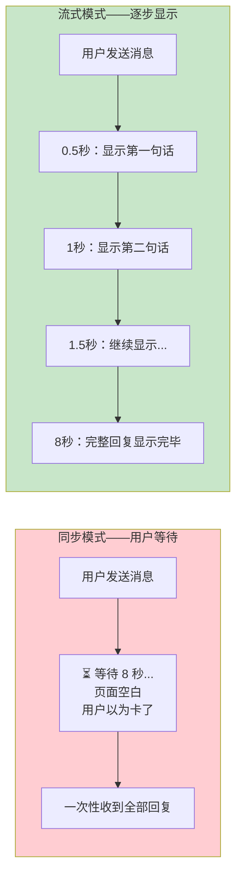
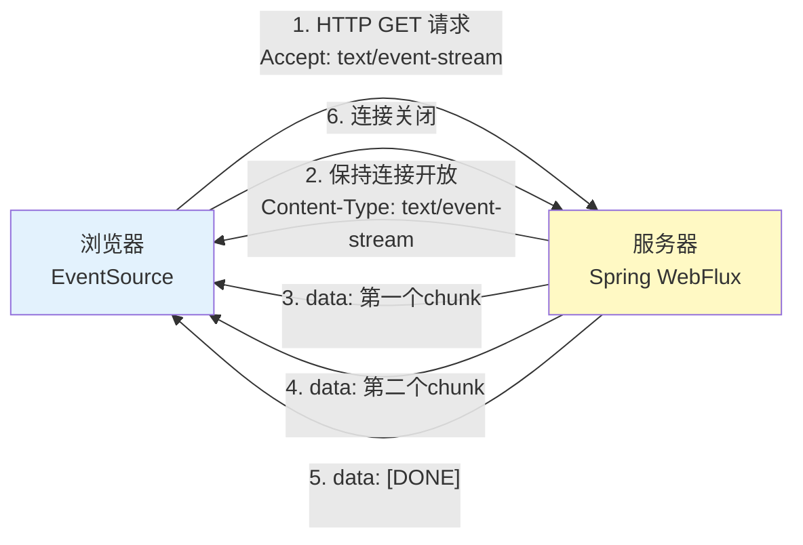
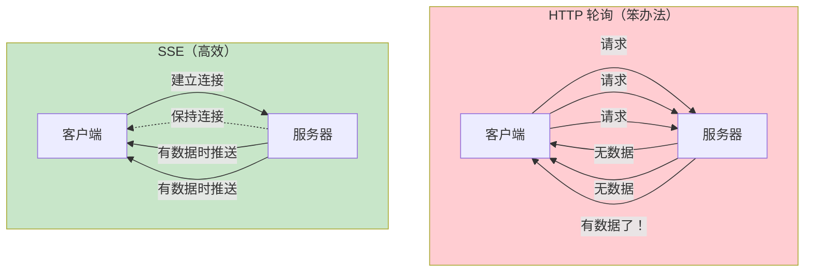
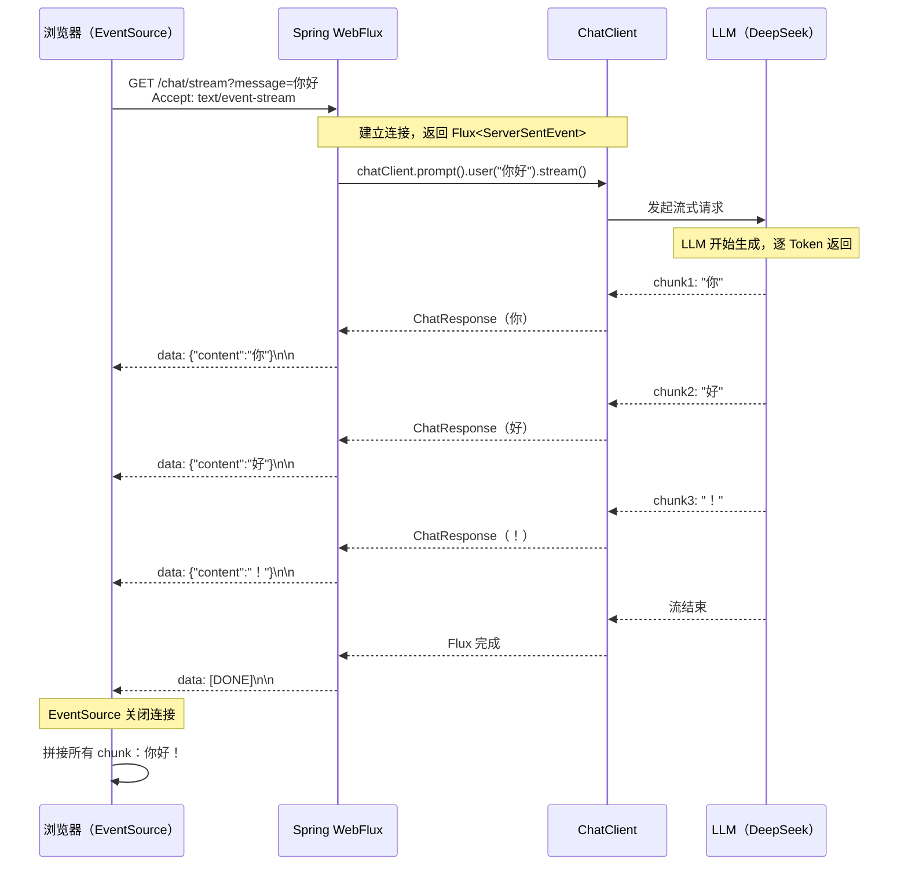
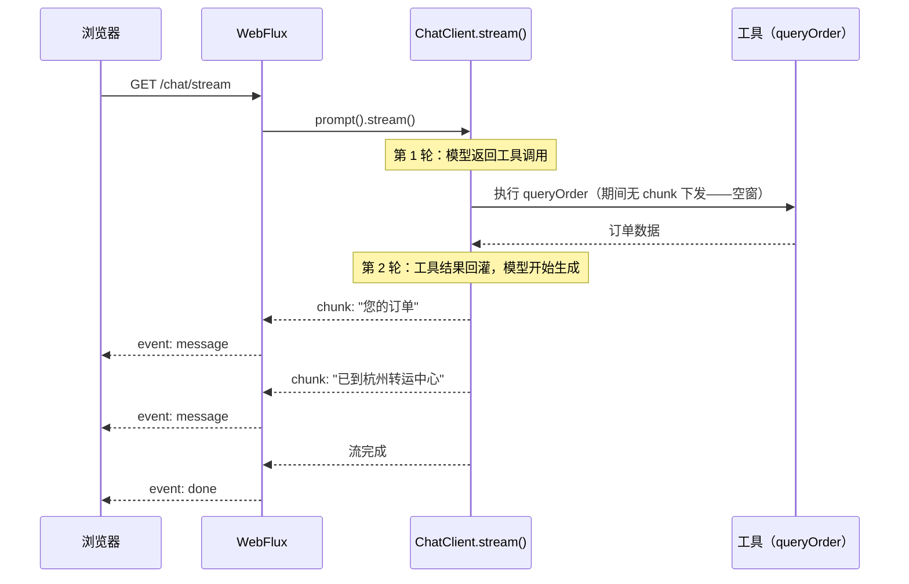
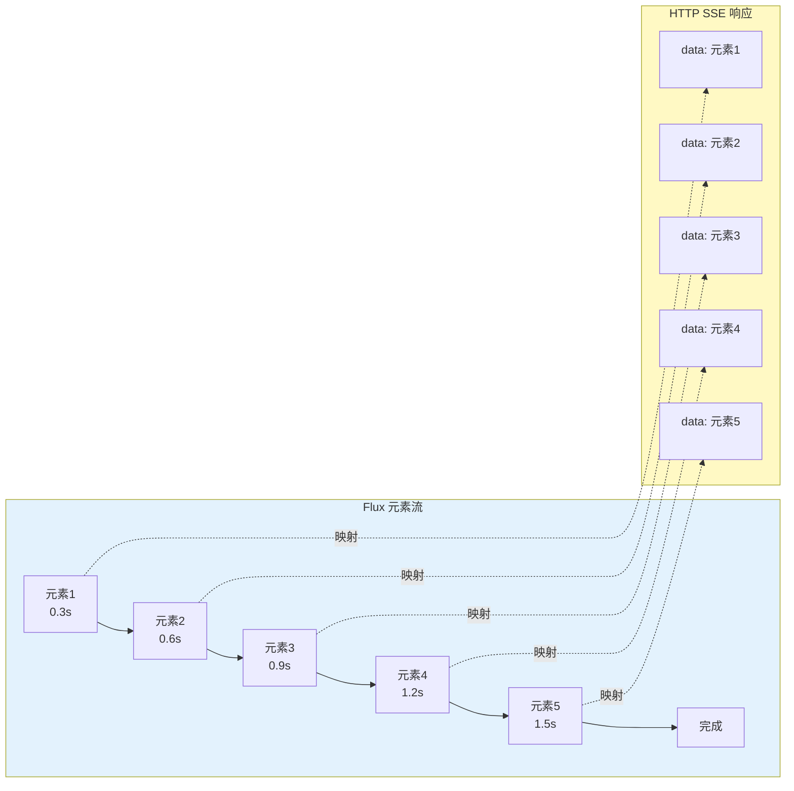
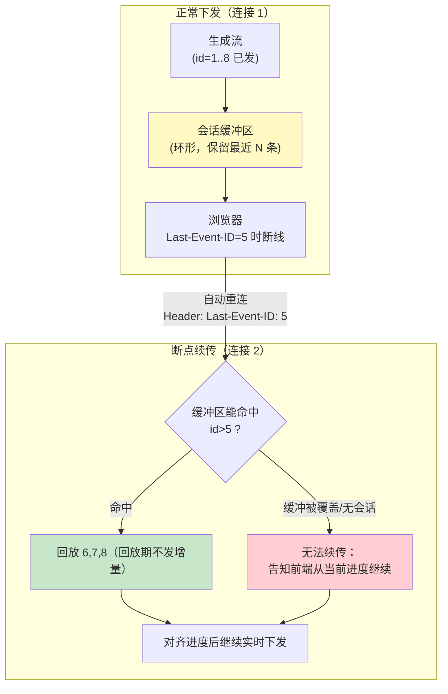
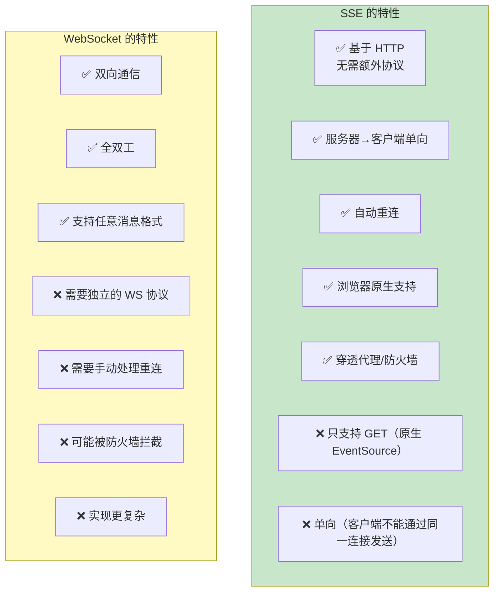
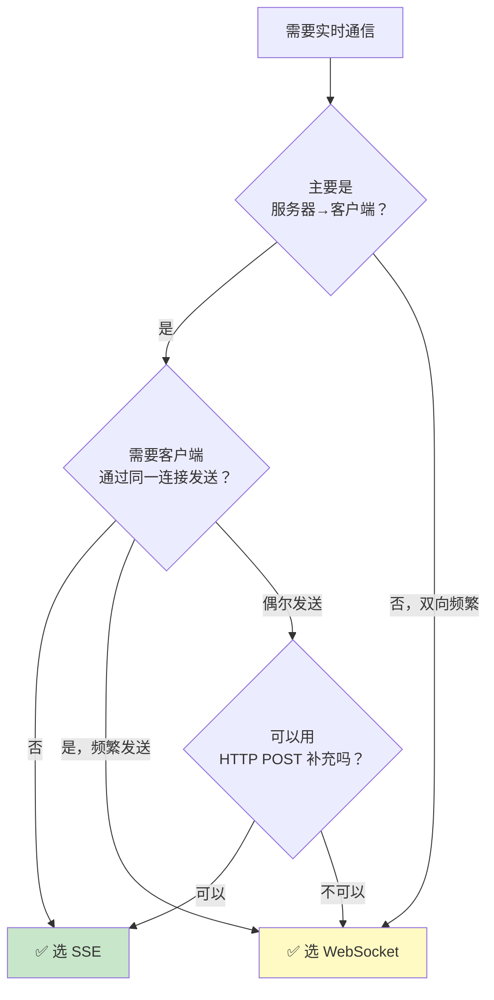

# 00 SSE 流式通信
> **定位**：讲透 SSE（Server-Sent Events）在 Agent 应用中的完整实践——SSE 原理、WebFlux Flux 流式响应、Spring AI 2.0 ChatClient.stream() 的使用、前端 EventSource 对接、与 WebSocket 的对比选型。读完这篇，你能实现"打字机效果"的流式 Agent 回复，让用户不再盯着空白页面等待。
>
> **读者画像**：已经会用 ChatClient 完成同步对话，需要实现流式响应提升用户体验的开发者。
>
> **前置阅读**：[02-ChatClient 与对话模型](../00-基础与核心/02-ChatClient与对话模型.md)。

---

## 1. 为什么需要流式响应

### 1.1 同步响应的痛点

LLM 生成回复需要时间——短则 2-3 秒，长则 30 秒以上。如果用传统的同步 HTTP 请求-响应模式，用户体验是这样的：



**核心区别**：流式响应让用户在 LLM 生成的**同时**就能看到部分结果，而不是等全部生成完才收到。这种"打字机效果"将感知等待时间从"总时长"降低到"首 Token 延迟"（通常 < 1 秒）。

### 1.2 流式响应的技术选项

| 技术 | 方向 | 协议 | 适用场景 |
|------|------|------|---------|
| **SSE** | 服务器→客户端（单向） | HTTP | LLM 流式输出（推荐） |
| **WebSocket** | 双向 | WS | 实时聊天、游戏 |
| **HTTP Chunked** | 服务器→客户端（单向） | HTTP | 文件下载 |
| **gRPC Stream** | 双向 | HTTP/2 | 微服务间通信 |

对于 Agent 应用，**SSE 是最佳选择**——因为 LLM 流式输出是典型的"服务器→客户端单向流"，SSE 就是为这个场景设计的。

---

## 2. SSE 原理

### 2.1 什么是 SSE

SSE（Server-Sent Events）是 HTML5 标准的一部分，允许服务器通过 HTTP 连接**持续推送数据**到客户端。



### 2.2 SSE 的数据格式

SSE 使用极简的文本格式，每个事件由 `data:` 前缀加内容组成，以空行分隔：

```
data: {"content": "你好"}

data: {"content": "，"}

data: {"content": "我是"}

data: {"content": "AI助手"}

data: [DONE]

```

每个 `data:` 行是一个独立的事件。客户端通过 EventSource API 逐个接收这些事件。

### 2.3 SSE vs HTTP 轮询



SSE 只需建立一次连接，服务器有数据时主动推送，避免了轮询的无效请求。

---

## 3. SSE 时序图



---

## 4. Spring AI ChatClient.stream() 的使用

### 4.1 从 .call() 到 .stream()

Spring AI 2.0 的 ChatClient 提供两种调用模式：

```java
import org.springframework.ai.chat.client.ChatClient;
import org.springframework.ai.chat.model.ChatResponse;
import reactor.core.publisher.Flux;

// Spring AI 2.0.0

// 同步调用——等待完整回复
String result = chatClient.prompt()
        .user("什么是虚拟线程？")
        .call()
        .content();

// 流式调用——逐 chunk 返回
Flux<ChatResponse> stream = chatClient.prompt()
        .user("什么是虚拟线程？")
        .stream()
        .chatResponse();
```

| 方法 | 返回类型 | 行为 |
|------|---------|------|
| `.call()` | 同步结果 | 阻塞直到 LLM 生成完毕 |
| `.stream()` | `Flux<ChatResponse>` | 每个 chunk 是一个 ChatResponse |

### 4.2 基本流式 Controller

```java
import org.springframework.http.MediaType;
import org.springframework.web.bind.annotation.*;
import reactor.core.publisher.Flux;
import org.springframework.ai.chat.client.ChatClient;

// Spring AI 2.0.0 — 基本流式 Controller
@RestController
public class StreamChatController {

    private final ChatClient chatClient;

    public StreamChatController(ChatClient chatClient) {
        this.chatClient = chatClient;
    }

    @GetMapping(value = "/chat/stream", produces = MediaType.TEXT_EVENT_STREAM_VALUE)
    public Flux<String> stream(@RequestParam String message) {
        return chatClient.prompt()
                .user(message)
                .stream()
                .content();  // 返回 Flux<String>，每个元素是一个文本 chunk
    }
}
```

关键点：`produces = MediaType.TEXT_EVENT_STREAM_VALUE` 告诉 Spring WebFlux 这是一个 SSE 端点。Spring Boot 会自动设置正确的 HTTP Headers（`Content-Type: text/event-stream`）并将 `Flux<String>` 格式化为 SSE 事件。

### 4.3 结构化 SSE 事件

直接返回 `Flux<String>` 虽然简单，但前端拿到的只有纯文本。如果需要携带更多元数据（如 chunk 序号、是否结束），用 `ServerSentEvent` 包装：

```java
import org.springframework.http.codec.ServerSentEvent;

// Spring AI 2.0.0 — 结构化 SSE 事件
@GetMapping(value = "/chat/stream", produces = MediaType.TEXT_EVENT_STREAM_VALUE)
public Flux<ServerSentEvent<String>> stream(@RequestParam String message) {
    return chatClient.prompt()
            .user(message)
            .stream()
            .content()
            .map(chunk -> ServerSentEvent.<String>builder()
                    .event("message")              // 事件类型
                    .id(String.valueOf(System.currentTimeMillis()))  // 事件 ID
                    .data(chunk)                    // 事件数据
                    .build())
            .concatWith(Flux.just(
                    ServerSentEvent.<String>builder()
                            .event("done")          // 结束事件
                            .data("[DONE]")
                            .build()
            ));
}
```

前端可以根据 `event` 字段区分不同事件类型：

```javascript
const eventSource = new EventSource("/chat/stream?message=你好");

eventSource.addEventListener("message", (event) => {
    // 收到一个文本 chunk
    appendToUI(event.data);
});

eventSource.addEventListener("done", (event) => {
    // 流结束
    eventSource.close();
    hideLoadingIndicator();
});
```

### 4.4 带错误处理的流式响应

```java
// Spring AI 2.0.0 — 完整的错误处理
@GetMapping(value = "/chat/stream", produces = MediaType.TEXT_EVENT_STREAM_VALUE)
public Flux<ServerSentEvent<String>> stream(@RequestParam String message) {
    return chatClient.prompt()
            .user(message)
            .stream()
            .content()
            .map(chunk -> ServerSentEvent.<String>builder()
                    .event("message")
                    .data(chunk)
                    .build())
            .onErrorResume(error -> {
                // 发生错误时发送错误事件，而不是直接断开连接
                return Flux.just(
                        ServerSentEvent.<String>builder()
                                .event("error")
                                .data("生成失败：" + error.getMessage())
                                .build()
                );
            })
            .concatWith(Flux.just(
                    ServerSentEvent.<String>builder()
                            .event("done")
                            .data("[DONE]")
                            .build()
            ));
}
```

```javascript
eventSource.addEventListener("error", (event) => {
    showErrorToUI(event.data);     // 显示错误信息
    eventSource.close();
});
```

### 4.5 工具调用与流式的交织：`stream()` 遇到 tool call 会怎样？

Agent 场景下，流式响应和工具调用会交织出现——用户问"我的订单到哪了"，Agent 要先调 `queryOrder` 工具，拿到结果后才开始流式生成文本。理解 `stream()` 对 tool call 的处理方式，是设计前端事件协议的前提。

**框架默认行为**：Spring AI 的工具调用循环对 `stream()` 同样生效。2.0.0 起工具调用循环由 `ToolCallingAdvisor` 承担——注册了工具的 `ChatClient` 自动插入该 Advisor（`AdvisorParams.toolCallingAdvisorAutoRegister(false)` 可关闭自动注册、改为手动循环），框架在流式管道内部完成"收到工具调用 → 执行工具 → 把结果回灌模型 → 继续生成"的循环——**文本 chunk 会出现一段空窗**（工具执行期间没有任何内容下发），随后恢复。从纯文本流的视角看，这段空窗就是"Agent 正在干活但界面没反应"，用户体验的坑正在这里。完整的事件语义在 [教程 03-React前端与AgenticUI/04-流式工具调用与事件协议] 展开，执行链源码见 [附录 03-Spring-AI源码解析/02-流式执行链源码解析]。



**前端如何收到"正在调用工具"状态**：SSE 是单向下行流，状态信息只能与文本 chunk **多路复用**在同一条流上——用 `ServerSentEvent.event()` 的事件类型区分通道（`message` = 文本增量，`tool_status` = 工具状态，`done`/`error` = 终态）：

```java
// Spring AI 2.0.0 — 概念代码：内容流与工具状态流多路复用
// 状态事件的产生方式（自定义 StreamAdvisor / 工具回调侧发信号）见教程 02-SpringAI核心机制/00-SSE流式通信，
// 真实 API 见附录 05-SpringAI2-API基准
Flux<ServerSentEvent<String>> textStream = chatClient.prompt()
        .user(message)
        .stream()
        .content()
        .map(chunk -> ServerSentEvent.<String>builder()
                .event("message")                 // 通道 1：文本增量
                .data(chunk)
                .build());

Flux<ServerSentEvent<String>> toolStatus = toolEventSink.asFlux()   // 工具回调侧推送
        .map(status -> ServerSentEvent.<String>builder()
                .event("tool_status")             // 通道 2：工具执行状态
                .data(status)                     // 如 {"tool":"queryOrder","phase":"running"}
                .build());

return Flux.merge(textStream, toolStatus);        // 两路合流，前端按 event 字段分发
```

```javascript
// 前端按事件类型分发：文本进对话气泡，状态进"正在查询订单…"提示条
eventSource.addEventListener("message", (e) => appendToUI(e.data));
eventSource.addEventListener("tool_status", (e) => showToolIndicator(JSON.parse(e.data)));
```

**另一种取舍**：关闭 `ToolCallingAdvisor` 的自动注册（`AdvisorParams.toolCallingAdvisorAutoRegister(false)`；2.0.0 起 1.x 的 `internalToolExecutionEnabled` 选项已移除），让 tool call 以 chunk 形式出现在流里，由你的代码执行工具、手动发起第二轮 `stream()`。好处是工具执行完全可控（可加审批/审计/超时），代价是要自己管理多轮拼接——这是 HITL 审批与 [教程 04-企业级架构主干/08-Human-in-the-Loop与审批流] 的技术基础。

---

## 5. WebFlux Flux 流式响应深入

### 5.1 Flux 的流式语义

`Flux<T>` 是 Reactor 中的异步序列，代表 0 到 N 个元素的流。在 WebFlux 中，`Flux` 被直接映射为 SSE 流：



每个 Flux 元素在发出的瞬间，就被写入 HTTP 响应体——不需要等所有元素都就绪。

### 5.2 链式操作

Flux 支持丰富的链式操作，可以在流式传输过程中做处理：

```java
// Spring AI 2.0.0 — Flux 链式处理
@GetMapping(value = "/chat/stream", produces = MediaType.TEXT_EVENT_STREAM_VALUE)
public Flux<String> stream(@RequestParam String message) {
    return chatClient.prompt()
            .user(message)
            .stream()
            .content()
            // 过滤空 chunk
            .filter(chunk -> chunk != null && !chunk.isBlank())
            // 缓冲：每 3 个 chunk 合并一次（减少前端渲染次数）
            .buffer(3)
            .map(chunks -> String.join("", chunks))
            // 限流：每 50ms 最多发一个事件（平滑突发，控制下发速率）
            // 注意这是"限流"不是"背压"——背压是消费者向生产者传导需求，
            // delayElements 只是把匀速下发强加给下游，见 §5.5
            .delayElements(Duration.ofMillis(50));
}
```

> **术语澄清**：`delayElements` 常被误称为"背压"。它做的是**限流**——生产端按固定节奏下发，与消费者是否处理得过来无关。真正的**背压**是消费者把自己的处理能力（request(n)）反向传导给生产者，让上游按需生产，见 §5.5 与 [教程 01-WebFlux与响应式编程/02-背压与流量控制]。

### 5.3 合并多个流

在多 Agent 场景中，你可能需要将多个 Agent 的流式输出合并：

```java
// Spring AI 2.0.0 — 合并多个 Agent 的流
@GetMapping(value = "/chat/stream", produces = MediaType.TEXT_EVENT_STREAM_VALUE)
public Flux<String> multiAgentStream(@RequestParam String message) {
    Flux<String> researchStream = researchAgent.prompt()
            .user("研究：" + message)
            .stream()
            .content()
            .map(chunk -> "[研究] " + chunk);

    Flux<String> analysisStream = analysisAgent.prompt()
            .user("分析：" + message)
            .stream()
            .content()
            .map(chunk -> "[分析] " + chunk);

    // 交替合并两个流
    return researchStream.mergeWith(analysisStream);
}
```

### 5.4 会话记忆 + 流式：真实行为只有一个口径

先给结论（依据 [附录 05-SpringAI2-API基准/00-Advisor与ChatMemory §流式调用与记忆写入]）：**只要 ChatClient 上注册了 `MessageChatMemoryAdvisor`，`call()` 和 `stream()` 都会自动写记忆**——记忆 Advisor 同时实现了同步与流式两个接口，在流式路径上于**流完成后聚合并写入完整回复**。会发生"不写记忆"的只有一种情况：**你没有注册记忆 Advisor，而是自己 `stream().content()` 裸消费流**——框架没有切入点替你写。两个前提一句话：Advisor 在，流式自动写；Advisor 不在，谁都不写。

```java
// Spring AI 2.0.0 — 流式 + 会话记忆（正确口径）
// 前提：构建 ChatClient 时已 defaultAdvisors(MessageChatMemoryAdvisor...)
@GetMapping(value = "/chat/stream", produces = MediaType.TEXT_EVENT_STREAM_VALUE)
public Flux<String> streamWithMemory(
        @RequestParam String message,
        @RequestParam String sessionId
) {
    return chatClient.prompt()
            .user(message)
            .advisors(spec -> spec.param(ChatMemory.CONVERSATION_ID, sessionId))
            .stream()
            .content();
            // 不需要手动写入：MessageChatMemoryAdvisor 在流完成后自动聚合完整回复并写入 ChatMemory
            // （本例未注册记忆 Advisor 时，下面的日志就是"记忆没写"的第一现场）
}
```

两个必须知道的边界：**① 流被取消/中断时，"流完成后写入"不会发生**——客户端断开（§10.4 的 `doOnCancel`）或上游异常中止时，这轮助手回复大概率没进记忆，下一轮对话模型会"失忆"；对断点续传敏感的场景要在 `doOnCancel`/`doOnError` 里把已收到的部分内容手动落盘（§7.3）。**② "写入的是聚合后的完整回复"**——中间 chunk 不会逐条入库，这对语义正确性是好事，但意味着流式部分结果的可用性完全依赖你自己的落盘逻辑。

> → [教程 00-基础与核心/04-记忆与会话管理]：ChatMemory 的完整机制。
> → [附录 05-SpringAI2-API基准/00-Advisor与ChatMemory]：流式与记忆写入的权威口径。

### 5.5 真正的背压：慢消费者与取消传播

背压在 SSE 场景有个特殊现实：**HTTP 响应体没有应用层的 request(n)**——浏览器 TCP 窗口和容器写缓冲才是真正的"消费者信号"。当客户端消费慢（弱网、标签页后台节流）时，未写出的数据会在服务端积压。Reactor 的 WebFlux 写路径感知到 TCP 背压后会向上游传导（暂停向 LLM 连接读取），但积压与慢消费者需要显式策略：

```java
// Spring AI 2.0.0 — 慢消费者治理：丢弃 + 超时 + 取消传播
return chatClient.prompt()
        .user(message)
        .stream()
        .content()
        // 慢消费者消化不动就丢帧：UI 会少几个 chunk，
        // 换来 EventLoop 不被慢连接拖垮（打字机场景丢帧几乎无感）
        .onBackpressureDrop(dropped -> log.debug("dropped chunk: {}", dropped))
        // 候选替代：onBackpressureLatest()（只保最新）或 onBackpressureBuffer(n, false)（有界缓冲，满则失败）
        // 整流兜底：上游停顿超过 2 分钟视为异常，转 onError（§4.4 的 error 事件）
        .timeout(Duration.ofMinutes(2));
```

> **WebFlux 铁律**：这条链路里**禁止**出现 `block()`/`blockLast()`/`Thread.sleep()`——Controller 返回 Flux 后由框架在合适线程上驱动，任何阻塞都会卡死 EventLoop；确需阻塞计算（如重 IO）用 `Mono.fromCallable(...).subscribeOn(Schedulers.boundedElastic())`。慢消费者与算子选择的完整推演见 [教程 01-WebFlux与响应式编程/02-背压与流量控制]。

**取消传播**是背压的孪生机制：客户端断开连接时，WebFlux 会向上游发出 `cancel` 信号——`doOnCancel` 能感知（§10.4），更重要的是**取消会沿流向上传播到 LLM HTTP 连接**，主动中止生成、释放连接与配额。这意味着"用户点停止"不只是前端停止渲染，服务端的 Token 消耗也随之停止（对按量计费的 LLM 是真金白银）。要防止取消后遗留副作用（如记忆半写、工具已执行未记录），在 `doOnCancel`/`doFinally` 里收尾，见 [教程 08-架构师进阶/08-响应式错误处理]。

---

## 6. 前端 EventSource 对接

### 6.1 基本用法

```javascript
// 前端 JavaScript — EventSource 对接 SSE

function streamChat(message) {
    // 显示加载状态
    showLoadingIndicator();

    // 创建 EventSource 连接
    const eventSource = new EventSource(
        `/chat/stream?message=${encodeURIComponent(message)}`
    );

    let fullResponse = "";

    // 接收消息事件
    eventSource.onmessage = function(event) {
        if (event.data === "[DONE]") {
            // 流结束
            eventSource.close();
            hideLoadingIndicator();
            console.log("完整回复：", fullResponse);
            return;
        }
        // 追加内容到 UI
        fullResponse += event.data;
        appendToUI(event.data);
    };

    // 错误处理
    eventSource.onerror = function(event) {
        console.error("SSE 连接错误");
        eventSource.close();
        hideLoadingIndicator();
        showError("连接中断，请重试");
    };
}

// 使用
streamChat("什么是虚拟线程？");
```

### 6.2 使用 POST 请求的 SSE

EventSource 原生只支持 GET 请求。如果需要发送 POST 请求（如携带复杂 JSON Body），使用 `fetch` + ReadableStream：

```javascript
// 前端 JavaScript — 用 fetch 实现 SSE（支持 POST）

async function streamChatPost(message, sessionId) {
    const response = await fetch("/chat/stream", {
        method: "POST",
        headers: { "Content-Type": "application/json" },
        body: JSON.stringify({ message, sessionId })
    });

    const reader = response.body.getReader();
    const decoder = new TextDecoder();

    let fullResponse = "";
    let buffer = "";

    while (true) {
        const { done, value } = await reader.read();
        if (done) break;

        buffer += decoder.decode(value, { stream: true });

        // 按 SSE 格式分割（双换行分隔事件）
        const events = buffer.split("\n\n");
        buffer = events.pop(); // 最后一个可能不完整，留在 buffer

        for (const event of events) {
            const lines = event.split("\n");
            for (const line of lines) {
                if (line.startsWith("data: ")) {
                    const data = line.slice(6);
                    if (data === "[DONE]") {
                        return fullResponse;
                    }
                    fullResponse += data;
                    appendToUI(data);
                }
            }
        }
    }
    return fullResponse;
}
```

Spring 端对应 POST 端点：

```java
// Spring AI 2.0.0 — POST 流式端点
@PostMapping(value = "/chat/stream", produces = MediaType.TEXT_EVENT_STREAM_VALUE)
public Flux<String> streamPost(@RequestBody ChatRequest request) {
    return chatClient.prompt()
            .user(request.message())
            .advisors(spec -> spec.param(ChatMemory.CONVERSATION_ID, request.sessionId()))
            .stream()
            .content();
}

public record ChatRequest(String message, String sessionId) {}
```

### 6.3 自动重连

SSE 的 EventSource 原生支持自动重连。服务器断连后，浏览器会在几秒后自动重新连接：

```javascript
const eventSource = new EventSource("/chat/stream?message=你好");

eventSource.onopen = function() {
    console.log("SSE 连接已建立");
};

eventSource.onerror = function(event) {
    // EventSource 会自动尝试重连
    // readyState: 0=连接中, 1=已连接, 2=已关闭
    if (eventSource.readyState === EventSource.CLOSED) {
        console.log("连接已关闭，不再重连");
    } else {
        console.log("连接断开，将自动重连...");
    }
};
```

你可以在服务端通过 `retry:` 字段控制重连间隔：

```java
// 在 Flux 的开头发送 retry 指令
Flux<ServerSentEvent<String>> stream = chatClient.prompt()
        .user(message)
        .stream()
        .content()
        .map(chunk -> ServerSentEvent.<String>builder().data(chunk).build())
        .startWith(
                ServerSentEvent.<String>builder()
                        .retry(Duration.ofSeconds(3))  // 重连间隔 3 秒
                        .comment("retry-config")
                        .build()
        );
```

### 6.4 React 中的使用

```jsx
// React 组件 — SSE 流式聊天
import { useState, useRef } from 'react';

function ChatComponent() {
    const [messages, setMessages] = useState([]);
    const [streamingText, setStreamingText] = useState("");
    const eventSourceRef = useRef(null);

    const sendMessage = (text) => {
        // 添加用户消息
        setMessages(prev => [...prev, { role: 'user', content: text }]);
        setStreamingText("");

        // 建立 SSE 连接
        const eventSource = new EventSource(
            `/chat/stream?message=${encodeURIComponent(text)}`
        );
        eventSourceRef.current = eventSource;

        let buffer = "";

        eventSource.onmessage = (event) => {
            if (event.data === "[DONE]") {
                eventSource.close();
                setMessages(prev => [...prev, { role: 'assistant', content: buffer }]);
                setStreamingText("");
                return;
            }
            buffer += event.data;
            setStreamingText(buffer);  // 实时更新打字机效果
        };

        eventSource.onerror = () => {
            eventSource.close();
            setStreamingText("");
        };
    };

    const stopStream = () => {
        eventSourceRef.current?.close();
    };

    return (
        <div>
            {messages.map((msg, i) => (
                <div key={i} className={msg.role}>{msg.content}</div>
            ))}
            {streamingText && <div className="assistant streaming">{streamingText}</div>}
            <button onClick={() => sendMessage("你好")}>发送</button>
            <button onClick={stopStream}>停止</button>
        </div>
    );
}
```

---

## 7. 断点续传：Last-Event-ID 与服务端事件缓冲

### 7.1 自动重连的缺口：重连 ≠ 续传

§6.3 的 EventSource 自动重连解决"连接断了"，但**不解决"内容丢了"**——重连后服务器从哪继续发？如果重连后从头重发，用户会看到回复"重播"；如果直接从当前生成进度发，断开期间的 chunk 就永远丢了。SSE 协议原生给了半个答案：

- 每个事件可带 `id:` 字段（§4.3 里 `ServerSentEvent.id(...)`）；
- EventSource **断线重连时自动携带最后收到的事件 ID**，放在 `Last-Event-ID` 请求头里。

协议只负责"把断点位置告诉服务器"，**从断点恢复的能力要服务端自己建**——这就是事件缓冲回放设计。

### 7.2 服务端事件缓冲 + 按 Last-Event-ID 回放

设计三件套：**单调递增的事件 ID、按会话的事件环形缓冲、重连时的差量回放**。



服务端实现要点（简化示例）：

```java
// Spring AI 2.0.0 — 概念代码：按 Last-Event-ID 差量回放
// 会话缓冲建议放内存 LRU（热点会话）+ 可选 Redis（跨实例），见教程 03-React前端与AgenticUI/00-React入门与现代前端工程 多实例讨论
@GetMapping(value = "/chat/stream", produces = MediaType.TEXT_EVENT_STREAM_VALUE)
public Flux<ServerSentEvent<String>> streamResume(
        @RequestParam String message,
        @RequestHeader(name = "Last-Event-ID", required = false) Long lastEventId,
        @RequestParam String sessionId) {

    SessionBuffer buffer = sessionBuffers.get(sessionId);   // 每会话的环形缓冲

    Flux<ServerSentEvent<String>> replay = (buffer != null && lastEventId != null)
            ? buffer.replayAfter(lastEventId)               // 回放断线期间的事件
            : Flux.empty();

    Flux<ServerSentEvent<String>> live = chatClient.prompt()
            .user(message)
            .stream()
            .content()
            .index()                                        // 0,1,2... 天然的单调递增 ID
            .map(t -> ServerSentEvent.<String>builder()
                    .id(String.valueOf(t.getT1() + 1))      // 与 Last-Event-ID 对齐
                    .event("message")
                    .data(t.getT2())
                    .build());

    return replay.concatWith(live);                         // 先回放，再续实时
}
```

三个工程约束：**① ID 必须单调**（乱序 ID 会让 EventSource 的去重逻辑失效）；**② 缓冲有界**（环形缓冲保留最近 N 条，超龄回放请求只能降级，见 §7.3 的部分结果）；**③ 生成仍在进行时才谈得上"续传"**——如果生成已结束（LLM 调用已取消，见 §5.5 取消传播），重连后能回放的只有缓冲里已有的部分。多实例部署时缓冲与连接可能不在同一实例，需要粘性路由或把缓冲外置——完整的多页面/多实例会话治理见 [教程 04-企业级架构主干/04-多页面流式响应与会话管理]。

### 7.3 流式中断后的部分结果处理

"断了"之后服务端要回答两个问题：**已生成的部分内容怎么用？未完成的部分怎么交代？**

```java
// Spring AI 2.0.0 — 中断时的部分结果落盘（与 §5.4 的记忆边界互补）
StringBuilder partial = new StringBuilder();

return chatClient.prompt()
        .user(message)
        .stream()
        .content()
        .doOnNext(partial::append)                          // 顺手累积已生成内容
        .doOnCancel(() -> {                                 // 客户端断开
            persistPartial(sessionId, partial.toString());  // 部分结果落盘，供重连续传/下一轮兜底
            log.info("stream cancelled at {} chars", partial.length());
        })
        .doOnError(e -> persistPartial(sessionId, partial.toString()));
```

部分结果的三个消费出口，按体验从好到差：

| 出口 | 做法 | 适用 |
|------|------|------|
| **续传** | §7.2 的回放机制，前端无缝接上 | 中断时间短、缓冲还在 |
| **续写** | 下一轮请求把部分结果作为上下文（"接着上文继续，不要重复"） | 部分内容有保留价值 |
| **截断标记** | 在会话历史里给部分回复打 `[已中断]` 标记，模型知道上次没说完 | 部分内容已不可用，但需防止模型"假装说完了" |

注意与 §5.4 的呼应：取消时 `MessageChatMemoryAdvisor` 不会写入这轮回复——**部分结果必须自己落盘**，它同时服务"续传缓冲"和"下一轮上下文"两个用途，一份数据两处价值。

---

## 8. SSE vs WebSocket：如何选型

### 8.1 技术对比



### 8.2 详细对比表

| 维度 | SSE | WebSocket |
|------|-----|-----------|
| **通信方向** | 单向（服务器→客户端） | 双向 |
| **底层协议** | HTTP | 独立的 WS 协议 |
| **浏览器支持** | EventSource（原生） | WebSocket（原生） |
| **自动重连** | 内置 | 需手动实现 |
| **代理/防火墙** | 友好（走 HTTP） | 可能被拦截 |
| **连接数限制** | 浏览器对同源有 6 连接限制 | 无特殊限制 |
| **消息格式** | 文本（text/event-stream） | 文本和二进制 |
| **实现复杂度** | 低 | 中 |
| **适合场景** | LLM 流式输出、通知推送 | 实时聊天、游戏、协同编辑 |

### 8.3 决策树



### 8.4 Agent 场景下的选择

对于 Agent 应用，绝大多数场景**SSE 是正确的选择**：

- **Agent 回复** → SSE（LLM 输出是服务器→客户端的单向流）
- **用户输入** → 普通 HTTP POST（一次性发送，不需要保持连接）
- **会话管理** → REST API（创建/查询/删除会话）

只有以下场景才需要 WebSocket：
- 多人实时协作（需要双向频繁通信）
- Agent 需要主动推送通知（如异步任务完成通知）
- 游戏或实时交互场景

---

## 9. 完整示例：流式聊天 Controller

```java
import org.springframework.ai.chat.client.ChatClient;
import org.springframework.ai.chat.client.advisor.MessageChatMemoryAdvisor;
import org.springframework.ai.chat.memory.ChatMemory;
import org.springframework.ai.chat.memory.MessageWindowChatMemory;
import org.springframework.ai.chat.memory.InMemoryChatMemoryRepository;
import org.springframework.http.MediaType;
import org.springframework.http.codec.ServerSentEvent;
import org.springframework.web.bind.annotation.*;
import reactor.core.publisher.Flux;
import java.time.Duration;

// Spring AI 2.0.0 — 完整的流式聊天 Controller
@RestController
@RequestMapping("/api/chat")
public class StreamChatController {

    private final ChatClient chatClient;

    public StreamChatController(ChatClient.Builder builder) {
        this.chatClient = builder
                .defaultSystem("你是一个智能助手，用中文回答用户问题。")
                .defaultAdvisors(
                        // 真实组合: MessageWindowChatMemory(窗口策略) + InMemoryChatMemoryRepository(存储)
                        // 参考 [附录 05-SpringAI2-API基准/00-Advisor与ChatMemory]
                        MessageChatMemoryAdvisor.builder(
                                MessageWindowChatMemory.builder()
                                        .chatMemoryRepository(new InMemoryChatMemoryRepository())
                                        .maxMessages(20)
                                        .build())
                                .build()
                )
                .build();
    }

    // GET 方式（简单场景）
    @GetMapping(value = "/stream", produces = MediaType.TEXT_EVENT_STREAM_VALUE)
    public Flux<ServerSentEvent<String>> streamGet(
            @RequestParam String message,
            @RequestParam(required = false, defaultValue = "default") String sessionId
    ) {
        return buildStream(message, sessionId);
    }

    // POST 方式（推荐——支持复杂请求体）
    @PostMapping(value = "/stream", produces = MediaType.TEXT_EVENT_STREAM_VALUE)
    public Flux<ServerSentEvent<String>> streamPost(
            @RequestBody ChatRequest request
    ) {
        return buildStream(request.message(), request.sessionId());
    }

    private Flux<ServerSentEvent<String>> buildStream(String message, String sessionId) {
        return chatClient.prompt()
                .user(message)
                .advisors(spec -> spec.param(ChatMemory.CONVERSATION_ID, sessionId))
                .stream()
                .content()
                .filter(chunk -> chunk != null && !chunk.isEmpty())
                .map(chunk -> ServerSentEvent.<String>builder()
                        .event("message")
                        .data(chunk)
                        .build())
                .onErrorResume(error -> Flux.just(
                        ServerSentEvent.<String>builder()
                                .event("error")
                                .data("服务暂时不可用：" + error.getMessage())
                                .build()
                ))
                .concatWith(Flux.just(
                        ServerSentEvent.<String>builder()
                                .event("done")
                                .data("[DONE]")
                                .build()
                ));
    }

    public record ChatRequest(String message, String sessionId) {}
}
```

---

## 10. 流式响应的注意事项

### 10.1 代理和超时

很多反向代理（Nginx、API Gateway）有默认的响应超时和缓冲设置。流式响应需要特殊配置：

```nginx
# Nginx 配置——禁用缓冲，延长超时
location /chat/stream {
    proxy_pass http://backend;
    proxy_set_header Connection '';
    proxy_http_version 1.1;
    proxy_buffering off;        # 关闭缓冲——关键！
    proxy_cache off;            # 关闭缓存
    chunked_transfer_encoding on;
    proxy_read_timeout 300s;    # 延长读超时到 5 分钟
}
```

如果 `proxy_buffering` 没有关闭，Nginx 会缓存整个响应，等 LLM 生成完才一次性发给客户端——完全失去流式效果。

### 10.2 浏览器连接数限制

HTTP/1.1 下，浏览器对同一域名的并发连接数有限制（通常 6 个）。如果多个标签页同时建立 SSE 连接，可能耗尽连接池。解决方案：

- 使用 HTTP/2（多路复用，无连接数限制）
- 用单个 SSE 连接 + 消息复用（一个连接服务多个会话）

### 10.3 心跳保活

长时间没有数据的 SSE 连接可能被中间代理断开。定期发送心跳保持连接：

```java
// Spring AI 2.0.0 — SSE 心跳保活
private Flux<ServerSentEvent<String>> buildStream(String message, String sessionId) {
    // 心跳流：每 15 秒发一个注释事件（不影响前端）
    Flux<ServerSentEvent<String>> heartbeat = Flux.interval(Duration.ofSeconds(15))
            .map(i -> ServerSentEvent.<String>builder()
                    .comment("heartbeat")  // 注释事件，前端不处理
                    .build());

    // 数据流
    Flux<ServerSentEvent<String>> data = chatClient.prompt()
            .user(message)
            .stream()
            .content()
            .map(chunk -> ServerSentEvent.<String>builder().data(chunk).build())
            .concatWith(Flux.just(
                    ServerSentEvent.<String>builder().event("done").data("[DONE]").build()
            ));

    // 合并：心跳和数据流交替
    return heartbeat.mergeWith(data)
            .takeUntil(event -> "done".equals(event.event()));
}
```

### 10.4 客户端取消请求

用户点击"停止"按钮时，前端应主动关闭 SSE 连接：

```javascript
let currentEventSource = null;

function startStream(message) {
    currentEventSource = new EventSource(`/chat/stream?message=${message}`);
    // ...
}

function stopStream() {
    if (currentEventSource) {
        currentEventSource.close();  // 主动关闭连接
        currentEventSource = null;
    }
}
```

服务端可以通过 `Flux.doOnCancel()` 感知到客户端断开：

```java
return chatClient.prompt()
        .user(message)
        .stream()
        .content()
        .doOnCancel(() -> {
            log.info("客户端取消了流式请求，session={}", sessionId);
            // 可以在这里保存已生成的部分内容到记忆中
        });
```

### 10.5 长连接容量治理：每用户并发流上限

SSE 是长连接，每条连接都占着一个服务端资源（响应式堆栈下不占线程，但占内存、文件描述符和到 LLM 的上游并发）。不做上限，一个用户开 20 个标签页重发请求就能吃掉可观的配额。治理分三层：

- **入口层（WebFilter 全局闸门）**：按"用户 + 会话"维度计数，超过上限直接 `429 Too Many Requests`——最廉价的防线，在进入 LLM 之前就拒绝。
- **应用层（同会话串行/排队）**：同一会话的并发流通常没有意义（记忆 Advisor 读取同一历史会产生竞态，见 [教程 02-SpringAI核心机制/02-Agent状态管理 §并发竞态]），"同会话最多 1 条活动流、后来者取消前者或排队"是更贴合业务的规则。
- **上游层（LLM 连接池）**：客户端并发流的总量要和到 LLM 提供商的连接池/限流配额对齐——超卖的结果是全体用户的流一起变慢（连接排队），见 [教程 08-架构师进阶/04-Agent性能优化]。

```java
// Spring AI 2.0.0 — 概念代码：每用户并发流上限（计数器用 ConcurrentHashMap + AtomicInteger）
// 分布式部署时换 Redis 计数（ReactiveRedisTemplate），并设置 TTL 防止计数泄漏
public Flux<ServerSentEvent<String>> guardedStream(String userId, String message) {
    if (!streamLimiter.tryAcquire(userId, 3)) {          // 每用户最多 3 条并发流
        return Flux.error(new ResponseStatusException(
                HttpStatus.TOO_MANY_REQUESTS, "并发流已达上限，请先关闭其他对话"));
    }
    return buildStream(message, userId)
            .doFinally(signal -> streamLimiter.release(userId));   // 正常/异常/取消都要释放
}
```

### 10.6 优雅停机：流的 drain 与连接收尾

滚动发布/重启时，直接 kill 会切断所有进行中的流——用户看到回复写到一半戛然而止，而且这些回复因为"流未完成"连记忆都没写入（§5.4）。优雅停机的正确顺序：

1. **摘流量**：从负载均衡摘除本实例（不再有新连接），keep-alive 时间内存量连接继续服务；
2. **等存量流自然完成**：给活动流一个 drain 窗口（如 60s），大部分生成能在此窗口内完成并正常写记忆、发 `done` 事件；Spring Boot 的 `server.shutdown=graceful` 处理的就是这一步；
3. **窗口到了还没完的流主动收尾**：对仍在跑的流，服务端主动下发 `error`/`done` 事件告知"服务重启，请刷新续传"，并把部分结果落盘（§7.3）——前端配合 §7 的 Last-Event-ID 在新实例上续传；
4. **释放资源**：关闭到 LLM 的连接池，注销限流计数。

把"部分结果落盘 + 续传协议"纳入停机路径，滚动发布对用户的感知就从"回复断了"变成"轻微卡了一下又接上了"——这两节（§7 + §10.6）合起来才是流式通信的可用性闭环。多实例下的会话粘性与缓冲外置见 [教程 04-企业级架构主干/04-多页面流式响应与会话管理]。

---

## 11. 适用场景与不适用场景

### 适用场景

- LLM 对话流式输出（打字机效果，减少感知等待时间）
- RAG 检索增强生成（检索完成后流式输出分析结果）
- 长文本生成（报告、邮件、文章——边生成边显示）
- 实时通知推送（任务完成、状态变更通知）
- 多 Agent 协作过程的实时展示（显示每个 Agent 的输出进度）

### 不适用场景

- 需要客户端频繁向服务器发送数据（用 WebSocket 或 HTTP POST）
- 需要二进制数据传输（用 WebSocket）
- 需要精确的事务保证（SSE 是单向流，不适合两阶段提交等场景）
- 极低延迟的实时交互（如游戏——用 WebSocket 或 WebRTC）
- 单次响应非常短（如只需 0.5 秒——同步调用更简单）

---

## 12. 本章总结

| 概念 | 一句话 |
|------|--------|
| **SSE** | 基于 HTTP 的服务器→客户端单向流式推送，是 LLM 流式输出的最佳选择 |
| **ChatClient.stream()** | Spring AI 2.0 的流式调用，返回 `Flux<ChatResponse>` |
| **TEXT_EVENT_STREAM_VALUE** | SSE 的 Content-Type，Spring Boot 自动将 Flux 格式化为 SSE |
| **ServerSentEvent** | SSE 事件的包装类，支持 event/id/data/retry 字段 |
| **EventSource** | 浏览器原生 SSE 客户端 API（只支持 GET） |
| **fetch + ReadableStream** | 支持 POST 的 SSE 客户端方案 |
| **Flux 链式操作** | filter/buffer/delayElements/onErrorResume 等流处理 |
| **心跳保活** | 定期发送注释事件，防止代理断开空闲连接 |
| **proxy_buffering off** | Nginx 必须关闭缓冲才能正常流式传输 |
| **限流 vs 背压** | delayElements 是限流；背压是消费者向生产者传导 request(n)，慢消费者用 onBackpressureDrop 治理 |
| **取消传播** | 客户端断开后 cancel 信号沿流向上传播，中止 LLM 生成、停止计费 |
| **Last-Event-ID** | EventSource 重连自动携带断点 ID，服务端凭事件缓冲做差量回放续传 |
| **部分结果处理** | 取消/异常时自己落盘已生成内容，续传/续写/截断标记三个出口 |
| **容量治理** | 每用户并发流上限入口拦截 + 同会话串行 + 与 LLM 连接池对齐 |
| **优雅停机** | 摘流量 → drain 存量流 → 收尾事件 + 部分结果落盘 → 释放资源 |
| **vs WebSocket** | SSE 适合单向推送（LLM 输出），WebSocket 适合双向频繁通信 |

**下一篇**：[20-MCP协议](01-MCP协议.md) — 用标准化协议把工具生态接入 Agent。

---

> → [教程 00-基础与核心/02-ChatClient与对话模型 与对话模型]：ChatClient 的完整 API、同步/流式调用的基础。
> → [教程 04-企业级架构主干/04-多页面流式响应与会话管理]：多标签页 SSE 连接管理、会话隔离。
> 想深入？→ [附录 03-Spring-AI源码解析/02-流式执行链源码解析]：`stream()` 从 Advisor 链到 Reactor Netty 写出端的完整执行链源码。
> 想深入？→ [教程 01-WebFlux与响应式编程/02-背压与流量控制]：request(n)、onBackpressure* 算子族与取消传播的底层机制。
> 想深入？→ [教程 05-Observation可观测/00-最小闭环：Agent各阶段输出打印到控制台]：流式调用的 Span 边界与流耗时/首 Token 延迟指标采集。
> 遇到阻塞？→ [教程 08-架构师进阶/08-响应式错误处理]（背压与流中断）与 [教程 08-架构师进阶/04-Agent性能优化]（连接池与超时）。
