# 02 Agent 状态管理
> **定位**：讲透 Agent 为什么需要状态管理、Agent 状态机的概念、会话生命周期与上下文管理、Spring AI 中基于 ChatMemory + Advisor + 会话 ID 的完整状态管理实现。读完这篇，你能设计出健壮的多轮 Agent 会话系统。
>
> **读者画像**：已经掌握记忆系统和工具调用，需要理解 Agent 运行时状态流转的开发者。
>
> **前置阅读**：[04-记忆与会话管理](../00-基础与核心/04-记忆与会话管理.md)。

---

## 1. 为什么 Agent 需要状态管理

一个没有状态管理的 Agent，就像一个失忆的服务员——每上一道菜都忘了之前上过什么。但 Agent 的状态远不止"记忆"这么简单。

### 1.1 无状态 Agent 的问题

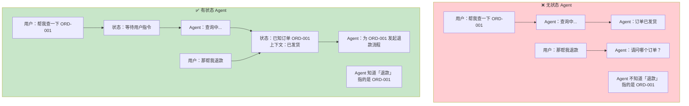

### 1.2 Agent 状态的三个层次

Agent 的状态不仅仅是"对话历史"。完整的 Agent 状态包含三个层次：

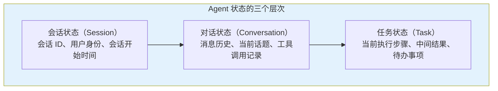

| 状态层次 | 内容 | 生命周期 | Spring AI 实现 |
|---------|------|---------|---------------|
| **会话状态** | 会话 ID、用户 ID、租户 ID | 从会话开始到结束 | `CONVERSATION_ID` 参数 |
| **对话状态** | 消息历史、工具调用记录 | 滑动窗口内的消息 | `ChatMemory` |
| **任务状态** | 当前步骤、中间变量、待办 | 单次任务执行期间 | Advisor 上下文 / 外部存储 |

---

## 2. Agent 状态机

Agent 的运行本质上是一个状态机。每次用户输入会触发状态迁移，Agent 根据当前状态决定如何响应。

### 2.1 核心状态定义

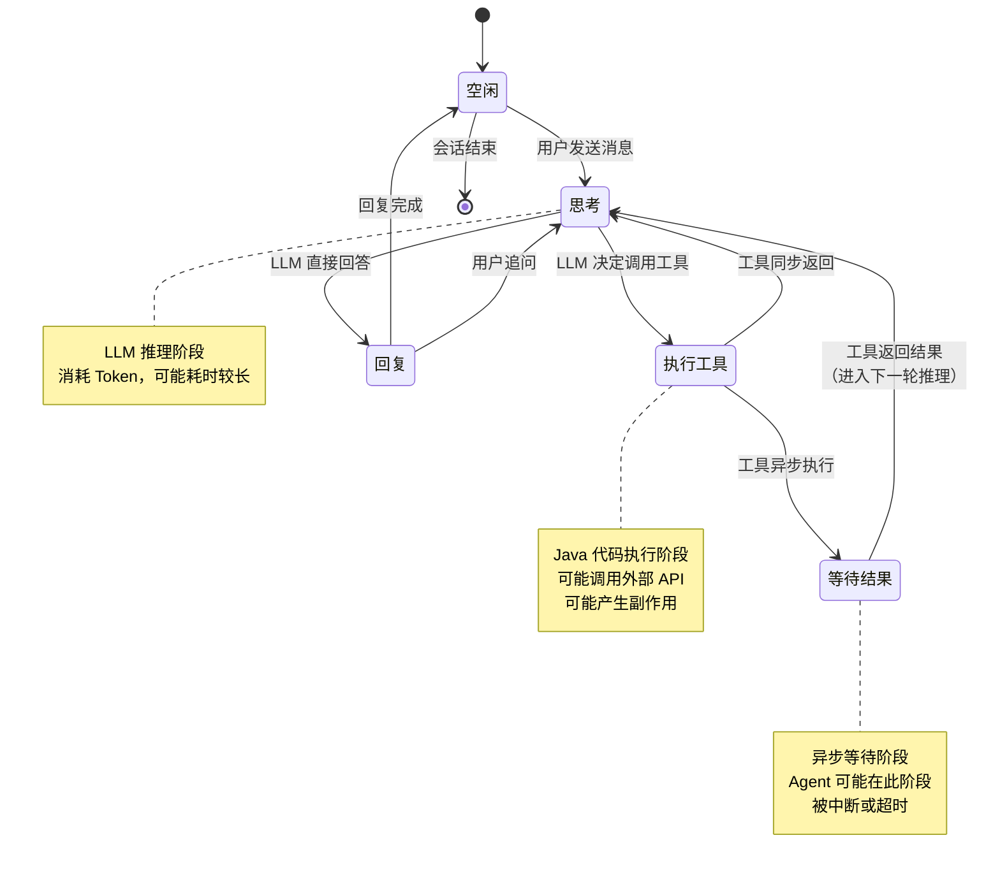

### 2.2 每个状态的详细职责

| 状态 | 职责 | 触发条件 | 退出条件 |
|------|------|---------|---------|
| **空闲** | 等待用户输入 | 会话初始化 / 回复完成 | 用户发送消息 |
| **思考** | LLM 推理，决定下一步行动 | 用户输入 / 工具结果返回 | LLM 返回回复或工具调用 |
| **执行工具** | 执行 LLM 决定调用的工具方法 | LLM 返回工具调用请求 | 工具执行完成或失败 |
| **等待结果** | 等待异步工具执行完成 | 工具需要异步处理 | 工具返回结果 |
| **回复** | 生成最终回复并发送给用户 | LLM 返回文本回复 | 回复发送完成 |

### 2.3 状态转换中的数据流

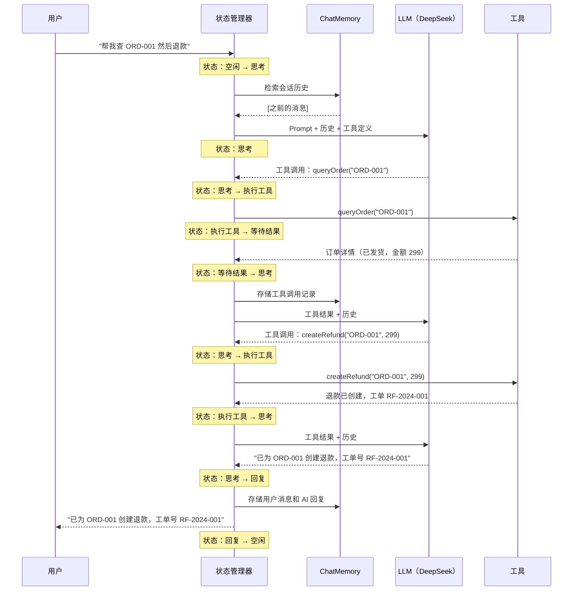

---

## 3. 会话生命周期

一个完整的会话从创建到销毁，经历多个阶段。理解生命周期是设计状态管理的基础。

### 3.1 会话生命周期全貌

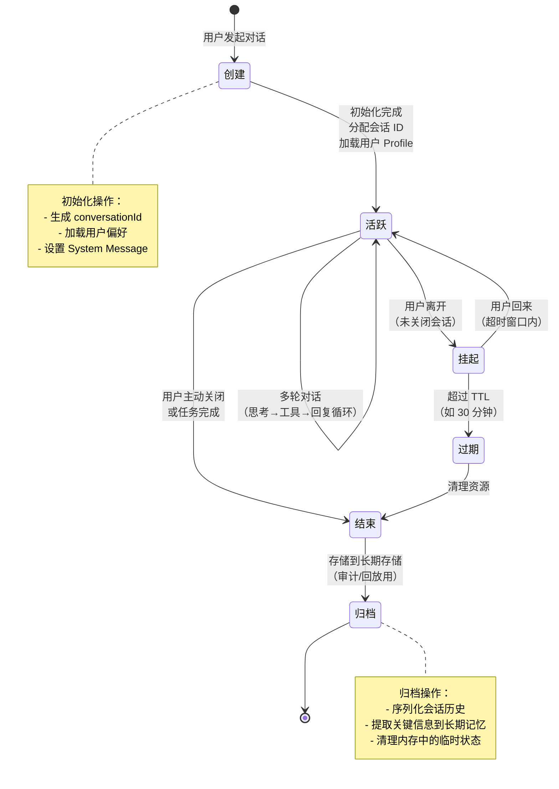

### 3.2 会话创建

```java
import org.springframework.ai.chat.memory.ChatMemory;
import org.springframework.ai.chat.memory.MessageWindowChatMemory;
import org.springframework.ai.chat.client.advisor.MessageChatMemoryAdvisor;
import org.springframework.ai.chat.messages.SystemMessage;
import org.springframework.web.bind.annotation.PostMapping;
import org.springframework.web.bind.annotation.RequestBody;
import org.springframework.web.bind.annotation.RestController;

import java.util.List;
import java.util.UUID;

@RestController
public class SessionController {

    private final ChatClient chatClient;
    private final ChatMemory chatMemory;
    private final UserProfileService profileService;

    // Spring AI 2.0.0 — 会话初始化
    @PostMapping("/session/create")
    public SessionInfo createSession(@RequestBody CreateSessionRequest request) {
        String conversationId = UUID.randomUUID().toString();

        // 加载用户 Profile 作为长期记忆
        UserProfile profile = profileService.getProfile(request.userId());

        // 将关键信息注入 System Message
        String systemPrompt = """
                你是企业客服助手。当前用户信息：
                - 姓名：%s
                - 等级：%s
                - 偏好：%s
                """.formatted(
                profile.name(),
                profile.level(),
                profile.preferences()
        );

        // 初始化会话的 System Message（add 接收 List<Message>）
        chatMemory.add(conversationId, List.of(new SystemMessage(systemPrompt)));

        return new SessionInfo(conversationId, "会话已创建");
    }
}
```

### 3.3 会话恢复

用户可能离开后回来，需要恢复之前的会话上下文：

```java
// Spring AI 2.0.0 — 会话恢复
@PostMapping("/session/{conversationId}/resume")
public String resumeSession(
        @PathVariable String conversationId,
        @RequestBody String userMessage
) {
    return chatClient.prompt()
            .user(userMessage)
            .advisors(a -> a.param(ChatMemory.CONVERSATION_ID, conversationId))
            .call()
            .content();
    // MessageChatMemoryAdvisor 自动从存储中加载历史消息
}
```

### 3.4 会话过期与清理

```java
// Spring AI 2.0.0 — 会话过期处理
@Scheduled(fixedRate = 300_000) // 每 5 分钟检查一次
public void expireIdleSessions() {
    List<String> expiredSessions = sessionStore.findExpired(Duration.ofMinutes(30));
    
    for (String conversationId : expiredSessions) {
        // 1. 将关键信息提取到长期记忆
        List<Message> history = chatMemory.get(conversationId);   // Spring AI 2.0.0：单参数；窗口大小由 MessageWindowChatMemory.maxMessages 决定
        memoryExtractionService.extractAndStore(conversationId, history);
        
        // 2. 归档完整对话历史
        sessionArchiveService.archive(conversationId, history);
        
        // 3. 清理内存中的会话数据
        chatMemory.clear(conversationId);
        
        // 4. 标记会话状态为已归档
        sessionStore.updateStatus(conversationId, SessionStatus.ARCHIVED);
    }
}
```

> ⚠️ **多实例必读**：`@Scheduled` 在每个实例上都会跑——部署 3 个实例，同批过期会话会被归档/清理 3 次。锁方案与取舍见 §7.2（分布式锁 / ShedLock / 单调度器）。

---

## 4. 上下文管理

Agent 的上下文（Context）是每次 LLM 调用时实际发送的全部信息。上下文管理决定了 Agent 的推理质量和 Token 成本。

### 4.1 上下文的组成

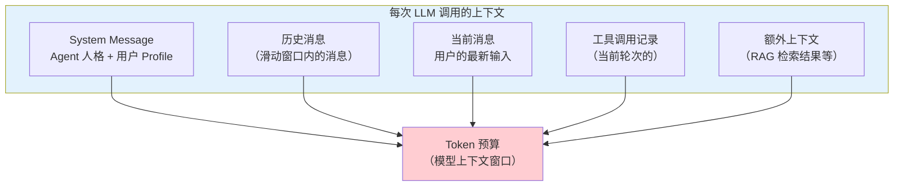

### 4.2 Token 预算分配

模型的上下文窗口是有限的（DeepSeek 通常 64K-128K Token）。必须合理分配 Token 预算：

```java
// ⚠ 修正: TokenBudgetAdvisor 不是 Spring AI 内置组件（附录 05-SpringAI2-API基准/00-Advisor与ChatMemory）——
// 上下文预算需自研实现 CallAdvisor/StreamAdvisor（在 adviseCall 里按 Token 预算压缩 prompt 消息）
@Bean
ChatClient chatClient(ChatClient.Builder builder, ChatMemory chatMemory) {
    return builder
            .defaultAdvisors(
                    // 记忆 Advisor：管理历史消息
                    MessageChatMemoryAdvisor.builder(chatMemory)
                            .build(),
                    // 自研 Token 预算 Advisor（示意，见下）
                    new TokenBudgetAdvisor(4096)   // 限制历史消息最多 4096 Token
            )
            .build();
}

// 自研 Token 预算 Advisor（真实实现要点: 在 adviseCall 中调用 chain 前，
// 按 tokenBudget 裁剪/压缩 request.prompt().getInstructions()，见附录 05-SpringAI2-API基准）
class TokenBudgetAdvisor implements CallAdvisor {
    private final int tokenBudget;
    TokenBudgetAdvisor(int budget) { this.tokenBudget = budget; }
    @Override
    public ChatClientResponse adviseCall(ChatClientRequest request, CallAdvisorChain chain) {
        // trimMessagesToBudget(request, tokenBudget);   // 实现见教程 04-企业级架构主干/00-管控分离架构 §上下文压缩
        return chain.nextCall(request);
    }
    @Override
    public String getName() { return "TokenBudgetAdvisor"; }
}
```

### 4.3 上下文压缩策略

当对话过长时，直接丢弃旧消息会丢失重要信息。更智能的策略是**压缩摘要**：

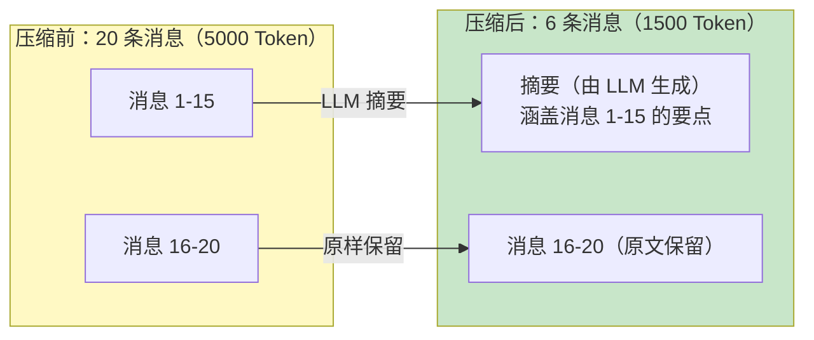

```java
import org.springframework.ai.chat.client.ChatClient;
import org.springframework.ai.chat.client.ChatClientRequest;
import org.springframework.ai.chat.client.ChatClientResponse;
import org.springframework.ai.chat.client.advisor.api.CallAdvisor;
import org.springframework.ai.chat.client.advisor.api.CallAdvisorChain;
import org.springframework.ai.chat.messages.Message;
import org.springframework.ai.chat.messages.SystemMessage;
import org.springframework.ai.chat.prompt.Prompt;
import org.springframework.stereotype.Component;

import java.util.ArrayList;
import java.util.List;
import java.util.stream.Collectors;

// Spring AI 2.0.0 — 上下文压缩 Advisor（正确签名：adviseCall(ChatClientRequest, CallAdvisorChain)）
// 字段级修改采用 request.mutate().prompt(...) 的不可变派生（附录 05 基准 §1.2；
// ChatClientRequest 是 record(prompt, context)，没有 messages()/builder().from()）
@Component
public class ContextCompressionAdvisor implements CallAdvisor {

    private static final int COMPRESS_THRESHOLD = 15;
    private static final int KEEP_RECENT = 5;

    private final ChatClient summarizeClient;          // 专用摘要客户端（可用便宜模型）

    public ContextCompressionAdvisor(ChatClient summarizeClient) {
        this.summarizeClient = summarizeClient;
    }

    @Override
    public ChatClientResponse adviseCall(ChatClientRequest request, CallAdvisorChain chain) {
        List<Message> messages = request.prompt().getInstructions();

        if (messages.size() <= COMPRESS_THRESHOLD) {
            return chain.nextCall(request);            // 未超阈值：原样放行（唯一出口）
        }

        // 1. 切分：老消息压缩，最近 KEEP_RECENT 条原文保留
        List<Message> toCompress = messages.subList(0, messages.size() - KEEP_RECENT);
        List<Message> toKeep = messages.subList(messages.size() - KEEP_RECENT, messages.size());

        // 2. 用 LLM 生成摘要
        String summary = summarizeMessages(toCompress);

        // 3. 用摘要替换原始消息，构建新请求（不可变派生，不改原 request）
        List<Message> compressed = new ArrayList<>();
        compressed.add(new SystemMessage("之前的对话摘要：" + summary));
        compressed.addAll(toKeep);

        ChatClientRequest effective = request.mutate()
                .prompt(new Prompt(compressed, request.prompt().getOptions()))
                .build();

        // 4. 用新请求继续链——注意只有一个 return，没有"先 return request 再 nextCall"
        return chain.nextCall(effective);
    }

    @Override
    public String getName() {
        return "ContextCompressionAdvisor";
    }

    private String summarizeMessages(List<Message> messages) {
        // 调用 LLM 对历史消息进行摘要（摘要失败时的兜底：直接截断，见 §4.2 预算策略）
        return summarizeClient.prompt()
                .system("将以下对话压缩为简洁摘要，保留关键信息")
                .user(messages.stream().map(Message::getText).collect(Collectors.joining("\n")))
                .call()
                .content();
    }
}
```

> 两个实现要点：① `summarizeMessages` 在 Advisor 内又发起一次 LLM 调用——**压缩本身有成本与延迟**，只在超阈值时触发，且摘要客户端建议走便宜模型；② 该 Advisor 要排在记忆 Advisor **之后**（先生效记忆窗口、再压缩剩余消息），顺序控制见 [教程 02-SpringAI核心机制/04-Advisor链与拦截器]。

---

## 5. Spring AI 中的状态管理实现

Spring AI 2.0 没有提供显式的"状态机"抽象，但通过 `ChatMemory` + `Advisor` + `CONVERSATION_ID` 三者的组合，构成了完整的状态管理体系。

### 5.1 状态管理的三要素

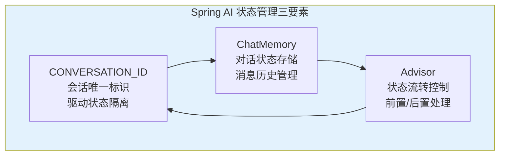

### 5.2 完整的状态管理实现

```java
import org.springframework.ai.chat.client.ChatClient;
import org.springframework.ai.chat.client.advisor.MessageChatMemoryAdvisor;
import org.springframework.ai.chat.memory.ChatMemory;
import org.springframework.ai.chat.memory.InMemoryChatMemoryRepository;
import org.springframework.ai.chat.memory.MessageWindowChatMemory;
import org.springframework.context.annotation.Bean;
import org.springframework.context.annotation.Configuration;

@Configuration
public class AgentStateConfig {

    // Spring AI 2.0.0 — 完整的 Agent 状态管理配置
    // 官方仓库仅 InMemory（javap 实证，org.springframework.ai.chat.memory.InMemoryChatMemoryRepository，
    // 直接 new 构造即可，不必依赖 Bean 注入）；JDBC 持久化由 starter spring-ai-starter-model-chat-memory
    // 提供（本地未实证其仓库类坐标，勿写死 import，引入 starter 后按导出类型注入，见附录 05-SpringAI2-API基准/00-Advisor与ChatMemory）
    @Bean
    ChatMemory chatMemory() {
        return MessageWindowChatMemory.builder()
                .chatMemoryRepository(new InMemoryChatMemoryRepository())
                .maxMessages(20)  // 短期记忆：最近 20 条消息
                .build();
    }

    @Bean
    ChatClient agentClient(
            ChatClient.Builder builder,
            ChatMemory chatMemory
    ) {
        return builder
                .defaultSystem("你是企业级智能客服助手，回答专业、简洁、准确。")
                .defaultAdvisors(
                        // Memory Advisor：自动管理对话历史
                        MessageChatMemoryAdvisor.builder(chatMemory).build()
                )
                .build();
    }
}
```

### 5.3 多用户并发状态隔离

在 Web 应用中，多个用户同时与 Agent 对话。状态隔离的关键是 `CONVERSATION_ID`。

```java
@RestController
public class AgentController {

    private final ChatClient chatClient;

    public AgentController(ChatClient chatClient) {
        this.chatClient = chatClient;
    }

    // Spring AI 2.0.0 — 多用户并发，每个用户独立会话状态
    @PostMapping("/agent/chat")
    public Flux<String> chat(
            @RequestHeader("X-User-Id") String userId,
            @RequestParam String message
    ) {
        // 用 userId 作为 conversationId，确保每个用户的会话独立
        String conversationId = "user-" + userId;

        return chatClient.prompt()
                .user(message)
                .advisors(a -> a.param(ChatMemory.CONVERSATION_ID, conversationId))
                .stream()
                .content();
    }

    // Spring AI 2.0.0 — 同一用户多个独立会话
    @PostMapping("/agent/chat/{sessionId}")
    public Flux<String> chatWithSession(
            @RequestHeader("X-User-Id") String userId,
            @PathVariable String sessionId,
            @RequestParam String message
    ) {
        // userId + sessionId 组合，支持同一用户的多会话
        String conversationId = "user-" + userId + "-session-" + sessionId;

        return chatClient.prompt()
                .user(message)
                .advisors(a -> a.param(ChatMemory.CONVERSATION_ID, conversationId))
                .stream()
                .content();
    }
}
```

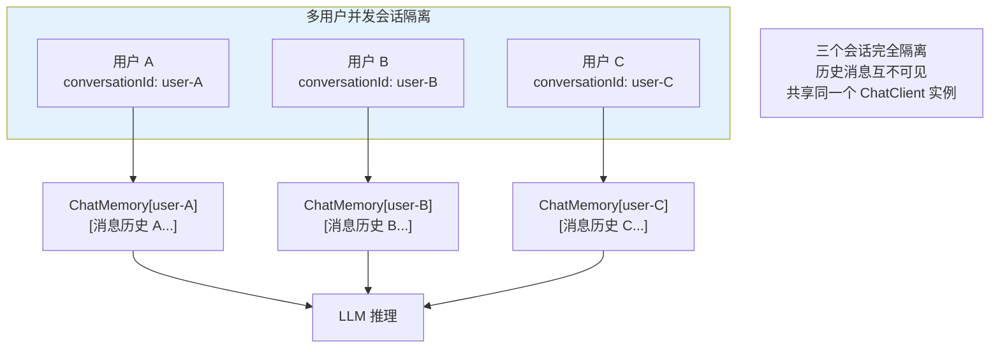

**conversationId 越权校验（必做，不是可选项）**。`chatWithSession` 接受客户端传来的任意 `sessionId`——如果只拼接不校验，用户 A 把 sessionId 换成 `user-B-session-x` 就能读到用户 B 的会话历史（ChatMemory 的读完全由 conversationId 决定）。**conversationId 是寻址键，不是凭证**。必须在拼出 conversationId 后、调用 ChatClient 前做归属校验：

```java
// Spring AI 2.0.0 — 会话归属校验：conversationId 必须属于当前用户
String conversationId = "user-" + userId + "-session-" + sessionId;

// 校验 1（推荐）：会话表登记归属，每次访问比对
if (!sessionStore.isOwnedBy(conversationId, userId)) {
    throw new ResponseStatusException(HttpStatus.FORBIDDEN, "会话不存在或无权访问");
}

// 校验 2（纵深防御）：即使会话表被绕过，拆出的会话键也必须落在当前用户命名空间内
// （前缀构造天然把 userId 编进键里——注意拼接顺序必须让 userId 参与最终键，不能是纯 sessionId）
```

配套纪律：会话列表接口只返回本人会话（列表页不泄露他人 conversationId）；会话 ID 用不可预测值（UUID）而非自增（防遍历）；越权访问记审计事件。多租户体系下的完整隔离（租户/用户/会话三级）见 [教程 04-企业级架构主干/06-多租户隔离与资源治理]。

### 5.4 Advisor 上下文传递

Agent 在执行过程中可能需要在 Advisor 之间传递中间状态。Spring AI 的 Advisor 上下文（`ChatClientRequest` 上的 advisor context）随调用链流动，前置 Advisor 写入、后置 Advisor 可读：

```java
import org.springframework.ai.chat.client.ChatClientRequest;
import org.springframework.ai.chat.client.ChatClientResponse;
import org.springframework.ai.chat.client.advisor.api.CallAdvisor;
import org.springframework.ai.chat.client.advisor.api.CallAdvisorChain;

import java.util.Map;

// Spring AI 2.0.0 — 自定义 Advisor 用于状态传递（正确签名，单一出口）
@Component
public class TaskStateAdvisor implements CallAdvisor {

    public static final String CURRENT_TASK = "currentTask";
    public static final String TASK_STEP = "taskStep";

    @Override
    public ChatClientResponse adviseCall(ChatClientRequest request, CallAdvisorChain chain) {
        // 前置处理：从 Advisor 上下文读取任务状态（context 值是 Object，取值后判空转型）
        Map<String, Object> ctx = request.context();
        String task = (String) ctx.get(CURRENT_TASK);
        Integer step = ctx.get(TASK_STEP) instanceof Number n ? n.intValue() : null;

        // 有任务状态才注入 context 键；没有就原样放行——两个分支都只走一个 return
        // 真实姿势：request.mutate().context(key, value).build()（无 builder().from()/contextEntry()）
        ChatClientRequest effective = (task == null)
                ? request
                : request.mutate()
                        .context("task_brief",
                                "当前任务：" + task + "，执行步骤：" + (step != null ? step : 0))
                        .build();

        return chain.nextCall(effective);
    }

    @Override
    public String getName() {
        return "TaskStateAdvisor";
    }
}
```

调用方写入上下文、注入位置消费——一次调用内"带状态进链"：

```java
// 写入侧：业务代码把任务状态放进本次请求的 Advisor 上下文
chatClient.prompt()
        .user(userMessage)
        .advisors(a -> a
                .param(ChatMemory.CONVERSATION_ID, conversationId)
                .param(TaskStateAdvisor.CURRENT_TASK, taskDescription)   // 自定义参数随链流动
                .param(TaskStateAdvisor.TASK_STEP, currentStep))
        .call()
        .content();
```

> 注意与 §4.3 压缩 Advisor 的差别：TaskStateAdvisor 只做**注入**（读上下文、改造请求），不做"后置回写上下文"——响应侧改写需要操作 `ChatClientResponse`，2.0 里响应由链返回、不可就地 mutate，跨调用持久化任务状态应走 §6 的任务存储，而不是塞回上下文。

### 5.5 WebFlux 落地：请求上下文经 Reactor Context 传给 Advisor

流式链路（`stream()`）上，§5.4 的"调用前 `.advisors(param)` 写入"依然可用；但还有一类上下文**不是每次调用手动传的**——`userId`、`tenantId`、traceId 这类**请求作用域元数据**，它们应该在 Controller 入口出现一次、自动流经整条响应式链。WebFlux 铁律：**禁止用 ThreadLocal/MDC 承载**（事件循环线程会被多个请求共享，切线程即丢，且污染他人请求）；正确载体是 **Reactor Context**——随订阅传播、与链路绑定：

```java
import org.springframework.ai.chat.client.ChatClientRequest;
import org.springframework.ai.chat.client.ChatClientResponse;
import org.springframework.ai.chat.client.advisor.api.StreamAdvisor;
import org.springframework.ai.chat.client.advisor.api.StreamAdvisorChain;
import reactor.core.publisher.Flux;

// Spring AI 2.0.0 — Reactor Context 传递 userId（基准模板见附录 05 基准 §1.2）
// ① Controller 入口：把请求元数据写入 Context（contextWrite 自下而上传播）
@PostMapping("/agent/chat")
public Flux<String> chat(@RequestHeader("X-User-Id") String userId,
                         @RequestParam String message) {
    String conversationId = "user-" + userId;

    return chatClient.prompt()
            .user(message)
            .advisors(a -> a.param(ChatMemory.CONVERSATION_ID, conversationId))
            .stream()
            .content()
            // 自下而上：让上游（包括 Advisor 链）都能读到这个上下文
            .contextWrite(ctx -> ctx.put("userId", userId));
}

// ② 消费侧：自定义 StreamAdvisor 从 Reactor Context 取值（而不是 ThreadLocal）
public class UserContextStreamAdvisor implements StreamAdvisor {

    @Override
    public Flux<ChatClientResponse> adviseStream(ChatClientRequest request,
                                                 StreamAdvisorChain chain) {
        return chain.nextStream(request)
                // deferContextual：拿到的是"订阅时"的 Context，链上任何位置写入都可见
                .transformDeferredContextual((flux, ctx) ->
                        flux.doOnNext(resp -> audit.write(
                                ctx.getOrDefault("userId", "anonymous"),  // ← 这里取 userId
                                resp)));
    }

    @Override
    public String getName() { return "UserContextStreamAdvisor"; }
}
```

三条纪律（WebFlux 上下文传递铁律的落地）：① `contextWrite` 只影响**上游**（订阅方向），所以写在链的最末端才能被整条链读到；② 取值用 `deferContextual`/`transformDeferredContextual`，不能在组装期读 Context（那时还没订阅）；③ `call()` 同步调用链没有 Reactor Context 可用，请求元数据走 `.advisors(param)` 显式传——两套机制按调用模式选，别在同步路径上硬套 Context。完整原理见 [教程 01-WebFlux与响应式编程/01-Reactor核心]。

---

## 6. 长任务的状态持久化

Agent 可能执行长时间运行的任务（多步骤、需要等待外部事件）。任务状态需要持久化到外部存储，支持中断恢复。

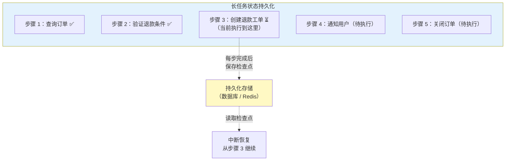

```java
// Spring AI 2.0.0 — 长任务状态持久化
@Service
public class LongRunningTaskService {

    private final ChatClient chatClient;
    private final TaskCheckpointRepository checkpointRepo;

    public LongRunningTaskService(ChatClient chatClient, 
                                   TaskCheckpointRepository checkpointRepo) {
        this.chatClient = chatClient;
        this.checkpointRepo = checkpointRepo;
    }

    public String executeTask(String conversationId, String taskDescription) {
        // 检查是否有未完成的检查点
        TaskCheckpoint checkpoint = checkpointRepo.findByConversationId(conversationId);

        int startStep = (checkpoint != null) ? checkpoint.getLastCompletedStep() : 0;

        // Agent 执行任务
        String result = chatClient.prompt()
                .system("你是一个任务执行 Agent。当前任务：" + taskDescription 
                        + "，从步骤 " + (startStep + 1) + " 开始。")
                .user("执行任务")
                .advisors(a -> a
                        .param(ChatMemory.CONVERSATION_ID, conversationId)
                        .param("startStep", startStep))
                .call()
                .content();

        // 保存检查点
        checkpointRepo.save(new TaskCheckpoint(conversationId, taskDescription, startStep + 1));

        return result;
    }
}
```

上面的检查点只记了"执行到第几步"——真实任务状态要丰富得多，值得为它建独立的数据模型。

### 6.1 任务状态数据模型

ChatMemory 存的是**对话**（消息序列），任务状态存的是**进度**（步骤、中间产物、失败原因）。两者分离存储，任务表建议至少有这些字段：

```java
// Spring AI 2.0.0 — 任务状态数据模型（业务自建，Spring AI 无内置任务抽象）
public record TaskRecord(
        String taskId,                  // 任务唯一 ID（UUID）
        String conversationId,          // 归属会话——一个会话可挂多个任务（见 §6.2）
        String userId,                  // 冗余存 userId：越权校验与配额统计都要用
        String description,             // 任务目标（自然语言）
        TaskStatus status,              // PENDING / RUNNING / AWAITING_INPUT / DONE / FAILED / CANCELLED
        int currentStep,                // 当前执行到的步骤号
        int totalSteps,                 // 计划总步数（可动态追加）
        Map<String, String> stepResults,// 步骤号 → 中间结果摘要（见 §6.3）
        String lastError,               // 最近一次失败原因（恢复与诊断用）
        Instant createdAt,
        Instant updatedAt
) {}

public enum TaskStatus {
    PENDING, RUNNING, AWAITING_INPUT,   // 等待用户输入/HITL 审批——不是失败，是暂停
    DONE, FAILED, CANCELLED
}
```

设计要点：**`AWAITING_INPUT` 与 `FAILED` 必须区分**——前者是正常暂停（等用户确认、等 HITL 审批，恢复即继续），后者要人工介入；`stepResults` 只存**摘要**（每步结果压到几百字符），完整产物放对象存储/文件表，别把任务表当文档库；`userId` 冗余一份，避免每次校验都回查会话表（呼应 §5.3 越权校验）。

### 6.2 一个会话，多个任务

用户在一个会话里可以先后发起多个任务："先帮我订机票"（任务 A）、"顺便查下签证材料"（任务 B）。会话与任务是**一对多**关系，conversationId 不能再当任务键用：

| 场景 | 键的用法 |
|------|---------|
| 对话记忆 | `ChatMemory` 按 `conversationId` 存（跨任务共享——"刚才说的那个航班"要能指代任务 A） |
| 任务进度 | `TaskRecord` 按 `taskId` 存（每个任务独立的步骤链） |
| 恢复/列表 | 按 `conversationId` 查任务列表，按 `taskId` 恢复单个任务 |

歧义处理是多任务会话的真实难点：用户说"继续"指哪个任务？工程上给 Agent 的 System Prompt 注入当前会话的**任务清单摘要**（各任务一行状态），让模型显式消解指代——"会话里有 2 个任务：A 订机票（RUNNING，第 3/5 步）、B 查签证（AWAITING_INPUT）。用户说'继续'，判断指向…"。

### 6.3 中间结果注入后续 Prompt

任务跨轮次执行时，新一轮调用怎么"知道"上一轮干到了哪？答案不是指望 ChatMemory（窗口有限、细节会被淹没），而是**把任务状态的最新快照注入 System Prompt**——这正好复用 §5.4 的 Advisor 上下文机制：

```java
// Spring AI 2.0.0 — 任务快照注入：每轮调用前，把任务进度摘要拼进 System Prompt
public String continueTask(String conversationId, String taskId, String userMessage) {
    TaskRecord task = taskRepo.findById(taskId).orElseThrow();

    // 步骤结果 → 紧凑快照（控制 Token：每步只留摘要行）
    String snapshot = task.stepResults().entrySet().stream()
            .map(e -> "第" + e.getKey() + "步：" + e.getValue())
            .collect(Collectors.joining("\n"));

    String systemPrompt = """
            你正在执行一个多步任务。
            任务目标：%s
            进度：第 %d/%d 步（状态：%s）
            已完成步骤摘要：
            %s
            用户最新输入可能与任务相关，请结合进度决定：继续下一步 / 向用户澄清 / 标记完成。
            """.formatted(task.description(), task.currentStep(),
            task.totalSteps(), task.status(), snapshot);

    String result = chatClient.prompt()
            .system(systemPrompt)
            .user(userMessage)
            .advisors(a -> a.param(ChatMemory.CONVERSATION_ID, conversationId))
            .call()
            .content();

    taskRepo.save(task.withStepAdvanced(result));   // 摘要回写任务表（非 ChatMemory）
    return result;
}
```

**双通道记忆的分工**由此定型：ChatMemory 管"对话怎么说的"（语气、指代、用户偏好），任务表管"事情做到哪了"（步骤、产物、状态机）。中间结果注入 Prompt 是这两个通道的汇合点——也是 [教程 08-架构师进阶/00-上下文工程] 五层拼接策略中"记忆摘要层"的具体实现之一。

> **遇到阻塞？→ [教程 08-架构师进阶/06-长任务持久化与中断恢复]**：长任务的完整持久化方案——检查点机制、故障恢复、幂等设计。

---

## 7. 并发与集群：状态管理的三个一致性坑

单机单线程跑 demo 时一切美好；一上并发/多实例，状态管理就有三个必踩的坑。

### 7.1 同会话并发请求的竞态

用户在两个标签页对**同一会话**同时发消息，两个请求并发执行"读历史 → 追加新消息 → 写回"——经典 read-modify-write 竞态：后写者覆盖前写者，一轮对话凭空消失；更糟的是两轮回复基于同一份历史生成，Agent 会给出两份互相矛盾的答案。

两条治理路线（通常叠加使用）：

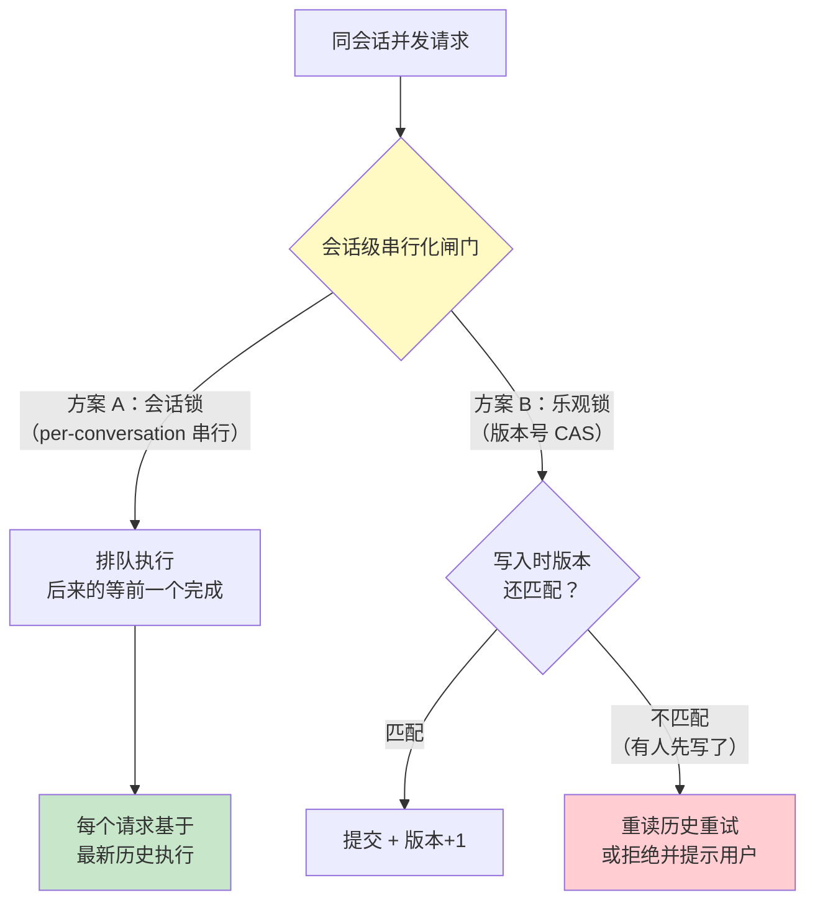

- **会话级串行化（方案 A，体验优先）**：同一 conversationId 的请求排队执行（单机用 `ConcurrentHashMap<String, ReentrantLock>` 或 Reactor 的按 key 分组；分布式用 Redis 锁）。适合对话场景——反正同一会话同时说两句话本来就不合常理，[教程 01-WebFlux与响应式编程/00-WebFlux从零入门 §10.5] 的"同会话最多一条活动流"是同一策略在流式侧的形态。
- **乐观锁（方案 B，吞吐优先）**：ChatMemory 记录带版本号，写入时校验"读时的版本 == 现在的版本"，不匹配则重读重试。官方 JDBC 仓库不内置版本列——自研 `ChatMemoryRepository` 时补上（写记忆用 `ChatMemoryRepository` 真实签名，见 [附录 05-SpringAI2-API基准/00-Advisor与ChatMemory]）。
- **兜底原则**：消息追加用 INSERT 而非整段覆盖——append-only 让竞态的代价从"丢消息"降为"乱序"，后者可按时间戳重排。

### 7.2 @Scheduled 的多实例重复执行

§3.4 的会话过期清理用的是 `@Scheduled`——单机没问题，**部署 3 个实例就有 3 份定时器同时跑**：同一会话被归档三次、`chatMemory.clear` 执行三遍、清理日志三份、通知用户三次。这不是概率问题，是必然问题。解法按重量级排：

| 方案 | 做法 | 适用 |
|------|------|------|
| **分布式锁**（轻量首选） | 定时方法入口抢锁（如 Redis `SET key value NX PX ttl`，Reactor 场景用 `ReactiveRedisTemplate`），抢到才执行 | 任务短、允许偶发跳过 |
| **ShedLock**（工程化） | `@SchedulerLock` 注解 + JDBC/Redis 锁表，锁超时与续期都管好 | 常规定时任务，接入成本低 |
| **单调度器**（架构级） | 把清理类任务拆成独立 worker 部署 1 实例，或上调度平台（XXL-Job 等） | 任务多、要可视化运维 |

注意锁 TTL 要大于任务最长执行时间（否则任务没跑完锁先过期，第二实例进场），又要小于故障恢复容忍度——这对矛盾的平衡就是 ShedLock 存在的理由。

### 7.3 多实例 ChatMemory 的一致性

用官方 `InMemoryChatMemoryRepository` 时，每个实例各存各的——请求落到实例 A 写的消息，路由到实例 B 就读不到，Agent"间歇性失忆"。多实例部署的记忆一致性只有两条正路：

- **共享存储（首选）**：JDBC 仓库（由 starter `spring-ai-starter-model-chat-memory` 提供，本地未实证其仓库类坐标，勿硬写 import）指向同一个数据库——写谁都能读。代价是每轮调用都有读库延迟，可用会话粘性路由（同一会话固定路由到同一实例）+ 读缓存缓解，但缓存要处理失效（§7.1 的版本号可复用）。
- **自研 Redis 仓库**：官方没有 Redis 实现（虚构的 `RedisChatMemoryRepository` 不存在）——需要时自己 `implements ChatMemoryRepository`，WebFlux 栈用 `ReactiveRedisTemplate`，参考 [教程 08-架构师进阶/05-高级记忆架构]。

粘性路由只是优化手段不是正确性手段：实例缩容/发布时路由重分配，没有共享存储照样丢记忆。**一致性靠共享存储保证，性能靠粘性路由优化**，别把两者混为一谈。

---

## 8. 适用场景与不适用场景

### 适用场景

- 多轮对话场景（客服、咨询、辅导），需要保持上下文连贯
- 多步骤任务执行（需要跟踪当前执行到哪一步）
- 多用户并发（需要会话隔离，互不干扰）
- 长时间运行的 Agent（需要状态持久化，支持中断恢复）
- 个性化服务（根据用户 Profile 定制 Agent 行为）

### 不适用场景

- 一次性问答（无状态的 API 调用，不需要历史上下文）
- 简单的文本生成（如翻译、摘要，不涉及状态）
- 对上下文窗口极度敏感的场景（历史消息会消耗 Token，可能不适合）
- 严格无状态的微服务架构（每个请求必须完全独立）

---

## 9. 本章总结

| 概念 | 一句话 |
|------|--------|
| **Agent 状态** | 三个层次：会话状态、对话状态、任务状态 |
| **状态机** | 空闲 → 思考 → 执行工具 → 等待结果 → 回复 → 空闲 |
| **会话生命周期** | 创建 → 活跃 → 挂起/过期 → 结束 → 归档 |
| **CONVERSATION_ID** | 会话唯一标识，驱动状态隔离，每个请求必填——它是寻址键不是凭证，必须做归属校验 |
| **ChatMemory** | 对话状态的存储抽象，官方仓库仅 InMemory/JDBC；Redis 需自研 ChatMemoryRepository |
| **Advisor** | 状态流转的拦截器，adviseCall(ChatClientRequest, CallAdvisorChain) 前置注入上下文 |
| **Reactor Context** | WebFlux 下请求元数据（userId 等）的传递载体，禁 ThreadLocal/MDC |
| **上下文管理** | Token 预算分配 + 上下文压缩，平衡推理质量与成本 |
| **任务状态模型** | TaskRecord（状态机 + 步骤 + 中间结果），会话一对多任务，快照注入 Prompt |
| **长任务持久化** | 检查点机制，每步完成后保存状态，支持中断恢复 |
| **并发与集群** | 会话级串行化/乐观锁治竞态，分布式锁治 @Scheduled 重复执行，共享存储治多实例记忆一致性 |

**下一篇**：[22-结构化输出](03-结构化输出.md) — entity() 映射、BeanOutputConverter 原理与 Schema 治理。

---

> **想深入？→ [教程 00-基础与核心/04-记忆与会话管理]**：ChatMemory API 的完整使用细节和持久化方案。
> **遇到阻塞？→ [教程 08-架构师进阶/06-长任务持久化与中断恢复]**：检查点恢复、幂等设计、故障转移的完整方案。
> **想深入？→ [教程 02-SpringAI核心机制/04-Advisor链与拦截器]**：Advisor 链的执行机制和自定义 Advisor 的完整实现。
> **想深入？→ [附录 05-SpringAI2-API基准/00-Advisor与ChatMemory]**：Advisor 与 ChatMemory 的全部真实签名与虚构 API 对照。
> **想深入？→ [教程 01-WebFlux与响应式编程/01-Reactor核心]**：Reactor Context 的传播原理（contextWrite/deferContextual）。
> **想深入？→ [教程 07-Kafka事件骨干/04-日志存储与高可用复制]**：事件溯源日志的保留/压实策略——压实主题如何充当"每会话最新快照"的物化载体。

> **想深入？→ [附录 15/13-codex-harness/00-总体架构与会话Actor]**：单写者 Actor + 版本号快照的会话状态管理参考实现。
