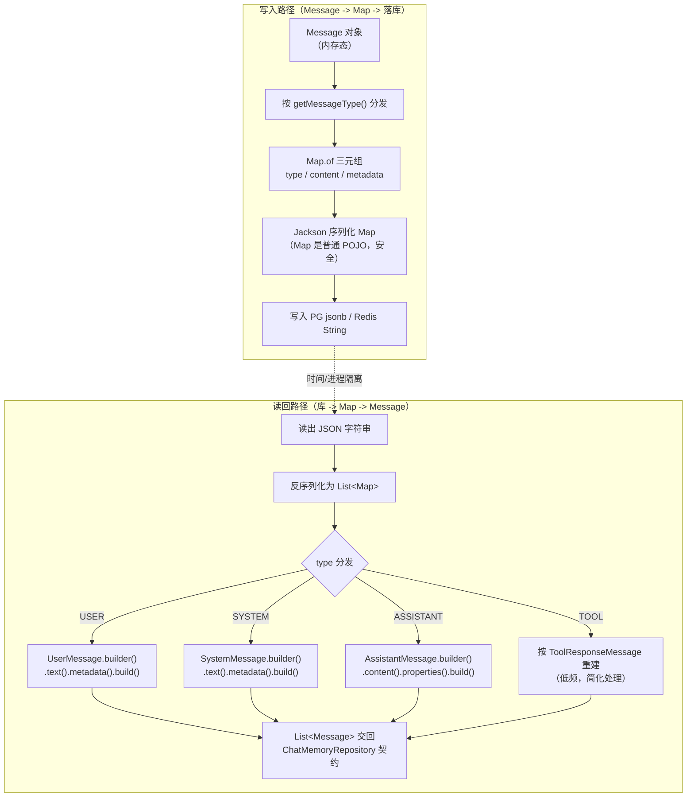
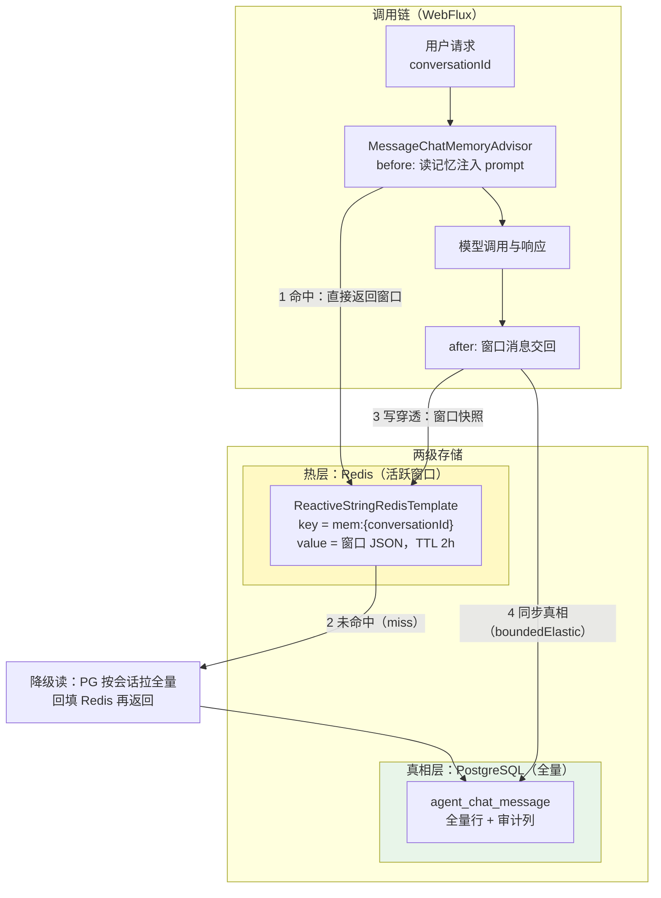

# 12 ChatMemory 持久化与工业级记忆存储

> **定位**：讲透 Spring AI 2.0 会话记忆的**持久化落库与治理**全量工程样例。核心事实先行：本地锁定的 2.0.0 中，官方仅提供 `InMemoryChatMemoryRepository` 一个自动装配实现（javap 实证 spring-ai-model-2.0.0.jar 中 chat.memory 包只有四个类型），官网文档里的 Jdbc/Redis/Cassandra 等仓库是 2.1+ 的内容——所以本篇主线就是**自研 `ChatMemoryRepository` 落库**：PG 全量真相表设计、Message→Map 序列化与按 MessageType builder 重建的 round-trip 范式（体系铁律：`Message` 直接 JSON 序列化读回必炸）、Redis 热窗口两级方案（写穿透 + 降级读）、窗口压缩/TTL 归档/多租户隔离、以及会话审计、GDPR 删除权、记忆成本计量三个企业级治理样例。读完这一篇，你能把 demo 级的内存记忆升级为可审计、可合规、可恢复的工业级记忆存储。
>
> **读者画像**：已会挂 `MessageChatMemoryAdvisor` 的中高级 Java 开发者；正在把 Agent 会话记忆从内存搬到 PG/Redis 的工程师；需要满足审计与 GDPR 合规的架构师。
>
> **前置阅读**：[教程 02-SpringAI核心机制/02-Agent状态管理]（状态与 Advisor 记忆机制本体）；[教程 02-SpringAI核心机制/00-ChatClient企业级全量样例 §8]（Advisor 组合与 `CONVERSATION_ID`）；高级记忆架构（三层记忆/语义 vs 情景记忆/记忆演化）见 [教程 08-架构师进阶/05-高级记忆架构]——本篇不重复其概念，专讲**持久化工程**。

---

## 1. 为什么记忆持久化是工业级分水岭

`InMemoryChatMemoryRepository`（内部就是一个 `Map<String, List<Message>>`，javap 实证其字段）在三个工业级场景面前会直接失守：

1. **进程生命周期**：发布重启、实例漂移、扩缩容——内存记忆随进程消亡，用户会话上下文全丢。多实例部署下不同请求落在不同实例，连"本次对话"都串不起来。
2. **合规审计**：金融/医疗场景要求对话记录留存与可回溯（会话归档、审计查询），内存实现无法提供任何查询接口。
3. **治理与成本**：会话数、消息量、Token 占用无法计量；用户行使删除权（GDPR 第 17 条）时无从删除。

持久化的本质不是"换个存储"，而是给记忆补上**真相源（Source of Truth）**。本篇的两级方案里：PG 是全量真相（可查询、可归档、可删除），Redis 是活跃热窗口（低延迟读），两者以写穿透保持一致。

### 1.1 本篇与体系其他篇的分工

| 主题 | 在哪里 | 本篇边界 |
|------|--------|---------|
| ChatMemory/Advisor 挂载机制、CONVERSATION_ID 传递 | [教程 02-SpringAI核心机制/02-Agent状态管理] | 只引用不展开 |
| 三层记忆（短期→长期→外部 RAG）、语义/情景记忆、记忆演化 | [教程 08-架构师进阶/05-高级记忆架构] | 概念从简 |
| ChatClient/Advisor 组合写法 | [教程 02-SpringAI核心机制/00-ChatClient企业级全量样例 §8] | 只给记忆装配链 |
| **ChatMemoryRepository 落库、round-trip、两级存储、治理** | **本篇** | 全量样例 |

---

## 2. 记忆接口体系：全量签名（javap 实证）

以下签名全部来自本地 `spring-ai-model-2.0.0.jar`（`org.springframework.ai.chat.memory` 包），是 2.0.0 的 ground truth：

| 类型 | 真实签名 | 说明 |
|------|---------|------|
| `ChatMemory`（接口） | `void add(String, Message)`（default）/ `void add(String, List<Message>)` / `List<Message> get(String)` / `void clear(String)`；常量 `String CONVERSATION_ID` | 面向调用方的会话记忆门面 |
| `ChatMemoryRepository`（接口） | `List<String> findConversationIds()` / `List<Message> findByConversationId(String)` / `void saveAll(String, List<Message>)` / `void deleteByConversationId(String)` | **自研落库的唯一实现缝**，四个方法全是阻塞签名 |
| `MessageWindowChatMemory`（final 类） | 实现 `ChatMemory`；`static Builder builder()`，Builder 三方法：`chatMemoryRepository(ChatMemoryRepository)` / `maxMessages(int)` / `build()` | 窗口实现：淘汰最老消息、保留 System 消息 |
| `InMemoryChatMemoryRepository`（final 类） | 实现 `ChatMemoryRepository`；无参构造；内部字段 `Map<String, List<Message>> chatMemoryStore` | 官方唯一内置仓库 |

三个体系事实值得点名：

1. **`ChatMemory.get(String)` 单参**（只传会话号）——任何写 `get(conversationId, count)` 之类双参重载的代码都是 1.x 残留或虚构。
2. **`ChatMemoryRepository` 的四个方法全是阻塞签名**——这是 §5.3"阻塞接口与 WebFlux 边界"问题的根源：接口本身决定了落库是阻塞 I/O。
3. **窗口策略在 `MessageWindowChatMemory`，不在 Repository**——Repository 只管"全量存取"，窗口裁剪发生在门面层。自研时不要在 Repository 里偷偷做窗口逻辑，否则两级存储会各自为政。

### 2.1 自动配置装配链（字节码实证）

`spring-ai-autoconfigure-model-chat-memory-2.0.0.jar` 的 `ChatMemoryAutoConfiguration`（包名 `org.springframework.ai.model.chat.memory.autoconfigure`）只做两件事，反编译字节码确认：

```text
// ChatMemoryAutoConfiguration 字节码事实（javap -c）
chatMemoryRepository()  -> new InMemoryChatMemoryRepository()          // @ConditionalOnMissingBean
chatMemory(repo)        -> MessageWindowChatMemory.builder()
                              .chatMemoryRepository(repo).build()      // @ConditionalOnMissingBean
```

两个 `@Bean` 方法都标注 `@ConditionalOnMissingBean`（javap -v 确认注解存在）——这就是**自研替换的合法缝**：只要你自己注册一个 `ChatMemoryRepository` Bean，自动配置立即让位，`MessageWindowChatMemory` 会自动包住你的仓库。你的自研仓库**不需要**实现 `ChatMemory`，只需要实现 `ChatMemoryRepository` 四个方法。

### 2.2 MessageWindowChatMemory 的窗口行为（含默认值字节码证据）

窗口门面的行为规则，直接决定自研仓库的读写语义：

| 行为 | 规则 | 对落库的影响 |
|------|------|-------------|
| 窗口上限 | `maxMessages(int)`，**默认 20**（字节码实锤：`Builder` 构造器中 `bipush 20; putfield maxMessages`） | 默认值应显式覆盖并写入配置，避免"生产窗口多大没人知道" |
| 淘汰策略 | 超限淘汰**最老**消息 | 被淘汰的消息不再出现在 `saveAll` 入参——仓库若做增量 append 就会残留（§9 误区四） |
| System 保护 | System 消息不参与淘汰 | `findByConversationId` 读回的列表头部总有 system 行，重建时保持顺序即可 |
| 新 System 替换 | 追加新 System 消息时，旧的 System 消息全部移除 | 人格热切换场景：库里同一会话可能只剩最新一条 SYSTEM 行 |

关键推论：`ChatMemory` 门面每轮交互后调用 `saveAll(conversationId, 窗口内全部消息)`——**入参就是当前窗口快照**。这就是 §4.4 仓库实现采用"先删后插全量快照"的契约依据；你的仓库只需要忠实反映入参，窗口逻辑完全不必操心。

---

## 3. 铁律案例：为什么 Message 直接 JSON 序列化必炸

这是本体系 2026-08-22 用真实 round-trip 代价换来的教训（附录 00-Advisor与ChatMemory §2.3 有完整剖析），本篇把它变成工程范式。

### 3.1 炸的机理

Spring AI 的 `Message` 及其子类（`UserMessage`/`SystemMessage`/`AssistantMessage`）的字段是 `private final`，且**没有** Jackson 的 property-based Creator（`@JsonCreator`/`@JsonProperty` 构造器标注）。后果：

- **写入侧看起来成功**：Jackson 反射序列化出 `{"text":"...","media":[...],"metadata":{...}}` 存进 Redis/PG，一切正常；
- **读取侧必炸**：反序列化需要构造对象，没有 Creator 时 Jackson 只能产出 `LinkedHashMap`（类型信息丢失）或直接抛 `no property-based Creator` 异常；
- **触发时机隐蔽**：读回只在"已有历史"时发生——首次请求无历史读空、不炸；第二次读旧数据才炸。**"写入成功"完全不等于"能读回"**，持久化 bug 必须读写两端都验证。

### 3.2 正确范式：Map 中间格式 + 按 MessageType 重建

序列化落库的不是 `Message` 对象，而是**自描述的三元 Map**（`type`/`content`/`metadata`，AssistantMessage 追加 `toolCalls`）；读回时按 `MessageType` 分发到对应 builder 重建。整个流程：



**注意 builder 的一个实证差异**：`UserMessage$Builder` 与 `SystemMessage$Builder` 的元数据方法是 `metadata(Map)`，而 `AssistantMessage$Builder` 的同名能力叫 **`properties(Map)`**（javap 实证：`content`/`properties`/`toolCalls`/`media`/`build`）——重建代码里两类 builder 不能复制粘贴，这是最容易踩的静默坑（IDE 补全会帮你选错也不会报错，直到 `getMetadata()` 返回空）。

### 3.3 两条路线的失败形态对照

| 维度 | 路线 A：直接序列化 Message（错误） | 路线 B：Map 中间格式 + builder 重建（本篇范式） |
|------|----------------------------------|---------------------------------------------|
| 写入 | 看似成功（反射吐出 JSON） | 成功且格式自描述 |
| 读回 | `LinkedHashMap` 劣化或 `no property-based Creator` 异常 | 按类型精确重建，`getClass()` 断言可验证 |
| 首次请求 | 不炸（无历史读空）——**问题被延迟暴露** | 无差异 |
| 升级兼容 | 类结构一变（加字段/改包名）旧数据全部读不回 | Map 键稳定，新旧版本仅影响缺失键的默认值 |
| 排查成本 | 生产事故现场才炸，且炸在第二次请求 | round-trip 验证阶段即拦截 |

升级兼容一行值得展开：路线 A 的 JSON 里隐含了类的字段布局，Spring AI 升级后 `Message` 内部字段变化（1.x→2.0 已经大改过），历史数据就是定时炸弹；路线 B 的 Map 格式是你自己的契约，只要 `type`/`content`/`metadata` 三键不变，底层类怎么改都与你无关——**持久化格式与领域类型解耦**，这是所有存储设计的通用原则。

---

## 4. 自研 PgChatMemoryRepository：全量实现

本节代码均为**自研·概念代码**（基于 Spring Boot 4.1 标准能力：`JdbcTemplate` + PG JSONB；需在 pom.xml 添加 `spring-boot-starter-jdbc` 与 `org.postgresql:postgresql` 依赖，Spring AI 侧不引入任何新构件）。序列化用 Jackson 3（`tools.jackson`，随 Boot 4.1 传递，Spring AI 内部亦用它）。

### 4.1 表设计

会话全量真相表，直接预埋审计/GDPR/多租户所需的列：

```sql
-- 自研·概念代码 — 会话记忆全量真相表（PostgreSQL）
CREATE TABLE IF NOT EXISTS agent_chat_message (
    id              BIGSERIAL PRIMARY KEY,
    tenant_id       VARCHAR(64)  NOT NULL,              -- 租户隔离（§6.3）
    user_id         VARCHAR(128) NOT NULL,              -- GDPR 删除权主体（§8.2）
    conversation_id VARCHAR(128) NOT NULL,              -- 会话号（ChatMemory.CONVERSATION_ID 传入值）
    seq_no          INT          NOT NULL,              -- 会话内序号，保证消息顺序
    msg_type        VARCHAR(16)  NOT NULL,              -- USER / ASSISTANT / SYSTEM / TOOL
    content         TEXT         NOT NULL,              -- 消息正文（getContent 取文本）
    metadata        JSONB        NOT NULL DEFAULT '{}'::jsonb,  -- 消息 metadata 全量
    tool_calls      JSONB        NULL,                  -- ASSISTANT 的 toolCalls（可空）
    created_at      TIMESTAMPTZ  NOT NULL DEFAULT now(),
    archived        BOOLEAN      NOT NULL DEFAULT FALSE, -- TTL 归档标记（§6.2）
    CONSTRAINT uk_conversation_seq UNIQUE (conversation_id, seq_no)
);
CREATE INDEX IF NOT EXISTS idx_msg_tenant_user  ON agent_chat_message (tenant_id, user_id);
CREATE INDEX IF NOT EXISTS idx_msg_conversation ON agent_chat_message (conversation_id, seq_no);
CREATE INDEX IF NOT EXISTS idx_msg_archived     ON agent_chat_message (archived, created_at);
```

设计取舍三条：其一，**content 与 metadata 拆列**——正文走 `TEXT` 便于审计检索，元数据走 `JSONB` 保留任意键值，比整体一个大 JSON 可查得多；其二，`(conversation_id, seq_no)` 唯一约束同时解决顺序与幂等（重放写入不会翻倍）；其三，`tenant_id`/`user_id` 冗余到行级，GDPR 按用户删除与租户配额统计都是单表操作，不需要 join。

### 4.2 MessageMapCodec：序列化与重建（round-trip 核心）

```java
// Spring AI 2.0.0 + Jackson 3（tools.jackson，随 Boot 4.1 传递）
// 自研·概念代码：本类为体系自研组件，非 Spring AI API
package com.example.agent.memory;

import java.util.ArrayList;
import java.util.HashMap;
import java.util.List;
import java.util.Map;
import org.springframework.ai.chat.messages.AssistantMessage;
import org.springframework.ai.chat.messages.Message;
import org.springframework.ai.chat.messages.MessageType;
import org.springframework.ai.chat.messages.SystemMessage;
import org.springframework.ai.chat.messages.UserMessage;
import tools.jackson.databind.ObjectMapper;

/**
 * Message <-> Map 双向编解码。
 * 落库格式：{type, content, metadata, toolCalls?}
 * 铁律：绝不直接序列化 Message 对象（private final 无 Creator，读回必炸）；
 * 读回后按 MessageType 用 builder 重建（注意 AssistantMessage 用 properties() 非 metadata()）。
 */
public final class MessageMapCodec {

    private static final String KEY_TYPE = "type";
    private static final String KEY_CONTENT = "content";
    private static final String KEY_METADATA = "metadata";
    private static final String KEY_TOOL_CALLS = "toolCalls";

    private final ObjectMapper objectMapper;

    public MessageMapCodec(ObjectMapper objectMapper) {
        this.objectMapper = objectMapper;
    }

    /** Message -> Map（纯 Java 结构，Jackson 序列化零风险） */
    public Map<String, Object> toMap(Message message) {
        Map<String, Object> map = new HashMap<>();
        map.put(KEY_TYPE, message.getMessageType().getValue());
        map.put(KEY_CONTENT, message.getText());
        Map<String, Object> metadata = message.getMetadata();
        map.put(KEY_METADATA, metadata == null ? Map.of() : metadata);
        if (message instanceof AssistantMessage assistant
                && assistant.hasToolCalls()) {
            map.put(KEY_TOOL_CALLS, assistant.getToolCalls());
        }
        return map;
    }

    public String toJson(Message message) {
        return objectMapper.writeValueAsString(toMap(message));
    }

    /** 通用 JSON 序列化透传（metadata / toolCalls 落库列使用） */
    public String writeJson(Object value) {
        return objectMapper.writeValueAsString(value);
    }

    /** JSON -> Map 读回（供仓库层与 round-trip 验证使用，避免外漏 ObjectMapper） */
    public Map<String, Object> readMap(String json) {
        return objectMapper.readValue(json,
                new tools.jackson.core.type.TypeReference<Map<String, Object>>() {});
    }

    /** Map -> Message（按 MessageType 分发重建） */
    @SuppressWarnings("unchecked")
    public Message fromMap(Map<String, Object> map) {
        MessageType type = MessageType.valueOf(String.valueOf(map.get(KEY_TYPE)).toUpperCase());
        String content = String.valueOf(map.get(KEY_CONTENT));
        Map<String, Object> metadata = map.get(KEY_METADATA) == null
                ? Map.of()
                : (Map<String, Object>) map.get(KEY_METADATA);
        return switch (type) {
            // 注意：UserMessage/SystemMessage 的 builder 方法名是 metadata(Map)
            case USER -> UserMessage.builder().text(content).metadata(metadata).build();
            case SYSTEM -> SystemMessage.builder().text(content).metadata(metadata).build();
            // 注意差异：AssistantMessage 的 builder 是 properties(Map)，且可带 toolCalls
            case ASSISTANT -> buildAssistant(content, metadata, map.get(KEY_TOOL_CALLS));
            // TOOL 消息（ToolResponseMessage）由工具管线管理，落库场景低频：
            case TOOL -> buildAssistant(content, metadata, null);
        };
    }

    private Message buildAssistant(String content,
                                   Map<String, Object> metadata,
                                   Object toolCallsRaw) {
        AssistantMessage.Builder<?> builder = AssistantMessage.builder()
                .content(content)
                .properties(metadata);
        // toolCalls 重建：AssistantMessage.ToolCall 是 record(id/type/name/arguments)
        if (toolCallsRaw instanceof List<?> rawList) {
            List<AssistantMessage.ToolCall> toolCalls = new ArrayList<>();
            for (Object item : rawList) {
                @SuppressWarnings("unchecked")
                Map<String, Object> tc = (Map<String, Object>) item;
                toolCalls.add(new AssistantMessage.ToolCall(
                        String.valueOf(tc.get("id")),
                        String.valueOf(tc.get("type")),
                        String.valueOf(tc.get("name")),
                        String.valueOf(tc.get("arguments"))));
            }
            builder.toolCalls(toolCalls);
        }
        return builder.build();
    }

    public List<Map<String, Object>> toMaps(List<Message> messages) {
        return messages.stream().map(this::toMap).toList();
    }

    public List<Message> fromMaps(List<Map<String, Object>> maps) {
        return maps.stream().map(this::fromMap).toList();
    }
}
```

`fromMap` 的 builder 差异再强调一次：`USER`/`SYSTEM` 分支用 `metadata(Map)`，`ASSISTANT` 分支用 `properties(Map)` 并额外重建 `toolCalls`（`AssistantMessage.ToolCall` 是 record：`id`/`type`/`name`/`arguments` 四个访问器，直接 `new` 重建）。`TOOL` 消息由工具管线管理、落库低频，按 Assistant 形态保底只保正文，工具结果原文的持久化应走独立的工具执行审计表。

### 4.3 Round-trip 验证：读写两端都必须过

体系方法论（持久化/序列化 bug 铁律）：**用独立最小程序做 serialize→deserialize round-trip，打印返回的真实类型**。落库上线前必跑：

```java
// 自研·概念代码 — round-trip 独立验证（复制到 /tmp 或 src/test 均可运行）
package com.example.agent.memory;

import java.util.List;
import java.util.Map;
import org.springframework.ai.chat.messages.AssistantMessage;
import org.springframework.ai.chat.messages.Message;
import org.springframework.ai.chat.messages.UserMessage;
import tools.jackson.databind.json.JsonMapper;

public class MessageRoundTripCheck {

    public static void main(String[] args) {
        MessageMapCodec codec = new MessageMapCodec(JsonMapper.builder().build());
        Message original = UserMessage.builder()
                .text("查询上月订单")
                .metadata(Map.of("tenantId", "t1", "traceScene", "order"))
                .build();

        // 写：Message -> JSON
        String json = codec.toJson(original);
        // 读：JSON -> Map -> Message
        Message restored = codec.fromMap(codec.readMap(json));

        // 断言两端一致，并打印真实类型（防 LinkedHashMap 假成功）
        System.out.println("restored class = " + restored.getClass().getName());
        System.out.println("text equal     = " + original.getText().equals(restored.getText()));
        System.out.println("metadata equal = " + original.getMetadata().equals(restored.getMetadata()));
        if (!(restored instanceof UserMessage)) {
            throw new IllegalStateException("round-trip 类型劣化：读回的不是 UserMessage");
        }
    }
}
```

三个断言对应三种失败形态：`restored class` 打印出 `LinkedHashMap` 说明走了直接序列化的错误路线；`text equal=false` 说明键名对不上；类型断言兜底防止"能跑但劣化"。**AssistantMessage 也要单测一轮**（带 `toolCalls` 的样本），因为它的 builder 方法名不同、还有 record 重建路径。

### 4.4 PgChatMemoryRepository：四方法全量实现

```java
// Spring AI 2.0.0 — 实现 org.springframework.ai.chat.memory.ChatMemoryRepository
// 自研·概念代码：Spring AI 2.0.0 无官方 JDBC 仓库，此为自研实现
package com.example.agent.memory;

import java.util.List;
import java.util.Map;
import org.springframework.ai.chat.memory.ChatMemoryRepository;
import org.springframework.ai.chat.messages.Message;
import org.springframework.jdbc.core.JdbcTemplate;
import org.springframework.stereotype.Repository;
import org.springframework.transaction.annotation.Transactional;

@Repository
public class PgChatMemoryRepository implements ChatMemoryRepository {

    private final JdbcTemplate jdbc;
    private final MessageMapCodec codec;

    public PgChatMemoryRepository(JdbcTemplate jdbc, MessageMapCodec codec) {
        this.jdbc = jdbc;
        this.codec = codec;
    }

    @Override
    public List<String> findConversationIds() {
        return jdbc.queryForList(
                "SELECT DISTINCT conversation_id FROM agent_chat_message WHERE archived = FALSE",
                String.class);
    }

    @Override
    public List<Message> findByConversationId(String conversationId) {
        // seq_no 保证顺序；每行 JSONB -> Map -> Message 重建
        List<String> jsons = jdbc.queryForList("""
                SELECT jsonb_build_object('type', msg_type, 'content', content,
                                          'metadata', metadata, 'toolCalls', tool_calls)::text
                FROM agent_chat_message
                WHERE conversation_id = ? AND archived = FALSE
                ORDER BY seq_no ASC
                """, String.class, conversationId);
        return jsons.stream()
                .map(json -> codec.fromMap(codec.readMap(json)))
                .toList();
    }

    /** 幂等写：先删后插（窗口语义 = 全量快照），唯一约束兜底防重放 */
    @Override
    @Transactional
    public void saveAll(String conversationId, List<Message> messages) {
        jdbc.update("DELETE FROM agent_chat_message WHERE conversation_id = ?", conversationId);
        int seq = 0;
        for (Message message : messages) {
            jdbc.update("""
                    INSERT INTO agent_chat_message
                        (tenant_id, user_id, conversation_id, seq_no, msg_type, content,
                         metadata, tool_calls)
                    VALUES (?, ?, ?, ?, ?, ?, ?::jsonb, ?::jsonb)
                    """,
                    resolveTenant(message), resolveUser(message),
                    conversationId, seq++,
                    message.getMessageType().getValue(),
                    message.getText(),
                    codec.writeJson(message.getMetadata()),
                    toolCallsJson(message));
        }
    }

    @Override
    @Transactional
    public void deleteByConversationId(String conversationId) {
        jdbc.update("DELETE FROM agent_chat_message WHERE conversation_id = ?", conversationId);
    }

    private String resolveTenant(Message message) {
        Object tenantId = message.getMetadata().get("tenantId");
        return tenantId == null ? "unknown" : String.valueOf(tenantId);
    }

    private String resolveUser(Message message) {
        Object userId = message.getMetadata().get("userId");
        return userId == null ? "unknown" : String.valueOf(userId);
    }

    private String toolCallsJson(Message message) {
        if (message instanceof AssistantMessage assistant && assistant.hasToolCalls()) {
            return codec.writeJson(assistant.getToolCalls());
        }
        return null;
    }
}
```

`codec.writeJson(...)`/`codec.readMap(...)` 是 §4.2 `MessageMapCodec` 上的公开编解码方法（ObjectMapper 不外漏）。**为什么 `saveAll` 是先删后插的全量快照**：`MessageWindowChatMemory` 每轮把窗口内全部消息交回 `saveAll`（这是契约语义），窗口外消息已不在入参里；若改为增量 append，窗口淘汰后库里永远多出已被裁剪的消息，`findByConversationId` 读回就会与门面视图不一致。全量快照的代价是写放大，但换来"读回=窗口视图"的强一致——对审计场景这是必须的。写入性能优化（增量 diff）留到 §6.1 压缩治理一起讲。

`tenant_id`/`user_id` 从 **消息 metadata** 取（§4.6 的写入 Advisor 保证每条消息都带）——这正是 [教程 02-SpringAI核心机制/00-ChatClient企业级全量样例 §4.4] message metadata 体系的落地价值。

---

## 5. Redis 热窗口两级方案

PG 全量真相解决"不丢、可查、可删"，但每轮对话都 `DELETE+INSERT` 全窗口对延迟敏感的在线链路太重。两级方案：**Redis 存活跃会话的窗口快照（读路径），PG 存全量真相（写穿透 + 兜底源）**。

### 5.1 读写链路全景



四步语义：读命中走 Redis（亚毫秒）；miss 则从 PG 拉全量回填热层再返回（冷启动/过期场景）；每轮结束把窗口快照写 Redis（下一轮读命中）；同时把窗口**写穿透**到 PG（真相不丢）。两级的关键纪律：**PG 是唯一真相，Redis 永远可以被丢弃重建**——所以热层可以放心设 TTL，过期即回源。

### 5.2 Redis 窗口缓存组件（全量类）

```java
// Spring AI 2.0.0 + Spring Data Redis 4.1.0
// 自研·概念代码：需在 pom.xml 添加 spring-boot-starter-data-redis-reactive
package com.example.agent.memory;

import java.time.Duration;
import java.util.List;
import org.springframework.ai.chat.messages.Message;
import org.springframework.data.redis.core.ReactiveStringRedisTemplate;
import org.springframework.stereotype.Component;
import reactor.core.publisher.Mono;
import tools.jackson.core.type.TypeReference;
import tools.jackson.databind.ObjectMapper;

/**
 * 活跃会话热窗口：ReactiveStringRedisTemplate 读写窗口 JSON。
 * key = mem:{conversationId}，value = List<Map> 序列化串，TTL 过期即回源 PG。
 */
@Component
public class HotWindowCache {

    private static final String KEY_PREFIX = "mem:";
    private static final Duration TTL = Duration.ofHours(2);

    private final ReactiveStringRedisTemplate redis;
    private final ObjectMapper objectMapper;
    private final MessageMapCodec codec;

    public HotWindowCache(ReactiveStringRedisTemplate redis,
                          ObjectMapper objectMapper,
                          MessageMapCodec codec) {
        this.redis = redis;
        this.objectMapper = objectMapper;
        this.codec = codec;
    }

    public Mono<List<Message>> read(String conversationId) {
        return redis.opsForValue().get(KEY_PREFIX + conversationId)
                .map(json -> codec.fromMaps(objectMapper.readValue(
                        json, new TypeReference<List<Map<String, Object>>>() {})));
    }

    /** 写穿透的热层侧：窗口快照 + TTL。fire-and-forget，失败不阻塞主链路 */
    public void writeAsync(String conversationId, List<Message> window) {
        String json = objectMapper.writeValueAsString(codec.toMaps(window));
        redis.opsForValue().set(KEY_PREFIX + conversationId, json, TTL)
                .subscribe(ok -> { },
                        err -> { /* 热层失败仅降级为回源读，记日志不抛 */ });
    }

    public Mono<Boolean> evict(String conversationId) {
        return redis.opsForValue().getAndDelete(KEY_PREFIX + conversationId).map(v -> true)
                .defaultIfEmpty(false);
    }
}
```

### 5.3 阻塞接口与 WebFlux 的边界：谁来 bridge

体系铁律：**WebFlux EventLoop 上禁止 block 与阻塞 I/O**。而 `ChatMemoryRepository` 四方法全是阻塞签名（JDBC 也是阻塞）——边界处理就在这一点上，方案分三层说清：

1. **`MessageChatMemoryAdvisor` 自带调度**：它的 Builder 有 `scheduler(Scheduler)` 方法（javap 实证），默认已把阻塞的记忆操作调度到专用 Scheduler（jar 内实证 `getScheduler()` 存在）——**挂在 ChatClient 链上的记忆读写不占 EventLoop**，这是框架已处理的层。
2. **自研组件的响应式入口**：如 `HotWindowCache` 这类自己暴露给 WebFlux 链路的组件，必须全链 `Mono/Flux`（上例 `ReactiveStringRedisTemplate` 天然响应式）。
3. **不可避免要调阻塞 Repository 时**：用 `Mono.fromCallable(...).subscribeOn(Schedulers.boundedElastic())` 桥接，绝不裸调：

```java
// 自研·概念代码 — 阻塞仓库的响应式桥接（管理端查询场景）
Mono.fromCallable(() -> pgRepository.findByConversationId(conversationId))
        .subscribeOn(reactor.core.scheduler.Schedulers.boundedElastic())
        .subscribe(messages -> render(messages));
```

反例（禁止）：在 `map()`/`doOnNext()` 里直接 `pgRepository.findByConversationId(...)`——那是把 JDBC 阻塞调用压回 EventLoop，高并发下整个响应式管线卡死。判别口诀：**响应式链上每一跳要么是 Mono/Flux，要么在 boundedElastic 上**。

### 5.4 TwoTierChatMemory：两级门面（全量类）

两级方案不改动 `ChatMemoryRepository` 契约，而是在它之上再包一个**两级门面**（实现 `ChatMemory` 接口，替代 `MessageWindowChatMemory` 的位置）：读路径 Redis 优先 miss 回源，写路径写穿透。这样 Advisor 挂门面，两级细节对调用链完全透明：

```java
// Spring AI 2.0.0 — 实现 org.springframework.ai.chat.memory.ChatMemory
// 自研·概念代码：两级门面（热窗口 + PG 真相），窗口裁剪仍在 MessageWindowChatMemory 语义内
package com.example.agent.memory;

import java.util.List;
import org.springframework.ai.chat.memory.ChatMemory;
import org.springframework.ai.chat.messages.Message;
import org.springframework.stereotype.Component;
import reactor.core.publisher.Mono;

@Component
public class TwoTierChatMemory implements ChatMemory {

    private final PgChatMemoryRepository truthRepository;   // §4.4 真相层
    private final HotWindowCache hotWindowCache;            // §5.2 热层
    private final int windowMax;

    public TwoTierChatMemory(PgChatMemoryRepository truthRepository,
                             HotWindowCache hotWindowCache) {
        this.truthRepository = truthRepository;
        this.hotWindowCache = hotWindowCache;
        this.windowMax = 20;
    }

    @Override
    public void add(String conversationId, List<Message> messages) {
        // 追加：读旧窗口 -> 合并 -> 窗口裁剪 -> 写穿透两级
        List<Message> merged = Mono.fromCallable(
                        () -> readWindow(conversationId))
                .subscribeOn(reactor.core.scheduler.Schedulers.boundedElastic())
                .block();  // ChatMemory 契约本身是阻塞签名（见下方边界说明）
        List<Message> window = mergeAndTrim(merged, messages);
        hotWindowCache.writeAsync(conversationId, window);
        truthRepository.saveAll(conversationId, window);
    }

    @Override
    public List<Message> get(String conversationId) {
        // ChatMemory.get 是阻塞签名：调用方（框架调度器/管理端）已在不阻塞 EventLoop 的线程上
        return readWindow(conversationId);
    }

    @Override
    public void clear(String conversationId) {
        hotWindowCache.evict(conversationId).subscribe();
        truthRepository.deleteByConversationId(conversationId);
    }

    /** 读窗口：热层优先，miss 回源真相层并回填 */
    private List<Message> readWindow(String conversationId) {
        List<Message> hot = hotWindowCache.read(conversationId).block();
        if (hot != null && !hot.isEmpty()) {
            return hot;
        }
        List<Message> truth = truthRepository.findByConversationId(conversationId);
        if (!truth.isEmpty()) {
            hotWindowCache.writeAsync(conversationId, truth);
        }
        return truth;
    }

    /** 合并新消息并按窗口上限裁剪（保留头部 System 消息） */
    private List<Message> mergeAndTrim(List<Message> existing, List<Message> incoming) {
        List<Message> merged = new java.util.ArrayList<>(existing);
        merged.addAll(incoming);
        if (merged.size() <= windowMax) {
            return merged;
        }
        List<Message> systemMessages = merged.stream()
                .filter(m -> m.getMessageType()
                        == org.springframework.ai.chat.messages.MessageType.SYSTEM)
                .toList();
        List<Message> nonSystem = merged.stream()
                .filter(m -> m.getMessageType()
                        != org.springframework.ai.chat.messages.MessageType.SYSTEM)
                .toList();
        int keep = windowMax - systemMessages.size();
        List<Message> trimmed = nonSystem.subList(
                Math.max(0, nonSystem.size() - keep), nonSystem.size());
        List<Message> result = new java.util.ArrayList<>(systemMessages);
        result.addAll(trimmed);
        return result;
    }
}
```

**一处 `block()` 的边界说明**：`add` 里的 `block()` 不会违反 §5.3 铁律，前提是 `ChatMemory`/`ChatMemoryRepository` 的调用方线程本来就不是 EventLoop——框架侧由 `MessageChatMemoryAdvisor` 的 Scheduler 保证，自研管理端走 boundedElastic。**真正要警惕的是把它挂进响应式链的 map/doOnNext**：`TwoTierChatMemory` 实现的是阻塞门面接口，它的消费者必须已经是阻塞友好线程。如果你选择直接复用 `MessageWindowChatMemory`（把 `PgChatMemoryRepository` 当仓库传入），本类可以整个去掉——它是"热层加速"的进阶件，不是必需件。

---

## 6. 记忆治理：窗口压缩、TTL 归档、多租户隔离

### 6.1 窗口与超阈值滚动摘要

`MessageWindowChatMemory.maxMessages(int)` 的裁剪是**硬丢弃**——最老的消息直接出窗，历史事实（用户两周前说的偏好）就此消失。工业级做法：**窗口保近因 + 超阈值时把将出窗内容压缩成一条滚动摘要**（滚动摘要的 Prompt 策略属于 [教程 08-架构师进阶/05-高级记忆架构]，本篇给工程管道）：

```java
// Spring AI 2.0.0
// 自研·概念代码：压缩服务（窗口前拦截），ChatClient 来自注入
package com.example.agent.memory;

import java.util.ArrayList;
import java.util.List;
import org.springframework.ai.chat.client.ChatClient;
import org.springframework.ai.chat.messages.AssistantMessage;
import org.springframework.ai.chat.messages.Message;
import org.springframework.ai.chat.messages.UserMessage;
import org.springframework.stereotype.Service;

@Service
public class RollingSummaryService {

    /** 窗口硬上限（与 maxMessages 对齐）与触发压缩的阈值 */
    private static final int WINDOW_MAX = 20;
    private static final int COMPACT_THRESHOLD = 14;

    private final ChatClient chatClient;
    private final HotWindowCache hotWindowCache;

    public RollingSummaryService(ChatClient chatClient, HotWindowCache hotWindowCache) {
        this.chatClient = chatClient;
        this.hotWindowCache = hotWindowCache;
    }

    /**
     * 每轮写入前调用：窗口超过阈值时，把最老的一半压缩为一条摘要消息，
     * 摘要作为 SYSTEM 角色重新入窗（MessageWindowChatMemory 保证 system 消息不被淘汰）。
     */
    public List<Message> compactIfNeeded(String conversationId, List<Message> currentWindow) {
        if (currentWindow.size() < COMPACT_THRESHOLD) {
            return currentWindow;
        }
        int splitIndex = currentWindow.size() / 2;
        List<Message> older = new ArrayList<>(currentWindow.subList(0, splitIndex));
        List<Message> newer = new ArrayList<>(currentWindow.subList(splitIndex, currentWindow.size()));

        String transcript = older.stream()
                .map(m -> m.getMessageType() + ": " + m.getText())
                .reduce((a, b) -> a + "\n" + b)
                .orElse("");
        String summary = chatClient.prompt()
                .system("你是会话摘要器。把对话压缩为不超过 150 字的事实清单，保留用户偏好与关键决定。")
                .user(transcript)
                .call()
                .content();

        List<Message> compacted = new ArrayList<>();
        compacted.add(new UserMessage("[历史摘要] " + summary));
        compacted.addAll(newer);
        hotWindowCache.writeAsync(conversationId, compacted);
        return compacted;
    }
}
```

压缩的写库语义：`compactIfNeeded` 的产出作为新窗口交给 `saveAll`（全量快照），被压缩掉的老消息在 PG 里随快照覆盖——**如果这些消息有审计价值，就不要靠这张表留存**，审计归档应在 `saveAll` 之前由独立管线摘走（§8.1）。写入性能优化在此顺势成立：先 diff 新窗口与库内现有行（按 seq_no 比对），只有变化才 `DELETE+INSERT` 变化段；这是纯工程优化，语义与全量快照等价。diff 版写入器：

```java
// 自研·概念代码 — diff 写入优化（替换 §4.4 PgChatMemoryRepository 的 saveAll）
// 语义等价于全量快照：库内内容 = 入参窗口；只重写变化的尾部段
@Override
@Transactional
public void saveAll(String conversationId, List<Message> messages) {
    int existingCount = jdbc.queryForObject(
            "SELECT COUNT(*) FROM agent_chat_message WHERE conversation_id = ?",
            Integer.class, conversationId);
    // 窗口前缀与库内一致的部分不动（seq_no 从 0 对齐），只重写差异尾段
    int commonPrefix = commonPrefixLength(conversationId, messages, existingCount);
    jdbc.update(
            "DELETE FROM agent_chat_message WHERE conversation_id = ? AND seq_no >= ?",
            conversationId, commonPrefix);
    int seq = commonPrefix;
    for (int i = commonPrefix; i < messages.size(); i++) {
        Message message = messages.get(i);
        jdbc.update("""
                INSERT INTO agent_chat_message
                    (tenant_id, user_id, conversation_id, seq_no, msg_type, content,
                     metadata, tool_calls)
                VALUES (?, ?, ?, ?, ?, ?, ?::jsonb, ?::jsonb)
                """,
                resolveTenant(message), resolveUser(message),
                conversationId, seq++,
                message.getMessageType().getValue(),
                message.getText(),
                codec.writeJson(message.getMetadata()),
                toolCallsJson(message));
    }
}

/** 逐行比对库内前缀与新窗口：内容与类型都相同才计入公共前缀 */
private int commonPrefixLength(String conversationId,
                               List<Message> messages,
                               int existingCount) {
    if (existingCount == 0 || messages.isEmpty()) {
        return 0;
    }
    List<String> existing = jdbc.queryForList("""
            SELECT msg_type || '|' || content FROM agent_chat_message
            WHERE conversation_id = ? ORDER BY seq_no ASC
            """, String.class, conversationId);
    int limit = Math.min(existingCount, messages.size());
    int i = 0;
    while (i < limit) {
        Message m = messages.get(i);
        String fingerprint = m.getMessageType().getValue() + "|" + m.getText();
        if (!fingerprint.equals(existing.get(i))) {
            break;
        }
        i++;
    }
    return i;
}
```

诚实的工程权衡：diff 写入把每轮的写放大从 O(窗口) 降到 O(新增)，代价是多一次前缀 SELECT 与比对逻辑。**窗口 ≤20 条的典型场景，全量快照的单轮写开销本就很小，不必过早优化**；当窗口调大（如 50+）或会话并发上来，diff 版才有意义。两条路径的语义完全等价，切换只是配置选择。

### 6.2 TTL 归档

两级 TTL 语义不同，别混用：

- **Redis TTL（2 小时）**：热层缓存的新鲜度，过期=回源，**不是数据删除**；
- **PG 归档（`archived` 标记）**：业务会话结束后停止参与窗口读取，但行保留供审计。归档用定时任务（如 Spring `@Scheduled`）把 30 天未活跃的会话置位：

```java
// 自研·概念代码 — 定时归档（JdbcTemplate 直接执行）
@Scheduled(cron = "0 17 3 * * *")
public void archiveIdleConversations() {
    jdbc.update("""
            UPDATE agent_chat_message SET archived = TRUE
            WHERE archived = FALSE
              AND conversation_id IN (
                  SELECT conversation_id FROM agent_chat_message
                  GROUP BY conversation_id
                  HAVING MAX(created_at) < now() - INTERVAL '30 days')
            """);
}
```

注意 `archived = TRUE` 的行在 `findByConversationId`/`findConversationIds` 中已被过滤（§4.4 的 SQL 均带 `archived = FALSE` 条件）——归档即"逻辑出窗、物理留存"，与硬删区分开。到期物理清理（如 400 天）是独立的合规策略决策，通常走数据仓库导出后另行处理。

`@Scheduled` 生效的前提是应用类上有 `@EnableScheduling`（Boot 不会自动开启）；多实例部署时归档任务必须只跑一份——用 ShedLock/数据库行锁抢占，或干脆挪到独立的运维 Worker 里执行，避免 N 个实例重复扫表。归档批次的批量大小也应设上限（如每次 1000 会话），防止归档风暴挤占在线写入的连接池。

### 6.3 多租户会话隔离

隔离的锚点是**组合键**：`conversation_id` 全局唯一（推荐 `tenantId:userId:uuid` 格式），叠加行级 `tenant_id` 列双保险。三层防线：

| 层 | 机制 | 失效后果 |
|----|------|---------|
| 生成层 | 会话号生成时拼入租户前缀 | 无 |
| 读取层 | `findByConversationId` 按全局唯一会话号查，天然不跨租户 | 组合键保证 |
| 审计层 | `saveAll` 落库时校验 metadata 的 `tenantId` 与会话号前缀一致，不一致拒绝写入 | 防上游伪造 |

第三层的校验代码加在 `PgChatMemoryRepository.saveAll` 开头即可（`resolveTenant` 返回值与会话号前缀比对，不符抛 `AccessDeniedException`）。只做组合键不做行级校验的系统，一旦某个 Advisor 把租户 context 传错（多租户 Advisor 的经典 bug），数据就静默串租户——写入时校验是最后一道闸。

---

## 7. 与 ChatClient 装配链的组合：完整配置

把自研仓库、窗口、Advisor、ChatClient 拧成一条装配链（对应 §2.1 字节码揭示的自动配置缝——两个 `@ConditionalOnMissingBean` 让位给下面的自定义 Bean）：

```java
// Spring AI 2.0.0
package com.example.agent.memory;

import org.springframework.ai.chat.client.ChatClient;
import org.springframework.ai.chat.client.advisor.MessageChatMemoryAdvisor;
import org.springframework.ai.chat.memory.ChatMemory;
import org.springframework.ai.chat.memory.ChatMemoryRepository;
import org.springframework.ai.chat.memory.MessageWindowChatMemory;
import org.springframework.context.annotation.Bean;
import org.springframework.context.annotation.Configuration;
import org.springframework.context.annotation.Primary;

@Configuration
public class PersistedMemoryConfig {

    /**
     * 缝一：自定义 Repository 替换 InMemory（自动配置 @ConditionalOnMissingBean 让位）。
     * PgChatMemoryRepository 是 §4.4 的 @Repository Bean，此处无需再声明。
     */

    /** 缝二：窗口门面——显式 maxMessages(20)，仓库默认已被自动配置包裹为窗口 20，
     *  显式声明让窗口大小成为可审计的配置而非隐式默认值。 */
    @Bean
    @Primary
    ChatMemory chatMemory(ChatMemoryRepository pgRepository) {
        return MessageWindowChatMemory.builder()
                .chatMemoryRepository(pgRepository)
                .maxMessages(20)
                .build();
    }

    /** 缝三：ChatClient 默认挂记忆 Advisor（order 100，§8 Order 约定见 06 篇） */
    @Bean
    ChatClient memoryChatClient(ChatClient.Builder builder, ChatMemory chatMemory) {
        return builder
                .defaultAdvisors(MessageChatMemoryAdvisor.builder(chatMemory)
                        .order(100)
                        .build())
                .build();
    }
}
```

调用侧与 06 篇 §8.1 完全一致（`advisors(a -> a.param(ChatMemory.CONVERSATION_ID, conversationId))`），**换存储不换调用方**——这正是"Repository 是实现缝"的价值：`InMemory` 换 `Pg`，业务代码零改动。

### 7.1 端到端验证：重启不丢历史

装配完成后，用两轮对话 + "模拟重启"验证持久化语义（体系方法论：持久化验证必须跨进程边界）：

```java
// Spring AI 2.0.0 — 端到端持久化验证（可写成 @SpringBootTest 或独立 main）
// 自研·概念代码
package com.example.agent.memory;

import java.util.List;
import org.springframework.ai.chat.client.ChatClient;
import org.springframework.ai.chat.memory.ChatMemory;
import org.springframework.stereotype.Component;

@Component
public class PersistenceEndToEndCheck {

    private final ChatClient memoryChatClient;   // §7 装配的记忆 client
    private final ChatMemory chatMemory;

    public PersistenceEndToEndCheck(ChatClient memoryChatClient, ChatMemory chatMemory) {
        this.memoryChatClient = memoryChatClient;
        this.chatMemory = chatMemory;
    }

    public void run(String conversationId) {
        // 第一轮：写入偏好
        memoryChatClient.prompt()
                .advisors(a -> a.param(
                        org.springframework.ai.chat.memory.ChatMemory.CONVERSATION_ID,
                        conversationId))
                .user("记住：我的收货地址是上海市浦东新区。")
                .call()
                .content();

        // "模拟重启"：清空热层，强制下一轮从 PG 真相层读
        // （生产对应实例漂移/发版重启；测试对应 TwoTierChatMemory 的 miss 回源路径）
        // hotWindowCache.evict(conversationId).subscribe();

        // 第二轮：断言历史被带上来
        String answer = memoryChatClient.prompt()
                .advisors(a -> a.param(
                        org.springframework.ai.chat.memory.ChatMemory.CONVERSATION_ID,
                        conversationId))
                .user("我的收货地址在哪座城市？只回答城市名。")
                .call()
                .content();
        if (!answer.contains("上海")) {
            throw new IllegalStateException("持久化验证失败：第二轮回答=" + answer);
        }
        System.out.println("持久化验证通过，窗口消息数="
                + chatMemory.get(conversationId).size());
    }
}
```

验证矩阵建议跑满四种形态：热层命中读、热层 miss 回源读（放开上面 `evict` 注释）、窗口裁剪后读（灌 25 条消息断言 `get().size() <= 20`）、跨实例读（本地起两个实例指向同一 PG）。任何一种失败都指向 §9 的对应误区。

---

## 8. 企业级治理：审计、GDPR、成本

### 8.1 会话审计查询

全量真相表本身就是审计数据源。管理端查询（管理接口在 boundedElastic 上调阻塞仓库，§5.3 的边界规则）：

```java
// 自研·概念代码 — 审计查询服务
package com.example.agent.memory;

import java.util.List;
import org.springframework.jdbc.core.JdbcTemplate;
import org.springframework.stereotype.Service;

@Service
public class ConversationAuditService {

    private final JdbcTemplate jdbc;

    public ConversationAuditService(JdbcTemplate jdbc) {
        this.jdbc = jdbc;
    }

    public record AuditRow(long id, String conversationId, int seqNo,
                           String msgType, String content, String createdAt) {}

    /** 按租户 + 时间窗拉会话流水（分页），管理端鉴权后调用 */
    public List<AuditRow> audit(String tenantId, String sinceIso, int limit) {
        return jdbc.query("""
                SELECT id, conversation_id, seq_no, msg_type, content,
                       to_char(created_at, 'YYYY-MM-DD"T"HH24:MI:SS') AS created_at
                FROM agent_chat_message
                WHERE tenant_id = ? AND created_at >= ?::timestamptz
                ORDER BY created_at DESC
                LIMIT ?
                """, (rs, i) -> new AuditRow(rs.getLong("id"), rs.getString("conversation_id"),
                        rs.getInt("seq_no"), rs.getString("msg_type"),
                        rs.getString("content"), rs.getString("created_at")),
                tenantId, sinceIso, limit);
    }
}
```

### 8.2 GDPR 删除权：按用户删除

GDPR 第 17 条要求按数据主体（用户）删除。删除对象横跨两级存储 + 滚动摘要：

```java
// 自研·概念代码 — 删除权执行器
package com.example.agent.memory;

import java.util.List;
import org.springframework.jdbc.core.JdbcTemplate;
import org.springframework.stereotype.Service;
import org.springframework.transaction.annotation.Transactional;

@Service
public class GdprErasureService {

    private final JdbcTemplate jdbc;
    private final HotWindowCache hotWindowCache;

    public GdprErasureService(JdbcTemplate jdbc, HotWindowCache hotWindowCache) {
        this.jdbc = jdbc;
        this.hotWindowCache = hotWindowCache;
    }

    /** 按用户物理删除：先查其全部会话号清热层，再删 PG 行。事务保证原子 */
    @Transactional
    public int eraseUser(String tenantId, String userId) {
        List<String> conversationIds = jdbc.queryForList(
                "SELECT DISTINCT conversation_id FROM agent_chat_message WHERE tenant_id = ? AND user_id = ?",
                String.class, tenantId, userId);
        conversationIds.forEach(id -> hotWindowCache.evict(id).subscribe());
        return jdbc.update(
                "DELETE FROM agent_chat_message WHERE tenant_id = ? AND user_id = ?",
                tenantId, userId);
    }
}
```

三个合规要点：① **顺序**——先清热层（Redis）再删真相层，反过来会出现"删完后热层残影回写"的脏读窗口；② **滚动摘要也是用户数据**——摘要含用户历史，随会话行一起被删（同一 `conversation_id`），无需单独处理，但若摘要被复制到长期记忆表（08 篇的三层架构），那张表必须同样接入删除链路；③ **留存义务冲突**——金融场景"对话留存 5 年"与删除权冲突时，按法域做匿名化替代删除（把 `content`/`metadata` 置空只留统计行），这是法务决策不是工程决策，代码要留 `ERASURE_MODE` 开关。

### 8.3 记忆成本计量

记忆不是免费的：窗口越长，每轮 prompt token 越多。计量口径从全量真相表直接聚合：

```sql
-- 自研·概念代码 — 租户记忆占用日报（管理/计费侧拉取）
SELECT tenant_id,
       COUNT(DISTINCT conversation_id)                              AS conversations,
       COUNT(*)                                                     AS messages,
       ROUND(AVG(octet_length(content)) / 1024.0, 2)                AS avg_content_kb,
       SUM(CASE WHEN created_at > now() - INTERVAL '1 day'
                THEN 1 ELSE 0 END)                                  AS messages_last_24h
FROM agent_chat_message
WHERE archived = FALSE
GROUP BY tenant_id;
```

工程上把 `messages_last_24h × 每消息平均 token` 折算成"记忆携带成本"，与 06 篇 §3.2 的 Usage 台账并读：**回复成本（Usage）+ 记忆携带成本（窗口 token）= 单轮真实成本**。窗口大小（`maxMessages`）与压缩阈值（`COMPACT_THRESHOLD`）就是这两个成本的调节阀——调优依据来自数据，不来自感觉。

SQL 聚合是管理侧视角；在线链路里更实用的是**逐请求的窗口 token 计量**——在 `add` 写穿透时顺手折算，让每个租户的成本台账实时滚动：

```java
// 自研·概念代码 — 窗口 token 估算与记账（挂接 TwoTierChatMemory.add / saveAll 之后）
package com.example.agent.memory;

import java.util.List;
import org.springframework.ai.chat.messages.Message;
import org.springframework.stereotype.Service;

@Service
public class MemoryCostMeter {

    /**
     * Token 估算：无 tokenizer 依赖的工程近似。
     * 中文约 1 字符 ≈ 0.6~1 token，英文约 4 字符 ≈ 1 token；
     * 混合文本取保守上界按 2 字符/token 计。精确值以模型网关返回的
     * Usage.getPromptTokens() 为准（06 篇 §3.2），此处用于"预算预警"而非计费。
     */
    private static final int CHARS_PER_TOKEN = 2;

    private final TenantCostLedger ledger;   // 06 篇 §3.2 的租户成本台账

    public MemoryCostMeter(TenantCostLedger ledger) {
        this.ledger = ledger;
    }

    public int meterWindow(String tenantId, String conversationId, List<Message> window) {
        int chars = window.stream()
                .mapToInt(m -> m.getText() == null ? 0 : m.getText().length())
                .sum();
        int estimatedTokens = chars / CHARS_PER_TOKEN;
        // 记账：窗口 token 随会话滚动；超阈值触发告警或强制压缩（§6.1 联动）
        // ledger.recordMemoryTokens(tenantId, conversationId, estimatedTokens);
        return estimatedTokens;
    }
}
```

两个口径的分工：**估算值（本类）用于预算闸门**——窗口 token 超过租户配额就触发压缩或拒写；**精确值（Usage）用于计费**——模型网关每轮返回的 `getPromptTokens()` 里天然包含记忆部分。把估算与精确的偏差率定期回算（估算 ÷ 精确），偏差稳定在 ±20% 内即可继续用估算做闸门。

---

## 9. 常见误区清单

1. **直接 JSON 序列化 `Message`**：写入成功、读回炸（`LinkedHashMap` 或 `no property-based Creator`），且首次无历史不炸、第二次才炸——必须 round-trip 验证读写两端。
2. **builder 方法名张冠李戴**：`UserMessage`/`SystemMessage` 用 `metadata(Map)`，`AssistantMessage` 用 `properties(Map)`——复制粘贴重建代码时静默丢失元数据。
3. **在 Repository 里做窗口裁剪**：窗口属于 `MessageWindowChatMemory` 门面；自研仓库越权裁剪会让两级存储视图分裂。
4. **`saveAll` 改成增量 append**：窗口淘汰后库内残留已出窗消息，读回≠窗口视图；要快照语义（或等价 diff）。
5. **EventLoop 上裸调阻塞仓库**：挂在 Advisor 链上的记忆读写框架已调度；自研组件额外调用必须 `boundedElastic` 桥接。
6. **Redis TTL 当成删除**：热层过期只是回源信号；删除权必须显式 `evict` + 删行，顺序是先热层后真相层。
7. **只做会话号唯一、不做行级租户校验**：上游 context 传错即静默串租户，写入时校验是最后一道闸。
8. **窗口大小无显式声明**：依赖隐式默认值（20），调优时无人知道生产窗口多大——显式 `maxMessages(...)` 让它成为可审计配置。
9. **热层大 key 不设防**：长会话窗口整串 JSON 塞一个 Redis key，窗口越大 value 越大，读写延迟随之劣化，Redis 单线程被大 value 拖垮。治理：窗口上限封顶（`maxMessages`）+ 压缩（§6.1）让 value 天然有界，并对 value 字节数加监控告警。
10. **审计与窗口共用一张表还嫌它慢**：真相表按会话序存全量，管理端大范围扫描会与在线写竞争。重审计场景应在 `saveAll` 前由异步管线把消息摘走一份到宽表/数仓，真相表只服务记忆读写，审计查询走副本。

---

## 10. 适用场景与不适用场景

### 适用场景

- 多实例/会重启的生产 Agent：记忆必须活过进程生命周期；
- 有审计留存、GDPR/个保法删除权义务的合规场景；
- 需要按租户计量记忆占用、按用户归档会话的 SaaS 平台；
- 在线链路延迟敏感、需要热窗口加速的两级存储需求；
- 想在 2.0.0 上自研持久化、并保持"换存储不换调用方"的团队。

### 不适用场景

- 单实例纯 demo/原型：`InMemoryChatMemoryRepository` 足够，别为 demo 引入两级存储的复杂度；
- 学习记忆机制本体（Advisor 如何注入历史、CONVERSATION_ID 如何传递）——[教程 02-SpringAI核心机制/02-Agent状态管理]；
- 长期记忆/语义检索/记忆演化等"更聪明的记忆"——[教程 08-架构师进阶/05-高级记忆架构]，本篇的滚动摘要只是其工程入口；
- 锁定 2.1+ 版本可直接用官方 Jdbc/Redis 仓库的团队——本篇自研范式仍适用于理解其内部机制，但代码可直接替换为官方实现。

---

## 11. 总结

本篇把"会话记忆"从 demo 级内存 Map 升级为工业级存储体系，五件事值得带走：

1. **实现缝只有一条**：`ChatMemoryRepository` 四个阻塞方法（javap 实证签名），自动配置 `@ConditionalOnMissingBean` 让位，自研仓库 + `MessageWindowChatMemory` + `MessageChatMemoryAdvisor` 三件套即完成替换，调用方零改动；
2. **round-trip 是铁律**：`Message` 直接序列化读回必炸（`private final` 无 Creator），唯一安全范式是 Map 中间格式 + 按 `MessageType` builder 重建（注意 `AssistantMessage` 的 `properties()` 差异），上线前跑独立 round-trip 验证并打印真实类型；
3. **两级各司其职**：PG 全量真相（快照写穿透、可审计、可删除），Redis 热窗口（TTL 过期即回源、可随时丢弃重建）；阻塞仓库与 WebFlux 的边界靠 Advisor 自带 Scheduler 与 `boundedElastic` 桥接；
4. **治理前置设计**：表结构预埋租户/用户/归档列，写入时校验租户、归档走逻辑标记、删除权先热层后真相层；
5. **成本可计量**：回复成本 + 记忆携带成本 = 单轮真实成本，`maxMessages` 与压缩阈值是调节阀，调优看数据不看感觉。

下一步建议：带着本篇的全量真相表读 [教程 08-架构师进阶/05-高级记忆架构]，把滚动摘要升级为带语义检索的长期记忆层——那才是记忆架构的完全体。
