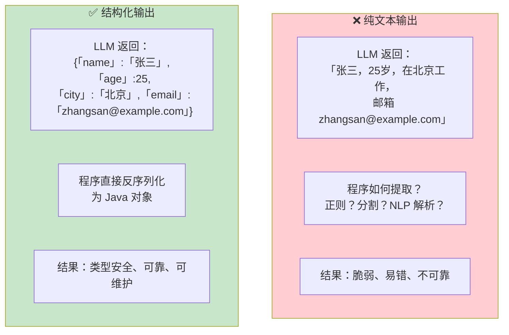
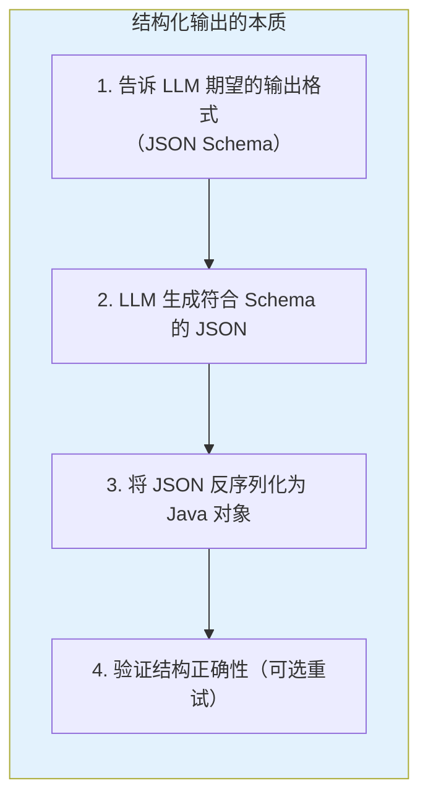
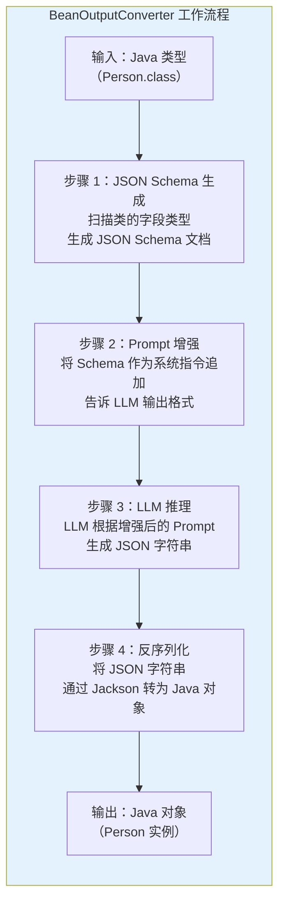
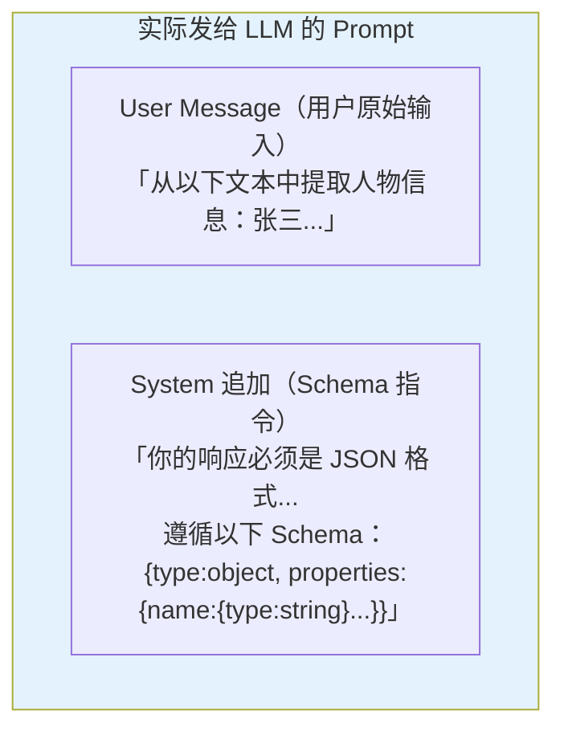
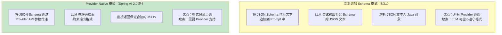
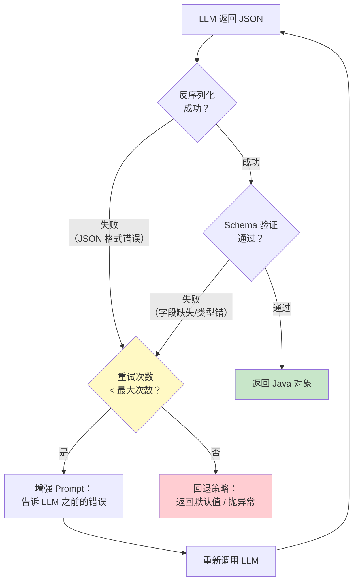
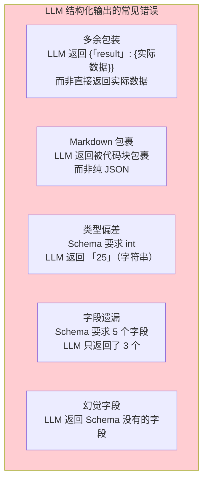
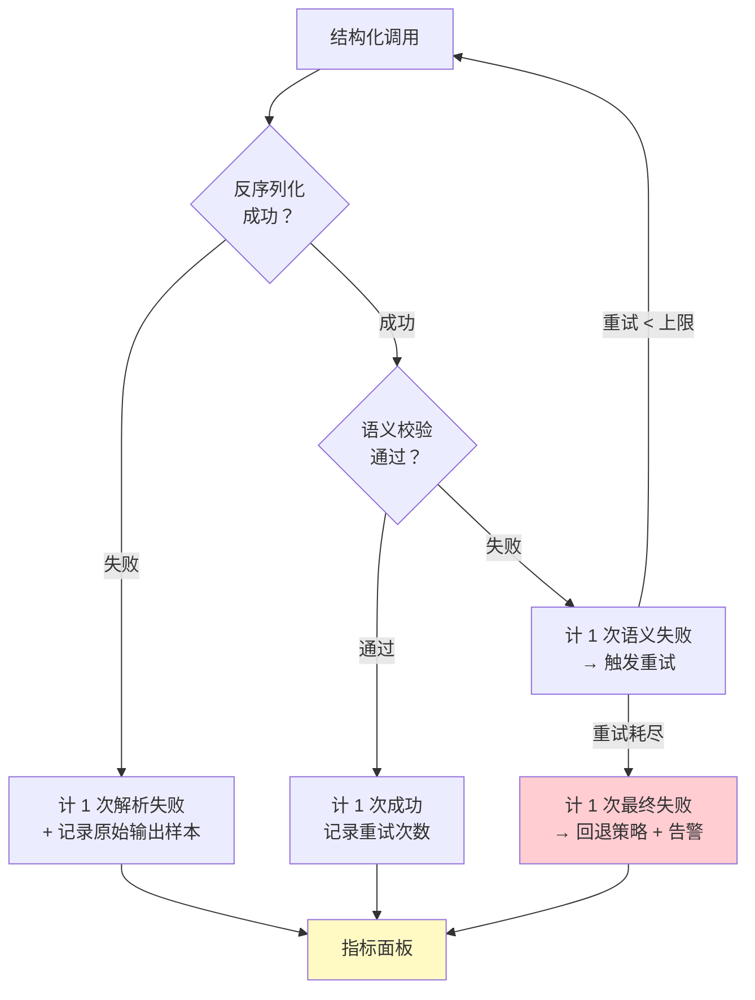

# 03 结构化输出
> **定位**：讲透 LLM 结构化输出的完整机制——为什么需要结构化输出、Spring AI 2.0 的 `entity()` 方法、BeanOutputConverter 的底层原理、JSON Schema 自动生成的类型边界、Provider Native 结构化输出的真实路径（OpenAI response_format 两档能力与 DeepSeek 实际支持度）、业务层自建的验证与重试、流式与结构化的取舍、质量运营。读完这篇，你能让 LLM 精确返回你需要的 Java 对象。
>
> **读者画像**：已经会用 ChatClient 进行对话，需要让 LLM 返回结构化数据而非纯文本。
>
> **前置阅读**：[02-ChatClient 与对话模型](../00-基础与核心/02-ChatClient与对话模型.md)。

---

## 1. 为什么需要结构化输出

LLM 的原生输出是**自由文本字符串**。这对人类阅读很友好，但对程序处理是灾难。

### 1.1 纯文本输出的问题



### 1.2 企业级场景中的结构化需求

| 场景 | 需要的结构 | 为什么纯文本不行 |
|------|-----------|----------------|
| 信息提取 | 从简历中提取 `Person` 对象 | 纯文本无法被代码消费 |
| 意图分类 | 返回 `ClassificationResult`（枚举 + 置信度） | 需要精确的枚举值，不能是描述性文字 |
| 数据转换 | 将自然语言转为 `DatabaseQuery` | SQL 参数需要精确的类型和结构 |
| 多选项生成 | 返回 `List<Recommendation>` | 需要固定字段（标题、理由、评分）的列表 |
| Agent 决策 | 返回 `AgentDecision`（动作 + 参数 + 理由） | 下游代码需要按动作类型分发 |

### 1.3 结构化输出的本质



---

## 2. Spring AI 2.0 的 entity() 方法

`entity()` 是 Spring AI 中获取结构化输出的核心方法。它将 LLM 的输出直接映射为 Java 对象。

### 2.1 基本用法：返回单个 POJO

```java
import org.springframework.ai.chat.client.ChatClient;

// Spring AI 2.0.0 — 定义结构化输出的目标类型
public record Person(
    String name,
    int age,
    String city,
    String email
) {}

// 使用 entity() 直接获取 Java 对象
Person person = chatClient.prompt()
        .user("从以下文本中提取人物信息：张三，25岁，在北京工作，邮箱 zhangsan@example.com")
        .call()
        .entity(Person.class);

// person.name() = "张三"
// person.age() = 25
// person.city() = "北京"
// person.email() = "zhangsan@example.com"
```

### 2.2 返回集合

```java
import org.springframework.core.ParameterizedTypeReference;

public record Movie(String title, int year, double rating) {}

// Spring AI 2.0.0 — 返回列表
List<Movie> movies = chatClient.prompt()
        .user("推荐 5 部科幻电影，包含片名、年份和评分")
        .call()
        .entity(new ParameterizedTypeReference<List<Movie>>() {});

// 返回 Map
Map<String, Object> data = chatClient.prompt()
        .user("提取以下信息的键值对：张三 25岁 北京")
        .call()
        .entity(new ParameterizedTypeReference<Map<String, Object>>() {});
```

### 2.3 嵌套复杂结构

```java
// Spring AI 2.0.0 — 复杂嵌套结构
public record OrderExtraction(
    String orderId,
    CustomerInfo customer,
    List<OrderItem> items,
    PaymentInfo payment,
    ShippingAddress shipping
) {}

public record CustomerInfo(
    String name,
    String phone,
    String email
) {}

public record OrderItem(
    String productName,
    int quantity,
    double unitPrice
) {}

public record PaymentInfo(
    String method,    // 信用卡、支付宝、微信
    double amount,
    String currency
) {}

public record ShippingAddress(
    String province,
    String city,
    String detail,
    String zipCode
) {}

// 从非结构化文本中提取完整订单
OrderExtraction order = chatClient.prompt()
        .user("""
              从以下邮件内容中提取订单信息：
              客户张三（手机13800138000，邮箱zs@qq.com）下单了：
              2 件 Java 编程思想（单价 89.5），
              1 件 Spring 实战（单价 59.0）。
              用信用卡支付，总金额 238.0 元。
              配送地址：北京市海淀区中关村大街 1 号，邮编 100080。
              """)
        .call()
        .entity(OrderExtraction.class);
```

Spring AI 的 BeanOutputConverter 能自动处理任意深度的嵌套结构，生成对应的 JSON Schema。

---

## 3. BeanOutputConverter：底层原理

`entity()` 方法看似简单，底层做了三件事。理解这些步骤是调试结构化输出问题的关键。

### 3.1 转换架构



### 3.2 步骤 1：JSON Schema 自动生成

Spring AI 使用 Jackson 的 `JsonSchemaGenerator` 将 Java 类型转换为 JSON Schema：

```java
import org.springframework.ai.converter.BeanOutputConverter;

// Spring AI 2.0.0 — 手动使用 BeanOutputConverter
BeanOutputConverter<Person> converter = new BeanOutputConverter<>(Person.class);

// 查看自动生成的 JSON Schema
String schema = converter.getFormat();
// 输出类似：
// Your response should be in JSON format.
// Do not include any explanations, only provide a RFC8259 compliant JSON response
// following this format without deviation.
// Do not include markdown code blocks in your response.
// Here is the JSON Schema instance your output must adhere to:
// {\"$schema\":\"https://json-schema.org/draft/2020-12/schema\",\"type\":\"object\",
//  \"properties\":{\"name\":{\"type\":\"string\"},\"age\":{\"type\":\"integer\"},
//  \"city\":{\"type\":\"string\"},\"email\":{\"type\":\"string\"}}}
```

### 3.3 步骤 2：Prompt 增强

这步是隐式的——`entity()` 方法自动将生成的 Schema 指令追加到 Prompt 中。实际发给 LLM 的 Prompt 如下：



> **调试技巧**：如果结构化输出不理想，可以用 `BeanOutputConverter` 手动生成 Schema，检查它是否准确描述了你的期望。

### 3.4 步骤 3-4：LLM 推理与反序列化

```java
// Spring AI 2.0.0 — 手动完成完整流程（调试用）
BeanOutputConverter<Person> converter = new BeanOutputConverter<>(Person.class);

// 1. 获取 Schema 指令
String formatInstructions = converter.getFormat();

// 2. 构建增强 Prompt
String enhancedPrompt = """
        从以下文本中提取人物信息：张三，25岁，在北京工作，邮箱 zhangsan@example.com
        
        %s
        """.formatted(formatInstructions);

// 3. 调用 LLM（获取纯文本 JSON）
String jsonResult = chatClient.prompt()
        .user(enhancedPrompt)
        .call()
        .content();
// jsonResult = {"name":"张三","age":25,"city":"北京","email":"zhangsan@example.com"}

// 4. 手动反序列化
Person person = converter.convert(jsonResult);
// person.name() = "张三"
```

### 3.5 Schema 生成的边界：这些类型和注解会发生什么

Schema 是自动生成的，但"自动"不等于"全都知道"——不同类型与注解在生成时的行为差异，直接决定 LLM 收到的约束强度。逐项过一遍（行为以所引版本为准，此处给的是工程结论）：

| 类型/注解 | 生成的 Schema 形态 | 工程注意 |
|-----------|-------------------|---------|
| **枚举** `enum Intent` | `{"type":"string","enum":["ORDER_QUERY",...]}` | 约束最强的字段——模型被显式限定在枚举值内，优先用它表达封闭集合 |
| **Optional\<T\>** | 不建议使用：Schema 生成对 Optional 包装支持不稳（可能整字段异常或退化为宽松类型） | 可选性用"字段允许为 null + 文档说明"表达；record 组件天然不可空，缺失时让模型给默认值 |
| **LocalDate / LocalDateTime** | `{"type":"string"}`（无 format 约束的居多） | **Schema 拦不住模型输出 "2024年3月"**——日期格式必须在 System Prompt 里显式规定（§7 的 "yyyy-MM" 规则）+ 反序列化前用 `@JsonFormat`/自定义反序列化器兜底 |
| **@JsonProperty("order_id")** | 映射到指定的 JSON 键名 | 蛇形/驼峰转换靠它；LLM 会按 Schema 里的键名输出，Jackson 再转回 Java 字段名 |
| **@JsonClassDescription / 字段描述** | 进入对应节点的 `description`（生成器对 Jackson 生态注解的支持程度随版本演进，以版本为准） | 字段级 description 是"给模型看的字段说明"，能显著降低字段语义歧义（如 `type` 到底是工单类型还是退款类型） |

**嵌套与多态的两条硬边界**：① 深层嵌套没问题（§2.3 的 OrderExtraction），但每层嵌套都是一次模型出错的机会——超过 3 层考虑拆成两次结构化调用；② **sealed 多态接口**（§6.2 的 `AgentResponse`）：生成器无法从接口本身推断子类集合，**必须显式标注 Jackson 的 `@JsonTypeInfo` + `@JsonSubTypes`**——Schema 的 discriminant（判别键）与子类映射完全由这两个注解提供；同时要在 Prompt 里给每个子类一个 one-shot 示例，纯靠 Schema 表达"三选一"的遵从率明显更低。泛型容器（`List<Movie>`）用 `ParameterizedTypeReference`（§2.2），裸泛型类可能被生成器跳过。

---

## 4. Provider Native Structured Output

Spring AI 2.0 引入了 **Provider Native Structured Output**——直接使用 LLM 提供商的原生结构化输出能力，而不是通过文本追加 Schema。

### 4.1 文本模式 vs 原生模式



### 4.2 Provider 侧的真实路径：response_format 的两档能力

"Provider Native" 落到 OpenAI 兼容 API 上就是 **`response_format` 请求参数**（[OpenAI Structured Outputs 指南](https://platform.openai.com/docs/guides/structured-outputs)），有两档能力，档位决定约束强度：

**第一档：JSON 模式（`{"type": "json_object"}`）**——只保证"输出是合法 JSON"，**不保证**符合你的 Schema。模型自己决定键名和结构。用法有一个硬性要求：Prompt 里必须出现 "json" 这个词（否则 API 直接报错），且最好在 Prompt 里给出期望的键结构。

**第二档：JSON Schema 严格模式（`{"type": "json_schema", "json_schema": {"name": ..., "schema": ..., "strict": true}}`）**——把你的 JSON Schema 作为 API 参数传给服务端，模型在**解码层**被约束：每个 token 的采样都被限制在能产生合法 JSON 的范围内。这是真正意义的"保证合法"。但严格模式对 Schema 有两条硬约束（写错直接 400）：

- **每个对象的 `additionalProperties` 必须为 `false`**（禁止额外字段，逼模型只输出声明过的字段）；
- **对象的所有字段都必须列入 `required`**——"可选字段"要靠"类型可为 null"（`{"type":["string","null"]}`）表达，而不是从 required 里摘掉。

```json
// 严格模式的 Schema 形态（OpenAI 风格，DeepSeek 官方 API 暂不支持此模式，见 §4.3）
{
  "response_format": {
    "type": "json_schema",
    "json_schema": {
      "name": "person",
      "strict": true,
      "schema": {
        "type": "object",
        "properties": {
          "name": { "type": "string" },
          "age":  { "type": "integer" },
          "email": { "type": ["string", "null"] }
        },
        "required": ["name", "age", "email"],
        "additionalProperties": false
      }
    }
  }
}
```

Spring AI 侧开启 Provider 原生的开关是 `entity(Class, spec -> spec.useProviderStructuredOutput())`（`EntityParamSpec.useProviderStructuredOutput()` 为真实方法，javap 实证）；不开就默认走 BeanOutputConverter 文本 Schema 路径。Schema 本体经 **ChatOptions 层**交给 Provider——`OpenAiChatOptions.Builder` 上有真实的 `responseFormat(OpenAiChatModel.ResponseFormat)` 与 `outputSchema(String)`（javap 实证）：

```java
import org.springframework.ai.chat.client.ChatClient;
import org.springframework.ai.openai.OpenAiChatOptions;

// Spring AI 2.0.0 — Provider Native 结构化输出（真实 API，javap 实证）
// entity(Class, Consumer<EntityParamSpec>) 是真实重载；EntityParamSpec 提供
// useProviderStructuredOutput() 与 validateSchema() 两个方法（见附录 05-SpringAI2-API基准/02-Tool与Observation真实API §2）
// 2.0.0 实证修正：ChatClient 的 .options(B) 只收 ChatOptions.Builder（不调用 .build()），
// 结构化输出的 Schema 经 options 层的 outputSchema(...) 交给 Provider
Person person = chatClient.prompt()
        .options(OpenAiChatOptions.builder()
                .outputSchema("""
                        {"type":"object","properties":{"name":{"type":"string"},
                        "age":{"type":"integer"},"city":{"type":"string"}},
                        "required":["name","age","city"],"additionalProperties":false}
                        """))
        .user("提取人物信息：张三，25岁，在北京")
        .call()
        .entity(Person.class, spec -> spec.useProviderStructuredOutput());
```

> 开启了 `useProviderStructuredOutput()` 后，框架把 Schema 交给 Provider 的 `response_format` 参数（OpenAI 走 `OpenAiChatOptions.responseFormat(...)`，DeepSeek 官方仅支持 `json_object` 一档——所以对 DeepSeek 主力栈，开不开 spec 效果差别不大，正文 §4.3 的"文本 Schema + 校验重试"仍是主力路径）。

### 4.3 DeepSeek 实际支持度：只到第一档

这是选型的关键事实：**DeepSeek 官方 API 支持 `json_object`（JSON 模式），不支持 `json_schema` 严格模式**——社区实测把 `response_format` 设为 `json_schema` 会直接返回错误（[DeepSeek-V3 issue #302](https://github.com/deepseek-ai/DeepSeek-V3/issues/302)）。官方 JSON 模式用法见 [DeepSeek API 文档](https://api-docs.deepseek.com/guides/json_mode)：

```java
import org.springframework.ai.chat.client.ChatClient;
import org.springframework.ai.openai.OpenAiChatModel;
import org.springframework.ai.openai.OpenAiChatOptions;

// DeepSeek：开启 JSON 模式（第一档）——Prompt 里必须含 "json" 字样
// 真实 API：OpenAiChatOptions.Builder.responseFormat(OpenAiChatModel.ResponseFormat)，
// 类型是 OpenAiChatModel.ResponseFormat（没有 org.springframework.ai.openai.api.ResponseFormat 这个类，javap 实证）
// 2.0.0 实证修正：.options(B) 收 Builder，外层不调用 .build()（内层 ResponseFormat.builder().build() 是对象入参，保留）
String json = chatClient.prompt()
        .options(OpenAiChatOptions.builder()
                .model("deepseek-chat")
                .responseFormat(OpenAiChatModel.ResponseFormat.builder()
                        .type(OpenAiChatModel.ResponseFormat.Type.JSON_OBJECT)
                        .build()))
        .system("从简历中提取人物信息，以 json 格式输出，键为 name/age/email")
        .user(resumeText)
        .call()
        .content();
```

工程结论一张表：

| 目标 Provider | 可用档位 | 建议路径 |
|--------------|---------|---------|
| OpenAI | json_object + json_schema 严格模式 | 关键链路开严格模式 |
| DeepSeek 官方 | 仅 json_object | **文本 Schema（BeanOutputConverter）+ System Prompt 规则 + 业务层校验重试**最稳；json_object 可作为叠加保险 |
| 其他 OpenAI 兼容服务 | 逐家验证 | 别假设兼容——写个最小用例实测 json_schema 是否 400 |

### 4.4 两种模式的对比

| 维度 | 文本追加 Schema（BeanOutputConverter） | Provider Native（严格模式） |
|------|--------------------------------------|---------------------------|
| **格式可靠性** | 中（LLM 可能偏离，需校验兜底） | 高（解码层约束，输出保证合法） |
| **Token 消耗** | 高（Schema 占用 Prompt 空间） | 低（Schema 走 API 参数） |
| **Provider 兼容** | 所有 Provider（纯 Prompt 技巧） | 需要 Provider 支持（DeepSeek 官方不支持严格模式） |
| **嵌套复杂度** | 复杂 Schema 时 LLM 容易出错 | 原生模式更稳定 |
| **Schema 约束** | 自由 JSON Schema | 必须满足 additionalProperties:false + 全字段 required |
| **推荐** | 简单结构 / DeepSeek 主力栈 / 不确定 Provider 支持 | 复杂结构 / OpenAI 可用 / 生产环境优先 |

---

## 5. Schema 验证与自动重试：框架不内置，业务层自建

LLM 并非 100% 可靠。即使给了 Schema，LLM 也可能返回格式错误的 JSON（多余字段、类型不匹配、遗漏字段）。**先把口径立住：Spring AI 2.0 没有"Schema 验证 + 自动重试"的内置机制**——`entity(Class, Consumer<EntityParamSpec>)` 是真实重载（javap 实证，spec 上只有 `useProviderStructuredOutput()` / `validateSchema()`，没有 `maxAttempts()`，见 [附录 05-SpringAI2-API基准/02-Tool与Observation真实API §2]），**任何"自动重试"都是虚构 API**——框架保证的是"JSON 能反序列化"，语义正确性（年龄不是负数、枚举值合法）和失败重试都要业务层自己建。本节给的就是自建的完整套路。

### 5.1 验证与重试的工作流程



### 5.2 验证与重试的正确落点：业务层自建

```java
// Spring AI 2.0.0 —— entity() 真实重载：Class / ParameterizedTypeReference /
// StructuredOutputConverter，以及它们各自的 EntityParamSpec 变体（javap 实证）
//（spec 上只有 useProviderStructuredOutput()/validateSchema()；没有 maxAttempts()，
// 没有"spec 里带自动重试/验证"的机制，见附录 05-SpringAI2-API基准/02-Tool与Observation真实API）
Person person = chatClient.prompt()
        .user("提取人物信息：张三，25岁，在北京")
        .call()
        .entity(Person.class);

// 验证与重试由业务层自实现（框架只保证 JSON 可解析，不保证语义正确）：
Person validated = validateAndRetry(person, 3);
```

### 5.3 验证失败的回退策略

```java
// Spring AI 2.0.0 — 带回退的结构化输出（业务层重试）
Person person;
try {
    person = retry(
            3,                                                          // 最多重试 3 次
            () -> chatClient.prompt()
                    .user("提取人物信息：" + rawText)
                    .call()
                    .entity(Person.class),
            result -> validateSemantics(result));                        // 语义校验不通过则重试
} catch (MaxRetriesExceededException e) {
    // 重试 3 次后仍然失败
    log.warn("结构化输出解析失败，使用回退策略", e);

    // 回退策略 1：用宽松的解析提取部分字段
    person = fallbackParser.extractPartial(rawText);

    // 回退策略 2：返回带标记的默认值
    // person = new Person("", 0, "", "");
}
```

### 5.4 常见的结构化输出错误



**应对策略**：

```java
// Spring AI 2.0.0 — 通过 System Message 增强格式遵从性
Person person = chatClient.prompt()
        .system("""
                你是一个信息提取助手。你的输出必须严格遵守以下规则：
                1. 只输出 JSON，不要有任何其他文字
                2. 不要用 Markdown 代码块包裹
                3. 不要添加额外的包装字段
                4. 确保所有字段都有值，缺失字段使用空字符串或 0
                """)
        .user("提取人物信息：" + rawText)
        .call()
        .entity(Person.class);   // 真实重载；验证重试由 §5.3 的 retry 封装完成
```

---

## 6. 高级用法

### 6.1 枚举类型的结构化输出

```java
// Spring AI 2.0.0 — 枚举约束输出
public enum Intent {
    ORDER_QUERY,     // 订单查询
    REFUND_REQUEST,  // 退款申请
    COMPLAINT,       // 投诉
    CONSULTATION,    // 咨询
    OTHER            // 其他
}

public record IntentClassification(
    Intent intent,
    double confidence,
    String reasoning
) {}

IntentClassification result = chatClient.prompt()
        .user("用户说：我昨天买的手机还没发货，能不能退了？")
        .call()
        .entity(IntentClassification.class);

// result.intent() = REFUND_REQUEST
// result.confidence() = 0.92
// result.reasoning() = "用户提到'退了'，且涉及已购商品"
```

### 6.2 多种可能结构的选择

当输出可能是多种不同结构之一时，使用继承或多态：

```java
// Spring AI 2.0.0 — 多态结构化输出
import com.fasterxml.jackson.annotation.JsonSubTypes;
import com.fasterxml.jackson.annotation.JsonTypeInfo;

@JsonTypeInfo(use = JsonTypeInfo.Id.NAME, property = "type")
@JsonSubTypes({
    @JsonSubTypes.Type(value = TextResponse.class, name = "text"),
    @JsonSubTypes.Type(value = ToolRequest.class, name = "tool"),
    @JsonSubTypes.Type(value = ClarificationQuestion.class, name = "question")
})
public sealed interface AgentResponse
        permits TextResponse, ToolRequest, ClarificationQuestion {}

public record TextResponse(String text) implements AgentResponse {}
public record ToolRequest(String toolName, Map<String, Object> arguments) 
        implements AgentResponse {}
public record ClarificationQuestion(String question, List<String> options) 
        implements AgentResponse {}

// Agent 根据用户输入决定返回哪种结构
AgentResponse response = chatClient.prompt()
        .system("分析用户输入，决定是直接回复、调用工具还是追问澄清。")
        .user("帮我查一下订单状态")
        .call()
        .entity(AgentResponse.class);

// 根据实际类型处理
switch (response) {
    case TextResponse t -> System.out.println("回复：" + t.text());
    case ToolRequest t -> System.out.println("调用工具：" + t.toolName());
    case ClarificationQuestion t -> System.out.println("追问：" + t.question());
}
```

### 6.3 流式结构化输出：聚合等待还是增量解析？

结构化输出与流式调用结合时需要注意：JSON 在流式传输中是不完整的，无法逐块反序列化。三条路线，先说最省事的——**聚合（收集全部 chunk 后统一解析）**。注意 `StreamResponseSpec` **没有 `entity()` 方法**（javap 实证），"`stream().entity()` 框架替你聚合"是虚构 API，真实姿势是下面这样：

```java
// Spring AI 2.0.0 — 路线一：收集全部 chunk 后一次性解析（真实 API）
import org.springframework.ai.converter.BeanOutputConverter;
import reactor.core.publisher.Mono;

Mono<Person> personMono = chatClient.prompt()
        .user("提取人物信息：张三，25岁，在北京")
        .stream()
        .content()
        .collectList()                           // 收集所有 chunk
        .map(chunks -> String.join("", chunks))  // 拼接完整 JSON
        .map(json -> new BeanOutputConverter<Person>(Person.class).convert(json));
```

```java
// Spring AI 2.0.0 — 路线二：reduce 累积 + 手动解析（等价于路线一，多了自定义空间：
// 逐 chunk 累积时能插入调试、截断等逻辑）
import org.springframework.ai.converter.BeanOutputConverter;
import reactor.core.publisher.Mono;

Mono<Person> personMono = chatClient.prompt()
        .user("提取人物信息：张三，25岁，在北京")
        .stream()
        .content()
        .reduce(new StringBuilder(), StringBuilder::append)
        .map(builder -> new BeanOutputConverter<Person>(Person.class)
                .convert(builder.toString()));
```

两条"聚合路线"的共同本质：**结构化结果是尾延迟**——用户要等全部生成完才拿到对象，流式在此只省了"连接占用"没省"感知等待"。什么时候必须接受这一点、什么时候可以突破？取舍表：

| 路线 | 首个结果时刻 | 适用 | 代价 |
|------|-------------|------|------|
| **聚合（路线一/二）** | 流完成后 | 提取、分类——结果本来就是"一个对象"，中途的半截 JSON 没有展示价值 | 尾延迟；流式中断则全部作废（要重试整次调用） |
| **增量解析（路线三）** | 顶部字段就绪即出 | 列表型结果边生成边渲染（评论分析逐条出）；超大 JSON | 引入流式 JSON 解析器（如 Jackson Streaming API `JsonParser`），对不完整片段要能"解析到哪算哪"；代码复杂度显著上升 |

```java
// Spring AI 2.0.0 — 路线三（概念代码）：List 结构的增量解析——完整元素到达即下发
// 关键假设：目标类型是 List<ReviewAnalysis>，每个数组元素是自包含 JSON 对象
Flux<ReviewAnalysis> incremental = chatClient.prompt()
        .user("分析这批评论")
        .stream()
        .content()
        .transform(new JsonArrayElementDecoder<>(ReviewAnalysis.class));  // 自研：缓冲+切分数组元素
```

路线三的工程判断：只有"**结果本身是列表 + 每个元素独立可渲染 + 单次调用时长较长**"三个条件都满足时才值得自研增量解码；否则聚合路线 + 前端 loading 是性价比之选。另一个常被忽略的点：**流式中断时聚合路线颗粒无收**——中断重试的成本是整次调用，敏感场景配合 [教程 01-WebFlux与响应式编程/00-WebFlux从零入门 §7.3] 的部分结果落盘策略（把已到达的完整元素先收下来）。

---

## 7. 完整示例：智能信息提取

```java
@RestController
@RequestMapping("/extract")
public class ExtractionController {

    private final ChatClient chatClient;

    public ExtractionController(ChatClient chatClient) {
        this.chatClient = chatClient;
    }

    // Spring AI 2.0.0 — 从简历中提取结构化信息
    @PostMapping("/resume")
    public Resume extractResume(@RequestBody String resumeText) {
        return chatClient.prompt()
                .system("""
                        你是一个简历解析专家。从简历文本中提取结构化信息。
                        规则：
                        - 日期格式统一为 yyyy-MM
                        - 如果某个字段无法从简历中提取，使用空字符串或空列表
                        - 技能列表按熟练度排序
                        """)
                .user(resumeText)
                .call()
                .entity(Resume.class);   // 真实重载；批量校验统一在 analyze 里做
    }

    // Spring AI 2.0.0 — 批量产品评论分析（编号 → 单次结构化提取 → 逐条回填）
    @PostMapping("/reviews/analyze")
    public List<ReviewAnalysis> analyzeReviews(@RequestBody List<String> reviews) {
        if (reviews.isEmpty()) {
            return List.of();
        }

        // 1. 每条评论带编号拼接——编号是让模型"逐条对齐"的锚点，
        //    输出列表的顺序/数量才有校验依据（漏一条能被发现）
        String reviewsText = IntStream.range(0, reviews.size())
                .mapToObj(i -> (i + 1) + ". " + reviews.get(i))
                .collect(Collectors.joining("\n"));

        // 2. 单次调用结构化提取整批
        List<ReviewAnalysis> results = chatClient.prompt()
                .system("""
                        逐条分析评论（共 %d 条）。输出与输入严格等长、顺序一致的数组，
                        第 i 个元素对应第 i 条评论。每条分析其情感、提及的优缺点和评分建议（1-5）。
                        """.formatted(reviews.size()))
                .user(reviewsText)
                .call()
                .entity(new ParameterizedTypeReference<List<ReviewAnalysis>>() {});

        // 3. 校验对齐：数量必须一致（模型偶尔漏掉中间某条），
        //    不一致走 §5.3 的重试/回退，而不是带着错位的结果硬往下走
        if (results == null || results.size() != reviews.size()) {
            throw new IllegalStateException(
                    "结构化输出与输入未对齐：期望 " + reviews.size() + " 条，实际 "
                            + (results == null ? 0 : results.size()));
        }
        return results;
    }
}

public record Resume(
    String name,
    String phone,
    String email,
    String summary,
    List<WorkExperience> workExperiences,
    List<Education> education,
    List<String> skills
) {}

public record WorkExperience(
    String company,
    String position,
    String startDate,
    String endDate,
    String description
) {}

public record Education(
    String school,
    String degree,
    String major,
    String startDate,
    String endDate
) {}

public record ReviewAnalysis(
    String sentiment,     // positive / negative / neutral
    double sentimentScore, // 0.0 - 1.0
    List<String> pros,
    List<String> cons,
    int suggestedRating   // 1-5
) {}
```

---

## 8. 结构化输出的质量运营：失败率监控与遵从率提升

结构化输出不是"写完就稳"的——换个模型版本、改个 Prompt、上线新字段，遵从率都会漂移。生产系统要把它当**有 SLA 的能力**来运营：可度量、可归因、可优化。

### 8.1 两个核心指标：解析失败率与重试成本



要采集的指标（挂到 Micrometer，观测体系见 [教程 05-Observation可观测/00-最小闭环：Agent各阶段输出打印到控制台]）：

| 指标 | 定义 | 告警阈值建议 |
|------|------|-------------|
| `structured.parse.failure.rate` | 反序列化异常数 / 调用数 | > 2% 告警（JSON 都不合法说明 Prompt 或模型出问题） |
| `structured.semantic.failure.rate` | 语义校验失败数 / 调用数 | > 5% 关注（业务约束没传达到位） |
| `structured.retry.avg` | 平均重试次数 | > 0.3 说明一次成功率不健康 |
| `structured.retry.cost.tokens` | 重试额外消耗的 Token | 直接换算成本，接入 [教程 04-企业级架构主干/07-成本治理与Token计量] |

**监控的关键附加值是失败样本留存**：解析失败时把"当时的 Prompt + 模型原始输出"采样落盘（脱敏后），每周归类——你会发现 80% 的失败集中在两三种模式（Markdown 包裹、多余包装、日期格式），修一个 System Prompt 规则就是几十个点的改善。

### 8.2 few-shot：提升遵从率最便宜的手段

当规则约束不够时，**给模型看一两个"输入 → 期望输出"的完整示例**，比加十条规则都管用——模型对模式匹配的敏感度远高于对指令的服从度：

```java
// Spring AI 2.0.0 — few-shot 提升遵从率：示例直接放进 System Message
Person person = chatClient.prompt()
        .system("""
                你是信息提取助手。严格按示例的格式输出。

                示例输入：李四，30岁，在上海工作
                示例输出：{"name":"李四","age":30,"city":"上海","email":""}

                规则：
                1. 只输出 JSON，不用代码块包裹
                2. 缺失字段用空字符串或 0，不要省略键
                3. 年龄必须是整数
                """)
        .user("提取人物信息：" + rawText)
        .call()
        .entity(Person.class);
```

few-shot 的三条纪律：**示例要覆盖边界**（上例的 `"email":""` 就是在教模型"缺失怎么办"，这一条示例顶三条规则）；**示例要贴近真实分布**（拿真实失败样本改造成示例，效果最好）；**示例别超过 2-3 个**（再多就是浪费 Token，边际收益趋零）。示例本质是 Prompt 的一部分——它的版本管理、A/B 测试跟随 [教程 04-企业级架构主干/09-灰度发布与版本管理] 的 Prompt 版本体系走，改示例也算改 Prompt，要留评测集回归（见 [附录 04-测试策略/02-Eval评估]）。

### 8.3 何时该换路线：连续失败的 escalation

重试 3 次仍在失败，继续重试只是烧钱。运营上要定义 escalation 链：降级到更宽松的目标结构（只提取必填字段）→ 换模型档位（文本 Schema 模式换家供应商）→ 落入死信队列转人工。把"失败后怎么办"写进代码（§5.3 的回退策略），而不是留给值班同学现场发挥。

---

## 9. 适用场景与不适用场景

### 适用场景

- 信息提取（从非结构化文本中提取结构化数据）
- 意图分类（返回枚举 + 置信度）
- 数据转换（自然语言到 SQL/JSON/配置）
- 内容生成（生成固定结构的文案、报告）
- Agent 决策（返回动作 + 参数 + 理由的结构化决策）
- 批量处理（对大量文本进行统一格式的结构化分析）

### 不适用场景

- 创意写作（诗歌、故事、对话——不需要固定结构）
- 长篇内容生成（超过上下文窗口的结构化数据，应该分批处理）
- 实时性要求极高的场景（Schema 验证 + 重试会增加延迟）
- LLM 无法准确理解的结构（如高度专业化的领域 Schema——需要 Few-shot 示例辅助）

---

## 10. 本章总结

| 概念 | 一句话 |
|------|--------|
| **结构化输出的本质** | 告诉 LLM 期望的格式 → 生成符合 Schema 的 JSON → 反序列化为 Java 对象 |
| **entity()** | Spring AI 核心方法，两种真实重载（Class / ParameterizedTypeReference） |
| **BeanOutputConverter** | 底层转换器：生成 Schema → 增强 Prompt → 反序列化 |
| **Schema 生成边界** | 枚举强约束、日期靠 Prompt 兜底、sealed 多态必须显式 Jackson 注解 |
| **response_format 两档** | json_object 只保证合法 JSON；json_schema+strict 解码层约束（要 additionalProperties:false + 全字段 required） |
| **DeepSeek 支持度** | 官方 API 仅支持 json_object，不支持严格模式——文本 Schema + 校验重试最稳 |
| **验证 + 重试** | 框架不内置，业务层自建：语义校验 + 带反馈重试 + 回退策略 |
| **流式取舍** | 流式没有 entity()：content() 聚合（collectList/reduce）后统一解析（尾延迟）；列表型结果可自研增量解析 |
| **few-shot** | 一两个覆盖边界的示例，比十条规则更能提升遵从率 |
| **质量运营** | 解析失败率/重试成本入指标，失败样本留存归因，定义 escalation 链 |
| **多态结构** | 使用 Jackson 多态注解处理"多种可能结构之一"的场景 |

**下一篇**：[01-Advisor链与拦截器](01-Advisor链与拦截器.md) — CallAdvisor/StreamAdvisor 双接口、链式执行与自定义拦截器。

---

> **想深入？→ [附录 05-SpringAI2-API基准/02-Tool与Observation真实API §2]**：entity() 真实重载与全部虚构 API 对照表。
> **想深入？→ [教程 05-Observation可观测/00-最小闭环：Agent各阶段输出打印到控制台]**：把解析失败率、重试成本接入指标体系的完整做法。
> **想深入？→ [附录 04-测试策略/02-Eval评估]**：结构化遵从率的评测集构建与回归。
> **遇到阻塞？→ [教程 00-基础与核心/02-ChatClient与对话模型]**：回顾 ChatClient API 的完整能力，包括 `entity()` 在流式调用中的注意事项。
> **遇到阻塞？→ [教程 02-SpringAI核心机制/01-Advisor链与拦截器]**：理解 Advisor 链如何在结构化输出的前后添加自定义处理逻辑。
