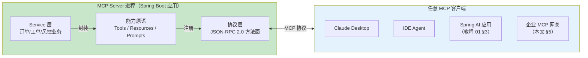
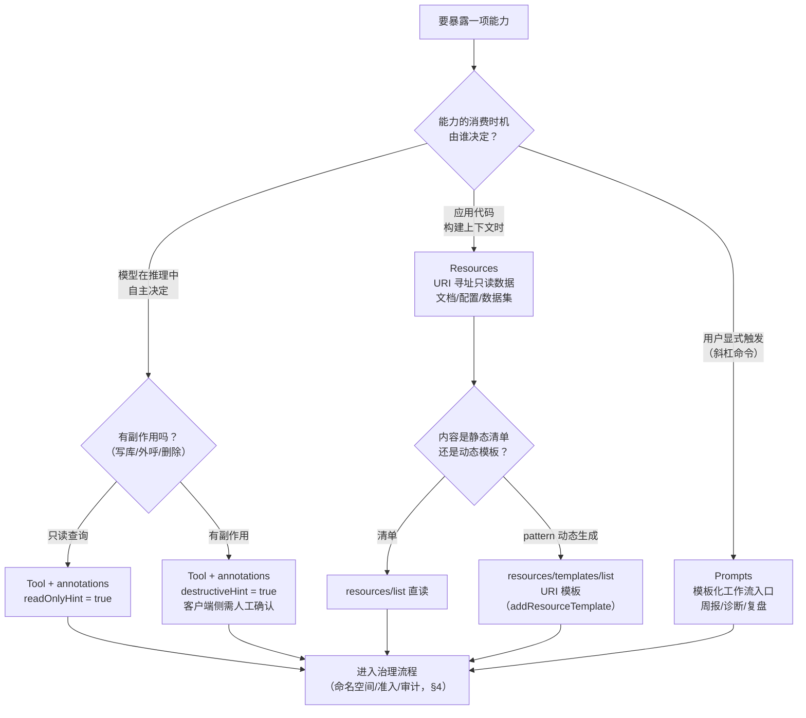
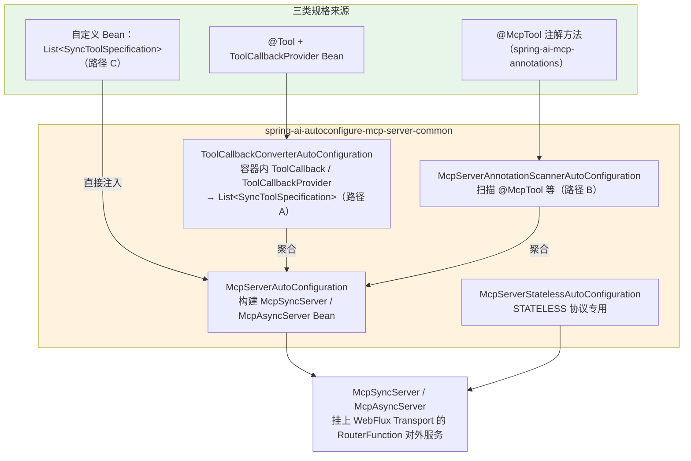
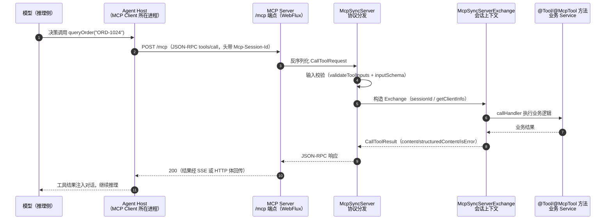
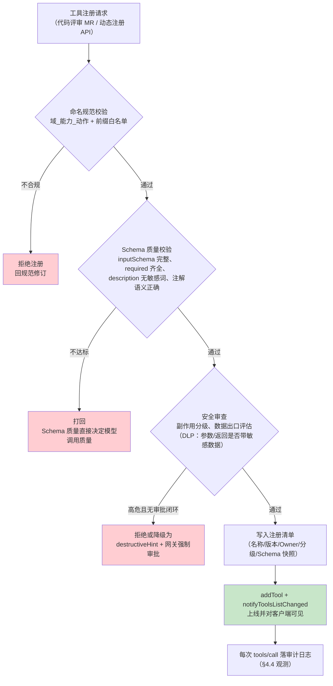
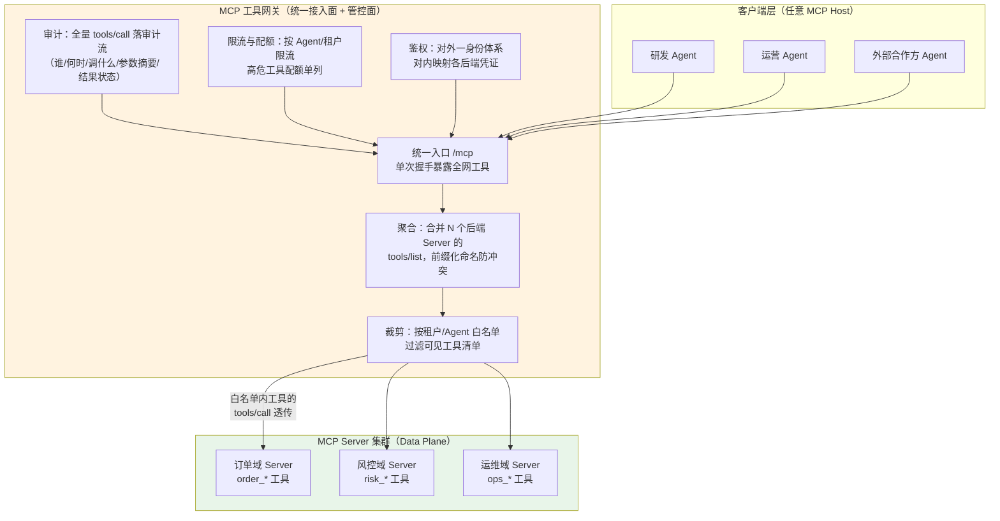

# 05 MCP 服务端开发与治理

> **定位**：本文是对 [教程 02-SpringAI核心机制/01-MCP协议] 的**服务端侧扩展**。教程 01 的主线是"协议是什么 + 客户端怎么消费"，服务端只讲到入门三件套（starter + 配置 + `ToolCallbackProvider` Bean）；本文把服务端这一半补成全景：三种能力原语（Tools/Resources/Prompts）的边界与选型、Spring AI 2.0 服务端的三条暴露路径（`@Tool` 自动聚合 / `@McpTool` 注解 / 编程式 API）、传输层选型（STDIO vs SSE vs Streamable HTTP，配置键全部经本地 jar 实证）、生产级治理四件套（命名空间与版本化、准入、鉴权、观测），以及多 MCP Server 的网关化统一接入面。读完本文，你能独立设计一个企业级 MCP 工具中台的服务端侧。
>
> **读者画像**：要把企业内部能力（订单、工单、风控、检索……）以标准协议暴露给任意 Agent 消费的中高级 Java 工程师与架构师；正在搭建工具中台/网关、需要回答"工具怎么管、怎么鉴权、怎么审计"的技术负责人。
>
> **前置阅读**：[教程 02-SpringAI核心机制/01-MCP协议]（协议架构与客户端消费）、[教程 00-基础与核心/03-工具调用]（`@Tool` 基础）。
>
> **API 真实性基准**：本文所有 SDK 元素均经本地 Maven 仓库 jar `javap` 实证（Spring AI 2.0.0 / MCP SDK mcp-core 2.0.0）。核心实证结论：**服务端 starter 本地真实存在**——`spring-ai-starter-mcp-server`（STDIO 场景，仅依赖 `spring-boot-starter` 无 web 容器）与 `spring-ai-starter-mcp-server-webflux`（HTTP 场景，依赖 `spring-boot-starter-webflux` + `mcp-spring-webflux` + `spring-ai-mcp-annotations`）；服务端工厂与类型是 MCP SDK 的 `io.modelcontextprotocol.server.McpServer` / `McpSyncServer` / `McpAsyncServer`；`@McpTool`/`@McpToolParam` 注解在 `spring-ai-mcp-annotations-2.0.0.jar` 真实存在。本地 jar 中**不存在** `spring-ai-starter-mcp-server-webmvc` 构件。全文对照 [附录 05-SpringAI2-API基准/01-MCP真实API与坐标]。

---

## 1. 服务端全景：MCP Server 的角色与三种能力原语

### 1.1 MCP Server 到底是什么角色

把架构师视角拉高一层：一个 MCP Server 就是一个**能力的标准协议封装进程**。它对自己内部说"业务语言"——调 Service、查数据库、走内网 RPC；对外只说一门语言——MCP 的 JSON-RPC 2.0。任何支持 MCP 的客户端（Claude Desktop、IDE Agent、另一个 Spring AI 应用、你自研的网关）都能在零适配成本下发现并调用这些能力。



这个角色定位带来三个架构级后果，理解了它们才算理解服务端：

- **进程边界即安全边界**。教程 01 §1.1 讲过工具进程级隔离；服务端侧的推论是：暴露出去的每个工具都是一份**对外的 API 契约**，参数 Schema、错误语义、权限模型都要按"给陌生人调用"的标准设计，而不是按"同 JVM 内部方法"的标准。
- **一份实现，多方消费**。同一个工具服务端，可以被研发的 Agent、运营的 Agent、外部的合作方 Agent 同时消费——所以治理（谁能看到哪些工具、调用怎么审计）必须在**服务端/网关侧**解决，不能指望客户端自觉。
- **能力发现是协议内建的**。客户端通过 `tools/list`、`resources/list`、`prompts/list` 自动发现能力，服务端的能力清单变更还能主动推送通知（`notifications/tools/list_changed`，`McpSyncServer.notifyToolsListChanged()`，javap 实证）——这是"运行时动态上下线工具"的协议基础，§2.5 会用它。

### 1.2 三种能力原语：边界与选型

MCP 规范给服务端定义了三种能力原语，它们的**调用发起者**完全不同——这是选型的第一判据：

| 原语 | 协议方法面 | 谁决定何时使用 | 控制权在哪侧 | 典型内容 |
|------|-----------|---------------|-------------|---------|
| **Tools（工具）** | `tools/list` / `tools/call` | **模型**自主决策调用 | 模型 + 客户端确认 | 查订单、建工单、风控审批——**有副作用或需计算的动作** |
| **Resources（资源）** | `resources/list` / `resources/read` | **应用/开发者**显式读取 | 应用代码 | 文档、配置、代码文件、数据集——**URI 寻址的只读上下文数据** |
| **Prompts（提示模板）** | `prompts/list` / `prompts/get` | **用户**显式触发（斜杠命令/菜单） | 用户 | "生成周报""诊断这个告警"——**封装好的可复用工作流入口** |

一句话记忆：**Tools 是模型的、Resources 是应用的、Prompts 是用户的**。三者的 Schema 类型在 `io.modelcontextprotocol.spec.McpSchema` 中分别是 `Tool`（`name/title/description/inputSchema/outputSchema/annotations`）、`Resource`（`uri/name/title/description/mimeType`）、`Prompt`（`name/title/description/arguments`）——全部为 record，javap 实证。

三者的服务端处理签名同构，都是「描述对象 + 处理函数」二元组（`McpServerFeatures` 内嵌类型，javap 实证）：

```java
// SyncToolSpecification:   (Tool, BiFunction<McpSyncServerExchange, CallToolRequest,    CallToolResult>)
// SyncResourceSpecification: (Resource, BiFunction<McpSyncServerExchange, ReadResourceRequest, ReadResourceResult>)
// SyncPromptSpecification:   (Prompt,   BiFunction<McpSyncServerExchange, GetPromptRequest,  GetPromptResult>)
```

注意一个容易踩的差异：`SyncToolSpecification` 有 `Builder`（`builder().tool(...).callHandler(...)`），而 `SyncResourceSpecification` / `SyncPromptSpecification` 是**无 Builder 的 record**，直接用双参构造器——这是 2.0.0 的真实形态，写代码时别想当然。

### 1.3 选型决策



`ToolAnnotations`（`title/readOnlyHint/destructiveHint/idempotentHint/openWorldHint`，javap 实证 record）是**给客户端看的语义提示**——它不改变服务端行为，但客户端（以及背后的人类）会依据 `destructiveHint=true` 决定是否弹人工确认框。把注解标对，是工具供给侧的礼貌，也是 HITL 链路（[教程 04-企业级架构主干/08-Human-in-the-Loop与审批流]）在协议层的挂钩点。

---

## 2. Spring AI 2.0 服务端开发：三条暴露路径

### 2.1 依赖与自动装配全景

先看依赖选型（两个 starter 均为本地仓库 2.0.0 实证存在，依赖树取自各自 pom）：

```xml
<!-- 场景 A：STDIO——Server 作为本地子进程被 Host 拉起（Claude Desktop 式），无 HTTP 端点 -->
<dependency>
    <groupId>org.springframework.ai</groupId>
    <artifactId>spring-ai-starter-mcp-server</artifactId>
</dependency>

<!-- 场景 B：HTTP——独立部署的远程 Server（本教程主线，与本项目 WebFlux 技术栈一致） -->
<!-- Spring AI 2.0.0 -->
<dependency>
    <groupId>org.springframework.ai</groupId>
    <artifactId>spring-ai-starter-mcp-server-webflux</artifactId>
</dependency>
```

`spring-ai-starter-mcp-server` 只带 `spring-boot-starter` + `spring-ai-autoconfigure-mcp-server-common`——**没有 web 容器**，配 `spring.ai.mcp.server.stdio=true` 走标准输入输出；`spring-ai-starter-mcp-server-webflux` 额外带 `spring-ai-autoconfigure-mcp-server-webflux`、`mcp-spring-webflux`（WebFlux 传输提供者）和 **`spring-ai-mcp-annotations`（`@McpTool` 注解路径开箱即用的原因）**。

自动装配链（jar 内类清单实证）值得画成一张心智地图：



javap `McpServerAutoConfiguration` 实证：`mcpSyncServer(...)` 方法注入 `List<SyncToolSpecification>`、`List<SyncResourceSpecification>`、`List<SyncResourceTemplateSpecification>`、`List<SyncPromptSpecification>`、`List<SyncCompletionSpecification>` 以及 `Optional<McpSyncServerCustomizer>`——**容器里所有"规格 Bean"会被自动装配收拢进 Server**。三条路径的本质区别只在于"规格从哪来"。

### 2.2 路径 A：`@Tool` + 自动聚合（工具复用的主路径）

教程 01 §4.3 讲过"必须显式声明 `ToolCallbackProvider` Bean，否则 `tools/list` 永远为空"。在 2.0.0 的服务端自动装配里还有一层更深的机制：`ToolCallbackConverterAutoConfiguration.syncTools(...)` 会把**容器里所有** `ToolCallback`、`List<ToolCallback>`、`ToolCallbackProvider` Bean 聚合转换成 MCP 工具规格（javap 实证方法签名）。这意味着你在进程内给 ChatClient 用的 `@Tool` 工具（[教程 00-基础与核心/03-工具调用]），换个 starter 就能同时对外服务——**一套工具实现，进程内消费 + 协议对外复用**，这是 MCP 服务端最大的工程红利。

```java
// tools/OrderTools.java —— 与进程内工具同一套写法（Spring AI 2.0.0）
package com.example.mcpserver.tools;

import java.util.List;

import com.example.mcpserver.service.OrderService;
import org.springframework.ai.tool.annotation.Tool;
import org.springframework.ai.tool.annotation.ToolParam;
import org.springframework.ai.tool.ToolCallbackProvider;
import org.springframework.ai.tool.method.MethodToolCallbackProvider;
import org.springframework.context.annotation.Bean;
import org.springframework.context.annotation.Configuration;
import org.springframework.stereotype.Component;

@Component
public class OrderTools {

    private final OrderService orderService;

    public OrderTools(OrderService orderService) {
        this.orderService = orderService;
    }

    @Tool(description = "根据订单号查询订单详情（金额、状态、物流）")
    public OrderDetail queryOrder(
            @ToolParam(description = "订单号，格式 ORD-XXXXXX") String orderId) {
        return orderService.queryDetail(orderId);
    }

    @Tool(description = "统计某客户近 N 天的订单总金额（只读）")
    public long sumRecentAmount(
            @ToolParam(description = "客户 ID") String customerId,
            @ToolParam(description = "统计天数，1-90") int days) {
        return orderService.sumRecentAmount(customerId, days);
    }
}

@Configuration
class McpToolExposureConfig {

    // Spring AI 2.0.0 —— 显式声明 Provider：缺此 Bean，@Tool 不会进入 tools/list
    @Bean
    ToolCallbackProvider orderToolProvider(OrderTools orderTools) {
        return MethodToolCallbackProvider.builder()
                .toolObjects(orderTools)
                .build();
    }
}
```

一个治理细节值得点名：`ToolCallbackUtils.isMcpToolCallback(...)`（javap 实证，包级私有）会在聚合时**排除 MCP 客户端拉来的工具**（`SyncMcpToolCallback` 类型）。防的是"工具回环"：A 服务的进程同时是 MCP Client（消费 B 的工具）和 MCP Server（对外暴露），若不排除，B 的工具会被 A 原样转发给 C，工具清单在调用链上层层复制、来源失真——供应链攻击面（[附录 08-Agent安全深度/01-ToolPoisoning攻击]）就是这样被放大的。

### 2.3 路径 B：`@McpTool` 注解（服务端专用 DSL）

`spring-ai-mcp-annotations` jar 提供了一组**服务端专用**注解（javap 实证属性），由 `McpServerAnnotationScannerAutoConfiguration` 自动扫描（配置键 `spring.ai.mcp.server.annotation-scanner.enabled`，默认 `true`）：

| 注解 | 属性（javap 实证） | 用途 |
|------|-------------------|------|
| `@McpTool` | `name`、`description`、`title`、`annotations`（`McpAnnotations`）、`generateOutputSchema`、`metaProvider` | 方法级，直接成为 MCP 工具 |
| `@McpToolParam` | `required`、`description` | 参数级 Schema 描述 |
| `@McpArg` | `name`、`description`、`required` | Prompt 参数 |
| `@McpResource` | —（URI/名称/mimeType 系列） | 资源读取方法 |

`@Tool` 与 `@McpTool` 的分工：`@Tool` 定义的是**进程内通用工具**（给 ChatClient 用），`@McpTool` 定义的是**协议面工具**（只给 MCP 客户端用）。当某个能力你只想走协议暴露、不想进进程内工具池（比如内部运维工具只开放给公司 Agent 网关），用 `@McpTool` 天然隔离了两个暴露面——这本身就是一种命名空间/准入治理手段（呼应 §4.2）。

```java
// tools/SecurityOnlyTools.java —— 仅协议面暴露，不进进程内工具池（Spring AI 2.0.0）
package com.example.mcpserver.tools;

import org.springframework.ai.mcp.annotation.McpTool;
import org.springframework.ai.mcp.annotation.McpToolParam;
import org.springframework.stereotype.Component;

@Component
public class OpsDiagnosisTools {

    // @McpTool —— spring-ai-mcp-annotations 注解，仅暴露给 MCP 客户端
    @McpTool(
            name = "ops_diagnose_instance",
            description = "对指定服务实例执行只读健康诊断，返回延迟、错误率与依赖状态",
            title = "实例健康诊断"
    )
    public DiagnosisReport diagnoseInstance(
            @McpToolParam(required = true, description = "实例 ID，形如 i-123456") String instanceId) {
        return new DiagnosisReport(instanceId, System.currentTimeMillis(), "HEALTHY");
    }

    public record DiagnosisReport(String instanceId, long checkedAt, String status) { }
}
```

注意 `@McpToolParam` 的属性是 `required()` / `description()`——与 `@ToolParam` 一样**没有 `value()`**，名称靠方法参数名（编译需 `-parameters`，Spring Boot 4.1 默认开启）。

### 2.4 路径 C：编程式 API——Resources 与 Prompts 的完整写法

工具走注解很顺，但 **Resources 和 Prompts 目前没有对等的"声明一个 Bean 即可"的注解速记**，最清晰的方式是直接向容器投放 `SyncResourceSpecification` / `SyncPromptSpecification` Bean，自动装配会收拢（§2.1 实证的注入列表）。下面是一个完整可编译的配置类：

```java
// config/McpResourcePromptConfig.java —— Spring AI 2.0.0 / MCP SDK mcp-core 2.0.0
package com.example.mcpserver.config;

import java.util.List;

import io.modelcontextprotocol.server.McpServerFeatures;
import io.modelcontextprotocol.server.McpSyncServerExchange;
import io.modelcontextprotocol.spec.McpSchema;
import org.springframework.context.annotation.Bean;
import org.springframework.context.annotation.Configuration;

@Configuration
class McpResourcePromptConfig {

    // Resource：URI 寻址的只读数据（record 双参构造器——注意无 Builder）
    @Bean
    McpServerFeatures.SyncResourceSpecification apiDocResource() {
        McpSchema.Resource resource = McpSchema.Resource.builder(
                        "doc://api/order-service", "订单服务 API 文档")
                .description("订单服务对内 OpenAPI 描述（Markdown）")
                .mimeType("text/markdown")
                .build();
        return new McpServerFeatures.SyncResourceSpecification(
                resource,
                (McpSyncServerExchange exchange,
                 McpSchema.ReadResourceRequest request) -> new McpSchema.ReadResourceResult(
                        // 注意：资源内容是 ResourceContents（TextResourceContents），不是普通 TextContent
                        List.of(new McpSchema.TextResourceContents(
                                request.uri(), "text/markdown", loadDoc(request.uri())))));
    }

    // Prompt：用户显式触发的模板工作流
    @Bean
    McpServerFeatures.SyncPromptSpecification weeklyReportPrompt() {
        McpSchema.Prompt prompt = new McpSchema.Prompt(
                "weekly-report",
                "生成指定服务的周报",
                List.of(new McpSchema.PromptArgument("service", "服务名", true)));
        return new McpServerFeatures.SyncPromptSpecification(
                prompt,
                (McpSyncServerExchange exchange,
                 McpSchema.GetPromptRequest request) -> new McpSchema.GetPromptResult(
                        null,
                        List.of(new McpSchema.PromptMessage(
                                McpSchema.Role.USER,
                                "请基于服务 " + serviceName(request) + " 本周的变更与告警数据，"
                                        + "生成一份给技术负责人的周报，包含：变更摘要、故障复盘、下周风险。"))));
    }

    private String serviceName(McpSchema.GetPromptRequest request) {
        Object name = request.arguments().get("service");
        return name != null ? name.toString() : "unknown-service";
    }

    private String loadDoc(String uri) {
        // 生产实现：从文档库/对象存储加载；示例返回占位
        return "# Order Service API\n(doc content of " + uri + ")";
    }
}
```

`McpSchema.Resource.builder(uri, name)` 与 `McpSchema.Prompt` 的三参构造器、`GetPromptResult(description, messages)`、`PromptMessage(role, content)`、`TextContent(String)` 均为 javap 实证签名。

### 2.5 编程式动态上下线：治理的协议抓手

`McpSyncServer` 的完整方法面（javap 实证）中，最有治理价值的一组是：

```java
// io.modelcontextprotocol.server.McpSyncServer（Spring AI 2.0.0 所依赖的 MCP SDK 2.0.0）
void addTool(McpServerFeatures.SyncToolSpecification spec);
void removeTool(String toolName);
List<McpSchema.Tool> listTools();
void notifyToolsListChanged();   // 主动推送 notifications/tools/list_changed 给所有已连接客户端
void closeGracefully();
```

有了 `addTool`/`removeTool`/`notifyToolsListChanged` 三件套，"工具热上下线"不再需要重启发布：灰度一个新工具、下线一个出问题的工具、按租户临时启用某能力，都变成运行时操作，且**变更会实时推送到所有已连接的客户端**——客户端的 Agent 不需要重连就能看到新工具。这是 §4 治理四件套与 §5 网关化的协议层地基。

---

## 3. 传输层选型：STDIO vs SSE vs Streamable HTTP

### 3.1 三种传输的适用边界

| 维度 | STDIO | HTTP + SSE（旧） | **Streamable HTTP（现行）** |
|------|-------|------------------|---------------------------|
| 部署形态 | Server 是 Host 的**本地子进程** | 远程独立服务 | 远程独立服务 |
| 载体 | 标准输入/输出 | 双端点（`/sse` + message 端点） | 单一 `/mcp` 端点 |
| 会话 | 进程一对一 | `Mcp-Session-Id`（SSE 通道维系） | `Mcp-Session-Id`（HTTP 头维系） |
| 适用 | 个人桌面 Agent（Claude Desktop）、本地开发调试 | 2024-11 旧规范，兼容存量 | **2025-06 规范起的生产默认** |
| starter | `spring-ai-starter-mcp-server` | webflux starter（`protocol: sse`） | webflux starter（`protocol: streamable`，默认） |

选择逻辑很直接：**本地进程用 STDIO，远程生产用 Streamable HTTP**。SSE 传输在服务端 2.0.0 中仍然可用（`McpServerProperties.ServerProtocol` 枚举 `SSE/STREAMABLE/STATELESS`，javap 实证），定位是兼容存量客户端。另有一个 `STATELESS` 协议（`McpServerStatelessAutoConfiguration` + `WebFluxStatelessServerTransport`，实证存在）：无会话状态、每请求独立，适合纯函数式无状态工具的水平扩容场景，代价是放弃会话通知类能力（`notifyToolsListChanged` 等以会话为前提）。

### 3.2 服务端配置键全表（configuration-metadata 实证）

以下键全部来自 `spring-ai-autoconfigure-mcp-server-common-2.0.0.jar` 内嵌的 `spring-configuration-metadata.json`（javap 常量池交叉核对 `CONFIG_PREFIX = "spring.ai.mcp.server"`）：

```yaml
# application.yml —— Spring AI 2.0.0 服务端配置键（全部实证）
spring:
  ai:
    mcp:
      server:
        enabled: true                    # 默认 true
        name: "order-mcp-server"         # 默认 mcp-server；Implementation.name
        version: "1.0.0"                 # Implementation.version
        type: ASYNC                      # SYNC | ASYNC（默认 sync）——WebFlux 栈必须 ASYNC
        protocol: streamable             # STREAMABLE（默认）| SSE | STATELESS
        stdio: false                     # true 时走标准输入输出（STDIO starter 专用）
        instructions: "订单域工具集，查询只读、退款高危"
        request-timeout: 20s             # 默认 20s
        annotation-scanner:
          enabled: true                  # @McpTool 扫描器，默认 true
        capabilities:                    # 能力开关，全部默认 true
          tool: true
          resource: true
          prompt: true
          completion: true
        tool-response-mime-type:         # 工具名 → 响应 MIME（结构化输出协商）
          query_order: application/json
        tool-change-notification: true   # 工具清单变更通知，默认 true
        resource-change-notification: true
        prompt-change-notification: true
        streamable-http:
          mcp-endpoint: /mcp             # Streamable HTTP 单端点，默认 /mcp
          disallow-delete: false         # 是否拒绝 DELETE（会话终止语义）
        sse:                             # SSE 时代的兼容键（protocol: sse 时生效）
          base-url: ""                   # 键实为 spring.ai.mcp.server.base-url
          sse-endpoint: /sse             # spring.ai.mcp.server.sse-endpoint
          sse-message-endpoint: /mcp/message
```

三个高频误配提前排雷：

1. **`type` 与技术栈不匹配**。`sync`（默认！）的阻塞实现在 EventLoop 上执行会卡死整个响应式应用（WebFlux 铁律见 [教程 01-WebFlux与响应式编程/06-线程模型与调度器]）。本项目 WebFlux 栈必须显式 `type: ASYNC`。教程 01 §4.2 已有此警示，此处从配置键实证角度再次钉死。
2. **`spring.ai.mcp.server.stdio=true` 误开在 HTTP 应用上**。自动装配里有 `McpServerStdioDisabledCondition`（类名实证）做条件守卫，但显式配错仍会导致奇怪的装配行为——HTTP 服务保持默认 `false`。
3. **客户端键与服务端键混淆**。`spring.ai.mcp.client.streamable-http.connections.<name>.url` 是**客户端**连别人的键；服务端被连用的是 `spring.ai.mcp.server.*`。别把客户端连接配置粘进服务端应用。

### 3.3 一次 tools/call 的完整交互



图上第 4、5 步是服务端治理的两个关键挂点：**输入校验**在分发层（`McpServer.SyncSpecification` 提供 `validateToolInputs(true)` 与 `strictToolNameValidation(true)`，javap 实证；自动装配路径下由 SDK 内建默认生效），**会话上下文**在 Exchange——`McpSyncServerExchange` 提供 `sessionId()`、`getClientInfo()`（调用方 Implementation）、`getClientCapabilities()`、`transportContext()`，加上反方向的 `progressNotification()`、`loggingNotification()`、`createElicitation()`（向客户端反向要输入）。§4.3 的鉴权与 §4.4 的租户归因都从 Exchange 这个对象下手。

---

## 4. 治理四件套

入门能跑通，治理才敢上线。企业级 MCP Server 必须回答四个问题：工具叫什么、谁能进来、谁在调用、出了事怎么查。

### 4.1 命名空间与版本化

**工具命名空间**。多团队共用一个 Server（或一个网关聚合多个 Server，§5）时，裸工具名必然冲突。分层命名是最低成本方案：

```text
<域>_<能力>_<动作>      例：order_query_detail、risk_check_transaction、ops_diagnose_instance
```

命名规范要在准入时（§4.2）机械化校验——`strictToolNameValidation(true)` 保证协议面名称合法，团队前缀规范靠注册清单校验。作为参照：Spring AI 在**客户端侧**聚合多个 MCP Server 时内置了同名问题的解法 `McpToolNamePrefixGenerator` / `DefaultMcpToolNamePrefixGenerator`（spring-ai-mcp jar 实证存在），服务端侧的等价物就是你自己的命名规范 + 准入卡口。

**版本化三层**：

- **Server 级**：`spring.ai.mcp.server.name` + `version`，随握手 `initialize` 上报（`McpSchema.Implementation`），客户端可据此做兼容分支；
- **工具级**：破坏性变更不覆盖旧名——`order_query_detail` 的 v2 用新名（`order_query_detail_v2`）并行暴露，客户端按名迁移，`removeTool` 下线旧名 + `notifyToolsListChanged` 广播；
- **语义注解级**：用 `ToolAnnotations`（`readOnlyHint/destructiveHint/idempotentHint`）声明工具语义，客户端的确认策略依据注解而非猜参数。

**响应类型协商**：`spring.ai.mcp.server.tool-response-mime-type.<tool>`（配置键实证）为单个工具声明响应 MIME，配合 `McpSchema.Tool.outputSchema` 与 `CallToolResult.structuredContent()` 做结构化输出——工具结果直接以 JSON 对象回传，客户端不必从自由文本里抠字段。

### 4.2 准入：Schema 校验与审计注册

一个工具进入 `tools/list`，应该像一次小型上线，而不是加个方法就完事。准入卡口三层：



Schema 质量不是文风问题而是**模型可用性问题**：`description` 是模型决定何时调用、怎么传参的唯一依据（工具接口设计学详见 [教程 10-调优实战与方法论/03-工具调优上：接口设计学]）。准入清单里必须逐项核对：参数是否都有 `@ToolParam/@McpToolParam` 描述、枚举值是否写全、单位是否标注、返回结构是否声明 `outputSchema`。

动态注册的准入用代码落地（Spring AI 2.0.0，注入自动装配的 `McpSyncServer`）：

```java
// registry/ToolAdmissionRegistry.java —— Spring AI 2.0.0（Spring AI 2.0.0 所依赖的 MCP SDK 2.0.0）
package com.example.mcpserver.registry;

import java.util.List;
import java.util.Map;

import io.modelcontextprotocol.server.McpServerFeatures;
import io.modelcontextprotocol.server.McpSyncServer;
import io.modelcontextprotocol.spec.McpSchema;
import org.springframework.stereotype.Component;

@Component
public class ToolAdmissionRegistry {

    private final McpSyncServer mcpServer;   // 自动装配提供的协议服务 Bean

    public ToolAdmissionRegistry(McpSyncServer mcpServer) {
        this.mcpServer = mcpServer;
    }

    /** 准入 + 上线一体：任何绕过校验的注册路径在编译期就不存在 */
    public void admitAndPublish(AdmissionTicket ticket,
                                McpServerFeatures.SyncToolSpecification spec) {
        validateNaming(ticket.tool().name());        // 域_能力_动作 + 团队前缀白名单
        validateSchema(ticket.tool());               // inputSchema/required/description 完整性
        classifyRisk(ticket);                        // 副作用分级 → 审计清单
        mcpServer.addTool(spec);                     // 协议面上线
        mcpServer.notifyToolsListChanged();          // 广播变更给所有已连接客户端
    }

    public void retire(String toolName) {
        mcpServer.removeTool(toolName);
        mcpServer.notifyToolsListChanged();
    }

    public List<McpSchema.Tool> currentInventory() {
        return mcpServer.listTools();
    }

    private void validateNaming(String name) {
        if (!name.matches("[a-z]+_[a-z]+_[a-z0-9_]+")) {
            throw new IllegalArgumentException("工具命名须为 域_能力_动作: " + name);
        }
    }

    private void validateSchema(McpSchema.Tool tool) {
        Map<String, Object> schema = tool.inputSchema();
        if (schema == null || !schema.containsKey("properties")) {
            throw new IllegalArgumentException("inputSchema 缺失 properties: " + tool.name());
        }
        if (tool.description() == null || tool.description().length() < 20) {
            throw new IllegalArgumentException("description 过短，模型无法可靠决策: " + tool.name());
        }
    }

    private void classifyRisk(AdmissionTicket ticket) {
        // 生产实现：写注册清单表（工具名/版本/Owner/风险级/审批单号），供审计回溯
    }

    public record AdmissionTicket(McpSchema.Tool tool, String owner, String approvalNo) { }
}
```

想更早介入（装配前统一改参数），还有定制钩子：`McpSyncServerCustomizer.customize(McpServer.SyncSpecification<?>)`（javap 实证），可以在 Server 构建前统一设置 `serverInfo`、`instructions`、校验开关。

### 4.3 鉴权：transport 层挂 OAuth/Token

原则一句话：**鉴权在传输层做，工具层只管业务**。MCP Server 是 HTTP 应用，WebFlux 栈下鉴权挂点就是 `WebFilter` 链——在请求进入 `RouterFunction`（`/mcp` 端点）之前完成身份认证，把身份放进 Reactor Context（WebFlux 铁律：**禁止 ThreadLocal 传上下文**，见 [教程 01-WebFlux与响应式编程/06-线程模型与调度器]），工具执行时从 Exchange 侧取用。

2025-06 规范把 MCP 的授权方案定为 OAuth 2.1（Server 作为资源服务器，`Mcp-Session-Id` 之外再加 `Authorization: Bearer` 头），完整机器身份模型——Agent 以谁的身份调用、客户端凭证模式、Token 生命周期、攻击面——在 [附录 08-Agent安全深度/03-Agent机器身份与OAuth] 已全量展开，此处只给服务端侧的挂载骨架：

```java
// auth/McpAuthWebFilter.java —— 概念代码（骨架真实：WebFilter/Reactor Context 为 Spring 真实 API；
// Spring Security 资源服务器配置本机未下载 jar，需引入 spring-boot-starter-oauth2-resource-server 后 javap 实证再固化）
package com.example.mcpserver.auth;

import reactor.core.publisher.Mono;
import reactor.util.context.Context;

import org.springframework.core.Ordered;
import org.springframework.http.HttpStatus;
import org.springframework.web.server.ServerWebExchange;
import org.springframework.web.server.WebFilter;
import org.springframework.web.server.WebFilterChain;

@Component
public class McpAuthWebFilter implements WebFilter, Ordered {

    static final String CTX_AGENT_KEY = "mcp.agentId";

    @Override
    public Mono<Void> filter(ServerWebExchange exchange, WebFilterChain chain) {
        String path = exchange.getRequest().getPath().value();
        if (!path.startsWith("/mcp")) {
            return chain.filter(exchange);           // 非 MCP 端点不做 MCP 鉴权
        }
        String token = exchange.getRequest().getHeaders().getFirst("Authorization");
        if (token == null || !token.startsWith("Bearer ")) {
            exchange.getResponse().setStatusCode(HttpStatus.UNAUTHORIZED);
            return exchange.getResponse().setComplete();
        }
        return verifyAndAttribute(exchange, token.substring(7))   // 校验 + 租户归因（生产接 IdP/网关签发体系）
                .flatMap(agentId -> chain.filter(exchange)
                        .contextWrite(ctx -> ctx.put(CTX_AGENT_KEY, agentId)));
    }

    private Mono<String> verifyAndAttribute(ServerWebExchange exchange, String token) {
        // 生产实现：JWKS 校验签名 → 取 clientId/sub → 映射内部 agentId 与租户
        // 占位实现仅示意数据流，禁止在生产使用
        return Mono.just("agent-" + Math.abs(token.hashCode()) % 1000);
    }

    @Override
    public int getOrder() {
        return Ordered.HIGHEST_PRECEDENCE + 100;  // 在业务过滤链之前
    }

    // 供工具层读取（Reactor Context，非 ThreadLocal）
    public static Mono<String> currentAgentId() {
        return Mono.deferContextual(ctx -> Mono.justOrEmpty(ctx.getOrEmpty(CTX_AGENT_KEY)))
                .cast(String.class);
    }
}
```

工具执行侧就能按身份做数据权限（例如 `queryOrder` 只允许查本租户订单），配合 Exchange 的 `getClientInfo()` 双重核对。会话与鉴权的关系要注意：`Mcp-Session-Id` 是**会话标识不是身份凭证**——会话建立于 `initialize`，鉴权必须逐请求校验 Bearer Token，不能"握手时验一次、会话期内放行"。

### 4.4 观测：服务端侧 span/指标怎么暴露

先给一个重要的实证结论：**mcp-core 2.0.0 jar 零 Micrometer/Observation 依赖**（`jar tf | grep -i observation` 零命中、pom 无 micrometer 坐标）——即 MCP **服务端侧没有内建观测埋点**。这与客户端侧形成对比：Spring AI 客户端的工具调用观测（`spring.ai.tools.observations.include-content` 等）覆盖的是"你作为 Agent 调别人工具"，不覆盖"你作为 MCP Server 被调"。所以服务端观测必须自建，好在挂点清晰：

- **Span**：自定义 `WebFilter`（复用 §4.3 的那一个，认证+观测同链）在 `/mcp` 请求进入时经 `ObservationRegistry` 开 span（名称建议 `mcp.server.tools/call`，低基数 key-value：工具名、协议、结果状态），从 JSON-RPC 体提取 `method`/工具名；TraceId 传播直接复用 `traceparent` 头的既有链路（[教程 06-TraceId全链路追踪/05-跨服务传播：traceparent穿透WebClient] 的对偶方向），使「Agent → 网关 → 你的 MCP Server → 你的下游」整条链在一个 trace 树里闭合；
- **指标**：同链计数器/计时器（调用次数、时延分布、错误码分布），基数控制遵守 [教程 05-Observation可观测/07-指标治理：Token计量、SLO与基数熔断]——工具名是天然高基数维度，务必先过 §4.2 的命名规范（枚举化的规范名才能做指标维度）；
- **内容级审计**：参数与结果的完整记录放审计日志而非指标/正链路 span（内容大、含敏感数据，进 span 会污染存储且触碰 DLP 红线），落库方案见 [教程 04-企业级架构主干/03-工具执行可观测与审计] 与 [教程 04-企业级架构主干/05-历史记录持久化与合规]。

组合后的服务端观测视图：WebFilter 链（认证 + 开 span + 计时）→ Exchange 归因（sessionId/getClientInfo 进 span tag 与审计字段）→ 工具执行（业务异常映射 `CallToolResult.isError(true)`，协议层错误不炸连接）→ 审计日志异步落库。整套方案中 Spring 的 `WebFilter`/`ObservationRegistry` 是真实 API，"MCP 请求解析出工具名再建 span"的组合逻辑是本教程给出的概念方案——按铁律声明，落地时按你的 Observation 体系（[教程 05-Observation可观测/11-深度整合：SpringAI2与Observation的完整结合面]）对齐即可。

---

## 5. 网关化：多 MCP Server 的统一接入面

单个 Server 的治理到位后，企业马上会遇到下一层问题：工具散在十几个 Server 上，客户端要配十几个连接、鉴权策略各搞一套、审计日志四处散落。**网关化**的答案是把"接入"与"供给"分离——这与本体系反复强调的管控分离（Control Plane 管"谁能用什么"，Data Plane 管"工具怎么执行"）是同一思想的工具域投影（[教程 04-企业级架构主干/00-管控分离架构]）。



四个能力逐个说透：

- **聚合（Aggregation）**：网关自身是一个"超级 MCP Server"，向上提供一次握手、一份清单；向下作为 **MCP 客户端**连接 N 个后端 Server（教程 01 §3 的全套客户端机制在此复用），把各自的 `tools/list` 合并。冲突治理用命名空间前缀（`order_`/`risk_`/`ops_` 已在源头规范好，网关只做核对），必要时叠加客户端侧的 `McpToolNamePrefixGenerator` 机制思想做二次兜底。注意防回环：网关聚合来的工具绝不能再被网关自己的 Server 侧转发出去（§2.2 的 `isMcpToolCallback` 排除机制在 SDK 层已挡了一道）。
- **裁剪（Trimming）**：`tools/list` 响应按调用方身份过滤——外部 Agent 只看到公开工具，运营 Agent 看到运营域全集。裁剪必须在**清单层**做而不是调用层拒绝：清单里不出现的工具，模型根本不知道、也就永远不会调，攻击面从"调用被拒"前移到"根本不可见"。
- **审计**：网关是全企业工具调用的天然汇聚点，一条审计流覆盖所有后端。字段至少含：agentId/租户、工具名、参数摘要（DLP 脱敏后）、结果状态、耗时、traceId（与 §4.4 的 span 同源）。
- **限流与配额**：按 Agent/租户两维限流；高危（`destructiveHint=true`）工具单独配额，并可强制升级到 HITL 审批（[教程 04-企业级架构主干/08-Human-in-the-Loop与审批流]）。成本维度可把 Token 计量与工具调用归因合并出"每次工具调用的综合成本"（[教程 04-企业级架构主干/07-成本治理与Token计量]）。

**原理在此，落地在项目**：本文讲的是"为什么与怎么做"的原理层；把网关从最小 demo 逐迭代演进为双面网关（Client+Server 双身份 → 熔断容错 → 计费市场 → 多集群联邦）的完整工程过程，在 [项目 03-MCP工具网关/00-需求分析与架构设计.md] 及其后续迭代篇中全量展开——该项目的需求分析篇把本文 §4 治理四件套落成了具体的数据模型与迭代规划，其 [项目 03-MCP工具网关/03-自定义MCP服务端.md] 正是本文 §2 路径 A（`@Tool` + Provider）的工程化实现。遇到阻塞时按篇互查。

---

## 6. 适用场景与不适用场景

**适用场景**：

- 企业要把内部业务能力（订单/风控/工单/检索）以标准协议暴露给多个、异构的 Agent 客户端消费；
- 需要工具生态的**跨团队/跨公司复用**——消费方不与你共享代码库或技术栈；
- 工具需要**独立的生命周期**：独立发布、独立扩容、独立治理，不与 Agent 进程绑死；
- 要建设统一工具中台/网关，对工具做准入、审计、限流、计费的集中管控；
- 同一套 `@Tool` 实现既要进程内给自家 ChatClient 用，又要协议化对外（路径 A 的复用红利）。

**不适用场景**：

- 单体小应用、工具只有自己一个 Agent 用：直接 `@Tool` 进程内调用即可，MCP 服务端是纯开销（进程间序列化 + 运维成本），参考教程 01 §6 的对比表决策；
- 工具强绑定单次请求上下文（如依赖 WebFlux 请求级 Reactor Context 的临时状态）：MCP 调用来自独立会话，请求级上下文不存在，需要改造为显式参数或会话级状态；
- 超低延迟要求（微秒级进程内调用）：JSON-RPC + HTTP 的协议开销不可忽略；
- 期望"服务端自带观测就绪"：如 §4.4 实证，mcp-core 2.0.0 无内建埋点，观测体系要自建——没有可观测团队配合的项目先掂量这条成本。

---

## 7. 总结

本文把 [教程 02-SpringAI核心机制/01-MCP协议] 的服务端侧补成全景，核心结论按"实证—开发—传输—治理—网关"五层收拢：

1. **实证基线**：服务端 starter 本地真实存在（`spring-ai-starter-mcp-server` 走 STDIO、`spring-ai-starter-mcp-server-webflux` 走 HTTP 且自带 `@McpTool` 注解支持）；本地**无** `server-webmvc` 构件；`@McpTool/@McpToolParam` 属性、`McpSyncServer` 方法面、全部服务端配置键均经 javap/元数据实证；mcp-core 2.0.0 无内建观测埋点。
2. **开发三条路**：`@Tool` + `ToolCallbackProvider`（自动聚合，一套实现进程内+协议双消费，SDK 层防工具回环）；`@McpTool` 注解（协议面专用，天然与进程内工具池隔离）；编程式 Specification Bean 与 `addTool/removeTool/notifyToolsListChanged` 动态治理。
3. **传输选型**：本地进程 STDIO、远程生产 Streamable HTTP（单 `/mcp` 端点）、SSE 兼容存量、STATELESS 无状态水平扩容；WebFlux 栈铁律 `type: ASYNC`。
4. **治理四件套**：命名空间与三层版本化；准入（命名/Schema/安全三级卡口 + 注册清单）；鉴权（transport 层 WebFilter + Bearer + Reactor Context，规范依据 OAuth 2.1）；观测（无内建埋点 → WebFilter 链自建 span/指标，内容级审计分离落库）。
5. **网关化**：聚合/裁剪/审计/限流的统一接入面，裁剪前移到清单层收缩攻击面；工程演进全量落地在 [项目 03-MCP工具网关/00-需求分析与架构设计.md]。

下一步学习建议：动手按 §2 跑通一个 ASYNC + streamable 的最小 Server，再读 [项目 03-MCP工具网关/01-最小Demo搭建.md] 对照工程化差距；想深入鉴权体系读 [附录 08-Agent安全深度/03-Agent机器身份与OAuth]，想深入观测对齐读 [教程 05-Observation可观测/11-深度整合：SpringAI2与Observation的完整结合面]。
