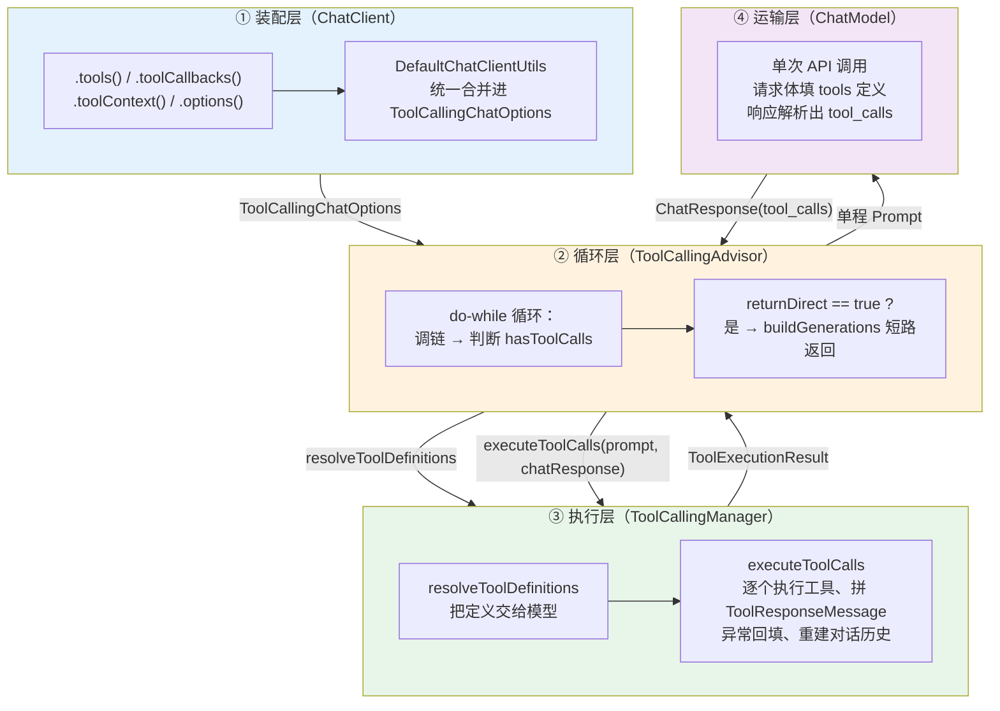
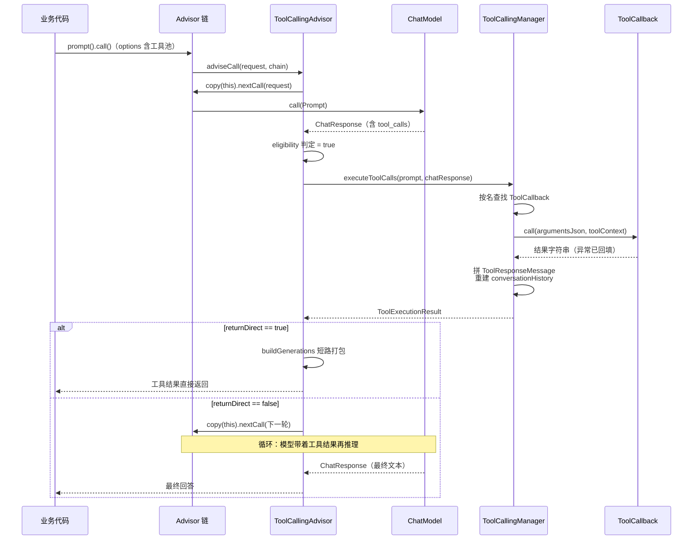
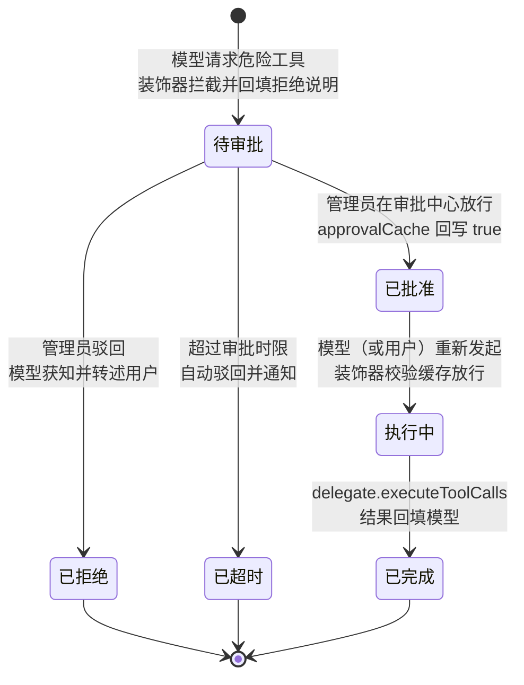

# 07 工具调用进阶与 ToolCallingManager

> **定位**：本文讲 Spring AI 2.0.0 **工具调用的执行管线**——不是 `@Tool` 怎么声明（那是基础篇的内容），而是：一次工具调用从 ChatClient 到模型、再到工具执行的**完整数据流**由哪些组件接力完成；`ToolCallingChatOptions` 如何在运行时装配工具池；`ToolCallingAdvisor` 的执行循环与 `returnDirect` 短路；`ToolCallingManager.executeToolCalls` 的源码级执行原子操作；`FunctionToolCallback` / `MethodToolCallback` 编程式注册；`toolContext` 身份传递；`ToolCallResultConverter` 返回值工程；错误回填（错误是输出不是异常）；动态工具注册；以及企业级自定义 `ToolCallingManager` 装饰器（HITL 审批与审计的官方落点）。读完这篇，你能对工具执行管线做任何一级的接管与改造。
>
> **读者画像**：已经会用 `@Tool` 声明工具的中高级 Java 工程师；需要落地 HITL 审批、租户级工具池、工具审计、动态上下线等企业级能力的架构师。
>
> **前置阅读**：[教程 00-基础与核心/03-工具调用]（`@Tool`/`@ToolParam` 声明式用法）、[教程 02-SpringAI核心机制/01-Advisor链与拦截器]（Advisor 链模型）。

---

## 1. 执行管线全景：2.0 的工具循环去哪了

### 1.1 一个反直觉的事实：ChatModel 不再跑循环

带着 1.x 记忆看 2.0.0，第一个要推翻的假设就是：「模型实现内部有工具执行循环，用 `internalToolExecutionEnabled` 开关控制」。

**这个开关在 2.0.0 已不存在。** 对本地 `spring-ai-model-2.0.0.jar` 的 `ChatOptions.class`、`ToolCallingChatOptions.class` 做字节码字符串扫描，找不到任何 `internalToolExecutionEnabled` 痕迹。更决定性的证据来自模型实现源码（`spring-ai-openai-2.0.0-sources.jar` 的 `OpenAiChatModel.internalCall`）：它只做**一次** API 调用——构造请求、发送、把响应包装成 `ChatResponse` 返回，**没有任何工具执行循环**。DeepSeek 模块同样如此（`spring-ai-deepseek-2.0.0-sources.jar` 中搜不到 `executeToolCalls` 调用）。

那循环去哪了？答案是：**上移到了 ChatClient 侧的 `ToolCallingAdvisor`**。`ChatModel` 退化为「单程运输」——把 `ToolDefinition` 填进请求体、把响应里的 `tool_calls` 解析出来交给上层；「看到工具调用 → 执行工具 → 把结果拼回对话 → 再问模型」的循环由 Advisor 层拥有。

这不是简单的代码搬家，而是架构语义的变化：

| 维度 | 1.x（模型内循环） | 2.0.0（Advisor 循环） |
|------|------------------|----------------------|
| 循环拥有者 | 各 ChatModel 实现（重复实现 N 次） | `ToolCallingAdvisor`（一处实现，全模型共享） |
| 接管执行的方式 | 装饰 ChatModel，或开开关 | 装饰 `ToolCallingManager`（单一执行入口） |
| 循环对 Advisor 链可见性 | 不可见（链上 Advisor 每轮无感知） | 循环在链内，`returnDirect` 可短路整条链 |
| 开关 | `internalToolExecutionEnabled` | **无此开关**——`options` 不是 `ToolCallingChatOptions` 时循环自动跳过 |

> **想深入？→ [教程 02-SpringAI核心机制/01-Advisor链与拦截器]**：Advisor 链的执行顺序、`@Order` 语义与短路模型——本文的循环就嵌在那条链里。

### 1.2 三层接力：装配层、循环层、执行层

2.0.0 的一次带工具的对话，由四类组件接力完成，每层职责单一：



理解这张图，后续所有 API 都有了坐标：你在哪一层做改造，决定了你该实现哪个接口。

### 1.3 本文的实证基准

与全体系一致，本文每一个类、每一个方法签名都经过本地 jar 的 `javap` 实证（版本 `2.0.0`，与 `pom.xml` 声明一致；类名均在 `org.springframework.ai` 包下，表中使用短名），核心清单：

| 类 | 关键成员（实证签名） |
|------|------|
| `model.tool.ToolCallingManager` | `resolveToolDefinitions(ToolCallingChatOptions)` / `executeToolCalls(Prompt, ChatResponse)` / `static builder()` |
| `model.tool.DefaultToolCallingManager` | 构造器 `(ObservationRegistry, ToolCallbackResolver, ToolExecutionExceptionProcessor)` |
| `model.tool.ToolCallingChatOptions` | `getToolCallbacks()` / `getToolContext()` / `mutate()` / `static builder()` / `static mergeToolCallbacks` / `static mergeToolContext` / `static validateToolCallbacks` |
| `model.tool.ToolExecutionResult` | `conversationHistory()` / `returnDirect()` / `static buildGenerations(...)`；常量 `FINISH_REASON = "returnDirect"` |
| `chat.client.advisor.ToolCallingAdvisor` | 实现 `CallAdvisor, StreamAdvisor, ToolAdvisor`；`DEFAULT_ORDER = HIGHEST_PRECEDENCE + 300`；Builder：`toolCallingManager / toolExecutionEligibilityChecker / advisorOrder / conversationHistoryEnabled` |
| `model.tool.ToolExecutionEligibilityChecker` | `Function<ChatResponse, Boolean>` + `default isToolCallResponse(ChatResponse)` |
| `tool.ToolCallback` | `getToolDefinition()` / `call(String)` / `default call(String, ToolContext)` |
| `tool.definition.ToolDefinition` | `name()` / `description()` / `inputSchema()` / `static builder()` |
| `tool.function.FunctionToolCallback` | `static builder(String, BiFunction/Function/Supplier/Consumer)` 四重载；Builder：`description / inputType / inputSchema / toolMetadata / toolCallResultConverter` |
| `tool.method.MethodToolCallback` | 构造器 `(ToolDefinition, ToolMetadata, Method, Object, ToolCallResultConverter)` |
| `tool.execution.ToolCallResultConverter` | `convert(Object, Type)` |
| `tool.execution.ToolExecutionExceptionProcessor` | `process(ToolExecutionException)` → `String` |
| `tool.resolution.ToolCallbackResolver` | `resolve(String)` → `ToolCallback` |
| `chat.model.ToolContext` | 构造器 `(Map<String, Object>)` + `getContext()` |
| `support.ToolCallbacks` | `static from(Object...)` → `ToolCallback[]` |

> **真实 API 基准**：完整对照表与常见错误形态见 [附录 05-SpringAI2-API基准/02-Tool与Observation真实API]。

---

## 2. ToolCallingChatOptions：工具的运行时装配点

### 2.1 两条装配路径，殊途同归于 options

基础篇讲过 `ChatClient` 的便捷方法 `.tools()` / `.toolCallbacks()`。进阶视角下要明白：**这些便捷方法不是独立通道，它们最终全部汇入 `ToolCallingChatOptions`**。`DefaultChatClientUtils` 的装配源码（`spring-ai-client-chat-2.0.0-sources.jar`）清晰地展示了这条汇聚链：

```java
// spring-ai-client-chat-2.0.0 DefaultChatClientUtils（框架源码，非业务代码）
ChatOptions.Builder<?> builder = inputRequest.getChatModel().getOptions().mutate();
if (inputRequest.getOptionsCustomizer() != null) {
    builder = builder.combineWith(inputRequest.getOptionsCustomizer());   // .options(xxx) 传入的 Builder 在这里合并
}
if (builder instanceof ToolCallingChatOptions.Builder<?> tbuilder) {
    List<ToolCallback> toolCallbacks = new ArrayList<>(inputRequest.getToolCallbacks());
    for (var provider : inputRequest.getToolCallbackProviders()) {
        toolCallbacks.addAll(java.util.List.of(provider.getToolCallbacks()));   // .toolCallbacks(provider) 惰性解析
    }
    if (!toolCallbacks.isEmpty()) {
        ToolCallingChatOptions.validateToolCallbacks(toolCallbacks);   // 重名校验，框架自动做
        tbuilder.toolCallbacks(toolCallbacks);                          // .tools() 收集的回调统一塞进 options
    }
    if (!inputRequest.getToolContext().isEmpty()) {
        tbuilder.toolContext(inputRequest.getToolContext());            // .toolContext() 同样汇入 options
    }
}
ChatOptions processedChatOptions = builder.build();
```

三个结论从这里直接读出来：

1. **`.options()` 接受的是 Builder，不是 options 对象**——`ChatClient.ChatClientRequestSpec` 的真实签名是 `<B extends ChatOptions.Builder<?>> ChatClientRequestSpec options(B customizer)`。传入的 Builder 通过 `combineWith` 与模型默认 options 合并。所以**不要调用 `.build()` 再传**。
2. **重名校验是自动的**——`validateToolCallbacks` 在这条链里被调用，同名工具重复注册会在请求装配期直接抛异常。
3. **工具能否生效，取决于模型默认 options 是否是 `ToolCallingChatOptions`**——`OpenAiChatOptions implements ToolCallingChatOptions`（javap 实证），所以 OpenAI 模型下一切顺理成章；若某个模型实现的默认 options 不具备工具能力，`.tools()` 收集的回调将无处安放。

### 2.2 options 直接装配：显式写法

绕过便捷方法直接装配 options 是运行时动态决定工具集的正门。注意语法差异（传 Builder 不 build）：

```java
import java.util.List;

import org.springframework.ai.chat.client.ChatClient;
// Spring AI 2.0.0
import org.springframework.ai.model.tool.ToolCallingChatOptions;
import org.springframework.ai.tool.ToolCallback;

/**
 * 运行时装配工具：options 显式写法。
 * 注意：.options() 的参数是 Builder（源码签名为
 * {@code <B extends ChatOptions.Builder<?>> options(B customizer)}），
 * 内部经 combineWith 与模型默认 options 合并——不要调用 .build()。
 */
public String ask(ChatClient chatClient, List<ToolCallback> runtimeTools, String question) {
    return chatClient.prompt()
            .user(question)
            .options(ToolCallingChatOptions.builder()
                    .temperature(0.2)
                    .maxTokens(1024)
                    .toolCallbacks(runtimeTools))
            .call()
            .content();
}
```

与便捷写法的等价关系：`.toolCallbacks(runtimeTools)` 等价于把 `runtimeTools` 交给装配链塞进 options；区别在于 options 写法还能**同时**携带 `temperature`、`maxTokens` 等采样参数，一次合并、一次构建。

### 2.3 企业级样例①：按租户装配工具池

多租户场景下，「每个租户能用哪些工具」是运行时才能回答的问题——订阅档位、灰度白名单、合规区域都影响工具池。正确做法是：启动时扫描注册**全量候选工具**到目录，请求期按租户身份**裁剪出本次可用的子集**，装配进 `ToolCallingChatOptions`：

```java
import java.util.ArrayList;
import java.util.List;
import java.util.Map;
import java.util.Set;
import java.util.concurrent.ConcurrentHashMap;

import org.springframework.ai.tool.ToolCallback;
import org.springframework.ai.tool.ToolCallbacks;
// Spring AI 2.0.0
import org.springframework.ai.model.tool.ToolCallingChatOptions;
import org.springframework.stereotype.Component;

/**
 * 租户工具池：启动期注册全量候选，请求期按租户裁剪。
 * 工具用 @Tool 注解声明（声明式写法见教程 00-基础与核心/03-工具调用），
 * 经 ToolCallbacks.from 反射成 ToolCallback 数组入目录。
 */
@Component
public class TenantToolRegistry {

    /** 全量候选工具目录：工具名 → 回调实例 */
    private final Map<String, ToolCallback> catalog = new ConcurrentHashMap<>();

    /** 租户 → 可用工具名集合（生产环境来自配置中心/数据库，此处示意内存版） */
    private final Map<String, Set<String>> tenantGrants = new ConcurrentHashMap<>();

    /** 启动期注册：把所有候选工具收入目录 */
    public TenantToolRegistry(
            OrderQueryTools orderTools,
            RefundTools refundTools,
            ReportTools reportTools) {
        for (ToolCallback cb : ToolCallbacks.from(orderTools, refundTools, reportTools)) {
            catalog.put(cb.getToolDefinition().name(), cb);
        }
    }

    /** 请求期装配：按租户授权裁剪出本次工具池 */
    public List<ToolCallback> resolveFor(String tenantId) {
        Set<String> granted = tenantGrants.getOrDefault(tenantId, Set.of());
        List<ToolCallback> pool = new ArrayList<>();
        for (String name : granted) {
            ToolCallback cb = catalog.get(name);
            if (cb != null) {
                pool.add(cb);
            }
        }
        return pool;
    }

    /** 运行时调整授权（配置中心回调触发） */
    public void grant(String tenantId, Set<String> toolNames) {
        tenantGrants.put(tenantId, Set.copyOf(toolNames));
    }
}
```

调用点（WebFlux 端点内完成按租户装配；`Mono.fromSupplier` 把阻塞的 `call()` 移出 EventLoop）：

```java
import java.util.List;

import org.springframework.ai.chat.client.ChatClient;
// Spring AI 2.0.0
import org.springframework.ai.model.tool.ToolCallingChatOptions;
import org.springframework.ai.tool.ToolCallback;
import org.springframework.web.bind.annotation.GetMapping;
import org.springframework.web.bind.annotation.RequestHeader;
import org.springframework.web.bind.annotation.RequestParam;
import org.springframework.web.bind.annotation.RestController;
import reactor.core.publisher.Mono;

@RestController
public class TenantChatController {

    private final ChatClient chatClient;
    private final TenantToolRegistry toolRegistry;

    public TenantChatController(ChatClient.Builder builder, TenantToolRegistry toolRegistry) {
        this.chatClient = builder.build();
        this.toolRegistry = toolRegistry;
    }

    @GetMapping("/chat")
    public Mono<String> chat(@RequestHeader("X-Tenant-Id") String tenantId, @RequestParam String q) {
        List<ToolCallback> pool = toolRegistry.resolveFor(tenantId);
        return Mono.fromSupplier(() -> chatClient.prompt()
                .user(q)
                .options(ToolCallingChatOptions.builder().toolCallbacks(pool))
                .call()
                .content());
    }
}
```

两个架构要点：**未授权的工具根本不出现在 `ToolDefinition` 列表里**——模型连「知道有这个工具」的机会都没有，比「执行期拦截」安全一级（提示注入无法诱导模型调用它看不见的工具）；**裁剪发生在请求期**，授权变更即时生效，不需要重启。

> **想深入？→ [教程 04-企业级架构主干/06-多租户隔离与资源治理]**：租户数据隔离、配额与工具权限的完整分层设计。
> **想深入？→ [教程 10-调优实战与方法论/04-工具调优下：执行与治理]**：工具过载治理——池子不是越大越好，模型在 20+ 工具的选择正确率会显著下降。

---

## 3. ToolCallingAdvisor：执行循环的真正拥有者

### 3.1 默认装配：你没用它，但它一直在

`ChatClient.builder(chatModel)` 内部会自动装配一个 `ToolCallingAdvisor`。`DefaultChatClientBuilder` 构造器源码：

```java
// spring-ai-client-chat-2.0.0 DefaultChatClientBuilder（框架源码）
toolCallingAdvisorBuilder = Objects.requireNonNullElse(toolCallingAdvisorBuilder,
        ToolCallingAdvisor.builder()
            .toolCallingManager(ToolCallingManager.builder().observationRegistry(observationRegistry).build()));
```

也就是说：默认 `ToolCallingManager` 是 `DefaultToolCallingManager`，共用你传给 ChatClient 的 `ObservationRegistry`。这个默认值解释了「为什么我没配任何东西，工具也能循环执行」。

顺带澄清一个迁移陷阱：`ToolCallAdvisor` 在 2.0.0 已标记 `@Deprecated(since = "2.0.0", forRemoval = true)`（javap 实证），新名字就是 `ToolCallingAdvisor`，二者同构。

### 3.2 adviseCall 循环逐段精读

`ToolCallingAdvisor.adviseCall` 的源码骨架（`spring-ai-model-2.0.0-sources.jar`，保留关键控制流）：

```java
// spring-ai-model-2.0.0 ToolCallingAdvisor（框架源码，节选）
public ChatClientResponse adviseCall(ChatClientRequest chatClientRequest, CallAdvisorChain callAdvisorChain) {
    ChatOptions options = chatClientRequest.prompt().getOptions();
    if (!(options instanceof ToolCallingChatOptions toolCallingChatOptions)) {
        return callAdvisorChain.nextCall(chatClientRequest);   // ① 无工具能力 → 整个 Advisor 透明
    }
    // ... 初始化 ...
    boolean isToolCall = false;
    do {
        // ② 组装本轮 Prompt（指令 = 上一轮的 conversationHistory）
        // ③ 调链下游（最终到 ChatModel 的单次调用）
        chatClientResponse = callAdvisorChain.copy(this).nextCall(processedChatClientRequest);
        // ④ 循环继续条件：eligibility checker 判定
        isToolCall = this.toolExecutionEligibilityChecker.isToolCallResponse(chatResponse);
        if (isToolCall) {
            // ⑤ 执行本轮全部工具调用
            ToolExecutionResult toolExecutionResult = this.toolCallingManager
                .executeToolCalls(processedChatClientRequest.prompt(), chatResponse);
            if (toolExecutionResult.returnDirect()) {
                // ⑥ 短路：工具结果直接打包为 Generation 返回，不再回给模型
                chatClientResponse = chatClientResponse.mutate()
                    .chatResponse(ChatResponse.builder()
                        .from(chatResponse)
                        .generations(ToolExecutionResult.buildGenerations(toolExecutionResult))
                        .build())
                    .build();
                break;
            }
            // ⑦ 下一轮指令 = conversationHistory（原始消息 + AssistantMessage + ToolResponseMessage）
            instructions = this.doGetNextInstructionsForToolCall(processedChatClientRequest, chatClientResponse,
                    toolExecutionResult);
        }
    }
    while (isToolCall);
    return this.doFinalizeLoop(chatClientResponse, callAdvisorChain);
}
```

五个关键点，每个都值得在架构评审时说清楚：

1. **透明性**：请求没有 `ToolCallingChatOptions` 时，这个 Advisor 等价于不存在——所以「纯聊天」路径零开销。
2. **循环在链内**：`callAdvisorChain.copy(this).nextCall(...)` 每一轮都重新走一遍链的下游。链上位于它**之后**的 Advisor 每轮都会执行（记忆注入、RAG 增强每轮重新生效），位于它**之前**的只在进入循环前执行一次。安排 Advisor 顺序时，这是决定性知识。
3. **执行委托给 Manager，循环条件可插拔**：Advisor 自己不碰工具，只编排；循环继续条件由 `ToolExecutionEligibilityChecker`（`Function<ChatResponse, Boolean>`，默认 `chatResponse != null && chatResponse.hasToolCalls()`）判定。执行细节（查找、异常回填、Observation）全在 `ToolCallingManager`——装饰 Manager 一处，循环每轮都经过（§9 的审批落点就在这）。
4. **returnDirect 短路**：`break` 直接跳出循环，工具结果经 `buildGenerations` 包装后原样返回给调用方，**模型不再润色**。
5. **历史自管理、无轮次上限**：默认 `conversationHistoryEnabled = true`，每轮把 `conversationHistory()`（原消息 + 本轮 AssistantMessage + ToolResponseMessage）作为下一轮指令。源码里没有「最多 N 轮」的保护——死循环防护是**你的**责任（§3.4 与 §9.2 给方案）。

### 3.3 ToolExecutionEligibilityChecker：定制「什么算一次工具调用」

默认判定是「响应含 tool_calls」。把它换成自定义实现，可以改变循环语义。典型用途：**只在特定模型/特定标志下循环**：

```java
// Spring AI 2.0.0 —— 关键装配（节选示意，完整 import 与上文一致）
ToolExecutionEligibilityChecker strictChecker = chatResponse ->
        chatResponse != null
                && chatResponse.hasToolCalls()
                && chatResponse.hasFinishReasons(java.util.Set.of("tool_calls"));

ChatClient client = ChatClient.builder(
                chatModel,
                io.micrometer.observation.ObservationRegistry.NOOP,
                null,
                null,
                ToolCallingAdvisor.builder()
                        .toolCallingManager(ToolCallingManager.builder().build())
                        .toolExecutionEligibilityChecker(strictChecker))
        .build();
```

注意 `ChatClient.builder` 的五参重载（javap 实证）：第四参之后是 `ToolCallingAdvisor.Builder<?>`——这是**替换默认循环组件**的官方入口。传了自定义 Builder 后，`ObservationRegistry` 不会自动透传给里面的 `ToolCallingManager`（源码 javadoc 明确说明），需要自己在 `.toolCallingManager(...)` 里配。

架构提醒：checker 只看得见 `ChatResponse`，拿不到对话历史，所以**「最大轮次」这类有状态限制不适合在 checker 里做**（无状态接口 + 有状态需求 = 竞态隐患）。轮次控制请放装饰器（§9.2 有完整实现）。

### 3.4 conversationHistoryEnabled：谁管对话历史

`ToolCallingAdvisor.Builder.disableInternalConversationHistory()`（等价 `conversationHistoryEnabled(false)`）切换两种循环续接模式：

| 模式 | 每轮喂给模型的指令 | 适用场景 |
|------|-------------------|---------|
| `true`（默认） | 完整 `conversationHistory()`：原始消息逐轮累积 + 每轮 AssistantMessage/ToolResponseMessage | 无记忆 Advisor 的独立请求；历史由循环内部自洽管理 |
| `false` | 只保留 `SystemMessage` + 最后一条消息（源码：`List.of(systemMessage, history.get(history.size()-1))`） | 链上有记忆 Advisor 统一管历史（如 MessageChatMemoryAdvisor）——避免循环内累积的消息与记忆库持久化的消息**双轨重复** |

选错模式的典型症状：开了记忆 Advisor 后，模型上下文里同一段工具对话出现两遍、Token 翻倍。根因就是循环内历史与记忆库历史双轨并行。

### 3.5 一次工具调用的完整旅程（时序）



这张图建议配合 §4.2 的 `executeToolCalls` 源码精读一起看——时序图上 `ToolCallingManager` 框内的三步，就是下一节要逐段拆的执行原子操作。

---

## 4. ToolCallingManager 与 ToolExecutionResult：执行的原子层

### 4.1 resolveToolDefinitions：把定义交给模型

```java
// spring-ai-model-2.0.0 DefaultToolCallingManager（框架源码，节选）
@Override
public List<ToolDefinition> resolveToolDefinitions(ToolCallingChatOptions chatOptions) {
    List<ToolCallback> toolCallbacks = new ArrayList<>(
            !CollectionUtils.isEmpty(chatOptions.getToolCallbacks()) ? chatOptions.getToolCallbacks() : List.of());
    return toolCallbacks.stream().map(ToolCallback::getToolDefinition).toList();
}
```

逻辑朴素：options 里的每个 `ToolCallback` 取出 `ToolDefinition`（`name()` / `description()` / `inputSchema()` 三元组）。`OpenAiChatModel.createRequest` 调用它把定义填进请求体的 `tools` 参数（源码 847 行实证）。**模型可见的工具面 = resolveToolDefinitions 的输出**——§2.3 的租户裁剪正是作用在这条链的前端（options 装配期）。

### 4.2 executeToolCalls：七步执行原子操作

`executeToolCalls(Prompt, ChatResponse)` 是整个管线的核心，源码行为可以拆成七步，每一步都有明确的故障模式与治理含义：

1. **定位工具调用代**：从 `chatResponse.getResults()` 里找第一个 `getOutput().getToolCalls()` 非空的 `Generation`；找不到直接抛 `IllegalStateException("No tool call requested by the chat model")`。所以这个方法只该在 `hasToolCalls()` 为真后调用。
2. **构建 ToolContext**：`prompt.getOptions()` 若是 `ToolCallingChatOptions`，取 `getToolContext()` **防御性拷贝**进新 `HashMap`，包成 `ToolContext`。上下文从请求一路到工具，中间不经过模型——模型看不到也改不了（§6 详解）。
3. **遍历 toolCalls**：一个 AssistantMessage 可能携带多个并行工具调用，逐一执行。
4. **查找回调，两级**：先在 `prompt` options 的 `toolCallbacks` 里按名过滤；找不到走 `toolCallbackResolver.resolve(toolName)` 兜底；再找不到抛 `IllegalStateException("No ToolCallback found for tool name: ...")`（§8 的动态注册正是挂在第二级）。
5. **returnDirect AND 语义**：多个工具调用时，最终 `returnDirect = 所有回调的 toolMetadata.returnDirect() 逐个 AND`（源码：`returnDirect = returnDirect && toolCallback.getToolMetadata().returnDirect()`）——只要有一个工具要交给模型润色，整轮就不短路。
6. **执行与异常回填**：`toolCallback.call(argumentsJson, toolContext)` 包在 `TOOL_CALL` Observation 里（参数、结果都进观测上下文）；抛出 `ToolExecutionException` 时不向上传播，而是交给 `ToolExecutionExceptionProcessor.process(ex)` 把**错误文本**作为工具结果（§4.4）；结果为 null 回填空串。空参数 JSON 回填 `"{}"`（流式场景模型可能漏传）。
7. **重建对话历史**：`conversationHistory = 原始消息 + 本轮 AssistantMessage + ToolResponseMessage`。`ToolResponseMessage.ToolResponse` 是 record `(id, name, responseData)`——id 对应模型给的 tool_call id，回传时模型靠它配对。

`ToolExecutionResult` 就是第 6、7 步产物 plus 短路标志的打包：`conversationHistory()` 给循环续接用，`returnDirect()` 给 Advisor 短路判断用，静态 `buildGenerations(...)` 把工具响应包装成 `Generation`（metadata 里带 `FINISH_REASON = "returnDirect"`）供直接返回。

### 4.3 手工执行循环：不经过 ChatClient 的裸管线

循环在 Advisor 层意味着：**直接用 ChatModel 时，工具不会自动执行**。这既是陷阱（从 1.x 迁移的人会发现「工具不跑了」）也是自由（你可以完全接管循环节奏）。手工循环的标准形态：

```java
import java.util.List;

import org.springframework.ai.chat.messages.Message;
import org.springframework.ai.chat.messages.UserMessage;
// Spring AI 2.0.0
import org.springframework.ai.chat.model.ChatModel;
import org.springframework.ai.chat.model.ChatResponse;
import org.springframework.ai.chat.prompt.Prompt;
import org.springframework.ai.model.tool.ToolCallingChatOptions;
import org.springframework.ai.model.tool.ToolCallingManager;
import org.springframework.ai.model.tool.ToolExecutionResult;
import org.springframework.ai.tool.ToolCallback;
import org.springframework.ai.tool.ToolCallbacks;

/**
 * 手工执行循环：ChatModel（单程）+ ToolCallingManager（执行）自组循环。
 * 适用：批处理作业、自定义编排器、需要对每轮做特殊控制的场景。
 * ChatClient 场景不需要这段代码——ToolCallingAdvisor 已经在链内做同样的事。
 */
public class ManualToolLoop {

    private final ChatModel chatModel;
    private final ToolCallingManager toolCallingManager;
    private final int maxRounds;

    public ManualToolLoop(ChatModel chatModel, ToolCallingManager toolCallingManager, int maxRounds) {
        this.chatModel = chatModel;
        this.toolCallingManager = toolCallingManager;
        this.maxRounds = maxRounds;
    }

    public String run(String question, List<ToolCallback> tools) {
        ToolCallingChatOptions options = ToolCallingChatOptions.builder()
                .toolCallbacks(tools)
                .build();

        List<Message> instructions = List.of(new UserMessage(question));
        Prompt prompt = new Prompt(instructions, options);

        ChatResponse chatResponse = chatModel.call(prompt);

        int round = 0;
        while (chatResponse.hasToolCalls()) {
            if (++round > maxRounds) {
                throw new IllegalStateException("工具循环超过 " + maxRounds + " 轮，疑似死循环，强制熔断");
            }

            ToolExecutionResult result = toolCallingManager.executeToolCalls(prompt, chatResponse);

            // returnDirect 语义：工具结果已是最终输出，不再回给模型（与 Advisor 循环的 break 短路一致）
            if (result.returnDirect()) {
                return result.buildGenerations(result).get(0).getOutput().getText();
            }

            // 关键：conversationHistory 替换全部指令，options 必须随行（工具查找与 toolContext 都从这取）
            prompt = new Prompt(result.conversationHistory(), options);
            chatResponse = chatModel.call(prompt);
        }
        return chatResponse.getResult().getOutput().getText();
    }
}
```

三个容易踩的坑，全部源自 §4.2 的源码行为：**options 必须每轮随行**（`executeToolCalls` 从 `prompt.getOptions()` 取工具池和 toolContext，漏传则第二轮找不到工具直接抛 `IllegalStateException`）；**历史要整体替换**（`conversationHistory()` 是完整历史，不是增量）；**轮次熔断必须自己写**（框架不设上限）。

### 4.4 错误是输出，不是异常：ToolExecutionExceptionProcessor

工具执行失败的默认行为可能出乎意料：**错误不抛给调用方，而是作为工具结果回填给模型**。`DefaultToolExecutionExceptionProcessor` 的源码行为（`DEFAULT_ALWAYS_THROW = false`，javap + 源码双重实证）：

| 条件 | 行为 | 设计意图 |
|------|------|---------|
| cause 不是 `RuntimeException`（如 `IOException`、`OutOfMemoryError`） | **抛出** | 系统级故障不该让模型「理解」——中断整条调用链 |
| cause 是 `RuntimeException` 且命中 `rethrowExceptions` 白名单 | **抛出** | 业务关键异常（如余额不足）需要调用方感知，不能糊弄模型 |
| `alwaysThrow = true` | **抛出** | 显式选择 1.x 式「失败即中断」 |
| 其余（默认路径） | **回填** `exception.getMessage()`；消息为空时回填 `"Exception occurred in tool: <工具名> (<异常类SimpleName>)"` | 「错误是输出」：模型读到错误描述后可自行修正参数重试——这是 Agent 自愈能力的来源 |

这个默认值是审慎的架构决策：LLM 收到 `参数 date 格式错误，应为 yyyy-MM-dd` 这样的回填后，下一轮大概率会修正参数——把一次必然失败的调用变成一次自愈。而系统级故障（连接池耗尽、OOM）回填给模型毫无意义且浪费 Token，所以源码对非 RuntimeException 选择了硬抛。企业级落地时，用 `DefaultToolExecutionExceptionProcessor.builder().alwaysThrow(false).rethrowExceptions(List.of(业务关键异常.class)).build()` 精确控制边界，并经 `DefaultToolCallingManager.builder().toolExecutionExceptionProcessor(processor)` 装配进自定义 Manager（§8.2 有完整装配链）。

### 4.5 企业级样例④：工具超时与失败回填

回填机制的完整企业级用法：**工具内部自己做超时与降级，把失败转成「可行动的错误信息」**——模型读到后知道下一步该干什么：
```java
import java.time.Duration;
import java.util.concurrent.TimeoutException;

import org.springframework.ai.chat.model.ToolContext;
// Spring AI 2.0.0
import org.springframework.ai.tool.ToolCallback;
import org.springframework.ai.tool.definition.ToolDefinition;
import org.springframework.ai.tool.function.FunctionToolCallback;

/**
 * 带超时与失败回填的订单查询工具。
 * 错误信息是写给模型看的「指令」：说清发生了什么、模型该怎么做。
 */
public class ResilientOrderTools {

    public record OrderQuery(String orderId) {}

    public record OrderResult(String orderId, String status, String amount) {}

    private final OrderQueryClient orderClient;   // 你的下游客户端

    public ResilientOrderTools(OrderQueryClient orderClient) {
        this.orderClient = orderClient;
    }

    public ToolCallback orderQueryTool() {
        return FunctionToolCallback
                .builder("queryOrderStatus",
                        (OrderQuery req, ToolContext ctx) -> queryWithResilience(req.orderId(), ctx))
                .description("按订单号查询订单状态与金额。orderId 为 18 位数字串。")
                .inputType(OrderQuery.class)
                .build();
    }

    private OrderResult queryWithResilience(String orderId, ToolContext ctx) {
        try {
            return orderClient.query(orderId, Duration.ofSeconds(3));
        }
        catch (TimeoutException e) {
            // 回填给模型：说明状态 + 建议动作，模型能据此向用户解释或改走异步查询
            throw new OrderToolException(
                    "订单服务 3 秒内未响应（超时）。该订单状态暂时未知，请告知用户稍后重试，或建议用户在 App 内查看。");
        }
        catch (IllegalArgumentException e) {
            // 参数级错误：告诉模型正确格式，下一轮它会自己修正
            throw new OrderToolException("订单号 " + orderId + " 格式错误：应为 18 位数字串。请检查参数后重试。");
        }
    }

    /** 业务异常（RuntimeException 子类），经 processor 默认路径回填给模型 */
    public static class OrderToolException extends RuntimeException {
        public OrderToolException(String message) {
            super(message);
        }
    }
}
```

分工清晰：**参数错误、可重试错误 → 回填**（模型是第一恢复人）；**计费、安全、数据一致性错误 → 白名单硬抛**（调用方代码是恢复人，如计费模块定义的 `InsufficientBalanceException` 应作为 `rethrowExceptions` 成员直接抛出）。把所有异常都回填或都硬抛，都是放弃了这个分层。

---

## 5. 编程式注册：FunctionToolCallback 与 MethodToolCallback

`@Tool` 注解 + `ToolCallbacks.from` 是声明式路径。但工具名、描述、Schema 需要**运行时计算**时（多语言文案、按租户裁剪参数字段、从配置中心拉描述），必须走编程式路径。两个真实类：`FunctionToolCallback`（函数式）与 `MethodToolCallback`（反射式）。

### 5.1 FunctionToolCallback：四种 builder 重载与 inputType 铁律

`FunctionToolCallback.builder` 有四个静态重载（javap 实证），对应四种 Java 函数形态：

| 重载 | 函数形态 | 典型用途 |
|------|---------|---------|
| `builder(String, BiFunction<I, ToolContext, O>)` | 输入 + 上下文 → 输出 | **需要 toolContext 的工具（生产首选）** |
| `builder(String, Function<I, O>)` | 输入 → 输出 | 纯函数工具 |
| `builder(String, Supplier<O>)` | 无输入 → 输出 | 系统状态查询（当前时间、健康度） |
| `builder(String, Consumer<I>)` | 输入 → 无输出 | 副作用型动作（发通知、写审计） |

**注意：工具名在 `builder()` 的第一个参数传入，Builder 上没有 `.name()` 方法**。Builder 的完整方法：`description / inputSchema / inputType(Type) / inputType(ParameterizedTypeReference) / toolMetadata / toolCallResultConverter / build`。

`inputType` 是必填项（源码 `Assert.notNull(this.inputType, "inputType cannot be null")`）——框架靠它生成 `inputSchema`，并在执行时把模型给的参数 JSON 反序列化成该类型（`FunctionToolCallback.call` 源码：`I request = jsonHelper.fromJson(toolInput, this.toolInputType)`，然后执行函数，最后 `toolCallResultConverter.convert(response, null)` 转字符串）。

```java
import java.util.Map;

import org.springframework.ai.chat.model.ToolContext;
// Spring AI 2.0.0
import org.springframework.ai.tool.ToolCallback;
import org.springframework.ai.tool.function.FunctionToolCallback;

/**
 * 编程式注册：订单退款工具（BiFunction 携带 toolContext）。
 * 工具名、描述在运行时决定——多语言部署时描述可从 i18n 包取。
 */
public class RefundToolFactory {

    /** 模型可见的输入 Schema 载体 */
    public record RefundInput(String orderId, String reason, double amount) {}

    public record RefundOutput(String refundId, String status) {}

    public ToolCallback refundTool(String locale) {
        String description = "zh".equals(locale)
                ? "对指定订单发起退款。需要订单号、退款原因和金额。"
                : "Initiate a refund for the given order. Requires orderId, reason and amount.";

        return FunctionToolCallback
                .builder("refundOrder",
                        (RefundInput in, ToolContext ctx) -> doRefund(in, ctx))
                .description(description)
                .inputType(RefundInput.class)
                .build();
    }

    private RefundOutput doRefund(RefundInput in, ToolContext ctx) {
        Map<String, Object> context = ctx.getContext();
        String operator = String.valueOf(context.get("userId"));
        // 真实退款调用……此处返回示意结果
        return new RefundOutput("rf-" + in.orderId(), "PROCESSING by " + operator);
    }
}
```

两个细节值得记住：**工具名在 `builder()` 第一个参数传入，Builder 上没有 `.name()` 方法**；泛型容器类型（如 `List<Order>`）作输入时用 `.inputType(new ParameterizedTypeReference<List<Order>>() {})` 防 erasure——`inputType(Type)` 重载就是为它准备的。`Supplier` 与 `Consumer` 形态的工具没有输入类型，`DefaultToolCallResultConverter` 遇到 `Void.TYPE` 返回固定串 `"Done"`（源码实证）——**无返回值的工具也要给模型一个约定应答**，`"Done"` 就是那个约定。

### 5.2 MethodToolCallback：手工反射装配

`MethodToolCallback` 是 `@Tool` 注解机制的底层载体：`ToolCallbacks.from` 扫描注解方法后，构建的就是它。手工构建一条工具的完整要素（Builder 方法全部 javap 实证）：

- `toolDefinition(ToolDefinition)`——必填，`ToolDefinition.builder().name(...).description(...).inputSchema(...).build()`，**Schema 完全手写**；
- `toolMethod(Method)`——用 `ReflectionUtils.findMethod(类, "方法名", 参数类型...)` 取得；
- `toolObject(Object)`——方法所属实例；
- `toolMetadata(ToolMetadata)`——可选，`ToolMetadata.builder().returnDirect(false).build()`；
- `toolCallResultConverter(...)`——可选，传 null 用 `DefaultToolCallResultConverter`。

五件套装配成 `MethodToolCallback.builder().toolDefinition(d).toolMethod(m).toolObject(o).build()`。手工路径的代价与收益同样鲜明：代价是 `inputSchema` 的 JSON Schema 字符串要自己负责维护，收益是**完全控制模型可见的参数描述**——注解生成不了的多态、条件字段、i18n 描述，这里都能写。因为要手写 Schema 并保持与实现同步，它只适合存量方法桥接这类一次性场景（选型对比见 §5.3）。

### 5.3 选型：注解 vs FunctionToolCallback vs MethodToolCallback

| 维度 | `@Tool` + `ToolCallbacks.from` | `FunctionToolCallback` | `MethodToolCallback` |
|------|-------------------------------|------------------------|----------------------|
| Schema 生成 | 注解自动 | `inputType` 反射自动，或手写覆盖 | 全手写 |
| 运行时动态性 | 低（类路径固定） | **高**（lambda 即工具） | 中（方法已定，定义可换） |
| toolContext | 方法加 `ToolContext` 参数 | `BiFunction` 第二参天然携带 | 方法加 `ToolContext` 参数 |
| 适用 | 绝大多数业务工具 | 动态/多语言/按租户定制工具 | 存量方法桥接、需要精确 Schema |
| 反模式 | —— | 把复杂业务逻辑塞进 lambda（不可测） | 手写 Schema 与实现漂移（Schema 说了方法没做） |

一个务实的分工：**注解为主（80% 的常规工具），FunctionToolCallback 处理动态装配（§2.3 租户池的动态成员），MethodToolCallback 只在桥接存量代码时出场**。

---

## 6. toolContext：调用方身份的正规通道

### 6.1 机制：上下文从 options 到工具，不经过模型

`toolContext` 解决的问题是：工具执行需要的**调用方信息**（谁在问、哪个租户、哪个会话）不该让模型传参——模型可能伪造，也可能遗忘。它的传递路径在 `DefaultToolCallingManager.buildToolContext` 源码里一目了然：

```java
// spring-ai-model-2.0.0 DefaultToolCallingManager（框架源码，节选）
private static ToolContext buildToolContext(Prompt prompt, AssistantMessage assistantMessage) {
    Map<String, Object> toolContextMap = Map.of();
    if (prompt.getOptions() instanceof ToolCallingChatOptions toolCallingChatOptions
            && !CollectionUtils.isEmpty(toolCallingChatOptions.getToolContext())) {
        toolContextMap = new HashMap<>(toolCallingChatOptions.getToolContext());   // 防御性拷贝
    }
    return new ToolContext(toolContextMap);
}
```

三个性质：**来源唯一**（`ToolCallingChatOptions.getToolContext()`）；**不可变对外**（`ToolContext` 只暴露 `getContext()` 只读视图）；**对模型不可见**（不进 Prompt、不进 ToolDefinition，模型无法读取或篡改）。这与把身份塞进工具参数（`@ToolParam` 传 tenantId）有本质安全差异——参数是模型可控的，toolContext 是调用方可信的。

### 6.2 三个设置位置与合并规则

| 位置 | API | 作用域 |
|------|-----|--------|
| Client 级 | `ChatClient.Builder.defaultToolContext(Map)` | 该 ChatClient 的所有请求 |
| 请求级 | `chatClient.prompt().toolContext(Map)` | 单次请求 |
| options 级 | `ToolCallingChatOptions.builder().toolContext(k, v)` 或 `.toolContext(Map)` | 单次请求（与便捷方法殊途同归） |

同 key 冲突时用 `ToolCallingChatOptions.mergeToolContext(defaults, runtime)` 的语义：**运行时值覆盖默认值**。多租户网关的推荐分层是：Client 级放常量（服务名、环境标识），请求级放身份（租户、用户、会话）。

### 6.3 企业级样例②：租户与用户身份全链贯通

WebFlux 环境下身份在 Reactor Context 里（铁律：禁 ThreadLocal），要在工具执行时拿到它，正确做法是在**组装请求的时机**把身份从 Reactor Context 提取出来放进 toolContext——工具执行发生在 `executeToolCalls` 的同步栈里，届时 Reactor Context 已不可达：

```java
import java.util.Map;

import org.springframework.ai.chat.client.ChatClient;
// Spring AI 2.0.0
import org.springframework.ai.chat.model.ToolContext;
import org.springframework.ai.tool.annotation.Tool;
import org.springframework.ai.tool.annotation.ToolParam;
import org.springframework.web.bind.annotation.GetMapping;
import org.springframework.web.bind.annotation.RequestHeader;
import org.springframework.web.bind.annotation.RestController;
import reactor.core.publisher.Mono;

@RestController
public class TenantAwareChatController {

    private final ChatClient chatClient;

    public TenantAwareChatController(ChatClient.Builder builder) {
        this.chatClient = builder
                .defaultTools(new TenantDataTools())
                .build();
    }

    @GetMapping("/ask")
    public Mono<String> ask(@RequestHeader("X-Tenant-Id") String tenantId,
                            @RequestHeader("X-User-Id") String userId,
                            @org.springframework.web.bind.annotation.RequestParam String q) {
        // 关键：在组装请求的时机把身份固化进 toolContext。
        // 工具执行发生在 executeToolCalls 的同步栈里，届时 Reactor Context 已不可达，
        // toolContext 是唯一能随身携带到工具执行的显式载体。
        return Mono.fromSupplier(() -> chatClient.prompt()
                .user(q)
                .toolContext(Map.of(
                        "tenantId", tenantId,
                        "userId", userId))
                .call()
                .content());
    }

    /** 工具侧：ToolContext 作为方法参数，框架自动注入（模型不可见） */
    static class TenantDataTools {

        @Tool(description = "查询当前租户的订单列表")
        public String listOrders(@ToolParam(description = "最多返回条数") int limit, ToolContext toolContext) {
            String tenantId = String.valueOf(toolContext.getContext().get("tenantId"));
            String operatorId = String.valueOf(toolContext.getContext().get("userId"));
            // 用可信身份查询，而不是模型给的任何身份参数
            return "租户 " + tenantId + " 用户 " + operatorId + " 的前 " + limit + " 笔订单";
        }
    }
}
```

> 若你的工程已引入 Spring Security（`spring-boot-starter-security`，pom 未声明时需先添加依赖），把上面从两个 Header 取身份改为在订阅链上游 `ReactiveSecurityContextHolder.getContext()` 提取后再放进 `toolContext` 即可——提取时机纪律不变：必须在还有 Reactor Context 的位置完成提取。

这段代码里有两条值得写进团队规范的纪律：**身份只从 toolContext 读，绝不接受模型提供的身份参数**——提示注入的典型攻击就是诱导模型调用 `listOrders(tenantId="其他租户")`；**提取时机在订阅链上游**——身份必须在还有上下文的位置提取并固化进 toolContext，往下传的唯一载体就是这个显式参数。

一个框架级的硬校验要知晓（`MethodToolCallback.validateToolContextSupport` 源码实证）：**方法声明了 `ToolContext` 参数，而请求没有传任何 toolContext 时，工具执行会直接抛 `IllegalArgumentException("ToolContext is required by the method as an argument")`**。也就是说，`ToolContext` 参数一旦写进方法签名，就等于向框架声明「本工具必须有调用方上下文」——安全工具（按身份查数据）正该如此，它把「忘传身份」从静默的越权风险变成了显式失败。

### 6.4 为什么不是 ThreadLocal

`executeToolCalls` 是同步调用栈，看起来 ThreadLocal 也能用——但 2.0.0 的工具执行可能发生在 Advisor 循环的任意一轮，且流式路径（`adviseStream`）运行在 Reactor 调度器的 EventLoop 上，ThreadLocal 在线程切换后必然丢失，还会在 EventLoop 上造成跨请求污染。框架自己也是这么处理的——`DefaultToolCallingManager` 源码里恢复 Observation 父 span 用的是 `ToolCallReactiveContextHolder`（从 Reactor Context 读取，internal 包），而非 ThreadLocal。跟随框架的上下文策略，是响应式栈里少踩坑的捷径。

> **想深入？→ [教程 01-WebFlux与响应式编程]**：Reactor Context 的传递规则与 EventLoop 纪律。
> **想深入？→ [教程 08-架构师进阶/08-响应式错误处理]**：响应式链上的异常传播与上下文恢复。

---

## 7. 返回值工程：ToolCallResultConverter 与 returnDirect

### 7.1 DefaultToolCallResultConverter 的三分支

工具方法的返回对象如何变成给模型看的字符串？答案在 `DefaultToolCallResultConverter.convert`（源码实证三分支）：

```java
// spring-ai-model-2.0.0 DefaultToolCallResultConverter（框架源码，节选）
public String convert(@Nullable Object result, @Nullable Type returnType) {
    if (returnType == Void.TYPE) {
        return jsonHelper.toJson("Done");                    // ① 无返回值 → 约定应答 "Done"
    }
    if (result instanceof RenderedImage) {
        // ② 图片 → base64 JSON：{"mimeType":"image/png","data":"..."}
        return jsonHelper.toJson(Map.of("mimeType", "image/png", "data", imgB64));
    }
    else {
        return jsonHelper.toJson(result, true);              // ③ 其余 → JSON 序列化
    }
}
```

对架构师的三点含义：返回对象的**全部字段都会进模型上下文**（③ 分支无脱敏、无裁剪）——含敏感字段的实体直接返回就是数据泄露；`void` 工具不是「没有反馈」，模型收到 `"Done"`；图片有官方通路（base64 JSON），视觉模型可直接消费。

### 7.2 自定义 Converter：在返回值上做工程

`@Tool` 注解有 `resultConverter()` 属性（javap 实证：`Class<? extends ToolCallResultConverter> resultConverter()`），`FunctionToolCallback.Builder` 有 `toolCallResultConverter(...)`。自定义 converter 是**返回值治理**的标准挂点。

### 7.3 企业级样例⑥：大结果落盘换引用

报表查询、日志检索类工具动辄返回几万行——直接 JSON 进上下文，一次调用烧掉整个窗口，还挤掉对话历史。模式：**超阈值落盘，给模型一个可下载的引用 + 头部摘要**：

```java
import java.lang.reflect.Type;
import java.nio.charset.StandardCharsets;
import java.nio.file.Files;
import java.nio.file.Path;
import java.util.UUID;

// Spring AI 2.0.0
import org.springframework.ai.tool.execution.ToolCallResultConverter;

/**
 * 大结果落盘 Converter：超过阈值的工具结果写入对象存储/本地盘，
 * 返回给模型的是「摘要 + 引用」——上下文窗口留给推理，不留给数据倾倒。
 * 挂接方式：@Tool(resultConverter = OffloadResultConverter.class)
 * 或 FunctionToolCallback.builder(...).toolCallResultConverter(new OffloadResultConverter())
 */
public class OffloadResultConverter implements ToolCallResultConverter {

    /** 落盘阈值（字符数）：约等于 4K Token 上下文占用量 */
    private static final int THRESHOLD = 16_000;

    private final Path storageDir;
    private final String publicBaseUrl;

    public OffloadResultConverter(Path storageDir, String publicBaseUrl) {
        this.storageDir = storageDir;
        this.publicBaseUrl = publicBaseUrl;
    }

    @Override
    public String convert(Object result, Type returnType) {
        String json = String.valueOf(result);

        if (json.length() <= THRESHOLD) {
            return json;
        }

        String refId = "res-" + UUID.randomUUID();
        try {
            Files.createDirectories(storageDir);
            Path target = storageDir.resolve(refId + ".json");
            Files.writeString(target, json, StandardCharsets.UTF_8);
        }
        catch (Exception e) {
            // 落盘失败也不能丢信息：退化为强截断 + 明确标记
            return json.substring(0, THRESHOLD) + "\n...[结果过大且落盘失败，已截断]";
        }

        // 给模型的引用体：头 800 字符预览 + 完整数据引用 + 主动使用指引
        String preview = json.substring(0, Math.min(800, json.length()));
        return """
                {"summary":"结果共 %d 字符，已超出上下文预算，完整数据已存档。",
                 "preview":"%s",
                 "fullResultUrl":"%s/%s.json",
                 "hint":"如需完整数据，请调用 downloadResult 工具获取该引用。"}
                """.formatted(json.length(), preview.replace("\"", "'"), publicBaseUrl, refId);
    }
}
```

配套纪律：引用要有 **TTL 与清理策略**（落盘文件含业务数据，按合规留存期定期清）；`hint` 字段不是装饰——明确告诉模型「下一步可以做什么」，能显著提高它正确使用引用的比率（呼应调优系列的返回值工程）。

> **想深入？→ [教程 10-调优实战与方法论/03-工具调优上：接口设计学]**：resultFormatter、截断策略与可行动错误信息的完整方法论。

### 7.4 returnDirect：跳过模型润色的直通车

`@Tool(returnDirect = true)` 或 `ToolMetadata.builder().returnDirect(true).build()` 声明的工具，其结果**不回给模型**，由 `ToolCallingAdvisor` 经 `buildGenerations` 直接作为最终 Generation 返回（§3.2 第 ⑥ 步的 `break`）。语义上的 AND 规则（§4.2 第 5 步）决定了它只适合**单工具独轮**：本轮模型只调了这一个工具、且它是 returnDirect，才短路。

适用判断：结果的「最终形态」已由工具给出、模型再加工只会引入错误或延迟的场景——查快递单号状态（结果就是结构化事实）、查询账户余额（数字不容润色）、触发一次通知后的回执。不适用：结果需要与用户语气衔接的自然语言场景（模型润色正是价值所在）。

---

## 8. 动态工具：ToolCallbackResolver 与运行时注册

### 8.1 两级查找：options 优先，resolver 兜底

§4.2 第 4 步的查找顺序值得单独成节，因为它是**插件化工具架构的挂点**。`DefaultToolCallingManager.executeToolCall` 源码：

```java
// spring-ai-model-2.0.0 DefaultToolCallingManager（框架源码，节选）
ToolCallback toolCallback = toolCallbacks.stream()
    .filter(tool -> toolName.equals(tool.getToolDefinition().name()))
    .findFirst()
    .orElseGet(() -> this.toolCallbackResolver.resolve(toolName));   // 第二级：resolver 兜底

if (toolCallback == null) {
    throw new IllegalStateException("No ToolCallback found for tool name: " + toolName);
}
```

模型 hallucinate 出一个不存在的工具名时，走完两级查找后抛 `IllegalStateException`——注意这不是回填，是**硬失败**（名字查找失败属于模型行为错误，与工具执行失败不同类）。默认 resolver 是 `DelegatingToolCallbackResolver(List.of())`——空链，直接返回 null。所以：**不配置 resolver 时，options 里没有的工具就是真的不存在**。

### 8.2 企业级样例⑤：动态注册与注销

实现 `ToolCallbackResolver`，配一个并发安全的注册表，工具就能在**不重启、不重建 ChatClient** 的前提下上下线——前提是自定义 `ToolCallingManager` 并把它装配进 `ToolCallingAdvisor`：

```java
import java.util.List;
import java.util.Map;
import java.util.concurrent.ConcurrentHashMap;

// Spring AI 2.0.0
import org.springframework.ai.model.tool.DefaultToolCallingManager;
import org.springframework.ai.model.tool.ToolCallingManager;
import org.springframework.ai.chat.client.ChatClient;
import org.springframework.ai.chat.client.advisor.ToolCallingAdvisor;
import org.springframework.ai.tool.ToolCallback;
import org.springframework.ai.tool.execution.ToolExecutionExceptionProcessor;
import org.springframework.ai.tool.resolution.ToolCallbackResolver;
import org.springframework.stereotype.Component;

/**
 * 动态工具注册表：实现 ToolCallbackResolver，挂进 DefaultToolCallingManager 的兜底查找位。
 * options 内静态池优先；注册表兜底——静态与动态工具共存。
 */
@Component
public class DynamicToolRegistry implements ToolCallbackResolver {

    private final Map<String, ToolCallback> dynamicTools = new ConcurrentHashMap<>();
    private final Map<String, Long> registeredAt = new ConcurrentHashMap<>();

    /** 上线一个工具（管理端调用；生产环境前置鉴权与审计） */
    public void register(ToolCallback callback) {
        String name = callback.getToolDefinition().name();
        dynamicTools.put(name, callback);
        registeredAt.put(name, System.currentTimeMillis());
    }

    /** 下线：已发出的对话若正处于循环中，下一轮查找即失败并得到明确报错 */
    public void unregister(String toolName) {
        dynamicTools.remove(toolName);
        registeredAt.remove(toolName);
    }

    @Override
    public ToolCallback resolve(String toolName) {
        return dynamicTools.get(toolName);
    }

    public List<String> listNames() {
        return List.copyOf(dynamicTools.keySet());
    }
}
```

装配位置与 §3.3 完全一致（`ChatClient.builder` 五参重载 + `ToolCallingAdvisor.builder()`），唯一差异是把注册表挂进 Manager 的 resolver 位：

```java
// Spring AI 2.0.0 —— 与 §3.3 的差异只在 ToolCallingManager 一处（其余装配参数同 §3.3）
ToolCallingManager dynamicToolCallingManager = DefaultToolCallingManager.builder()
        .observationRegistry(observationRegistry)
        .toolCallbackResolver(registry)   // DynamicToolRegistry 挂进兜底查找位
        .toolExecutionExceptionProcessor(DefaultToolExecutionExceptionProcessor.builder()
                .alwaysThrow(false)
                .build())
        .build();
```

> **装配细节**：`.advisorOrder(...)` 不设置即可——Builder 默认值就是 `DEFAULT_ORDER`（`HIGHEST_PRECEDENCE + 300`）；`toolExecutionEligibilityChecker` 同理保留默认（`hasToolCalls` 判定）。传了自定义 `ToolCallingAdvisor.Builder` 后，`observationRegistry` 不会自动透传给内部的 `ToolCallingManager`（§3.3 的源码行为），所以上面必须显式 `.observationRegistry(...)`。

动态上线的治理红线：**注销不是瞬间安全**——已进入 Advisor 循环的对话若在下一轮查找时工具已消失，会得到 `IllegalStateException`（§8.1），应先摘流量（从模型可见池移除，让模型不再选择它）再延迟注销；**上线要走灰度**——新工具先进灰度租户池（§2.3 的授权机制天然支持），观察 `TOOL_CALL` 观测指标后再全量。

> **想深入？→ [教程 04-企业级架构主干/09-灰度发布与版本管理]**：工具版本与 Prompt/模型灰度共用同一套流量切分机制。
> **想深入？→ [教程 04-企业级架构主干/03-工具执行可观测与审计]**：`spring.ai.tools.observations.include-content` 与 TOOL_CALL 观测的完整配置。

---

## 9. 企业级自定义 ToolCallingManager：审批与审计的官方落点

### 9.1 为什么装饰 Manager，而不是写 Advisor

HITL（危险操作人工审批）的落点选择，在 2.0.0 的架构下有唯一正解：**装饰 `ToolCallingManager`**。理由有三：

1. **单一执行入口**：无论调用方用 ChatClient 还是手工循环、无论循环跑多少轮、无论静态还是动态工具——每次工具执行必经 `executeToolCalls`。装饰这里 = 覆盖 100% 的执行。
2. **Advisor 层管不了执行细节**：`ToolCallingAdvisor` 只编排（决定何时调 executeToolCalls），拿不到单个工具的参数粒度；自己写审批 Advisor 则要重新实现整个循环逻辑（轮次、历史续接、returnDirect 短路……），重复造框架已有且仍在演进的轮子。
3. **异常回填语义天然配合**：审批拒绝时返回一个「拒绝说明」作为工具结果回填给模型，模型会向用户转述「该操作需管理员批准」——而不是抛异常炸掉整个对话。

本体系的架构铁律正是：「HITL 正确落点：`ToolCallingManager` 装饰器或 `ToolCallback` 包装层，不是 Advisor」。

### 9.2 完整样例：审批 + 审计装饰器

```java
import java.util.ArrayList;
import java.util.List;
import java.util.Map;
import java.util.Set;
import java.util.concurrent.ConcurrentHashMap;

import org.springframework.ai.chat.messages.AssistantMessage;
import org.springframework.ai.chat.messages.Message;
import org.springframework.ai.chat.messages.ToolResponseMessage;
// Spring AI 2.0.0
import org.springframework.ai.chat.model.ChatResponse;
import org.springframework.ai.chat.prompt.Prompt;
import org.springframework.ai.model.tool.ToolCallingChatOptions;
import org.springframework.ai.model.tool.ToolCallingManager;
import org.springframework.ai.model.tool.ToolExecutionResult;
import org.springframework.ai.tool.definition.ToolDefinition;

/**
 * 审批 + 审计装饰器：implements ToolCallingManager，内部委托 delegate。
 * 审计：每次 executeToolCalls 记录 工具名/参数/租户/时间戳；
 * 审批：命中危险工具名单时查审批缓存——已批准放行，未批准回填拒绝说明（不抛异常）；
 * 轮次熔断：同一会话超过上限直接抛出（框架无内建上限，这里补上）。
 *
 * WebFlux 注意：executeToolCalls 是同步方法，审批查询走本地缓存而非远程阻塞调用；
 * 远程审批流的异步挂起/恢复见教程 04-企业级架构主干/08-Human-in-the-Loop与审批流。
 */
public class GovernedToolCallingManager implements ToolCallingManager {

    private static final int MAX_ROUNDS = 10;

    private final ToolCallingManager delegate;
    private final Set<String> dangerousTools;
    private final AuditSink auditSink;

    /** 审批缓存：toolName:tenantId → 是否已批准（生产环境由审批工作流回写） */
    private final Map<String, Boolean> approvalCache = new ConcurrentHashMap<>();

    /** 同一会话已执行的轮次（key: 会话标识，生产环境从 toolContext 取） */
    private final Map<String, Integer> roundCounter = new ConcurrentHashMap<>();

    public GovernedToolCallingManager(ToolCallingManager delegate,
                                      Set<String> dangerousTools,
                                      AuditSink auditSink) {
        this.delegate = delegate;
        this.dangerousTools = Set.copyOf(dangerousTools);
        this.auditSink = auditSink;
    }

    @Override
    public List<ToolDefinition> resolveToolDefinitions(ToolCallingChatOptions chatOptions) {
        return delegate.resolveToolDefinitions(chatOptions);
    }

    @Override
    public ToolExecutionResult executeToolCalls(Prompt prompt, ChatResponse chatResponse) {
        AssistantMessage assistantMessage = chatResponse.getResults()
                .stream()
                .filter(g -> !g.getOutput().getToolCalls().isEmpty())
                .findFirst()
                .orElseThrow(() -> new IllegalStateException("No tool call requested by the chat model"))
                .getOutput();

        String tenantId = extractTenant(prompt);
        String sessionKey = sessionKeyOf(prompt, tenantId);

        // ① 轮次熔断：死循环防护（每个会话独立计数）
        int rounds = roundCounter.merge(sessionKey, 1, Integer::sum);
        if (rounds > MAX_ROUNDS) {
            roundCounter.remove(sessionKey);
            throw new IllegalStateException("工具循环超过 " + MAX_ROUNDS + " 轮，已熔断：session=" + sessionKey);
        }

        // ② 审计 + 审批前置检查：对每个待执行的工具调用逐个判断
        for (AssistantMessage.ToolCall toolCall : assistantMessage.getToolCalls()) {
            auditSink.record(Map.of("event", "TOOL_CALL_REQUEST", "tenantId", tenantId,
                    "tool", toolCall.name(), "arguments", String.valueOf(toolCall.arguments()),
                    "round", String.valueOf(rounds)));

            if (dangerousTools.contains(toolCall.name())) {
                String approvalKey = toolCall.name() + ":" + tenantId;
                boolean approved = Boolean.TRUE.equals(approvalCache.get(approvalKey));
                if (!approved) {
                    auditSink.record(Map.of("event", "TOOL_CALL_PENDING", "tenantId", tenantId,
                            "tool", toolCall.name()));
                    // ③ 未批准：不抛异常，把拒绝说明回填成工具结果——
                    //    模型会向用户转述审批要求，对话得以自然继续
                    return rejectWithMessage(prompt, chatResponse, toolCall,
                            "工具 " + toolCall.name() + " 属高风险操作，需要管理员在审批中心批准后重试。"
                                    + "请向用户说明该请求已进入审批流程，审批通过后可重新发起。");
                }
                auditSink.record(Map.of("event", "TOOL_CALL_APPROVED", "tenantId", tenantId,
                        "tool", toolCall.name()));
            }
        }

        // ④ 正常放行：委托默认实现（两级查找、Observation、异常回填全部继承）
        return delegate.executeToolCalls(prompt, chatResponse);
    }

    /** 构造「拒绝回填」：手工拼 ToolResponseMessage 并重建历史，语义与默认实现一致 */
    private ToolExecutionResult rejectWithMessage(Prompt prompt, ChatResponse chatResponse,
                                                  AssistantMessage.ToolCall toolCall, String message) {
        AssistantMessage assistantMessage = chatResponse.getResult().getOutput();
        ToolResponseMessage rejection = ToolResponseMessage.builder()
                .responses(List.of(new ToolResponseMessage.ToolResponse(
                        toolCall.id(), toolCall.name(), message)))
                .build();

        List<Message> history = new ArrayList<>(prompt.getInstructions());
        history.add(assistantMessage);
        history.add(rejection);

        return ToolExecutionResult.builder()
                .conversationHistory(history)
                .returnDirect(false)
                .build();
    }

    /** 审批工作流回写批准结果（审批中心回调） */
    public void approve(String toolName, String tenantId) {
        approvalCache.put(toolName + ":" + tenantId, true);
    }

    private String extractTenant(Prompt prompt) {
        if (prompt.getOptions() instanceof ToolCallingChatOptions opts
                && opts.getToolContext().get("tenantId") != null) {
            return String.valueOf(opts.getToolContext().get("tenantId"));
        }
        return "unknown";
    }

    private String sessionKeyOf(Prompt prompt, String tenantId) {
        if (prompt.getOptions() instanceof ToolCallingChatOptions opts
                && opts.getToolContext().get("conversationId") != null) {
            return tenantId + ":" + opts.getToolContext().get("conversationId");
        }
        return tenantId + ":default";
    }

    /** 审计落地接口：生产实现接 Kafka/日志审计库 */
    public interface AuditSink {
        void record(Map<String, String> event);
    }
}
```

装配方式与 §8.2 相同（`ChatClient.builder` 五参重载 + `ToolCallingAdvisor.builder().toolCallingManager(governed)`），装饰器包住 `DefaultToolCallingManager`，三层治理叠加生效。

### 9.3 审批状态机与异步展开

上面的同步拒绝回填解决了「当下这一轮怎么办」；完整的审批工作流是跨轮次甚至跨时间的状态迁移：



设计要点：**拒绝回填的措辞是给模型读的**——它决定了模型能否向用户准确转述当前状态（呼应调优系列的可行动错误信息）；**批准粒度建议到「工具 + 参数摘要」级**（「允许 refundOrder 但金额 ≤ 500」），粗粒度的工具级白名单会把审批门变成橡皮章。

> **想深入？→ [教程 04-企业级架构主干/08-Human-in-the-Loop与审批流]**：异步审批挂起、会话恢复与升级机制的完整设计。
> **想深入？→ [教程 05-Observation可观测/01-读懂输出：span树与观测生命周期]**：装饰器内的审计事件如何与 TOOL_CALL span 关联到同一条 Trace。

---

## 10. 管线改造决策表与反模式

### 10.1 六个企业级样例的挂点索引

| 需求 | 挂点 | 章节 | 核心机制 |
|------|------|------|---------|
| 按租户裁剪工具池 | options 装配期 | §2.3 | 未授权工具不进 `ToolDefinition`，模型不可见 |
| 身份贯通到工具 | `toolContext` | §6.3 | 上下文不经模型，调用方可信 |
| HITL 审批 + 审计 | `ToolCallingManager` 装饰器 | §9.2 | 单一执行入口，拒绝回填不炸对话 |
| 超时与失败自愈 | 工具内回填 + processor 白名单 | §4.5 | 错误是输出；关键异常硬抛 |
| 动态上下线 | `ToolCallbackResolver` 兜底位 | §8.2 | 两级查找，resolver 挂注册表 |
| 大结果不撑爆窗口 | 自定义 `ToolCallResultConverter` | §7.3 | 落盘换引用 + 可行动 hint |

### 10.2 反模式清单

| 反模式 | 症状 | 正解 |
|--------|------|------|
| `.options(xxx.build())` | 编译错误（options 接受 Builder） | `.options(ToolCallingChatOptions.builder()...)` 传 Builder 本身 |
| 找 `internalToolExecutionEnabled` | API 不存在（2.0.0 已移除） | 循环在 `ToolCallingAdvisor`；接管点换 Manager 装饰器 |
| 手工循环漏传 options | 第二轮 `IllegalStateException: No ToolCallback found` | `new Prompt(result.conversationHistory(), options)` 每轮随行 |
| 身份走模型参数 | 提示注入可伪造租户 | 身份只走 `toolContext` |
| 所有异常都回填 | OOM/连接耗尽被模型「消化」，故障静默 | 非 RuntimeException 框架已硬抛；业务关键异常进 `rethrowExceptions` 白名单 |
| 工具返回大对象直出 | 一次调用烧掉上下文窗口，历史被挤掉 | Converter 落盘换引用（§7.3） |
| 无轮次上限裸跑 | 模型反复调工具死循环，账单飙升 | 装饰器轮次熔断（§9.2）或手工循环计数（§4.3） |
| returnDirect 用在多工具轮 | AND 语义导致短路失效，行为难预测 | returnDirect 只给「单工具独轮」的事实型工具 |

---

## 11. 适用场景与不适用场景

### 适用场景

- 需要 **HITL 审批、工具审计、租户级工具治理** 的企业级 Agent——装饰 `ToolCallingManager` 是 2.0.0 的官方落点
- 工具集需要**运行时动态决定**：多租户订阅差异、灰度放量、插件化上下线
- 工具执行需要**调用方可信上下文**（身份、会话、追踪 ID），且不允许模型伪造
- 直接使用 `ChatModel` 的批处理/编排场景——必须自组循环（§4.3）或改走 ChatClient
- 工具返回**大体积结果**需要落盘引用、或有敏感字段需要脱敏裁剪
- 需要**精确控制工具 Schema**（多态参数、条件字段、多语言描述）的编程式注册

### 不适用场景

- 常规 CRUD 型业务工具——`@Tool` 注解 + 自动装配足够，引入编程式注册是过度设计
- 纯聊天（无工具）链路——`ToolCallingAdvisor` 自动透明跳过，无需任何感知
- 需要模型深度加工的**对话型**结果——`returnDirect` 会跳过润色，反而降低体验
- 高频低延迟的轻量查询——装饰器层的审批缓存若走远程调用，延迟代价大于收益（应审批前置到工作台而非在线拦截）
- 流式场景下的工具结果**增量**输出——本文的循环语义以 `call()` 为准，流式下工具结果在轮末整体回填（流式管线见 [教程 02-SpringAI核心机制/06-SSE流式通信]）

---

## 12. 本章总结

| 概念 | 一句话 |
|------|--------|
| **2.0 执行栈** | 装配层（ChatClient→options）→ 循环层（ToolCallingAdvisor）→ 执行层（ToolCallingManager）→ 运输层（ChatModel 单程） |
| **循环去哪了** | ChatModel 不再跑循环；`internalToolExecutionEnabled` 已不存在；`ToolCallingAdvisor` 的 do-while 拥有循环 |
| **装配殊途同归** | `.tools()` / `.toolCallbacks()` / `.options(Builder)` 最终全部汇入 `ToolCallingChatOptions`；`.options()` 接受 **Builder**，经 `combineWith` 合并，不要 `.build()` 再传 |
| **executeToolCalls 七步** | 定位代 → 建 ToolContext → 遍历 → 两级查找（options→resolver）→ returnDirect AND → 执行+异常回填 → 重建历史 |
| **错误是输出** | 默认回填错误消息给模型（自愈）；非 RuntimeException 与白名单异常硬抛 |
| **手工循环** | ChatModel 直用时自组循环：`hasToolCalls` → `executeToolCalls` → 历史替换 + options 随行 → 再 call |
| **toolContext** | 调用方身份的正规通道：不经模型、不可伪造；`ToolContext` 参数 = 声明「必须有上下文」，缺失即显式失败 |
| **返回值工程** | Converter 三分支（Done/图片/JSON）；大结果落盘换引用 + 可行动 hint |
| **returnDirect** | 单工具独轮短路直返；多工具 AND 语义，一个不短路则全不短路 |
| **动态工具** | `ToolCallbackResolver` 挂 DefaultToolCallingManager 兜底位；先摘流量再注销 |
| **HITL 落点** | 装饰 `ToolCallingManager`（单一执行入口），不是 Advisor；拒绝回填而非抛异常 |
| **轮次熔断** | 框架无内建上限——装饰器或手工循环必须自带熔断 |

**下一篇**：[09-模块化RAG与RetrievalAugmentationAdvisor](09-模块化RAG与RetrievalAugmentationAdvisor.md) — 检索增强的模块化装配与 Advisor 化落地。

---

> **遇到阻塞？→ [教程 00-基础与核心/03-工具调用]**：`@Tool`/`@ToolParam` 声明式用法与 `ChatClient.tools()` 便捷路径的完整基础。
> **遇到阻塞？→ [教程 02-SpringAI核心机制/01-Advisor链与拦截器]**：理解 `ToolCallingAdvisor` 在链中的位置、order 语义与短路模型。
> **想深入？→ [附录 05-SpringAI2-API基准/02-Tool与Observation真实API]**：本文全部 API 的 javap 实证对照表与常见虚构 API 排雷。
> **想深入？→ [教程 04-企业级架构主干/08-Human-in-the-Loop与审批流]**：异步审批工作流、会话挂起与恢复的完整企业设计；工具执行观测配置见 [教程 04-企业级架构主干/03-工具执行可观测与审计]。
