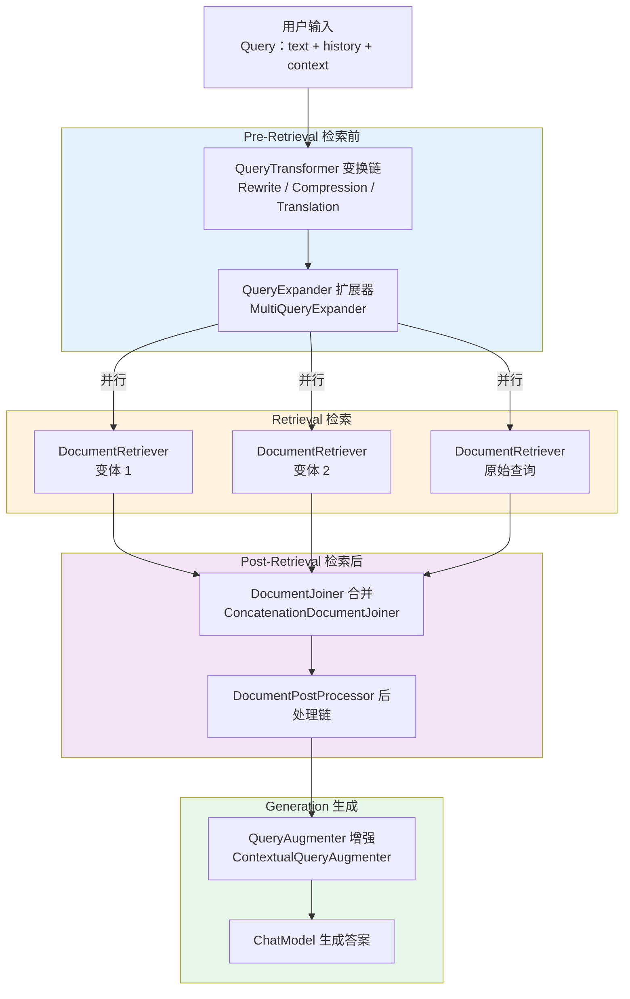
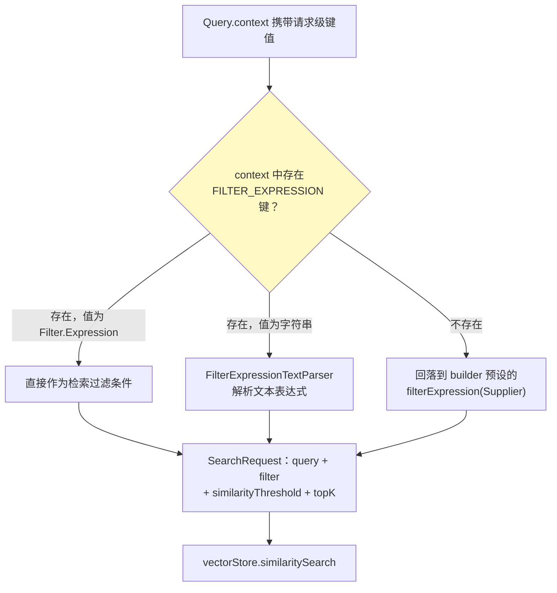
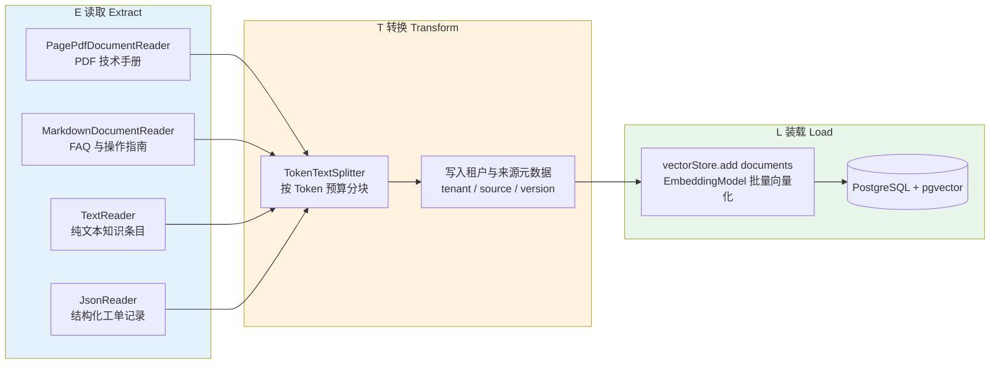

# 08 模块化 RAG 与 RetrievalAugmentationAdvisor

> **定位**：讲透 Spring AI 2.0 `spring-ai-rag` 模块的**模块化 RAG（Modular RAG）**工程体系——Query 数据模型、Pre-Retrieval（QueryTransformer/QueryExpander）、Retrieval（DocumentRetriever）、DocumentJoiner、Post-Retrieval（DocumentPostProcessor）、Generation（QueryAugmenter）六大子模块与 `RetrievalAugmentationAdvisor` 装配器，以及 ETL 管道（DocumentReader → DocumentTransformer → DocumentWriter）从 PDF 到 pgvector 的全量入库样例。所有官网样例补全 import、可直接编译，并升级为企业级写法（多租户隔离、多查询并联、翻译增强、空上下文兜底、幂等入库）。全部 API 均经本地 `spring-ai-rag-2.0.0.jar` 等构件 javap 实证。
>
> **读者画像**：已掌握 RAG 概念、会用 `VectorStore.similaritySearch` 手写检索增强问答的中高级 Java 开发者；需要把"胶水代码式 RAG"重构为可配置、可测试、可演进的生产级流水线的架构师。
>
> **前置阅读**：[00-RAG检索增强生成](../00-基础与核心/05-RAG检索增强生成.md)（RAG 概念与向量检索原理）、[00-ChatClient企业级全量样例](00-ChatClient企业级全量样例.md)（ChatClient 与 Advisor 基础）、[01-Advisor链与拦截器](01-Advisor链与拦截器.md)（Advisor 生命周期）。想了解 Agentic RAG、GraphRAG 等进阶形态，见 [教程 08-架构师进阶/01-高级RAG与AgenticRAG]。

---

## 1. 从"RAG 胶水代码"到模块化 RAG

### 1.1 手写 RAG 的工程困境

在 [教程 00-基础与核心/05-RAG检索增强生成] 里我们写过最朴素的 RAG：拿用户问题调一次 `similaritySearch`，把结果拼进 Prompt 发给模型。demo 能跑，但进入生产后代码会迅速腐化：

| 生产需求 | 胶水代码的应对方式 | 后果 |
|---------|------------------|------|
| 多轮对话中"它呢？"这类指代问题 | 手写提示词让模型自己理解 | 检索时拿到的 query 语义残缺，召回偏差 |
| 用户中英混合提问、知识库纯英文 | 在业务代码里 if-else 判断语言 | 判断逻辑散落各处，无法复用 |
| 单一查询召回不全 | 手写 for 循环改写多查询、合并结果 | 合并/去重/排序逻辑与业务耦合 |
| 知识库查不到时模型胡编 | Prompt 里加一句"不知道就说不知道" | 文案改一处要发一次版 |
| 不同租户检索范围不同 | 每个调用点手拼 filter 字符串 | 越权风险靠 code review 兜底 |

这些问题的共性是：**RAG 流程中的每个环节（改写、扩展、检索、合并、增强）都是独立可演进的关注点，却被压扁在一坨顺序代码里**。

### 1.2 模块化 RAG 的设计哲学

Spring AI 官方参考文档将这套实现追溯到两篇论文：arXiv:2312.10997（Modular RAG：把 RAG 分解为可独立替换的模块与可编排的模式）与 arXiv:2407.21059。核心思想是：

1. **每个阶段是一个函数**——输入输出类型固定，实现可替换；
2. **流水线是函数组合**——Advisor 把各阶段串起来，业务代码只面对 `ChatClient`；
3. **默认实现开箱即用，每个接缝都可插自己的实现**——与 Spring 生态"约定优于配置 + 全部可覆盖"一脉相承。

`RetrievalAugmentationAdvisor` 的 Javadoc 写明它 "implements common RAG flows using the building blocks defined in the `org.springframework.ai.rag` package and following the Modular RAG Architecture"。**Advisor 本身只是装配器，能力全部在六大子模块接口里。**

### 1.3 六大子模块总览



六个子模块在 `spring-ai-rag` jar 中的真实坐标（均已 javap 实证）：

| 阶段 | 接口（`org.springframework.ai.rag.*`） | 函数签名 | 官方默认实现 |
|------|---------------------------------------|---------|-------------|
| 查询变换 | `preretrieval.query.transformation.QueryTransformer` | `Function<Query, Query>` | `RewriteQueryTransformer`、`CompressionQueryTransformer`、`TranslationQueryTransformer` |
| 查询扩展 | `preretrieval.query.expansion.QueryExpander` | `Function<Query, List<Query>>` | `MultiQueryExpander` |
| 文档检索 | `retrieval.search.DocumentRetriever` | `Function<Query, List<Document>>` | `VectorStoreDocumentRetriever` |
| 文档合并 | `retrieval.join.DocumentJoiner` | `Function<Map<Query, List<List<Document>>>, List<Document>>` | `ConcatenationDocumentJoiner` |
| 文档后处理 | `postretrieval.document.DocumentPostProcessor` | `BiFunction<Query, List<Document>, List<Document>>` | 无（默认空列表） |
| 查询增强 | `generation.augmentation.QueryAugmenter` | `BiFunction<Query, List<Document>, Query>` | `ContextualQueryAugmenter` |

一个精妙的设计：**所有接口都是 `java.util.function` 标准函数接口的扩展**——每个组件可独立单测（传入 Query 断言输出）、可自由组合、也能用 lambda 构造极简实现。

### 1.4 依赖坐标

`spring-ai-rag` 由 `spring-ai-starter-model-openai` 等常用 starter 传递引入；若你的模块只依赖 `spring-ai-client-chat` 而没有 rag 能力，需显式添加（版本由 Spring AI BOM 2.0.0 管理）：

```xml
<!-- 需在 pom.xml 添加依赖（若未被传递引入） -->
<dependency>
    <groupId>org.springframework.ai</groupId>
    <artifactId>spring-ai-rag</artifactId>
</dependency>
```

---

## 2. 核心数据模型：Query

六大子模块的输入输出全部围绕一个不可变值对象：`org.springframework.ai.rag.Query`。本地 2.0.0 jar 反编译实证，它是一个 record：

```java
package org.springframework.ai.rag;

// Spring AI 2.0.0 — 真实定义（record，字段不可变）
public record Query(String text, List<Message> history, Map<String, Object> context) {

    public Query {
        Assert.hasText(text, "text cannot be null or empty");
        Assert.notNull(history, "history cannot be null");
        Assert.noNullElements(history, "history elements cannot be null");
        Assert.notNull(context, "context cannot be null");
        Assert.noNullElements(context.keySet(), "context keys cannot be null");
    }

    public Query(String text) {
        this(text, List.of(), Map.of());
    }

    public Builder mutate() { /* 返回携带当前值的 Builder */ }

    public static Builder builder() { /* ... */ }

    public static final class Builder {
        public Builder text(String text) { /* ... */ }
        public Builder history(List<Message> history) { /* ... */ }
        public Builder history(Message... history) { /* ... */ }
        public Builder context(Map<String, Object> context) { /* ... */ }
        public Query build() { /* ... */ }
    }
}
```

> 上方 Builder 各方法体为源码摘要展示；`history` 同时提供 `List` 与 varargs 两个重载，其余构造/校验逻辑与源码一致。后续样例均为完整可运行代码。

三个字段的分工：

| 字段 | 类型 | 语义 | 谁消费它 |
|------|------|------|---------|
| `text` | `String` | 当前查询文本 | 所有子模块 |
| `history` | `List<Message>` | 会话历史消息 | `CompressionQueryTransformer`（把历史压进独立化查询） |
| `context` | `Map<String, Object>` | 请求级键值通道 | `VectorStoreDocumentRetriever`（动态 filter）等 |

两个关键 API——`builder()` 从零构造，`mutate()` 以现有值为默认派生新实例（所有官方 Transformer 用它更新 text 时保持 history/context 不丢）：

```java
import org.springframework.ai.chat.messages.UserMessage;
import org.springframework.ai.rag.Query;
import java.util.List;
import java.util.Map;

// Spring AI 2.0.0
Query query = Query.builder()
        .text("How does modular RAG work?")
        .history(List.of(new UserMessage("什么是 RAG？")))
        .context(Map.of("tenant", "acme"))
        .build();

Query rewritten = query.mutate().text("Rewritten text").build();
```

**`context` 是整个体系的"请求级旁路通道"**：`RetrievalAugmentationAdvisor.before()` 会把 `ChatClientRequest.context()` 原样复制进 Query，业务侧在 ChatClient 调用时塞入的任意键值（租户 filter、用户身份、检索偏好）都能无损抵达最深处 `VectorStoreDocumentRetriever`——第 5.3 节的多租户隔离正是靠这条通道，**不动任何子模块代码就把请求上下文穿透到检索层**。record 不可变 + 显式上下文传递优于 ThreadLocal（呼应 [教程 01-WebFlux与响应式编程] 的 Reactor Context 思想）。

---

## 3. Pre-Retrieval 之一：QueryTransformer

### 3.1 接口语义

```java
package org.springframework.ai.rag.preretrieval.query.transformation;

// Spring AI 2.0.0 — 实证签名
public interface QueryTransformer extends Function<Query, Query> {
    Query transform(Query query);
    default Query apply(Query query) { return transform(query); }
}
```

三个官方实现都内嵌一次 LLM 调用（用构造器传入的 `ChatClient.Builder` 构建内部 ChatClient），LLM 无响应时**降级返回原查询**而非抛异常——辅助环节失败不会中断主流程。

### 3.2 RewriteQueryTransformer：面向检索系统的查询改写

用户口语化输入（"那个知识库的事是咋整的？"）对向量检索很不友好。Rewrite 用 LLM 把查询改写为"简洁、具体、无噪声"的形式。官网样例（补全 import 后）：

```java
import org.springframework.ai.chat.client.ChatClient;
import org.springframework.ai.rag.Query;
import org.springframework.ai.rag.preretrieval.query.transformation.RewriteQueryTransformer;

// Spring AI 2.0.0
ChatClient.Builder builder = ChatClient.builder(chatModel);

QueryTransformer transformer = RewriteQueryTransformer.builder()
        .chatClientBuilder(builder)
        .targetSearchSystem("vector store")
        .build();

Query transformedQuery = transformer.transform(
        new Query("Ho can I get started with Spring AI and the various capabilities?"));

// transformedQuery.text() ≈ "How do I get started with Spring AI and what are its capabilities?"
```

Builder 的完整参数（实证签名）：`chatClientBuilder(ChatClient.Builder)`（必填）、`promptTemplate(PromptTemplate)`（可选，覆盖默认模板）、`targetSearchSystem(String)`（可选，默认 `"vector store"`）。

默认提示词模板（源码原文，含 `{target}` 与 `{query}` 两个占位符）：

```
Given a user query, rewrite it to provide better results when querying a {target}.
Remove any irrelevant information, and ensure the query is concise and specific.

Original query:
{query}

Rewritten query:
```

**企业级要点**：`targetSearchSystem` 不只能写 "vector store"——它描述"查询将被交给什么检索系统"，改写风格随之变化：面向 Elasticsearch 关键词检索时写 `"keyword based Elasticsearch cluster"`，LLM 会偏向抽取关键词而非完整句子。生产中把它做成 `@Value` 配置注入 Bean（与第 3.4 节的 `kbLanguage` 同一模式），避免硬编码。

### 3.3 CompressionQueryTransformer：多轮对话独立化

多轮对话里用户常见"它支持流式吗？"——**历史里的"它"才是检索目标**。Compression 把"对话历史 + 追问"合成为一个语义完整、可独立检索的 standalone query。官网样例：

```java
import org.springframework.ai.chat.client.ChatClient;
import org.springframework.ai.chat.messages.AssistantMessage;
import org.springframework.ai.chat.messages.UserMessage;
import org.springframework.ai.rag.Query;
import org.springframework.ai.rag.preretrieval.query.transformation.CompressionQueryTransformer;
import java.util.List;

// Spring AI 2.0.0
ChatClient.Builder builder = ChatClient.builder(chatModel);

QueryTransformer queryTransformer = CompressionQueryTransformer.builder()
        .chatClientBuilder(builder)
        .build();

Query compressedQuery = queryTransformer.transform(
        Query.builder()
                .text("And what is its second largest city?")
                .history(List.of(
                        new UserMessage("What is the capital of Denmark?"),
                        new AssistantMessage("Copenhagen is the capital of Denmark.")))
                .build());

// compressedQuery.text() ≈ "What is the second largest city in Denmark?"
```

默认模板使用 `{history}` 与 `{query}` 两个占位符；`history` 由源码内部的 `formatConversationHistory(query.history())` 从 `Query.history` 渲染——**这就是 Query 为什么要把消息历史带在身上**。它也是三个 Transformer 中唯一消费 `history` 字段的实现。

多轮会话场景的标准接入：`RetrievalAugmentationAdvisor.before()` 自动把 `chatClientRequest.prompt().getInstructions()` 填入 `Query.history`（源码第 114 行），**与 ChatMemory 组合零额外代码**。

### 3.4 TranslationQueryTransformer：中英混合知识库的统一检索语言

国内企业知识库常见痛点：文档多为英文技术手册，用户却用中文提问。向量相似度对跨语言召回并不可靠，最稳的方案是**检索前把查询统一到知识库的主导语言**。官网样例：

```java
import org.springframework.ai.chat.client.ChatClient;
import org.springframework.ai.rag.Query;
import org.springframework.ai.rag.preretrieval.query.transformation.TranslationQueryTransformer;

// Spring AI 2.0.0
ChatClient.Builder builder = ChatClient.builder(chatModel);

QueryTransformer queryTransformer = TranslationQueryTransformer.builder()
        .chatClientBuilder(builder)
        .targetLanguage("english")
        .build();

Query translatedQuery = queryTransformer.transform(new Query(" bonjour, comment allez-vous?"));

// translatedQuery.text() ≈ "hello, how are you?"
```

默认模板对"已是目标语言"与"语言未知"两种情况都要求**原样返回**——中文查询打英文知识库会被翻译，英文查询零成本通过。企业级姿势——目标语言做成配置：

```java
import org.springframework.ai.chat.client.ChatClient;
import org.springframework.ai.rag.preretrieval.query.transformation.QueryTransformer;
import org.springframework.ai.rag.preretrieval.query.transformation.TranslationQueryTransformer;
import org.springframework.beans.factory.annotation.Value;
import org.springframework.context.annotation.Bean;
import org.springframework.context.annotation.Configuration;

// Spring AI 2.0.0
@Configuration
public class QueryTranslationConfig {

    @Bean
    public QueryTransformer knowledgeBaseQueryTranslator(
            ChatClient.Builder chatClientBuilder,
            // 知识库主导语言由部署配置决定，而非硬编码
            @Value("${app.rag.kb-language:english}") String kbLanguage) {
        return TranslationQueryTransformer.builder()
                .chatClientBuilder(chatClientBuilder)
                .targetLanguage(kbLanguage)
                .build();
    }
}
```

### 3.5 变换链的组合与顺序

`RetrievalAugmentationAdvisor.builder().queryTransformers(...)` 接受列表（或 varargs），Advisor 按列表顺序对同一个 Query 依次应用（源码第 119-122 行的 for 循环）。典型组合：

```java
import org.springframework.ai.chat.client.ChatClient;
import org.springframework.ai.rag.preretrieval.query.transformation.QueryTransformer;
import org.springframework.ai.rag.preretrieval.query.transformation.CompressionQueryTransformer;
import org.springframework.ai.rag.preretrieval.query.transformation.RewriteQueryTransformer;
import org.springframework.ai.rag.preretrieval.query.transformation.TranslationQueryTransformer;
import java.util.List;

// Spring AI 2.0.0 — 多轮 + 中英混合知识库的完整变换链
ChatClient.Builder builder = ChatClient.builder(chatModel);

List<QueryTransformer> pipeline = List.of(
        // 1) 先压缩：把对话历史合成独立查询（必须最先做，后续步骤都依赖语义完整的 text）
        CompressionQueryTransformer.builder().chatClientBuilder(builder).build(),
        // 2) 再翻译：统一到知识库语言
        TranslationQueryTransformer.builder().chatClientBuilder(builder).targetLanguage("english").build(),
        // 3) 最后改写：对最终检索系统优化表述
        RewriteQueryTransformer.builder().chatClientBuilder(builder).targetSearchSystem("vector store").build());
```

顺序有讲究：**压缩必须在翻译之前**（历史进入查询后才有完整跨语言上下文），**改写必须在翻译之后**（对目标语言做最终优化）。注意每个 Transformer 都是一次真实 LLM 调用，三连击意味着检索前烧 3 次模型调用——完整成本账见第 12 节。

---

## 4. Pre-Retrieval 之二：QueryExpander

### 4.1 MultiQueryExpander：一变多的查询扩展

单一查询召回有限。MultiQueryExpander 用 LLM 生成同一问题的多个视角变体，**并行检索再合并**，显著扩大召回面。官网样例：

```java
import org.springframework.ai.chat.client.ChatClient;
import org.springframework.ai.rag.Query;
import org.springframework.ai.rag.preretrieval.query.expansion.MultiQueryExpander;
import java.util.List;

// Spring AI 2.0.0
ChatClient.Builder builder = ChatClient.builder(chatModel);

MultiQueryExpander expander = MultiQueryExpander.builder()
        .chatClientBuilder(builder)
        .numberOfQueries(3)
        .build();

List<Query> queries = expander.expand(new Query("How to install and configure PostgreSQL?"));

// 常见于返回 4 个查询：原始查询 + 3 个变体（includeOriginal 默认 true，原始查询排在索引 0）
```

Builder 完整参数（实证）：`chatClientBuilder`、`promptTemplate`、`includeOriginal(Boolean)`（默认 `true`）、`numberOfQueries(Integer)`（默认 `3`）。

### 4.2 源码级行为：降级与插入位置

两个源码级行为（生产上很重要）：

1. **失败降级**：LLM 返回 null、空串、或变体数量与 `numberOfQueries` 不符时，`expand()` 直接返回 `List.of(原查询)` 并打 warn 日志——扩展失败不会阻断检索，只是退化成单查询检索。
2. **原始查询插在索引 0**：`includeOriginal=true` 时原查询 `queries.add(0, query)`；只要变体时显式 `.includeOriginal(false)`。

默认模板要求 LLM "Provide the query variants separated by newlines"，源码用 `response.split("\n")` 拆分——**变体按行分割**，这也解释了为什么模板强调不要输出多余解释文本。

### 4.3 企业级装配：参数化扩展器

```java
import org.springframework.ai.chat.client.ChatClient;
import org.springframework.ai.rag.preretrieval.query.expansion.MultiQueryExpander;
import org.springframework.ai.rag.preretrieval.query.expansion.QueryExpander;
import org.springframework.beans.factory.annotation.Value;
import org.springframework.context.annotation.Bean;
import org.springframework.context.annotation.Configuration;

// Spring AI 2.0.0
@Configuration
public class QueryExpansionConfig {

    @Bean
    public QueryExpander multiQueryExpander(
            ChatClient.Builder chatClientBuilder,
            @Value("${app.rag.query-expansion.count:3}") int queryCount) {
        return MultiQueryExpander.builder()
                .chatClientBuilder(chatClientBuilder)
                .numberOfQueries(queryCount)
                // 原始查询保留：它是用户真实意图的锚点，避免 LLM 变体集体跑偏
                .includeOriginal(true)
                .build();
    }
}
```

想深入 HyDE（假设性文档扩展）、Step-Back 提问等更多扩展策略，见 [教程 08-架构师进阶/01-高级RAG与AgenticRAG §2]——本文聚焦官方实现，自定义 `QueryExpander` 只需实现 `List<Query> expand(Query query)` 一个方法即可无缝插入。

---

## 5. Retrieval：DocumentRetriever

### 5.1 接口语义：任意数据源都能接入

```java
package org.springframework.ai.rag.retrieval.search;

// Spring AI 2.0.0 — 实证签名
public interface DocumentRetriever extends Function<Query, List<Document>> {
    List<Document> retrieve(Query query);
    default List<Document> apply(Query query) { return retrieve(query); }
}
```

接口只要求"Query 进、List&lt;Document&gt; 出"，不限定存储介质。官方实现只有 `VectorStoreDocumentRetriever`，但你可以包装 Elasticsearch、内部检索微服务、数据库全文索引——**这是微服务拆分下"检索服务独立部署"（[教程 04-企业级架构主干]）的天然接缝**。

### 5.2 VectorStoreDocumentRetriever：向量库检索的标准实现

官网样例：

```java
import org.springframework.ai.rag.Query;
import org.springframework.ai.rag.retrieval.search.DocumentRetriever;
import org.springframework.ai.rag.retrieval.search.VectorStoreDocumentRetriever;
import org.springframework.ai.vectorstore.VectorStore;

// Spring AI 2.0.0
VectorStoreDocumentRetriever retriever = VectorStoreDocumentRetriever.builder()
        .vectorStore(vectorStore)
        .similarityThreshold(0.73)
        .topK(5)
        .build();

List<org.springframework.ai.document.Document> documents =
        retriever.retrieve(new Query("The World Cup winners list"));
```

Builder 完整参数（实证签名）与默认值：

| 参数 | 类型 | 默认值 | 说明 |
|------|------|--------|------|
| `vectorStore` | `VectorStore` | 必填 | 向量库实例 |
| `topK` | `Integer` | `SearchRequest.DEFAULT_TOP_K`（4） | 返回文档数上限 |
| `similarityThreshold` | `Double` | `SearchRequest.SIMILARITY_THRESHOLD_ACCEPT_ALL`（0.0） | 相似度下限，低于者被过滤 |
| `filterExpression(Filter.Expression)` | 对象 | 无 | 静态元数据过滤，每次请求生效 |
| `filterExpression(Supplier<Filter.Expression>)` | 供应器 | `() -> null` | 惰性求值的静态过滤（可按需构造） |

`retrieve()` 内部（源码第 86-95 行）就是一次标准的 `SearchRequest.builder().query(query.text()).filterExpression(requestFilterExpression).similarityThreshold(this.similarityThreshold).topK(this.topK).build()` 后调用 `vectorStore.similaritySearch(searchRequest)`——第 5.3 节的 filter 决策图展示 `requestFilterExpression` 的完整来源逻辑。

### 5.3 多租户检索隔离：静态 filter 与动态 FILTER_EXPRESSION 通道

`VectorStoreDocumentRetriever` 暴露了一个公开常量（实证）：`public static final String FILTER_EXPRESSION = "vector_store_filter_expression"`。源码 `computeRequestFilterExpression()` 的取值优先级：

1. **Query.context 里有 `FILTER_EXPRESSION` 键** → 值为 `Filter.Expression` 对象则直接用；值为字符串则用 `FilterExpressionTextParser().parse()` 解析后使用；
2. **context 里没有** → 回落到 builder 预设的 `filterExpression(Supplier)`。



**这套双通道设计恰好覆盖了多租户的两种形态**（来源标识 `tenant` 元数据在入库时写入，见第 10.5 节）：

```java
// Spring AI 2.0.0 — 形态一：单租户部署，静态 filter 在 Bean 装配期固定
import org.springframework.ai.rag.retrieval.search.VectorStoreDocumentRetriever;
import org.springframework.ai.vectorstore.VectorStore;
import org.springframework.ai.vectorstore.filter.FilterExpressionBuilder;
import org.springframework.context.annotation.Bean;
import org.springframework.context.annotation.Configuration;

@Configuration
public class SingleTenantRetrieverConfig {

    @Bean
    public VectorStoreDocumentRetriever retriever(VectorStore vectorStore,
            @org.springframework.beans.factory.annotation.Value("${app.tenant-id}") String tenantId) {
        return VectorStoreDocumentRetriever.builder()
                .vectorStore(vectorStore)
                .similarityThreshold(0.5)
                .topK(6)
                // 供应器形式：每次检索时惰性求值
                .filterExpression(() -> new FilterExpressionBuilder().eq("tenant", tenantId).build())
                .build();
    }
}
```

```java
// Spring AI 2.0.0 — 形态二：多租户 SaaS，请求级动态 filter 经 Advisor 上下文穿透
import org.springframework.ai.chat.client.ChatClient;
import org.springframework.ai.rag.advisor.RetrievalAugmentationAdvisor;
import org.springframework.ai.rag.retrieval.search.VectorStoreDocumentRetriever;
import org.springframework.ai.vectorstore.filter.FilterExpressionBuilder;
import org.springframework.ai.vectorstore.filter.Filter;
import org.springframework.stereotype.Service;

@Service
public class TenantAwareQaService {

    private final ChatClient chatClient;

    public TenantAwareQaService(ChatClient.Builder chatClientBuilder,
            RetrievalAugmentationAdvisor ragAdvisor) {
        this.chatClient = chatClientBuilder.build();
    }

    public String ask(String question, String tenantId) {
        // 类型安全：构造 Filter.Expression 对象塞进请求上下文
        Filter.Expression tenantFilter = new FilterExpressionBuilder()
                .eq("tenant", tenantId)
                .build();

        return this.chatClient.prompt()
                .user(question)
                .advisors(a -> a
                        .advisors(ragAdvisor)
                        // 关键：key 必须是 VectorStoreDocumentRetriever.FILTER_EXPRESSION
                        .param(VectorStoreDocumentRetriever.FILTER_EXPRESSION, tenantFilter))
                .call()
                .content();
    }
}
```

穿透链路（全部实证）：`AdvisorSpec.param(key, value)` 写入 advisor 上下文 → `ChatClientRequest.context()` 持有 → `before()` 复制进 `Query.context`（源码第 108、115 行）→ `computeRequestFilterExpression()` 读取。**安全要点：`tenantId` 必须来自服务端认证态（如 JWT claims），绝不能信任请求参数透传**，否则 filter 即被伪造、隔离形同虚设（呼应 [教程 08-架构师进阶/09-Agent治理与合规框架]）。字符串形式 `"tenant == 'acme'"` 也可用，但有注入面，生产建议一律 `Filter.Expression` 对象。

### 5.4 自定义 DocumentRetriever：接入外部检索服务

检索服务独立部署（微服务拆分）时，实现接口即可接入。最小形态一个 lambda 足矣：

```java
// Spring AI 2.0.0 — 概念代码：接入内部检索微服务（SearchServiceClient 为项目内部封装）
import org.springframework.ai.document.Document;
import org.springframework.ai.rag.Query;
import org.springframework.ai.rag.retrieval.search.DocumentRetriever;
import java.util.List;

public class RemoteSearchDocumentRetriever implements DocumentRetriever {

    private final SearchServiceClient searchClient;

    public RemoteSearchDocumentRetriever(SearchServiceClient searchClient) {
        this.searchClient = searchClient;
    }

    @Override
    public List<Document> retrieve(Query query) {
        String tenantId = String.valueOf(query.context().getOrDefault("tenant", "default"));
        // Query.context 就是跨服务传递租户的载体
        return this.searchClient.hybridSearch(query.text(), tenantId);
    }
}
```

---

## 6. DocumentJoiner：多查询结果合并

### 6.1 ConcatenationDocumentJoiner 的合并算法

扩展出 N 个查询后，每个查询各自检索出一批文档，`DocumentJoiner.join(Map<Query, List<List<Document>>>)` 负责收拢。官方唯一实现 `ConcatenationDocumentJoiner` 的源码算法（实证）：

1. 展平所有查询的所有文档列表；
2. **按 `Document.getId()` 去重**，重复保留先出现者（`Collectors.toMap(Document::getId, identity(), (existing, duplicate) -> existing)`）；
3. **按相似度分数降序排序**（`getScore()` 为 null 视作 0.0）。

三个查询都召回同一篇高分文档时不会重复注入上下文；原始查询与变体的结果在同一分数坐标系里竞争排名。**注意：Concatenation 意味着它不做跨查询的分数重加权（如 RRF）**——同一向量空间的相似度分直接可比，这是它够用的前提；一旦多个 DocumentRetriever 来自异构检索系统（向量分 vs BM25 分），分数不可比，就需要自定义 Joiner。

### 6.2 自定义 DocumentJoiner：RRF 合并

```java
// Spring AI 2.0.0 — 概念代码：RRF（Reciprocal Rank Fusion）合并器，需按业务验证后使用
import org.springframework.ai.document.Document;
import org.springframework.ai.rag.Query;
import org.springframework.ai.rag.retrieval.join.DocumentJoiner;
import java.util.ArrayList;
import java.util.HashMap;
import java.util.List;
import java.util.Map;

public class RrfDocumentJoiner implements DocumentJoiner {

    private static final double K = 60.0; // RRF 平滑常数

    @Override
    public List<Document> join(Map<Query, List<List<Document>>> documentsForQuery) {
        Map<String, Double> rrfScore = new HashMap<>();
        Map<String, Document> docsById = new HashMap<>();

        documentsForQuery.values().stream()
                .flatMap(List::stream)
                .forEach(docs -> {
                    for (int rank = 0; rank < docs.size(); rank++) {
                        Document doc = docs.get(rank);
                        rrfScore.merge(doc.getId(), 1.0 / (K + rank), Double::sum); // 排名越靠前贡献越大
                        docsById.putIfAbsent(doc.getId(), doc);
                    }
                });

        List<Document> merged = new ArrayList<>(docsById.values());
        merged.sort((a, b) -> Double.compare(
                rrfScore.getOrDefault(b.getId(), 0.0),
                rrfScore.getOrDefault(a.getId(), 0.0)));
        return merged;
    }
}
```

装配时一行接入：`.documentJoiner(new RrfDocumentJoiner())`。异构检索分数不可比时，RRF 用排名而非分数，天然免疫量纲问题。

---

## 7. Post-Retrieval：DocumentPostProcessor

### 7.1 接口语义

```java
package org.springframework.ai.rag.postretrieval.document;

// Spring AI 2.0.0 — 实证签名
public interface DocumentPostProcessor extends BiFunction<Query, List<Document>, List<Document>> {
    List<Document> process(Query query, List<Document> documents);
    default List<org.springframework.ai.document.Document> apply(Query query, List<Document> documents) {
        return process(query, documents);
    }
}
```

**官方没有提供任何默认实现**：`RetrievalAugmentationAdvisor` 未配置时使用空列表（源码第 95 行）。它是"合并后、增强前"的定制插槽——典型用途：TopN 截断、按元数据二次过滤、敏感信息脱敏、上下文预算控制。

### 7.2 企业级实现：预算内 TopN 截断

多查询扩展后文档总量膨胀（4 查询 × topK 6，去重前最多 24 篇），全量塞进 Prompt 会击穿 Token 预算（见 [教程 08-架构师进阶/00-上下文工程]）：

```java
// Spring AI 2.0.0
import org.springframework.ai.document.Document;
import org.springframework.ai.rag.Query;
import org.springframework.ai.rag.postretrieval.document.DocumentPostProcessor;
import java.util.Comparator;
import java.util.List;

public class TopNDocumentPostProcessor implements DocumentPostProcessor {

    private final int maxDocuments;

    public TopNDocumentPostProcessor(int maxDocuments) {
        this.maxDocuments = maxDocuments;
    }

    @Override
    public List<Document> process(Query query, List<Document> documents) {
        // Joiner 已按分数降序，这里做防御性再排序后截断
        return documents.stream()
                .sorted(Comparator.comparingDouble(
                        (Document doc) -> doc.getScore() != null ? doc.getScore() : 0.0).reversed())
                .limit(this.maxDocuments)
                .toList();
    }
}
```

装配：`.documentPostProcessors(new TopNDocumentPostProcessor(8))`——builder 同时提供 varargs 与 List 两个重载（实证），可串联多个后处理器，按声明顺序执行（源码第 141-143 行）。

---

## 8. Generation：QueryAugmenter

### 8.1 ContextualQueryAugmenter 与默认提示词

流水线最后一环：把检索到的文档拼装进最终 Prompt。官方实现 `ContextualQueryAugmenter` 的默认模板（源码原文，逐字）：

```
Context information is below.

---------------------
{context}
---------------------

Given the context information and no prior knowledge, answer the query.

Follow these rules:

1. If the answer is not in the context, just say that you don't know.
2. Avoid statements like "Based on the context..." or "The provided information...".

Query: {query}

Answer:
```

两条规则直指 RAG 两大顽疾：**规则 1 压制幻觉**（知识库没有就承认不知道），**规则 2 去除"根据上文……"这类废话**（浪费 Token 且不专业）。注意占位符 `{context}` 的内容来自 `documentFormatter`，默认实现是"所有文档 `getText()` 用系统换行符拼接"。

### 8.2 空上下文的两档处理

检索结果为空时（知识库确实没有相关内容），源码行为（实证）分两档：

| `allowEmptyContext` | 行为 | 适用 |
|---------------------|------|------|
| `false`（**默认**） | 返回 `emptyContextPromptTemplate` 渲染结果（默认文案："The user query is outside your knowledge base. Politely inform the user that you can't answer it."）——**主模型收到的 user 消息就是这句话**，会礼貌告知无法回答 | 知识库问答：查不到就别编 |
| `true` | 原查询直通，不带任何上下文增强 | 允许模型用自身知识回答的场景 |

官网样例（自定义空上下文文案）：

```java
import org.springframework.ai.chat.prompt.PromptTemplate;
import org.springframework.ai.rag.generation.augmentation.ContextualQueryAugmenter;
import org.springframework.ai.rag.generation.augmentation.QueryAugmenter;

// Spring AI 2.0.0
QueryAugmenter queryAugmenter = ContextualQueryAugmenter.builder()
        .allowEmptyContext(false)
        .emptyContextPromptTemplate(new PromptTemplate("""
                The user query is outside your knowledge base.
                Politely inform the user that you can't answer it,
                and suggest which topics you can answer questions about.
                """))
        .build();
```

Builder 完整参数（实证）：`promptTemplate(PromptTemplate)`、`emptyContextPromptTemplate(PromptTemplate)`、`allowEmptyContext(Boolean)`、`documentFormatter(Function<List<Document>, String>)`。`PromptTemplate(String)` 与 `render(Map)` 签名均已实证。

### 8.3 企业级改造：带来源引用的文档格式化

企业问答的硬需求是**答案可溯源**。自定义 `documentFormatter`，把文件名、页码（PDF reader 会写入 metadata，见 10.2 节实证常量 `METADATA_FILE_NAME`/`METADATA_START_PAGE_NUMBER`）注入上下文，引导模型输出引用：

```java
// Spring AI 2.0.0
import org.springframework.ai.chat.prompt.PromptTemplate;
import org.springframework.ai.document.Document;
import org.springframework.ai.rag.generation.augmentation.ContextualQueryAugmenter;
import org.springframework.ai.rag.generation.augmentation.QueryAugmenter;
import java.util.List;
import java.util.stream.Collectors;

QueryAugmenter citedAugmenter = ContextualQueryAugmenter.builder()
        .promptTemplate(new PromptTemplate("""
                Context information is below.

                ---------------------
                {context}
                ---------------------

                Given the context information and no prior knowledge, answer the query.
                Cite the sources you used in square brackets, e.g. [user-guide.pdf p.12].

                Follow these rules:

                1. If the answer is not in the context, just say that you don't know.
                2. Avoid statements like "Based on the context..." or "The provided information...".

                Query: {query}

                Answer:
                """))
        // 把来源写进 {context}，模型才有引用的依据
        .documentFormatter(documents -> documents.stream()
                .map(doc -> {
                    String source = String.valueOf(doc.getMetadata().getOrDefault("file_name", "unknown"));
                    Object startPage = doc.getMetadata().get("page_start_number");
                    String locator = startPage != null ? source + " p." + startPage : source;
                    return "[source: " + locator + "]\n" + doc.getText();
                })
                .collect(Collectors.joining("\n\n")))
        .build();
```

> 注意 metadata 键名要与入库侧写入的键一致。`PagePdfDocumentReader` 的常量 `METADATA_START_PAGE_NUMBER`/`METADATA_END_PAGE_NUMBER`/`METADATA_FILE_NAME` 已 javap 实证存在，其**字面值**需在引入依赖后于运行期打印确认，自定义 formatter 时以实际 metadata 键为准。

---

## 9. 装配：RetrievalAugmentationAdvisor

### 9.1 官网最小装配与企业级全量装配

唯一必填项是 `documentRetriever`，其余默认值（实证自构造器第 84-100 行）：`queryTransformers` 空、`queryExpander` 无（单查询直通）、`documentJoiner` 为 `new ConcatenationDocumentJoiner()`、`documentPostProcessors` 空列表、`queryAugmenter` 为 `ContextualQueryAugmenter.builder().build()`、`taskExecutor` 为内置线程池（`ai-advisor-` 前缀，core 4 / max 16，带 `ContextPropagatingTaskDecorator`）、`scheduler` 为 `BaseAdvisor.DEFAULT_SCHEDULER`、`order` 为 0。

官网最小装配：

```java
import org.springframework.ai.rag.advisor.RetrievalAugmentationAdvisor;
import org.springframework.ai.rag.retrieval.search.VectorStoreDocumentRetriever;

// Spring AI 2.0.0
RetrievalAugmentationAdvisor advisor = RetrievalAugmentationAdvisor.builder()
        .documentRetriever(VectorStoreDocumentRetriever.builder()
                .vectorStore(vectorStore)
                .similarityThreshold(0.50)
                .build())
        .build();
```

企业级全量装配（六模块全部显式化，即第 3-8 节组件的汇合点）：

```java
// Spring AI 2.0.0
import org.springframework.ai.chat.client.ChatClient;
import org.springframework.ai.rag.advisor.RetrievalAugmentationAdvisor;
import org.springframework.ai.rag.generation.augmentation.QueryAugmenter;
import org.springframework.ai.rag.preretrieval.query.expansion.MultiQueryExpander;
import org.springframework.ai.rag.preretrieval.query.transformation.CompressionQueryTransformer;
import org.springframework.ai.rag.preretrieval.query.transformation.QueryTransformer;
import org.springframework.ai.rag.preretrieval.query.transformation.RewriteQueryTransformer;
import org.springframework.ai.rag.preretrieval.query.transformation.TranslationQueryTransformer;
import org.springframework.ai.rag.retrieval.search.VectorStoreDocumentRetriever;
import org.springframework.context.annotation.Bean;
import org.springframework.context.annotation.Configuration;
import java.util.List;

@Configuration
public class RagAdvisorConfig {

    @Bean
    public RetrievalAugmentationAdvisor retrievalAugmentationAdvisor(ChatClient.Builder chatClientBuilder,
            org.springframework.ai.vectorstore.VectorStore vectorStore) {
        return RetrievalAugmentationAdvisor.builder()
                .queryTransformers(List.of(
                        CompressionQueryTransformer.builder().chatClientBuilder(chatClientBuilder).build(),
                        TranslationQueryTransformer.builder().chatClientBuilder(chatClientBuilder)
                                .targetLanguage("english").build(),
                        RewriteQueryTransformer.builder().chatClientBuilder(chatClientBuilder)
                                .targetSearchSystem("vector store").build()))
                .queryExpander(MultiQueryExpander.builder()
                        .chatClientBuilder(chatClientBuilder)
                        .numberOfQueries(3)
                        .includeOriginal(true)
                        .build())
                .documentRetriever(VectorStoreDocumentRetriever.builder()
                        .vectorStore(vectorStore)
                        .similarityThreshold(0.5)
                        .topK(6)
                        .build())
                .documentPostProcessors(new TopNDocumentPostProcessor(8))
                .queryAugmenter(CitedContextualQueryAugmenter.create()) // 第 8.3 节封装
                .order(100) // 显式声明在 Advisor 链中的位置，低于会话记忆等前置 Advisor
                .build();
    }
}
```

### 9.2 before() 七步流程源码走读

`RetrievalAugmentationAdvisor implements BaseAdvisor`（实证），实现的是 `before(ChatClientRequest, AdvisorChain)` / `after(ChatClientResponse, AdvisorChain)` 双参语义。`before()` 的七步（源码注释原文编号）：

```mermaid
sequenceDiagram
    participant C as Controller
    participant A as RetrievalAugmentationAdvisor
    participant T as QueryTransformer 链
    participant E as MultiQueryExpander
    participant P as taskExecutor 线程池
    participant R as DocumentRetriever
    participant J as DocumentJoiner
    participant PP as PostProcessor 链
    participant G as QueryAugmenter
    participant M as ChatModel

    C->>A: ChatClientRequest（user 文本 + context）
    Note over A: 0) 构造 Query：text + history + context
    A->>T: 1) 顺序应用变换链
    T-->>A: 语义完整的变换后 Query
    A->>E: 2) expand(query)
    E-->>A: [原始, 变体1, 变体2, 变体3]
    par 3) 每个查询并行检索
        A->>P: supplyAsync(变体1)
        P->>R: retrieve(变体1)
    and
        A->>P: supplyAsync(变体2)
        P->>R: retrieve(变体2)
    and
        A->>P: supplyAsync(原始)
        P->>R: retrieve(原始)
    end
    R-->>J: Map&lt;Query, List&lt;List&lt;Document&gt;&gt;&gt;
    A->>J: 4) join 合并去重排序
    J-->>PP: List&lt;Document&gt;
    A->>PP: 5) 逐个后处理
    PP-->>A: 截断后的 List&lt;Document&gt;
    Note over A: context.put(DOCUMENT_CONTEXT, documents)
    A->>G: 6) augment(原始Query, documents)
    G-->>A: 拼装好上下文的增强文本
    Note over A: 7) mutate().prompt(augmentUserMessage(...))
    A->>M: 增强后的 Prompt
    M-->>C: 模型生成答案（after 阶段再回填 DOCUMENT_CONTEXT 元数据）
```

两个容易误解的点：

1. **augment 用的是原始 Query，不是变换后的**——源码第 147 行 `this.queryAugmenter.augment(originalQuery, documents)`。改写/翻译只服务于检索，**最终拼进 Prompt 的 query 文本仍是用户的原话**，保护了对话的自然性。
2. **并行检索的是 `TaskExecutor` 而非响应式调度**——扩展出的 N 个查询通过 `CompletableFuture.supplyAsync(..., this.taskExecutor)` 并行执行后 `join` 等待收齐（源码第 129-134 行），`before()` 整体是一个阻塞段，之后交给 `getScheduler()` 返回的 `BaseAdvisor.DEFAULT_SCHEDULER` 处理流边界。

### 9.3 DOCUMENT_CONTEXT：检索结果回传业务侧

公开常量 `RetrievalAugmentationAdvisor.DOCUMENT_CONTEXT = "rag_document_context"`（实证）承担双向回传：`before()` 第 144 行把文档列表放进 advisor context；`after()` 第 174-177 行再把它挂到 `ChatResponse` 的 metadata 上。业务代码就能拿到"模型到底引用了哪些文档"：

```java
// Spring AI 2.0.0 — 非流式读取命中文档
import org.springframework.ai.chat.client.ChatClient;
import org.springframework.ai.chat.model.ChatResponse;
import org.springframework.ai.document.Document;
import org.springframework.ai.rag.advisor.RetrievalAugmentationAdvisor;
import java.util.List;

ChatResponse chatResponse = chatClient.prompt()
        .user(question)
        .advisors(ragAdvisor)
        .call()
        .chatResponse();

@SuppressWarnings("unchecked")
List<Document> hitDocuments = (List<Document>) chatResponse.getMetadata()
        .get(RetrievalAugmentationAdvisor.DOCUMENT_CONTEXT);
```

读取路径实证：`ChatResponseMetadata` 继承的 `AbstractResponseMetadata` 提供 `<T> T get(String)`；流式场景对 Flux 取最后一个 ChatResponse（`.last()`）后同样读取。

### 9.4 线程模型与 WebFlux 的相处之道

本体系技术栈是 WebFlux（非 MVC），`RetrievalAugmentationAdvisor` 的线程行为必须心里有数（全部源码实证）：

1. **`before()` 在 Advisor 链线程上执行**，N 次检索被分发到内置 `ThreadPoolTaskExecutor`（`ai-advisor-` 线程）并行执行并等待收齐——EventLoop 不会被检索阻塞，但调用线程会等最慢的那次检索；
2. **`getScheduler()` 返回 `BaseAdvisor.DEFAULT_SCHEDULER`**——Advisor 体系用这个调度器把阻塞的 before/after 移出响应式流（BaseAdvisor 的 default `adviseCall`/`adviseStream` 负责切换，呼应 [教程 02-SpringAI核心机制/01-Advisor链与拦截器 §线程模型]）；
3. **自定义 `taskExecutor` 的场景**：检索目标是有连接池上限的外部检索服务时，用独立线程池隔离，避免 RAG 高峰占满全局线程。

WebFlux 铁律依然成立：不要在 EventLoop 上 block。`RetrievalAugmentationAdvisor` 已帮你处理了这段阻塞的线程切换，但你**自己实现的 `DocumentRetriever` 若是阻塞 IO，会跑在 `ai-advisor-` 线程池里**，注意该池 core 4 / max 16 的并发容量与下游连接池的匹配。

### 9.5 完整 Controller：流式 + 非流式 + 多租户 + 引用回传

```java
// Spring AI 2.0.0
package com.example.rag;

import org.springframework.ai.chat.client.ChatClient;
import org.springframework.ai.rag.advisor.RetrievalAugmentationAdvisor;
import org.springframework.ai.rag.retrieval.search.VectorStoreDocumentRetriever;
import org.springframework.ai.vectorstore.filter.Filter;
import org.springframework.ai.vectorstore.filter.FilterExpressionBuilder;
import org.springframework.http.MediaType;
import org.springframework.http.codec.ServerSentEvent;
import org.springframework.web.bind.annotation.GetMapping;
import org.springframework.web.bind.annotation.PostMapping;
import org.springframework.web.bind.annotation.RequestBody;
import org.springframework.web.bind.annotation.RequestHeader;
import org.springframework.web.bind.annotation.RequestMapping;
import org.springframework.web.bind.annotation.RestController;
import reactor.core.publisher.Flux;

@RestController
@RequestMapping("/api/qa")
public class QaController {

    private final ChatClient chatClient;
    private final RetrievalAugmentationAdvisor ragAdvisor;

    public QaController(ChatClient.Builder chatClientBuilder, RetrievalAugmentationAdvisor ragAdvisor) {
        this.chatClient = chatClientBuilder.build();
        this.ragAdvisor = ragAdvisor;
    }

    public record QaRequest(String question) {}

    // 非流式：带租户隔离与命中文档回传
    @PostMapping
    public QaAnswer ask(@RequestBody QaRequest request,
            @RequestHeader("X-Tenant-Id") String tenantId) {
        Filter.Expression tenantFilter = new FilterExpressionBuilder().eq("tenant", tenantId).build();

        ChatClient.CallResponseSpec call = this.chatClient.prompt()
                .user(request.question())
                .advisors(a -> a
                        .advisors(this.ragAdvisor)
                        .param(VectorStoreDocumentRetriever.FILTER_EXPRESSION, tenantFilter))
                .call();

        String answer = call.content();
        @SuppressWarnings("unchecked")
        java.util.List<org.springframework.ai.document.Document> hits = (java.util.List<org.springframework.ai.document.Document>) call
                .chatResponse()
                .getMetadata()
                .get(RetrievalAugmentationAdvisor.DOCUMENT_CONTEXT);
        return new QaAnswer(answer, hits == null ? java.util.List.of() : hits.size());
    }

    public record QaAnswer(String answer, int citedDocumentCount) {}

    // 流式：SSE 输出，租户 filter 照常经上下文穿透
    @GetMapping(value = "/stream", produces = MediaType.TEXT_EVENT_STREAM_VALUE)
    public Flux<ServerSentEvent<String>> stream(@RequestHeader("X-Tenant-Id") String tenantId,
            @org.springframework.web.bind.annotation.RequestParam String question) {
        Filter.Expression tenantFilter = new FilterExpressionBuilder().eq("tenant", tenantId).build();

        return this.chatClient.prompt()
                .user(question)
                .advisors(a -> a
                        .advisors(this.ragAdvisor)
                        .param(VectorStoreDocumentRetriever.FILTER_EXPRESSION, tenantFilter))
                .stream()
                .chatResponse()
                .map(resp -> {
                    var content = resp.getResult() == null || resp.getResult().getOutput() == null
                            ? ""
                            : resp.getResult().getOutput().getText();
                    return ServerSentEvent.<String>builder(content).build();
                });
    }
}
```

> **流式的隐含代价**：`before()` 的全部工作（4 次 LLM 辅助调用 + 并行检索）都发生在**首字节之前**。用户感知的首字节延迟 = 辅助 LLM 耗时 + 并行检索耗时 + 主模型首 Token 耗时。前端"思考中"动效与 SSE 心跳设计要按秒级到十秒级预估，而非普通对话的亚秒级。

---

## 10. ETL 管道：从原始文档到向量库

检索的前提是知识已入库。Spring AI 把入库工程抽象为 ETL（Extract-Transform-Load）管道，相关类型分布在 `spring-ai-commons`（核心抽象 + Text/Json reader + splitter + File writer）、`spring-ai-pdf-document-reader`、`spring-ai-markdown-document-reader` 与各向量库 starter 中（本机 jar 均已实证；`spring-ai-tika-document-reader` 本机无 jar，下文不展开其 API）。



核心抽象（`org.springframework.ai.document`，实证签名）：

```java
// Spring AI 2.0.0 — 实证接口定义
public interface DocumentReader extends Supplier<List<Document>> {
    default List<Document> read() { return get(); }
}

public interface DocumentTransformer extends Function<List<Document>, List<Document>> {
    default List<Document> transform(List<Document> documents) { return apply(documents); }
}

public interface DocumentWriter extends Consumer<List<Document>> {
    // VectorStore 的 add(List<Document>) 即本接口的实现
}
```

`DocumentReader` 同时暴露 `get()`（Supplier 语义）与 `read()` 默认方法；`DocumentTransformer` 暴露 `transform()`。**`VectorStore extends DocumentWriter`**——所以 `vectorStore.write(documents)` 等价于 `vectorStore.add(documents)`（实证自 `VectorStore` 接口签名，`accept(List<Document>)` default 方法同样可达）。

### 10.2 DocumentReader：四类官方读取器

**TextReader**——读 Resource 或文件路径的纯文本，单个 Document 装载全文（实证构造器 `TextReader(String)` / `TextReader(Resource)`，公开常量 `CHARSET_METADATA`/`SOURCE_METADATA`）：

```java
// Spring AI 2.0.0
import org.springframework.ai.document.Document;
import org.springframework.ai.reader.TextReader;
import org.springframework.core.io.FileSystemResource;
import java.util.List;

TextReader textReader = new TextReader(new FileSystemResource("/data/kb/policy.txt"));
// 自定义元数据会随 Document.getMetadata() 输出，供检索时 filter 使用
textReader.getCustomMetadata().put("tenant", "acme");
textReader.getCustomMetadata().put("category", "policy");

List<Document> documents = textReader.get();
```

**JsonReader**——解析 JSON 资源，可指定要抽取的字段集合（实证构造器含 `(Resource)`、`(Resource, String... jsonKeys)`、`(Resource, JsonMetadataGenerator, String...)`）：

```java
// Spring AI 2.0.0
import org.springframework.ai.reader.JsonReader;
import org.springframework.ai.document.Document;
import org.springframework.core.io.FileSystemResource;
import java.util.List;

JsonReader jsonReader = new JsonReader(
        new FileSystemResource("/data/kb/incidents.json"),
        "title", "description", "resolution"); // 只把这三个字段作为文本内容

List<Document> documents = jsonReader.get();
```

**PagePdfDocumentReader**——按页读取 PDF（本机 `spring-ai-pdf-document-reader-2.0.0.jar` 实证；同 jar 内另有 `ParagraphPdfDocumentReader` 按段落/目录结构读取）。官网样例：

```java
// Spring AI 2.0.0
import org.springframework.ai.document.Document;
import org.springframework.ai.reader.ExtractedTextFormatter;
import org.springframework.ai.reader.pdf.PagePdfDocumentReader;
import org.springframework.ai.reader.pdf.config.PdfDocumentReaderConfig;
import java.util.List;

PagePdfDocumentReader pdfReader = new PagePdfDocumentReader("classpath:pdf/sample.pdf",
        PdfDocumentReaderConfig.builder()
                .withPageTopMargin(0)
                .withPageExtractedTextFormatter(ExtractedTextFormatter.builder()
                        .withNumberOfTopTextLinesToDelete(0)
                        .build())
                .withPagesPerDocument(1)
                .build());

List<Document> documents = pdfReader.get();
```

`PdfDocumentReaderConfig.Builder` 全参数（实证）：`withPageExtractedTextFormatter(ExtractedTextFormatter)`、`withPagesPerDocument(int)`、`withPageTopMargin(int)`、`withPageBottomMargin(int)`、`withReversedParagraphPosition(boolean)`；另有 `PdfDocumentReaderConfig.defaultConfig()` 与常量 `ALL_PAGES`。`ExtractedTextFormatter.Builder` 实证方法：`withLeftAlignment(boolean)`、`withNumberOfTopPagesToSkipBeforeDelete(int)`、`withNumberOfTopTextLinesToDelete(int)`、`withNumberOfBottomTextLinesToDelete(int)`、`overrideLineSeparator(String)`——用于剔除 PDF 页眉页脚类噪声。

**MarkdownDocumentReader**——按 Markdown 结构切分成多个 Document（`spring-ai-markdown-document-reader-2.0.0.jar` 实证，构造器覆盖 `String`/`Resource`/`List<Resource>` + 配置对象）。配置项同样全部实证自 `MarkdownDocumentReaderConfig.Builder`：`withHorizontalRuleCreateDocument(boolean)`（遇 `---` 分隔线切新文档）、`withIncludeCodeBlock(boolean)`（代码块是否并入当前文档）、`withIncludeBlockquote(boolean)`（引用块是否并入）、`withAdditionalMetadata(String, Object)` 或 `withAdditionalMetadata(Map)`（附加元数据，多租户入库时写入 `tenant` 即在此处），另有无参起点 `defaultConfig()`。FAQ、操作手册类文档用它按标题结构切分，比 Token 盲切保留更完整的语义单元。

### 10.3 DocumentTransformer：TokenTextSplitter 分块

读进来的 Document 往往远超 embedding 模型的 Token 上限。`TokenTextSplitter`（`spring-ai-commons` jar 实证）基于 jtokkit 分词做 Token 级切分：

```java
// Spring AI 2.0.0
import org.springframework.ai.document.Document;
import org.springframework.ai.transformer.splitter.TokenTextSplitter;
import java.util.List;

TokenTextSplitter splitter = TokenTextSplitter.builder()
        .withEncodingType(/* com.knuddels.jtokkit.api.EncodingType，默认 CL100K_BASE 语义 */)
        .withChunkSize(800)             // 每块目标 Token 数
        .withMinChunkSizeChars(350)     // 块内最小字符数，避免过碎
        .withMinChunkLengthToEmbed(5)   // 低于该长度的块直接丢弃
        .withMaxNumChunks(10000)        // 单文档最大块数上限
        .withKeepSeparator(true)        // 保留分隔符
        .build();

List<Document> chunkedDocuments = splitter.apply(documents);
```

Builder 全参数均 javap 实证（`withEncodingType/withChunkSize/withMinChunkSizeChars/withMinChunkLengthToEmbed/withMaxNumChunks/withKeepSeparator/withPunctuationMarks/build`）。**分块参数与检索效果强相关**：chunkSize 过大则单块语义稀释、召回精度下降；过小则上下文碎片化、答案组装困难。800 上下是常用平衡起点，务必用金标准问题集实测调参（见 [教程 10-调优实战与方法论/01-环节体检]）。

### 10.4 DocumentWriter：VectorStore 装载

`VectorStore.add(List<Document>)` 是标准装载出口；调试期可用 `FileDocumentWriter`（`spring-ai-commons` 实证存在）把管道产物落盘人工抽查：

```java
// Spring AI 2.0.0
import org.springframework.ai.writer.FileDocumentWriter;

// 写出分块结果到文件，检查分块质量（不入库）；第二个参数控制是否带 metadata
new FileDocumentWriter("etl-debug-output.txt", true).write(chunkedDocuments);
```

### 10.5 企业级全管道：PDF → 分块 → pgvector 入库

依赖准备（均需在 pom.xml 添加，版本由 BOM 2.0.0 管理；**不修改本工程现有 pom.xml**）：

```xml
<!-- 需在 pom.xml 添加依赖：PDF 读取 -->
<dependency>
    <groupId>org.springframework.ai</groupId>
    <artifactId>spring-ai-pdf-document-reader</artifactId>
</dependency>

<!-- 需在 pom.xml 添加依赖：Markdown 读取 -->
<dependency>
    <groupId>org.springframework.ai</groupId>
    <artifactId>spring-ai-markdown-document-reader</artifactId>
</dependency>

<!-- 需在 pom.xml 添加依赖：pgvector 向量库（含自动配置与核心实现 spring-ai-pgvector-store） -->
<dependency>
    <groupId>org.springframework.ai</groupId>
    <artifactId>spring-ai-starter-vector-store-pgvector</artifactId>
</dependency>
```

幂等入库服务（重复导入先删后写，按文档指纹全量重建）：

```java
// Spring AI 2.0.0
package com.example.rag.etl;

import org.springframework.ai.document.Document;
import org.springframework.ai.reader.pdf.PagePdfDocumentReader;
import org.springframework.ai.reader.pdf.config.PdfDocumentReaderConfig;
import org.springframework.ai.transformer.splitter.TokenTextSplitter;
import org.springframework.ai.vectorstore.VectorStore;
import org.springframework.ai.vectorstore.filter.FilterExpressionBuilder;
import org.springframework.core.io.Resource;
import org.springframework.core.io.ResourceLoader;
import org.springframework.stereotype.Service;
import java.util.List;

@Service
public class KnowledgeBaseIngestionService {

    private final ResourceLoader resourceLoader;
    private final VectorStore vectorStore;
    private final TokenTextSplitter splitter = TokenTextSplitter.builder()
            .withChunkSize(800)
            .withMinChunkSizeChars(350)
            .withMinChunkLengthToEmbed(5)
            .withMaxNumChunks(10000)
            .withKeepSeparator(true)
            .build();

    public KnowledgeBaseIngestionService(ResourceLoader resourceLoader, VectorStore vectorStore) {
        this.resourceLoader = resourceLoader;
        this.vectorStore = vectorStore;
    }

    /** 读取 PDF → 分块 → 打租户与来源元数据 → 幂等入库 */
    public int ingestPdf(String tenantId, String location, String sourceName) {
        Resource resource = this.resourceLoader.getResource(location);

        PagePdfDocumentReader reader = new PagePdfDocumentReader(resource,
                PdfDocumentReaderConfig.builder()
                        .withPageTopMargin(0)
                        .withPageBottomMargin(0)
                        .withPagesPerDocument(1)
                        .build());

        List<Document> pages = reader.get();
        List<Document> chunks = this.splitter.apply(pages);

        for (Document chunk : chunks) {
            chunk.getMetadata().put("tenant", tenantId);
            chunk.getMetadata().put("source", sourceName);
            // 5.3 节检索隔离依赖这里的 tenant 元数据键名一致
        }

        // 幂等：先按租户 + 来源删除旧块，再全量写入（重建式导入）
        this.vectorStore.delete(new FilterExpressionBuilder()
                .and(new FilterExpressionBuilder().eq("tenant", tenantId),
                        new FilterExpressionBuilder().eq("source", sourceName))
                .build());
        this.vectorStore.add(chunks);
        return chunks.size();
    }
}
```

`VectorStore.delete(Filter.Expression)` 与 `delete(List<String>)` 均为接口实证方法；`FilterExpressionBuilder.and(Op, Op)` 亦已实证。

pgvector 自动配置键（全部自 `META-INF/spring-configuration-metadata.json` 实证，默认值以元数据为准）：

```yaml
spring:
  datasource:
    url: jdbc:postgresql://${PG_HOST:localhost}:5432/${PG_DB:aidocs}
    username: ${PG_USER}
    password: ${PG_PASSWORD}
  ai:
    openai:
      api-key: ${OPENAI_API_KEY}
      # embedding 模型默认维度必须与 dimensions 一致，否则建表/写入失败
    vectorstore:
      pgvector:
        dimensions: 1536                # 向量维度（需与 embedding 模型输出维度一致）
        distance-type: cosine-distance  # 可选：euclidean-distance / negative-inner-product / cosine-distance
        index-type: hnsw                # 可选：none / ivfflat / hnsw
        id-type: uuid                   # 可选：uuid / text / integer / serial / bigserial
        table-name: vector_store
        schema-name: public
        initialize-schema: true         # 首次启动自动建表建索引；生产建议改为显式 SQL 迁移
        remove-existing-vector-store-table: false
        schema-validation: true
        max-document-batch-size: 10000
```

> 枚举可选值 `PgIndexType`（NONE/IVFFLAT/HNSW）、`PgDistanceType`（EUCLIDEAN_DISTANCE/NEGATIVE_INNER_PRODUCT/COSINE_DISTANCE）、`PgIdType`（UUID/TEXT/INTEGER/SERIAL/BIGSERIAL）均自本地 `spring-ai-pgvector-store-2.0.0.jar` javap 实证。Embedding 模型选型与维度对照见 [教程 02-SpringAI核心机制/10-Embeddings与向量数据库全量样例]。

入库触发属于管理面操作：按第 9.5 节 Controller 的同一模式包装 `KnowledgeBaseIngestionService.ingestPdf(tenantId, location, sourceName)` 即可（返回分块数供运维核对），并务必挂在独立的管理端口/权限体系下（管控分离原则，见 [教程 04-企业级架构主干]）。

---

## 11. 端到端串联：一次完整请求的旅程

把第 3-10 节的零件拧在一起，一次用户提问的完整旅程：

1. 用户在 React 前端经 SSE 提问（[教程 02-SpringAI核心机制/06-SSE流式通信]）；`QaController.stream()` 校验 JWT 租户声明，构造 `Filter.Expression` 经 `AdvisorSpec.param` 注入请求上下文；
2. `before()` 构造 Query（ChatMemory 已把历史放进 instructions），压缩 → 翻译 → 改写三次 LLM 调用后得到面向英文向量库的查询；
3. MultiQueryExpander 扩展出 1 + 3 个查询，`ai-advisor-` 线程池并行检索（各带租户 filter），聚合最多 24 篇文档；
4. Joiner 按 ID 去重、按分数降序，TopNPostProcessor 截断到 8 篇；
5. ContextualQueryAugmenter 用带引用模板拼装增强 Prompt（查无内容走兜底文案，模型礼貌拒答）；
6. 主模型生成答案 SSE 流式吐出；`after()` 把命中文档挂进 metadata，前端渲染引用列表；
7. 用户反馈回流评估集（[教程 08-架构师进阶/07-数据飞轮与持续改进]）。

---

## 12. 成本、延迟与反模式

### 12.1 一次查询的 LLM 调用账单

配置了全量 Pre-Retrieval（压缩 + 翻译 + 改写 + 扩展）时，**每次提问烧 5 次 LLM 调用**（4 辅助 + 1 主生成），外加 4 次向量检索：

| 环节 | LLM 调用 | 额外开销 | 可去除条件 |
|------|---------|---------|-----------|
| CompressionQueryTransformer | 1 | 一次模型往返 | 单轮对话全链可去 |
| TranslationQueryTransformer | 1 | 一次模型往返 | 查询与知识库同语言时去掉 |
| RewriteQueryTransformer | 1 | 一次模型往返 | 用户输入本身规整时可去 |
| MultiQueryExpander | 1 | 一次模型往返 + N 倍检索成本 | 延迟敏感场景降为 0 或 2 |
| DocumentRetriever × 4 | 0 | 4 次向量检索（并行） | topK 与阈值调优即可 |
| 主生成 | 1 | 8 篇文档的输入 Token | 上下文预算控制（§7.2） |

**架构决策指引**：全量配置只值得用在"复杂多轮 + 跨语言 + 高价值问答"场景；高频简单问答应配置成轻量流水线（无变换、无扩展，仅检索 + 增强），两条流水线作为两个 Advisor Bean 按流量特征路由（[教程 08-架构师进阶/10-多模型协作与供应策略] 的模型路由思想同样适用于流水线路由）。

### 12.2 反模式清单

1. **在 DocumentRetriever 里做 LLM 调用**——Retrieval 阶段应保持纯检索语义，LLM 处理属于 Pre/Post-Retrieval；
2. **用 ThreadLocal 向 retriever 传租户**——filter 通道就是为上下文传递设计的，ThreadLocal 在 `ai-advisor-` 线程池里会丢失（WebFlux 铁律）；
3. **信任请求参数里的租户 ID**——filter 注入即越权，租户必须来自服务端认证态；
4. **默认拿 after() 的文档列表当引用来源却不展示**——不可溯源的答案在合规场景等于不可用；
5. **扩展器 numberOfQueries 拉到 10+**——检索与合并成本线性放大，召回增益边际递减，3-5 是经验区间；
6. **把 ETL 分块参数当一次性配置**——分块质量决定召回上限，应随评估集回归持续校准。

---

## 13. 总结

Spring AI 2.0 的模块化 RAG 把"检索增强生成"从一坨胶水代码升级为**六接口一装配器**的函数式流水线：`QueryTransformer` 与 `QueryExpander` 在检索前整形与扩展查询，`DocumentRetriever` 屏蔽数据源差异，`DocumentJoiner` 与 `DocumentPostProcessor` 在检索后合并与裁剪，`QueryAugmenter` 负责上下文拼装与空结果兜底，`RetrievalAugmentationAdvisor` 把六者装配进 Advisor 链——业务代码只面对 `chatClient.prompt()`。`Query.context` 提供请求级旁路通道，多租户 filter 不必侵入任何子模块；`DOCUMENT_CONTEXT` 把检索结果双向回传，引用展示与评估回流有据可依。ETL 三接口补齐入库侧工程化，PDF/Markdown/JSON/文本四类读取器 + Token 分块 + pgvector 装载构成生产可用的知识管道。**每个接缝都是标准函数接口，每个默认实现都可替换**——这是本文最值得带走的设计范本。

**核心要点回顾**：

1. 六大子模块接口签名与函数语义（`Function`/`BiFunction` 扩展，独立可测、自由组合）；
2. `before()` 七步流程与并行检索线程模型（taskExecutor + DEFAULT_SCHEDULER）；
3. `FILTER_EXPRESSION` 请求级 filter 通道与多租户双形态（静态 Supplier / 动态 context）；
4. 空上下文两档兜底、`DOCUMENT_CONTEXT` 引用回传；
5. ETL 全管道与幂等入库（先删后写、元数据驱动）；
6. 全量 Pre-Retrieval 的成本量级（5 次 LLM 调用/查询）与轻量流水线的取舍。

## 适用场景与不适用场景

**适用场景**：

- 企业知识库问答、文档助手等标准 RAG 应用——官方流水线覆盖八成需求，直接装配即得生产级；
- 多轮对话 + 中英混合知识库——压缩与翻译 Transformer 正为此设计；
- 多租户 SaaS——filter 双通道 + 入库元数据构成完整隔离链路；
- 需要"引用可溯源"的合规问答——`DOCUMENT_CONTEXT` + 自定义 documentFormatter；
- 异构检索系统合并（向量 + 关键词）——自定义 DocumentRetriever 与 RRF Joiner 的标准插槽。

**不适用场景**：

- **Agentic RAG**（Agent 自主决定"是否检索、检索几轮、用什么工具检索"）——本流水线是固定拓扑的单轮检索增强，多轮自主检索需要 Advisor + 工具编排（见 [教程 08-架构师进阶/01-高级RAG与AgenticRAG §4]）；
- **超低延迟对话**——全量 Pre-Retrieval 的 4 次辅助 LLM 调用会显著抬高首字节延迟；
- **纯 LLM 问答（无知识库）**——硬套本流水线只会增加空上下文兜底的无效分支；
- **GraphRAG / 多跳知识图谱推理**——官方流水线不提供图遍历语义，需自建检索层再以自定义 DocumentRetriever 接入。
