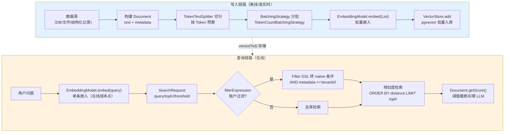
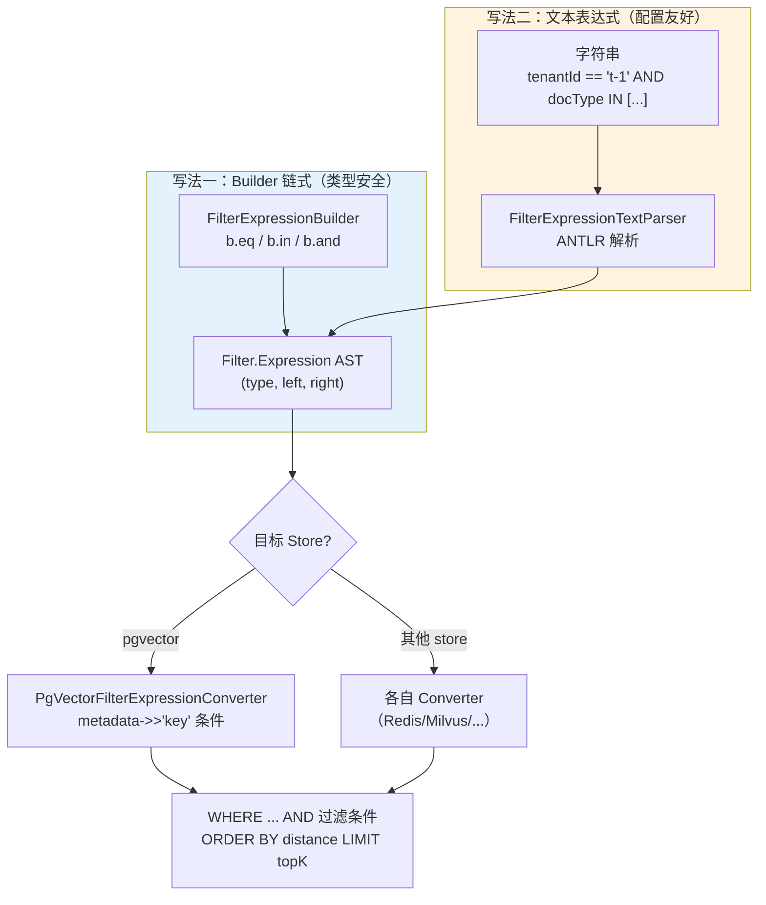
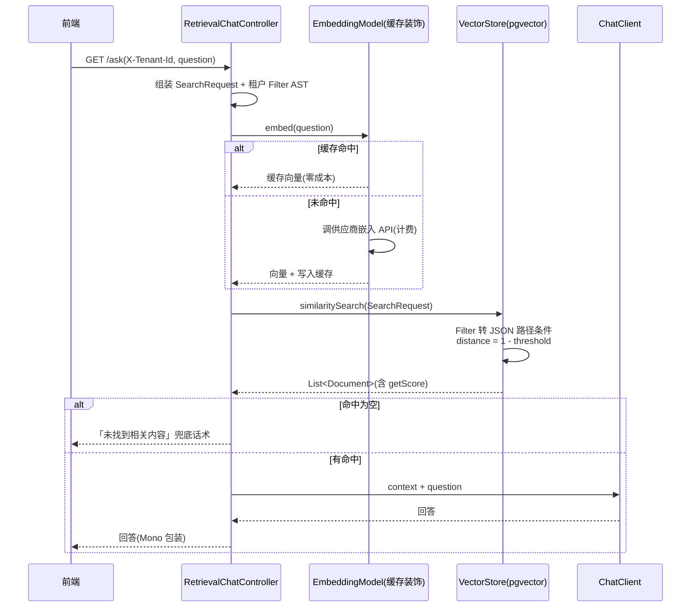

# 09 Embeddings 与向量数据库全量样例

> **定位**：本文讲 Spring AI 2.0.0 的 **Embeddings 与 VectorStore 工程化全量样例**——`EmbeddingModel` 的全部调用形态与维度探测机制、`Document` 的构建与切分、`VectorStore` 抽象的全量方法、`SearchRequest` 与相似度阈值调优、元数据过滤 DSL 的两种写法、pgvector 的完整企业落地（依赖/配置键/索引/批量导入/维度容错），以及与 ChatClient 组合的检索服务。向量库**选型对比**见 [教程 00-基础与核心/06-向量数据库选型]，**高级 RAG 与 Agentic 检索**见 [教程 08-架构师进阶/01-高级RAG与AgenticRAG]——本文专讲官网 Embeddings/VectorStore 的工程化落地。
>
> **读者画像**：已经跑通基础 RAG demo，需要把检索层落到生产（pgvector、多租户过滤、批量导入、缓存降本）的中高级 Java 工程师。
>
> **前置阅读**：[教程 00-基础与核心/05-RAG检索增强生成]（RAG 基础概念）、[教程 00-基础与核心/02-ChatClient与对话模型]（对话 API）。

---

## 1. 检索管线全景与本文坐标

### 1.1 写入与查询的两条链路

基础篇（[教程 00-基础与核心/05-RAG检索增强生成]）已经讲过「检索-增强-生成」的流程骨架；本文下沉到工程层——每一类 API 给出实证过的全量形态，每个企业样例给出可直接抄进项目的完整代码。向量检索系统有两条独立链路：**写入链路**（文档 → 切分 → 嵌入 → 入库）与**查询链路**（问题 → 嵌入 → 过滤检索 → 喂给 LLM）。两条链路的成本结构与故障模式完全不同，分别治理：



两条链路的治理重点不同：写入链路是**吞吐问题**（批量嵌入分批、JDBC 批大小、幂等去重），失败恢复靠水位重跑；查询链路是**延迟与成本问题**（单条嵌入一次 RPC、库内检索一次 SQL、缓存命中可省掉前者）。把两条链路混在一个服务里同步治理，是检索系统早期最常见的设计错误——离线批量导入挤占在线检索资源。

### 1.2 实证基准

与全体系一致，本文所有类、方法签名均经本地 jar `javap` 实证（版本 `2.0.0`）：

| 类 | 关键成员（实证签名） |
|------|------|
| `embedding.EmbeddingModel` | `call(EmbeddingRequest)` abstract / `embed(Document)` abstract / `embed(String)` / `embed(List<String>)` / `embed(List<Document>, EmbeddingOptions, BatchingStrategy)` / `embedForResponse(List<String>)` / `dimensions()` 均为 default |
| `embedding.EmbeddingRequest` | 构造器 `(List<String>, EmbeddingOptions)` |
| `embedding.EmbeddingResponse` | `getResults()` / `getResult()` / `getMetadata()` |
| `embedding.Embedding` | `(float[], Integer)` + `getOutput()` / `getIndex()` |
| `embedding.EmbeddingOptions` | `getModel()` / `getDimensions()` / `static builder()` |
| `embedding.AbstractEmbeddingModel` | `dimensions()` 缓存 + 静态 `dimensions(model, modelName, dummyContent)` 探测 |
| `embedding.BatchingStrategy` | `batch(List<Document>)` → `List<List<Document>>` |
| `document.Document` | 5 构造器 + `builder()` / `getText()` / `getMetadata()` / `getScore()` / `mutate()` |
| `transformer.splitter.TokenTextSplitter` | 5 构造器 + `builder()`（7 个 withXxx 方法） |
| `vectorstore.VectorStore` | `add(List<Document>)` / `delete(List<String>)` / `delete(Filter.Expression)` / `delete(String)` / `similaritySearch(SearchRequest)` / `getName()` / `getNativeClient()` |
| `vectorstore.SearchRequest` | `builder()`：`query/topK/similarityThreshold/similarityThresholdAll/filterExpression(Expression或String)/build` |
| `vectorstore.filter.Filter` | `Expression` record `(type, left[, right])`；`ExpressionType` 枚举 13 值 |
| `vectorstore.filter.FilterExpressionBuilder` | `eq/ne/gt/gte/lt/lte/in/nin/isNull/isNotNull/group/and/or/not` |
| `pgvector.PgVectorStore` | `builder(JdbcTemplate, EmbeddingModel)`；常量 `OPENAI_EMBEDDING_DIMENSION_SIZE=1536`、`MAX_DOCUMENT_BATCH_SIZE=10_000` 等 |

> **2.0.0 无 LIKE / BETWEEN**：`Filter.ExpressionType` 枚举只有 `AND/OR/EQ/NE/GT/GTE/LT/LTE/IN/NIN/NOT/ISNULL/ISNOTNULL` 十三值（javap 实证），文本 DSL 同样不支持——网上常见的 `like`/`between` 写法属其他版本或记忆混淆，本文不采用。

---

## 2. EmbeddingModel：API 全量

### 2.1 接口分层：两个 abstract 与六个 default

接口方法的分层直接回答了「供应商实现要写多少、框架替你做了多少」——也是装饰器设计的依据。

`EmbeddingModel` 的设计要点在 abstract/default 的分界：**只有 `call(EmbeddingRequest)` 和 `embed(Document)` 是抽象的**——供应商实现只需实现「原始调用」和「文档内容提取」两个原语，其余全部由接口 default 方法组合出来。这决定了：任何装饰器（缓存、重试、计量）只要实现 `EmbeddingModel` 接口包一层，就能对全部调用形态生效。

多个装饰器叠加时有顺序语义：缓存放最外层（命中直接返回，零下游调用），计量/观测放缓存内层（只统计真实 API 调用），重试放最内层（紧贴供应商客户端）——顺序错了，指标会把缓存命中也算进 API 调用量，观测数据失真。

先立一条铁律：**写入与查询必须使用同一个嵌入模型（含相同版本与维度配置）**。嵌入空间的几何结构由模型唯一决定——两个模型的向量空间互不可比，混用的结果不是「精度下降」而是「语义错乱」：余弦相似度看起来有值，实际是随机噪音。这条例程决定了后面所有的维度守卫与迁移设计（§6.5）。

### 2.2 四种调用形态

```java
import java.util.List;
// Spring AI 2.0.0
import org.springframework.ai.document.Document;
import org.springframework.ai.embedding.EmbeddingModel;
import org.springframework.ai.embedding.EmbeddingResponse;

public class EmbeddingShapes {

    private final EmbeddingModel embeddingModel;

    public EmbeddingShapes(EmbeddingModel embeddingModel) {
        this.embeddingModel = embeddingModel;
    }

    public void shapes() {
        // 形态一：单文本 → float[]（最常用，查询链路）
        float[] queryVector = embeddingModel.embed("如何配置 pgvector 索引?");

        // 形态二：批量文本 → List<float[]>（写入链路）
        List<float[]> batchVectors = embeddingModel.embed(List.of("第一段文本", "第二段文本"));

        // 形态三：批量 → EmbeddingResponse（带索引与用量元数据）
        EmbeddingResponse response = embeddingModel.embedForResponse(List.of("a", "b"));
        response.getResults().forEach(e ->
                System.out.println("index=" + e.getIndex() + " dims=" + e.getOutput().length));
        System.out.println("model=" + response.getMetadata().getModel());

        // 形态四：Document → float[]（内容提取由 getEmbeddingContent 决定，默认 getText()）
        float[] docVector = embeddingModel.embed(new Document("要被嵌入的正文内容"));
    }
}
```

### 2.3 EmbeddingRequest/EmbeddingOptions：显式控制一次调用

`embed(String)` 便捷方法背后走的是「默认 options + 单元素 request」。需要**换模型档位或降维**时，直接构造 `EmbeddingRequest`：

```java
import java.util.List;
// Spring AI 2.0.0
import org.springframework.ai.embedding.EmbeddingModel;
import org.springframework.ai.embedding.EmbeddingOptions;
import org.springframework.ai.embedding.EmbeddingRequest;
import org.springframework.ai.embedding.EmbeddingResponse;

public class ExplicitEmbeddingRequest {

    private final EmbeddingModel embeddingModel;

    public ExplicitEmbeddingRequest(EmbeddingModel embeddingModel) {
        this.embeddingModel = embeddingModel;
    }

    public EmbeddingResponse embedWithOptions(List<String> texts) {
        EmbeddingRequest request = new EmbeddingRequest(
                texts,
                EmbeddingOptions.builder()
                        .model("text-embedding-3-small")   // 供应商模型档位
                        .dimensions(1024)                  // 请求侧降维（OpenAI 3 系支持）
                        .build());
        return embeddingModel.call(request);
    }
}
```

`EmbeddingOptions.Builder` 只有 `model(String)` 和 `dimensions(Integer)` 两个方法（javap 实证）——比 ChatOptions 朴素得多，因为嵌入调用本质上只有这两个自由度。

注意 `dimensions(1024)` 的语义是**请求供应商在嵌入时就压缩到目标维度**（OpenAI text-embedding-3 系列支持 Matryoshka 式截断降维），与「嵌入后手动截断前 1024 维」不等价——供应商侧降维经过重训练对齐，精度损失远小于硬截断。不支持的模型（如 ada-002）会忽略该参数或报错，行为以供应商为准——这也是 §6.5 维度守卫必须在写入前做的原因。

### 2.4 dimensions()：预置表与真实探测

维度（vector 的长度）是向量库建表的前提，`dimensions()` 的实现是两层策略（`AbstractEmbeddingModel` 源码实证）：

1. **预置表**：`embedding-model-dimensions.properties` 内置了 `text-embedding-ada-002=1536` 等已知模型的维度，命中直接返回，**零成本**；
2. **真实探测**：表里查不到时，`embeddingModel.embed(dummyContent).length` ——**发一次真实的嵌入请求**数返回数组长度，结果缓存在 `AtomicInteger` 里，进程内只探一次。

预置表内置于 `spring-ai-model` jar 的 `embedding/embedding-model-dimensions.properties`（`text-embedding-ada-002=1536` 等条目），只覆盖 OpenAI 系列老模型——第三方模型（bge、m3e、自微调模型）一律走探测路径。

并发语义上，`embeddingDimensions` 是 `AtomicInteger`，多线程同时首次调用可能出现几次重复探测（CAS 竞争），最终收敛到同一值——探测成本可忽略，但**探测发生在启动建表路径上**（pgvector `embeddingDimensions()` 内部调用），意味着 dimensions 未配置且模型不在预置表时，应用启动即触发一次嵌入 API 调用，启动依赖外部服务的可用性。

工程含义：`dimensions()` 首次调用可能产生一次 API 计费；非 OpenAI 兼容模型在 pgvector 建表前必须让 `dimensions()` 可用（配置化指定优于探测，§6.5）。

### 2.5 BatchingStrategy：批量嵌入的分批策略

`embed(List<Document>, EmbeddingOptions, BatchingStrategy)` 的分批由 `BatchingStrategy` 决定。默认可用的实现是 `TokenCountBatchingStrategy`（按 Token 数切批，防止单请求超模型上限）：

```java
// Spring AI 2.0.0 —— Token 预算分批（构造器三参版：编码类型 + 每批 Token 上限 + 上限富余比例）
import com.knuddels.jtokkit.api.EncodingType;
// Spring AI 2.0.0
import org.springframework.ai.embedding.BatchingStrategy;
import org.springframework.ai.embedding.TokenCountBatchingStrategy;

public BatchingStrategy batching() {
    // CL100K_BASE 为 GPT 系列编码；2048 为每批目标 Token 上限；1.0 为上限占用比例
    // 另有五参构造器可指定 ContentFormatter 与 MetadataMode（控制参与计数的文本形态）
    return new TokenCountBatchingStrategy(EncodingType.CL100K_BASE, 2048, 1.0);
}
```

批大小直接影响写入链路的吞吐与失败半径：批太大容易撞供应商单请求限制，批太小则 RPC 次数暴增。pgvector 侧还有一层独立的 JDBC 批大小（`MAX_DOCUMENT_BATCH_SIZE = 10_000`），两层批次是**相乘关系**，容量规划时别只看其一。

`MetadataMode.EMBED` 值得一提：切批计 Token 用的文本默认是 `getFormattedContent(MetadataMode.EMBED)`——元数据以「为嵌入优化」的格式参与计数。若你的元数据很大（全文摘要、标签串），计入批 Token 会显著降低每批有效正文占比，此时五参构造器换 `MetadataMode.NONE` 计数更精准。

### 2.6 企业级样例①：embedding 缓存降本

查询链路里每次 `similaritySearch` 都会调一次 `embed(query)`（pgvector 源码：`getQueryEmbedding` 内联调用）。高频重复问题是缓存的最佳目标——装饰 `EmbeddingModel`，对 `embed(String)` 加 LRU 缓存：

```java
import java.util.concurrent.ConcurrentHashMap;
import java.util.concurrent.atomic.AtomicInteger;
import java.util.concurrent.locks.ReentrantLock;
// Spring AI 2.0.0
import org.springframework.ai.embedding.Embedding;
import org.springframework.ai.embedding.EmbeddingModel;
import org.springframework.ai.embedding.EmbeddingRequest;
import org.springframework.ai.embedding.EmbeddingResponse;

/**
 * 带容量上限的 embedding 查询缓存（装饰 EmbeddingModel）。
 * 只缓存 embed(String) 单条查询——写入链路的批量嵌入是一次性成本，不缓存。
 * 生产环境可替换为 Caffeine/Redis 实现，接口不变。
 */
public class CachingEmbeddingModel implements EmbeddingModel {

    private static final int MAX_ENTRIES = 50_000;

    private final EmbeddingModel delegate;
    private final ConcurrentHashMap<String, float[]> cache = new ConcurrentHashMap<>();
    private final ConcurrentHashMap<String, ReentrantLock> locks = new ConcurrentHashMap<>();

    public CachingEmbeddingModel(EmbeddingModel delegate) {
        this.delegate = delegate;
    }

    @Override
    public float[] embed(String text) {
        float[] hit = cache.get(text);
        if (hit != null) {
            return hit;
        }
        // 同文本并发未命中时只放一个请求出去（防缓存击穿）
        ReentrantLock lock = locks.computeIfAbsent(text, k -> new ReentrantLock());
        lock.lock();
        try {
            float[] cached = cache.get(text);
            if (cached != null) {
                return cached;
            }
            float[] computed = delegate.embed(text);
            if (cache.size() >= MAX_ENTRIES) {
                cache.clear();   // 简单保护；Caffeine 实现请换 LRU 淘汰
            }
            cache.put(text, computed);
            return computed;
        }
        finally {
            lock.unlock();
            locks.remove(text);
        }
    }

    @Override
    public EmbeddingResponse call(EmbeddingRequest request) {
        // 批量请求不缓存（一次性写入成本），直接透传
        return delegate.call(request);
    }

    @Override
    public float[] embed(org.springframework.ai.document.Document document) {
        return delegate.embed(document);
    }

    public int cacheSize() {
        return cache.size();
    }
}
```

生产版替换为 Redis 时只需改存储层（`ReactiveStringRedisTemplate` 存 Base64 编码的向量，读回 `toFloatArray`），装饰器结构不变；Redis 键建议 `emb:{modelName}:{dimensions}:{sha256(text)}`——把模型与维度编进键，换模型迁移时旧缓存自动失效，不会出现「新模型查到旧向量」的静默错乱。

装饰器实现接口后，`VectorStore` 内部持有的 `embeddingModel.embed(query)` 自动走缓存——**检索服务的改动量为零**。缓存收益随问题重复度上升：客服 FAQ、报表查询类场景命中率可观；长尾开放问答场景收益有限，别为缓存而缓存。

---

## 3. Document 与切分

### 3.1 Document：不只是文本

`Document` 是检索层的通用载体，五个构造器加 `builder()`。两个容易忽略的能力：**`getScore()`**（相似度得分，检索结果里由 store 填充）与 **`mutate()`**（派生修改，切分器的实现基础）。ID 默认由 `RandomIdGenerator` 生成（源码实证）——**幂等导入必须用业务 ID 覆盖**，否则重跑一遍导入库就翻倍。

```java
import java.util.Map;
// Spring AI 2.0.0
import org.springframework.ai.document.Document;

public class DocumentFactory {

    public Document build(String orderId, String title, String body) {
        return Document.builder()
                .id("order-" + orderId)          // 业务 ID：保证导入幂等（覆盖而非追加）
                .text(title + "\n" + body)
                .metadata(Map.of(
                        "tenantId", "t-1001",
                        "docType", "order",
                        "orderId", orderId,
                        "createdAt", System.currentTimeMillis()))
                .build();
    }
}
```

`Document` 还有 `Media` 形态的构造器（图文混合内容），对应多模态嵌入场景；`getFormattedContent(MetadataMode)` 控制参与嵌入的文本形态（`EMBED` 模式剔除对检索无意义的元数据段落，`ALL` 全量）——`TokenCountBatchingStrategy` 五参构造器正是用它控制计 Token 的内容。ID 层面，`IdGenerator` 接口有两个实现：`RandomIdGenerator`（默认，UUID）与 `JdkSha256HexIdGenerator`（内容哈希——**内容寻址**：同内容同 ID，天然去重，幂等导入的另一种解法）。

元数据键的设计在写入时就决定了查询期能过滤什么——**过滤键、租户键、排序键**是三类必设元数据，事后补要重建全库。

### 3.2 TokenTextSplitter：按 Token 预算切分

`TokenTextSplitter` 是内置的 Token 级切分器（`TextSplitter` 抽象类的实现，实现 `DocumentTransformer`）。它不依赖 Tika 文件读取器，对任何字符串（DB 记录、API 返回、日志）都能切：

```java
import java.util.List;
// Spring AI 2.0.0
import org.springframework.ai.document.Document;
import org.springframework.ai.transformer.splitter.TokenTextSplitter;

public class ChunkingService {

    public List<Document> chunk(List<Document> documents) {
        TokenTextSplitter splitter = TokenTextSplitter.builder()
                .withChunkSize(800)              // 每块目标 Token 数
                .withMinChunkSizeChars(350)      // 块内最小字符数（避免碎块）
                .withMinChunkLengthToEmbed(5)    // 低于该长度不入嵌入（噪音过滤）
                .withMaxNumChunks(10000)         // 单文档最大块数
                .withKeepSeparator(true)         // 保留分隔符
                .build();
        return splitter.apply(documents);        // DocumentTransformer 语义：List → List
    }
}
```

切分粒度是检索质量的第一杠杆：块太大则向量语义被稀释（检索「差不多都对」），块太小则上下文断裂。四个参数存在联动约束——`chunkSize` 决定语义密度，`minChunkSizeChars` 防碎块（小于它的块会被合并/丢弃），`minChunkLengthToEmbed` 过滤噪音（标题行、页码），`maxNumChunks` 防单文档爆炸（一份超大文档占满整个库）。调参从 `chunkSize=800` 起步（约 2-3 段落），按检索评测的召回率反馈微调。切分参数的调优方法论见 [教程 10-调优实战与方法论/01-环节体检：五环节指标与判病阈值] 的检索环节指标。

---

## 4. VectorStore 抽象与 SearchRequest

### 4.1 接口全量

`VectorStore extends DocumentWriter, VectorStoreRetriever`，能力分三组（javap 实证）：**写入**（`add(List<Document>)`，另有 `accept`/`write` 同义 default）+ **删除**（`delete(List<String>)` 按 ID、`delete(Filter.Expression)` 按过滤条件、`delete(String)` 单条）+ **检索**（`similaritySearch(SearchRequest)` / `similaritySearch(String)` 便捷）。`getNativeClient()` 暴露底层客户端（pgvector 下是 `JdbcTemplate`），逃生舱口，优先不用。

三个 `delete` 重载的治理语义不同：`delete(List<String>)` 按 ID 删（精确、可批量，配业务 ID 幂等）；`delete(String)` 单条便捷；`delete(Filter.Expression)` **按过滤条件删**——数据合规场景（某租户要求删除其全部数据）的正确工具，但执行前务必先用同条件的 `similaritySearch` 预览命中集，确认无误再删——过滤删除没有「撤销」。

### 4.2 SearchRequest：查询的全部自由度

`SearchRequest.builder()` 五个参数就是相似度检索的全部自由度，其中 `filterExpression` 支持 **`Filter.Expression` 对象**与 **String 文本表达式**两种写法（两个重载，§5 详解）：

```java
import java.util.List;
// Spring AI 2.0.0
import org.springframework.ai.document.Document;
import org.springframework.ai.vectorstore.SearchRequest;
import org.springframework.ai.vectorstore.VectorStore;

public class SearchService {

    private final VectorStore vectorStore;

    public SearchService(VectorStore vectorStore) {
        this.vectorStore = vectorStore;
    }

    public List<Document> search(String question) {
        // 文本表达式适合静态条件（来自配置/代码，不含用户输入）；
        // 含用户输入的过滤条件请用 Builder 写法（§5.4 注入风险说明）
        return vectorStore.similaritySearch(SearchRequest.builder()
                .query(question)
                .topK(5)                                   // 默认 4（DEFAULT_TOP_K）
                .similarityThreshold(0.75d)                // 相似度下限，低于则丢弃
                .filterExpression("docType == 'manual' OR docType == 'faq'")
                .build());
    }
}
```

两个默认值要记住：`DEFAULT_TOP_K = 4`（不设 topK 时只返回 4 条——很多「检索结果太少」的困惑源于此）与 `SIMILARITY_THRESHOLD_ACCEPT_ALL = 0.0`（不设阈值时全收，噪音会直接进上下文）。

### 4.3 相似度阈值调优：语义与换算

`similarityThreshold` 的语义在 pgvector 源码里有一行铁证：`double distance = 1 - request.getSimilarityThreshold();` ——**threshold 是相似度（越大越严），库内换算为距离上限**。默认值 `SIMILARITY_THRESHOLD_ACCEPT_ALL = 0.0`（全收）。调优经验表：

| 场景 | 建议 threshold | 理由 |
|------|---------------|------|
| RAG 上下文填充 | 0.70 – 0.80 | 宁可多喂几条让模型自己甄别，漏检比冗余贵 |
| 精确事实查询（订单状态） | 0.85 – 0.92 | 宁缺毋滥，低分直接走「未找到」分支 |
| 去重/近重复检测 | 0.95+ | 高相似才判定重复 |
| 探索式检索（调试期） | 0.0 + 小 topK | 先看原始距离分布再定阈值 |

阈值测量不需要完整评测体系，最小可操作版：对每个金标准问题，检索出 top-20 并记录正确文档的距离分位数，把 threshold 定在「90% 的问题能召回正确文档」的水平。pgvector 的 `embeddingDistance(String)` 方法（源码实证，返回全库距离列表）可以辅助观察距离分布的形状——双峰分布意味着数据里混着异质文档类型，先按 `docType` 拆库再调阈值。

不同距离类型下 threshold 的可读性不同：`COSINE_DISTANCE` 下 `similarity = 1 - distance` 语义最直观（1 为完全同向），推荐检索场景默认用它；`EUCLIDEAN_DISTANCE` 适合未归一化向量（Sentence-Transformers 系，源码注释明确警示）；`NEGATIVE_INNER_PRODUCT` 只对已归一化向量有几何意义（OpenAI 向量已归一化，性能最优）。

阈值不是拍出来的——用金标准问题集跑分布（同租户正确文档的距离分位数），取 P10 附近起步。这套量化方法在调优系列完整展开。

### 4.4 SimpleVectorStore：测试与本地原型

`SimpleVectorStore` 是内存实现，`builder(EmbeddingModel)` 创建，支持 `save(File)`/`load(File)` 持久化快照。单元测试与本地原型的好帮手，**不要进生产**（无过滤索引、全内存、单机）：

```java
import java.io.File;
// Spring AI 2.0.0
import org.springframework.ai.vectorstore.SimpleVectorStore;
import org.springframework.ai.embedding.EmbeddingModel;

public class LocalVectorStoreFactory {

    public SimpleVectorStore localStore(EmbeddingModel embeddingModel, File snapshot) {
        SimpleVectorStore store = SimpleVectorStore.builder(embeddingModel).build();
        if (snapshot.exists()) {
            store.load(snapshot);   // 启动时加载快照，省去重新嵌入
        }
        else {
            // ...导入测试数据后...
            store.save(snapshot);   // 快照落盘：测试数据固化，CI 环境零嵌入成本
        }
        return store;
    }
}
```

`save/load` 把内存向量连元数据序列化为 JSON 快照——单测里固化一批嵌入结果，CI 每次跑都从快照加载，不调供应商 API。

---

## 5. 元数据过滤 DSL：两种写法

### 5.1 AST 层：Filter.Expression

过滤条件的抽象语法树由 `Filter` 的嵌套类型构成：`Filter.Expression` 是 record `(ExpressionType type, Operand left, Operand right)`（一元运算如 NOT 只用 left），`Operand` 的两个实现是 `Key(String)` 与 `Value(Object)`，`Group` 表达分组。以 `tenantId == 't-1' AND score >= 0.8` 为例，AST 形态是：`Expression(AND, Expression(EQ, Key(tenantId), Value(t-1)), Expression(GTE, Key(score), Value(0.8)))`——树形组合，天然支持任意深度嵌套。`Group` 类型表达括号分组（Builder 的 `b.group(op)` 产生），在需要覆盖默认优先级（NOT > AND > OR）时使用。AST 层的价值在于「构造期校验 + 存储无关」——拼错的 key 名在 build 时就是 Java 对象错误而非线上解析故障。文本通道则相反，解析失败发生在查询期——这也是两者故障画像的本质差异：Builder 错误在发布前暴露，文本错误在生产流量里暴露。这套 AST 与具体向量库无关——各 store 用自己的 `FilterExpressionConverter` 把它翻译成原生语法（pgvector 是 JSON 路径条件，§6.6）。

### 5.2 写法一：FilterExpressionBuilder 链式构造

类型安全，适合**程序化拼装**（过滤条件来自代码逻辑而非用户输入）。两种写法最终殊途同归于 `Filter.Expression` AST，再由各 store 的 converter 翻译为原生语法：



```java
import java.util.List;
// Spring AI 2.0.0
import org.springframework.ai.vectorstore.filter.Filter.Expression;
import org.springframework.ai.vectorstore.filter.FilterExpressionBuilder;

public class FilterDslBuilder {

    public Expression tenantAndTypeFilter(String tenantId, List<String> docTypes) {
        FilterExpressionBuilder b = new FilterExpressionBuilder();
        return b.and(
                b.eq("tenantId", tenantId),
                b.in("docType", docTypes))
            .build();   // Op.build() 产出 Filter.Expression
    }

    public Expression recentHighValue(double minScore) {
        FilterExpressionBuilder b = new FilterExpressionBuilder();
        return b.and(
                b.gte("score", minScore),
                b.or(
                        b.eq("status", "ACTIVE"),
                        b.isNull("status")))
            .build();
    }

    public Expression excludedCategory(String category) {
        FilterExpressionBuilder b = new FilterExpressionBuilder();
        return b.not(b.eq("category", category)).build();
    }
}
```

可用的方法（javap 全量）：`eq/ne/gt/gte/lt/lte/in(List或可变参数)/nin/isNull/isNotNull/group/not/and/or`。**没有 `isLike`、没有 `between`**——模糊匹配与区间查询在 2.0.0 的 DSL 里不存在，区间只能拆成 `gte + lte` 的 AND 组合，前缀匹配只能业务层预处理元数据后用 `eq/in` 表达。

### 5.3 写法二：文本表达式字符串

`FilterExpressionTextParser`（ANTLR 实现）解析 SQL WHERE 风格的字符串，`SearchRequest.builder().filterExpression(String)` 内部走的就是它：

```java
// Spring AI 2.0.0 —— 文本 DSL：SQL WHERE 子集
// 支持运算符（FilterExpressionTextParser 源码实证）：
//   ==  !=  <>  <  <=  >  >=  IN  NOT IN  AND  OR  NOT  IS NULL  IS NOT NULL
// 优先级：NOT > AND > OR；括号显式分组
String expr1 = "tenantId == 't-1001' AND docType IN ['order', 'invoice']";
String expr2 = "(score >= 0.8 OR status == 'ACTIVE') AND NOT (category == 'internal')";
String expr3 = "createdAt >= 1700000000000 AND status IS NOT NULL";
```

### 5.4 两种写法的选型

两种写法产出同一套 AST，选型的分水岭是「值从哪来」：

| 维度 | Builder 链式 | 文本字符串 |
|------|-------------|-----------|
| 类型安全 | 编译期（值装箱在方法签名里） | 运行期解析失败才暴露 |
| 动态性 | 程序化拼装（if/else 组合分支） | 配置化下发（配置中心/规则引擎存字符串） |
| 注入风险 | 无（值不进字符串拼接） | **有**——用户输入直接拼字符串就是注入口 |
| 适用 | 过滤逻辑在代码里 | 过滤规则在配置里 |

**多租户的租户键必须走 Builder（或参数化拼装）**——租户 ID 来自请求头，拼进文本表达式等于把越权风险写进代码。下面样例演示正确姿势。

工程上常见的中间形态是「规则引擎下发过滤规则」：规则存储为受限的表达式片段（值从受控枚举取），下发后先过白名单校验（key 必须在元数据注册表内、运算符必须在 DSL 支持列表内）再交给解析器——字符串通道的安全成本不低，能用 Builder 组合就不要上字符串通道。

### 5.5 企业级样例②：多租户 metadata 过滤检索

业务背景：SaaS 检索服务，同一套 pgvector 库承载所有租户的数据（`tenantId` 元数据隔离），检索接口的租户身份来自请求头。原则：**租户条件由服务端强制注入，业务过滤条件才由调用方提供**——两层条件 AND 组合，租户键不可被覆盖：

```java
import java.util.List;
// Spring AI 2.0.0
import org.springframework.ai.document.Document;
import org.springframework.ai.vectorstore.SearchRequest;
import org.springframework.ai.vectorstore.VectorStore;
import org.springframework.ai.vectorstore.filter.Filter.Expression;
import org.springframework.ai.vectorstore.filter.FilterExpressionBuilder;
import org.springframework.stereotype.Service;

@Service
public class TenantScopedSearchService {

    private final VectorStore vectorStore;

    public TenantScopedSearchService(VectorStore vectorStore) {
        this.vectorStore = vectorStore;
    }

    /**
     * 租户隔离检索：租户条件服务端强制注入（Builder 构造，不拼字符串），
     * docTypes 等业务过滤可与租户条件安全组合。
     */
    public List<Document> search(String tenantId, String question, List<String> docTypes) {
        FilterExpressionBuilder b = new FilterExpressionBuilder();
        Expression tenantIsolation = b.eq("tenantId", tenantId).build();
        Expression combined = (docTypes == null || docTypes.isEmpty())
                ? tenantIsolation
                : b.and(tenantIsolation, b.in("docType", docTypes)).build();

        return vectorStore.similaritySearch(SearchRequest.builder()
                .query(question)
                .topK(5)
                .similarityThreshold(0.75d)
                .filterExpression(combined)
                .build());
    }
}
```

这套「服务端强制租户条件」与 §6 的 pgvector JSON 路径过滤配合，实现库级租户隔离。更完整的多租户治理（配额、数据隔离分层）见 [教程 04-企业级架构主干/06-多租户隔离与资源治理]。

攻击面再明确一次：假设检索服务把调用方传入的 `docType` 直接拼进文本表达式——

```java
// 危险示范（不要这样写）：docType 来自请求参数
String expr = "tenantId == '" + tenantId + "' AND docType == '" + docTypeFromRequest + "'";
// 攻击者传 docType = "x' OR tenantId == 't-other" 即可越权读他租户数据
```

字符串拼接的过滤表达式等价于十年前的 SQL 注入——`FilterExpressionTextParser` 是一个小型语言解析器，字符串里能表达的所有逻辑（OR 逃逸、注释截断）都会被解析执行。防御只有一条：**变量值一律走 Builder 的方法参数**（`b.eq("tenantId", tenantId)` 值是装箱对象，不进解析器），文本 DSL 只承载静态配置。

---

## 6. pgvector 企业落地

### 6.1 依赖与自动装配

pgvector 支持需添加依赖（pom 未声明，**需在 pom.xml 手工添加**）：

```xml
<!-- 需在 pom.xml 添加依赖：Spring AI pgvector 向量库 -->
<dependency>
    <groupId>org.springframework.ai</groupId>
    <artifactId>spring-ai-starter-vector-store-pgvector</artifactId>
</dependency>
<!-- 版本由 spring-ai-bom 2.0.0 管理 -->
```

```yaml
# application.yml —— 配置键前缀 spring.ai.vectorstore.pgvector（PgVectorStoreProperties.CONFIG_PREFIX 实证）
# 可用属性（javap 全量）：dimensions / index-type / distance-type / schema-name / table-name /
#   id-type / schema-validation / remove-existing-vector-store-table / max-document-batch-size
spring:
  ai:
    vectorstore:
      pgvector:
        dimensions: 1024                  # 向量维度（建表 vector(%d)）
        distance-type: COSINE_DISTANCE    # EUCLIDEAN_DISTANCE | NEGATIVE_INNER_PRODUCT | COSINE_DISTANCE
        index-type: HNSW                  # NONE | IVFFLAT | HNSW
        schema-name: public
        table-name: vector_store
        schema-validation: false          # true 时启动校验表结构
        remove-existing-vector-store-table: false
        max-document-batch-size: 10000    # JDBC 批量上限
  datasource:
    url: jdbc:postgresql://${PG_HOST}:5432/${PG_DB}
    username: ${PG_USER}
    password: ${PG_PASSWORD}
```

自动装配条件（源码实证）：`PgVectorStoreAutoConfiguration` 在检测到 `JdbcTemplate` + `EmbeddingModel` Bean 时生效，装配链自动应用上述配置属性；`BatchingStrategy` 缺省提供 `TokenCountBatchingStrategy`。

还有一个**多 store 共存**的细节：自动装配类带 `@ConditionalOnProperty(name = SpringAIVectorStoreTypes.TYPE, havingValue = "pgvector", matchIfMissing = true)`——classpath 上同时存在多个 store starter 时，`spring.ai.vectorstore.type=pgvector` 显式指定才生效（不配则缺省匹配）。自定义 `VectorStore` Bean 存在时自动装配整体让位（`@ConditionalOnMissingBean` 语义），这也是 §6.3 编程式装配能覆盖默认值的原因。

### 6.2 建表 DDL 与索引：源码级行为

`PgVectorStore` 实现 `InitializingBean`，`afterPropertiesSet` 阶段执行（源码 SQL 模板实证）：

```sql
CREATE TABLE IF NOT EXISTS public.vector_store (
    id UUID PRIMARY KEY,
    content text,
    metadata json,
    embedding vector(1024)
);
CREATE INDEX IF NOT EXISTS spring_ai_vector_index
    ON public.vector_store USING HNSW (embedding vector_cosine_ops);
```

`vectorTableValidationsEnabled(true)`（配置键 `schema-validation: true`）是另一层保护：不建表，只在启动时**校验**既有表结构与预期一致（列名、维度、类型）——生产环境的推荐姿势：建表交给迁移脚本（Flyway/Liquibase），应用只校验不建（`initializeSchema(false)` + `vectorTableValidationsEnabled(true)`），把 DDL 变更纳入变更管理流程。

四列结构与 `Document` 的字段一一对应：`id` ← `getId()`（业务 ID 显式设置的重要性在这里落地——主键冲突即覆盖，天然幂等）、`content` ← `getText()`、`metadata json` ← `getMetadata()`（过滤条件的落点）、`embedding vector(%d)` ← 嵌入向量。检索结果由 `DocumentRowMapper`（内部类，javap 实证）把行映射回 `Document` 并填充 `getScore()`。

三个结论：维度在**建表时烧进列定义** `vector(%d)`，改维度等于重建表；索引类型二选一（`PgIndexType`：`NONE/IVFFLAT/HNSW`），**2.0.0 不暴露 HNSW 的 m/ef 与 IVFFLAT 的 lists 参数**（源码 SQL 只有 `USING %s (embedding %s)` 两占位符）——需要调索引参数就得用 `index-type: NONE` + 迁移脚本自建索引；距离类型决定索引算子（`COSINE_DISTANCE → vector_cosine_ops`，`EUCLIDEAN_DISTANCE → vector_l2_ops`，`NEGATIVE_INNER_PRODUCT → vector_ip_ops`，枚举源码实证）。

### 6.3 Builder 编程式装配

绕过自动装配、全参数显式控制：

```java
// Spring AI 2.0.0
import org.springframework.ai.embedding.EmbeddingModel;
import org.springframework.ai.vectorstore.VectorStore;
import org.springframework.ai.vectorstore.pgvector.PgVectorStore;
import org.springframework.context.annotation.Bean;
import org.springframework.context.annotation.Configuration;
import org.springframework.jdbc.core.JdbcTemplate;
import io.micrometer.observation.ObservationRegistry;

@Configuration
public class PgVectorStoreConfig {

    @Bean
    public VectorStore pgVectorStore(JdbcTemplate jdbcTemplate,
                                     EmbeddingModel embeddingModel,
                                     ObservationRegistry observationRegistry) {
        return PgVectorStore.builder(jdbcTemplate, embeddingModel)
                .observationRegistry(observationRegistry)
                .dimensions(1024)
                .distanceType(PgVectorStore.PgDistanceType.COSINE_DISTANCE)
                .indexType(PgVectorStore.PgIndexType.HNSW)
                .schemaName("public")
                .vectorTableName("vector_store")
                .idType(PgVectorStore.PgIdType.UUID)
                .initializeSchema(true)
                .vectorTableValidationsEnabled(false)
                .maxDocumentBatchSize(10_000)
                .build();
    }
}
```

Builder 全方法（javap 实证）：`schemaName/vectorTableName/idType/vectorTableValidationsEnabled/dimensions/distanceType/removeExistingVectorStoreTable/indexType/initializeSchema/maxDocumentBatchSize/build`，基类 `AbstractVectorStoreBuilder` 提供 `observationRegistry/customObservationConvention/batchingStrategy`。

`batchingStrategy(...)` 在此配置的是**写入链路的嵌入分批**（§2.5）——自动装配的默认 `TokenCountBatchingStrategy` 对大多数场景够用，中文语料建议显式换构造参数（中文 Token 密度与 CL100K 默认假设有偏差，实测校准）。

### 6.4 企业级样例③：批量导入性能

业务背景：知识库初始化要导入十万级业务记录（订单、工单、制度文档），每条记录已含业务主键与租户归属——这是检索系统上线前最重的离线作业，跑一次的成本（嵌入 API 费用 + 时间）决定了对幂等与断点续跑的要求。

大批量导入的三个杠杆：**切分后批量嵌入**（复用 `embed(List<Document>, options, batchingStrategy)` 的分批）、**业务 ID 幂等**、**大 JDBC 批**。注意 2.0.0 的 `add()` 内部按 `MAX_DOCUMENT_BATCH_SIZE` 上限分批执行 JDBC 复制：

```java
import java.util.List;
// Spring AI 2.0.0
import org.springframework.ai.document.Document;
import org.springframework.ai.transformer.splitter.TokenTextSplitter;
import org.springframework.ai.vectorstore.VectorStore;
import org.springframework.stereotype.Service;

@Service
public class BulkImportService {

    private final VectorStore vectorStore;
    private final TokenTextSplitter splitter;

    public BulkImportService(VectorStore vectorStore) {
        this.vectorStore = vectorStore;
        this.splitter = TokenTextSplitter.builder().withChunkSize(800).build();
    }

    /** 文档批量导入：切分 → 入库（store 内部完成分批嵌入与分批写库） */
    public int importDocuments(List<Document> documents) {
        List<Document> chunks = splitter.apply(documents);
        vectorStore.add(chunks);
        return chunks.size();
    }
}
```

> **不要在 `add()` 之前手动 `embed()`**：`VectorStore.add` 的契约是「接收 Document 并负责嵌入 + 存储」（`AbstractObservationVectorStore.add` 源码内部调用 `embeddingModel.embed(List<Document>, options, batchingStrategy)`）。手动先嵌入再 add，批次会被**重复嵌入**，成本直接翻倍。需要自定义嵌入参数（如降维）时，正解是装饰 `EmbeddingModel`（§2.6）改写默认行为，而不是在调用侧绕开 store 的管线。

大批量导入的失败恢复：批内任何一条失败会让整批回滚或中断，重跑的正确粒度是**批**而非全量——导入任务按批记录水位（已完成的 Document ID 区间），失败从水位续跑；配合业务 ID 幂等，重复执行天然安全。`MAX_DOCUMENT_BATCH_SIZE = 10_000` 是硬上限（源码常量），调大 `max-document-batch-size` 超过它会取两者较小值。

导入性能的观测抓手：`VectorStoreObservationContext` 的 `Operation` 枚举（`ADD/DELETE/QUERY`）会为每次操作产出 span，写入吞吐与失败率直接进指标。

### 6.5 企业级样例③续：维度不匹配的容错

维度问题的三种现场与对应容错（全部围绕「维度在建表时固化」这一事实）：

```java
// Spring AI 2.0.0
import org.springframework.ai.embedding.EmbeddingModel;

public class DimensionGuard {

    private final EmbeddingModel embeddingModel;
    private final int expectedDimensions;

    public DimensionGuard(EmbeddingModel embeddingModel, int expectedDimensions) {
        this.embeddingModel = embeddingModel;
        this.expectedDimensions = expectedDimensions;
    }

    /** 写入前守卫：维度不匹配直接失败（禁止脏向量入库） */
    public void checkBeforeEmbed(float[] vector) {
        if (vector.length != expectedDimensions) {
            throw new IllegalStateException(
                    "嵌入维度不匹配：期望 " + expectedDimensions + "，实际 " + vector.length
                            + "。请检查 EmbeddingOptions.dimensions 与建表 vector(%d) 是否一致。");
        }
    }

    /** 启动期自检：配置维度与模型真实维度比对（dimensions() 有预置表缓存，成本可控） */
    public void verifyOnStartup() {
        int actual = embeddingModel.dimensions();
        if (actual != expectedDimensions) {
            throw new IllegalStateException(
                    "向量库维度(" + expectedDimensions + ")与模型维度(" + actual
                            + ")不一致。换模型必须重建表并全量重嵌入——迁移前先跑双写灰度。");
        }
    }
}
```

换模型迁移的完整流程：新表（新维度）与旧表并存 → 写入链路双写（新旧模型各嵌一份）→ 查询逐步切流到新表（灰度租户先行）→ 观测指标稳定后下线旧表。`remove-existing-vector-store-table: true` 在这套流程里只属于开发环境——生产用它等于抹掉全部向量资产。

三条纪律：**配置维度显式声明**（`spring.ai.vectorstore.pgvector.dimensions` 或 Builder `.dimensions(...)`），不要依赖探测（探测的 dummyContent 嵌入是一次隐性 API 计费）；**换模型 = 重建表**（`remove-existing-vector-store-table: true` 只该出现在开发环境，生产的正确姿势是新表双写灰度迁移）；**写入守卫前置**（`PgVectorStore.OPENAI_EMBEDDING_DIMENSION_SIZE = 1536` 只是默认值约定，换模型后它就是错的）。

### 6.6 FilterExpressionConverter：DSL 到原生 SQL 的翻译

`similaritySearch` 时 `Filter.Expression` 由 `PgVectorFilterExpressionConverter`（继承 `AbstractFilterExpressionConverter`）翻译成 pgvector 的 JSON 路径条件——pgvector 的 metadata 存为 `json` 列，翻译产物形如 `metadata->>'tenantId' == 't-1001'`。需要自定义 key 映射（如把元数据键映射到独立列以吃索引）时，实现 `FilterExpressionConverter` 接口替换即可。什么时候值得做：默认实现生成 `metadata->>'key'` 条件，**JSON 路径条件不走 B-tree 索引**，大数据量下每行都要解析 JSON——把高频过滤键（tenantId、docType）提升为独立物理列并用 converter 改写条件，过滤代价从 O(n) 降为索引查找。代价是写入链路要多维护一列，属于数据量上规模后的优化项，早期不做。

---

## 7. 企业级样例④：检索服务完整 Controller（WebFlux）

把前面所有组件串成一条在线服务：租户头 → 强制租户过滤 → 相似度检索 → 组装上下文 → ChatClient 生成回答。全程 Mono 非阻塞，阻塞调用包进 `Mono.fromSupplier`：



```java
import java.util.List;

import org.springframework.ai.chat.client.ChatClient;
// Spring AI 2.0.0
import org.springframework.ai.document.Document;
import org.springframework.ai.vectorstore.SearchRequest;
import org.springframework.ai.vectorstore.VectorStore;
import org.springframework.ai.vectorstore.filter.Filter.Expression;
import org.springframework.ai.vectorstore.filter.FilterExpressionBuilder;
import org.springframework.web.bind.annotation.GetMapping;
import org.springframework.web.bind.annotation.RequestHeader;
import org.springframework.web.bind.annotation.RequestParam;
import org.springframework.web.bind.annotation.RestController;
import reactor.core.publisher.Mono;

@RestController
public class RetrievalChatController {

    private static final int TOP_K = 5;
    private static final double THRESHOLD = 0.75d;

    private final VectorStore vectorStore;
    private final ChatClient chatClient;

    public RetrievalChatController(VectorStore vectorStore, ChatClient.Builder chatClientBuilder) {
        this.vectorStore = vectorStore;
        this.chatClient = chatClientBuilder.build();
    }

    @GetMapping("/ask")
    public Mono<String> ask(@RequestHeader("X-Tenant-Id") String tenantId,
                            @RequestParam String question) {
        return Mono.fromSupplier(() -> {
            // ① 检索：租户条件强制注入（Builder 构造，禁拼字符串）
            FilterExpressionBuilder b = new FilterExpressionBuilder();
            Expression tenantFilter = b.eq("tenantId", tenantId).build();
            List<Document> hits = vectorStore.similaritySearch(SearchRequest.builder()
                    .query(question)
                    .topK(TOP_K)
                    .similarityThreshold(THRESHOLD)
                    .filterExpression(tenantFilter)
                    .build());

            // ② 组装上下文：得分低于阈值的已在 store 层过滤，这里拼接引用
            StringBuilder context = new StringBuilder();
            for (int i = 0; i < hits.size(); i++) {
                Document doc = hits.get(i);
                context.append("[片段").append(i + 1)
                        .append(" 相似度=").append(doc.getScore())
                        .append("]\n").append(doc.getText()).append("\n\n");
            }
            if (context.isEmpty()) {
                return "知识库中未找到相关内容，请换个问法或联系管理员。";
            }

            // ③ 生成：上下文 + 问题喂给模型
            return chatClient.prompt()
                    .system("仅根据提供的知识库片段回答；片段中没有的信息明确说不知道。")
                    .user(context + "\n问题：" + question)
                    .call()
                    .content();
        });
    }
}
```

上下文拼接的格式本身也是检索质量变量：片段编号 + 相似度分数让模型能区分强证据与弱证据；片段之间双换行分隔减少跨片段语义粘连。如果片段来自不同文档，把 `docType` 或文档标题一并拼进上下文，模型的引用准确率会明显提升（模型需要「这段话从哪来」来组织回答）。

四个工程要点：**`doc.getScore()` 把相似度透传给调用方/前端**（低置信回答可触发降级话术）；**空结果有显式分支**（「未找到」是合法输出，硬编一个「我不知道」不如业务侧定义兜底）；**`Mono.fromSupplier` 是阻塞调用的标准包装**——`similaritySearch` 与 `call()` 都是同步方法，直接放在 WebFlux 端点里会占死 EventLoop。**接入层限流与超时**要在 Mono 链外做（网关层统一），检索 + 生成两段都可能慢，端到端超时预算要按「嵌入 + 检索 + 生成」三段之和规划。更复杂的编排（检索 + 重排 + 多路召回合并）在 `Mono.fromSupplier` 里会越写越长——把同步检索逻辑抽成独立 `@Service` 方法、Controller 只做响应式包装，是保持 WebFlux 层整洁的分界线；需要真正的非阻塞检索时，自研 store 实现 `ReactiveVectorStore` 语义（2.0.0 内置 store 均为同步 `JdbcTemplate` 风格，异步化需自建 `R2dbcTemplate` 版本并标注概念代码范围）。

响应式错误处理的完整模式见 [教程 08-架构师进阶/08-响应式错误处理]。

---

## 8. 观测简表

Embedding 与 VectorStore 都有原生观测：`EmbeddingModelObservationContext`（嵌入调用 span，含模型与用量）与 `VectorStoreObservationContext`（`databaseSystem/collectionName/dimensions/similarityMetric/queryRequest/queryResponse`，操作枚举 `ADD/DELETE/QUERY`）。检索延迟的 P99 拆解（嵌入耗时 vs 库内检索耗时）就靠这两段 span 相减——优化前先看占比：嵌入占比高先上缓存（§2.6），库内占比高再看索引与过滤条件。

落到指标定义上：查询链路关注三个数——**嵌入延迟**（`EmbeddingModel` span 时长）、**库内检索延迟**（`VectorStore` span 的 QUERY 操作时长）、**命中数**（`queryResponse` 文档数，持续走低说明语料过期或阈值过严）；写入链路关注**批次失败率**与**批大小分布**。这三个数进监控大盘后，检索质量的劣化会在用户投诉前暴露。`VectorStoreObservationContext` 的 `queryRequest/queryResponse` 字段还会把 SearchRequest 参数与返回文档数记进 span 属性，为「阈值/topK 调优回归」提供数据底座。观测体系用法见 [教程 05-Observation可观测/01-读懂输出：span树与观测生命周期]。

## 9. 反模式清单

以下条目全部来自实证过的 API 行为或源码级语义，不是泛泛的最佳实践——每条的正解都在前文有对应章节。

| 反模式 | 症状 | 正解 |
|--------|------|------|
| 文档 ID 用随机默认 | 重复导入库翻倍 | 业务 ID 显式设置（`Document.builder().id(...)`） |
| 阈值凭感觉定 | 检索结果「时好时坏」 | 金标准问题集跑距离分布，按分位数定（§4.3） |
| 租户条件拼进文本 DSL | 提示注入/参数注入可越权 | Builder 构造 + 服务端强制注入（§5.5） |
| 依赖 dimensions() 探测建表 | 首次启动隐性计费 + 探测维度与配置漂移 | 配置显式声明维度（§6.5） |
| 换嵌入模型直接改配置 | 新向量与旧向量同库，检索结果错乱 | 新表双写灰度迁移，禁止原地换 |
| `add` 前手动 embed | 双重嵌入成本翻倍 | 交给 `VectorStore.add`（§6.4 注） |
| WebFlux 端点直调同步检索 | EventLoop 被占死 | `Mono.fromSupplier` 包装（§7） |
| 过滤键没进元数据设计 | 事后想按新维度过滤，只能全库重建 | 过滤/租户/排序三类键写入时定齐（§3.1） |
| threshold 设 0 上了生产 | 召回噪音淹没回答，Token 成本失控 | 分场景阈值表 + 金标准分布测量（§4.3） |

---

## 10. 适用场景与不适用场景

### 适用场景

- 需要把 RAG demo 落到 **pgvector 生产环境**：schema 管理、索引选型、批量导入、维度守卫
- **多租户检索**：metadata 过滤 DSL + 服务端强制租户条件
- 高频重复问题的**嵌入缓存降本**（装饰 EmbeddingModel 零侵入）
- 需要**程序化拼装过滤条件**的检索服务（Builder 链式 + AST）
- 单元测试与本地原型（SimpleVectorStore 快照固化嵌入结果，CI 零嵌入成本）
- **数据合规删除**（`delete(Filter.Expression)` 按条件清理 + 预览确认流程）
- 换嵌入模型的安全迁移（维度守卫 + 双写灰度流程）

### 不适用场景

- 向量库**选型决策**——那是体系结构问题，见 [教程 00-基础与核心/06-向量数据库选型]
- **混合检索/重排/GraphRAG** 等高级检索策略——见 [教程 08-架构师进阶/01-高级RAG与AgenticRAG]
- 十亿级向量与超低延迟要求——pgvector 之外还有专门向量数据库赛道（本文不比较）
- 需要 LIKE 模糊匹配 / BETWEEN 区间过滤的检索——2.0.0 DSL 不支持，需业务层预处理元数据（§5.2）
- 追求**极端召回精度**的检索场景（重排模型、混合检索是正解，本文的单路向量检索是其底座）
- 非结构化文件解析（PDF/Office）——本文从文本直接构建 Document，文件读取器体系另见官方文档与 [教程 00-基础与核心/05-RAG检索增强生成]

---

## 11. 本章总结

| 概念 | 一句话 |
|------|--------|
| **EmbeddingModel 分层** | 只有 `call(EmbeddingRequest)` 与 `embed(Document)` 抽象，其余 default 组合——装饰器实现接口即可全形态生效 |
| **dimensions() 两层策略** | 预置表零成本命中；未命中发一次真实嵌入探测并缓存——配置化声明优于探测 |
| **embedding 缓存** | 只缓查询侧单条 `embed(String)`，写入批量是一次性成本 |
| **Document** | 业务 ID 保幂等；过滤/租户/排序三类元数据写入时定；`getScore()` 透传相似度 |
| **SearchRequest 五参数** | query/topK/similarityThreshold/filterExpression；threshold 是相似度，pgvector 内部换算 `distance = 1 - threshold` |
| **过滤 DSL 双写法** | Builder 类型安全用于代码拼装；文本表达式用于配置下发但防注入 |
| **2.0.0 无 LIKE/BETWEEN** | `ExpressionType` 十三值实证；区间拆 gte+lte，前缀匹配业务层预处理 |
| **pgvector 三固化** | 维度烧进 `vector(%d)`、索引类型二选一且参数不可配、距离类型绑定算子 |
| **批量导入** | `add()` 内部两层分批（Token 批 × JDBC 万条批）；业务 ID 幂等 |
| **换模型** | 维度不兼容 = 重建表；生产走双写灰度，禁原地换 |
| **检索服务** | 租户条件服务端强制注入；空结果显式分支；阻塞调用包 `Mono.fromSupplier` |
| **过滤性能** | JSON 路径条件不走索引；高频过滤键提升为物理列是上规模后的优化项 |

把本文的管线跑通只是起点：检索质量的持续水位要靠评估闭环守住——金标准问题集、召回率指标、badcase 回流，正是下一篇的主题。本文的阈值测量（§4.3）、缓存命中率（§2.6）、维度守卫（§6.5）为评估提供了可量化的抓手，两篇合读才是完整的检索工程。

**下一篇**：[11-评估测试Evaluation](11-评估测试Evaluation.md) — 检索质量与回答质量的量化评估。

---

> **遇到阻塞？→ [教程 00-基础与核心/05-RAG检索增强生成]**：RAG 基础流程与检索-生成组合的最小可运行样例。
> **遇到阻塞？→ [教程 00-基础与核心/06-向量数据库选型]**：pgvector/Milvus/Redis 等向量库的选型对比框架。
> **想深入？→ [教程 08-架构师进阶/01-高级RAG与AgenticRAG]**：混合检索、重排与 Agent 自主检索。
> **想深入？→ [教程 10-调优实战与方法论/01-环节体检：五环节指标与判病阈值]**：检索环节的金标准问题集与指标量化。
