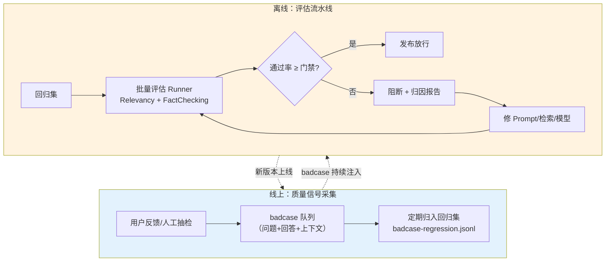
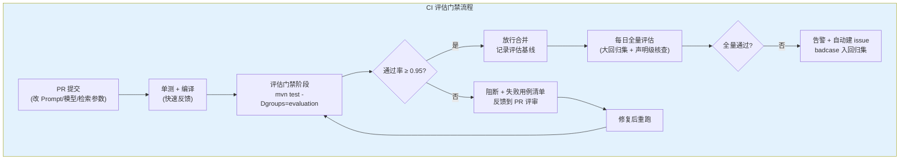

# 10 评估测试 Evaluation

> **定位**：本文讲 Spring AI 2.0.0 **Evaluator API 的工程化全量样例**——`Evaluator` 契约与 `EvaluationRequest`/`EvaluationResponse` 模型、`RelevancyEvaluator` 相关性评估（默认提示词、YES/NO 解析协议、自定义提示词）、`FactCheckingEvaluator` 事实核查（`forBespokeMinicheck` 工厂、RAG 支撑度评估）、评估用廉价模型路由、JUnit 5 与 WebFlux 测试栈集成，以及企业级四件套：badcase 回归集、CI 评估门禁、批量评估 runner、指标化落盘。**评估体系的方法论闭环**（在线/离线评估、数据飞轮）见 [教程 08-架构师进阶/03-自我反思与Agent评估]——本文专讲官网 Evaluator API 怎么用、怎么测、怎么进流水线。
>
> **读者画像**：已经跑通对话与检索功能，需要回答「改了 Prompt 会不会把效果改坏」——把质量验证从肉眼抽查升级为自动化门禁的中高级 Java 工程师。
>
> **前置阅读**：[教程 00-基础与核心/02-ChatClient与对话模型]（ChatClient API）、[教程 02-SpringAI核心机制/01-Advisor链与拦截器]（了解拦截点，可选）。

---

## 1. 评估在 Agent 工程里的位置

### 1.1 为什么 LLM 应用的「断言」不一样

在展开 API 之前先建立一个认知框架：评估测试不是可选项——Prompt 是「分布式配置」，一行措辞的改动可能让某类问题的回答全线劣化，而人工抽查的覆盖率撑不住持续迭代。评估体系的最低可行形态就是本文的主线：一个契约（Evaluator）、两个内置评估器、一条 CI 门禁。传统单元测试断言确定值：`assertEquals("北京", city)`。LLM 输出是非确定的——同一个问题，今天回答「北京市是中国的首都」，明天回答「中国首都位于华北平原的北京市」，语义等价但字符串永远不等。评估的核心转换是把断言从「值相等」升级为「**质量判定**」：让另一个模型（或规则）对输出打分，断言变成 `assertTrue(evaluationResponse.isPass())`。

Spring AI 把这个模式固化为 `Evaluator` 接口：输入 `EvaluationRequest`，输出 `EvaluationResponse`（pass/score/feedback）。评估器本身用 LLM 实现（LLM-as-Judge），但契约是普通 Java 接口——可以进 JUnit、进 CI、进监控，与传统测试设施无缝拼装。

评估对象要先分清两类，选错评估器是评估体系失效的第一原因：**回答质量**（回答是否与上下文一致、是否有事实依据——Relevancy/FactChecking 的领地）与**检索质量**（召回的文档是否相关、排序是否合理——评估对象是 `dataList` 本身而非回答）。本文两个内置评估器都属前者；检索质量的量化（召回率/MRR）用金标准问题集自建，见 [教程 10-调优实战与方法论/01-环节体检：五环节指标与判病阈值]。

还有第三类容易被漏掉：**链路级质量**（整条 RAG 链的端到端可用性）——它不由某个评估器判定，而是由分层评估组合推断（检索层 + 生成层各自的通过率与延迟联合看）。分层评估、逐层归因，是评估体系可维护性的关键。

### 1.2 评估闭环：从抽查到飞轮

单次评估价值有限，工程价值来自闭环化：



图中的判断节点（通过率 ≥ 门禁?）是整个闭环的闸门——本文 §7.2 给出它的代码实现。闭环的两个入口：**线上 badcase 持续沉淀为回归集**（每次线上失败都变成一条永久的自动化用例），**离线评估门禁守住每次变更**（Prompt 改动、模型升级、检索参数调整都要过门禁）。本文第 7 章的四个企业样例分别实现这张图的每个节点。

### 1.3 实证基准

与全体系一致，所有 API 经本地 jar `javap` + sources 双重实证（`spring-ai-commons-2.0.0` 与 `spring-ai-client-chat-2.0.0`）：

| 类 | 关键成员（实证签名） |
|------|------|
| `evaluation.Evaluator` | `evaluate(EvaluationRequest)` abstract + `doGetSupportingData(EvaluationRequest)` default |
| `evaluation.EvaluationRequest` | 构造器 `(String userText, String responseContent)` / `(List<Document> dataList, String responseContent)` / `(String userText, List<Document> dataList, String responseContent)` |
| `evaluation.EvaluationResponse` | `(boolean pass, float score, String feedback, Map)` / `(boolean pass, String feedback, Map)`（score 默认 0）+ `isPass()/getScore()/getFeedback()/getMetadata()` |
| `chat.evaluation.RelevancyEvaluator` | 构造器 `(ChatClient.Builder)` + `evaluate(...)` + `static builder()`；Builder：`chatClientBuilder/promptTemplate/build` |
| `chat.evaluation.FactCheckingEvaluator` | protected 构造器 `(ChatClient.Builder, String evaluationPrompt)` + `static forBespokeMinicheck(ChatClient.Builder)` + `static builder(ChatClient.Builder)`；Builder：`chatClientBuilder/evaluationPrompt/build` |

契约是同步的（`evaluate` 直接返回 `EvaluationResponse`）——评估天然是离线动作，不需要响应式；要并发就开外部线程池（§7.3 的 Runner 形态），不要把复杂度塞进契约。

两个内置评估器都住在 `spring-ai-client-chat` 的 `org.springframework.ai.chat.evaluation` 包里（不是 commons——它们依赖 ChatClient），契约三类型在 `spring-ai-commons` 的 `org.springframework.ai.evaluation` 包。依赖关系决定了：只用契约做自研评估器，引 commons 就够；用内置评估器，client-chat 必在 classpath（本来就有）。

---

## 2. Evaluator 契约：三个类型

### 2.1 Evaluator 接口

```java
// spring-ai-commons-2.0.0（框架源码，节选）
public interface Evaluator {
    EvaluationResponse evaluate(EvaluationRequest evaluationRequest);

    default String doGetSupportingData(EvaluationRequest evaluationRequest) {
        List<Document> data = evaluationRequest.getDataList();
        return data.stream()
            .map(Document::getText)
            .filter(StringUtils::hasText)
            .collect(Collectors.joining(System.lineSeparator()));
    }
}
```

契约只有两个方法：`evaluate` 是必选实现；`doGetSupportingData` 是可覆盖的辅助——默认实现把 `dataList` 里各 `Document` 的文本用系统换行符拼接成「支撑材料」。两个内置评估器都把拼接结果作为提示词里的 `context`/`document` 变量。覆盖它的典型动机：dataList 有二十个片段而裁判模型上下文有限——按与 question 的词面相关性排序取前五再拼接，判定精度反而高于全量塞入（噪音稀释信号）。

### 2.2 EvaluationRequest：三构造器与参数序

```java
import java.util.List;
// Spring AI 2.0.0
import org.springframework.ai.document.Document;
import org.springframework.ai.evaluation.EvaluationRequest;

public class EvaluationRequestShapes {

    public void shapes(String question, String answer, List<Document> retrievedDocs) {
        // 形态一：纯对话评估（无检索上下文）
        EvaluationRequest chat = new EvaluationRequest(question, answer);

        // 形态二：RAG 评估（检索到的文档作支撑材料，用户问题为空串）
        EvaluationRequest ragOnly = new EvaluationRequest(retrievedDocs, answer);

        // 形态三：全量（问题 + 检索文档 + 回答）——RAG 场景标准形态
        EvaluationRequest full = new EvaluationRequest(question, retrievedDocs, answer);
    }
}
```

参数序（sources 实证）：**`userText` 在前、`responseContent` 在后**，`dataList` 居中。第三个构造器是 RAG 评估的标准入口——RelevancyEvaluator 用 `userText` 填 `{query}`、`responseContent` 填 `{response}`、`doGetSupportingData(dataList)` 填 `{context}`。

| 评估场景 | 构造器 | userText | dataList | responseContent |
|---------|--------|----------|----------|----------------|
| 纯对话相关性 | `(String, String)` | 用户问题 | 空 | 回答 |
| RAG 回答一致性 | `(String, List<Document>, String)` | 用户问题 | 检索片段 | 回答 |
| 声明核查（单句） | `(List<Document>, String)` | 空串 | 检索片段 | 待核查声明 |

参数序是新人最常见的坑——按「问题、上下文、回答」的直觉写会传反（实际是「问题、上下文、回答」恰好一致,但两参版是「问题、回答」而非「回答、问题」）。建议团队封装一个静态工厂统一入口,例如 `EvaluationRequests.rag(question, docs, answer)`,屏蔽构造器重载的选择成本。决策规则一句话：**有检索片段就传 dataList**（裁判模型上下文越全判定越准），userText 只有在「问题本身影响判定」时才传。

dataList 内部的顺序就是提示词里 context 的顺序——检索器按相关性排序的输出直接透传即可，与检索篇的返回约定保持一致；无需在评估侧重排。

### 2.3 EvaluationResponse：pass/score/feedback/metadata

```java
import java.util.Map;
// Spring AI 2.0.0
import org.springframework.ai.evaluation.EvaluationResponse;

public class EvaluationResponseShapes {

    public void shapes() {
        // 全参构造：pass + score + feedback + metadata
        EvaluationResponse full = new EvaluationResponse(true, 0.92f, "高度相关", Map.of("model", "gpt-4o-mini"));

        // 三参构造：score 默认 0（内置评估器走这条——它们只给二值判定）
        EvaluationResponse binary = new EvaluationResponse(false, "回答与上下文矛盾", Map.of());
    }
}
```

两个构造器的差异只有 score：全参版显式给分，三参版默认 0。`getMetadata()` 返回类型是 `Map<String, Object>`——内置评估器返回的 `getMetadata()` 是空 Map，这个字段是给自建评估器预留的扩展位：把裁判模型名、原始输出、各维度子分塞进 metadata，报告层做归因分析时就不必再查原始调用。`getScore()` 的语义由评估器自定义：内置两个评估器都是二值（pass=1 / fail=0），feedback 为空串。想要连续分数与归因文本，需要自定义评估器（§8）——这是理解「Spring AI 评估器是骨架、业务深度靠自建」的第一步。

---

## 3. RelevancyEvaluator：相关性评估

### 3.1 构造与最小样例

判定「回答是否与上下文信息一致」——注意判定的参照物是**上下文**而非「客观事实」：回答可以与检索片段完全一致但事实错误（语料本身错了，评估器照样判 pass）。这正是它与 FactCheckingEvaluator 的分工边界：Relevancy 测「有没有依据」，FactChecking 测「依据是否支撑」——两者串联才能覆盖「依据充分且支撑回答」的完整链路。典型场景：RAG 回答是否真的基于检索到的文档（而非模型幻觉）：

```java
import java.util.List;
// Spring AI 2.0.0
import org.springframework.ai.chat.client.ChatClient;
import org.springframework.ai.chat.evaluation.RelevancyEvaluator;
import org.springframework.ai.document.Document;
import org.springframework.ai.evaluation.EvaluationRequest;
import org.springframework.ai.evaluation.EvaluationResponse;

public class RelevancyDemo {

    public EvaluationResponse demo(ChatClient.Builder chatClientBuilder) {
        RelevancyEvaluator evaluator = RelevancyEvaluator.builder()
                .chatClientBuilder(chatClientBuilder)
                .build();

        EvaluationRequest request = new EvaluationRequest(
                "公司的年假政策是什么?",                                   // query
                List.of(new Document("正式员工每年享有 15 天带薪年假，…")),   // context（dataList）
                "员工每年有 15 天带薪年假。");                              // response

        EvaluationResponse response = evaluator.evaluate(request);
        return response;   // isPass()==true 表示回答与上下文一致
    }
}
```

构造只依赖 `ChatClient.Builder`——注意是 Builder 而非 ChatClient：评估器内部每次 `evaluate` 都从 Builder `build()` 出新实例（源码行为），这意味着 Builder 上配置的 defaultOptions（如 temperature=0）会被继承，而 ChatClient 一旦构建就固定了。这也是 §5 路由方案能成立的 API 基础。

### 3.2 默认提示词：YES/NO 协议

评估质量的上限由裁判提示词决定。默认提示词（sources 摘译）设计成三段式填空 + 强制二选一：

> 你的任务是评估 query 的回答是否与提供的上下文信息一致。你只有两种回答：YES 或 NO。若回答与上下文一致答 YES，否则 NO。Query: `{query}` Response: `{response}` Context: `{context}` Answer:

英文原文（`DEFAULT_PROMPT_TEMPLATE`，spring-ai-client-chat sources）以 `Your task is to evaluate if the response for the query is in line with the context information provided.` 开头，结尾占位 `Answer:` 诱导裸输出。要点：指令要求裸答案（只有 YES/NO，不要解释），这直接决定了下游解析逻辑的简单性。占位符三个：`{query}` ← `getUserText()`、`{response}` ← `getResponseContent()`、`{context}` ← `doGetSupportingData(dataList)`。

自建评估器时这个「结构化占位 + 裸答案协议」的组合可以直接抄——它把「提示词工程」与「结果解析」解耦成两个独立可测的部分，是 Spring AI 这个设计的精巧处。

### 3.3 evaluate 解析逻辑：源码级行为

```java
// spring-ai-client-chat-2.0.0 RelevancyEvaluator（框架源码，节选）
public EvaluationResponse evaluate(EvaluationRequest evaluationRequest) {
    var response = evaluationRequest.getResponseContent();
    var context = doGetSupportingData(evaluationRequest);
    var userMessage = this.promptTemplate
        .render(Map.of("query", evaluationRequest.getUserText(), "response", response, "context", context));

    String evaluationResponse = this.chatClientBuilder.build().prompt().user(userMessage).call().content();

    boolean passing = false;
    float score = 0;
    String normalizedResponse = (evaluationResponse != null) ? evaluationResponse.strip() : "";
    if ("yes".equalsIgnoreCase(normalizedResponse)) {
        passing = true;
        score = 1;
    }
    return new EvaluationResponse(passing, score, "", Collections.emptyMap());
}
```

先看评估调用的内部结构：`chatClientBuilder.build()` 每次评估都新建一个 ChatClient 再单轮调用——无状态、无对话记忆，纯单轮判定。三条源码级结论，每条都有工程后果：**解析是严格的 `strip()` 后整体 equalsIgnoreCase("yes")**——评估模型多回一个字（"YES, because..."）就判 false，所以 §5 的评估模型路由里 temperature=0 与提示词遵循度是硬要求；**pass 与 score 绑定**（true→1.0 / false→0.0），没有部分分——「判定为 NO」与「模型回答了乱码」在结果上不可区分，监控告警的分级要在调用侧另行处理；**feedback 恒为空串**——失败的「为什么」拿不到，归因要自己加评估器（§8）。

### 3.4 score 的局限：二值判定没有部分分

`score` 恒为 1.0/0.0 意味着「勉强相关」与「完全一致」得分相同——通过率指标对质量退化不敏感（95% → 93% 的退化里，可能混着大量「从完全一致滑向勉强相关」的用例）。两个缓解手段：门禁阈值之外**同时跟踪分数分布的移动**（需要连续分数则自建评估器，§8）；badcase 归因时用声明级核查拆细粒度（§4.3）。

### 3.5 自定义提示词

模型中文场景下默认英文提示词可用但不最优；或者需要更严的判定标准时，换提示词：

```java
import java.util.Map;
// Spring AI 2.0.0
import org.springframework.ai.chat.evaluation.RelevancyEvaluator;
import org.springframework.ai.chat.prompt.PromptTemplate;

public class CustomPromptRelevancy {

    public RelevancyEvaluator build(ChatClient.Builder chatClientBuilder) {
        PromptTemplate template = new PromptTemplate("""
                判断以下回答是否与上下文信息一致。只回答 YES 或 NO,不要任何其他文字。

                问题:
                {query}

                回答:
                {response}

                上下文:
                {context}

                答案:
                """);
        return RelevancyEvaluator.builder()
                .chatClientBuilder(chatClientBuilder)
                .promptTemplate(template)   // 占位符名必须仍是 query/response/context
                .build();
    }
}
```

约束只有一条：**占位符名不能改**（`query`/`response`/`context` 是 `evaluate` 内部 `render` 时传入的固定键名，改了名 render 时直接缺变量报错）。判定标准的松紧、语言、输出协议都自由。

中文提示词的实测经验：判定标准的措辞比语言本身影响更大——「信息一致」换成「回答中的每个关键信息都能在上下文中找到依据」，裁判的宽严会明显变化。改提示词视同改评估标准：回归集历史结果作废，需要重建基线（§7.4）。

---

## 4. FactCheckingEvaluator：事实核查

Relevancy 判定的是「一致」，事实核查判定的是「支撑」——回答可以与上下文一字不差但上下文本身是错的（此时两者都 pass，错误源头在语料）；反过来，回答引入了上下文没有的数字（幻觉），Relevancy 判 fail 而 FactChecking 能定位「哪个声明无支撑」。两个评估器组合使用才构成完整的 RAG 质量检查。

### 4.1 forBespokeMinicheck 工厂：专用核查模型

`FactCheckingEvaluator` 判定「声明（claim）是否被文档（document）支撑」——本质上是一致性事实核查。工厂方法 `forBespokeMinicheck` 面向专用核查模型 **Bespoke-Minicheck**（Bespoke Labs 出品的 grounded factuality 检测模型，Ollama 可直接拉取，javadoc 引用其论文 MiniCheck——专门训练来核查 LLM 输出的幻觉，比通用 LLM 裁判更准更便宜）：

```java
// Spring AI 2.0.0
import org.springframework.ai.chat.client.ChatClient;
import org.springframework.ai.chat.evaluation.FactCheckingEvaluator;

public class MinicheckDemo {

    public FactCheckingEvaluator build(ChatClient.Builder minicheckClientBuilder) {
        // Minicheck 模型自带核查指令,提示词只给裸的 document/claim 两段
        return FactCheckingEvaluator.forBespokeMinicheck(minicheckClientBuilder);
    }
}
```

`forBespokeMinicheck` 与默认构造的差异在提示词（源码实证）：默认版自带完整指令（"Evaluate whether or not the following claim is supported by the provided document. Respond with yes/no…"），Bespoke 版是**裸文本**——`Document: {document}` + `Claim: {claim}`，因为 Minicheck 模型内部已固化核查指令，多余的指令反而降低其精度。

### 4.2 默认提示词与 Builder 自定义

不依赖 Minicheck、用通用 LLM 做核查时，走 `builder` 显式配置：

用通用 LLM 做核查（没有 Minicheck 时），走 `builder` 显式配置：

```java
// Spring AI 2.0.0
import org.springframework.ai.chat.client.ChatClient;
import org.springframework.ai.chat.evaluation.FactCheckingEvaluator;

public class GenericFactChecker {

    public FactCheckingEvaluator build(ChatClient.Builder judgeClientBuilder) {
        return FactCheckingEvaluator.builder(judgeClientBuilder)
                // 不传 evaluationPrompt 时用默认提示词;这里显式传 null 等价默认
                .chatClientBuilder(judgeClientBuilder)
                .evaluationPrompt(null)
                .build();
    }
}
```

`evaluationPrompt(String)` 接受完整提示词文本（占位符 `document`/`claim`），传 `null` 或不调用时回落到默认版。

**输出协议别改**：evaluate 内部只认裸 `yes`（忽略大小写），自定义提示词若让模型输出 `YES|理由` 这类复合格式，解析必然全 fail。要归因信息请走 §8 的自建评估器，内置两个的定位就是「裸判定」。自定义核查提示词的典型动机：输出结构化判定（如 `YES|理由`），代价是 evaluate 的解析仍是裸 `"yes"` 比对——**输出协议别改**，要归因信息请自定义评估器（§8）。

### 4.3 RAG 场景：dataList 评 document 支撑度

RAG 的核心质量问题是「回答的每个事实是否都能在检索片段中找到依据」——把回答当 claim、把检索片段当 document，核查 API 的两个参数正是这么对应的：`getResponseContent()` 填 `{claim}`、`doGetSupportingData(dataList)` 填 `{document}`。逐条核查：

```java
import java.util.List;
// Spring AI 2.0.0
import org.springframework.ai.chat.client.ChatClient;
import org.springframework.ai.chat.evaluation.FactCheckingEvaluator;
import org.springframework.ai.document.Document;
import org.springframework.ai.evaluation.EvaluationRequest;
import org.springframework.ai.evaluation.EvaluationResponse;

public class RagFactCheckService {

    private final FactCheckingEvaluator factChecker;

    public RagFactCheckService(ChatClient.Builder judgeClientBuilder) {
        this.factChecker = FactCheckingEvaluator.forBespokeMinicheck(judgeClientBuilder);
    }

    /** 检索增强回答的事实核查:dataList 传入检索片段,机制上 document = 各片段 getText() 换行拼接 */
    public EvaluationResponse check(String question, List<Document> retrieved, String answer) {
        return factChecker.evaluate(new EvaluationRequest(question, retrieved, answer));
    }

    /** 逐条声明核查:把回答拆成单事实句,定位「哪一句」是幻觉(回答级核查只能知道「有不实」) */
    public boolean checkSingleClaim(List<Document> retrieved, String claim) {
        return factChecker.evaluate(new EvaluationRequest(retrieved, claim)).isPass();
    }
}
```

`doGetSupportingData` 的拼接语义决定了核查粒度：**多片段拼接成一个大 document**，Minicheck/LLM 判定「claim 是否被其中任何片段支撑」——这是「回答级」核查；`checkSingleClaim` 把回答拆成单句再核查是「声明级」，定位幻觉句子的精度更高，成本是评估调用量成倍增长（工程取舍：回答级做 CI 门禁常态化，声明级做 badcase 归因定点深挖）。拆句的最小实现是按句号/问号正则切分再过滤短句——不必上句法分析；要紧的是**拆完的每句仍需上下文可判**，指代不清的句子（「它可以跨年」）要把前一句一并带上，否则裁判会因指代不明而误判。

| 核查粒度 | 评估调用量 | 定位精度 | 适用 |
|---------|-----------|---------|------|
| 回答级（整段回答一次核查） | 1× | 知道「有不实」 | CI 门禁、每日全量 |
| 段落级（按句号拆 3-5 条） | 3-5× | 定位到段 | 每周深度巡检 |
| 声明级（逐句核查） | 5-10× | 定位到句 | badcase 归因、医疗/金融高风险场景 |

### 4.4 不适用场景：closed-book

javadoc 原文明确：该评估器核查的是「声明 vs 给定材料」，**不支持 closed-book 场景**（不给参考材料，考模型「裸知识」的准确性）。想测「模型自己知道什么」，这不是本文 API 的领地——走人工评测集或领域专家抽检。这条边界反过来也是提示：**给 FactCheckingEvaluator 的 dataList 必须真的含判定所需材料**——用「问题」当 document（而不是检索到的材料）去核查回答，评估器会判 fail，而且是真的 fail：没有材料支撑的回答本来就不该出现在 RAG 场景里。

---

## 5. 评估模型路由：廉价模型做裁判

### 5.1 架构：评估模型 ≠ 生产模型

先算一笔账：百条回归集 × PR 每日 10 次 × 每次 1 个评估调用 = 每天一千次裁判调用——这还只是 PR 级。评估成本随「团队迭代频率 × 回归集规模」复合增长，与生产调用量无关，所以裁判模型的价格档位是评估体系能否长期跑下去的第一决定因素。

评估器构造只依赖 `ChatClient.Builder`——这正是路由点：生产用旗舰模型，评估用便宜模型（或本地小模型），成本差一到两个数量级。评估调用量是生产调用量乘以回归集规模，模型档位必须分开：

```java
import org.springframework.ai.chat.client.ChatClient;
// Spring AI 2.0.0
import org.springframework.ai.chat.prompt.ChatOptions;
import org.springframework.ai.openai.OpenAiChatModel;
import org.springframework.ai.chat.evaluation.RelevancyEvaluator;

public class JudgeModelRouting {

    /**
     * 评估裁判模型三原则:
     * 1. 便宜——评估调用量大,档位降一级(gpt-4o-mini / 本地 Ollama 模型);
     * 2. 温度 0——YES/NO 协议下温度不为 0 会引入判定抖动,回归集结果不可复现;
     * 3. 提示词遵循度高——解析是严格 strip 后 equalsIgnoreCase,啰嗦模型全判 fail。
     */
    public RelevancyEvaluator buildJudge(OpenAiChatModel judgeModel) {
        ChatClient.Builder judgeBuilder = ChatClient.builder(judgeModel)
                .defaultOptions(ChatOptions.builder()
                        .model("gpt-4o-mini")     // 评估专用档位,与生产模型解耦
                        .temperature(0.0)          // 判定确定性
                        .build());
        return RelevancyEvaluator.builder()
                .chatClientBuilder(judgeBuilder)
                .build();
    }
}
```

裁判模型的**能力下限**也要守住：太小的模型会丢失长文档的关键信息（核查提示词的 document 段被截断而不自知），表现为「长上下文用例全 fail」。选型时用回归集里最长的上下文跑一遍通读性验证，再上线守门。

三原则的优先级：**温度 0 与遵循度是硬性的**（违反直接导致门禁不可用），价格是弹性的（按预算选档）——顺序不要倒。

本地化路线：`forBespokeMinicheck` + Ollama 拉取 `bespoke-minicheck` 模型（javadoc 推荐的组合），评估调用零 API 成本，只付推理硬件——badcase 回归集上千条时，这是成本曲线的转折点。

本地裁判的接线方式与远程完全一致——Ollama 的 OpenAI 兼容端点配一个独立 `ChatModel` Bean（`base-url` 指向 `${OLLAMA_BASE_URL:http://localhost:11434}`），`ChatClient.builder(ollamaModel)` 传给 `forBespokeMinicheck` 即可；评估器代码零改动，换裁判只是换 Bean。CI 环境没有 GPU 时裁判退回远程小模型，环境变量切换，门禁逻辑不变。

裁判模型的系统性偏差要放进设计：**位置偏差**（prompt 里靠前/靠后的内容权重更高——核查提示词里 document 在 claim 之前是合理顺序）；**宽严漂移**（同一个裁判模型换小版本，宽严可能变化——所以 §7.4 的报告必须绑定裁判模型版本）；**自评偏差**（让生成模型自评普遍偏宽——裁判与生产必须是不同模型）。定期用人工标注的小样本校准裁判（人工判 50 条 vs 裁判判 50 条，一致率低于 90% 就要重训提示词或换裁判）。

---

## 6. 单元测试集成

进入测试代码前先明确「测什么」：评估测试的断言对象是**评估结果**（isPass），而被测对象是**你的回答链路**（检索 → 组装 → 生成）。完整覆盖需要三层——链路层（端到端回答是否可接受，§6.2 的 WebTestClient 测法）、检索层（片段是否支撑回答，FactChecking）、生成层（同样片段下回答是否忠实，Relevancy）。单元测试里通常只跑其中一层，全量组合留给 §7 的批量 Runner。

### 6.1 JUnit 5：评估即断言

```java
import java.util.List;
import org.junit.jupiter.api.Test;
// Spring AI 2.0.0
import org.springframework.ai.chat.client.ChatClient;
import org.springframework.ai.chat.evaluation.RelevancyEvaluator;
import org.springframework.ai.document.Document;
import org.springframework.ai.evaluation.EvaluationRequest;
import org.springframework.ai.evaluation.EvaluationResponse;
import static org.junit.jupiter.api.Assertions.assertTrue;

/**
 * 相关性评估测试:评估模型真实调用,属集成测试范畴,
 * 用 @Tag("evaluation") 隔离,CI 中单独阶段执行(§7.2)。
 */
class FaqRelevancyTest {

    @Test
    @org.junit.jupiter.api.Tag("evaluation")
    void answerShouldBeRelevantToRetrievedContext(ChatClient.Builder judgeBuilder) {
        RelevancyEvaluator evaluator = RelevancyEvaluator.builder()
                .chatClientBuilder(judgeBuilder)
                .build();

        EvaluationResponse response = evaluator.evaluate(new EvaluationRequest(
                "年假有几天?",
                List.of(new Document("正式员工每年享有 15 天带薪年假,可分两次使用。")),
                "您每年有 15 天带薪年假。"));

        assertTrue(response.isPass(), "回答应与检索上下文一致");
    }
}
```

`@Tag("evaluation")` 是测试分层的挂点：评估测试真实调用裁判模型（慢、有成本、可能抖动），与秒级单测分开跑——`mvn test -Dgroups=!evaluation` 日常快速回路，`-Dgroups=evaluation` 进评估阶段。参数化形态（`@ParameterizedTest` + `@CsvFileSource` 直接吃 CSV 用例集）适合「同一判定逻辑跑一批用例」，但每条用例独立计失败——门禁「通过率」语义要的是聚合判定，用 §7.2 的聚合测试更贴切。

这段测试有两个工程细节：评估器构造放在测试方法内而不是 `@BeforeEach`（裁判 Builder 由 Spring 注入，构造成本可忽略，方法内构造让每个用例的依赖一目了然）；断言消息带上下文描述（`"回答应与检索上下文一致"`）——CI 失败邮件里没有这句，定位就要翻代码。进阶形态是 `@ParameterizedTest` + CSV 数据源批量跑（用例集即数据文件），但注意参数化是「每条独立失败」语义，与门禁「通过率聚合」语义不同（§7.2 的选择理由）。

### 6.2 WebFlux 服务：StepVerifier 与 WebTestClient

检索服务是响应式的（`Mono<String>`），测试时把评估断言接进 Reactor 测试流（需 `reactor-test` 依赖，`test` scope）：

```java
import java.util.List;
import org.junit.jupiter.api.Test;
import reactor.core.publisher.Mono;
import reactor.test.StepVerifier;
// Spring AI 2.0.0
import org.springframework.ai.chat.client.ChatClient;
import org.springframework.ai.chat.evaluation.RelevancyEvaluator;
import org.springframework.ai.document.Document;
import org.springframework.ai.evaluation.EvaluationRequest;
import org.springframework.beans.factory.annotation.Autowired;
import org.springframework.boot.test.context.SpringBootTest;
import org.springframework.test.web.reactive.server.WebTestClient;
import static org.junit.jupiter.api.Assertions.assertTrue;

/**
 * 两种测法:
 * A. WebTestClient 断言 HTTP 层(状态码 + 非空);
 * B. StepVerifier 断言 Mono 内容,再接评估器断言语义层。
 * reactor-test 为 test scope 依赖(reactor-bom 管理)。
 */
@SpringBootTest(webEnvironment = SpringBootTest.WebEnvironment.RANDOM_PORT)
class RetrievalChatEndpointTest {

    @Autowired
    private WebTestClient webTestClient;

    @Autowired
    private ChatClient.Builder judgeBuilder;

    @Test
    @org.junit.jupiter.api.Tag("evaluation")
    void endpointShouldReturnRelevantAnswer() {
        // A. HTTP 层
        String answer = webTestClient.get()
                .uri(uri -> uri.path("/ask").queryParam("q", "年假政策").build())
                .header("X-Tenant-Id", "t-1001")
                .exchange()
                .expectStatus().isOk()
                .expectBody(String.class)
                .returnResult()
                .getResponseBody();

        // B. 语义层:回答对「15 天年假」这条知识的相关性
        StepVerifier.create(Mono.just(answer))
                .assertNext(text -> {
                    RelevancyEvaluator evaluator = RelevancyEvaluator.builder()
                            .chatClientBuilder(judgeBuilder)
                            .build();
                    org.springframework.ai.evaluation.EvaluationResponse evaluation = evaluator.evaluate(
                            new EvaluationRequest(
                                    "年假政策",
                                    List.of(new Document("正式员工每年享有 15 天带薪年假。")),
                                    text));
                    assertTrue(evaluation.isPass(), "回答应与知识库事实一致");
                })
                .verifyComplete();
    }
}
```

这段测试的分层值得留意：HTTP 层断言（状态码、租户头、响应体）与语义层断言（评估器 isPass）是两种性质的检查——前者失败是代码坏了，后者失败可能是质量问题或裁判抖动。测试报告里把两类失败分开呈现，值班的同学才能快速分诊。另外 `@Tag("evaluation")` 让这层断言可以被排除出日常回路——语义层慢且抖，只在评估阶段跑。

### 6.3 测试稳定性：评估模型的非确定性治理

评估测试的「偶发红」比功能测试的偶发红危害更大——它消耗的是团队对门禁的信任，信任一丢，大家就开始「手动重跑跳过」，门禁名存实亡。

评估链路是「模型评模型」，两层非确定性叠加：被测系统输出在变，裁判判定也在变。三个稳定化手段：**评估模型 temperature=0**（§5.1 已配置）；**关键路径加重复评估投票**（同一用例评 3 次取多数，成本 ×3 但消除偶发翻转，只对门禁级用例启用）；**回归集版本化**（评估结果与回归集、评估模型版本绑定存档——回归失败时能回答「是代码坏了还是裁判变了」）。

数据管理上，评估产生的中间数据（每次判定的裁判原始输出）按用例留存 90 天——归因争议时的仲裁依据，过期清理与业务日志同策略。超时与幂等：评估调用给明确超时（裁判模型 hang 住会让 CI 卡死，60 秒足够）；评估本身无副作用可安全重跑，但**门禁失败不要自动重跑**（§9 反模式）——重跑到通过只会掩盖真实退化。

---

## 7. 企业级样例：回归集、CI 门禁、批量 Runner、指标化

### 7.1 样例①：badcase 回归集管理

回归集的载体选 JSONL（一行一用例，diff 友好、Git 管理）。每条记录**录制回答**（answer）——门禁跑的是「评估器对既有问答对的判定」，不重新生成回答，这样门禁测的是评估链路本身的回归，时长与成本可控：

```json
{"id":"bc-2026-0812-01","question":"年假可以休到明年吗?","answer":"年假不可跨年,需在次年 3 月 31 日前休完。","contexts":["年假有效期至次年 3 月 31 日。"],"source":"线上反馈","addedAt":"2026-08-12"}
```

```java
import java.nio.file.Files;
import java.nio.file.Path;
import java.util.ArrayList;
import java.util.List;
import com.fasterxml.jackson.databind.ObjectMapper;

/**
 * badcase 回归集加载器:JSONL → 用例列表。
 * 线上 badcase 由运营台导出为同格式,追加进回归集文件(Git PR 评审),
 * 每次 PR 合入都意味着「这个问题永远不会再坏」。
 */
public class RegressionSetLoader {

    public record BadCase(String id, String question, String answer,
                          List<String> contexts, String source, String addedAt) {}

    private final ObjectMapper mapper = new ObjectMapper();

    public List<BadCase> load(Path jsonlFile) throws java.io.IOException {
        List<BadCase> cases = new ArrayList<>();
        for (String line : Files.readAllLines(jsonlFile)) {
            if (line.isBlank() || line.startsWith("#")) {
                continue;   // 注释行:用例禁用标记
            }
            cases.add(mapper.readValue(line, BadCase.class));
        }
        return cases;
    }
}
```

JSONL 文件入 Git，追加用例走 PR 评审——评审时要回答两个问题：「这条 badcase 线上发生了几次」（频次决定收录优先级）、「修复它的改动是否已上线」（未修复的用例加注释标记，不进门禁分母）。JSONL 文件头用注释行记录数据集版本与变更摘要（loader 已支持 `#` 注释行跳过）。加载器的职责刻意保持最小（读文件 → 反序列化），校验、评估、报告都留给下游——回归集格式演进时只动这个 record 和 JSONL,一处变更。`ObjectMapper` 注册 `DeserializationFeature.FAIL_ON_UNKNOWN_PROPERTIES` 的禁用可让旧代码读新格式文件（向后兼容），按团队 Jackson 全局配置决定。

回归集的字段会随评估体系演进：起步只要 question/answer/contexts 三件套；接入归因后加 `failureCategory`（检索失败/生成幻觉/口径不符）；接入基线对比后加 `minPassRate`（用例级阈值——高风险用例单条不过就门禁失败，普通用例看整体通过率）。

回归集的**规模纪律**：单次评估跑全量集的时长与费用线性增长，控制在 CI 可接受范围内（百级），线上 badcase 优先级高于合成用例——真实失败模式的价值密度最高。更系统的评估集构建方法论见 [教程 08-架构师进阶/03-自我反思与Agent评估]。

### 7.2 样例②：评估门禁进 CI

门禁的本质：**发布流程里插入一道「通过率 ≥ 阈值」的自动判定**。分级设计避免「一刀切全量」把 PR 拖到小时级：

| 门禁级别 | 触发时机 | 用例集 | 阈值 | 预算 |
|---------|---------|--------|------|------|
| PR 快速门禁 | 每次 PR | 核心回归集（高风险 50 条） | 整体 ≥ 95% 且高风险单条必过 | 2-3 分钟 |
| 每日全量 | 定时任务 | 全量回归集 | 整体 ≥ 95% | 小时级 |
| 发布前声明级核查 | 发版前 | 全量 + 逐句 FactChecking | 单条声明级不通过即阻断 | 按需 |

JUnit 集成 + 失败即红的形态：

门禁测试不需要 Web 环境——它只依赖裁判 Builder 与回归集文件，`@SpringBootTest` 是为了注入 ChatClient.Builder。代码形态：

```java
import java.nio.file.Path;
import java.util.List;
import org.junit.jupiter.api.Tag;
import org.junit.jupiter.api.Test;
// Spring AI 2.0.0
import org.springframework.ai.chat.client.ChatClient;
import org.springframework.ai.chat.evaluation.RelevancyEvaluator;
import org.springframework.ai.evaluation.EvaluationRequest;
import org.springframework.ai.evaluation.EvaluationResponse;
import org.springframework.beans.factory.annotation.Autowired;
import org.springframework.boot.test.context.SpringBootTest;
import static org.junit.jupiter.api.Assertions.assertTrue;

/**
 * 评估门禁测试:mvn test -Dgroups=evaluation 触发;
 * CI 中 PR 必跑,通过率低于阈值即失败阻断合并。
 * 回归集录制的 answer 直接参与评估(不重新生成),时长成本可控。
 */
@Tag("evaluation")
@SpringBootTest
class ReleaseGateTest {

    private static final double PASS_RATE_THRESHOLD =
            Double.parseDouble(System.getenv().getOrDefault("EVAL_PASS_RATE", "0.95"));

    @Autowired
    private ChatClient.Builder judgeBuilder;

    @Test
    void regressionSetShouldPass() throws Exception {
        RegressionSetLoader loader = new RegressionSetLoader();
        List<RegressionSetLoader.BadCase> cases =
                loader.load(Path.of("src/test/resources/badcase-regression.jsonl"));

        RelevancyEvaluator evaluator = RelevancyEvaluator.builder()
                .chatClientBuilder(judgeBuilder)
                .build();

        long passed = cases.stream()
                .map(c -> evaluator.evaluate(
                        new EvaluationRequest(c.question(), c.contexts(), c.answer())))
                .filter(EvaluationResponse::isPass)
                .count();
        double rate = (double) passed / cases.size();
        assertTrue(rate >= PASS_RATE_THRESHOLD,
                () -> "评估门禁失败:通过率 " + rate + " 低于阈值 " + PASS_RATE_THRESHOLD
                        + "(" + (cases.size() - passed) + "/" + cases.size() + " 条未通过)");
    }
}
```

门禁失败后的动作流要预定义：失败清单自动贴回 PR 评论（哪条用例、什么问题、通过率变化）；连续两次同因失败升级为 issue 而非仅评论——「评估失败」与「测试失败」在研发流程里应当同级。



### 7.3 样例③：批量评估数据集 Runner

百级以上数据集需要并发、进度与成本控制。轻量实现（`ExecutorService` 固定并发，评估模型 QPS 配额对齐）：

```java
import java.util.List;
import java.util.concurrent.CompletableFuture;
import java.util.concurrent.ExecutorService;
import java.util.concurrent.Executors;
import java.util.concurrent.atomic.AtomicInteger;
// Spring AI 2.0.0
import org.springframework.ai.chat.evaluation.RelevancyEvaluator;
import org.springframework.ai.evaluation.EvaluationRequest;
import org.springframework.ai.evaluation.EvaluationResponse;

/**
 * 批量评估 Runner:固定并发(对齐评估模型限流),进度可观测,逐条落结果。
 * 评估调用是 IO 密集型,并发数按评估模型 QPS 配额设置(如配额 60 RPM → 并发 2-4)。
 */
public class BatchEvaluationRunner {

    private final RelevancyEvaluator evaluator;
    private final int concurrency;
    private final AtomicInteger done = new AtomicInteger();

    public BatchEvaluationRunner(RelevancyEvaluator evaluator, int concurrency) {
        this.evaluator = evaluator;
        this.concurrency = concurrency;
    }

    public record CaseInput(String id, String question, List<String> contexts, String answer) {}

    public record CaseResult(String id, boolean pass, String error) {}

    public List<CaseResult> run(List<CaseInput> cases) {
        ExecutorService pool = Executors.newFixedThreadPool(concurrency);
        try {
            List<CompletableFuture<CaseResult>> futures = cases.stream()
                    .map(c -> CompletableFuture.supplyAsync(() -> evaluateOne(c, cases.size()), pool))
                    .toList();
            return futures.stream().map(CompletableFuture::join).toList();
        }
        finally {
            pool.shutdown();
        }
    }

    private CaseResult evaluateOne(CaseInput c, int total) {
        try {
            EvaluationResponse r = evaluator.evaluate(
                    new EvaluationRequest(c.question(), c.contexts(), c.answer()));
            System.out.printf("[%d/%d] %s -> %s%n", done.incrementAndGet(), total, c.id(), r.isPass());
            return new CaseResult(c.id(), r.isPass(), null);
        }
        catch (Exception e) {
            System.out.printf("[%d/%d] %s -> ERROR: %s%n", done.incrementAndGet(), total, c.id(), e.getMessage());
            return new CaseResult(c.id(), false, e.getMessage());
        }
    }
}
```

评估调用异常（限流 429、超时）按「不通过 + error」记录而不是中断整批——门禁宁可误报也不漏报，错误用例人工复核后决定是否重跑。

Runner 的输出直接对接 §7.4 的 Reporter——`run()` 返回的 `List<CaseResult>` 就是报告输入,两个类之间用 record 解耦,测试 Runner 不需要真的跑评估（mock evaluator 即可）。更大规模（万级）时 Runner 上面还要加一层**分片调度**：按用例 ID 哈希分片，多个 CI 任务各领一片并行跑，结果按片落盘后汇总——单任务时长压在 CI 平台的超时限制内，总时长由分片数决定。分片大小与断点续跑对齐（§7.1 的水位思路复用）。并发参数的推导：评估模型限流 60 RPM 时，固定并发 2（每请求约 2 秒 → 每并发 30 RPM → 两并发 60 RPM 正好贴线）；并发超限只会换来 429 与重试浪费。`ExecutorService` 换成响应式 `Flux.fromIterable(cases).flatMap(this::evaluateOne, concurrency)` 可以少占线程，语义等价——取决于团队技术栈统一性。

### 7.4 样例④：评估结果指标化与报告落盘

评估不做指标化就只是「跑过的测试」，做了指标化才是「质量水位」——前者回答「这次过没过」，后者回答「质量在往哪走」。评估结果进 Micrometer（监控大盘联动发布事件）+ JSON 报告归档（跨版本对比基线）：

```java
import java.nio.charset.StandardCharsets;
import java.nio.file.Files;
import java.nio.file.Path;
import java.util.List;
import io.micrometer.core.instrument.MeterRegistry;
// Spring AI 2.0.0
import org.springframework.stereotype.Component;

/**
 * 评估报告:指标进 Micrometer + JSON 落盘归档。
 * gauge 记录最新通过率,counter 记录历次门禁结果——大盘上「发布」与「通过率」两条曲线叠看。
 */
@Component
public class EvaluationReporter {

    private final MeterRegistry registry;

    public EvaluationReporter(MeterRegistry registry) {
        this.registry = registry;
    }

    public void report(List<BatchEvaluationRunner.CaseResult> results, String datasetVersion) {
        long passed = results.stream().filter(BatchEvaluationRunner.CaseResult::pass).count();
        double rate = results.isEmpty() ? 0.0 : (double) passed / results.size();

        registry.gauge("ai.evaluation.pass.rate", rate);   // 当前通过率:大盘曲线与发布事件叠加分析
        registry.counter("ai.evaluation.passed", "dataset", datasetVersion).increment(passed);
        registry.counter("ai.evaluation.failed", "dataset", datasetVersion).increment(results.size() - passed);

        String json = "{\"dataset\":\"" + datasetVersion
                + "\",\"total\":" + results.size()
                + ",\"passed\":" + passed
                + ",\"passRate\":" + rate + "}";
        try {
            Files.createDirectories(Path.of("target/evaluation"));
            Files.writeString(Path.of("target/evaluation/report-" + datasetVersion + ".json"),
                    json, StandardCharsets.UTF_8);
        }
        catch (Exception e) {
            throw new IllegalStateException("评估报告落盘失败", e);
        }
    }
}
```

指标化后的进阶玩法：把 `ai.evaluation.pass.rate` 与发布流水线联动——发布后通过率跌穿基线自动回滚告警，评估从「发布前门禁」扩展为「发布后监控」（完整在线评估闭环见 [教程 08-架构师进阶/07-数据飞轮与持续改进]）。

报告的三个消费方各有取用方式：CI 门禁读 JSON 判成败；工程负责人看 Micrometer 大盘趋势（周环比）；badcase 归因时按 `id` 反查原始裁判输出——所以 JSON 报告里除汇总数外还应附带失败用例的 id 清单（示例从简，生产版加上 `"failedIds":[...]` 字段）。

**基线漂移**是长期运营的必然：裁判模型升级、回归集扩充都会让通过率跳变。对策是报告归档时同时记录「数据集版本 + 裁判模型版本 + 被测版本」三元组，对比只在同前缀下进行；裁判升级后先对旧回归集全量重评建立新基线，再继续守门——否则新裁判对老用例判得更严，门禁会莫名其妙全红。

---

## 8. 自定义 Evaluator：扩展契约

什么时候该自建：内置二值判定已经跑通门禁、但 badcase 归因持续需要「为什么不过」的答案；或者业务需要领域化判定标准（客服话术合规、代码答案可编译性）。**不要**在第一周就自建——没有回归集与门禁基线，自定义评估器连「它自己准不准」都无法验证。

契约很小，重点在输出协议的设计：

内置评估器是二值判定（score 恒 0/1、feedback 恒空）。需要连续分数或归因时，实现 `Evaluator` 接口自建——契约很小，重点在输出协议的设计：

```java
import java.util.Map;
// Spring AI 2.0.0
import org.springframework.ai.chat.client.ChatClient;
import org.springframework.ai.evaluation.EvaluationRequest;
import org.springframework.ai.evaluation.EvaluationResponse;
import org.springframework.ai.evaluation.Evaluator;

/**
 * 结构化反馈评估器:让裁判模型输出 JSON(分数+理由),
 * 解析后填进 score/feedback——比内置二值判定多出归因能力。
 * 裁判模型 temperature=0;JSON 解析失败视为不通过(宁严勿漏)。
 */
public class StructuredFeedbackEvaluator implements Evaluator {

    private final ChatClient.Builder judgeBuilder;

    public StructuredFeedbackEvaluator(ChatClient.Builder judgeBuilder) {
        this.judgeBuilder = judgeBuilder;
    }

    @Override
    public EvaluationResponse evaluate(EvaluationRequest request) {
        String prompt = """
                评估回答质量(相关性、准确性、完整性,各 1-5 分)。
                只输出 JSON,格式:{"score":0到1的小数,"feedback":"一句话理由"}

                问题:
                %s

                回答:
                %s
                """.formatted(request.getUserText(), request.getResponseContent());

        String output = this.judgeBuilder.build().prompt().user(prompt).call().content();
        try {
            String json = output.substring(output.indexOf('{'), output.lastIndexOf('}') + 1);
            double score = Double.parseDouble(json.replaceAll(".*\"score\":\\s*([0-9.]+).*", "$1"));
            String feedback = json.replaceAll(".*\"feedback\":\\s*\"([^\"]+)\".*", "$1");
            return new EvaluationResponse(score >= 0.7, (float) score, feedback, Map.of());
        }
        catch (Exception e) {
            return new EvaluationResponse(false, 0f, "裁判输出解析失败: " + output, Map.of());
        }
    }
}
```

分数阈值（示例里 0.7）是业务决策不是技术常量：先跑一批历史真实问答看分数分布，取「明显好」与「明显差」的分界——拍脑袋的阈值连裁判自己都不服。两个实现注意点：JSON 提取用「首 `{` 到末 `}`」的宽松截断——裁判模型偶尔在 JSON 前后带说明文字，宽松截断比严格解析存活率高；解析失败统一判不通过并保留原始输出进 feedback——**静默吞掉解析失败会让门禁在裁判输出格式漂移时虚假通过**。自定义评估器与内置的两个共用一套契约——§7 的 Runner、门禁、指标化全部无差别适用。评估器的「产品化」路径：先用内置两个跑通门禁，badcase 归因需求出现后再上结构化自建版。

多评估器组合（相关性 + 事实核查串联）是一个天然的自建方向——实现 `Evaluator`，内部委托两个评估器，全部通过才 pass，`metadata` 里带各自结果便于归因。这正是 §1.2 飞轮图中「批量评估 Runner: Relevancy + FactChecking」的落地形态。

---

## 9. 反模式清单

| 反模式 | 症状 | 正解 |
|--------|------|------|
| 用生产模型做裁判 | 评估费用超过生产调用 | 裁判模型降档 + Ollama 本地 Minicheck（§5.1） |
| 裁判模型温度不为 0 | 同一回归集两次结果不同，门禁形同虚设 | temperature=0 + 门禁级用例三投票（§6.3） |
| 只测回答不测检索 | 检索退化了才知道（回答差但根因在上下文） | Relevancy + FactChecking 双评估器分工（§3/§4） |
| 回归集只进不出 | 集越来越肥，评估时长与费用失控 | 定期清理：连过 N 次的低价值用例降级到每日集 |
| 评估失败直接重试到通过 | 门禁被「重试」击穿 | 失败记录 error 人工复核，不自动重试（§7.3） |
| 评估结果不归档 | 回归失败分不清「代码坏了」还是「裁判变了」 | 报告按数据集+模型版本落盘（§7.4） |
| 问题文本直接当 document 核查 | 全部判 fail 且是真 fail（无材料支撑） | dataList 传检索片段而非问题（§4.4） |
| 裁判升级不重建基线 | 门禁莫名其妙全红 | 裁判三元组版本化 + 旧集重评新基线（§7.4） |

这六条的共同根因只有一个：**评估链路本身也是一条软件管线**——它有自己的配置（裁判模型、提示词）、自己的数据（回归集）、自己的发布流程（基线重建），按软件工程的方式管它，它才守得住你的质量。

---

## 10. 适用场景与不适用场景

一句话版：内置评估器覆盖「单轮问答对的一致性与支撑度」的自动化判定；出了这个范围（方法论、closed-book、实时、多轮、终审）都另有领地。

### 适用场景

- **RAG 质量验证**：回答-检索片段的相关性（Relevancy）+ 事实支撑度（FactChecking）双评估
- **Prompt/模型/检索参数变更的回归门禁**（CI 集成 + 通过率阈值）
- 线上 **badcase 沉淀回归**：每次人工纠正过的失败都变成永久自动化用例
- **成本敏感的大规模评估**：裁判模型路由 + 本地 Minicheck + 批量 Runner
- 质量基线的**跨版本对比**（报告归档 + 指标化）
- **多评估器组合**（相关性 + 事实核查串联判定，自建组合器）
- **裁判模型成本治理**（路由降档、Ollama 本地化、限流对齐的并发控制）

### 不适用场景

- **评估方法论设计**（评估维度体系、人机协同评审、数据飞轮运营）——见 [教程 08-架构师进阶/03-自我反思与Agent评估]
- **closed-book 知识准确性**测试——FactCheckingEvaluator 只核查「有参考材料」的支撑度（javadoc 明确，§4.4）
- 深度幻觉定位的**在线实时判定**——评估链路是同步 LLM 调用，毫秒级要求放不进在线链路（采样离线评）
- **UI/多轮对话体验**评估——本文契约面向单轮问答对；多轮轨迹评估属项目篇的轨迹级评估体系
- 替代**领域专家终审**——高风险决策（医疗/金融）的最终质量裁定不能交给 LLM 裁判
- **零标注冷启动**——评估器也需要「裁判可信」的前提，完全没有人工标注时先用小规模人工抽查建立裁判信心

---

## 11. 本章总结

从契约到门禁再到飞轮，本文的所有内容可以压缩成一张表：

| 概念 | 一句话 |
|------|--------|
| **Evaluator 契约** | `evaluate(EvaluationRequest)` abstract + `doGetSupportingData` default（dataList 文本换行拼接） |
| **EvaluationRequest** | 三构造器：纯对话 / 纯支撑 / 全量；userText 在前 responseContent 在后 |
| **EvaluationResponse** | pass/score/feedback/metadata；三参构造 score 默认 0 |
| **RelevancyEvaluator** | 回答 vs 上下文一致性；默认英文提示词三占位符 `{query}/{response}/{context}` |
| **YES/NO 解析协议** | 严格 `strip()` + `equalsIgnoreCase("yes")`——裁判模型必须温度 0、遵循度高 |
| **FactCheckingEvaluator** | claim vs document 支撑度；`forBespokeMinicheck` 用裸提示词配专用核查模型 |
| **裁判模型路由** | 便宜档位 + temperature=0；评估调用量大，成本必须与生产解耦 |
| **测试栈** | JUnit 断言 `isPass()`；WebFlux 用 WebTestClient + StepVerifier 两层 |
| **闭环四件套** | badcase 回归集（JSONL）→ CI 门禁（通过率阈值）→ 批量 Runner（并发+错误留痕）→ 指标化（gauge+报告落盘） |
| **自定义评估器** | 契约极小，需要连续分数/归因时自建，输出 JSON 协议、解析失败判不通过 |
| **内置评估器边界** | 二值判定无部分分、feedback 恒空——深度归因是自建评估器的领地 |
| **裁判偏差治理** | 位置偏差/宽严漂移/自评偏差——人工标注小样本定期校准（一致率 ≥ 90%） |
| **门禁分级** | PR 快速（核心集）/每日全量/发布前声明级，三档预算不同 |
| **同步契约** | evaluate 无响应式版本——离线动作用外部并发，复杂度不进契约 |
| **阈值是业务决策** | 0.7 这类分界线要从历史分布里取，不拍脑袋 |

评估体系的建立顺序建议：先用内置评估器 + 小回归集把门禁跑通（一周内可落地），再按 §7 的四件套逐步规模化——跳过门禁直接上复杂评估平台，是最常见的过度工程。

**下一篇**：[12-多模态与媒体能力](12-多模态与媒体能力.md) — 图像、音频等媒体输入的模型调用。

---

> **遇到阻塞？→ [教程 00-基础与核心/02-ChatClient与对话模型]**：ChatClient 与 Builder 的完整 API。
> **遇到阻塞？→ [教程 00-基础与核心/05-RAG检索增强生成]**：检索文档 `dataList` 的来源与组装方式。
> **想深入？→ [教程 08-架构师进阶/03-自我反思与Agent评估]**：评估维度体系与在线/离线闭环的方法论。
> **想深入？→ [教程 08-架构师进阶/07-数据飞轮与持续改进]**：badcase 回流到 Prompt 优化的完整飞轮运营。
> **想深入？→ [教程 10-调优实战与方法论/01-环节体检：五环节指标与判病阈值]**：检索环节的金标准问题集与判病阈值——评估发现的退化如何归因到环节。
