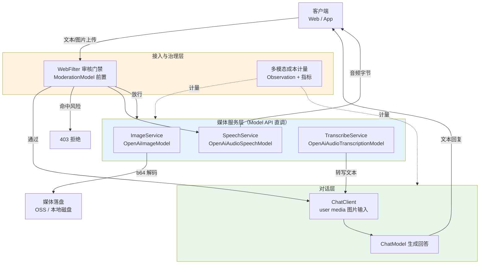
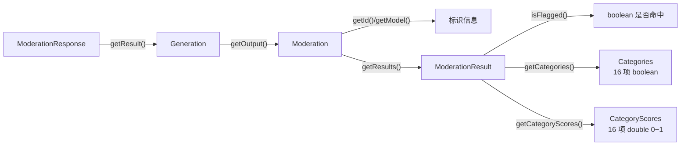

# 11 多模态与媒体能力

> **定位**：讲透 Spring AI 2.0 的四类媒体 API 与一条多模态对话路径——图像生成（`ImageModel`/`ImagePrompt`/`ImageResponse`/`ImageOptions`）、语音合成（`TextToSpeechModel`/`TextToSpeechPrompt`/`TextToSpeechResponse`）、语音转写（`TranscriptionModel`/`AudioTranscriptionPrompt`）、内容审核（`ModerationModel`/`ModerationPrompt`/`ModerationResponse`），以及 `ChatClient` 的 `user(u -> u.media(...))` 图片输入；每个官网样例补全 import、可直接编译，并升级为企业级写法：异步图像生成与落盘、语音问答全链路（转写 → LLM → TTS）、WebFlux 输入审核门禁、多模态成本治理。**所有 API 与默认值均经本地 `spring-ai-openai-2.0.0.jar` 等构件 javap + sources 双重实证**，含两个必知陷阱：TTS `stream()` 是伪流式、图像默认模型已换为 `gpt-image-1-mini`。
>
> **读者画像**：已掌握 ChatClient 对话与流式输出的中高级 Java 开发者；需要为企业系统接入图像生成、语音交互或内容安全门禁的架构师。
>
> **前置阅读**：[00-ChatClient企业级全量样例](00-ChatClient企业级全量样例.md)（ChatClient 基础）、[06-SSE流式通信](06-SSE流式通信.md)（流式与 WebFlux）。多模态 Agent 的编排形态（视觉 Agent、多模态工具链）见 [教程 09-前沿专题/02-多模态Agent开发]；实时语音工程（WebSocket 双向流、VAD、打断）见 [教程 09-前沿专题/12-语音与实时多模态工程]——本文专讲官网 Image/Speech/Transcription/Moderation 四类 API 的工程化全量样例。

---

## 1. 多模态版图：四类媒体 API 与两条交互路径

Spring AI 2.0 的媒体能力分布在三层：抽象接口在 `spring-ai-model` jar（`org.springframework.ai.image`、`org.springframework.ai.audio.tts`、`org.springframework.ai.audio.transcription`、`org.springframework.ai.moderation` 四个包，类清单均已 unzip 定位）；OpenAI 实现在 `spring-ai-openai` jar；自动配置在 `spring-ai-autoconfigure-model-openai` jar。四类能力一览：

| 能力 | 模型接口 | OpenAI 实现 | 输入 | 输出 |
|------|---------|-------------|------|------|
| 图像生成 | `ImageModel.call(ImagePrompt)` | `OpenAiImageModel` | 文本描述 | `Image`（URL 或 b64_json） |
| 语音合成 TTS | `TextToSpeechModel.call(TextToSpeechPrompt)` | `OpenAiAudioSpeechModel` | 文本 | `byte[]`（mp3 等音频） |
| 语音转写 | `TranscriptionModel.call(AudioTranscriptionPrompt)` | `OpenAiAudioTranscriptionModel` | `Resource`（音频文件） | 文本 |
| 内容审核 | `ModerationModel.call(ModerationPrompt)` | `OpenAiModerationModel` | 文本 | 16 类风险标记与分数 |

除这四条"Model API 直调"路径外，还有一条**多模态对话路径**：`ChatClient.prompt().user(u -> u.media(...))` 把图片等媒体塞进 user 消息，交给聊天模型理解——前者是"生成媒体"，后者是"理解媒体"。



依赖说明：四类能力由 `spring-ai-starter-model-openai` 传递引入，**无需新增依赖**；文中所有样例只依赖现有技术栈（Spring Boot 4.1 / Spring AI 2.0.0 / WebFlux / Java 21），例外处均已显式标注「需在 pom.xml 添加依赖」并附完整片段（本文唯一一处是 7.2 节配额示例的 Redis starter，且已标注为概念代码）。

---

## 2. 图像生成：ImageModel 全量样例

### 2.1 核心抽象六件套

`org.springframework.ai.image` 包的类关系（全部 javap 实证）：

| 类 | 角色 | 关键方法/字段 |
|----|------|--------------|
| `ImageModel` | 模型接口 | `ImageResponse call(ImagePrompt)` |
| `ImagePrompt` | 请求 | 构造器 `(String)`、`(String, ImageOptions)`、`(ImageMessage, ImageOptions)`、`(List<ImageMessage>...)` |
| `ImageMessage` | 单条描述 | `(String text)`、`(String text, Float weight)`（weight 供多描述加权） |
| `ImageResponse` | 响应 | `getResults()`/`getResult()`/`getMetadata()` |
| `ImageGeneration` | 单个结果 | `getOutput()` 返回 `Image`、`getMetadata()` |
| `Image` | 图像值对象 | `getUrl()`、`getB64Json()`（注意：带 setter，可变对象） |

`ImageOptions` 接口定义了跨供应商通用的图像参数：`getN()`（张数）、`getModel()`、`getWidth()`/`getHeight()`、`getResponseFormat()`、`getStyle()`。

### 2.2 Bean 装配：自动配置与手动构建

**自动配置路径**：引入 `spring-ai-starter-model-openai` 后，`spring-ai-autoconfigure-model-openai` jar 按 `spring.ai.openai.image.*` 配置键注册 `OpenAiImageModel` Bean，直接注入 `ImageModel` 即可（第 2.2 节末的 application.yml）。

**手动构建路径**（企业级：独立超时/重试/网关地址，与聊天模型分开治理）：`OpenAiImageModel.builder()` 六方法全部实证——`openAiClient(com.openai.client.OpenAIClient)`、`options(OpenAiImageOptions)`、`observationRegistry(ObservationRegistry)`、`httpClientBuilderCustomizer(...)`（单个与 List 两个重载）、`build()`。八种构造器与 Builder 等价，推荐 Builder：

```java
// Spring AI 2.0.0
import io.micrometer.observation.ObservationRegistry;
import org.springframework.ai.openai.OpenAiImageModel;
import org.springframework.ai.openai.OpenAiImageOptions;
import org.springframework.context.annotation.Bean;
import org.springframework.context.annotation.Configuration;
import java.time.Duration;

@Configuration
public class ImageModelConfig {

    @Bean
    public OpenAiImageModel openAiImageModel(ObservationRegistry observationRegistry) {
        return OpenAiImageModel.builder()
                .options(OpenAiImageOptions.builder()
                        .model("gpt-image-1")
                        .responseFormat("b64_json")
                        .build())
                .observationRegistry(observationRegistry) // 接入全局观测体系
                .httpClientBuilderCustomizer(builder -> builder
                        .connectTimeout(Duration.ofSeconds(5))
                        .readTimeout(Duration.ofSeconds(120))) // 图像生成普遍 30s+，读超时放宽
                .build();
    }
}
```

> `httpClientBuilderCustomizer` 的 lambda 参数类型是 `OpenAiHttpClientBuilderCustomizer`（实证类型），其内部操作 OkHttp builder；`readTimeout` 等方法名以该接口实际签名为准，若编译报错请 javap `org.springframework.ai.openai.http.okhttp.OpenAiHttpClientBuilderCustomizer` 后对齐。

`ImageMessage` 的加权构造器 `(String text, Float weight)` 支持"主描述 + 辅助描述"组合（多描述各自加权，供模型综合参考）：

```java
// Spring AI 2.0.0
import org.springframework.ai.image.ImageMessage;
import org.springframework.ai.image.ImagePrompt;
import java.util.List;

ImagePrompt prompt = new ImagePrompt(List.of(
        new ImageMessage("一只在雪山草甸间的柯基犬，逆光", 0.8f),
        new ImageMessage("吉卜力风格水彩插画", 0.4f)));
```

### 2.2 官网最小样例（补全 import 后可直接编译）

```java
// Spring AI 2.0.0
import org.springframework.ai.image.Image;
import org.springframework.ai.image.ImageOptions;
import org.springframework.ai.image.ImagePrompt;
import org.springframework.ai.image.ImageResponse;
import org.springframework.ai.openai.OpenAiImageOptions;

ImageResponse response = imageModel.call(
        new ImagePrompt("A spring meadow in bloom",
                OpenAiImageOptions.builder()
                        .quality("hd")
                        .size("1024x1024")
                        .build()));

String imageUrl = response.getResult().getOutput().getUrl();
```

> `imageModel` 是注入的 `ImageModel` Bean（自动配置已注册，见第 2.4 节配置键）。

### 2.3 OpenAiImageOptions 全参数

Builder 方法全部实证（继承 `AbstractOpenAiOptions$AbstractBuilder`，因此图像选项同时携带 HTTP 客户端级通用参数）：

| 参数 | 类型 | 说明 |
|------|------|------|
| `model(String)` | 模型名 | 默认 `gpt-image-1-mini`（见 2.4 节警示） |
| `n(Integer)` | 生成张数 | |
| `size(String)` | 尺寸串 | 如 `"1024x1024"`（部分模型只接受预设档位） |
| `width(Integer)` / `height(Integer)` | 宽高 | 与 `size` 二选一的编程式表达 |
| `quality(String)` | 质量 | 如 `"hd"` |
| `style(String)` | 风格 | 部分模型支持 `vivid`/`natural` |
| `responseFormat(String)` | 返回形态 | `url` 或 `b64_json` |
| `user(String)` | 终端用户标识 | 供供应商侧滥用追踪，建议传租户/用户 ID |
| 通用：`apiKey/baseUrl/maxRetries/timeout/proxy/customHeaders/organizationId/...` | | 继承自 AbstractBuilder |

### 2.4 版本警示：默认模型是 gpt-image-1-mini

本地 sources jar 实证（`OpenAiImageOptions.java` 第 44 行）：

```java
public static final String DEFAULT_IMAGE_MODEL = ImageModel.GPT_IMAGE_1_MINI.toString();
```

`ImageModel` 是 `com.openai.models.ImageModel` 枚举——**Spring AI 2.0.0 的默认图像模型是 `gpt-image-1-mini`，不是旧资料里的 `dall-e-3`**。两个模型的参数面不同（如 dall-e-3 才有 `style`，gpt-image 系列主要认 `quality`/`size`），照抄旧博客的 options 组合可能直接报参数错。生产上显式声明 `model(...)`，不要吃默认值。

### 2.5 url 与 b64_json 两种返回形态

`OpenAiImageModel.call()` 源码行为（实证）：优先取 `nativeImage.url()`；无 url 则取 `b64Json()`；两者皆空抛 `IllegalArgumentException("Image generation failed: image entry missing url and b64_json")`。响应元数据带创建时间戳：

```java
// Spring AI 2.0.0
import org.springframework.ai.image.ImageResponse;
import org.springframework.ai.openai.metadata.OpenAiImageResponseMetadata;

ImageResponse response = imageModel.call(new ImagePrompt("极简风格的中文书法"福"字"));

// 元数据：OpenAI 实现可安全 instanceof 后取供应商创建时间戳
Long created = response.getMetadata() instanceof OpenAiImageResponseMetadata m
        ? m.getCreated()
        : null;
```

> `OpenAiImageResponseMetadata.from(ImagesResponse)` 的签名已实证，但业务代码无需手动构造——模型内部装配元数据后，`instanceof` 判断即可取 `getCreated()`。**gpt-image 系列默认只返回 b64_json**（无 url），`getUrl()` 可能为 null，落盘时务必走 `getB64Json()` 分支。

### 2.6 企业级：异步生成 + b64 解码落盘

```java
// Spring AI 2.0.0
package com.example.media;

import org.springframework.ai.image.Image;
import org.springframework.ai.image.ImageOptions;
import org.springframework.ai.image.ImagePrompt;
import org.springframework.ai.image.ImageResponse;
import org.springframework.ai.openai.OpenAiImageModel;
import org.springframework.ai.openai.OpenAiImageOptions;
import org.springframework.beans.factory.annotation.Value;
import org.springframework.stereotype.Service;
import reactor.core.publisher.Mono;
import reactor.core.scheduler.Schedulers;
import java.nio.file.Files;
import java.nio.file.Path;
import java.util.Base64;
import java.util.UUID;

@Service
public class ImageGenerationService {

    private final OpenAiImageModel imageModel;
    private final Path storageDir;

    public ImageGenerationService(OpenAiImageModel imageModel,
            @Value("${app.media.storage-dir:/data/media}") String storageDir) throws Exception {
        this.imageModel = imageModel;
        this.storageDir = Path.of(storageDir);
        Files.createDirectories(this.storageDir);
    }

    /** 阻塞的图像生成移出 EventLoop，落盘后仅返回文件名 */
    public Mono<String> generateAndStore(String tenantId, String prompt) {
        return Mono.fromCallable(() -> doGenerate(tenantId, prompt))
                .subscribeOn(Schedulers.boundedElastic());
    }

    private String doGenerate(String tenantId, String prompt) throws Exception {
        ImageResponse response = this.imageModel.call(new ImagePrompt(prompt,
                OpenAiImageOptions.builder()
                        .model("gpt-image-1")
                        .size("1024x1024")
                        .quality("medium")
                        .n(1)
                        .user(tenantId) // 供应商侧滥用追踪
                        .build()));

        Image image = response.getResult().getOutput();
        String fileName = UUID.randomUUID() + ".png";
        Path target = this.storageDir.resolve(fileName);

        byte[] bytes;
        if (image.getB64Json() != null) {
            bytes = Base64.getDecoder().decode(image.getB64Json());
        }
        else if (image.getUrl() != null) {
            // url 形态：由调用方决定是否下载转存（示例保留 url 文件）
            bytes = java.net.URI.create(image.getUrl()).toURL().openStream().readAllBytes();
        }
        else {
            throw new IllegalStateException("Image generation failed: no url and no b64_json");
        }
        Files.write(target, bytes);
        return fileName;
    }
}
```

`ImageModel.call()` 是阻塞 IO——WebFlux 环境下必须 `boundedElastic()` 调度（WebFlux 铁律，呼应 [教程 01-WebFlux与响应式编程]）。`OpenAiImageModel` 内部已包 Observation（`ImageModelObservationDocumentation.IMAGE_MODEL_OPERATION`），接入 [教程 05-Observation可观测] 的链路体系零配置。

---

## 3. 语音合成 TTS：OpenAiAudioSpeechModel 全量样例

### 3.1 抽象层

`org.springframework.ai.audio.tts` 包（实证签名）：

- `TextToSpeechModel`：`byte[] call(String)`（default 便捷方法）+ `TextToSpeechResponse call(TextToSpeechPrompt)`（抽象）；
- `StreamingTextToSpeechModel`：`Flux<TextToSpeechResponse> stream(TextToSpeechPrompt)`（抽象）+ `Flux<byte[]> stream(String)` 等 default；
- `TextToSpeechPrompt`：构造器 `(String)`、`(String, TextToSpeechOptions)`、`(TextToSpeechMessage[, TextToSpeechOptions])`；
- `TextToSpeechResponse.getResult()` 返回 `Speech`，`Speech.getOutput()` 返回 `byte[]`；
- `TextToSpeechOptions` 四参数：`getModel()`、`getVoice()`、`getFormat()`、`getSpeed()`（builder 实证）。

三个入口方法的选择指引：一次性合成整段文本用 `call(String)` 最省事；需要定制 voice/speed/format（或复用 Prompt 对象做审计）走 `call(TextToSpeechPrompt)`；只有当下游接口已经是 `Flux` 形态、为了签名兼容时才用 `stream(...)`——理由见 3.3 节的伪流式陷阱。`TextToSpeechModel` 同时继承了 `StreamingTextToSpeechModel`，所以 `OpenAiAudioSpeechModel` 一个实现类即可按需切换两种形态。

### 3.2 OpenAiAudioSpeechModel 与默认值

`OpenAiAudioSpeechModel` 实现类为 `final`，`builder()`/`mutate()` 齐备（Builder 参数：`openAiClient`、`options`、`httpClientBuilderCustomizer(s)`）。默认值（sources jar 实证）：

| 默认项 | 值 |
|--------|-----|
| `DEFAULT_SPEECH_MODEL` | `"gpt-4o-mini-tts"` |
| `DEFAULT_VOICE` | `Voice.ALLOY` |
| `DEFAULT_RESPONSE_FORMAT` | `AudioResponseFormat.MP3` |
| `DEFAULT_SPEED` | `1.0` |

`Voice` 枚举 11 个值（实证）：`ALLOY`、`ECHO`、`FABLE`、`ONYX`、`NOVA`、`SHIMMER`、`BALLAD`、`SAGE`、`CORAL`、`VERSE`、`ASH`；`AudioResponseFormat` 枚举 6 个值：`MP3`、`OPUS`、`AAC`、`FLAC`、`WAV`、`PCM`。另外源码断言 `Assert.notNull(mergedOptions.getVoice(), "Voice must not be null")`——voice 为空直接抛异常。

官网样例（补全 import）：

```java
// Spring AI 2.0.0
import org.springframework.ai.openai.OpenAiAudioSpeechModel;
import org.springframework.ai.openai.OpenAiAudioSpeechOptions;
import org.springframework.ai.audio.tts.TextToSpeechPrompt;

byte[] audio = speechModel.call("Today is a wonderful day to build something with Spring AI.");

// 带 options 的完整形态
byte[] customAudio = speechModel.call(new TextToSpeechPrompt("今天是用 Spring AI 构建应用的好日子。",
        OpenAiAudioSpeechOptions.builder()
                .voice(OpenAiAudioSpeechOptions.Voice.SAGE)
                .responseFormat(OpenAiAudioSpeechOptions.AudioResponseFormat.WAV)
                .speed(0.9)
                .build()));
```

> `OpenAiAudioSpeechOptions.Voice` / `AudioResponseFormat` 是 Options 类的嵌套枚举（实证存在）；builder 亦接受字符串重载 `voice(String)`/`responseFormat(String)`。

**手动构建与 mutate()**：`builder()` 五方法实证（`openAiClient`/`options`/`httpClientBuilderCustomizer(s)`/`build()`）。`mutate()` 以现有实例为默认派生 Builder——按租户定制语音风格时零成本复制基准配置：

```java
// Spring AI 2.0.0 — 概念代码：基于全局 Bean 派生租户定制模型（VoiceQa 场景）
import org.springframework.ai.openai.OpenAiAudioSpeechModel;
import org.springframework.ai.openai.OpenAiAudioSpeechOptions;

public OpenAiAudioSpeechModel forTenant(OpenAiAudioSpeechModel base, String tenantVoice) {
    return base.mutate()
            .options(OpenAiAudioSpeechOptions.builder()
                    .voice(tenantVoice)
                    .build())
            .build();
}
```

### 3.3 必知陷阱：stream() 是伪流式

`OpenAiAudioSpeechModel.stream(TextToSpeechPrompt)` 签名真实存在、返回 `Flux<TextToSpeechResponse>`——但源码实现（第 167-173 行）逐字读下来只有一行核心逻辑：

```java
@Override
public Flux<TextToSpeechResponse> stream(TextToSpeechPrompt prompt) {
    // 源码注释原文（意译）：OpenAI SDK 的 audio().speech() API 尚不支持流式，
    // 故把全量响应作为单元素 Flux 返回。
    return Flux.just(call(prompt));
}
```

**它只是把全量音频包成单元素 Flux**——调用方感知不到"边合成边播"的流式效果，只是 API 形态上兼容流式接口。如果你的产品需要低首包延迟的语音播报，要么按句子切分后逐句合成（第 7.1 节全链路采用此策略），要么等待上游 SDK 支持后重写。这是"签名存在 ≠ 能力存在"的典型样本，写技术方案时必须向前端/产品讲明。

### 3.4 企业级：语音播报接口

```java
// Spring AI 2.0.0
package com.example.media;

import org.springframework.ai.audio.tts.TextToSpeechPrompt;
import org.springframework.ai.openai.OpenAiAudioSpeechModel;
import org.springframework.ai.openai.OpenAiAudioSpeechOptions;
import org.springframework.http.MediaType;
import org.springframework.http.ResponseEntity;
import org.springframework.web.bind.annotation.GetMapping;
import org.springframework.web.bind.annotation.RequestMapping;
import org.springframework.web.bind.annotation.RequestParam;
import org.springframework.web.bind.annotation.RestController;

@RestController
@RequestMapping("/api/tts")
public class SpeechController {

    private final OpenAiAudioSpeechModel speechModel;

    public SpeechController(OpenAiAudioSpeechModel speechModel) {
        this.speechModel = speechModel;
    }

    @GetMapping
    public ResponseEntity<byte[]> speak(@RequestParam String text,
            @RequestParam(defaultValue = "SAGE") OpenAiAudioSpeechOptions.Voice voice) {
        // call() 是阻塞 HTTP 合成：WebFlux 下交给 boundedElastic
        byte[] audio = reactor.core.publisher.Mono
                .fromCallable(() -> this.speechModel.call(new TextToSpeechPrompt(text,
                        OpenAiAudioSpeechOptions.builder()
                                .voice(voice)
                                .responseFormat(OpenAiAudioSpeechOptions.AudioResponseFormat.MP3)
                                .build())))
                .subscribeOn(reactor.core.scheduler.Schedulers.boundedElastic())
                .block();

        return ResponseEntity.ok()
                .contentType(MediaType.valueOf("audio/mpeg"))
                .body(audio);
    }
}
```

> `block()` 只出现在 Controller 的边界（把 boundedElastic 的结果交给 Servlet 式返回值）。若下游是纯响应式管线，直接返回 `Mono<ResponseEntity<byte[]>>` 链式组装、不要 block（见 [教程 01-WebFlux与响应式编程] 的阻塞边界原则）。

---

## 4. 语音转写：OpenAiAudioTranscriptionModel 全量样例

### 4.1 抽象层与调用形态

`org.springframework.ai.audio.transcription` 包（实证）：

- `TranscriptionModel`：`AudioTranscriptionResponse call(AudioTranscriptionPrompt)`（抽象）+ `String transcribe(Resource)` 与 `String transcribe(Resource, AudioTranscriptionOptions)`（default 便捷方法）；
- `AudioTranscriptionPrompt`：构造器 `(Resource)`、`(Resource, AudioTranscriptionOptions)`——**instructions 直接就是音频 Resource**，无需包 Media；
- `AudioTranscriptionResponse.getResult()` 返回 `AudioTranscription`，其 `getOutput()` 是转写文本。

`OpenAiAudioTranscriptionModel` 源码行为（实证）：把 Resource 读成 `byte[]`，文件名取 `resource.getFilename()`，为 null 时兜底为 `"audio"`——**上传的音频务必带真实文件名（含扩展名），否则供应商可能无法识别格式**。

官网样例（补全 import）：

```java
// Spring AI 2.0.0
import org.springframework.ai.audio.transcription.AudioTranscriptionPrompt;
import org.springframework.ai.audio.transcription.AudioTranscriptionResponse;
import org.springframework.ai.openai.OpenAiAudioTranscriptionModel;
import org.springframework.ai.openai.OpenAiAudioTranscriptionOptions;
import org.springframework.core.io.FileSystemResource;
import org.springframework.core.io.Resource;

Resource audioFile = new FileSystemResource("/data/audio/question-001.mp3");

String text = transcriptionModel.transcribe(audioFile);

// 等价的完整形态（可带 options）
AudioTranscriptionResponse response = transcriptionModel.call(
        new AudioTranscriptionPrompt(audioFile,
                OpenAiAudioTranscriptionOptions.builder()
                        .language("zh")
                        .temperature(0.0f)
                        .build()));
String sameText = response.getResult().getOutput();
```

### 4.2 Options 全参数

`OpenAiAudioTranscriptionOptions.Builder`（实证）：`model(String)`、`responseFormat(com.openai.models.audio.AudioResponseFormat)`、`prompt(String)`（领域词提示，提升专有名词识别率）、`language(String)`（ISO-639-1，如 `zh`）、`temperature(Float)`、`timestampGranularities(List<TranscriptionCreateParams.TimestampGranularity>)`（时间戳粒度）。类常量 `DEFAULT_TRANSCRIPTION_MODEL`（取自 `com.openai.models.audio.AudioModel` 枚举，即 whisper/gpt-4o-transcribe 系）与 `DEFAULT_RESPONSE_FORMAT` 均实证存在。

两个补充实证点：

1. **领域词提示（prompt 参数）**是转写场景性价比最高的优化——把产品名、人名、术语写进 prompt，专有名词识别率显著提升：

```java
// Spring AI 2.0.0
import org.springframework.ai.audio.transcription.AudioTranscriptionPrompt;
import org.springframework.ai.openai.OpenAiAudioTranscriptionOptions;

var options = OpenAiAudioTranscriptionOptions.builder()
        .language("zh")
        // 领域词汇表：提示模型这些词按原样识别
        .prompt("术语表：Spring AI、WebFlux、pgvector、ChatClient")
        .temperature(0.0f)
        .build();
```

2. **元数据对象**：`AudioTranscriptionMetadata` 接口提供 `NULL` 常量与 `create()` 工厂（实证），当前版本是占位实现——转写结果的主要业务载荷就是 `getOutput()` 文本，不要指望从 metadata 里拿语言检测等附加信息。

### 4.3 企业级：REST 上传转写接口

```java
// Spring AI 2.0.0
package com.example.media;

import org.springframework.ai.openai.OpenAiAudioTranscriptionModel;
import org.springframework.ai.openai.OpenAiAudioTranscriptionOptions;
import org.springframework.http.codec.multipart.FilePart;
import org.springframework.web.bind.annotation.PostMapping;
import org.springframework.web.bind.annotation.RequestHeader;
import org.springframework.web.bind.annotation.RequestMapping;
import org.springframework.web.bind.annotation.RequestPart;
import org.springframework.web.bind.annotation.RestController;
import reactor.core.publisher.Mono;
import java.nio.file.Path;

@RestController
@RequestMapping("/api/asr")
public class TranscriptionController {

    private final OpenAiAudioTranscriptionModel transcriptionModel;

    public TranscriptionController(OpenAiAudioTranscriptionModel transcriptionModel) {
        this.transcriptionModel = transcriptionModel;
    }

    public record TranscriptionResult(String text, String fileName) {}

    @PostMapping
    public Mono<TranscriptionResult> transcribe(@RequestPart("file") FilePart filePart,
            @RequestHeader("X-Tenant-Id") String tenantId) {
        // FilePart → 临时文件（转写 API 需要 Resource）
        Path tempFile = null;
        try {
            tempFile = java.nio.file.Files.createTempFile("asr-", "-" + filePart.filename());
        }
        catch (Exception e) {
            return Mono.error(e);
        }
        final Path target = tempFile;

        return filePart.content()
                .map(dataBuffer -> dataBuffer.asByteBuffer())
                .collect(java.util.stream.Collectors.collectingAndThen(
                        java.util.stream.Collectors.toList(),
                        chunks -> {
                            try (var out = java.nio.file.Files.newOutputStream(target)) {
                                for (var chunk : chunks) {
                                    while (chunk.hasRemaining()) {
                                        out.write(chunk.get());
                                    }
                                }
                            }
                            catch (Exception e) {
                                throw new IllegalStateException(e);
                            }
                            return target;
                        }))
                .publishOn(reactor.core.scheduler.Schedulers.boundedElastic())
                .map(path -> {
                    String text = this.transcriptionModel.transcribe(
                            new org.springframework.core.io.FileSystemResource(path),
                            OpenAiAudioTranscriptionOptions.builder()
                                    .language("zh")
                                    .build());
                    try {
                        java.nio.file.Files.deleteIfExists(path);
                    }
                    catch (Exception ignored) {
                        // 清理失败不影响主流程
                    }
                    return new TranscriptionResult(text, filePart.filename());
                });
    }
}
```

> 转写请求携带租户信息（`X-Tenant-Id`）用于审计与配额，但**不进模型参数**——模型侧无租户概念，隔离发生在计量与审计层（第 7.2 节）。

---

## 5. ChatClient 多模态消息：图片输入

### 5.1 PromptUserSpec 的 media 方法

`ChatClient.prompt().user(Consumer<PromptUserSpec>)` 的 spec 接口（`spring-ai-client-chat` jar 实证）：

```java
// Spring AI 2.0.0 — 实证签名（节选）
public interface PromptUserSpec {
    PromptUserSpec text(String text);
    PromptUserSpec text(Resource, Charset);
    PromptUserSpec text(Resource);
    PromptUserSpec param(String key, Object value);
    PromptUserSpec media(Media... media);
    PromptUserSpec media(MimeType mimeType, URL mediaUrl);
    PromptUserSpec media(MimeType mimeType, Resource mediaResource);
    PromptUserSpec metadata(String key, Object value);
}
```

`Media` 值对象在 `spring-ai-commons` jar 的 `org.springframework.ai.content` 包（实证）：构造器 `(MimeType, URI)` / `(MimeType, Resource)`，或 `Media.builder()`（`mimeType`/`data(Resource|Object|URI)`/`id`/`name`/`build`）。MIME 常量可用 Spring 的 `org.springframework.util.MimeTypeUtils`（spring-core 实证含 `IMAGE_PNG`/`IMAGE_JPEG`/`IMAGE_GIF`）；音频 MIME 无现成常量，用 `MimeType.valueOf("audio/mpeg")`。

### 5.2 图片问答（官网样例补全 import）

```java
// Spring AI 2.0.0
import org.springframework.ai.chat.client.ChatClient;
import org.springframework.core.io.ClassPathResource;
import org.springframework.util.MimeTypeUtils;

String answer = chatClient.prompt()
        .user(u -> u.text("这张图片里有什么？请用中文描述。")
                .media(MimeTypeUtils.IMAGE_PNG, new ClassPathResource("/images/spring.png")))
        .call()
        .content();
```

### 5.3 多图与 URL 形态

```java
// Spring AI 2.0.0
import org.springframework.ai.chat.client.ChatClient;
import org.springframework.core.io.FileSystemResource;
import org.springframework.util.MimeType;
import org.springframework.util.MimeTypeUtils;
import java.net.URL;

String diff = chatClient.prompt()
        .user(u -> u.text("对比这两张设计稿的差异。")
                .media(MimeTypeUtils.IMAGE_JPEG, new FileSystemResource("/data/design-a.jpg"))
                .media(MimeTypeUtils.IMAGE_JPEG, new FileSystemResource("/data/design-b.jpg"))
                // 网络图片：media(MimeType, URL) 重载
                .media(MimeType.valueOf("image/webp"),
                        java.net.URI.create("https://example.com/mock.webp").toURL()))
        .call()
        .content();
```

> 图片输入走的是**聊天模型的视觉能力**，与第 2 节的图像生成（`ImageModel`）是两条独立路径：前者"理解媒体"、消耗输入 Token，后者"生成媒体"、按张数/尺寸计费。视觉模型选型与图片 Token 计量见 [教程 09-前沿专题/02-多模态Agent开发 §3]。

### 5.4 企业级安全：URL 形态的风险与资源归属校验

`media(MimeType, URL)` 直连任意外部地址时有两类安全面：

1. **SSRF**：URL 形态的请求由模型供应商侧抓取，看似无内网风险；但若 URL 由用户输入拼接，你的服务可能沦为"帮任何地址生成描述"的代理，且供应商侧抓取的地址会出现在其请求日志里。**对策：URL 只接受自有对象存储的签名地址**（OSS 签名 URL、预注册域名白名单）。
2. **越权读图**：用户 A 把用户 B 的私有图片地址塞进请求即可让模型描述他人图片。**对策：媒体归属校验前置于 ChatClient 调用**——按资源 ID 反查归属租户后再放行：

```java
// Spring AI 2.0.0 — 概念代码：归属校验 + 白名单化媒体引用
import org.springframework.ai.chat.client.ChatClient;
import org.springframework.core.io.Resource;
import org.springframework.util.MimeTypeUtils;

public String describeOwnImage(String tenantId, String imageId, MediaStore mediaStore,
        ChatClient chatClient) {
    Resource image = mediaStore.loadForTenant(tenantId, imageId); // 归属不符时抛出 404/403
    return chatClient.prompt()
            .user(u -> u.text("描述这张图片的内容要点。")
                    .media(MimeTypeUtils.IMAGE_PNG, image))
            .call()
            .content();
}
```

`Media.builder()`（`mimeType`/`data(Resource|Object|URI)`/`id`/`name`/`build` 全部实证）适合媒体对象需要携带业务标识的场景：`.id(imageId).name(fileName)` 写入后随消息传递，便于审计串联。两种构造方式等价，团队内统一其一即可——构造器两参数写法更短，builder 可读性更好且便于扩展 id/name。

---

## 6. 内容审核：OpenAiModerationModel 全量样例

### 6.1 响应结构：五层嵌套

`ModerationResponse` 的内部结构（全部实证）：



`Categories` 与 `CategoryScores` 的 16 项判定一一对应（方法名全部实证）：

| 类别（Categories 布尔 / CategoryScores 分数） | 语义 |
|---------------------------------------------|------|
| `isSexual` / `getSexual` | 色情内容 |
| `isHate` / `getHate` | 仇恨言论 |
| `isHarassment` / `getHarassment` | 骚扰 |
| `isSelfHarm` / `getSelfHarm` | 自残 |
| `isSexualMinors` / `getSexualMinors` | 未成年人性内容 |
| `isHateThreatening` / `getHateThreatening` | 威胁性仇恨 |
| `isViolenceGraphic` / `getViolenceGraphic` | 血腥暴力 |
| `isSelfHarmIntent` / `getSelfHarmIntent` | 自残意图 |
| `isSelfHarmInstructions` / `getSelfHarmInstructions` | 自残教唆 |
| `isHarassmentThreatening` / `getHarassmentThreatening` | 威胁性骚扰 |
| `isViolence` / `getViolence` | 暴力 |
| `isDangerousAndCriminalContent` / `getDangerousAndCriminalContent` | 危险与犯罪内容 |
| `isHealth` / `getHealth` | 健康相关（omni 系新增） |
| `isFinancial` / `getFinancial` | 金融相关 |
| `isLaw` / `getLaw` | 法律相关 |
| `isPii` / `getPii` | 个人身份信息（PII） |

`OpenAiModerationModel` 源码用 `Categories.builder()...` 逐项映射原生响应并 `flagged(result.flagged())`。分数是 0~1 的置信度，**boolean 的 `flagged` 是供应商按内部阈值打的标**——企业门禁建议自建阈值（如任一分数 > 0.5 即拦），对误杀/漏杀有更强的控制权。

### 6.2 官网样例（补全 import）

```java
// Spring AI 2.0.0
import org.springframework.ai.moderation.ModerationPrompt;
import org.springframework.ai.moderation.ModerationResponse;
import org.springframework.ai.openai.OpenAiModerationModel;

ModerationResponse response = moderationModel.call(
        new ModerationPrompt("I want to hurt someone."));

var result = response.getResult().getOutput().getResults().get(0);
boolean flagged = result.isFlagged();
double hateScore = result.getCategoryScores().getHate();
```

> 默认模型实证为 `"omni-moderation-latest"`（`OpenAiModerationOptions.DEFAULT_MODERATION_MODEL`）。`OpenAiModerationOptions.Builder` 自身只有 `from`/`merge`/`build`，`model(...)` 等继承自 AbstractBuilder——想覆盖模型写 `OpenAiModerationOptions.builder().model("omni-moderation-latest").build()`。

### 6.3 企业级：WebFlux 输入审核门禁

把审核前置到 WebFilter，命中即 403，不进业务链路：

```java
// Spring AI 2.0.0
package com.example.media;

import org.springframework.ai.moderation.ModerationPrompt;
import org.springframework.ai.openai.OpenAiModerationModel;
import org.springframework.core.Ordered;
import org.springframework.http.HttpStatus;
import org.springframework.stereotype.Component;
import org.springframework.web.server.ServerWebExchange;
import org.springframework.web.server.WebFilter;
import org.springframework.web.server.WebFilterChain;
import reactor.core.publisher.Mono;
import reactor.core.scheduler.Schedulers;

@Component
public class ModerationGateFilter implements WebFilter, Ordered {

    private final OpenAiModerationModel moderationModel;

    public ModerationGateFilter(OpenAiModerationModel moderationModel) {
        this.moderationModel = moderationModel;
    }

    @Override
    public Mono<Void> filter(ServerWebExchange exchange, WebFilterChain chain) {
        String path = exchange.getRequest().getPath().value();
        // 只拦截对话/媒体入口；管理面与静态资源放行
        if (!path.startsWith("/api/qa") && !path.startsWith("/api/tts")) {
            return chain.filter(exchange);
        }
        String text = exchange.getRequest().getHeaders().getFirst("X-User-Text");
        if (text == null || text.isBlank()) {
            return chain.filter(exchange);
        }
        return Mono.fromCallable(() -> this.moderationModel.call(new ModerationPrompt(text)))
                .subscribeOn(Schedulers.boundedElastic())
                .flatMap(response -> {
                    var result = response.getResult().getOutput().getResults().get(0);
                    if (result.isFlagged()) {
                        exchange.getResponse().setStatusCode(HttpStatus.FORBIDDEN);
                        return exchange.getResponse().setComplete();
                    }
                    return chain.filter(exchange);
                });
    }

    @Override
    public int getOrder() {
        return -100; // 早于业务过滤器
    }
}
```

**门禁设计三要点**：① Moderation 是阻塞调用，必须 `boundedElastic`；② `getOrder()` 给负值确保先于鉴权/业务过滤器；③ 门禁拦截的是"文本输入"，图片输入的审核需在媒体服务内部二次把关（视觉审核模型各有实现，此处不展开）。误杀治理（分数阈值而非 boolean、申诉回流）见 [教程 08-架构师进阶/09-Agent治理与合规框架 §4]。

**分级拦截策略**：全量拦截（`isFlagged()` 直接 403）只适合强合规场景；一般业务建议按类别分级——高危类（`sexualMinors`、`selfHarmInstructions`、`dangerousAndCriminalContent`）零容忍硬拦，中危类按分数阈值软拦并转人工复核，低危类（如 `health`/`law`/`financial` 这些 omni 系新增的"敏感话题"标记）仅记录不拦截。分级名单与阈值放进配置中心，随误杀反馈滚动调整，而不是硬编码在过滤器里。

---

## 7. 企业级综合：语音问答全链路与成本治理

### 7.1 语音输入 → LLM → 语音输出全链路

把转写、对话、TTS 串成一条链。**关键决策：TTS 伪流式下，按句子切分逐段合成**，让首段音频尽早返回：

```java
// Spring AI 2.0.0
package com.example.media;

import org.springframework.ai.chat.client.ChatClient;
import org.springframework.ai.openai.OpenAiAudioSpeechModel;
import org.springframework.ai.openai.OpenAiAudioSpeechOptions;
import org.springframework.ai.openai.OpenAiAudioTranscriptionModel;
import org.springframework.core.io.FileSystemResource;
import org.springframework.stereotype.Service;
import reactor.core.publisher.Flux;
import reactor.core.publisher.Mono;
import reactor.core.scheduler.Schedulers;
import java.util.ArrayList;
import java.util.List;

@Service
public class VoiceQaService {

    private final OpenAiAudioTranscriptionModel transcriptionModel;
    private final OpenAiAudioSpeechModel speechModel;
    private final ChatClient chatClient;

    public VoiceQaService(OpenAiAudioTranscriptionModel transcriptionModel,
            OpenAiAudioSpeechModel speechModel, ChatClient.Builder chatClientBuilder) {
        this.transcriptionModel = transcriptionModel;
        this.speechModel = speechModel;
        this.chatClient = chatClientBuilder.build();
    }

    /** 音频文件 → 转写 → LLM 回答 → 按句切段逐段 TTS，输出音频分段 */
    public Flux<byte[]> ask(byte[] audioBytes, String fileName) {
        return Mono.fromCallable(() ->
                        this.transcriptionModel.transcribe(new FileSystemResource(toTemp(audioBytes, fileName))))
                .subscribeOn(Schedulers.boundedElastic())
                .flatMapMany(question -> {
                    // 1) 文本问答（响应式，首 Token 低延迟）
                    Flux<String> textStream = this.chatClient.prompt()
                            .user(question)
                            .stream()
                            .content();

                    // 2) 收集完整回答后按句切分（中文句末标点）
                    Mono<List<String>> sentences = textStream
                            .collectList()
                            .map(parts -> splitSentences(String.join("", parts)));

                    // 3) 逐段合成音频（伪流式下这是首包延迟的最优解）
                    return sentences.flatMapMany(Flux::fromIterable)
                            .concatMap(sentence -> Mono.fromCallable(() ->
                                            this.speechModel.call(new TextToSpeechPrompt(sentence,
                                                    OpenAiAudioSpeechOptions.builder()
                                                            .voice(OpenAiAudioSpeechOptions.Voice.ALLOY)
                                                            .responseFormat(OpenAiAudioSpeechOptions.AudioResponseFormat.MP3)
                                                            .build())))
                                    .subscribeOn(Schedulers.boundedElastic()));
                });
    }

    private List<String> splitSentences(String text) {
        List<String> sentences = new ArrayList<>();
        int start = 0;
        for (int i = 0; i < text.length(); i++) {
            char c = text.charAt(i);
            if (c == '。' || c == '！' || c == '？' || c == '；' || c == '\n') {
                if (i + 1 > start) {
                    sentences.add(text.substring(start, i + 1));
                }
                start = i + 1;
            }
        }
        if (start < text.length()) {
            sentences.add(text.substring(start));
        }
        return sentences.stream().filter(s -> !s.isBlank()).toList();
    }

    private String toTemp(byte[] bytes, String fileName) throws Exception {
        String safeName = fileName == null ? "audio.mp3" : fileName;
        var path = java.nio.file.Files.createTempFile("voice-", "-" + safeName);
        java.nio.file.Files.write(path, bytes);
        return path.toString();
    }
}
```

> `concatMap` 保证音频段按序下发；若想并行合成再重排，需要缓存与序号管理，复杂度陡增——**先串行保序，实测延迟不达标再优化**。

```mermaid
sequenceDiagram
    participant U as 客户端
    participant V as VoiceQaService
    participant ASR as OpenAiAudioTranscriptionModel
    participant L as ChatClient/LLM
    participant T as OpenAiAudioSpeechModel

    U->>V: 上传语音（byte[] + 文件名）
    V->>ASR: transcribe(Resource)（boundedElastic）
    ASR-->>V: 问题文本
    V->>L: prompt(question).stream()
    L-->>V: 回答文本流
    Note over V: 收集完整回答 → 按句切分
    loop 每个句子（concatMap 保序）
        V->>T: call(TextToSpeechPrompt)（boundedElastic）
        T-->>V: 该句 MP3 byte[]
    end
    V-->>U: Flux&lt;byte[]&gt; 音频分段（SSE/分片下发）
```

### 7.2 多模态成本治理

**Observation 集成**：`OpenAiImageModel` 内部以 `ImageModelObservationDocumentation.IMAGE_MODEL_OPERATION` 包裹 `call()`（源码实证），注入 `ObservationRegistry` 后图像生成自动进入 [教程 05-Observation可观测] 的链路体系；`OpenAiAudioSpeechModel`/`OpenAiAudioTranscriptionModel`/`OpenAiModerationModel` 的 builder 均有 `httpClientBuilderCustomizer` 而无独立 ObservationRegistry 参数（实证），其请求级观测依赖 Micrometer 的 HTTP 客户端指标（`connection-pool-metrics-enabled` 配置键实证存在，默认 false）。**治理指标的口径因此分两层**：图像有原生 observation span，语音三件套靠连接池指标 + 业务侧埋点补齐。

四类能力的计量维度各不相同，治理要点（体系化方案见 [教程 04-企业级架构主干]）：

| 能力 | 计量维度 | 治理手段 |
|------|---------|---------|
| 图像生成 | 张数 × 尺寸 × 质量（gpt-image 系按档位计费，非 Token） | 每租户日配额（Redis 计数）、`n` 与 `size` 白名单 |
| TTS | 输入字符数（按模型计价）+ 音频时长 | 文本长度上限、voice/format 不影响价格则锁定默认 |
| 转写 | 音频时长（分钟） | 上传文件时长/大小上限、`language` 固定降低重试 |
| 审核门禁 | 文本长度（廉价，但量大） | 豁免静态资源路径、缓存重复文本判定 |
| 图片输入对话 | 图片 Token（分辨率折算） | 请求前压缩/缩放，限制多图张数 |

配额门卫的最小实现（与第 6.3 节 WebFilter 同构，此处给核心逻辑）：

```java
// Spring AI 2.0.0 — 概念代码：租户级图像配额（Redis 计数，需引入 spring-boot-starter-data-redis-reactive）
import reactor.core.publisher.Mono;

public Mono<Boolean> tryAcquireImageQuota(String tenantId) {
    String key = "quota:image:" + tenantId + ":" + java.time.LocalDate.now();
    return this.reactiveRedisTemplate.opsForValue()
            .increment(key)
            .flatMap(count -> {
                if (count == 1) {
                    // 当日首张：设置过期，天然按天滚动
                    return this.reactiveRedisTemplate.expire(key, java.time.Duration.ofHours(48))
                            .thenReturn(true);
                }
                return Mono.just(count <= this.dailyImageLimit);
            });
}
```

自动配置键（全部自 `spring-configuration-metadata.json` 实证，前缀 `spring.ai.openai`；超时/重试默认值同源：`max-retries` 默认 3、`timeout` 默认 60s）：

| 配置组 | 业务键 |
|--------|--------|
| `image.*` | `model`、`n`、`size`、`width`、`height`、`quality`、`style`、`response-format`、`user` |
| `audio.speech.*` | `model`、`voice`、`response-format`、`speed`、`input` |
| `audio.transcription.*` | `model`、`language`、`prompt`、`response-format`、`temperature`、`timestamp-granularities` |
| `moderation.*` | `model` |
| 四组通用 | `api-key`、`base-url`、`credential`、`deployment-name`、`microsoft-deployment-name`、`organization-id`、`proxy`、`custom-headers`、`max-retries`、`timeout`、`git-hub-models` 等 |

application.yml 示例：

```yaml
spring:
  ai:
    openai:
      api-key: ${OPENAI_API_KEY}
      image:
        model: gpt-image-1
        size: 1024x1024
        response-format: b64_json
      audio:
        speech:
          model: gpt-4o-mini-tts
          voice: alloy
          response-format: mp3
          speed: 1.0
        transcription:
          language: zh
          model: gpt-4o-mini-transcribe
      moderation:
        model: omni-moderation-latest
```

> `gpt-4o-mini-transcribe` 为写示例而填的模型名——`DEFAULT_TRANSCRIPTION_MODEL` 常量取自 `com.openai.models.audio.AudioModel` 枚举（字节码实证其经 `asString()` 初始化，字面值需运行期打印确认），显式配置前建议先打印默认值核对。

---

## 8. 总结

Spring AI 2.0 的媒体能力是"**抽象接口 + OpenAI 实现 + 自动配置**"的三层结构：图像生成走 `ImageModel.call(ImagePrompt)`（默认 `gpt-image-1-mini`，gpt-image 系列默认 b64_json、按张数与档位计费）；语音合成走 `TextToSpeechModel`（默认 `gpt-4o-mini-tts` + alloy + mp3，`stream()` 是 `Flux.just(call(prompt))` 的伪流式）；语音转写走 `TranscriptionModel.transcribe(Resource)`（文件名决定格式识别，instructions 直接是 Resource）；内容审核走 `ModerationModel`（默认 `omni-moderation-latest`，响应五层嵌套出 16 类风险标记与分数）；图片理解则走 `ChatClient.user(u -> u.media(...))` 的多模态消息路径。工程上的三条铁律：**媒体 API 都是阻塞 IO，WebFlux 下必须 boundedElastic**；**签名存在不等于能力存在**（TTS 伪流式需按句切段绕过）；**默认值随版本漂移**（图像模型已非 dall-e-3），显式声明优于吃默认。

**核心要点回顾**：

1. 四类 Model API 的请求/响应类型与 OpenAI 实现类对照表；
2. `OpenAiImageOptions` 全参数与 url/b64_json 双形态处理（企业级落盘样例）；
3. TTS 默认值四件套、Voice 11 枚举、AudioResponseFormat 6 枚举与伪流式陷阱；
4. 转写的 `transcribe(Resource)` 便捷方法与 filename 兜底行为；
5. `PromptUserSpec.media` 三重载与 `Media`（commons jar）构造方式、URL 形态的安全面；
6. Moderation 响应五层结构、16 类风险清单与 WebFilter 门禁（自建阈值优于吃 boolean）；
7. 语音问答全链路（按句切段绕过伪流式）、多模态配额与双层观测口径。

## 适用场景与不适用场景

**适用场景**：

- 内容平台的安全合规门禁（Moderation 前置 WebFilter）；
- 知识库/教育的语音问答与播报（转写 + LLM + TTS 全链路）；
- 营销素材、配图、插画的批量生成（异步生成 + 落盘 + 配额）；
- 单图/多图理解类问答（ChatClient media 路径）；
- 需要统一 Observation 链路的媒体微服务（四类能力均内置 Observation）。

**不适用场景**：

- **实时语音对话**（亚秒级首包、可打断）——本套 API 是"整进整出"的 HTTP 合成/转写，实时场景需 WebSocket 双向流方案（见 [教程 09-前沿专题/12-语音与实时多模态工程]）；
- **视频生成/视频理解**——Spring AI 2.0 官方 API 未覆盖；
- **低延迟流式 TTS**——SDK 不支持真流式（源码注释实证），按句切分只是缓解；
- **图像精确编辑**（局部重绘、蒙版修复）——`ImageModel` 只暴露生成语义，编辑类需求需原生 SDK 直调（标注概念方案，未实证）。
