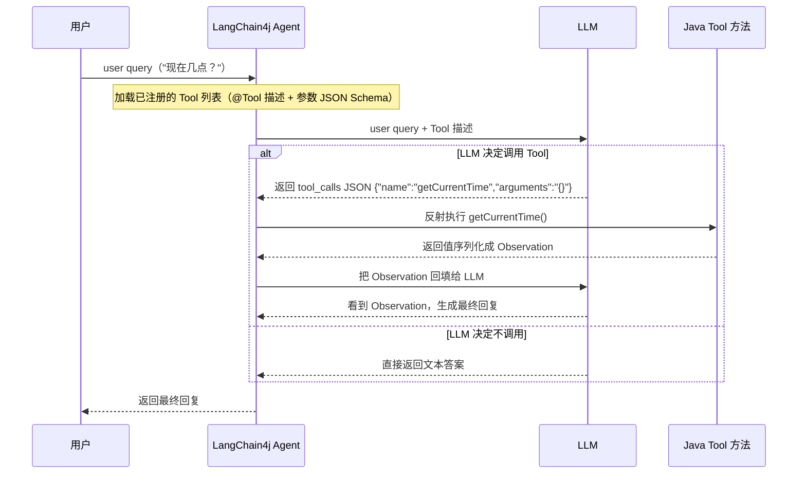
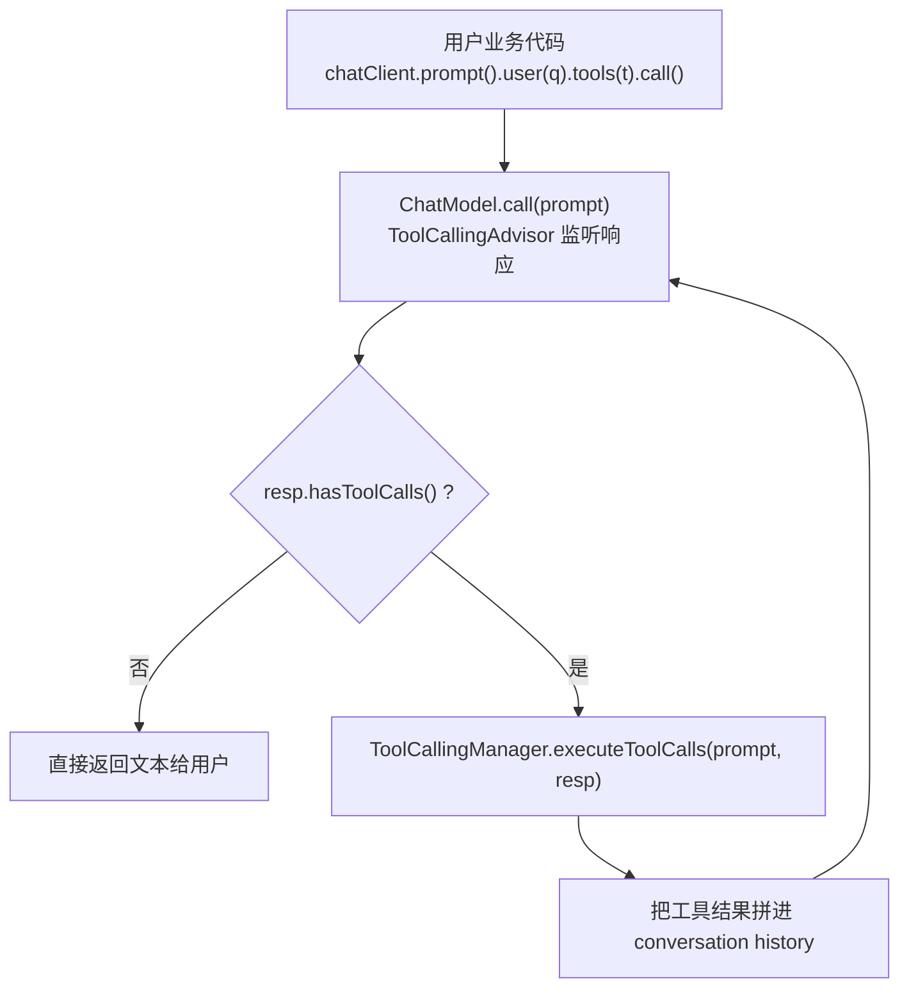
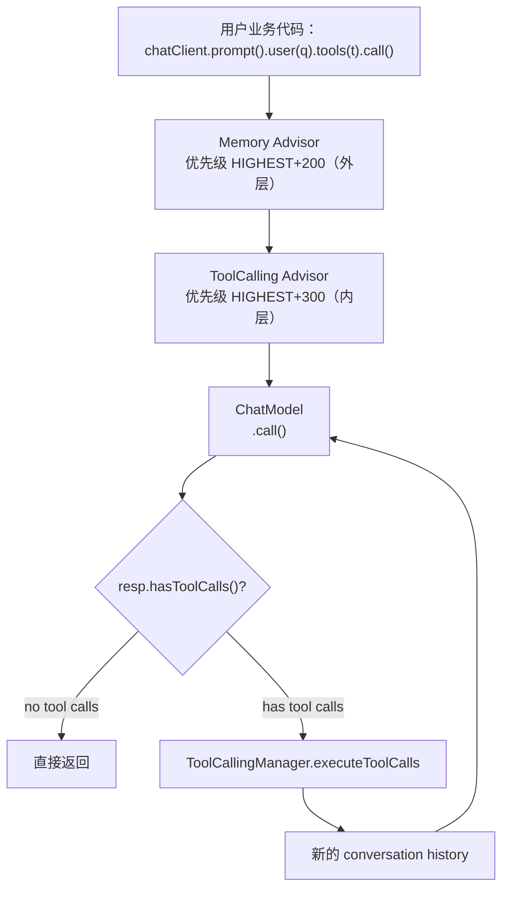
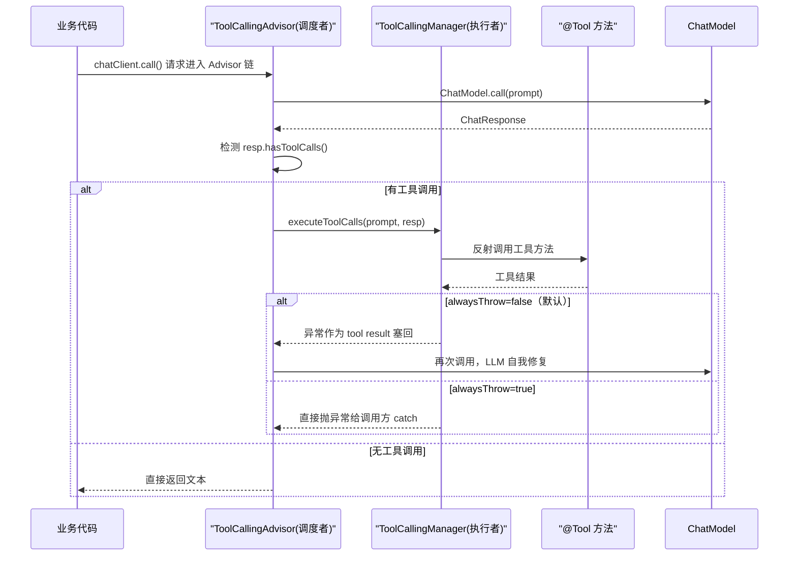
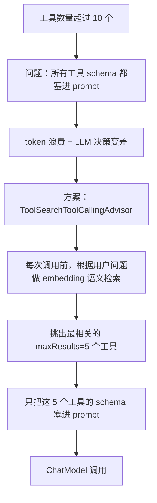
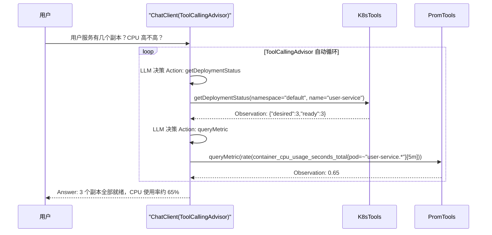
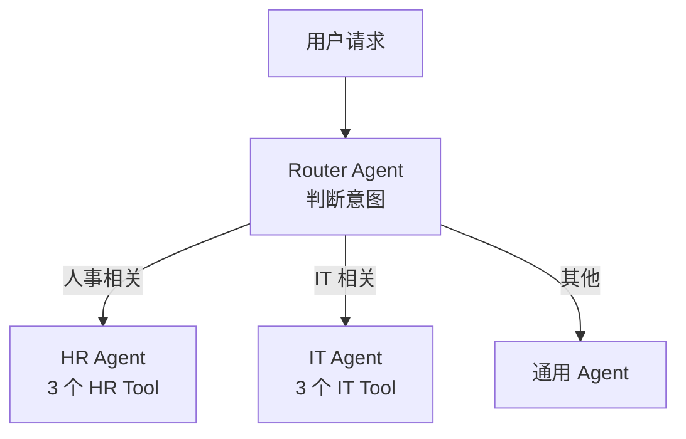
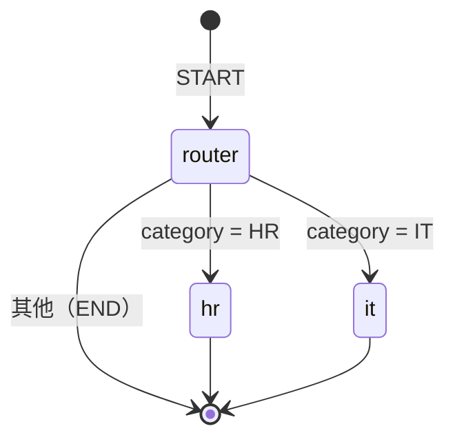
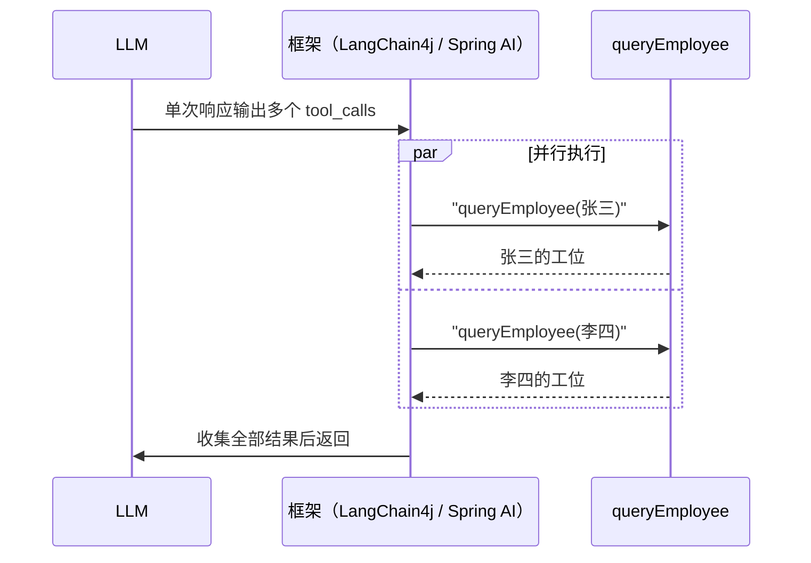

# L2 初级 - ToolCallingAdvisor 深入（Tool 完整章节）

> 把 L1 提到的 `ToolCallingAdvisor` 彻底吃透。本文是 Agent 应用的基石。
>
> 前提：你已跑通一个最小 Spring AI 2.0 项目，见过 `ToolCallingAdvisor` 的默认自动注册（即 01 的能力）。
> 预计：1 天（含前置设计与多 Tool 编排两部分）

---

> 📖 **本小节已做内容融合**（源文档已归档至 `../archive/absorbed-内容融合/`）：
> - 吸收 `入门-LangChain4j-03-Tool调用` → **0B 理解本质（LangChain4j 入门视角）**
> - 吸收 `进阶-Agent-01-Tool设计原则` → **0A Tool 设计原则**
> - 吸收 `进阶-Agent-03-多Tool编排` → **14 多 Tool 编排**
>
> 完整阅读顺序：**Tool 设计原则（0A）→ 基础调用与本质（0B）→ Spring AI 2.0 实现与 AgentLoop（1-13）→ 多 Tool 编排（14）**。

## 0A. Tool 设计原则（吸收自 进阶-Agent-01）

> 先把"怎么把 Tool 写好"的原则讲透。代码用 Spring AI 2.0 的 `@Tool` / `@ToolParam` 风格；LangChain4j 原理一致（见 0B）。

### 为什么 Tool 设计是核心

Tool 写出来不难，**写好很难**——一个 Agent 的好坏，80% 取决于 Tool 设计。

**坏设计**：一个 Tool 干所有事，参数一堆占位符。

```java
@Tool("查询")
public Object query(String type, String param1, String param2, String param3) {
    // 一个 Tool 干所有事
}
```

LLM 表现：不知道何时调用、不知道填什么参数、经常调错。

**好设计**：每个 Tool 单一职责、描述清晰。

```java
@Tool("根据员工姓名查询工号")
public EmployeeInfo queryEmployeeByName(@ToolParam("中文全名") String fullName) { ... }

@Tool("根据工号查询工位")
public String queryWorkstation(@ToolParam("6位工号") String employeeId) { ... }
```

LLM 表现：调用准确率 90%+，参数填对率 95%+。

> **核心结论：Tool 描述是给 LLM 看的"接口契约"。** 写得像优秀 PR 文档，LLM 就聪明；写得像草稿，LLM 就智障。

### 五件事 / 五条铁律

**铁律 1：单一职责**——一个 Tool 只做一件事。

```java
// ❌ 反例：switch 管理查询/创建/删除，LLM 困惑（何时用？怎么填 action？）
@Tool("员工管理")
public Object manageEmployee(String action, String name, String dept, ...) { switch (action) { ... } }

// ✅ 正例：拆成三个
@Tool("根据姓名查询员工")
public EmployeeInfo queryByName(@ToolParam("姓名") String name) { ... }
@Tool("创建员工")
public EmployeeInfo create(@ToolParam("姓名") String name, @ToolParam("部门") String dept) { ... }
@Tool("删除员工")
public void delete(@ToolParam("工号") String id) { ... }
```

**铁律 2：描述回答"三个问题"**——做什么？什么场景下用？返回什么？

```java
@Tool("""
    根据员工姓名查询其工号、部门、入职日期。
    使用场景：用户询问某员工的基础信息、想找人、需要工号时。
    返回：EmployeeInfo 对象（含 id、name、department、hireDate）
    """)
```

**铁律 3：参数描述要具体到格式**——写明格式、给出示例、说明约束。

```java
@Tool("查询指定日期的天气")
public Weather getWeather(
    @ToolParam("城市名，中文，如 '北京'、'上海'") String city,
    @ToolParam("日期，格式 yyyy-MM-dd，如 '2026-07-12'") String date
) { ... }
```

**铁律 4：参数类型用基本类型**——LLM 填嵌套对象的成功率很低。

| 类型 | 推荐度 |
|------|--------|
| `String` / `int` / `long` / `double` / `boolean` | ⭐⭐⭐⭐⭐ |
| `enum` | ⭐⭐⭐⭐ |
| `List<String>` | ⭐⭐⭐ |
| 自定义嵌套对象 | ⭐ 不推荐 |

必须传复杂结构时，用 **JSON 字符串 + 内部解析**：

```java
@Tool("创建订单，参数是 JSON：{\"product\":\"\",\"qty\":1,\"address\":\"\"}")
public Order createOrder(@ToolParam("JSON 格式订单数据") String orderJson) {
    OrderSpec spec = objectMapper.readValue(orderJson, OrderSpec.class);
    return orderService.create(spec);
}
```

**铁律 5：返回值要"自描述"**——LLM 看到返回值要能直接理解。

```java
// ❌ "10086" 不知道是什么
@Tool("查询订单")
public String queryOrder(String id) { return "10086"; }

// ✅ record 字段名自带语义
@Tool("查询订单")
public OrderInfo queryOrder(@ToolParam("订单号") String id) {
    return new OrderInfo(id, "iPhone 15", 1, 5999.0, "已发货");
}
public record OrderInfo(String orderId, String product, int quantity, double totalPrice, String status) {}
```

### 命名规范

方法名用**动词开头**（`query` / `create` / `update` / `delete` / `send` / `generate`），避免缩写（`getEmpInfo` ❌ → `getEmployeeInfo` ✅）、避免单字母（`q` ❌ → `query` ✅）。参数名要语义化——LLM 不只看到 `@ToolParam` 描述，还会看到方法签名本身。

### 错误处理三策略

1. **抛异常（让 LLM 自己决策）**：适用偶发错误、外部依赖失败、需要 LLM 重试。
2. **返回错误信息（让 LLM 告知用户）**：适用业务校验失败、用户输入错误。
3. **返回空值/默认值（隐藏错误）**：适用非关键 Tool、可降级场景。

错误信息要**引导 LLM 下一步**，而不是 `throw new RuntimeException("error")`：

```java
throw new RuntimeException(
    "工号格式错误，应为 6 位数字。当前输入: '" + id + "'。请重新询问用户工号。"
);
```

> 对照 §4.2：Spring AI 层面的 `alwaysThrow` 决定工具方法抛出的异常是"塞回 LLM 自我修复"还是"直接抛给调用方 catch"——与本节是同一设计思路的两层落地。

### 幂等性

Agent 可能重复调用同一 Tool（如 LLM 不确定结果时）。查询天然幂等；创建/更新/删除要考虑幂等（创建传 `requestId` 重复检查、更新用乐观锁、删除先查再删）。

```java
@Tool("创建订单")
public Order createOrder(
    @ToolParam("订单内容") String product,
    @ToolParam("客户端生成的 requestId，防止重复创建") String requestId
) {
    if (orderRepo.existsByRequestId(requestId)) return orderRepo.findByRequestId(requestId);
    return orderRepo.create(product, requestId);
}
```

### 性能优化

LLM 调 Tool 是**同步阻塞**的（在 Agent 循环里），Tool 慢 = 整个 Agent 慢。目标：Tool 内部操作 < 2 秒。手段：查询类加缓存（Caffeine）、数据库加索引、批量返回、长任务返回 taskId 异步查询。外部调用加超时：

```java
@Tool("查询天气")
public Weather getWeather(String city) {
    return weatherApi.get(city).timeout(Duration.ofSeconds(5)).block();
}
```

### 描述的"打磨"工作流

第一遍凭直觉写 → 跑 20 条测试集 → 按失败案例迭代（调错 Tool → 描述不够差异化；参数填错 → 参数描述不清晰；该调不调 → 没说清"何时使用"）→ 定稿：

```java
// V1: 60% 准确率
@Tool("查询天气")
// V2: 80% 准确率
@Tool("根据城市名查询天气。返回温度、湿度、天气情况")
// V3: 95% 准确率
@Tool("""
    根据城市名查询当前天气。
    使用场景：用户问'天气'、'温度'、'下雨吗'、'穿什么'等。
    不适用：用户问历史天气（用 queryHistoricalWeather）。
    返回：{ temperature: 度数, humidity: 百分比, condition: 描述 }
    """)
```

### 反模式速查

| 反模式 | 表现 | 改进 |
|--------|------|------|
| 一个 Tool 干多事 | `query(type, ...)` | 拆成多个 Tool |
| 描述含糊 | "查询" | 写清"查什么、何时用、返回什么" |
| 参数无格式 | `String date` | `yyyy-MM-dd 格式` |
| 嵌套对象参数 | `UserDTO user` | 拆成扁平字段 |
| 返回值无字段名 | 返回 `String` | 返回 record/POJO |
| 不处理异常 | 抛 `Exception` | 抛带提示的运行时异常 |
| 同步阻塞慢操作 | 数据库全表扫 | 加索引 + 缓存 |
| 工具过多 | 20+ 个工具 | 语义检索（§7）或分组路由（§14） |

## 0B. 理解本质：LangChain4j 入门视角（吸收自 入门-LangChain4j-03）

> 用最朴素的方式回答"Tool 调用到底在做什么"。代码是 LangChain4j（`dev.langchain4j`）的，概念与 Spring AI 2.0 一一对应——理解了它，后面 §1-§13 的 2.0 实现只是换了个壳。

### LLM 的三个硬伤与一句话定义

| 硬伤 | 表现 | Tool 怎么解决 |
|------|------|------------|
| 知识截止 | 不知道今天日期 | 写个 `getCurrentTime()` 工具 |
| 不会算术 | 算 1234 × 5678 大概率出错 | 写个 `calculator()` 工具 |
| 不能访问外部系统 | 不能查数据库 / 调 API | 写个 `queryDatabase()` 工具 |

> Tool 就是一个**带描述的 Java 方法**。LLM 看到描述，决定是否调用；调用时输出 JSON，Java 反射执行。

### Function Calling 协议（必懂）

**LLM 不直接执行你的 Java 代码**。它只是输出"我想调 X 工具，参数是 Y"的 JSON，由 Java 端反射执行后把结果回传——这就是为什么叫 Function "Calling" 而非 "Execution"。



对照 §1.2：Spring AI 2.0 把这个协议做进了 `ToolCallingAdvisor`，业务代码一行搞定。

### 第一个 Tool（LangChain4j）

```java
import dev.langchain4j.agent.tool.Tool;
import dev.langchain4j.agent.tool.P;

public class TimeTools {
    @Tool("获取当前系统时间，格式 yyyy-MM-dd HH:mm:ss")
    public String getCurrentTime() {
        return LocalDateTime.now().format(DateTimeFormatter.ISO_LOCAL_DATE_TIME);
    }
}
```

- `@Tool("描述")` 的描述是给 LLM 看的，决定它何时调用，写得好不好直接影响调用准确率（详见 0A）。
- `@P("参数描述")` 给参数加描述，对应 Spring AI 的 `@ToolParam`。
- 方法可以是任意返回值（String / 自定义对象 / int），框架会序列化成 JSON 给 LLM。

### 带参数的 Tool（LangChain4j）

```java
public class CalculatorTools {
    @Tool("两个整数相加")
    public int add(@P("第一个数") int a, @P("第二个数") int b) { return a + b; }
    @Tool("两个整数相乘")
    public int multiply(@P("第一个数") int a, @P("第二个数") int b) { return a * b; }
}
```

问"1234 乘以 5678"时 LLM 内部：分析意图 → 选 `multiply` → 提取参数 `a=1234, b=5678` → 输出 `{"name":"multiply","arguments":{"a":1234,"b":5678}}` → Java 反射执行返回 `7006652` → LLM 生成最终回复。**Tool 调用建议低温度**（如 `temperature(0.0)`），减少乱决策。

### 串联调用：Agent 的本质

LLM 自己"想一步、调一步"，把多个工具串起来完成任务：

```
用户：张三工位在几楼？
LLM 推理：
  Thought: 我需要先查张三的工号
  Action: queryEmployee(name="张三")        → Observation: {"id":"10086","name":"张三","dept":"研发"}
  Thought: 现在用 10086 查工位
  Action: queryWorkstation(employeeId="10086") → Observation: 5 楼 A 区 03 工位
  Final Answer: 张三在 5 楼 A 区 03 工位
```

**这就是 Agent 的本质**——LLM 自主决策、串联多个工具完成任务。Spring AI 2.0 里这个循环由 `ToolCallingAdvisor` 自动完成（§1、§9.3、§14.6）。

### 调试技巧：观察 LLM 决策

开启请求/响应日志（LangChain4j `logRequests(true)` / `logResponses(true)`；Spring AI 对应 `spring.ai.tools.enable-logging=true`，见 §4.3）。关键看两点：
- 请求体里有 `tools` 数组（框架发给 LLM 的工具描述）；
- 响应里有 `tool_calls`（LLM 决定调用工具）。

决策不对的排查表：

| 现象 | 原因 | 解决 |
|------|------|------|
| 该调却没调 | 描述不清晰 | 重写描述，加"何时使用" |
| 不该调却调了 | 描述太宽泛 | 加约束条件 |
| 参数填错 | 参数描述不细 | 写清楚参数格式、约束 |
| 死循环调用 | 工具返回空 | 返回有意义的提示而非 null |

### 异常处理：把错误喂回 LLM

LangChain4j 会把工具异常转成 Observation 喂回 LLM，让 LLM 自己决定重试 / 换工具 / 告知用户。**这正是 Spring AI `alwaysThrow=false`（默认）做的事**（§4.2）。

```java
@Tool("查询员工信息")
public EmployeeInfo queryEmployee(@P("姓名") String name) {
    try {
        return repo.findByName(name);
    } catch (Exception e) {
        return EmployeeInfo.notFound(name);  // 可预期业务异常返回结构化结果
    }
}
```

原则：可预期的业务异常返回结构化结果；不可预期的系统异常抛出（让 LLM 决策）。

### 防止 Agent 失控：限制迭代

```java
Assistant agent = AiServices.builder(Assistant.class)
        .chatModel(model)
        .tools(new TimeTools(), new CalcTools())
        .chatMemory(MessageWindowChatMemory.withMaxMessages(10))
        .maxIterations(5)   // 限制最大循环次数（防死循环）
        .build();
```

Spring AI 对应：`ToolCallingAdvisor` 的循环边界（§1.2）与停止条件排查（§10.2）。这是"防失控"的一种手段——LangChain4j 用 `maxIterations` 显式限流，Spring AI 2.0 主要靠 LLM 的 stop-reason 与工具执行条件自然收敛。

## 1. 为什么需要 Advisor 来管 Tool

### 1.1 没有 Advisor 的世界（1.0）

```java
// 你必须自己写循环
Prompt prompt = new Prompt(new UserMessage(q));
while (true) {
    ChatResponse resp = chatModel.call(prompt);
    if (!resp.hasToolCalls()) {
        return resp.getResult().getOutput().getText();
    }
    ToolExecutionResult r = toolCallingManager.executeToolCalls(prompt, resp);
    prompt = new Prompt(r.conversationHistory());
}
```

**痛点**：
- 每个业务点都要复制这段循环
- 想加日志 / 限流 / 重试，要侵入循环内部
- 流式版本（`Flux<ChatResponse>`）的循环更复杂（要聚合 chunk）

### 1.2 有 Advisor 的世界（2.0）

```java
// 业务代码只有一行
String answer = chatClient.prompt().user(q).tools(myBean).call().content();
```

**`ToolCallingAdvisor` 帮你做了什么**：
1. 监听 ChatModel 的响应
2. 检测到 `hasToolCalls()`
3. 调用 `ToolCallingManager.executeToolCalls(...)`
4. 把工具结果拼进 conversation history
5. 再次调用 ChatModel（递归下一轮）
6. 直到 LLM 不再要工具

**Agent Loop 递归循环**：上面 6 步画成一个循环——只要 LLM 还要工具，就反复"执行工具 → 拼回 history → 再调用 ChatModel"，直到它不再要工具。



---

## 2. ToolCallingAdvisor 的执行图



---

## 3. @Tool 注解体系（2.0 完整版）

### 3.1 基础注解

```java
import org.springframework.ai.tool.annotation.Tool;
import org.springframework.ai.tool.annotation.ToolParam;

@Component
public class WeatherTools {

    @Tool(description = "查询指定城市的天气")
    public Weather getWeather(
            @ToolParam(description = "城市中文名，如 '北京'") String city
    ) {
        return new Weather(city, 25.0, "晴");
    }

    public record Weather(String city, double temp, String condition) {}
}
```

### 3.2 2.0 新增：`required` 参数

```java
@Tool(description = "发送邮件")
public String sendEmail(
        @ToolParam(description = "收件人邮箱") String to,
        @ToolParam(description = "邮件主题") String subject,
        @ToolParam(description = "邮件正文") String body,
        @ToolParam(description = "抄送列表，可选", required = false) List<String> cc
) { ... }
```

`required = false` 告诉 LLM "这个参数可以不传"。1.0 没这个能力，所有参数都强制。

### 3.3 2.0 新增：`returnDirect`

```java
@Tool(description = "查询订单状态", returnDirect = true)
public OrderStatus getOrderStatus(@ToolParam("订单号") String orderId) {
    return orderService.findStatus(orderId);
}
```

`returnDirect = true` 表示**工具结果直接返回给用户**，不再喂回 LLM 让它总结。

**应用场景**：
- 结果是结构化数据，不需要 LLM 加工
- 节省一次 LLM 调用（省钱省时）
- 工具返回的是图片 URL / 富文本，LLM 加工反而会搞坏

### 3.4 2.0 新增：ToolContext 跨 Advisor 传递

```java
@GetMapping("/chat")
public String chat(@RequestParam String q, @RequestParam String userId) {
    return chatClient.prompt()
            .user(q)
            .toolContext(Map.of("userId", userId, "tenantId", "acme"))
            .tools(orderTools)
            .call()
            .content();
}

// Tool 方法
@Tool(description = "查询我的订单")
public List<Order> myOrders(ToolContext context) {
    String userId = (String) context.getContext().get("userId");
    return orderService.findByUser(userId);
}
```

**关键**：`ToolContext` 不算 LLM 的参数，LLM 看不到它。它是运行时给 Tool 方法用的"环境变量"。

---

## 4. ToolCallingManager：执行器

`ToolCallingAdvisor` 是**调度者**（管循环），`ToolCallingManager` 是**执行者**（真正调工具方法）。

**调度与执行时序**：Advisor 负责循环与分支判断，真正反射调用工具方法的是 Manager；工具失败时走哪条路由 `alwaysThrow` 决定。



### 4.1 默认实现

```java
@Bean
ToolCallingManager toolCallingManager() {
    return DefaultToolCallingManager.builder().build();
}
```

Spring AI 2.0 的 starter 默认注册这个 Bean，你通常不需要手写。

### 4.2 自定义：替换异常处理器

```java
@Bean
ToolCallingManager toolCallingManager() {
    return DefaultToolCallingManager.builder()
            .toolExecutionExceptionProcessor(new DefaultToolExecutionExceptionProcessor(true))
            // true = 总是抛异常，不让 LLM 看到
            // false（默认）= 把异常信息作为 tool result 返回给 LLM
            .build();
}
```

**两种策略对比**：

| 策略 | 行为 | 适用场景 |
|------|------|---------|
| `alwaysThrow=true` | 工具失败直接抛，调用方 catch | 工具失败必须中止流程（如支付） |
| `alwaysThrow=false`（默认） | 把异常塞回 LLM，让 LLM 自我修复 | 大部分场景，参考 Claude Code 设计 |

**Anthropic 推荐**：让 LLM 看到失败——把异常信息（含 stderr）回填给模型，让它基于错误自我修复，而不是直接中断。

### 4.3 配置项

```yaml
spring:
  ai:
    tools:
      throw-exception-on-error: false   # 默认 false，等价 alwaysThrow=false
      enable-logging: true              # 打印工具调用日志
```

---

## 5. 静态工具方法 vs 实例工具方法

### 5.1 实例方法（推荐）

```java
@Component
public class UtilTools {
    @Tool(description = "生成 UUID")
    public String uuid() {
        return UUID.randomUUID().toString();
    }
}

// 注入
@Bean
ChatClient chatClient(ChatClient.Builder builder, UtilTools utilTools) {
    return builder.defaultTools(utilTools).build();
}
```

适合：需要 Spring Bean 注入的工具。

### 5.2 静态方法

```java
public class UtilTools {
    @Tool(description = "生成 UUID")
    public static String uuid() {
        return UUID.randomUUID().toString();
    }
}

// 注册方式不同：用 ToolCallbacks.from(类.class)
ToolCallback[] callbacks = ToolCallbacks.from(UtilTools.class);
```

适合：纯函数、无状态、复用度高。

---

## 6. 动态工具：ToolCallback 接口

当工具定义需要运行时构造（数据库读 / 多租户），用 `ToolCallback` 接口：

```java
public class DynamicQueryTool implements ToolCallback {

    @Override
    public ToolDefinition getToolDefinition() {
        return ToolDefinition.builder()
                .name("dynamic_query")
                .description("执行动态 SQL 查询")
                .inputSchema("""
                    {
                      "type": "object",
                      "properties": {
                        "sql": {"type": "string", "description": "SQL 语句"}
                      },
                      "required": ["sql"]
                    }
                    """)
                .build();
    }

    @Override
    public String call(String toolInput) {
        // 自己解析 JSON 参数
        JsonObject args = JsonParser.parseString(toolInput).getAsJsonObject();
        String sql = args.get("sql").getAsString();
        return jdbc.queryForList(sql).toString();
    }
}
```

**注意**：`inputSchema` 必须是合法 JSON Schema 字符串，否则 LLM 看不懂。

---

## 7. ToolSearchToolCallingAdvisor：工具太多时

### 7.1 问题

当工具超过 10 个，所有工具 schema 都塞进 prompt → token 浪费 + LLM 决策变差。

### 7.2 2.0 解决方案

```xml
<dependency>
    <groupId>org.springframework.ai</groupId>
    <artifactId>spring-ai-tool-search-advisor</artifactId>
</dependency>
```

```java
import org.springframework.ai.chat.client.advisor.tool_search.ToolSearchToolCallingAdvisor;

@Bean
ChatClient chatClient(ChatClient.Builder builder) {
    return builder
            .defaultTools(allMyTools)  // 注册全部
            .defaultAdvisors(
                    // 每次调用前先根据用户问题挑出相关的 5 个工具
                    ToolSearchToolCallingAdvisor.builder()
                            .maxResults(5)
                            .toolCallbacks(allCallbacks)
                            .build()
            )
            .build();
}
```

**效果**：内部用 embedding 做语义检索，只把最相关的工具 schema 塞进 prompt。

**工具检索流程**：工具超过 10 个时的取舍路径。



> 适合工具数量 10+ 的企业级 Agent。

---

## 8. 工具调用结果处理

### 8.1 简单类型

```java
@Tool(description = "查天气")
public String getWeather(String city) { ... }   // LLM 直接拿到字符串
```

### 8.2 自定义对象

```java
public record Weather(String city, double temp, String condition) {}

@Tool(description = "查天气")
public Weather getWeather(String city) {
    return new Weather("北京", 25.0, "晴");
}
```

Spring AI 自动用 Jackson 序列化 → LLM 收到 JSON。

### 8.3 集合 / Map

```java
@Tool(description = "列出所有部门")
public List<Department> listDepartments() { ... }
```

### 8.4 注意事项

- 返回值必须可序列化（避免循环引用）
- 大对象警惕 token 浪费（List 1000 元素 → 几万 token）
- 自定义对象字段名要语义清晰（`temperature` 比 `t` 好）

---

## 9. 实战：智能运维 Agent

### 9.1 工具集

```java
@Component
@RequiredArgsConstructor
public class K8sTools {

    private final KubernetesClient k8s;

    @Tool(description = "查询 Deployment 的副本数和就绪状态")
    public DeploymentStatus getDeploymentStatus(
            @ToolParam(description = "命名空间") String namespace,
            @ToolParam(description = "Deployment 名称") String name
    ) {
        Deployment dep = k8s.apps().deployments()
                .inNamespace(namespace)
                .withName(name)
                .get();
        return new DeploymentStatus(
                name, namespace,
                dep.getStatus().getReplicas(),
                dep.getStatus().getReadyReplicas()
        );
    }

    public record DeploymentStatus(String name, String namespace,
                                    int desired, int ready) {}
}

@Component
@RequiredArgsConstructor
public class PromTools {

    private final WebClient prom;

    @Tool(description = "查询 Prometheus 指标")
    public double queryMetric(@ToolParam(description = "PromQL 表达式") String query) {
        return prom.get()
                .uri(uri -> uri.path("/api/v1/query").queryParam("query", query).build())
                .retrieve()
                .bodyToMono(PromResponse.class)
                .map(PromResponse::value)
                .block();
    }
}
```

### 9.2 ChatClient 装配

```java
@Bean
ChatClient opsAgent(ChatClient.Builder builder, K8sTools k8s, PromTools prom) {
    return builder
            .defaultSystem("你是运维助手，能查 K8s 和 Prometheus 指标")
            .defaultTools(k8s, prom)
            .build();
}
```

### 9.3 调用示例

```
用户：用户服务有几个副本？CPU 高不高？

LLM：
  Action: getDeploymentStatus(namespace="default", name="user-service")
  Observation: {"name":"user-service","desired":3,"ready":3}

  Action: queryMetric(query="rate(container_cpu_usage_seconds_total{pod=~\"user-service.*\"}[5m])")
  Observation: 0.65

  Answer: 用户服务 3 个副本全部就绪，CPU 使用率约 65%。
```

**多工具串联时序**：LLM 自己决定先查 K8s 再查 Prometheus，两轮 Action/Observation 都在 `ToolCallingAdvisor` 的循环里自动完成。



整个循环 `ToolCallingAdvisor` 自动处理，业务代码零侵入。

---

## 10. 常见错误

### 10.1 `@Tool` 包引错

**症状**：Bean 加载报错或 LLM 看不到工具。

**原因**：引成了 LangChain4j 的 `dev.langchain4j.agent.tool.Tool`。

**解决**：用 `org.springframework.ai.tool.annotation.Tool`。注意 0B 里的 LangChain4j 代码用的是 `dev.langchain4j.agent.tool.Tool` / `dev.langchain4j.agent.tool.P`——那只是理解用的入门视角；Spring AI 2.0 工程里必须用 `org.springframework.ai.tool.annotation.*`。

### 10.2 工具被调用两次

**症状**：日志里 `Executing tool: ...` 出现两次。

**原因**：手动模式忘了加 `AdvisorParams.toolCallingAdvisorAutoRegister(false)`。

**解决**：手动模式每次调用都要显式传 `AdvisorParams.toolCallingAdvisorAutoRegister(false)`，并确认 ChatModel 没有自己处理工具执行（2.0 已 deprecate）；流式（`.stream()`）场景下工具执行阶段不输出 token，只有最终自然语言回答流式返回，别把这两段混淆。

### 10.3 ToolContext 丢失

**症状**：`toolContext.getContext().get("userId")` 返回 null。

**原因**：`toolContext()` 在 `prompt()` 链上没加，或者加了但是放在 `.call()` 之后。

**解决**：放在 `.call()` / `.stream()` 之前：
```java
chatClient.prompt()
        .user(q)
        .toolContext(Map.of("userId", uid))
        .tools(tools)
        .call();   // 顺序对
```

### 10.4 `returnDirect=true` 不生效

**症状**：还是 LLM 总结后才返回。

**原因**：用了流式（`.stream()`）。

**解决**：`returnDirect` 当前版本不支持流式，只能在 `.call()` 同步模式用。

### 10.5 ToolCallback 的 inputSchema 不合法

**症状**：LLM 报错"unable to parse tool definition"。

**排查**：用 JSON Schema Validator 校验你的 schema 字符串。

---

## 11. 理解检查

1. `ToolCallingAdvisor` 和 `ToolCallingManager` 的职责分别是什么？
2. `ToolContext` 解决了什么问题？什么场景下用？
3. `returnDirect = true` 和默认行为有什么区别？
4. 2.0 新增的 `required = false` 参数描述解决了什么问题？
5. 工具超过 10 个时应该用什么 Advisor？为什么？

---

## 12. 练习任务

1. 实现 `TimeTools` + `CalculatorTools`，让 LLM 自动串联调用两个工具
2. 用 `ToolContext` 传入 userId，工具根据 userId 过滤数据
3. 写一个 `returnDirect=true` 的工具，对比 LLM 是否还会总结
4. 实现一个 `ToolCallback` 动态工具（手动构造 schema）
5. 启动应用，发请求让 LLM 调用工具，看日志确认 ToolCallingAdvisor 自动循环
6. 故意写一个会抛异常的工具，配置 `alwaysThrow=false`，观察 LLM 是否自我修复

---

## 13. 进 L3 之前的能力确认

完成本篇你应该能：
- [ ] 不查资料说出 `ToolCallingAdvisor` 的优先级和工作流程
- [ ] 区分 `ToolCallingAdvisor` vs `ToolCallingManager` 的职责
- [ ] 熟练使用 `@Tool` / `@ToolParam` / `ToolContext` / `returnDirect`
- [ ] 排查"工具被调两次"等常见错误

> ⚠️ **关于「自动注册」的官方语义**（基于 Spring AI 2.0 官方文档校对，2026-07-17）：`ChatClient.builder().build()` 在 `DefaultChatClient.Builder` 内部**总是**把 `ToolCallingAdvisor` 注入到 advisor 链，与你是否自定义 `@Bean ChatClient` 无关。官方原文："`ToolCallingAdvisor`, which is always auto-registered in the advisor chain (unless explicitly disabled)"。
>
> 关闭方式只有两种：
> - 全局关闭：`spring.ai.chat.client.tool-calling.enabled=false`
> - 单次调用关闭：`advisors(AdvisorParams.toolCallingAdvisorAutoRegister(false))`
>
> 因此历史上某些社区文章（包括早期版本的本系列）说"写 `@Bean ChatClient` 会短路 ToolCallingAdvisor 自动注册"是**错误归因**。早期你在自定义 ChatClient 下遇到的 `.stream()` 不调工具的真实原因通常是：(1) 自己覆盖了 `defaultAdvisors(...)` 但漏装了 `ToolCallingAdvisor`（实际上即使没装也会被 `build()` 兜底注入，问题更可能出在 tool 注册路径）；(2) ChatModel 自己处理了工具执行（2.0 已 deprecate）；(3) provider 的 stop-reason 不符合默认 `ToolExecutionEligibilityChecker`。遇到类似现象请从这三点排查，而不是去给 ChatClient 加 Bean。
>
> 如果你想显式控制工具循环（比如自定义观测、打断），可以手动构造 `ToolCallingAdvisor.builder().toolCallingManager(...).advisorOrder(...).build()` 并设置 order，再把该 Advisor 挂到 ChatClient 的 advisors 上。

> 以上完成 Spring AI 2.0 单 Agent + `ToolCallingAdvisor` 的核心。工具超过 10 个时的组织方式见下一节 **14. 多 Tool 编排**；之后进入 **03-Advisor 链全解**——理解 BaseAdvisor vs Call/Stream、order 设计，把记忆、日志、校验等横切关注点织进调用链。

---

## 14. 多 Tool 编排（吸收自 进阶-Agent-03-多Tool编排）

> 前面解决"单个 Agent 怎么把 Tool 用好"，本节解决"Tool 太多（10+）怎么组织"。两条境界：
> - §7 `ToolSearchToolCallingAdvisor`：**prompt 层裁剪**——每次调用只把最相关的 5 个工具 schema 塞进 prompt；
> - 本节的路由 / 状态机：**架构层编排**——把不同职责的工具分给不同的子 Agent 或工作流节点。

### 14.1 为什么需要编排

20 个 Tool 注册到一个 Agent → LLM 每次都要看全部 schema → 消耗大量 token + 选择准确率断崖式下降。三种方案：

| 方案 | 思想 | 适用 |
|------|------|------|
| Tool 路由 Agent | Router 先判断意图，转给带不同工具组的子 Agent | 工具按业务领域可分组 |
| 状态机 Agent | 显式定义工作流（LangGraph4j） | 流程明确、要可视化 |
| 并行调用 | 多个无依赖 Tool 并行执行 | 一次性取多条独立数据 |

### 14.2 Tool 路由模式

**架构**：



**Spring AI 实现**（2.0，主推）：多个 `ChatClient` 各自配不同工具。

```java
@Bean("hrClient")
public ChatClient hrClient(ChatClient.Builder builder, HrTools hr) {
    return builder.defaultTools(hr).build();
}
@Bean("itClient")
public ChatClient itClient(ChatClient.Builder builder, ItTools it) {
    return builder.defaultTools(it).build();
}

@Service
public class SmartRouter {

    private final ChatClient classifier;   // 意图分类（可用便宜小模型）
    private final ChatClient hrClient;
    private final ChatClient itClient;
    private final ChatClient generalClient;

    public String chat(String userId, String msg) {
        String category = classifier.prompt()
                .system("判断意图：HR / IT / GENERAL")
                .user(msg)
                .call().content();

        return switch (category.trim().toUpperCase()) {
            case "HR" -> hrClient.prompt().user(msg)
                    .advisors(spec -> spec.param(CONVERSATION_ID, userId)).call().content();
            case "IT" -> itClient.prompt().user(msg)
                    .advisors(spec -> spec.param(CONVERSATION_ID, userId)).call().content();
            default -> generalClient.prompt().user(msg).call().content();
        };
    }
}
```

**LangChain4j 实现**（入门视角）：声明式接口 + `AiServices`，原理同 Spring AI。

```java
public interface RouterAgent {
    @SystemMessage("""
        你是意图分类器，判断用户问题属于哪个领域：
        - HR: 员工、部门、入职、离职
        - IT: 服务器、K8s、Prometheus、日志
        - GENERAL: 其他
        只返回领域代码（HR/IT/GENERAL），不要其他文字。
        """)
    String classify(String userMessage);
}

RouterAgent router = AiServices.builder(RouterAgent.class).chatModel(model).build();
HrAgent hrAgent = AiServices.builder(HrAgent.class)
        .chatModel(model)
        .tools(employeeTools, deptTools)
        .chatMemoryProvider(id -> MessageWindowChatMemory.withMaxMessages(20))
        .build();
```

### 14.3 状态机模式（LangGraph4j）

| 场景 | 推荐模式 |
|------|---------|
| 工具数量多 | 路由 |
| 明确工作流 | 状态机 |
| 完全开放对话 | 单 Agent |

LangGraph4j（LangChain4j 的扩展）把路由画成一张可执行、可测试的图：



```java
// pom.xml: dev.langchain4j:langchain4j-langgraph
record AgentState(String input, String category, String result) {}

var graph = StateGraph.<AgentState>builder()
        .addNode("router", new RouterNode())
        .addNode("hr", new HrNode())
        .addNode("it", new ItNode())
        .addEdge(START, "router")
        .addConditionalEdge("router", state ->
            switch (state.category()) {
                case "HR" -> "hr";
                case "IT" -> "it";
                default -> END;
            })
        .addEdge("hr", END)
        .addEdge("it", END)
        .compile();

AgentState result = graph.invoke(new AgentState("张三工位在哪", null, null));
```

优势：**可画**（图即文档）、**可测试**（每个 Node 单测）、**可重放**（记录中间状态）、**可中断**（任何 Node 后暂停）。

### 14.4 并行 Tool 调用

主流模型（GPT-4 / Claude / DeepSeek）支持**单次响应输出多个 tool_calls**：

```json
"tool_calls": [
  {"name": "queryEmployee", "arguments": {"name": "张三"}},
  {"name": "queryEmployee", "arguments": {"name": "李四"}}
]
```

LangChain4j / Spring AI 收到多个 tool_calls 后并行（或顺序）执行，把所有结果收集后一次性发回 LLM：



性能对比（5 个 Tool）：顺序 = 5 × 单次时间；并行 = max(单次时间)。注意：这是 **LLM 的能力**（输出多个调用）+ **框架的落地**（并发执行）共同作用。

### 14.5 子 Agent 协作

复杂任务需要多个角色协作（产品经理 → 架构师 → 开发）。最简单可靠的协作是**顺序调用**：

```java
@Service
public class CollaborativeAgent {
    public String generateFeature(String requirement) {
        String spec = pmAgent.analyzeRequirement(requirement);
        String design = archAgent.design(spec);
        return devAgent.implement(design);
    }
}
```

> 更复杂的多 Agent 协作——多角色对话、任务分发、互相质疑与修订——通常借助 AutoGen / CrewAI 这类专门的多智能体框架实现，本文档不展开。本节先掌握"顺序调用"这种最简单可靠的协作方式。

### 14.6 Tool 链式调用

LLM 看到 Tool 描述自己就能串联（§0B 的 `queryEmployee → queryWorkstation`、§9.3 的运维 Agent 都是）。如果 LLM 经常跳步骤，可以**显式链**强制两步：

```java
public String findWorkstation(String name) {
    EmployeeInfo info = queryEmployee(name);   // 强制两步，不让 LLM 跳过
    return queryWorkstation(info.id());
}
```

但这就退化为"函数调用"，失去了 Agent 的灵活性。平衡：关键业务流程用显式链，辅助步骤让 LLM 自主串联。

| 选择 | 适用 |
|------|------|
| LLM 自主串联 | 信任 LLM，追求灵活 |
| 显式链 | 关键业务流程，要求稳定 |
| 混合 | 关键步骤显式，辅助步骤自主 |

### 14.7 Tool 数据共享

| 方式 | 说明 |
|------|------|
| `ToolContext`（Spring AI，推荐） | 见 §3.4，运行时注入、LLM 看不到 |
| ThreadLocal | `UserContext.set(userId)`，工具方法里 `UserContext.get()`；注意线程池 / 异步场景要清理 |
| ChatMemory 的 SystemMessage | 会话开始塞"当前用户：张三（工号 10086）"，LLM 调用 Tool 时会带上 userId |

### 14.8 编排实战：智能客服路由

客服三类问题：售前（产品信息）→ RAG；售后（订单、退款）→ Tool（查订单）；技术（产品手册）→ RAG + Tool。

```java
@Service
public class CustomerService {
    public String chat(String userId, String msg) {
        String intent = classifier.classify(msg);
        return switch (intent) {
            case "PRE_SALES" -> ragClient.prompt().user(msg)
                    .advisors(spec -> spec.param(CONVERSATION_ID, userId)).call().content();
            case "AFTER_SALES" -> orderClient.prompt().user(msg)
                    .advisors(spec -> spec.param(CONVERSATION_ID, userId)).call().content();
            case "TECH" -> techClient.prompt().user(msg)
                    .advisors(spec -> spec.param(CONVERSATION_ID, userId)).call().content();
            default -> fallbackClient.prompt().user(msg).call().content();
        };
    }
}
```

### 14.9 编排常见问题

| 问题 | 原因 | 解决 |
|------|------|------|
| Router 分类不准 | 分类 system prompt 不清晰 | 加 few-shot 示例（"张三工位" → HR、"服务器 CPU" → IT） |
| Sub-Agent 之间信息丢失 | 每个 Sub-Agent 独立 ChatMemory | 共享 Session（Redis 存储用户上下文），Router 把分类结果 + 原始问题传给 Sub-Agent |
| 性能（多次 LLM 调用） | Router 一次 + Sub-Agent 一次 = 2 倍延迟 | Router 用便宜小模型，Sub-Agent 用大模型；或合并 Router 和 Sub-Agent |

### 14.10 编排理解检查

1. 什么时候用 Tool 路由？什么时候用状态机？
2. 并行 Tool 调用是 LLM 的能力还是框架的能力？
3. Sub-Agent 协作时，怎么共享上下文？
4. Router Agent 用便宜模型还是贵模型？
5. 显式 Tool 链和 LLM 自主串联，分别什么时候用？

### 14.11 编排练习

1. 把 6 个 Tool 按业务分组，实现 Router 模式
2. 测试：在 HR 问题上，Router 是否能正确路由到 HR Agent
3. 用 LangGraph4j 实现一个简单状态机（哪怕只 2 个 Node）
4. 测试并行调用：让 LLM 同时查 3 个城市天气，看耗时是否 ≈ max(单次)
5. 实现"客服路由"实战项目骨架

---

> 💡 **卡壳了？** 概念不懂查 `../理论/` 字典（01-16）；响应式 / Redis / Kafka / SSE / 事务等底层背景去 `../附录/` 对应专题补基础。
