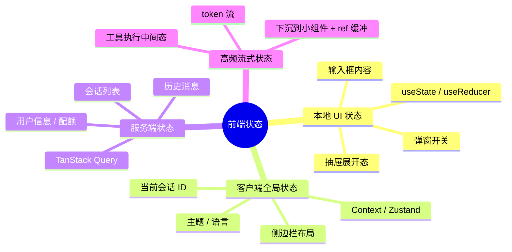
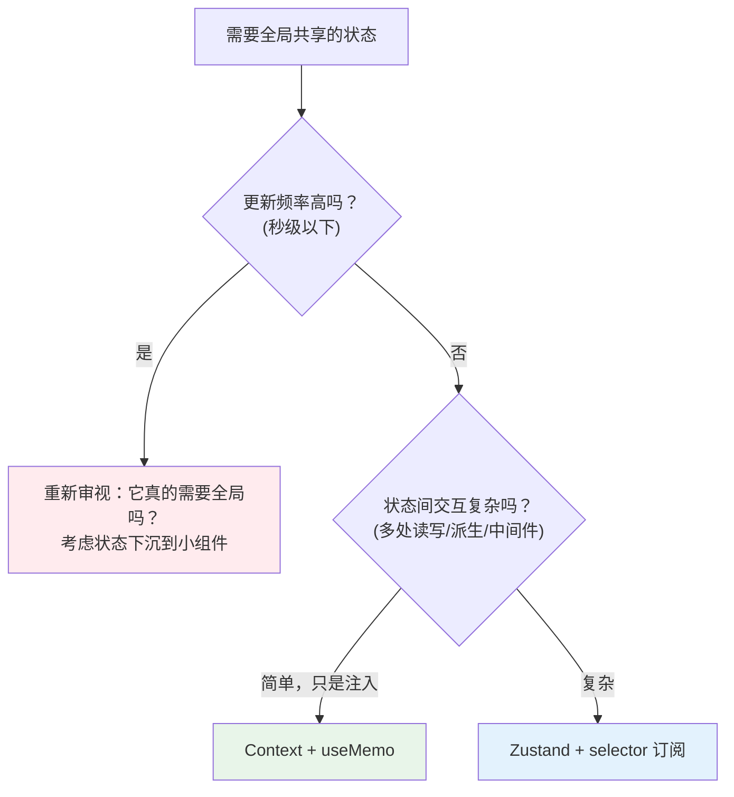
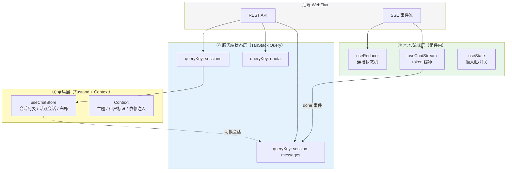

# 16-React 状态管理

> **定位**：本文讲透 React 应用的状态管理全景——从 useState 的边界出发，经过 Context、Zustand，到服务端状态，最终落到 Agent 前端的三层状态模型。读者画像：已读完 [教程 03-React前端与AgenticUI/00-React入门与现代前端工程]，能写函数组件与自定义 Hook 的开发者。前置阅读：[教程 03-React前端与AgenticUI/00-React入门与现代前端工程 §3 Hooks]。
>
> **为什么状态管理是 Agent 前端的核心难题**：一个 Agent 控制台同时存在——高频流式状态（每秒几十 token）、会话级状态（历史、连接）、全局状态（用户、主题、租户）、服务端状态（会话列表、配额）。不分类管理，必然演变成"全局一个大 store，改一个 token 全页面重渲染"的灾难。这与后端把"控制面/数据面"分离是同构的架构问题（[教程 04-企业级架构主干/00-管控分离架构 §2]）。

---

## 1. 状态的分类学：先分类，再选型

90% 的状态管理混乱源于"没分类就选库"。先建立分类框架：



四类状态的**更新频率、共享范围、一致性要求完全不同**，选型策略也不同。核心原则：

> **本地状态不上提（避免无关重渲染），全局状态不下放（避免 props 钻取），服务端状态不用客户端库管理（丢失缓存/重验证/失效语义），高频状态要隔离（避免连坐渲染）。**

---

## 2. 本地状态：useState 与 useReducer

### 2.1 useState 的适用边界

```tsx
const [input, setInput] = useState('');
const [isDrawerOpen, setIsDrawerOpen] = useState(false);
```

单个独立值、更新逻辑简单——useState 完美。它的边界：**多个状态互相依赖、更新逻辑有分支**时，多个 useState 会出现"状态组合非法"的中间态。

### 2.2 useReducer：状态转换机

当一个状态集合有明确的"事件 → 转换"语义时，useReducer 是正解——它把状态更新从"散落的 setXxx"收敛为**一个纯函数转换器**：

```tsx
// Agent 前端的"连接状态机"：状态与事件都有穷尽定义
interface StreamState {
  phase: 'idle' | 'connecting' | 'streaming' | 'awaiting_tool' | 'done' | 'error';
  bufferedText: string;
  activeToolCallId: string | null;
  error: string | null;
}

type StreamAction =
  | { type: 'CONNECT' }
  | { type: 'FIRST_TOKEN' }
  | { type: 'TOKEN'; content: string }
  | { type: 'TOOL_START'; toolCallId: string }
  | { type: 'TOOL_END' }
  | { type: 'FINISH' }
  | { type: 'FAIL'; message: string }
  | { type: 'RESET' };

function streamReducer(state: StreamState, action: StreamAction): StreamState {
  switch (action.type) {
    case 'CONNECT':
      return { ...state, phase: 'connecting', error: null };
    case 'FIRST_TOKEN':
      return { ...state, phase: 'streaming' };
    case 'TOKEN':
      return { ...state, bufferedText: state.bufferedText + action.content };
    case 'TOOL_START':
      return { ...state, phase: 'awaiting_tool', activeToolCallId: action.toolCallId };
    case 'TOOL_END':
      return { ...state, phase: 'streaming', activeToolCallId: null };
    case 'FINISH':
      return { ...state, phase: 'done' };
    case 'FAIL':
      return { ...state, phase: 'error', error: action.message };
    case 'RESET':
      return initialStreamState;
  }
}
```

注意这个模式与后端的状态机设计**完全同构**——[教程 02-SpringAI核心机制/02-Agent状态管理 §状态机]、[教程 04-企业级架构主干/08-Human-in-the-Loop与审批流 §审批状态机] 中的 Mermaid 状态图，可以直接映射为前端 reducer。前后端用同一张状态图对齐，是事件协议设计（[教程 03-React前端与AgenticUI/03-Agentic-UI设计 §2]）的沟通基础。

**判断标准**：状态转换图能画出来 → useReducer；只是几个独立开关 → useState。

---

## 3. 客户端全局状态：Context 与 Zustand

### 3.1 Context：依赖注入，不是状态库

```tsx
interface SessionContextValue {
  sessionId: string;
  switchSession: (id: string) => void;
}

const SessionContext = createContext<SessionContextValue | null>(null);

export function SessionProvider({ children }: { children: React.ReactNode }) {
  const [sessionId, setSessionId] = useState(createSessionId());
  const value = useMemo(
    () => ({ sessionId, switchSession: setSessionId }),
    [sessionId]
  );
  return <SessionContext.Provider value={value}>{children}</SessionContext.Provider>;
}

// 消费端
function SessionTitle() {
  const ctx = useContext(SessionContext);
  if (!ctx) throw new Error('SessionProvider 缺失');
  return <h1>会话 {ctx.sessionId}</h1>;
}
```

**Context 的真相**：它是"避免 props 钻取的依赖注入机制"，类似 Spring 的 ApplicationContext（[教程 03-React前端与AgenticUI/00-React入门与现代前端工程 §1.1]）。但 **Context 的 value 变化会让所有消费组件重渲染**——即使它们只用 value 里的一部分。所以：

- ✅ 适合：低频变化的值（当前会话 ID、主题、登录用户、租户标识）
- ❌ 不适合：高频值（token 流——每 token 一次 context 更新 = 全应用重渲染）

**性能铁律**：流式状态永远不要进 Context。Context 只装"变更频率以秒/分钟计"的配置型状态。

### 3.2 Zustand：轻量全局 store

当全局状态开始有复杂交互（多处读写、派生计算、中间件需求），Context + useMemo 的组合会变得繁琐。Zustand 是 2026 年 React 生态最主流的轻量状态库（约 1KB，无 Provider 包裹）：

```tsx
import { create } from 'zustand';

interface ChatStore {
  sessions: SessionMeta[];
  activeSessionId: string | null;
  createSession: () => void;
  setActiveSession: (id: string) => void;
  removeSession: (id: string) => void;
}

export const useChatStore = create<ChatStore>((set, get) => ({
  sessions: [],
  activeSessionId: null,

  createSession: () => {
    const session: SessionMeta = { id: crypto.randomUUID(), createdAt: Date.now(), title: '新会话' };
    set({ sessions: [...get().sessions, session], activeSessionId: session.id });
  },

  setActiveSession: id => set({ activeSessionId: id }),

  removeSession: id =>
    set({
      sessions: get().sessions.filter(s => s.id !== id),
      activeSessionId: get().activeSessionId === id ? null : get().activeSessionId,
    }),
}));

// 组件里按需订阅——selector 保证只有用到该字段的组件才重渲染
function SessionCount() {
  const count = useChatStore(s => s.sessions.length);  // 只订阅 length
  return <Badge>{count}</Badge>;
}
```

Zustand 的 **selector 订阅**解决了 Context 的"连坐渲染"问题：每个组件精确订阅自己需要的切片。这与后端"订阅分离"的响应式思想一致（[教程 01-WebFlux与响应式编程/01-Reactor核心 §6]——Cold publisher 各自独立订阅流，互不影响）。

### 3.3 Context vs Zustand 选型决策



**本体系的推荐**：Agent 控制台用 Zustand 管理会话列表/布局等客户端全局状态；Context 只用于主题与依赖注入；服务端数据全部交给 TanStack Query（§4）。

---

## 4. 服务端状态：TanStack Query

### 4.1 为什么客户端状态库管不好服务端数据

会话列表、历史消息、用户配额——这些数据本质是"服务端数据在客户端的缓存"。用 Zustand/Redux 管理它们意味着你要手写：加载态、错误态、重试、缓存失效、窗口聚焦重新验证、乐观更新……TanStack Query 把这些做成开箱即用：

```tsx
import { useQuery, useMutation, useQueryClient } from '@tanstack/react-query';

// 查询：自动管理 loading/error/refetch/缓存
function SessionList() {
  const { data: sessions, isPending, error } = useQuery({
    queryKey: ['sessions', tenantId],
    queryFn: () => api.listSessions(tenantId),
    staleTime: 30_000,  // 30 秒内视为新鲜，不重复请求
  });

  if (isPending) return <Spinner />;
  if (error) return <ErrorBox error={error} />;
  return sessions.map(s => <SessionItem key={s.id} session={s} />);
}

// 变更 + 缓存失效
function DeleteSessionButton({ sessionId }: { sessionId: string }) {
  const queryClient = useQueryClient();
  const mutation = useMutation({
    mutationFn: (id: string) => api.deleteSession(id),
    onSuccess: () => {
      // 删除成功后让会话列表缓存失效，自动重新拉取
      queryClient.invalidateQueries({ queryKey: ['sessions'] });
    },
  });
  return <button onClick={() => mutation.mutate(sessionId)}>删除</button>;
}
```

### 4.2 queryKey：缓存的维度设计

`queryKey` 是分层的缓存键，设计它就是在设计前端的"数据寻址方案"：

```tsx
queryKey: ['sessions', tenantId]              // 租户维度的会话列表
queryKey: ['session-messages', sessionId]     // 某会话的历史消息
queryKey: ['quota', tenantId, userId]         // 用户配额
```

层级化的 key 让失效粒度可控：`invalidateQueries({ queryKey: ['sessions'] })` 会失效所有租户的会话列表——与后端缓存键的分层设计（[附录 09-语义缓存与性能/00-语义缓存实现 §缓存键设计]）是同一种架构思维。

### 4.3 分界线：什么不进 TanStack Query

**流式数据不用 TanStack Query**。token 流是"持续推送"而非"请求-响应"，Query 的模型不匹配。流式状态的归宿是"下沉的自定义 Hook + ref 缓冲"（[教程 03-React前端与AgenticUI/02-React与SSE流式UI §4]）。这正呼应了开头的分类学：四类状态各归其位。

---

## 5. Agent 前端三层状态模型（综合架构）

把前三节整合成一张架构图——这是项目 04（React Agent 控制台）将采用的状态架构：



关键数据流：
1. 用户切换会话 → Zustand 更新 `activeSessionId` → 触发 TanStack Query 拉取该会话历史
2. 发送消息 → 本地 `useChatStream` 建立 SSE → token 进入 reducer 状态机渲染
3. 收到 `done` 事件 → `invalidateQueries(['session-messages'])` → 历史列表与服务端对齐
4. 租户标识（低频）放 Context，注入所有 API 调用与 SSE 连接参数

这一分层与后端的三层记忆架构（[教程 08-架构师进阶/05-高级记忆架构 §三层记忆]）形成有趣的镜像：前端也是"短期（流式缓冲）→ 中期（会话状态）→ 长期（服务端数据缓存）"，只是生命周期尺度不同。架构师的跨端抽象能力正体现在这种模式识别上。

---

## 6. 常见误区与反模式

| 反模式 | 症状 | 纠正 |
|--------|------|------|
| 全局大 store | 所有状态塞一个 Zustand/Redux，改 token 全站重渲染 | 四分类；高频状态隔离 |
| Context 装高频值 | 每次流式更新全应用渲染 | 流式状态进组件本地 + selector |
| 手写服务端状态 | 自己管理 loading/error/重试/缓存 | TanStack Query |
| 状态过度上提 | 输入框内容放全局 | 就近原则：状态放使用的最小公共父组件 |
| 派生状态冗余存储 | 把"消息数 = messages.length"也存进 state | 派生值用 useMemo 计算或直接计算 |
| reducer 里做副作用 | reducer 中发起网络请求 | reducer 必须纯函数；副作用放事件处理器或 effect |
| 乐观更新不回滚 | 失败后 UI 与服务端永久不一致 | useOptimistic / onMutate 快照回滚 |
| queryKey 设计扁平 | 无法按维度失效 | 层级化 key 对齐数据实体维度 |

---

## 7. 适用场景与不适用场景

### 适用场景

- 多会话、多页签、流式 + 混合数据源的 Agent 控制台（三层模型直接适用）
- 需要精确控制重渲染范围的高频更新界面（selector 订阅）
- 前后端契约复杂、需要缓存/失效语义的服务端数据（TanStack Query）
- 状态转换有明确生命周期（连接、审批、任务）的前端状态机（useReducer + 与后端状态图对齐）

### 不适用场景

- 简单页面（一两个输入框）引入 Zustand/Query——过度工程，useState 足够
- 需要跨标签页实时同步的全局状态—— Zustand 原生单页签，需配合 storage 持久化或 BroadcastChannel（多页签同步见 [教程 04-企业级架构主干/04-多页面流式响应与会话管理] 后端方案）
- 离线优先应用——需要更重的本地数据库方案，Query 只是缓存层
- 极致简单的 SSR 场景——服务端状态的获取与注水需另行设计（本体系 SPA 架构不涉及）

---

## 8. 总结

| 概念 | 一句话 |
|------|--------|
| 状态四分类 | 本地 UI / 客户端全局 / 服务端 / 高频流式——先分类再选型 |
| useReducer | 状态转换机，与后端状态图同构 |
| Context | 依赖注入机制，只装低频值，防"连坐渲染" |
| Zustand + selector | 轻量全局 store，精确订阅切片 |
| TanStack Query | 服务端状态专用：缓存、失效、重验证、乐观更新 |
| queryKey 分层 | 前端的数据寻址方案，对齐后端缓存键思维 |
| 三层状态模型 | 全局层 / 服务端层 / 本地流式层——Agent 控制台的标准架构 |

**下一篇**：[26-React与SSE流式UI.md](02-React与SSE流式UI.md) — 把状态模型接到真实的 SSE 流上：fetch + ReadableStream、事件解析、断线重连与 token 批量渲染。
