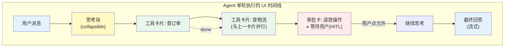
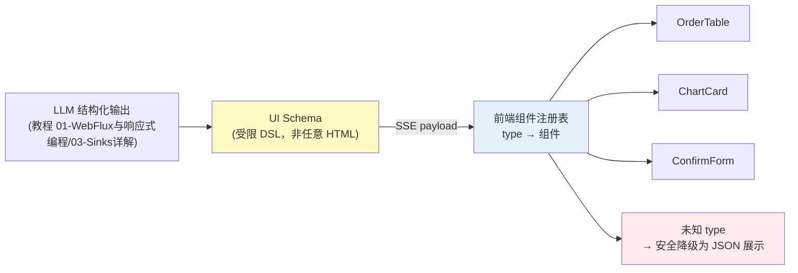
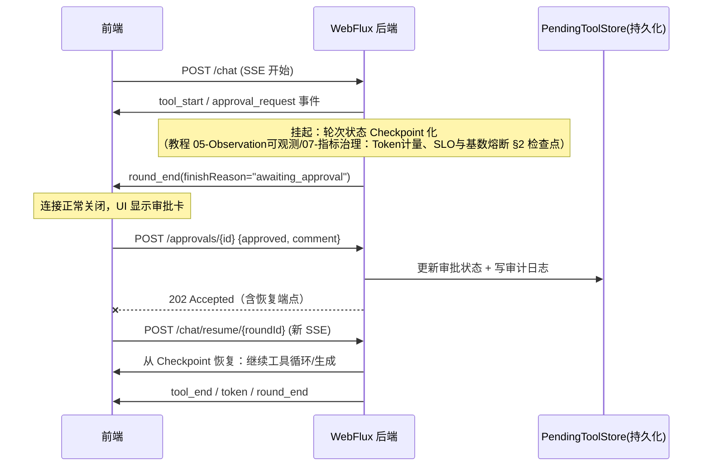

# 18-Agentic UI 设计

> **定位**：本文是 React 路线的收官篇——从"渲染一条文本流"进化到"渲染一个 Agent 的完整行为"：事件协议设计、思考过程展示、工具调用透明化、生成式 UI（JSON→组件）、HITL 审批交互。读者画像：已读完 [教程 00-基础与核心/03-工具调用]，能实现流式对话界面的开发者。前置阅读：[教程 03-React前端与AgenticUI/02-React与SSE流式UI]、后端事件源见 [教程 03-React前端与AgenticUI/04-流式工具调用与事件协议]。
>
> **为什么这是架构师课题**：Agentic UI 的事件协议是前后端共同的架构契约——它决定了后端 ToolCallingManager 的拦截点暴露什么信息、HITL 挂起如何恢复、工具参数是否泄露敏感数据。协议设计错了，前后端要一起返工。本文与 [教程 03-React前端与AgenticUI/04-流式工具调用与事件协议] 构成同一契约的两端视角。

---

## 1. 从 Chat UI 到 Agentic UI：范式差异

传统聊天 UI 只有一种实体：消息（用户消息/助手消息）。Agent 的行为远比"一问一答"复杂——它会思考、调用工具、等待审批、出错重试、并行执行多个工具。

| 维度 | Chat UI | Agentic UI |
|------|---------|-----------|
| 展示单元 | 消息气泡 | 消息 + 思考块 + 工具卡片 + 审批卡 + 产物渲染 |
| 时间模型 | 一问一答串行 | 思考/工具/输出交错，可并行 |
| 用户角色 | 提问者 | 提问者 + 审批者 + 干预者（中断/纠偏） |
| 状态复杂度 | idle/streaming | 完整生命周期状态机（含挂起、恢复、失败分支） |
| 后端耦合 | 一个流式接口 | 事件协议 + 恢复接口 + 审批接口 + 取消接口 |



**设计原则**（来自 [附录 13-Agent交互设计/00-Agent用户体验设计]，本文用 React 落地）：
1. **过程透明**——用户能看见 Agent 在做什么（不是 30 秒白屏转圈）
2. **进度有形**——每个动作有进行中/完成/失败状态
3. **干预有门**——危险操作前用户有机会说"不"
4. **失败可懂**——错误信息给人看，不是堆栈

---

## 2. 事件协议：Agentic UI 的架构契约

### 2.1 事件模型定义

这是本体系前后端统一的 Agent 事件协议（TypeScript 侧定义；后端 sealed interface 镜像见 [教程 03-React前端与AgenticUI/04-流式工具调用与事件协议 §2]）：

```ts
// 每个事件都有：id（单调递增，用于断点恢复去重）+ type
interface BaseEvent { id: number; ts: number; }

type AgentEvent =
  // —— Agent 生命周期 ——
  | (BaseEvent & { type: 'round_start'; roundId: string })

  // —— 思考过程 ——
  | (BaseEvent & { type: 'thought_start'; thoughtId: string })
  | (BaseEvent & { type: 'thought_delta'; thoughtId: string; content: string })
  | (BaseEvent & { type: 'thought_end'; thoughtId: string })

  // —— 工具调用 ——
  | (BaseEvent & { type: 'tool_start';
      toolCallId: string; name: string;
      args: Record<string, unknown>;          // 后端已脱敏（DLP，见 [附录 08-Agent安全深度/02-数据泄露防护]）
      parallelGroup?: number })               // 同组并行工具
  | (BaseEvent & { type: 'tool_progress'; toolCallId: string; message: string })  // 长任务进度
  | (BaseEvent & { type: 'tool_end';
      toolCallId: string; status: 'success' | 'error';
      resultPreview?: string;                 // 截断的结果摘要，不是完整数据
      durationMs: number })

  // —— HITL 审批 ——
  | (BaseEvent & { type: 'approval_request';
      approvalId: string; toolCallId: string;
      action: string; reason: string;         // 为什么需要审批
      riskLevel: 'medium' | 'high' })
  | (BaseEvent & { type: 'approval_resolved'; approvalId: string; approved: boolean })

  // —— 输出与终结 ——
  | (BaseEvent & { type: 'token'; content: string })
  | (BaseEvent & { type: 'round_end'; roundId: string;
      usage: { promptTokens: number; completionTokens: number };
      finishReason: 'stop' | 'tool_loop_budget' | 'cancelled' | 'error' })
  | (BaseEvent & { type: 'error'; code: string; message: string; recoverable: boolean });
```

### 2.2 协议设计决策（为什么长这样）

| 决策 | 理由 | 备选与取舍 |
|------|------|-----------|
| 事件用 `type` 可辨识联合 | 前端 switch 穷尽检查、后端 sealed interface 一一映射 | 无 schema 的裸 JSON——类型不安全，弃 |
| `id` 单调递增进每条事件 | 断线重连去重与恢复（[教程 03-React前端与AgenticUI/02-React与SSE流式UI §3.2]） | 时间戳做 id——时钟偏移不可靠，弃 |
| 思考与输出分开（thought/token） | UI 折叠默认不同：思考默认收起、输出默认展开 | 混在一条流——前端无法区分渲染，弃 |
| 工具参数完整下发（脱敏后） | 用户需要看"Agent 要用什么参数执行"才能审批 | 只发工具名——审批变成盲签，不可接受 |
| `resultPreview` 而非完整结果 | 工具结果可能巨大（文件/列表），防前端卡死；详情按需拉取 | 全量推送——渲染内存失控，弃 |
| `approval_request` 是独立事件 | HITL 挂起可能持续数小时，与流的生命周期解耦（§5） | 阻塞在 SSE 里——连接白挂几小时，弃 |
| `parallelGroup` 标注并行组 | UI 把并行工具卡片排成一行，真实反映执行结构 | 不标——并行性不可见，过程失真 |
| `finishReason` 显式枚举 | "正常结束"和"预算耗尽被截断"必须让用户知道 | 统一 done——截断的回答被当成完整答案，误导 |

### 2.3 前端 reducer 状态机

```ts
interface AgentRoundState {
  status: 'running' | 'awaiting_approval' | 'done' | 'error' | 'cancelled';
  thoughts: Thought[];
  toolCalls: ToolCallInfo[];
  pendingApproval: ApprovalRequest | null;
  answerText: string;
  usage: TokenUsage | null;
  finishReason: string | null;
}

function agentRoundReducer(state: AgentRoundState, e: AgentEvent): AgentRoundState {
  switch (e.type) {
    case 'thought_delta':
      return { ...state,
        thoughts: updateThought(state.thoughts, e.thoughtId, t => ({ ...t, content: t.content + e.content })) };

    case 'tool_start':
      return { ...state,
        toolCalls: [...state.toolCalls,
          { id: e.toolCallId, name: e.name, args: e.args, status: 'running',
            parallelGroup: e.parallelGroup, progress: null, resultPreview: null, durationMs: 0 }] };

    case 'tool_progress':
      return { ...state,
        toolCalls: updateTool(state.toolCalls, e.toolCallId, t => ({ ...t, progress: e.message })) };

    case 'tool_end':
      return { ...state,
        toolCalls: updateTool(state.toolCalls, e.toolCallId, t =>
          ({ ...t, status: e.status, resultPreview: e.resultPreview, durationMs: e.durationMs })) };

    case 'approval_request':
      return { ...state, status: 'awaiting_approval', pendingApproval: e };

    case 'approval_resolved':
      return { ...state, status: 'running', pendingApproval: null };

    case 'token':
      return { ...state, answerText: state.answerText + e.content };  // 生产中走 rAF 缓冲（教程 01-WebFlux与响应式编程/07-WebFlux测试与性能调优 §4）

    case 'round_end':
      return { ...state, status: 'done', usage: e.usage, finishReason: e.finishReason };

    case 'error':
      return { ...state, status: e.recoverable ? 'running' : 'error' };

    default:
      return exhaustiveCheck(e);  // 编译期穷尽保护（[教程 01-WebFlux与响应式编程/05-WebFlux进阶实战 §4.2]）
  }
}
```

这套 reducer 与后端的审批状态机（[教程 04-企业级架构主干/08-Human-in-the-Loop与审批流 §状态机]）在 `awaiting_approval` 挂起/恢复的语义上严格对齐——同一张状态图，两端各实现一半。

---

## 3. 核心组件设计

### 3.1 思考块：默认折叠的推理过程

```tsx
const ThoughtBlock = React.memo(({ thought }: { thought: Thought }) => {
  const [open, setOpen] = useState(false);  // 默认收起：思考是辅助信息，不是主角
  return (
    <div className="thought-block">
      <button className="thought-toggle" onClick={() => setOpen(!open)}>
        💭 思考过程 {open ? '▾' : '▸'}
      </button>
      {open && <pre className="thought-content">{thought.content}</pre>}
    </div>
  );
});
```

**交互决策**：默认折叠降低认知负担；但**正在思考时**要有一个活动指示（"正在思考…"骨架屏），让用户知道系统没死——这与 [附录 13-Agent交互设计/00 §中间状态] 的"3 秒规则"一致：超过 3 秒的静默必须有可感知的进度信号。

### 3.2 工具卡片：过程透明的核心

```tsx
function ToolCard({ tool }: { tool: ToolCallInfo }) {
  return (
    <div className={`tool-card tool-${tool.status}`}>
      <header>
        <ToolIcon name={tool.name} />
        <span className="tool-name">{tool.name}</span>
        <StatusBadge status={tool.status} />          {/* running: 旋转 / success: ✓ / error: ✗ */}
        {tool.durationMs > 0 && <span className="duration">{tool.durationMs}ms</span>}
      </header>
      <details>                                        {/* 参数默认收起，点开看 JSON */}
        <summary>参数</summary>
        <JsonViewer data={tool.args} />                {/* 只读高亮渲染，参数已由后端脱敏 */}
      </details>
      {tool.progress && <ProgressBar label={tool.progress} />}
      {tool.resultPreview && (
        <details>
          <summary>结果</summary>
          <pre>{tool.resultPreview}</pre>
        </details>
      )}
    </div>
  );
}

// 并行组渲染：同一 parallelGroup 的卡片排成一行
function ToolTimeline({ toolCalls }: { toolCalls: ToolCallInfo[] }) {
  const groups = useMemo(
    () => groupByParallel(toolCalls),
    [toolCalls]
  );
  return (
    <div className="tool-timeline">
      {groups.map((group, i) => (
        <div key={i} className="parallel-group">
          {group.map(t => <ToolCard key={t.id} tool={t} />)}
        </div>
      ))}
    </div>
  );
}
```

**后端配合点**：`tool_progress` 事件要求长任务工具通过 `ToolContext` 或日志通道回报进度（实现见 [教程 03-React前端与AgenticUI/04-流式工具调用与事件协议 §3]）。前端没有魔法——进度可见性是后端事件喂出来的。

### 3.3 审批卡：HITL 的前端形态

```tsx
function ApprovalCard({ approval, onRespond }: {
  approval: ApprovalRequest;
  onRespond: (approved: boolean, comment?: string) => void;
}) {
  const [comment, setComment] = useState('');
  return (
    <div className={`approval-card risk-${approval.riskLevel}`}>
      <h3>⚠️ 需要您的确认</h3>
      <p>Agent 请求执行：<strong>{approval.action}</strong></p>
      <p className="reason">{approval.reason}</p>
      <div className="approval-actions">
        <button className="btn-danger" onClick={() => onRespond(true, comment)}>允许执行</button>
        <button className="btn-safe" onClick={() => onRespond(false, comment)}>拒绝</button>
      </div>
      <textarea placeholder="备注（会写入审计日志）" value={comment} onChange={e => setComment(e.target.value)} />
    </div>
  );
}
```

**关键设计**：拒绝是安全默认（"允许"用醒目危险色提示后果，不是诱导点击）；备注写入审计日志——前端交互设计与后端审计要求（[教程 04-企业级架构主干/03-工具执行可观测与审计 §审计数据模型]）直接挂钩。

---

## 4. 生成式 UI：JSON → 组件

最高阶的 Agentic UI：Agent 不只输出文本，还输出**结构化的 UI 描述**，前端按注册表渲染成真实交互组件。

### 4.1 架构



### 4.2 实现：受限 DSL + 注册表

```tsx
// 1. 受限的 UI Schema（可辨识联合，与后端结构化输出契约对齐）
type UISpec =
  | { kind: 'order_table'; orders: Order[] }
  | { kind: 'metric'; label: string; value: string; trend?: 'up' | 'down' }
  | { kind: 'confirm_form'; fields: FormField[]; submitLabel: string }
  | { kind: 'chart'; chartType: 'line' | 'bar'; data: DataPoint[] };

// 2. 注册表：kind → 渲染器。新组件能力 = 注册一个条目，前端无需改核心代码
const registry: { [K in UISpec['kind']]: React.FC<Extract<UISpec, { kind: K }>> } = {
  order_table: OrderTable,
  metric: MetricTile,
  confirm_form: ConfirmForm,
  chart: ChartCard,
};

// 3. 渲染器：未知 kind 安全降级，绝不执行任何"代码"
function GenerativeBlock({ spec }: { spec: UISpec }) {
  const Component = registry[spec.kind];
  if (!Component) return <details><summary>未支持的内容块</summary><pre>{JSON.stringify(spec, null, 2)}</pre></details>;
  return <Component {...spec} />;
}
```

### 4.3 安全红线（为什么必须是受限 DSL）

**永远不要让 LLM 输出 HTML/JSX 直接渲染**（`dangerouslySetInnerHTML`）。间接 Prompt 注入（[附录 08-Agent安全深度/00-Prompt注入分类与案例 §间接注入]）可以让 RAG 文档内容污染 LLM 输出——若输出可直接变成可执行 UI，等于把 XSS 的钥匙交给攻击者。受限 DSL + 白名单注册表是唯一安全形态：
- LLM 只能选择**已注册的组件类型**和**数据**，不能注入代码
- 数据经 `JsonViewer` 级别的只读渲染，无脚本执行面
- 组件内部对数据做二次校验（数值范围、枚举值）

---

## 5. HITL 挂起与跨连接恢复

审批可能几小时后才有回应，SSE 连接不应挂着等（连接成本、代理超时）。架构决策：**流终止于挂起点，审批走 REST，恢复是新流**。



前端配合点：
- `round_end.finishReason === 'awaiting_approval'` 时，UI 把本轮标记为"挂起中"而非"完成"
- 审批响应返回 `resumeEndpoint`，用普通 `useChatStream` 开新流
- 用户刷新页面后，通过 `GET /rounds/active` 查回挂起中的轮次，重渲染审批卡（**跨刷新恢复**——会话状态持久化的消费端，[教程 04-企业级架构主干/05-历史记录持久化与合规 §对话回放]）

---

## 6. 常见误区与反模式

| 反模式 | 症状 | 纠正 |
|--------|------|------|
| 30 秒白屏 | 工具执行期间无任何反馈 | thought/tool_start 事件驱动过程展示；3 秒规则 |
| 审批盲签 | 审批卡只显示"是否允许"没有参数/理由 | tool args（脱敏后）+ riskLevel + reason 全量展示 |
| 完整工具结果进事件 | 大结果撑爆前端内存/卡顿 | resultPreview + 详情按需 REST 拉取 |
| LLM 输出直接渲染 HTML | 间接注入 → XSS | 受限 DSL + 白名单注册表（§4.3） |
| 挂起时连接干等 | SSE 连接挂几小时等审批 | 流终止于挂起点，审批走 REST，恢复开新流 |
| 截断当完成 | 预算耗尽的部分回答被当完整答案 | finishReason 显式渲染（"回答因预算限制被截断"） |
| 事件协议无版本 | 后端加事件类型前端静默崩溃 | 协议带 version 字段；未知 type 安全跳过 |
| 思考过程强制展开 | 认知过载 | 默认折叠，正在思考时显示活动指示 |

---

## 7. 适用场景与不适用场景

### 适用场景

- 工具调用密集的 Agent（客服工单、数据分析、运维巡检）——工具卡片/并行组直接适用
- 有危险操作需审批的 Agent（退款、删除、变更）——审批卡 + 挂起恢复
- 结果天然结构化的场景（报表、订单、图表）——生成式 UI
- 高风险行业（金融/医疗）——过程透明与审计备注是合规需求（[教程 08-架构师进阶/09-Agent治理与合规框架]）

### 不适用场景

- 纯文本闲聊 Agent——完整 Agentic UI 是过度设计，token 流 + 简单状态即可
- 思考过程本身涉密（含敏感推理或系统提示）——thought 事件应可配置关闭（后端过滤）
- 用户完全没有干预意愿/能力的场景——HITL 卡片无意义，直接走策略降级
- 嵌入第三方页面的小组件——生成式 UI 的注册表模式在小构件里成本过高，降级为纯文本

---

## 8. 总结

| 概念 | 一句话 |
|------|--------|
| Agentic UI | 渲染 Agent 的行为（思考/行动/挂起/恢复），不只是文本流 |
| 事件协议 | 前后端共同契约：可辨识联合 + 单调 id + 显式 finishReason |
| 工具卡片 + 并行组 | 过程透明的核心组件；进度由后端事件喂出 |
| 审批卡 | 拒绝为安全默认；参数+理由+备注进审计 |
| 生成式 UI | 受限 DSL + 白名单注册表，JSON→组件，永不直接渲染 LLM 的 HTML |
| 挂起恢复 | 流终止于挂起点，审批走 REST，恢复开新流（Checkpoint 支撑） |
| 3 秒规则 | 静默超过 3 秒必须有可感知进度信号 |
| 协议版本化 | version + 未知 type 安全跳过，前后端独立演进 |

**React 路线到此完成**。下一步进入实践：[项目/04-React-Agent控制台](../../项目/04-React-Agent控制台/00-需求分析与架构设计.md) — 把教程 00-基础与核心/03-工具调用 的全部知识组合成一个完整的 Agent 前端项目。后端配套深化见 [教程 03-React前端与AgenticUI/04-流式工具调用与事件协议]。
