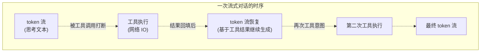
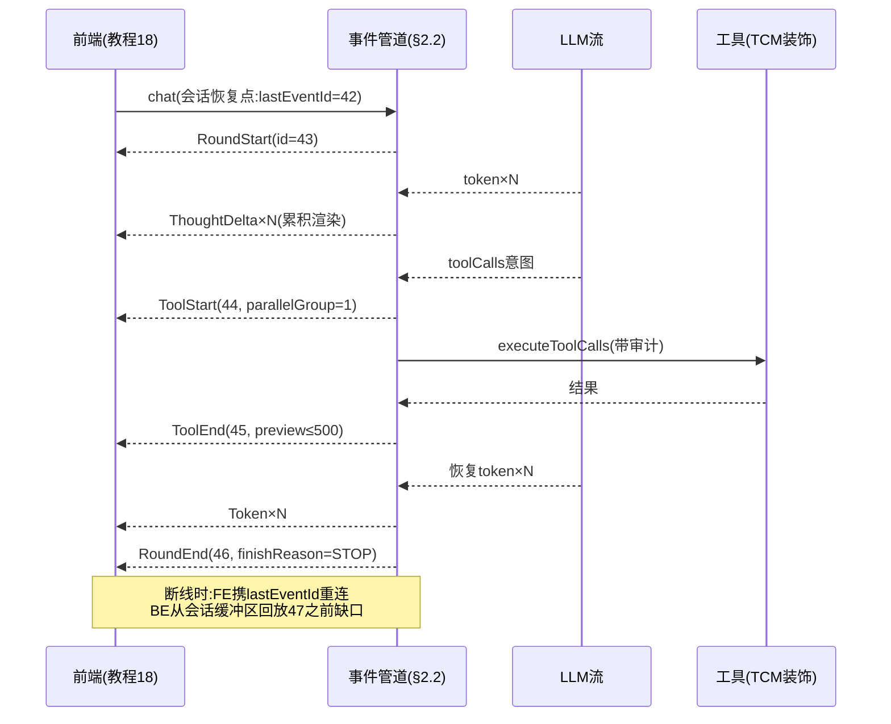

# 04 流式工具调用与事件协议
> **定位**：本文讲透企业级 Agent 前后端协作的核心契约——流式模式下的工具调用循环（streaming tool calls）、Agent 事件协议的设计与实现、并行工具调用的处理、客户端取消与服务端部分结果。这是教程 01-WebFlux与响应式编程/00-WebFlux从零入门（SSE）与教程 01-WebFlux与响应式编程/08-跨服务流与RedisStreams背压（Agentic UI）之间的"后端发动机"篇。读者画像：要实现完整 Agent 流式后端的开发者。前置阅读：[教程 00-基础与核心/03-工具调用 §5 工具调用循环]、[教程 02-SpringAI核心机制/00-SSE流式通信]、[教程 03-React前端与AgenticUI/03-Agentic-UI设计 §2 事件协议]。
>
> **与教程 01-WebFlux与响应式编程/08-跨服务流与RedisStreams背压 的分工**：教程 01-WebFlux与响应式编程/08-跨服务流与RedisStreams背压 站在前端视角定义"消费什么事件"；本文站在后端视角讲"事件从哪里来、怎么生成"——特别是流式模式下的工具循环如何在 Spring AI 2.0 的执行模型中落地。

---

## 1. 为什么流式工具调用是难题

非流式模式下工具调用是简单的：`call()` → 框架内部完成 N 轮工具循环 → 返回最终响应。前端只等一个结果。

流式模式的复杂性来自三个"交错"：



- **token 与工具事件的交错**：LLM 先输出文本、再决定调工具、工具返回后继续输出——一条 SSE 流上要承载两种节奏完全不同的事件
- **工具执行的中断感**：工具执行（可能秒级到分钟级）期间 token 流静默——前端必须能区分"在想"“在调工具”“挂了”
- **取消的传播**：用户中途取消，要同时停掉 LLM 流、进行中的工具执行、以及"是否保留部分结果"的决策

**适用场景与不适用场景**（本教程贯穿的判断）：
- 适用：对话式 Agent（用户实时看着过程）、长任务 Agent（进度可见）、多工具工作流
- 不适用：纯后台批处理（无人在看，直接 call() 更简单可靠）、单轮无工具的短问答（事件协议的开销无意义）

---

## 2. 事件协议的后端实现

### 2.1 协议回顾（与教程 01-WebFlux与响应式编程/08-跨服务流与RedisStreams背压 对齐）

前端消费的事件联合类型见 [教程 03-React前端与AgenticUI/03-Agentic-UI设计 §2.1]。后端侧的对应物是 sealed interface + 每事件单调递增 id：

```java
// Spring AI 2.0.0 / Java 21 —— 后端事件模型（与前端 AgentEvent 一一映射）
public sealed interface AgentEvent permits
        RoundStart, ThoughtStart, ThoughtDelta, ThoughtEnd,
        ToolStart, ToolProgress, ToolEnd,
        ApprovalRequest, ApprovalResolved,
        Token, RoundEnd, ErrorEvent {

    long id();
    long ts();
    // 前端渲染按 type 分支；sealed 保证后端穷尽处理（编译器强制）
}
```

### 2.2 事件生成器：流变换管道

```java
// imports: org.springframework.ai.chat.model.ChatResponse / org.springframework.ai.chat.messages.AssistantMessage
// 核心: 把 Spring AI 的 Flux<ChatResponse> 变换为 Flux<AgentEvent>
@Component
public class AgentEventStreamFactory {

    private final AtomicLong eventId = new AtomicLong();   // 会话级单调 id（断点恢复去重依据）
    private final EventIdStore idStore;                     // id 序号持久化(会话缓冲区, 见 §5)

    public Flux<AgentEvent> toEventStream(Flux<ChatResponse> source, SessionContext ctx) {
        return source.concatMap(chunk -> {
            List<AgentEvent> events = new ArrayList<>();

            // ① 工具意图检测: chunk 携带 toolCalls → 发 ToolStart（思考文本已在之前的 token 事件中）
            // ToolCall 真实类型: org.springframework.ai.chat.messages.AssistantMessage.ToolCall
            if (chunk.hasToolCalls()) {
                for (AssistantMessage.ToolCall tc : chunk.getResult().getOutput().getToolCalls()) {
                    events.add(new ToolStart(nextId(), now(), tc.id(), tc.name(),
                            parseArgs(tc.arguments()), parallelGroupOf(tc)));
                }
            }
            // ② 文本增量 → Token 事件（脱敏管道在此挂接, [教程 04-企业级架构主干/05-历史记录持久化与合规 §4.3 敏感数据脱敏]）
            String text = chunk.getResult().getOutput().getText();
            if (text != null && !text.isBlank()) {
                events.add(new Token(nextId(), now(), redactor.scrub(text)));
            }
            // ③ finish reason 在 Generation 级 ChatGenerationMetadata 上（非 ChatResponse 级）
            String finishReason = chunk.getResult().getMetadata().getFinishReason();
            if (finishReason != null) {
                events.add(toRoundEnd(chunk, ctx));
            }
            return Flux.fromIterable(events);
        });
    }
}
```

「遇到阻塞？→ [附录 05-SpringAI2-API基准/02-Tool与Observation真实API §拦截扩展点]——工具执行层面的拦截/观测在 ToolCallingManager 层，不在本管道（本管道只负责'事件化'）」

一次典型多轮交互的完整事件时序（前后端对齐的"标准剧本"）：



---

## 3. 流式工具循环的三种实现姿势

### 3.1 姿势一：信任框架（推荐起步）

`stream()` 时 Spring AI 框架内部处理工具循环（ToolCallingManager 自动执行工具并把结果回填继续生成）——你拿到的 Flux 已包含工具轮次。**能力边界**：框架不给你"工具开始/结束"的细粒度事件钩子（要自己从 chunk 的 toolCalls 推断 ToolStart）。

### 3.2 姿势二：自定义 ToolCallingManager（事件与拦截的完整控制）

```java
// 概念代码：装饰 ToolCallingManager，工具执行前后发事件（HITL 拦截也在这一层, [教程 04-企业级架构主干/08-Human-in-the-Loop与审批流 §4]）
// imports: org.springframework.ai.model.tool.ToolCallingManager / ToolCallingChatOptions / ToolExecutionResult
//          org.springframework.ai.chat.model.ChatResponse / org.springframework.ai.chat.messages.AssistantMessage
//          org.springframework.ai.tool.definition.ToolDefinition / org.springframework.ai.chat.prompt.Prompt
public class EventEmittingToolManager implements ToolCallingManager {

    private final ToolCallingManager delegate;
    private final Sinks.Many<AgentEvent> eventSink;   // 事件出口（Reactor Sinks.Many<T> 单类型参数）

    @Override
    public List<ToolDefinition> resolveToolDefinitions(ToolCallingChatOptions options) {
        return delegate.resolveToolDefinitions(options);
    }

    @Override
    public ToolExecutionResult executeToolCalls(Prompt prompt, ChatResponse chatResponse) {

        // 工具调用取自模型响应中的 AssistantMessage（真实类型: org.springframework.ai.chat.messages.AssistantMessage.ToolCall）
        List<AssistantMessage.ToolCall> calls = chatResponse.getResult().getOutput().getToolCalls();
        calls.forEach(tc -> eventSink.tryEmitNext(
            new ToolStart(nextId(), now(), tc.id(), tc.name(), parseArgs(tc.arguments()), null)));

        long start = System.nanoTime();
        ToolExecutionResult result = delegate.executeToolCalls(prompt, chatResponse);  // 真实执行

        calls.forEach(tc -> eventSink.tryEmitNext(new ToolEnd(
            nextId(), now(), tc.id(), Outcome.SUCCESS,
            truncate(previewOf(result, tc), 500),          // resultPreview 截断（教程 01-WebFlux与响应式编程/08-跨服务流与RedisStreams背压 §2.2）
            elapsedMs(start))));
        return result;
    }
}
```

### 3.3 姿势三：手工编排循环（最大自由度，最大责任）

自己控制"LLM 调用 → 解析工具意图 → 执行 → 回填 → 再调用"的循环——ReAct 类自定义模式（[教程 00-基础与核心/07-ReAct推理模式]）用这种。代价：你要自己处理循环上限、预算控制（[教程 08-架构师进阶/06-长任务持久化与中断恢复 §5 预算控制]）、死循环防护。**只在框架姿势无法表达你的模式时才用**。

### 3.4 三姿势选型

| | 框架 stream | TCM 装饰器 | 手工循环 |
|---|---|---|---|
| 实现成本 | 低 | 中 | 高 |
| 工具事件粒度 | 推断（粗） | 精确 | 精确 |
| HITL/审计拦截 | 不行 | ✅ | ✅ |
| 自定义推理模式 | 不行 | 部分 | ✅ |
| **推荐** | 起步/简单场景 | **企业级默认** | 研究/特殊模式 |

---

## 4. 并行工具调用

LLM 在一轮里返回多个 toolCalls 时（模型支持 parallel tool calls），处理姿势：

```java
// 并行执行多个工具——Mono.zip 而非 CompletableFuture（WebFlux 铁律, [教程 08-架构师进阶/04-Agent性能优化 §4 并行工具调用]）
private Flux<AgentEvent> executeParallel(List<AssistantMessage.ToolCall> calls, int parallelGroup) {
    int group = parallelGroup;   // 同组标记: 前端排成一行（教程 01-WebFlux与响应式编程/08-跨服务流与RedisStreams背压 §3.2）

    calls.forEach(tc -> emit(new ToolStart(nextId(), now(), tc.id(), tc.name(), args(tc), group)));

    return Flux.fromIterable(calls)
        .flatMap(tc -> executeOne(tc)                          // 并行执行
            .subscribeOn(Schedulers.boundedElastic())          // 阻塞工具隔离到弹性线程池
            .map(result -> new ToolEnd(nextId(), now(), tc.id(), result.outcome(),
                    truncate(result.preview(), 500), result.durationMs())))
        .collectList()
        .flatMapMany(Flux::fromIterable);
}
```

**并行纪律**：只有**无相互依赖且无副作用冲突**的工具才并行（两个都写数据库的工具并行会有竞态）；有依赖或写冲突的工具保持串行——并行性声明可以是工具注册时的元数据（`sideEffect: WRITE` 的不并行）。

## 4.5 背压与事件缓冲纪律

事件流的两端速度天然不匹配：工具执行（秒级）与 LLM token（毫秒级）突发、前端消费可能慢（弱网/渲染重）。纪律：

| 环节 | 纪律 | 违反后果 |
|------|------|---------|
| 事件→SSE | 不用无界缓冲（`onBackpressureBuffer` 必须带 limit） | 慢客户端把服务端内存拖爆 |
| 慢消费者 | `onBackpressureDrop` + 会话缓冲区兜底（丢了 SSE 也能重连续传） | 丢事件且无法恢复 |
| 工具 preview | 截断 500 字符（§3.2 已含） | 大结果进事件流，前端卡死 |
| 会话缓冲区 | 滚动窗口（默认最近 N 轮），落库走异步批量 | 同步落库拖慢事件管道 |

**核心不变式：SSE 流可以断、可以丢，但会话缓冲区的事件序是完整的**——前端任何时刻带 `Last-Event-ID` 重连，都能拿到无损事件序列。这是断线恢复的根基（教程 03-React前端与AgenticUI/00-React入门与现代前端工程 跨页面会话管理的服务端基础）。

## 5. 客户端取消与部分结果

```java
public Flux<ServerSentEvent<AgentEvent>> chatEndpoint(ChatRequest req) {
    SessionBuffer buffer = sessionBuffers.getOrCreate(req.sessionId());

    return agentRunner.run(req)
        .transform(this::toEventStream)
        .doOnNext(buffer::append)                    // 每事件写入会话缓冲区（断点恢复的原料）
        .map(this::toSse)
        .doOnCancel(() -> {
            // 取消三件事: ①标记轮次为 cancelled ②缓冲区封存(部分结果可恢复) ③取消工具执行
            buffer.seal(CANCELLED, currentTokenCount());
            toolExecutionRegistry.cancelCurrent(sessionId);
        })
        .doOnError(e -> buffer.seal(ERROR, errorOf(e)));
}
```

**部分结果的保留决策**：取消后已生成的 token 保存在会话缓冲区——用户"重新生成"时可以（a）从断点续写（带上下文成本）或（b）全量重来。默认全量重来（续写的拼接质量不稳定），但**缓冲区必须保留**（审计与恢复的依据，[教程 04-企业级架构主干/05-历史记录持久化与合规 §3 对话回放]）。

## 6. 反模式

| 反模式 | 后果 | 纠正 |
|--------|------|------|
| 事件无 id | 断线恢复无法去重 | 单调 id 进每事件（教程 01-WebFlux与响应式编程/08-跨服务流与RedisStreams背压 §2.2） |
| 工具全量结果进事件 | 前端内存爆掉 | resultPreview + 详情按需 REST |
| 无 parallelGroup | 并行结构对用户不可见 | 同组标记 |
| 取消不传播工具执行 | 工具后台继续跑、白烧资源 | 工具执行注册表+取消 |
| 取消即丢弃缓冲 | 审计与恢复依据丢失 | 缓冲区封存而非清除 |
| 全部工具无脑并行 | 写工具竞态 | 按 sideEffect 元数据分并行/串行 |
| 事件直接透传内部异常 | 堆栈泄露给前端 | ErrorEvent 只带 code+人话 |

## 7. 总结

| 概念 | 一句话 |
|------|--------|
| 流式工具循环三姿势 | 框架 stream（起步）/ TCM 装饰器（企业默认）/ 手工循环（特殊模式） |
| 事件生成 | ChatResponse 流 → concatMap 变换为 AgentEvent 流 |
| 并行工具 | Mono.zip/flatMap + boundedElastic；写副作用工具不并行 |
| 取消 | 传播到工具执行 + 缓冲区封存（部分结果保留） |
| 背压 | SSE 可断可丢，会话缓冲区事件序必须完整无损 |
| 事件 id | 单调递增 + 缓冲区持久 = 断点恢复 |

**下一篇**：[89-SpringAI2-Agentic架构.md](../09-前沿专题/00-SpringAI2-Agentic架构.md) — 框架原生的 Agent 编排抽象：什么时候不用手写这一切。

> **想深入？→ [附录 15/13-codex-harness/00-总体架构与会话Actor]**：开源 harness 的单写者会话核/双通道/三段取消与本篇事件协议的同构对照。
