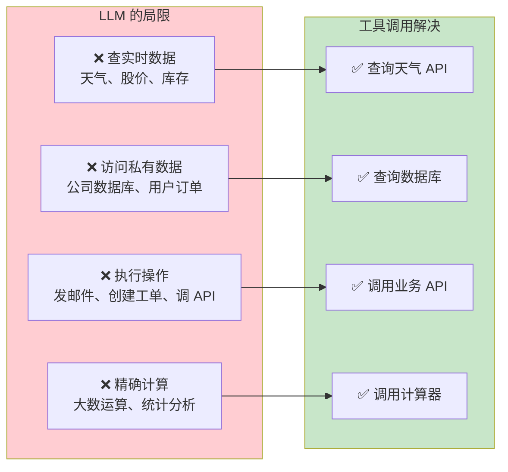
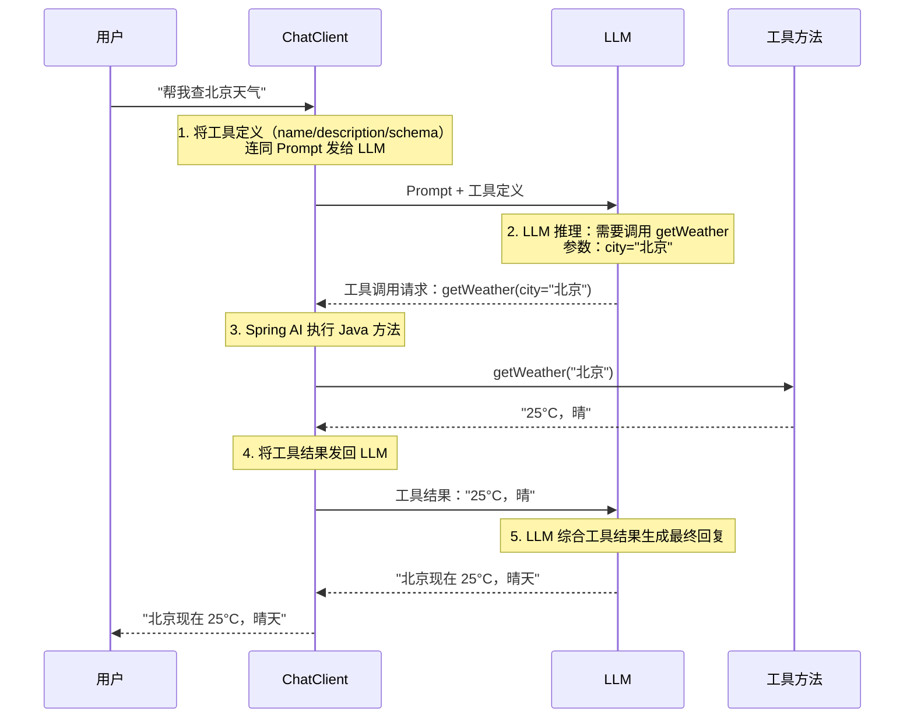
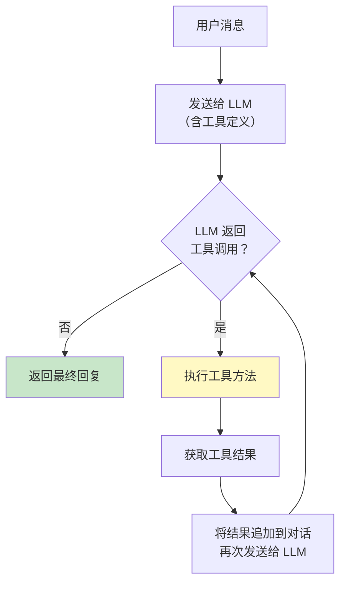

# 03-工具调用

> **定位**：讲透工具调用（Tool Calling / Function Calling）的完整机制——@Tool 注解、工具注册、调用循环、参数校验、错误处理。读完这篇，你能让 Agent 调用任何 Java 方法。
>
> **读者画像**：已经会用 ChatClient 对话，需要让 Agent 具备"执行操作"能力。
>
> **前置阅读**：[02-ChatClient 与对话模型](02-ChatClient与对话模型.md)。

---

## 1. 为什么需要工具调用

LLM 是冻结的——它的知识停留在训练数据的时间点。它不能：



工具调用的本质：**让 LLM 决定"调用什么、传什么参数"，让你的 Java 代码执行实际操作，结果再返回给 LLM 做总结**。

---

## 2. 工具调用完整流程



**关键理解**：LLM 自己不执行工具。它只是返回一个 JSON，告诉你的代码"请调用这个方法，参数是这些"。Spring AI 负责解析这个 JSON、找到对应的 Java 方法、执行、把结果塞回 Prompt 再发给 LLM。

---

## 3. @Tool 注解：定义工具

### 3.1 基本用法

```java
import org.springframework.ai.tool.annotation.Tool;
import org.springframework.ai.tool.annotation.ToolParam;

public class WeatherTools {

    @Tool(description = "查询指定城市的当前天气信息，包括温度和天气状况")
    public String getWeather(
            @ToolParam(description = "城市名称，例如：北京、上海") String city
    ) {
        // 实际调用天气 API
        // 这里用 mock 数据演示
        return "北京，25°C，晴";
    }
}
```

**两个注解的作用**：

| 注解 | 作用 | 为什么重要 |
|------|------|-----------|
| `@Tool(description=...)` | 描述工具的功能 | **LLM 根据这个描述决定是否调用**。描述写得越清晰，LLM 调用越准确 |
| `@ToolParam(description=...)` | 描述参数含义 | LLM 根据这个描述决定传什么参数值 |

> **最佳实践**：`description` 要写清楚"这个工具做什么"和"什么时候该用它"。这是 LLM 唯一的判断依据。

### 3.2 多参数工具

```java
public class OrderTools {

    @Tool(description = "根据订单号查询订单状态和物流信息")
    public OrderInfo queryOrder(
            @ToolParam(description = "订单号，格式为 ORD-XXXXXX") String orderId,
            @ToolParam(description = "查询类型：status=仅状态，detail=详细信息，logistics=物流轨迹") String type
    ) {
        // 实际查询数据库
        return orderService.findById(orderId, type);
    }
}
```

### 3.3 返回复杂对象

```java
public record OrderInfo(
    String orderId,
    String status,
    String logisticsInfo,
    String estimatedDelivery
) {}

@Tool(description = "查询订单信息")
public OrderInfo queryOrder(@ToolParam(description = "订单号") String orderId) {
    return orderService.findById(orderId);
}
```

Spring AI 自动将返回对象序列化为 JSON，LLM 能理解 JSON 结构。

---

## 4. 注册工具

### 4.1 调用时传入（最常用）

```java
String answer = chatClient.prompt()
        .user("帮我查一下 ORD-123456 的订单状态")
        .tools(new OrderTools())
        .call()
        .content();
```

### 4.2 构建时设置默认工具

```java
@Bean
ChatClient chatClient(ChatClient.Builder builder) {
    return builder
            .defaultTools(new WeatherTools(), new OrderTools(), new FaqTools())
            .build();
}
```

### 4.3 作为 Spring Bean 注入

```java
@Component
public class WeatherTools {

    private final WeatherApiService apiService;

    // 通过构造器注入依赖
    public WeatherTools(WeatherApiService apiService) {
        this.apiService = apiService;
    }

    @Tool(description = "查询指定城市的当前天气")
    public String getWeather(@ToolParam(description = "城市名称") String city) {
        return apiService.getWeather(city);
    }
}

// 注册时注入 Spring Bean（可以有依赖）
@Bean
ChatClient chatClient(ChatClient.Builder builder, WeatherTools weatherTools) {
    return builder
            .defaultTools(weatherTools)
            .build();
}
```

### 4.4 运行时动态注册工具

`ToolCallback` 是接口、没有 `builder()`（javap 实证 spring-ai-model 2.0.0）。动态注册工具用真实 API **`FunctionToolCallback.builder(name, function)`**：

```java
// Spring AI 2.0.0
// javap 实证：FunctionToolCallback.builder(String name, Function<I,O> function) + .description/.inputType/.build()
import org.springframework.ai.tool.function.FunctionToolCallback;

// 运行时动态注册工具
String answer = chatClient.prompt()
        .user("帮我查询信息")
        .tools(FunctionToolCallback.builder("searchWeb", (String query) -> webSearchService.search(query))
                .description("搜索互联网获取最新信息")
                .inputType(String.class)  // 声明入参类型 → 自动生成 JSON Schema
                .build())
        .call()
        .content();
```

> **注意**：Spring AI 2.0 官方的"渐进式工具发现"（Tool Search，工具按需加载、避免上下文爆炸）由 `spring-ai-tool-search-advisor` 模块提供，核心是 **`ToolSearchToolCallingAdvisor.builder()`**（javap 实证，位于 `org.springframework.ai.chat.client.advisor.toolsearch`，可链 `.toolIndex(ToolIndex)`、`.maxResults(int)` 等），需在 pom.xml 中添加依赖：
>
> ```xml
> <dependency>
>     <groupId>org.springframework.ai</groupId>
>     <artifactId>spring-ai-tool-search-advisor</artifactId>
> </dependency>
> ```
>
> 本节的 `FunctionToolCallback` 用于"调用时临时注入单个工具"的场景，与 Tool Search 的按需检索是两回事。

---

## 5. ToolCallingAdvisor：自动化的工具调用循环

当你注册了工具，Spring AI 2.0 会**自动**在 Advisor 链中插入一个 `ToolCallingAdvisor`。它负责：



这个循环会一直执行，直到 LLM 认为不再需要调用工具，返回最终文本回复。

**控制循环行为**：

```yaml
# application.yml（javap 实证：ChatClientBuilderProperties.CONFIG_PREFIX = "spring.ai.chat.client"，默认开启）
spring:
  ai:
    chat:
      client:
        tool-calling:
          enabled: true              # 默认开启；false = 手动接管工具执行
          advisor-order: 0           # 自定义链位置；默认值为 ToolCallingAdvisor.DEFAULT_ORDER（排最前）
```

```java
// Spring AI 2.0.0
import org.springframework.ai.chat.client.AdvisorParams;

// 单次调用禁用自动工具执行
String answer = chatClient.prompt()
        .user("测试消息")
        .tools(new MyTools())
        .advisors(AdvisorParams.toolCallingAdvisorAutoRegister(false))
        .call()
        .content();
```

---

## 6. 工具调用错误处理

### 6.1 工具执行异常

```java
@Tool(description = "查询用户信息")
public UserInfo getUser(@ToolParam(description = "用户 ID") String userId) {
    try {
        return userService.findById(userId);
    } catch (UserNotFoundException e) {
        // 返回明确的错误信息，LLM 会据此调整策略
        return new UserInfo(null, "用户不存在：" + userId);
    }
    // 注意：不要抛异常！抛异常会中断整个调用链。
    // 返回错误描述让 LLM 知道发生了什么，它可以重试或告知用户。
}
```

### 6.2 参数校验

LLM 可能传入格式错误的参数。在工具方法内部做校验：

```java
@Tool(description = "根据手机号查询用户")
public UserInfo findByPhone(@ToolParam(description = "手机号，11 位数字") String phone) {
    if (phone == null || !phone.matches("^1\\d{10}$")) {
        return UserInfo.error("手机号格式不正确，需要 11 位数字");
    }
    return userService.findByPhone(phone);
}
```

---

## 7. 工具设计的架构师思维

### 7.1 工具粒度

| 策略 | 示例 | 适用场景 |
|------|------|---------|
| **粗粒度** | `queryOrder(orderId)` — 一步到位 | LLM 只需决定"查不查"，参数简单 |
| **细粒度** | `getOrder(orderId)` → `getLogistics(trackingNo)` → `getDeliveryStatus(trackingNo)` | 需要多步骤链式调用 |

**建议**：从粗粒度开始，LLM 调用准确率更高。只有当工具功能太复杂、参数太多时才拆分。

### 7.2 工具数量管理

LLM 的工具列表会消耗上下文窗口 Token。工具太多会导致：
- Token 浪费（每个工具定义都占空间）
- LLM 选择困难（工具越多，选错概率越高）

**Spring AI 2.0 渐进式工具发现**（Progressive Tool Discovery）：

```java
// 只在需要时动态注入工具
String answer = chatClient.prompt()
        .user("查询天气")
        .tools(weatherTools)  // 只传天气工具，不传订单工具
        .call()
        .content();
```

### 7.3 幂等性

工具可能被 LLM 重复调用（网络超时后重试）。对于有副作用的操作（创建订单、发邮件），必须设计为幂等的：

```java
@Tool(description = "创建工单")
public Ticket createTicket(
        @ToolParam(description = "工单标题") String title,
        @ToolParam(description = "客户 ID") String customerId,
        @ToolParam(description = "幂等键，防止重复创建") String idempotentKey
) {
    // 先检查幂等键是否已存在
    if (ticketRepository.existsByIdempotentKey(idempotentKey)) {
        return ticketRepository.findByIdempotentKey(idempotentKey);
    }
    return ticketRepository.create(title, customerId, idempotentKey);
}
```

> **遇到阻塞？→ [教程 83-长任务持久化与中断恢复]**：幂等重试、检查点恢复的完整方案。

---

## 8. 完整示例：智能客服工具集

```java
@Component
public class CustomerServiceTools {

    private final OrderService orderService;
    private final ProductService productService;
    private final FaqService faqService;

    public CustomerServiceTools(OrderService orderService,
                                 ProductService productService,
                                 FaqService faqService) {
        this.orderService = orderService;
        this.productService = productService;
        this.faqService = faqService;
    }

    @Tool(description = "根据订单号查询订单状态、金额和物流信息")
    public OrderInfo queryOrder(
            @ToolParam(description = "订单号，格式 ORD-XXXXXX") String orderId
    ) {
        return orderService.queryById(orderId);
    }

    @Tool(description = "根据产品名称或关键词搜索产品信息，返回价格、库存和规格")
    public List<ProductInfo> searchProduct(
            @ToolParam(description = "搜索关键词") String keyword
    ) {
        return productService.search(keyword);
    }

    @Tool(description = "根据问题关键词搜索常见问题解答")
    public List<FaqItem> searchFaq(
            @ToolParam(description = "问题关键词") String keyword
    ) {
        return faqService.search(keyword);
    }

    @Tool(description = "为客户创建售后工单，需要客户 ID 和问题描述")
    public Ticket createTicket(
            @ToolParam(description = "客户 ID") String customerId,
            @ToolParam(description = "问题描述") String description,
            @ToolParam(description = "工单类型：退款、换货、维修、投诉") String type
    ) {
        String idempotentKey = customerId + ":" + description.hashCode();
        return orderService.createTicket(customerId, description, type, idempotentKey);
    }
}
```

---

## 9. 适用场景与不适用场景

### ✅ 适用场景

- 查询实时数据（天气、股价、库存、订单）
- 执行业务操作（创建工单、发送通知、修改状态）
- 精确计算（数学运算、数据分析）
- 访问外部系统（数据库、API、文件系统）

### ❌ 不适用场景

- 工具结果非常大（如返回百万行数据——应该分页或用 RAG）
- 工具执行时间极长（超过 30 秒——应该用异步模式）
- 安全敏感操作没有人工审批（直接删除、直接转账——需要 HITL）

---

## 10. 本章总结

| 概念 | 一句话 |
|------|--------|
| **工具调用** | LLM 决定"调用什么"，Java 代码执行"怎么做"，结果返回给 LLM 做总结 |
| **@Tool** | 标记工具方法；`description` 是 LLM 判断的唯一依据 |
| **@ToolParam** | 标记工具参数；描述越清晰，LLM 传参越准确 |
| **ToolCallingAdvisor** | 自动插入的 Advisor，执行"LLM→工具→LLM"的调用循环 |
| **错误处理** | 不要抛异常，返回描述性错误让 LLM 调整策略 |
| **幂等性** | 有副作用的工具必须设计为幂等的 |
| **工具粒度** | 从粗粒度开始，工具太多会降低准确率并浪费 Token |

**下一篇**：[04-记忆与会话管理](04-记忆与会话管理.md) — ChatMemory、短期 vs 长期记忆、会话隔离。

---

> **想深入？→ [附录 08-Agent安全深度/01-ToolPoisoning攻击.md]**：工具投毒攻击——恶意工具如何劫持 LLM 行为。
> **遇到阻塞？→ [教程 32-工具执行可观测与审计]**：Tool Call Span、参数结果记录、安全审计。
