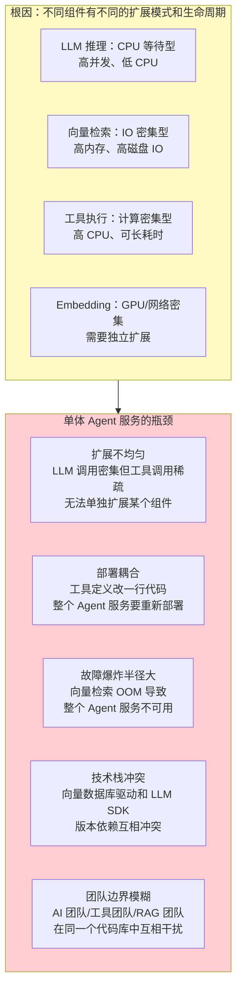
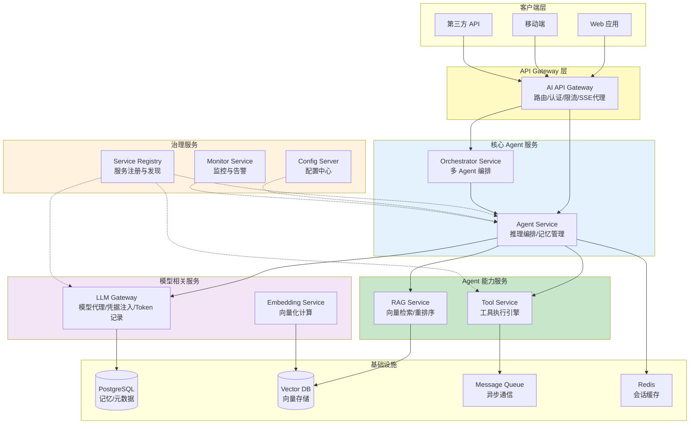
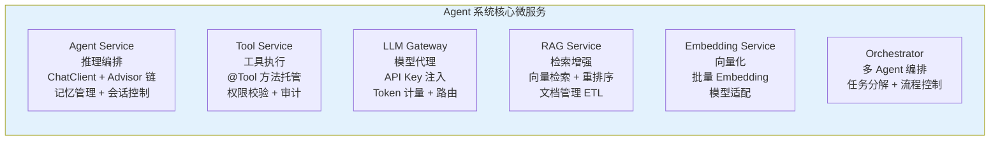
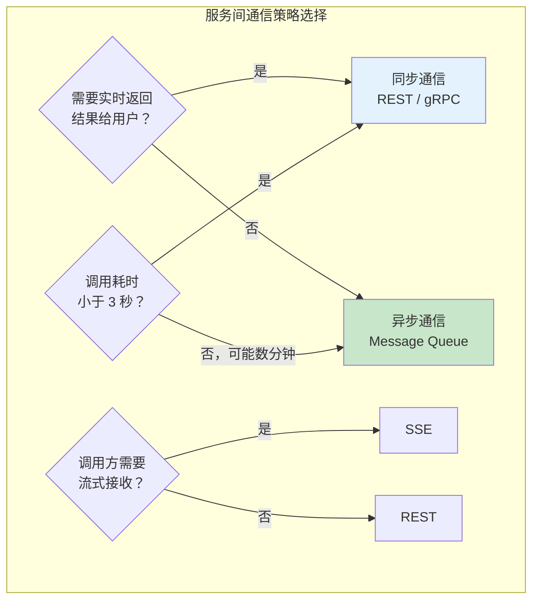
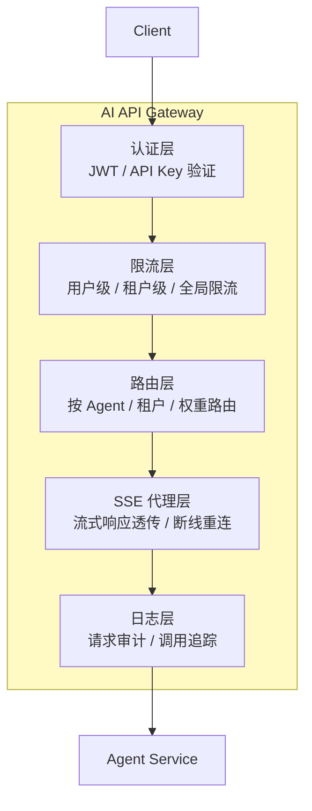
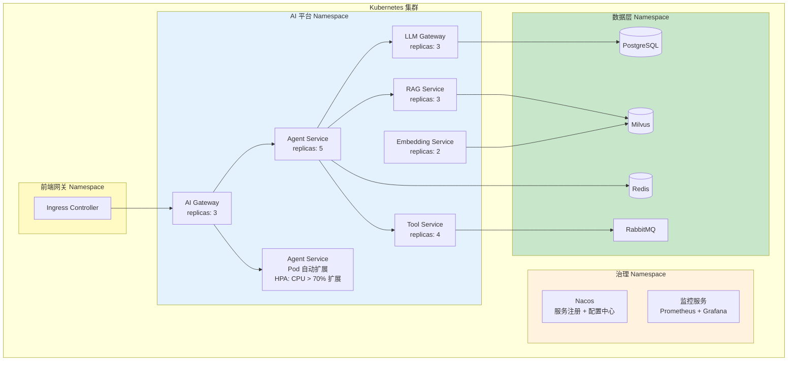
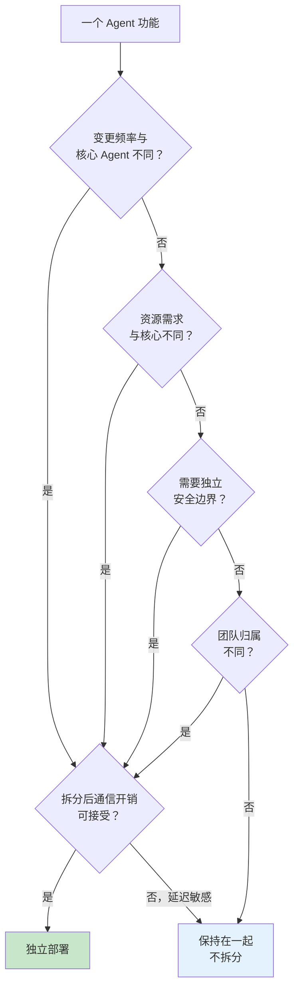

# 01 微服务拆分与 Agent 部署
> **定位**：讲透 Agent 系统的微服务化拆分策略——哪些组件应该独立部署、服务间如何通信（同步 gRPC/REST vs 异步消息队列）、API 网关层设计、Spring Cloud 集成方案。读完这篇，你能设计出可独立扩展、可独立部署的 Agent 微服务架构。
>
> **读者画像**：已经理解管控分离架构（[29-管控分离架构](00-管控分离架构.md)），正在规划 Agent 系统的微服务部署方案，需要解决服务拆分粒度、通信协议选择、服务发现与治理等问题。
>
> **前置阅读**：[29-管控分离架构](00-管控分离架构.md)。

---

## 1. Agent 系统为什么需要微服务化

### 1.1 单体 Agent 服务的扩展瓶颈

在小型项目中，一个 Spring Boot 应用包含所有逻辑——ChatClient 配置、工具定义、RAG 检索、Embedding 计算、记忆存储——看起来简单直接。但当系统进入生产环境并开始增长后，以下问题会逐步浮现：



核心矛盾在于：**Agent 系统的不同组件有完全不同的资源需求、扩展模式和变更频率**。把它们放在一个进程中，就会被迫用"最大公约数"来扩展——哪个组件最吃资源，整个服务就按那个标准来配资源。

### 1.2 微服务化的核心价值

| 价值维度 | 单体架构 | 微服务架构 |
|---------|---------|-----------|
| **独立扩展** | 整体复制 | 只扩展压力大的组件 |
| **独立部署** | 全量发布 | 只部署变更的服务 |
| **故障隔离** | 一处崩溃全部不可用 | 故障局限在单个服务 |
| **技术栈独立** | 统一技术栈 | 各服务选最合适的方案 |
| **团队自治** | 一个团队管全部 | 各团队负责自己的服务 |
| **渐进式重构** | 大爆炸式重写 | 逐个服务迁移 |

---

## 2. Agent 系统微服务拆分架构

### 2.1 全景架构图



### 2.2 各服务的职责定义



下面逐个说明每个服务的拆分理由和职责边界。

---

## 3. 各服务的拆分策略详解

### 3.1 Agent Service（推理编排服务）

**拆分理由**：Agent Service 是整个系统的"大脑"——它持有 ChatClient，管理对话流程，协调工具调用和检索。它的资源特征是**网络 IO 密集型**（等待 LLM 响应）而非计算密集型。

```java
// Spring AI 2.0.0
// Agent Service 的核心入口
@RestController
@RequestMapping("/api/agent")
public class AgentController {

    private final ChatClient chatClient;
    private final ConversationService conversationService;

    public AgentController(ChatClient chatClient,
                           ConversationService conversationService) {
        this.chatClient = chatClient;
        this.conversationService = conversationService;
    }

    // 同步对话
    @PostMapping("/chat")
    public ChatResponse chat(@RequestBody ChatRequest request) {
        String conversationId = conversationService
                .getOrCreateConversation(request.sessionId());

        String response = chatClient.prompt()
                .user(request.message())
                .advisors(a -> a.param(ChatMemory.CONVERSATION_ID, conversationId))
                .call()
                .content();

        return new ChatResponse(conversationId, response);
    }

    // SSE 流式对话——返回 Flux 支持流式输出
    @PostMapping(value = "/chat/stream", produces = MediaType.TEXT_EVENT_STREAM_VALUE)
    public Flux<ServerSentEvent<String>> chatStream(@RequestBody ChatRequest request) {
        String conversationId = conversationService
                .getOrCreateConversation(request.sessionId());

        return chatClient.prompt()
                .user(request.message())
                .advisors(a -> a.param(ChatMemory.CONVERSATION_ID, conversationId))
                .stream()
                .content()
                .map(chunk -> ServerSentEvent.<String>builder()
                        .data(chunk)
                        .event("token")
                        .build())
                .concatWith(Flux.just(
                        ServerSentEvent.<String>builder()
                                .event("done")
                                .data("[DONE]")
                                .build()
                ));
    }
}

public record ChatRequest(String sessionId, String message) {}
public record ChatResponse(String conversationId, String reply) {}
```

**Agent Service 的扩展策略**：水平扩展。每个实例是无状态的（会话状态存储在 Redis 中），通过负载均衡分发请求。根据并发 LLM 调用数来决定实例数。

### 3.2 Tool Service（工具执行服务）

**拆分理由**：工具执行有独特的资源特征——有些工具是计算密集型（数据分析、文件解析），有些需要长时间等待外部 API（HTTP 调用），有些有严格的安全要求（数据库写入）。将工具执行从 Agent Service 中分离出来，可以让工具按需独立扩展。

```java
// Spring AI 2.0.0
// Tool Service 的 gRPC 接口定义（简化版 Java 实现）
@RestController
@RequestMapping("/api/tools")
public class ToolExecutionController {

    private final ToolRegistry toolRegistry;
    private final ToolAuditLogger auditLogger;

    public ToolExecutionController(ToolRegistry toolRegistry,
                                    ToolAuditLogger auditLogger) {
        this.toolRegistry = toolRegistry;
        this.auditLogger = auditLogger;
    }

    @PostMapping("/execute")
    public ToolExecutionResult execute(@RequestBody ToolExecutionRequest request,
                                        @RequestHeader("X-Agent-Id") String agentId,
                                        @RequestHeader("X-Request-Id") String requestId) {
        // 1. 查找工具定义
        ToolDefinition tool = toolRegistry.findTool(request.toolName())
                .orElseThrow(() -> new ToolNotFoundException(request.toolName()));

        // 2. 权限校验——检查 Agent 是否有权调用此工具
        if (!toolRegistry.hasPermission(agentId, request.toolName())) {
            auditLogger.logDenied(agentId, request.toolName(), requestId);
            throw new AccessDeniedException(
                    "Agent " + agentId + " cannot call " + request.toolName());
        }

        // 3. 记录审计日志（调用前）
        auditLogger.logInvocation(agentId, request.toolName(),
                request.arguments(), requestId);

        // 4. 执行工具
        long startTime = System.nanoTime();
        try {
            Object result = toolRegistry.execute(request.toolName(), request.arguments());
            long durationMs = (System.nanoTime() - startTime) / 1_000_000;

            // 5. 记录审计日志（调用后）
            auditLogger.logResult(agentId, request.toolName(),
                    result, durationMs, requestId, true);

            return new ToolExecutionResult(
                    ToolStatus.SUCCESS, result, null, durationMs);
        } catch (Exception e) {
            long durationMs = (System.nanoTime() - startTime) / 1_000_000;
            auditLogger.logResult(agentId, request.toolName(),
                    null, durationMs, requestId, false);
            return new ToolExecutionResult(
                    ToolStatus.FAILED, null, e.getMessage(), durationMs);
        }
    }
}

public record ToolExecutionRequest(
        String toolName,
        Map<String, Object> arguments
) {}

public record ToolExecutionResult(
        ToolStatus status,
        Object result,
        String error,
        long durationMs
) {}

public enum ToolStatus { SUCCESS, FAILED, TIMEOUT }
```

**关键设计**：Tool Service 是 Agent Service 的**远程工具提供者**。Agent Service 通过 HTTP/gRPC 调用 Tool Service，而不是在本地执行工具方法。这样做的好处是：

- 工具的版本更新不影响 Agent Service
- 不同工具可以部署在不同配置的机器上（如数据分析工具部署在高 CPU 机器）
- 工具执行有独立的安全边界和审计链路

### 3.3 LLM Gateway（LLM 网关服务）

**拆分理由**：LLM Gateway 是所有模型调用的唯一出口。它负责 API Key 管理、模型路由、Token 计量、请求缓存。将其独立部署可以统一安全策略和成本控制。

```java
// Spring AI 2.0.0
// LLM Gateway——统一模型调用代理
@RestController
@RequestMapping("/gateway/v1")
public class LLMGatewayController {

    private final ModelRouteService modelRouteService;
    private final CredentialService credentialService;
    private final TokenMeter tokenMeter;
    private final WebClient webClient;

    public LLMGatewayController(ModelRouteService modelRouteService,
                                 CredentialService credentialService,
                                 TokenMeter tokenMeter,
                                 WebClient webClient) {
        this.modelRouteService = modelRouteService;
        this.credentialService = credentialService;
        this.tokenMeter = tokenMeter;
        this.webClient = webClient;
    }

    // OpenAI 兼容格式（DeepSeek 等也使用此格式）
    @PostMapping("/chat/completions")
    public Mono<JsonNode> chatCompletion(
            @RequestBody JsonNode body,
            @RequestHeader("X-Service-Id") String serviceId,
            @RequestHeader("X-Tenant-Id") String tenantId) {

        String requestedModel = body.get("model").asText();

        // 1. 模型路由：根据租户策略选择实际模型
        String actualModel = modelRouteService.resolveModel(
                requestedModel, tenantId, serviceId);

        // 2. 凭据获取
        String apiKey = credentialService.getApiKey(
                modelRouteService.getProvider(actualModel), serviceId);

        // 3. 替换请求中的模型名
        ObjectNode modifiedBody = body.deepCopy();
        modifiedBody.put("model", actualModel);

        // 4. 转发到真实 LLM API
        String endpoint = modelRouteService.getEndpoint(actualModel);
        return webClient.post()
                .uri(endpoint + "/v1/chat/completions")
                .header("Authorization", "Bearer " + apiKey)
                .bodyValue(modifiedBody)
                .retrieve()
                .bodyToMono(JsonNode.class)
                .doOnSuccess(resp -> {
                    // 5. 记录 Token 用量
                    JsonNode usage = resp.path("usage");
                    tokenMeter.record(TokenUsageRecord.builder()
                            .tenantId(tenantId)
                            .serviceId(serviceId)
                            .model(actualModel)
                            .promptTokens(usage.path("prompt_tokens").asInt())
                            .completionTokens(usage.path("completion_tokens").asInt())
                            .totalTokens(usage.path("total_tokens").asInt())
                            .timestamp(Instant.now())
                            .build());
                });
    }

    // 流式接口
    @PostMapping(value = "/chat/completions/stream",
                 produces = MediaType.TEXT_EVENT_STREAM_VALUE)
    public Flux<String> chatCompletionStream(
            @RequestBody JsonNode body,
            @RequestHeader("X-Service-Id") String serviceId) {

        String model = body.get("model").asText();
        String apiKey = credentialService.getApiKey(
                modelRouteService.getProvider(model), serviceId);
        String endpoint = modelRouteService.getEndpoint(model);

        return webClient.post()
                .uri(endpoint + "/v1/chat/completions")
                .header("Authorization", "Bearer " + apiKey)
                .bodyValue(body)
                .retrieve()
                .bodyToFlux(String.class);
    }
}
```

### 3.4 RAG Service（检索增强服务）

**拆分理由**：向量检索是 IO 密集型操作，大量内存用于缓存向量索引。将其独立部署可以根据检索负载独立扩展，不影响 Agent Service。

```java
// Spring AI 2.0.0
// RAG Service——独立部署的检索增强服务
@RestController
@RequestMapping("/api/rag")
public class RagController {

    private final VectorStore vectorStore;
    private final EmbeddingService embeddingService;

    public RagController(VectorStore vectorStore,
                         EmbeddingService embeddingService) {
        this.vectorStore = vectorStore;
        this.embeddingService = embeddingService;
    }

    // 语义检索
    @PostMapping("/search")
    public List<SearchResult> search(@RequestBody SearchRequest request) {
        List<Document> docs = vectorStore.similaritySearch(
                org.springframework.ai.vectorstore.SearchRequest.builder()
                        .query(request.query())
                        .topK(request.topK())
                        .similarityThreshold(request.threshold())
                        .filterExpression(request.filter())
                        .build()
        );

        return docs.stream()
                .map(doc -> new SearchResult(
                        doc.getText(),
                        doc.getMetadata(),
                        doc.getScore()
                ))
                .toList();
    }

    // 文档摄入
    @PostMapping("/ingest")
    public IngestResult ingest(@RequestBody IngestRequest request) {
        List<Document> docs = request.documents().stream()
                .map(text -> Document.builder()
                        .text(text)
                        .metadata(request.metadata())
                        .build())
                .toList();

        vectorStore.add(docs);
        return new IngestResult(docs.size(), Instant.now());
    }
}

public record SearchResult(String content, Map<String, Object> metadata, double score) {}
```

### 3.5 Embedding Service（向量化服务）

**拆分理由**：Embedding 计算可能使用 GPU 或专用模型服务。将其独立可以按需部署在 GPU 机器上。

```java
// Spring AI 2.0.0
// Embedding Service——独立的向量化服务
@RestController
@RequestMapping("/api/embedding")
public class EmbeddingController {

    private final EmbeddingModel embeddingModel;

    public EmbeddingController(EmbeddingModel embeddingModel) {
        this.embeddingModel = embeddingModel;
    }

    @PostMapping("/embed")
    public EmbeddingResponse embed(@RequestBody EmbeddingRequest request) {
        float[] vector = embeddingModel.embed(request.text());
        return new EmbeddingResponse(vector, vector.length);
    }

    @PostMapping("/embed/batch")
    public BatchEmbeddingResponse embedBatch(@RequestBody BatchEmbeddingRequest request) {
        List<float[]> vectors = embeddingModel.embed(request.texts());
        return new BatchEmbeddingResponse(vectors);
    }
}

public record EmbeddingRequest(String text) {}
public record EmbeddingResponse(float[] vector, int dimensions) {}
```

---

## 4. 服务间通信策略

### 4.1 同步 vs 异步的决策矩阵



| 通信场景 | 推荐方式 | 原因 |
|---------|---------|------|
| Agent Service → LLM Gateway | REST + SSE | 需要 HTTP 兼容性，流式返回 Token |
| Agent Service → Tool Service | gRPC | 低延迟、强类型、双向流 |
| Agent Service → RAG Service | gRPC / REST | 低延迟检索 |
| Agent Service → Embedding Service | gRPC | 批量高效传输向量数据 |
| Orchestrator → Agent Service | gRPC | 编排指令需快速响应 |
| 长耗时工具（文件处理、批量分析）| 消息队列 | 异步解耦，避免超时 |
| Token 计量上报 | 消息队列 | 异步写入，不阻塞主流程 |
| 审计日志写入 | 消息队列 | 批量写入，降低数据库压力 |

### 4.2 gRPC 通信实现

Agent Service 与 Tool Service 之间的 gRPC 通信示例：

```protobuf
// tool-service.proto
syntax = "proto3";

package ai.platform.tool;

service ToolService {
  rpc ExecuteTool (ToolExecutionRequest) returns (ToolExecutionResponse);
  rpc ExecuteToolStream (ToolExecutionRequest) returns (stream ToolChunk);
  rpc ListTools (ListToolsRequest) returns (ListToolsResponse);
}

message ToolExecutionRequest {
  string tool_name = 1;
  map<string, string> arguments = 2;
  string agent_id = 3;
  string request_id = 4;
}

message ToolExecutionResponse {
  string status = 1;          // SUCCESS / FAILED / TIMEOUT
  string result_json = 2;     // 工具执行结果（JSON 格式）
  string error_message = 3;
  int64 duration_ms = 4;
}

message ToolChunk {
  string data = 1;
  bool is_final = 2;
}
```

```java
// Spring AI 2.0.0
// Agent Service 侧——通过 gRPC 调用远程工具服务
@Service
public class RemoteToolCallback implements ToolCallback {

    private final ToolServiceBlockingStub toolStub;
    private final String toolName;
    private final String description;

    public RemoteToolCallback(ToolServiceBlockingStub toolStub,
                               String toolName, String description) {
        this.toolStub = toolStub;
        this.toolName = toolName;
        this.description = description;
    }

    @Override
    public ToolDefinition getToolDefinition() {
        return ToolDefinition.builder()
                .name(toolName)
                .description(description)
                .build();
    }

    @Override
    public String call(String toolInput) {
        // 解析工具输入参数
        Map<String, String> args = parseArguments(toolInput);

        ToolExecutionRequest request = ToolExecutionRequest.newBuilder()
                .setToolName(toolName)
                .putAllArguments(args)
                .setAgentId(ContextKeys.AGENT_ID.get())
                .setRequestId(UUID.randomUUID().toString())
                .build();

        ToolExecutionResponse response = toolStub.executeTool(request);

        if (!"SUCCESS".equals(response.getStatus())) {
            return "Tool execution failed: " + response.getErrorMessage();
        }

        return response.getResultJson();
    }

    private Map<String, String> parseArguments(String json) {
        try {
            ObjectMapper mapper = new ObjectMapper();
            Map<String, Object> raw = mapper.readValue(json, Map.class);
            Map<String, String> result = new HashMap<>();
            raw.forEach((k, v) -> result.put(k, String.valueOf(v)));
            return result;
        } catch (Exception e) {
            return Map.of();
        }
    }
}
```

### 4.3 异步消息队列通信

对于不需要实时返回结果的场景，使用消息队列解耦：

```java
// Spring AI 2.0.0
// 异步工具执行——通过消息队列发送工具调用请求
@Service
public class AsyncToolDispatcher {

    private final RabbitTemplate rabbitTemplate;

    public AsyncToolDispatcher(RabbitTemplate rabbitTemplate) {
        this.rabbitTemplate = rabbitTemplate;
    }

    // 发送异步工具调用
    public String dispatchAsync(ToolExecutionRequest request) {
        String taskId = UUID.randomUUID().toString();

        // 发送到消息队列
        rabbitTemplate.convertAndSend(
                "tool.exchange",
                "tool.execute." + request.toolName(),
                new AsyncToolTask(taskId, request, Instant.now())
        );

        return taskId;  // 返回任务 ID，客户端可轮询结果
    }
}

// 异步工具结果消费者
@Component
public class AsyncToolResultConsumer {

    private final ResultStore resultStore;

    public AsyncToolResultConsumer(ResultStore resultStore) {
        this.resultStore = resultStore;
    }

    @RabbitListener(queues = "tool.result.queue")
    public void handleResult(AsyncToolResult result) {
        resultStore.save(result.taskId(), result);
    }
}

@RestController
@RequestMapping("/api/tools/async")
public class AsyncToolController {

    private final ResultStore resultStore;

    @GetMapping("/result/{taskId}")
    public AsyncToolResult getResult(@PathVariable String taskId) {
        return resultStore.get(taskId)
                .orElseThrow(() -> new TaskNotFoundException(taskId));
    }
}
```

---

## 5. API 网关层设计

### 5.1 AI API Gateway 的职责



### 5.2 使用 Spring Cloud Gateway 实现

```java
// Spring AI 2.0.0 + Spring Cloud Gateway
// AI API Gateway 配置
@Configuration
public class AIGatewayConfiguration {

    @Bean
    public RouteLocator aiRoutes(RouteLocatorBuilder builder,
                                  TokenRateLimiter rateLimiter) {
        return builder.routes()
                // Agent 对话路由
                .route("agent-chat", r -> r
                        .path("/api/agent/**")
                        .filters(f -> f
                                .filter(rateLimiter)
                                .rewritePath("/api/agent/(?<segment>.*)",
                                        "/api/agent/${segment}")
                                .addRequestHeader("X-Gateway", "ai-gateway")
                        )
                        .uri("lb://agent-service"))

                // SSE 流式路由——需要特殊超时配置
                .route("agent-stream", r -> r
                        .path("/api/agent/chat/stream")
                        .and().header("Accept", "text/event-stream")
                        .filters(f -> f
                                .filter(rateLimiter)
                                .requestSize(1024L * 1024L)  // 限制请求体 1MB
                        )
                        .uri("lb://agent-service"))

                // LLM Gateway 路由
                .route("llm-gateway", r -> r
                        .path("/gateway/v1/**")
                        .filters(f -> f
                                .filter(rateLimiter)
                                .addRequestHeader("X-Internal-Call", "true")
                        )
                        .uri("lb://llm-gateway"))

                .build();
    }
}
```

```java
// Spring AI 2.0.0
// 自定义限流过滤器——基于 Redis 的令牌桶（响应式实现）
// WebFlux 铁律：EventLoop 上禁止阻塞调用，Redis 必须用 ReactiveRedisTemplate，
// 故用 ReactiveStringRedisTemplate（org.springframework.data.redis.core.ReactiveStringRedisTemplate）。
@Component
public class TokenRateLimiter implements GatewayFilter {

    private final ReactiveStringRedisTemplate redisTemplate;

    public TokenRateLimiter(ReactiveStringRedisTemplate redisTemplate) {
        this.redisTemplate = redisTemplate;
    }

    @Override
    public Mono<Void> filter(ServerWebExchange exchange,
                              GatewayFilterChain chain) {
        String userId = exchange.getRequest().getHeaders()
                .getFirst("X-User-Id");

        if (userId == null) {
            return chain.filter(exchange);
        }

        String key = "rate_limit:" + userId;
        return redisTemplate.opsForValue().increment(key)
                .flatMap(current -> {
                    // 第一次请求，设置过期时间（1 分钟）
                    if (current == 1) {
                        return redisTemplate.expire(key, Duration.ofMinutes(1))
                                .thenReturn(current);
                    }
                    return Mono.just(current);
                })
                .flatMap(current -> {
                    int limit = 60;  // 每分钟 60 次请求
                    if (current > limit) {
                        exchange.getResponse()
                                .setStatusCode(HttpStatus.TOO_MANY_REQUESTS);
                        return exchange.getResponse().setComplete();
                    }
                    return chain.filter(exchange);
                });
    }
}
```

---

## 6. Spring Cloud 集成

### 6.1 服务注册与发现

```yaml
# application.yml — Agent Service 配置
spring:
  application:
    name: agent-service
  cloud:
    nacos:
      discovery:
        server-addr: ${NACOS_HOST:nacos}:8848
        namespace: ai-platform
        group: AGENT_GROUP
        metadata:
          service-type: agent
          supported-models: deepseek-chat,deepseek-reasoner
          max-concurrent: 100

# application.yml — LLM Gateway 配置
server:
  port: 8090
spring:
  application:
    name: llm-gateway
  cloud:
    nacos:
      discovery:
        server-addr: ${NACOS_HOST:nacos}:8848
        namespace: ai-platform
        metadata:
          service-type: llm-gateway
```

```java
// Spring AI 2.0.0
// 使用 OpenFeign 声明式调用其他微服务
@FeignClient(name = "tool-service", path = "/api/tools")
public interface ToolServiceClient {

    @PostMapping("/execute")
    ToolExecutionResult execute(@RequestBody ToolExecutionRequest request);

    @GetMapping("/list")
    List<ToolDefinition> listTools();
}

@FeignClient(name = "rag-service", path = "/api/rag")
public interface RagServiceClient {

    @PostMapping("/search")
    List<SearchResult> search(@RequestBody SearchRequest request);
}

@FeignClient(name = "llm-gateway", path = "/gateway/v1")
public interface LLMGatewayClient {

    @PostMapping("/chat/completions")
    Mono<JsonNode> chatCompletion(@RequestBody JsonNode body);
}
```

### 6.2 配置中心

```java
// Spring AI 2.0.0
// 从 Nacos 配置中心动态加载 Agent 配置
@RefreshScope
@Component
@ConfigurationProperties(prefix = "agent.config")
public class AgentConfig {

    private String systemPrompt;
    private String preferredModel;
    private List<String> enabledTools;
    private int maxConversationTurns;
    private double temperature;
    private int maxTokens;

    // getters and setters...
}

// application.yml
spring:
  cloud:
    nacos:
      config:
        server-addr: ${NACOS_HOST:nacos}:8848
        namespace: ai-platform
        group: AGENT_CONFIG
        file-extension: yaml
        refresh-enabled: true  # 支持配置热更新
```

### 6.3 熔断与降级

```java
// Spring AI 2.0.0 + Resilience4j
// LLM 调用的熔断降级——当 LLM Gateway 连续超时时自动降级
@Service
public class ResilientLLMClient {

    private final LLMGatewayClient llmGateway;
    private final ChatModel fallbackLocalModel;  // 本地降级模型

    public ResilientLLMClient(LLMGatewayClient llmGateway,
                               ChatModel fallbackLocalModel) {
        this.llmGateway = llmGateway;
        this.fallbackLocalModel = fallbackLocalModel;
    }

    @CircuitBreaker(name = "llm-gateway", fallbackMethod = "fallback")
    @TimeLimiter(name = "llm-gateway")
    public Mono<String> callLLM(ChatRequest request) {
        return llmGateway.chatCompletion(buildBody(request))
                .map(this::extractContent)
                .timeout(Duration.ofSeconds(30));
    }

    // 熔断降级方法——使用本地模型或缓存回复
    private Mono<String> fallback(ChatRequest request, Exception e) {
        // 降级策略 1：使用本地小模型
        return Mono.fromCallable(() ->
                fallbackLocalModel.call(buildPrompt(request)).getResult().getOutput().getText()
        ).onErrorResume(e2 ->
                // 降级策略 2：返回预设回复
                Mono.just("系统繁忙，请稍后重试。您的请求已排队。")
        );
    }

    private JsonNode buildBody(ChatRequest request) {
        // 构造 LLM Gateway 请求体
        return new ObjectMapper().createObjectNode()
                .put("model", request.model())
                .put("messages", request.message());
    }

    private String extractContent(JsonNode response) {
        return response.path("choices").get(0)
                .path("message").path("content").asText();
    }

    private org.springframework.ai.chat.prompt.Prompt buildPrompt(ChatRequest request) {
        return new org.springframework.ai.chat.prompt.Prompt(request.message());
    }
}
```

### 6.4 链路追踪

```yaml
# 所有微服务的统一追踪配置
management:
  tracing:
    sampling:
      probability: 1.0  # 100% 采样率（生产环境降低到 0.1）
  zipkin:
    tracing:
      endpoint: ${ZIPKIN_ENDPOINT:http://zipkin:9411}/api/v2/spans

  # OpenTelemetry 配置
  opentelemetry:
    resource-attributes:
      service.namespace: ai-platform
```

---

## 7. 部署拓扑

### 7.1 Kubernetes 部署拓扑



### 7.2 水平自动扩展（HPA）策略

```yaml
# Agent Service HPA 配置
apiVersion: autoscaling/v2
kind: HorizontalPodAutoscaler
metadata:
  name: agent-service-hpa
spec:
  scaleTargetRef:
    apiVersion: apps/v1
    kind: Deployment
    name: agent-service
  minReplicas: 3
  maxReplicas: 20
  metrics:
    - type: Resource
      resource:
        name: cpu
        target:
          type: Utilization
          averageUtilization: 60  # CPU 使用率超过 60% 扩展
    - type: Pods
      pods:
        metric:
          name: active_conversations  # 自定义指标：活跃对话数
        target:
          type: AverageValue
          averageValue: "50"  # 每个 Pod 处理 50 个对话时扩展
```

| 服务 | 最小副本 | 最大副本 | 扩展指标 | 扩展阈值 |
|------|---------|---------|---------|---------|
| Agent Service | 3 | 20 | CPU + 活跃对话数 | CPU > 60% 或 对话 > 50/Pod |
| Tool Service | 2 | 10 | 请求队列长度 | 队列 > 20 |
| LLM Gateway | 3 | 10 | QPS | QPS > 500/Pod |
| RAG Service | 2 | 8 | 检索延迟 | P95 > 500ms |
| Embedding Service | 1 | 4 | 批量请求积压 | 积压 > 100 |

---

## 8. 服务拆分粒度的决策原则

### 8.1 拆还是不拆？



### 8.2 常见拆分错误

| 错误 | 后果 | 正确做法 |
|------|------|---------|
| 按每个工具拆分 | 服务数量爆炸，运维成本极高 | 按工具类别聚合（查询类/写入类/分析类） |
| Agent 和 LLM Gateway 不分离 | 模型路由变更需要重启 Agent | 独立部署，解耦生命周期 |
| RAG 和 Embedding 混在一起 | 向量索引内存挤占 Embedding 计算资源 | 分开部署，独立扩展 |
| 过度使用异步消息 | 简单调用变成复杂的回调链 | 实时调用用 gRPC，仅长耗时用消息队列 |
| 忽略 SSE 透传 | 网关层截断流式响应 | 网关配置正确的 SSE 代理 |

---

## 9. 适用场景与不适用场景

### 适用场景

- **生产级 Agent 系统**：需要高可用、独立扩展、独立部署
- **多团队协作**：AI 团队、工具团队、基础设施团队各管一面
- **高并发场景**：不同组件有截然不同的负载模式
- **多模型环境**：需要统一的 LLM Gateway 管理多个模型提供商
- **严格合规要求**：需要服务级隔离、独立审计、故障爆炸半径可控
- **持续迭代**：需要各服务独立发布、灰度、回滚

### 不适用场景

- **MVP/原型阶段**：验证概念时单体更高效，微服务引入不必要的复杂度
- **单团队小项目**：1-3 人团队管理 5+ 微服务会陷入运维泥潭
- **低流量内部工具**：日均调用不超过千次，拆分后通信开销大于收益
- **学习项目**：理解 Spring AI 核心概念时不需要分布式复杂度
- **极简 Agent**：只有对话能力、没有工具调用和 RAG 的简单 Agent

---

## 10. 本章总结

| 概念 | 一句话 |
|------|--------|
| **微服务化** | 按资源需求和变更频率拆分，让每个组件独立扩展和部署 |
| **Agent Service** | 推理编排中心——ChatClient + Advisor 链 + 记忆管理，网络 IO 密集型 |
| **Tool Service** | 工具执行引擎——远程工具提供者，有独立安全边界和审计 |
| **LLM Gateway** | 模型调用唯一出口——API Key 注入、Token 计量、模型路由 |
| **RAG Service** | 检索增强服务——向量检索 + 重排序，IO 密集型 |
| **Embedding Service** | 向量化计算——可独立部署在 GPU 机器上 |
| **同步通信** | REST/gRPC——实时调用、低延迟场景 |
| **异步通信** | 消息队列——长耗时工具、日志上报、审计写入 |
| **AI API Gateway** | 统一入口——认证、限流、路由、SSE 代理 |
| **Spring Cloud** | 服务注册发现（Nacos）+ 配置中心 + 熔断降级（Resilience4j）|
| **HPA** | 水平自动扩展——按 CPU + 自定义指标（如活跃对话数）动态扩展 |
| **拆分原则** | 变更频率不同、资源需求不同、安全边界不同时才拆分 |

---

> **上一篇**：[29-管控分离架构](00-管控分离架构.md) — 控制面与数据面的架构分离，微服务拆分是数据面内部进一步的解耦。
>
> **下一篇**：[31-全链路可观测性](02-全链路可观测性.md) — 微服务拆分后，跨服务追踪和监控变得至关重要。
>
> **想深入**：[57-多页面流式响应与会话管理](04-多页面流式响应与会话管理.md) — SSE 在网关层的代理和连接管理。
>
> **想深入**：消息队列选型（Kafka vs RabbitMQ vs RocketMQ vs Pulsar）与事件骨干的生产级机制，见 [教程 07-Kafka事件骨干/00-Kafka全景与核心概念]（10 篇）；跨服务 Trace 在 HTTP/消息边界的传播机制，见 [教程 05-Observation可观测/06-Trace链路：traceId贯穿HTTP、LLM、工具与日志]。
