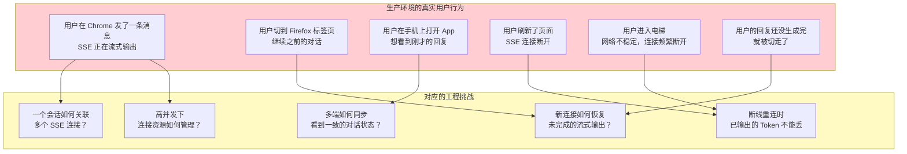
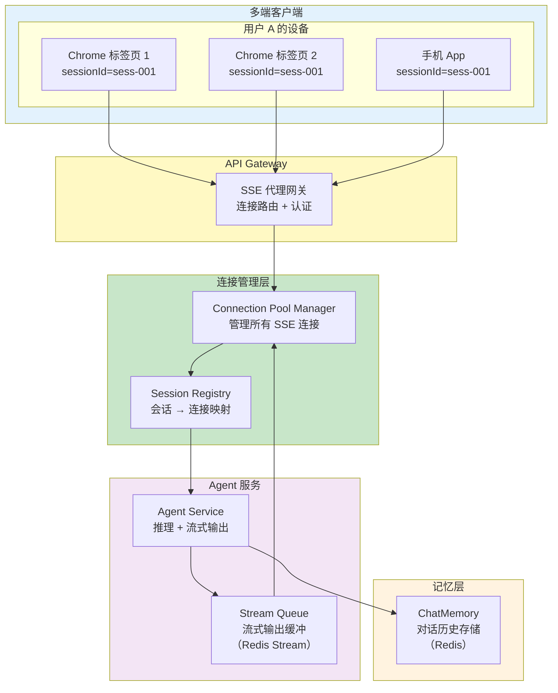
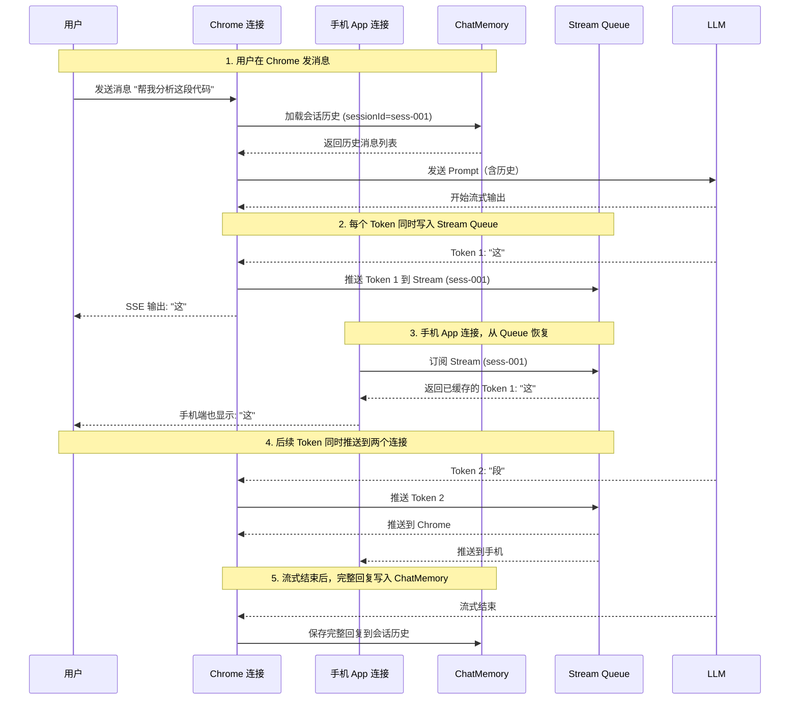
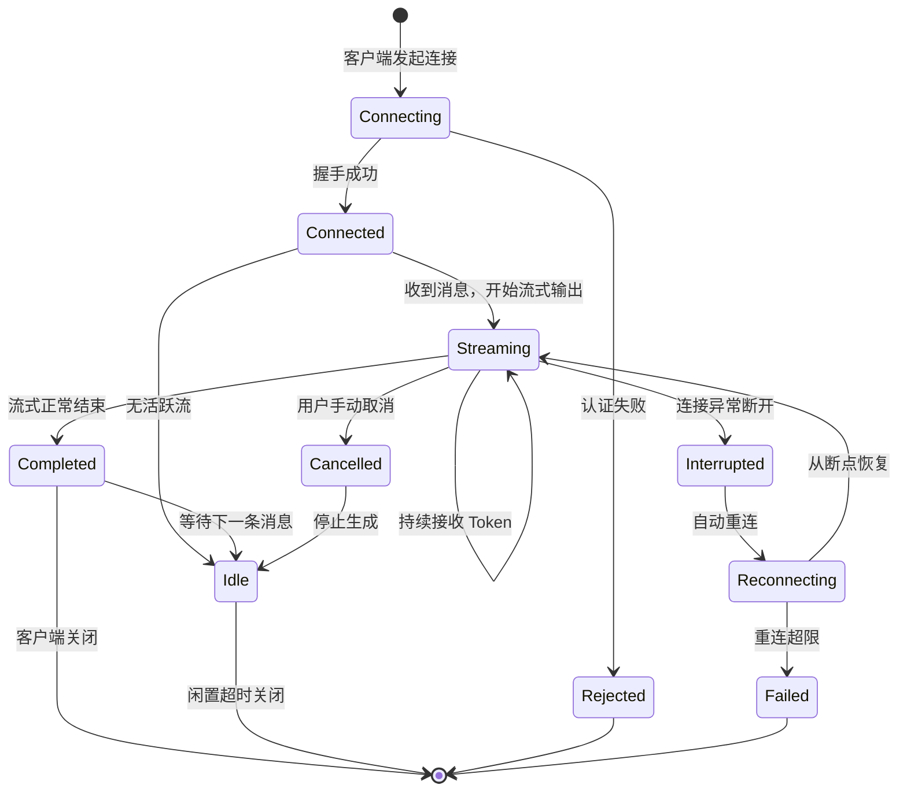
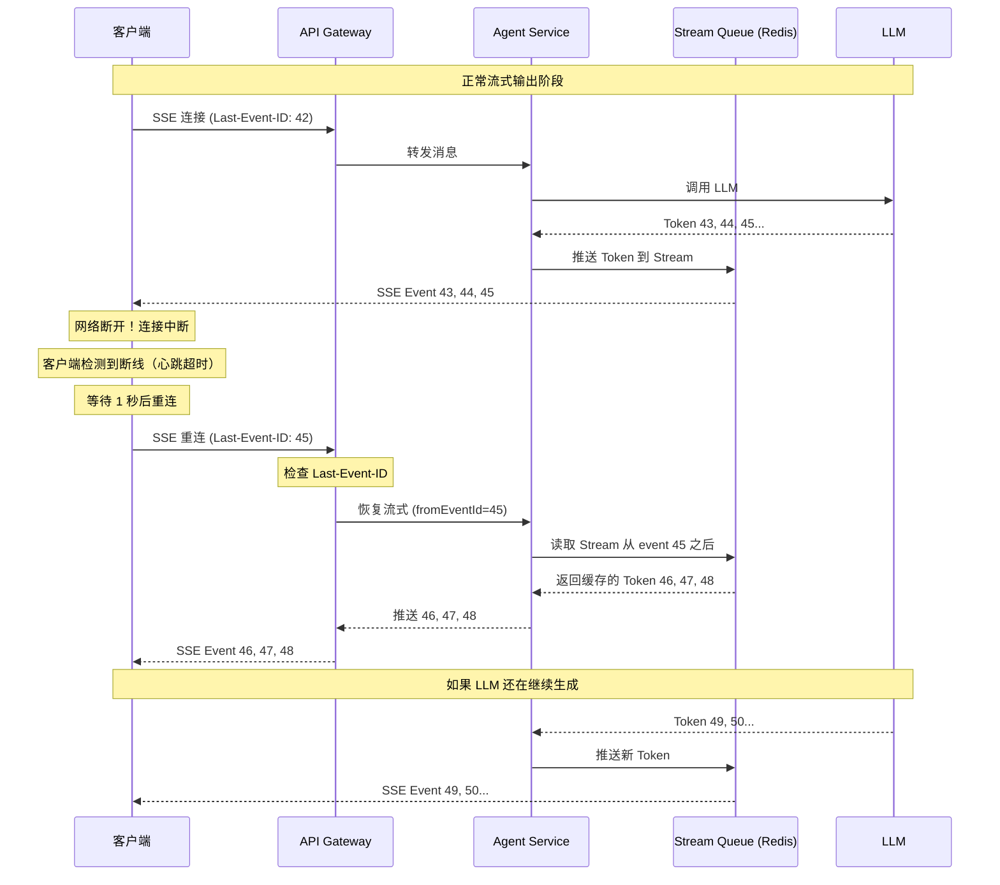
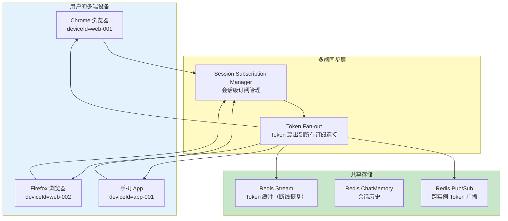
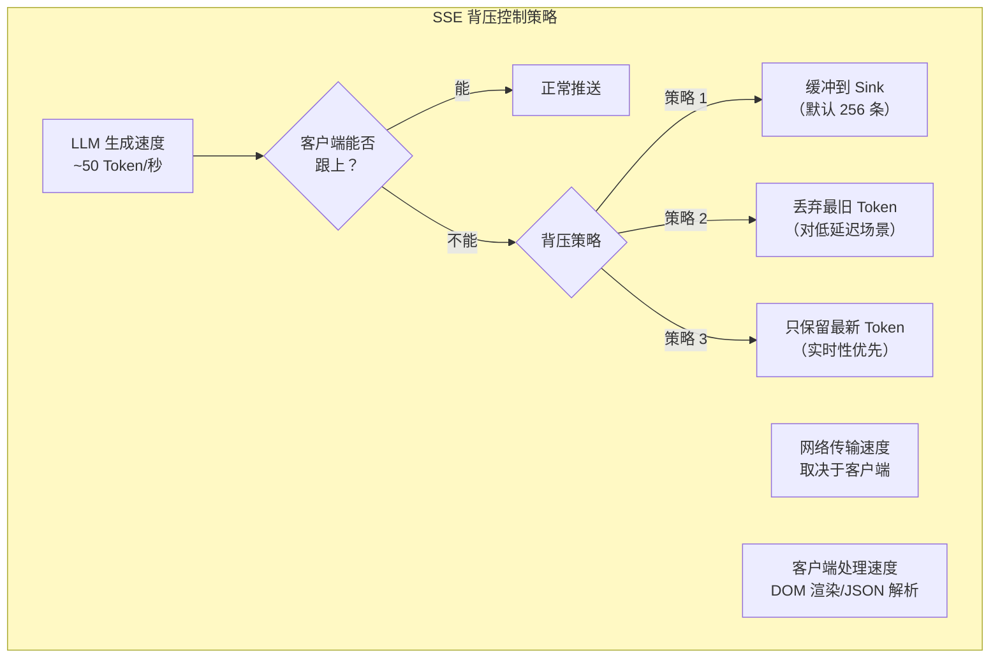
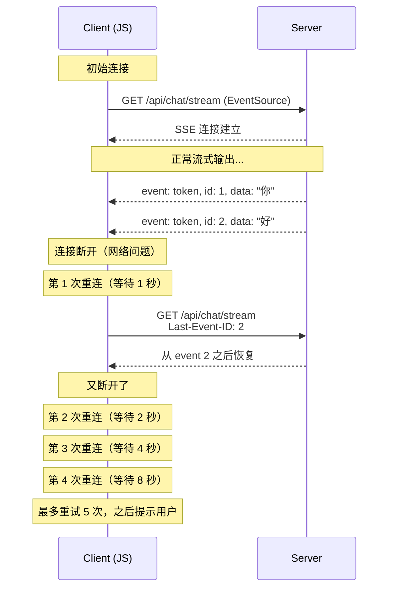
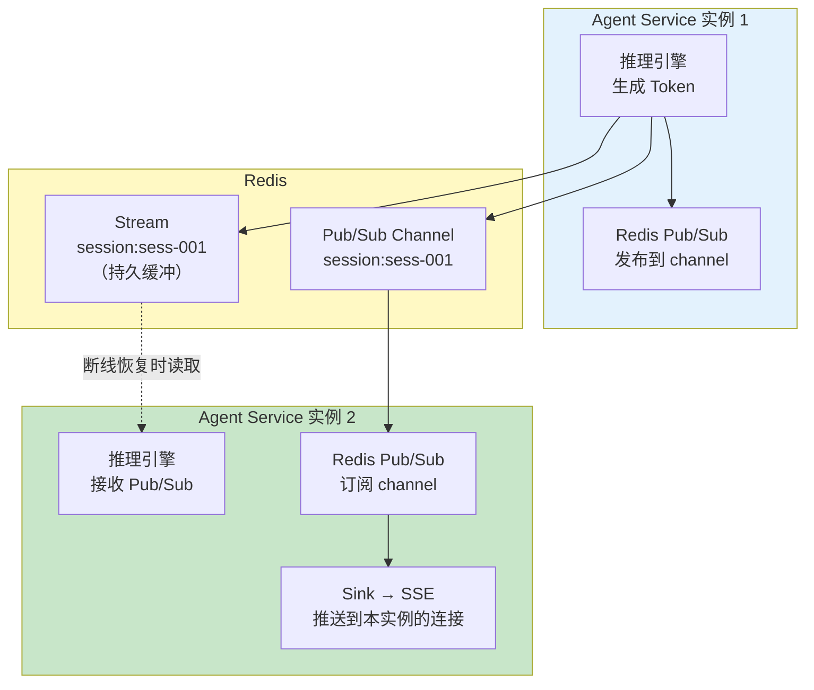
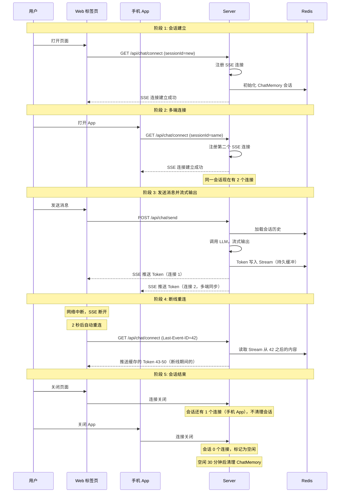

# 04 多页面流式响应与会话管理
> **定位**：讲透跨页面/跨会话的 SSE 连接管理——断线重连机制、流式中断恢复、连接池管理、多端同步（Web/移动端/多标签页）、SSE 连接与 ChatMemory 的关系、WebFlux 中的连接生命周期管理。读完这篇，你能设计出支持多端同步、断线恢复、高并发的流式 Agent 系统。
>
> **读者画像**：已经掌握 SSE 流式输出基础（[02-ChatClient 与对话模型](../00-基础与核心/02-ChatClient与对话模型.md)），正在设计生产级多端 Agent 应用，需要解决连接管理、断线恢复、多端同步等工程问题。
>
> **前置阅读**：[04-记忆与会话管理](../00-基础与核心/04-记忆与会话管理.md)、[15-微服务拆分与 Agent 部署](01-微服务拆分与Agent部署.md)。

---

## 1. 多页面流式的核心挑战

### 1.1 从单页 SSE 到多页 SSE

在简单的 Demo 中，一个用户在一个浏览器标签页里发一条消息，收到一条 SSE 流式回复，然后连接关闭。但生产环境中，用户的行为模式远比这复杂：



### 1.2 关键问题清单

| 问题 | 影响 | 解决方向 |
|------|------|---------|
| 一个用户多个标签页同时连接 | 每个标签页一个 SSE 连接，资源浪费 | 连接池 + 会话级连接复用 |
| 刷新页面导致连接断开 | 正在输出的内容丢失 | 断线重连 + 流恢复 |
| 不同设备需要同步对话 | 手机和电脑看到不同内容 | 会话状态集中存储 + 多端推送 |
| 弱网环境下连接频繁断开 | 用户体验极差 | 自动重连 + 指数退避 |
| 高并发时连接数爆炸 | 服务器资源耗尽 | 连接池上限 + 背压控制 |
| 对话历史与 SSE 连接耦合 | 断线即丢失对话上下文 | ChatMemory 与 SSE 连接解耦 |

---

## 2. 跨页面 SSE 管理架构

### 2.1 整体架构



核心设计原则：**会话与连接分离**。一个会话可以同时关联多个连接（多端），一个连接也可能在不同时间属于同一会话（重连）。

### 2.2 SSE 连接与 ChatMemory 的关系



**关键洞察**：SSE 连接是短暂的、可能中断的传输通道；ChatMemory 是持久的、可靠的会话状态存储。流式输出期间，每个 Token 先写入 Stream Queue（中间缓冲），再通过 SSE 推送给所有活跃连接。即使连接断开，Queue 中的数据也不丢失，重连后可以从断点恢复。

---

## 3. SSE 连接生命周期管理

### 3.1 连接状态机



### 3.2 连接注册与生命周期管理

```java
// Spring AI 2.0.0
// SSE 连接注册表——管理所有活跃连接
@Service
public class SSEConnectionRegistry {

    // sessionId → 连接列表（一个会话可能有多端连接）
    private final Map<String, List<SSEConnection>> sessionConnections =
            new ConcurrentHashMap<>();

    // 连接 ID → 连接对象
    private final Map<String, SSEConnection> connectionById =
            new ConcurrentHashMap<>();

    // 注册新连接
    public SSEConnection register(String sessionId, String deviceId,
                                   String clientType) {
        String connectionId = UUID.randomUUID().toString();

        SSEConnection connection = new SSEConnection(
                connectionId,
                sessionId,
                deviceId,
                clientType,
                Instant.now(),
                SSEConnectionStatus.CONNECTED
        );

        // 关联到会话
        sessionConnections
                .computeIfAbsent(sessionId, k -> new CopyOnWriteArrayList<>())
                .add(connection);
        connectionById.put(connectionId, connection);

        return connection;
    }

    // 获取会话的所有活跃连接
    public List<SSEConnection> getActiveConnections(String sessionId) {
        return sessionConnections.getOrDefault(sessionId, List.of()).stream()
                .filter(c -> c.status() == SSEConnectionStatus.STREAMING
                        || c.status() == SSEConnectionStatus.CONNECTED)
                .toList();
    }

    // 注销连接
    public void unregister(String connectionId) {
        SSEConnection connection = connectionById.remove(connectionId);
        if (connection != null) {
            List<SSEConnection> connections =
                    sessionConnections.get(connection.sessionId());
            if (connections != null) {
                connections.removeIf(c -> c.connectionId().equals(connectionId));
                if (connections.isEmpty()) {
                    sessionConnections.remove(connection.sessionId());
                }
            }
        }
    }

    // 更新连接状态
    public void updateStatus(String connectionId, SSEConnectionStatus status) {
        SSEConnection conn = connectionById.get(connectionId);
        if (conn != null) {
            connectionById.put(connectionId, conn.withStatus(status));
        }
    }

    // 获取当前总连接数（用于监控）
    public int getTotalConnectionCount() {
        return connectionById.size();
    }

    // 获取会话的连接数
    public int getSessionConnectionCount(String sessionId) {
        return sessionConnections.getOrDefault(sessionId, List.of()).size();
    }
}

// SSE 连接数据模型
public record SSEConnection(
        String connectionId,
        String sessionId,
        String deviceId,
        String clientType,    // WEB / MOBILE / DESKTOP
        Instant connectedAt,
        SSEConnectionStatus status
) {
    public SSEConnection withStatus(SSEConnectionStatus newStatus) {
        return new SSEConnection(connectionId, sessionId, deviceId,
                clientType, connectedAt, newStatus);
    }
}

public enum SSEConnectionStatus {
    CONNECTED,     // 已连接，等待消息
    STREAMING,     // 正在流式输出
    INTERRUPTED,   // 连接中断
    RECONNECTING,  // 正在重连
    CLOSED         // 已关闭
}
```

### 3.3 连接池管理与资源控制

```java
// Spring AI 2.0.0
// 连接池管理器——防止资源耗尽
@Service
public class ConnectionPoolManager {

    private final SSEConnectionRegistry registry;
    private final int maxTotalConnections;      // 全局连接上限
    private final int maxConnectionsPerUser;     // 单用户连接上限
    private final int maxConnectionsPerSession;  // 单会话连接上限

    // 用户连接计数
    private final Map<String, AtomicInteger> userConnectionCount =
            new ConcurrentHashMap<>();

    public ConnectionPoolManager(SSEConnectionRegistry registry) {
        this.registry = registry;
        this.maxTotalConnections = 10_000;
        this.maxConnectionsPerUser = 5;
        this.maxConnectionsPerSession = 3;
    }

    // 检查是否允许新连接
    public ConnectionCheckResult checkConnection(String userId,
                                                  String sessionId) {
        // 全局上限
        if (registry.getTotalConnectionCount() >= maxTotalConnections) {
            return ConnectionCheckResult.deny(
                    "Server at maximum capacity");
        }

        // 单用户上限
        int userConns = userConnectionCount
                .computeIfAbsent(userId, k -> new AtomicInteger(0)).get();
        if (userConns >= maxConnectionsPerUser) {
            return ConnectionCheckResult.deny(
                    "Too many connections for user: " + userId);
        }

        // 单会话上限
        int sessionConns = registry.getSessionConnectionCount(sessionId);
        if (sessionConns >= maxConnectionsPerSession) {
            // 同会话已有连接，拒绝新连接或关闭旧连接
            return ConnectionCheckResult.deny(
                    "Too many connections for session: " + sessionId
                    + ". Close other tabs and retry.");
        }

        return ConnectionCheckResult.allow();
    }

    // 获取连接池统计信息
    public ConnectionPoolStats getStats() {
        return new ConnectionPoolStats(
                registry.getTotalConnectionCount(),
                maxTotalConnections,
                userConnectionCount.size(),
                maxConnectionsPerUser
        );
    }

    // 定期清理僵尸连接
    @Scheduled(fixedDelay = 30_000)
    public void cleanupZombieConnections() {
        Instant threshold = Instant.now().minus(Duration.ofMinutes(5));
        // 清理超过 5 分钟没有活动的连接
        // 实际实现需要遍历所有连接检查最后活动时间
    }
}

public record ConnectionPoolStats(
        int currentConnections,
        int maxConnections,
        int activeUsers,
        int maxPerUser
) {}

public record ConnectionCheckResult(boolean allowed, String reason) {
    public static ConnectionCheckResult allow() {
        return new ConnectionCheckResult(true, null);
    }
    public static ConnectionCheckResult deny(String reason) {
        return new ConnectionCheckResult(false, reason);
    }
}
```

---

## 4. 断线重连与流恢复

### 4.1 断线重连的完整流程



### 4.2 使用 Redis Stream 实现流恢复

```java
// Spring AI 2.0.0
// 流式输出缓冲——基于 Redis Stream（响应式实现）
// WebFlux 铁律：EventLoop 上禁止阻塞调用，Redis 必须用 ReactiveRedisTemplate，
// 故用 ReactiveStringRedisTemplate（org.springframework.data.redis.core.ReactiveStringRedisTemplate）。
// import: reactor.core.publisher.Mono / Flux
//         org.springframework.data.redis.core.ReactiveStringRedisTemplate
//         org.springframework.data.redis.connection.stream.StringRecord / MapRecord / RecordId
//         org.springframework.data.domain.Range
@Service
public class StreamBufferService {

    private final ReactiveStringRedisTemplate redisTemplate;

    // 每个会话有一个 Stream key
    private static final String STREAM_KEY_PREFIX = "stream:sess:";

    public StreamBufferService(ReactiveStringRedisTemplate redisTemplate) {
        this.redisTemplate = redisTemplate;
    }

    // 推送 Token 到 Stream
    public Mono<RecordId> pushToken(String sessionId, String token,
                                    String eventType) {
        String streamKey = STREAM_KEY_PREFIX + sessionId;

        StringRecord record = StreamRecords.string(Map.of(
                "token", token,
                "type", eventType,
                "timestamp", Instant.now().toString()
        )).withStreamKey(streamKey);

        // 写入后设置 Stream 过期时间（1 小时后自动清理）
        return redisTemplate.opsForStream().add(record)
                .flatMap(id -> redisTemplate.expire(streamKey, Duration.ofHours(1))
                        .thenReturn(id));
    }

    // 从指定位置恢复流（断线重连时调用）
    public Flux<MapRecord<String, String, String>> recoverFrom(
            String sessionId, String lastEventId) {
        String streamKey = STREAM_KEY_PREFIX + sessionId;

        // 从 lastEventId 之后读取所有缓存的 Token
        return redisTemplate.opsForStream().range(
                streamKey,
                Range.closed(lastEventId != null ? lastEventId : "0-0", "+")
        );
    }

    // 标记流结束
    public Mono<Long> markStreamComplete(String sessionId) {
        return pushToken(sessionId, "[DONE]", "stream-end")
                .thenReturn(1L);
    }

    // 清理已完成的 Stream
    public Mono<Long> cleanupStream(String sessionId) {
        return redisTemplate.delete(STREAM_KEY_PREFIX + sessionId);
    }
}
```

### 4.3 客户端断线重连策略

```java
// Spring AI 2.0.0
// 服务端 SSE 端点——支持断线重连
@RestController
@RequestMapping("/api/chat")
public class StreamingChatController {

    private final ChatClient chatClient;
    private final ConversationService conversationService;
    private final SSEConnectionRegistry connectionRegistry;
    private final ConnectionPoolManager poolManager;
    private final StreamBufferService streamBuffer;

    public StreamingChatController(ChatClient chatClient,
                                    ConversationService conversationService,
                                    SSEConnectionRegistry connectionRegistry,
                                    ConnectionPoolManager poolManager,
                                    StreamBufferService streamBuffer) {
        this.chatClient = chatClient;
        this.conversationService = conversationService;
        this.connectionRegistry = connectionRegistry;
        this.poolManager = poolManager;
        this.streamBuffer = streamBuffer;
    }

    @GetMapping(value = "/stream", produces = MediaType.TEXT_EVENT_STREAM_VALUE)
    public Flux<ServerSentEvent<String>> stream(
            @RequestParam String sessionId,
            @RequestParam(required = false) String deviceId,
            @RequestHeader(value = "Last-Event-ID", required = false) String lastEventId,
            @RequestHeader("X-User-Id") String userId) {

        // 1. 连接池检查
        ConnectionCheckResult check = poolManager.checkConnection(userId, sessionId);
        if (!check.allowed()) {
            return Flux.just(ServerSentEvent.<String>builder()
                    .event("error")
                    .data(check.reason())
                    .build());
        }

        // 2. 注册连接
        SSEConnection conn = connectionRegistry.register(
                sessionId, deviceId != null ? deviceId : UUID.randomUUID().toString(),
                "WEB");

        // 3. 如果有 Last-Event-ID，先推送断线期间缓存的内容
        // recoverFrom 现在返回 Flux<MapRecord>（响应式），不再先 collect 再推送
        Flux<ServerSentEvent<String>> recoveryFlux = Flux.empty();
        if (lastEventId != null) {
            recoveryFlux = streamBuffer.recoverFrom(sessionId, lastEventId)
                    .map(entry -> ServerSentEvent.<String>builder()
                            .id(entry.getId().getValue())
                            .event(entry.getValue().get("type"))
                            .data(entry.getValue().get("token"))
                            .build());
        }

        // 4. 注册连接关闭时的清理钩子
        Flux<ServerSentEvent<String>> cleanupFlux = Flux
                .<ServerSentEvent<String>>empty()
                .doFinally(signalType -> {
                    connectionRegistry.unregister(conn.connectionId());
                });

        // 5. 发送心跳（防止代理超时关闭连接）
        Flux<ServerSentEvent<String>> heartbeat = Flux.interval(
                Duration.ofSeconds(15))
                .map(i -> ServerSentEvent.<String>builder()
                        .event("heartbeat")
                        .data("")
                        .comment("keepalive")
                        .build());

        return Flux.concat(recoveryFlux, cleanupFlux, heartbeat);
    }

    // 发送消息并开始流式输出
    @PostMapping(value = "/send", produces = MediaType.TEXT_EVENT_STREAM_VALUE)
    public Flux<ServerSentEvent<String>> sendMessage(
            @RequestBody ChatMessageRequest request,
            @RequestHeader("X-User-Id") String userId) {

        String conversationId = conversationService
                .getOrCreateConversation(request.sessionId());

        return chatClient.prompt()
                .user(request.message())
                .advisors(a -> a.param(ChatMemory.CONVERSATION_ID, conversationId))
                .stream()
                .content()
                .index()
                .flatMap(indexed -> {
                    long index = indexed.getT1();
                    String token = indexed.getT2();
                    // 推送到 Stream Queue（供其他端恢复），返回 Mono<RecordId>
                    return streamBuffer.pushToken(request.sessionId(), token, "token")
                            .map(recordId -> ServerSentEvent.<String>builder()
                                    .id(String.valueOf(index))
                                    .event("token")
                                    .data(token)
                                    .build());
                })
                .concatWith(Flux.defer(() ->
                        streamBuffer.markStreamComplete(request.sessionId())
                                .map(id -> ServerSentEvent.<String>builder()
                                        .event("done")
                                        .data("[DONE]")
                                        .build())
                ));
    }
}

public record ChatMessageRequest(String sessionId, String message) {}
```

---

## 5. 多端同步实现

### 5.1 多端同步架构



### 5.2 Token Fan-out 实现

```java
// Spring AI 2.0.0
// Token 扇出——将生成的 Token 推送到会话的所有活跃连接
// import: reactor.core.publisher.Mono / Sinks
//         org.springframework.http.codec.ServerSentEvent
@Service
public class TokenFanoutService {

    private final SSEConnectionRegistry connectionRegistry;
    private final SinksManager sinksManager;
    private final StreamBufferService streamBuffer;

    public TokenFanoutService(SSEConnectionRegistry connectionRegistry,
                               SinksManager sinksManager,
                               StreamBufferService streamBuffer) {
        this.connectionRegistry = connectionRegistry;
        this.sinksManager = sinksManager;
        this.streamBuffer = streamBuffer;
    }

    // 将 Token 扇出到会话的所有连接
    public Mono<Void> fanout(String sessionId, String token, String eventType) {
        // 1. 写入 Stream Buffer（供断线恢复），返回 Mono<RecordId>
        return streamBuffer.pushToken(sessionId, token, eventType)
                .doOnNext(recordId -> {
                    // 2. 推送到该会话的所有活跃连接
                    List<SSEConnection> connections =
                            connectionRegistry.getActiveConnections(sessionId);

                    for (SSEConnection conn : connections) {
                        Sinks.Many<ServerSentEvent<String>> sink =
                                sinksManager.getSink(conn.connectionId());

                        if (sink != null) {
                            // 用 Redis Stream 返回的 RecordId 作为 SSE Event id（替代已移除的 getLastEventId）
                            ServerSentEvent<String> event = ServerSentEvent.<String>builder()
                                    .id(recordId.getValue())
                                    .event(eventType)
                                    .data(token)
                                    .build();

                            // 非阻塞推送，如果连接已满则丢弃（背压控制）
                            Sinks.EmitResult result = sink.tryEmitNext(event);
                            if (result.isFailure()) {
                                // 连接消费太慢，记录警告
                                System.out.println("Backpressure: connection "
                                        + conn.connectionId() + " can't keep up");
                            }
                        }
                    }
                })
                .then();
    }

    // 通知所有连接流结束
    public Mono<Void> fanoutComplete(String sessionId) {
        return streamBuffer.markStreamComplete(sessionId)
                .doOnNext(done -> {
                    List<SSEConnection> connections =
                            connectionRegistry.getActiveConnections(sessionId);

                    for (SSEConnection conn : connections) {
                        Sinks.Many<ServerSentEvent<String>> sink =
                                sinksManager.getSink(conn.connectionId());
                        if (sink != null) {
                            sink.tryEmitNext(ServerSentEvent.<String>builder()
                                    .event("done")
                                    .data("[DONE]")
                                    .build());
                        }
                    }
                })
                .then();
    }
}

// Sinks 管理器——每个连接一个 Reactor Sink
@Service
public class SinksManager {

    private final Map<String, Sinks.Many<ServerSentEvent<String>>> sinks =
            new ConcurrentHashMap<>();

    public Sinks.Many<ServerSentEvent<String>> createSink(String connectionId) {
        Sinks.Many<ServerSentEvent<String>> sink = Sinks.many()
                .multicast()
                .onBackpressureBuffer(256);  // 缓冲 256 条
        sinks.put(connectionId, sink);
        return sink;
    }

    public Sinks.Many<ServerSentEvent<String>> getSink(String connectionId) {
        return sinks.get(connectionId);
    }

    public void removeSink(String connectionId) {
        Sinks.Many<?> sink = sinks.remove(connectionId);
        if (sink != null) {
            sink.tryEmitComplete();
        }
    }
}
```

### 5.3 基于 Sink 的 SSE 端点

```java
// Spring AI 2.0.0
// 使用 Reactor Sink 实现 SSE 端点——支持多端同步和断线恢复
@RestController
@RequestMapping("/api/v2/chat")
public class SinkBasedSSEController {

    private final SSEConnectionRegistry connectionRegistry;
    private final SinksManager sinksManager;
    private final TokenFanoutService fanoutService;
    private final ConversationService conversationService;
    private final StreamBufferService streamBuffer;

    // 建立 SSE 连接（不发送消息，只接收推送）
    @GetMapping(value = "/connect", produces = MediaType.TEXT_EVENT_STREAM_VALUE)
    public Flux<ServerSentEvent<String>> connect(
            @RequestParam String sessionId,
            @RequestParam(required = false) String deviceId,
            @RequestHeader(value = "Last-Event-ID", required = false) String lastEventId,
            @RequestHeader("X-User-Id") String userId) {

        // 注册连接
        SSEConnection conn = connectionRegistry.register(
                sessionId, deviceId != null ? deviceId : "unknown", "WEB");

        // 创建 Sink
        Sinks.Many<ServerSentEvent<String>> sink =
                sinksManager.createSink(conn.connectionId());

        // 构建输出流
        Flux<ServerSentEvent<String>> outputFlux = sink.asFlux();

        // 如果有 Last-Event-ID，先发送缓存的 Token
        if (lastEventId != null) {
            Flux<ServerSentEvent<String>> recoveryFlux =
                    streamBuffer.recoverFrom(sessionId, lastEventId)
                            .map(entry -> ServerSentEvent.<String>builder()
                                    .id(entry.getId().getValue())
                                    .event(entry.getValue().get("type"))
                                    .data(entry.getValue().get("token"))
                                    .build());

            outputFlux = Flux.concat(recoveryFlux, outputFlux);
        }

        // 添加心跳和清理钩子
        Flux<ServerSentEvent<String>> heartbeat = Flux.interval(
                Duration.ofSeconds(15))
                .map(i -> ServerSentEvent.<String>builder()
                        .event("heartbeat")
                        .comment("keepalive")
                        .build());

        return Flux.merge(outputFlux, heartbeat)
                .doFinally(signal -> {
                    connectionRegistry.unregister(conn.connectionId());
                    sinksManager.removeSink(conn.connectionId());
                });
    }

    // 发送消息（触发流式生成，Token 通过 Sink 推送到所有连接）
    @PostMapping("/send")
    public ResponseEntity<Void> sendMessage(
            @RequestBody ChatMessageRequest request,
            @RequestHeader("X-User-Id") String userId) {

        String conversationId = conversationService
                .getOrCreateConversation(request.sessionId());

        // 异步启动流式生成——响应式驱动（subscribe），禁止 CompletableFuture + blockLast()（WebFlux 铁律）
        // Token 通过 fanoutService 推送到该 session 的所有 Sink
        chatClient.prompt()
                .user(request.message())
                .advisors(a -> a.param(
                        ChatMemory.CONVERSATION_ID, conversationId))
                .stream()
                .content()
                .concatMap(token ->
                        fanoutService.fanout(request.sessionId(),
                                token, "token"))
                .then(fanoutService.fanoutComplete(request.sessionId()))
                .onErrorResume(e ->
                        fanoutService.fanout(request.sessionId(),
                                "Error: " + e.getMessage(), "error"))
                .subscribe();

        return ResponseEntity.accepted().build();
    }

    // 以上构造函数注入 chatClient
    private final ChatClient chatClient;

    public SinkBasedSSEController(ChatClient chatClient,
                                   SSEConnectionRegistry connectionRegistry,
                                   SinksManager sinksManager,
                                   TokenFanoutService fanoutService,
                                   ConversationService conversationService,
                                   StreamBufferService streamBuffer) {
        this.chatClient = chatClient;
        this.connectionRegistry = connectionRegistry;
        this.sinksManager = sinksManager;
        this.fanoutService = fanoutService;
        this.conversationService = conversationService;
        this.streamBuffer = streamBuffer;
    }
}
```

---

## 6. WebFlux 连接生命周期管理

### 6.1 连接超时与心跳

```java
// Spring AI 2.0.0
// 连接生命周期管理——心跳检测和超时关闭
// WebFlux 默认容器是 Netty（非 Tomcat）——用 Netty 自定义器配置连接空闲超时
// import: org.springframework.boot.web.server.WebServerFactoryCustomizer
//         org.springframework.boot.reactor.netty.NettyReactiveWebServerFactory（Boot 4.1 包名）
@Configuration
public class WebFluxLifecycleConfiguration {

    // WebSocket / SSE 超时配置
    @Bean
    public WebServerFactoryCustomizer<NettyReactiveWebServerFactory>
            connectionCustomizer() {
        return factory -> {
            // 连接空闲超时：5 分钟
            factory.addServerCustomizers(server ->
                    server.idleTimeout(Duration.ofMinutes(5)));
        };
    }
}
```

### 6.2 背压控制



```java
// Spring AI 2.0.0
// 背压感知的 Sink 创建
@Component
public class BackpressureAwareSinkFactory {

    public Sinks.Many<ServerSentEvent<String>> createSink(
            BackpressureStrategy strategy) {
        return switch (strategy) {
            case BUFFER -> Sinks.many()
                    .multicast()
                    .onBackpressureBuffer(
                            256,                    // 缓冲大小
                            BufferOverflowStrategy.DROP_OLDEST  // 满了丢最旧
                    );

            case LATEST -> Sinks.many()
                    .multicast()
                    .onBackpressureLatest();  // 只保留最新

            case ERROR -> Sinks.many()
                    .multicast()
                    .directBestEffort();  // 尽力推送，丢弃无法推送的
        };
    }
}

public enum BackpressureStrategy {
    BUFFER,   // 缓冲（适合需要完整内容的场景）
    LATEST,   // 只保留最新（适合实时性场景）
    ERROR     // 尽力推送（适合可容忍丢失的场景）
}
```

---

## 7. 客户端重连实现参考

### 7.1 指数退避重连

以下是客户端（前端 JavaScript）应实现的重连逻辑，服务端需要配合返回正确的 SSE 格式：



### 7.2 服务端配合要求

服务端需要确保以下 SSE 格式规范，以支持客户端自动重连：

| 要求 | 说明 |
|------|------|
| **每个 Event 必须有 id 字段** | 客户端用 Last-Event-ID 头恢复 |
| **每个 Event 必须有 event 字段** | 区分 token / heartbeat / done / error |
| **心跳间隔 ≤ 30 秒** | 防止代理服务器关闭空闲连接 |
| **支持 Last-Event-ID 请求头** | 从断点恢复，不重复发送已输出的 Token |
| **流结束后发送 done 事件** | 客户端据此知道生成已完成 |

---

## 8. 高级场景：跨实例连接同步

### 8.1 多实例部署的挑战

当 Agent Service 水平扩展到多个实例时，用户的不同连接可能落到不同实例上。需要通过 Redis Pub/Sub 实现跨实例的 Token 广播：



```java
// Spring AI 2.0.0
// 跨实例 Token 广播——基于 Redis Pub/Sub
@Service
public class CrossInstanceTokenBroadcaster {

    private final ReactiveStringRedisTemplate redisTemplate;
    private final TokenFanoutService fanoutService;

    private static final String CHANNEL_PREFIX = "session:broadcast:";

    // 发布 Token 到广播频道（响应式，禁止阻塞事件循环）
    public Mono<Long> publish(String sessionId, String token, String eventType) {
        String channel = CHANNEL_PREFIX + sessionId;
        String message = token + "\n" + eventType;

        return redisTemplate.convertAndSend(channel, message);
    }

    // 订阅会话频道（实例启动时为每个活跃会话建立订阅）
    public void subscribe(String sessionId) {
        String channel = CHANNEL_PREFIX + sessionId;

        // 通过 Redis MessageListener 接收跨实例广播
        // 收到消息后通过本地 fanoutService 推送到本实例的连接
    }

    // 取消订阅（会话结束时）
    public void unsubscribe(String sessionId) {
        // 清理订阅
    }
}
```

---

## 9. 会话与连接的完整生命周期



---

## 10. 适用场景与不适用场景

### 适用场景

- **多端同步 Agent 应用**：用户需要在不同设备上无缝继续对话
- **弱网环境**：移动端用户网络不稳定，需要可靠的断线重连
- **高并发 Agent 系统**：需要严格的连接池管理防止资源耗尽
- **长对话场景**：单次对话轮次较多，流式输出时间长
- **企业级 Web 应用**：用户在多标签页同时使用 Agent

### 不适用场景

- **简单的一次性问答**：不需要多端同步和断线恢复
- **非流式场景**：直接返回完整 JSON 响应，不需要 SSE
- **局域网内内部工具**：网络稳定，不需要复杂重连逻辑
- **超低延迟实时通信**：如语音/视频，SSE 不适合（考虑 WebSocket）
- **Demo/原型**：验证概念阶段，直接用基础 SSE 即可

---

## 11. 本章总结

| 概念 | 一句话 |
|------|--------|
| **会话与连接分离** | 一个会话可关联多个连接（多端），连接断开不影响会话状态 |
| **Connection Registry** | 会话→连接映射表，管理所有 SSE 连接的生命周期 |
| **Connection Pool Manager** | 全局/用户/会话三级连接数限制，防止资源耗尽 |
| **Stream Buffer** | Redis Stream 缓存 Token，断线重连时从断点恢复 |
| **Last-Event-ID** | 客户端重连时携带最后收到的 Event ID，服务端据此恢复 |
| **Token Fan-out** | 一个 Token 推送到同会话的所有活跃连接（多端同步） |
| **Sink-based SSE** | 用 Reactor Sink 解耦生成与推送，支持动态连接/断开 |
| **心跳机制** | 每 15-30 秒发送心跳事件，防止代理超时关闭 |
| **背压控制** | 客户端消费太慢时，缓冲/丢弃/只保留最新三种策略 |
| **跨实例广播** | Redis Pub/Sub 实现多实例间的 Token 同步 |
| **ChatMemory 解耦** | 对话历史存在 Redis，SSE 连接断开不丢失上下文 |
| **指数退避重连** | 1s→2s→4s→8s→16s，最多重试 5 次后提示用户 |

---

> **上一篇**：[32-工具执行可观测与审计](03-工具执行可观测与审计.md) — 流式输出中的工具调用也需要观测和审计。
>
> **想深入**：[04-记忆与会话管理](../00-基础与核心/04-记忆与会话管理.md) — ChatMemory 是 SSE 会话管理的持久层基础。
>
> **想深入**：[15-微服务拆分与 Agent 部署](01-微服务拆分与Agent部署.md) — 多实例部署时的跨实例 SSE 同步。
>
> **想深入**：[16-IM渠道接入工程](16-IM渠道接入工程.md) — 会话与流式能力向钉钉/企微等 IM 渠道的延伸：回调网关、秒级 ACK 幂等与流式适配三策略。
