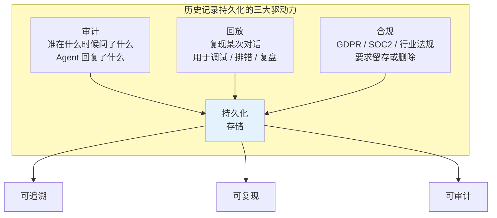
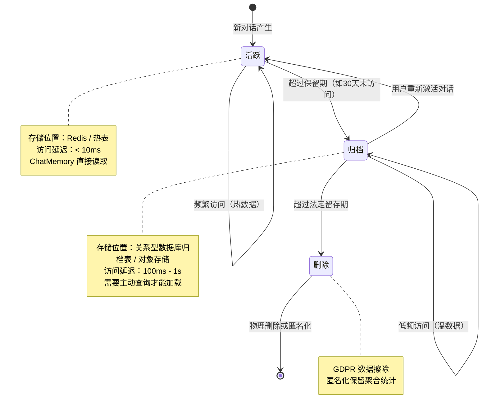
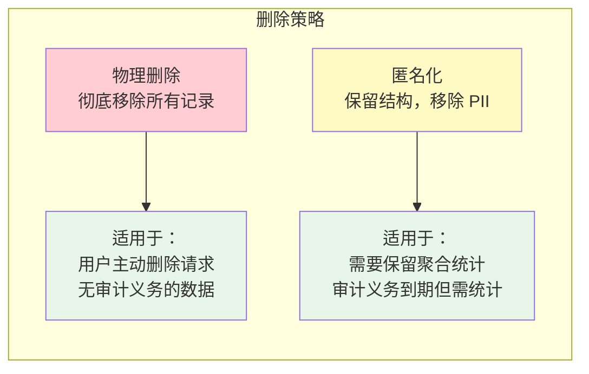
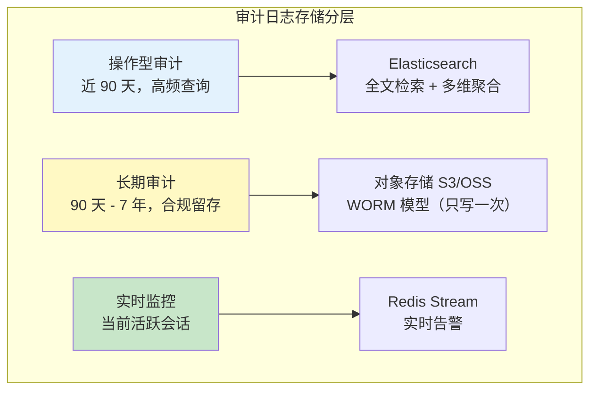
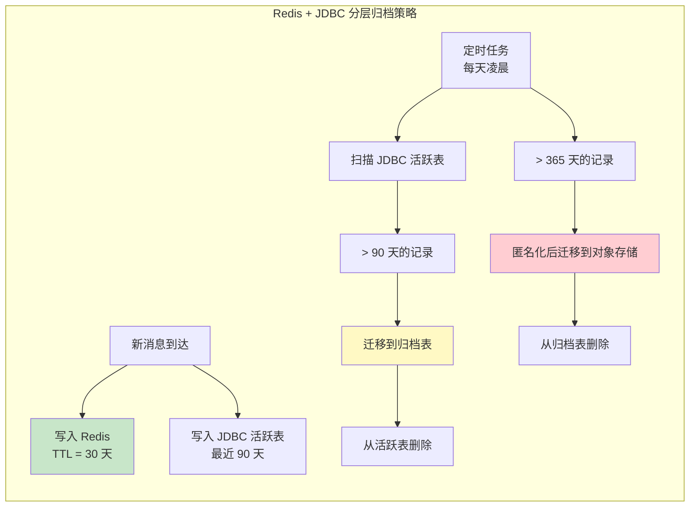
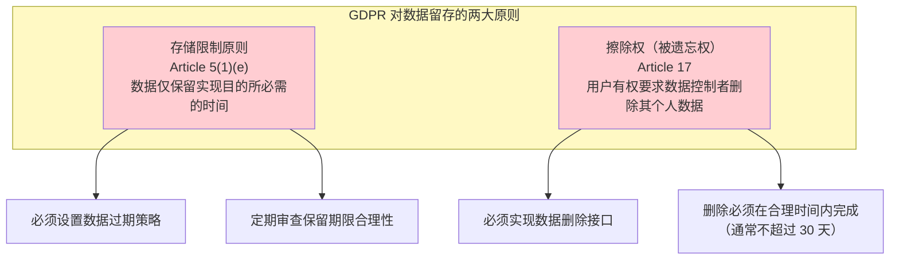
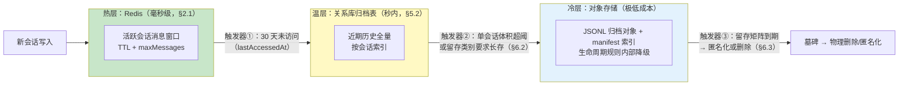
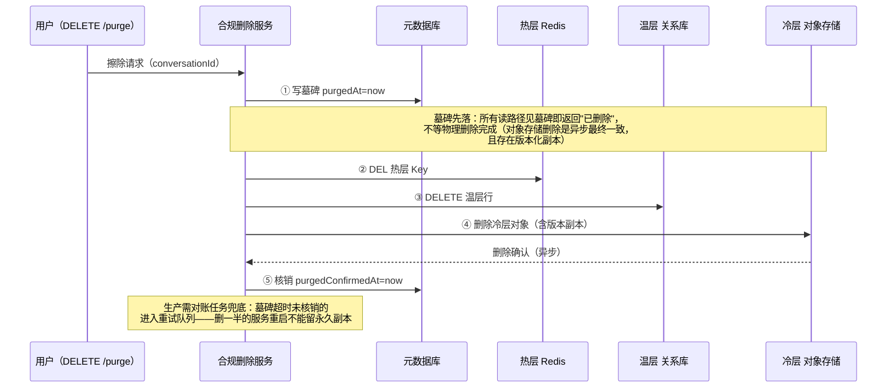
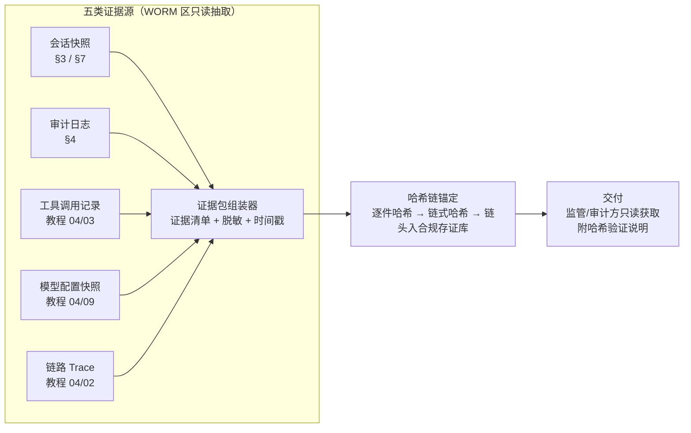

# 05 历史记录持久化与合规
> **定位**：讲透 Agent 对话历史的持久化体系——数据生命周期管理（活跃→归档→删除）、对话回放、审计日志规范、GDPR 合规的数据留存策略。读完这篇，你的 Agent 不再"健忘"，也不会因为留存过多数据而踩合规红线。
>
> **读者画像**：已经会让 Agent 拥有多轮记忆，现在要让历史数据满足审计、回放和合规要求。
>
> **前置阅读**：[04-记忆与会话管理](../00-基础与核心/04-记忆与会话管理.md)。

---

## 1. 为什么需要持久化历史记录

内存中的 ChatMemory 只解决了"当前会话记得住"的问题。但在企业级场景中，历史记录的价值远不止于此——它同时是**审计证据**、**回放素材**和**合规对象**。



### 1.1 审计需求

在金融、医疗、法律等受监管行业中，每一次 AI 交互都可能被视为"业务决策辅助"。监管机构要求企业能够回答：

- **谁**（用户 ID）在**什么时候**（时间戳）问了**什么**（用户消息）
- Agent 给出了**什么回复**（助手消息），回复依据了**哪些检索结果或工具调用**
- Agent 是否调用了**受限工具**（如资金转账、数据删除），调用的**参数和结果**是什么

没有持久化的历史记录，这些问题一个都答不了。

### 1.2 回放需求

当 Agent 出现异常行为（幻觉、错误工具调用、不当回复）时，你需要**精确复现**当时的对话上下文来回溯根因。这要求历史记录不仅存在，还要保留完整的消息序列（包括 System Message 的当时版本、工具调用的完整参数和返回值）。

### 1.3 合规需求

GDPR 第 5 条规定个人数据的"存储限制"——数据只能为特定目的保留必要的时间。这意味着你不能无限期存储用户对话；到了法定期限，必须删除或匿名化。同时，某些行业法规（如金融交易记录留存）又**要求**你必须保留足够长的时间。持久化方案必须同时满足这两面要求。

---

## 2. 数据生命周期管理

历史记录不是静态存储——它有**生命周期**。一条对话从产生到最终删除，经历三个阶段：



### 2.1 活跃期（热数据）

活跃期的对话数据存放在**低延迟存储**中，ChatMemory 直接读取。典型配置是用 Redis 存储，设置 TTL 自动过期。

```java
// 注意: Spring AI 2.0.0 本地 jar 实证，官方内置的 ChatMemoryRepository 实现
// 仅 InMemory 一种（JDBC/Redis 均需自研 implements ChatMemoryRepository，
// 见附录 05-SpringAI2-API基准/00-Advisor与ChatMemory §2）。
// Redis 热存储需要自研实现 ChatMemoryRepository 接口（示意实现）：
import org.springframework.ai.chat.memory.ChatMemoryRepository;
import org.springframework.ai.chat.memory.MessageWindowChatMemory;
import org.springframework.ai.chat.memory.ChatMemory;
import org.springframework.context.annotation.Bean;
import org.springframework.context.annotation.Configuration;
import org.springframework.data.redis.core.ReactiveRedisTemplate;

@Configuration
public class ChatMemoryConfig {

    @Bean
    ChatMemory chatMemory(ReactiveRedisTemplate<String, String> redis) {
        return MessageWindowChatMemory.builder()
                .chatMemoryRepository(new RedisChatMemoryRepository(redis))  // 自研实现，见下
                .maxMessages(30)  // 活跃窗口：最近 30 条消息
                .build();
    }
}

// 自研 ChatMemoryRepository（示意实现，真实需序列化 Message + 分页/过期策略）：
class RedisChatMemoryRepository implements ChatMemoryRepository {
    private final ReactiveRedisTemplate<String, String> redis;
    RedisChatMemoryRepository(ReactiveRedisTemplate<String, String> redis) { this.redis = redis; }
    // 实现 add/get/clear —— 用 Redis Hash/List 存储会话消息，带 TTL 过期
}
```

在 Redis 中，可以通过配置 `spring.data.redis.timeout` 和 Key 前缀策略来管理 TTL：

```yaml
# application.yml —— 注意: 不存在 spring.ai.chat.memory.redis.* 配置键
#（审计修正）Redis TTL 由自研仓库实现时用 redisTemplate.expire() 设置
spring:
  data:
    redis:
      host: ${REDIS_HOST:localhost}
      port: ${REDIS_PORT:6379}
      # 建议额外设置: 全局默认 TTL 兜底
      timeout: 5s
```

### 2.2 归档期（温数据）

当一条对话超过活跃期（如 30 天未被访问），它从 Redis 迁移到关系型数据库的归档表。归档数据**不参与** ChatMemory 的常规读取——只有在用户重新激活对话或审计需要时才查询。（这里的"两层"是最小实现；温层之上再加对象存储冷层的完整三层模型、迁移触发器与读回路径，见 §7。）

```java
import org.springframework.ai.chat.memory.ChatMemoryRepository;
import org.springframework.scheduling.annotation.Scheduled;
import org.springframework.stereotype.Service;

@Service
public class ConversationArchiveService {

    private final ChatMemoryRepository hotStore;      // 自研 Redis 仓库
    private final ChatMemoryRepository archiveStore;  // 自研 JDBC 归档仓库（2.0.0 无官方 JDBC 实现）
    private final ConversationMetadataRepository metadataRepo;

    /**
     * 每天凌晨 2 点执行归档：将超过 30 天未访问的对话从 Redis 迁移到 JDBC 归档库。
     */
    @Scheduled(cron = "0 0 2 * * ?")
    public void archiveInactiveConversations() {
        // 1. 查询超过 30 天未访问的 conversationId 列表
        var inactiveIds = metadataRepo.findInactiveSince(
                LocalDateTime.now().minusDays(30));

        for (String conversationId : inactiveIds) {
            // 2. 从 Redis 读取完整历史
            var messages = hotStore.findByConversationId(conversationId);
            if (!messages.isEmpty()) {
                // 3. 写入 JDBC 归档库
                archiveStore.saveAll(conversationId, messages);
                // 4. 从 Redis 删除热数据
                hotStore.deleteByConversationId(conversationId);
                // 5. 更新元数据状态
                metadataRepo.updateStatus(conversationId, "ARCHIVED");
            }
        }
    }
}
```

### 2.3 删除期（数据擦除）

当对话超过法定留存期限（如 GDPR 要求的最长保留期，或用户主动发起删除请求），数据进入删除阶段。删除有两种策略：



```java
@Service
public class ConversationPurgeService {

    /**
     * GDPR 数据擦除：用户请求删除其全部数据。
     * 物理删除所有对话记录，不可恢复。
     */
    public void purgeUserData(String userId) {
        var conversationIds = metadataRepo.findAllByUserId(userId);
        for (String conversationId : conversationIds) {
            hotStore.deleteByConversationId(conversationId);
            archiveStore.deleteByConversationId(conversationId);
            auditLogStore.anonymizeByConversationId(conversationId);
            metadataRepo.deleteByConversationId(conversationId);
        }
    }

    /**
     * 定期清理：超过法定保留期的数据自动匿名化。
     * 保留聚合统计（消息数、Token 数），移除消息内容。
     */
    @Scheduled(cron = "0 0 3 * * ?")
    public void anonymizeExpiredConversations() {
        var expiredIds = metadataRepo.findExpiredBefore(
                LocalDateTime.now().minusDays(365));  // 保留 1 年
        for (String conversationId : expiredIds) {
            archiveStore.deleteByConversationId(conversationId);
            metadataRepo.markAnonymized(conversationId);
        }
    }
}
```

---

## 3. 对话回放功能

回放（Replay）是指**从持久化存储加载历史对话，重建 Agent 上下文**的能力。典型场景：

- 用户关闭浏览器后回来，继续之前的对话
- 调试时复现 Agent 的异常行为
- 审计时查看某次对话的完整过程

### 3.1 回放的核心：从归档恢复到活跃

（本节处理温层数据的恢复；会话已下沉对象存储冷层时的"按需回温"扩展，见 §7.3。）

```java
import org.springframework.ai.chat.memory.ChatMemory;
import org.springframework.ai.chat.memory.ChatMemoryRepository;
import org.springframework.stereotype.Service;

@Service
public class ConversationReplayService {

    private final ChatMemory chatMemory;
    private final ChatMemoryRepository archiveStore;  // 自研 JDBC 归档仓库
    private final ConversationMetadataRepository metadataRepo;

    /**
     * 恢复一个已归档的对话。
     * 将归档库中的历史消息加载回活跃 ChatMemory，重建 Agent 上下文。
     */
    public String resumeConversation(String conversationId) {
        var metadata = metadataRepo.findById(conversationId)
                .orElseThrow(() -> new ConversationNotFoundException(conversationId));

        if ("ARCHIVED".equals(metadata.status())) {
            // 从归档库加载历史消息
            var messages = archiveStore.findByConversationId(conversationId);
            if (!messages.isEmpty()) {
                // 将历史消息写回活跃 ChatMemory
                for (var message : messages) {
                    chatMemory.add(conversationId, message);
                }
                // 更新元数据为活跃状态
                metadataRepo.updateStatus(conversationId, "ACTIVE");
                metadataRepo.updateLastAccessedAt(
                        conversationId, LocalDateTime.now());
            }
        }

        return conversationId;
    }
}
```

### 3.2 完整回放记录

审计场景下的回放不仅要看到消息序列，还要看到**工具调用过程**、**检索结果**和**Token 消耗**。这要求在每次对话时持久化完整的 Advisor 执行链路信息。

```java
import org.springframework.ai.chat.client.ChatClientRequest;
import org.springframework.ai.chat.client.ChatClientResponse;
import org.springframework.ai.chat.client.advisor.api.*;
import org.springframework.ai.chat.memory.ChatMemory;
import org.springframework.core.Ordered;
import org.springframework.security.core.context.SecurityContextHolder;   // ⚠ 需引入依赖 org.springframework.boot:spring-boot-starter-security（本地未下载，未 javap 实证；以引入依赖后 javap 输出为准）
import reactor.core.publisher.Flux;

import java.time.LocalDateTime;
import java.util.List;

/**
 * 审计 Advisor：记录每次 LLM 调用的完整上下文（含工具调用和检索结果）。
 */
public class AuditLoggingAdvisor implements CallAdvisor, StreamAdvisor {

    private final AuditLogRepository auditLogRepository;

    public AuditLoggingAdvisor(AuditLogRepository auditLogRepository) {
        this.auditLogRepository = auditLogRepository;
    }

    @Override
    public String getName() {
        return "AuditLoggingAdvisor";
    }

    @Override
    public int getOrder() {
        // 在所有 Advisor 之前执行（记录进入时的请求）——HIGHEST_PRECEDENCE 值最小，最先执行
        return Ordered.HIGHEST_PRECEDENCE;
    }

    @Override
    public ChatClientResponse adviseCall(ChatClientRequest request, CallAdvisorChain chain) {
        // context() 是 Map<String,Object>：单参 get + 强转（无 1.x 的 get(key, Class) 变体）
        String conversationId = (String) request.context()
                .get(ChatMemory.CONVERSATION_ID);

        var auditEntry = new AuditLog();
        auditEntry.setConversationId(conversationId);
        auditEntry.setRequestTime(LocalDateTime.now());
        auditEntry.setUserMessage(extractUserMessage(request));
        auditEntry.setSystemPrompt(extractSystemPrompt(request));
        auditEntry.setUserId(SecurityContextHolder.getContext()
                .getAuthentication().getName());
        auditEntry.setTenantId(TenantContext.getCurrentTenantId());

        ChatClientResponse response = chain.nextCall(request);

        // 记录 LLM 响应和元数据（Token 用量等）
        // ChatClientResponse.chatResponse() 返回底层 ChatResponse（2.0 record 访问器）
        auditEntry.setAssistantResponse(response.chatResponse().getResult()
                .getOutput().getText());
        auditEntry.setTokenUsage(response.chatResponse().getMetadata().getUsage());
        auditEntry.setToolCalls(extractToolCalls(response));

        auditLogRepository.save(auditEntry);
        return response;
    }

    @Override
    public Flux<ChatClientResponse> adviseStream(ChatClientRequest request,
                                               StreamAdvisorChain chain) {
        String conversationId = (String) request.context()
                .get(ChatMemory.CONVERSATION_ID);

        StringBuilder accumulated = new StringBuilder();
        return chain.nextStream(request)
                .doOnNext(response -> {
                    var text = response.chatResponse().getResult()
                            .getOutput().getText();
                    if (text != null) {
                        accumulated.append(text);
                    }
                })
                .doOnComplete(() -> {
                    var auditEntry = new AuditLog();
                    auditEntry.setConversationId(conversationId);
                    auditEntry.setRequestTime(LocalDateTime.now());
                    auditEntry.setUserMessage(extractUserMessage(request));
                    auditEntry.setAssistantResponse(accumulated.toString());
                    auditLogRepository.save(auditEntry);
                });
    }

    private String extractUserMessage(ChatClientRequest request) {
        // 2.0 ChatClientRequest 只有 prompt()/context()：消息需从 prompt().getInstructions() 取
        return request.prompt().getInstructions().stream()
                .filter(m -> m instanceof org.springframework.ai.chat.messages.UserMessage)
                .map(m -> m.getText())
                .reduce("", (a, b) -> a + b);
    }

    private String extractSystemPrompt(ChatClientRequest request) {
        return request.prompt().getInstructions().stream()
                .filter(m -> m instanceof org.springframework.ai.chat.messages.SystemMessage)
                .map(m -> m.getText())
                .reduce("", (a, b) -> a + b);
    }

    private List<ToolCallRecord> extractToolCalls(ChatClientResponse response) {
        // 从响应中提取工具调用记录
        return List.of();
    }
}
```

---

## 4. 审计日志规范

审计日志不同于 ChatMemory——它记录的是**业务可追溯**信息，不是 LLM 的上下文窗口。

### 4.1 审计日志的必备字段

| 字段 | 类型 | 说明 |
|------|------|------|
| `id` | UUID | 审计记录唯一 ID |
| `conversationId` | String | 关联的会话 ID |
| `tenantId` | String | 租户 ID |
| `userId` | String | 用户 ID |
| `requestTime` | Timestamp | 请求时间 |
| `responseTime` | Timestamp | 响应完成时间 |
| `userMessage` | Text | 用户消息原文 |
| `assistantResponse` | Text | Agent 回复原文 |
| `systemPromptVersion` | String | System Prompt 版本号 |
| `toolCalls` | JSON | 工具调用列表（名称 + 参数 + 结果） |
| `retrievalResults` | JSON | RAG 检索结果列表 |
| `tokenUsage` | JSON | Token 消耗明细（输入/输出/总计） |
| `modelId` | String | 实际调用的模型 ID |
| `ipAddress` | String | 请求来源 IP |
| `complianceFlags` | JSON | 合规标记（含敏感词、违规检测等） |

### 4.2 审计日志的存储要求



**WORM（Write Once Read Many）存储**是合规审计的关键——日志一旦写入就不可篡改、不可删除。这在金融行业（SEC Rule 17a-4）和医疗行业（HIPAA）中是硬性要求。

### 4.3 敏感数据脱敏

审计日志中可能包含用户输入的敏感信息（如身份证号、银行卡号）。在持久化前应进行脱敏处理：

```java
@Component
public class AuditDataMasker {

    private static final Pattern ID_CARD = Pattern.compile("\\d{17}[0-9Xx]");
    private static final Pattern PHONE = Pattern.compile("1[3-9]\\d{9}");
    private static final Pattern BANK_CARD = Pattern.compile("\\d{16,19}");

    /**
     * 对审计日志中的 PII（个人身份信息）进行脱敏。
     */
    public String maskSensitiveData(String text) {
        if (text == null) return null;
        text = ID_CARD.matcher(text).replaceAll(mr -> 
                mr.group().substring(0, 6) + "********" + 
                mr.group().substring(14));
        text = PHONE.matcher(text).replaceAll(mr -> 
                mr.group().substring(0, 3) + "****" + 
                mr.group().substring(7));
        text = BANK_CARD.matcher(text).replaceAll(mr -> 
                mr.group().substring(0, 4) + "********" + 
                mr.group().substring(12));
        return text;
    }
}
```

---

## 5. Spring AI ChatMemory 持久化方案

### 5.1 方案对比

| 方案 | 活跃期存储 | 归档期存储 | 适用规模 | TTL 支持 | 检索能力 |
|------|-----------|-----------|---------|---------|---------|
| **纯 JDBC** | MySQL / PostgreSQL | 同库分表 | 中小规模（< 100 万对话） | 需定时任务 | SQL 查询 |
| **纯 Redis** | Redis | 无归档 | 小规模 / 临时对话 | 原生 TTL | 有限 |
| **Redis + JDBC** | Redis（热） | JDBC（冷） | 中大规模（< 1000 万对话） | Redis TTL + 定时迁移 | SQL 查询归档 |
| **Redis + 对象存储** | Redis（热） | S3/OSS（冷） | 超大规模 | Redis TTL + 生命周期规则 | 需索引层 |

### 5.2 JDBC 持久化配置

```java
import org.springframework.ai.chat.memory.ChatMemory;
import org.springframework.ai.chat.memory.ChatMemoryRepository;
import org.springframework.ai.chat.memory.MessageWindowChatMemory;
import org.springframework.ai.chat.messages.AssistantMessage;
import org.springframework.ai.chat.messages.Message;
import org.springframework.ai.chat.messages.MessageType;
import org.springframework.ai.chat.messages.SystemMessage;
import org.springframework.ai.chat.messages.UserMessage;
import org.springframework.context.annotation.Bean;
import org.springframework.context.annotation.Configuration;
import org.springframework.jdbc.core.JdbcTemplate;

import java.util.List;

/**
 * 自研 JDBC ChatMemoryRepository——Spring AI 2.0.0 本地 jar 实证，
 * 官方内置实现仅 InMemory，JDBC 持久化必须自行实现 ChatMemoryRepository 接口。
 * 按消息类型重建 Message，生产实现建议增加分页、TTL 与索引。
 */
class JdbcChatMemoryRepository implements ChatMemoryRepository {

    private final JdbcTemplate jdbc;

    JdbcChatMemoryRepository(JdbcTemplate jdbc) { this.jdbc = jdbc; }

    @Override
    public List<String> findConversationIds() {
        return jdbc.queryForList(
                "SELECT DISTINCT conversation_id FROM chat_memory", String.class);
    }

    @Override
    public List<Message> findByConversationId(String conversationId) {
        return jdbc.query(
                "SELECT message_type, content FROM chat_memory "
                        + "WHERE conversation_id = ? ORDER BY created_at",
                (rs, rowNum) -> switch (MessageType.valueOf(rs.getString("message_type"))) {
                    case USER -> new UserMessage(rs.getString("content"));
                    case ASSISTANT -> new AssistantMessage(rs.getString("content"));
                    case SYSTEM -> new SystemMessage(rs.getString("content"));
                    default -> throw new IllegalStateException("不支持的会话消息类型");
                },
                conversationId);
    }

    @Override
    public void saveAll(String conversationId, List<Message> messages) {
        for (Message message : messages) {
            jdbc.update(
                    "INSERT INTO chat_memory (conversation_id, message_type, content, created_at) "
                            + "VALUES (?, ?, ?, now())",
                    conversationId, message.getMessageType().name(), message.getText());
        }
    }

    @Override
    public void deleteByConversationId(String conversationId) {
        jdbc.update("DELETE FROM chat_memory WHERE conversation_id = ?", conversationId);
    }
}

@Configuration
public class JdbcMemoryConfig {

    @Bean
    JdbcChatMemoryRepository jdbcChatMemoryRepository(JdbcTemplate jdbcTemplate) {
        return new JdbcChatMemoryRepository(jdbcTemplate);  // 自研实现
    }

    @Bean
    ChatMemory chatMemory(ChatMemoryRepository repository) {
        return MessageWindowChatMemory.builder()
                .chatMemoryRepository(repository)
                .maxMessages(20)
                .build();
    }
}
```

自研 JDBC 仓库需要自行建表（官方不自动建表），示意 DDL：

```sql
CREATE TABLE chat_memory (
    conversation_id  VARCHAR(128)  NOT NULL,
    message_type     VARCHAR(32)   NOT NULL,
    content          TEXT          NOT NULL,
    created_at       TIMESTAMP     NOT NULL DEFAULT now()
);
CREATE INDEX idx_chat_memory_conv ON chat_memory (conversation_id, created_at);
```

### 5.3 分层归档策略



```java
import org.springframework.ai.chat.memory.ChatMemory;
import org.springframework.ai.chat.memory.ChatMemoryRepository;
import org.springframework.ai.chat.memory.MessageWindowChatMemory;
import org.springframework.context.annotation.Bean;
import org.springframework.context.annotation.Configuration;
import org.springframework.context.annotation.Primary;
import org.springframework.jdbc.core.JdbcTemplate;

@Configuration
public class TieredMemoryConfig {

    /**
     * 活跃存储：Redis，最近 30 天对话，低延迟读取。
     */
    @Bean
    @Primary
    ChatMemory activeMemory(RedisChatMemoryRepository redisRepo) {
        return MessageWindowChatMemory.builder()
                .chatMemoryRepository(redisRepo)
                .maxMessages(30)
                .build();
    }

    /**
     * 归档存储：JDBC，30 天以前的完整对话历史。
     * 不参与常规 ChatMemory 读取，仅用于回放和审计。
     */
    @Bean
    ChatMemoryRepository archiveMemory(JdbcTemplate jdbcTemplate) {
        return new JdbcChatMemoryRepository(jdbcTemplate);  // 复用 §5.2 自研实现
    }
}
```

---

## 6. GDPR 合规的数据留存策略

### 6.1 GDPR 的核心要求



### 6.2 数据留存期限矩阵

| 数据类型 | 建议保留期 | 删除方式 | 法规依据 |
|---------|-----------|---------|---------|
| 一般对话记录 | 90 天 | 匿名化 | GDPR 存储限制原则 |
| 含金融交易对话 | 5-7 年 | ⚠ WORM 不可删除（17a-4 要求只写一次）| SEC Rule 17a-4 |
| 含医疗建议对话 | 10 年 | 加密留存（可验证完整性）| HIPAA |
| 用户偏好数据 | 用户账户活跃期 + 30 天 | 物理删除 | GDPR 擦除权 |
| 审计日志（脱敏后） | 7 年 | 匿名化 | SOC 2 Type II |
| 向量索引（对话衍生） | 随对话删除同步删除 | 物理删除 | GDPR 完整擦除 |

> **合规口径修正**：金融/医疗类记录的留存义务是"**不可删除**"（WORM）而非"到期物理删除"——两类义务并存时取更严格者。GDPR 删除权与金融留存的调和方式：**销毁"可识别性"而非销毁记录**（删假名映射、保留脱敏审计链，详见 [项目 06 §v6 删除权] 与 [附录 12-AI治理与合规/02 §GDPR 调和]）。

### 6.3 留存策略实现

```java
import org.springframework.ai.chat.memory.ChatMemoryRepository;
import org.springframework.ai.vectorstore.VectorStore;
import org.springframework.ai.vectorstore.filter.FilterExpressionTextParser;
import org.springframework.scheduling.annotation.Scheduled;
import org.springframework.stereotype.Service;

@Service
public class ComplianceRetentionService {

    private final ConversationMetadataRepository metadataRepo;
    private final ChatMemoryRepository archiveStore;   // 自研 JDBC 归档仓库
    private final VectorStore vectorStore;              // 向量库
    private final Map<String, RetentionPolicy> policies;

    public ComplianceRetentionService(
            ConversationMetadataRepository metadataRepo,
            ChatMemoryRepository archiveStore,
            VectorStore vectorStore) {
        this.metadataRepo = metadataRepo;
        this.archiveStore = archiveStore;
        this.vectorStore = vectorStore;
        this.policies = Map.of(
            "GENERAL", new RetentionPolicy(Duration.ofDays(90), "ANONYMIZE"),
            "FINANCIAL", new RetentionPolicy(Duration.ofDays(2555), "DELETE"), // 7年
            "MEDICAL", new RetentionPolicy(Duration.ofDays(3650), "DELETE"),   // 10年
            "AUDIT", new RetentionPolicy(Duration.ofDays(2555), "ANONYMIZE")
        );
    }

    /**
     * 根据数据类别应用对应的留存策略。
     */
    @Scheduled(cron = "0 0 4 * * ?")
    public void enforceRetentionPolicies() {
        for (var entry : policies.entrySet()) {
            String category = entry.getKey();
            RetentionPolicy policy = entry.getValue();

            var expired = metadataRepo.findExpiredByCategory(
                    category, LocalDateTime.now().minus(policy.duration()));

            for (String conversationId : expired) {
                switch (policy.action()) {
                    case "DELETE" -> hardDelete(conversationId);
                    case "ANONYMIZE" -> anonymize(conversationId);
                }
            }
        }
    }

    private void hardDelete(String conversationId) {
        metadataRepo.deleteByConversationId(conversationId);
        // 同时删除向量索引中由该对话衍生的数据：
        // VectorStore 无 deleteByConversationId，按元数据过滤表达式删除（FilterExpressionTextParser 解析）
        vectorStore.delete(new FilterExpressionTextParser()
                .parse("conversationId == '" + conversationId + "'"));
    }

    private void anonymize(String conversationId) {
        metadataRepo.markAnonymized(conversationId);
        // 保留聚合统计，移除消息内容
        archiveStore.deleteByConversationId(conversationId);  // ChatMemoryRepository 接口方法
    }

    private record RetentionPolicy(Duration duration, String action) {}
}
```

### 6.4 用户数据导出权（GDPR Article 20）

GDPR 还赋予用户**数据可携带权**——用户有权以结构化格式导出自己的全部数据。这对持久化方案提出了额外要求：必须能按 `userId` 快速聚合所有数据。

```java
@RestController
@RequestMapping("/api/compliance")
public class ComplianceController {

    /**
     * GDPR 数据可携带权：导出用户全部数据。
     */
    @GetMapping("/export/{userId}")
    public ResponseEntity<Resource> exportUserData(@PathVariable String userId) {
        var conversations = metadataRepo.findAllByUserId(userId);
        var auditLogs = auditLogRepository.findAllByUserId(userId);
        // 概念代码：VectorStore 接口无 findByUserId（真实 API 仅 add/delete/similaritySearch），
        // 导出"用户衍生的向量数据"需自研"用户→文档"元数据索引层，再按过滤表达式检索
        var vectorData = vectorExportService.findByUserId(userId);

        var export = new UserDataExport(userId, conversations, auditLogs, vectorData);

        String json = objectMapper.writeValueAsString(export);
        Resource resource = new ByteArrayResource(json.getBytes(StandardCharsets.UTF_8));

        return ResponseEntity.ok()
                .header(HttpHeaders.CONTENT_DISPOSITION,
                        "attachment; filename=\"user-data-" + userId + ".json\"")
                .contentType(MediaType.APPLICATION_JSON)
                .body(resource);
    }

    /**
     * GDPR 擦除权：删除用户全部数据。
     */
    @DeleteMapping("/purge/{userId}")
    public ResponseEntity<Void> purgeUserData(@PathVariable String userId) {
        retentionService.purgeUserData(userId);
        return ResponseEntity.noContent().build();
    }
}
```

---

## 7. 会话数据的冷热分层存储

§2 给出了"活跃→归档→删除"的生命周期状态机，§5 给了 Redis + JDBC 的双层实现——但数据量与留存期再往上走（千万级会话、金融级 7 年留存），还需要第三层。本节把**热温冷三层**讲透：每层的介质选型、层间迁移的触发器、读回路径，以及与 §6 合规删除的衔接。一句话定位：**分层是成本、延迟、合规三角的工程解**——全部塞进 Redis 贵到不可行，全部堆进关系库拖慢在线读写，全部扔进对象存储则读延迟不可接受。

### 7.1 热温冷三层

| 层 | 介质 | 典型数据 | 读延迟 | 成本 | 访问模式 |
|----|------|---------|--------|------|---------|
| **热** | Redis（§2.1 自研 `RedisChatMemoryRepository`） | 近期活跃会话的消息窗口 | 毫秒级 | 高 | ChatMemory 每轮对话随机读写 |
| **温** | 关系库归档表（§5.2 自研 JDBC 仓库） | 近期历史全量（如 90 天） | 秒内（索引点查） | 中 | 按会话批量读（回放/续聊），低频 |
| **冷** | 对象存储 S3/OSS | 超过温层窗口的历史归档 | 100ms-秒级（按需取回） | 极低 | 只读审计/调证，几乎不访问 |

冷层与 §4.2 的审计日志存储是同一思想在不同数据上的落点——span 观测数据同样采用"热查/冷归档"分层（对象存储承担低成本归档层），三者分层逻辑同构，可对照 [教程 06-TraceId全链路追踪/08-存储工程：span数据落到哪怎么存怎么查] 的"存哪、怎么存、怎么查"决策框架。



### 7.2 迁移触发器：数据什么时候往下一层走

触发器不是拍脑袋的定时器，而是三类可配置条件的合成：

1. **不活跃天数**——`lastAccessedAt` 超过阈值（如 30 天）触发热→温。这是最常用的信号：ChatMemory 窗口外的历史继续躺在 Redis 里只有成本没有价值。
2. **会话条数/体积**——单会话消息数超出温层表的单行承载预期，或归档聚合体积超阈值（如 1MB）触发温→冷。温层是"近期历史的快速查询层"，超大 会话留在温层会拖慢索引。
3. **租户留存策略联动**——§6.2 留存矩阵是冷层的**准入与退出**依据：`GENERAL` 类 90 天到期后走匿名化（根本不该进冷层或冷层即删），`FINANCIAL`/`MEDICAL` 类要求 5-10 年长存（温层到期必须下沉冷层，且冷层入 WORM 桶）。多租户场景下，同一套迁移代码按租户配置差异化执行。

迁移的**纪律是两步走**：先写目标层、确认成功，再删源层，最后更新元数据状态（§2.2 的归档服务顺序即是此纪律）。顺序颠倒（先删后写）一旦写失败，历史就永久丢了。

```java
// Spring Boot 4.1 — 三触发器合一的分层迁移调度（元数据仓储为自研接口，示意）
import org.springframework.scheduling.annotation.Scheduled;
import org.springframework.stereotype.Service;

import java.time.LocalDateTime;
import java.util.Set;

@Service
public class TieredArchiveService {

    private final ChatMemoryRepository hotStore;      // §2.1 自研 Redis 仓库
    private final ChatMemoryRepository warmStore;     // §5.2 自研 JDBC 仓库（归档表）
    private final ColdArchiveStore coldStore;         // 自研冷层网关接口（对象存储，见 §7.3）
    private final ConversationMetadataRepository metadataRepo;

    public TieredArchiveService(ChatMemoryRepository hotStore,
                                ChatMemoryRepository warmStore,
                                ColdArchiveStore coldStore,
                                ConversationMetadataRepository metadataRepo) {
        this.hotStore = hotStore;
        this.warmStore = warmStore;
        this.coldStore = coldStore;
        this.metadataRepo = metadataRepo;
    }

    /** 每日扫描：三类触发器各自圈定候选，逐条执行两步迁移。 */
    @Scheduled(cron = "0 30 2 * * ?")
    public void migrateByTriggers() {
        // 触发器①：30 天未访问 → 热→温
        metadataRepo.findByStatusAndLastAccessedBefore("ACTIVE", LocalDateTime.now().minusDays(30))
                .forEach(this::evictHotToWarm);

        // 触发器②：温层且（体积超阈 或 长存类别）→ 温→冷
        metadataRepo.findByStatusAndSizeGreaterThanAndCategoryIn(
                        "ARCHIVED", 1 << 20, Set.of("FINANCIAL", "MEDICAL"))
                .forEach(this::evictWarmToCold);
    }

    private void evictHotToWarm(String conversationId) {
        var messages = hotStore.findByConversationId(conversationId);
        if (messages.isEmpty()) {
            metadataRepo.updateStatus(conversationId, "ARCHIVED");   // 空会话只改状态
            return;
        }
        warmStore.saveAll(conversationId, messages);                 // ① 先写目标层
        hotStore.deleteByConversationId(conversationId);             // ② 确认成功后删源层
        metadataRepo.updateStatus(conversationId, "ARCHIVED");       // ③ 元数据收尾
    }

    private void evictWarmToCold(String conversationId) {
        var messages = warmStore.findByConversationId(conversationId);
        coldStore.archive(conversationId, ColdArchiveCodec.toArchiveLines(messages)); // 冷层写 JSONL 对象
        warmStore.deleteByConversationId(conversationId);
        metadataRepo.updateStatus(conversationId, "COLD");
    }
}
```

**云侧生命周期规则与应用侧迁移任务是两套机制，不要混淆**。应用侧 `@Scheduled` 管"什么时候从温到冷"（业务语义：不活跃、类别、体积）；云侧对象存储的 Lifecycle 规则管"冷层内部怎么再降级与到期清理"（存储语义：访问频率与成本档位）。以 S3 为例（概念配置，本地仓库无 AWS SDK 未实证，规则语义来源 [AWS S3 Lifecycle 文档](https://docs.aws.amazon.com/AmazonS3/latest/userguide/object-lifecycle-mgmt.html)）：

```json
// 概念配置（AWS S3 Lifecycle）——只做冷层内部的存储档位降级
{
  "Rules": [{
    "ID": "cold-tier-downgrade",
    "Filter": { "Prefix": "conversations/" },
    "Status": "Enabled",
    "Transitions": [
      { "Days": 30, "StorageClass": "STANDARD_IA" },
      { "Days": 180, "StorageClass": "GLACIER" }
    ]
  }]
}
```

关键约束：**到期匿名化不能指望云侧 Expiration**——云规则只会"删对象"，做不了 §6.3 的"销毁可识别性、保留聚合统计"（删假名映射、打匿名化标记）。凡是 §6.2 留存矩阵里要求差异化处置（匿名化 vs WORM 留存 vs 物理删除）的到期动作，都必须在应用侧执行；云侧规则只承担它擅长的那段：把访问频率已经极低的对象挪到更便宜的档位。

### 7.3 读回路径：按需回温 vs 只读归档查询

冷数据有两种读法，副作用完全不同：

| 读法 | 场景 | 副作用 | 适用 |
|------|------|--------|------|
| **按需回温** | 用户回到 60 天前的会话继续聊 | 写回热层、更新元数据状态与 `lastAccessedAt` | 用户主动续聊（§3.1 `resumeConversation` 的冷层扩展） |
| **只读归档查询** | 审计调证、合规取证、故障复盘 | 无（不回温、不改任何状态） | 一切"看了但不续聊"的读取 |

审计场景**必须走只读**：回温是有副作用的操作（占热层内存、篡改 `lastAccessedAt`、复活一条本已归档的会话），审计查询带着这些副作用既浪费又污染活跃度信号。

```java
// Spring Boot 4.1 — 冷层读取与回温（ColdArchiveStore 为自研网关接口，示意）
import org.springframework.ai.chat.messages.Message;
import org.springframework.stereotype.Service;

import java.time.LocalDateTime;
import java.util.List;
import java.util.Map;

@Service
public class ColdArchiveQueryService {

    private final ColdArchiveStore coldStore;
    private final ColdObjectManifest manifests;       // manifest：conversationId → 对象键索引（自研）
    private final ChatMemory chatMemory;              // §5.3 的 activeMemory
    private final ConversationMetadataRepository metadataRepo;

    public ColdArchiveQueryService(ColdArchiveStore coldStore,
                                   ColdObjectManifest manifests,
                                   ChatMemory chatMemory,
                                   ConversationMetadataRepository metadataRepo) {
        this.coldStore = coldStore;
        this.manifests = manifests;
        this.chatMemory = chatMemory;
        this.metadataRepo = metadataRepo;
    }

    /** 审计/调证：只读解析，零副作用。流式逐行拉取，不整块载入内存。 */
    public List<Map<String, Object>> readOnlyFetch(String conversationId) {
        var locator = manifests.locate(conversationId);
        try (var lines = coldStore.readLines(locator.objectKey())) {
            return lines.map(ColdArchiveCodec::decodeLine).toList();
        }
    }

    /** 用户续聊：按需回温——把冷层历史重建回热层 ChatMemory，元数据回 ACTIVE。 */
    public void reactivate(String conversationId) {
        var records = readOnlyFetch(conversationId);
        for (Map<String, Object> record : records) {
            Message message = ColdArchiveCodec.toMessage(record);   // 按 MessageType 重建（见下）
            chatMemory.add(conversationId, message);
        }
        metadataRepo.updateStatus(conversationId, "ACTIVE");
        metadataRepo.updateLastAccessedAt(conversationId, LocalDateTime.now());
    }
}
```

冷层对象的**编码格式必须绕开一个已知陷阱**：Spring AI 的 `Message` 及其子类是 `private final` 字段、无 property-based Creator 的对象，**不能直接 JSON 序列化落盘再读回**（读回会得到 `LinkedHashMap` 或直接反序列化失败，见 [附录 05-SpringAI2-API基准/00-Advisor与ChatMemory §2.3] 的 round-trip 教训）。冷层每行存的是可序列化的 `Map`（`type`/`content`/`metadata`），读回时按 `MessageType` 用 builder 重建——与 §5.2 JDBC 仓库的 switch 重建是同一模式：

```java
// 冷层 JSONL 行格式示意：{"type":"USER","content":"...","meta":{"ts":"..."}}
// ColdArchiveCodec：Map ↔ Message 的双向编解码（重建逻辑与 §5.2 的 switch 相同）
```

### 7.4 与删除策略的衔接：冷层也要执行墓碑

分层最容易漏的合规缺口：**删除权到达时，数据可能躺在任何一层**——§6.4 的 `/purge` 若只删了热层与温层，冷层对象就是泄漏的副本。三层联动删除的正确顺序是**墓碑先行**：



```java
// Spring Boot 4.1 — 三层联动删除（墓碑先行；示意）
@Service
public class TieredPurgeService {

    private final ChatMemoryRepository hotStore;
    private final ChatMemoryRepository warmStore;
    private final ColdArchiveStore coldStore;
    private final ConversationMetadataRepository metadataRepo;

    // 构造器注入同 §7.2，从略

    public void purge(String conversationId) {
        metadataRepo.writeTombstone(conversationId, LocalDateTime.now());  // ① 墓碑先行
        hotStore.deleteByConversationId(conversationId);                   // ② 热层
        warmStore.deleteByConversationId(conversationId);                  // ③ 温层
        coldStore.deleteAsync(conversationId);                             // ④ 冷层（异步 + 版本副本）
        metadataRepo.confirmPurge(conversationId, LocalDateTime.now());    // ⑤ 核销（对账任务兜底超时未核销者）
    }
}
```

为什么必须墓碑：对象存储的删除是**异步最终一致**的（多副本回收、版本化桶的删除标记），从 API 返回成功到所有副本物理消失之间有窗口；这段时间内任何读到旧数据的路径都必须被墓碑拦住——读取路径（§7.3 的两个入口、§3.1 的回放）第一步先查元数据，见墓碑即返回"已删除"，不触碰底层存储。

最后一个分层与合规的交汇点：**冷层要按留存类别分桶**。`FINANCIAL`/`MEDICAL` 等受 WORM 约束的类别入合规桶（§4.2 的 Write-Once-Read-Many，对象写入后不可改删），`GENERAL` 类入普通桶——这样 §6.2 留存矩阵的"不可删除"与"到期删除"两类义务在存储层就物理隔离，GDPR 擦除权与 WORM 留存的调和（销毁可识别性而非销毁记录，§6.2 合规口径）在桶粒度上各走各的删除通道，互不误伤。

---

## 8. 审计取证证据包

§4 的审计日志解决"平时记了没有"，这一节解决合规调查发生时**"交什么、怎么交、凭什么可信"**。监管问询、租户争议、安全事件的取证场景里，对方要的不是一摊原始日志，而是一个**自包含、可验证、防抵赖**的证据包——临时从各处捞日志拼凑的"证据"既可能遗漏关键件，又无法自证未被挑选篡改。

### 8.1 证据包的构成：五类证据件

| 证据件 | 内容 | 回答什么问题 | 来源 |
|--------|------|-------------|------|
| **会话快照** | 目标会话的完整消息序列（含被中断的部分结果标记） | 用户实际说了什么、模型实际答了什么 | 本篇 §3 回放记录 / §7 冷层归档 |
| **审计日志** | 调用链路结构化记录（消息+工具+检索+Token+操作者） | 每个动作谁在何时发起 | 本篇 §4 |
| **工具调用记录** | 每次工具调用的参数、返回值、执行时长、审批记录 | Agent 执行了什么副作用、危险操作谁批的 | [教程 04-企业级架构主干/03-工具执行可观测与审计] |
| **模型配置快照** | 当时的 Prompt 版本、模型 ID 与参数、护栏规则版本 | "当时的 Agent 是什么状态"——回放行为必须绑定配置 | Prompt 版本登记（[教程 04-企业级架构主干/09-灰度发布与版本管理]） |
| **链路 Trace** | 一次调用的全链路 Span（ChatModel → Tool → 检索） | 时序与依赖关系，定位"哪一环节出的错" | [教程 04-企业级架构主干/02-全链路可观测性] |

五类缺一不可：只有会话快照没有模型配置快照，无法证明"当时就是这个 Prompt 产生的回答"；只有审计日志没有 Trace，时序争议无法裁决。

### 8.2 证据链保全：WORM 存证 + 哈希链

证据包的可信度不取决于打包人的信誉，取决于**数学上可验证的完整性**。两道机制：

1. **WORM 存证**：证据件一经入库即不可改删（Write-Once-Read-Many，§4.2 已定义存储要求，§7.4 的合规桶即其落点）。取证包从 WORM 区**只读抽取**，抽取动作本身也记审计。
2. **哈希链锚定**：对每件证据计算内容哈希，再按"件序"把逐件哈希串成链（第 N 件的哈希输入包含第 N-1 件的链哈希），链头哈希定期锚定到外部可信点（如独立的合规存证库）。任何一件证据被增删改，从该件起整条链的哈希全部对不上——**不需要保管方自证清白，验证方自己算一遍就知道**。



两个工程纪律：**脱敏在打包时统一执行**（§4.3 的规则），但脱敏必须在哈希**之前**完成——先哈希后脱敏会让哈希对不上原文，证据链断裂；**证据包按案件/事件编号命名并登记**（哪个案件、抽取了哪个租户哪个时间窗、谁审批的抽取），取证权本身也要受治理——这也是 §3.1 GOVERN 权限矩阵该覆盖的操作之一（见 [附录 12-AI治理与合规/00-NIST-AI-RMF框架] 的 RACI 小节）。

---

## 9. 适用场景

### 适用场景

- **金融、医疗、法律等受监管行业**：必须满足审计和合规留存要求
- **需要对话回放的调试场景**：Agent 出现异常时需要复现上下文
- **多租户 SaaS 平台**：每个租户的数据独立留存，支持独立删除
- **长期对话服务**：客服系统、心理咨询、法律咨询等需要长期保留对话历史
- **面向欧盟用户的产品**：必须满足 GDPR 的数据留存和擦除要求

### 不适用场景

- **一次性问答 API**：无状态调用，不需要保留历史，反而增加存储成本
- **内部工具 / 开发调试**：InMemory 足够，无需搭建完整持久化体系
- **超低延迟场景**：每次请求都做审计写入会引入延迟（可用异步写入缓解）
- **无合规义务的免费产品**：投入产出比低，简单的过期清理即可

---

## 10. 本章总结

| 概念 | 一句话 |
|------|--------|
| **持久化的三大驱动** | 审计（可追溯）、回放（可复现）、合规（合法留存） |
| **数据生命周期** | 活跃（Redis 热数据）→ 归档（JDBC 冷数据）→ 删除（物理/匿名化） |
| **对话回放** | 从归档库加载历史消息重建上下文，用于复现和继续对话 |
| **审计日志规范** | 记录完整调用链路（消息+工具+检索+Token），存储于 WORM |
| **GDPR 合规** | 存储限制原则 + 擦除权，按数据类别设置差异化留存期限 |
| **分层存储** | 热（Redis，毫秒级）→ 温（关系库近期历史）→ 冷（对象存储归档）；触发器驱动两步迁移（先写后删），读回分"回温/只读"，删除三层联动且墓碑先行（§7） |
| **审计取证证据包** | 合规调查交五类证据件（会话快照+审计日志+工具调用+模型配置快照+Trace），WORM 只读抽取 + 哈希链锚定实现防抵赖（§8） |
| **敏感数据脱敏** | 持久化前对 PII 进行正则脱敏，审计日志不含明文敏感信息 |

---

## 11. 交叉引用

**下一篇**：[59-多租户隔离与资源治理](06-多租户隔离与资源治理.md) — 多租户场景下的会话隔离、数据隔离、资源配额、工具权限分级。

**前置阅读**：
- [04-记忆与会话管理](../00-基础与核心/04-记忆与会话管理.md) — ChatMemory 的基本概念，本篇在此基础上讨论持久化与合规。

**相关阅读**：
- [60-成本治理与Token计量](07-成本治理与Token计量.md) — 审计日志中的 Token 消耗数据如何用于成本治理。
- [61-Human-in-the-Loop与审批流](08-Human-in-the-Loop与审批流.md) — 危险操作的审计追踪。
- [05-RAG检索增强生成](../00-基础与核心/05-RAG检索增强生成.md) — 向量索引中的对话衍生数据也需要随合规策略同步删除。
- [教程 06-TraceId全链路追踪/08-存储工程：span数据落到哪怎么存怎么查] — span 观测数据的"热查/冷归档"分层决策，与会话数据冷热分层同构（§7）。
- [附录 09-语义缓存与性能/03-多级缓存架构] — 缓存层生命周期参数如何直接引用本文 §6.2 的留存期限矩阵。
