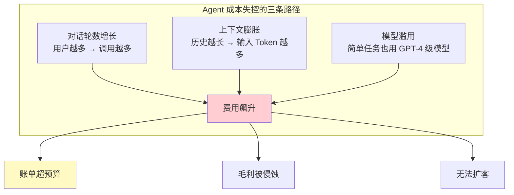
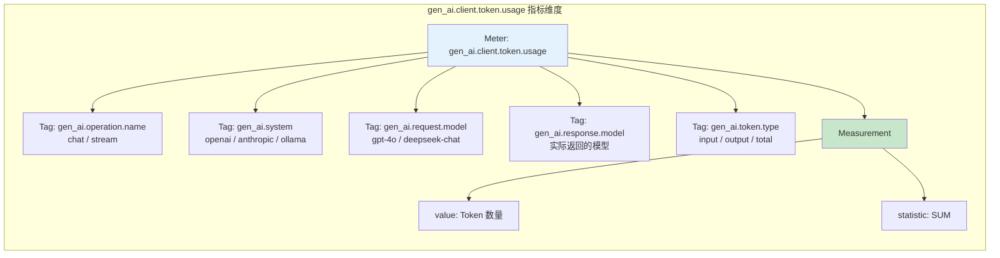
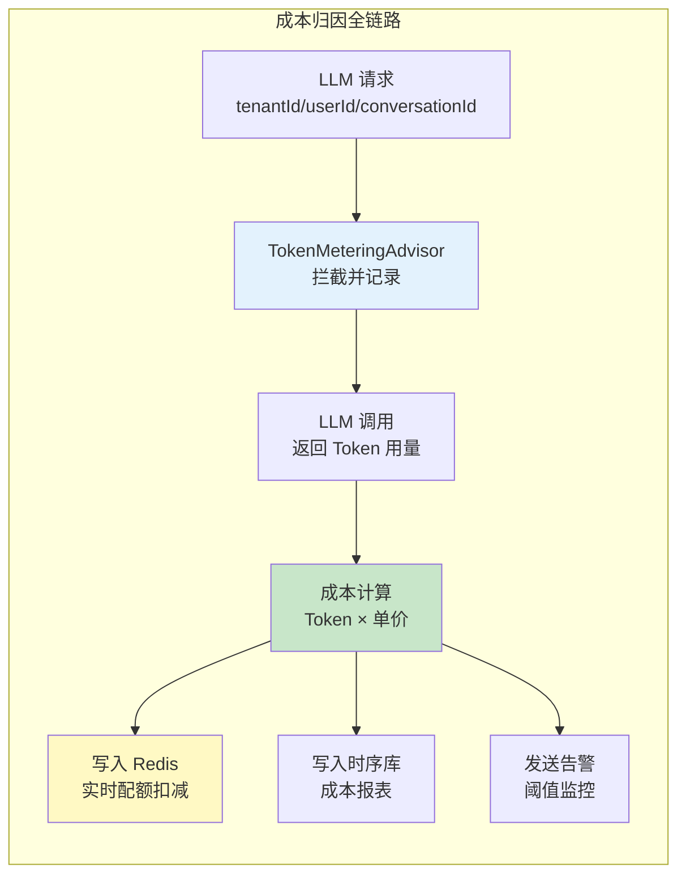
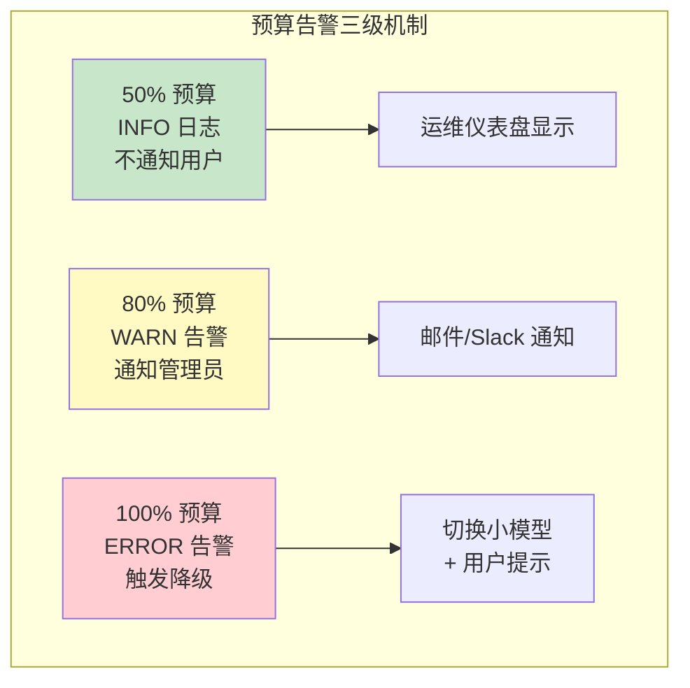
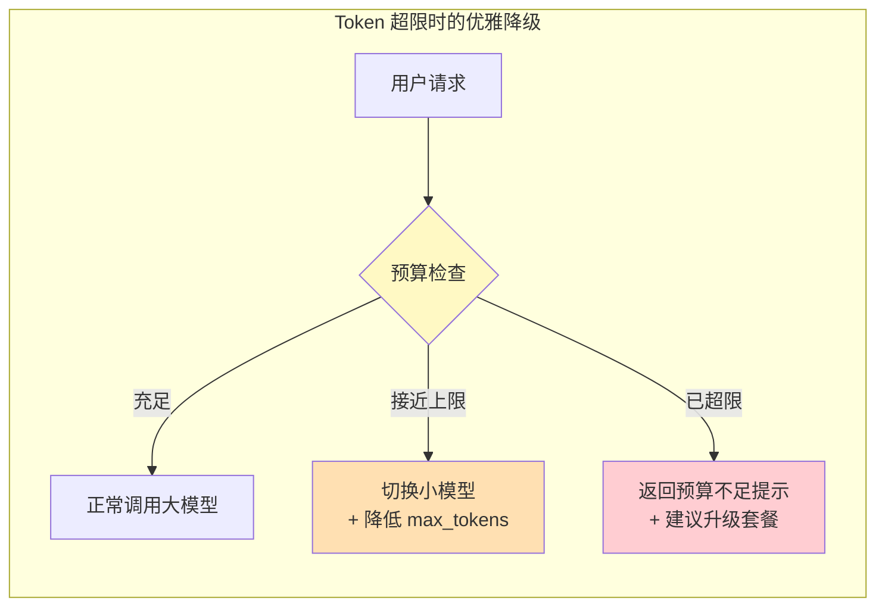
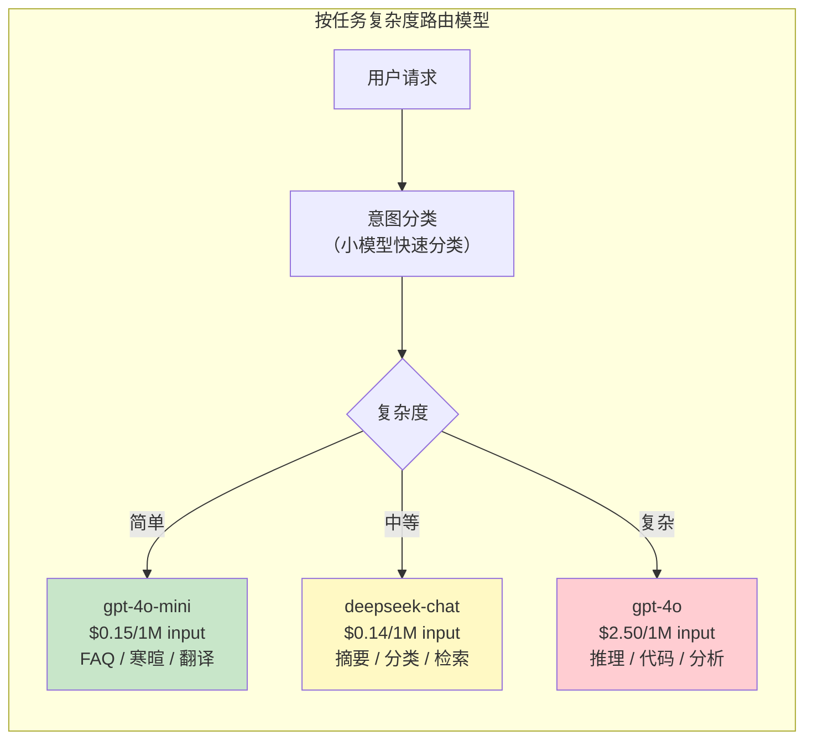
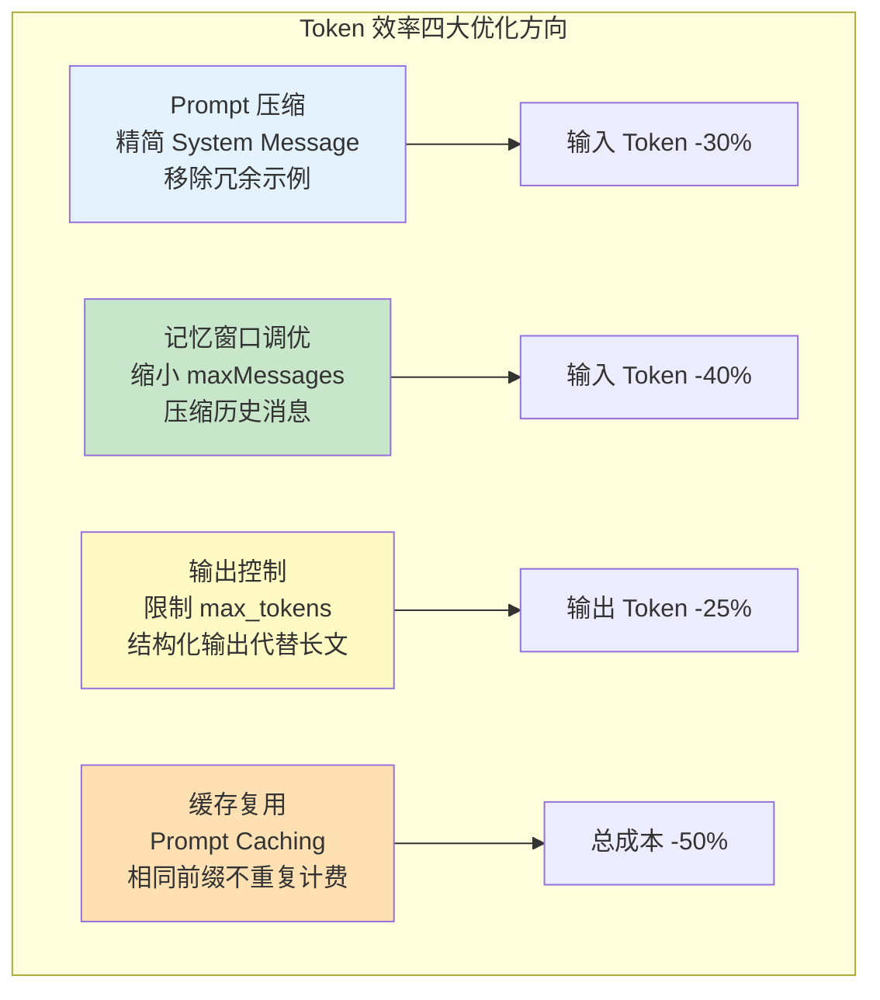
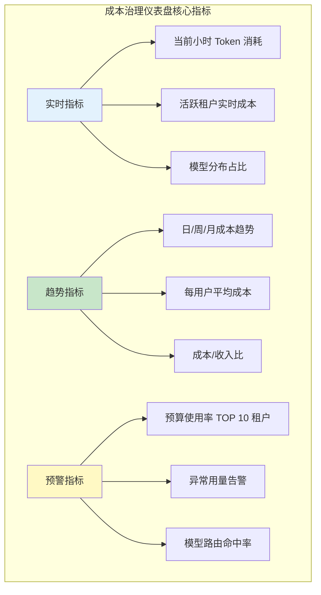

# 60-成本治理与Token计量

> **定位**：讲透 Spring AI 2.0 的 Token 计量指标体系、按租户/用户/会话的成本归因方案、预算上限与优雅降级策略、模型路由降本，以及 Token 效率优化技巧。读完这篇，你能让 Agent 平台的成本变得可监控、可归因、可优化。
>
> **读者画像**：正在构建多租户或多用户的 Agent 系统，需要把 LLM 调用成本控制在可预测的范围内。
>
> **前置阅读**：[59-多租户隔离与资源治理](06-多租户隔离与资源治理.md)。

---

## 1. 为什么 Token 是 Agent 最需要治理的资源

LLM 的计费单位是 Token。与传统应用不同，Agent 的每次交互都直接产生成本——而且成本与对话质量、上下文长度、工具调用次数**高度相关**。



在 SaaS 产品中，LLM 成本通常占运营成本的 30%-60%。如果不做治理，这个比例会随用户增长而恶化——因为每个用户的每次对话都在花钱，而用户并不为此单独付费。

成本治理的核心目标是：**让每一分 Token 花费都可归因、可预测、可优化**。

---

## 2. Spring AI 2.0 的 Token 计量指标体系

### 2.1 gen_ai.client.token.usage 指标

Spring AI 2.0 遵循 OpenTelemetry GenAI 语义规范，自动暴露 `gen_ai.client.token.usage` 指标。该指标通过 Micrometer 集成，自动注入到 Actuator 的 `/actuator/metrics` 端点。



### 2.2 启用指标

```yaml
# application.yml
management:
  endpoints:
    web:
      exposure:
        include: health,info,metrics,prometheus
  metrics:
    distribution:
      percentiles-histogram:
        gen_ai.client.token.usage: true
    tags:
      application: my-agent-app

spring:
  ai:
    chat:
      observations:
        # 观测属性前缀 spring.ai.chat.observations（javap 实证 ChatObservationProperties）
        # 真实键为 log-prompt / log-completion / include-error-logging，无 include-prompt-content
        log-prompt: false       # 出于隐私，不记录 Prompt 内容
        log-completion: false   # 出于隐私，不记录补全内容
```

### 2.3 从 ChatResponse 中读取 Token 用量

除了 Micrometer 自动暴露的指标，每次 LLM 调用的 `ChatResponse` 也携带精确的 Token 用量：

```java
import org.springframework.ai.chat.model.ChatResponse;
import org.springframework.ai.chat.metadata.Usage;

public class TokenUsageExample {

    public void processResponse(ChatResponse response) {
        Usage usage = response.getMetadata().getUsage();

        long promptTokens = usage.getPromptTokens();      // 输入 Token
        long completionTokens = usage.getCompletionTokens(); // 输出 Token
        long totalTokens = usage.getTotalTokens();         // 总 Token

        System.out.printf("Input: %d, Output: %d, Total: %d%n",
                promptTokens, completionTokens, totalTokens);
    }
}
```

### 2.4 流式响应的 Token 计量

流式响应的 Token 用量在最后一个 chunk 中返回。需要在流完成时聚合：

```java
import org.springframework.ai.chat.client.ChatClient;
import org.springframework.ai.chat.memory.ChatMemory;
import reactor.core.publisher.Mono;

public class StreamingTokenMeter {

    private final ChatClient chatClient;

    public Mono<TokenUsageRecord> chatWithMetering(String userMessage,
                                                    String conversationId) {
        return chatClient.prompt()
                .user(userMessage)
                .advisors(a -> a.param(ChatMemory.CONVERSATION_ID, conversationId))
                .stream()
                .chatResponse()
                .reduce(new TokenUsageRecord(), (acc, response) -> {
                    // 聚合输出文本
                    var content = response.getResult().getOutput().getText();
                    if (content != null) {
                        acc.appendContent(content);
                    }
                    // 在最后一个 chunk 中获取 Token 用量
                    var usage = response.getMetadata().getUsage();
                    if (usage.getTotalTokens() > 0) {
                        acc.setUsage(usage);
                    }
                    return acc;
                });
    }
}
```

---

## 3. 按租户/用户/会话的成本归因

### 3.1 成本归因流程



### 3.2 TokenMetering Advisor

这是成本归因的核心组件——在每次 LLM 调用前后拦截，记录 Token 消耗并归因到正确的租户、用户和会话：

```java
import org.springframework.ai.chat.client.ChatClientRequest;
import org.springframework.ai.chat.client.ChatClientResponse;
import org.springframework.ai.chat.client.advisor.api.*;
import org.springframework.ai.chat.memory.ChatMemory;
import org.springframework.ai.chat.metadata.Usage;
import org.springframework.core.Ordered;
import reactor.core.publisher.Flux;

/**
 * Token 计量 Advisor：记录每次 LLM 调用的 Token 消耗并归因到租户/用户/会话。
 */
public class TokenMeteringAdvisor implements CallAdvisor, StreamAdvisor {

    private final TokenMeteringService meteringService;

    public TokenMeteringAdvisor(TokenMeteringService meteringService) {
        this.meteringService = meteringService;
    }

    @Override
    public String getName() {
        return "TokenMeteringAdvisor";
    }

    @Override
    public int getOrder() {
        // 在 MemoryAdvisor 之后执行（先注入上下文再计量）
        return Ordered.LOWEST_PRECEDENCE;
    }

    @Override
    public ChatClientResponse adviseCall(ChatClientRequest request,
                                       CallAdvisorChain chain) {
        long startTime = System.nanoTime();
        ChatClientResponse response = chain.nextCall(request);
        long duration = System.nanoTime() - startTime;

        Usage usage = response.chatResponse().getMetadata().getUsage();
        var record = buildRecord(request, usage, duration);
        meteringService.record(record);

        return response;
    }

    @Override
    public Flux<ChatClientResponse> adviseStream(ChatClientRequest request,
                                               StreamAdvisorChain chain) {
        long startTime = System.nanoTime();
        var usageAccumulator = new UsageAccumulator();

        return chain.nextStream(request)
                .doOnNext(response -> {
                    var usage = response.chatResponse().getMetadata().getUsage();
                    if (usage != null && usage.getTotalTokens() > 0) {
                        usageAccumulator.update(usage);
                    }
                })
                .doOnComplete(() -> {
                    long duration = System.nanoTime() - startTime;
                    var record = buildRecord(request, usageAccumulator.get(),
                            duration);
                    meteringService.record(record);
                });
    }

    private TokenUsageRecord buildRecord(ChatClientRequest request, Usage usage,
                                          long durationNanos) {
        var ctx = request.context();  // Map<String,Object>：单参 get + 强转
        return new TokenUsageRecord(
                (String) ctx.get("tenantId"),
                (String) ctx.get("userId"),
                (String) ctx.get(ChatMemory.CONVERSATION_ID),
                // 2.0 ChatClientRequest 无 chatOptions()：模型信息从 prompt().getOptions() 取
                request.prompt().getOptions() != null
                        ? request.prompt().getOptions().getModel()
                        : "default",
                usage.getPromptTokens(),
                usage.getCompletionTokens(),
                usage.getTotalTokens(),
                durationNanos,
                java.time.LocalDateTime.now()
        );
    }
}
```

### 3.3 成本计算

不同模型的价格不同，需要按模型查表计算：

```java
@Service
public class CostCalculator {

    /**
     * 模型价格表（每百万 Token 美元）
     */
    private static final Map<String, ModelPricing> PRICING = Map.of(
        // 价格表为示例对比数据——本体系主线是 DeepSeek（见 pom/教程01）
        // GPT/Claude 仅作成本对比参照，生产价格以供应商实时报价为准
        "gpt-4o", new ModelPricing(2.50, 10.00),
        "gpt-4o-mini", new ModelPricing(0.15, 0.60),
        "deepseek-chat", new ModelPricing(0.14, 0.28),
        "claude-sonnet-4", new ModelPricing(3.00, 15.00),
        "claude-haiku-3.5", new ModelPricing(0.80, 4.00)
    );

    /**
     * 根据模型和 Token 用量计算费用（美元）。
     */
    public BigDecimal calculate(String modelId, long inputTokens,
                                 long outputTokens) {
        ModelPricing pricing = PRICING.getOrDefault(modelId,
                new ModelPricing(1.0, 2.0));  // 默认价格
        BigDecimal inputCost = BigDecimal.valueOf(inputTokens)
                .multiply(BigDecimal.valueOf(pricing.inputPerMillion()))
                .divide(BigDecimal.valueOf(1_000_000), 6, RoundingMode.HALF_UP);
        BigDecimal outputCost = BigDecimal.valueOf(outputTokens)
                .multiply(BigDecimal.valueOf(pricing.outputPerMillion()))
                .divide(BigDecimal.valueOf(1_000_000), 6, RoundingMode.HALF_UP);
        return inputCost.add(outputCost);
    }

    private record ModelPricing(double inputPerMillion, double outputPerMillion) {}
}
```

### 3.4 多维成本报表

```java
@Service
public class CostReportService {

    private final TokenUsageRepository repository;
    private final CostCalculator costCalculator;

    /**
     * 按租户汇总月度成本。
     */
    public Map<String, TenantCostSummary> monthlyReportByTenant(YearMonth month) {
        var records = repository.findByMonth(month);
        return records.stream()
                .collect(Collectors.groupingBy(
                        TokenUsageRecord::tenantId,
                        Collectors.collectingAndThen(
                                Collectors.toList(),
                                list -> {
                                    BigDecimal totalCost = list.stream()
                                            .map(r -> costCalculator.calculate(
                                                    r.modelId(),
                                                    r.inputTokens(),
                                                    r.outputTokens()))
                                            .reduce(BigDecimal.ZERO, BigDecimal::add);
                                    long totalTokens = list.stream()
                                            .mapToLong(TokenUsageRecord::totalTokens)
                                            .sum();
                                    return new TenantCostSummary(totalCost,
                                            totalTokens, list.size());
                                })));
    }
}
```

---

## 4. 预算上限与告警

### 4.1 告警机制



### 4.2 预算检查 Advisor

```java
import org.springframework.ai.chat.client.ChatClientRequest;
import org.springframework.ai.chat.client.ChatClientResponse;
import org.springframework.ai.chat.client.advisor.api.CallAdvisor;
import org.springframework.ai.chat.client.advisor.api.CallAdvisorChain;
import org.springframework.ai.chat.prompt.Prompt;
import org.springframework.ai.openai.OpenAiChatOptions;

public class BudgetGuardAdvisor implements CallAdvisor {

    private final TokenQuotaService quotaService;
    private final ModelDowngradeService downgradeService;

    @Override
    public ChatClientResponse adviseCall(ChatClientRequest request,
                                       CallAdvisorChain chain) {
        String tenantId = (String) request.context().get("tenantId"); // Spring AI 2.0.0：context() 是 Map，取值后强转
        int estimatedTokens = estimateTokens(request);

        if (!quotaService.canConsume(tenantId, estimatedTokens)) {
            // 预算不足——降级到更便宜的模型
            ChatClientRequest downgraded = downgradeModel(request);
            return chain.nextCall(downgraded);
        }

        return chain.nextCall(request);
    }

    private ChatClientRequest downgradeModel(ChatClientRequest original) {
        // 从 gpt-4o 降级到 gpt-4o-mini
        var downgradedOptions = OpenAiChatOptions.builder()
                .model("gpt-4o-mini")
                .build();
        // 2.0 ChatClientRequest.Builder 无 from()/chatOptions()：
        // 用 mutate() 以新 Prompt（携带降级后的 Options）重建请求
        return original.mutate()
                .prompt(new Prompt(original.prompt().getInstructions(), downgradedOptions))
                .build();
    }

    private int estimateTokens(ChatClientRequest request) {
        // 粗略估算：每个英文单词约 1.3 个 Token，中文约 1-2 个 Token
        // 2.0 ChatClientRequest 无 messages()：消息从 prompt().getInstructions() 取
        int messageTokens = request.prompt().getInstructions().stream()
                .mapToInt(m -> (int) (m.getText().length() * 0.5))
                .sum();
        return messageTokens + 500;  // 预留输出空间
    }
}
```

### 4.3 优雅降级



```java
@Service
public class GracefulDegradationService {

    /**
     * 根据预算状态返回降级后的模型选择。
     */
    public DegradationResult evaluate(String tenantId) {
        QuotaStatus status = quotaService.getStatus(tenantId);

        return switch (status.tier()) {
            case NORMAL -> new DegradationResult("gpt-4o", false, null);
            case WARNING -> new DegradationResult("gpt-4o-mini", false,
                    "响应质量可能因预算管控略有降低");
            case EXCEEDED -> new DegradationResult(null, true,
                    "今日 AI 额度已用完，请明天再试或升级套餐");
        };
    }

    public record DegradationResult(
            String modelId,      // null 表示完全拒绝
            boolean rejected,    // true 表示拒绝请求
            String userMessage   // 向用户展示的提示
    ) {}
}
```

---

## 5. 模型路由策略

### 5.1 为什么要路由

同一个 Agent 不需要每次都用最强模型。简单任务（寒暄、FAQ）用小模型就足够，复杂任务（多步推理、代码生成）才需要大模型。合理路由能降低 50%-70% 的成本。



### 5.2 路由实现

```java
@Service
public class TaskComplexityRouter {

    private final ChatModel smallModel;  // 小模型用于分类
    private final Map<String, ChatModel> modelRegistry;

    /**
     * 先用小模型判断任务复杂度，再路由到对应模型。
     */
    public ChatModel route(String userMessage) {
        String complexity = classifyComplexity(userMessage);

        return switch (complexity) {
            case "SIMPLE" -> modelRegistry.get("gpt-4o-mini");
            case "MEDIUM" -> modelRegistry.get("deepseek-chat");
            case "COMPLEX" -> modelRegistry.get("gpt-4o");
            default -> modelRegistry.get("gpt-4o-mini");
        };
    }

    /**
     * 用小模型做意图分类，消耗极少 Token。
     */
    private String classifyComplexity(String message) {
        String prompt = """
            判断以下用户消息的复杂度，只回复一个词：
            - SIMPLE（寒暄、FAQ、翻译、简单查询）
            - MEDIUM（摘要、分类、单步检索）
            - COMPLEX（多步推理、代码生成、分析报告）

            用户消息：%s
            """.formatted(message);

        return ChatClient.create(smallModel).prompt()
                .user(prompt)
                .call()
                .content()
                .trim()
                .toUpperCase();
    }
}
```

### 5.3 成本效益分析

| 路由策略 | 月成本（100 万次请求） | 平均延迟 | 质量满意度 |
|---------|----------------------|---------|-----------|
| 全部用 GPT-4o | $25,000 | 3.2s | 92% |
| 全部用 GPT-4o-mini | $1,500 | 1.1s | 74% |
| 智能路由（60% mini / 30% medium / 10% GPT-4o） | $5,200 | 1.6s | 89% |

智能路由以 21% 的成本达到了全大模型 97% 的质量满意度。

---

## 6. Token 效率优化

### 6.1 优化方向



### 6.2 Prompt Caching

部分模型供应商（如 Anthropic Claude）支持 Prompt Caching——相同前缀的 Prompt 只计算一次费用，后续调用以极低价格复用。Spring AI 通过 ChatOptions 传递缓存控制参数：

```java
import org.springframework.ai.chat.client.ChatClient;

// ⚠ 修正: systemSpec.cacheLevel("aggressive") 是虚构 API——Prompt Caching
// 不在 SystemSpec 上配置，而是按供应商在消息级设置（Anthropic 的 cache_control
// 需要构造 Message 时声明，见附录 09-语义缓存与性能/01-Prompt缓存与KVCache §供应商差异）
// 正确姿势（示意）: 在 ChatModelRequest 构造时按供应商配置缓存断点，
// 或直接依赖供应商默认缓存策略；业务侧控制的是 System Prompt 前缀稳定性
// 示意：claudeModel 为注入的 ChatModel（此处不引入 Anthropic 专属 API）
ChatClient client = ChatClient.builder(claudeModel)
        .defaultSystem("你是企业级客服助手。以下是企业知识库：\n"
                      + knowledgeBaseService.getFullKnowledgeBase())
        .build();

// 后续调用中，System Message + 知识库（可能上万 Token）
// 只在首次全价计算，后续调用缓存价格仅为 1/10
String answer = client.prompt()
        .user("帮我查退货政策")
        .call()
        .content();
```

### 6.3 记忆窗口优化

```java
// 不要盲目使用默认的 maxMessages=20
// 根据实际场景调优——客服场景通常 10 条就够
ChatMemory chatMemory = MessageWindowChatMemory.builder()
        .maxMessages(10)  // 从 20 降到 10，输入 Token 减少约 50%
        .build();
```

### 6.4 结构化输出代替长文

```java
// 不好的做法：让 LLM 写一段长文
String verbose = client.prompt()
        .user("分析这个订单的问题并给出建议")
        .call()
        .content();
// 输出可能 500+ Token

// 好的做法：结构化输出
record OrderAnalysis(String rootCause, String suggestion, 
                     int priority) {}

OrderAnalysis concise = client.prompt()
        .user("分析这个订单的问题并给出建议")
        .call()
        .entity(OrderAnalysis.class);
// 输出通常 100-150 Token
```

---

## 7. 成本仪表盘

### 7.1 关键监控指标



### 7.2 Prometheus + Grafana 集成

```java
@Configuration
public class CostMetricsConfig {

    @Bean
    public MeterRegistryCustomizer<MeterRegistry> costMetricsTags() {
        return registry -> {
            // 为 gen_ai.client.token.usage 添加自定义标签
            registry.config().commonTags(
                "application", "agent-platform",
                "environment", "${spring.profiles.active:default}"
            );
        };
    }
}
```

在 Grafana 中，可以用以下 PromQL 查询实时成本：

```promql
# 每租户每小时 Token 消耗
sum(rate(gen_ai_client_token_usage_total{tenant_id=~"$tenant"}[1h])) by (tenant_id, gen_ai_token_type)

# 模型分布占比
sum by (gen_ai_request_model) (rate(gen_ai_client_token_usage_total[5m]))
```

---

## 8. 适用场景

### 适用场景

- **多租户 SaaS 平台**：每个租户有独立预算，需要精确归因和配额管控
- **高流量 C 端 AI 应用**：Token 成本直接影响毛利，必须做模型路由和优化
- **企业内部 Agent 平台**：需要给部门/团队设置 Token 预算上限
- **按量计费的 AI 服务**：需要实时计量用户消耗并生成账单
- **模型供应商切换评估**：通过成本归因对比不同供应商的性价比

### 不适用场景

- **低流量内部工具**：月度 Token 消耗在百美元以下，治理成本 > 收益
- **原型 / 概念验证阶段**：优先验证功能正确性，成本优化为辅
- **对延迟极度敏感的场景**：模型路由引入的额外分类调用可能增加延迟

---

## 9. 本章总结

| 概念 | 一句话 |
|------|--------|
| **gen_ai.client.token.usage** | Spring AI 2.0 自动暴露的 Token 计量指标，通过 Micrometer 集成 |
| **成本归因** | 每次 LLM 调用的 Token 消耗精确归因到租户/用户/会话 |
| **TokenMeteringAdvisor** | 拦截 LLM 调用，记录 Token 用量和调用元数据 |
| **预算三级告警** | 50% 提醒 → 80% 告警 → 100% 降级 |
| **模型路由** | 简单任务用小模型、复杂任务用大模型，降低 50%-70% 成本 |
| **优雅降级** | 预算超限时自动切换便宜模型或返回友好提示 |
| **Prompt Caching** | 相同前缀只计费一次，长 System Message 的成本降低 90% |
| **Token 效率优化** | 窗口调优 + 结构化输出 + Prompt 压缩 |

---

## 10. 交叉引用

**上一篇**：[59-多租户隔离与资源治理](06-多租户隔离与资源治理.md) — 多租户的资源配额（Token 限额）依赖本篇的计量体系提供数据支撑。

**下一篇**：[61-Human-in-the-Loop与审批流](08-Human-in-the-Loop与审批流.md) — 危险操作审批流也需要考虑 Token 成本（审批等待期间不消耗 Token）。

**相关阅读**：
- [58-历史记录持久化与合规](05-历史记录持久化与合规.md) — 审计日志中的 Token 消耗数据是成本归因的数据源。
- [62-灰度发布与版本管理](09-灰度发布与版本管理.md) — 灰度发布需要对比新旧模型的成本效率。
- [04-记忆与会话管理](../00-基础与核心/04-记忆与会话管理.md) — 记忆窗口大小直接影响输入 Token 消耗。
