# 10 容错与弹性设计
> **定位**：讲透 Agent 系统的容错与弹性设计——从故障分类到容错策略选择，再到 Spring Retry + Resilience4j 集成和 WebFlux 响应式错误处理，最后落到两个架构级弹性机制：**舱壁隔离**（按依赖分池，单池故障不传染）与**过载保护**（负载削减、请求分级、重试预算）。读完这篇，你的 Agent 在 LLM 超时、工具失败、向量数据库不可用时仍能优雅运行，在整站过载时也能"有损服务"而不是雪崩。
>
> **读者画像**：已经掌握 ChatClient、工具调用、RAG，需要让 Agent 在生产环境中稳定可靠。
>
> **前置阅读**：[03-工具调用](../00-基础与核心/03-工具调用.md)、[05-RAG 检索增强生成](../00-基础与核心/05-RAG检索增强生成.md)。

---

## 1. Agent 系统为什么需要容错

传统 Web 应用的依赖链通常比较可控——数据库、缓存、消息队列都有成熟的容错方案。Agent 系统完全不同，它的依赖链中增加了多个**高度不可控**的组件：

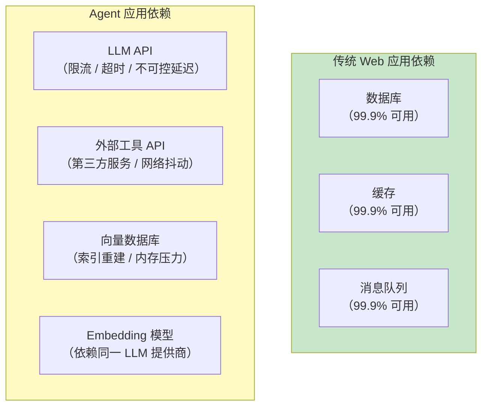

Agent 调用链中的任何一环都可能失败，而用户期望的是一个**始终可用**的助手。容错设计的核心目标：**在部分组件失败时，系统仍能提供可用服务（可能降级），而不是完全崩溃。**

---

## 2. Agent 系统的故障分类

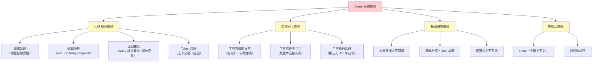

### 2.1 LLM 相关故障详解

| 故障类型 | 现象 | 根因 |
|---------|------|------|
| **请求超时** | 客户端等待 30 秒后断开 | 模型推理慢、网络延迟、服务端排队 |
| **速率限制** | HTTP 429 + Retry-After 头 | 并发请求超过 API 配额 |
| **服务端错误** | HTTP 500 / 502 / 503 | 模型提供商内部故障 |
| **返回异常** | 返回空内容、格式错误 JSON | 模型幻觉、请求格式不规范 |
| **Token 超限** | HTTP 400 + token 数超限 | 对话历史过长、工具结果过大 |

### 2.2 工具执行故障

工具是 Agent 的"手脚"——手断了不能让 Agent 整个瘫痪：

```java
// 错误做法：工具抛异常，整个调用链中断
@Tool(description = "查询订单")
public Order getOrder(String orderId) {
    return orderRepository.findById(orderId); // 数据库挂了 → 异常 → Agent 崩溃
}

// 正确做法：工具返回错误描述，LLM 可以据此调整策略
@Tool(description = "查询订单")
public Order getOrder(String orderId) {
    try {
        return orderRepository.findById(orderId);
    } catch (Exception e) {
        // 返回描述性错误，LLM 会告知用户或尝试其他方式
        return Order.error("订单服务暂时不可用，请稍后重试");
    }
}
```

---

## 3. 容错策略全景

### 3.1 五大容错策略对比

| 策略 | 核心思想 | 解决什么问题 | 适用场景 | 实现复杂度 |
|------|---------|-------------|---------|-----------|
| **超时 Timeout** | 设定最大等待时间 | 防止无限等待、快速失败 | 所有外部调用 | 低 |
| **重试 Retry** | 失败后自动再次尝试 | 瞬时故障（网络抖动） | 幂等操作 | 低 |
| **降级 Fallback** | 主路径失败用备用方案 | 保证基本可用 | 有备选方案的场景 | 中 |
| **熔断 Circuit Breaker** | 连续失败后停止尝试 | 防止级联故障、保护下游 | 依赖第三方服务 | 高 |
| **限流 Rate Limit** | 控制请求频率 | 防止超过配额、保护系统 | 高并发、有配额限制 | 中 |

### 3.2 策略选择决策

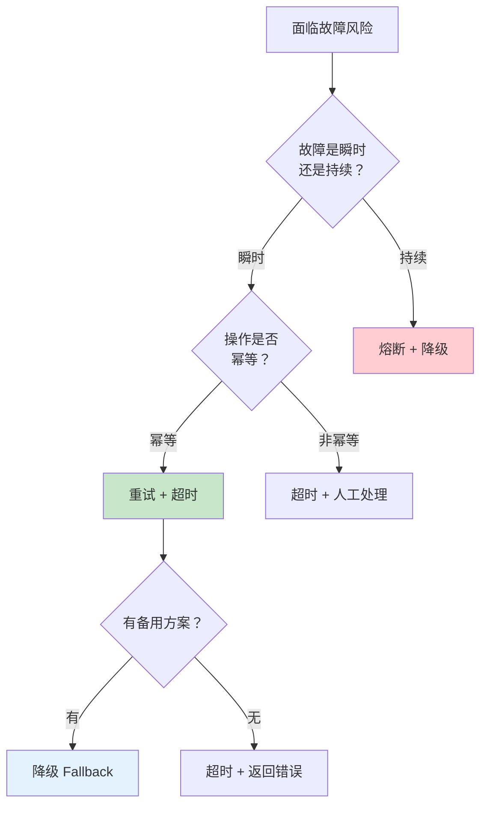

---

## 4. 超时控制：第一道防线

### 4.1 LLM 调用超时

```yaml
# application.yml（配置键为 Spring AI 2.0.0 实证：OpenAiChatProperties / SpringAiRetryProperties）
spring:
  ai:
    openai:
      api-key: ${OPENAI_API_KEY}
      base-url: https://api.openai.com
      timeout: 60s                 # OpenAI SDK 的 HTTP 超时（2.0 客户端基于 OpenAI SDK，非 RestClient）
      chat:
        model: gpt-4o
    retry:
      max-attempts: 3              # 最大重试次数
      backoff:
        initial-interval: 1s       # 初始退避 1 秒
        multiplier: 2              # 退避倍数（javap 实证为 int，不写小数）
        max-interval: 10s          # 最大退避 10 秒
      on-client-errors: false      # 4xx 错误不重试
```

### 4.2 自定义 HTTP 客户端超时

> **注意（Spring AI 2.0）**：2.0 的 OpenAI 客户端基于 OpenAI 官方 Java SDK（非 Spring `RestClient`），其超时由 `spring.ai.openai.timeout` 配置（见 §4.1）。下面的 `RestClient.Builder` 自定义只影响**你自己用 RestClient 编写的工具/服务**（如调用第三方 HTTP API），不会作用于 OpenAI 客户端。属「概念代码，真实 API 见 [附录 05-SpringAI2-API基准]」。

```java
import org.springframework.context.annotation.Bean;
import org.springframework.context.annotation.Configuration;
import org.springframework.http.client.ClientHttpRequestFactory;
import org.springframework.http.client.SimpleClientHttpRequestFactory;
import org.springframework.web.client.RestClient;

@Configuration
public class RestClientConfig {

    @Bean
    public RestClient.Builder restClientBuilder() {
        return RestClient.builder()
                .requestFactory(clientHttpRequestFactory());
    }

    private ClientHttpRequestFactory clientHttpRequestFactory() {
        SimpleClientHttpRequestFactory factory = new SimpleClientHttpRequestFactory();
        factory.setConnectTimeout(5000);   // 连接超时 5 秒
        factory.setReadTimeout(60000);     // 读取超时 60 秒（LLM 推理可能较慢）
        return factory;
    }
}
```

### 4.3 工具执行超时

```java
import java.util.concurrent.TimeUnit;
import java.util.concurrent.TimeoutException;

@Tool(description = "查询外部系统数据")
public String fetchExternalData(@ToolParam(description = "查询关键词") String keyword) {
    try {
        return CompletableFuture.supplyAsync(() -> externalApi.search(keyword))
                .get(10, TimeUnit.SECONDS);  // 最多等 10 秒
    } catch (TimeoutException e) {
        return "查询超时，请稍后重试";
    } catch (Exception e) {
        return "查询失败：" + e.getMessage();
    }
}
```

---

## 5. 重试机制：Spring Retry 集成

### 5.1 添加依赖

> **需在 pom.xml 中添加依赖**。`@Retryable`/`@Recover` 来自 Spring Retry；`TransientAiException`/`NonTransientAiException`/`RetryUtils` 由 `spring-ai-retry` 提供（javap 实证），版本走 `spring-ai-bom`，不写 `<version>`：

```xml
<!-- pom.xml -->
<dependency>
    <groupId>org.springframework.retry</groupId>
    <artifactId>spring-retry</artifactId>
</dependency>
<dependency>
    <groupId>org.springframework</groupId>
    <artifactId>spring-aspects</artifactId>
</dependency>
<dependency>
    <groupId>org.springframework.ai</groupId>
    <artifactId>spring-ai-retry</artifactId>
</dependency>
```

### 5.2 启用 Spring Retry

```java
import org.springframework.retry.annotation.EnableRetry;
import org.springframework.context.annotation.Configuration;

@Configuration
@EnableRetry
public class RetryConfig {
}
```

### 5.3 声明式重试

```java
import java.util.concurrent.TimeoutException;

import org.springframework.ai.chat.client.ChatClient;
import org.springframework.ai.retry.TransientAiException;   // spring-ai-retry 提供（javap 实证）
import org.springframework.retry.annotation.Backoff;
import org.springframework.retry.annotation.Recover;
import org.springframework.retry.annotation.Retryable;

@Service
public class LlmService {

    private final ChatClient chatClient;

    public LlmService(ChatClient chatClient) {
        this.chatClient = chatClient;
    }

    /**
     * 重试策略：
     * - 最多重试 3 次
     * - 初始退避 1 秒，倍数 2，最大退避 10 秒
     * - 只在指定异常时重试（TransientAiException 为 spring-ai-retry 的瞬时异常基类；
     *   若还要兜住 TimeoutException，需另配 @Recover 或在其到达前统一转为 TransientAiException）
     */
    @Retryable(
        retryFor = {TransientAiException.class, TimeoutException.class},
        maxAttempts = 4,               // 初始调用 + 3 次重试
        backoff = @Backoff(
            delay = 1000,
            multiplier = 2.0,
            maxDelay = 10000
        )
    )
    public String callLlm(String prompt) {
        // 调用 LLM，可能抛出超时或限流异常
        return chatClient.prompt()
                .user(prompt)
                .call()
                .content();
    }

    /**
     * 所有重试耗尽后的兜底处理
     * 方法签名必须与 @Retryable 方法一致（参数 + 返回类型）
     */
    @Recover
    public String recoverCallLlm(TransientAiException e, String prompt) {
        return "抱歉，AI 服务暂时不可用，请稍后再试。";
    }
}
```

### 5.4 重试策略深度解析

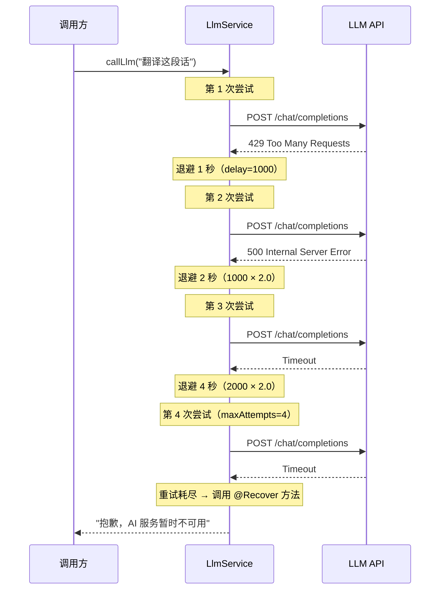

> **最佳实践**：重试只对**瞬时故障**（网络抖动、临时限流）有效。对于持续性故障（认证失败、参数错误），重试只是浪费时间。用 `noRetryFor` 排除不可重试的异常。

---

## 6. 熔断器：Resilience4j 集成

### 6.1 为什么需要熔断

重试解决瞬时故障，但当下游服务持续不可用时，不断重试只会让情况更糟：

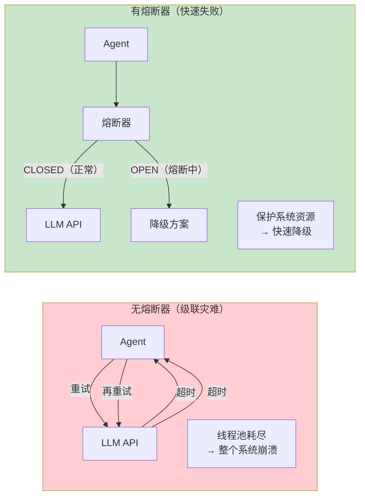

### 6.2 添加 Resilience4j 依赖

```xml
<!-- pom.xml -->
<dependency>
    <groupId>io.github.resilience4j</groupId>
    <artifactId>resilience4j-spring-boot3</artifactId>
    <version>2.2.0</version>
</dependency>
<dependency>
    <groupId>io.github.resilience4j</groupId>
    <artifactId>resilience4j-reactor</artifactId>
    <version>2.2.0</version>
</dependency>
```

### 6.3 熔断器配置

```yaml
# application.yml
resilience4j:
  circuitbreaker:
    instances:
      llm-circuit:
        register-health-indicator: true
        sliding-window-size: 10               # 滑动窗口大小（最近 10 次请求）
        minimum-number-of-calls: 5             # 至少 5 次请求后才开始计算
        failure-rate-threshold: 50             # 失败率阈值 50%
        wait-duration-in-open-state: 30s       # 熔断后等待 30 秒再尝试
        permitted-number-of-calls-in-half-open-state: 3  # 半开状态允许 3 次试探
        automatic-transition-from-open-to-half-open-enabled: true
        record-exceptions:
          - java.net.SocketTimeoutException
          - org.springframework.web.client.HttpServerErrorException
      tool-circuit:
        sliding-window-size: 20
        failure-rate-threshold: 60
        wait-duration-in-open-state: 10s
  ratelimiter:
    instances:
      llm-rate-limiter:
        limit-for-period: 10                   # 每个周期最多 10 次请求
        limit-refresh-period: 1s              # 每秒刷新
        timeout-duration: 5s                   # 超过限额时最多等 5 秒
```

### 6.4 熔断器的三种状态

```mermaid
stateDiagram-v2
    [*] --> CLOSED

    CLOSED --> OPEN : 失败率 ≥ 阈值<br/>（如 50%）
    OPEN --> HALF_OPEN : 等待时间结束<br/>（如 30 秒后）
    HALF_OPEN --> CLOSED : 试探请求成功
    HALF_OPEN --> OPEN : 试探请求失败

    note right of CLOSED
        正常放行所有请求
        统计成功/失败
    end note

    note right of OPEN
        快速失败（不调用下游）
        直接执行降级逻辑
    end note

    note right of HALF_OPEN
        放行少量试探请求
        判断下游是否恢复
    end note
```

### 6.5 声明式熔断 + 降级

```java
import io.github.resilience4j.circuitbreaker.annotation.CircuitBreaker;
import io.github.resilience4j.ratelimiter.annotation.RateLimiter;

@Service
public class ResilientLlmService {

    /**
     * 熔断 + 降级：当 LLM 持续失败时，自动切换到降级方案
     */
    @CircuitBreaker(name = "llm-circuit", fallbackMethod = "fallbackGenerate")
    @RateLimiter(name = "llm-rate-limiter")
    public String generate(String prompt) {
        return chatClient.prompt()
                .user(prompt)
                .call()
                .content();
    }

    /**
     * 降级方法：签名必须与原方法一致，额外加一个 Throwable 参数
     */
    private String fallbackGenerate(String prompt, Exception e) {
        // 降级策略 1：返回预设模板
        // 降级策略 2：使用本地小型模型
        // 降级策略 3：返回友好提示
        return "AI 服务暂时不可用。您可以：\n" +
               "1. 稍后重试\n" +
               "2. 查看常见问题：https://help.example.com\n" +
               "3. 联系客服：400-xxx-xxxx";
    }
}
```

### 6.6 熔断器监控端点

```yaml
# application.yml
management:
  endpoints:
    web:
      exposure:
        include: health,info,circuitbreakers,circuitbreakerevents,ratelimiters
  endpoint:
    health:
      show-details: always
  health:
    circuitbreakers:
      enabled: true
```

访问 `http://localhost:8080/actuator/circuitbreakers` 可以看到各熔断器的实时状态。

---

## 7. WebFlux 响应式错误处理

### 7.1 响应式错误处理算子

Agent 在 WebFlux 响应式模式下，用 Reactor 的错误处理算子实现容错：

```java
import java.time.Duration;
import java.util.concurrent.TimeoutException;

import org.slf4j.Logger;
import org.slf4j.LoggerFactory;
import org.springframework.ai.chat.client.ChatClient;
import org.springframework.web.bind.annotation.GetMapping;
import org.springframework.web.bind.annotation.RequestMapping;
import org.springframework.web.bind.annotation.RequestParam;
import org.springframework.web.bind.annotation.RestController;

import reactor.core.publisher.Mono;
import reactor.core.scheduler.Schedulers;

@RestController
@RequestMapping("/api/chat")
public class ReactiveChatController {

    private static final Logger log = LoggerFactory.getLogger(ReactiveChatController.class);

    private final ChatClient chatClient;
    private final FallbackService fallbackService;

    public ReactiveChatController(ChatClient chatClient, FallbackService fallbackService) {
        this.chatClient = chatClient;
        this.fallbackService = fallbackService;
    }

    /**
     * onErrorResume：发生错误时切换到备用流
     */
    @GetMapping("/safe")
    public Mono<String> chatSafe(@RequestParam String message) {
        return Mono.fromCallable(() -> chatClient.prompt()
                        .user(message)
                        .call()
                        .content())
                // WebFlux 铁律：阻塞式调用不能跑在 EventLoop 上，必须切换调度器
                .subscribeOn(Schedulers.boundedElastic())
                // 当上游发生任何错误，切换到降级服务
                .onErrorResume(e -> {
                    log.warn("LLM 调用失败，切换降级", e);
                    return Mono.just(fallbackService.getTemplateResponse(message));
                });
    }

    /**
     * retryWhen：条件重试（指数退避）
     */
    @GetMapping("/retry")
    public Mono<String> chatWithRetry(@RequestParam String message) {
        return Mono.fromCallable(() -> chatClient.prompt()
                        .user(message)
                        .call()
                        .content())
                .subscribeOn(Schedulers.boundedElastic())
                .retryWhen(reactor.util.retry.Retry
                        .backoff(3, Duration.ofSeconds(1))    // 最多 3 次，初始 1 秒
                        .maxBackoff(Duration.ofSeconds(10))    // 最大退避 10 秒
                        .jitter(0.5)                           // 添加抖动，避免惊群
                        .filter(throwable -> isRetryable(throwable)))  // 只重试可恢复错误
                .onErrorResume(e -> Mono.just("服务暂时不可用，请稍后重试"));
    }

    /**
     * timeout：响应式超时控制
     */
    @GetMapping("/timeout")
    public Mono<String> chatWithTimeout(@RequestParam String message) {
        return Mono.fromCallable(() -> chatClient.prompt()
                        .user(message)
                        .call()
                        .content())
                .subscribeOn(Schedulers.boundedElastic())
                .timeout(Duration.ofSeconds(30))               // 30 秒超时
                .onErrorResume(TimeoutException.class,
                        e -> Mono.just("AI 响应超时，请稍后重试"));
    }

    private boolean isRetryable(Throwable t) {
        return t instanceof TimeoutException
                || t instanceof org.springframework.web.client.HttpServerErrorException;
    }
}
```

### 7.2 全局错误处理

```java
import java.util.concurrent.TimeoutException;

import org.slf4j.Logger;
import org.slf4j.LoggerFactory;
import org.springframework.http.ResponseEntity;
import org.springframework.web.bind.annotation.ControllerAdvice;
import org.springframework.web.bind.annotation.ExceptionHandler;

// 以下两个异常来自 resilience4j（§6.2 依赖），javap/官方 API 实证：
// 限流触发抛 RequestNotPermitted（不是自定义的 RateLimitExceededException）
// 熔断打开抛 CircuitBreakerOpenException
import io.github.resilience4j.circuitbreaker.CircuitBreakerOpenException;
import io.github.resilience4j.ratelimiter.RequestNotPermitted;

@ControllerAdvice
public class GlobalErrorHandler {

    private static final Logger log = LoggerFactory.getLogger(GlobalErrorHandler.class);

    /**
     * LLM 超时
     */
    @ExceptionHandler(TimeoutException.class)
    public ResponseEntity<ErrorResponse> handleTimeout(TimeoutException e) {
        return ResponseEntity.status(504)
                .body(new ErrorResponse("AI_TIMEOUT", "AI 响应超时，请稍后重试"));
    }

    /**
     * 速率限制（Resilience4j RateLimiter 抛 RequestNotPermitted）
     */
    @ExceptionHandler(RequestNotPermitted.class)
    public ResponseEntity<ErrorResponse> handleRateLimit(RequestNotPermitted e) {
        return ResponseEntity.status(429)
                .header("Retry-After", "5")
                .body(new ErrorResponse("RATE_LIMITED", "请求过于频繁，请 5 秒后重试"));
    }

    /**
     * 熔断器打开
     */
    @ExceptionHandler(CircuitBreakerOpenException.class)
    public ResponseEntity<ErrorResponse> handleCircuitOpen(CircuitBreakerOpenException e) {
        return ResponseEntity.status(503)
                .body(new ErrorResponse("SERVICE_DEGRADED", "AI 服务降级中，请稍后重试"));
    }

    /**
     * 兜底：所有未处理的异常
     */
    @ExceptionHandler(Exception.class)
    public ResponseEntity<ErrorResponse> handleGeneric(Exception e) {
        log.error("未处理异常", e);
        return ResponseEntity.status(500)
                .body(new ErrorResponse("INTERNAL_ERROR", "系统内部错误"));
    }

    public record ErrorResponse(String code, String message) {}
}
```

### 7.3 SSE 流式输出的错误处理

流式输出中，错误可能在流的中间发生——此时 HTTP 头已经发送（200 OK），不能改状态码了：

```java
import org.springframework.http.MediaType;
import org.springframework.web.bind.annotation.GetMapping;
import org.springframework.web.bind.annotation.RequestParam;

import reactor.core.publisher.Flux;
import reactor.core.publisher.Mono;

@GetMapping(value = "/stream", produces = MediaType.TEXT_EVENT_STREAM_VALUE)
public Flux<String> streamChat(@RequestParam String message) {
    return chatClient.prompt()
            .user(message)
            .stream()
            .content()
            // 流中间出错：发送一个错误事件，然后优雅关闭
            .onErrorResume(e -> Flux.just(
                    "\n[ERROR] AI 服务出现异常，请重新发送消息。"
            ))
            // 流结束后发送结束标记
            .concatWith(Mono.just("[DONE]"));
}
```

---

## 8. 降级策略体系设计

### 8.1 多级降级链

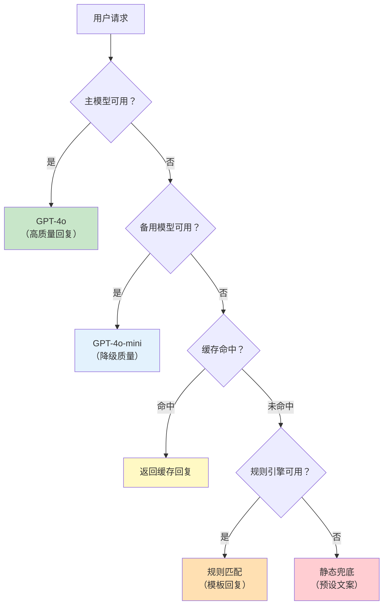

### 8.2 降级链实现

```java
import org.springframework.ai.chat.client.ChatClient;
import org.springframework.stereotype.Service;

@Service
public class GracefulDegradationService {

    private final ChatClient primaryClient;    // GPT-4o
    private final ChatClient secondaryClient;  // GPT-4o-mini
    private final CacheService cacheService;
    private final RuleEngine ruleEngine;

    public GracefulDegradationService(ChatClient primaryClient, ChatClient secondaryClient,
                                      CacheService cacheService, RuleEngine ruleEngine) {
        this.primaryClient = primaryClient;
        this.secondaryClient = secondaryClient;
        this.cacheService = cacheService;
        this.ruleEngine = ruleEngine;
    }

    public String generate(String prompt) {
        // 第一级：主模型
        try {
            return primaryClient.prompt()
                    .user(prompt)
                    .call()
                    .content();
        } catch (Exception e) {
            log.warn("主模型失败，尝试降级", e);
        }

        // 第二级：备用模型
        try {
            return secondaryClient.prompt()
                    .user(prompt)
                    .call()
                    .content();
        } catch (Exception e) {
            log.warn("备用模型失败，尝试缓存", e);
        }

        // 第三级：缓存
        String cached = cacheService.get(prompt);
        if (cached != null) {
            return cached;
        }

        // 第四级：规则引擎
        String ruleResult = ruleEngine.match(prompt);
        if (ruleResult != null) {
            return ruleResult;
        }

        // 第五级：静态兜底
        return "抱歉，AI 服务暂时不可用。请稍后重试或联系客服。";
    }
}
```

---

## 9. 工具容错模式

### 9.1 工具容错装饰器

```java
import java.time.Duration;
import java.util.concurrent.CompletableFuture;
import java.util.function.Supplier;

import org.slf4j.Logger;
import org.slf4j.LoggerFactory;
import org.springframework.stereotype.Component;

import io.github.resilience4j.circuitbreaker.CircuitBreaker;
import io.github.resilience4j.circuitbreaker.CircuitBreakerRegistry;
import io.github.resilience4j.decorators.Decorators;
import io.github.resilience4j.retry.Retry;
import io.github.resilience4j.retry.RetryConfig;
import io.github.resilience4j.timelimiter.TimeLimiter;

/**
 * 为任意工具包装容错能力（Resilience4j 装饰器，依赖见 §6.2）
 */
@Component
public class ToolExecutor {

    private static final Logger log = LoggerFactory.getLogger(ToolExecutor.class);

    private final CircuitBreaker circuitBreaker;
    private final TimeLimiter timeLimiter;

    public ToolExecutor(CircuitBreakerRegistry registry) {
        this.circuitBreaker = registry.circuitBreaker("tool-circuit");
        this.timeLimiter = TimeLimiter.of(Duration.ofSeconds(15));
    }

    public String executeWithResilience(String toolName, Supplier<String> action) {
        Supplier<String> decorated = Decorators.ofSupplier(action)
                .withCircuitBreaker(circuitBreaker)
                .withRetry(Retry.of(toolName, RetryConfig.custom()
                        .maxAttempts(2)
                        .build()))
                .decorate();

        try {
            return timeLimiter.executeFutureSupplier(
                    () -> CompletableFuture.supplyAsync(decorated));
        } catch (Exception e) {
            log.error("工具 {} 执行失败", toolName, e);
            return "工具 " + toolName + " 执行失败：" + e.getMessage();
        }
    }
}

// 使用
@Tool(description = "查询库存")
public String checkInventory(String productId) {
    return toolExecutor.executeWithResilience("checkInventory",
            () -> inventoryService.check(productId));
}
```

### 9.2 工具降级策略

| 工具类型 | 降级策略 | 示例 |
|---------|---------|------|
| **只读查询** | 返回缓存数据 | 订单查询：返回最近一次缓存结果 |
| **只读查询** | 返回空结果 + 提示 | 搜索工具：返回"搜索功能暂时不可用" |
| **写操作** | 排队稍后执行 | 发邮件：存入消息队列，稍后重试 |
| **写操作** | 拒绝执行 | 转账：返回"系统繁忙，请稍后操作" |

---

## 10. 向量数据库容错

### 10.1 RAG 降级：检索失败时回退到无 RAG 模式

```java
import org.springframework.ai.chat.client.ChatClient;
import org.springframework.ai.chat.client.advisor.vectorstore.QuestionAnswerAdvisor;
import org.springframework.ai.vectorstore.VectorStore;
import org.springframework.stereotype.Service;

@Service
public class ResilientRagService {

    private final ChatClient clientWithRag;
    private final ChatClient clientWithoutRag;
    private final VectorStore vectorStore;

    public ResilientRagService(ChatClient.Builder builder, VectorStore vectorStore) {
        this.vectorStore = vectorStore;
        this.clientWithRag = builder
                .defaultAdvisors(QuestionAnswerAdvisor.builder(vectorStore).build())
                .build();
        this.clientWithoutRag = builder.build();
    }

    public String answer(String question) {
        try {
            // 先尝试 RAG 增强回复
            return clientWithRag.prompt()
                    .user(question)
                    .call()
                    .content();
        } catch (Exception e) {
            log.warn("向量检索失败，降级为无 RAG 模式", e);
            // 降级：不做检索，直接用 LLM 回复
            return clientWithoutRag.prompt()
                    .user(question)
                    .call()
                    .content();
        }
    }
}
```
> **需在 pom.xml 中添加依赖**（`QuestionAnswerAdvisor` 所在模块）：2.0.0 起模块名从 `spring-ai-advisors-vector-store` 改为 `spring-ai-vector-store-advisor`（老坐标已不存在）——版本走 `spring-ai-bom`，不写 `<version>`：
>
> ```xml
> <dependency>
>     <groupId>org.springframework.ai</groupId>
>     <artifactId>spring-ai-vector-store-advisor</artifactId>
> </dependency>
> ```

---

## 11. 限流策略

### 11.1 令牌桶限流

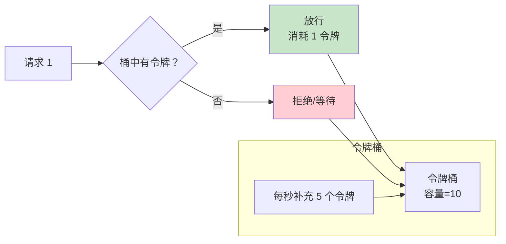

### 11.2 Resilience4j 限流

```java
import org.springframework.ai.chat.client.ChatClient;
import org.springframework.web.bind.annotation.PostMapping;
import org.springframework.web.bind.annotation.RequestBody;
import org.springframework.web.bind.annotation.RestController;

import io.github.resilience4j.ratelimiter.RequestNotPermitted;
import io.github.resilience4j.ratelimiter.annotation.RateLimiter;

@RestController
public class ChatController {

    private final ChatClient chatClient;

    public ChatController(ChatClient chatClient) {
        this.chatClient = chatClient;
    }

    @PostMapping("/chat")
    @RateLimiter(name = "llm-rate-limiter", fallbackMethod = "rateLimitFallback")
    public String chat(@RequestBody ChatRequest request) {
        return chatClient.prompt()
                .user(request.message())
                .call()
                .content();
    }

    public String rateLimitFallback(ChatRequest request, RequestNotPermitted e) {
        return "当前请求过多，请稍后重试。";
    }
}
```

---

## 12. 健康检查与可观测

### 12.1 自定义健康指标

```java
import org.springframework.ai.chat.model.ChatModel;
import org.springframework.boot.health.contributor.Health;
import org.springframework.boot.health.contributor.HealthIndicator;
import org.springframework.stereotype.Component;

@Component
public class LlmHealthIndicator implements HealthIndicator {

    private final ChatModel chatModel;

    public LlmHealthIndicator(ChatModel chatModel) {
        this.chatModel = chatModel;
    }

    @Override
    public Health health() {
        try {
            // 发送一个极简请求检查 LLM 可用性
            String response = chatModel.call("ping");
            return Health.up()
                    .withDetail("provider", "openai")
                    .withDetail("status", "responsive")
                    .build();
        } catch (Exception e) {
            return Health.down()
                    .withDetail("error", e.getMessage())
                    .withDetail("provider", "openai")
                    .build();
        }
    }
}
```

### 12.2 指标埋点

```java
import org.springframework.ai.chat.client.ChatClient;
import org.springframework.stereotype.Component;

import io.micrometer.core.instrument.Counter;
import io.micrometer.core.instrument.MeterRegistry;
import io.micrometer.core.instrument.Timer;

@Component
public class InstrumentedLlmService {

    private final ChatClient chatClient;
    private final Timer llmCallTimer;
    private final Counter llmErrorCounter;

    public InstrumentedLlmService(ChatClient chatClient, MeterRegistry registry) {
        this.chatClient = chatClient;
        this.llmCallTimer = Timer.builder("agent.llm.call.duration")
                .description("LLM 调用耗时")
                .register(registry);
        this.llmErrorCounter = Counter.builder("agent.llm.call.errors")
                .description("LLM 调用错误数")
                .register(registry);
    }

    public String call(String prompt) {
        return llmCallTimer.record(() -> {
            try {
                return chatClient.prompt().user(prompt).call().content();
            } catch (Exception e) {
                llmErrorCounter.increment();
                throw e;
            }
        });
    }
}
```

---

## 13. 完整容错架构

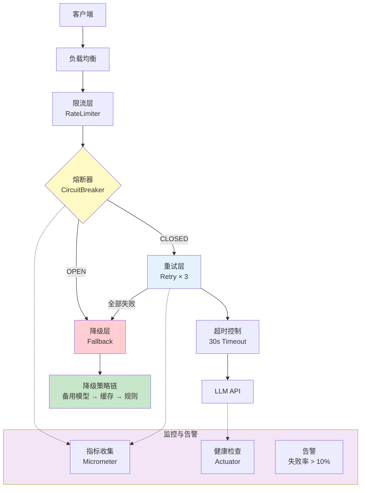

---

## 14. 舱壁隔离：按依赖分池与故障域隔离

### 14.1 舱壁模式本质

舱壁（Bulkhead）这个词来自舰船设计：船体被水密隔舱分成若干独立舱室，**一个舱进水，船不会整体沉没**。软件里的舱壁模式做的是同一件事——把有限的共享资源（线程、连接、并发额度、内存）按**故障域**切成相互独立的池，**单池饱和只影响该池服务的那个依赖，不向其他依赖传染**。

为什么 Agent 系统特别需要它？回看 §2 的故障分类：Agent 的依赖链上挂着 LLM API、工具 HTTP 服务、向量数据库、Embedding 模型等多个**延迟特征和故障概率完全不同**的下游。如果它们共享同一份资源池，最慢的那个就会成为"进水的舱"：

- 一个 30 秒才返回的爬虫工具，把共享连接池的连接全部占住；
- 后续的 LLM 调用、Embedding 调用拿不到连接，在池的获取队列里排队超时；
- 表面上是"工具慢"，实际上**全站一起瘫**——这就是故障传染。

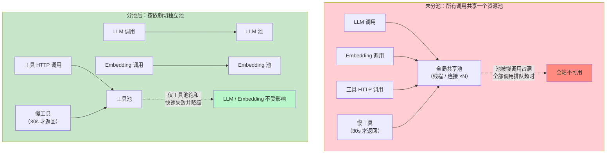

**舱壁与熔断是正交的两件事，不是替代关系**：

| 维度 | 熔断器（§6） | 舱壁（本节） |
|------|-------------|-------------|
| 隔离的维度 | **时间**维度——下游持续失败就停止呼叫一段时间 | **空间**维度——限制同一时刻最多有多少资源占用下游 |
| 解决的问题 | 下游已经坏了，避免无意义的重试消耗 | 下游只是**慢**（还没到"坏"），避免慢调用拖垮共享资源 |
| 触发条件 | 失败率超阈值 | 并发/连接数达上限 |
| 典型组合 | 舱壁饱和 → 快速失败计入熔断统计 → 失败率超阈值熔断 → 恢复后舱壁继续限占 | 同左，两者串联工作 |

一个"慢而不断"的第三方 API 正是两者最容易漏掉的场景：它每次调用最终都能成功（不触发失败率熔断），但每次都要 30 秒——只有舱壁能拦住它对共享资源的蚕食。

### 14.2 Agent 系统的三种分池维度

| 分池维度 | 切分依据 | 典型故障场景 | 池的承载物 |
|---------|---------|-------------|-----------|
| **按下游依赖** | LLM 主模型 / Embedding / 工具 HTTP / 向量库，各一个池 | 慢工具占满共享连接池，拖垮全部 LLM 调用 | HTTP 连接池 + 并发信号量 |
| **按租户** | 租户 ID | 大客户批量评估打满共享资源，所有租户一起变慢（"吵闹的邻居"） | 每租户信号量 / 独立调度器 + 配额（§11、[教程 04-企业级架构主干/06-多租户隔离与资源治理 §5]） |
| **按工具** | 工具名 / 工具类别（快查询类 vs 慢爬取类） | 一个慢爬虫工具占满工具执行额度，所有工具排队 | 每工具（类别）信号量 + 专用调度器 |

三种维度不是三选一，而是**可以叠加**：外层按租户分池（租户公平），内层按依赖分池（依赖隔离），工具层再按类别分池（执行隔离）。每一层都回答同一个问题——"这部分资源被占满时，波及面被限制在哪个圈里"。

**按下游依赖分池的落地：连接池隔离（javap 实证）。** reactor-netty 的 `ConnectionProvider` 是连接级舱壁的载体——每个下游一个独立 provider，上限、排队、超时各自独立。注意 Spring Framework 7.0（Boot 4.1 所用）中 `ReactorResourceFactory` 的包路径从 6.x 的 `org.springframework.http.client.reactive` **移到了 `org.springframework.http.client`**（javap 实证 spring-web 7.0.8），网上大量旧教程的 import 在 4.1 下编译不过：

```java
import java.time.Duration;

import org.springframework.context.annotation.Bean;
import org.springframework.context.annotation.Configuration;
// Spring Framework 7.0（Boot 4.1）：ReactorResourceFactory 移包到 org.springframework.http.client
// （6.x 在 org.springframework.http.client.reactive 下，javap 实证 spring-web 7.0.8）
import org.springframework.http.client.ReactorResourceFactory;
import org.springframework.http.client.reactive.ReactorClientHttpConnector;
import org.springframework.web.reactive.function.client.WebClient;

import reactor.netty.http.client.HttpClient;
import reactor.netty.resources.ConnectionProvider;

@Configuration
public class IsolatedWebClientConfig {

    /** LLM 主模型池：长推理、高并发、允许短排队 */
    private ConnectionProvider llmPool() {
        // reactor-netty 1.2.14（javap 实证：builder/maxConnections/pendingAcquireMaxCount/pendingAcquireTimeout/maxIdleTime）
        return ConnectionProvider.builder("llm-pool")
                .maxConnections(100)                       // 本池连接上限（与供应商并发配额对齐）
                .pendingAcquireMaxCount(1_000)             // 排队上限：超了直接拒绝，不无限堆积
                .pendingAcquireTimeout(Duration.ofSeconds(5))   // 排队最多等 5 秒
                .maxIdleTime(Duration.ofSeconds(30))
                .build();
    }

    /** 工具 HTTP 池：第三方不可控，从严设置、快速失败 */
    private ConnectionProvider toolPool() {
        return ConnectionProvider.builder("tool-pool")
                .maxConnections(20)
                .pendingAcquireMaxCount(50)
                .pendingAcquireTimeout(Duration.ofSeconds(2))   // 工具调用排队 2 秒就放弃
                .evictInBackground(Duration.ofSeconds(60))
                .build();
    }

    @Bean
    public WebClient llmWebClient() {
        // HttpClient.create(ConnectionProvider) + responseTimeout（javap 实证 reactor-netty-http 1.2.14）
        HttpClient httpClient = HttpClient.create(llmPool())
                .responseTimeout(Duration.ofSeconds(60));
        return WebClient.builder()
                .clientConnector(new ReactorClientHttpConnector(httpClient))
                .build();
    }

    @Bean
    public WebClient toolWebClient() {
        HttpClient httpClient = HttpClient.create(toolPool())
                .responseTimeout(Duration.ofSeconds(15));
        return WebClient.builder()
                .clientConnector(new ReactorClientHttpConnector(httpClient))
                .build();
    }
}
```

这套配置生效的前提是**不同 WebClient 必须真的被绑定到不同下游**：LLM 调用走 `llmWebClient`（自建 `OpenAiChatModel` 时可注入），工具服务调用走 `toolWebClient`。如果全系统只有一个默认 `WebClient`，上面一切无从谈起。

> **注意**：如果你走 Spring Boot 自动装配的 `WebClient.Builder`，它默认使用全局共享资源（见 §14.5 反模式）。需要分池时按上面的方式手工构建 connector。

### 14.3 两种实现形态：信号量舱壁 vs 线程池舱壁

连接池隔离只管"对外 HTTP 并发"。**进程内的并发占用**（比如一次 LLM 会话的端到端额度、一个租户的并发会话数）需要另外两种形态：

**形态一：信号量舱壁（WebFlux 首选）。** 用 `Semaphore` 做纯计数准入——不搬线程、不阻塞、开销极小，天然适配 EventLoop：

```java
import java.util.Map;
import java.util.concurrent.ConcurrentHashMap;
import java.util.concurrent.Semaphore;

import org.springframework.stereotype.Component;

import reactor.core.publisher.Mono;

/**
 * 信号量舱壁：按名字（依赖名/租户 ID/工具名）切独立并发额度。
 * JDK 21 + reactor-core 3.8.6（javap 实证：Semaphore.tryAcquire/release、Mono.defer/doFinally）
 */
@Component
public class Bulkheads {

    /** 每个依赖名一把独立信号量；许可数以首次创建为准（配置归口一处，避免运行时漂移） */
    private final Map<String, Semaphore> bulkheads = new ConcurrentHashMap<>();

    public Mono<String> call(String dependency, int maxConcurrency,
                             Mono<String> action) {
        Semaphore permits = bulkheads.computeIfAbsent(dependency,
                name -> new Semaphore(maxConcurrency));

        return Mono.defer(() -> {
            // EventLoop 安全的关键：tryAcquire() 立即返回 true/false，绝不阻塞线程
            // （对照：acquire() 会阻塞——在 EventLoop 上调用它会卡死整个 worker，绝对禁止）
            if (!permits.tryAcquire()) {
                return Mono.error(new BulkheadRejectedException(dependency));
            }
            return action.doFinally(sig -> permits.release());  // 成功/失败/取消都归还许可
        });
    }

    /** 舱壁拒绝异常：上游转 429/503 或触发降级（§8） */
    public static final class BulkheadRejectedException extends RuntimeException {
        public BulkheadRejectedException(String dependency) {
            super("舱壁已满：" + dependency);
        }
    }
}
```

用法——把"慢爬虫工具"和"快查询工具"切进不同池：

```java
// 慢工具池：并发 5；快工具池：并发 50——慢工具无论怎么堆积都占不到快工具的额度
Mono<String> result = bulkheads.call("crawler-tool", 5,
        Mono.fromCallable(() -> crawlerService.scrape(keyword)));
```

**形态二：线程池舱壁。** 当舱壁要保护的调用本身是**阻塞调用**（阻塞式 SDK、JDBC）时，光计数不够——必须让阻塞发生在专用线程上，且线程数即并发上限。完整实战（LLM 专用池 + 排队上限 + 线程命名）已在 [教程 01-WebFlux与响应式编程/06-线程模型与调度器 §7]「每线程池隔离：LLM 专用池实战」落地，本节只收编它与舱壁语义的对应关系：`newBoundedElastic(maxThreads, queueCapacity, ...)` 中 **maxThreads = 舱壁许可数（并发上限）、queueCapacity = 排队上限（超了抛拒绝而不是无限堆积）**——一个调度器同时具备"隔离 + 限并发 + 限排队"三个舱壁要素。

**两种形态对比与选型**：

| | 信号量舱壁 | 线程池舱壁 |
|---|---|---|
| 实现 | `Semaphore` 计数 | `Schedulers.newBoundedElastic` 专用池 |
| 是否搬线程 | 否（调用留在原线程） | 是（阻塞体跑在池线程上） |
| EventLoop 安全性 | 安全（`tryAcquire` 不阻塞） | 安全（阻塞被隔离出 EventLoop） |
| 适用调用 | 非阻塞调用（WebClient/Reactive Redis/纯内存） | 阻塞调用（阻塞 SDK/JDBC/文件 IO） |
| 开销 | 近乎零 | 每池一组线程（要设上限、要 dispose） |
| 主要风险 | 忘记 release 导致池"漏气"（用 `doFinally` 兜底） | 池过多导致线程总量膨胀；忘了 `dispose` 泄漏线程 |
| WebFlux 选型口诀 | **默认选它** | 调用会阻塞时才用 |

**WebFlux 语境适配铁律**（呼应 [教程 01-WebFlux与响应式编程/06-线程模型与调度器 §5]）：EventLoop 不可阻塞。这意味着线程池舱壁的"排队等待许可"必须由调度器队列实现（任务排队在池外），**绝不能**在 EventLoop 上写"先 `acquire()` 拿到许可再执行"这类阻塞等待式逻辑；信号量舱壁同理只允许 `tryAcquire()` 快速失败或交由排队上限控制。

**Resilience4j 舱壁（对比方案）**。Resilience4j 也提供 Bulkhead 模块，与 §6 的熔断器同门配套，配置驱动、带 Actuator 端点：

> **需在 pom.xml 中添加依赖**（`resilience4j-bulkhead`、`resilience4j-reactor`；本机 Maven 仓库仅有 `resilience4j-bom` 未下载子模块 jar，**以下 API 未能本地 javap 实证，属概念代码，引入依赖后需按 [附录 05-SpringAI2-API基准] 的方法学实证**）：

```xml
<!-- pom.xml -->
<dependency>
    <groupId>io.github.resilience4j</groupId>
    <artifactId>resilience4j-bulkhead</artifactId>
    <version>2.2.0</version>
</dependency>
<dependency>
    <groupId>io.github.resilience4j</groupId>
    <artifactId>resilience4j-reactor</artifactId>
    <version>2.2.0</version>
</dependency>
```

```java
// 概念代码（未能本地 javap 实证）：注解式固定舱壁 + Reactor 操作符式舱壁
// @Bulkhead(name = "llm", type = Bulkhead.Type.SEMAPHORE)   // 声明式信号量舱壁
// Mono<Response> guarded = webClient.get()...               // 响应式管道内：
//     .transformDeferred(BulkheadOperator.of(bulkhead));     // resilience4j-reactor 提供
```

选型建议：已经全站用 Resilience4j（§6 熔断 + §11 限流）的团队，加 `resilience4j-bulkhead` 能把四件套统一到一套配置与监控端点；只想要"最小可解释的分池"时，上面的 Semaphore/调度器方案零依赖、行为一目了然，没有魔法。

### 14.4 池饱和语义：排队上限、快速失败、降级联动

分池之后，"池满了怎么办"是必须显式回答的问题。饱和时只有三条出路，且每条都要有**上限**：

1. **排队**（缓冲一点抖动）：必须有排队上限（`pendingAcquireMaxCount` / 队列容量）与排队超时（`pendingAcquireTimeout`）——没有上限的排队就是把快速失败改成延迟爆炸，把内存当队列用。
2. **快速失败**（过载即拒绝）：排队额度也满了，立刻拒绝——拒绝要"贵得起来"：返回明确的 429/503 与 `Retry-After`，而不是让调用方等到超时。
3. **降级联动**（拒绝不是终点）：拒绝信号接入 §8 降级链（备用模型/缓存/规则兜底）与 §6 熔断统计——**舱壁拒绝应当计入下游的失败统计**，否则"慢下游"永远攒不够失败率、永远熔断不了。

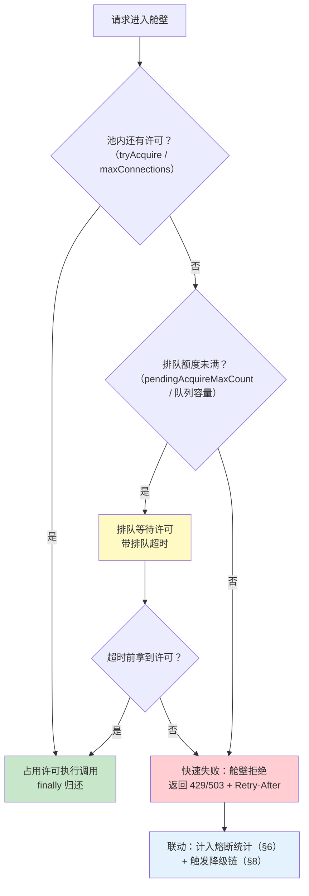

**每个池的三个数字都要进监控**（当前并发、排队深度、拒绝计数）——舱壁把"故障域"切小了，观测必须跟着切小，否则你只能看到"系统慢了"，看不出"哪个舱进水了"。指标埋点范式见 §12.2 与 [教程 04-企业级架构主干/02-全链路可观测性]；把池名作为低基数 tag（`bulkhead=llm-pool` / `tenant=acme`）即可在面板上逐池对照。

### 14.5 反模式：全局共享一个 HttpClient/连接池

最常见的舱壁缺失不是"没写分池代码"，而是"**默认就是共享的**"：reactor-netty 的 `HttpClient.create()` 不传 provider 时走全局单例 `HttpResources`（javap 实证 reactor-netty-http 1.2.14：`HttpResources.get()/set(ConnectionProvider)` 全局共享），Spring Boot 自动装配的 `WebClient` 同样基于全局资源——所有下游挤同一个默认大小的连接池、同一条获取队列。

| 反模式 | 症状 | 修复 |
|--------|------|------|
| 全局默认 WebClient 调所有下游 | 一个慢工具把默认池占满，LLM/Embedding 调用排队超时；监控只见"整体变慢" | 按依赖建独立 `ConnectionProvider`（§14.2），WebClient 各自绑定 |
| LLM 与 Embedding 共用一个池/配额 | 检索高峰（批量嵌入）把对话调用的额度吃光 | 嵌入池独立设置上限——两者延迟特征完全不同 |
| `Semaphore` 全局一把（不分依赖） | 慢依赖占满总许可数，其他依赖陪绑 | 按 `computeIfAbsent(dependency, ...)` 分池（§14.3） |
| 排队只设超时不设上限 | 过载时请求堆积在队列里吃内存，延迟先爆炸后 OOM | `pendingAcquireMaxCount`/队列容量先行，超限即拒 |
| 忘记 `release()`（只在成功路径归还） | 池"漏气"：运行越久可用许可越少，最终全拒 | `doFinally(sig -> release)`——取消与异常路径都归还 |

一句话自检：**把每一个下游依赖想象成一间舱室，然后问——它进水时，哪些舱室会跟着进水？答案是"多于一间"就有分池欠账。**

---

## 15. 过载保护与负载削减

§11 的限流和 §14 的舱壁共同回答"**允许多少请求进来、占用多少资源**"。但当流量**穿透了准入层**（配额内的突发、重试放大、下游突然降容）而系统已经过载时，还差最后一道机制：**从已经进系统的请求里，按价值排序做减法**。这就是负载削减（Load Shedding）。

### 15.1 过载时"有损服务"哲学

传统系统追求"不丢任何请求"，结果是过载时全部请求一起变慢、一起超时——**最差的全输结局**。有损服务的哲学相反：**过载时主动牺牲一部分请求，保住另一部分的服务质量**。宁可 80% 的请求又快又好、20% 被明确拒绝，也不要 100% 的请求全部超时。

三个机制各管一段，缺一不可：

| 机制 | 管哪一段 | 拒绝谁 | 回答的问题 |
|------|---------|--------|-----------|
| **限流**（§11） | 准入层——请求还没进系统 | 新请求 | "单位时间放多少进来？" |
| **负载削减**（本节） | 系统内——请求已经进来 | 已进系统的低价值请求 | "已经进来的请求，先牺牲谁？" |
| **熔断**（§6） | 出站层——系统调下游 | 对下游的调用 | "下游坏了/慢了，还要不要呼叫它？" |

为什么准入层挡不住所有过载？三个现实原因：① **配额内突发**——所有租户都合法地用满配额，总和超出容量；② **容量塌缩**——LLM 提供商临时降容/限流，同样的请求量瞬间变成过载；③ **重试放大**——下游变慢触发各层重试（§5），流量成倍反弹（§15.3 专门治理）。

### 15.2 请求分级：P0/P1/P2 与分级标签贯穿

削减的前提是**给请求排好价值序**。Agent 系统的天然三级：

| 级别 | 定义 | 延迟敏感度 | 典型流量 | 过载时处置 |
|------|------|-----------|---------|-----------|
| **P0 交互式会话** | 用户正在屏幕前等待 | 秒级 | 聊天、Agent 对话、SSE 流 | 最后削减；通常只降级（切备用模型）不砍断 |
| **P1 批量评估** | 结果重要但不急于此刻 | 分钟级可接受 | 效果评估集回放、报表生成、定时摘要 | 转队列延迟执行，甚至暂停 |
| **P2 离线索引** | 半夜跑完就行 | 小时级 | 文档向量化、记忆归档、知识库重建 | 第一个削减/暂停，恢复后补跑 |

**分级标签如何贯穿全链路**——标签必须在**每一个削减决策点都能读到**。链路是：客户端/上游标级 → 请求头携带 → 入口读出 → 写入 Reactor Context → 各削减点按需读取（WebFlux 禁 ThreadLocal，Reactor Context 是唯一正道，呼应 [教程 01-WebFlux与响应式编程/06-线程模型与调度器 §5]）：

```java
// ① 定义分级（教程自研模式，JDK 即可）
public enum RequestPriority {
    P0_INTERACTIVE,   // 交互式会话：最后削减
    P1_BATCH,         // 批量评估：可延迟
    P2_OFFLINE;       // 离线索引：先削减

    static RequestPriority fromHeader(String v) {
        return switch (v == null ? "P0" : v.toUpperCase()) {
            case "P1" -> P1_BATCH;
            case "P2" -> P2_OFFLINE;
            default -> P0_INTERACTIVE;   // 未标注默认最高级——宁可不削，不可错杀
        };
    }
}
```

```java
// ② 入口读请求头并写入 Reactor Context
// （@RequestHeader 实证存在于 spring-web 7.0.8；contextWrite/put 实证于 reactor-core 3.8.6）
import org.springframework.http.MediaType;
import org.springframework.web.bind.annotation.GetMapping;
import org.springframework.web.bind.annotation.RequestHeader;

import reactor.util.context.Context;

@GetMapping(value = "/chat", produces = MediaType.TEXT_EVENT_STREAM_VALUE)
public Flux<String> chat(@RequestHeader(value = "X-Priority", defaultValue = "P0") String priority,
                         @RequestParam String message) {
    RequestPriority p = RequestPriority.fromHeader(priority);
    return chatService.stream(message)
            // 标签随流传播：任何 deferContextual 的环节都能读到
            .contextWrite(ctx -> ctx.put(RequestPriority.class, p));
}
```

```java
// ③ 削减决策点按级读取（deferContextual/getOrDefault 实证于 reactor-core 3.8.6）
Mono<Void> guardByPriority() {
    return Mono.deferContextual(ctxView -> {
        RequestPriority p = ctxView.getOrDefault(
                RequestPriority.class, RequestPriority.P0_INTERACTIVE);
        if (shedder.shouldReject(p)) {                    // 削减器按当前过载等级裁决
            return Mono.error(new ShedRejectedException(p));
        }
        return Mono.empty();
    });
}
```

削减顺序严格按级：**先砍 P2，再砍 P1，P0 尽量保**。与租户配额（[教程 04-企业级架构主干/06-多租户隔离与资源治理 §5]）的关系是两个正交维度：配额管**公平**（每个租户能用多少），优先级管**价值**（同一个租户内部先保什么）——先过配额闸（租户间公平），再做削减裁决（租户内排序）。

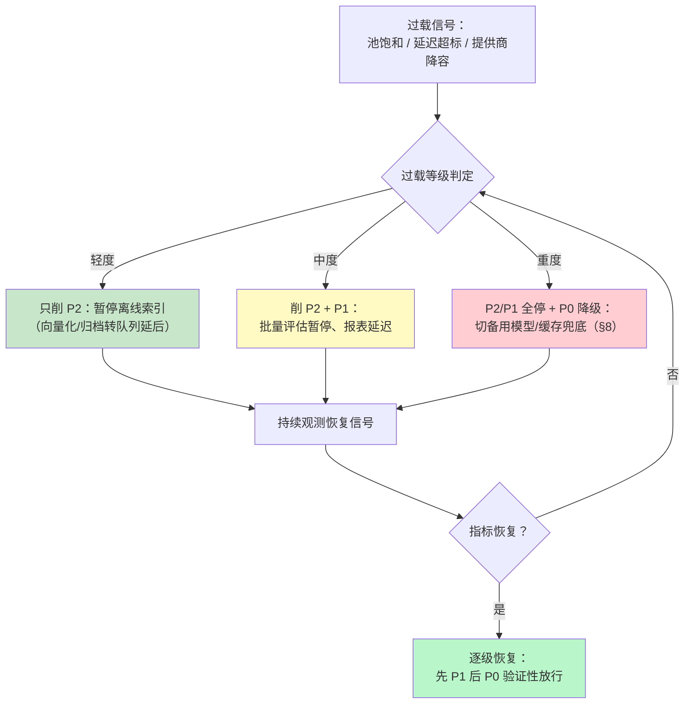

恢复比削减更讲究：**逐级恢复、验证性放行**——先放 P1 观察延迟，稳了再放 P0 全量。一刀切全放开，恢复的流量瞬间叠加积压的重试，直接二次过载。

### 15.3 retry budget：重试预算

重试是过载最好的朋友、最坏的放大器。算一笔账：一次下游抖动，网关层 `maxAttempts=3`、服务层 `maxAttempts=3`，1 次真实故障放大成 3×3=9 次下游请求；如果下游正是**因为过载而抖动**，这 9 倍流量就是压死它的最后一根稻草——重试风暴的本质是**把局部的瞬时故障，放大成全局的持续过载**。

§5 的 `maxAttempts` 是**微观上限**——限制单个请求最多重试几次；它防不住**宏观放大**——每个请求都"合规地"重试 3 次，总量依然是 3 倍。retry budget 在宏观再加一道闸：

> **重试预算**：滑动窗口内（如最近 1 分钟），全服务**重试次数占请求总数的比例不得超过预算**（如 ≤10%）。预算耗尽后，后续失败一律直接返回，不再重试——把剩余容量全部留给首次请求，因为首次请求的成功率永远比重试高（重试请求已经在失败路径上了）。

10% 这个数的直觉：允许系统对瞬时抖动做正常修补，但一旦失败率高到重试占比超过一成，说明这不是抖动而是事故——此时重试只会火上浇油。

```java
import java.util.concurrent.atomic.LongAdder;

/**
 * 重试预算（教程自研模式代码，JDK 21 javap 实证：LongAdder.increment/sum/sumThenReset）。
 * 全服务共享一个实例；窗口由调用方定时滚动。
 */
@Component
public class RetryBudget {

    private final LongAdder totalRequests = new LongAdder();
    private final LongAdder retryRequests = new LongAdder();
    private final double maxRetryRatio;    // 如 0.10：重试占比上限 10%

    public RetryBudget() { this(0.10); }

    public RetryBudget(double maxRetryRatio) {
        this.maxRetryRatio = maxRetryRatio;
    }

    /** 每个出站请求（含首次）都要登记 */
    public void recordRequest() { totalRequests.increment(); }

    /** 是否允许这一次重试：窗口内占比超预算 → 拒绝重试，直接失败 */
    public boolean allowRetry() {
        long total = totalRequests.sum();
        if (total <= 0) {
            return true;                     // 窗口尚无流量，放行首次重试
        }
        return (double) retryRequests.sum() / total <= maxRetryRatio;
    }

    public void recordRetry() { retryRequests.increment(); }

    /** 窗口滚动：定时任务（如每 60s）调用，读出并清零两个计数 */
    public WindowStats rollWindow() {
        return new WindowStats(totalRequests.sumThenReset(),
                retryRequests.sumThenReset());
    }

    public record WindowStats(long total, long retried) {}
}
```

接入 §5 的重试链路只需一行裁决——重试前先问预算：

```java
.retryWhen(reactor.util.retry.Retry.backoff(3, Duration.ofSeconds(1))
        .filter(t -> isRetryable(t) && retryBudget.allowRetry()))   // 预算外直接放行为失败
```

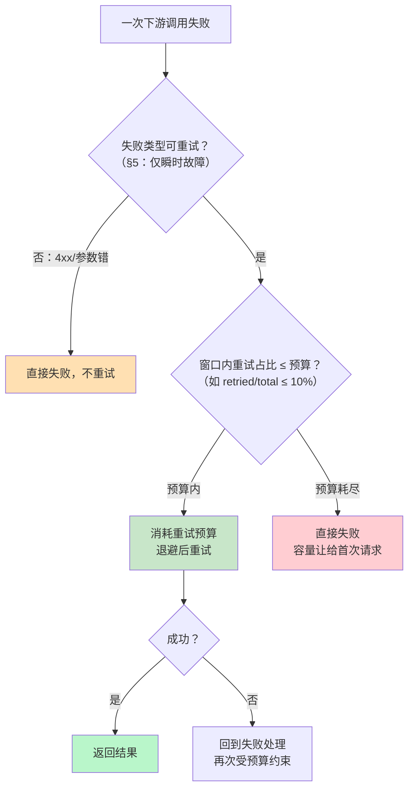

三层放大防护至此闭环：`maxAttempts`（单请求微观上限，§5）→ retry budget（全服务宏观占比）→ 熔断（下游持续故障彻底停手，§6）。预算的两个计数同时是告警指标——`retryRequests/totalRequests` 突然抬头，往往比失败率告警更早暴露下游劣化。

### 15.4 与 SSE 长连接的关系

SSE 流式会话让"削减"多了一条必须遵守的纪律：**过载时新连接可以拒，存量流要保住**。

- **新连接拒绝**：准入层按当前过载等级拒绝新的会话建立（P2/P1 直接 429/503 + `Retry-After`；P0 可放进降级链），这是廉价的——拒绝发生在流开始之前。
- **存量流保住**：已经建立的 SSE 流不该被削减砍断——每条流的资源在建立时已预留，砍断它省不了多少资源，却把正处于对话中的用户打成"回答到一半消失"。更糟的是引发**重连风暴**：客户端自动重连（[教程 02-SpringAI核心机制/06-SSE流式通信 §断线重连]、[教程 04-企业级架构主干/04-多页面流式响应与会话管理]），瞬间制造一波新的 P0 级连接洪峰——**为了削减负载而制造了更大的负载**。

极端兜底：如果过载深到 P0 存量流也保不住（提供商完全断供），也**不要无声断流**——按 §7.3 的方式向客户端发送显式的重连指令事件（带 `Retry-After` 语义），让客户端按退避策略重连，而不是放任它以默认节奏冲击。

```java
// SSE 存量流在流内做"是否降级"的裁决（分级标签从 Context 读，链路见 §15.2）
Flux<String> stream = chatService.stream(message)
        .contextWrite(ctx -> ctx.put(RequestPriority.class, priority))
        // P0 过载时不砍断存量流，而是切换降级来源（快模型/缓存），流保持打开
        .onErrorResume(e -> shedder.isOverload()
                ? Flux.just(shedder.degradedPartial(priority))
                : Mono.error(e));
```

### 15.5 过载保护配置清单

| 信号 | 阈值示例 | 动作 |
|------|---------|------|
| 出站池饱和率（§14 拒绝计数） | 拒绝率 > 5% 持续 1 分钟 | 进入轻度过载：削 P2 |
| LLM P99 首帧延迟 | > SLA 的 2 倍持续 2 分钟 | 中度过载：削 P2 + P1 |
| 重试预算占用 | retried/total > 10% | 停止新重试 + 检查下游健康 |
| 提供商 429/降容公告 | 收到即生效 | 直接进入对应过载等级 |
| 恢复判定 | P99 回落 SLA 内持续 5 分钟 | 逐级恢复：先 P1，观察后全量 |

把本节挂回 §13 的全景图：完整容错链从外到内依次是**限流（准入）→ 舱壁（资源隔离）→ 重试+预算（失败处理）→ 熔断（出站保护）→ 降级链（兜底）**，负载削减则是悬在准入层之上的"系统内法官"——准入挡不住的过载，由它按价值裁决。

---

## 16. 适用场景与不适用场景

### 适用场景

- 生产环境部署的 Agent 应用（必须有容错能力）
- 依赖第三方 LLM API 的系统（API 可能不可用）
- 高并发场景（需要限流防止超配额）
- 对可用性有 SLA 要求的企业应用
- 涉及金融、医疗等高风险领域的 Agent（需要快速失败 + 人工兜底）

### 不适用场景

- 内部演示 / POC 项目（容错增加了代码复杂度，演示阶段不值得）
- 单机离线工具（无网络依赖，故障概率低）
- 批处理任务（失败可以重来，不需要实时降级）
- 对延迟没有要求的异步任务（等一等就行，不需要复杂的降级链）

---

## 17. 本章总结

| 概念 | 一句话 |
|------|--------|
| **超时 Timeout** | 第一道防线——设定最大等待时间，快速失败不拖垮系统 |
| **重试 Retry** | 对瞬时故障自动重试，配合指数退避避免惊群 |
| **降级 Fallback** | 主路径失败时切换到备用方案，保证基本可用 |
| **熔断 Circuit Breaker** | 下游持续故障时停止调用，保护系统不被级联拖垮 |
| **限流 Rate Limit** | 控制请求频率，防止超过 LLM API 配额 |
| **Spring Retry** | 声明式重试框架，`@Retryable` + `@Recover` |
| **Resilience4j** | 熔断 + 限流 + 重试 + 超时的综合容错库 |
| **onErrorResume** | WebFlux 响应式错误恢复算子，切换到备用流 |
| **retryWhen** | WebFlux 响应式条件重试，支持指数退避 |
| **降级链** | 主模型 → 备用模型 → 缓存 → 规则引擎 → 静态文案 |
| **舱壁 Bulkhead** | 按依赖/租户/工具分独立资源池，单池饱和不传染——隔离的是空间维度（熔断隔离的是时间维度） |
| **负载削减 Load Shedding** | 过载时按优先级做减法：先削 P2 离线索引、再削 P1 批量评估、P0 交互最后动 |
| **重试预算 Retry Budget** | 窗口内重试占比 ≤10%，超预算直接失败——防"合规重试"放大成全站重试风暴 |
| **健康检查** | Actuator + 自定义 HealthIndicator，实时监控依赖状态 |

最后补一条方法论提醒：本章写下的每一项容错配置都只是"部署了防御"，不等于"防御有效"——熔断是否真会在阈值处打开、退避参数是否合理、降级链是否按序触发，都要靠故障注入实验来证明。"每项容错配置 ↔ 至少一个注入实验"的映射方法与 PR 级/夜间级/季度级三级演练梯度，见 [附录 04-测试策略/04-混沌工程与故障注入 §5-§6]。

**下一篇**：[64-安全与权限控制](11-安全与权限控制.md) — Agent 安全三道防线、Prompt 注入防御、工具权限分级。

---

> **想深入？→ [教程 04-企业级架构主干/12-模型路由与降级]**：多模型管理和自动降级链的设计。
> **遇到阻塞？→ [教程 04-企业级架构主干/13-部署与运维]**：健康检查端点、日志收集在生产环境的实践。
