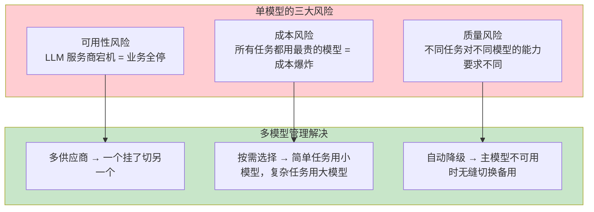
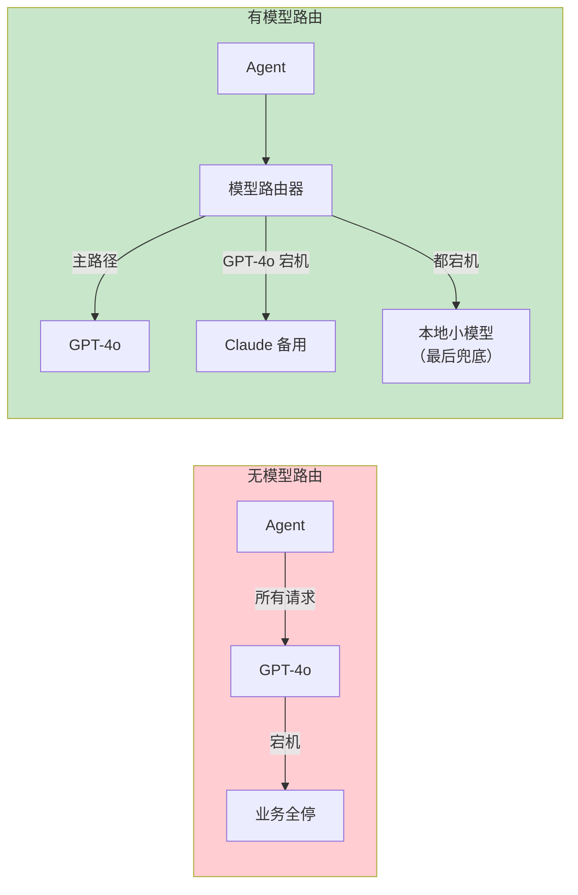
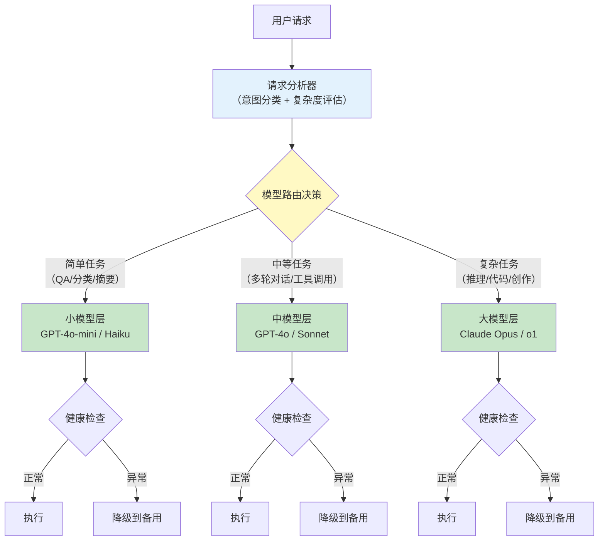
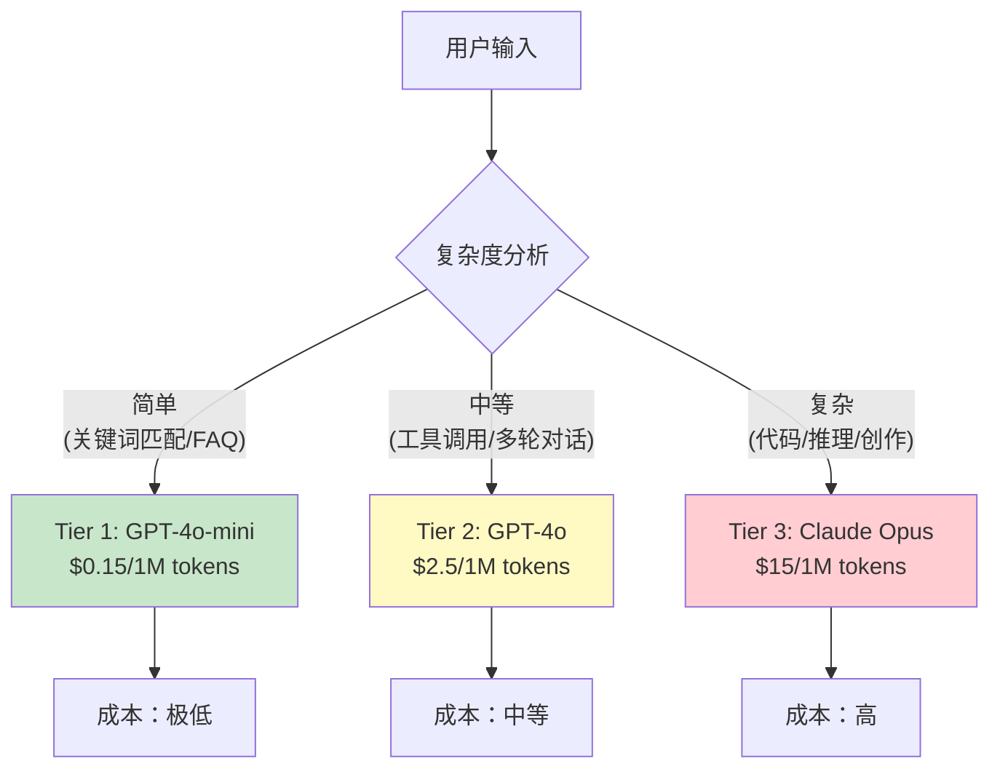
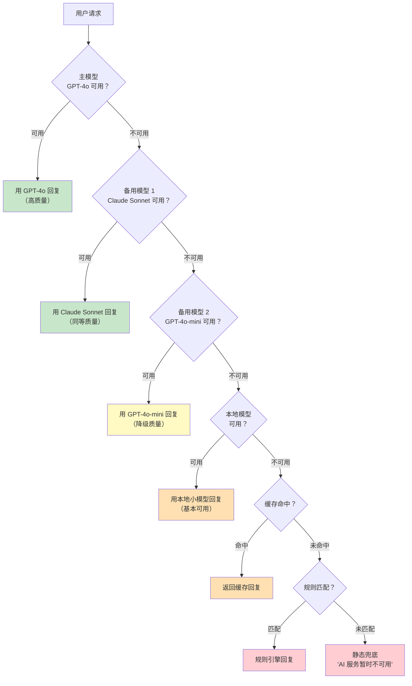
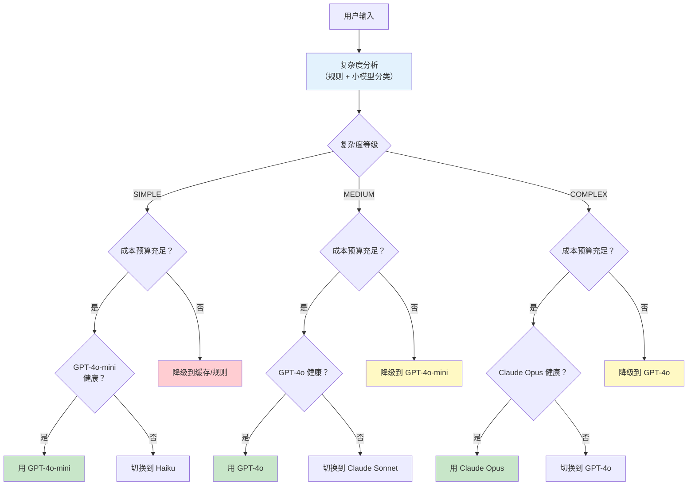

# 65-模型路由与降级

> **定位**：讲透多模型管理的工程实践——为什么需要模型路由、路由策略设计（按复杂度/成本/延迟）、降级链设计（主模型→备用模型→规则引擎）、Spring AI 多 ChatClient 配置、模型健康检查与自动切换。
>
> **读者画像**：已经掌握 ChatClient、容错设计、向量数据库选型，需要构建多模型协同的弹性 Agent 系统。
>
> **前置阅读**：[02-ChatClient 与对话模型](../00-基础与核心/02-ChatClient与对话模型.md)、[63-容错与弹性设计](10-容错与弹性设计.md)。

---

## 1. 为什么需要多模型管理

生产环境中的 Agent 如果只依赖一个 LLM，面临三大风险：



### 1.1 成本视角的震撼对比

| 任务类型 | 用 GPT-4o | 用 GPT-4o-mini | 节省 |
|---------|-----------|---------------|------|
| 简单 QA（"营业时间是几点？"） | $0.005/次 | $0.0002/次 | 96% |
| 意图分类 | $0.003/次 | $0.0001/次 | 97% |
| 文本摘要 | $0.010/次 | $0.0005/次 | 95% |
| 复杂推理 | $0.050/次 | ——（质量不够） | 0% |

> **结论**：90% 的请求其实不需要最强的模型。模型路由可以在不牺牲质量的前提下大幅降低成本。

### 1.2 可用性视角



---

## 2. 模型路由架构



---

## 3. 路由策略

### 3.1 按任务复杂度路由

最核心的路由策略——根据用户请求的复杂程度选择模型：



#### 3.1.1 复杂度分析器实现

```java
import java.util.List;
import java.util.regex.Pattern;

import org.springframework.stereotype.Component;

public enum TaskComplexity {
    SIMPLE,    // 简单：FAQ、问候、关键词查询
    MEDIUM,    // 中等：工具调用、多轮对话、摘要
    COMPLEX    // 复杂：代码生成、复杂推理、长文创作
}

@Component
public class ComplexityAnalyzer {

    // 简单任务的指示词（不需要 LLM 推理就能判断）
    private static final List<Pattern> SIMPLE_PATTERNS = List.of(
        Pattern.compile("^(你好|您好|hi|hello|hey)", Pattern.CASE_INSENSITIVE),
        Pattern.compile("(谢谢|感谢|thanks)", Pattern.CASE_INSENSITIVE),
        Pattern.compile("(几点|地址|电话|营业时间)"),
        Pattern.compile("^(是的|不是|好的|可以)"),
        Pattern.compile("^(再见|拜拜|bye)", Pattern.CASE_INSENSITIVE)
    );

    // 复杂任务的指示词
    private static final List<Pattern> COMPLEX_PATTERNS = List.of(
        Pattern.compile("(写代码|写程序|编程|code)", Pattern.CASE_INSENSITIVE),
        Pattern.compile("(分析|比较|对比|推理|推导)"),
        Pattern.compile("(写一篇|撰写|创作|翻译.*长)"),
        Pattern.compile("(设计|架构|方案|规划)")
    );

    /**
     * 规则优先：先用正则快速判断，命中则不需要调用 LLM
     */
    public TaskComplexity analyze(String userInput) {
        // 1. 规则匹配——零成本判断
        for (Pattern p : SIMPLE_PATTERNS) {
            if (p.matcher(userInput).find()) {
                return TaskComplexity.SIMPLE;
            }
        }
        for (Pattern p : COMPLEX_PATTERNS) {
            if (p.matcher(userInput).find()) {
                return TaskComplexity.COMPLEX;
            }
        }

        // 2. 长度启发式
        if (userInput.length() < 20) {
            return TaskComplexity.SIMPLE;
        }
        if (userInput.length() > 500) {
            return TaskComplexity.COMPLEX;
        }

        // 3. 默认中等
        return TaskComplexity.MEDIUM;
    }
}
```

#### 3.1.2 更精确的 LLM 分类器

规则匹配不够精确时，可以用小模型做意图分类（成本极低）：

```java
import org.springframework.ai.chat.model.ChatModel;
import org.springframework.ai.chat.prompt.Prompt;
import org.springframework.stereotype.Component;

@Component
public class LlmComplexityClassifier {

    private final ChatModel smallModel;  // GPT-4o-mini 做分类

    public LlmComplexityClassifier(ChatModel smallModel) {
        this.smallModel = smallModel;
    }

    private static final String CLASSIFY_PROMPT = """
        请将以下用户请求分类为复杂度等级。只返回一个词：SIMPLE / MEDIUM / COMPLEX

        分类标准：
        - SIMPLE: 问候、FAQ、简单信息查询、是/否回答
        - MEDIUM: 工具调用、多轮对话、摘要、翻译
        - COMPLEX: 代码生成、复杂推理、长文创作、架构设计

        用户请求：%s

        复杂度：
        """;

    public TaskComplexity classify(String userInput) {
        try {
            String result = smallModel.call(
                    new Prompt(CLASSIFY_PROMPT.formatted(userInput)))
                    .getResult().getOutput().getText().trim().toUpperCase();

            return TaskComplexity.valueOf(result);
        } catch (Exception e) {
            // 分类失败时默认用中等（安全选择）
            return TaskComplexity.MEDIUM;
        }
    }
}
```

> **成本分析**：用 GPT-4o-mini 做分类，每次约消耗 100 tokens，成本 $0.000015。相比盲选 GPT-4o（$0.005+），分类器几乎免费。

### 3.2 按成本路由

```java
import java.util.Map;
import java.util.concurrent.atomic.AtomicReference;

import org.springframework.stereotype.Component;

@Component
public class CostAwareRouter {

    // 每种模型的每百万 Token 成本（美元）
    private static final Map<String, Double> MODEL_COST = Map.of(
        "gpt-4o", 2.50,
        "gpt-4o-mini", 0.15,
        "claude-sonnet", 3.00,
        "claude-haiku", 0.25
    );

    // 日成本预算（美元）
    private static final double DAILY_BUDGET = 50.0;

    private final AtomicReference<Double> dailySpend = new AtomicReference<>(0.0);

    /**
     * 根据剩余预算选择模型
     */
    public String selectModel(TaskComplexity complexity) {
        double remaining = DAILY_BUDGET - dailySpend.get();

        if (remaining < 1.0) {
            // 预算即将耗尽，强制使用最便宜的模型
            return "gpt-4o-mini";
        }

        // 正常路由
        return switch (complexity) {
            case SIMPLE -> "gpt-4o-mini";
            case MEDIUM -> "gpt-4o";
            case COMPLEX -> remaining > 20 ? "claude-sonnet" : "gpt-4o";
        };
    }

    /**
     * 记录消费
     */
    public void recordCost(String model, int inputTokens, int outputTokens) {
        double costPerMillion = MODEL_COST.getOrDefault(model, 5.0);
        double cost = (inputTokens + outputTokens) * costPerMillion / 1_000_000;
        dailySpend.updateAndGet(current -> current + cost);
    }

    /**
     * 每日重置（通过定时任务调用）
     */
    public void resetDailyBudget() {
        dailySpend.set(0.0);
    }
}
```

### 3.3 按延迟路由

对延迟敏感的场景（如实时对话），优先选择响应快的模型：

```java
import java.util.List;
import java.util.Map;

import org.springframework.stereotype.Component;

@Component
public class LatencyAwareRouter {

    // 各模型的平均首 Token 延迟（毫秒）
    private static final Map<String, Long> MODEL_LATENCY = Map.of(
        "gpt-4o-mini", 300L,
        "gpt-4o", 800L,
        "claude-haiku", 250L,
        "claude-sonnet", 600L,
        "claude-opus", 1500L
    );

    private static final long MAX_ACCEPTABLE_LATENCY = 2000L;

    public List<String> selectModels(TaskComplexity complexity) {
        long maxLatency = MAX_ACCEPTABLE_LATENCY;

        // 按复杂度推荐模型，并按延迟排序
        List<String> candidates = switch (complexity) {
            case SIMPLE -> List.of("claude-haiku", "gpt-4o-mini");
            case MEDIUM -> List.of("gpt-4o", "claude-sonnet");
            case COMPLEX -> List.of("claude-opus", "claude-sonnet", "gpt-4o");
        };

        // 只保留延迟可接受的模型
        return candidates.stream()
                .filter(m -> MODEL_LATENCY.getOrDefault(m, 9999L) <= maxLatency)
                .toList();
    }
}
```

---

## 4. Spring AI 多 ChatClient 配置

### 4.1 多模型配置

> **配置键为 Spring AI 2.0.0 实证**：OpenAI 用 `OpenAiChatProperties`（`CONFIG_PREFIX = "spring.ai.openai.chat"`，model 直接挂 chat 下，`.options` 中缀已废弃）；第二供应商用 DeepSeek——`spring.ai.deepseek.*` 为官方前缀（本仓库未下载其 autoconfigure jar，键位与 openai 同构，均走 2.0 拍平结构）。

```yaml
# application.yml
spring:
  ai:
    openai:
      api-key: ${OPENAI_API_KEY}
      base-url: https://api.openai.com
      chat:
        model: gpt-4o
        temperature: 0.7
    deepseek:
      api-key: ${DEEPSEEK_API_KEY}
      chat:
        model: deepseek-chat
        max-tokens: 4096
```

### 4.2 多 ChatClient Bean 配置

> **需在 pom.xml 中添加依赖**：`DeepSeekChatModel` 来自 deepseek 模块（javap 实证 `org.springframework.ai.deepseek.DeepSeekChatModel.builder()`），版本走 `spring-ai-bom`，不写 `<version>`：
>
> ```xml
> <dependency>
>     <groupId>org.springframework.ai</groupId>
>     <artifactId>spring-ai-starter-model-deepseek</artifactId>
> </dependency>
> ```

```java
import org.springframework.ai.chat.client.ChatClient;
import org.springframework.ai.deepseek.DeepSeekChatModel;
import org.springframework.ai.openai.OpenAiChatModel;
import org.springframework.context.annotation.Bean;
import org.springframework.context.annotation.Configuration;

@Configuration
public class MultiModelConfig {

    // ============  小模型：简单任务  ============

    @Bean("smallChatClient")
    public ChatClient smallChatClient(OpenAiChatModel openAiChatModel) {
        return ChatClient.builder(openAiChatModel)
                .defaultSystem("你是一个高效的助手，请简洁回答。")
                .build();
    }

    // ============  中模型：标准任务  ============

    @Bean("mediumChatClient")
    public ChatClient mediumChatClient(OpenAiChatModel openAiChatModel) {
        return ChatClient.builder(openAiChatModel)
                .defaultSystem("你是一个企业知识助手，请准确、详细地回答用户问题。")
                .build();
    }

    // ============  大模型：复杂任务  ============

    @Bean("largeChatClient")
    public ChatClient largeChatClient(DeepSeekChatModel deepSeekChatModel) {
        return ChatClient.builder(deepSeekChatModel)
                .defaultSystem("你是一个顶级的 AI 助手，擅长复杂推理、代码生成和创意写作。")
                .build();
    }

    // ============  备用模型：降级使用  ============

    @Bean("fallbackChatClient")
    public ChatClient fallbackChatClient(DeepSeekChatModel deepSeekChatModel) {
        return ChatClient.builder(deepSeekChatModel)
                .defaultSystem("你是一个可靠的备用助手。")
                .build();
    }
}
```

### 4.3 模型路由服务

```java
import org.slf4j.Logger;
import org.slf4j.LoggerFactory;
import org.springframework.ai.chat.client.ChatClient;
import org.springframework.beans.factory.annotation.Qualifier;
import org.springframework.stereotype.Service;

@Service
public class ModelRouterService {

    private static final Logger log = LoggerFactory.getLogger(ModelRouterService.class);

    private final ChatClient smallChatClient;
    private final ChatClient mediumChatClient;
    private final ChatClient largeChatClient;
    private final ChatClient fallbackChatClient;
    private final ComplexityAnalyzer complexityAnalyzer;
    private final ModelHealthChecker healthChecker;

    public ModelRouterService(
            @Qualifier("smallChatClient") ChatClient smallChatClient,
            @Qualifier("mediumChatClient") ChatClient mediumChatClient,
            @Qualifier("largeChatClient") ChatClient largeChatClient,
            @Qualifier("fallbackChatClient") ChatClient fallbackChatClient,
            ComplexityAnalyzer complexityAnalyzer,
            ModelHealthChecker healthChecker) {
        this.smallChatClient = smallChatClient;
        this.mediumChatClient = mediumChatClient;
        this.largeChatClient = largeChatClient;
        this.fallbackChatClient = fallbackChatClient;
        this.complexityAnalyzer = complexityAnalyzer;
        this.healthChecker = healthChecker;
    }

    /**
     * 路由入口：根据复杂度选择模型
     */
    public String chat(String userInput) {
        // 1. 分析复杂度
        TaskComplexity complexity = analyzeComplexity(userInput);

        // 2. 选择对应层级的模型
        ChatClient primaryClient = selectClient(complexity);

        // 3. 执行调用（带健康检查和降级）
        return callWithFallback(primaryClient, userInput);
    }

    /** 暴露给流式路由等场景：复杂度分析 */
    public TaskComplexity analyzeComplexity(String userInput) {
        return complexityAnalyzer.analyze(userInput);
    }

    /** 暴露给流式路由等场景：按复杂度选择主模型客户端 */
    public ChatClient selectClient(TaskComplexity complexity) {
        return switch (complexity) {
            case SIMPLE -> smallChatClient;
            case MEDIUM -> mediumChatClient;
            case COMPLEX -> largeChatClient;
        };
    }

    /** 暴露给流式路由等场景：取降级备用客户端 */
    public ChatClient getFallbackClient() {
        return fallbackChatClient;
    }

    /**
     * 带降级的调用：主模型失败时自动切换备用
     */
    private String callWithFallback(ChatClient primaryClient, String userInput) {
        try {
            return primaryClient.prompt()
                    .user(userInput)
                    .call()
                    .content();
        } catch (Exception e) {
            log.warn("主模型调用失败，切换备用模型", e);
            try {
                return fallbackChatClient.prompt()
                        .user(userInput)
                        .call()
                        .content();
            } catch (Exception e2) {
                log.error("备用模型也失败了", e2);
                return "抱歉，AI 服务暂时不可用，请稍后重试。";
            }
        }
    }
}
```

---

## 5. 降级链设计

### 5.1 多级降级链架构



### 5.2 降级链实现

```java
import java.util.List;
import java.util.concurrent.CompletableFuture;
import java.util.concurrent.TimeUnit;
import java.util.concurrent.TimeoutException;
import java.util.function.Function;

import org.slf4j.Logger;
import org.slf4j.LoggerFactory;
import org.springframework.ai.chat.client.ChatClient;
import org.springframework.beans.factory.annotation.Qualifier;
import org.springframework.stereotype.Service;

@Service
public class GracefulDegradationChain {

    private static final Logger log = LoggerFactory.getLogger(GracefulDegradationChain.class);

    // 降级链：按优先级排序
    private final List<ModelNode> chain;

    public GracefulDegradationChain(
            @Qualifier("mediumChatClient") ChatClient primary,
            @Qualifier("largeChatClient") ChatClient secondary,
            @Qualifier("smallChatClient") ChatClient tertiary,
            FallbackService fallbackService) {

        // ChatClient 不能直接当 Function<String,String> 用，须经 fromChatClient 适配
        this.chain = List.of(
            new ModelNode("primary", fromChatClient(primary), 10_000),       // 主模型，10 秒超时
            new ModelNode("secondary", fromChatClient(secondary), 10_000),   // 备用模型
            new ModelNode("tertiary", fromChatClient(tertiary), 5_000),      // 降级模型
            new ModelNode("cache", fallbackService::getCached, 100),  // 缓存
            new ModelNode("rule", fallbackService::ruleMatch, 100),   // 规则
            new ModelNode("static", fallbackService::staticResponse, 1) // 静态兜底
        );
    }

    public String execute(String prompt) {
        for (ModelNode node : chain) {
            try {
                String result = node.callWithTimeout(prompt);
                if (result != null && !result.isBlank()) {
                    log.info("降级链命中节点：{} ", node.name());
                    return result;
                }
            } catch (Exception e) {
                log.warn("降级链节点 {} 失败：{}", node.name(), e.getMessage());
                // 继续尝试下一个节点
            }
        }

        // 所有节点都失败了（理论上不应该到这）
        return "AI 服务暂时不可用，请稍后重试。";
    }

    private record ModelNode(String name, Function<String, String> caller, long timeoutMs) {
        String callWithTimeout(String prompt) {
            try {
                return CompletableFuture.supplyAsync(() -> caller.apply(prompt))
                        .get(timeoutMs, TimeUnit.MILLISECONDS);
            } catch (TimeoutException e) {
                throw new RuntimeException("节点 " + name + " 超时");
            } catch (Exception e) {
                throw new RuntimeException("节点 " + name + " 失败", e);
            }
        }
    }

    // 适配 ChatClient 到 Function
    private static Function<String, String> fromChatClient(ChatClient client) {
        return prompt -> client.prompt().user(prompt).call().content();
    }
}
```

---

## 6. 模型健康检查与自动切换

### 6.1 健康检查器

```java
import java.util.List;
import java.util.Map;
import java.util.concurrent.ConcurrentHashMap;

import org.slf4j.Logger;
import org.slf4j.LoggerFactory;
import org.springframework.ai.chat.client.ChatClient;
import org.springframework.scheduling.annotation.Scheduled;
import org.springframework.stereotype.Component;

// 概念代码：passiveWindow(model)（真实流量被动判定，返回带 failureRate()/hasData() 的结果对象）
// 与 getClient(model) 为省略的辅助方法；@Scheduled 需在配置类上加 @EnableScheduling 生效。
@Component
public class ModelHealthChecker {

    private static final Logger log = LoggerFactory.getLogger(ModelHealthChecker.class);

    private final Map<String, Boolean> modelHealth = new ConcurrentHashMap<>();
    private final Map<String, Integer> failureCount = new ConcurrentHashMap<>();

    private static final int FAILURE_THRESHOLD = 3;    // 连续失败 3 次标记为不健康
    private static final long RECOVERY_INTERVAL = 60_000;  // 60 秒后重试不健康的模型

    @Scheduled(fixedRate = 300_000)  // ⚠ 修正: 主动探活从 30s 降到 5 分钟一次，且仅对"当前无流量"的目标
    public void checkHealth() {
        for (String model : List.of("primary", "secondary", "tertiary")) {
            // 被动判定优先（真实流量的成败滑动窗口，见项目05 v8 §被动健康判定）
            boolean passiveHealthy = passiveWindow(model).failureRate() < 0.5;
            // 主动探活只对"被动窗口无数据/最近未被调用"的模型低频执行——避免纯烧钱
            boolean healthy = passiveWindow(model).hasData()
                    ? passiveHealthy
                    : pingModel(model);   // 低频轻量探活（5 分钟间隔, 不耗 Token 的 models.list 优先）
            modelHealth.put(model, healthy);

            if (healthy) {
                failureCount.put(model, 0);
            } else {
                failureCount.merge(model, 1, Integer::sum);
            }
        }
    }

    private boolean pingModel(String model) {
        try {
            // 仅对无流量模型执行；优先用不消耗 Token 的 models.list 探活
            ChatClient client = getClient(model);
            String response = client.prompt().user("1+1=?").call().content();
            return response != null && !response.isBlank();
        } catch (Exception e) {
            return false;
        }
    }

    /**
     * 记录调用失败
     */
    public void recordFailure(String model) {
        int count = failureCount.merge(model, 1, Integer::sum);
        if (count >= FAILURE_THRESHOLD) {
            modelHealth.put(model, false);
            log.warn("模型 {} 连续失败 {} 次，标记为不健康", model, count);
        }
    }

    /**
     * 判断模型是否可用
     */
    public boolean isHealthy(String model) {
        return modelHealth.getOrDefault(model, true);  // 默认健康
    }
}
```

### 6.2 自动切换的智能路由

```java
import java.util.List;
import java.util.Map;

import org.springframework.ai.chat.client.ChatClient;
import org.springframework.stereotype.Service;

@Service
public class AutoSwitchRouter {

    private final ModelHealthChecker healthChecker;
    private final Map<String, ChatClient> clients;

    public AutoSwitchRouter(ModelHealthChecker healthChecker, Map<String, ChatClient> clients) {
        this.healthChecker = healthChecker;
        this.clients = clients;
    }

    /**
     * 获取可用的模型——如果主模型不健康，自动找替代
     */
    public ChatClient getAvailableClient(TaskComplexity complexity) {
        List<String> preferredOrder = switch (complexity) {
            case SIMPLE -> List.of("tertiary", "secondary", "primary");
            case MEDIUM -> List.of("primary", "secondary", "tertiary");
            case COMPLEX -> List.of("primary", "secondary", "tertiary");
        };

        for (String model : preferredOrder) {
            if (healthChecker.isHealthy(model)) {
                return clients.get(model);
            }
            log.info("模型 {} 不可用，尝试下一个", model);
        }

        // 所有模型都不可用——返回任意一个（让降级链处理）
        return clients.values().iterator().next();
    }
}
```

---

## 7. 完整路由决策流程



---

## 8. 流式输出的模型路由

流式场景下，路由决策需要在第一个 Token 输出前完成：

```java
import org.slf4j.Logger;
import org.slf4j.LoggerFactory;
import org.springframework.ai.chat.client.ChatClient;
import org.springframework.http.MediaType;
import org.springframework.web.bind.annotation.GetMapping;
import org.springframework.web.bind.annotation.RequestParam;
import org.springframework.web.bind.annotation.RestController;

import reactor.core.publisher.Flux;

@RestController
public class StreamingRouterController {

    private static final Logger log = LoggerFactory.getLogger(StreamingRouterController.class);

    private final ModelRouterService routerService;

    public StreamingRouterController(ModelRouterService routerService) {
        this.routerService = routerService;
    }

    @GetMapping(value = "/chat/stream", produces = MediaType.TEXT_EVENT_STREAM_VALUE)
    public Flux<String> streamChat(@RequestParam String message) {
        // 1. 路由决策（同步，快速完成）
        TaskComplexity complexity = routerService.analyzeComplexity(message);
        ChatClient client = routerService.selectClient(complexity);

        // 2. 流式输出
        return client.prompt()
                .user(message)
                .stream()
                .content()
                .onErrorResume(e -> {
                    // 主模型流中断，切换备用模型重新流式输出
                    log.warn("流式输出失败，切换备用模型");
                    return routerService.getFallbackClient()
                            .prompt()
                            .user(message)
                            .stream()
                            .content();
                });
    }
}
```

---

## 9. 模型路由的可观测

### 9.1 路由指标埋点

```java
import java.util.concurrent.TimeUnit;

import org.springframework.stereotype.Component;

import io.micrometer.core.instrument.Counter;
import io.micrometer.core.instrument.MeterRegistry;
import io.micrometer.core.instrument.Tags;
import io.micrometer.core.instrument.Timer;

@Component
public class RoutingMetrics {

    private final MeterRegistry registry;

    public RoutingMetrics(MeterRegistry registry) {
        this.registry = registry;
    }

    public void recordRouting(String inputModel, String actualModel,
                               TaskComplexity complexity, long latencyMs,
                               boolean success, double cost) {
        // 路由计数（按复杂度）
        Counter.builder("agent.routing.decisions")
                .tag("complexity", complexity.name())
                .tag("model", actualModel)
                .register(registry)
                .increment();

        // 路由延迟
        Timer.builder("agent.routing.latency")
                .tag("model", actualModel)
                .register(registry)
                .record(latencyMs, TimeUnit.MILLISECONDS);

        // 降级次数
        if (!inputModel.equals(actualModel)) {
            Counter.builder("agent.routing.fallbacks")
                    .tag("from", inputModel)
                    .tag("to", actualModel)
                    .register(registry)
                    .increment();
        }

        // 成本统计
        registry.gauge("agent.cost.daily", Tags.of("model", actualModel), cost);
    }
}
```

### 9.2 路由面板

```yaml
# application.yml
management:
  endpoints:
    web:
      exposure:
        include: health,info,metrics,prometheus
  endpoint:
    health:
      show-details: always
```

访问 `http://localhost:8080/actuator/metrics/agent.routing.decisions` 可以看到路由决策的分布统计。

---

## 10. 路由策略对比表

| 路由策略 | 决策依据 | 优势 | 劣势 | 适用场景 |
|---------|---------|------|------|---------|
| **按复杂度路由** | 请求难度 | 成本最优、质量保证 | 分类可能有误差 | 通用场景 |
| **按成本路由** | 剩余预算 | 成本可控 | 质量可能波动 | 预算受限 |
| **按延迟路由** | 响应速度 | 用户体验好 | 可能选不到高质量模型 | 实时对话 |
| **轮询路由** | 顺序分配 | 负载均衡 | 不考虑任务适配性 | 多实例负载均衡 |
| **粘性路由** | 会话关联 | 上下文一致 | 单点压力大 | 多轮对话场景 |

---

## 11. 适用场景与不适用场景

### 适用场景

- 高并发的生产 Agent 应用（成本优化明显）
- 对可用性有 SLA 要求的系统（需要降级链）
- 多供应商 LLM 集成（避免供应商锁定）
- 需要精细化成本控制的企业应用
- 对延迟敏感的实时对话场景

### 不适用场景

- 低流量原型/演示项目（路由增加了复杂度，不值得）
- 只有一个 LLM 可用（没有路由的余地）
- 所有请求都是同一复杂度（分类器没有意义）
- 强一致性要求（不同模型的回复风格可能不一致）

---

## 12. 本章总结

| 概念 | 一句话 |
|------|--------|
| **模型路由** | 根据任务特征自动选择最合适的 LLM，平衡成本、质量和延迟 |
| **复杂度路由** | 简单任务用小模型、复杂任务用大模型——成本可降 90%+ |
| **成本路由** | 根据剩余预算动态选择模型，防止成本失控 |
| **延迟路由** | 根据用户对延迟的容忍度选择响应速度快的模型 |
| **降级链** | 主模型→备用模型→小模型→缓存→规则→静态兜底，确保始终可用 |
| **多 ChatClient** | 为不同模型配置独立的 ChatClient Bean，通过 @Qualifier 区分 |
| **健康检查** | 定期 ping 模型，自动标记不可用的模型并切换 |
| **自动切换** | 主模型不健康时，自动找到同等级或降级的替代模型 |
| **VectorStore 抽象** | 类比：模型层也可以抽象，路由层屏蔽底层差异 |
| **路由可观测** | Micrometer 指标追踪路由决策、降级次数、成本 |

**下一篇**：[66-部署与运维](13-部署与运维.md) — Docker 化、K8s 部署、环境隔离、健康检查、日志收集。

---

> **想深入？→ [教程 04-企业级架构主干/10-容错与弹性设计](10-容错与弹性设计.md)**：模型路由的底层就是容错——降级链是容错策略的具体应用。
> **遇到阻塞？→ [教程 08-架构师进阶/00-上下文工程]**：不同模型的上下文窗口大小不同，路由时需要考虑 Token 预算。
