# 13 部署与运维
> **定位**：讲透 Agent 应用的部署与运维实践——Docker 化、Kubernetes 部署（Deployment/Service/ConfigMap/Secret）、环境隔离（dev/staging/prod）、配置管理、健康检查端点（含探针设计原则）、日志收集与聚合，以及 Agent 应用最容易踩坑的三件大事——滚动更新下的 SSE 长连接排空、HPA 自定义指标扩缩容、发布策略选型与灰度发布（蓝绿/金丝雀/滚动三方对比，Argo Rollouts）；最后以容量模型收束——让上面出现的每一个数字都有出处，再以 namespace 级资源配额（ResourceQuota/LimitRange）把出处固化成护栏；容器内 JVM 的完整内存账与 GC 预算在 §3.11 后半展开。读完这篇，你的 Agent 能稳定地跑在生产环境，并且发布不"硬切"长连接、扩缩容不跑空转。
>
> **读者画像**：已经掌握 Agent 开发的全部核心能力，需要将 Agent 应用部署到生产环境并持续运维。
>
> **前置阅读**：[63-容错与弹性设计](10-容错与弹性设计.md)、[65-模型路由与降级](12-模型路由与降级.md)；SSE 排空相关小节建议先读 [57-多页面流式响应与会话管理](04-多页面流式响应与会话管理.md)。

---

## 1. Agent 应用的部署挑战

传统 Spring Boot 应用的部署已经很成熟了——打包 JAR、扔到服务器、启动。Agent 应用在部署时有几个特殊挑战：

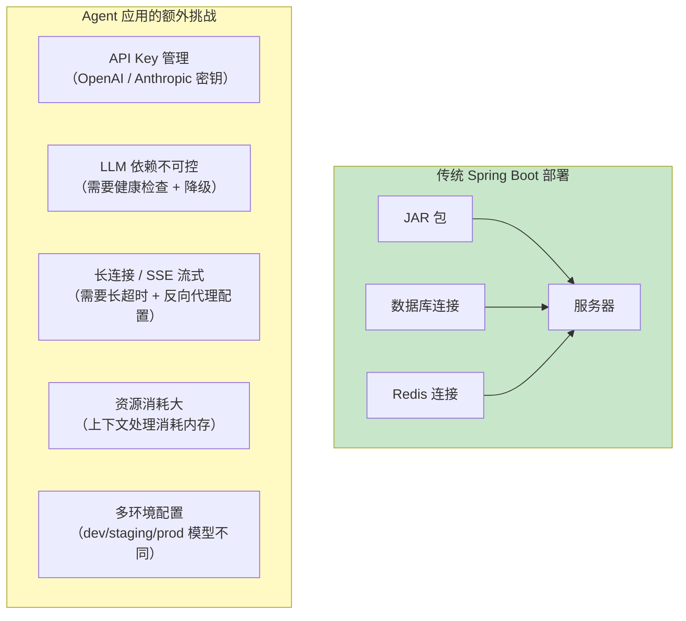

---

## 2. Docker 化

### 2.1 Dockerfile

```dockerfile
# 多阶段构建——阶段 1：构建
FROM eclipse-temurin:21-jdk-jammy AS builder

WORKDIR /build

# 先复制 Maven 配置（利用 Docker 缓存）
COPY pom.xml .
COPY src ./src

# 构建应用（跳过测试加速）
RUN ./mvnw clean package -DskipTests

# ============ 阶段 2：运行时 ============
FROM eclipse-temurin:21-jre-jammy

WORKDIR /app

# 安装 curl 用于健康检查
RUN apt-get update && apt-get install -y curl && rm -rf /var/lib/apt/lists/*

# 复制构建产物
COPY --from=builder /build/target/*.jar app.jar

# 创建非 root 用户
RUN groupadd -r appuser && useradd -r -g appuser appuser
USER appuser

# 暴露端口
EXPOSE 8080

# JVM 参数：容器内存预算（本地 OpenJDK 21.0.11 实测：JDK 21 容器感知默认开启，
# -XX:+UseContainerSupport 开关已不存在，传入直接 JVM 启动失败；预算口径展开见 §3.11）
ENV JAVA_OPTS="-XX:MaxRAMPercentage=75.0 -XX:MaxDirectMemorySize=1g -XX:+UseZGC -XX:+ZGenerational"

# 健康检查
HEALTHCHECK --interval=30s --timeout=10s --start-period=60s --retries=3 \
    CMD curl -f http://localhost:8080/actuator/health || exit 1

ENTRYPOINT ["sh", "-c", "java $JAVA_OPTS -jar app.jar"]
```

这份 Dockerfile 有三个值得展开的决策。**多阶段构建**把构建期的 JDK 与运行期的 JRE 分开，镜像从约 800MB 降到约 300MB，拉取和滚动更新都更快；构建阶段先复制 `pom.xml` 再复制 `src`，让依赖解析层在代码未变时命中 Docker 层缓存，是 CI 提速的关键。**用 `-XX:MaxRAMPercentage` 而不是 `-Xmx`** 让堆随容器内存 limit 按比例伸缩，同一份镜像不改参数就能跑在 2Gi 和 8Gi 的 Pod 里（为什么 75% 不是越高越好，见 §3.11 的内存预算）。**`HEALTHCHECK` 只是 Docker 层的兜底**——上了 K8s 之后健康判定以探针（§6）为准，两者并存不冲突；非 root 用户（`appuser`）则是生产镜像的安全底线。

### 2.2 .dockerignore

```
# .dockerignore
target/
.git/
.idea/
.vscode/
*.md
docs/
.claude/
**/*.log
```

### 2.3 docker-compose.yml（本地开发）

```yaml
# docker-compose.yml
version: '3.8'

services:
  # Agent 应用
  agent-app:
    build:
      context: .
      dockerfile: Dockerfile
    ports:
      - "8080:8080"
    environment:
      - SPRING_PROFILES_ACTIVE=dev
      - OPENAI_API_KEY=${OPENAI_API_KEY}
      # Spring AI 2.0 的 PgVector 复用应用 DataSource Bean（PgVectorStore.builder(JdbcTemplate, EmbeddingModel)），
      # 数据源连接走 Spring Boot 标准 spring.datasource.*，不再有 1.x 的 vectorstore.pgvector.connection-* 键
      - SPRING_DATASOURCE_URL=jdbc:postgresql://postgres:5432/agent
      - SPRING_DATASOURCE_USERNAME=agent
      - SPRING_DATASOURCE_PASSWORD=agent123
    depends_on:
      postgres:
        condition: service_healthy
      chroma:
        condition: service_started
    networks:
      - agent-network

  # PostgreSQL + PgVector
  postgres:
    image: pgvector/pgvector:pg16
    environment:
      POSTGRES_DB: agent
      POSTGRES_USER: agent
      POSTGRES_PASSWORD: agent123
    ports:
      - "5432:5432"
    volumes:
      - postgres-data:/var/lib/postgresql/data
    healthcheck:
      test: ["CMD-SHELL", "pg_isready -U agent"]
      interval: 10s
      timeout: 5s
      retries: 5
    networks:
      - agent-network

  # Chroma 向量数据库（开发环境备用）
  chroma:
    image: chromadb/chroma:latest
    ports:
      - "8000:8000"
    volumes:
      - chroma-data:/chroma/chroma
    networks:
      - agent-network

volumes:
  postgres-data:
  chroma-data:

networks:
  agent-network:
    driver: bridge
```

### 2.4 构建与运行

```bash
# 构建镜像
docker build -t agent-app:latest .

# 通过 docker-compose 启动全套
docker-compose up -d

# 查看日志
docker-compose logs -f agent-app

# 停止
docker-compose down
```

### 2.5 GraalVM Native Image：AOT 原生镜像的价值与代价

JVM 应用在容器时代要交两笔"税"：启动慢（等 JVM 起来、Spring 上下文装配完）和内存底噪高（堆 + Metaspace + CodeCache，一个最小 WebFlux 应用也要吃掉两三百 MB）。GraalVM Native Image 用 AOT（构建期直接编译为平台原生二进制）把两笔税一起免掉——启动从十几秒降到几十毫秒，常驻内存接近减半，而且没有 JIT 预热期，冷启动延迟可预期。对部署运维的直接收益有三个：**密部署**（同样节点塞下两三倍副本）、**秒级扩容与缩容到零**（scale-to-zero 场景下 JVM 预热税无法接受）、以及大幅缓解 §3.9 要讲的**冷启动悖论**——扩出来的新副本冷启动即满血。

代价同样明确。一是构建慢（分钟级，通常放 CI 流水线，本地开发不用）。二是**封闭世界假设**：反射、动态代理、运行时字节码生成都必须在构建期通过 AOT hints 显式声明，漏声明就是运行时报错，而不是编译期报错。三是生态验证成本：Spring 框架本身和 Spring AI 的多数自动装配、ChatClient/Advisor 链路有官方 AOT 支持，但**每个第三方集成都要单独验证**——向量库 SDK、模型客户端的 HTTP/JSON 栈是否自带 GraalVM 元数据，验证不过就得自己写 `RuntimeHintsRegistrar` 补提示。四是与运行时动态特性（动态注册工具、Prompt 运行时编排）的组合需要逐项确认（概念性结论，以 [Spring Boot 官方文档](https://docs.spring.io/spring-boot/reference/packaging/native-image/) 为准，访问时间 2026-08）。

```bash
# 方式一：Buildpacks 一条命令产出原生镜像（CI 推荐，无需本地安装 GraalVM）
./mvnw spring-boot:build-image -Pnative

# 方式二：本地编译原生二进制（需 GraalVM for JDK 21）
./mvnw -Pnative native:compile
# 产物是自包含可执行文件：Dockerfile 只需 FROM distroless/base + COPY + ENTRYPOINT
```

落地建议：先用 JVM 镜像上线，把 native 镜像当作一个独立的性能迭代来做——优先给"流量低、突发强、缩缩容频繁需要 scale-to-zero"的服务上，而不是全量铺开。

### 2.6 虚拟线程的容器配置与运行时验证

`spring.threads.virtual.enabled=true`（§4.3 公共配置里已开启）让 Spring Boot 把阻塞式执行点切到 Java 21 虚拟线程上。先澄清一个常见误解：**虚拟线程和 WebFlux 不是二选一**。WebFlux 的主事件循环永远是 Netty EventLoop，虚拟线程改变不了这一点；它的价值在响应式链路里"躲不掉的阻塞段"——JDBC 查询、阻塞式工具调用（旧 HTTP SDK、文件 IO）跑在虚拟线程上，阻塞一个虚拟线程只占一小块堆内存，而阻塞一个平台线程要占 1MB 栈和一个 OS 线程。一句话：管道是响应式的，堵在管道里的阻塞件用虚拟线程来装。

容器里的配置位置分两层：Spring 属性层（`spring.threads.virtual.enabled`）负责开关，JVM 层参数建议统一走 `JAVA_TOOL_OPTIONS`——它会被 JVM 自动拾取，不需要改 ENTRYPOINT，在 K8s 里改一行 env 就能调参：

```dockerfile
# Dockerfile ENV 或 K8s env 二选一（此处示例放在 Dockerfile）
ENV JAVA_TOOL_OPTIONS="-XX:+UseContainerSupport -XX:MaxRAMPercentage=70.0 -XX:+UseZGC -Djdk.virtualThreadScheduler.parallelism=8"
```

其中 `jdk.virtualThreadScheduler.parallelism` 控制虚拟线程调度器（ForkJoinPool）的并行度：IO 密集可适当调高，CPU 密集保持默认（约等于 CPU 核数）；它只影响同时运行的载体线程数，不限制可创建的虚拟线程数量。

**配置生效与否不要靠猜，要运行时验证。**虚拟线程在传统 `jstack` 里几乎不可见，JDK 21+ 要用 `jcmd` 的 JSON 转储——它会包含虚拟线程及其栈和状态：

```bash
# 容器内执行（PID 1 是 java 进程）
jcmd 1 Thread.dump_to_file -format=json /tmp/threads.json
```

转储里看到大量名字形如 `virtual[#id]` 的线程处于 RUNNABLE/WAITING，就说明阻塞工作确实落在了虚拟线程上。另外两个观测点值得记住：JFR 的 `jdk.VirtualThreadPinned` 事件能抓到"虚拟线程钉在载体线程"（典型元凶是在 synchronized 块里做 IO），是性能回归排查的第一现场；Micrometer 的 `jvm.threads.live` 等**线程指标不统计虚拟线程**——容量判断请以 §3.9 的业务指标为准，别被"线程数很低"迷惑。

---

## 3. Kubernetes 部署

### 3.1 K8s 部署拓扑

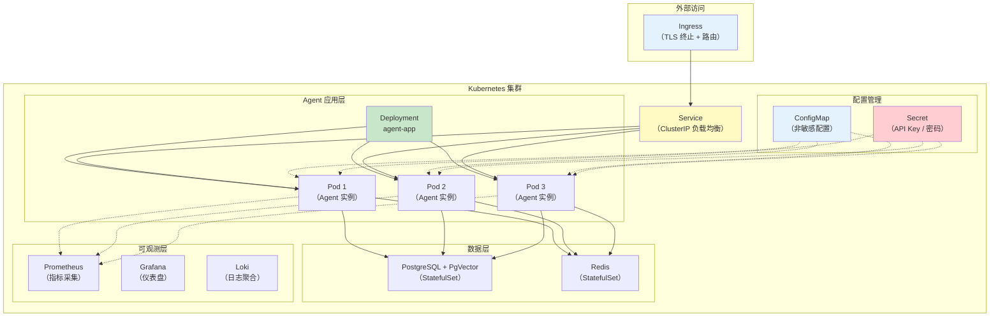

### 3.2 Namespace

```yaml
# k8s/namespace.yaml
apiVersion: v1
kind: Namespace
metadata:
  name: agent-prod
  labels:
    app.kubernetes.io/name: agent
    environment: production
```

### 3.3 ConfigMap（非敏感配置）

```yaml
# k8s/configmap.yaml
apiVersion: v1
kind: ConfigMap
metadata:
  name: agent-config
  namespace: agent-prod
data:
  SPRING_PROFILES_ACTIVE: "prod"
  # 2.0.0 配置键：model 直接挂 chat 下（OpenAiChatProperties.CONFIG_PREFIX = spring.ai.openai.chat）
  SPRING_AI_OPENAI_CHAT_MODEL: "gpt-4o"
  SPRING_AI_OPENAI_CHAT_TEMPERATURE: "0.7"

  # 数据库连接（非密码部分）
  SPRING_DATASOURCE_URL: "jdbc:postgresql://postgres:5432/agent"
  SPRING_DATASOURCE_USERNAME: "agent"

  # 向量数据库（PgVectorStoreProperties.CONFIG_PREFIX = spring.ai.vectorstore.pgvector；
  # 属性中的连字符在环境变量里映射为下划线：index-type → INDEX_TYPE）
  SPRING_AI_VECTORSTORE_PGVECTOR_INDEX_TYPE: "HNSW"
  SPRING_AI_VECTORSTORE_PGVECTOR_DISTANCE_TYPE: "COSINE_DISTANCE"
  SPRING_AI_VECTORSTORE_PGVECTOR_DIMENSIONS: "1536"

  # JVM 参数
  JAVA_OPTS: "-XX:+UseContainerSupport -XX:MaxRAMPercentage=75.0 -XX:+UseZGC"

  application.yml: |
    spring:
      ai:
        retry:
          max-attempts: 3
          backoff:
            initial-interval: 1000
            multiplier: 2
            max-interval: 10000
        chat:
          client:
            tool-calling:
              enabled: true
    management:
      endpoints:
        web:
          exposure:
            include: health,info,metrics,prometheus
```

### 3.4 Secret（敏感配置）

```yaml
# k8s/secret.yaml
apiVersion: v1
kind: Secret
metadata:
  name: agent-secrets
  namespace: agent-prod
type: Opaque
stringData:
  OPENAI_API_KEY: "sk-prod-xxxxxxxxxxxxxxxxxx"
  ANTHROPIC_API_KEY: "sk-ant-xxxxxxxxxxxxxxxxxx"
  SPRING_DATASOURCE_PASSWORD: "super-secret-password"
  JWT_SECRET: "your-jwt-signing-key"

# 更安全的做法：使用 Sealed Secrets 或 External Secrets Operator
# 从 Vault / AWS Secrets Manager / Azure Key Vault 拉取
```

### 3.5 Deployment

```yaml
# k8s/deployment.yaml
apiVersion: apps/v1
kind: Deployment
metadata:
  name: agent-app
  namespace: agent-prod
  labels:
    app: agent
spec:
  replicas: 3                    # 3 个副本
  selector:
    matchLabels:
      app: agent
  strategy:
    type: RollingUpdate
    rollingUpdate:
      maxSurge: 1               # 滚动更新时最多多出 1 个 Pod
      maxUnavailable: 0          # 滚动更新时不允许减少 Pod
  template:
    metadata:
      labels:
        app: agent
    spec:
      containers:
        - name: agent
          image: registry.example.com/agent-app:v1.2.0
          ports:
            - containerPort: 8080
              name: http
          envFrom:
            - configMapRef:
                name: agent-config
            - secretRef:
                name: agent-secrets
          resources:
            requests:
              cpu: "500m"
              memory: "1Gi"
            limits:
              cpu: "2000m"
              memory: "4Gi"
          # 就绪探针：Pod 是否准备好接收流量
          readinessProbe:
            httpGet:
              path: /actuator/health/readiness
              port: 8080
            initialDelaySeconds: 30
            periodSeconds: 10
            failureThreshold: 3
          # 存活探针：Pod 是否存活（失败会重启）
          livenessProbe:
            httpGet:
              path: /actuator/health/liveness
              port: 8080
            initialDelaySeconds: 60
            periodSeconds: 20
            failureThreshold: 3
          # 启动探针：应用启动慢时给足够时间
          startupProbe:
            httpGet:
              path: /actuator/health
              port: 8080
            initialDelaySeconds: 10
            periodSeconds: 5
            failureThreshold: 30   # 最多等 150 秒启动
          # 终止前置钩子：先给 LB 一段静默窗口，再让应用收 SIGTERM（机制见 §3.10）
          lifecycle:
            preStop:
              exec:
                command: ["sh", "-c", "sleep 10"]
      # 优雅关闭宽限期：必须覆盖 preStop sleep + 存量 SSE 流排空时间（见 §3.10）
      terminationGracePeriodSeconds: 120
```

### 3.6 Service

```yaml
# k8s/service.yaml
apiVersion: v1
kind: Service
metadata:
  name: agent-service
  namespace: agent-prod
spec:
  type: ClusterIP
  selector:
    app: agent
  ports:
    - port: 80
      targetPort: 8080
      name: http
  # 无状态部署：会话/记忆外置到 Redis/DB，Service 层不做任何粘性
  sessionAffinity: None
```

**为什么不需要 ClientIP 会话亲和。**Agent 服务应当是无状态的：对话历史走 Redis/数据库集中存储（「遇到阻塞？→ [教程 00-基础与核心/04-记忆与会话管理](../00-基础与核心/04-记忆与会话管理.md)」），跨页面、跨实例的流式同步靠事件广播完成，而不是把用户钉死在某台实例上（[教程 04-企业级架构主干/04-多页面流式响应与会话管理](04-多页面流式响应与会话管理.md)）。因此 Service 层不需要任何粘性——`sessionAffinity: None`（即默认值）就是正确配置。

SSE 长连接的"粘性"由连接本身天然保证：一条 HTTP 连接从建立到关闭始终落在同一个 Pod 上，Service 只在**新建连接**时做负载均衡，不会把已建立的流"搬"到别的 Pod。真正要处理的是旧 Pod 退出时存量流的排空——这是 §3.10 的主题，靠亲和性解决不了。

ClientIP 亲和只在两种情况下才值得考虑：会话状态放在 Pod 内存里（如 InMemory 版 ChatMemory——生产环境不建议，重启即丢且无法水平扩展），或者依赖 Pod 本地缓存预热（把热点知识库缓存放本地内存、希望同一用户反复命中）。即便如此，更合理的解法仍是把状态外置或下沉到独立缓存服务，而不是让负载均衡层迁就应用的有状态性；而且经过 L7 Ingress/NLB 转发后，Service 看到的来源 IP 往往是代理 IP，ClientIP 亲和本身就不可靠。

### 3.7 Ingress

```yaml
# k8s/ingress.yaml
apiVersion: networking.k8s.io/v1
kind: Ingress
metadata:
  name: agent-ingress
  namespace: agent-prod
  annotations:
    # SSE 长连接支持
    nginx.ingress.kubernetes.io/proxy-buffering: "off"
    nginx.ingress.kubernetes.io/proxy-read-timeout: "300"
    nginx.ingress.kubernetes.io/proxy-send-timeout: "300"
    # 限流
    nginx.ingress.kubernetes.io/limit-rps: "10"
    nginx.ingress.kubernetes.io/limit-connections: "20"
    # TLS 重定向
    nginx.ingress.kubernetes.io/ssl-redirect: "true"
spec:
  tls:
    - hosts:
        - agent.example.com
      secretName: agent-tls
  rules:
    - host: agent.example.com
      http:
        paths:
          - path: /
            pathType: Prefix
            backend:
              service:
                name: agent-service
                port:
                  number: 80
```

### 3.8 HPA（水平自动扩缩容）

```yaml
# k8s/hpa.yaml
apiVersion: autoscaling/v2
kind: HorizontalPodAutoscaler
metadata:
  name: agent-hpa
  namespace: agent-prod
spec:
  scaleTargetRef:
    apiVersion: apps/v1
    kind: Deployment
    name: agent-app
  minReplicas: 3
  maxReplicas: 20
  metrics:
    - type: Resource
      resource:
        name: cpu
        target:
          type: Utilization
          averageUtilization: 70
    - type: Resource
      resource:
        name: memory
        target:
          type: Utilization
          averageUtilization: 80
  behavior:
    scaleUp:
      stabilizationWindowSeconds: 30
      policies:
        - type: Percent
          value: 100              # 一次最多扩容 100%
          periodSeconds: 30
    scaleDown:
      stabilizationWindowSeconds: 300  # 缩容需要稳定 5 分钟
      policies:
        - type: Percent
          value: 25               # 一次最多缩容 25%
          periodSeconds: 60
```

上面这份 HPA 配置在传统 Web 应用里工作得很好，但把它原样搬到 Agent 应用上会遇到一个致命盲区——下面三节展开。

### 3.9 HPA 的误区：CPU 指标量不出 LLM 负载

Agent 应用是典型的 **LLM-bound（LLM 等待型）负载**：请求线程把 Prompt 发给上游模型后，剩下的时间几乎全在等流式响应回来，真正耗 CPU 的只有拼上下文、解析 JSON、向量编解码这些短促突发。结果是——负载翻十倍，CPU 利用率可能仍趴在 15%–25% 不动。这时 HPA 盯着 `averageUtilization: 70` 的 CPU 目标永远不触发扩容；而用户侧的真实体感是 P99 延迟爆炸、并发 SSE 连接排队、上游 in-flight 请求堆积。**CPU 低不等于没压力，只说明压力不在这台机器的 CPU 上。**

正确做法是用"业务压力"指标驱动扩缩容，而不是资源利用率：

| 候选指标 | 含义 | 适用性 |
|----------|------|--------|
| 活跃 SSE 连接数（gauge） | 当前挂着的流式会话数 | 最贴近容量上限，推荐做主指标 |
| 上游 LLM in-flight 请求数 | 已发出未返回的模型调用 | 反映上游占用与排队，适合做第二指标 |
| Reactor 队列深度 | boundedElastic 任务积压 | 反映阻塞工具调用的积压 |
| P99 延迟（自定义指标） | 用户体感 | 滞后大，适合做保护性下限 |

指标接进 HPA 有两条主流路径：**Prometheus Adapter**（把 `/actuator/prometheus` 里的自定义指标暴露成 `custom.metrics.k8s.io` API）或 **KEDA**（事件驱动扩缩容器，直接用 PromQL 做触发器，还天然支持缩容到零）。无论哪条路径，前提都是应用先把 gauge 埋出来——活跃连接数用一个 `AtomicLong` 在 SSE 订阅/终止时增减即可，埋点方式见 [教程 04-企业级架构主干/02-全链路可观测性](02-全链路可观测性.md)。

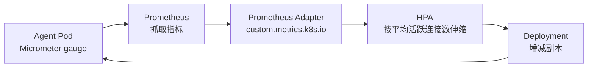

```yaml
# HPA + 自定义指标：按"平均每 Pod 活跃 SSE 连接数"扩缩容
# 前置条件：集群已部署 Prometheus Adapter（暴露 custom.metrics.k8s.io）
apiVersion: autoscaling/v2
kind: HorizontalPodAutoscaler
metadata:
  name: agent-hpa-custom
  namespace: agent-prod
spec:
  scaleTargetRef:
    apiVersion: apps/v1
    kind: Deployment
    name: agent-app
  minReplicas: 3
  maxReplicas: 20
  metrics:
    - type: Pods
      pods:
        metric:
          name: agent_sse_active_connections   # 对应 Micrometer gauge 指标名
        target:
          type: AverageValue
          averageValue: "200"                  # 平均每 Pod 200 条活跃流即扩容
```

KEDA 的等价写法是一个 `ScaledObject`，`triggers` 里直接写 PromQL（如 `max(agent_sse_active_connections)`），不再依赖 Adapter——两种方案二选一即可（HPA 机制参考 [Kubernetes 官方文档](https://kubernetes.io/docs/tasks/run-application/horizontal-pod-autoscale/)，访问时间 2026-08）。

**冷启动悖论**是第二个必须提前想清楚的坑：LLM 应用扩容比普通应用慢得多——新 Pod 起 JVM、建 WebClient 连接池、TLS 握手、首轮 JIT 全都要时间，而用户请求是即时到达的；等指标越过阈值再扩容，新副本往往"上线即过载"。缓解手段有三：① **启动预热**——readiness 通过前先发一次廉价模型调用，把连接池和编解码路径焐热；② `minReplicas` 留余量，用稳定基数吸收突发；③ **缩容慢、扩容快**——`scaleUp.stabilizationWindowSeconds` 给 0–30 秒、`scaleDown` 给 5 分钟以上，宁可多跑一台，也不让扩容追着负载跑。上了 GraalVM 原生镜像（§2.5）后冷启动税显著变小，这是 native 对 Agent 运维的又一重价值。

### 3.10 滚动更新：SSE 长连接的优雅排空

滚动更新对普通 HTTP 请求几乎无感——短请求毫秒级结束，readiness 摘除后新请求自然去新 Pod。但对 SSE 流式响应来说，**默认滚动更新是"硬切"**：`kubectl` 删掉旧 Pod 时，端点摘除（EndpointSlice → kube-proxy → Ingress 各层异步收敛）与 SIGTERM 是并行发生的——SIGTERM 已到、应用开始收尾甚至退出时，负载均衡层可能还在往这个 Pod 转发新建连接；反过来，存量 SSE 流可能要跑几分钟到几十分钟，默认 30 秒宽限期一过就是 SIGKILL 硬杀，用户屏幕上的回答戛然而止。两个方向都是硬切，只是切的时机不同。

完整的排空机制分三步：

1. **摘除先行**：Pod 进入 Terminating 后端点被异步摘除。`preStop` 钩子里 `sleep 10`，就是给端点收敛留一段静默窗口——这段时间应用还没收到 SIGTERM、照常服务，但新流量已逐步不再进来。
2. **优雅收尾**：SIGTERM 到达后，Spring Boot 在配置了 `server.shutdown: graceful` 时（下方 yaml 已显式声明；默认是 `immediate`，不会等待存量请求）先拒绝新请求（readiness 置 NOT_READY），再等存量请求/流自然结束，上限由 `spring.lifecycle.timeout-per-shutdown-phase` 控制。
3. **兜底强杀**：存量流若在宽限期内没跑完，`terminationGracePeriodSeconds` 到期即 SIGKILL。宽限期要按"SSE 流 P99 时长 + preStop sleep + 收尾缓冲"来定，而不是沿用默认 30 秒。

```yaml
# Deployment 片段（完整位置见 §3.5）：滚动更新排空三板斧
spec:
  template:
    spec:
      containers:
        - name: agent
          lifecycle:
            preStop:
              exec:
                # 静默窗口：等 EndpointSlice / kube-proxy / Ingress 全部收敛完
                command: ["sh", "-c", "sleep 10"]
      terminationGracePeriodSeconds: 120
```

```yaml
# 应用侧配套：优雅停机（Spring Boot 3.4+ 默认 graceful，显式声明更稳）
server:
  shutdown: graceful
spring:
  lifecycle:
    timeout-per-shutdown-phase: 90s   # 须短于容器宽限期，给进程留退出余量
```

完整时序如下——注意存量流"粘"在旧 Pod 上靠的是连接本身，而不是 Service 亲和：

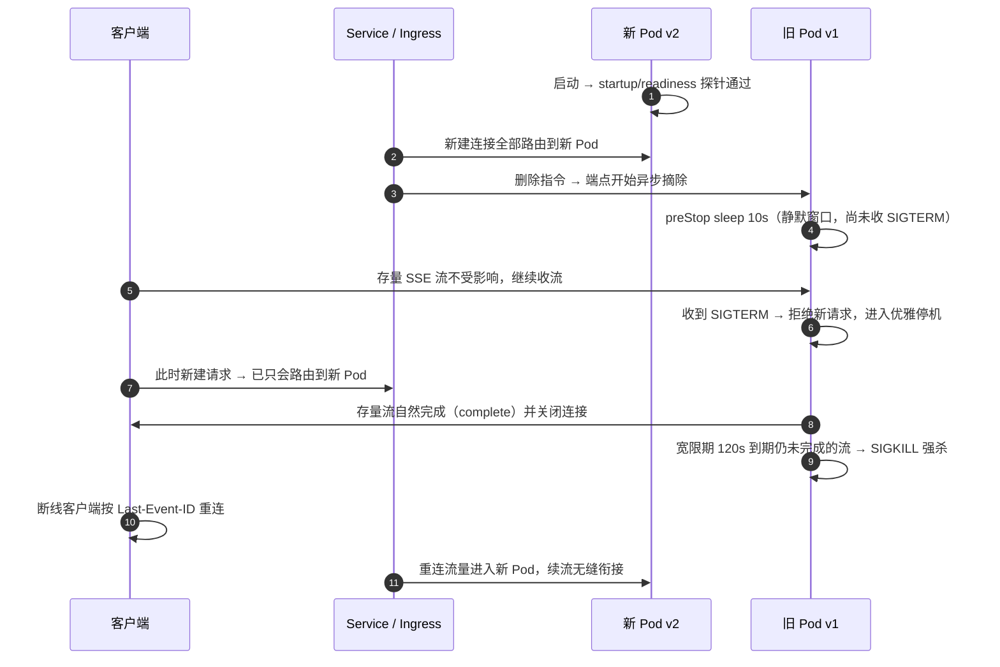

**排空进度的可观测口径**：发布期间运维最常问的问题是"旧 Pod 还剩多少条活跃流、能不能安全推进"。做法是在 SSE 处理器入口维护一个 Micrometer gauge（订阅 +1 / 终止 -1，即 §3.9 用的 `agent_sse_active_connections`），发布时盯着旧副本该指标的下降曲线，归零或收敛到长尾再推进下一步。客户端断线重连与续流的协议设计（Last-Event-ID / 事件回放）在 [教程 04-企业级架构主干/04-多页面流式响应与会话管理](04-多页面流式响应与会话管理.md) 中展开。Pod 终止的完整状态迁移如下：

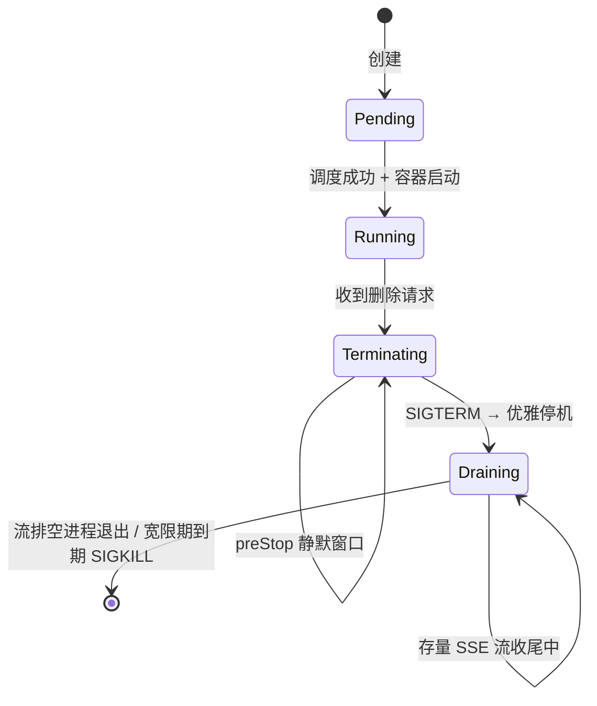

（Pod 生命周期与宽限期语义参考 [Kubernetes 官方文档](https://kubernetes.io/docs/concepts/workloads/pods/pod-lifecycle/)，访问时间 2026-08。）

### 3.11 Reactor 背压与容器内存 limit

WebFlux 应用的内存事故往往不是"堆设小了"，而是**背压链路被无意打断后缓冲无界增长**。典型场景：LLM 流式返回 token，客户端（弱网、手机锁屏、前端渲染卡顿）消费很慢，如果中间任何一环用了无参的 `onBackpressureBuffer()`（无界队列）或自建 `Sinks.Many`/`Processor` 却不处理溢出，来不及消费的 token 就在堆里无限堆积——直到撞上容器 memory limit，被 cgroup 直接 `OOMKilled`（`kubectl describe pod` 里 `Last State: Terminated, Reason: OOMKilled`，退出码 137）。注意这与 JVM 堆内 `OutOfMemoryError` 是两回事：cgroup OOMKill 是内核直接杀进程，JVM 的堆参数根本没有参与的机会。

溢出策略按流的内容物选：

- **有界缓冲 `onBackpressureBuffer(n, strategy)`**：给缓冲设上限并声明溢出策略（`DROP_OLDEST` / `DROP_LATEST`）。token 文本流慎用 DROP——丢几个 token 等于输出残句，宁可整流失败重传；
- **`limitRate(n)`**：控制每次向上游 `request(n)` 的预取批量，抑制"上游发得快、下游消费慢"的天然错配；
- **`doOnCancel` 联动取消**：客户端断开时让整条链路取消，上游 LLM 流一并 abort——既给内存止血，又省 token 成本（见 [教程 04-企业级架构主干/07-成本治理与Token计量](07-成本治理与Token计量.md)）；
- **DROP / LATEST**：适合状态类、指标类事件流（丢一个中间值无害），不适合内容流。

```java
// 概念代码：SSE 出口的有界化 + 断连联动取消（真实 API 见 Reactor 官方文档）
Flux<String> tokens = chatStreamService.streamAnswer(requestId, question);

tokens
    .limitRate(64)                                        // 每批最多预取 64 个元素
    .onBackpressureBuffer(4_096,                          // 有界缓冲，杜绝无界堆积
            BufferOverflowStrategy.ERROR)                 // 溢出即失败 → 整流重试，不输出残句
    .doOnCancel(() -> chatStreamService.abort(requestId)) // 客户端断开 → 取消上游 LLM 流
    ...
```

最后是**容器内存预算的完整口径**：cgroup limit 要同时装下 JVM 堆 + Metaspace + CodeCache + 线程栈 + **Netty 堆外内存**。WebFlux 的数据面大量走 Netty DirectMemory，而 JVM 不设置 `-XX:MaxDirectMemorySize` 时，直接内存上限默认约等于最大堆——堆占 75% 再叠上默认直接内存上限，很容易把 limit 顶爆。实践口径：`-XX:MaxRAMPercentage` 给 65–70 留出三成余量，**显式设置** `-XX:MaxDirectMemorySize`，并满足"堆 + 直接内存 + 约 400MB 基础开销 < limit"。（一个本地 OpenJDK 21.0.11 实测的版本事实：JDK 21 起 JVM **默认且必然**感知 cgroup limit，`-XX:+UseContainerSupport` 这个开关已经不存在——传入会直接 `Unrecognized VM option` 启动失败；"感知容器"不再是可选项，**预算分配才是要自己做的那部分**。下面四个小节把这笔账算完。）

#### 容器内 JVM 的完整内存账：堆只是其中一份

cgroup memory limit 是内核给容器划的硬边界，JVM 进程在这条边界内的占用由五部分构成，每一部分的失控方式不同：

| 内存域 | 装的是什么 | 上限参数（JDK 21 实测） | 失控方式 |
|--------|-----------|------------------------|---------|
| **JVM 堆** | 对象：上下文文本、Message 对象图、Flux 队列 | `-XX:MaxRAMPercentage`（默认 25%）或 `-Xmx` | 堆内 `OutOfMemoryError`，JVM 可感知 |
| **堆外直接内存** | Netty ChannelBuffer、NIO DirectByteBuffer、SSE 写缓冲 | `-XX:MaxDirectMemorySize`（默认 0 = 不设限，默认上限≈最大堆） | 无声吃掉 limit → 内核 OOMKill |
| **Metaspace** | 类元数据：Spring Boot 4.1 + Spring AI 2.0 全家桶 + CGLIB 代理，启动即 150–250MB 量级 | `-XX:MaxMetaspaceSize`（默认无上限） | 类加载器泄漏时无声增长 |
| **CodeCache** | JIT 编译后的本地代码 | `-XX:ReservedCodeCacheSize`（JDK 21 默认 240MB，实测值） | 有上限，一般不失控 |
| **线程栈 + JVM 自身** | 每平台线程栈（Linux 默认 1MB reserve）、GC/JIT 工作线程、socket 缓冲 | `-Xss`（线程栈单个大小）；数量无法参数化 | 线程数失控时线性增长 |

§3.11 前半说的"约 400MB 基础开销"就是这张表的后三行加 socket 缓冲的合计口径。`-XX:MaxRAMPercentage=75.0` 与"给 65–70 留余量"并不是矛盾的两句话——**75 能不能成立，取决于同一条启动参数里有没有把直接内存钉死**：§2.1 的 `JAVA_OPTS` 里 `-XX:MaxDirectMemorySize=1g` 与 `75.0` 成对出现，堆 3G + 直接内存 1G + 基础开销 0.4G ≈ 4.4G，4Gi limit 下是算得过来的；反过来若直接内存不设限（默认上限≈最大堆），堆 75% + 直接内存 75% = 150%，写多少都是要爆的。

内存超限有**两条完全不同的死亡路径**，取证方式也完全不同——这是容器内 JVM 内存问题排查的第一个分叉：

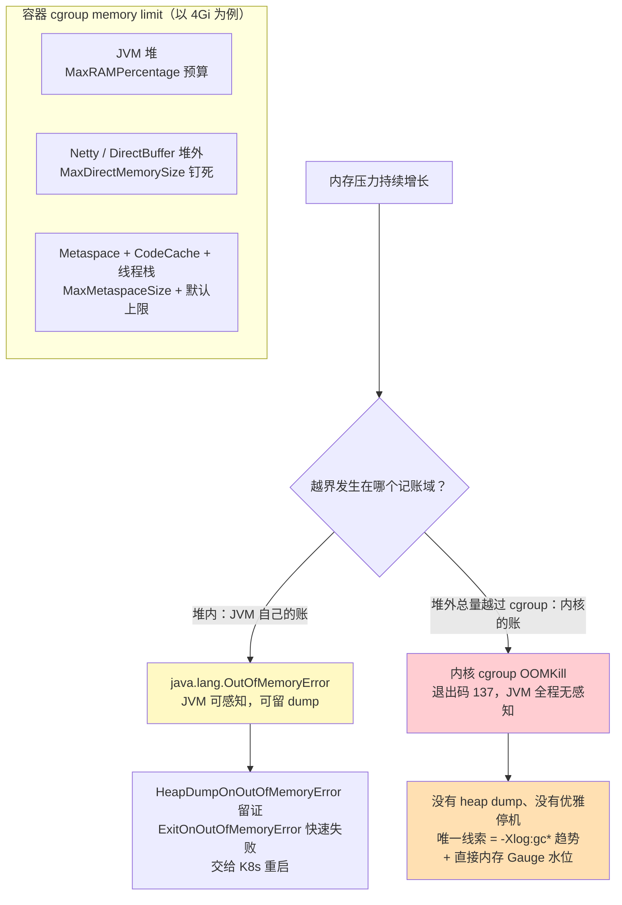

堆内 OOM（`java.lang.OutOfMemoryError`）是 JVM 抛出的异常——它知道发生了什么，配合 `-XX:+HeapDumpOnOutOfMemoryError -XX:HeapDumpPath=/dumps` 能留下完整现场，配合 `-XX:+ExitOnOutOfMemoryError` 让进程立即退出、把重启决策交给 K8s（半死不活的实例比死掉的实例贵得多）。cgroup OOMKill 则是内核行为：总 RSS 越过 limit 的瞬间进程被 SIGKILL，JVM 的所有参数、钩子、dump 都没有出场机会——`kubectl describe pod` 里 `Last State: Terminated, Reason: OOMKilled, Exit Code: 137` 是它的唯一名片。**堆内 OOM 有现场，堆外 OOM 只有趋势**——所以堆外内存的水位必须靠事前埋点（见下文 GC 日志与观测入口），不能指望事后取证。

反模式三条：其一，把 memory limit 设成与堆上限相等（limit = Xmx），等于宣布"除堆以外的一切占用都即时死刑"——正确姿势是 limit ≥ 堆 + 直接内存 + 400MB 再留 10–15% 抖动余量；其二，OOMKilled 后只重启不查因，把它当"偶发抖动"——137 的重启是有记忆的，趋势不查第二次只会更频繁；其三，Metaspace 不设上限——多数应用一辈子撞不到，但类加载器泄漏（热部署、动态代理生成失控）会让它无声吃穿 limit，且症状恰好伪装成"堆外泄漏"。

#### GC 选型：G1 vs ZGC 对 EventLoop 停顿的影响

GC 停顿对传统请求式服务是 P99 毛刺，对 SSE 流式 Agent 服务是**全连接冻结**：§3.12 第 3 层说过 EventLoop 只有 `max(核数, 4)` 个线程扛 2000 条连接，一次 stop-the-world 停顿把这仅有的几根线全部冻结——所有活跃流的吐字同时暂停，用户屏幕上的回答齐刷刷卡住；停顿结束后积压的写事件集中涌出，下游缓冲水位瞬间抬升。这是 §3.12"联动放大律"的 GC 版：**停顿 → 消费速率瞬时归零 → 缓冲水位抬升 → 内存水位抬升**。GC 选型因此是 Agent 服务的架构决策，不是 JVM 细节。

JDK 21（本项目的编译目标）上两个现实的选项：

- **G1（JDK 21 默认收集器，实测 `UseG1GC=true {ergonomic}`）**：分代 + region 化设计，并发标记、增量回收，用 `-XX:MaxGCPauseMillis` 声明停顿目标（默认 200ms，实测值）并尽量达标。堆 16GB 以内时 P99 停顿通常在几十到两百毫秒，代价低、生态成熟。失败模式有两个：**humongous 对象**（≥ region 一半的大对象直接进连续 old region——LLM 每轮重拼全量上下文恰好是典型大对象，累积后会拖垮停顿目标）；以及 **to-space exhausted**（并发标记期间预留回收空间不足，触发数秒级 Full GC——这是 G1 唯一需要当成事故对待的日志行）。
- **ZGC（`-XX:+UseZGC`）**：着色指针 + 读屏障实现并发整理，停顿亚毫秒级且**与堆大小无关**——16GB 和 64GB 堆的停顿都不到 1ms。代价是吞吐让渡约 5–10%，以及并发整理需要更高的内存 headroom（回收腾挪要空间，预算要比 G1 更宽裕）。**版本语境必须分清**：JDK 21 上分代 ZGC 需要显式 `-XX:+ZGenerational` 开启（本地 21.0.11 实测默认 `false`）——不开就是非分代旧模式，对"大量短命 token 对象 + 周期性上下文大对象"的 Agent 负载回收效率差、有 allocation stall 风险；JDK 23 起分代成为默认（JEP 474），JDK 24 移除非分代模式（JEP 490）。§2.1 示例里 `-XX:+UseZGC` 与 `-XX:+ZGenerational` 成对出现，就是这个原因。

| 维度 | G1（JDK 21 默认） | ZGC（分代，`+ZGenerational`） |
|------|-------------------|------------------------------|
| 停顿量级 | 几十–200ms（受 `MaxGCPauseMillis` 约束，大堆下失守风险升高） | 亚毫秒，与堆大小无关 |
| 吞吐代价 | 最低 | 约 5–10% |
| 内存 headroom | 标准 | 更宽裕（并发整理空间） |
| 调优复杂度 | 中（region / humongous / 停顿目标联动） | 低（几乎只看 SoftMaxHeapSize） |
| 舒适区 | 堆 ≤ 16GB、停顿 P99 百毫秒级可接受 | 堆 ≥ 16GB、停顿 SLO < 10ms、大流量 SSE |

选型判据按序判断：**堆 < 16GB 且停顿 P99 百毫秒可接受 → G1，把 `MaxGCPauseMillis` 调到 50–100 即可，不要折腾**；**堆 ≥ 16GB 或停顿 SLO 苛刻（大流量 SSE 平台）→ ZGC 分代，配 `-XX:SoftMaxHeapSize` 给堆一个"软目标"让它在容器限额内弹性伸缩**。ZGC 自身也有 SoftMaxHeapSize 可用——它让 ZGC 尽量把堆压在软目标以内运行，而不是一上来就占满 `-Xmx`，与容器内存预算是天然搭档。

反模式同样按序列出：小堆（< 8GB）上 ZGC——停顿收益的绝对值省不回吞吐与 headroom 的代价；只开 `-XX:+UseZGC` 不开 `-XX:+ZGenerational`（JDK 21 上等于选了旧模式）；把 `MaxGCPauseMillis` 调到 500ms 来"消灭停顿告警"——把目标调松不是调优是投降，告警变少只是因为阈值被你挪走了；以及在背压链路（§3.11 前半）没修之前先调 GC——无界缓冲撑大的内存，任何收集器都救不了，**先修代码里无界的那部分，再谈 GC**。

#### GC 日志与内存观测入口：-Xlog:gc* 与指标化

GC 日志的统一入口是 `-Xlog:gc*`（JDK 9+ 统一日志语法，本地 21.0.11 实测存在）。容器场景直接输出到 stdout，被 §7 的采集管线原样收走；量大时再切文件轮转（`-Xlog:gc*:file=/tmp/gc.log:time,uptime:filecount=5,filesize=20m`）。G1 的一行典型输出：

```text
[102.456s][info][gc] GC(38) Pause Young (Normal) (G1 Evacuation Pause)
    2450M->890M(3072M) 87.234ms
```

一行里有四个要看的东西：**耗时**（`87.234ms`——看分布不看单次，P99 才是 EventLoop 冻结时长）；**回收量**（`2450M->890M`——每次回收后基线持续抬升 = 泄漏或预算错配）；**频率趋势**（间隔从分钟级缩到秒级 = 对象产出速率在涨，先查 §3.11 的缓冲）；**Full GC 行**（G1 出现 `Pause Full` 即按事故处理，那是 to-space exhausted 或元空间耗尽）。ZGC 的日志则是另一种画风：所有 `Pause` 行都是亚毫秒，要盯的反而是 `Allocation Stall` 行——出现即说明分配速率已经逼近回收能力，是 ZGC 世界的"Full GC 前兆"。

生产常态不是人读日志，是指标告警。Micrometer 的 JVM binder 由 Spring Boot Actuator 自动绑定（本地 micrometer-core 1.17.0 javap 实证：`JvmGcMetrics implements MeterBinder, AutoCloseable`、`JvmMemoryMetrics implements MeterBinder`），暴露 `jvm.gc.pause`（Timer，带 action/cause 标签）、`jvm.memory.used` 等指标，§8 的告警规则直接消费。堆外水位没有现成指标，用 Netty 自己的计量注册一个（本地 netty-common 4.1.135.Final / 4.2.15.Final javap 实证：`PlatformDependent.usedDirectMemory()` / `maxDirectMemory()` 均为 `public static long`）：

```java
// 概念代码：Netty 堆外水位接入 Micrometer（引用的 API 均已 javap 实证，
// PlatformDependent 属 netty-common 的 io.netty.util.internal 包）
Gauge.builder("netty.direct.memory.used", PlatformDependent::usedDirectMemory)
        .description("Netty 直接内存已用量（字节）")
        .register(meterRegistry);
```

配合三条告警即可覆盖本节全部死亡路径：`netty.direct.memory.used > 0.8 × MaxDirectMemorySize` 预警（OOMKill 的前置信号，此时 JVM 还不知道自己要死）；`jvm.gc.pause` P99 > 200ms（EventLoop 冻结正在成为用户可感卡顿）；kube-state-metrics 的 `kube_pod_container_status_last_terminated_reason{reason="OOMKilled"}` 计数（137 已经发生）。取证链按序走：OOMKilled（无 dump）→ 回看 `-Xlog:gc*` 回收量与频率趋势 → `netty.direct.memory.used` 水位曲线 → 定位到缓冲失控还是预算错配 → 回到 §3.11 修背压或本节修参数。

#### LLM 流式场景的内存驻留特征

最后把内存账接到 Agent 的负载形态上。传统请求的内存占用是毫秒级驻留，一条 SSE 流的内存是**分钟级驻留**——内存占用 = 并发流数 × 单流驻留，和 §3.12 第 1 层的连接账同构。先拆一条流的真实内存足迹：输入上下文 4000 token 的文本约 12–16KB，但包成 `Message` 对象图（content 字符串 + metadata Map + 对象头）后是 3–5 倍即 50–80KB；500 token 的输出累积本身只有约 2KB——**token 文本从来不是大头**。三个真正的大头：

| 暗藏缓冲 | 位置 | 量级 | 谁控制它 |
|---------|------|------|---------|
| **Flux 预取队列** | 堆内，链上每环 `request(n)` 的超前量 | 元素数 × 单元素大小，token 粒度时 KB 级 | `limitRate(n)`（§3.11） |
| **旁路缓冲** | 堆内，`doOnNext` 里同步投递审计/轨迹事件失败时的积压 | 旁路消费跟不上时无界增长 | 旁路投递必须自身有界 + 异步 |
| **Netty 写积压** | **堆外**，`ChannelOutboundBuffer` 里未 flush 出网的字节 | 慢客户端每条可积压数百 KB–数 MB | isWritable 水位检查 + 断连取消 |

第三处最危险也最隐蔽：客户端（弱网手机、卡死的前端）读得慢，Netty 的写缓冲把来不及出网的 SSE 帧全部堆在**直接内存**里——它不占堆，`jvm.memory.used` 看不见，只反映在 `usedDirectMemory()` 的水位上。2000 条连接里混进 50 个慢客户端、每个积压 2MB，就是 100MB 堆外凭空消失。防线在 §3.11 已经埋好（`doOnCancel` 断连取消 + 有界化），这里的增量认知是：**背压策略保护的是堆内的 Flux 队列，Netty 写积压在背压语义之外，必须靠直接内存水位监控兜底**——这就是上一小节那个 Gauge 不可省略的原因。

驻留时长侧还有一个放大器：单流驻留不是固定的 12 秒，TTFT 波动直接拉长它（§3.12 第 1 层：TTFT 1.2s → 10s，并发流 300 → 375），慢客户端拉长得更狠（输出 500 token 正常 11 秒、弱网 60 秒）。**内存水位是这两个放大器与并发流数的乘积**——容量模型里"每条连接内存 × 2000 条"的口径（§3.12 内存预算行）在压测时必须带 10% 慢客户端混合流量，不然测出来的是理想分布，生产给你的是长尾。

最后是老年代压力的独特来源：Agent 每轮对话都要**重拼全量上下文**——第 20 轮请求携带前 19 轮的完整历史，一个几百 KB 到数 MB 的连续大字符串。这正好踩中 G1 的 humongous 分配线（≥ region 一半，region 默认 1–2MB 时阈值只有 0.5–1MB），大对象绕过年轻代直接进 old region，累积后拖垮停顿目标、诱发 to-space exhausted。三个对策按成本排序：上下文压缩把历史压成摘要（效果与内存双赢，见 [教程 08-架构师进阶/00-上下文工程](../08-架构师进阶/00-上下文工程.md)）；G1 下调大 `-XX:G1HeapRegionSize`（如 `=8m`，humongous 阈值随之抬到 4MB）；堆大且停顿敏感时换 ZGC 分代——它的并发整理对大对象宽容得多。**上下文压缩因此同时是效果优化、成本手段（§3.11 的 token 账）和 GC 手段，一篇三吃。**

本小节收束成四句：token 不是大头，缓冲才是；堆内靠背压，堆外靠水位 Gauge；驻留时长是内存的一等公民（TTFT 与慢客户端都在放大它）；全量上下文重拼是老年代的慢性毒药，压缩是解药。

### 3.12 容量模型：从并发会话到基础设施推演

§3.8–§3.11 里出现了一串"看起来合理"的数字：HPA 的 `averageValue: "200"`、`minReplicas: 3 / maxReplicas: 20`、Ingress 的 `limit-connections`、`terminationGracePeriodSeconds: 120`、内存预算的"堆 + 直接内存 + 400MB"。这些数字如果靠经验拍，两种事故迟早各来一次：拍小了，第一次流量高峰当场雪崩；拍大了，账单翻倍，空转的副本还在争抢上游配额。**容量模型**就是把这些数字变成推演结果的方法：从业务入口的并发会话出发，逐层换算出每个基础设施组件要扛的负载，找出最短板，再由短板反推限流阈值、HPA 边界与宽限期。本节给出一套完整的推演链，并用同一个 worked example（**1000 并发会话**）走完全程。

#### 推演主轴：并发会话数，而不是 QPS

推演的起点是把业务语言翻译成负载语言。业务侧能给到的通常是日活（DAU），而系统真正要扛的是**峰值并发会话数**——同一时刻"处于一次对话中间"的会话数量：

```
平均在线会话 = DAU × 人均会话次数 × 平均会话时长(s) ÷ 86400
峰值并发会话 = 平均在线会话 × 峰谷比        （典型 3–6，按业务曲线实测）
```

**worked example 基线设定**：某企业知识助手 DAU = 20000，人均每天发起 2 次会话，平均每次会话 6 分钟（360 秒，含阅读回答的时间）。于是日活跃会话总时长 = 20000 × 2 × 360s = 1440 万秒，平均在线 = 14400000 ÷ 86400 ≈ **167**，取峰谷比 6（早高峰与午后的集中形态），得峰值 ≈ **1000 并发会话**。后面的每一层推演都从这个 1000 出发。

第一个必须建立的观念：**会话 ≠ 请求 ≠ QPS**。一轮 Agent 对话（Agent loop）= 1 次向量检索 + N 次工具调用 + 1~K 次 LLM 流式调用，传统"一个 HTTP 请求一个 QPS"的换算在这里全部失效。第二个观念紧随其后：**SSE 长连接让 QPS 口径彻底失真**——传统容量公式（并发数 = QPS × 平均延迟，Little's Law）依然成立，但"平均延迟"从几十毫秒变成了几十秒：一轮流式回答驻留 12 秒，QPS 只有 25，资源占用却相当于短请求的几百倍。所以本节的每一层都按自己的**驻留模型**折算，而不是套 QPS。

#### 全链路逐层推演

先看全景——业务流量从入口进来，在各层被换算成不同的负载形态，最后汇聚到短板判定，产出三类运行参数：

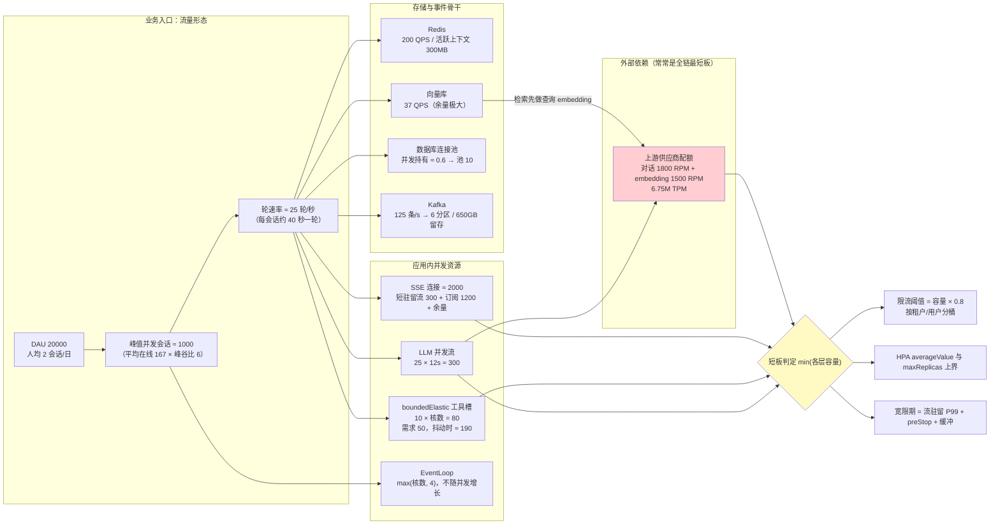

**第 1 层：LLM 并发槽（流式长连接占用模型）**。一轮对话里，LLM 调用驻留的时长 = **TTFT**（首 token 延迟）+ 输出 token 数 ÷ 吐字速率。设 TTFT = 1.2s、输出 500 token、吐字速率 45 token/s，单次调用驻留 ≈ 12s；每轮平均 1.2 次 LLM 调用（含工具执行后的收尾调用），用 Little's Law：

```
LLM 并发流  = 轮速率 × 单次驻留 = 25/s × 12s ≈ 300
对话 RPM    = 25 × 1.2 × 60 = 1800 次/分钟
embedding RPM = 25 × 60 = 1500 次/分钟   （每轮检索前先做查询向量化）
TPM        ≈ 25 × (4000 输入 + 500 输出) × 60 = 6.75M
```

TTFT 为什么单独拎出来？因为它是**连接驻留时长的第一变量**——输出时长由 token 数和吐字速率决定（模型侧相对稳定），TTFT 却随上游排队状态剧烈波动：上游过载时 TTFT 从 1.2s 涨到 10s，300 并发流立刻变 375，连接、内存、配额同时被放大 25%。这就是为什么 §3.9 的 HPA 主指标要选连接数、§3.10 的排空要按流驻留 P99 算宽限期——它们都挂在 TTFT 这个变量上。TTFT 的埋点口径见 [教程 01-WebFlux与响应式编程/07-WebFlux测试与性能调优 §8](../01-WebFlux与响应式编程/07-WebFlux测试与性能调优.md)。

**第 2 层：SSE 连接数与网关连接上限**。SSE 连接要分两类算，驻留模型完全不同：**短驻留流**（一次回答的流式输出）稳态数量 = 建立速率 × 驻留时长 = 25/s × 12s = 300；**长驻留订阅**（跨页面同步的事件流，见 [教程 04-企业级架构主干/04-多页面流式响应与会话管理](04-多页面流式响应与会话管理.md)）≈ 峰值会话 × 平均开流页面数 = 1000 × 1.2 = 1200。加上断线重连抖动余量 30%，按 **2000 条连接**做规划。每条连接的开销 = 1 个文件描述符 + 一个 Netty Channel（KB 级堆外内存），连接数的真实约束在三处：Pod 的 RLIMIT_NOFILE（容器内务必确认不是默认 1024）、Ingress Nginx 的 `worker_connections`（默认 16384，注意 upstream 侧也各占一个）、以及 L4 负载均衡的并发连接配额。§3.7 示例里的 `limit-connections: "20"` 是**每 IP** 的防刷语义，不是系统容量参数——容量层的连接上限由本层推演决定，别把防刷值当成容量值。

**第 3 层：WebFlux EventLoop 与 boundedElastic 池**。这是最容易被误解的一层。EventLoop 的数量是 `max(CPU 核数, 4)`（reactor-netty 的 `LoopResources.DEFAULT_IO_WORKER_COUNT` 常量，javap 实证存在；取值语义见 [Reactor Netty 官方文档](https://projectreactor.net/docs/reference/)，访问时间 2026-08）——**它不随并发增长**，8 核机器就是 8 个 EventLoop 扛 2000 条连接，每线程 250 条，事件分发微秒级，毫无压力；前提只有一个：EventLoop 上绝不出现阻塞（防线体系见 [教程 01-WebFlux与响应式编程/06-线程模型与调度器 §5](../01-WebFlux与响应式编程/06-线程模型与调度器.md)）。真正构成并发闸门的是 **boundedElastic**：默认 10 × 核数个线程、10 万深度队列（同篇 §2，javap 实证）——它装着所有躲不掉的阻塞段（JDBC、阻塞式工具 SDK），所以**阻塞工具的全局并发上限 = 10 × 核数 = 80**。代入本例：工具到达速率 = 25 轮/s × 2.5 次/轮 = 62.5 次/s，平均耗时 0.8s，并发占用 = 62.5 × 0.8 = 50，利用率 62%，健康。但做一次敏感性分析：某工具 P99 抖到 3s，并发需求变 62.5 × 3 ≈ 190，**远超 80**——多出来的排队拉长轮时长，轮时长拉长连接驻留，连接驻留推高第 2 层连接数与内存。这就是容量模型的**联动放大律**：一个下游抖动通过"驻留时长"传导到全链。对策三选一：给重工具建独立 `Schedulers.newBoundedElastic` 池做物理隔离、用虚拟线程承载阻塞段（§2.6）、对工具调用做并发限流（[教程 04-企业级架构主干/06-多租户隔离与资源治理 §5.2](06-多租户隔离与资源治理.md)）。

**第 4 层：Redis 会话存储（QPS 与内存分开算）**。QPS 侧：每轮对话约 8 次命令（追加 user/assistant/tool 消息 3 次、读历史 1 次、跨页面事件发布 2 次、配额计数与检查点 2 次），200 命令/s——不到单实例 10 万 QPS 的零头，**Redis 在 Agent 链路里从来不是吞吐瓶颈**。内存侧才是：活跃上下文 = 峰值会话 × 平均轮数 × 每轮字节 = 1000 × 12 轮 × 8KB ≈ 96MB，叠加 TTL 宽限、归档缓冲与碎片按 3 倍规划 ≈ **300MB**，`maxmemory` 1GB 起步。注意长上下文用户（50 轮深聊）会让单会话内存翻 4 倍——上下文压缩（[教程 08-架构师进阶/00-上下文工程](../08-架构师进阶/00-上下文工程.md)）因此不只是效果优化，同时是容量手段。另外一条正确性提醒：`Message` 对象不能直接 JSON 序列化进 Redis（读回即失败，教训与正确范式见 [附录 05-SpringAI2-API基准/00-Advisor与ChatMemory §2.3](../../附录/05-SpringAI2-API基准/00-Advisor与ChatMemory.md)）——容量算得再准，序列化读写不同端照样翻车，持久化方案务必做 round-trip 验证。

**第 5 层：向量库 QPS**。检索 QPS = 轮速率 × 每轮检索次数，Agentic RAG 平均按 1.5 跳计：25 × 1.5 ≈ **37 QPS**。HNSW 索引单机数百 QPS 起步，余量极大；单次检索 P99（10–50ms 级）在 40s 的轮时长里可以忽略。所以向量库通常不是 Agent 链路的容量短板——真正的两个容量点是：① 每次检索前的查询 embedding 是一次**供应商调用**，1500 RPM 要并入第 1 层的配额总账（本例合计 3300 RPM）；② 检索风暴（Agentic 循环失控时每轮几十跳）能把 37 变成 370，防线在 Agent 侧的检索次数限流，而不是向量库扩容。索引结构与检索工程的深水区见 [附录 19-向量数据库与检索工程/00-索引与检索工程深度](../../附录/19-向量数据库与检索工程/00-索引与检索工程深度.md)。

**第 6 层：数据库连接池**。先纠正一个直觉错误：**连接池大小不按 QPS 算，按"同时持有连接的并发数"算**（又是 Little's Law）：池大小 ≈ JDBC QPS × 平均持有秒数。本例的 JDBC 段是审计日志写 + 会话归档写 ≈ 40 写/s × 15ms ≈ **0.6 并发**——默认池大小 10 绰绰有余。配置键是 Spring Boot 标准 Hikari 绑定 `spring.datasource.hikari.maximum-pool-size`（对应 HikariCP 7.0.2 的 `HikariConfig.setMaximumPoolSize(int)`，javap 实证）。两个反方向的事故都要防：其一，长查询/大事务把连接持有秒级以上，池被占满后所有 JDBC 段排队——排队发生在 boundedElastic 上，又触发第 3 层的联动放大；其二，把池盲目调大（如 100）——PostgreSQL 每连接一个进程，内存与上下文切换成本反噬吞吐。还要理解一点：响应式链路里 JDBC 跑在 boundedElastic（或虚拟线程）上，**连接池上限和阻塞线程槽是同一份预算的两面**，扩一个必须看另一个。

**第 7 层：Kafka 分区与消费组**。事件量 = 轮速率 × 每轮事件数（审计 + 轨迹 + 投影）= 25 × 5 = **125 条/s**——单分区数万条/s 的能力面前，吞吐完全不构成约束。所以分区数不由吞吐定，由**消费并行度与顺序语义**定（公式与"一次到位"守则见 [教程 07-Kafka事件骨干/05-性能调优与容量规划 §2](../07-Kafka事件骨干/05-性能调优与容量规划.md)）：投影服务 4 实例 × 50 条/s 处理力 = 200 条/s > 125，取 4 分区起步、规划 6 留余量。Kafka 真正的成本大头在**留存**：125 条/s × 2KB × 30 天 ≈ **650GB**——审计合规要求的留存时长才是集群规格的决定项（估算模板见同篇 §7）。

**第 8 层：上游供应商并发配额——全链最短板**。把前七层的数字对到供应商账上：对话 1800 RPM + embedding 1500 RPM + 6.75M TPM。对照常见分级配额（个人级 60 RPM / 数万 TPM，团队级数百 RPM / 数十万 TPM，企业级另行约定），**6.75M TPM 往往直接超出最高公开档位**。这就是 LLM 应用容量观与传统互联网应用的最大差异：传统系统里最短板通常是自家数据库或带宽，扩自己的机器就好；LLM 系统里最短板常常是**别人的配额**——你无法通过加副本扩它，只能通过 Key 池轮转、多供应商分摊或自建推理扩它（Key 池与多供应商见 [教程 08-架构师进阶/10-多模型协作与供应策略 §5](../08-架构师进阶/10-多模型协作与供应策略.md)；自建推理的显存与并发推演见 [附录 15-AIInfra与推理部署/02-vLLM调优与GPU容量规划](../../附录/15-AIInfra与推理部署/02-vLLM调优与GPU容量规划.md)）。

#### 短板定容量：反推限流、HPA 与宽限期

各层容量取最小值即系统容量。本例各层的约束、代入结果与短板监控信号汇总：

| 层 | 容量约束 | 1000 并发代入 | 短板监控信号 |
|----|---------|--------------|-------------|
| 上游 LLM | RPM / TPM / 并发流配额 | 3300 RPM、6.75M TPM | 429 率、配额余量、TTFT 上升 |
| SSE 连接 | fd × 网关 worker_connections | ≈ 2000 条 | `agent_sse_active_connections` |
| EventLoop | max(核数, 4)，常量 | 8 线程扛 2000 连接 | EventLoop 单事件执行耗时 |
| boundedElastic | 10 × 核数 | 80 槽 vs 需求 50→190 | 队列深度、任务排队时长 |
| Redis | 内存为主，QPS 充裕 | 活跃 ≈ 300MB | 内存水位、eviction 计数 |
| 向量库 | QPS 充裕；embedding 占上游配额 | 37 QPS | 检索 P99、每轮检索次数 |
| 连接池 | 并发持有数（非 QPS） | 0.6 → 池 10 | 等待连接数、获取耗时 |
| Kafka | 分区 = 并行度；磁盘 = 留存 | 6 分区、650GB/30 天 | 消费 lag、磁盘水位 |

本例的短板判定：**上游 TPM** 是第一短板，工具阻塞槽（抖动时）是第二短板。判定短板要靠监控数据而不是直觉——每层容量公式的分母都是可观测指标，短板信号列就是对应的告警项（指标接入见 §8）。

**容量反推限流**。限流阈值的正确来源是"该层容量 × 安全系数，再按租户/用户份额切分"，而不是拍一个整齐的数字。本例：上游购得对话配额 1500 RPM → 租户级 LLM 调用限流合计 = 1500 × 0.8 = **1200 RPM**，按租户权重分桶；用户级并发会话 ≤ 3、单用户提问速率 ≤ 1 轮/10s（防单个用户吃满租户桶）；工具并发限流合计 ≤ 80 × 0.8 = 64 槽分桶。限流器的实现（租户/用户两级令牌桶）与并发会话数上限见 [教程 04-企业级架构主干/06-多租户隔离与资源治理 §3.4、§5.2](06-多租户隔离与资源治理.md)——**限流不是防攻击的摆设，是容量模型的执行器**：没有限流，容量模型只是纸面推演；有了限流，最短板之前的每一层都被保护在容量之内。

**容量反推 HPA**。`averageValue: "200"` 的出处：单 Pod 连接预算 = 连接总规划 2000 × 该 Pod 份额，同时受内存预算约束（每条连接的上下文驻留 × 200 要装进 §3.11 的内存口径）——200 是"内存预算内安全承载的连接份额"，不是拍出来的整百数。`maxReplicas` 的上界来自上游配额：系统峰值需要 300 并发流，单 Pod 承载 200 → **2 个 Pod 就把上游配额摊平了**，`maxReplicas: 20` 的意义只剩连接承载力与滚动更新期的冗余（§3.10 的 N+1），绝不是 20 倍的调用吞吐。这是 LLM 应用 HPA 最反直觉的一条：**扩 Pod 扩的是连接承载力，不是 LLM 调用吞吐——调用吞吐的上限写在上游配额里**。`minReplicas: 3` 则由"突发吸收基数 + 发布期双版本并存"共同决定。

**容量反推宽限期**。§3.10 的 `terminationGracePeriodSeconds: 120` 现在有了出处：流驻留 P99 = TTFT P99 + 输出时长 P99，压测实测假设为 3s + 75s ≈ 78s，宽限期 = 78 + preStop 静默 10 + 约 30% 缓冲 ≈ **120s**。宽限期是个容量参数，随模型吐字速率、输出长度上限的变化而重算——换了一个更慢的模型还沿用旧宽限期，发布就会开始硬切用户的回答。

#### 压测验证：模型必须被实测校准

容量模型的每一个输入——TTFT、吐字速率、工具耗时、轮间隔、峰谷比——都是**假设**。没被压测校准过的容量模型只是精致的猜测。校准分两件事：口径与方法。

口径上，SSE 场景的压测指标必须换轨：**并发连接数、连接建立速率、TTFT 分布、token 间隔、流完成率**，而不是 RPS。本例的 RPS ≈ 25，数字小到会让传统压测平台误判"系统空载"，而真实资源占用是短请求的几百倍——口径错了，压测结论整体作废（口径细节与压测实操见 [教程 01-WebFlux与响应式编程/07-WebFlux测试与性能调优 §8](../01-WebFlux与响应式编程/07-WebFlux测试与性能调优.md)）。

方法上，先分清两个概念：**全链路压测**是从入口注入染色流量、穿透全部真实依赖的压测，考察的是整链在真实形态下的容量，代价是每一轮对话都烧真金白银的 token——全量压一晚可能烧掉一个月的预算；**影子流量压测**是把生产流量镜像或录制回放到预发/影子通道，不触碰真实业务状态，流量形态最真实，但 SSE 场景的连接态与会话上下文态很难完整回放。LLM 场景的工程解法是**两层校准**，两层拼起来等于全链，成本却可控：

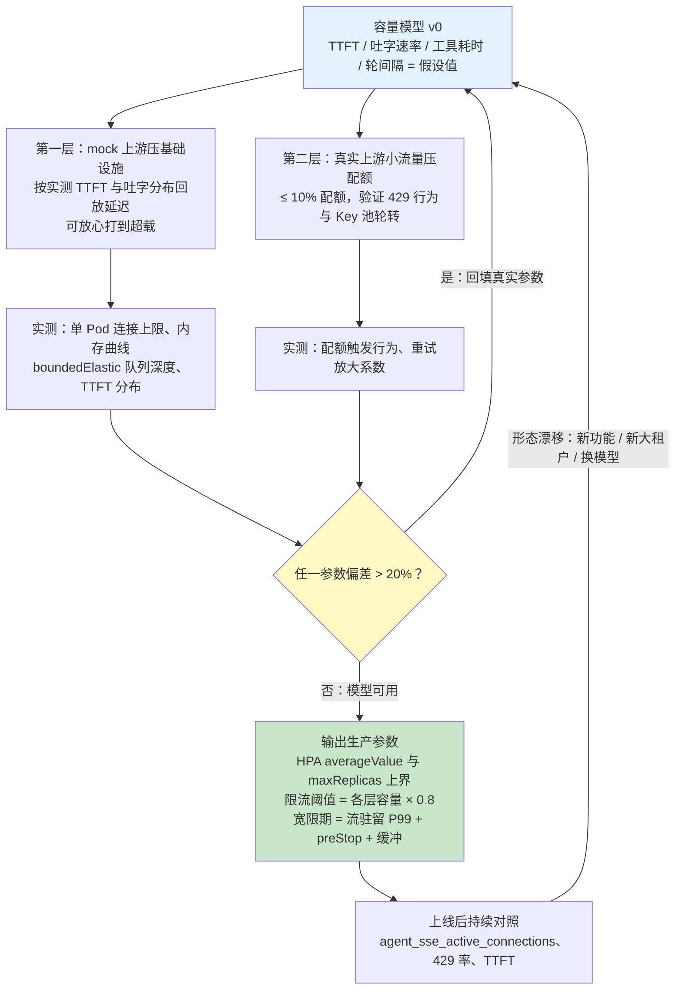

第一层用 mock 上游（按**实测分布**回放 TTFT 与吐字延迟）把基础设施层压到超载——连接数、内存（§3.11 的背压链路）、boundedElastic、连接池全部拿到极限值。这里有个必须避开的失真：mock 的 TTFT 不能用常数——排队系统的延迟是非线性的，常数 TTFT 会严重低估高并发下的真实驻留，必须用真实环境采集的分布回放。第二层用真实上游的小流量（≤ 10% 配额）验证配额层模型——429 的实际触发行为、Key 池轮转的切换耗时，以及一个只有真压才能量出来的系数：**重试放大系数**（重试让实际 RPM 需求 = 名义需求 × (1 + 重试率)，429 引发的重试风暴会把 1800 RPM 放大到不可收拾，熔断与退避策略见 [教程 04-企业级架构主干/10-容错与弹性设计 §5、§6](10-容错与弹性设计.md)）。

压测验收的对照口径示例：

| 待验证假设 | 压测项 | 通过判据 |
|-----------|--------|---------|
| 单 Pod 承载 200 条 SSE 连接 | 200 并发长连接持续 10 分钟（mock 上游） | 内存曲线平稳、无 OOMKill、TTFT P99 不劣化 |
| 工具槽 80 够用 | 模拟工具 P99 抖到 3s 的混合场景 | boundedElastic 队列不持续增长、轮时长不发散 |
| 宽限期 120s 覆盖排空 | 压测中滚动删除一个 Pod | 零硬切（SIGKILL 前流完成率 100%） |
| 1800 RPM 配额模型 | 真实上游 10% 配额 + 人为逼近限额 | 429 后重试放大系数 ≤ 预期，熔断按预期打开 |

#### 容量模型小结：每个参数的出处

| 容量模型输出 | 落点 | 参数 |
|-------------|------|------|
| 单 Pod 连接预算（内存约束下） | §3.9 HPA | `averageValue` |
| 上游配额摊平所需副本数 | §3.9 HPA | `maxReplicas` 上界 |
| 突发吸收 + 发布期 N+1 | §3.9 HPA | `minReplicas` |
| 每用户并发连接份额 | §3.7 Ingress | `limit-connections`（按容量而非防刷值设定） |
| 流驻留 P99 + preStop + 缓冲 | §3.10 排空 | `terminationGracePeriodSeconds` |
| 连接数 × 每连接内存 + 直接内存 | §3.11 内存预算 | cgroup limit 与 `-XX:MaxDirectMemorySize` |
| 各层容量 × 0.8，按租户/用户分桶 | [教程 04-企业级架构主干/06-多租户隔离与资源治理](06-多租户隔离与资源治理.md) | 限流阈值与配额 |

容量模型回答的是"要多少"。同一套推演在不同环境不该得出同一组数字——dev/staging/prod 的容量规格如何差异化、哪些环节降容量可以而换引擎不行，正是 §4 环境隔离要回答的问题；而推演出的"要多少"如果没有护栏，任何一次误操作都能把它推翻——下一节先把护栏建起来。

### 3.13 Namespace 级资源治理：ResourceQuota 与 LimitRange

§3.12 为每个负载算出了"要多少"，但推演结果不会自动执行：一次手滑把 `replicas` 写成 200、一个忘了声明 resources 的实验 Deployment、一个邻接团队的压测任务，都能把共享集群的资源吃穿——事后你面对的是一堆 `Pending` 的 Pod 和一场跨团队追责。K8s 在 namespace 层给了两件护栏（K8s v1.31 语境：均为 `core/v1` 稳定 API，语义多年稳定；参考 [ResourceQuota 官方文档](https://kubernetes.io/docs/concepts/policy/resource-quotas/)、[LimitRange 官方文档](https://kubernetes.io/docs/concepts/scheduling-eviction/limit-range/)，访问时间 2026-08）：

- **ResourceQuota**：namespace 的**总量上限**——所有 Pod 的 `requests`/`limits` 合计、Pod 数量、PVC 数量。它回答"这一层最多能总共用多少"；
- **LimitRange**：**单容器边界与默认值**——未声明时注入 `default`/`defaultRequest`，写超 `max` 直接拒绝。它回答"每一个个体至少/至多占多少"。

```yaml
# k8s/resourcequota.yaml
apiVersion: v1
kind: ResourceQuota
metadata:
  name: agent-prod-quota
  namespace: agent-prod
spec:
  hard:
    requests.cpu: "40"        # 全 namespace Pod 的 requests.cpu 合计上限
    requests.memory: 80Gi
    limits.cpu: "60"          # limits 侧是另一本账，同样要声明
    limits.memory: 100Gi
    pods: "120"               # Pod 数量也进配额：防失控副本与遗忘的实验负载
```

```yaml
# k8s/limitrange.yaml：与 ResourceQuota 成对出现（因果链见下）
apiVersion: v1
kind: LimitRange
metadata:
  name: agent-defaults
  namespace: agent-prod
spec:
  limits:
    - type: Container
      default:                # 未写 limits.* 时注入这份
        cpu: "2"
        memory: 4Gi
      defaultRequest:         # 未写 requests.* 时注入这份
        cpu: "500m"
        memory: 2Gi
      max:                    # 单容器硬边界：声明值超了直接拒绝创建
        cpu: "4"
        memory: 16Gi
```

这两者存在一条必须背下来的**因果链**：一旦 namespace 上启用了 ResourceQuota，任何未显式声明 `requests`/`limits` 的 Pod 创建即报 `forbidden`——配额无法为未声明的资源记账，索性全拒。而 LimitRange 的 `default`/`defaultRequest` 注入恰好补上这个洞。所以它们是成对能力：**只上 Quota 不上 LimitRange，等于把所有漏写 resources 的负载（同事的实验部署、第三方 chart、CI 里的临时任务）当场判死刑**，事故形态是"配额上了之后一夜之间一堆 Deployment 起不来"。

#### 与业务层配额的分层：namespace 配额保平台，业务配额保租户

配额有两层，**防的主体完全不同，互相不可替代**。namespace 层的 ResourceQuota/LimitRange 防的是"自己人"——研发误操作、部署失控、邻接团队挤占；业务层配额（[教程 04-企业级架构主干/06-多租户隔离与资源治理 §5](06-多租户隔离与资源治理.md)：Token 配额、并发请求限制、存储配额）防的是"客户"——单个租户滥用拖垮全平台。把两层混做会得到两种典型坏结局：试图用 namespace 表达租户配额，就得每租户一个 namespace（数量爆炸，K8s 集群 namespace 千级已是管理极限）；试图用业务层替代 namespace 护栏，则业务层自身故障（配额服务宕机、规则误删）时平台裸奔。

| 层 | 手段 | 防谁失控 | 失效模式 | 锚点 |
|----|------|---------|---------|------|
| **平台层**（namespace） | ResourceQuota + LimitRange | 研发误操作、部署失控、跨团队挤占、漏配 resources | 配额过紧 → 正常扩容被拒；过松 → 失控照旧 | 本节 |
| **租户层**（业务） | Token 配额 / 并发限制 / 存储配额 | 单租户滥用、拖垮全平台共享的上游配额 | 业务层不设 → 平台层替它扛，代价是误伤所有租户 | [教程 04-企业级架构主干/06-多租户隔离与资源治理 §5](06-多租户隔离与资源治理.md) |
| **单流层**（应用内） | `limitRate` / 有界缓冲 / 断连取消 | 单请求内存失控（慢客户端写积压） | 无界缓冲 → OOMKill | 本篇 §3.11 |

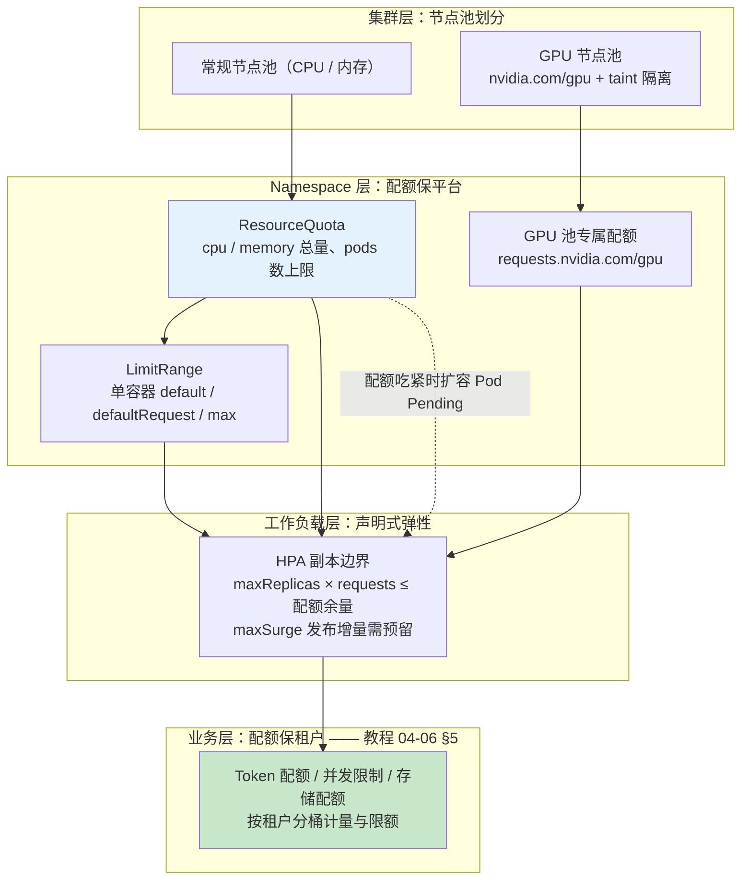

#### GPU 节点池的配额特判

GPU 是 **extended resource**，记账规则与 CPU/内存不同：**不允许超卖，`requests` 必须等于 `limits`，配额两端都要写**。生产惯例是把推理服务放进独立的 GPU namespace，与节点池的 taint 构成双闸门——Pod 想落到 GPU 节点，既要通过配额审查、又必须带 toleration，少一个都进不去：

```yaml
# llm-infer namespace 的 ResourceQuota（GPU 节点池专属）
apiVersion: v1
kind: ResourceQuota
metadata:
  name: llm-infer-quota
  namespace: llm-infer
spec:
  hard:
    requests.nvidia.com/gpu: "8"   # extended resource 直接进 hard，不可超卖
    limits.nvidia.com/gpu: "8"
```

GPU 节点池用 taint（如 `nvidia.com/gpu=present:NoSchedule`）与常规池隔离，普通业务 namespace 的 Pod 没有对应 toleration 就永远调不上去。推理服务按整卡独占声明资源的写法与多模型混部的取值口径见 [附录 15-AIInfra与推理部署/01-GPU调度与K8s部署 §3.1](../../附录/15-AIInfra与推理部署/01-GPU调度与K8s部署.md)——自建推理的配额若按"GPU 利用率不高就再塞一个模型"估算，很快会在 KV Cache 显存溢出上翻车。

#### 与 HPA 和容量模型的相互作用

配额与 §3.9 的 HPA 有一组必须显式对账的约束：`maxReplicas × 每 Pod requests ≤ 配额余量`。§3.12 的例子里 `maxReplicas: 20` × 2C4G = 40C/80G，恰好是 ResourceQuota 的量级来源——配额数字不是运维拍的，是容量模型推演出来的。若配额小于这个乘积，扩到第 17 个 Pod 起全部 `Pending`（事件 `exceeded quota`），**HPA 的期望副本数在涨、实际容量没涨**——比不扩容更危险，因为监控面板显示"已扩容"。同理 `maxSurge` 的发布期增量（默认 25%）也要留在配额余量内，否则副本多的发布日会莫名失败。收束成本节的一句话：**容量模型回答"要多少"，ResourceQuota 把答案固化成"最多给多少"，业务配额回答"谁可以用多少"——三层各管一段，缺哪层哪层失控。**

---

## 4. 环境隔离

### 4.1 三环境架构

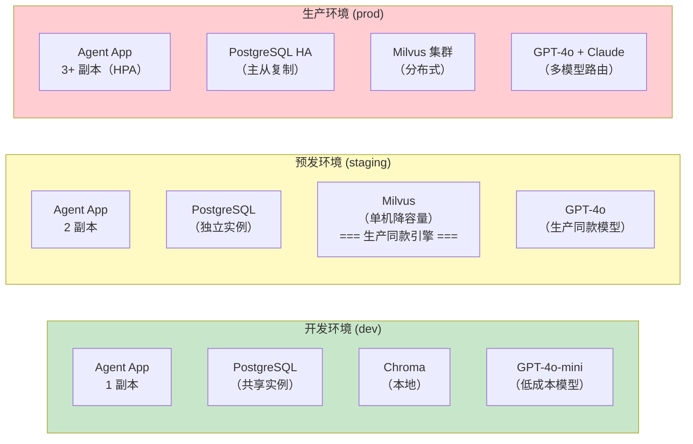

### 4.2 环境配置对照

| 配置项 | dev | staging | prod |
|--------|-----|---------|------|
| **模型** | GPT-4o-mini | GPT-4o | GPT-4o + Claude（路由） |
| **向量库** | Chroma（本地） | Milvus（单机，生产同款引擎） | Milvus 集群（分布式） |
| **数据库** | 共享 PostgreSQL | 独立 PostgreSQL | PostgreSQL HA |
| **副本数** | 1 | 2 | 3+（HPA 自动扩缩） |
| **日志级别** | DEBUG | INFO | WARN |
| **限流** | 无 | 宽松 | 严格（10 req/s） |
| **熔断** | 关闭 | 开启 | 开启 + 降级链 |
| **API Key** | 测试 Key | 测试 Key（有额度） | 生产 Key（预算限制） |

> **⚠ 环境一致性铁律**：staging 的向量库必须与生产**同款引擎**。staging 的全部价值在于复现生产行为，而向量检索（索引类型、距离度量、召回行为）在不同引擎间的差异是出了名的难排查——换引擎等于放弃这个价值。规则是"**降容量可以，换引擎不行**"：生产用 Milvus 集群，staging 就用单机版 Milvus。dev 允许例外——本地用 Chroma 换取零依赖启动，但要清楚任何"检索行为差异"类问题只会在 staging 及以后才暴露。模型选择同理：staging 与 prod 至少同家族，否则效果回归与成本预估都会失真。

### 4.3 Profile 配置文件

```yaml
# application.yml（公共配置）
spring:
  application:
    name: agent-app
  threads:
    virtual:
      enabled: true              # Java 21 虚拟线程
server:
  port: 8080
management:
  endpoints:
    web:
      exposure:
        include: health,info,metrics,prometheus
```

```yaml
# application-dev.yml
spring:
  config:
    activate:
      on-profile: dev
  ai:
    openai:
      chat:
        model: gpt-4o-mini        # 2.0.0 键位：chat.model，无 .options 中缀
logging:
  level:
    com.example.agent: DEBUG
    org.springframework.ai: DEBUG
```

```yaml
# application-prod.yml
spring:
  config:
    activate:
      on-profile: prod
  ai:
    openai:
      chat:
        model: gpt-4o        # 2.0.0 键位：chat.model，无 .options 中缀
logging:
  level:
    com.example.agent: WARN
    org.springframework.ai: INFO
resilience4j:
  circuitbreaker:
    instances:
      llm-circuit:
        sliding-window-size: 10
        failure-rate-threshold: 50
        wait-duration-in-open-state: 30s
```

---

## 5. 配置管理策略

### 5.1 配置分层

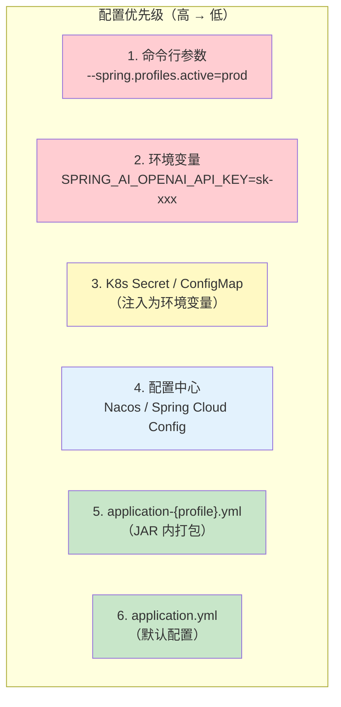

### 5.2 敏感配置管理原则

```java
// ❌ 错误：密钥硬编码在代码中
@Configuration
public class BadConfig {
    private static final String API_KEY = "sk-prod-xxxxxxxxxxxxx";
}

// ❌ 错误：密钥写在 application.yml 中并提交到 Git
// application.yml:
//   openai:
//     api-key: sk-prod-xxxxxxxxxxxxx  // 会被 Git 跟踪！

// ✅ 正确：通过环境变量注入
@Configuration
public class GoodConfig {

    @Value("${OPENAI_API_KEY}")
    private String apiKey;  // 从环境变量读取

    // 或者通过 @ConfigurationProperties 批量绑定
}

// ✅ 正确：在 K8s 中通过 Secret 注入
```

### 5.3 配置热更新（可选）

> **需在 pom.xml 中添加依赖**：Spring Cloud Config 客户端（`spring-cloud-starter-config` + 对应配置中心依赖，本仓库 pom 未声明，版本走 Spring Cloud BOM）。`@RefreshScope` 来自 `spring-cloud-context`。

对于需要动态调整的配置（如模型切换、限流阈值），可以使用 Spring Cloud Config 或 Nacos：

```yaml
# application.yml
spring:
  cloud:
    config:
      uri: ${CONFIG_SERVER:http://config-server:8888}
      fail-fast: true
      retry:
        max-attempts: 6
        initial-interval: 1000
```

```java
// 通过 @RefreshScope 实现配置热更新
@RestController
@RefreshScope
public class ConfigController {

    @Value("${agent.model.primary:gpt-4o}")
    private String primaryModel;

    @GetMapping("/config/model")
    public String getCurrentModel() {
        return primaryModel;
    }

    // 调用 POST /actuator/refresh 后，primaryModel 会自动更新
}
```

---

## 6. 健康检查端点

### 6.1 Spring Boot Actuator 配置

```yaml
# application.yml
management:
  endpoints:
    web:
      exposure:
        include: health,info,metrics,prometheus,circuitbreakers
      base-path: /actuator
  endpoint:
    health:
      show-details: when-authorized    # 需要认证才能看详情
      probes:
        enabled: true                   # 启用 K8s 探针端点
      group:
        readiness:
          include: readinessState,db,vectorStore   # llm 不进 readiness——用熔断状态代理（见 §6.4）
        liveness:
          include: livenessState
  health:
    livenessstate:
      enabled: true
    readinessstate:
      enabled: true
```

### 6.2 健康检查端点对应关系

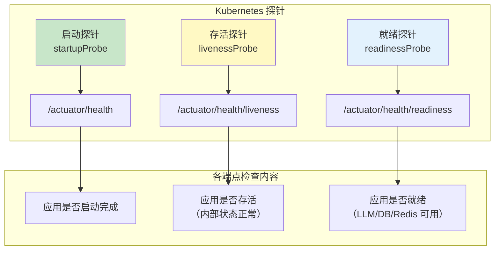

### 6.3 自定义健康指标

```java
import org.springframework.ai.chat.model.ChatModel;
import org.springframework.ai.vectorstore.SearchRequest;
import org.springframework.ai.vectorstore.VectorStore;
import org.springframework.boot.health.contributor.Health;
import org.springframework.boot.health.contributor.HealthIndicator;
import org.springframework.stereotype.Component;

import io.github.resilience4j.circuitbreaker.CircuitBreaker;
import io.github.resilience4j.circuitbreaker.CircuitBreakerRegistry;

@Component
public class LlmHealthIndicator implements HealthIndicator {

    private final ChatModel chatModel;
    private final CircuitBreakerRegistry cbRegistry;

    public LlmHealthIndicator(ChatModel chatModel, CircuitBreakerRegistry cbRegistry) {
        this.chatModel = chatModel;
        this.cbRegistry = cbRegistry;
    }

    @Override
    public Health health() {
        Health.Builder builder = Health.up();

        // 1. 检查熔断器状态
        CircuitBreaker llmCircuit = cbRegistry.circuitBreaker("llm-circuit");
        if (llmCircuit.getState() == CircuitBreaker.State.OPEN) {
            return Health.down()
                    .withDetail("error", "LLM 熔断器处于 OPEN 状态")
                    .build();
        }

        // 2. 检查 LLM 可用性（可选——避免频繁 ping 消耗 Token）
        builder.withDetail("circuitState", llmCircuit.getState().toString());
        builder.withDetail("failureRate", llmCircuit.getMetrics().getFailureRate());

        return builder.build();
    }
}

@Component
public class VectorStoreHealthIndicator implements HealthIndicator {

    private final VectorStore vectorStore;

    public VectorStoreHealthIndicator(VectorStore vectorStore) {
        this.vectorStore = vectorStore;
    }

    @Override
    public Health health() {
        try {
            // 执行一个极简查询检查向量库可用性
            vectorStore.similaritySearch(
                SearchRequest.builder().query("health-check").topK(1).build());
            return Health.up().withDetail("provider", "pgvector").build();
        } catch (Exception e) {
            return Health.down()
                    .withDetail("error", e.getMessage())
                    .build();
        }
    }
}
```

### 6.4 探针设计原则：liveness 绝不能包含外部依赖

探针配错比不配更糟。核心原则一句话：**liveness 回答"我该不该被重启"，readiness 回答"我该不该接流量"——重启解决不了的问题，就不要放进 liveness。**

**为什么 liveness 绝不能检查 LLM / 向量库 / DB 等外部依赖。**这类依赖故障时，Pod 本身是健康的，问题在别人身上。若 liveness 把外部依赖算进来，连锁反应是：liveness 失败 → Kubelet 重启 Pod → 重启完全不解决外部依赖的问题 → 新 Pod 起来 liveness 又失败 → CrashLoopBackOff。更糟的是重启风暴本身制造二次伤害：冷 JVM、重建连接池、瞬时流量重新分配，把本就脆弱的依赖再压一遍——探针反而成了"雪崩放大器"。§3.5 的配置里 liveness 只探 `/actuator/health/liveness`（默认只含 `livenessState`，即应用自身存活状态），正是这个原则的体现。

**readiness 含外部依赖则是个取舍题。**把向量库/DB 放进 readiness，能在依赖故障时把 Pod 摘出流量、保护用户不被打到必失败的请求上；副作用是依赖一抖，全量 Pod 同时 NOT_READY → Service 后面没有端点 → 整体不可用。工程上的平衡点有三条：

- readiness 里的外部检查**用熔断器状态代替真实调用**——不去 ping LLM（烧 token，且探针周期会放大调用量），读 Resilience4j circuit 状态当代理信号：它是从真实调用流量里累计出来的故障率，比探针自带的 ping 更真实（§6.3 的 `LlmHealthIndicator` 正是这么做的）；
- 探针的**超时与失败阈值要比业务侧更宽容**（`failureThreshold × periodSeconds` > 业务熔断窗口），让业务侧熔断先动手，摘流量只做兜底；
- 需要增删 health group 成员时用 include/exclude 显式声明，别依赖默认组装：

```yaml
management:
  endpoint:
    health:
      probes:
        enabled: true            # K8s 上 Spring Boot 会自动创建 liveness/readiness 组
      group:
        liveness:
          include: livenessState  # 只有应用自身状态——永不加外部依赖
        readiness:
          include: readinessState,db,vectorStore
          exclude: llm            # 显式排除：LLM 故障靠熔断降级兜底，不搞全量摘除
```

三种探针的分工与失败后果对照（探针语义参考 [Kubernetes 官方文档](https://kubernetes.io/docs/tasks/configure-pod-container/configure-liveness-readiness-startup-probes/)，访问时间 2026-08）：

| 探针 | 回答的问题 | 失败后果 | 应该检查什么 |
|------|-----------|---------|-------------|
| startup | 启动完成了吗？ | 延迟 liveness/readiness 开始计时 | 应用启动完成（进程级端点） |
| liveness | 进程死了吗？ | **重启容器** | 仅应用自身内部状态 |
| readiness | 能接流量了吗？ | **摘除端点** | 自身状态 + 强依赖（带取舍） |

---

## 7. 日志收集与聚合

### 7.1 日志架构

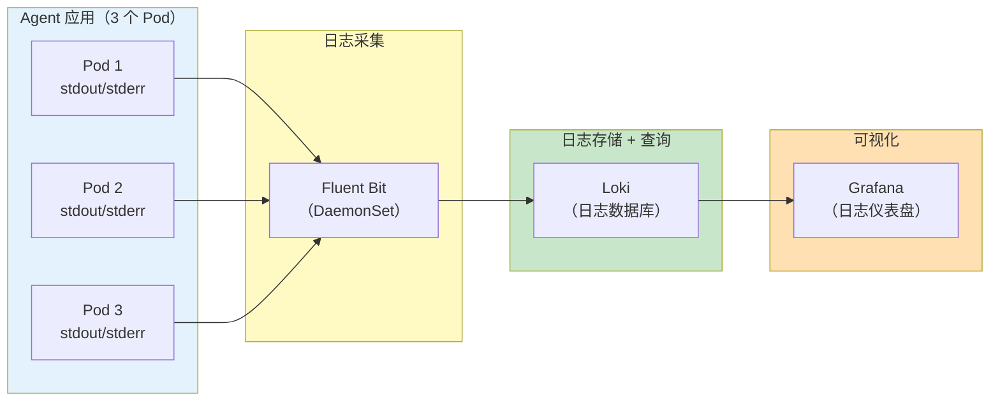

### 7.2 结构化日志配置

```xml
<!-- src/main/resources/logback-spring.xml -->
<configuration>
    <appender name="JSON" class="ch.qos.logback.core.ConsoleAppender">
        <encoder class="net.logstash.logback.encoder.LogstashEncoder">
            <customFields>
                {
                    "service": "agent-app",
                    "version": "${PROJECT_VERSION:-unknown}"
                }
            </customFields>
            <fieldNames>
                <timestamp>@timestamp</timestamp>
                <message>message</message>
                <thread>thread</thread>
                <levelValue>[ignore]</levelValue>
            </fieldNames>
        </encoder>
    </appender>

    <springProfile name="dev">
        <appender name="CONSOLE" class="ch.qos.logback.core.ConsoleAppender">
            <encoder>
                <pattern>%d{HH:mm:ss.SSS} %-5level [%thread] %logger{36} - %msg%n</pattern>
            </encoder>
        </appender>
        <root level="DEBUG">
            <appender-ref ref="CONSOLE"/>
        </root>
    </springProfile>

    <springProfile name="prod">
        <root level="WARN">
            <appender-ref ref="JSON"/>
        </root>
        <logger name="com.example.agent" level="INFO"/>
    </springProfile>
</configuration>
```

### 7.3 请求上下文日志：Reactor Context，而不是 MDC

**为什么 MDC 在 Reactor 里失效。**命令式代码里 MDC 好用，是因为"一个请求从头到尾跑在同一个线程上"，ThreadLocal 自然随线程走。WebFlux 恰好相反：同一条响应式链路的不同算子几乎必然跑在不同线程上——EventLoop 收请求、boundedElastic 执行阻塞段、另一个 EventLoop 线程续传流式响应。于是有两种事故：其一，在 `doOnEach` / `doOnNext` 这类**信号回调**里 `MDC.put(...)`，设置到的只是"当前碰巧执行这个回调的线程"，下一段日志换了线程执行就取不到，等于白设；其二更危险，EventLoop 线程是**复用**的——你在它身上 put 的 MDC 没清理，下一个恰好调度到这个线程的请求会读到上一个请求的 requestId/userId，**日志串号**，且污染的是整个线程池。在 `doFinally` 里 `MDC.clear()` 同样跑在不可预期的线程上，救不了。

正确姿势是 **Reactor Context**：它是随订阅关系传播的不可变上下文，不挂在任何线程上，跨任意次线程切换都取得到——上游 `contextWrite` 写入，需要打日志处用 `deferContextual` 读出：

```java
import java.util.UUID;

import org.springframework.core.annotation.Order;
import org.springframework.stereotype.Component;
import org.springframework.web.server.ServerWebExchange;
import org.springframework.web.server.WebFilter;
import org.springframework.web.server.WebFilterChain;

import reactor.core.publisher.Mono;
import reactor.util.context.Context;

@Component
@Order(-100)   // 尽量早执行，让后续所有链路都能读到上下文
public class RequestIdWebFilter implements WebFilter {

    @Override
    public Mono<Void> filter(ServerWebExchange exchange, WebFilterChain chain) {
        String requestId = UUID.randomUUID().toString();
        String userId = extractUserId(exchange);   // 从 JWT Token 提取

        // 只写 Reactor Context——不碰 ThreadLocal/MDC
        return chain.filter(exchange)
                .contextWrite(Context.of(
                        "requestId", requestId,
                        "userId", userId));
    }

    private String extractUserId(ServerWebExchange exchange) {
        var userId = exchange.getRequest().getHeaders().getFirst("X-User-Id");
        return userId != null ? userId : "anonymous";
    }
}
```

```java
import org.slf4j.Logger;
import org.slf4j.LoggerFactory;
import org.springframework.stereotype.Service;

import reactor.core.publisher.Mono;

@Service
public class ChatStreamService {

    private static final Logger log = LoggerFactory.getLogger(ChatStreamService.class);

    // 打日志的地方：deferContextual 把"读上下文"变成链路的一环，
    // 无论此刻在哪个线程执行，读到的都是本次订阅写入的值
    public Mono<Void> logCallSuccess(String answer) {
        return Mono.deferContextual(ctx -> {
            log.info("requestId={} userId={} LLM 调用成功 length={}",
                    ctx.get("requestId"), ctx.get("userId"), answer.length());
            return Mono.empty();
        });
    }
}
```

生产上还有一条"既要 Reactor 又想要 MDC"的捷径：引入 Micrometer 的 context-propagation 并开启 Reactor 的自动上下文传播（`Hooks.enableAutomaticContextPropagation()`）——它会在信号切换点把 Reactor Context 里的值同步进当前线程的 ThreadLocal/MDC，logback 的 JSON encoder 就能像命令式时代一样自动带出 requestId（属便利层，底层语义仍是"Reactor Context 是唯一事实源"；具体装配以所用 Spring Boot 版本文档为准，概念性说明）。

（开启该能力需在 pom.xml 中添加依赖，本仓库 pom 未声明；版本由 Spring Boot BOM 管理）

```xml
<dependency>
    <groupId>io.micrometer</groupId>
    <artifactId>context-propagation</artifactId>
</dependency>
```

更彻底的做法是不自己发明日志上下文，直接用 Observation API——Spring AI 全链路已内置 Observation，traceId 传播开箱即用，见「想深入？→ [教程 05-Observation可观测/06-Trace链路：traceId贯穿HTTP、LLM、工具与日志](../05-Observation可观测/06-Trace链路：traceId贯穿HTTP、LLM、工具与日志.md)」与 [教程 05-Observation可观测/11-深度整合：SpringAI2与Observation的完整结合面](../05-Observation可观测/11-深度整合：SpringAI2与Observation的完整结合面.md)。

### 7.4 Agent 操作审计日志

```java
@Component
public class AgentAuditLogger {

    private static final Logger auditLog = LoggerFactory.getLogger("AGENT_AUDIT");

    /**
     * 记录 Agent 的每次关键操作
     */
    public void logToolCall(String requestId, String userId, String toolName,
                             Object[] args, String result, long durationMs) {
        auditLog.info("""
            {
              "event": "tool_call",
              "requestId": "{}",
              "userId": "{}",
              "tool": "{}",
              "args": {},
              "resultLength": {},
              "durationMs": {}
            }""",
            requestId, userId, toolName,
            Arrays.toString(args),
            result != null ? result.length() : 0,
            durationMs);
    }

    public void logLlmCall(String requestId, String model, int inputTokens,
                            int outputTokens, long latencyMs) {
        auditLog.info("""
            {
              "event": "llm_call",
              "requestId": "{}",
              "model": "{}",
              "inputTokens": {},
              "outputTokens": {},
              "latencyMs": {}
            }""",
            requestId, model, inputTokens, outputTokens, latencyMs);
    }
}
```

---

## 8. 监控与告警

### 8.1 Prometheus 指标暴露

```yaml
# application.yml
management:
  prometheus:
    metrics:
      export:
        enabled: true
        step: 30s
```

### 8.2 关键监控指标

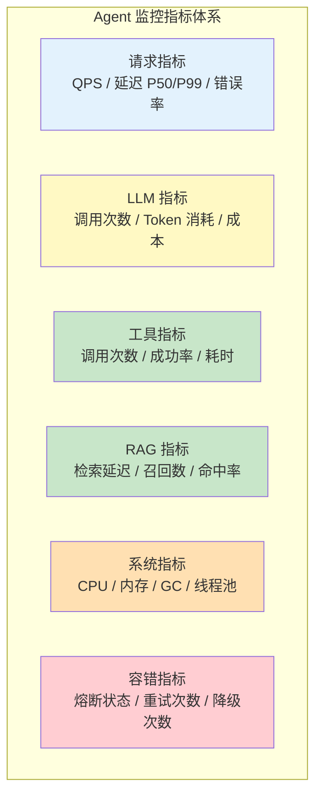

### 8.3 告警规则

```yaml
# prometheus-alerts.yaml
groups:
  - name: agent-alerts
    rules:
      # LLM 调用错误率 > 10%
      - alert: HighLlmErrorRate
        expr: |
          rate(agent_llm_call_errors_total[5m]) /
          rate(agent_llm_call_total[5m]) > 0.1
        for: 5m
        labels:
          severity: critical
        annotations:
          summary: "LLM 调用错误率超过 10%"

      # 熔断器打开
      - alert: CircuitBreakerOpen
        expr: resilience4j_circuitbreaker_state{state="open"} == 1
        for: 1m
        labels:
          severity: warning
        annotations:
          summary: "熔断器 {{ $labels.name }} 处于 OPEN 状态"

      # 日成本超预算
      - alert: DailyCostExceeded
        expr: agent_cost_daily_total > 50
        labels:
          severity: warning
        annotations:
          summary: "日 LLM 成本超过预算 $50"

      # Pod 重启
      - alert: PodRestart
        expr: increase(kube_pod_container_status_restarts_total[1h]) > 3
        labels:
          severity: critical
        annotations:
          summary: "Pod {{ $labels.pod }} 频繁重启"
```

---

## 9. CI/CD 流水线

```mermaid
graph LR
    CODE["代码提交<br/>Git Push"] --> BUILD["构建<br/>Maven Package"]
    BUILD --> TEST["测试<br/>单元测试 + 集成测试"]
    TEST --> SCAN["安全扫描<br/>Trivy / SonarQube"]
    SCAN --> DOCKER["Docker 镜像"]
    DOCKER --> PUSH["推送到镜像仓库"]
    PUSH --> DEPLOY_DEV["部署 dev"]
    DEPLOY_DEV --> TEST_DEV["dev 验证"]
    TEST_DEV --> DEPLOY_STAGING["部署 staging"]
    DEPLOY_STAGING --> TEST_STAGING["staging 验证"]
    TEST_STAGING --> DEPLOY_PROD["部署 prod<br/>（Canary 灰度，见 §9.3）"]

    style BUILD fill:#e3f2fd
    style TEST fill:#c8e6c9
    style SCAN fill:#ffcdd2
    style DEPLOY_PROD fill:#fff9c4
```

### 9.1 GitHub Actions 示例

```yaml
# .github/workflows/deploy.yml
name: Build and Deploy

on:
  push:
    branches: [main]

jobs:
  build-and-deploy:
    runs-on: ubuntu-latest
    steps:
      - uses: actions/checkout@v4

      - name: Set up JDK 21
        uses: actions/setup-java@v4
        with:
          java-version: '21'
          distribution: 'temurin'

      - name: Build with Maven
        run: ./mvnw clean package -DskipTests

      - name: Run tests
        run: ./mvnw test

      - name: Build Docker image
        run: docker build -t agent-app:${{ github.sha }} .

      - name: Push to registry
        run: |
          docker login -u ${{ secrets.REGISTRY_USER }} -p ${{ secrets.REGISTRY_PASS }}
          docker tag agent-app:${{ github.sha }} registry.example.com/agent-app:${{ github.sha }}
          docker push registry.example.com/agent-app:${{ github.sha }}

      - name: Deploy to K8s
        run: |
          kubectl set image deployment/agent-app agent=registry.example.com/agent-app:${{ github.sha }} \
            -n agent-prod
          kubectl rollout status deployment/agent-app -n agent-prod
```

### 9.2 发布策略选型：蓝绿 vs 金丝雀 vs 滚动

§3.10 的滚动更新解决了"怎么不停机换版本"，但没有回答"该不该用别的方式换"。三种主流策略的本质差异一句话说清：**滚动 = 匀速换血**（新旧副本按比例共存，流量按副本比例自然过渡）；**蓝绿 = 整环境对切**（新旧两套完整环境并存，流量在某个瞬间 100% 原子切换）；**金丝雀 = 按比例渐进**（新版本先接小比例流量，指标达标逐级放量）。选型是在"回滚确定性 × 资源成本 × 流量粒度"三角里找自己的位置：

| 维度 | 滚动更新（§3.10） | 蓝绿 | 金丝雀（§9.3 Argo Rollouts） |
|------|-------------------|------|------------------------------|
| **资源成本** | 最低（maxSurge 增量副本，25% 量级） | 最高（峰值 100% 双份） | 中（按阶梯比例的双份） |
| **回滚速度** | 中：`rollout undo` 把滚动倒着来一遍 | 快：Service selector 秒级切回，**前提是旧版本未缩容** | 快：AnalysisTemplate 失败自动 abort 回稳定版 |
| **流量切换粒度** | 副本比例（无法精确控制流量占比） | 100% 原子切换，无中间态 | 精确到 1%（5%→10%→50% 阶梯） |
| **双版本数据兼容要求** | 强制（共存期共用库表，schema 前向兼容） | 强制（共存窗口 + 回滚窗口内全兼容） | 强制且共存观察期最长 |
| **SSE 长连接冲击** | 分散在滚动全程，逐 Pod 排空 | 集中一次：切流瞬间所有新建连接换道，存量靠排空 | 最平滑：逐阶梯换道 |
| **适用** | 无行为风险的常规迭代 | 需整环境验证的重大变更、回滚确定性要求高的场景 | 有指标分析闭环的持续交付（默认选项） |

蓝绿在 K8s 的落地有两条路：手工版是**双 Deployment + Service selector 切换**（`version: blue` → `version: green`，原子性由 Service 的 selector 更新保证）；生产版直接用 Argo Rollouts 的 `blueGreen` 策略——它把"预览环境、人工确认、旧版本保留窗口"三件事声明式化了（第三方 CRD，版本语境 argoproj.io/v1alpha1；参考 [Argo Rollouts BlueGreen 官方文档](https://argo-rollouts.readthedocs.io/en/stable/features/bluegreen/)，访问时间 2026-08）：

```yaml
# k8s/bluegreen-rollout.yaml —— Argo Rollouts 的 blueGreen 策略骨架
apiVersion: argoproj.io/v1alpha1
kind: Rollout
metadata:
  name: agent-app
  namespace: agent-prod
spec:
  replicas: 6
  strategy:
    blueGreen:
      activeService: agent-active        # 接生产流量的 Service
      previewService: agent-preview      # 预览 Service：切换前绿版本可整环境验证
      autoPromotionEnabled: false        # 关闭自动 promote：人工确认后才切流
      scaleDownDelaySeconds: 900         # 切换后蓝版本保留 15 分钟：SSE 排空 + 回滚窗口
  selector:
    matchLabels:
      app: agent
  template:
    metadata:
      labels:
        app: agent
    spec:
      # Pod 模板与 §3.5 Deployment 相同（探针 / preStop 原样保留）
      containers: []
```

`scaleDownDelaySeconds` 是 Agent 服务蓝绿方案里最不能省的参数，原因在下面这张时序图里：

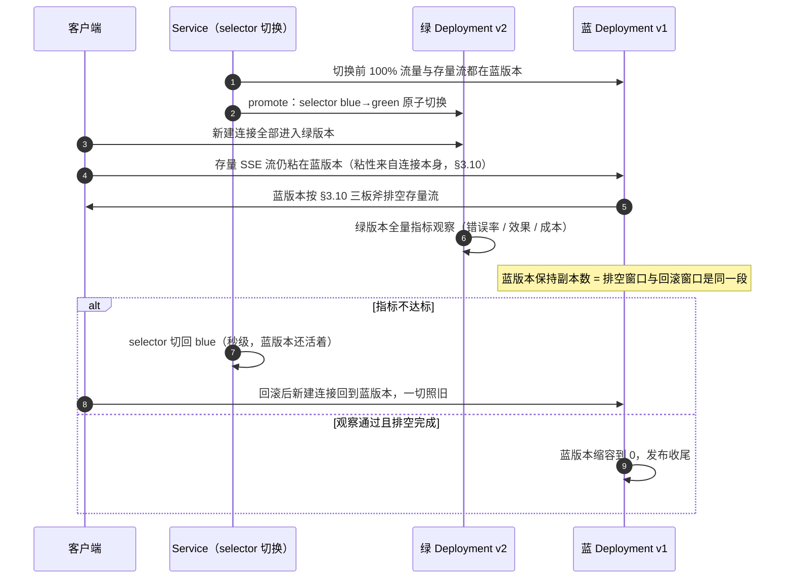

**Agent 场景特判一：SSE 长连接让蓝绿的"秒级回滚"变成有前提的承诺**。蓝绿相对滚动的核心卖点是回滚快——selector 切回去就行。但对 SSE 服务，这个卖点的成立条件是**蓝版本还活着**：存量流粘在蓝版本上排空（§3.10 的机制在这里原样生效），排空要花"流驻留 P99 × 若干倍"的时间（§3.12 的宽限期公式同款）；如果为了省资源在切流后立刻缩掉蓝版本，回滚就不再是秒级，而是一次完整的冷启动 + 探针就绪流程（分钟级）。所以 `scaleDownDelaySeconds` 不是可调优项而是正确性参数——它同时是排空窗口和回滚窗口，取值下界 = 流驻留 P99 + preStop + 缓冲（与 §3.10 宽限期同一套算法），生产惯例取 15–30 分钟。**排空越慢的业务，蓝绿的资源成本越接近"双份长期共存"**——这是蓝绿资源成本的隐藏项，对比表里"峰值 100% 双份"只是下限。

**Agent 场景特判二：双版本共存对 Prompt 版本与评测集的兼容性要求**。蓝绿没有中间流量比例，切流瞬间**全部在途会话同时跨版本**：会话在蓝版本上接受了第 1–10 轮回答，第 11 轮落到绿版本时 System Prompt 已经换了版本——历史消息与新模板的语义连续性断裂，轻则风格跳变，重则指令冲突。这正是 [教程 04-企业级架构主干/09-灰度发布与版本管理 §2.6 会话粘性](09-灰度发布与版本管理.md)讨论的问题在发布维度的镜像，而蓝绿**没有**金丝雀那种按会话粘性分流的中间态可用。缓解手段：Prompt 版本号随会话上下文携带，绿版本识别"旧版本会话"按旧模板续答（双版本模板共存发布）；更根本的一条是**Prompt 大版本变更永远不选蓝绿**——100% 切换等于让全量会话瞬间跨版本，金丝雀 + 会话粘性才是它的正确载体（§9.3）。同时，蓝绿的观察窗口本质是一次 **100% 流量的 A/B**，"绿版本更好"的判定依赖发布前的双版本基线：评测集必须同时跑 v1/v2 两套基线（变更评审与评测闭环见 [教程 04-企业级架构主干/09-灰度发布与版本管理 §2.5](09-灰度发布与版本管理.md)），只有单版本基线数据的蓝绿不是发布验证，是盲切。

选型推荐收束成三条：**日常迭代默认金丝雀**——阶梯放量 + 指标自动回滚（§9.3）是无人值守的安全网，Agent 的效果回归（Prompt、模型路由、检索参数）天然适合按比例观察；**重大基础设施变更用蓝绿**——JVM 参数与依赖大版本升级（如本章 GC 选型的落地）、库表迁移、整租户 SLO 验证，要的是"切回去就是一切照旧"的确定性；**无观测闭环的小服务退回滚动**——没有指标分析能力时，蓝绿的观察窗口与金丝雀的放量判据都无从谈起，§3.10 的滚动排空已是安全上限。

### 9.3 灰度发布：Argo Rollouts Canary

原生 `RollingUpdate` 只有 maxSurge / maxUnavailable 两个旋钮，本质是"全量滚动、匀速推进"——出了问题只能靠人肉 `kubectl rollout undo`，没有"先放 5% 观察、指标坏了自动回退"的能力。对 Agent 应用这尤其危险：一次坏 Prompt 或坏模型路由推到 100% 流量，烧的是真金白银的 token。生产级灰度用 **Argo Rollouts** 把 Deployment 换成 Rollout，获得三个能力：**阶梯放量**（`steps.setWeight` 逐级调整流量比例）、**暂停观察**（`pause` 卡在某个百分比，等人工确认或自动分析）、**指标分析自动回滚**（AnalysisTemplate 对接 Prometheus，错误率超标自动 abort 回稳定版）。

```yaml
# k8s/rollout.yaml —— Rollout 骨架（替代 Deployment，Pod 模板字段兼容）
apiVersion: argoproj.io/v1alpha1
kind: Rollout
metadata:
  name: agent-app
  namespace: agent-prod
spec:
  replicas: 6
  strategy:
    canary:
      canaryService: agent-canary       # 金丝雀 Service（观察/打标用）
      stableService: agent-stable       # 稳定版 Service
      steps:
        - setWeight: 10                 # 先放 10% 流量到新版本
        - pause: { duration: 5m }       # 静默观察 5 分钟
        - analysis:                     # 自动分析，失败即回滚
            templates:
              - templateName: error-rate-check
        - setWeight: 50
        - pause: { duration: 5m }
        - setWeight: 100
  selector:
    matchLabels:
      app: agent
  template:
    metadata:
      labels:
        app: agent
    spec:
      # 容器规格与 §3.5 Deployment 的 podTemplate 相同（探针 / preStop 原样保留）
      containers: []
```

```yaml
# AnalysisTemplate：LLM 错误率超标自动判定失败（数据源是 Prometheus）
apiVersion: argoproj.io/v1alpha1
kind: AnalysisTemplate
metadata:
  name: error-rate-check
  namespace: agent-prod
spec:
  metrics:
    - name: llm-error-rate
      interval: 1m
      count: 5
      successCondition: result[0] < 0.05   # 错误率 < 5% 视为通过
      failureLimit: 2                       # 连续 2 次不达标即失败回滚
      provider:
        prometheus:
          address: http://prometheus:9090
          query: |
            sum(rate(agent_llm_call_errors_total[2m]))
            / sum(rate(agent_llm_call_total[2m]))
```

与 SSE 长连接的配合要点：金丝雀切的是**新建连接**的流量比例，存量流仍留在原版本上跑完，所以灰度期间"两个版本同时有活跃流"是常态；放量节奏要给排空留时间（`setWeight` 之间加 `pause`），避免稳定版缩容过快触发 §3.10 里的硬切；Rollout 缩旧版本时同样走 preStop + 宽限期那套排空机制，§3.5 的配置原样生效。流量切分、A/B 测试与 Prompt 版本管理的完整方法论见 [教程 04-企业级架构主干/09-灰度发布与版本管理](09-灰度发布与版本管理.md)（Argo Rollouts 参考 [官方文档](https://argo-rollouts.readthedocs.io/)，访问时间 2026-08）。

---

## 10. 适用场景与不适用场景

### 适用场景

- 企业级生产 Agent 部署（需要高可用、可伸缩）
- 多环境管理的团队（dev/staging/prod 隔离）
- 有运维团队的中大型组织（K8s + 监控 + 日志）
- 对 SLA 有严格要求的商业服务
- 需要灰度发布和回滚能力的系统

### 不适用场景

- 个人项目 / 技术验证（用 docker-compose 足够）
- 小团队没有运维资源（直接用云平台 PaaS）
- 离线/嵌入式 Agent（不需要 K8s）
- 对延迟没有要求的批处理任务（部署简化即可）

---

## 11. 本章总结

| 概念 | 一句话 |
|------|--------|
| **Docker 多阶段构建** | 构建 JDK 环境与运行时 JRE 环境分离，减小镜像体积 |
| **K8s Deployment** | 声明式管理 Pod 副本，支持滚动更新和回滚 |
| **ConfigMap** | K8s 中存储非敏感配置，注入为环境变量 |
| **Secret** | K8s 中存储敏感信息（API Key/密码），Base64 编码 |
| **探针** | startup/liveness/readiness 三种探针，管理 Pod 生命周期 |
| **HPA** | 水平自动扩缩容；Agent 应用须按自定义指标驱动，CPU 常失灵（§3.9） |
| **环境隔离** | dev/staging/prod 三环境，通过 Profile + Namespace 隔离 |
| **配置分层** | 命令行 > 环境变量 > Secret/ConfigMap > 配置中心 > yml |
| **健康检查** | Actuator + 自定义 HealthIndicator，监控 LLM/DB/向量库 |
| **结构化日志** | JSON 格式输出，Fluent Bit 采集 → Loki 存储 → Grafana 查询 |
| **Prometheus 监控** | 指标暴露 + 告警规则，覆盖请求/LLM/工具/成本/系统 |
| **Session Affinity** | `sessionAffinity: None`：无状态 + 会话外置，SSE 的"粘性"由长连接本身保证，不用 ClientIP |
| **滚动更新排空** | preStop 静默窗口 + 优雅停机 + 宽限期兜底，存量 SSE 流不被硬切 |
| **探针原则** | liveness 只看自身状态；外部依赖进 readiness 且用熔断状态代理 |
| **Native Image** | 毫秒级启动、内存减半；代价是 AOT hints 与第三方集成逐一验证 |
| **背压与内存 limit** | 无界缓冲 + 慢消费者 = OOMKilled；有界缓冲 + limitRate + 断连取消 |
| **容量模型** | 从并发会话逐层推演各基础设施负载；短板定容量，限流/HPA/宽限期都有出处（§3.12） |
| **容器内 JVM 内存与 GC 预算** | 堆只是 cgroup limit 的一份；G1/ZGC 按 EventLoop 停顿敏感度选型；`-Xlog:gc*` + 直接内存水位 Gauge 是两条观测入口（§3.11 后半） |
| **发布策略选型** | 日常迭代金丝雀、重大变更蓝绿、无观测闭环退滚动；SSE 排空时长决定蓝绿的保留窗口（§9.2） |
| **Namespace 资源治理** | ResourceQuota/LimitRange 保平台、业务配额保租户；配额上限必须与 HPA `maxReplicas` 对账（§3.13） |

**阶段小结**：到这里，"让 Agent 稳定跑在生产"的部署运维主线闭环了——镜像、编排、探针、排空、扩缩容、日志、灰度都有了可执行的方案。但跑起来只是起点，生产质量的下一段主线是"同样的模型，上下文喂得好坏直接决定效果与成本"——那是下一篇的主题。

## 参考资料

- [Kubernetes：配置 liveness / readiness / startup 探针](https://kubernetes.io/docs/tasks/configure-pod-container/configure-liveness-readiness-startup-probes/)（访问时间 2026-08）
- [Kubernetes：Pod 生命周期与 terminationGracePeriodSeconds](https://kubernetes.io/docs/concepts/workloads/pods/pod-lifecycle/)（访问时间 2026-08）
- [Kubernetes：水平 Pod 自动扩缩容（HPA）](https://kubernetes.io/docs/tasks/run-application/horizontal-pod-autoscale/)（访问时间 2026-08）
- [Argo Rollouts 官方文档](https://argo-rollouts.readthedocs.io/)（访问时间 2026-08）
- [Spring Boot：GraalVM Native Image](https://docs.spring.io/spring-boot/reference/packaging/native-image/)（访问时间 2026-08）

---

> **回顾起点？→ [00-Agent 核心概念](../00-基础与核心/00-Agent核心概念.md)**：从什么是 Agent 开始，重温整个学习旅程。
> **遇到阻塞？→ [教程 04-企业级架构主干/10-容错与弹性设计](10-容错与弹性设计.md)**：部署后的稳定性靠容错策略保障。
> **遇到阻塞？→ [教程 04-企业级架构主干/09-灰度发布与版本管理](09-灰度发布与版本管理.md)**：灰度的完整方法论（流量切分 / Prompt 版本 / A-B 测试）。
>
> **上一篇：[65-模型路由与降级](12-模型路由与降级.md)　|　下一篇：[77-上下文工程](../08-架构师进阶/00-上下文工程.md)**
