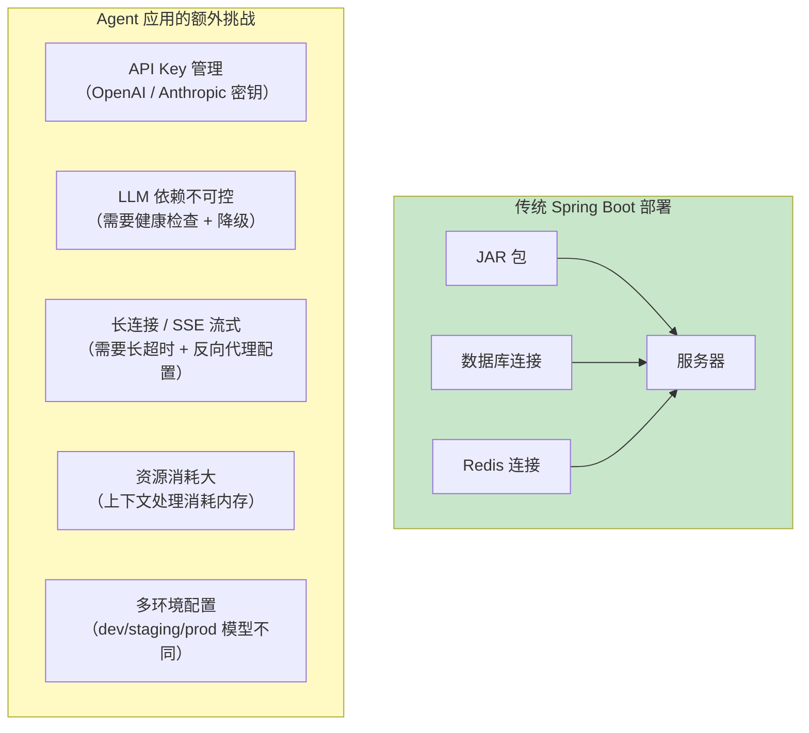
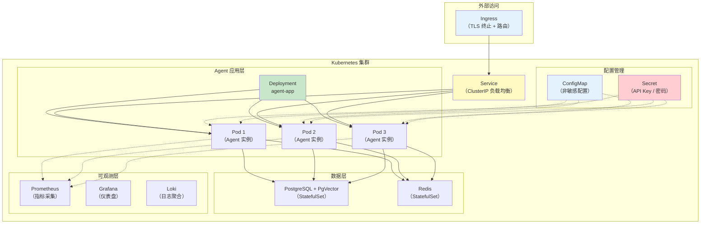
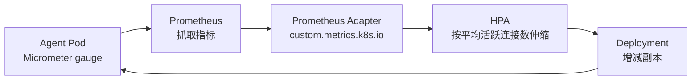
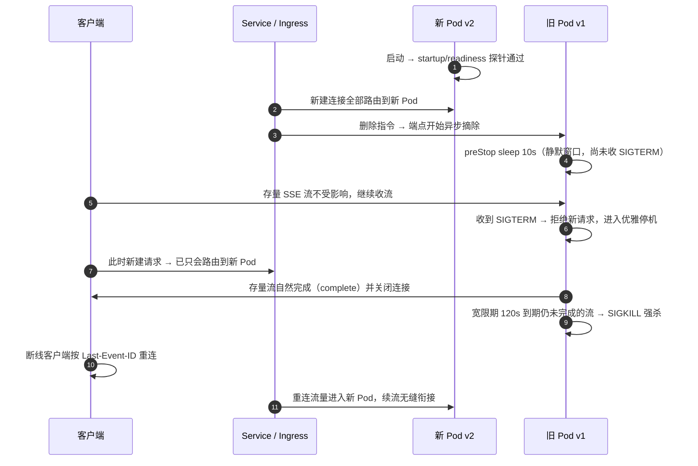
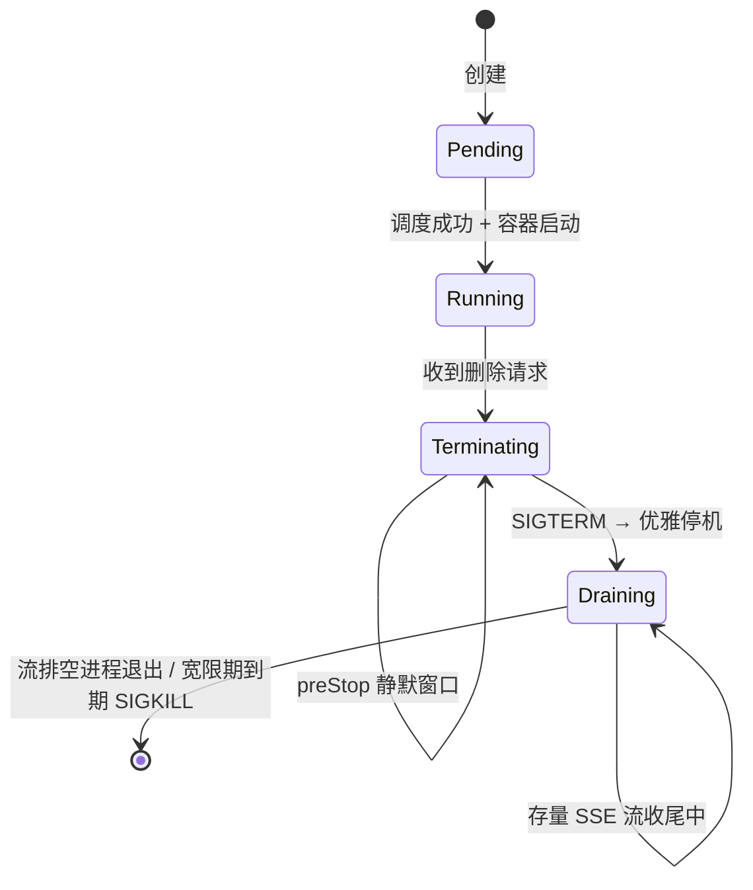
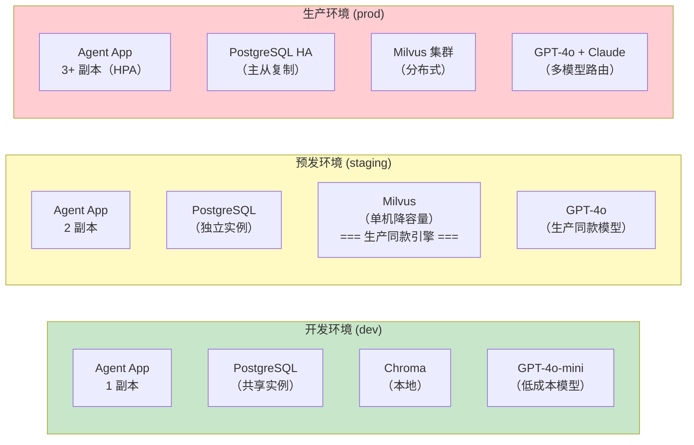
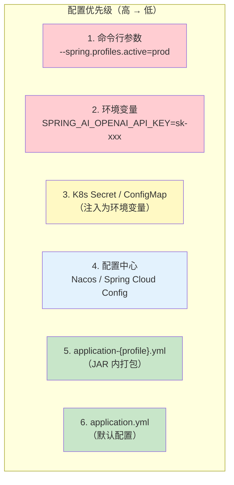
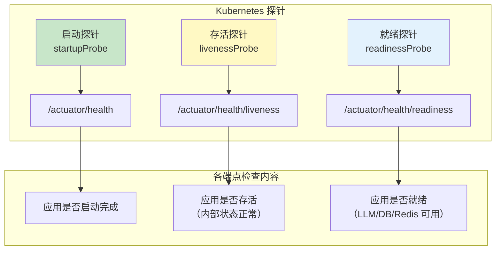
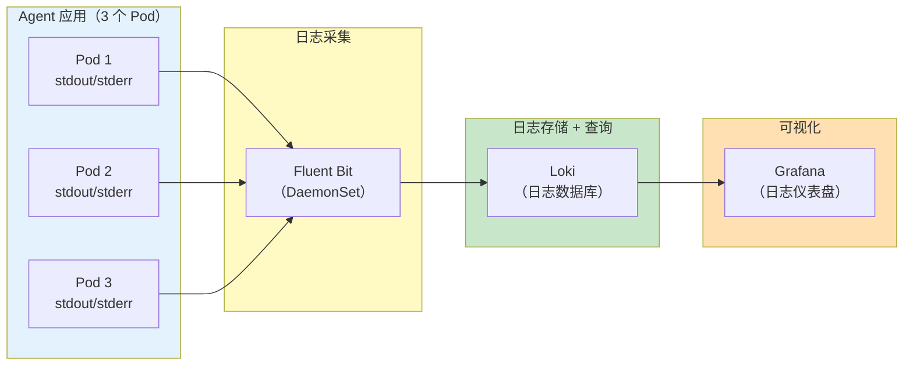
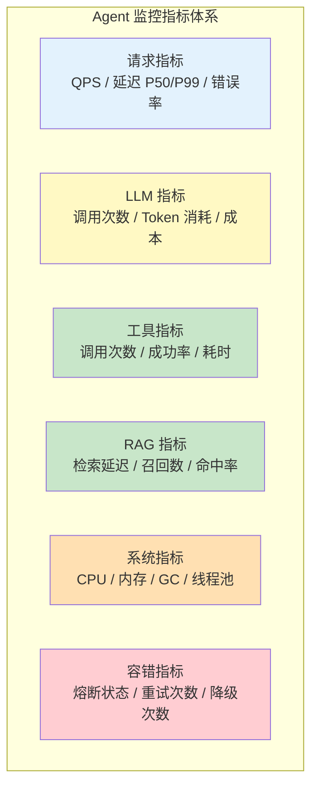

# 66-部署与运维

> **定位**：讲透 Agent 应用的部署与运维实践——Docker 化、Kubernetes 部署（Deployment/Service/ConfigMap/Secret）、环境隔离（dev/staging/prod）、配置管理、健康检查端点（含探针设计原则）、日志收集与聚合，以及 Agent 应用最容易踩坑的三件大事——滚动更新下的 SSE 长连接排空、HPA 自定义指标扩缩容、灰度发布（Argo Rollouts）。读完这篇，你的 Agent 能稳定地跑在生产环境，并且发布不"硬切"长连接、扩缩容不跑空转。
>
> **读者画像**：已经掌握 Agent 开发的全部核心能力，需要将 Agent 应用部署到生产环境并持续运维。
>
> **前置阅读**：[63-容错与弹性设计](10-容错与弹性设计.md)、[65-模型路由与降级](12-模型路由与降级.md)；SSE 排空相关小节建议先读 [57-多页面流式响应与会话管理](04-多页面流式响应与会话管理.md)。

---

## 1. Agent 应用的部署挑战

传统 Spring Boot 应用的部署已经很成熟了——打包 JAR、扔到服务器、启动。Agent 应用在部署时有几个特殊挑战：



---

## 2. Docker 化

### 2.1 Dockerfile

```dockerfile
# 多阶段构建——阶段 1：构建
FROM eclipse-temurin:21-jdk-jammy AS builder

WORKDIR /build

# 先复制 Maven 配置（利用 Docker 缓存）
COPY pom.xml .
COPY src ./src

# 构建应用（跳过测试加速）
RUN ./mvnw clean package -DskipTests

# ============ 阶段 2：运行时 ============
FROM eclipse-temurin:21-jre-jammy

WORKDIR /app

# 安装 curl 用于健康检查
RUN apt-get update && apt-get install -y curl && rm -rf /var/lib/apt/lists/*

# 复制构建产物
COPY --from=builder /build/target/*.jar app.jar

# 创建非 root 用户
RUN groupadd -r appuser && useradd -r -g appuser appuser
USER appuser

# 暴露端口
EXPOSE 8080

# JVM 参数：容器感知的内存设置
ENV JAVA_OPTS="-XX:+UseContainerSupport -XX:MaxRAMPercentage=75.0 -XX:+UseZGC"

# 健康检查
HEALTHCHECK --interval=30s --timeout=10s --start-period=60s --retries=3 \
    CMD curl -f http://localhost:8080/actuator/health || exit 1

ENTRYPOINT ["sh", "-c", "java $JAVA_OPTS -jar app.jar"]
```

这份 Dockerfile 有三个值得展开的决策。**多阶段构建**把构建期的 JDK 与运行期的 JRE 分开，镜像从约 800MB 降到约 300MB，拉取和滚动更新都更快；构建阶段先复制 `pom.xml` 再复制 `src`，让依赖解析层在代码未变时命中 Docker 层缓存，是 CI 提速的关键。**用 `-XX:MaxRAMPercentage` 而不是 `-Xmx`** 让堆随容器内存 limit 按比例伸缩，同一份镜像不改参数就能跑在 2Gi 和 8Gi 的 Pod 里（为什么 75% 不是越高越好，见 §3.11 的内存预算）。**`HEALTHCHECK` 只是 Docker 层的兜底**——上了 K8s 之后健康判定以探针（§6）为准，两者并存不冲突；非 root 用户（`appuser`）则是生产镜像的安全底线。

### 2.2 .dockerignore

```
# .dockerignore
target/
.git/
.idea/
.vscode/
*.md
docs/
.claude/
**/*.log
```

### 2.3 docker-compose.yml（本地开发）

```yaml
# docker-compose.yml
version: '3.8'

services:
  # Agent 应用
  agent-app:
    build:
      context: .
      dockerfile: Dockerfile
    ports:
      - "8080:8080"
    environment:
      - SPRING_PROFILES_ACTIVE=dev
      - OPENAI_API_KEY=${OPENAI_API_KEY}
      # Spring AI 2.0 的 PgVector 复用应用 DataSource Bean（PgVectorStore.builder(JdbcTemplate, EmbeddingModel)），
      # 数据源连接走 Spring Boot 标准 spring.datasource.*，不再有 1.x 的 vectorstore.pgvector.connection-* 键
      - SPRING_DATASOURCE_URL=jdbc:postgresql://postgres:5432/agent
      - SPRING_DATASOURCE_USERNAME=agent
      - SPRING_DATASOURCE_PASSWORD=agent123
    depends_on:
      postgres:
        condition: service_healthy
      chroma:
        condition: service_started
    networks:
      - agent-network

  # PostgreSQL + PgVector
  postgres:
    image: pgvector/pgvector:pg16
    environment:
      POSTGRES_DB: agent
      POSTGRES_USER: agent
      POSTGRES_PASSWORD: agent123
    ports:
      - "5432:5432"
    volumes:
      - postgres-data:/var/lib/postgresql/data
    healthcheck:
      test: ["CMD-SHELL", "pg_isready -U agent"]
      interval: 10s
      timeout: 5s
      retries: 5
    networks:
      - agent-network

  # Chroma 向量数据库（开发环境备用）
  chroma:
    image: chromadb/chroma:latest
    ports:
      - "8000:8000"
    volumes:
      - chroma-data:/chroma/chroma
    networks:
      - agent-network

volumes:
  postgres-data:
  chroma-data:

networks:
  agent-network:
    driver: bridge
```

### 2.4 构建与运行

```bash
# 构建镜像
docker build -t agent-app:latest .

# 通过 docker-compose 启动全套
docker-compose up -d

# 查看日志
docker-compose logs -f agent-app

# 停止
docker-compose down
```

### 2.5 GraalVM Native Image：AOT 原生镜像的价值与代价

JVM 应用在容器时代要交两笔"税"：启动慢（等 JVM 起来、Spring 上下文装配完）和内存底噪高（堆 + Metaspace + CodeCache，一个最小 WebFlux 应用也要吃掉两三百 MB）。GraalVM Native Image 用 AOT（构建期直接编译为平台原生二进制）把两笔税一起免掉——启动从十几秒降到几十毫秒，常驻内存接近减半，而且没有 JIT 预热期，冷启动延迟可预期。对部署运维的直接收益有三个：**密部署**（同样节点塞下两三倍副本）、**秒级扩容与缩容到零**（scale-to-zero 场景下 JVM 预热税无法接受）、以及大幅缓解 §3.9 要讲的**冷启动悖论**——扩出来的新副本冷启动即满血。

代价同样明确。一是构建慢（分钟级，通常放 CI 流水线，本地开发不用）。二是**封闭世界假设**：反射、动态代理、运行时字节码生成都必须在构建期通过 AOT hints 显式声明，漏声明就是运行时报错，而不是编译期报错。三是生态验证成本：Spring 框架本身和 Spring AI 的多数自动装配、ChatClient/Advisor 链路有官方 AOT 支持，但**每个第三方集成都要单独验证**——向量库 SDK、模型客户端的 HTTP/JSON 栈是否自带 GraalVM 元数据，验证不过就得自己写 `RuntimeHintsRegistrar` 补提示。四是与运行时动态特性（动态注册工具、Prompt 运行时编排）的组合需要逐项确认（概念性结论，以 [Spring Boot 官方文档](https://docs.spring.io/spring-boot/reference/packaging/native-image/) 为准，访问时间 2026-08）。

```bash
# 方式一：Buildpacks 一条命令产出原生镜像（CI 推荐，无需本地安装 GraalVM）
./mvnw spring-boot:build-image -Pnative

# 方式二：本地编译原生二进制（需 GraalVM for JDK 21）
./mvnw -Pnative native:compile
# 产物是自包含可执行文件：Dockerfile 只需 FROM distroless/base + COPY + ENTRYPOINT
```

落地建议：先用 JVM 镜像上线，把 native 镜像当作一个独立的性能迭代来做——优先给"流量低、突发强、缩缩容频繁需要 scale-to-zero"的服务上，而不是全量铺开。

### 2.6 虚拟线程的容器配置与运行时验证

`spring.threads.virtual.enabled=true`（§4.3 公共配置里已开启）让 Spring Boot 把阻塞式执行点切到 Java 21 虚拟线程上。先澄清一个常见误解：**虚拟线程和 WebFlux 不是二选一**。WebFlux 的主事件循环永远是 Netty EventLoop，虚拟线程改变不了这一点；它的价值在响应式链路里"躲不掉的阻塞段"——JDBC 查询、阻塞式工具调用（旧 HTTP SDK、文件 IO）跑在虚拟线程上，阻塞一个虚拟线程只占一小块堆内存，而阻塞一个平台线程要占 1MB 栈和一个 OS 线程。一句话：管道是响应式的，堵在管道里的阻塞件用虚拟线程来装。

容器里的配置位置分两层：Spring 属性层（`spring.threads.virtual.enabled`）负责开关，JVM 层参数建议统一走 `JAVA_TOOL_OPTIONS`——它会被 JVM 自动拾取，不需要改 ENTRYPOINT，在 K8s 里改一行 env 就能调参：

```dockerfile
# Dockerfile ENV 或 K8s env 二选一（此处示例放在 Dockerfile）
ENV JAVA_TOOL_OPTIONS="-XX:+UseContainerSupport -XX:MaxRAMPercentage=70.0 -XX:+UseZGC -Djdk.virtualThreadScheduler.parallelism=8"
```

其中 `jdk.virtualThreadScheduler.parallelism` 控制虚拟线程调度器（ForkJoinPool）的并行度：IO 密集可适当调高，CPU 密集保持默认（约等于 CPU 核数）；它只影响同时运行的载体线程数，不限制可创建的虚拟线程数量。

**配置生效与否不要靠猜，要运行时验证。**虚拟线程在传统 `jstack` 里几乎不可见，JDK 21+ 要用 `jcmd` 的 JSON 转储——它会包含虚拟线程及其栈和状态：

```bash
# 容器内执行（PID 1 是 java 进程）
jcmd 1 Thread.dump_to_file -format=json /tmp/threads.json
```

转储里看到大量名字形如 `virtual[#id]` 的线程处于 RUNNABLE/WAITING，就说明阻塞工作确实落在了虚拟线程上。另外两个观测点值得记住：JFR 的 `jdk.VirtualThreadPinned` 事件能抓到"虚拟线程钉在载体线程"（典型元凶是在 synchronized 块里做 IO），是性能回归排查的第一现场；Micrometer 的 `jvm.threads.live` 等**线程指标不统计虚拟线程**——容量判断请以 §3.9 的业务指标为准，别被"线程数很低"迷惑。

---

## 3. Kubernetes 部署

### 3.1 K8s 部署拓扑



### 3.2 Namespace

```yaml
# k8s/namespace.yaml
apiVersion: v1
kind: Namespace
metadata:
  name: agent-prod
  labels:
    app.kubernetes.io/name: agent
    environment: production
```

### 3.3 ConfigMap（非敏感配置）

```yaml
# k8s/configmap.yaml
apiVersion: v1
kind: ConfigMap
metadata:
  name: agent-config
  namespace: agent-prod
data:
  SPRING_PROFILES_ACTIVE: "prod"
  # 2.0.0 配置键：model 直接挂 chat 下（OpenAiChatProperties.CONFIG_PREFIX = spring.ai.openai.chat）
  SPRING_AI_OPENAI_CHAT_MODEL: "gpt-4o"
  SPRING_AI_OPENAI_CHAT_TEMPERATURE: "0.7"

  # 数据库连接（非密码部分）
  SPRING_DATASOURCE_URL: "jdbc:postgresql://postgres:5432/agent"
  SPRING_DATASOURCE_USERNAME: "agent"

  # 向量数据库（PgVectorStoreProperties.CONFIG_PREFIX = spring.ai.vectorstore.pgvector；
  # 属性中的连字符在环境变量里映射为下划线：index-type → INDEX_TYPE）
  SPRING_AI_VECTORSTORE_PGVECTOR_INDEX_TYPE: "HNSW"
  SPRING_AI_VECTORSTORE_PGVECTOR_DISTANCE_TYPE: "COSINE_DISTANCE"
  SPRING_AI_VECTORSTORE_PGVECTOR_DIMENSIONS: "1536"

  # JVM 参数
  JAVA_OPTS: "-XX:+UseContainerSupport -XX:MaxRAMPercentage=75.0 -XX:+UseZGC"

  application.yml: |
    spring:
      ai:
        retry:
          max-attempts: 3
          backoff:
            initial-interval: 1000
            multiplier: 2
            max-interval: 10000
        chat:
          client:
            tool-calling:
              enabled: true
    management:
      endpoints:
        web:
          exposure:
            include: health,info,metrics,prometheus
```

### 3.4 Secret（敏感配置）

```yaml
# k8s/secret.yaml
apiVersion: v1
kind: Secret
metadata:
  name: agent-secrets
  namespace: agent-prod
type: Opaque
stringData:
  OPENAI_API_KEY: "sk-prod-xxxxxxxxxxxxxxxxxx"
  ANTHROPIC_API_KEY: "sk-ant-xxxxxxxxxxxxxxxxxx"
  SPRING_DATASOURCE_PASSWORD: "super-secret-password"
  JWT_SECRET: "your-jwt-signing-key"

# 更安全的做法：使用 Sealed Secrets 或 External Secrets Operator
# 从 Vault / AWS Secrets Manager / Azure Key Vault 拉取
```

### 3.5 Deployment

```yaml
# k8s/deployment.yaml
apiVersion: apps/v1
kind: Deployment
metadata:
  name: agent-app
  namespace: agent-prod
  labels:
    app: agent
spec:
  replicas: 3                    # 3 个副本
  selector:
    matchLabels:
      app: agent
  strategy:
    type: RollingUpdate
    rollingUpdate:
      maxSurge: 1               # 滚动更新时最多多出 1 个 Pod
      maxUnavailable: 0          # 滚动更新时不允许减少 Pod
  template:
    metadata:
      labels:
        app: agent
    spec:
      containers:
        - name: agent
          image: registry.example.com/agent-app:v1.2.0
          ports:
            - containerPort: 8080
              name: http
          envFrom:
            - configMapRef:
                name: agent-config
            - secretRef:
                name: agent-secrets
          resources:
            requests:
              cpu: "500m"
              memory: "1Gi"
            limits:
              cpu: "2000m"
              memory: "4Gi"
          # 就绪探针：Pod 是否准备好接收流量
          readinessProbe:
            httpGet:
              path: /actuator/health/readiness
              port: 8080
            initialDelaySeconds: 30
            periodSeconds: 10
            failureThreshold: 3
          # 存活探针：Pod 是否存活（失败会重启）
          livenessProbe:
            httpGet:
              path: /actuator/health/liveness
              port: 8080
            initialDelaySeconds: 60
            periodSeconds: 20
            failureThreshold: 3
          # 启动探针：应用启动慢时给足够时间
          startupProbe:
            httpGet:
              path: /actuator/health
              port: 8080
            initialDelaySeconds: 10
            periodSeconds: 5
            failureThreshold: 30   # 最多等 150 秒启动
          # 终止前置钩子：先给 LB 一段静默窗口，再让应用收 SIGTERM（机制见 §3.10）
          lifecycle:
            preStop:
              exec:
                command: ["sh", "-c", "sleep 10"]
      # 优雅关闭宽限期：必须覆盖 preStop sleep + 存量 SSE 流排空时间（见 §3.10）
      terminationGracePeriodSeconds: 120
```

### 3.6 Service

```yaml
# k8s/service.yaml
apiVersion: v1
kind: Service
metadata:
  name: agent-service
  namespace: agent-prod
spec:
  type: ClusterIP
  selector:
    app: agent
  ports:
    - port: 80
      targetPort: 8080
      name: http
  # 无状态部署：会话/记忆外置到 Redis/DB，Service 层不做任何粘性
  sessionAffinity: None
```

**为什么不需要 ClientIP 会话亲和。**Agent 服务应当是无状态的：对话历史走 Redis/数据库集中存储（「遇到阻塞？→ [教程 00-基础与核心/04-记忆与会话管理](../00-基础与核心/04-记忆与会话管理.md)」），跨页面、跨实例的流式同步靠事件广播完成，而不是把用户钉死在某台实例上（[教程 04-企业级架构主干/04-多页面流式响应与会话管理](04-多页面流式响应与会话管理.md)）。因此 Service 层不需要任何粘性——`sessionAffinity: None`（即默认值）就是正确配置。

SSE 长连接的"粘性"由连接本身天然保证：一条 HTTP 连接从建立到关闭始终落在同一个 Pod 上，Service 只在**新建连接**时做负载均衡，不会把已建立的流"搬"到别的 Pod。真正要处理的是旧 Pod 退出时存量流的排空——这是 §3.10 的主题，靠亲和性解决不了。

ClientIP 亲和只在两种情况下才值得考虑：会话状态放在 Pod 内存里（如 InMemory 版 ChatMemory——生产环境不建议，重启即丢且无法水平扩展），或者依赖 Pod 本地缓存预热（把热点知识库缓存放本地内存、希望同一用户反复命中）。即便如此，更合理的解法仍是把状态外置或下沉到独立缓存服务，而不是让负载均衡层迁就应用的有状态性；而且经过 L7 Ingress/NLB 转发后，Service 看到的来源 IP 往往是代理 IP，ClientIP 亲和本身就不可靠。

### 3.7 Ingress

```yaml
# k8s/ingress.yaml
apiVersion: networking.k8s.io/v1
kind: Ingress
metadata:
  name: agent-ingress
  namespace: agent-prod
  annotations:
    # SSE 长连接支持
    nginx.ingress.kubernetes.io/proxy-buffering: "off"
    nginx.ingress.kubernetes.io/proxy-read-timeout: "300"
    nginx.ingress.kubernetes.io/proxy-send-timeout: "300"
    # 限流
    nginx.ingress.kubernetes.io/limit-rps: "10"
    nginx.ingress.kubernetes.io/limit-connections: "20"
    # TLS 重定向
    nginx.ingress.kubernetes.io/ssl-redirect: "true"
spec:
  tls:
    - hosts:
        - agent.example.com
      secretName: agent-tls
  rules:
    - host: agent.example.com
      http:
        paths:
          - path: /
            pathType: Prefix
            backend:
              service:
                name: agent-service
                port:
                  number: 80
```

### 3.8 HPA（水平自动扩缩容）

```yaml
# k8s/hpa.yaml
apiVersion: autoscaling/v2
kind: HorizontalPodAutoscaler
metadata:
  name: agent-hpa
  namespace: agent-prod
spec:
  scaleTargetRef:
    apiVersion: apps/v1
    kind: Deployment
    name: agent-app
  minReplicas: 3
  maxReplicas: 20
  metrics:
    - type: Resource
      resource:
        name: cpu
        target:
          type: Utilization
          averageUtilization: 70
    - type: Resource
      resource:
        name: memory
        target:
          type: Utilization
          averageUtilization: 80
  behavior:
    scaleUp:
      stabilizationWindowSeconds: 30
      policies:
        - type: Percent
          value: 100              # 一次最多扩容 100%
          periodSeconds: 30
    scaleDown:
      stabilizationWindowSeconds: 300  # 缩容需要稳定 5 分钟
      policies:
        - type: Percent
          value: 25               # 一次最多缩容 25%
          periodSeconds: 60
```

上面这份 HPA 配置在传统 Web 应用里工作得很好，但把它原样搬到 Agent 应用上会遇到一个致命盲区——下面三节展开。

### 3.9 HPA 的误区：CPU 指标量不出 LLM 负载

Agent 应用是典型的 **LLM-bound（LLM 等待型）负载**：请求线程把 Prompt 发给上游模型后，剩下的时间几乎全在等流式响应回来，真正耗 CPU 的只有拼上下文、解析 JSON、向量编解码这些短促突发。结果是——负载翻十倍，CPU 利用率可能仍趴在 15%–25% 不动。这时 HPA 盯着 `averageUtilization: 70` 的 CPU 目标永远不触发扩容；而用户侧的真实体感是 P99 延迟爆炸、并发 SSE 连接排队、上游 in-flight 请求堆积。**CPU 低不等于没压力，只说明压力不在这台机器的 CPU 上。**

正确做法是用"业务压力"指标驱动扩缩容，而不是资源利用率：

| 候选指标 | 含义 | 适用性 |
|----------|------|--------|
| 活跃 SSE 连接数（gauge） | 当前挂着的流式会话数 | 最贴近容量上限，推荐做主指标 |
| 上游 LLM in-flight 请求数 | 已发出未返回的模型调用 | 反映上游占用与排队，适合做第二指标 |
| Reactor 队列深度 | boundedElastic 任务积压 | 反映阻塞工具调用的积压 |
| P99 延迟（自定义指标） | 用户体感 | 滞后大，适合做保护性下限 |

指标接进 HPA 有两条主流路径：**Prometheus Adapter**（把 `/actuator/prometheus` 里的自定义指标暴露成 `custom.metrics.k8s.io` API）或 **KEDA**（事件驱动扩缩容器，直接用 PromQL 做触发器，还天然支持缩容到零）。无论哪条路径，前提都是应用先把 gauge 埋出来——活跃连接数用一个 `AtomicLong` 在 SSE 订阅/终止时增减即可，埋点方式见 [教程 04-企业级架构主干/02-全链路可观测性](02-全链路可观测性.md)。



```yaml
# HPA + 自定义指标：按"平均每 Pod 活跃 SSE 连接数"扩缩容
# 前置条件：集群已部署 Prometheus Adapter（暴露 custom.metrics.k8s.io）
apiVersion: autoscaling/v2
kind: HorizontalPodAutoscaler
metadata:
  name: agent-hpa-custom
  namespace: agent-prod
spec:
  scaleTargetRef:
    apiVersion: apps/v1
    kind: Deployment
    name: agent-app
  minReplicas: 3
  maxReplicas: 20
  metrics:
    - type: Pods
      pods:
        metric:
          name: agent_sse_active_connections   # 对应 Micrometer gauge 指标名
        target:
          type: AverageValue
          averageValue: "200"                  # 平均每 Pod 200 条活跃流即扩容
```

KEDA 的等价写法是一个 `ScaledObject`，`triggers` 里直接写 PromQL（如 `max(agent_sse_active_connections)`），不再依赖 Adapter——两种方案二选一即可（HPA 机制参考 [Kubernetes 官方文档](https://kubernetes.io/docs/tasks/run-application/horizontal-pod-autoscale/)，访问时间 2026-08）。

**冷启动悖论**是第二个必须提前想清楚的坑：LLM 应用扩容比普通应用慢得多——新 Pod 起 JVM、建 WebClient 连接池、TLS 握手、首轮 JIT 全都要时间，而用户请求是即时到达的；等指标越过阈值再扩容，新副本往往"上线即过载"。缓解手段有三：① **启动预热**——readiness 通过前先发一次廉价模型调用，把连接池和编解码路径焐热；② `minReplicas` 留余量，用稳定基数吸收突发；③ **缩容慢、扩容快**——`scaleUp.stabilizationWindowSeconds` 给 0–30 秒、`scaleDown` 给 5 分钟以上，宁可多跑一台，也不让扩容追着负载跑。上了 GraalVM 原生镜像（§2.5）后冷启动税显著变小，这是 native 对 Agent 运维的又一重价值。

### 3.10 滚动更新：SSE 长连接的优雅排空

滚动更新对普通 HTTP 请求几乎无感——短请求毫秒级结束，readiness 摘除后新请求自然去新 Pod。但对 SSE 流式响应来说，**默认滚动更新是"硬切"**：`kubectl` 删掉旧 Pod 时，端点摘除（EndpointSlice → kube-proxy → Ingress 各层异步收敛）与 SIGTERM 是并行发生的——SIGTERM 已到、应用开始收尾甚至退出时，负载均衡层可能还在往这个 Pod 转发新建连接；反过来，存量 SSE 流可能要跑几分钟到几十分钟，默认 30 秒宽限期一过就是 SIGKILL 硬杀，用户屏幕上的回答戛然而止。两个方向都是硬切，只是切的时机不同。

完整的排空机制分三步：

1. **摘除先行**：Pod 进入 Terminating 后端点被异步摘除。`preStop` 钩子里 `sleep 10`，就是给端点收敛留一段静默窗口——这段时间应用还没收到 SIGTERM、照常服务，但新流量已逐步不再进来。
2. **优雅收尾**：SIGTERM 到达后，Spring Boot 在配置了 `server.shutdown: graceful` 时（下方 yaml 已显式声明；默认是 `immediate`，不会等待存量请求）先拒绝新请求（readiness 置 NOT_READY），再等存量请求/流自然结束，上限由 `spring.lifecycle.timeout-per-shutdown-phase` 控制。
3. **兜底强杀**：存量流若在宽限期内没跑完，`terminationGracePeriodSeconds` 到期即 SIGKILL。宽限期要按"SSE 流 P99 时长 + preStop sleep + 收尾缓冲"来定，而不是沿用默认 30 秒。

```yaml
# Deployment 片段（完整位置见 §3.5）：滚动更新排空三板斧
spec:
  template:
    spec:
      containers:
        - name: agent
          lifecycle:
            preStop:
              exec:
                # 静默窗口：等 EndpointSlice / kube-proxy / Ingress 全部收敛完
                command: ["sh", "-c", "sleep 10"]
      terminationGracePeriodSeconds: 120
```

```yaml
# 应用侧配套：优雅停机（Spring Boot 3.4+ 默认 graceful，显式声明更稳）
server:
  shutdown: graceful
spring:
  lifecycle:
    timeout-per-shutdown-phase: 90s   # 须短于容器宽限期，给进程留退出余量
```

完整时序如下——注意存量流"粘"在旧 Pod 上靠的是连接本身，而不是 Service 亲和：



**排空进度的可观测口径**：发布期间运维最常问的问题是"旧 Pod 还剩多少条活跃流、能不能安全推进"。做法是在 SSE 处理器入口维护一个 Micrometer gauge（订阅 +1 / 终止 -1，即 §3.9 用的 `agent_sse_active_connections`），发布时盯着旧副本该指标的下降曲线，归零或收敛到长尾再推进下一步。客户端断线重连与续流的协议设计（Last-Event-ID / 事件回放）在 [教程 04-企业级架构主干/04-多页面流式响应与会话管理](04-多页面流式响应与会话管理.md) 中展开。Pod 终止的完整状态迁移如下：



（Pod 生命周期与宽限期语义参考 [Kubernetes 官方文档](https://kubernetes.io/docs/concepts/workloads/pods/pod-lifecycle/)，访问时间 2026-08。）

### 3.11 Reactor 背压与容器内存 limit

WebFlux 应用的内存事故往往不是"堆设小了"，而是**背压链路被无意打断后缓冲无界增长**。典型场景：LLM 流式返回 token，客户端（弱网、手机锁屏、前端渲染卡顿）消费很慢，如果中间任何一环用了无参的 `onBackpressureBuffer()`（无界队列）或自建 `Sinks.Many`/`Processor` 却不处理溢出，来不及消费的 token 就在堆里无限堆积——直到撞上容器 memory limit，被 cgroup 直接 `OOMKilled`（`kubectl describe pod` 里 `Last State: Terminated, Reason: OOMKilled`，退出码 137）。注意这与 JVM 堆内 `OutOfMemoryError` 是两回事：cgroup OOMKill 是内核直接杀进程，JVM 的堆参数根本没有参与的机会。

溢出策略按流的内容物选：

- **有界缓冲 `onBackpressureBuffer(n, strategy)`**：给缓冲设上限并声明溢出策略（`DROP_OLDEST` / `DROP_LATEST`）。token 文本流慎用 DROP——丢几个 token 等于输出残句，宁可整流失败重传；
- **`limitRate(n)`**：控制每次向上游 `request(n)` 的预取批量，抑制"上游发得快、下游消费慢"的天然错配；
- **`doOnCancel` 联动取消**：客户端断开时让整条链路取消，上游 LLM 流一并 abort——既给内存止血，又省 token 成本（见 [教程 04-企业级架构主干/07-成本治理与Token计量](07-成本治理与Token计量.md)）；
- **DROP / LATEST**：适合状态类、指标类事件流（丢一个中间值无害），不适合内容流。

```java
// 概念代码：SSE 出口的有界化 + 断连联动取消（真实 API 见 Reactor 官方文档）
Flux<String> tokens = chatStreamService.streamAnswer(requestId, question);

tokens
    .limitRate(64)                                        // 每批最多预取 64 个元素
    .onBackpressureBuffer(4_096,                          // 有界缓冲，杜绝无界堆积
            BufferOverflowStrategy.ERROR)                 // 溢出即失败 → 整流重试，不输出残句
    .doOnCancel(() -> chatStreamService.abort(requestId)) // 客户端断开 → 取消上游 LLM 流
    ...
```

最后是**容器内存预算的完整口径**：cgroup limit 要同时装下 JVM 堆 + Metaspace + CodeCache + 线程栈 + **Netty 堆外内存**。WebFlux 的数据面大量走 Netty DirectMemory，而 JVM 不设置 `-XX:MaxDirectMemorySize` 时，直接内存上限默认约等于最大堆——堆占 75% 再叠上默认直接内存上限，很容易把 limit 顶爆。实践口径：`-XX:MaxRAMPercentage` 给 65–70 留出三成余量，**显式设置** `-XX:MaxDirectMemorySize`，并满足"堆 + 直接内存 + 约 400MB 基础开销 < limit"。镜像里已有的 `-XX:+UseContainerSupport` 只负责让 JVM 感知 cgroup limit，本身不做预算分配。

---

## 4. 环境隔离

### 4.1 三环境架构



### 4.2 环境配置对照

| 配置项 | dev | staging | prod |
|--------|-----|---------|------|
| **模型** | GPT-4o-mini | GPT-4o | GPT-4o + Claude（路由） |
| **向量库** | Chroma（本地） | Milvus（单机，生产同款引擎） | Milvus 集群（分布式） |
| **数据库** | 共享 PostgreSQL | 独立 PostgreSQL | PostgreSQL HA |
| **副本数** | 1 | 2 | 3+（HPA 自动扩缩） |
| **日志级别** | DEBUG | INFO | WARN |
| **限流** | 无 | 宽松 | 严格（10 req/s） |
| **熔断** | 关闭 | 开启 | 开启 + 降级链 |
| **API Key** | 测试 Key | 测试 Key（有额度） | 生产 Key（预算限制） |

> **⚠ 环境一致性铁律**：staging 的向量库必须与生产**同款引擎**。staging 的全部价值在于复现生产行为，而向量检索（索引类型、距离度量、召回行为）在不同引擎间的差异是出了名的难排查——换引擎等于放弃这个价值。规则是"**降容量可以，换引擎不行**"：生产用 Milvus 集群，staging 就用单机版 Milvus。dev 允许例外——本地用 Chroma 换取零依赖启动，但要清楚任何"检索行为差异"类问题只会在 staging 及以后才暴露。模型选择同理：staging 与 prod 至少同家族，否则效果回归与成本预估都会失真。

### 4.3 Profile 配置文件

```yaml
# application.yml（公共配置）
spring:
  application:
    name: agent-app
  threads:
    virtual:
      enabled: true              # Java 21 虚拟线程
server:
  port: 8080
management:
  endpoints:
    web:
      exposure:
        include: health,info,metrics,prometheus
```

```yaml
# application-dev.yml
spring:
  config:
    activate:
      on-profile: dev
  ai:
    openai:
      chat:
        model: gpt-4o-mini        # 2.0.0 键位：chat.model，无 .options 中缀
logging:
  level:
    com.example.agent: DEBUG
    org.springframework.ai: DEBUG
```

```yaml
# application-prod.yml
spring:
  config:
    activate:
      on-profile: prod
  ai:
    openai:
      chat:
        model: gpt-4o        # 2.0.0 键位：chat.model，无 .options 中缀
logging:
  level:
    com.example.agent: WARN
    org.springframework.ai: INFO
resilience4j:
  circuitbreaker:
    instances:
      llm-circuit:
        sliding-window-size: 10
        failure-rate-threshold: 50
        wait-duration-in-open-state: 30s
```

---

## 5. 配置管理策略

### 5.1 配置分层



### 5.2 敏感配置管理原则

```java
// ❌ 错误：密钥硬编码在代码中
@Configuration
public class BadConfig {
    private static final String API_KEY = "sk-prod-xxxxxxxxxxxxx";
}

// ❌ 错误：密钥写在 application.yml 中并提交到 Git
// application.yml:
//   openai:
//     api-key: sk-prod-xxxxxxxxxxxxx  // 会被 Git 跟踪！

// ✅ 正确：通过环境变量注入
@Configuration
public class GoodConfig {

    @Value("${OPENAI_API_KEY}")
    private String apiKey;  // 从环境变量读取

    // 或者通过 @ConfigurationProperties 批量绑定
}

// ✅ 正确：在 K8s 中通过 Secret 注入
```

### 5.3 配置热更新（可选）

> **需在 pom.xml 中添加依赖**：Spring Cloud Config 客户端（`spring-cloud-starter-config` + 对应配置中心依赖，本仓库 pom 未声明，版本走 Spring Cloud BOM）。`@RefreshScope` 来自 `spring-cloud-context`。

对于需要动态调整的配置（如模型切换、限流阈值），可以使用 Spring Cloud Config 或 Nacos：

```yaml
# application.yml
spring:
  cloud:
    config:
      uri: ${CONFIG_SERVER:http://config-server:8888}
      fail-fast: true
      retry:
        max-attempts: 6
        initial-interval: 1000
```

```java
// 通过 @RefreshScope 实现配置热更新
@RestController
@RefreshScope
public class ConfigController {

    @Value("${agent.model.primary:gpt-4o}")
    private String primaryModel;

    @GetMapping("/config/model")
    public String getCurrentModel() {
        return primaryModel;
    }

    // 调用 POST /actuator/refresh 后，primaryModel 会自动更新
}
```

---

## 6. 健康检查端点

### 6.1 Spring Boot Actuator 配置

```yaml
# application.yml
management:
  endpoints:
    web:
      exposure:
        include: health,info,metrics,prometheus,circuitbreakers
      base-path: /actuator
  endpoint:
    health:
      show-details: when-authorized    # 需要认证才能看详情
      probes:
        enabled: true                   # 启用 K8s 探针端点
      group:
        readiness:
          include: readinessState,db,vectorStore   # llm 不进 readiness——用熔断状态代理（见 §6.4）
        liveness:
          include: livenessState
  health:
    livenessstate:
      enabled: true
    readinessstate:
      enabled: true
```

### 6.2 健康检查端点对应关系



### 6.3 自定义健康指标

```java
import org.springframework.ai.chat.model.ChatModel;
import org.springframework.ai.vectorstore.SearchRequest;
import org.springframework.ai.vectorstore.VectorStore;
import org.springframework.boot.health.contributor.Health;
import org.springframework.boot.health.contributor.HealthIndicator;
import org.springframework.stereotype.Component;

import io.github.resilience4j.circuitbreaker.CircuitBreaker;
import io.github.resilience4j.circuitbreaker.CircuitBreakerRegistry;

@Component
public class LlmHealthIndicator implements HealthIndicator {

    private final ChatModel chatModel;
    private final CircuitBreakerRegistry cbRegistry;

    public LlmHealthIndicator(ChatModel chatModel, CircuitBreakerRegistry cbRegistry) {
        this.chatModel = chatModel;
        this.cbRegistry = cbRegistry;
    }

    @Override
    public Health health() {
        Health.Builder builder = Health.up();

        // 1. 检查熔断器状态
        CircuitBreaker llmCircuit = cbRegistry.circuitBreaker("llm-circuit");
        if (llmCircuit.getState() == CircuitBreaker.State.OPEN) {
            return Health.down()
                    .withDetail("error", "LLM 熔断器处于 OPEN 状态")
                    .build();
        }

        // 2. 检查 LLM 可用性（可选——避免频繁 ping 消耗 Token）
        builder.withDetail("circuitState", llmCircuit.getState().toString());
        builder.withDetail("failureRate", llmCircuit.getMetrics().getFailureRate());

        return builder.build();
    }
}

@Component
public class VectorStoreHealthIndicator implements HealthIndicator {

    private final VectorStore vectorStore;

    public VectorStoreHealthIndicator(VectorStore vectorStore) {
        this.vectorStore = vectorStore;
    }

    @Override
    public Health health() {
        try {
            // 执行一个极简查询检查向量库可用性
            vectorStore.similaritySearch(
                SearchRequest.builder().query("health-check").topK(1).build());
            return Health.up().withDetail("provider", "pgvector").build();
        } catch (Exception e) {
            return Health.down()
                    .withDetail("error", e.getMessage())
                    .build();
        }
    }
}
```

### 6.4 探针设计原则：liveness 绝不能包含外部依赖

探针配错比不配更糟。核心原则一句话：**liveness 回答"我该不该被重启"，readiness 回答"我该不该接流量"——重启解决不了的问题，就不要放进 liveness。**

**为什么 liveness 绝不能检查 LLM / 向量库 / DB 等外部依赖。**这类依赖故障时，Pod 本身是健康的，问题在别人身上。若 liveness 把外部依赖算进来，连锁反应是：liveness 失败 → Kubelet 重启 Pod → 重启完全不解决外部依赖的问题 → 新 Pod 起来 liveness 又失败 → CrashLoopBackOff。更糟的是重启风暴本身制造二次伤害：冷 JVM、重建连接池、瞬时流量重新分配，把本就脆弱的依赖再压一遍——探针反而成了"雪崩放大器"。§3.5 的配置里 liveness 只探 `/actuator/health/liveness`（默认只含 `livenessState`，即应用自身存活状态），正是这个原则的体现。

**readiness 含外部依赖则是个取舍题。**把向量库/DB 放进 readiness，能在依赖故障时把 Pod 摘出流量、保护用户不被打到必失败的请求上；副作用是依赖一抖，全量 Pod 同时 NOT_READY → Service 后面没有端点 → 整体不可用。工程上的平衡点有三条：

- readiness 里的外部检查**用熔断器状态代替真实调用**——不去 ping LLM（烧 token，且探针周期会放大调用量），读 Resilience4j circuit 状态当代理信号：它是从真实调用流量里累计出来的故障率，比探针自带的 ping 更真实（§6.3 的 `LlmHealthIndicator` 正是这么做的）；
- 探针的**超时与失败阈值要比业务侧更宽容**（`failureThreshold × periodSeconds` > 业务熔断窗口），让业务侧熔断先动手，摘流量只做兜底；
- 需要增删 health group 成员时用 include/exclude 显式声明，别依赖默认组装：

```yaml
management:
  endpoint:
    health:
      probes:
        enabled: true            # K8s 上 Spring Boot 会自动创建 liveness/readiness 组
      group:
        liveness:
          include: livenessState  # 只有应用自身状态——永不加外部依赖
        readiness:
          include: readinessState,db,vectorStore
          exclude: llm            # 显式排除：LLM 故障靠熔断降级兜底，不搞全量摘除
```

三种探针的分工与失败后果对照（探针语义参考 [Kubernetes 官方文档](https://kubernetes.io/docs/tasks/configure-pod-container/configure-liveness-readiness-startup-probes/)，访问时间 2026-08）：

| 探针 | 回答的问题 | 失败后果 | 应该检查什么 |
|------|-----------|---------|-------------|
| startup | 启动完成了吗？ | 延迟 liveness/readiness 开始计时 | 应用启动完成（进程级端点） |
| liveness | 进程死了吗？ | **重启容器** | 仅应用自身内部状态 |
| readiness | 能接流量了吗？ | **摘除端点** | 自身状态 + 强依赖（带取舍） |

---

## 7. 日志收集与聚合

### 7.1 日志架构



### 7.2 结构化日志配置

```xml
<!-- src/main/resources/logback-spring.xml -->
<configuration>
    <appender name="JSON" class="ch.qos.logback.core.ConsoleAppender">
        <encoder class="net.logstash.logback.encoder.LogstashEncoder">
            <customFields>
                {
                    "service": "agent-app",
                    "version": "${PROJECT_VERSION:-unknown}"
                }
            </customFields>
            <fieldNames>
                <timestamp>@timestamp</timestamp>
                <message>message</message>
                <thread>thread</thread>
                <levelValue>[ignore]</levelValue>
            </fieldNames>
        </encoder>
    </appender>

    <springProfile name="dev">
        <appender name="CONSOLE" class="ch.qos.logback.core.ConsoleAppender">
            <encoder>
                <pattern>%d{HH:mm:ss.SSS} %-5level [%thread] %logger{36} - %msg%n</pattern>
            </encoder>
        </appender>
        <root level="DEBUG">
            <appender-ref ref="CONSOLE"/>
        </root>
    </springProfile>

    <springProfile name="prod">
        <root level="WARN">
            <appender-ref ref="JSON"/>
        </root>
        <logger name="com.example.agent" level="INFO"/>
    </springProfile>
</configuration>
```

### 7.3 请求上下文日志：Reactor Context，而不是 MDC

**为什么 MDC 在 Reactor 里失效。**命令式代码里 MDC 好用，是因为"一个请求从头到尾跑在同一个线程上"，ThreadLocal 自然随线程走。WebFlux 恰好相反：同一条响应式链路的不同算子几乎必然跑在不同线程上——EventLoop 收请求、boundedElastic 执行阻塞段、另一个 EventLoop 线程续传流式响应。于是有两种事故：其一，在 `doOnEach` / `doOnNext` 这类**信号回调**里 `MDC.put(...)`，设置到的只是"当前碰巧执行这个回调的线程"，下一段日志换了线程执行就取不到，等于白设；其二更危险，EventLoop 线程是**复用**的——你在它身上 put 的 MDC 没清理，下一个恰好调度到这个线程的请求会读到上一个请求的 requestId/userId，**日志串号**，且污染的是整个线程池。在 `doFinally` 里 `MDC.clear()` 同样跑在不可预期的线程上，救不了。

正确姿势是 **Reactor Context**：它是随订阅关系传播的不可变上下文，不挂在任何线程上，跨任意次线程切换都取得到——上游 `contextWrite` 写入，需要打日志处用 `deferContextual` 读出：

```java
import java.util.UUID;

import org.springframework.core.annotation.Order;
import org.springframework.stereotype.Component;
import org.springframework.web.server.ServerWebExchange;
import org.springframework.web.server.WebFilter;
import org.springframework.web.server.WebFilterChain;

import reactor.core.publisher.Mono;
import reactor.util.context.Context;

@Component
@Order(-100)   // 尽量早执行，让后续所有链路都能读到上下文
public class RequestIdWebFilter implements WebFilter {

    @Override
    public Mono<Void> filter(ServerWebExchange exchange, WebFilterChain chain) {
        String requestId = UUID.randomUUID().toString();
        String userId = extractUserId(exchange);   // 从 JWT Token 提取

        // 只写 Reactor Context——不碰 ThreadLocal/MDC
        return chain.filter(exchange)
                .contextWrite(Context.of(
                        "requestId", requestId,
                        "userId", userId));
    }

    private String extractUserId(ServerWebExchange exchange) {
        var userId = exchange.getRequest().getHeaders().getFirst("X-User-Id");
        return userId != null ? userId : "anonymous";
    }
}
```

```java
import org.slf4j.Logger;
import org.slf4j.LoggerFactory;
import org.springframework.stereotype.Service;

import reactor.core.publisher.Mono;

@Service
public class ChatStreamService {

    private static final Logger log = LoggerFactory.getLogger(ChatStreamService.class);

    // 打日志的地方：deferContextual 把"读上下文"变成链路的一环，
    // 无论此刻在哪个线程执行，读到的都是本次订阅写入的值
    public Mono<Void> logCallSuccess(String answer) {
        return Mono.deferContextual(ctx -> {
            log.info("requestId={} userId={} LLM 调用成功 length={}",
                    ctx.get("requestId"), ctx.get("userId"), answer.length());
            return Mono.empty();
        });
    }
}
```

生产上还有一条"既要 Reactor 又想要 MDC"的捷径：引入 Micrometer 的 context-propagation 并开启 Reactor 的自动上下文传播（`Hooks.enableAutomaticContextPropagation()`）——它会在信号切换点把 Reactor Context 里的值同步进当前线程的 ThreadLocal/MDC，logback 的 JSON encoder 就能像命令式时代一样自动带出 requestId（属便利层，底层语义仍是"Reactor Context 是唯一事实源"；具体装配以所用 Spring Boot 版本文档为准，概念性说明）。

（开启该能力需在 pom.xml 中添加依赖，本仓库 pom 未声明；版本由 Spring Boot BOM 管理）

```xml
<dependency>
    <groupId>io.micrometer</groupId>
    <artifactId>context-propagation</artifactId>
</dependency>
```

更彻底的做法是不自己发明日志上下文，直接用 Observation API——Spring AI 全链路已内置 Observation，traceId 传播开箱即用，见「想深入？→ [教程 05-Observation可观测/06-Trace链路：traceId贯穿HTTP、LLM、工具与日志](../05-Observation可观测/06-Trace链路：traceId贯穿HTTP、LLM、工具与日志.md)」与 [教程 05-Observation可观测/11-深度整合：SpringAI2与Observation的完整结合面](../05-Observation可观测/11-深度整合：SpringAI2与Observation的完整结合面.md)。

### 7.4 Agent 操作审计日志

```java
@Component
public class AgentAuditLogger {

    private static final Logger auditLog = LoggerFactory.getLogger("AGENT_AUDIT");

    /**
     * 记录 Agent 的每次关键操作
     */
    public void logToolCall(String requestId, String userId, String toolName,
                             Object[] args, String result, long durationMs) {
        auditLog.info("""
            {
              "event": "tool_call",
              "requestId": "{}",
              "userId": "{}",
              "tool": "{}",
              "args": {},
              "resultLength": {},
              "durationMs": {}
            }""",
            requestId, userId, toolName,
            Arrays.toString(args),
            result != null ? result.length() : 0,
            durationMs);
    }

    public void logLlmCall(String requestId, String model, int inputTokens,
                            int outputTokens, long latencyMs) {
        auditLog.info("""
            {
              "event": "llm_call",
              "requestId": "{}",
              "model": "{}",
              "inputTokens": {},
              "outputTokens": {},
              "latencyMs": {}
            }""",
            requestId, model, inputTokens, outputTokens, latencyMs);
    }
}
```

---

## 8. 监控与告警

### 8.1 Prometheus 指标暴露

```yaml
# application.yml
management:
  prometheus:
    metrics:
      export:
        enabled: true
        step: 30s
```

### 8.2 关键监控指标



### 8.3 告警规则

```yaml
# prometheus-alerts.yaml
groups:
  - name: agent-alerts
    rules:
      # LLM 调用错误率 > 10%
      - alert: HighLlmErrorRate
        expr: |
          rate(agent_llm_call_errors_total[5m]) /
          rate(agent_llm_call_total[5m]) > 0.1
        for: 5m
        labels:
          severity: critical
        annotations:
          summary: "LLM 调用错误率超过 10%"

      # 熔断器打开
      - alert: CircuitBreakerOpen
        expr: resilience4j_circuitbreaker_state{state="open"} == 1
        for: 1m
        labels:
          severity: warning
        annotations:
          summary: "熔断器 {{ $labels.name }} 处于 OPEN 状态"

      # 日成本超预算
      - alert: DailyCostExceeded
        expr: agent_cost_daily_total > 50
        labels:
          severity: warning
        annotations:
          summary: "日 LLM 成本超过预算 $50"

      # Pod 重启
      - alert: PodRestart
        expr: increase(kube_pod_container_status_restarts_total[1h]) > 3
        labels:
          severity: critical
        annotations:
          summary: "Pod {{ $labels.pod }} 频繁重启"
```

---

## 9. CI/CD 流水线


### 9.1 GitHub Actions 示例

```yaml
# .github/workflows/deploy.yml
name: Build and Deploy

on:
  push:
    branches: [main]

jobs:
  build-and-deploy:
    runs-on: ubuntu-latest
    steps:
      - uses: actions/checkout@v4

      - name: Set up JDK 21
        uses: actions/setup-java@v4
        with:
          java-version: '21'
          distribution: 'temurin'

      - name: Build with Maven
        run: ./mvnw clean package -DskipTests

      - name: Run tests
        run: ./mvnw test

      - name: Build Docker image
        run: docker build -t agent-app:${{ github.sha }} .

      - name: Push to registry
        run: |
          docker login -u ${{ secrets.REGISTRY_USER }} -p ${{ secrets.REGISTRY_PASS }}
          docker tag agent-app:${{ github.sha }} registry.example.com/agent-app:${{ github.sha }}
          docker push registry.example.com/agent-app:${{ github.sha }}

      - name: Deploy to K8s
        run: |
          kubectl set image deployment/agent-app agent=registry.example.com/agent-app:${{ github.sha }} \
            -n agent-prod
          kubectl rollout status deployment/agent-app -n agent-prod
```

### 9.2 灰度发布：Argo Rollouts Canary

原生 `RollingUpdate` 只有 maxSurge / maxUnavailable 两个旋钮，本质是"全量滚动、匀速推进"——出了问题只能靠人肉 `kubectl rollout undo`，没有"先放 5% 观察、指标坏了自动回退"的能力。对 Agent 应用这尤其危险：一次坏 Prompt 或坏模型路由推到 100% 流量，烧的是真金白银的 token。生产级灰度用 **Argo Rollouts** 把 Deployment 换成 Rollout，获得三个能力：**阶梯放量**（`steps.setWeight` 逐级调整流量比例）、**暂停观察**（`pause` 卡在某个百分比，等人工确认或自动分析）、**指标分析自动回滚**（AnalysisTemplate 对接 Prometheus，错误率超标自动 abort 回稳定版）。

```yaml
# k8s/rollout.yaml —— Rollout 骨架（替代 Deployment，Pod 模板字段兼容）
apiVersion: argoproj.io/v1alpha1
kind: Rollout
metadata:
  name: agent-app
  namespace: agent-prod
spec:
  replicas: 6
  strategy:
    canary:
      canaryService: agent-canary       # 金丝雀 Service（观察/打标用）
      stableService: agent-stable       # 稳定版 Service
      steps:
        - setWeight: 10                 # 先放 10% 流量到新版本
        - pause: { duration: 5m }       # 静默观察 5 分钟
        - analysis:                     # 自动分析，失败即回滚
            templates:
              - templateName: error-rate-check
        - setWeight: 50
        - pause: { duration: 5m }
        - setWeight: 100
  selector:
    matchLabels:
      app: agent
  template:
    metadata:
      labels:
        app: agent
    spec:
      # 容器规格与 §3.5 Deployment 的 podTemplate 相同（探针 / preStop 原样保留）
      containers: []
```

```yaml
# AnalysisTemplate：LLM 错误率超标自动判定失败（数据源是 Prometheus）
apiVersion: argoproj.io/v1alpha1
kind: AnalysisTemplate
metadata:
  name: error-rate-check
  namespace: agent-prod
spec:
  metrics:
    - name: llm-error-rate
      interval: 1m
      count: 5
      successCondition: result[0] < 0.05   # 错误率 < 5% 视为通过
      failureLimit: 2                       # 连续 2 次不达标即失败回滚
      provider:
        prometheus:
          address: http://prometheus:9090
          query: |
            sum(rate(agent_llm_call_errors_total[2m]))
            / sum(rate(agent_llm_call_total[2m]))
```

与 SSE 长连接的配合要点：金丝雀切的是**新建连接**的流量比例，存量流仍留在原版本上跑完，所以灰度期间"两个版本同时有活跃流"是常态；放量节奏要给排空留时间（`setWeight` 之间加 `pause`），避免稳定版缩容过快触发 §3.10 里的硬切；Rollout 缩旧版本时同样走 preStop + 宽限期那套排空机制，§3.5 的配置原样生效。流量切分、A/B 测试与 Prompt 版本管理的完整方法论见 [教程 04-企业级架构主干/09-灰度发布与版本管理](09-灰度发布与版本管理.md)（Argo Rollouts 参考 [官方文档](https://argo-rollouts.readthedocs.io/)，访问时间 2026-08）。

---

## 10. 适用场景与不适用场景

### 适用场景

- 企业级生产 Agent 部署（需要高可用、可伸缩）
- 多环境管理的团队（dev/staging/prod 隔离）
- 有运维团队的中大型组织（K8s + 监控 + 日志）
- 对 SLA 有严格要求的商业服务
- 需要灰度发布和回滚能力的系统

### 不适用场景

- 个人项目 / 技术验证（用 docker-compose 足够）
- 小团队没有运维资源（直接用云平台 PaaS）
- 离线/嵌入式 Agent（不需要 K8s）
- 对延迟没有要求的批处理任务（部署简化即可）

---

## 11. 本章总结

| 概念 | 一句话 |
|------|--------|
| **Docker 多阶段构建** | 构建 JDK 环境与运行时 JRE 环境分离，减小镜像体积 |
| **K8s Deployment** | 声明式管理 Pod 副本，支持滚动更新和回滚 |
| **ConfigMap** | K8s 中存储非敏感配置，注入为环境变量 |
| **Secret** | K8s 中存储敏感信息（API Key/密码），Base64 编码 |
| **探针** | startup/liveness/readiness 三种探针，管理 Pod 生命周期 |
| **HPA** | 水平自动扩缩容；Agent 应用须按自定义指标驱动，CPU 常失灵（§3.9） |
| **环境隔离** | dev/staging/prod 三环境，通过 Profile + Namespace 隔离 |
| **配置分层** | 命令行 > 环境变量 > Secret/ConfigMap > 配置中心 > yml |
| **健康检查** | Actuator + 自定义 HealthIndicator，监控 LLM/DB/向量库 |
| **结构化日志** | JSON 格式输出，Fluent Bit 采集 → Loki 存储 → Grafana 查询 |
| **Prometheus 监控** | 指标暴露 + 告警规则，覆盖请求/LLM/工具/成本/系统 |
| **Session Affinity** | `sessionAffinity: None`：无状态 + 会话外置，SSE 的"粘性"由长连接本身保证，不用 ClientIP |
| **滚动更新排空** | preStop 静默窗口 + 优雅停机 + 宽限期兜底，存量 SSE 流不被硬切 |
| **探针原则** | liveness 只看自身状态；外部依赖进 readiness 且用熔断状态代理 |
| **Native Image** | 毫秒级启动、内存减半；代价是 AOT hints 与第三方集成逐一验证 |
| **背压与内存 limit** | 无界缓冲 + 慢消费者 = OOMKilled；有界缓冲 + limitRate + 断连取消 |

**阶段小结**：到这里，"让 Agent 稳定跑在生产"的部署运维主线闭环了——镜像、编排、探针、排空、扩缩容、日志、灰度都有了可执行的方案。但跑起来只是起点，生产质量的下一段主线是"同样的模型，上下文喂得好坏直接决定效果与成本"——那是下一篇的主题。

## 参考资料

- [Kubernetes：配置 liveness / readiness / startup 探针](https://kubernetes.io/docs/tasks/configure-pod-container/configure-liveness-readiness-startup-probes/)（访问时间 2026-08）
- [Kubernetes：Pod 生命周期与 terminationGracePeriodSeconds](https://kubernetes.io/docs/concepts/workloads/pods/pod-lifecycle/)（访问时间 2026-08）
- [Kubernetes：水平 Pod 自动扩缩容（HPA）](https://kubernetes.io/docs/tasks/run-application/horizontal-pod-autoscale/)（访问时间 2026-08）
- [Argo Rollouts 官方文档](https://argo-rollouts.readthedocs.io/)（访问时间 2026-08）
- [Spring Boot：GraalVM Native Image](https://docs.spring.io/spring-boot/reference/packaging/native-image/)（访问时间 2026-08）

---

> **回顾起点？→ [00-Agent 核心概念](../00-基础与核心/00-Agent核心概念.md)**：从什么是 Agent 开始，重温整个学习旅程。
> **遇到阻塞？→ [教程 04-企业级架构主干/10-容错与弹性设计](10-容错与弹性设计.md)**：部署后的稳定性靠容错策略保障。
> **遇到阻塞？→ [教程 04-企业级架构主干/09-灰度发布与版本管理](09-灰度发布与版本管理.md)**：灰度的完整方法论（流量切分 / Prompt 版本 / A-B 测试）。
>
> **上一篇：[65-模型路由与降级](12-模型路由与降级.md)　|　下一篇：[77-上下文工程](../08-架构师进阶/00-上下文工程.md)**
