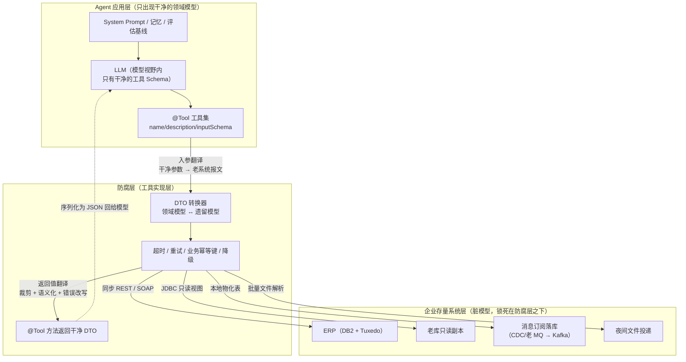
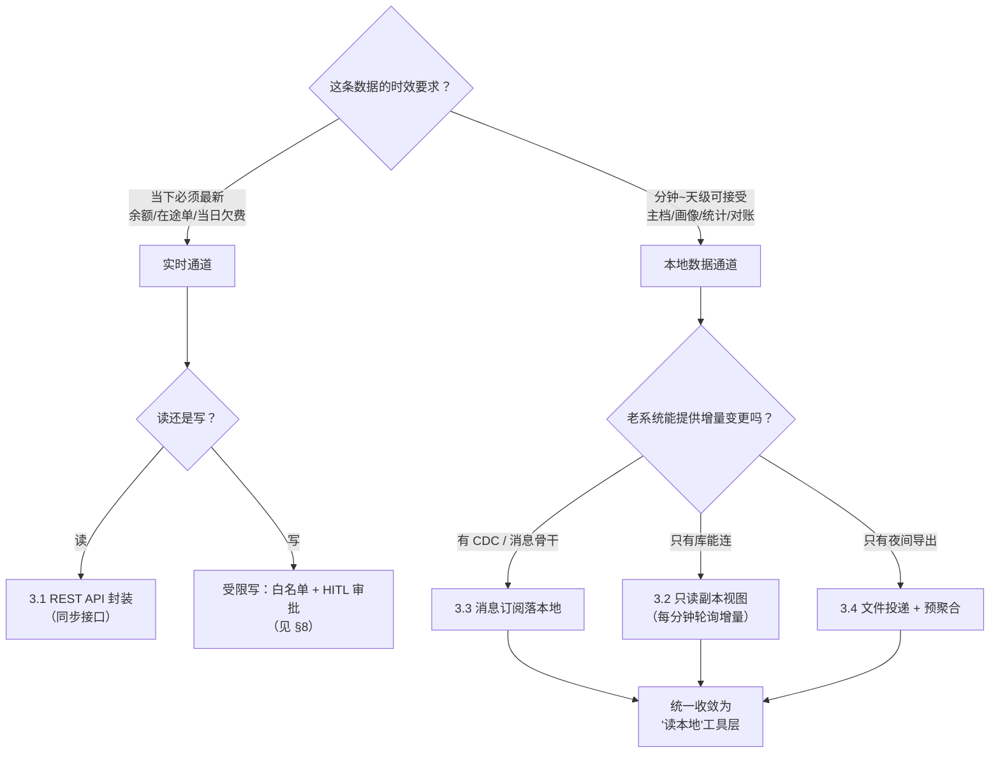
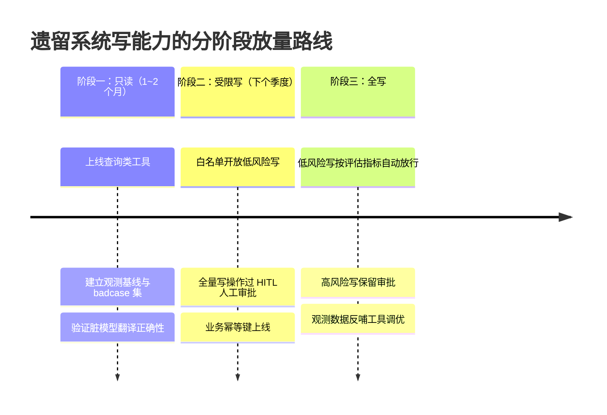
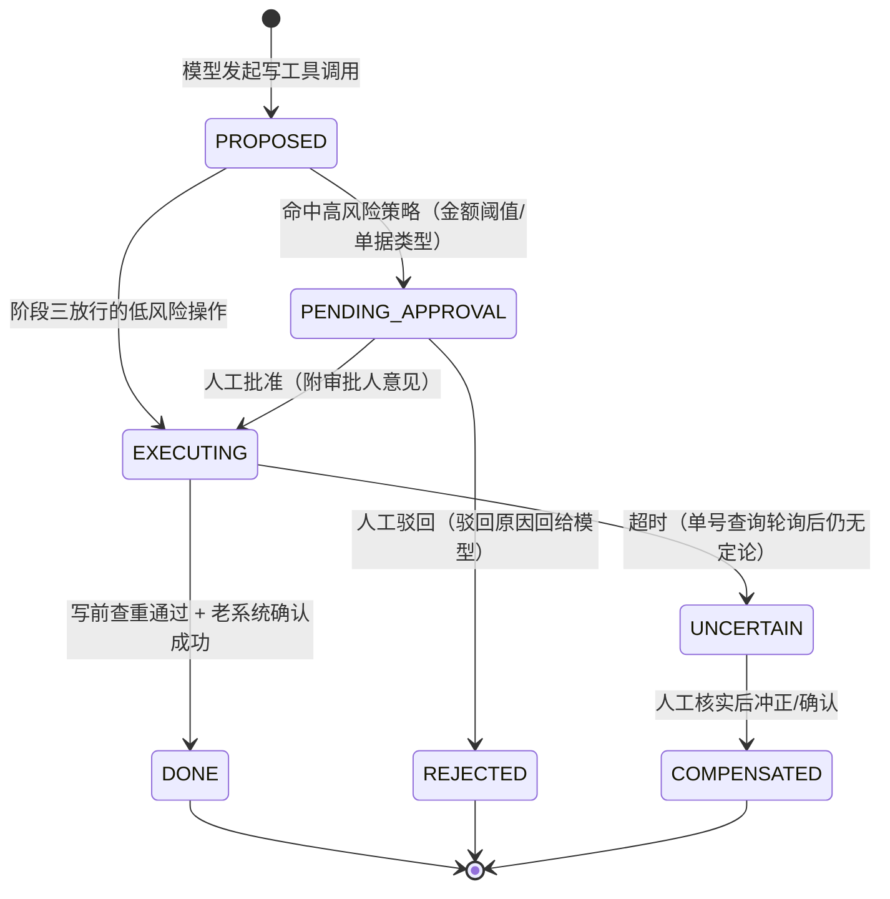

# 15-工具集成与防腐层

> **定位**：本文讲 Agent 接入企业遗留系统（ERP / CRM / 自研老系统）的集成工程。核心论点只有一句话：**企业级 Agent 落地的最大摩擦不在 Agent 本身，而在接存量系统——而 `@Tool` 工具层就是天然的防腐层（Anti-Corruption Layer, ACL）**。全文覆盖：四种集成风格（REST 封装 / DB 只读视图直连 / 消息订阅 / 文件投递）的选型对比、脏模型到干净 DTO 的转换设计、同步老接口的超时兜底与降级读副本与业务幂等键、LLM 轮次延迟预算下的批量 vs 实时取舍、把遗留系统业务语义翻译给模型的工具描述工程、只读→受限写→全写的分阶段接入与 HITL 审批联动。读者画像：正在把 Agent 接入企业存量系统、被老接口折磨的中高级后端 / 平台工程师。前置阅读：[教程 02-SpringAI核心机制/05-工具调用进阶与ToolCallingManager]、[教程 01-WebFlux与响应式编程/06-线程模型与调度器]。

---

## 1. 企业级 Agent 的最大摩擦：不在 Agent，在存量

一个新做出来的 Agent demo，接的是干净的现代服务：OpenAI 兼容接口、REST + JSON、秒级响应、字段语义清晰。把它搬进一家运营了十五年以上的企业，第一周你就会碰到这样的现实：

- **核心系统是十几年前的产物**：ERP 跑在 DB2 上，对外能力是一组 SOAP 接口甚至 Tuxedo 中间件调用；CRM 是外包厂商交付的 PHP 单体；自研系统里业务逻辑埋在三千行的存储过程里。
- **接口文档缺失或失真**：能拿到的文档是五年前的版本，字段语义要靠读代码、问老员工、甚至反推数据来还原。
- **字段名是天书**：自研老系统的表字段是一代代开发留下的拼音缩写——`KHMC`（客户名称）、`KHZT`（客户状态，01=正常 02=冻结 99=注销）、`BJZT`（标记状态）、`DJKSSJ`（单据开始时间）。这些字段会原样出现在接口返回里。
- **同步阻塞、性能羸弱**：核心查询接口是同步的，压测几百并发就雪崩，晚批处理窗口（20:00–02:00）甚至直接停机维护。
- **不支持幂等**：写接口没有幂等键参数，重复提交就是重复入账，而重试在网络抖动下不可避免。
- **改不动**：任何对老系统的改造要走半年流程、动核心账务，业务方不会批准"为了接个 AI 而改核心"。

这些现实决定了：**Agent 接入存量系统的工程本质，不是"调用 API"，而是在 Agent 与老系统之间修一条带减速带、护栏和应急车道的路**。这条路修得好不好，直接决定 Agent 在企业里是"能用"还是"每次用都出事故"。这也是为什么它值得独立成篇，而不是散落在工具调用的语法讲解里。

## 2. 防腐层：工具层为什么天生是 ACL

防腐层（Anti-Corruption Layer）来自 Eric Evans 的《领域驱动设计》：当你需要让新系统与遗留系统协作，而遗留系统的模型又"病态"（命名混乱、语义错位、结构腐化）时，**不要让遗留模型渗透进新系统——在边界处放一层翻译设施，把遗留模型的语义翻译成新系统的干净模型**。

Spring AI 2.0 的工具机制与这层需求是天生契合的，原因在于模型看到的工具边界恰好有三个天然的"翻译点"：

1. **`ToolDefinition` 边界**：模型看到的只有 `name()` / `description()` / `inputSchema()`（`// 实证：ToolDefinition 接口三方法 + builder()，javap spring-ai-model-2.0.0`）。老系统的内部路由、字段名、错误码根本不出现在模型视野里。
2. **工具入参边界**：模型生成的是符合你声明的干净参数 Schema 的 JSON，防腐层把它翻译成老系统需要的任何形态（SOAP envelope、固定宽度报文、URL 拼接、存储过程参数）。
3. **工具返回值边界**：`ToolCallResultConverter` 把方法返回值序列化为 JSON 喂给模型（`// 实证：DefaultToolCallResultConverter.convert() 源码确认走 jsonHelper.toJson 序列化`），所以你在返回给模型之前，有完整的机会做字段裁剪、语义翻译、错误消息改写。

三个边界叠加的结果是：**老系统的脏，可以完全被锁死在 `@Tool` 方法体的实现里**——模型和 Prompt、记忆、评估体系看到的是一套稳定的、人说人话的领域模型。这正是 DDD 说的 ACL，只是这次它服务的消费者不是另一个服务，而是 LLM。



注意图中最关键的一条边：老系统的"脏"通过四种通道进来，但全部终结在防腐层的 `RESIL` 节点上，`BACK` 回到模型侧的永远是干净 DTO。**模型永远不直接触达 legacy 子图里的任何节点**——这就是"防腐"二字的工程含义。

## 3. 四种集成风格的选型

防腐层是"位置"，集成风格是"路怎么修"。企业里可用的通道基本收敛为四种，逐一分析。

### 3.1 REST API 封装：绕过老应用，直连其能力面

如果老系统有任何形态的接口面（REST、SOAP、RPC、甚至 HTTP 页面参数），第一选择是在防腐层里封装它。要点：

- **SOAP/WSDL 也按 REST 思路处理**：防腐层内部用客户端生成或手写报文，对外仍然暴露为语义化工具。模型不需要知道底下是 SOAP envelope。
- **封装粒度做窄**：不把老系统的三十个接口都包成三十个工具（工具过载，见 [教程 10-调优实战与方法论/03-工具调优上：接口设计学 §2]），按"模型的一次业务意图"聚合——"查客户欠费"内部可以串两次老系统调用，但对外是一个工具。
- **老系统接口的鉴权一般是账号密码或静态 Token**：放 `${ENV_VAR}` 占位注入，绝不进配置文件明文，更不进工具参数。

**适用**：老系统能提供同步接口、且接口延迟可容忍（见 §6 预算分析）。
**不适用**：接口只在批处理窗口开放、或单次调用秒级以上且无法优化。

### 3.2 DB 只读视图直连：踩线但极其常用的风格

很多老系统"唯一可用的接口"就是它的数据库。工程上完全禁止碰库不现实，主流做法是**在老库（或其同步出来的副本库）上建只读视图，用最小权限只读账号接入**：

- 视图是防腐的一部分：把 `T_KHXX JOIN T_KHZH JOIN T_BJMX` 的三表 join、字段改名、状态码翻译（`CASE KHZT WHEN '01' THEN 'NORMAL' ...`）都封进视图定义，Java 侧看到的视图列名就是干净的。
- **必须在文档里写明这是踩线风格**：直接读库会绕过老应用里存储过程内的业务规则（比如"已核销单据不显示"），可能读到"技术上正确、业务上错误"的数据。所以每个视图上线前要找老系统的业务负责人核对其语义，并在工具 description 里写明这个视图**不包含**什么。
- 连接层面：老库多是 Oracle/DB2 老版本，往往没有可用的 R2DBC 响应式驱动，现实做法是用 `JdbcTemplate` 这类阻塞客户端 + 调度器搬运（§5.1 讲透），并对只读账号限时限流，防止 Agent 的一次模糊查询拖垮老库。
- 强烈建议接**副本库/备库**而不是生产主库——哪怕数据有分钟级延迟，对 §6 的多数场景够用，且把故障风险从生产摘出去。

**适用**：老系统没有接口、只有库；读多写少的查询类工具。
**不适用**：写操作（绝对禁止 Agent 直写老库）；强一致读（副本有复制延迟）。

### 3.3 消息订阅（事件驱动）：把"实时查询"变成"读本地"

如果企业已有消息骨干（老 MQ、CDC 工具如 OGG/Debezium），最优雅的风格是把老系统的变更事件订阅出来，落到 Agent 侧的本地物化表或缓存：

- Agent 的读工具查的是**本地表**，延迟毫秒级，完全不依赖老系统可用性——老系统夜间停机维护，Agent 照常工作。
- 新鲜度取决于事件链路：CDC 秒级、老 MQ 依赖上游发送纪律、最差也要 T+1。
- 这条路把 §6 里的"批量 vs 实时"决策直接消灭：查询永远读本地，代价是搭建并维护事件链路。
- 具体的 Kafka 落地（消费端幂等、乱序、重放、背压）在 [教程 07-Kafka事件骨干] 系列已有完整展开，本文不重复，只强调与本文相关的两条：**消费落库时同步更新读缓存的 TTL/失效标记**（写工具成功后要能反向失效缓存，见 §6.3）；**事件链路本身是新的运维对象**，要有 lag 监控，事件断流意味着 Agent 在读越来越陈旧的数据而毫无感知。

**适用**：已有消息/CDC 基础设施；读密集、可容忍秒~分钟级延迟。
**不适用**：必须"此刻"的强一致读（余额扣减后立即查询校验这类）；没有事件基础设施且短期建不起来的团队。

### 3.4 文件投递（批量对账）：成本最低、延迟最高的兜底风格

最古老也最稳的通道：老系统夜间批量导出 CSV/定长文件，投到 FTP/SFTP，Agent 侧定时解析入库并预聚合。它的价值常被低估：

- **对老系统零侵入零风险**：不占同步接口容量、不碰生产库连接数，批处理窗口天然允许。
- **对账类任务是刚需**：财务对账、库存核对、日终报表——这类问题本来就要 T+1 数据，文件投递的延迟劣势完全不构成劣势。
- 工程要点在文件侧：字符集（老系统常见 GBK）、定长报文的字段切分、坏行处理与对账总数校验（行数 + 金额合计对不上就整批挂起告警，绝不静默入库）。
- 解析后的数据同样落本地表，Agent 的读工具与 §3.3 共享同一套"读本地"工具层——**对模型而言，消息订阅来的数据和文件来的数据没有区别**，这正是防腐层存在的意义。

**适用**：T+1 对账/报表场景；老系统完全不开放接口。
**不适用**：任何当日时效需求。

### 3.5 选型对比与决策

| 维度 | REST API 封装 | DB 只读视图直连 | 消息订阅（事件驱动） | 文件投递（批量对账） |
|---|---|---|---|---|
| 数据新鲜度 | 实时（受老系统状态影响） | 实时~分钟（副本复制延迟） | 秒~分钟 | T+1 |
| 单次查询延迟 | 中~高（老接口性能） | 低~中（库查询+网络） | 极低（读本地） | 极低（读本地） |
| 对老系统侵入 | 低（只调不改） | 中（占连接、绕过应用逻辑） | 低~中（需开 CDC/发事件） | 零（用现成批处理） |
| 一致性风险 | 老系统挂则工具挂 | 读到绕过业务规则的数据 | 事件断流无感知风险 | 无（数据静止） |
| 适合的操作 | 读 + 受限写 | 仅读 | 读 | 读（对账/报表） |
| 建设成本 | 低~中 | 低 | 高（链路+运维） | 低 |
| 典型坑 | 老接口无幂等/超时雪崩 | 拖垮生产库 | lag 无监控 | 字符集/坏行静默 |

选型不是四选一，而是**按数据域拆开组合**：客户主档走消息订阅落本地，欠费余额走 REST 实时查，日终对账走文件投递，历史流水走只读副本视图。下面的决策树给出单条数据域的判断路径：



这棵树的每个分叉都对应真实约束（时效、读写性、老系统能力），不是风格偏好——这正是它和"架构选型看口味"的本质区别。

## 4. 脏模型 → 干净 DTO：防腐层的核心动作

### 4.1 老系统实体直透的四大罪

最省事的接法是把老系统接口返回的实体类原样作为工具返回值——反例如下（概念代码，演示问题形态，禁止照抄）：

```java
// 反例：老系统实体直透 —— 概念代码（演示问题，禁止照抄）
public record TKhxxRaw(          // 老系统客户信息表实体
    String KH_BH,                // 客户编号，格式 "KH"+7位数字
    String KHMC,                 // 客户名称（拼音缩写字段，模型无法理解）
    String KHZT,                 // 客户状态：01/02/99（魔法值，模型只能瞎猜）
    String DJKSSJ,               // 单据开始时间，格式 "yyyyMMddHHmmss"
    BigDecimal BJZT,             // 标记状态（内部对账字段，业务上不该给模型）
    String NB_SHR,               // 内部审批人工号（安全敏感，直透即泄漏）
    byte[] FJ_NR                 // 附件内容（把二进制塞进模型上下文）
) {}
```

直透的代价是结构性的，四条罪状：

1. **模型无法理解**：`KHMC`、`KHZT` 对模型是天书。模型要么把缩写原文复述给用户（体验崩塌），要么按最可能的语义瞎猜（`KHZT` 猜成"可知状态"？）——这两种失败你在评估集里会看到大量"字段幻觉"病例（归因方法见 [教程 10-调优实战与方法论/00-Agent病理总论 §3]）。
2. **Token 灾难**：老实体动辄三四十个字段，一次工具调用把几百 token 的无关内容灌进上下文，多轮对话里反复累积。上下文预算管理见 [教程 08-架构师进阶/00-上下文工程 §4]。
3. **契约脆弱**：老系统下个迭代把 `KHZT` 改成 `KHZT_DM`，或者给实体加字段——你的 Agent 行为悄悄漂移，而工具 Schema 层面毫无告警。干净 DTO 是防腐层的**版本化契约**，老系统怎么变，翻译层负责消化。
4. **安全泄漏**：`NB_SHR`（内部审批人）、`BJZT`（内部对账标记）这类字段一旦直透，就进入了模型上下文，可能在后续回答里被模型复述给不该看到的人。多租户场景下这是合规事故（[教程 04-企业级架构主干/06-多租户隔离与资源治理 §5]）。

另有一条纯技术红线：**多态/复杂 SDK 对象与老系统私有实体禁止直接依赖 Jackson 默认序列化**。工具返回值最终走 `ToolCallResultConverter` 转 JSON，`record` 型干净 DTO 是 Jackson 最友好的形态；而包含循环引用、多态类型、`byte[]` 的实体，序列化行为要么报错要么产出垃圾。教训与 ChatMemory 持久化翻车是同一族（[附录 05-SpringAI2-API基准/00-Advisor与ChatMemory §2.3]）：**对"对象 → JSON"不要只看编译通过，要做 round-trip 验证**。

### 4.2 正确姿势：翻译器 + 干净 DTO

正例给出完整的防腐层工具实现（`// Spring AI 2.0.0`，包结构对齐 demo01 习惯）：

```java
package demo.demo01.tool;

import java.math.BigDecimal;
import java.time.Duration;
import java.time.LocalDate;
import java.time.ZoneId;
import java.time.format.DateTimeFormatter;

import org.springframework.ai.chat.model.ToolContext;          // 实证：构造 (Map<String,Object>)，getContext()
import org.springframework.ai.tool.annotation.Tool;             // 实证：name()/description()/returnDirect()/resultConverter()，无 value()
import org.springframework.ai.tool.annotation.ToolParam;        // 实证：required()/description()，无 value()
import org.springframework.stereotype.Component;
import org.springframework.web.client.RestClient;               // 实证：spring-web 7.0.x，get()/uri()/retrieve()/body(Class)

import lombok.extern.slf4j.Slf4j;
import reactor.core.publisher.Mono;                              // 实证：reactor-core 3.8.x（Boot 4.1.0 → reactor-bom 2025.0.6）
import reactor.core.scheduler.Schedulers;

/**
 * ERP 客户查询工具 —— 防腐层
 * 对模型暴露：干净参数 Schema + 干净返回 DTO
 * 对老系统隐藏：SOAP/REST 报文、拼音缩写字段、魔法状态值、阻塞细节
 */
@Slf4j
@Component
public class ErpCustomerTools {

    private final RestClient erpRestClient;
    private final CustomerSnapshotRepository snapshotRepo;   // 自研：降级读副本（概念代码，见 §5.2）

    public ErpCustomerTools(RestClient.Builder builder, CustomerSnapshotRepository snapshotRepo) {
        // RestClient.Builder 由 Boot 自动装配可注入；baseAddress 从环境变量注入，禁止硬编码连接串
        this.erpRestClient = builder
                .baseUrl("${ERP_LEGACY_BASE_URL}")
                .build();
        this.snapshotRepo = snapshotRepo;
    }

    @Tool(name = "query_customer_profile",
          description = """
                按客户编号查询客户主档案：名称、客户等级、服务状态、当前信用额度（元）。
                数据来自 ERP，实时查询，若 ERP 暂不可用会返回最近快照并标注数据时间。
                客户编号是 ERP 的 8 位纯数字串（如 30001247）；如果用户只提供了客户姓名，
                应先调用 search_customer_by_name 获取编号，不要猜测编号。
                """)
    public CustomerProfileDto queryCustomerProfile(
            @ToolParam(description = "ERP 客户编号，8 位纯数字字符串", required = true)
            String customerId,
            ToolContext toolContext) {                        // 实证：default call(String, ToolContext) 可接收上下文

        // ① 阻塞客户端包进 boundedElastic：无论本方法最终被哪个线程执行（含流式路径的 EventLoop），
        //    阻塞 IO 都发生在 boundedElastic，见 §5.1 详解
        String rawJson = Mono.fromCallable(() -> erpRestClient.get()
                        .uri("/api/legacy/customer/{id}", customerId)
                        .retrieve()
                        .body(String.class))                  // 实证：ResponseSpec.body(Class<T>)
                .subscribeOn(Schedulers.boundedElastic())     // 实证：Schedulers.boundedElastic()
                .timeout(Duration.ofSeconds(2), readSnapshotFallback(customerId))  // 实证：timeout(Duration, Mono fallback)
                .block(Duration.ofSeconds(3));                // 实证：Mono.block(Duration)

        ErpCustomerRaw raw = ErpCustomerRaw.parse(rawJson);   // 老报文 → 老实体（内部，不出边界）

        // ② 防腐核心动作：脏模型 → 干净 DTO（见 translate 源码说明）
        CustomerProfileDto dto = CustomerProfileTranslator.toDto(raw);

        log.info("客户档案查询完成，客户编号：{}，数据来源：{}", customerId, dto.source());
        return dto;   // ToolCallResultConverter 会将其 JSON 序列化回给模型（实证：DefaultToolCallResultConverter）
    }

    /** 降级通道：ERP 超时后读本地快照副本，并显式标注数据陈旧性 */
    private Mono<String> readSnapshotFallback(String customerId) {
        return Mono.fromCallable(() -> snapshotRepo.findSnapshotJson(customerId, LocalDate.now(ZoneId.of("Asia/Shanghai"))))
                .subscribeOn(Schedulers.boundedElastic())
                .onErrorResume(e -> Mono.just(
                        "{\"error\":\"客户主档服务暂时不可用，且无可用快照。请告知用户稍后重试，不要编造客户信息。\"}"));
    }
}
```

```java
package demo.demo01.tool;

import java.math.BigDecimal;

/**
 * 模型可见的干净领域 DTO：字段名是人说人话，枚举值已翻译，无关字段已裁剪。
 * 返回值同时服务两个消费者：模型（语义化）与人（审计日志可读）。
 */
public record CustomerProfileDto(
        String customerId,          // 保持对外编号语义，而非老库主键
        String customerName,        // KHMC → customerName
        String customerLevel,       // 等级代码 → "GOLD"/"SILVER"/"NORMAL"
        String serviceStatus,       // KHZT 01/02/99 → "ACTIVE"/"FROZEN"/"CLOSED"
        BigDecimal creditLimitYuan, // 单位显式命名，避免模型把分当元
        String source,              // REALTIME / SNAPSHOT（数据来源标注）
        String asOfTime             // SNAPSHOT 时必填：数据截至时间，供模型向用户披露
) {}
```

翻译器 `CustomerProfileTranslator` 是纯函数：`KHZT` 的 `"01"/"02"/"99"` 映射到 `ACTIVE/FROZEN/CLOSED`，`DJKSSJ` 的 `yyyyMMddHHmmss` 解析成标准时间，`NB_SHR`、`FJ_NR` 在这一步被**静默丢弃**。三个工程要点：

- **翻译器必须有单元测试覆盖每个魔法值**，老系统的魔法值字典是防腐层最珍贵的资产，建议独立成常量类并版本化。
- **DTO 字段数遵守"模型够用"而非"接口全量"**：模型回答用户问题用不到的字段不进 DTO（裁剪准则见 [教程 10-调优实战与方法论/03-工具调优上：接口设计学 §4]）。
- **错误也要翻译**：老系统的 `-9` 错误码、`SYS_ERR_0042` 消息，在防腐层改写成模型可行动的中文（"该客户编号不存在，请确认编号是否为 8 位数字"），错误消息工程细则见 [教程 10-调优实战与方法论/04-工具调优下：执行与治理 §3]。

## 5. 同步老接口的现实工程：超时、降级、幂等

### 5.1 为什么阻塞调用必须搬离 EventLoop

这是本文最需要讲透的一个技术点，因为它在纯同步技术栈里不存在，在 WebFlux 技术栈里却是隐蔽的正确性问题：

**Spring AI 的工具执行是阻塞语义的**——`ToolCallback.call(String)` 返回 `String`（`// 实证：接口方法签名`），`ToolCallingManager.executeToolCalls(Prompt, ChatResponse)`（`// 实证：方法签名`）在模型响应返回后同步执行全部工具调用。问题在于**这段同步代码运行在哪个线程上**：

- 同步 `call()` 路径：工具执行在用户请求线程（`reactor-http-nio-*` EventLoop 线程）上；
- 流式 `stream()` 路径：工具执行发生在 Reactor 组装链的信号线程上，同样是 EventLoop 系。

EventLoop 是 WebFlux 的命脉：一个 EventLoop 线程要服务这条连接上的**所有**请求事件。你在 `@Tool` 方法里直接 `restClient.retrieve()`（阻塞 2 秒）或 `jdbcTemplate.query(...)`（阻塞 1 秒），意味着这个 EventLoop 上的全部其他请求——包括别人的 SSE 流式推送——被冻结 2 秒。老系统又恰恰是最容易慢的（压测几百并发就雪崩的那种），于是一次老系统抖动就演变成整个 Agent 服务的雪崩。线程模型基础见 [教程 01-WebFlux与响应式编程/06-线程模型与调度器 §3]。

防御性写法就是 §4.2 代码中的固定组合拳，值得逐行解释：

```java
Mono.fromCallable(() -> erpRestClient.get()...body(String.class))  // 阻塞调用延迟到订阅时执行
    .subscribeOn(Schedulers.boundedElastic())                      // 订阅信号把执行搬到有界弹性线程池
    .timeout(Duration.ofSeconds(2), readSnapshotFallback(id))      // 2 秒未返回则切降级源（不是抛错）
    .block(Duration.ofSeconds(3));                                 // 工具方法需要同步返回值，此处 block 安全：
                                                                   // 当前阻塞的是 boundedElastic 的线程调用方，
                                                                   // 已不在 EventLoop 上
```

`Mono.fromCallable` 的语义是"callable 在订阅时才执行"，`subscribeOn(boundedElastic)` 决定执行线程——两者缺一不可：只写 `fromCallable` 不写 `subscribeOn`，阻塞仍发生在订阅线程（EventLoop）上。`block(Duration)` 在这里不是反模式：工具方法签名决定了你必须同步返回 String，而我们已经把阻塞点搬到了 boundedElastic 上。真正的铁律是**EventLoop 上不发生阻塞 IO**，而不是"禁止 block"——判断标准永远是"当前线程是谁"。

（`// 实证：Mono.fromCallable / subscribeOn / timeout(Duration, Mono) / block(Duration) / Schedulers.boundedElastic() 均为 reactor-core 3.8.x 真实签名`）

### 5.2 超时兜底与降级读副本

超时策略要分层设计，每一层的超时值有确定的推导依据：

| 层 | 超时 | 依据 |
|---|---|---|
| 老系统客户端连接超时 | 500ms | 连接建立应是毫秒级，超了说明老系统已异常 |
| 工具内业务超时（timeout 算子） | 1~2s | 来自 §6 的轮次延迟预算倒推 |
| `block()` 总闸 | 业务超时 + 降级源预算 | 保证工具方法必然在可控时间内返回 |
| LLM 客户端整体 | 60s+ | 模型生成本身就慢，与工具超时无关 |

关键设计是**超时的动作是"切换"而不是"报错"**：`timeout(Duration, fallbackMono)` 让降级成为一等公民。降级源按数据域选择——读副本/快照表（§3.2/3.3 建设的本地数据）、语义缓存、或一个"明确告知失败"的 DTO。最后一种容易被忽视：**当实时源与降级源都不可用时，最危险的输出是模型编造数据**，所以降级 DTO 里要写明"请告知用户服务暂不可用，不要编造"——这是写给模型看的错误消息（呼应 §7）。

降级返回的快照必须携带 `asOfTime`（数据截至时间）并要求模型向用户披露："ERP 实时查询暂不可用，以下是截至今早 08:00 的快照数据"。**用户可以接受旧数据，不能接受被蒙在鼓里的旧数据**——这句话是对账类 Agent 的合规底线。

重试则要克制：对老系统的**读**可以 `retryWhen(Retry.backoff(2, Duration.ofMillis(200)).maxBackoff(Duration.ofSeconds(1)))`（`// 实证：Retry.backoff(long, Duration) / RetryBackoffSpec.maxAttempts / maxBackoff 签名`）；对**写**默认不重试（§5.3），或者只在拿到"明确失败且未入账"的响应时重试。

### 5.3 老系统不支持幂等键：业务幂等键构造

理想世界里，写接口都带 `Idempotency-Key` 头。老系统的现实是：**接口没有幂等参数，网络超时时你无法区分"没收到"和"收到了但响应丢了"**——后者重试就是重复入账。工程上无法给老系统加幂等参数（改不动），妥协方案是**在防腐层构造业务幂等键，把"重试"改造成"查询"**：

1. **构造确定性单号**：`agentTraceId + toolName + bizKey + dateWindow` 拼接成老系统能接收的单据号字段（多数老系统的写接口至少有一个"单据号"字段且对单据号做唯一约束或至少可查）：

```java
// 业务幂等键构造：同一笔业务在 Agent 侧永远生成同一个单号（概念代码：字段拼接策略，单号规则需与老系统确认唯一性约束）
String idemKey = "AG" + toolContext.getContext().get("traceId")   // 复用全链路 traceId，见 [教程 06-TraceId全链路追踪]
        + "-UPD-" + bizKey                                        // 业务主键：如客户编号
        + "-" + LocalDate.now(ZoneId.of("Asia/Shanghai"));        // 日期窗口：跨天允许重做，防止单号池被历史占死
```

2. **写前先查**：提交前用单号查一次老系统"该单是否已存在"——存在就直接返回既有结果，这一步把绝大多数重复提交挡在门外。
3. **超时后不重试、改查询**：写调用超时的处理不是 retry，而是**用同一单号轮询查询**（带次数与总时长上限），直到拿到确定结果；查不到且超过上限，转人工（见 §8）。
4. **留痕**：幂等键、查询轮次、最终结论全部进审计日志（[教程 04-企业级架构主干/03-工具执行可观测与审计 §4]），事后对账时能讲清楚每一笔的来龙去脉。

这不是完美方案——它依赖"老系统单据号可查且唯一"这个前提。接入前必须用真实环境验证这个前提（拿测试单据实测查重行为），不能凭文档假设。

## 6. 批量 vs 实时：LLM 轮次延迟预算

### 6.1 预算怎么算

一次带工具调用的对话轮，用户感知延迟是三段串联：**模型生成工具调用（含首 token 延迟）→ 工具执行 → 模型消化工具结果再生成回答**。假设目标"带一次工具调用的回答 ≤ 6 秒"，预算大致是：

- 模型第一跳（生成工具调用）：1.5~2.5s（含网络与首 token）
- 工具执行：**这是你唯一能直接优化的段**
- 模型第二跳（生成最终回答）：1.5~2.5s

留给工具的只有 **1~3 秒**。如果这轮对话模型连调了两个工具（串行），每个工具预算就只剩 0.5~1.5s。拿这个预算去对照 §3 的老系统现状：一个 500ms~2s 抖动的老接口，单独用都勉强，串两个就必超预算——**这就是"批量 vs 实时"决策的量化依据，它不是架构审美，是算术**。

长任务场景（多轮工具循环、批处理型任务）的完整预算控制与断点恢复，见 [教程 08-架构师进阶/06-长任务持久化与中断恢复 §3]；本节聚焦单轮对话内工具的取舍。

### 6.2 判断准则：哪些必须实时，哪些必须预聚合

**必须实时打老系统的（快且单点）**：

- 主键单点查询：按编号查客户档案、按单号查订单状态——老系统索引点查，毫秒级，预算内。
- 强一致状态读：用户刚提交退款后问"退款成功了吗"——这类"我刚做了个动作，现在什么状态"的问题读副本会答错，只能实时。
- 余额类：欠费、可用额度——业务上"差一分钟都是错"的数据。

**必须走预聚合/缓存/本地的（慢且面广）**：

- 报表与统计：月度对账、按区域汇总销售额——老库大表聚合本身就是秒级到分钟级，实时必炸，且答案不需要秒级新鲜。
- 历史轨迹扫描：客户三年内的全部交互记录——翻历史表是老系统最慢的操作类型。
- 模糊搜索：按姓名/电话找客户——绝不应该实时打到老系统的 `LIKE '%xx%'`，应导向向量检索或搜索服务（[教程 02-SpringAI核心机制/09-模块化RAG与RetrievalAugmentationAdvisor §2]），本地索引随便查。
- 高频重复查询：同一个客户档案一天被问 N 次——语义缓存命中率极高的典型场景（[教程 08-架构师进阶/04-Agent性能优化 §4]）。

一个实用口诀：**"点查实时，面查本地；动作后读实时，平时读本地"**。把它写进工具路由层的文档，让每个新工具的作者自查。

### 6.3 缓存的失效纪律

预聚合/缓存引入一致性问题，两条纪律必须立：

- **写后失效**：本 Agent（或同域其他服务）通过写工具修改了老系统数据，必须同步失效/刷新相关读缓存，否则用户改完数据立刻查询、拿到旧值的体验事故最伤信任。
- **TTL 与新鲜度标注成对出现**：每条缓存数据带 `asOfTime`，工具返回值带 `source`（§4.2 的 DTO 设计正是为此），让模型有能力向用户披露数据新鲜度。缓存kv的过期策略按数据域分别设定（主档小时级、余额不缓存），不搞全局统一 TTL。

## 7. 工具描述：把遗留系统语义翻译给模型

防腐层还有一类"翻译"最容易被漏掉：**向模型翻译**。模型对工具的全部认知来自 `name`、`description`、`@ToolParam` 的 `description`——老系统十几年的业务黑话，必须压缩进这几个字段。对比：

```java
// 坏：把代码注释直接当工具描述——模型拿到的是天书（概念代码，演示反例）
@Tool(name = "getKHXX", description = "获取KHXX信息")
public TKhxxRaw getKHXX(@ToolParam(description = "KH_BH") String khbh) { ... }

// 好：业务语义、值域、前置条件、失败行为全部写给模型（// Spring AI 2.0.0）
@Tool(name = "query_customer_arrears",
      description = """
            查询客户欠费总额（单位：元人民币，含滞纳金）。
            数据来自计费系统，T+1 汇总（每日凌晨批处理），不含当日新增欠费；
            如需当日实时欠费，请改用 query_customer_realtime_balance。
            返回 404 表示编号不存在，应向用户确认编号而不是重试。
            """)
public ArrearsDto queryCustomerArrears(
        @ToolParam(description = "计费系统客户编号，格式为 KH 开头 + 7 位数字，例如 KH0031852", required = true)
        String customerCode) { ... }
```

好的遗留系统工具描述有五个要素，逐条对照：

1. **业务语义，不是表语义**：说"查询客户欠费总额（含滞纳金）"，不说"查询 T_BJMX 表"。
2. **值域与格式**：编号格式（`KH`+7 位数字）、状态枚举翻译后的取值（`ACTIVE/FROZEN/CLOSED`）、金额单位（元）。模型按格式生成参数，格式写得越具体，参数错误率越低。
3. **时效性声明**：T+1 还是实时（§6 的决策结果必须告知模型，否则模型会拿 T+1 数据回答"现在欠多少"）。
4. **工具间的路由提示**："如需当日实时余额请改用 query_customer_realtime_balance"——这就是在 description 里做工具编排引导，模型会遵守。
5. **失败行为**：404 该怎么办、超时降级时 `source=SNAPSHOT` 该如何向用户表述。**写给模型的错误处理指令，和写给程序的一样重要**。

字段级语义的翻译发生在防腐层内部（`KHMC → customerName`），工具描述层的翻译发生在业务意图层（"查询欠费"），两层各司其职。描述质量的系统性方法论（含评测驱动迭代）见 [教程 10-调优实战与方法论/03-工具调优上：接口设计学 §3]。

## 8. 分阶段接入：只读 → 受限写 → 全写（HITL 联动）

写能力是遗留系统接入的风险顶点，必须按阶段放量。这不是敏捷仪式，而是每一步都在为下一步积累**证据**（工具调用的观测数据、badcase 集、审批通过率）：





`UNCERTAIN` 状态（写超时后既没成功证据也没失败证据）是遗留系统写路径特有的状态，处理它的唯一正确方式是挂起转人工，禁止模型自行猜测重试——这正是 §5.3 幂等协议的终态。

HITL 的落地位置必须正确：**Spring AI 的 HITL 不做在 Advisor 里，做在 `ToolCallback` 包装层或 `ToolCallingManager` 装饰器**。下面的包装器示意展示审批门禁怎么挂在防腐层上（审批网关 `ApprovalGateway` 为自研组件，概念代码，交互协议见 [教程 04-企业级架构主干/08-Human-in-the-Loop与审批流 §3]）：

```java
// 概念代码：审批网关接口与包装 ToolCallback（自研组件，展示挂接位置与委托结构）
public interface ApprovalGateway {
    ApprovalTicket submit(WriteProposal proposal);            // 提交审批单（含工具名、参数、风险评级、traceId）
}

/** 审批门禁：装饰器模式包装写工具，读工具原样透传 */
final class ApprovalGateToolCallback implements org.springframework.ai.tool.ToolCallback {

    private final org.springframework.ai.tool.ToolCallback delegate;   // 实证：被装饰的真实 ToolCallback
    private final ApprovalGateway approvalGateway;
    private final WritePolicy writePolicy;                             // 自研：哪些工具/参数规模算高风险

    ApprovalGateToolCallback(org.springframework.ai.tool.ToolCallback delegate,
                             ApprovalGateway approvalGateway,
                             WritePolicy writePolicy) {
        this.delegate = delegate;
        this.approvalGateway = approvalGateway;
        this.writePolicy = writePolicy;
    }

    @Override
    public org.springframework.ai.tool.definition.ToolDefinition getToolDefinition() {
        return delegate.getToolDefinition();   // 实证：ToolDefinition 原样透传，模型侧 Schema 不变
    }

    @Override
    public String call(String toolInput) {
        return call(toolInput, null);
    }

    @Override
    public String call(String toolInput, org.springframework.ai.chat.model.ToolContext toolContext) {
        if (writePolicy.requiresApproval(delegate.getToolDefinition().name(), toolInput)) {
            ApprovalTicket ticket = approvalGateway.submit(
                    WriteProposal.from(delegate.getToolDefinition(), toolInput, toolContext));
            ApprovalDecision decision = ticket.await(java.time.Duration.ofMinutes(15));  // 概念代码：阻塞等待审批（生产实现见下注）
            if (!decision.approved()) {
                // 驳回原因回给模型，让模型能向用户解释并给出替代方案
                return "该操作未获审批通过，原因：" + decision.reason() + "。请勿重试同一操作，可向用户说明情况。";
            }
        }
        return delegate.call(toolInput, toolContext);   // 实证：default call(String, ToolContext) 委托
    }
}
```

生产实现两个注意点：`ticket.await` 的阻塞等待同样必须发生在非 EventLoop 线程上（与 §5.1 同一纪律）；审批等待期间 SSE 流式连接早已关闭，所以真实的 HITL 是**异步任务 + 中断恢复**模型——写提案持久化、审批回调后从检查点恢复执行，完整机制见 [教程 04-企业级架构主干/08-Human-in-the-Loop与审批流 §5] 与 [教程 08-架构师进阶/06-长任务持久化与中断恢复 §4]。

分阶段的**准出标准**要量化：阶段一准出 = 查询工具评估集通过率达标 + 翻译零幻觉病例；阶段二准出 = 审批驳回率低于阈值 + 幂等键对账零重复。指标体系与在线监控离线评估闭环见 [教程 08-架构师进阶/07-数据飞轮与持续改进 §2]。

## 适用场景

- 企业要把 Agent 接入 ERP/CRM/自研老系统，且老系统改不动、文档缺、字段天书。
- Agent 需要读存量数据（档案、余额、流水、报表）或受限写（单据、工单）。
- 团队在规划"Agent 与存量系统"的边界架构，需要一份集成风格选型与防腐层设计依据。
- 老接口同步阻塞、性能羸弱，Agent 技术栈是 WebFlux，需要安全的阻塞调度与降级设计。

## 不适用场景

- 绿地系统（全新微服务、干净 API）：直接按 [教程 04-企业级架构主干/01-微服务拆分与Agent部署] 的服务化方式接入，无需这层翻译成本。
- 纯 MCP 场景：老系统能力已由他人封装成 MCP Server 时，治理重心转为 MCP 网关（[教程 02-SpringAI核心机制/07-MCP协议 §6]），本文的传输层内容可跳过。
- 老系统即将下线被替换：为垂死系统修防腐层不划算，做临时只读视图即可。
- 允许直接改造老系统接口（补幂等键、换 REST）的项目：从源头修比在防腐层绕更值得。

## 总结

1. **企业级 Agent 落地的最大摩擦是接存量系统**，而 `@Tool` 工具层在 `ToolDefinition`、工具入参、工具返回值三个边界上提供了天然的翻译点，是教科书级的防腐层落点。
2. **集成风格按数据域拆开组合**：点查实时走 REST 封装，读密集可订阅事件落本地，对账报表走文件投递，库是唯一通道时用只读副本视图并接受其"绕过业务规则"的风险。
3. **防腐层的核心动作是脏模型 → 干净 DTO**：翻译魔法值、裁剪无关字段、丢弃敏感字段、改写错误消息——模型与人看到的永远是人话。
4. **WebFlux 下的阻塞纪律**：阻塞调用一律 `Mono.fromCallable(...).subscribeOn(Schedulers.boundedElastic())`，超时的动作是"切降级源"而非报错，降级必带 `asOfTime` 向用户披露数据陈旧性。
5. **写能力用业务幂等键驯服**：确定性单号 + 写前查重 + 超时改查询，`UNCERTAIN` 终态只允许转人工。
6. **工具描述是给模型的遗留系统语义词典**：业务语义、值域格式、时效声明、路由提示、失败行为五要素齐备。
7. **写能力分三阶段放量**（只读 → 受限写 → 全写），HITL 挂在 `ToolCallback` 包装层，每阶段以量化指标准出。

> **下一篇预告**：同一套工具防腐层的数据，如何进入观测与审计体系（[教程 04-企业级架构主干/03-工具执行可观测与审计]），以及当工具数量膨胀时如何治理工具集本身（[教程 10-调优实战与方法论/04-工具调优下：执行与治理]）。
