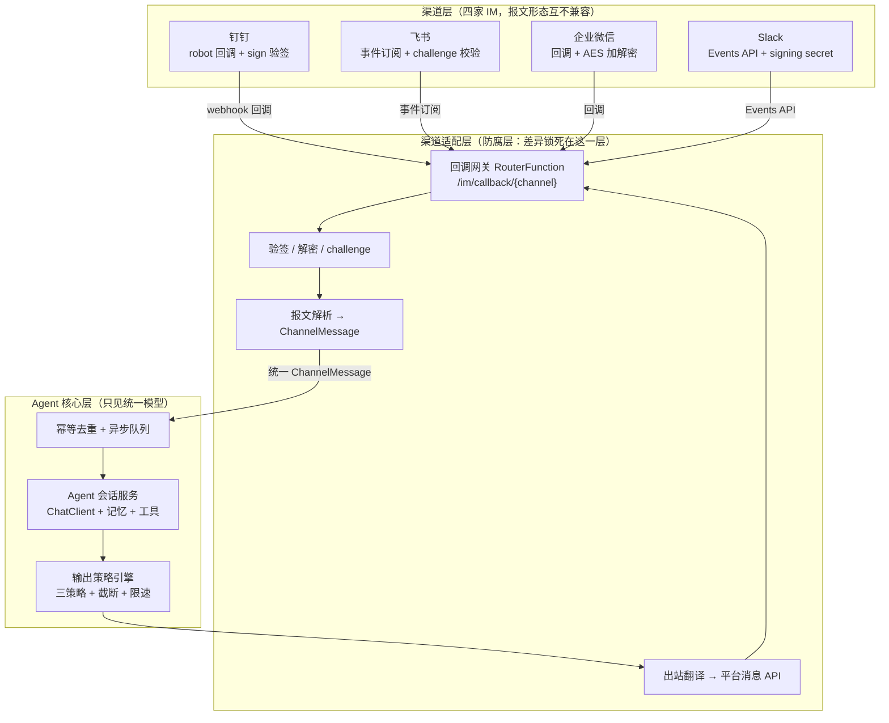
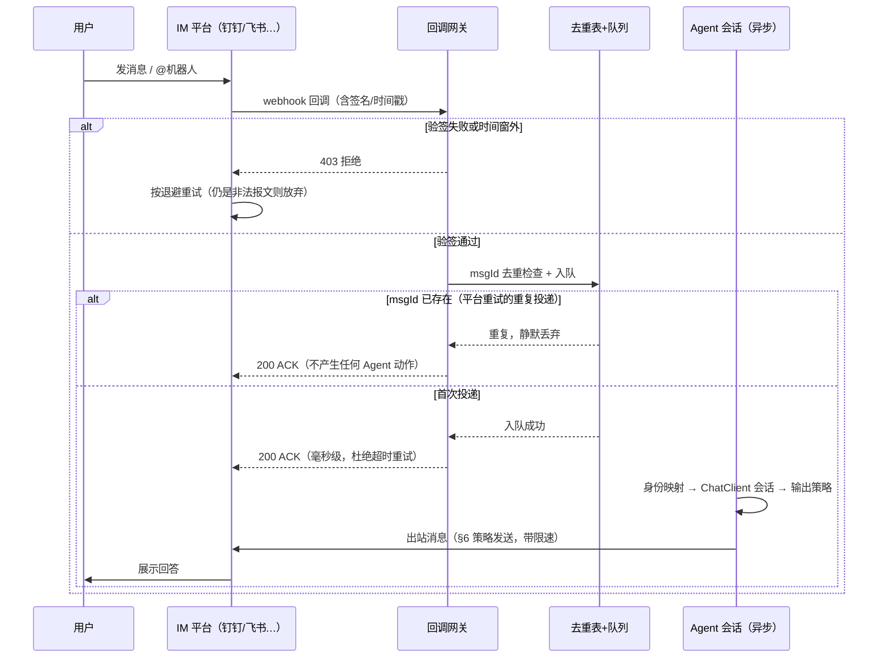
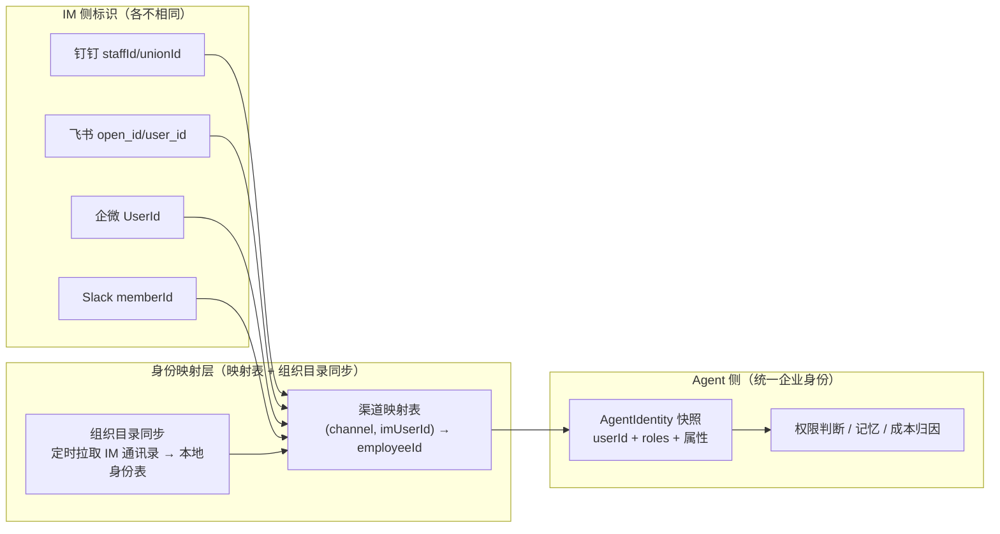
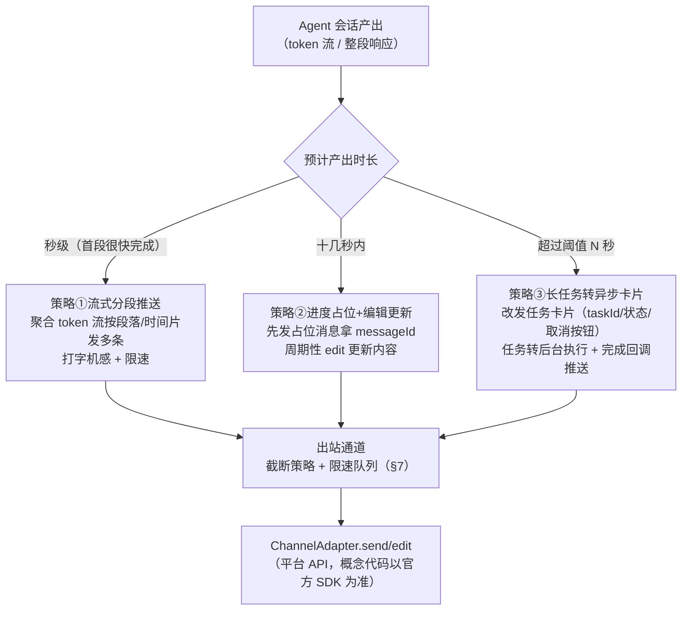

# 16-IM渠道接入工程

> **定位**：本文讲把 Agent 装进企业 IM（钉钉 / 飞书 / 企业微信 / Slack）的完整接入工程——国内企业 Agent 落地最主流的使用面。核心论点只有一句话：**IM 是企业 Agent 事实上的第一入口，但 IM 的交互模型（webhook 回调、秒级 ACK 要求、消息长度限制、无原生流式）与 Agent 的对话模型（流式输出、长输出、多轮状态）存在系统性的 impedance mismatch，接入工程的主线就是用三件套消化这个错位——渠道适配层消形态之差、幂等回调管线消可靠性之差、流式适配三策略消节奏之差**。全文覆盖：IM 作为第一入口的六个理由、mismatch 的六个维度、Channel Adapter 模式与统一消息模型、回调验签与重放防护与消息 ID 幂等去重、IM userId 到企业身份的映射与群聊权限裁剪、流式适配三策略（分段推送 / 占位编辑 / 长任务转异步卡片）、消息截断与限流与会话绑定、多渠道一致性治理。读者画像：正在或将要为 Agent 增加 IM 入口的中高级后端 / 平台工程师。前置阅读：[教程 04-企业级架构主干/04-多页面流式响应与会话管理]、[教程 04-企业级架构主干/15-工具集成与防腐层]、[教程 01-WebFlux与响应式编程/06-线程模型与调度器]。

---

## 1. 为什么 IM 是企业 Agent 的第一入口

给 Agent 配一个 Web 控制台很容易，但企业落地的真相是：**员工不会为你新开一个系统**。同一个 Agent，挂上 Web 工作台三个月只有几十个日活；接入公司钉钉群之后，一周内用的人比过去一个季度都多。这不是产品力差异，是入口的物理位置差异。IM 作为第一入口，有六个结构性理由：

1. **零安装**：钉钉 / 飞书 / 企业微信已经装在每台办公电脑和每部手机上，Agent 接入 IM 的那一刻，分发问题自动消失；Web 端则要发链接、发账号、配 SSO。
2. **零培训**：聊天框人人会用。学习成本从"上线一个新系统"降为"多了一个同事可以问话"，推广阻力差两个数量级。
3. **消息即会话**：IM 消息天然携带发送者、时间、群聊上下文，"发起一次对话"不需要注册、登录、建会话的仪式；Agent 服务的多轮状态可以完全由 IM 侧的会话标识推导（§7.3）。
4. **组织结构免费送**：IM 后台有完整的部门树、汇报线、成员花名册，身份与权限体系不用从零建（§5）。
5. **消息即归档**：IM 会话记录本身就是天然的交互审计与分享载体——用户把 Agent 的回答转发给同事，就是零成本的口碑传播与协作触达。
6. **触达即推送**：Agent 的主动通知（审批待办、长任务完成、告警）在 IM 里有现成通道，不用自建推送系统。

所以企业级 Agent 的入口格局通常收敛为：**IM 承载轻交互（问一句、批一下、收通知），Web 端承载重交互（工作台、报表、调试与评估）**。两者不是替代关系，而是同一 Agent 的两个投射面——这决定了多渠道一致性必须从架构上治理，而不是各做各的（§8）。

## 2. Impedance Mismatch：两套交互模型的系统性错位

"接个 IM 不就是把消息转发给 ChatClient 吗"——这个判断错在低估了两个交互模型的错位。IM 平台为"人与人聊天"设计，Agent 为"人与模型对话"设计，六处错位每一处都能造成线上事故：

| 维度 | Agent 对话模型 | IM 交互模型 | 错位的后果 |
|------|----------------|-------------|------------|
| 输出节奏 | token 级流式（SSE 推流） | 整条消息投递，无原生流式 | 用户盯着"已读"等 30 秒，体验差到弃用 |
| 输出长度 | 受上下文窗口约束，基本无上限 | 单条消息有硬性长度上限（数 KB 量级，各平台不同） | 长回答发送失败或被静默截断 |
| 请求形态 | 前端主动请求，HTTP/SSE 长连接 | 平台反向 webhook 回调你，且要求秒级 ACK | 在回调里同步调 LLM 必超时，触发平台重试风暴 |
| 多轮状态 | 服务端 conversationId 精确管理 | 平台无会话状态概念，线程 / 话题是弱补充 | 多轮对话上下文错绑，答非所问 |
| 富媒体 | 前端组件自由渲染 | 消息卡片模板受限，各平台卡片协议互不兼容 | 一套输出无法四端复用 |
| 失败语义 | 错误直接呈现，可引导重试 | 用户只看到"机器人没反应"；重试由平台在背后发起 | 一次故障放大成 N 条重复消息 + N 次 LLM 调用 |

其中第三、六行的组合是最危险的：**回调超时 → 平台重试 → 每次重试都触发一次新的 LLM 调用 → 成本翻倍 + 用户收到多条重复回答**。这个循环没有任何一层会自动替你打断，必须在接入层用"快速 ACK + 幂等去重"显式斩断（§4）。

三件套与六处错位的对应关系：**适配层**消解形态类错位（请求形态、富媒体），**幂等回调管线**消解可靠性类错位（请求形态、失败语义），**流式适配三策略**消解节奏类错位（输出节奏、输出长度），**会话绑定**消解状态类错位（多轮状态）。后文按此展开。

## 3. 渠道适配层：Channel Adapter 模式

### 3.1 防腐层思想在渠道侧的复用

四家 IM 的回调报文结构、字段命名、签名头位置、卡片协议、用户标识体系（unionId / openId / userId）完全不同。如果让 Agent 核心逻辑直接 import 厂商 SDK 的类型，这些差异会顺着调用链渗透进 Prompt 组装、记忆、评估的每一层——将来新增一个渠道，等于全线改造一遍。解法与 [教程 04-企业级架构主干/15-工具集成与防腐层] 是同一个：**在边界处放一层翻译设施，把外部模型的"脏"锁死在适配器里**。工具层防腐的对象是遗留系统，渠道层防腐的对象是 IM 平台；消费者一个是大模型，一个是 Agent 核心服务。



图中的关键约束只有一条：**core 子图里的任何节点都不 import 厂商 SDK 类型**。四条入站边在 `P` 节点收敛为一个 `ChannelMessage`，一条出站边 `O` 把统一输出翻译回各平台的 API。渠道层的"脏"（签名头位置、报文嵌套、加密方式）全部终结在 adapter 子图。

### 3.2 统一消息模型与适配器契约

统一内部消息模型是一个不可变的 record——它是整个渠道层的"通用语"：

```java
package com.example.agent.im;

import java.util.Map;

/**
 * 渠道层统一消息模型（自研，非 SDK 类型）。
 * 四家 IM 的回调报文都被适配器翻译成它；Agent 核心层只认它。
 */
public record ChannelMessage(
        String channel,           // dingtalk | feishu | wecom | slack
        String msgId,             // 平台消息唯一 ID —— 幂等去重键（§4.2）
        String imConversationId,  // IM 侧会话标识（单聊 chatId / 群聊 openConversationId）
        String threadId,          // 线程 / 话题标识，无则 null（Slack thread_ts、飞书 thread_id）
        String imUserId,          // IM 侧用户标识（配合 §5 身份映射）
        boolean groupChat,        // 是否群聊消息
        String text,              // 提及机器人之后的净文本（剥离 @机器人 前缀）
        Map<String, Object> raw   // 原始报文，仅供适配器层扩展使用，禁止外溢到核心层
) {}
```

每个渠道一个适配器，实现统一契约。契约分两个方向：**入站**（验签 + 解析）与**出站**（发送 + 编辑）：

```java
package com.example.agent.im;

import reactor.core.publisher.Mono;
import org.springframework.web.reactive.function.server.ServerRequest;

/**
 * 渠道适配器契约（自研）。每个 IM 渠道一个实现 Bean。
 * 实证：ServerRequest 来自 spring-webflux 7.0.8（Boot 4.1.0 依赖版本，
 * javap 确认 org.springframework.web.reactive.function.server.ServerRequest）。
 */
public interface ChannelAdapter {

    /** 渠道标识，与 ChannelMessage.channel 一致 */
    String channel();

    /** 验签 / 解密 / challenge 应答数据准备；失败返回 error Mono（网关统一转 403） */
    Mono<Void> verify(ServerRequest request);

    /** 回调报文 → 统一消息；非消息事件（如 URL 验证、机器人事件回执）返回 Mono.empty() */
    Mono<ChannelMessage> parse(ServerRequest request);

    /** 出站：向指定 IM 会话发送一条文本 / markdown 消息 */
    Mono<String> send(String imConversationId, String content);

    /** 出站：编辑已发送消息（支持的平台实现；不支持的平台返回 Mono.error(UnsupportedOperationException)） */
    Mono<Void> edit(String imConversationId, String messageId, String content);
}
```

契约里把 `verify` 与 `parse` 拆成两步是有意的：验签必须在读 body 之前完成（飞书 / Slack 的签名都基于原始字节），而解析可能失败（非消息事件）；两步都返回 `Mono`，全链路无阻塞，符合 WebFlux 铁律。

### 3.3 回调网关：一个端点收编所有渠道

网关用 WebFlux 函数式路由 `RouterFunction` 实现——四家渠道共用 `/im/callback/{channel}` 一个路径前缀，按路径变量分发到对应适配器。所有 API 均已 javap 实证：

```java
package com.example.agent.im;

import java.util.List;

import org.springframework.context.annotation.Bean;
import org.springframework.context.annotation.Configuration;
import org.springframework.http.HttpStatus;
import org.springframework.web.reactive.function.server.RouterFunction;
import org.springframework.web.reactive.function.server.RouterFunctions;
import org.springframework.web.reactive.function.server.ServerRequest;
import org.springframework.web.reactive.function.server.ServerResponse;
import reactor.core.publisher.Mono;

// 实证（javap spring-webflux 7.0.8）：
//   RouterFunctions.route() → Builder；Builder.POST(String, HandlerFunction)
//   RequestPredicates 仅在需要手拼 predicate 时使用；Builder 风格内建 POST(path, handler)
//   ServerRequest.pathVariable(String) / ServerResponse.ok().bodyValue(Object)（7.0 无 syncBody，用 bodyValue）
//   ServerResponse.status(...).build()（build() 继承自 HeadersBuilder）
@Configuration
public class ImCallbackRouter {

    @Bean
    RouterFunction<ServerResponse> imCallbackRoutes(List<ChannelAdapter> adapters,
                                                    CallbackPipeline pipeline) {
        return RouterFunctions.route()
                .POST("/im/callback/{channel}",
                        request -> handle(request, adapters, pipeline))
                .build();
    }

    private Mono<ServerResponse> handle(ServerRequest request,
                                        List<ChannelAdapter> adapters,
                                        CallbackPipeline pipeline) {
        String channel = request.pathVariable("channel");
        return adapters.stream()
                .filter(a -> a.channel().equals(channel))
                .findFirst()
                .map(adapter -> adapter.verify(request)
                        // 验签通过 → 解析 → 进管线 → 秒级 ACK（管线内部异步，见 §4.3）
                        .then(adapter.parse(request))
                        .flatMap(pipeline::accept)
                        .then(ServerResponse.ok().bodyValue(Map.of("code", 0)))
                        .onErrorResume(VerifyException.class,
                                e -> ServerResponse.status(HttpStatus.UNAUTHORIZED).build()))
                .orElseGet(() -> ServerResponse.badRequest().build());
    }
}
```

`VerifyException` 是自研异常类型；`Map.of` 是 JDK API。注意整个 handler 没有一行阻塞代码：验签是纯 CPU 计算（对原始字节的 HMAC，可在 EventLoop 上执行），body 解析与下游管线全部是 `Mono` 组合。

### 3.4 单渠道适配器骨架（以钉钉为例）

适配器内部才是厂商 SDK 的领地。钉钉 / 飞书的 SDK 不在本项目 Maven 仓库中，以下为**概念代码（以官方 SDK 为准）**——API 形状可能随 SDK 版本不同，签名算法务必以官方文档为准：

```java
// 概念代码（以官方 SDK 为准）：钉钉机器人回调适配器骨架
// 验签：钉钉对 timestamp + "\n" + appSecret 计算 HMAC-SHA256，签名放 header 的 sign 字段；
//       timestamp 超过 1 小时拒绝。具体算法以钉钉开放平台官方文档为准。
@Component
class DingTalkChannelAdapter implements ChannelAdapter {

    @Value("${DINGTALK_APP_SECRET}")  // 密钥一律来自环境变量，禁止硬编码
    private String appSecret;

    @Override
    public String channel() { return "dingtalk"; }

    @Override
    public Mono<Void> verify(ServerRequest request) {
        // 概念代码：取 header 的 timestamp 与 sign，用 appSecret 计算 HMAC-SHA256 比对；
        // 同时校验 timestamp 在时间窗内（防重放，§4.1）。算法以官方文档为准。
        return Mono.fromRunnable(() -> { /* HMAC 校验 + 时间窗校验 */ });
    }

    @Override
    public Mono<ChannelMessage> parse(ServerRequest request) {
        // 概念代码：bodyToMono(Map.class) 后按钉钉回调报文结构抽取
        // msgId / conversationId / senderStaffId / content.text，剥离 @机器人 前缀；
        // URL 验证请求（check_url）在此直接应答并返回 Mono.empty()。
        return request.bodyToMono(java.util.Map.class)
                .map(body -> toChannelMessage(body));   // 概念代码：报文翻译
    }

    @Override
    public Mono<String> send(String imConversationId, String content) {
        // 概念代码：WebClient 调钉钉 OA message / robot 群消息 API，返回平台 messageId。
        // 具体端点与鉴权（accessToken 获取与缓存）以官方 SDK 为准。
        return Mono.empty();
    }

    @Override
    public Mono<Void> edit(String imConversationId, String messageId, String content) {
        return Mono.error(new UnsupportedOperationException(
                "钉钉机器人消息编辑能力以官方文档为准；不支持时三策略引擎自动降级（§6）"));
    }

    private ChannelMessage toChannelMessage(java.util.Map<String, Object> body) {
        return new ChannelMessage("dingtalk",
                (String) body.get("msgId"),
                (String) body.get("conversationId"),
                null,
                (String) body.get("senderStaffId"),
                Boolean.TRUE.equals(body.get("conversationType") != null
                        && "group".equals(body.get("conversationType"))),
                stripMention((String) body.get("text")),
                body);
    }

    private String stripMention(String text) { /* 剥离 @机器人 前缀 */ return text; }
}
```

飞书 / 企业微信 / Slack 的适配器骨架同构，差异只在三处：验签方式（飞书 encrypt key + challenge，企微 AES 加解密，Slack signing secret）、报文字段路径、出站 API。它们被适配器契约锁在实现类内部，核心层对此无感知。

## 4. 回调安全与幂等：秒级 ACK 下的异步管线

### 4.1 三道安全闸门

**闸门一：验签**。四家平台的机制不同，但抽象后只有两种模式：**timestamp + sign**（平台把时间戳与签名放在 header / 报文里，你用共享密钥重算 HMAC 比对，钉钉 / Slack 属此类）与 **token 回显 / 密钥解密**（首次配置时平台发一个 challenge 或加密串，你用配置的 token / AES key 回显或解密以证明 URL 归属，飞书 / 企微属此类）。本篇不展开各家的具体签名算法——它们各有字节序、编码、密钥层级差异，**一律以官方文档为准**；要记住的是通用原则：验签材料取自原始请求字节、验签失败快拒绝（403）、密钥只从环境变量读。

**闸门二：重放防护**。攻击者截获一条合法回调后原样重发，就是重放攻击。通用解法是 **nonce 去重 + 时间窗**：报文里的 timestamp 与服务器时间偏差超过窗口（一般 5 分钟量级）直接拒绝；同时在去重表里记录报文 nonce（或直接复用消息 ID，§4.2），窗口内重复出现即拒绝。时间窗与去重表是互补的：前者拦"老消息"，后者拦"新重复"。

**闸门三：快速 ACK + 异步处理**。IM 平台对回调有秒级超时（各家 3～5 秒不等），超时即视为投递失败并按退避策略重试。因此**回调线程里绝对禁止做 LLM 调用**——一次模型调用轻松超过 10 秒，必然超时。正确的形状是：回调处理只做"验签 → 去重 → 入队 → 返回 ACK"四件事，微秒到毫秒级完成；Agent 会话由独立消费端异步执行。

### 4.2 幂等去重：重试风暴的解药

即使 ACK 很快，平台侧的网络抖动仍会造成同一消息的多次投递。没有去重的话，每次重复投递都会触发一次 LLM 调用并向群里发一条重复回答——这就是第 2 节说的重试风暴。解药朴素而有效：**以平台消息 ID 为幂等键的去重表**。

```java
package com.example.agent.im;

import java.util.Map;
import java.util.concurrent.ConcurrentHashMap;
import java.util.concurrent.TimeUnit;

import org.springframework.stereotype.Component;

/**
 * 消息 ID 幂等去重。单机 demo 用 ConcurrentHashMap；
 * 生产多实例部署必须替换为 Redis SETNX + TTL（响应式客户端），保证集群级唯一。
 * 键 = channel + ":" + msgId，值 = 首次见到的时间戳。
 */
@Component
public class MsgIdDeduplicator {

    private static final long WINDOW_MS = TimeUnit.MINUTES.toMillis(10);

    private final Map<String, Long> seen = new ConcurrentHashMap<>();

    /** 首次出现返回 true；窗口内重复出现返回 false（调用方直接 ACK 丢弃） */
    public boolean firstTime(String channel, String msgId) {
        long now = System.currentTimeMillis();
        seen.values().removeIf(t -> now - t > WINDOW_MS);   // 滑动窗口清理
        return seen.putIfAbsent(channel + ":" + msgId, now) == null;
    }
}
```

去重表的时间窗要略大于平台的**最大重试跨度**（平台从首次投递到最后一次重试的时间区间）：窗口太短，平台晚到的重试会穿透成重复消息；太长只是多占一点内存。各平台的退避间隔与总时长不同，以官方文档为准后按此原则配置。

### 4.3 异步管线：从回调到 Agent 会话

管线把"收"与"处理"彻底解耦：入站侧把消息推进一个 `Sinks.Many` 队列即返回；消费侧从队列拉取，逐条执行 Agent 会话。`Sinks` 与下列算子均已 javap 实证：

```java
package com.example.agent.im;

import java.time.Duration;

import com.example.agent.core.AgentSessionService;
import org.springframework.stereotype.Component;
import reactor.core.publisher.Flux;
import reactor.core.publisher.Mono;
import reactor.core.publisher.Sinks;
import reactor.util.retry.Retry;

// 实证（javap reactor-core 3.8.6，Boot 4.1.0 依赖版本）：
//   Sinks.many().unicast() → Sinks.Many<T>；tryEmitNext / tryEmitComplete / asFlux()
//   Flux.concatMap(Function) / onErrorResume(Function) / retryWhen(Retry)
//   Retry.backoff(long, Duration)
@Component
public class CallbackPipeline {

    private final MsgIdDeduplicator deduplicator;
    private final IdentityMappingService identityMapping;   // §5
    private final AgentSessionService agentSession;         // Agent 核心会话（教程 04/04 的会话服务）
    private final OutputStrategyEngine outputEngine;        // §6 三策略引擎

    // 单机 demo 用 unicast 串行消费；生产用 Kafka / 响应式 Redis 队列并按渠道并行分区
    private final Sinks.Many<ChannelMessage> queue = Sinks.many().unicast().onBackpressureBuffer();

    public CallbackPipeline(MsgIdDeduplicator deduplicator,
                            IdentityMappingService identityMapping,
                            AgentSessionService agentSession,
                            OutputStrategyEngine outputEngine) {
        this.deduplicator = deduplicator;
        this.identityMapping = identityMapping;
        this.agentSession = agentSession;
        this.outputEngine = outputEngine;
    }

    /** 回调网关的入口：去重 → 入队。绝不在此做 LLM 调用。 */
    public Mono<Void> accept(ChannelMessage msg) {
        if (!deduplicator.firstTime(msg.channel(), msg.msgId())) {
            return Mono.empty();          // 重复投递：静默丢弃，照常 ACK
        }
        queue.tryEmitNext(msg);
        return Mono.empty();
    }

    /** 应用启动时启动消费端：身份映射 → Agent 会话 → 输出策略。 */
    @org.springframework.context.annotation.PostConstruct
    void startConsumer() {
        queue.asFlux()
                .concatMap(this::processOne)              // 串行消费，保序（多实例时按会话键分区保序）
                .onErrorResume(e -> {
                    // 单条失败不拖垮队列；失败已在上游记录与告警（教程 04/02 全链路可观测性）
                    return Mono.empty();
                })
                .subscribe();
    }

    private Mono<Void> processOne(ChannelMessage msg) {
        return identityMapping.resolve(msg)               // §5：imUserId → AgentIdentity，群聊取提问者
                .flatMap(identity -> agentSession.start(identity, msg.imConversationId(), msg.text()))
                .map(response -> outputEngine.deliver(msg, response))   // §6：按响应特征选流式策略
                .retryWhen(Retry.backoff(2, Duration.ofMillis(500)))
                .then();
    }
}
```

`Sinks.Many` 的 `onBackpressureBuffer()` 与 `unicast()` 均已实证；`@PostConstruct` 是 Spring 常规注解。生产形态下这个内存队列要替换为 Kafka（持久化 + 多实例分区），队列只换实现，管线的形状不变——回调侧永远是"验签 → 去重 → 投递 → ACK"。

整个回调链路的时序，含验签失败与重复投递两条分支：



这张图里最值得盯住的是 **"200 ACK（不产生任何 Agent 动作）"** 分支：重复投递被去重表拦截后，系统对平台仍然返回成功——因为对平台而言这条消息确实投递成功了；如果返回失败，平台只会继续重试，风暴永不停歇。**对重复报文回 ACK、对非法报文回 403**，这两个状态码的语义不能搞反。

## 5. 身份映射与群聊权限

### 5.1 IM 用户身份 → 企业身份

IM 给你的是一个渠道维度的用户标识（钉钉 staffId / unionId、飞书 open_id / user_id、企微 UserId、Slack member ID），而 Agent 的权限、记忆、成本归因全部锚定在企业身份上。[附录 08-Agent安全深度/05-用户身份联邦与企业权限传导] 已经定义了归一层模型：**会话绑定 `AgentIdentity` 快照（userId + roles + 属性）**。渠道层要补的是最后一段映射：



两个工程要点：

**映射优先于首次提问**。权限判断在消息进入 Agent 之前就要发生，不能等"用户第一次提问时懒建立映射"。标准做法是组织目录定时同步（IM 管理端通讯录 API 拉取，增量 + 全量兜底），把 (channel, imUserId) → employeeId 的映射表填好；同步失败的人出现在群里提问时，按"无身份"处理并引导联系管理员，而不是给一个默认身份。

**映射表的清理跟随组织变动**。员工离职后 IM 账号会被回收，但映射表不会自动删除——失效映射要靠同步任务显式失效，否则离职员工的会话记忆与权限残留会变成合规问题（呼应 [教程 04-企业级架构主干/05-历史记录持久化与合规] 的留存与删除策略）。

### 5.2 群聊 @提及路由与权限裁剪

群聊是 IM 接入里权限最容易失控的场景，三条铁律：

**路由铁律**：群聊中只响应 @提及（或配置的关键词前缀），否则机器人在活跃群里会无限循环对话。@提及由平台的回调报文显式标记（各平台的 mention 字段不同，适配器负责解析成 `ChannelMessage.text` 前的净文本）。

**身份铁律**：**以提问者的身份为准，永远不用机器人自己的身份**。机器人通常持有"服务账号"的满权限——如果用它去回答群里任何人的问题，等于向全员开放了服务账号的全部数据面，这是最典型的提权漏洞。正确形状是：回调报文携带提问者 imUserId → 映射到提问者的 AgentIdentity → 一切权限判断、记忆读写、成本记账都挂在这个身份上。

**裁剪铁律**：涉及检索的回答，必须在检索层按提问者权限做文档级裁剪，而不是检索完再靠模型"自觉"不引用无权内容。[附录 19-向量数据库与检索工程/02-检索权限与文档级裁剪] 给出了检索内强制裁剪（filter-during）与后置校验兜底的完整机制（该篇立场：检索后再过滤是结构性错误，后置校验只在粗粒度谓词已先行裁剪的前提下作为增量兜底）；渠道层唯一要做的是**把 AgentIdentity 传进检索上下文**（通过 ChatClient 的 toolContext 或 Advisor 上下文显式传递——WebFlux 里不用 ThreadLocal，上下文随 `ChannelMessage` → `AgentIdentity` 的参数链显式流动）。

机器人自身的写操作（代用户订会议室、建工单）另有一套约束：优先 on-behalf-of 语义（以提问者身份、提问者权限执行并留审计）；无法 on-behalf-of 的用服务账号 + 最小权限 + 全量审计，且**写操作必须过 HITL 审批**——IM 恰好是审批流的最佳载体，审批卡片与审批回调走同一套验签幂等管线，详见 [教程 04-企业级架构主干/08-Human-in-the-Loop与审批流]。

## 6. 流式适配三策略

IM 没有原生流式，但"用户等 30 秒没有任何反馈"是不可接受的。解法不是发明流式，而是**把 Agent 的输出节奏翻译成 IM 能表达的三种形态**。三策略由一个统一的输出策略引擎（`OutputStrategyEngine`）调度，选择依据是响应的时长特征：



### 6.1 策略①：流式分段推送

把 ChatClient 的 token 流按时间片聚合成段，逐段发出，模拟"对方在打字"的节奏。分段聚合用 `bufferTimeout`（元素数与时间双触发），节流用 `delayElements`——两者均已实证：

```java
package com.example.agent.im;

import java.time.Duration;
import java.util.List;

import org.springframework.stereotype.Component;
import reactor.core.publisher.Flux;

// 实证（javap reactor-core 3.8.6）：
//   Flux.bufferTimeout(int, Duration) → Flux<List<T>>
//   Flux.delayElements(Duration)：相邻元素发射间隔不小于给定时长
//   String.join(CharSequence, Iterable<? extends CharSequence>) 为 JDK API
@Component
class SegmentedPushStrategy {

    private static final int MAX_CHARS_PER_MSG = 300;   // 单段字符上限，避免单条过长
    private static final Duration MIN_INTERVAL = Duration.ofMillis(800); // 段间隔，防触发平台频控

    /** token 流 → 分段推送。返回完整文本（供策略层留档与记忆写入） */
    Flux<String> stream(Flux<String> tokenStream) {
        return tokenStream
                .bufferTimeout(MAX_CHARS_PER_MSG, Duration.ofSeconds(2))  // 双触发聚合
                .map(chunk -> String.join("", chunk))
                .concatMap(seg -> Flux.just(seg)
                        .delayElements(MIN_INTERVAL));    // 相邻两段强制间隔，被动限速
    }
}
```

两个经验参数：段间隔（MIN_INTERVAL）要**先查平台的主动发消息频控配额**再定——群机器人通常有每分钟条数上限，800ms～1s 的间隔是常见的安全档；单段字符上限则要给截断策略（§7.1）留出余量。策略①的代价是消息刷屏——长回答拆十几条消息在群里体验很差，所以它适合"答案本来就短"的场景，长输出应该交给策略②或③。

### 6.2 策略②：进度占位 + 编辑更新

飞书与 Slack 支持**编辑已发送消息**（飞书 PATCH 消息接口、Slack `chat.update`，具体 API 以官方文档为准；钉钉 / 企微的机器人消息编辑支持情况不同，适配器以 `UnsupportedOperationException` 声明能力缺失）。利用编辑能力可以做体验最接近真流式的方案：

1. 先发一条占位消息（"正在思考…"），拿到平台 `messageId`；
2. Agent 流式产出的过程中，按固定节奏（如每 2～3 秒）把**累积文本**编辑回这条消息；
3. 完成时做最后一次编辑（可追加"展开全文"链接）。

节奏控制的形状与策略①同构：`tokenStream.bufferTimeout(...).scan(累积文本).concatMap(text -> adapter.edit(...).delayElements(...))`——`scan` 与 `edit` 的组合把"增量 token"翻译成"全量快照编辑"，因为平台的编辑接口只接受全量内容。策略②的关键风险是**编辑频率超限**（平台对消息更新同样有频控），所以编辑间隔宁长勿短，且流结束时必须保证最后一次编辑落地（否则用户停在半截答案上）。

### 6.3 策略③：长任务转异步卡片

超过阈值的任务（深度检索报告、批量数据处理、多 Agent 协作）不该让任何一种"消息内流式"硬扛。正确形状是把**交互与执行解耦**：

1. 阈值触发（首段 N 秒未完成，或任务声明了长耗时特征）后，立即把占位消息**升级为任务卡片**：含任务 ID、状态（运行中）、预计时长、取消按钮；
2. 任务本身转交后台执行器，带检查点持久化与预算控制——这正是 [教程 08-架构师进阶/06-长任务持久化与中断恢复] 的长任务管线，渠道层只负责把任务 ID 展示出来；
3. 完成后通过出站通道推送结果消息（或更新卡片状态为"已完成"）；失败时推送失败原因与重试入口；
4. 卡片上的按钮点击（取消 / 重试 / 审批）是**新的回调事件**，走与消息完全相同的验签 → 去重 → 异步管线，不需要任何特殊通道。取消按钮的后端就是长任务的中断 API；审批按钮则进入 [教程 04-企业级架构主干/08-Human-in-the-Loop与审批流] 的审批工作流。

策略③把 IM 消息从"内容的容器"升级为"任务的遥控器"——这是 IM 卡片体系真正的架构价值，也是长任务场景下唯一不牺牲可靠性的策略：消息丢了可以重发卡片（任务还在跑），进程崩了可以恢复（有检查点），用户关掉 IM 也不影响执行（异步解耦）。

### 6.4 选择逻辑与降级链

三策略不是三选一的静态配置，而是**运行时按响应特征选择 + 按平台能力降级**。策略引擎的判定顺序：任务声明长耗时或首段超阈值 → 策略③；平台支持编辑 → 策略②；否则 → 策略①。平台能力不支持时的降级链：策略②在钉钉上自动降为策略①（编辑不可用），策略①在群聊刷屏严重时升级为"只发首段 + 展开全文链接"（§7.1）。降级决策在适配器能力声明上做（§8 的能力协商），策略引擎不写任何 if-else 平台名——**新增渠道时策略引擎零改动**。

## 7. 失败与边界

### 7.1 消息长度截断与"展开全文"

单条 IM 消息有硬性长度上限（各平台数百到数千字不等，以官方文档为准），而 Agent 的长报告必然超限。截断策略不是"砍掉后半截"这么简单，而是**三段式**：

1. **正文放摘要**：超限时推送前 K 个自然段 + 明确的截断标记（"内容较长，已截断"），绝不产生语法上戛然而止的半句话；
2. **全文去 Web**：附"展开全文"链接，指向 Web 端的同一会话——`${WEB_BASE}/chat/{conversationId}`（URL 基址从环境变量读）。Web 端按 conversationId 定位同一会话的完整输出（[教程 04-企业级架构主干/04-多页面流式响应与会话管理] 的会话模型保证了 Web 与 IM 共享同一个 conversationId 体系，这是链接能成立的架构前提）；
3. **表格与代码块特殊处理**：Markdown 表格截断会丢行对齐、代码块截断会失去可运行性——这两类内容超限时整块替换为"完整表格/代码见 Web 端"的占位说明，不做行内截断。

### 7.2 IM 限流：被动限速 + 出站队列

IM 平台对**主动发消息**（机器人 → 用户方向）有严格频控，且 Agent 的输出策略（分段推送）天然放大出站消息量。防线两层：

**被动限速**：出站通道强制节流。策略①里的 `delayElements(MIN_INTERVAL)` 就是限速的第一道；对群发、广播类操作再加更严的配额。节流必须用响应式算子实现（`delayElements` 不阻塞线程），禁止 `Thread.sleep`。

**出站队列**：所有出站消息进每渠道一条 FIFO 队列，消费端串行发送并对齐平台配额；出站失败用指数退避重试。串行 + 节流的组合形状：

```java
// 出站队列消费端骨架（每渠道一个）。实证：concatMap / delayElements / retryWhen(Retry.backoff)
outboundEvents                                     // Flux<OutboundMessage>，每渠道一个 Sinks.Many 队列
        .concatMap(msg -> adapter.send(msg.conversationId(), msg.content())
                .retryWhen(Retry.backoff(3, Duration.ofSeconds(1)))
                .onErrorResume(e -> { recordDeadLetter(msg, e); return Mono.empty(); }))
        .delayElements(Duration.ofMillis(300))     // 相邻出站间隔，对齐平台频控配额
        .subscribe();
```

死信处理（`recordDeadLetter`，自研）保证反复失败的消息不无限占用队列——重试耗尽后落库告警，而不是堵住后面的消息。

### 7.3 会话上下文绑定

多轮状态锚定在 conversationId 上（[教程 04-企业级架构主干/04-多页面流式响应与会话管理]），渠道层的职责是把 **IM 侧的会话标识映射成 conversationId**，规则要显式定义：

- **单聊**：`conversationId = hash(channel + imUserId)` 或直接映射——单聊天然一人一会话；
- **群聊**：`conversationId = hash(channel + imConversationId + threadId)`——群里多个真人共享同一个群会话（这正是群聊的协作语义）；有线程 / 话题能力的平台（Slack thread_ts、飞书话题）按线程分会话，没有的按群分；
- **跨天 / 隔离策略**：同一会话是否跨天延续由业务定，但要与记忆的摘要与衰减策略（三层记忆架构）对齐，避免一个群聊会话无限膨胀。

映射完成后，`ChatMemory.CONVERSATION_ID` 参数把 conversationId 传给记忆体系——与 Web 端用的是同一套参数、同一个记忆仓库。由此带来的安全语义是：**IM 会话与 Web 会话天然隔离**（标识体系不同，映射不出同一个 conversationId），同一用户在两个渠道是两个独立上下文——这是 §8 一致性治理的边界基础。

## 8. 多渠道一致性

同一个 Agent 同时挂 IM 四端 + Web 端时，一致性治理有三个层面：

**答案一致性（最重要）**：Prompt、工具、检索、记忆策略只有一套，渠道层只做"形状"适配（流式策略、截断、格式降级），**严禁为渠道分叉出四套 Prompt**——否则评估基线失效、badcase 无法归因、每次 Prompt 调优要改四处。判断标准很简单：如果把某个渠道的适配器下线，Agent 的答案内容不应该有任何变化，只有展示形态变化。

**能力协商**：各平台能力不同（markdown 支持、消息编辑、交互卡片、长度上限），由适配器声明 `MessageCapabilities`，输出层按能力降级：

```java
/** 平台能力声明（自研）：输出层据此做格式降级与策略降级 */
public record MessageCapabilities(
        boolean markdown,
        boolean messageEdit,
        boolean interactiveCard,
        int maxMessageLength
) {
    public static final MessageCapabilities FULL =
            new MessageCapabilities(true, true, true, 10_000);
    public static final MessageCapabilities PLAIN =
            new MessageCapabilities(false, false, false, 4_000);
}
```

降级链的形状是确定的：markdown → 纯文本（表格转缩进列表）；编辑更新 → 分段推送；交互卡片 → 文本 + 回复指令（"回复『取消 1234』取消任务"）。每条降级路径都是可测试的确定性映射，不依赖模型行为。

**归因一致性**：`ChannelMessage.channel` 必须贯穿到观测层——把渠道作为属性挂进 Observation（[教程 04-企业级架构主干/02-全链路可观测性] 的属性体系），成本按渠道归因、效果按渠道对比（IM 用户的提问风格与 Web 用户显著不同，评估集要按渠道分层采样）。没有渠道归因，你就无法回答"哪个渠道的 Agent 体验在拖后腿"。

## 9. 适用场景与不适用场景

**适用场景**：

- 企业已全员覆盖某一家 IM，Agent 的主要交互是轻量问答、审批、通知与查询；
- 需要移动端触达与主动推送（值班告警、任务完成提醒）；
- 希望借 IM 群聊实现协作式使用（群里 @机器人、答案全员可见、讨论留痕）；
- 已有 Web 端 Agent，想低成本扩大使用面——IM 接入是所有推广手段里投入产出比最高的一个。

**不适用场景**：

- 重交互场景（复杂表单、多面板调试、可视化对比）——IM 的卡片协议承载不了，应做 Web 端；
- 对逐 token 流式有强诉求的场景——IM 的分段 / 编辑模拟终究是秒级颗粒度，追求打字机级体验请用 Web + SSE；
- 数据高度敏感、合规要求私有化且无法采购 IM 专属版 / 私有化部署的环境——公有 IM 的回调链路意味着消息内容出内网，这一条必须在立项时评估而不是接入后补救；
- 高频结构化操作（每分钟数十次机器调用）——IM 是人机交互通道，机器到机器的集成请走 API / MCP，不要把 IM 当 RPC 总线。

## 10. 总结

IM 渠道接入的全部工程难题，都源自一个事实：**IM 为人与人聊天设计，Agent 与人对话的模型与它天然错位**。消化这个错位的三件套，也是本文的三条主线：

1. **渠道适配层**（Channel Adapter 模式）：统一 `ChannelMessage` 模型 + 每渠道一个适配器，把四家平台的报文、签名、卡片、用户标识差异锁死在防腐层里——Agent 核心层零感知，新增渠道零侵入；
2. **幂等回调管线**：验签（模式通用、算法以官方文档为准）→ 时间窗 + 消息 ID 去重表 → 快速 ACK + 异步消费。三个状态码语义不能搞反：非法报文 403、重复报文 200 丢弃、首次投递 200 入队——这一套组合是重试风暴的唯一解药；
3. **流式适配三策略**：分段推送模拟打字机、占位 + 编辑更新逼近真流式、长任务转异步卡片把消息升级为任务遥控器。选择按响应特征运行时判定，降级按平台能力确定性映射。

加上身份映射（IM userId → AgentIdentity，群聊永远以提问者身份 + 检索权限裁剪）、边界治理（截断三段式 + 展开全文回 Web、被动限速 + 出站队列、会话绑定规则）、一致性治理（一套答案逻辑 + 能力协商 + 渠道归因），IM 接入就不再是"转发消息的小活"，而是与 Web 端平级的企业级入口工程。当你的 Agent 在钉钉群里被 @起的那一刻，它面对的不再是一次 API 调用，而是一家企业最真实的协作现场——按本文的架构去接，这个现场就是你的 Agent 的主场。
