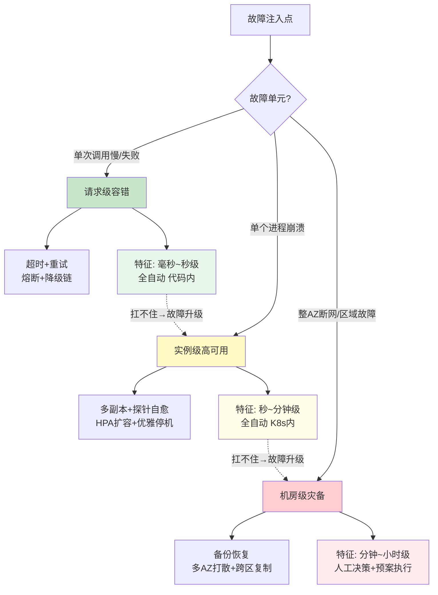
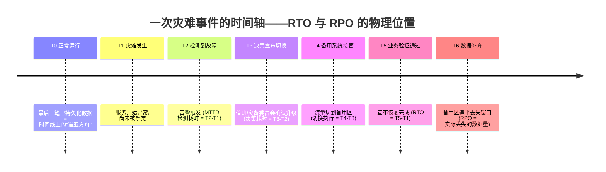
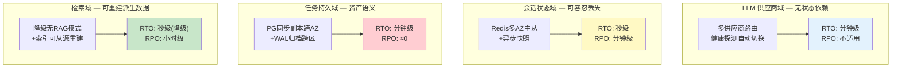
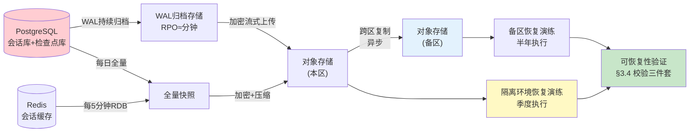
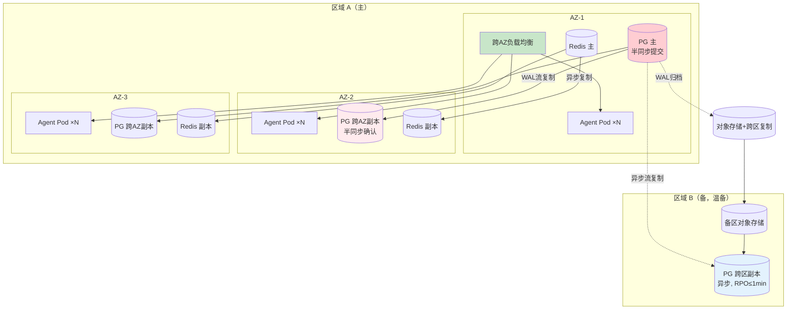
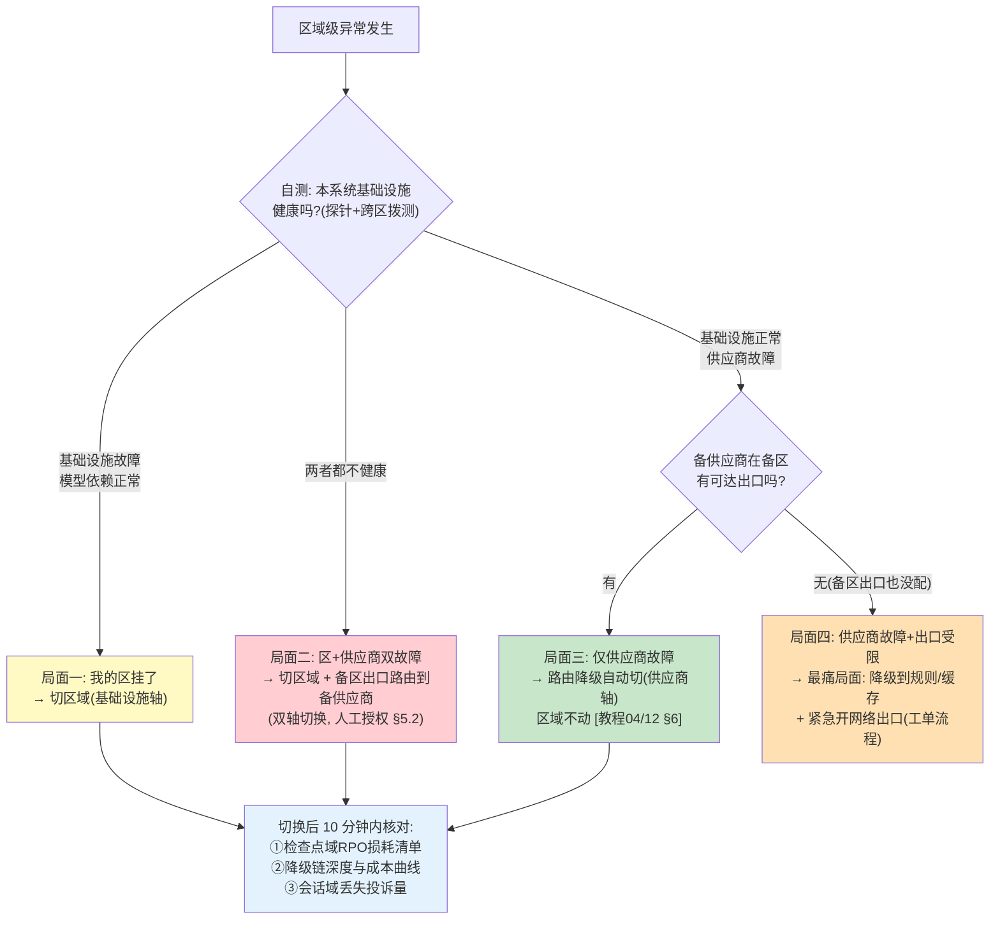
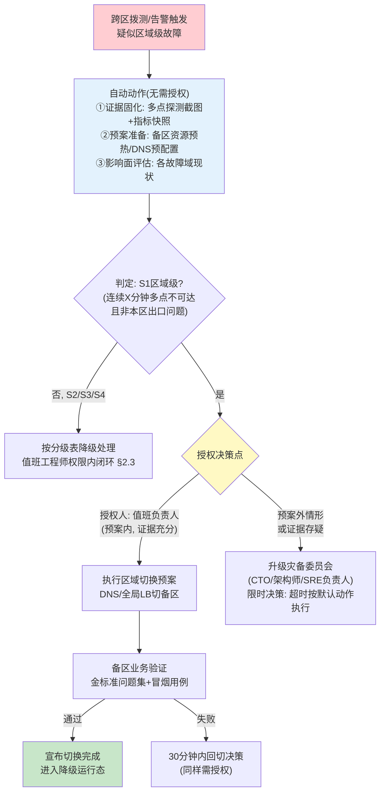

# 17-高可用与灾备设计

> **定位**：本文讲 Agent 系统第三层高可用——**机房级与区域级**的架构设计与运营工程，把可用性体系补齐为完整的三层：请求级容错（超时 / 重试 / 熔断 / 降级链）→ 实例级高可用（多副本 / HPA / 健康探针自愈）→ **机房级灾备（本篇：RTO/RPO 目标设定、备份与恢复、多 AZ / 多区域故障转移、切换演练 runbook）**。核心论点：**灾备不是一个"开了就生效"的功能，而是一组必须被反复演练验证的运营能力——没演练过的备份等于没有备份，没跑过的切换预案等于没有预案**。全文覆盖：RTO/RPO 在 Agent 系统的特化定义与四个故障域（LLM 供应商域 / 会话状态域 / 任务持久域 / 检索域）的差异化目标设定、备份对象盘点与可恢复性验证、粘性会话的故障转移代价、区域级故障时"切区域"与"切供应商"的组合决策、季度演练制度与授权分权。读者画像：已经把 Agent 服务跑上 K8s、现在要回答"整个机房挂了怎么办"的中高级后端 / 平台 / SRE 工程师。前置阅读：[教程 04-企业级架构主干/10-容错与弹性设计]、[教程 04-企业级架构主干/13-部署与运维]、[教程 08-架构师进阶/06-长任务持久化与中断恢复]。

---

## 1. 从容错到灾备：三层高可用的能力边界

### 1.1 三层模型：每一层只解决一类故障

前两篇已经建立了两层防线：请求级容错解决"**单次调用失败**"（LLM 超时、工具报错、限流熔断），实例级高可用解决"**单个进程死亡**"（Pod 崩溃、滚动发布、流量尖峰扩容）。但这两层有一个共同前提——**故障被限制在一个机房内部**。当故障单元升级为可用区（AZ）乃至区域（Region）时，前两层的所有手段同时失效：熔断器解决不了"对端 IP 整段不可达"，HPA 拉不起"整个 AZ 里全灭的 Pod"。

三层高可用的完整分工如下：

| 层级 | 故障单元 | 防御手段 | 恢复动作的主体 | 承接篇目 |
|------|---------|---------|--------------|---------|
| **请求级** | 一次调用 | 超时 / 重试 / 熔断 / 降级链 / 限流 | 代码自动完成，毫秒到秒级 | [教程 04-企业级架构主干/10-容错与弹性设计] |
| **实例级** | 一个进程 / Pod | 多副本 / 健康探针 / HPA / 优雅停机 | K8s 自动完成，秒到分钟级 | [教程 04-企业级架构主干/13-部署与运维] |
| **机房级（本篇）** | 一个 AZ / 区域 | 备份 / 多 AZ 部署 / 跨区复制 / 切换预案 | **人工决策 + 半自动执行**，分钟到小时级 | 本文 |



这张图里最重要的是两条虚线：**故障升级路径**。请求级扛不住的故障（供应商整体宕机）会升级为实例级问题（所有线程阻塞在超时上）；实例级扛不住的故障（整个 AZ 网络分区）会升级为机房级问题。高可用设计的完整含义是：**每一层都要假设下一层已经失败**。

### 1.2 可用性预算：数字背后的物理含义

谈灾备之前先把"几个 9"翻译成可感知的时间：

| 可用性目标 | 年停机预算 | 月停机预算 | 典型配套要求 |
|-----------|-----------|-----------|------------|
| 99% | 87.6 小时 | 7.3 小时 | 单 AZ 部署 + 实例级自愈即可 |
| 99.9% | 8.76 小时 | 43.8 分钟 | 多 AZ 部署 + 每日备份 + 季度演练 |
| 99.99% | 52.6 分钟 | 4.4 分钟 | 多 AZ + 自动 failover + 每月演练 + 专项值班 |
| 99.999% | 5.26 分钟 | 26 秒 | 多区域双活，成本通常 3~5 倍起步 |

两个架构师必须刻在脑子里的推论：

1. **可用性是乘法不是加法**。请求路径上有三层串联（网关 99.9% × Agent 服务 99.99% × 数据层 99.9%），整体就是 99.79%——比最弱一环还弱。所以提升可用性的第一杠杆永远是**砍掉串联环节或共享故障域**，而不是把每一环都堆到 99.99%。
2. **99.99% 以上基本堵死了纯人工响应**。月预算 4.4 分钟意味着检测 + 决策 + 切换全程必须自动化完成，人只能做事后审计。对绝大多数企业 Agent 系统，**99.95%（多 AZ + 半自动切换）是投入产出比的甜点位**；99.999% 的多区域双活只属于支付、交易这类每分钟停机损失以百万计的业务。

Agent 系统还有一条特殊性：**LLM 供应商的可用性是你可用性公式的乘数项，而这个乘数不在你的掌控里**。即便你的机房永远不宕机，供应商一次 40 分钟的区域故障照样烧光全年预算——这正是第 4.3 节"区域故障 × 供应商故障"组合决策存在的原因。

---

## 2. RTO/RPO 目标设定与故障分级

### 2.1 RTO/RPO：灾备世界的两个度量衡



- **RTO（Recovery Time Objective，恢复时间目标）**：从故障发生（T1）到业务恢复（T5）的最大可容忍时长。它包含检测（MTTD）、决策、切换执行三段——**多数团队的 RTO 瓶颈不在技术切换，而在 T2→T3 的"敢于宣布"**，这也是第 5 节要专门治理的对象。
- **RPO（Recovery Point Objective，恢复点目标）**：灾难发生后**允许丢失的最大数据量**（以时间衡量）。RPO 由备份/复制频率决定：每 5 分钟一次快照，理论 RPO 就是 5 分钟。

传统 Web 系统谈 RTO/RPO 只需要回答一个问题："数据库丢了多少、多久能恢复"。**Agent 系统的复杂之处在于：它的"数据"不是一个同质的东西，而是四个故障性质完全不同的域**——一刀切地设"RPO=0"或者"RPO=1 小时"都是错的。

### 2.2 Agent 系统的四个故障域

| 故障域 | 包含的数据 | 丢失的后果 | 建议目标 | 理由 |
|--------|-----------|-----------|---------|------|
| **LLM 供应商域** | 无状态（调用量、配额、缓存） | 无数据损失，只有服务中断 | RTO 分钟级；RPO 不适用 | 本质是**依赖可用性**而非数据灾备——解法是路由降级与多供应商冗余（§4.3），不是备份 |
| **会话状态域** | ChatMemory 历史、会话上下文、SSE 连接 | 用户丢失对话上下文，重新描述问题即可继续 | RTO 秒级；RPO 分钟级可容忍 | **会话可以丢但不必丢**：丢失是体验损失不是资产损失；为它买 RPO=0 的强一致复制不划算 |
| **任务持久域** | 工作流检查点、审批单、已扣预算、外呼副作用登记 | **不可丢**：重跑意味着重复扣款、重复发通知、重复写库等副作用 | RTO 分钟级；**RPO≈0** | 检查点承载"执行到哪了 + 花了多少"的资产语义（[教程 08-架构师进阶/06-长任务持久化与中断恢复] §2）——丢了之后"从头发射"的代价与副作用风险都不可接受 |
| **检索域** | 向量库、知识文档、索引 | 检索质量下降或 RAG 不可用，但**源数据仍在业务库里** | RTO 秒级（降级运行）；RPO 小时级 | 向量库是**可重建的派生数据**——灾备策略优先"降级"（回退无 RAG 模式，[教程 04-企业级架构主干/10-容错与弹性设计] §10）其次"恢复"，因为重建索引通常比恢复备份更可靠 |



这张矩阵是整个灾备方案的**宪法**。后文的每一个技术决策（选什么复制模式、备份频率、演练验证什么）都是从这张表推导出来的。把它贴进你的灾备文档第一页，凡是"我们是不是该给会话库上跨区强一致"这类问题，答案都在矩阵里：**会话域不值得，持久域必须**。

### 2.3 故障分级：响应动作跟着级别走

有了域，还要有**级别**——同一个域的故障落在不同爆炸半径上，响应动作完全不同：

| 级别 | 定义 | 典型场景 | 响应要求 |
|------|------|---------|---------|
| **S1 区域级** | 单个云区域不可用，跨区流量全损 | 区域网络故障、区域级云事故、合规勒令下线 | 灾备委员会授权切换备用区/备用云（§5.2），目标 RTO ≤ 30 分钟，事后 48h 内复盘 |
| **S2 AZ 级** | 单可用区故障，多 AZ 部署的其余 AZ 健康 | AZ 断网、AZ 供电事故 | 值班工程师确认 AZ 摘除，负载自动/手动集中到健康 AZ，目标 RTO ≤ 5 分钟 |
| **S3 实例级** | 单 Pod / 单节点故障 | OOM、节点宕机、磁盘满 | K8s 自动自愈（[教程 04-企业级架构主干/13-部署与运维] §3/§6），值班仅确认告警闭环，不升级 |
| **S4 依赖级** | 外部依赖降级但本系统存活 | LLM 供应商区域故障、工具 API 限流、向量库抖动 | 请求级容错与供应商路由自动吸收（[教程 04-企业级架构主干/10-容错与弹性设计]、[教程 04-企业级架构主干/12-模型路由与降级]），值班盯降级链深度与成本变化 |

这张表的真正价值在第 4 列的**授权映射**：S3/S4 不需要人（自动机制就是第一响应者），S2 需要值班工程师一句话，S1 需要一个有授权的委员会。**把"谁在什么级别能做什么决定"写进制度，切换才可能快**——第 5.2 节展开。

### 2.4 目标设定方法论：按业务域反推，而不是拍数字

RTO/RPO 目标的正确推导方向是**从业务损失反推**，四步：

1. **量化每分钟的停机损失**：客服 Agent 停机一分钟 = N 个客户等待；审批流 Agent 停机一分钟 = M 张单据滞留；计费 Agent 停机一分钟 = 直接漏算。这个数字决定你在第 1.2 节表格里买哪一档。
2. **对四个故障域分别回答"丢了会怎样"**：会话丢 → 用户重新描述（损失分钟级体验）；检查点丢 → 重复副作用（损失可能是资金）；向量库丢 → 降级运行（损失是回答质量）。答案直接给出 RPO 分级。
3. **给每个数字标注"实测值 vs 目标值"**：目标没有实测值支撑就是许愿。第 5 节的演练制度存在的意义就是把目标值变成实测值。
4. **每季度复核**：业务权重变了（客服 Agent 从试点变全员），目标必须跟着重谈，否则灾备投入与业务风险脱节。

---

## 3. 备份与恢复

### 3.1 备份对象盘点：六个常被遗漏中的五个

灾备复盘里最刺眼的发现永远是"**这个居然没备份**"。Agent 系统的备份对象盘点清单：

| 备份对象 | 所属故障域 | 备份内容 | 推荐机制 | 频率与 RPO |
|---------|-----------|---------|---------|-----------|
| 会话库（PG / Redis） | 会话状态域 | ChatMemory 持久化数据（[教程 04-企业级架构主干/05-历史记录持久化与合规] §5） | PG：每日全量 + WAL 归档；Redis：RDB 快照 + AOF | WAL 持续归档 RPO≈分钟；RDB 每 5 分钟 RPO≤5min |
| 任务检查点库 | 任务持久域 | 检查点、审批单、预算账本、幂等登记 | PG 流复制跨 AZ（同步或半同步）+ WAL 归档跨区 | RPO≈0（跨 AZ 半同步）；跨区 RPO≤1min |
| 向量库 | 检索域 | 向量索引 + 元数据 | **首选不备份、可重建**：源数据在业务库，保留重建流水线；次选每日快照 | 重建 RPO=源数据延迟；快照 RPO≤24h |
| 对象存储（文档原始件） | 检索域的上游 | 知识文档原件、导出报告 | 开启版本控制 + 跨区复制（云厂商原生的跨区桶复制） | RPO≈实时 |
| 配置与密钥 | 全域 | ConfigMap、Secret、API Key、证书 | GitOps 仓库（配置）+ Vault 快照 / 外部 Secret 管理器导出（密钥） | 每次变更即提交，RPO≈0 |
| Prompt / 评估资产 | 全域 | Prompt 版本库、few-shot 示例库、金标准问题集、评估报告 | Git 仓库 + 制品库（[教程 04-企业级架构主干/09-灰度发布与版本管理]） | 每次发布即留存，RPO≈0 |

清单里最容易漏的是后三行：**密钥备份缺失会让恢复出来的系统"活着但登不进自己的数据库"**；Prompt 资产不备份，恢复出来的是一个失忆的 Agent；向量库选"可重建"路线的前提是**重建流水线本身被演练过**（§3.3）。

另一个隐性遗漏是**保留策略与合规的耦合**：会话数据有 GDPR / 个保法的留存期限（[教程 04-企业级架构主干/05-历史记录持久化与合规] §6），备份必须继承同样的删除义务——"备份里的数据不受删除权约束"是合规审计的标准罚单项。备份策略 = 备份频率 + 保留周期 + 删除义务，三件缺一不可。

### 3.2 分级备份流水线



流水线的三条纪律：

1. **备份必须出 AZ，跨区副本必须有**。"备份和主库在同一个 AZ"等于没备份——AZ 级故障会把主库和备份一起带走。跨区复制走对象存储原生的异步复制即可，不必为会话域买跨区强一致（§2.2 矩阵的推论）。
2. **备份介质与生产凭证隔离**。备份桶使用独立凭证/独立账号，防止一次凭据泄露同时清空生产与备份（勒索软件的标准剧本）。备份写入后校验对象锁/WORM 策略，保证保留期内不可删改。
3. **加密密钥单独备份且与数据分离存放**。密钥与密文放一起，等于把保险箱钥匙焊在保险箱门上。

### 3.3 恢复演练：没演练过的备份等于没有备份

备份的价值不在"存了"，在"**能恢复出来并且时间达标**"。行业里反复被验证的事实是：未演练的备份，真实可恢复率远低于直觉——常见死法包括：备份脚本静默失败三个月没人发现；恢复出的库缺少昨天刚加的新表（备份清单没跟着 DDL 更新）；恢复耗时 8 小时，RTO 早已击穿；密钥丢了，数据完好却打不开。

演练的标准形态是**四步计时法**，每个备份对象每个季度至少走一遍：

| 步骤 | 动作 | 产出 |
|------|------|------|
| 1. 隔离 | 在隔离环境（独立 VPC / 独立 namespace）起恢复目标，**绝不污染生产** | 演练环境就绪 |
| 2. 恢复 | 从最近的备份链（全量 + WAL 增量）恢复到指定时间点，全程计时 | 恢复耗时实测值 |
| 3. 验证 | 跑可恢复性验证三件套（§3.4），恢复系统接入真实流量镜像或回放 | 验证报告 |
| 4. 归档 | 实测 RTO/RPO 与目标值对照，超标的写整改项并限期闭环 | 演练台账（年度可审计） |

关键点是第 3 步的"接入真实流量"：只验证"表能查"不算恢复成功，**要让恢复出来的系统真实处理一次请求**——Agent 服务连上恢复库跑一轮对话、检查点引擎从恢复的检查点续跑一个任务、检索服务对着恢复的向量库回答金标准问题集。恢复成功的定义是"**业务语义恢复**"，不是"进程起来了"。

补一句与故障注入的分工：本篇演练验证的是"数据丢了能恢复"（RTO/RPO 实测对标目标值），[附录 04-测试策略/04-混沌工程与故障注入] 验证的是"依赖受损时容错配置真的生效"（稳态假设可证伪判定）——一个向后看数据、一个向前看依赖，共同构成运行期韧性验证的两条腿，季度演练制度（§5）可以把两类实验排进同一场次。

### 3.4 备份可恢复性验证：校验三件套

把验证做成自动化校验，塞进每次演练（理想情况下每周对最新备份自动跑一遍轻量版）：

1. **结构校验**：库表/索引/约束齐全，行数与源库快照点比对一致；
2. **语义校验**：抽样的会话能被 ChatMemory 正常读回并重建消息（警惕第 05 篇 §5 讲过的序列化兼容问题——备份恢复是这类"第一次写成功、第二次读才炸"问题的最佳暴露场）；检查点能被恢复引擎续跑；对象存储的文档能被解析管线吃进去；
3. **检索质量校验（Agent 特有）**：对恢复后的向量库跑**金标准问题集**，Recall@K 与生产基线比对。这一条专治向量库灾备的隐藏陷阱——行数一致不代表检索质量一致：embedding 模型版本漂移、索引参数变化、部分分片恢复不全，都会让"恢复成功"的向量库在语义上残废。金标准问题集的构建方法见 [教程 10-调优实战与方法论/01-环节体检]，它同时服务于检索调优与灾备验证，一套资产两处收益。

三件套任何一件失败，本次恢复判定为失败——**灾备指标和可用性指标一样，要么达标要么不达标，没有"大概行了"**。

---

## 4. 多 AZ / 多区域部署与故障转移

### 4.1 多 AZ：无状态层免费，数据层要设计

多 AZ 部署分两半看：

**无状态 Agent 服务（免费的半）**：[教程 04-企业级架构主干/13-部署与运维] §3 的 Deployment 天然支持跨 AZ 打散——给 Pod 加反亲和（`topologyKey: topology.kubernetes.io/zone`），副本自动分布到 ≥2 个 AZ，再让云负载均衡（跨 AZ 的 CLB / 多目标 Ingress）只把流量送进健康 AZ。这一半几乎零额外成本，**任何生产 Agent 系统没有理由不做**。

**有状态数据层（要花钱的半）**：

- **PG（会话库 + 检查点库）**：跨 AZ 流复制。任务持久域要 RPO≈0，用半同步复制（`synchronous_commit` 保证至少一个跨 AZ 副本落盘才确认提交）；会话域异步复制即可，切换时接受 §2.2 矩阵里"分钟级 RPO"的定位。
- **Redis（会话缓存 / SSE 路由表）**：跨 AZ 主从 + 哨兵或 Cluster 模式。注意 Redis 的异步复制在主节点宕机时可能丢最后几百毫秒写入——落在会话域是可接受的，**不要把任务持久域的任何数据放进 Redis 当唯一存储**。
- **Kafka（事件骨干）**：`broker.rack` 按 AZ 打散 + `RF=3 / min.insync.replicas=2`；区域级 DR 走 MM2 异步复制 + 位移翻译，完整方案见 [教程 07-Kafka事件骨干/08-运维监控与安全 §6]——那篇的核心结论（"RTO 的真实构成是 DNS 切换 + 消费者组重加入 + 热身，必须实测"）与本篇 §5 的演练思想完全同构。
- **向量库**：多 AZ 部署副本分片防 AZ 级故障；区域级靠"从源数据重建"而不是跨区复制（§2.2）。



这张拓扑的读法：**AZ1 整体宕机时**，半同步副本（AZ2）已经持有全部已确认提交，负载均衡摘掉 AZ1，分钟级恢复且零数据丢失——这是 S2 级故障的标准答案。**区域 A 整体宕机时**（S1 级），备区的异步副本接管，接受 ≤1 分钟的数据丢失（会话域无感、持久域需对照幂等登记核查边缘写入）。

### 4.2 粘性会话的故障转移代价

Agent 服务的"无状态"有一个著名的例外：**SSE 长连接是粘在具体实例上的**。用户正在看的流式回答，物理上是一条 TCP 连接，连接对端是某个具体 Pod。实例死亡时：

1. 连接断开，正在生成的 token 流中断（**部分结果**——前半句已经推给用户了）；
2. 客户端重连（[教程 04-企业级架构主干/04-多页面流式响应与会话管理] §4 的断线重连与流恢复机制）；
3. 新实例从会话域读取历史，**重新发起**这次生成。

代价清单（也是多 AZ 架构评审的检查单）：

| 代价项 | 量级 | 缓解手段 |
|--------|------|---------|
| 已生成部分结果重复计费 | 一次生成的 Token 费用 ×1~2 | 生成前写"进行中标记"，恢复后先查标记，能续传则续传（§8 跨实例同步的工程化） |
| 流式中断的用户观感 | 出现"卡断后重说" | 客户端展示"重新组织语言"类过渡文案，把重生成包装成有意行为 |
| 生成中的任务丢失 | 若任务只在内存 → 全丢 | **生成开始前先落检查点**（[教程 08-架构师进阶/06-长任务持久化与中断恢复] §2 的核心纪律），实例死亡后由恢复引擎接管续跑 |
| Redis 路由表里残留死连接 | 连接表膨胀 | 心跳 TTL 自动过期 + 断连时主动清理（[教程 04-企业级架构主干/04-多页面流式响应与会话管理] §8） |

一句话原则：**粘性会话的故障转移代价，等于"没有先落盘的状态"的数量**。把会话历史、任务检查点在动作开始前写进跨 AZ 持久层，实例就可以随便死——这就是"Agent 服务无状态化"的真正含义：不是没有状态，是**状态的存活时间（TTL）比任何实例都长**。

配套的实例级纪律还有两条（与 13 篇呼应）：

```yaml
# application.yml —— 优雅停机：滚动发布/AZ摘除时不掐断正在推流的 SSE
# 配置键实证：org.springframework.boot.web.server.Shutdown（枚举 GRACEFUL/IMMEDIATE，
#            spring-boot-web-server-4.1.0.jar）
#            org.springframework.boot.autoconfigure.context.LifecycleProperties
#            .getTimeoutPerShutdownPhase()（spring-boot-autoconfigure-4.1.0.jar）
server:
  shutdown: graceful          # 等待在途请求完成而非立即断连
spring:
  lifecycle:
    timeout-per-shutdown-phase: 30s   # SSE 长连接的排空窗口上限
```

```yaml
# k8s/deployment 片段 —— 探针分级：liveness 管生死, readiness 管接客
readinessProbe:            # 失败 = 从跨AZ负载均衡摘除, 不再接新连接
  httpGet:
    path: /actuator/health/readiness
    port: 8081
  periodSeconds: 5
livenessProbe:             # 失败 = 重启容器
  httpGet:
    path: /actuator/health/liveness
    port: 8081
  periodSeconds: 10
```

两个端点由 Boot 的可用性探针体系支撑（`org.springframework.boot.availability.LivenessState` / `ReadinessState`，`org.springframework.boot.health.application.AvailabilityStateHealthIndicator`——均已对本地 4.1.0 jar 实证；`/actuator/health/*` 端点暴露见 [教程 04-企业级架构主干/13-部署与运维] §6）。**读库挂了该失败的是 readiness 而不是 liveness**：数据层故障时实例下线"接客"但仍存活以便自愈排查，而不是被反复重启雪上加霜。

### 4.3 区域级故障：切区域与切供应商的组合决策

区域级故障（S1）下有两条独立的降级轴，架构师经常只做了其中一条：

- **基础设施轴（切区域）**：把流量从故障区切到备区——解的是"我自己的机房没了"；
- **供应商轴（切供应商）**：把模型路由从故障的 LLM 供应商切到备用供应商——解的是"我依赖的大脑没了"（[教程 04-企业级架构主干/12-模型路由与降级] §5 降级链、§6 健康检查与自动切换）。

两条轴组合出四种局面，**处置决策完全不同**：



四种局面里最值得预先设计的是**局面二与局面四**——它们都是"单轴方案"覆盖不了的：

- 局面二提醒我们：**备区必须预先配置供应商访问出口与 API Key**。切到备区后发现备区没有配额、没有出口网络、密钥没同步（§3.1 的密钥备份陷阱），等于从火坑跳进水坑。
- 局面四提醒我们：供应商轴的"自动降级"（12 篇的健康检查自动切换）覆盖不了**网络层不可达**——路由层以为所有供应商都挂了，实际只是本区域的出口故障。所以 12 篇的供应商健康探测必须在**多个网络位置**布点（备区也跑一个探测实例），探测结论写回路由决策，避免"本区视角的误判"。

最后是成本维度的提醒：区域级切换是**有代价的动作**——备区资源预热、跨区流量费、切换后性能波动（冷缓存）。所以它必须是"人工授权 + 预案执行"的半自动动作，而不是检测到抖动就全自动横跳。切换的自动化程度跟着 RTO 目标走：99.95% 目标（月预算 ~22 分钟）允许分钟级的人工决策环节；承诺 99.99% 以上的系统才需要把局面一的切换做成全自动，并接受误切换的风险。

还有一条容易被遗忘的**入口侧连带**：如果 Agent 的入口是 IM 渠道，区域故障期间 IM 平台的 webhook 会持续投递失败并按平台策略反复重试——故障恢复后的第一波流量不是正常流量，而是**积压重放的回调洪峰**。好在 16 篇的幂等回调管线（时间窗 + 消息 ID 去重表，[教程 04-企业级架构主干/16-IM渠道接入工程] §4）正是为此准备的：重放的消息命中去重表被静默丢弃，洪峰被挡在 LLM 调用之前。灾备 runbook 的"备区业务验证"清单里因此要多一项：**确认 IM 适配层的去重表（Redis）已随会话域一起切换或恢复**，否则洪峰 + 去重失效的组合会把刚恢复的系统再打一次。

### 4.4 数据层跨区：两条路线的选型

区域级灾备的数据层设计有一个绕不开的矛盾：**跨区强一致复制的延迟会拖垮写入热路径**（北京到上海物理往返 ~30ms，每个检查点写入都要等远端确认，生成型工作负载的检查点写入是高频操作）。所以数据层跨区只有两条诚实路线，按故障域拆开选：

| 路线 | 适用域 | 机制 | 代价 |
|------|--------|------|------|
| **异步复制路线** | 会话域 | 跨区异步流复制 / 对象存储跨区复制，接受分钟级 RPO | 切换后最近几分钟的会话丢失（矩阵里已声明可容忍） |
| **区域自治 + 重放路线** | 任务持久域 | 各区独立写本地（RPO=0 的"本地"），跨区只同步**事件流**；备区靠重放事件流重建状态 | 备区状态是"最终一致 + 可重放"；切换时用位移翻译续读（Kafka MM2 同款思想，[教程 07-Kafka事件骨干/08-运维监控与安全 §6]） |

任务持久域选"区域自治 + 重放"而不是"跨区同步复制"的理由写清楚：检查点写入在 Agent 执行的热路径上，为它加跨区同步等待，等于给每一轮工具调用加一笔跨城延迟税；而检查点的资产语义靠的其实不是"备份有多实时"，是**幂等登记 + 事件可重放**（[教程 08-架构师进阶/06-长任务持久化与中断恢复] §4 幂等重试）——切换后按事件流重放到一致状态，配合幂等登记消除重放副作用，比硬扛同步复制的延迟代价划算得多。

---

## 5. 切换演练 runbook

### 5.1 演练制度：从"计划内"到"计划外"

预案不演练等于没有。演练分两个梯度：

**梯度一：计划内演练（季度）**——提前公告、隔离环境、按 runbook 走全流程。验证"预案本身是对的"。

**梯度二：故障注入演练（月度，生产环境灰度执行）**——不提前告知执行时间，向生产注入受控故障，验证"自动机制真的会触发"。生产注入的前提是爆炸半径可控 + 一键终止。

故障注入清单（每条都对应前文的一个机制，注入就是为了证明它真的有效）：

| 注入故障 | 验证对象 | 通过标准 |
|---------|---------|---------|
| 杀掉单个 Agent Pod（`kubectl delete pod`） | 实例级自愈 + SSE 断线恢复 | 新 Pod 就绪接管 ≤30s；客户端自动重连并续跑；无检查点丢失 |
| 摘掉一个 AZ（安全组模拟 / 节点池隔离） | 多 AZ 打散 + readiness 摘除 | 健康 AZ 承接全量流量 ≤5min；半同步副本无数据缺口 |
| 断开主 PG 复制链路 | 故障转移 + 仲裁 | 备副本提升为主；应用连接串自动/半自动切换；RPO 实测 ≤ 目标 |
| 清空 Redis（演练实例） | 会话域降级 | Agent 以"无历史模式"继续应答；新会话正常建立；无级联崩溃 |
| LLM 供应商 API 持续 500（Mock 端点） | 供应商降级链 | 熔断打开 → 路由切备供应商 ≤60s；降级深度与成本上浮在告警阈值内（[教程 04-企业级架构主干/12-模型路由与降级] §6） |
| 阻断本区到对象存储的网络 | 检索域降级 | 回退无 RAG 模式（[教程 04-企业级架构主干/10-容错与弹性设计] §10），回答显式声明"未结合知识库" |
| 从最新备份恢复全量到隔离环境并接流量镜像 | §3.3/§3.4 演练四步 + 校验三件套 | 恢复耗时 ≤ RTO 目标；金标准问题集 Recall@K 达标 |
| 完整 S1 桌面推演（dry-run，不切真流量） | 切换决策链 + 授权流程 | 决策树走通；各角色授权与联络链有效；计时与预案偏差 <20% |

两条运营纪律：**每次演练产出台账**（实测 RTO/RPO vs 目标、发现的缺口、整改项、责任人与期限），台账是灾备能力唯一可信的证据；**演练发现的缺口必须在下个季度演练前闭环**，否则下季度演练会原样再发现一遍——灾备债和 tech debt 一样会复利。

### 5.2 切换决策树与授权分权

区域切换是一个**高代价、部分不可逆、信息不完整时点上的决策**——它在结构上就是一个 HITL（human-in-the-loop）决策，和 Agent 审批流（[教程 04-企业级架构主干/08-Human-in-the-Loop与审批流]）面对的是同一类问题：不能全自动（误判代价过高），不能全人工（速度不达标）。解法也是同构的：**机器做检测与预案准备，人在明确的分级授权点做"宣布"**。



决策树里固化了四个容易在事故中崩塌的点：

1. **证据先于动作**：多点探测（不能只信本区视角——§4.3 局面四的教训）+ 指标快照，切换决策基于证据而不是基于某一条告警；
2. **自动动作与授权动作严格分界**：准备类动作（预热、预配置、证据固化）全自动零授权，"宣布切换"这个不可逆动作必须过授权点；
3. **授权分级写进制度**：预案内 S1 切换 = 值班负责人；预案外或证据存疑 = 灾备委员会。**关键设计是"限时决策 + 默认动作"**：升级后 X 分钟内委员会必须给出决定，超时按预设默认动作（通常是"切换"，因为区域级故障拖久的损失通常大于误切换）执行——决策权下放给了制度而不是某个人恰好在线；
4. **回切也是一次切换**：备区降级运行期间主区恢复后，回切（failback）同样要走验证与授权，"故障结束了大家冲回主区"是第二次事故的经典起点。

### 5.3 runbook 文档的结构模板

每个 S1/S2 场景一份 runbook，统一骨架（缺任何一节，演练时一定会暴露）：

```markdown
# Runbook: 区域A → 区域B 切换
- 触发条件: (可观测的、无歧义的判据——不是"感觉不对")
- 授权: 预案内=值班负责人 / 预案外=灾备委员会; 决策时限与默认动作
- 前置检查清单: 备区资源/密钥/配额/副本延迟(RPO现状)/供应商出口
- 切换步骤: 每步一条命令或一个控制台动作 + 预期输出 (可复制粘贴执行)
- 验证清单: 金标准问题集 + 冒烟用例 + 各故障域核对(§4.3 CHECK 项)
- 回退步骤: 触发条件 + 同样可复制粘贴的命令序列
- 干系人通知: 内部 IM 群 / 客户公告模板 / 合规报备(涉数据出境时)
- 事后动作: 复盘会(48h内) / 台账归档 / 预案修订
```

模板的要害在"**可复制粘贴执行**"：事故中的值班工程师处于高压力低认知余量状态，runbook 里每一个"视情况处理"都是事故延时器。步骤必须是可直接执行的命令与明确的预期输出，判断类内容全部前移到触发条件与授权节。

### 5.4 演练指标的归档与目标复核

演练台账的最终去处是与 §2.4 的目标值对照：

| 指标 | 目标值 | Q2 实测 | Q3 实测 | 趋势 |
|------|--------|---------|---------|------|
| S1 切换 RTO（决策+执行+验证） | ≤30 min | 42 min | 28 min | 整改后达标 |
| 检查点域切换 RPO | ≈0 | 0 | 0 | 持续达标 |
| 会话域切换 RPO | ≤2 min | 90 s | 75 s | 达标 |
| 备份恢复演练耗时 | ≤RTO 目标 | 1.8×超标 | 0.9×达标 | WAL 重放并行化整改 |
| 金标准 Recall@K（恢复后 vs 生产） | 差值 ≤2% | -6% | -1.5% | embedding 版本锁定后达标 |

趋势列的意义大于单点值：RTO 的改进是一个工程问题（检测更快的拨测、更熟练的值班、更自动的执行），**没有台账就没有改进曲线，灾备就永远停留在"理论上可行"**。

---

## 6. 适用场景与不适用场景

### 适用场景

- Agent 系统已上生产并对外承诺 SLA（哪怕是内部的 SLA）——只要有人依赖它干活，机房级故障就是真实风险；
- 任务持久域承载了有副作用的执行（扣款、外呼、工单、审批）——检查点丢失不可接受的系统，本篇的 §2.2 矩阵与 §4.4 重放路线是必答题；
- 多租户 / 平台型 Agent 产品——租户的会话与任务数据是**客户的资产**，丢失的代价是合同层面的；
- 有合规留存与审计要求的行业（金融、医疗、政务）——备份策略必须同时满足"可恢复"与"可删除"（§3.1）；
- 团队规模足以支撑值班与演练制度（≥3 人轮值）——本篇的 runbook 体系需要有人在事故凌晨真的能执行它。

### 不适用场景

- 内部 POC / 演示环境——多 AZ 与跨区复制的成本远超演示价值，实例级自愈（13 篇）+ 每日备份已经足够；
- 数据可随时全量重建的纯缓存型负载——RPO 目标不存在，备份演练体系是过度工程（与 Kafka 运维篇的适用性判断同构，[教程 07-Kafka事件骨干/08-运维监控与安全 §6]）；
- 单区域交付的私有化项目且客户合同明确接受单 AZ——按合同与客户预算做实例级高可用即可，跨 AZ 属于商务决策不是技术默认；
- 承诺 99.99% 以上但团队没有 7×24 值班能力——先把目标降到能力真实覆盖的位置（通常 99.9%~99.95%），**灾备承诺超出运营能力是最危险的架构谎言**。

---

## 7. 总结

高可用是三层楼：请求级容错处理"一次调用失败"，实例级自愈处理"一个进程死亡"，本篇补齐的机房级灾备处理"一个 AZ / 区域消失"。三层的方法论气质完全不同——前两层是**代码与配置的问题**（写对超时与探针，机器自动执行），第三层是**制度与运营的问题**（目标、备份、演练、授权，人在闭环里）。把第三层当成"再写几段配置"来做，是灾备失败案例的共同起点。

收束全文的六条主线索：

1. **故障域矩阵是宪法**（§2.2）：LLM 供应商域是依赖问题（路由解）、会话域可丢（异步复制解）、任务持久域不可丢（半同步 + 重放解）、检索域可重建（降级 + 重建解）——所有技术选型从矩阵推导，拒绝一刀切；
2. **可用性是乘法**（§1.2）：串联环节与共享故障域是第一杠杆，99.95% 的多 AZ + 半自动切换是多数系统的甜点位；
3. **没演练过的备份等于没有备份**（§3.3）：四步计时法 + 校验三件套（结构 / 语义 / **检索质量**），恢复成功的定义是业务语义恢复；
4. **无状态化的真正含义**（§4.2）：状态的 TTL 比任何实例长——先落检查点再执行，实例就可以随便死；
5. **区域故障与供应商故障是两条独立的轴**（§4.3）：2×2 组合四局面，备区必须预配供应商出口与密钥，健康探测必须多点布防；
6. **切换是 HITL 决策**（§5.2）：机器检测与准备、制度授权与限时、runbook 可复制粘贴执行——把"敢于宣布"从个人勇气变成组织能力。

| 概念 | 一句话 |
|------|--------|
| **RTO** | 故障发生到业务恢复的最大容忍时长，瓶颈通常在"敢于宣布" |
| **RPO** | 允许丢失的最大数据量（按时间），由复制/备份频率决定 |
| **故障域矩阵** | 供应商 / 会话 / 持久 / 检索四域，各自 RTO/RPO 目标的唯一依据 |
| **WAL 归档** | 数据库持续备份机制，把 RPO 从"一天"压到"分钟" |
| **校验三件套** | 结构 / 语义 / 检索质量——备份可恢复性的自动化验证 |
| **半同步复制** | 至少一个跨 AZ 副本落盘才确认提交，持久域 RPO≈0 的来源 |
| **区域自治 + 重放** | 持久域跨区路线：本地写、事件流跨区、重放重建 + 幂等消副作用 |
| **粘性会话代价** | 等于"没有先落盘的状态"的数量 |
| **liveness / readiness** | 管生死 vs 管接客；数据层故障该摘 readiness 不该杀 liveness |
| **授权分权** | 预案内值班负责人、预案外灾备委员会、限时决策 + 默认动作 |
| **演练台账** | 灾备能力唯一可信的证据，实测 RTO/RPO 对目标的改进曲线 |

**延伸阅读**：请求级的超时 / 重试 / 熔断 / 降级链详见 [教程 04-企业级架构主干/10-容错与弹性设计]；供应商轴的降级链与健康切换详见 [教程 04-企业级架构主干/12-模型路由与降级]；实例级的 K8s 部署 / 探针 / HPA 详见 [教程 04-企业级架构主干/13-部署与运维]；检查点与崩溃恢复的执行引擎详见 [教程 08-架构师进阶/06-长任务持久化与中断恢复]；Kafka 的跨区复制与位移翻译详见 [教程 07-Kafka事件骨干/08-运维监控与安全 §6]。

**外部来源**：[Google SRE Book — Disaster Recovery / Load Balancing 章节观点](https://sre.google/sre-book/) · [AWS Resilience Hub 与多 AZ 最佳实践](https://docs.aws.amazon.com/wellarchitected/latest/reliability-pillar/) · [Azure 架构中心 — DR 到次要区域的 N 层应用](https://learn.microsoft.com/azure/architecture/) · [PostgreSQL 流复制与 PITR 官方文档](https://www.postgresql.org/docs/current/high-availability.html) · [Kubernetes Pod Topology Spread Constraints](https://kubernetes.io/docs/concepts/scheduling-eviction/topology-spread-constraints/)
