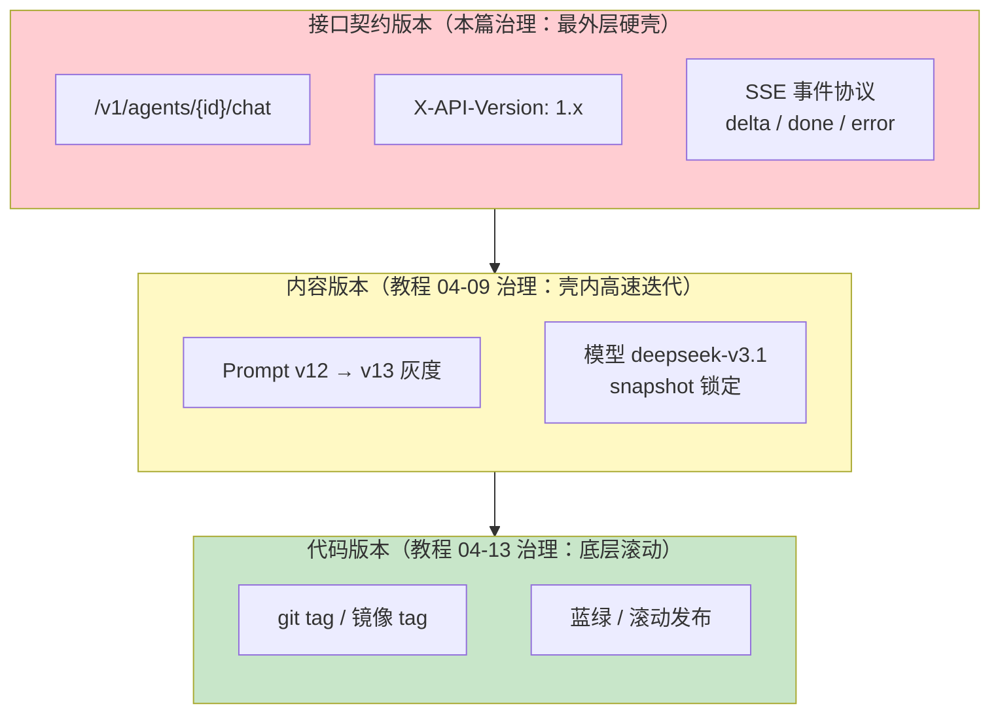
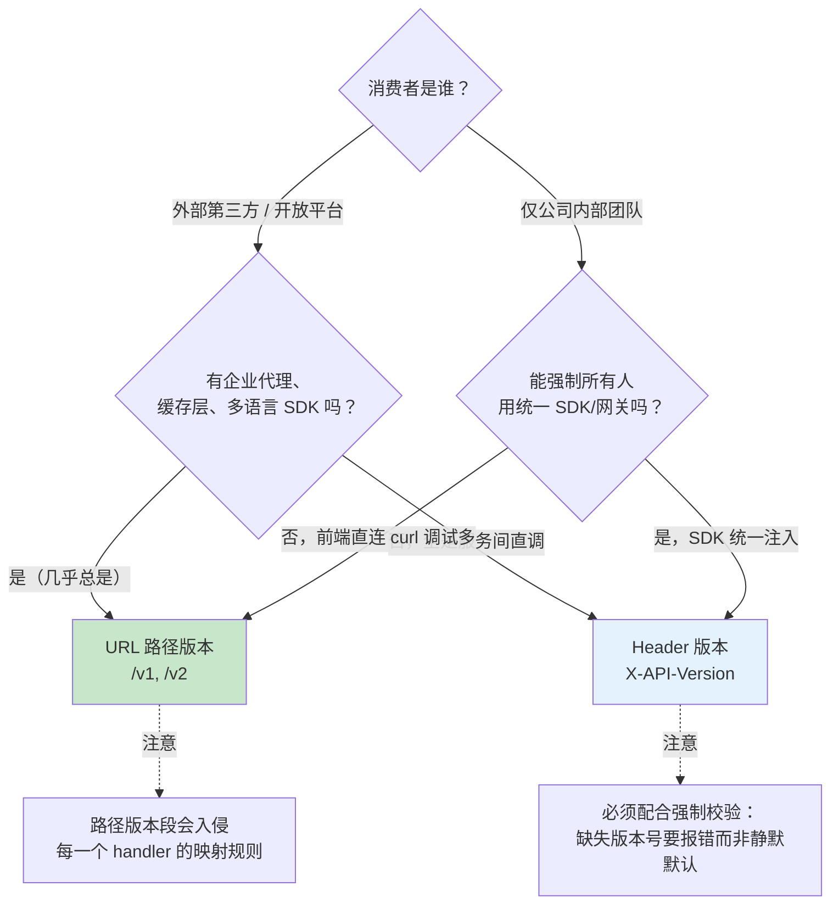
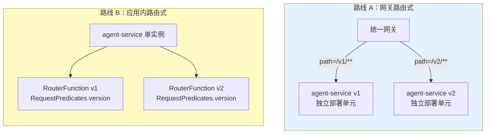
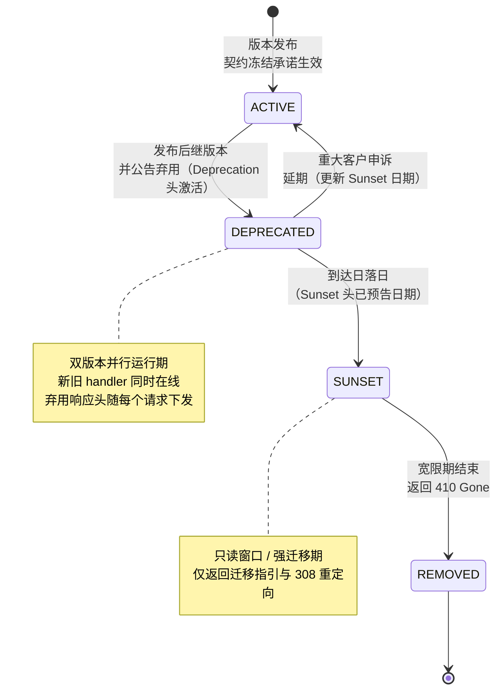
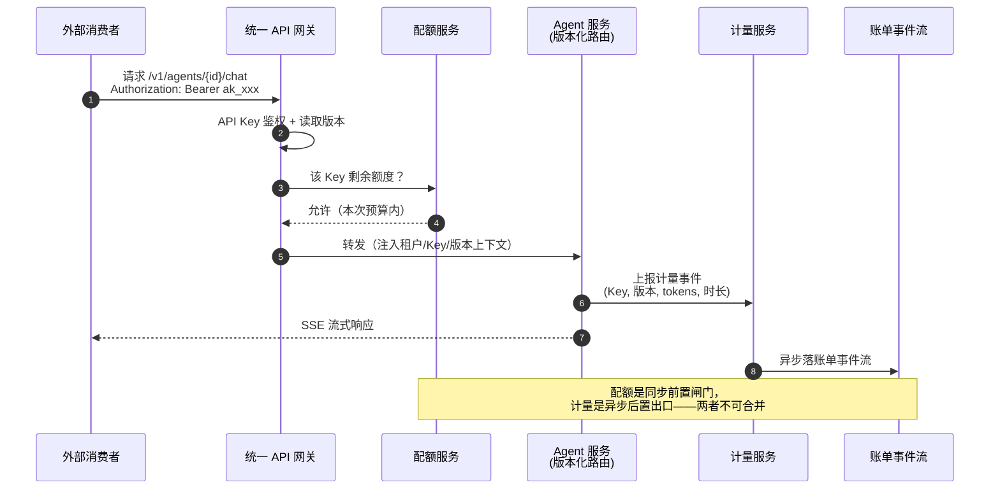

# 18 API 版本管理与产品化
> **定位**：本篇是 [09-灰度发布与版本管理](09-灰度发布与版本管理.md) 的姊妹篇。09 回答的是"**流量该切到哪个版本**"（Prompt 版本、模型 A/B、灰度切分），本篇回答的是"**版本本身如何治理生命周期**"——你对外提供的 Agent API 如何版本化、如何声明弃用、如何最终下线，以及更进一步：如何把内部 Agent 能力包装成一个对外可订阅的"产品"。文中所有 Spring Framework 7.0（Spring Boot 4.1 所用 spring-web/spring-webflux 7.0.8）的 API 版本化机制均经本地 jar javap 实证。
>
> **读者画像**：负责 Agent 平台对外接口设计的架构师——API 已经或即将被其他团队、其他公司消费，需要回答"改接口怎么不改崩别人"、"旧版本什么时候能下线"、"接口怎么当产品卖"。
>
> **前置阅读**：[09-灰度发布与版本管理](09-灰度发布与版本管理.md)（模型级状态机与流量切分，本篇多处与其划界）、[11-安全与权限控制](11-安全与权限控制.md)（API Key 鉴权的底层机制）、[07-成本治理与Token计量](07-成本治理与Token计量.md)（对内成本归因，本篇讲对外开放面）。

---

## 1. 三层版本：为什么需要一篇独立的"API 版本管理"

"版本"在 Agent 系统里至少出现在三个层面，它们的治理主体、变更频率、兼容性含义完全不同。混为一谈是接口事故的第一大来源。

| 层面 | 载体 | 变更频率 | 治理手段 | 归属篇目 |
|------|------|----------|----------|----------|
| 代码版本 | git tag、镜像 tag | 每次发布 | CI/CD、回滚 | [教程 04-13 §部署] |
| 内容版本 | Prompt 版本、模型快照 | 每次调优 | 灰度切分、A/B、快照 pinning | [教程 04-09 §2-§4] |
| **接口契约版本** | API 路径、Header、Schema、SSE 事件协议 | 极少，且必须显式声明 | **本篇**：版本化、弃用政策、契约文档 | 本篇 |

三层的关系是**嵌套**的：接口契约版本是最外层的硬壳，内容版本在壳内高速迭代，代码版本在底层滚动。外层壳一旦变化，所有已经按旧壳对接的消费者都会碎裂——所以它必须是最稳定、变更最昂贵的一层。



**Agent 相比传统 REST 服务，接口契约多出一块独有的部分：流式事件协议。** 一个 `GET /v1/agents/{id}/chat` 的 SSE 端点，其真实契约不只是 URL 和参数，还包括 `event:` 名称序列（如 `message.delta`、`message.done`、`error`）、每个事件的 JSON 形状、以及事件的先后顺序约束。这部分契约在传统 OpenAPI 文档里最难表达（见 §5.3），也最容易在迭代中被无意识破坏——消费方通常按事件名做 `switch` 分发，你改名一个事件，他们的解析器就静默走进 default 分支。

因此本篇的立场是：**Agent 的 API 版本化 = 端点版本化 + 流式事件协议版本化**，两者必须绑定在同一个版本号下演进，不允许"端点不变、偷偷改事件"。

## 2. 版本化策略：三方案对比与选型

### 2.1 三种载体，六种维度

业界通行的 API 版本传递方式有三种，各自把版本号放在请求的不同位置：

| 维度 | ① URL 路径<br/>`/v1/agents/chat` | ② 自定义 Header<br/>`X-API-Version: 1` | ③ 内容协商<br/>`?version=1` 或 `Accept: application/vnd.demo.v1+json` |
|------|------|------|------|
| 网关路由友好 | **最好**——网关按路径前缀即可分流 | 差——网关需读 Header 才能路由 | 中——查询参数易读，MediaType 需解析 |
| CDN/HTTP 缓存友好 | **最好**——URL 即缓存键的一部分 | 差——多数缓存层忽略自定义 Header | 中——查询参数参与缓存键，MediaType 参数对共享缓存不透明 |
| 调试直观 | **最好**——curl 一眼可见 | 差——忘记带 Header 是最高频工单来源 | 中——查询参数直观 |
| 客户端接入成本 | 低 | 低（但易遗漏） | 中——MediaType 参数需要客户端理解 vendor type |
| 资源纯度（URI 即资源） | 差——版本污染资源标识 | **好** | **好**——内容协商本是 HTTP 原生机制 |
| 同一资源多版本并存 | 物理隔离，两套 handler | 逻辑共存，一套 handler 内分派 | 逻辑共存 |
| 文档/SDK 生成友好 | **最好**——OpenAPI 天然支持多 path | 中——需全局 Header 参数约定 | 差——多数生成器对 vendor MediaType 支持弱 |

结论不是"选最好的"，而是**按消费者结构选**：对外开放（第三方开发者、多语言 SDK）首选 **URL 路径**，因为你的消费者里总有集成商的网关、企业代理和缓存层，它们只认 URL；对内平台（自己公司的前端和后端团队）可用 **Header**，因为你可以强制 SDK 统一注入，省下 URL 空间；**MediaType 参数**方式纯度最高但生态支持最弱，只建议在重度 REST 纯主义团队使用。



### 2.2 版本共存期：双版本并行的两条路线

新版本发布后，旧版本不会立即消失——共存期通常以月计。共存期有两条部署路线，取舍完全不同：

| | 路线 A：网关路由式（独立部署单元） | 路线 B：应用内路由式（同进程双 handler） |
|---|---|---|
| 形态 | `/v1/*` 与 `/v2/*` 是两个独立服务实例，网关按前缀分流 | 同一服务进程内注册两套 handler，按版本谓词分派 |
| 优点 | 版本间**零代码共享**，互不拖累；v1 可以独立缩容至最小副本 | 无额外部署单元，运维成本低；小团队友好 |
| 缺点 | 两份部署、两份监控、公共逻辑要抽共享库 | 同进程内新旧 handler 相互可见，容易"顺手"耦合；发布原子性绑定 |
| 适用 | 大版本跨越（v1→v2 契约破坏性变更）、v1 即将长尾退役 | 小版本共存（1.4 与 1.5）、内部平台 |



路线 A 的流量切分能力（按百分比渐进、按用户特征定向）直接复用 [教程 04-09 §4] 的切分策略，只是切分对象从"Prompt 版本"换成"API 版本"。路线 B 的实现细节见 §3.4——Spring Framework 7.0 的版本谓词就是为它准备的。

## 3. Spring Framework 7.0 的原生 API 版本化（WebFlux 实证）

Spring Framework 7.0（Spring Boot 4.1 的底层框架，本地版本 spring-web/spring-webflux **7.0.8**）首次内置了 API 版本化一等支持，覆盖三种载体、声明式与函数式两种编程模型，且自带**弃用协议头**机制（§4.2）。以下全部签名经本地 jar javap 实证。

### 3.1 全景：Boot 属性一行启用

Boot 4.1 的 `spring-boot-webflux` 模块在配置元数据中提供以下属性（全部经本地元数据 JSON 实证）：

```yaml
# application.yaml —— Spring Boot 4.1 / spring-boot-webflux 4.1.0
spring:
  webflux:
    apiversion:
      use:
        header: X-API-Version    # 用指定 Header 解析版本（HeaderApiVersionResolver）
      required: true             # 缺版本号即 4xx，禁止静默默认
      supported:                 # 显式支持列表
        - "1.4"
        - "1.5"
      default: "1.5"             # required=false 时的默认版本
      detect-supported: false    # 是否从 @RequestMapping(version=) 自动收集支持列表
```

八个属性键与解析器的对应关系：`use.header` → `HeaderApiVersionResolver(name)`、`use.query-parameter` → `QueryApiVersionResolver(name)`、`use.path-segment` → `PathApiVersionResolver(int)`、`use.media-type-parameter` → `MediaTypeParamApiVersionResolver(MediaType, String)`。注意 **路径版本段** 配置的是"版本在路径中的下标"（如 `/v1/agents` 中下标 0），与 §2.1 的 URL 路径方案同源——框架把"路径放版本"也纳入了统一的版本解析与校验管线。

### 3.2 声明式：`@RequestMapping(version = ...)`

spring-web 7.0.8 的 `@RequestMapping` 新增 `version()` 属性（javap 实证，`@GetMapping` 等组合注解同样携带）。版本不匹配的请求不会进入 handler，由框架直接拒绝：

```java
// Spring Boot 4.1 / spring-web 7.0.8（已 javap 实证）
package com.demo.agent.api;

import org.springframework.web.accept.SemanticApiVersionParser.Version;
import org.springframework.web.bind.annotation.GetMapping;
import org.springframework.web.bind.annotation.PathVariable;
import org.springframework.web.bind.annotation.RequestMapping;
import org.springframework.web.bind.annotation.RestController;
import reactor.core.publisher.Flux;
import reactor.core.publisher.Mono;

@RestController
@RequestMapping("/api/agents")
public class AgentChatController {

    // 仅 1.5 版本的请求会命中；1.4 请求得到版本不匹配响应
    @GetMapping(value = "/{agentId}/chat", version = "1.5")
    public Flux<String> chatV15(@PathVariable String agentId) {
        return Flux.empty();
    }

    // 1.4 与 1.5 共存期：同一 path 两个 handler 按版本分派
    @GetMapping(value = "/{agentId}/chat", version = "1.4")
    public Flux<String> chatV14(@PathVariable String agentId) {
        return Flux.empty();
    }

    // 方法参数直接注入解析后的版本对象（ApiVersionMethodArgumentResolver 实证：
    // 仅支持 SemanticApiVersionParser.Version 类型参数），可做运行时版本分支
    @GetMapping(value = "/{agentId}/detail", version = "1.5")
    public Mono<String> detail(@PathVariable String agentId, Version apiVersion) {
        // Version 携带 major/minor/patch（javap 实证三个 getter）
        return Mono.just("agent:" + agentId + "@v" + apiVersion);
    }
}
```

注入的 `Version` 类型是 `SemanticApiVersionParser$Version`，实现 `Comparable`，按 major/minor/patch **语义比较**——这是它比字符串比较关键的地方：`"1.10"` 字符串上小于 `"1.9"`，语义比较则正确判出 1.10 > 1.9。**版本号一旦启用语义比较，就不要再发 "1.10" 这种在字符串世界里歧义的写法之外含糊格式（如 "1.x"）**——`SemanticApiVersionParser.parseVersion(String)` 对非法格式会直接解析失败。

### 3.3 编程式：`ApiVersionConfigurer` 全量定制

需要超越属性表达力时（例如自定义弃用策略、多解析器并存），通过 `WebFluxConfigurer.configureApiVersioning(ApiVersionConfigurer)` 编程配置（default 方法，javap 实证）。`ApiVersionConfigurer` 的完整方法面：

| 方法 | 作用 |
|------|------|
| `useRequestHeader(String)` | Header 解析（等价 `use.header` 属性） |
| `useQueryParam(String)` | 查询参数解析 |
| `usePathSegment(int[, Predicate<RequestPath>])` | 路径段下标解析（可加谓词限定哪些路径启用） |
| `useMediaTypeParameter(MediaType, String)` | MediaType 参数解析 |
| `useVersionResolver(ApiVersionResolver...)` | 直接注入自定义解析器（优先于上述快捷方式） |
| `setVersionParser(ApiVersionParser<?>)` | 版本字符串→Comparable 的解析器（默认可注入 `SemanticApiVersionParser`） |
| `setVersionRequired(boolean)` | 是否强制要求版本（false 时可无版本访问） |
| `setDefaultVersion(String)` | 缺省版本 |
| `addSupportedVersions(String...)` / `detectSupportedVersions(boolean)` | 支持列表（静态声明 / 从 handler 映射收集） |
| `setSupportedVersionPredicate(Predicate<Comparable<?>>)` | 用谓词代替枚举式支持列表 |
| `setDeprecationHandler(ApiVersionDeprecationHandler)` | 弃用处理器（§4.2 的主角） |

```java
// Spring Boot 4.1 / spring-webflux 7.0.8（已 javap 实证）
package com.demo.agent.config;

import org.springframework.context.annotation.Configuration;
import org.springframework.web.accept.SemanticApiVersionParser;
import org.springframework.web.reactive.config.ApiVersionConfigurer;
import org.springframework.web.reactive.config.WebFluxConfigurer;
import org.springframework.web.reactive.accept.StandardApiVersionDeprecationHandler;

import java.net.URI;
import java.time.ZonedDateTime;
import java.time.ZoneOffset;

@Configuration
public class ApiVersioningConfig implements WebFluxConfigurer {

    @Override
    public void configureApiVersioning(ApiVersionConfigurer configurer) {
        // 弃用处理器：为 1.4 声明弃用与日落时间（§4.2 详述，类与 setter 均实证）
        StandardApiVersionDeprecationHandler deprecation =
                new StandardApiVersionDeprecationHandler(new SemanticApiVersionParser());
        deprecation.configureVersion("1.4")
                .setDeprecationDate(ZonedDateTime.of(2026, 10, 1, 0, 0, 0, 0, ZoneOffset.UTC))
                .setDeprecationLink(URI.create("https://api.demo.com/docs/deprecations/v1-4"))
                .setSunsetDate(ZonedDateTime.of(2027, 4, 1, 0, 0, 0, 0, ZoneOffset.UTC))
                .setSunsetLink(URI.create("https://api.demo.com/docs/sunset/v1-4"));

        configurer.useRequestHeader("X-API-Version")
                .setVersionParser(new SemanticApiVersionParser())
                .setVersionRequired(true)
                .addSupportedVersions("1.4", "1.5")
                .setDeprecationHandler(deprecation);
    }
}
```

**注意一个真实边界**：reactive 侧 `DefaultApiVersionStrategy` 的构造器第二参数类型是 `org.springframework.web.accept.ApiVersionParser<?>`（servlet 包的接口，javap 实证）——两个栈共享 parser 抽象、各自持有 strategy/resolver/deprecation 的 reactive 变体。你手写构造时从哪个包 import 要以 reactive 类的真实签名为准，这也是"必须实证再写码"的一个活例子。

### 3.4 函数式路由：`RequestPredicates.version(...)` 与双版本共存

WebFlux 函数式路由（`RouterFunctions`）同样获得版本谓词。`RequestPredicates.version(Object)` 接受字符串（如 `"1.5"` 或 baseline 形式 `"1.5+"`）或 `Comparable`。其字节级行为（`RequestPredicates$ApiVersionPredicate`，javap -c 实证）有三个必须知道的语义：

1. **无版本号的请求会通过版本谓词**（`hasVersion()` 为 false 时直接返回 true）——版本谓词不负责"强制带版本"，强制校验是 `setVersionRequired(true)` 的职责；
2. **baseline 写法 `"1.5+"` 表示"请求版本 ≥ 1.5"**（构造器字节码对 `endsWith("+")` 置 `baselineVersion`，比较逻辑为 `parsedVersion <= requestVersion`）；不带 `+` 则要求精确相等；
3. **未配置 `ApiVersionStrategy` 就使用版本谓词，运行期抛 `IllegalStateException("No ApiVersionStrategy to parse version with")`**——即 §3.1/§3.3 的配置是前置条件，不是可选的。

```java
// Spring Boot 4.1 / spring-webflux 7.0.8（已 javap 实证）
package com.demo.agent.api;

import org.springframework.context.annotation.Bean;
import org.springframework.context.annotation.Configuration;
import org.springframework.web.reactive.function.server.RouterFunction;
import org.springframework.web.reactive.function.server.RouterFunctions;
import org.springframework.web.reactive.function.server.ServerRequest;
import org.springframework.web.reactive.function.server.ServerResponse;
import reactor.core.publisher.Mono;

import static org.springframework.web.reactive.function.server.RequestPredicates.GET;
import static org.springframework.web.reactive.function.server.RequestPredicates.POST;
import static org.springframework.web.reactive.function.server.RequestPredicates.path;
import static org.springframework.web.reactive.function.server.RequestPredicates.version;

@Configuration
public class AgentChatRouter {

    @Bean
    public RouterFunction<ServerResponse> agentChatRoutes() {
        return RouterFunctions.route()
                // 1.5 请求进入新版 handler（"1.5+" = 请求版本不低于 1.5）
                .add(RouterFunctions.route(
                        POST("/api/agents/{id}/chat").and(version("1.5+")),
                        this::handleChatV15))
                // 共存期兜底：不带更高版本谓词匹配的旧请求走 1.4 handler
                .add(RouterFunctions.route(
                        POST("/api/agents/{id}/chat").and(version("1.4")),
                        this::handleChatV14))
                .build();
    }

    private Mono<ServerResponse> handleChatV15(ServerRequest request) {
        String agentId = request.pathVariable("id");
        // ... 新版契约：SSE 事件协议 v2（含 usage 事件）
        return ServerResponse.ok().body(Mono.just("v15:" + agentId), String.class);
    }

    private Mono<ServerResponse> handleChatV14(ServerRequest request) {
        String agentId = request.pathVariable("id");
        return ServerResponse.ok().body(Mono.just("v14:" + agentId), String.class);
    }
}
```

`nest(RequestPredicate, RouterFunction)` 可把"整棵子树共享同一版本谓词"的样板收敛为一层：`RouterFunctions.nest(path("/api").and(version("1.5+")), v15Routes())`——路由树按版本"分层"，比在每条 route 上重复 `and(version(...))` 更可维护。

## 4. 弃用政策：对外接口的生命周期状态机

### 4.1 四状态生命周期

对外接口的每个版本都是一个有生命周期的实体。关键不是状态本身，而是**每个状态迁移必须由外部可观测的信号承载**，而不是只活在发布邮件里。



四个状态对消费者的含义必须写成政策文字（这是"产品化"的一部分，见 §6）：

- **ACTIVE**：契约冻结——只加不改；新增字段向后兼容，删除字段必须走新版本。
- **DEPRECATED**：功能完整可用，但每个响应都携带弃用信号（§4.2），文档页标记弃用徽标，不再接受该版本的功能类工单。
- **SUNSET**：日落日已到或临近，只保留最小可用性；技术上有两种收尾——返回 `308 Permanent Redirect` 指向新版本，或返回 `410 Gone` + 迁移文档链接。选哪个取决于你是否还能承担旧流量的计算成本。
- **REMOVED**：代码与路由下线。**下线动作必须包括把 `addSupportedVersions` 中的对应项移除**——此后该版本请求在版本校验层就被拒绝（`InvalidApiVersionException` 语义），连 handler 都不会被匹配。

### 4.2 协议头：Deprecation 与 Sunset

弃用信号的行业载体是两个 HTTP 响应头：

- **`Sunset`**：RFC 8594（已定稿，[RFC 8594](https://www.rfc-editor.org/rfc/rfc8594)），值为 HTTP 日期，表示该资源将被停用的时点；
- **`Deprecation`**：IETF [draft-ietf-httpapi-deprecation-header](https://datatracker.ietf.org/doc/draft-ietf-httpapi-deprecation-header/)（草案演进中，使用时锁定你公示的格式版本），表示该资源已弃用，可携带弃用时点与替代指引链接。

Spring Framework 7.0 把这套机制做进了 `StandardApiVersionDeprecationHandler`（reactive 变体在 `org.springframework.web.reactive.accept` 包，javap 实证）。其配置 DSL（`configureVersion(String)` 返回 `VersionSpec`）的完整方法面：

| VersionSpec 方法 | 产出 |
|------|------|
| `setDeprecationDate(ZonedDateTime)` | 弃用生效时点 → `Deprecation` 头 |
| `setDeprecationLink(URI[, MediaType])` | 弃用说明链接 → `Link` 头（`rel="deprecation"`） |
| `setSunsetDate(ZonedDateTime)` | 日落时点 → `Sunset` 头（RFC 8594） |
| `setSunsetLink(URI[, MediaType])` | 迁移指引链接 → `Link` 头（`rel="sunset"`） |
| `setExchangePredicate(Predicate<ServerWebExchange>)` | 限定该版本声明仅对哪些请求生效（reactive 版以 ServerWebExchange 为参数；servlet 版对应 `setRequestPredicate`） |

每个命中已弃用版本的请求，都会自动携带这些响应头。**这就是"弃用状态机"从 PPT 走进协议的方法**：消费方的监控和 SDK 只要看响应头就能发现自己在用弃用版本，不需要订阅你的博客。§3.3 的配置类示例已展示完整接线。

`DefaultApiVersionStrategy.handleDeprecations(...)` 在版本解析管线中调用弃用处理器——即弃用头的下发发生在**每次请求的版本校验路径**上，不需要额外的拦截器。

### 4.3 通知期与客户分层沟通

状态机给出协议信号，通知期给出商业承诺。分层沟通的核心是：**越大的客户，越早知道，且拿到的是专属迁移支持而非公告链接**。

| 客户层 | DEPRECATED 通知 | SUNSET 前动作 | 最低通知期（建议） |
|--------|----------------|---------------|--------------------|
| 内部团队 | 版本仪表盘标红 + 平台周报 | 迁移 PR 由平台组代写 | 4 周 |
| 免费层开发者 | 响应头 + 邮件公告 + 文档徽标 | 自动化迁移指引邮件序列 | 8 周 |
| 付费层客户 | 专属客户成功经理 + 破坏性变更清单 | 联调窗口 + 迁移验证环境 | 12 周 |
| 战略/企业客户（合同约束） | 合同规定的 SLA 通知 | 上门联调 + 双跑期承诺 | 26 周（合同为准） |

双跑期（新旧版本同时完整可用的时间窗）就是 §2.2 的共存期——**共存期的长度不是技术决策，是按最大客户的通知期合同倒推的商业决策**，技术只需要回答"双跑要花多少钱"。

### 4.4 与 Prompt/模型快照退役的边界

[教程 04-09 §3.6] 已经给过"模型下线迁移四步法"，那是一个**模型级**的状态机；本篇是**接口级**状态机。两者必须显式划界，否则会出现"接口没变但行为变了"（那是 09 的领地：内容版本迁移，靠灰度与快照 pinning 兜底）和"接口变了"（本篇领地：契约变更，必须走版本化）的问责混乱。

| | 内容版本退役（[教程 04-09 §3.6]） | 接口版本退役（本篇） |
|---|---|---|
| 变更对象 | Prompt 版本、模型 snapshot | 端点、Schema、SSE 事件协议 |
| 消费者感知 | **无感或需验收**（输出分布变化，接口形状不变） | **必然感知**（请求/响应形状变化） |
| 兼容性承诺 | 行为质量承诺（评估指标门槛） | 契约冻结承诺 |
| 迁移载体 | 灰度切分 + 快照锁定 + 回滚 | 版本共存 + Deprecation/Sunset 头 |
| 治理节奏 | 周/日级迭代 | 季度/年级别，合同约束 |

一条实操规则把两者焊住：**接口版本内允许内容版本自由灰度；接口版本升级时，必须绑定一条已验证的"推荐内容版本"**——例如 `/v2/chat` 文档明确标注"配套 Prompt v13+ / model snapshot 2026-08-01"，让消费者升级接口版本时同时获得行为基线，避免"升了接口、行为回归"的双重事故。

## 5. 契约与文档：OpenAPI 时代的 Agent API

### 5.1 契约先行 vs 代码先行

| | 契约先行（contract-first） | 代码先行（code-first） |
|---|---|---|
| 流程 | 先写 OpenAPI YAML，评审定稿，再生成/手写服务端骨架 | 先写 handler，工具从代码反扫出 OpenAPI |
| 优点 | 契约是**评审对象**，破坏性变更在评审层就被拦下；多语言 SDK 可提前生成 | 零同步成本，文档永远"基本"与代码一致 |
| 缺点 | 契约与实现的漂移需要 CI 校验兜底 | 文档质量取决于注解纪律；**破坏性变更在代码评审里极易漏网** |
| 适用 | 对外开放产品（§6）、多团队并行开发的平台 API | 内部工具型 API、单人维护的服务 |

对外产品化场景（§6）我们明确推荐契约先行：因为你承诺给客户的 OpenAPI 文件本身就是产品交付物，客户会拿它生成 SDK——文件里每一个字都是承诺。

### 5.2 springdoc：代码先行的工程化基线

本机 Maven 仓库**未下载 springdoc 的 jar**，无法对其 API 做 javap 实证，因此本节按铁律标注：**以下为概念代码，需先在 pom.xml 中添加依赖（不实际修改 pom.xml）**。坐标以 springdoc 官方发布的与 Boot 4.x 兼容版本为准（引入前须自行核实其 WebFlux 支持版本）：

```xml
<!-- 需在 pom.xml 中添加依赖（概念坐标，版本须核实） -->
<dependency>
    <groupId>org.springdoc</groupId>
    <artifactId>springdoc-openapi-starter-webflux-ui</artifactId>
    <version>需核实与 Boot 4.1 兼容的版本</version>
</dependency>
```

```java
// 概念代码 —— 依赖引入后需对照 springdoc 实际 API 核实（本地无 jar 未实证）
package com.demo.agent.api;

import io.swagger.v3.oas.annotations.Operation;
import io.swagger.v3.oas.annotations.responses.ApiResponse;
import org.springframework.web.bind.annotation.GetMapping;
import org.springframework.web.accept.SemanticApiVersionParser.Version;
import reactor.core.publisher.Mono;

public class DocumentedAgentController {

    @Operation(summary = "查询 Agent 详情", description = "自 1.5 起返回 usage 统计字段")
    @ApiResponse(responseCode = "410", description = "请求的 API 版本已下线（REMOVED）")
    @GetMapping("/api/agents/{id}")
    public Mono<String> getAgent(String id, Version apiVersion) {
        return Mono.just("agent:" + id);
    }
}
```

值得写进工程规范的三条纪律：① 每个 handler 的 `@Operation.description` 中声明**自哪个接口版本起生效**；② 破坏性变更的评审必须 diff OpenAPI 文件而非 diff Java 代码——代码 diff 看不出"删字段"对 SDK 生成的杀伤力；③ CI 中加入"OpenAPI 文件快照比对"，未评审的契约 diff 直接挂流水线。

### 5.3 SSE 流式端点的表达局限与补救

OpenAPI 3.x 对 SSE 端点的表达是出了名的别扭：`text/event-stream` 响应在 OpenAPI 里只能被描述为"一串文本"，**事件名（`event:` 行）与事件负载的对应关系没有标准 schema 表达**——而事件协议恰恰是 Agent API 契约的核心（§1）。三个已知的表达缺口：

1. **多事件类型无法分别描述 schema**：`message.delta`（增量文本）与 `error`（错误对象）形状不同，OpenAPI 的单一 response 只能挂一个 schema；
2. **事件顺序约束无法表达**："必须先收到 `open` 才会有 `delta`"这类状态机约束，schema 语言无能为力；
3. **SDK 生成器普遍退化为字符串流**：客户拿这种文件生成的 SDK 只会给你 `Flux<String>`，事件分发逻辑全部要手写。

工程化补救是**自定义扩展字段 + 事件字典**（OpenAPI 的 `x-` 扩展机制允许任意私有字段）：

```yaml
# 概念示例：SSE 端点的 OpenAPI 描述约定（x- 扩展为私有约定，非标准）
paths:
  /api/agents/{id}/chat:
    post:
      responses:
        "200":
          content:
            text/event-stream:
              schema:
                type: string
          x-sse-events:                 # 私有扩展：事件字典
            open:
              schema: { $ref: "#/components/schemas/ChatOpen" }
            message.delta:
              schema: { $ref: "#/components/schemas/ChatDelta" }
            usage:                       # 1.5 版新增事件
              schema: { $ref: "#/components/schemas/ChatUsage" }
            done:
              schema: { $ref: "#/components/schemas/ChatDone" }
            error:
              schema: { $ref: "#/components/schemas/ChatError" }
          x-sse-order: "open -> message.delta* -> (usage)? -> done | error"
```

并配套一条政策：**SSE 事件字典是接口契约的一部分，受与端点同级的版本化约束**——新增事件算向后兼容（同版本内允许，但必须在变更日志中公告，因为消费方的 switch 会遇到未知事件）；删除或改名事件是破坏性变更（必须新开接口版本）。把这条写进 §4.1 的 ACTIVE 状态承诺里，SSE 的契约治理就闭环了。

## 6. 产品化：把 Agent 能力作为产品开放

前五节解决"接口怎么不变坏"，这一节解决"接口怎么变成产品"——把内部 Agent 能力通过统一开放面暴露给外部订阅者。**本篇只讲接口架构，不涉及定价与商务条款**；对内的成本归因与预算治理在 [教程 04-07 成本治理与Token计量]，本篇讲的是对外开放面的计量出口。



这条链路有三个架构要点：

1. **配额是同步前置闸门，计量是异步后置出口。** 配额检查必须发生在转发之前（超限直接拒绝，不让流量打进昂贵的 LLM 调用），而计量允许最终一致（先服务后记账）。把两者合并成一个同步链路是常见反模式——计量服务的抖动会直接放大为推理入口的抖动。
2. **版本上下文必须进入计量事件。** 计量事件携带 `(API Key, 接口版本, tokens, 时长)` 四元组，你才能回答"v1 长尾用户还剩多少迁移量"（§4.3 双跑期的成本依据）以及"哪个版本的单请求成本更高"（接口演进的成本账）。
3. **Key 是消费者的身份，版本是消费者的能力。** 两者正交：一个 Key 可以同时被授权访问 v1 和 v2（共存期），版本授权矩阵放在网关侧而不是散在各服务里。API Key 的生命周期管理（发放、轮换、吊销、泄露处置的即时失效）在鉴权机制层面由 [教程 04-11 安全与权限控制] 承载，本篇强调的增量是：**Key 的吊销与轮换接口本身也是对外 API，同样要版本化、同样有弃用政策**——不要让"管理 API"成为契约治理的法外之地。

**落地锚点**：这套开放面的完整工程实现（多业务线声明式接入、应用全局骨架、能力开放迭代）见 [项目 05-11-中台能力开放与API市场 §2]（开放架构全景）与 [项目 05-11-中台能力开放与API市场 §3]（关键实现）；实践受阻时按该项目内的验证步骤回推。

## 7. 供需分界线：与 SDK 升级治理的互引划界

最后划清一条容易混淆的边界：[附录 06-企业级架构模式/03-依赖与版本升级治理] 讲的是**消费侧**——你作为 Spring AI、MCP SDK 等第三方库的消费者，如何管理它们的代际升级（升级窗口、兼容性矩阵、依赖收敛）。本篇讲的是**供给侧**——你作为 API 提供方，如何治理自己对外承诺的契约生命周期。同一个人往往同时坐在两端：上午按附录 06 的方法评估"Spring AI 升级要不要现在做"，下午按本篇的方法处理"自家 v1 接口的 Sunset 排期"。两套方法论互为镜像——供给侧的 Deprecation/Sunset 政策，恰恰是你消费别人的 SDK 时最希望对方有的东西。

## 8. 适用场景

- **适用场景**：
  - Agent 平台的 API 即将被第三方消费者集成（开放平台、多租户 SaaS 输出、被并购系统的接口整合）；
  - 已有多个版本并行运行，需要正式的弃用政策、通知期承诺与 Sunset 排期；
  - 消费者会基于你的 OpenAPI 文件生成多语言 SDK（契约即交付物）；
  - SSE 流式端点是核心契约，需要把事件协议纳入版本化治理；
  - API Key 的发放/吊销/配额需要作为产品能力对消费者自助开放。
- **不适用场景**：
  - 纯内部服务、唯一消费者是自己的前端——版本谓词与弃用协议头是纯开销，用代码评审纪律即可；
  - 接口仍在探索期、周周改形态——此时硬上版本化等于给流沙打地基，先让契约稳定下来；
  - 只需要管理 Prompt/模型的行为漂移而不动接口形状——那是 [教程 04-09] 的完整领地，不要用接口版本化来兜行为问题；
  - 第三方依赖（Spring AI/MCP SDK）的升级治理——直接看 [附录 06-企业级架构模式/03-依赖与版本升级治理]。

## 9. 本章总结

- Agent 系统的"版本"分三层：**代码版本、内容版本、接口契约版本**。本篇治理最外层的接口契约，与 [教程 04-09]（内容版本）、[教程 04-13]（代码版本）三层嵌套、各管一段。
- 版本传递三方案中，**对外开放首选 URL 路径**（网关/缓存/调试全友好），对内平台可用 Header；共存期有"网关路由式独立部署"与"应用内双 handler"两条路线，按团队规模与大版本跨度选择。
- Spring Framework 7.0 提供原生 API 版本化：Boot 属性 `spring.webflux.apiversion.*` 一行启用；`@RequestMapping(version=)` 声明式分派；`ApiVersionConfigurer` 编程式全量定制；函数式路由用 `RequestPredicates.version("1.5+")` 做 baseline 匹配。版本对象 `SemanticApiVersionParser.Version` 按语义比较，注入 handler 可做运行时分支。
- 弃用政策的核心是把状态机（ACTIVE→DEPRECATED→SUNSET→REMOVED）的每次迁移都落到**协议信号**上：`StandardApiVersionDeprecationHandler` 原生下发 `Deprecation`/`Sunset`（RFC 8594）与 `Link` 头；通知期按客户分层倒推，共存期长度是商业决策、技术只回答成本。
- SSE 事件协议是 Agent API 契约的独有部分，OpenAPI 表达存在缺口，用 `x-sse-events` 扩展 + 事件字典补救，并纳入与端点同级的版本化约束。
- 产品化开放面的三个架构要点：配额同步前置、计量异步后置、版本上下文进入计量事件；Key 管接口自身也要版本化。完整工程实现见 [项目 05-11-中台能力开放与API市场]。

## 10. 交叉引用

- 上游：[09-灰度发布与版本管理](09-灰度发布与版本管理.md)——内容版本治理与流量切分，本篇的姊妹篇与多处划界对象；[07-成本治理与Token计量](07-成本治理与Token计量.md)——对内成本归因（本篇计量出口的上游）；[11-安全与权限控制](11-安全与权限控制.md)——API Key 鉴权机制。
- 下游：[项目 05-11-中台能力开放与API市场 §2/§3]——开放面工程实现；[附录 06-企业级架构模式/03-依赖与版本升级治理]——消费侧（SDK 代际升级），与本篇供给侧互为镜像。
- 规范来源：[RFC 8594 — The Sunset HTTP Header Field](https://www.rfc-editor.org/rfc/rfc8594)；[draft-ietf-httpapi-deprecation-header](https://datatracker.ietf.org/doc/draft-ietf-httpapi-deprecation-header/)（使用时锁定公示格式版本）。
- API 实证基线：本文 Spring Framework 7.0.8 全部签名基于本地 Maven 仓库 javap 实证，沉淀口径同 [附录 05-SpringAI2-API基准]。
