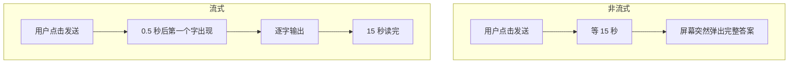
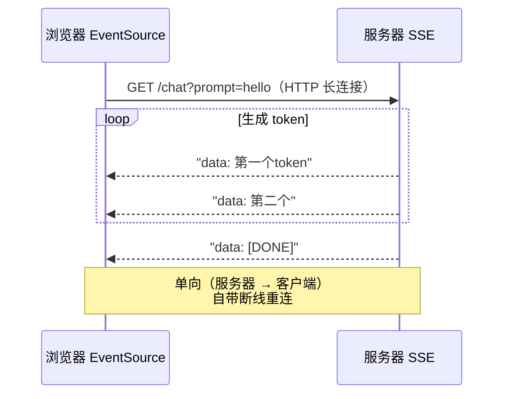
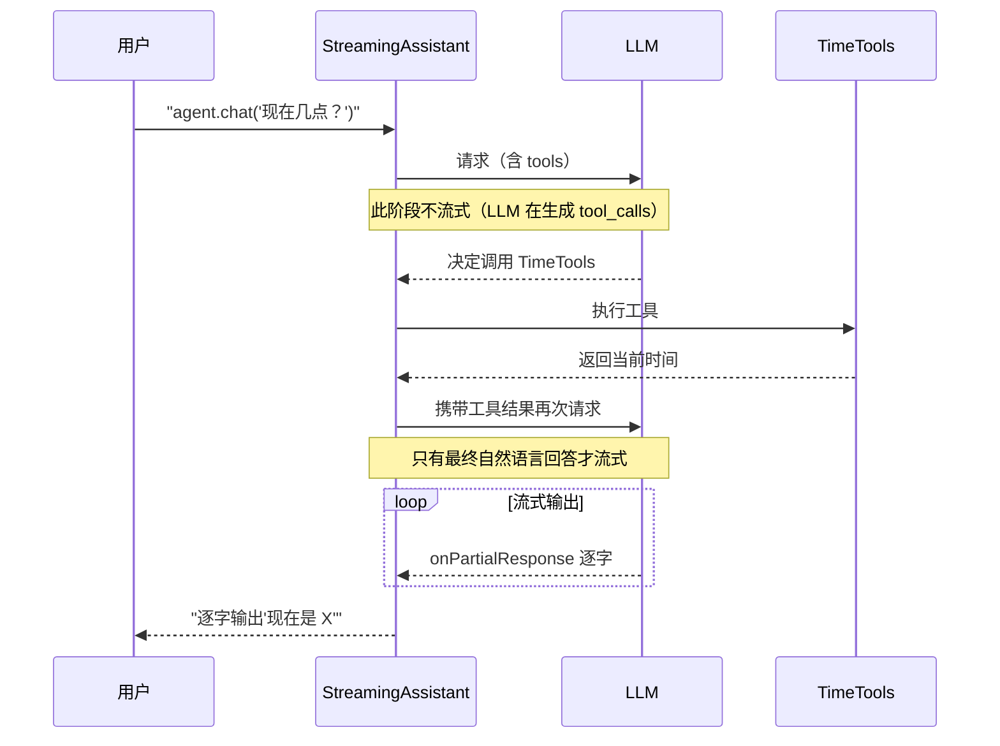
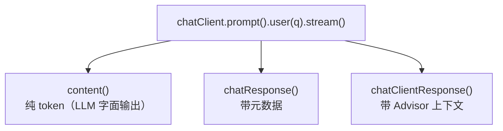
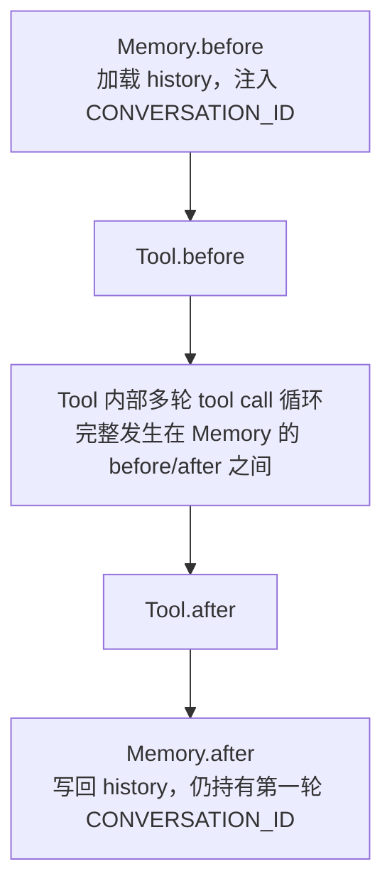
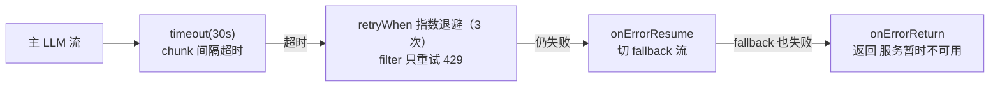
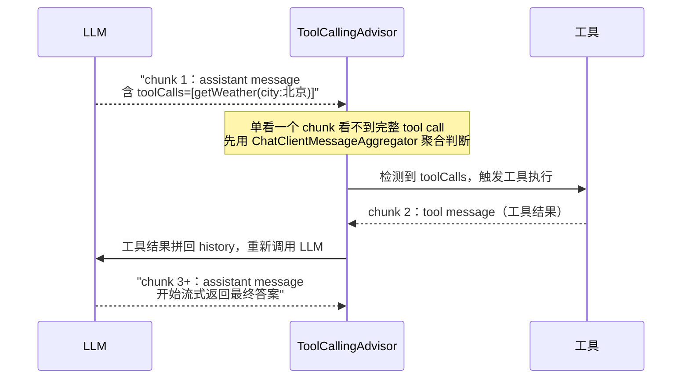

# 04 流式响应与 Reactor 深度

> 本文合并自原 11「复现手册-流式与工具调用」+ 原 26「流式 Reactor 深度」，并在开头吸收「入门-LangChain4j-06-流式输出」作为入门铺垫（流式体验 / SSE 基础 / 回调式心智模型对照）。
>
> 一篇搞定：流式响应怎么用、流式 + 工具调用怎么打通、Reactor 在 LLM 场景的所有操作符。
>
> 前提：你已会用 `@Tool` 注册工具、理解 ToolCallingAdvisor 的 Agent Loop，并清楚 Advisor 的 order 与 BaseAdvisor/Call/Stream 选择（即 02、03 的能力）。
> 预计：1.5 天

---

## 入门铺垫：流式体验、SSE 与两种心智模型

> 本小节吸收自「入门-LangChain4j-06-流式输出」（原文已并入本文，文件归档于 `../archive/absorbed-内容融合/`）。在进入 Reactor 深度之前，先建立三个共识：**流式为什么必要、底层走什么协议、回调式 vs 响应式两种心智模型**。LangChain4j 的代码在下方保留为对照。

### 铺垫 1：为什么必须流式（体验要点）

**不流式的体验灾难**：用户看不到进度，以为卡死了。用户心理学：3 秒内没反应就会怀疑程序挂了。
**流式后的体验**：用户感知"响应快"，且能边读边等。

技术原理：LLM 生成文本是**逐 token 输出**的（一个 token 大约 0.5-4 个汉字）。

- 不流式：等所有 token 生成完才返回完整字符串
- 流式：每生成一个 token 就立刻推送给客户端

**非流式 vs 流式**：



### 铺垫 2：底层协议 SSE（Server-Sent Events）

> HTTP 长连接 + 服务器持续推送文本数据。客户端用 `EventSource` 接收。

不是 WebSocket。SSE 是**单向（服务器 → 客户端）**，简单、稳定、自带断线重连。LLM 流式选 SSE 而不是 WebSocket，正因为我们只需要服务器 → 客户端这一条单向推送通道。

**SSE 响应格式**：每条消息以 `data: ` 开头、以空行分隔，结束时发 `[DONE]`。

```
data: 第一个token

data: 第二个

data: [DONE]
```

**客户端接收**：

```javascript
const es = new EventSource('/chat?prompt=hello');
es.onmessage = (e) => {
    document.body.innerHTML += e.data;
};
```

**SSE 单向推送时序**：



> 在 Spring AI 里用 `ServerSentEvent` 构造器生成这条 SSE 流，见本文 §A.2。

### 铺垫 3：回调式心智模型 —— LangChain4j 怎么流式（对照）

LangChain4j 的流式 API 是**回调式**的：流式模型的方法返回 `void`，通过回调接收数据。

```java
// 非流式（前面的入门代码用的）
import dev.langchain4j.model.openai.OpenAiChatModel;
// 流式
import dev.langchain4j.model.openai.OpenAiStreamingChatModel;

var model = OpenAiStreamingChatModel.builder()
        .baseUrl("https://api.deepseek.com")
        .apiKey(System.getenv("DEEPSEEK_API_KEY"))
        .modelName("deepseek-chat")
        .temperature(0.7)
        .build();

model.chat("讲一个长一点的笑话", new StreamingResponseHandler<>() {
    @Override
    public void onPartialResponse(String partialResponse) {
        System.out.print(partialResponse);   // 每个 token 回调一次
    }
    @Override
    public void onCompleteResponse(String completeResponse) {
        System.out.println("\n[完成]");
    }
    @Override
    public void onError(Throwable error) {
        error.printStackTrace();
    }
});
// 流式是异步的，主线程要等一下
Thread.sleep(30_000);
```

配合 AiServices 时用 `TokenStream` 接口，链式注册回调：

```java
public interface StreamingAssistant {
    TokenStream chat(String userMessage);
}

TokenStream stream = agent.chat("讲个故事");
stream.onPartialResponse(System.out::print)
      .onCompleteResponse(r -> System.out.println("\n[done]"))
      .onError(Throwable::printStackTrace)
      .start();
```

**两种心智模型的对照**：

| 框架 | 心智模型 | 你写的代码 |
|------|---------|-----------|
| LangChain4j | 回调式（`onPartialResponse` / `TokenStream`） | 注册回调 + 自己 `start()` |
| Spring AI | 响应式（`Flux<String>`） | 拿到 Flux 后任意组合操作符（本文 Part D） |

把"回调式 API 桥接进响应式 Flux"是唯一需要手工的适配（对照 Spring AI 的 `Flux` 原生支持，见 §A.1）：

```java
Flux.create(sink -> {
    TokenStream stream = agent.chat(prompt);
    stream.onPartialResponse(sink::next)
          .onCompleteResponse(response -> sink.complete())
          .onError(sink::error)
          .start();
});
```

### 铺垫 4：流式 + Tool：只有最终自然语言回答会流式（通用原则）

LangChain4j 流式 + Tool 组合的结论是通用原则：**Tool 调用过程不会流式输出（LLM 在生成 tool_calls，不是文字），只有最终自然语言回答才流式**。



> 在 Spring AI 里，LLM 的一次 tool call 在流式响应里会被切成很多 chunk，**单看一个 chunk 看不到完整 tool call**，需要先用 `ChatClientMessageAggregator` 聚合判断再触发工具（本文 §E，原理与这里的时序一致）。

### 铺垫 5：LC4j 独有经验（对照自查）

- **中文乱码**：SSE 默认按字节推，UTF-8 多字节汉字可能被切断成半个字。LangChain4j 内部按字符推已处理；自定义 SSE 实现要注意字符集编码。
- **主线程结束太快**：流式是异步的，本地测试 main 跑完时异步任务还没执行，看不到输出 → `Thread.sleep` 或 `CountDownLatch` 等待。
- **首字延迟 TTFT（Time To First Token）**：用户看到第一个字的时间。

| 优化手段 | 效果 |
|---------|------|
| 用更快的小模型 | 显著 |
| 简化 prompt | 显著 |
| 启用 vLLM 服务端 KV Cache | 显著（生产） |
| 减小 max_tokens | 无影响（与首字无关） |

- **客户端节流**：减少 DOM 操作频率，每 50ms 刷新一次 UI（用 buffer 累积再渲染），提升流畅度。

```javascript
let buffer = '';
let lastUpdate = 0;
es.onmessage = (e) => {
    buffer += e.data;
    const now = Date.now();
    if (now - lastUpdate > 50) {
        output.textContent = buffer;
        lastUpdate = now;
    }
};
```

---

## 0. 三句话讲清楚原理

1. **自动模式**：`ChatClient.builder().build()` 在内部**总是**把 `ToolCallingAdvisor`（order = `BaseAdvisor.HIGHEST_PRECEDENCE + 300`）注入 advisor 链，与你是否写 `@Bean ChatClient` 无关。官方原文："`ToolCallingAdvisor`, which is always auto-registered in the advisor chain (unless explicitly disabled)"。要全局关掉只能设 `spring.ai.chat.client.tool-calling.enabled=false`，单次调用关闭用 `.advisors(AdvisorParams.toolCallingAdvisorAutoRegister(false))`。
2. **流式中的关键坑**：LLM 的一次 tool call 在流式响应里会被切成很多 chunk，**单看一个 chunk 看不到完整 tool call**。必须先聚合再判断（用 `ChatClientMessageAggregator`）。
3. **手动模式**：当你想完全控制"几轮 tool 调用就停"或"每轮换不同 model options"时，用 `.advisors(AdvisorParams.toolCallingAdvisorAutoRegister(false))` 单次关闭，自己写 `while` 循环（官方"User-Controlled Tool Execution"模式）。

---

## Part A. 流式响应基础

### A.1 三种粒度

```java
// 1. 完整的 ChatClientResponse（含元数据）
Flux<ChatClientResponse> flux1 = chatClient.prompt()
        .user("hi")
        .stream()
        .chatClientResponse();

// 2. 只要 ChatResponse
Flux<ChatResponse> flux2 = chatClient.prompt()
        .user("hi")
        .stream()
        .chatResponse();

// 3. 只要文本 content（最常用）
Flux<String> flux3 = chatClient.prompt()
        .user("hi")
        .stream()
        .content();
```

**三种粒度关系**：



### A.2 SSE Controller

```java
@GetMapping(value = "/chat-stream", produces = MediaType.TEXT_EVENT_STREAM_VALUE)
public Flux<ServerSentEvent<String>> streamSse(@RequestParam String q) {
    return chatClient.prompt().user(q).stream().content()
            .map(chunk -> ServerSentEvent.<String>builder()
                    .event("delta")
                    .data(chunk)
                    .build())
            .concatWith(Flux.just(ServerSentEvent.<String>builder()
                    .event("done")
                    .data("[DONE]")
                    .build()))
            .onErrorResume(e -> Flux.just(ServerSentEvent.<String>builder()
                    .event("error")
                    .data(e.getMessage())
                    .build()));
}
```

### A.3 Cold vs Hot Flux

**Cold Flux**：每个订阅者都会从头开始（再调一次 LLM！）。

```java
// ❌ 反模式：两次订阅会调两次 LLM
Flux<ChatClientResponse> flux = chatClient.prompt().user("hi").stream().chatClientResponse();
flux.subscribe(...);
flux.subscribe(...);
```

**结论**：业务里一个请求一个流，不要复用。

---

## Part B. 流式 + 工具调用实战复现

### B.1 项目依赖

```xml
<dependency>
    <groupId>org.springframework.boot</groupId>
    <artifactId>spring-boot-starter-webflux</artifactId>
</dependency>
<dependency>
    <groupId>org.springframework.ai</groupId>
    <artifactId>spring-ai-starter-model-openai</artifactId>
</dependency>
```

### B.2 application.yaml

```yaml
spring:
  ai:
    openai:
      api-key: ${OPENAI_API_KEY}
      base-url: https://api.deepseek.com   # 兼容 OpenAI 协议
      chat:
        model: deepseek-chat
```

### B.3 最小工具

```java
@Component
public class TimeTools {
    @Tool(description = "获取服务器当前时间")
    public String currentTime() {
        return new Date().toString();
    }
}
```

### B.4 ChatConfig 装配

```java
@Configuration
public class ChatConfig {

    @Bean
    public ChatMemory chatMemory() {
        return MessageWindowChatMemory.builder().maxMessages(20).build();
    }

    @Bean
    public ToolCallingAdvisor toolCallingAdvisor(ToolCallingManager mgr) {
        return ToolCallingAdvisor.builder()
                .toolCallingManager(mgr)
                .advisorOrder(100)
                .build();
    }

    @Bean
    public ChatClient chatClient(ChatClient.Builder builder,
                                  ChatMemory memory,
                                  ToolCallingAdvisor toolCallingAdvisor,
                                  TimeTools timeTools) {
        return builder
                .defaultSystem("你是一个友好的助手")
                .defaultTools(timeTools)
                .defaultAdvisors(
                        MessageChatMemoryAdvisor.builder(memory).order(0).build(),
                        toolCallingAdvisor
                )
                .build();
    }
}
```

### B.5 Controller

```java
@RestController
@RequestMapping("/demo02")
public class StreamController {

    private final ChatClient chatClient;

    @GetMapping(value = "/chat-stream", produces = MediaType.TEXT_EVENT_STREAM_VALUE)
    public Flux<String> chatStream(@RequestParam String prompt,
                                    @RequestParam String sessionId) {
        return chatClient.prompt()
                .user(prompt)
                .advisors(spec -> spec.param(ChatMemory.CONVERSATION_ID, sessionId))
                .stream()
                .content();
    }
}
```

### B.6 验证

```bash
curl -N "http://127.0.0.1:8080/demo02/chat-stream?prompt=现在几点了&sessionId=aaaa"
```

预期：流式输出当前时间。

---

## Part C. 复现：两个真实的坑（2026-07-17 实战）

### C.1 坑 1（已勘误）：历史上误以为"自定义 ChatClient 短路了 ToolCallingAdvisor 自动注册"

> ⚠️ 本节是对早期版本错误说法的勘误，保留旧症状描述但**根因结论已重写**。如果你只看一节，请记住：**`ToolCallingAdvisor` 永远在 `ChatClient.builder().build()` 里被注入**，与 `@Bean ChatClient` 无关。

**曾经的说法**：自定义 `@Bean ChatClient` 后，`.stream()` 模式下 LLM 完全不调工具，被归因为"`ChatClientAutoConfiguration` 的 `ToolCallingAdvisor` 自动注册是 `@ConditionalOnMissingBean(ChatClient.class)`，写 `@Bean ChatClient` 后被短路"。

**官方文档校对后的正确结论**（2026-07-17 复核）：

Spring AI 2.0 官方文档明确说："the `ToolCallingAdvisor`, which is **always auto-registered in the advisor chain (unless explicitly disabled)**"。自动注册是在 `DefaultChatClient.Builder.build()` 里做的，**与是否有自定义 `@Bean ChatClient` 无关**。也就是说：

- `ChatClient.builder(model).defaultAdvisors(memoryAdvisor).build()` → 仍然会被 `build()` 注入 `ToolCallingAdvisor`。
- 全局关闭只有一种方式：`spring.ai.chat.client.tool-calling.enabled=false`。
- 单次调用关闭：`.advisors(AdvisorParams.toolCallingAdvisorAutoRegister(false))`。

那么历史上观察到的"自定义 ChatClient 下工具不被调用"真实原因是什么？排查清单（按出现频率）：

1. **`ChatModel` 自己处理了工具执行（2.0 已 deprecate）**：你绕过 `ChatClient` 直接调 `chatModel.stream(prompt)`，工具调用响应里 `hasToolCalls()=true` 但没有 advisor 驱动循环，永远停在第一轮。修复：走 `ChatClient`。
2. **`ToolCallingManager` 没装配或工具没被注册**：自定义 `@Bean ChatClient` 时如果同时自定义了 `defaultTools`，运行期 `tools(...)` 会**完全覆盖** `defaultTools`，看起来工具"消失"了。这是覆盖语义，不是短路。
3. **Provider 的 stop-reason 不被默认 checker 接受**：默认 `ToolExecutionEligibilityChecker` 只看 `chatResponse.hasToolCalls()`，但部分国产 provider 在工具调用的同时也会带 `stop_reason="length"`，被某些上游逻辑拦截。修复：自定义 `toolExecutionEligibilityChecker`。
4. **Advisor 顺序错误**：`ToolCallingAdvisor.DEFAULT_ORDER = HIGHEST_PRECEDENCE + 300`，`MessageChatMemoryAdvisor.DEFAULT_ORDER = HIGHEST_PRECEDENCE + 200`。如果你显式给 memory advisor 设了更高的 order（数值更大），它会在 tool loop 内层，history 加载/写回的时机不对，工具循环时上下文丢失。
5. **Memory advisor 在循环内但 `conversationHistoryEnabled=true`**：两者一起用会出现 history 重复。要么把 memory 放循环外（默认），要么 `ToolCallingAdvisor.builder().disableInternalConversationHistory()`。

**显式构造 `ToolCallingAdvisor` 的正确动机**（不是"修复短路"，而是"获得扩展点"）：

```java
@Bean
public ToolCallingAdvisor toolCallingAdvisor(ToolCallingManager mgr) {
    return ToolCallingAdvisor.builder()
            .toolCallingManager(mgr)
            .advisorOrder(BaseAdvisor.HIGHEST_PRECEDENCE + 300)
            .conversationHistoryEnabled(true)
            // 可选：自定义 stop-reason 判定
            // .toolExecutionEligibilityChecker(resp -> resp.hasToolCalls() && !isLengthStop(resp))
            .build();
}

@Bean
public ChatClient chatClient(ChatClient.Builder builder,
                              ToolCallingAdvisor toolCallingAdvisor,
                              MessageChatMemoryAdvisor memoryAdvisor) {
    // 即使这里只传 memoryAdvisor，build() 也会自动补一个 ToolCallingAdvisor；
    // 显式传入是为了定制 order、checker 等扩展点。
    return builder
            .defaultAdvisors(memoryAdvisor, toolCallingAdvisor)
            .build();
}
```

### C.2 坑 2：流式下 conversationId cannot be null NPE

**症状**：修复坑 1 后，请求返回 500，日志有 `conversationId cannot be null`。

**根因**：Advisor 顺序问题。Memory Advisor 在 `after()` 阶段要写回 history，需要 `CONVERSATION_ID`。如果 Memory 在 Tool 内层，工具循环时 context 已经被剥离。

**修复**：调整 order，让 Memory 在外、Tool 在内：

```java
.defaultAdvisors(
    MessageChatMemoryAdvisor.builder(memory).order(0).build(),   // 外
    toolCallingAdvisor                                           // 内（order=100）
)
```

**Memory 在外、Tool 在内的嵌套时序**：



### C.3 验证结果

修复后，curl 流式调用成功，工具正常被调用：

```
Fri Jul 17 01:09:15 CST 2026
```

模型回答："现在服务器时间是凌晨 01:09"。

---

## Part D. Reactor 在 LLM 流里的常用操作符

### D.1 map / filter / scan

```java
chatClient.prompt().user("写首诗").stream().content()
        .filter(chunk -> !chunk.isBlank())
        .map(chunk -> "[chunk] " + chunk)
        .scan("", (acc, chunk) -> acc + chunk)   // 滚动聚合
        .doOnNext(System.out::print)
        .blockLast();
```

### D.2 buffer / reduce / collectList

```java
// 每 10 个 chunk 一组
chatClient.prompt().user("...").stream().content()
        .buffer(10)
        .map(chunks -> String.join("", chunks));

// 流结束拿完整结果
String full = chatClient.prompt().user("...").stream().content()
        .reduce("", String::concat)
        .block();
```

### D.3 flatMap vs concatMap vs switchMap

```java
// flatMap：并发处理，不保序
flux.flatMap(chunk -> asyncTranslate(chunk), 10);   // 并发 10

// concatMap：保序，串行
flux.concatMap(chunk -> asyncTranslate(chunk));

// switchMap：新值来取消上一次订阅（用于"用户输入变化时取消"）
userInputFlux.switchMap(input -> chatClient.prompt().user(input).stream().content());
```

### D.4 错误处理：onErrorResume / retry / onErrorReturn

```java
chatClient.prompt().user("hi").stream().content()
        .timeout(Duration.ofSeconds(30))   // 30 秒没新 chunk 就报错
        .retryWhen(Retry.backoff(3, Duration.ofSeconds(1))
                .filter(e -> e instanceof WebResponseException
                        && ((WebResponseException) e).getStatusCode() == HttpStatus.TOO_MANY_REQUESTS))
        .onErrorResume(e -> {
            log.warn("Falling back", e);
            return fallbackClient.prompt().user("hi").stream().content();
        })
        .onErrorReturn("服务暂时不可用");
```

**关键**：`retryWhen` 的 filter 决定哪些错误才重试 —— 不要 retry 4xx（永久错误）。

**错误处理链**：



### D.5 timeout vs take

```java
// timeout：两个 chunk 之间的间隔超时
flux.timeout(Duration.ofSeconds(30));

// take：整个流的时长上限
flux.take(Duration.ofSeconds(60));

// 两者结合用
flux.timeout(Duration.ofSeconds(30))
    .take(Duration.ofSeconds(60));
```

### D.6 背压

```java
flux.onBackpressureBuffer();                          // 缓冲所有（默认）
flux.onBackpressureBuffer(100, DROP_OLDEST);          // 缓冲上限
flux.onBackpressureDrop();                            // 消费者跟不上就丢
flux.onBackpressureError();                           // 报错
```

### D.7 控制并发

```java
Flux.fromIterable(queries)
        .flatMap(query -> chatClient.prompt()
                .user(query)
                .stream()
                .content()
                .collectList(),
                10)   // 最多 10 个并发
        .subscribe();
```

---

## Part E. 流式下检测工具调用

### E.1 工具调用在流中是什么样的



### E.2 用 ChatClientMessageAggregator 旁路聚合

```java
@GetMapping("/chat-stream")
public Flux<String> chatStream(@RequestParam String q) {
    Flux<ChatClientResponse> flux = chatClient.prompt()
            .user(q)
            .stream()
            .chatClientResponse();

    // 旁路聚合，不阻塞主流
    new ChatClientMessageAggregator().aggregateChatClientResponse(flux, aggregated -> {
        log.info("Tool calls: {}", aggregated.chatResponse().getMetadata());
        metrics.recordUsage(aggregated.chatResponse().getMetadata().getUsage());
    });

    // 主流仍然把每个 chunk 输出给客户端
    return flux.map(resp -> resp.chatResponse().getResult().getOutput().getText())
            .filter(Objects::nonNull);
}
```

---

## Part F. 流式实战模式

### F.1 边流边检测关键词

```java
public Flux<String> safeStream(String q) {
    return chatClient.prompt().user(q).stream().content()
            .scan(new StringBuilder(), StringBuilder::append)
            .map(StringBuilder::toString)
            .flatMap(current -> {
                String lastChunk = current.substring(/* last emit length */);
                if (sensitiveWordDetector.contains(lastChunk)) {
                    return Flux.error(new RuntimeException("Sensitive content detected"));
                }
                return Flux.just(lastChunk);
            });
}
```

### F.2 多流并发（不同视角）

```java
public Flux<String> multiPerspective(String question) {
    Flux<String> tech = perspectiveClient.prompt()
            .user("从技术角度回答：" + question)
            .stream().content()
            .map(chunk -> "[技术] " + chunk);

    Flux<String> biz = perspectiveClient.prompt()
            .user("从业务角度回答：" + question)
            .stream().content()
            .map(chunk -> "[业务] " + chunk);

    return Flux.merge(tech, biz);
}
```

### F.3 用户取消

```java
@GetMapping(value = "/chat-stream", produces = MediaType.TEXT_EVENT_STREAM_VALUE)
public Flux<String> stream(@RequestParam String q) {
    return chatClient.prompt().user(q).stream().content()
            .doOnCancel(() -> {
                log.info("Client cancelled stream");
                metrics.counter("ai.stream.cancelled").increment();
            });
}
```

客户端断开连接时，WebFlux 自动取消订阅。

---

## Part G. 线程模型

### G.1 不要在 Flux 操作符内调阻塞 API

```java
// ❌ 反模式：阻塞 Netty 线程
flux.map(chunk -> jdbc.queryForMap("SELECT ..."));

// ✅ 正模式：切到 boundedElastic
flux.publishOn(Schedulers.boundedElastic())
    .map(chunk -> jdbc.queryForMap("SELECT ..."));

// 或者
flux.flatMap(chunk -> Mono.fromCallable(() -> jdbc.queryForMap("..."))
        .subscribeOn(Schedulers.boundedElastic()));
```

### G.2 BaseAdvisor 的 getScheduler

BaseAdvisor 抽象出 `getScheduler()`：

```java
@Override
public Scheduler getScheduler() {
    return Schedulers.boundedElastic();   // after() 跑在这
}
```

如果 Advisor 的 `after()` 调阻塞 API（DB、Redis），把它放到 boundedElastic，避免阻塞 event loop。

---

## Part H. 调试技巧

### H.1 doOnNext / log

```java
flux.doOnNext(chunk -> log.debug("chunk: [{}]", chunk))
    .doOnComplete(() -> log.debug("complete"))
    .doOnCancel(() -> log.debug("cancelled"))
    .doOnError(e -> log.error("error", e));

flux.log("before-filter")
    .filter(...)
    .log("after-filter");
```

### H.2 BlockHound 检测阻塞

```java
BlockHound.install();   // 测试代码加
// 如果有 .block() 在 reactive 线程会报错
```

---

## Part I. 实战避坑

### I.1 "在 Flux 操作符里 block()"

**症状**：服务卡死。

**解决**：用 `Mono.fromCallable` 包装阻塞调用，或 `publishOn(boundedElastic())`。

### I.2 "retry 把永久错误也 retry 了"

用 `Retry.backoff().filter(...)` 只 retry 5xx 和超时，跳过 4xx。

### I.3 "工具调用流式下丢 chunk"

某个 Advisor 在 `after()` 阶段吞了第一个 chunk。用 `ChatClientMessageAggregator` 旁路聚合，不修改主流。

### I.4 "并发太高打爆 LLM API"

`flatMap(fn, concurrency)` 第二参数限并发；用 Resilience4j Bulkhead。

### I.5 "流式输出图像分析时丢内容"

流式 chunk 较小，前端拼接处理不当。见本文 §D.1 的 scan 滚动聚合模式。

### I.6 "`.stream()` 报 No StreamAdvisors available to execute"

**症状**：

```
java.lang.IllegalStateException: No StreamAdvisors available to execute
    at DefaultAroundAdvisorChain.lambda$nextStream$6(DefaultAroundAdvisorChain.java:129)
```

**根因**：配置了只实现 `CallAroundAdvisor`（用于 `.call()`）的 Advisor 作为 defaultAdvisor，然后调了 `.stream()`。

Spring AI 2.0.0 把 Advisor 拆成了两个接口：

| 接口 | 适用于 |
|------|--------|
| `CallAroundAdvisor` | `chatClient.prompt()...call()` |
| `StreamAroundAdvisor` | `chatClient.prompt()...stream()` |

当调用 `.stream()` 时，`DefaultAroundAdvisorChain` 会筛选所有实现了 `StreamAroundAdvisor` 的 Advisor。如果一个都没有，直接抛 `No StreamAdvisors available to execute`。

**Spring AI 2.0.0 内置 Advisor 兼容性**：

| Advisor | CallAround | StreamAround |
|---------|-----------|-------------|
| `MessageChatMemoryAdvisor` | ✅ | ❌ |
| `ToolCallingAdvisor` | ✅ | ✅ |
| `SimpleLoggerAdvisor` | ✅ | ✅ |

**解决**：

- **方案一**：不用该 Advisor，改用手动管理。例如 `MessageChatMemoryAdvisor` 不支持 stream → 直接注入 `ChatMemory`，在 `Flux.defer()` 里手动 `memory.add()`/`memory.get()`，流结束时保存 AssistantMessage。这套"手动 + defer"就是流式记忆管理的核心模式。
- **方案二**：改用 `.call()` 代替 `.stream()`，放弃流式输出。

---

## Part J. 实战任务

1. 跑通本文 B 部分的 ChatConfig + Controller，curl 验证流式 + 工具调用。
2. 用 `scan` 实现边流边检测关键词，检测到立即 cut。
3. 用 `concatMap` 实现流式翻译（英→中，保序）。
4. 用 `retryWhen` 实现 429 自动重试（指数退避，3 次）。
5. 用 `timeout` + `take(Duration)` 同时设 chunk 间隔超时和整流超时。
6. 实现 fallback 链：主 LLM 流报错时切 fallback LLM 流。
7. （进阶）用 Sinks 实现一个流多订阅者共享。
8. （选做）用 BlockHound 检测项目里的阻塞调用。

---

## K. 理解检查

1. Cold Flux 和 Hot Flux 区别？Spring AI 的 stream() 是哪种？
2. `flatMap` / `concatMap` / `switchMap` 各自特点？
3. `timeout(Duration)` 和 `take(Duration)` 区别？
4. Spring AI 2.0 下如何关闭 ToolCallingAdvisor 的自动注册？为什么"自定义 `@Bean ChatClient` 短路自动注册"这个说法是错的？
5. 流式下 conversationId NPE 的根因和修复？
6. 为什么不能在 Flux 操作符内调阻塞 API？怎么解决？
7. 回调式（LangChain4j `TokenStream`）和响应式（Spring AI `Flux`）两种心智模型各自怎么写？桥接时用哪个操作符？
8. SSE 和 WebSocket 有什么区别？为什么 LLM 流式用 SSE 而不是 WebSocket？
9. 流式 + Tool 时，哪些内容会流式、哪些不会？

---

## L. 相关文档

- [Project Reactor Reference](https://projectreactor.io/docs/core/release/reference/)
- 入门对照（已归档）：`../archive/absorbed-内容融合/入门-LangChain4j-06-流式输出（内容并入主线-SpringAI2.0-04-流式响应与Reactor深度）.md`

---

> 💡 **卡壳了？** 概念不懂查 `../理论/` 字典（01-16）；响应式 / Redis / Kafka / SSE / 事务等底层背景去 `../附录/` 对应专题补基础。
