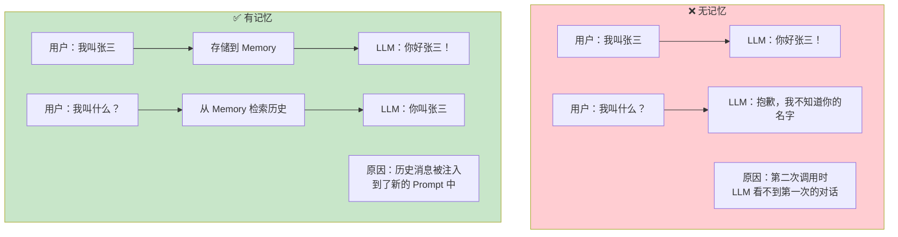
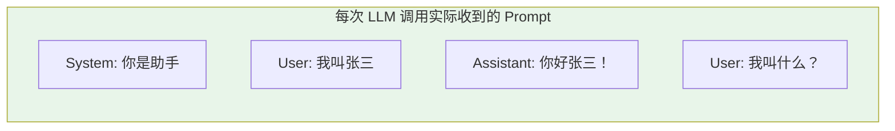
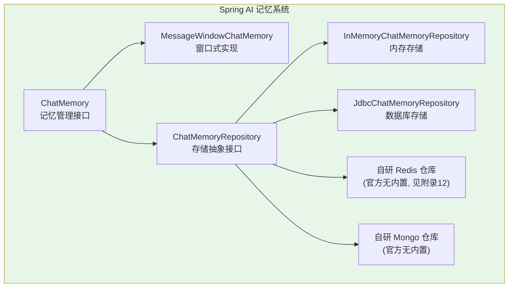
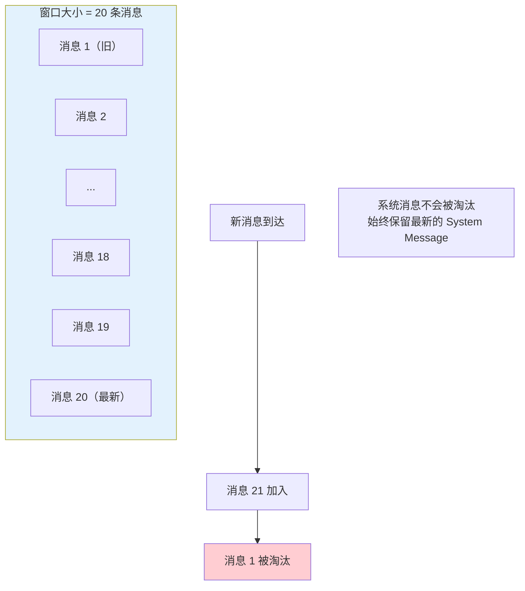
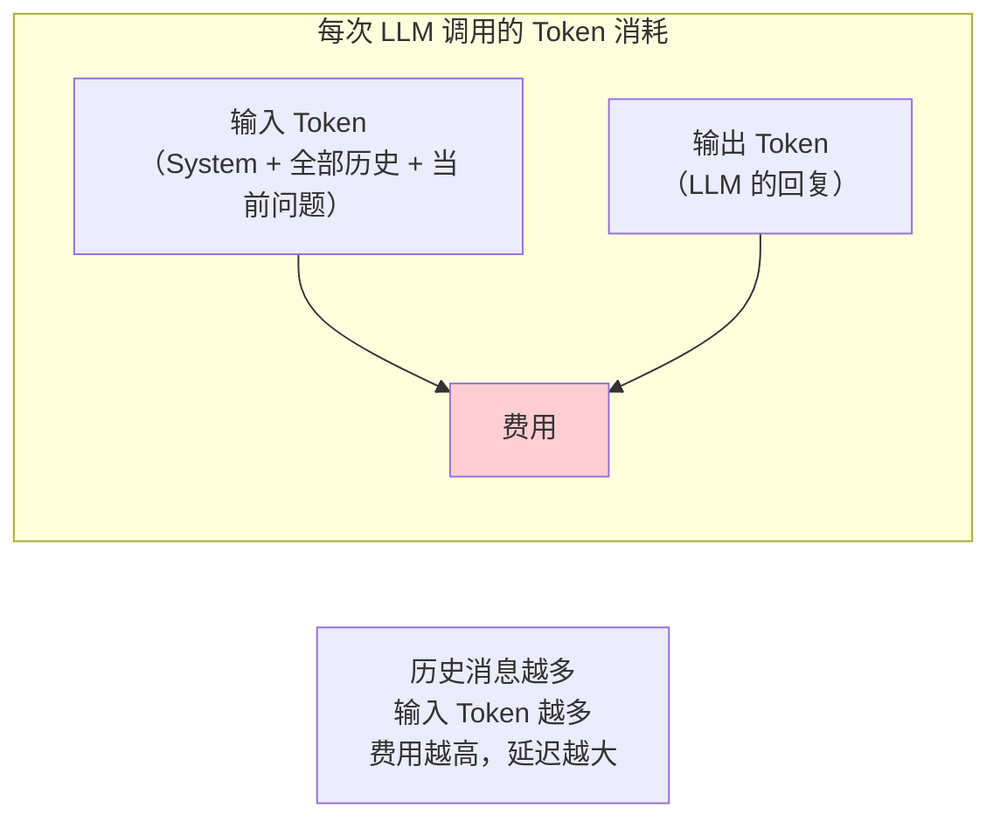
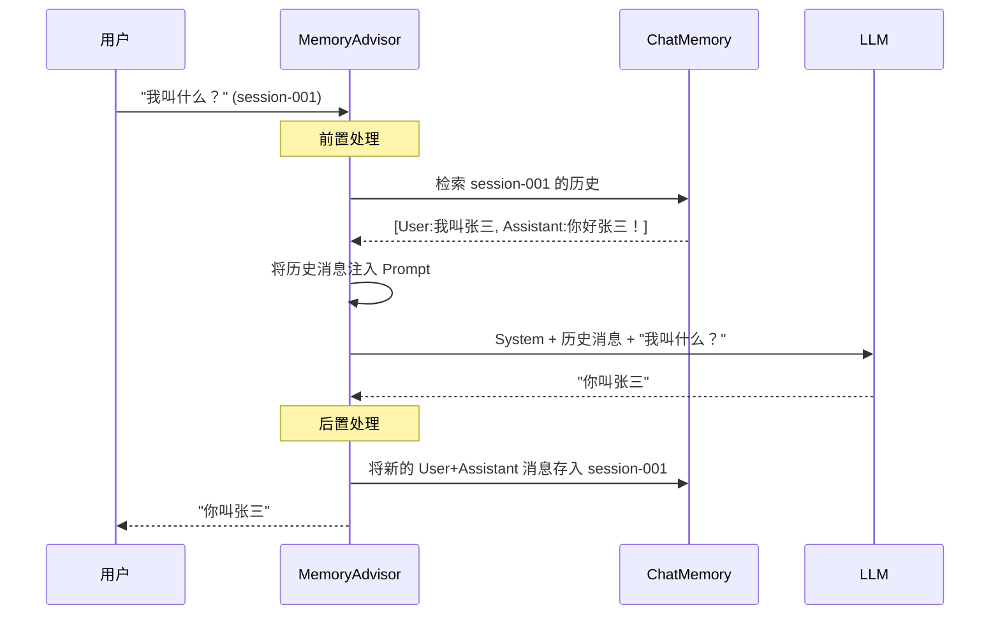
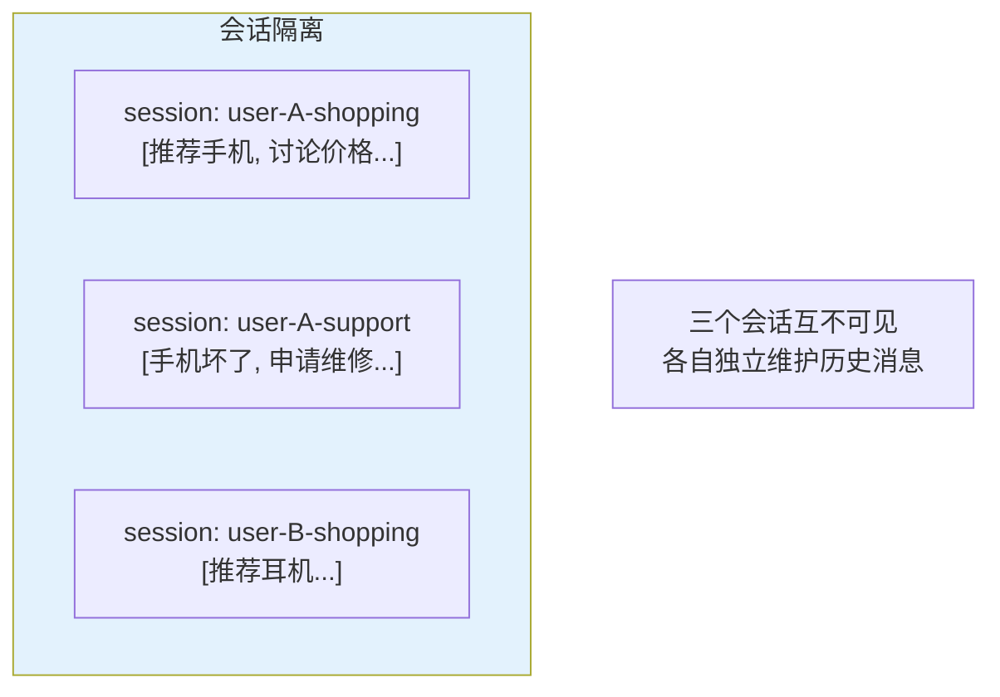
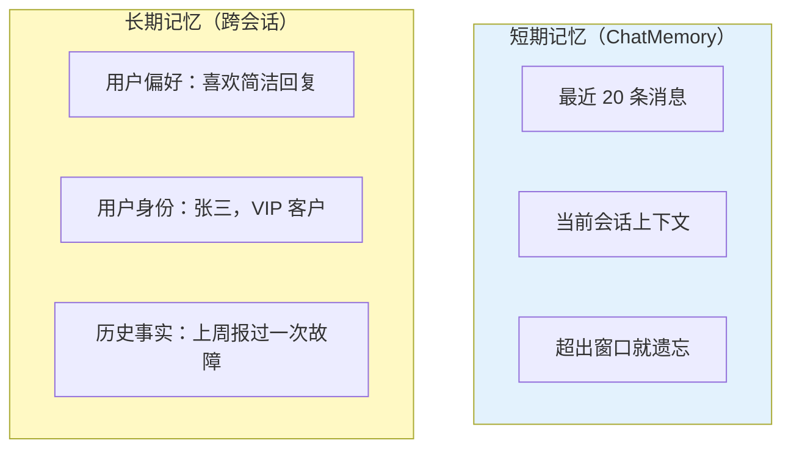

# 04-记忆与会话管理

> **定位**：讲透 Agent 的记忆系统——ChatMemory API、MessageWindowChatMemory、会话隔离、持久化存储、短期 vs 长期记忆的区别与设计。读完这篇，你的 Agent 能记住多轮对话的上下文。
>
> **读者画像**：已经会让 Agent 调用工具，需要实现多轮对话能力。
>
> **前置阅读**：[03-工具调用](03-工具调用.md)。

---

## 1. 为什么 LLM 需要记忆

LLM 是**无状态**的。每次调用都是独立的——它不会自动记住你上一句话说了什么。



### 记忆的本质

所谓"记忆"，就是**在每次调用 LLM 时，把之前的对话历史一起发过去**。LLM 不是"记住"了，而是每次都"看到了"完整的历史。



---

## 2. ChatMemory API

### 2.1 核心接口

Spring AI 2.0 的记忆系统由两个核心接口组成：



- **`ChatMemory`**：记忆管理——添加消息、检索历史、清理历史
- **`ChatMemoryRepository`**：存储实现——可以存内存、数据库、Redis 等

### 2.2 MessageWindowChatMemory

这是 Spring AI 内置的实现，使用**滑动窗口**策略管理消息：

```java
import org.springframework.ai.chat.memory.MessageWindowChatMemory;
import org.springframework.ai.chat.memory.ChatMemory;

// 创建记忆实例——保留最近 20 条消息
ChatMemory chatMemory = MessageWindowChatMemory.builder()
        .maxMessages(20)
        .build();
```

**滑动窗口的工作方式**：



**关键规则**：
- 当消息数超过 `maxMessages` 时，最旧的消息被淘汰
- **System Message 永远不会被淘汰**——它定义了 Agent 的人格
- 如果新的 System Message 加入，旧的 System Message 会被替换

### 2.3 为什么不保留全部历史

因为 **Token = 钱 + 上下文窗口限制**。



| 历史消息数 | 预估输入 Token | 费用影响 |
|-----------|---------------|---------|
| 0 条 | ~100 | 基准 |
| 10 条 | ~1,000 | 10x |
| 50 条 | ~5,000 | 50x |
| 100 条 | ~10,000 | 100x |

滑动窗口是成本与记忆深度的平衡。

> **想深入？→ [教程 34-上下文工程]**：更高级的记忆管理——上下文压缩、Token 预算分配、渐进式披露。
> **想深入？→ [教程 39-高级记忆架构]**：三层记忆架构、记忆演化与衰减。

---

## 3. Memory Advisor：自动注入记忆

### 3.1 MessageChatMemoryAdvisor

手动管理记忆很繁琐——每次调用都要取出历史、拼接、发请求、再存回去。`MessageChatMemoryAdvisor` 自动完成这一切：

```java
import org.springframework.ai.chat.client.advisor.MessageChatMemoryAdvisor;
import org.springframework.ai.chat.memory.ChatMemory;

// 1. 创建 Memory
ChatMemory chatMemory = MessageWindowChatMemory.builder()
        .maxMessages(20)
        .build();

// 2. 将 Memory Advisor 加入 ChatClient
ChatClient client = ChatClient.builder(chatModel)
        .defaultAdvisors(
                MessageChatMemoryAdvisor.builder(chatMemory).build()
        )
        .build();

// 3. 调用时指定会话 ID
String answer = client.prompt()
        .user("我叫张三")
        .advisors(a -> a.param(ChatMemory.CONVERSATION_ID, "session-001"))
        .call()
        .content();

// 第二轮对话——Agent 记住了
String answer2 = client.prompt()
        .user("我叫什么名字？")
        .advisors(a -> a.param(ChatMemory.CONVERSATION_ID, "session-001"))
        .call()
        .content();
// answer2 = "你叫张三"
```

> **重要**：`ChatMemory.CONVERSATION_ID` 是**必填参数**。每次调用 Memory Advisor 的请求都必须提供，否则抛出 `IllegalArgumentException`。

### 3.2 Advisor 自动做了什么



---

## 4. 会话隔离

### 4.1 多用户多会话

不同的 `CONVERSATION_ID` 完全隔离：

```java
// 用户 A 的会话
client.prompt()
        .user("帮我查订单 ORD-001")
        .advisors(a -> a.param(ChatMemory.CONVERSATION_ID, "user-A"))
        .call()
        .content();

// 用户 B 的会话——看不到用户 A 的对话
client.prompt()
        .user("帮我查订单 ORD-002")
        .advisors(a -> a.param(ChatMemory.CONVERSATION_ID, "user-B"))
        .call()
        .content();

// 同一用户的多个会话也隔离
// 用户 A 的购物咨询
client.prompt()
        .user("推荐一款手机")
        .advisors(a -> a.param(ChatMemory.CONVERSATION_ID, "user-A-shopping"))
        .call()
        .content();

// 用户 A 的售后咨询——与购物咨询隔离
client.prompt()
        .user("我的手机坏了")
        .advisors(a -> a.param(ChatMemory.CONVERSATION_ID, "user-A-support"))
        .call()
        .content();
```



> **遇到阻塞？→ [教程 26-多租户隔离与资源治理]**：多租户场景下的会话隔离、资源配额、数据隔离。

---

## 5. 持久化存储

### 5.1 默认内存存储（开发用）

```java
// 默认使用 InMemoryChatMemoryRepository
// 应用重启后记忆丢失——仅适合开发调试
ChatMemory chatMemory = MessageWindowChatMemory.builder()
        .maxMessages(20)
        .build();
```

### 5.2 数据库持久化（生产用）

**需在 pom.xml 中添加依赖**：

```xml
<!-- 需在 pom.xml 中添加依赖 -->
<dependency>
    <groupId>org.springframework.ai</groupId>
    <artifactId>spring-ai-model-chat-memory-jdbc</artifactId>
</dependency>
<dependency>
    <groupId>org.springframework.boot</groupId>
    <artifactId>spring-boot-starter-jdbc</artifactId>
</dependency>
```

```java
import org.springframework.ai.chat.memory.repository.jdbc.JdbcChatMemoryRepository;

@Bean
ChatMemory chatMemory(JdbcChatMemoryRepository repository) {
    return MessageWindowChatMemory.builder()
            .chatMemoryRepository(repository)
            .maxMessages(20)
            .build();
}
```

Spring AI 会自动创建所需的数据库表（`SPRING_AI_CHAT_MEMORY` 等）。

### 5.3 Redis 持久化

**需在 pom.xml 中添加依赖**：

```xml
<!-- 需在 pom.xml 中添加依赖 -->
<dependency>
    <groupId>org.springframework.ai</groupId>
    <artifactId>spring-ai-model-chat-memory-redis</artifactId>
</dependency>
<dependency>
    <groupId>org.springframework.boot</groupId>
    <artifactId>spring-boot-starter-data-redis</artifactId>
</dependency>
```

```java
// 真实 API 提示: 官方仓库仅 InMemory / JDBC（Redis/Mongo 需自研实现 ChatMemoryRepository）
// 见附录 05-SpringAI2-API基准/00 §2.2。生产用 JDBC（可审计）:
import org.springframework.ai.chat.memory.MessageWindowChatMemory;
import org.springframework.ai.chat.memory.ChatMemory;
import org.springframework.ai.chat.memory.repository.JdbcChatMemoryRepository;

@Bean
ChatMemory chatMemory(JdbcChatMemoryRepository repository) {
    return MessageWindowChatMemory.builder()
            .chatMemoryRepository(repository)
            .maxMessages(20)
            .build();
}
// Redis 热存储的自研实现见 [教程 19 §热数据]（官方无内置 Redis 仓库）
```

| 存储方式 | 适用场景 | 优势 | 劣势 |
|---------|---------|------|------|
| **内存** | 开发调试 | 零配置、极快 | 重启丢失 |
| **JDBC** | 生产、需要审计 | 持久化、可审计 | 性能一般 |
| **Redis**（需自研仓库） | 生产、高并发 | 极快、TTL 自动过期 | 官方无内置，需自研实现 ChatMemoryRepository |
| **MongoDB** | 生产、非结构化 | 灵活的文档结构 | 需运维 MongoDB |

> **遇到阻塞？→ [教程 25-历史记录持久化与合规]**：会话归档、对话回放、审计留存、数据生命周期管理。

---

## 6. 短期记忆 vs 长期记忆

滑动窗口管理的是**短期记忆**——只有最近 N 条消息。但有些信息应该**长期保留**：



### 实现长期记忆的两种方式

**方式一：System Message 注入（简单）**

```java
// 从用户 Profile 中提取关键信息，注入 System Message
String userProfile = userProfileService.getSummary(userId);
// userProfile = "用户姓名：张三，VIP 等级：黄金，偏好：简洁回复"

ChatClient client = ChatClient.builder(chatModel)
        .defaultSystem("你是客服助手。当前用户信息：" + userProfile)
        .build();
```

**方式二：RAG 检索（灵活）**

将用户历史交互存入向量数据库，每次对话时检索相关的历史记忆注入 Prompt。这种方式更灵活，能处理大量历史数据。

> **遇到阻塞？→ [教程 05-RAG检索增强生成]**：了解向量存储和检索的工作原理。
> **想深入？→ [教程 39-高级记忆架构]**：三层记忆架构（短期→长期→外部 RAG）的完整设计。

---

## 7. 清理记忆

```java
// 清除指定会话的全部历史
chatMemory.clear(String conversationId);

// 使用 Memory Advisor 时清除某个会话
// 通常在 Controller 中提供"重置对话"功能
@GetMapping("/chat/reset")
public String reset(@RequestParam String sessionId) {
    chatMemory.clear(sessionId);
    return "对话已重置";
}
```

---

## 8. 适用场景与不适用场景

### ✅ 适用场景

- 多轮对话（客服、咨询、辅导）
- 需要上下文连贯的场景（"他说的那个问题" → 需要记住之前的话题）
- 个性化服务（记住用户偏好）

### ❌ 不适用场景

- 一次性问答（无状态 API 调用，不需要记忆）
- 对话轮数极多的场景（窗口会淘汰早期消息——需要长期记忆方案）
- 严格无状态要求（如 RESTful 公开 API）

---

## 9. 本章总结

| 概念 | 一句话 |
|------|--------|
| **记忆的本质** | 每次调用时把历史消息一起发给 LLM |
| **MessageWindowChatMemory** | 滑动窗口实现，保留最近 N 条消息 |
| **MessageChatMemoryAdvisor** | 自动检索历史→注入 Prompt→存储新消息 |
| **CONVERSATION_ID** | 会话唯一标识，**必填**，实现多用户/多会话隔离 |
| **持久化** | 生产环境用 JDBC/Redis，不要用内存存储 |
| **短期 vs 长期** | 窗口=短期记忆；用户偏好/跨会话事实=长期记忆 |

**下一篇**：[05-RAG 检索增强生成](05-RAG检索增强生成.md) — 向量存储、Embedding、检索策略、RAG 全流程。

---

> **想深入？→ [教程 39-高级记忆架构]**：三层记忆架构、语义记忆 vs 情景记忆、记忆演化与衰减。
> **想深入？→ [附录 01-LLM基础理论/02-上下文窗口与Token.md]**：理解上下文窗口限制如何影响记忆策略。
