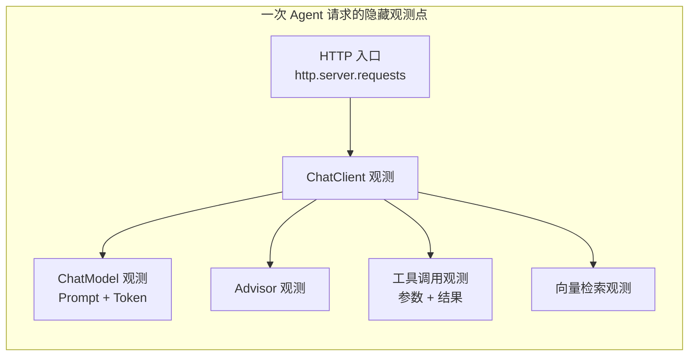
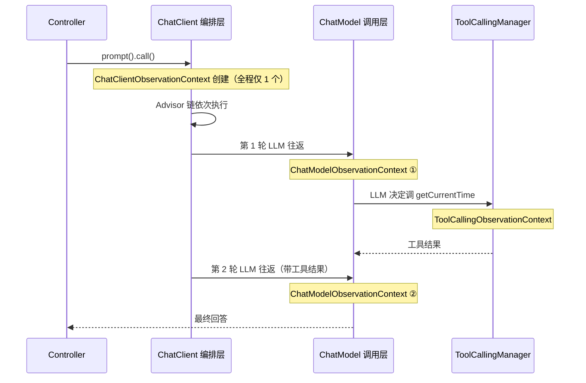
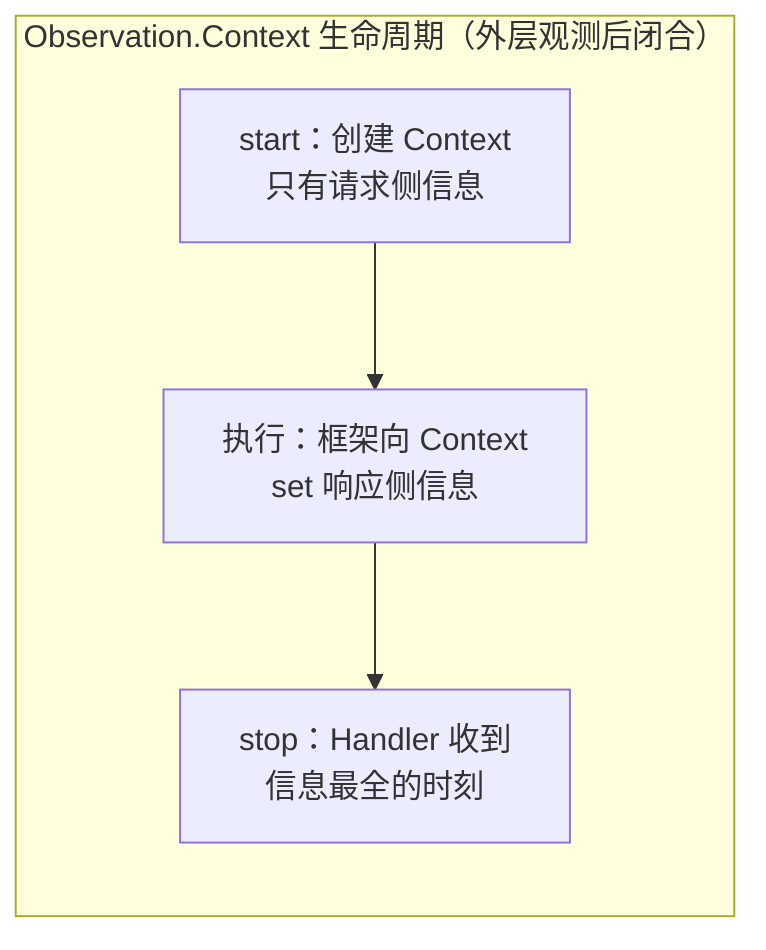

# 00 最小闭环：让 Agent 的每次思考与工具调用打印到控制台

> **定位**：本系列的起点不是"Observation 概念课"，而是一个你在工业场景里真实关心的问题——**我的 Agent 到底经历了哪些阶段？LLM 收到了什么？工具带了什么参数、返回了什么？** 这一篇先把这些"看见"，最朴素地落在 console 上。跑通它，你就拥有了整个系列的实验田。
>
> **读者画像**：已经在用 Spring AI 2.0 写 Agent（ChatClient + @Tool），想让调用过程可观测的 Java 工程师。默认你已跑通 demo01 基础工程（demo profile：webflux + spring-ai-openai + lombok）。
>
> **前置阅读**：[教程 00-基础与核心/02-ChatClient与对话模型]、[教程 00-基础与核心/03-工具调用]。
> **版本基准**：Spring Boot 4.1.0 + Spring AI 2.0.0 + WebFlux + Java 21，全部 API 经本地 jar javap 实证（铁律 0）。

---

## 0.1 为什么 Observation 是你在 Spring AI 2.0 里"捡到的宝"

你在学 Spring AI 2.0 时无意撞见 Observation——这不是偶然。Spring AI 2.0 在**每一个关键阶段都预埋了观测点**（本地 jar 实证）：

| 观测点 | 所在 jar | 领域 Context（真实类名） | 你能看到什么 |
|---|---|---|---|
| ChatClient 调用 | spring-ai-client-chat | `ChatClientObservationContext` | 一次 `.prompt().call()` 的整体耗时、请求参数 |
| ChatModel 调用 | spring-ai-model | `ChatModelObservationContext` | 发给 LLM 的完整 Prompt、返回的 ChatResponse、**Token 用量** |
| 工具调用 | spring-ai-model | `ToolCallingObservationContext` | `getToolDefinition()`（工具名/描述/Schema）、`getToolCallArguments()`（入参 JSON）、`getToolCallResult()`（返回值） |
| Advisor | spring-ai-client-chat | `AdvisorObservationContext` | 每个 Advisor 的执行耗时 |
| 向量检索 | spring-ai-vector-store | `VectorStoreObservationContext` | 检索维度、TopK、命中文档数 |



关键认知：**你一行观测代码都不用写，这些观测点已经在框架里**。你要做的只是"接上收音机"——注册一个 `ObservationHandler`，把观测事件收下来。工业场景里这意味着：巡检 Agent 调了哪个设备的接口、参数对不对、LLM 幻觉前收到了什么上下文——全部有据可查。

> 「想深入 Micrometer Observation 通用原理？→ [教程 04-企业级架构主干/02-全链路可观测性 §2]」

## 0.2 Context 深读：每一类在哪个阶段执行、能拿到什么

0.1 的一览表回答了"有什么"，这一节回答三个更关键的问题：**每类 Context 何时被创建（执行阶段）、stop 时能从里面取到什么信息、写代码怎么取**。所有类名与方法名均经本地 jar javap 实证（铁律 0）。聚焦本篇主线**工具调用路径**上的四类 Context；`VectorStoreObservationContext` 属 RAG 场景，留在 09 关随知识库一起讲（本篇不引其依赖、不写其样例）。

### 0.2.1 先拆掉最容易混的雷：ChatClientObservationContext vs ChatModelObservationContext

这两个类名字只差 `Client`/`Model` 三个词，console 里都长得像"AI 调用观测"，但它们是**两个层级、两个 jar、两种触发节奏**的东西：

| 维度 | `ChatClientObservationContext` | `ChatModelObservationContext` |
|---|---|---|
| 所在 jar / 包 | spring-ai-client-chat / `org.springframework.ai.chat.client.observation` | spring-ai-model / `org.springframework.ai.chat.observation` |
| 观测事件名 | `spring.ai.chat.client` | `gen_ai.client.operation`（语义约定命名，非 spring.ai 前缀） |
| 继承结构 | 直接继承 `Observation.Context` | 继承 `ModelObservationContext<Prompt, ChatResponse>`（泛型固定为"发给模型的请求/模型原始返回"） |
| **触发位置** | `ChatClient` 编排层：包住**整个 Advisor 链**的执行 | `ChatModel` 调用层：Advisor 链走完后真正发起的**每一次 LLM 往返** |
| **触发次数** | 一次 `.prompt().call()` **恰好 1 个** | 工具循环有几轮 LLM 往返就有**几个**（本篇 demo：问时间 = 第 1 次决定调工具 + 第 2 次汇总结果 = **2 个**） |
| 请求侧能看到 | `getRequest()` → `ChatClientRequest`（record：`prompt()` + `context()`——业务侧上下文） | `getRequest()` → `Prompt`（`getSystemMessage()`/`getUserMessage()`/`getOptions()`——真正发给模型的原文） |
| 响应侧能看到 | `getResponse()` → `ChatClientResponse`（编排层结果） | `getResponse()` → `ChatResponse`（`getResult().getOutput().getText()` + `getMetadata().getUsage()` **Token 用量**） |
| 其他信息 | `getAdvisors()`（本次生效的 Advisor 列表）、`isStream()` | `isStreaming()` |
| 排查视角 | "这次问答整体经历了什么、编排是否正确"（应用层） | "模型实际收到了什么、花了多少 Token"（模型层/成本层） |

**一个必须建立的心智模型**：两者是**外层套内层**的关系，不是二选一——



对照 0.8 的实测现象你会豁然开朗：console 里出现**两段** LLM 观测、却只有**一段** `spring.ai.chat.client`——因为 ChatModel 层观测跟着"往返次数"走，ChatClient 层观测跟着"业务请求"走。**做 Token 成本统计要去 ChatModel 层**（Usage 挂在 `ChatResponse` 上，每个 Context 各记一次，相加才是一次问答的总消耗）；**做请求级审计/耗时统计去 ChatClient 层**。

### 0.2.2 每类 Context 一个样例：亲手取一遍里面的信息

先看工具调用路径上四类观测点的**创建与闭合时序**（这是理解"能拿到什么"的前提——start 时只有请求侧信息，响应侧信息在 stop 前才被塞进 Context）：



demo01 的代码习惯：**每类 Context 一个 `ObservationHandler<具体Context>` Bean**——泛型直接写具体 Context 类型，`supportsContext` 用 instanceof 判型，回调里的 `context` 无需强转；日志用 `@Slf4j` 中文 `log.info`；模型响应取值前用 `ObjectUtils.isEmpty` 链式判空。下面这份 `ObservationContextHandler`（完整文件，四类各一个 Bean）既是本篇的取值样例，也是 0.5 Step 2 要落进工程的"收音机"。每个 getter 都真实存在于本地 2.0.0 jar：

```java
// src/main/java/demo/demo01/config/ObservationContextHandler.java（完整文件）
package demo.demo01.config;

import io.micrometer.observation.Observation;
import io.micrometer.observation.ObservationHandler;
import lombok.extern.slf4j.Slf4j;
import org.springframework.ai.chat.messages.AssistantMessage;
import org.springframework.ai.chat.client.advisor.observation.AdvisorObservationContext;
import org.springframework.ai.chat.client.observation.ChatClientObservationContext;
import org.springframework.ai.chat.observation.ChatModelObservationContext;
import org.springframework.ai.tool.observation.ToolCallingObservationContext;
import org.springframework.context.annotation.Bean;
import org.springframework.context.annotation.Configuration;
import org.springframework.util.ObjectUtils;

@Configuration
@Slf4j
public class ObservationContextHandler {

    /** ① 工具调用：LLM 每决定调一次工具就有一个观测 */
    @Bean
    public ObservationHandler<ToolCallingObservationContext> toolCallingHandler() {
        return new ObservationHandler<>() {
            @Override
            public boolean supportsContext(Observation.Context context) {
                return context instanceof ToolCallingObservationContext;
            }

            @Override
            public void onStart(ToolCallingObservationContext context) {
                log.info("开始工具调用，工具名称：{}，工具参数：{}", context.getToolDefinition().name(), context.getToolCallArguments());
            }

            @Override
            public void onStop(ToolCallingObservationContext context) {
                log.info("工具调用结束，工具名称：{}，工具参数：{}，工具调用结果：{}",
                        context.getToolDefinition().name(), context.getToolCallArguments(), context.getToolCallResult());
            }
        };
    }

    /** ② ChatModel：每次 LLM 往返一个观测，看 Token 与原文 */
    @Bean
    public ObservationHandler<ChatModelObservationContext> chatModelHandler() {
        return new ObservationHandler<>() {
            @Override
            public boolean supportsContext(Observation.Context context) {
                return context instanceof ChatModelObservationContext;
            }

            @Override
            public void onStart(ChatModelObservationContext context) {
                log.info("开始调用模型，用户输入：{}", context.getRequest().getUserMessage().getText());
            }

            @Override
            public void onStop(ChatModelObservationContext context) {
                // 响应侧信息 stop 前才写入，取值前链式判空
                if (!ObjectUtils.isEmpty(context.getResponse()) && !ObjectUtils.isEmpty(context.getResponse().getResult())) {
                    var output = context.getResponse().getResult().getOutput();
                    // 工具轮的模型"响应"是 tool_calls 而非文本——content 为空串是协议层的正常表现，必须分流打印
                    if (output instanceof AssistantMessage am && am.hasToolCalls()) {
                        log.info("模型响应（工具调用）：{}", am.getToolCalls());
                    } else {
                        log.info("模型响应：{}", output.getText());
                    }
                }
            }
        };
    }

    /** ③ ChatClient：一次业务请求恰好一个观测，看整体 */
    @Bean
    public ObservationHandler<ChatClientObservationContext> chatClientHandler() {
        return new ObservationHandler<>() {
            @Override
            public boolean supportsContext(Observation.Context context) {
                return context instanceof ChatClientObservationContext;
            }

            @Override
            public void onStop(ChatClientObservationContext context) {
                log.info("本次问答结束，消息条数：{}，流式：{}，生效 Advisor 数：{}",
                        context.getRequest().prompt().getInstructions().size(),
                        context.isStream(), context.getAdvisors().size());
            }
        };
    }

    /** ④ Advisor：每个 Advisor 各一个观测，看编排顺序 */
    @Bean
    public ObservationHandler<AdvisorObservationContext> advisorHandler() {
        return new ObservationHandler<>() {
            @Override
            public boolean supportsContext(Observation.Context context) {
                return context instanceof AdvisorObservationContext;
            }

            @Override
            public void onStop(AdvisorObservationContext context) {
                log.info("Advisor 执行结束，名称：{}，order：{}", context.getAdvisorName(), context.getOrder());
            }
        };
    }
}
```

> **为什么 ② 里要有 `hasToolCalls()` 分流**（初学者最常撞的"假 bug"）：OpenAI 兼容协议（DeepSeek 同）下，模型**决定调工具**的那一轮响应，`content` 就是**空字符串**——它的"回答"不是文本，而是 `tool_calls` 数组。若只打 `getText()`，console 会出现一行孤零零的「模型响应：」（空），看起来像内容被吞了。`AssistantMessage` 的 `hasToolCalls()` / `getToolCalls()` 是真实 API（javap 实证 spring-ai-model 2.0.0），分流后工具轮会打出「模型响应（工具调用）：[{type=FUNCTION, name=getCurrentTime, arguments={}}]」这类内容，与紧随其后的「开始工具调用」日志正好首尾呼应——这也直观暴露了**问时间 = 2 轮 LLM 往返**的内部工具执行循环。
>
> **为什么泛型要写具体 Context 类型**：`ObservationHandler<T>` 的 `T` 决定了回调里拿到的就是该类型（无需 `instanceof` 强转），而 Spring 会把**所有** `ObservationHandler` Bean 注册进同一个 `ObservationRegistry`——所以每个 Handler 仍要在 `supportsContext` 里自己声明"我只处理这一类"。一个 Bean 管一类 Context，是"观测谁"与"怎么打日志"内聚在一处的最小结构。

四类 Context 的"执行阶段 × 可取信息 × 何时信息最全"对照总表：

| Context | start 时机（创建） | 可取信息（响应侧何时可取） | 最典型的用途 |
|---|---|---|---|
| `ChatClientObservationContext` | `.prompt().call()`/`.stream()` 进入编排层 | `getResponse()` 在 Advisor 链全部走完后 set；`getRequest()`/`getAdvisors()`/`isStream()` 随时可取 | 请求级审计、单次问答总耗时 |
| `ChatModelObservationContext` | `ChatModel.call(Prompt)` 发起前 | `setResponse(ChatResponse)` 在模型返回后——**Usage/回复文本此刻才有**；`Prompt` 随时可取 | Token 计量、Prompt 内容审计、成本归因 |
| `ToolCallingObservationContext` | `ToolCallingManager` 执行该工具前 | `getToolDefinition()`/`getToolCallArguments()` 创建即可取；结果经 `setToolCallResult()` 在执行后写入 | 工具参数/结果留痕、工具失败归因 |
| `AdvisorObservationContext` | 每个 Advisor 被调用前 | `setChatClientResponse()` 在该 Advisor 的链路返回后写入 | Advisor 顺序/耗时排查、编排调试 |

> **注意闭合顺序**：观测是栈式嵌套的——console 里 stop 事件按"工具 → 模型 → Advisor → ChatClient → HTTP"**由内向外**打出。看到一行 `spring.ai.chat.client` 停止时，它内部的所有子观测早已各自打印完毕。

### 0.2.3 样例里的类从哪个依赖来？（零新增依赖）

写代码前先搞清 import 的类从哪来——本节样例的依赖账本如下（坐标均经本地仓库实证）。**结论：四类样例全部零新增依赖**，已由现有 pom 传递到位：

| 样例中的类 | 所在 jar | 来源 | 是否需要改 pom |
|---|---|---|---|
| `ChatClientObservationContext`、`AdvisorObservationContext` | spring-ai-client-chat | `spring-ai-starter-model-openai` 直接依赖（starter pom 实证） | **否**，已有 |
| `ChatModelObservationContext`、`ToolCallingObservationContext` | spring-ai-model | spring-ai-client-chat → spring-ai-model 传递引入（pom 依赖链实证） | **否**，已有 |
| `ObservationHandler` / `Observation.Context` | micrometer-observation | spring-ai-model 的 compile 依赖传递引入；actuator 也带 | **否**，已有 |

> 第五类观测 `VectorStoreObservationContext`（spring-ai-vector-store）本项目未声明依赖——它属于 09 关 RAG 场景，届时随知识库接入一起引入，本篇不涉及。

这也是一条通用经验：**Observation 的 Context 类跟着"能力 jar"走**——你用了哪块 Spring AI 能力（chat/tool/vector-store），那块能力的观测类就在对应 jar 里，经由 starter/BOM 传递到位，几乎从不需要为观测本身单独引依赖。

## 0.3 本系列的演进主线（先看清全貌）

整个系列在 demo01 **一个不断长大的工程**上推进，主线严格遵循你要的路径：**先 console → 再自定义 → 再前端 → 再 trace → 再治理**：

```mermaid
graph LR
    A["00 console看见<br/>框架原生观测"] --> B["01 读懂输出<br/>span与生命周期"]
    B --> C["02 组件交互<br/>Registry/Handler/Convention"]
    C --> D["03 自定义Handler<br/>收集Agent阶段事件"]
    D --> E["04 Convention/Filter<br/>班次标签+收尾加工"]
    E --> F["05 前端展示<br/>SSE推送时间线"]
    F --> G["06 Trace<br/>traceId全链路贯穿"]
    G --> H["07 指标治理<br/>Token计量+基数熔断"]
    H --> I["08 流式观测<br/>span闭合与中断"]
    I --> J["09 RAG观测<br/>检索质量可观测"]
    J --> K["10 测试与传播<br/>TestRegistry+traceparent"]
    K --> L["11 深度整合<br/>SpringAI2×Observation全景"]
    L --> M["12 综合实战<br/>工业巡检Agent闭环"]
```



业务载体统一为**工业现场巡检 Agent**：工具集从 `TimeTool` 起步（时间/班次感知），09 关再补 RAG 知识库检索——工具面刻意精简，观测面才能聚焦。

## 0.4 Step 1：确认 Actuator 依赖

Actuator 是钥匙：传递引入 `micrometer-observation`，并自动装配 `ObservationRegistry` Bean——Spring AI 的所有观测点都往这个 Registry 里发事件。demo01 的 pom.xml 中它是**直接依赖**（非 profile 管理）：

```xml
<!-- 已存在于 demo01/pom.xml，无需改动 -->
<dependency>
    <groupId>org.springframework.boot</groupId>
    <artifactId>spring-boot-starter-actuator</artifactId>
</dependency>
```

## 0.5 Step 2：装上"收音机"——ObservationContextHandler

demo01 的习惯是**每类 Context 一个类型化 Handler Bean**，统一收拢在 `ObservationContextHandler` 配置类里（`@Slf4j` 中文日志，不用 System.out）。四个 Handler 的完整代码就是 0.2.2 给出的那份 `ObservationContextHandler`——把它落到 `src/main/java/demo/demo01/config/` 下即生效，此处不再重复。

> 补充认知：Micrometer 还自带一个极简原型 `ObservationTextPublisher`（把每个观测事件 toString 后打 console），适合临时验证"观测点是否在发事件"。本工程不采用它——类型化 Handler 才能按环节取结构化字段，这也是 03 关自定义 Handler 的正路。

## 0.6 Step 3：写最小工业 Agent（一个工具类 + 一个配置类）

```java
// src/main/java/demo/demo01/tool/TimeTool.java（完整文件，与代码仓一致）
package demo.demo01.tool;

import org.springframework.ai.tool.annotation.Tool;

import java.time.LocalDateTime;
import java.time.format.DateTimeFormatter;

public class TimeTool {
    @Tool(description = "获取系统的当前时间")
    public String getCurrentTime() {
        return LocalDateTime.now().format(DateTimeFormatter.ISO_LOCAL_DATE_TIME);
    }
}
```

**为什么从 TimeTool 起步**：LLM 自己没有时钟，问它"现在几点"必幻觉。给它 `getCurrentTime` 后，结论里的时间戳才是真的——这也是工业场景的经典坑（工单时间错误会导致追溯错位）。更妙的是，它是**最干净的观测实验对象**：无参数、执行快、结果确定，正好用来观察"LLM 何时决定调工具"（问时间才调，不问不调）。整个系列就用这一个工具类贯穿——01 关它会长出第二个方法（班次查询），业务面足够，观测面反而更聚焦。

按 demo01 习惯：包名是 `tool`（单数）；工具类**不挂 `@Component`**（`new TimeTool()` 注册进 Builder 即可）；ChatClient 统一在 `ChatConfig` 里用 Boot 自动装配的 `ChatClient.Builder` 建；controller 叫 `ChatController`、只注入现成 Bean、接口走隐式参数绑定：

```java
// src/main/java/demo/demo01/config/ChatConfig.java（完整文件，与代码仓一致）
package demo.demo01.config;

import demo.demo01.tool.TimeTool;
import org.springframework.ai.chat.client.ChatClient;
import org.springframework.context.annotation.Bean;
import org.springframework.context.annotation.Configuration;

@Configuration
public class ChatConfig {
    @Bean
    public ChatClient chatClient(ChatClient.Builder builder) {
        return builder
                .defaultTools(new TimeTool())
                .build();
    }
}
```

```java
// src/main/java/demo/demo01/controller/ChatController.java（完整文件，与代码仓一致）
package demo.demo01.controller;

import org.springframework.ai.chat.client.ChatClient;
import org.springframework.beans.factory.annotation.Autowired;
import org.springframework.web.bind.annotation.GetMapping;
import org.springframework.web.bind.annotation.RequestMapping;
import org.springframework.web.bind.annotation.RestController;

@RestController
@RequestMapping("/demo01")
public class ChatController {
    @Autowired
    private ChatClient client;

    @GetMapping("/chat")
    public String chat(String prompt) {   // 隐式参数绑定（demo01 习惯）
        return client.prompt()
                .user(prompt)
                .call()
                .content();
    }
}
```

配置文件按 demo01 的两段式习惯：`application.yaml` 只放 `.env` 导入与 profile 激活，业务配置全在 `application-demo01.yaml`（端口 8081；观测三开关默认全关、本系列学习期打开，均为 Spring AI 2.0.0 真实配置键）：

```yaml
# src/main/resources/application.yaml（完整文件，与代码仓一致）
spring:
  config:
    import: optional:file:.env[.properties]
  profiles:
    active: demo01
```

```yaml
# src/main/resources/application-demo01.yaml（完整文件）
server:
  port: 8081
spring:
  ai:
    openai:
      base-url: https://api.deepseek.com          # DeepSeek 兼容 OpenAI 协议
      api-key: ${DEEPSEEK_API_KEY}                # 环境变量，不落明文
      chat:
        model: deepseek-v4-flash
        timeout: 600s
    chat:
      observations:
        log-prompt: true        # Prompt 内容进入观测上下文
        log-completion: true    # 模型回复内容进入观测上下文
    tools:
      observations:
        include-content: true   # 工具参数与结果进入观测上下文
```

## 0.7 Step 4：跑起来，亲眼看

```bash
mvn spring-boot:run -Dspring-boot.run.profiles=demo01
```

## 0.8 用 Postman 测试：接口级测试用例

| 项 | 内容 |
|---|---|
| 方法 | `GET` |
| URL | `http://localhost:8081/demo01/chat?prompt=现在几点了？给今天的巡检记录写个带时间戳的开头` |
| Headers | 无特殊要求 |

**预期现象**：

1. Postman 返回一段自然语言结论，**时间部分是真实系统时间**（非模型幻觉）；
2. **IDEA console 打出多段观测文本**，按事件名你会看到（事件名经 javap 字节码实证）：
   - `name='http.server.requests'`（HTTP 入口观测）
   - `name='spring.ai.chat.client'`（ChatClient 编排层，**全程恰好 1 个**）
   - `name='gen_ai.client.operation'`（ChatModel 层，第 1 次 LLM 往返，带 `gen_ai.*` 标签与 prompt 内容）
   - `name='spring.ai.tool'`（工具调用，标签里有工具名 `getCurrentTime` 与结果时间戳）
   - 再一段 `gen_ai.client.operation`（第 2 次 LLM 往返，拿工具结果生成结论）
3. 把 prompt 换成不含时间诉求的闲聊（如"你好"），对比发现**没有 tool 观测、`gen_ai.client.operation` 也只剩 1 个**——LLM 没决定调工具时，观测如实反映。

**这几行 console 输出就是本篇的全部目标**：Agent 的"思考（LLM）→ 决策（选工具）→ 行动（执行）→ 总结（再调 LLM）"每一步都被框架观测点捕获了。

### 0.8.1 接口级测试用例（curl 可复现，观测计数断言）

三个用例覆盖"有工具/无工具/对照"三条路径。逐条 curl 后对照右侧断言，全部命中即本关验收通过：

| # | 用例 | curl 命令 | 响应断言 | 日志断言（各类观测触发次数） |
|---|---|---|---|---|
| T1 | 时间诉求（走工具） | `curl 'http://localhost:8081/demo01/chat?prompt=现在几点了？给今天的巡检记录写个带时间戳的开头'` | 含**当前系统时间**（与 `date '+%F %T'` 一致，证明非幻觉） | `http.server.requests`=1、`spring.ai.chat.client`=1、`gen_ai.client.operation`=**2**、`spring.ai.tool`=**1**（工具名 `getCurrentTime`） |
| T2 | 闲聊（不走工具） | `curl 'http://localhost:8081/demo01/chat?prompt=你好'` | 正常回复，无时间戳诉求 | `http.server.requests`=1、`spring.ai.chat.client`=1、`gen_ai.client.operation`=**1**、`spring.ai.tool`=**0** |
| T3 | 重复 T1（计数可复现） | 再次执行 T1 的 curl | 再次含新的系统时间 | 各事件计数与 T1 完全相同——观测计数稳定，是 07 关做 Token 指标治理的前提 |

若已注册 0.2.2 的 `ObservationContextHandler`，T1 还应打出中文日志各就各位：`开始工具调用…/工具调用结束…` **1 组**、`开始调用模型…` **2 次**（其中第 1 次的响应是 `模型响应（工具调用）：…`、第 2 次是文本回答）、`本次问答结束…` **1 行**、`Advisor 执行结束…` 若干行——工具 : 模型 : 问答 = 1 : 2 : 1 的数量比正是 0.2.1"外层套内层"心智模型的实测印证。

**用例设计说明**：T1/T2 是一组**对照实验**——唯一变量是"LLM 是否决定调工具"，其余全同；观测计数的差异（tool 0↔1、往返 1↔2）让你亲眼确认**观测不撒谎**。这也是后面所有关卡的验证基调：每引入一个新观测行为，先用接口调用制造对照，再用事件计数断言。

## 0.9 本关沉淀

- Spring AI 2.0 已埋好五类观测点，你只需注册 Handler 消费；
- 每类 Context 一个类型化 `ObservationHandler<T>` Bean，收拢在 `ObservationContextHandler`（`@Slf4j` 中文日志）；Actuator 提供 `ObservationRegistry`；
- 三个配置键控制内容暴露（`log-prompt/log-completion/include-content`），默认全关——生产环境要谨慎打开（脱敏见 04 关）；
- **ChatClient 层观测（`spring.ai.chat.client`，一次请求 1 个）与 ChatModel 层观测（`gen_ai.client.operation`，一次往返 1 个）是外层套内层**——前者管审计与总耗时，后者管 Token 与成本。

**下一关**：这些输出每一行什么意思？`Observation.Context` 是什么？→ [教程 00-基础与核心/01-Spring-AI框架入门]
