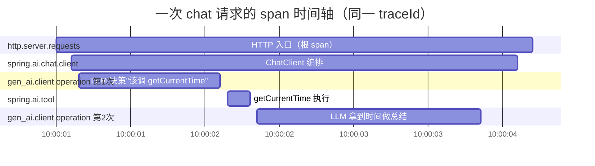
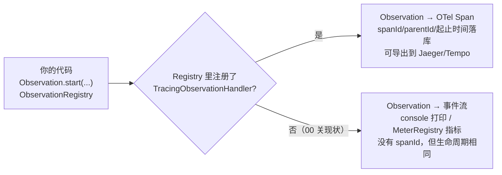
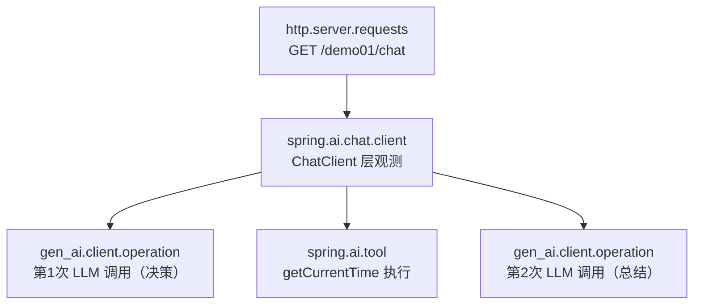
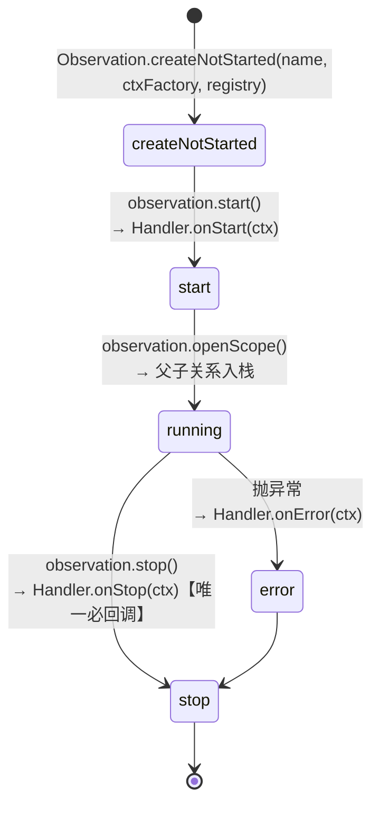

# 01 读懂输出：span 树、gen_ai 标签与一次观测的一生

> **定位**：00 关你看到了一堆 console 输出，但"看不懂"等于没看见。这一关教你**逐行解读**：每段输出是一个 span（观测单元），span 之间的父子关系构成一棵树；再拆开 `observe()` 的生命周期，讲清 Handler 在什么时机被回调——这是后面自定义 Handler/Convention 的地基。
>
> **前置阅读**：[教程 05-Observation可观测/00-最小闭环：Agent各阶段输出打印到控制台]（工程已能打印观测）。

---

## 1.1 span 到底是什么：一个概念的正名

00 关到本关反复出现"span"这个词，现在把它讲透——**它是整个可观测体系里最核心的概念单元**。

### 1.1.1 一句话定义

**span = 一次"有时间跨度的操作"的完整记录**。它至少回答四个问题：

| 组成部分 | 回答的问题 | demo01 里的例子 |
|---|---|---|
| **name（名称）** | 干了什么？ | `spring.ai.tool`、`shift.resolve` |
| **start / end（起止时间戳）** | 什么时候开始、耗时多久？ | 第 2 次 LLM 调用从 10:00:01.200 到 10:00:03.850 |
| **attributes / KeyValues（属性）** | 上下文是什么？ | `spring.ai.tool.definition.name='getCurrentTime'` |
| **parentId（父指针）** | 它是谁的一部分？ | 工具 span 的 parent 是 ChatClient span |

来源：span 这个术语源自 Google 的分布式追踪论文 [Dapper](https://research.google/pubs/pub36356/)，后被 [OpenTelemetry](https://opentelemetry.io/docs/specs/otel/trace/api/#span) 定为行业标准。**一个 Trace（链路）= 从同一个根 span 出发、靠 parentId 串起来的一棵 span 树**。所以"traceId 贯穿全链路"（06 关）的意思是：同一次请求产生的所有 span 共享一个 traceId，但各有不同的 spanId。

### 1.1.2 用时间轴看一次请求：span 树的另一种画法

1.2 节的树形图表达"谁包含谁"，但 span 本质是**时间区间**——时间轴视角更能体现"耗时"这个核心价值：



一眼能读出三件树形图给不了的信息：**第 2 次 LLM 调用占了大头（1.5s）、工具执行只花 150ms、HTTP 入口与内部观测几乎同时开始**——这就是 span 的价值：把"慢在哪一步"从猜测变成测量。

### 1.1.3 Micrometer Observation 与 span 的关系（重要澄清）

严格说，你在 Spring AI 里手写的是 `Observation`（Micrometer 的观测抽象），**span 是 Observation 在 tracing 后端里的投影**：



也就是说：

- **00~05 关**没装 tracing，console 打印的每"段"输出，本质是 Observation 生命周期事件（start/stop/error + KeyValues）——没有真正的 spanId，但**逻辑上就是 span**（有名字、有起止、有属性、有嵌套）；
- **06 关起**接上 Tracer（Brave/OpenTelemetry），同一个 Observation 会额外获得 spanId/traceId，变成标准 span 可导出；
- **代码不用改**——这正是 Micrometer Observation 作为"观测门面"（facade）的设计意图：一次埋点，指标、日志、trace 三处受益。

> javap 实证注记：`Observation` 上不存在 `getSpanId()`/`getTraceId()` 之类方法（见 CLAUDE.md「Observation 基准」）——traceId 要通过 `Tracer.currentSpan()` 取，这正是 06 关的主题。

### 1.1.4 span 三兄弟：Trace / Span / Event 的层级

| 概念 | 粒度 | demo01 例子 | 数量关系 |
|---|---|---|---|
| **Trace** | 一次完整请求 | GET /demo01/chat | 1 个 |
| **Span** | 请求内的一段操作 | ChatClient、gen_ai.client.operation、tool | 1 个 Trace = N 个 Span |
| **Event** | span 内的瞬时事件点（无时长） | `onError` 时刻 | 1 个 Span = 0..N 个 Event |

区分口诀：**有起点和终点的是 span，只有一个时间点的是 event**。"工具开始执行"是 span；"第 3 次重试在第 1.2 秒触发"是 event。

## 1.2 span 树：一次 inspect 请求的真实结构

把 00 关的 console 输出按"谁包含谁"重排，你会得到一棵树：



三件事值得体会：

1. **观测是嵌套的，不是并列的**——工具观测是 ChatClient 观测的"孩子"。Micrometer 靠"当前观测入栈/出栈"（scope）自动建立父子；同线程内嵌套调用天然成树。
2. **一轮工具调用 = 两次 LLM 调用**——第 1 次模型决定调工具，第 2 次拿到工具结果后生成答案。console 里看到两个 `gen_ai.client.operation` span 是正常的，不是 bug。
3. **每段输出都带 KeyValues**——形如 `gen_ai.operation.name='chat'`、`gen_ai.system='deepseek'`、`spring.ai.tool.definition.name='getCurrentTime'`。这是 Spring AI 遵循的 **gen_ai 语义约定**（OpenTelemetry GenAI Semantic Conventions），换成任何遵循该约定的后端（Jaeger/Grafana/LangSmith 类）都能统一解读。

> 「想深入 gen_ai 语义约定全景？→ [教程 04-企业级架构主干/02-全链路可观测性 §3]」

## 1.3 低基数与高基数：工业系统的第一条纪律

console 里标签分两类（javap 实证 `DefaultToolCallingObservationConvention` 的方法划分）：

| 类别 | 例子 | 能否进指标（Prometheus） | 工业含义 |
|---|---|---|---|
| LowCardinality | `spring.ai.tool.definition.name`、`gen_ai.operation.name`、`shift`（04 关加） | 能 | 按"工具名"聚合：getCurrentTime 平均耗时多少 |
| HighCardinality | `spring.ai.tool.call.arguments`、`spring.ai.tool.call.id`、`spring.ai.tool.call.result` | **不能**（基数爆炸） | 只进 trace/日志：这次调用返回的具体时间戳 |

判据一句话：**取值可枚举且总数 < 数百 → 低基数；含业务流水号/自由文本 → 高基数**。工业场景设备编号动辄上万，`deviceId` 一律当高基数处理——这是 07 关基数熔断的伏笔。

## 1.4 拆开 observe()：一次观测的一生

你手写的第一个观测（00 关 controller 里如果有 `Observation.createNotStarted(...).observe(...)`）和框架内部埋点走的是同一条生命周期：



关键结论（决定你怎么写 Handler）：

- **onStop 是信息最全的时机**——此时 Context 里 response/result 都已 `set` 进来。审计/收集类 Handler 都写在 `onStop`。
- **onError 独立于 onStop**——出错时先 `onError` 再 `onStop`，异常对象通过 `ctx.getError()` 可取。
- **Context 是"状态袋"**——`Observation.Context` 本质是个线程安全的 Map + 领域字段。Spring AI 的五类观测点各把自己的领域字段放进去（如 `ToolCallingObservationContext.getToolCallArguments()`），Handler 用 `supportsContext()` 认领。

## 1.5 实践：手动埋一个"业务阶段"观测

框架观测点只知道"有个工具被调了"，不知道你的业务阶段语义（如"班次判定要走排班表"）。给 `TimeTool` 长出第二个方法 `getCurrentShift`（当前班次），并给它的内部业务逻辑手动埋观测。本关后 `TimeTool` 的**完整文件**如下（v2：新增 `ObservationRegistry` 注入 + `getCurrentShift`）：

```java
// src/main/java/demo/demo01/tool/TimeTool.java（本关完整版 v2）
package demo.demo01.tool;

import io.micrometer.observation.Observation;
import io.micrometer.observation.ObservationRegistry;
import org.springframework.ai.tool.annotation.Tool;

import java.time.LocalDateTime;
import java.time.format.DateTimeFormatter;

public class TimeTool {

    private final ObservationRegistry registry;   // ★ 由 ChatConfig 在 new 时通过构造器显式传入（见下方装配说明）

    public TimeTool(ObservationRegistry registry) {
        this.registry = registry;
    }

    @Tool(description = "获取系统的当前时间")
    public String getCurrentTime() {
        return LocalDateTime.now().format(DateTimeFormatter.ISO_LOCAL_DATE_TIME);
    }

    @Tool(description = "获取当前班次（morning/afternoon/night），用于巡检排班和交接记录")
    public String getCurrentShift() {
        // 手动埋"业务阶段"观测：start() + openScope() + error() + stop() 四步走完整个生命周期
        Observation obs = Observation.start("shift.resolve", Observation.Context::new, registry);
        try (Observation.Scope scope = obs.openScope()) {
            // 模拟查排班表（真实场景是 REST 到排班服务，耗时不可忽略——值得观测）
            int hour = LocalDateTime.now().getHour();
            String shift = hour < 8 ? "morning" : hour < 16 ? "afternoon" : "night";
            return "{\"shift\":\"" + shift + "\",\"hour\":" + hour + "}";
        } catch (Exception e) {
            obs.error(e);          // 出错：onError 回调（先于 stop）
            throw e;
        } finally {
            obs.stop();            // 恰好 stop 一次：try 正常/异常都收口
        }
    }
}
```

> 装配说明（demo01 习惯的关键一环）：`new TimeTool()` 出来的对象默认**不会**被 Spring 处理 `@Autowired`——所以本关起 `ChatConfig` 先字段注入容器里的 `ObservationRegistry`，再在 `new TimeTool(registry)` 时通过构造器显式传入（registry 字段才生效）：
>
> ```java
> // src/main/java/demo/demo01/config/ChatConfig.java（本关完整版 v2）
> package demo.demo01.config;
>
> import demo.demo01.tool.TimeTool;
> import io.micrometer.observation.ObservationRegistry;
> import org.springframework.ai.chat.client.ChatClient;
> import org.springframework.beans.factory.annotation.Autowired;
> import org.springframework.context.annotation.Bean;
> import org.springframework.context.annotation.Configuration;
>
> @Configuration
> public class ChatConfig {
>
>     @Autowired
>     private ObservationRegistry registry;   // Boot 自动装配的注册表（demo01 习惯：字段注入）
>
>     @Bean
>     public ChatClient chatClient(ChatClient.Builder builder) {
>         return builder
>                 .defaultTools(new TimeTool(registry))   // ★ new 出来的工具在创建那一刻就拿到 registry
>                 .build();
>     }
> }
> ```
>
> **这是"new 出来的工具也要观测"的工程细节，教材不说、生产必踩。**

> javap 实证注记：`Observation` 上有实例方法 `error(Throwable)`/`stop()`/`openScope()`，静态方法 `start(String, Supplier<Context>, ObservationRegistry)`——**没有** `isStopped()`，也没有静态 `Observation.error(e, registry)`。所以"恰好 stop 一次"靠 try/finally 结构保证，不靠查询状态。日常业务更推荐一步式：`Observation.createNotStarted("shift.resolve", Observation.Context::new, registry).observe(() -> doResolve())`——`observe()` 自动 start/stop；上面走四步是为了让你亲眼对应 1.4 的生命周期。

## 1.6 Postman 测试

| 项 | 内容 |
|---|---|
| 方法 | `GET` |
| URL | `http://localhost:8081/demo01/chat?prompt=现在几点？当前是什么班次？给交接记录写一句总结` |

**预期现象**：

1. console 中出现两个 tool span（`getCurrentTime` + `getCurrentShift`），且 `getCurrentShift` 之内**嵌套着你手动埋的业务观测** `name='shift.resolve'`——框架观测与业务观测混排成一棵树；
2. 对比两次调用（一次只问时间、一次问时间+班次），观察 span 树差异：**span 树就是 Agent 行为的指纹**；
3. 人为在班次逻辑里抛 `RuntimeException`，再调一次：console 出现 `error='java.lang.RuntimeException...'` 字段，验证 `onError` 时机。

## 1.7 本关沉淀

- span = 有起止时间的操作记录（name/起止/KeyValues/parentId），Trace = 同 traceId 的 span 树，event = 无时长的时间点；
- Micrometer Observation 是观测门面：接 tracing 后投影为标准 span，不接也走同一生命周期——一次埋点三处受益；
- span 树 = 请求的行为指纹；一轮工具调用 = 两次 LLM 调用；
- 低/高基数分流是指标与 trace 的分水岭，工业编号一律高基数；
- 生命周期 `start → openScope → (error) → stop`，`onStop` 信息最全，是 Handler 的主战场。

**下一关**：Registry 如何把观测事件分发给 Handler？Convention 在哪个环节注入标签？→ [教程 05-Observation可观测/02-组件交互：Registry、Handler、Convention、Filter协作]

## 1.8 适用场景与不适用场景

**✅ 适用场景**：

- 排障第一步"慢在哪一步"——span 时间轴（gantt 视角）把 HTTP/编排/LLM/工具各段耗时从猜测变成测量；
- 判断 Agent 行为是否符合预期——span 树是行为指纹，"一轮工具调用 = 两次 LLM 调用"在树上一眼可辨、不是 bug；
- 给框架不认识的手动埋业务阶段观测——start + openScope + (error) + stop 四步，try/finally 保证恰好 stop 一次；
- 设计指标标签前做基数分诊——取值可枚举且总数有限进低基数；业务流水号/自由文本/设备编号一律高基数；
- 决定 Handler 代码写在哪个回调——onStop 信息最全（响应侧已 set），是审计/收集 Handler 的主战场。

**❌ 不适用场景**：

- 没接 tracing 时想拿真实 spanId/traceId——Observation 只是"span 的投影源"，链路身份要等 06 关 Tracer；
- 把高基数字段当指标维度——完整时间戳/设备编号进 Prometheus 是基数灾难（07 关熔断的伏笔）；
- 在 Reactor 链上跨线程手玩 scope——scope 基于 ThreadLocal，WebFlux 下必断（02 关铁律）；
- 给"无时长的瞬时点"建 span——那是 event 的职责（onError 时刻、第 3 次重试触发点）；
- 用 Observation 替代日志或指标——它是"一次埋点三处受益"的门面，不是其中任何一种的替代品。

## 1.9 本章总结

| 核心概念 | 一句话要点 |
|---|---|
| span | 有起止时间的操作记录：name / 起止时间戳 / KeyValues / parentId 四要素 |
| Trace / Span / Event | 1 Trace = N Span（同 traceId 的树）；1 Span = 0..N Event（无时长瞬时点） |
| Observation 门面 | 接 tracing 投影为标准 span，不接也走同一生命周期——一次埋点三处受益 |
| 生命周期 | start → openScope → (error) → stop；onStop 信息最全，onError 先于 onStop |
| scope | openScope 入栈建立父子关系；同线程嵌套天然成树，跨线程靠 Reactor Context |
| 低/高基数分界 | 可枚举且总数有限 → 低基数可进指标；流水号/自由文本 → 高基数只进 trace/日志 |
| 行为指纹 | span 树 = 一次请求的行为指纹；对照实验（问/不问班次）验证观测不撒谎 |
| 恰好 stop 一次 | try/catch + finally 结构保证，不靠查询状态（Observation 无 isStopped()） |

**下一篇**：[教程 05-Observation可观测/02-组件交互：Registry、Handler、Convention、Filter协作]——看懂系统内部怎么转，知道该在哪个环节插自己的代码。
