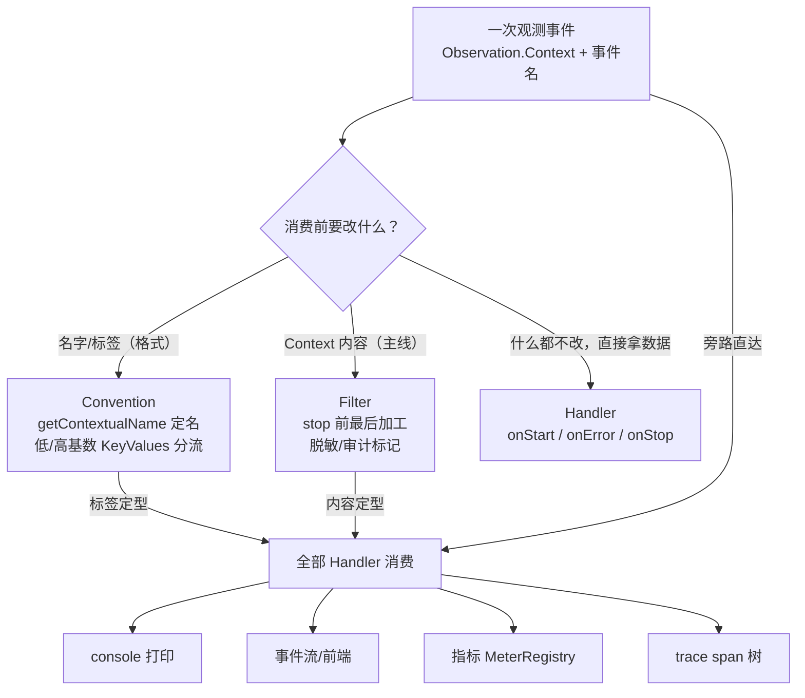
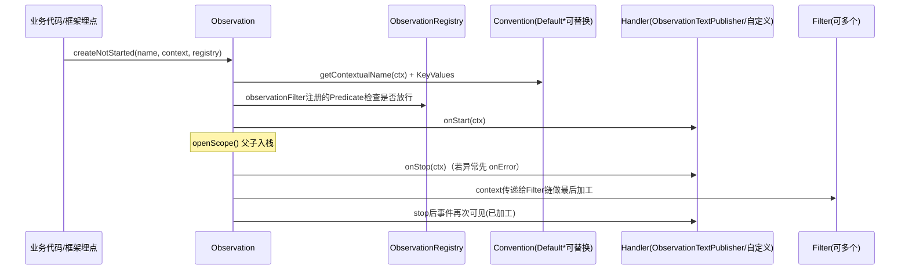

# 02 组件与交互：Registry、Handler、Convention、Filter 如何协作

> **定位**：01 关你看懂了输出。这一关回答"系统内部怎么转"：一次观测从产生到被消费，中间经过哪些组件、每个组件的职责边界、为什么这样设计。**这是自定义扩展（03-04 关）的原理地基**——看懂这张交互图，你就知道该在哪个环节插自己的代码。
>
> **前置阅读**：[教程 00-基础与核心/01-Spring-AI框架入门]。

---

## 2.1 五大组件总览

| 组件 | 职责 | 工业类比 |
|---|---|---|
| `ObservationRegistry` | 全局唯一登记处：持有所有 Handler/Filter，观测事件的总线 | 产线中控室的"事件总线" |
| `Observation`（含 Context） | 一次观测单元 + 状态袋 | 一条工单 |
| `ObservationHandler` | **消费方**：在生命周期回调里拿到 Context 做事（打印/审计/推送/出指标） | 安全员/记录员 |
| `ObservationConvention` | **命名与打标签方**：决定 span 叫什么、带什么 KeyValues | 工单模板（统一字段） |
| `ObservationFilter` | **收尾加工方**：stop 前最后修改 Context（脱敏/补全/删除） | 出厂前质检 |

五个组件的职责分工可以浓缩成"一个事件、三种改法、N 种消费"——消费前想改什么，决定了你该实现哪个扩展点（什么都不改就直接写 Handler）：



## 2.2 一次观测的完整旅程（核心图）



设计要点（为什么这么设计）：

1. **生产者不认识消费者**——Spring AI 埋点只管 `Observation.createNotStarted(...)` 发事件，谁消费（console？Prometheus？你的前端？）它不知道也不关心。这就是"一行观测代码不改，就能加一种消费方式"的开闭基础。
2. **Convention 与 Handler 分离**——"叫什么名、打什么标签"（格式）与"拿它干什么"（用途）解耦：换标签不动 Handler，换 Handler 不动标签。
3. **Filter 排在 Handler 的 stop 回调之前**——所以脱敏必须放 Filter，放 Handler 里就晚了（文本 Handler 已经拿到原始内容）。

## 2.3 Spring AI 的"全家桶"实证

本地 2.0.0 jar javap 实证的真实扩展点（你都可以替换/参考）：

```text
org.springframework.ai.chat.observation.ChatModelObservationConvention          // 接口
org.springframework.ai.chat.observation.DefaultChatModelObservationConvention   // 默认实现
org.springframework.ai.chat.observation.ChatModelMeterObservationHandler        // 出token指标
org.springframework.ai.chat.observation.ChatModelPromptContentObservationHandler// 打prompt内容
org.springframework.ai.chat.observation.ChatModelCompletionObservationHandler   // 打completion
org.springframework.ai.tool.observation.ToolCallingObservationConvention / Default...
org.springframework.ai.tool.observation.ToolCallingContentObservationFilter     // 工具内容脱敏/注入的Filter
org.springframework.ai.model.observation.ErrorLoggingObservationHandler         // 统一错误日志
```

`DefaultToolCallingObservationConvention` 的真实方法布局（javap 摘录）能直接指导你写自定义 Convention——它把低基数方法（`toolType/aiOperationType/springAiKind/toolDefinitionName`）与高基数方法（`toolDefinitionDescription/toolDefinitionSchema/toolCallId`）**分开放**，你继承它时只需覆写关心的方法：

```java
// 继承默认实现，只增强，不推翻 —— 工业级推荐姿势
public class IndustrialToolConvention extends DefaultToolCallingObservationConvention {
    @Override
    protected KeyValue toolDefinitionName(ToolCallingObservationContext ctx) {
        // 例如把工具名统一加产线前缀，聚合时按产线分维度
        return KeyValue.of("spring.ai.tool.definition.name", "lineA:" + ctx.getToolDefinition().name());
    }
}
```

> **注册方式**：`@Bean` 即可。Boot 的 `ObservationAutoConfiguration` 会把容器里所有 `ObservationHandler`/`ObservationFilter`/`GlobalObservationConvention` 自动挂到 Registry——这就是 00 关你只声明一个 Bean 就生效的原因。

## 2.4 WebFlux 下的特殊性（工业落地必读）

本项目是 WebFlux（响应式），有两个铁律（呼应 [教程 08-架构师进阶/08-响应式错误处理]）：

1. **禁止 ThreadLocal 传递业务上下文**——Micrometer 的 scope 基于 ThreadLocal，在 Reactor 链上跨线程会断。**不要**试图在 `doOnNext` 里手动开 scope；正确姿势是让框架埋点自己工作（Spring AI 内部已处理），业务观测在单段同步代码里完成，或用 06 关的 trace 方案。
2. **Span 父子关系在线程切换处由 Reactor Context 传播**——引入 tracing 后用 `Hooks.enableAutomaticContextPropagation()`（06 关实操）。

## 2.5 实践：写一个"数次数"的 Handler 热身

03 关才写完整的事件收集，这里先热身——写一个最小自定义 Handler，体会 `supportsContext` 认领机制：

```java
// src/main/java/demo/demo01/config/ToolCountHandler.java（完整文件）
package demo.demo01.config;

import io.micrometer.observation.Observation;
import io.micrometer.observation.ObservationHandler;
import lombok.extern.slf4j.Slf4j;
import org.springframework.ai.tool.observation.ToolCallingObservationContext;
import org.springframework.context.annotation.Bean;
import org.springframework.context.annotation.Configuration;

import java.util.concurrent.atomic.AtomicLong;

@Slf4j
@Configuration   // demo01 习惯：Handler 以 @Bean 形式挂到 Registry，无需手工注册
public class ToolCountHandler {

    private final AtomicLong count = new AtomicLong();

    @Bean
    public ObservationHandler<ToolCallingObservationContext> toolCountObservationHandler() {
        return new ObservationHandler<>() {
            @Override
            public boolean supportsContext(Observation.Context context) {
                return context instanceof ToolCallingObservationContext;   // 只认工具观测
            }

            @Override
            public void onStop(ToolCallingObservationContext context) {
                log.info("工具调用第 {} 次，工具名称：{}，工具参数：{}",
                        count.incrementAndGet(),
                        context.getToolDefinition().name(),   // 真实 API：ToolDefinition#name()
                        context.getToolCallArguments());
            }
        };
    }
}
```

`supportsContext` 是**类型化认领**：Registry 把每个事件广播给所有 Handler，各自判断是不是自己的菜。这就是为什么 `ObservationTextPublisher` 什么都打、而你这个只打工具——互不干扰。

## 2.6 Postman 测试

| 项 | 内容 |
|---|---|
| 方法 | `GET` |
| URL | `http://localhost:8081/demo01/chat?prompt=现在几点？当前是什么班次？` |

**预期现象**：

1. 若临时注册了调试原型 `ObservationTextPublisher`（00 关提过、工程正式代码不采用），console 在它的整段输出之外，还会多出本关 Handler 的两行 `工具调用第 1 次，工具名称：getCurrentTime，工具参数：null`、`工具调用第 2 次，工具名称：getCurrentShift，工具参数：null`——**两个 Handler 同时消费同一事件流**，验证广播机制（两个工具均无参数，参数为 null 属实）；
2. 连续调用三次接口，计数持续增长（进程内状态）——同时体会：Handler 里放内存状态在多实例部署下会各自为政，生产要用 Micrometer 计数器（07 关）；
3. 问一个不触发工具的问题（`prompt=你好`），确认无该输出。

## 2.7 本关沉淀

- 五组件职责边界：Registry 总线 / Handler 消费 / Convention 命名打标 / Filter 收尾加工；
- `@Bean`/`@Component` 即自动挂载——扩展零侵入；
- 类型化认领用 `supportsContext`；自定义 Convention 继承 `Default*Convention` 只覆写关心的方法；
- WebFlux 下不要手玩 scope/ThreadLocal。

**下一关**：正式做你要的第二层——把 Agent 各阶段输出**收集成结构化事件流**。→ [教程 05-Observation可观测/03-自定义Handler：收集Agent阶段事件流]

## 2.8 适用场景与不适用场景

**✅ 适用场景**：

- 动手自定义之前先定位组件——改标签找 Convention、拿数据找 Handler、改内容找 Filter、砍流量找 Predicate，职责不混；
- 验证多 Handler 并存互不干扰——广播机制下 `ObservationTextPublisher` 与自定义 Handler 同时消费同一事件流（2.6 实测）；
- 零侵入扩展观测能力——`@Bean` 即自动挂 Registry，框架埋点零改动，这是开闭原则在观测层的形态；
- 写自定义 Convention 前校准姿势——继承 `Default*Convention` 只覆写关心的方法，低/高基数方法分开实现；
- WebFlux 工程的观测方案评审——识别"手玩 scope / ThreadLocal 传上下文"类反模式。

**❌ 不适用场景**：

- 想在 Handler 里改 span 名/标签——KeyValues 到 Handler 时已定型，那是 Convention 的职责；
- 想在 Handler 里做脱敏——文本类 Handler 在 Filter 加工前已拿到原始内容，脱敏必须在 Filter（stop 前最后一道）；
- 在 Reactor 链上手动 openScope 传业务上下文——ThreadLocal 跨线程必断，走 Reactor Context + Hooks；
- 用 Handler 内 AtomicLong 做生产计数——多实例各自为政，指标必须走 MeterRegistry（07 关）；
- 给单个观测点配"全局唯一 Handler"——Registry 是广播语义，过滤靠 supportsContext 而非独占注册。

## 2.9 本章总结

| 核心概念 | 一句话要点 |
|---|---|
| ObservationRegistry | 全局唯一事件总线：持有 Handler/Filter/Convention，生产者只依赖它 |
| ObservationHandler | 消费方：supportsContext 类型化认领，onStop 是信息最全的主战场 |
| ObservationConvention | 命名与打标方：决定 span 名与 KeyValues，继承 Default* 增量覆写 |
| ObservationFilter | 收尾加工方：stop 前最后改 Context，一次加工处处可见 |
| ObservationPredicate | 降噪方：观测产生处直接掐掉（07 关基数防线第一层） |
| 广播机制 | 事件广播给所有 Handler，各自 supportsContext 判断认领，互不干扰 |
| 自动装配 | Boot 收集容器里所有 Handler/Filter/GlobalConvention Bean 挂进 Registry，@Bean 即生效 |
| 生产者不认识消费者 | 埋点只管发事件，消费方式可插拔——一行埋点不改换消费端 |

**下一篇**：[教程 05-Observation可观测/03-自定义Handler：收集Agent阶段事件流]——正式把各阶段输出收集成结构化事件流。
