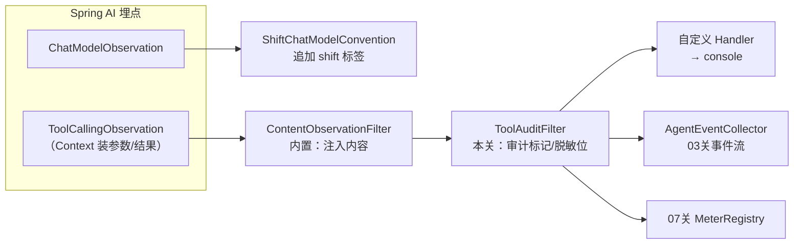
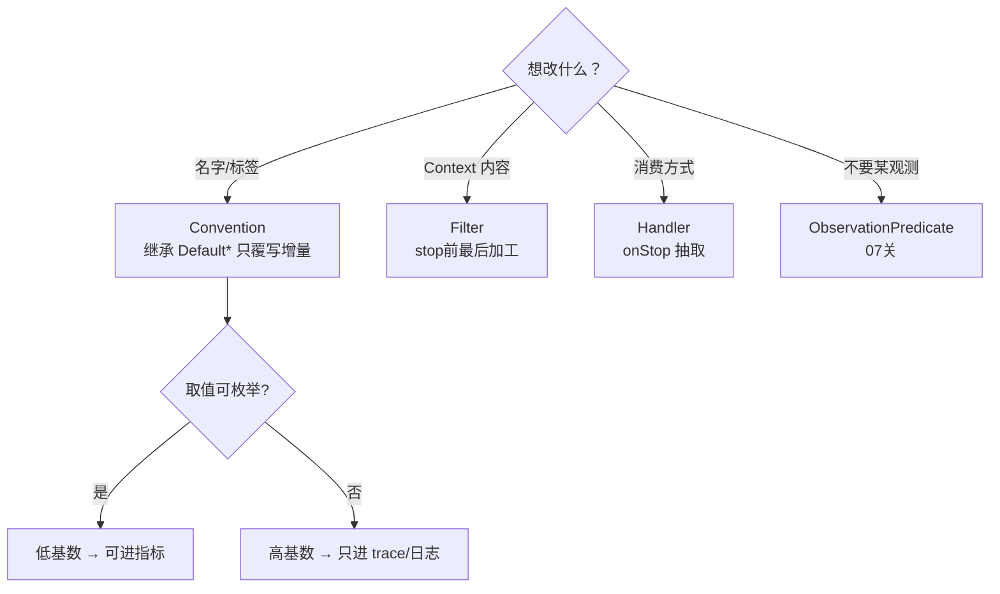

# 04 自定义 Convention 与 Filter：工业标签与内容脱敏

> **定位**：03 关的事件流没有"业务身份"——不知道是哪条产线、哪张工单；而 `log-prompt=true` 打开的内容裸奔在生产环境也不行。这一关用两个扩展点补齐：**Convention 给观测注入工业标签**（产线、工单类型），**Filter 在 stop 前做脱敏**（设备参数里的敏感字段）。这是"自定义什么、什么时候自定义"的决策地图篇。
>
> **前置阅读**：[教程 00-基础与核心/03-工具调用]。

---

## 4.1 两个扩展点的分工（先立决策表）

| 需求 | 用什么 | 为什么不是另一个 |
|---|---|---|
| 给 span 加统一业务标签（产线/环境/租户） | **Convention** | 标签属于"命名格式"职责；Handler 拿到的 KeyValues 已定型 |
| 对 prompt/工具参数里的敏感值脱敏 | **Filter** | Filter 在 stop 前最后改 Context；Handler 收到时已脱敏 |
| 改 span 名（如工具名带产线前缀） | **Convention**（`getName/getContextualName`） | 同上 |
| 丢弃某类观测（采样/降噪） | **ObservationPredicate**（07 关） | Filter 是"改"，Predicate 是"掐" |

## 4.2 业务上下文怎么进 Convention：先解决"传值"

Convention 被框架回调时，拿到的是领域 Context——业务身份（如班次）从哪来？先把候选通道和坑讲清（**这里是原理辨析，本关最终代码不采用**）：

- **a. Reactor Context**：WebFlux 下的"官方通道"（铁律：禁 ThreadLocal）。但 `chatClient...call()` 是同步阻塞调用，Reactor Context 在这条调用里**取不到**——只有换成 08 关的 `.stream()` 全响应式链路才成立。这是很多团队在 WebFlux + Spring AI 上踩的第一个坑：`.contextWrite()` 写了，工具/Convention 里读不到；
- **b. Spring AI 的 `ToolContext`**：`.prompt().toolContext(Map.of("shift", "morning"))` 把业务身份随提示传给工具执行链——生产推荐，工具回调里能拿到这个 Map；
- **c. 从领域数据解析**：观测发生时自行从可用信息推导业务身份。

本关采用 **c**：给 **LLM 观测**追加 `shift`（班次）低基数标签——按观测发生时刻解析，morning/afternoon/night 恰好是**教科书级的低基数案例**（3 个可枚举取值），对照面就是"把完整时间戳当标签"的高基数灾难（时间戳无限取值，一枚标签炸掉指标系统）。演示的本质不变——**Convention 能基于领域数据动态生成标签**。本关新增文件 `ObsConventionConfig`（完整文件）：

```java
// src/main/java/demo/demo01/config/ObsConventionConfig.java（完整文件）
package demo.demo01.config;

import io.micrometer.common.KeyValue;
import io.micrometer.common.KeyValues;
import org.springframework.ai.chat.observation.ChatModelObservationContext;
import org.springframework.ai.chat.observation.DefaultChatModelObservationConvention;
import org.springframework.context.annotation.Bean;
import org.springframework.context.annotation.Configuration;
import org.springframework.context.annotation.Primary;

@Configuration
public class ObsConventionConfig {

    /**
     * 覆盖默认 ChatModel Convention：追加工业低基数标签 shift（班次）。
     * @Primary：容器里已有自动装配的 DefaultChatModelObservationConvention，
     * 显式声明优先级，确保装配不歧义。
     */
    @Bean
    @Primary
    public ShiftChatModelConvention shiftChatModelConvention() {
        return new ShiftChatModelConvention();
    }

    public static class ShiftChatModelConvention extends DefaultChatModelObservationConvention {

        @Override
        public KeyValues getLowCardinalityKeyValues(ChatModelObservationContext context) {
            return super.getLowCardinalityKeyValues(context).and(shift());
        }

        private KeyValue shift() {
            int hour = java.time.LocalDateTime.now().getHour();
            String shift = hour < 8 ? "morning" : hour < 16 ? "afternoon" : "night";
            return KeyValue.of("shift", shift);   // 3 个可枚举取值 → 低基数，可进指标
        }
    }
}
```

> demo 里"按小时解析班次"够用；生产推荐 `ToolContext` 或从配置中心拿排班表（含调休/倒班的非常规班次日历）。**原理不变：低基数标签必须可枚举**（`morning/afternoon/night` 三种，安全）；完整时间戳、设备编号这类无限取值则永不进低基数。

`@Bean` 一个 Convention 即完成替换：Boot 自动装配发现容器里有 `ToolCallingObservationConvention` 类型的 Bean，`Default` 退位（同一类型取你的是否生效取决于装配覆盖规则——实测时若两者并存，用 `@Primary` 明确优先）。

## 4.3 Filter：stop 前的收尾加工（审计标记与脱敏范式）

Filter 是**所有 Handler 收到 stop 事件前的最后一道加工口**。TimeTool 的时间/班次结果没有敏感字段，所以本关演示它最典型的另一种用法——**给 Context 附加审计标记**，供下游 Handler 统一消费；敏感字段脱敏是同一个结构（在 Filter 里对 `setToolCallResult(...)` 改写一次，处处生效），范式一并写清。本关新增文件 `ObsFilterConfig`（完整文件）：

```java
// src/main/java/demo/demo01/config/ObsFilterConfig.java（完整文件）
package demo.demo01.config;

import io.micrometer.observation.Observation;
import io.micrometer.observation.ObservationFilter;
import org.springframework.ai.tool.observation.ToolCallingObservationContext;
import org.springframework.context.annotation.Bean;
import org.springframework.context.annotation.Configuration;

@Configuration
public class ObsFilterConfig {

    /** 审计标记键：Filter 写入，任何 Handler 在 onStop 里都能读到 */
    public static final String AUDIT_COMPLETE = "audit.complete";

    @Bean
    public ObservationFilter toolAuditFilter() {
        return context -> {
            if (context instanceof ToolCallingObservationContext tc) {
                // 审计完整性标记：参数与结果是否齐备（缺参数或无结果 → 交接/归档时人工复核）
                boolean complete = tc.getToolCallArguments() != null && tc.getToolCallResult() != null;
                context.put(AUDIT_COMPLETE, complete);
            }
            return context;
        };
    }
}
```

三个决策说明：

1. **收尾加工放 Filter 不放 Handler**：Filter 在所有 Handler 的 stop 消费前执行（02 关时序图），一次加工、处处可见；放 Handler 则每个 Handler 都要重复算，漏一个就不一致。
2. **脱敏是同构范式**：将来工具结果含敏感字段（如员工手机号、工艺参数），就在同一个位置 `tc.setToolCallResult(mask(...))`——Filter 层一次改写，console/事件流/SSE/审计全部拿到脱敏后内容（TimeTool 暂无此需求，故本关先落审计标记这个真实需求）。
3. **demo 用 put/remove 标记，生产脱敏用结构化方案**：JSON 结果用 Jackson 解析后按字段白名单重建——正则脱敏对复杂嵌套不可靠（刻意的工业提醒）。

## 4.4 组件协作全景（本关后你的观测管线）



注意箭头顺序：Convention 决定的是**标签**（旁路），Filter 决定的是**Context 内容**（主线）——两者共同保证"消费侧拿到的都是合规数据"。

## 4.5 什么时候自定义——决策地图（本系列的进阶总纲之一）



## 4.6 Postman 测试

| 用例 | 请求 | 预期现象 |
|---|---|---|
| 标签生效 | `GET /demo01/chat?prompt=现在几点？当前什么班次？`，看 console 的 `gen_ai.client.operation` 观测 | 两次 LLM span 的 KeyValues 均出现 `shift='morning'`（按你本机时刻显示对应班次） |
| 标签可枚举验证 | 晚上 16 点后重复调用 | `shift='night'`——取值始终只有 3 种，低基数安全 |
| 审计标记生效 | 同上，看 `AgentEventCollector` 输出或 `/demo01/events` | TOOL 事件处理时 Context 可读 `audit.complete=true`（在 Handler 的 onStop 里 `context.get(ObsFilterConfig.AUDIT_COMPLETE)` 验证） |
| 默认行为保留 | 任意工具调用 | `gen_ai.operation.name`、`spring.ai.kind` 等默认标签仍在（继承的增量式覆写没推翻默认） |
| 事件流对照 | `GET /demo01/events` | Filter 先于 Handler 的加工顺序（标记在 Handler 读到时已写入） |

## 4.7 本关沉淀

- Convention 管标签/命名，Filter 管 Context 收尾加工，职责不混；
- 业务身份传值：WebFlux 下禁 ThreadLocal，demo 从领域数据解析，生产用 ToolContext/字典服务；
- 低基数的判据是可枚举：shift（3 值）安全，时间戳/设备编号（无限值）是高基数禁区；
- 增量式覆写（继承 Default）优于推翻重写——默认行为是生态共识，别轻易丢；
- 脱敏/标记必须在 Filter 层一次完成，正则只配 demo，生产用结构化白名单。

**下一关**：事件流已合规，把它推到前端页面实时展示。→ [教程 05-Observation可观测/05-前端展示：SSE推送观测时间线]

## 4.8 适用场景与不适用场景

**✅ 适用场景**：

- 给 span 注入统一业务标签（班次/产线/租户）且取值可枚举——Convention 低基数通道，可直接进指标分维度聚合；
- 观测内容含敏感字段需脱敏——Filter 在所有 Handler 消费前一次改写，console/事件流/SSE/审计全部拿到脱敏后内容；
- 给 Context 补审计标记等派生字段——Filter 一次加工下游统一消费（`audit.complete` 范式），避免每个 Handler 重复计算；
- 改 span 命名规范（如工具名加产线前缀）——Convention 的 getName/getContextualName 职责；
- 业务身份要进观测——WebFlux 下从领域数据解析（本关姿势）或生产用 ToolContext/排班字典服务。

**❌ 不适用场景**：

- 标签取值不可枚举（完整时间戳/设备编号）——高基数禁区，只进 trace/日志，强行进标签会被 07 关 MeterFilter deny；
- 在同步 `call()` 链路里指望 Reactor Context 传业务身份——取不到，需 `.stream()` 全响应式链路或改用 ToolContext；
- 用正则对复杂嵌套 JSON 脱敏——不可靠，生产用 Jackson 解析后按字段白名单重建；
- 想丢弃某类观测——Filter 是"改"，Predicate 才是"掐"（07 关）；
- 推翻默认 Convention 重写全部标签——默认标签是生态共识，增量覆写（super...and(...)）优于推翻。

## 4.9 本章总结

| 核心概念 | 一句话要点 |
|---|---|
| Convention | 命名与标签的"格式"职责：继承 Default* 只覆写增量，@Primary 解决装配歧义 |
| Filter | Context 内容的"主线"职责：所有 Handler stop 消费前最后一道加工口 |
| ObservationPredicate | "掐"的职责：源头降噪，与 Filter 的"改"分工不同 |
| 低基数判据 | 取值可枚举且总数有限才进标签：shift 3 值安全，时间戳/设备编号是禁区 |
| 业务传值通道 | WebFlux 禁 ThreadLocal：领域数据解析（本关）/ ToolContext（生产推荐）/ Reactor Context（仅全响应式链路） |
| 一次加工处处生效 | Filter 层 setToolCallResult 改写一次，console/事件流/SSE/审计全部拿到改写后内容 |
| 增量式覆写 | super.getLowCardinalityKeyValues().and(...) 保留默认标签再追加，别推翻生态共识 |

**下一篇**：[教程 05-Observation可观测/05-前端展示：SSE推送观测时间线]——把合规的事件流实时推给前端页面。
