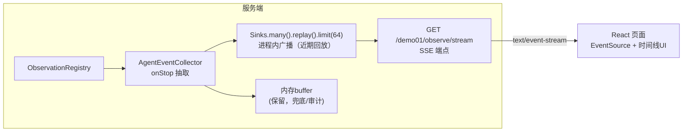
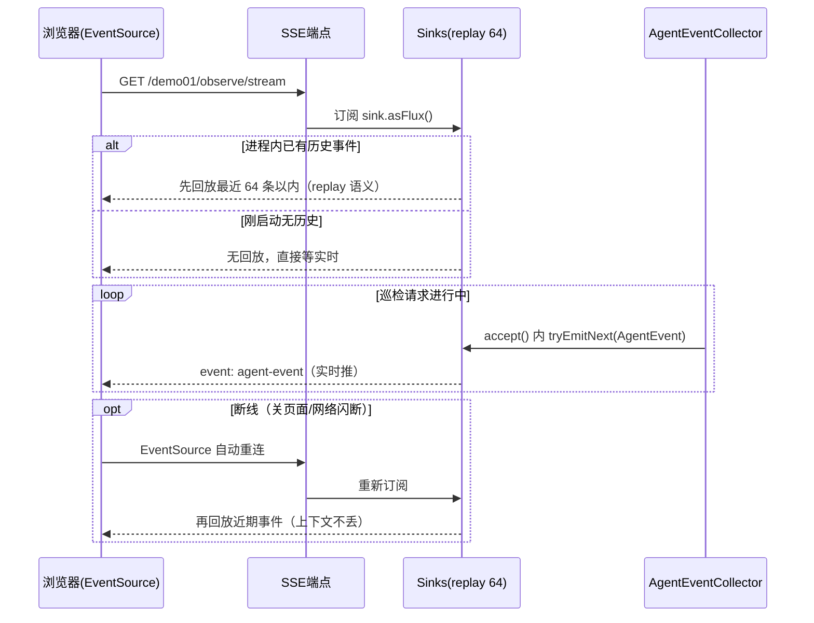

# 05 前端展示：用 SSE 把观测事件推给页面

> **定位**：你要的第三层——**展示到前端**。这一关把 03 关的事件收集升级为**实时推送**：`AgentEventCollector` 写入时同步发到 Sinks（进程内广播），新增 SSE 端点 `/demo01/observe/stream`，前端（React）订阅后渲染成"Agent 执行时间线"。工业价值：运维大屏上，工程师实时看到巡检 Agent 正在查哪台设备、等哪个 LLM 响应。
>
> **前置阅读**：[教程 00-基础与核心/03-工具调用]、[教程 02-SpringAI核心机制/06-SSE流式通信]、[教程 03-React前端与AgenticUI/02-React与SSE流式UI]。

---

## 5.1 架构：从"拉"到"推"的最小改动

03 关是**拉模式**（前端轮询 `/events`）。推模式只需在收集器里加一个 `Sinks.Many`：



设计决策：

- **`replay().limit(N)` 而非 `multicast()`**：新订阅者先收到最近 N 条（进页面即可见"刚发生过什么"），之后实时推。工控大屏断线重连（EventSource 自动重连）后不丢上下文——呼应 [教程 04-企业级架构主干/04-多页面流式响应与会话管理] 的断线重连主题。
- **buffer 保留不删**：SSE 是"看"，buffer 是"查/审计"——两种消费形态并存，别为了推把存砍了。

一条完整的订阅-推送-重连时序（回放分支 + 实时循环 + 断线重连分支，对应 5.5 测试的步骤 1/3/4）：



## 5.2 服务端代码：`AgentEventCollector` v2 完整文件

本关只改一个类——在 03 关 `accept()` 入口处接入 Sinks 广播（`AgentEvent`、其余 Handler 均不动）：

```java
// src/main/java/demo/demo01/obs/AgentEventCollector.java（本关完整版 v2）
package demo.demo01.obs;

import io.micrometer.observation.Observation;
import io.micrometer.observation.ObservationHandler;
import org.springframework.ai.chat.client.observation.ChatClientObservationContext;
import org.springframework.ai.chat.observation.ChatModelObservationContext;
import org.springframework.ai.tool.observation.ToolCallingObservationContext;
import org.springframework.stereotype.Component;
import reactor.core.publisher.Flux;
import reactor.core.publisher.Sinks;

import java.time.Instant;
import java.util.List;
import java.util.concurrent.ConcurrentHashMap;
import java.util.concurrent.CopyOnWriteArrayList;

@Component
public class AgentEventCollector implements ObservationHandler<Observation.Context> {

    private final ConcurrentHashMap<String, List<AgentEvent>> buffer = new ConcurrentHashMap<>();

    /** SSE 广播通道：新订阅者先回放最近 64 条，再实时推（断线重连不丢上下文） */
    private final Sinks.Many<AgentEvent> sink = Sinks.many().replay().limit(64);

    @Override
    public boolean supportsContext(Observation.Context context) {
        return context instanceof ChatClientObservationContext
                || context instanceof ChatModelObservationContext
                || context instanceof ToolCallingObservationContext;
    }

    @Override
    public void onStop(Observation.Context context) {
        if (context instanceof ChatClientObservationContext) {
            accept(new AgentEvent("CHAT_CLIENT", "chat-client", "请求参数已送入", Instant.now()));
        } else if (context instanceof ChatModelObservationContext cm) {
            String prompt = String.valueOf(cm.getRequest().getContents());
            accept(new AgentEvent("LLM", "chat-model", "prompt摘要: " + prompt.substring(0, Math.min(80, prompt.length())), Instant.now()));
        } else if (context instanceof ToolCallingObservationContext tc) {
            accept(new AgentEvent("TOOL", tc.getToolDefinition().name(),
                    "参数=" + tc.getToolCallArguments() + " 结果=" + brief(tc.getToolCallResult()), Instant.now()));
        }
    }

    @Override
    public void onError(Observation.Context context) {
        accept(new AgentEvent("ERROR", "error", String.valueOf(context.getError()), Instant.now()));
    }

    /** 事件唯一入口：入 buffer（留查/审计）+ 发 SSE（实时看）——03 关埋的口，本关长出血肉 */
    public void accept(AgentEvent event) {
        buffer.computeIfAbsent(currentGroup(), k -> new CopyOnWriteArrayList<>()).add(event);
        sink.tryEmitNext(event);   // 单请求内回调串行，无并发抢占；多请求并发的坑见下方注记
    }

    private String brief(String result) {
        if (result == null) return "null";
        return result.length() > 100 ? result.substring(0, 100) + "..." : result;
    }

    private String currentGroup() { return "default"; }

    public List<AgentEvent> drain(String group) { return buffer.getOrDefault(group, List.of()); }

    public List<AgentEvent> drain() { return drain("default"); }

    public Flux<AgentEvent> stream() { return sink.asFlux(); }
}
```

> 注意：`tryEmitNext` 在**多线程并发写**时会返回失败（`FAIL_NON_SERIALIZED`）。demo 单实例低并发下回调近似串行；若多请求并发明显，改用 `Sinks.many().multicast().onBackpressureBuffer()` 并对 emit 结果做 `EmitResult` 判断重试，或用 `sink.asFlux().publishOn(scheduler)` 收敛写入侧——这是 Reactor 的经典坑，工业落地时按实际并发模型选型。

## 5.3 SSE 端点：`ChatController` v3 完整文件

```java
// src/main/java/demo/demo01/controller/ChatController.java（本关完整版 v3）
package demo.demo01.controller;

import demo.demo01.obs.AgentEvent;
import demo.demo01.obs.AgentEventCollector;
import org.springframework.ai.chat.client.ChatClient;
import org.springframework.beans.factory.annotation.Autowired;
import org.springframework.http.codec.ServerSentEvent;
import org.springframework.web.bind.annotation.GetMapping;
import org.springframework.web.bind.annotation.RequestMapping;
import org.springframework.web.bind.annotation.RestController;
import reactor.core.publisher.Flux;

import java.util.List;

@RestController
@RequestMapping("/demo01")
public class ChatController {

    @Autowired
    private ChatClient client;

    @Autowired
    private AgentEventCollector eventCollector;

    @GetMapping("/chat")
    public String chat(String prompt) {
        return client.prompt()
                .user(prompt)
                .call()
                .content();
    }

    @GetMapping("/events")
    public List<AgentEvent> events() {
        return eventCollector.drain();
    }

    @GetMapping(value = "/observe/stream", produces = "text/event-stream")
    public Flux<ServerSentEvent<AgentEvent>> observeStream() {
        return eventCollector.stream()
                .map(e -> ServerSentEvent.<AgentEvent>builder(e).event("agent-event").build());
    }
}
```

## 5.4 前端（React 19，讲解用，源码你手写）

```jsx
// ObserveTimeline.jsx —— 核心 20 行
import { useEffect, useState } from "react";

export default function ObserveTimeline() {
  const [events, setEvents] = useState([]);
  useEffect(() => {
    const es = new EventSource("/demo01/observe/stream");
    es.addEventListener("agent-event", (msg) => {
      setEvents((prev) => [...prev, JSON.parse(msg.data)].slice(-100));
    });
    return () => es.close();          // 组件卸载断连
  }, []);
  return (
    <ul>
      {events.map((e, i) => (
        <li key={i}>[{e.phase}] {e.name} — {e.detail}</li>
      ))}
    </ul>
  );
}
```

> 「React 工程化与 SSE UI 细节 → [教程 01-WebFlux与响应式编程/05-WebFlux进阶实战 §工程化]、[教程 03-React前端与AgenticUI/02-React与SSE流式UI]」

## 5.5 测试：Postman 原生支持 SSE

| 步骤 | 操作 | 现象 |
|---|---|---|
| 1 建订阅 | Postman 新建请求 `GET http://localhost:8081/demo01/observe/stream`，点 **Send**（Postman 会识别 event-stream 并保持连接） | Body 面板进入等待，可能先收到最近的历史事件回放（`replay().limit(64)`） |
| 2 触发业务 | **另开一个请求标签页**：`GET http://localhost:8081/demo01/chat?prompt=现在几点？当前是什么班次？给交接记录写一句总结` | 返回正常结论 |
| 3 看推送 | 回到步骤 1 的标签页 | 逐条实时出现 `event: agent-event`，`data` 为 AgentEvent JSON，顺序 `CHAT_CLIENT → LLM → TOOL(getCurrentTime) → TOOL(getCurrentShift) → LLM` |
| 4 断线重连 | 手动断开再重发步骤 1 请求 | 先回放最近若干条再继续实时——验证 replay 语义 |
| 5 脱敏回归 | 检查 TOOL 事件的 detail | `temp` 字段为 `***`（04 关 Filter 在 SSE 链路同样生效——**一次加工处处安全**的实证） |

curl 等价：`curl -N "http://localhost:8081/demo01/observe/stream"`（`-N` 关闭缓冲）。

## 5.6 工业落地提醒（何时该超越本关方案）

| 场景 | 本关方案的问题 | 工业演进 |
|---|---|---|
| 多实例部署 | Sinks 是进程内的，连到 B 实例看不到 A 的事件 | Handler 里发 Redis Pub/Sub，SSE 端点订阅聚合 |
| 大屏 + 审计双受众 | 单一事件流无权限分级 | 观测事件按受众分 topic（脱敏版/完整版）|
| 长时间巡检任务 | replay(64) 不够回放 | 加会话维度分组 + 按时间段查询（buffer 升级为存储） |

架构不变的点：**Handler → 广播通道 → SSE** 这三层解耦。换 Redis 不改 Handler，加大屏不改 SSE 协议——这就是"代码简约、架构可落地"的含义。

## 5.7 本关沉淀

- 推送三件套：收集器内嵌 Sinks → SSE 端点（`text/event-stream`）→ 前端 EventSource；
- `replay().limit(N)` 兼顾实时与断线重连；`tryEmitNext` 的串行化前提要清楚；
- 观测数据出前端前的合规链路：Filter 脱敏 → Handler 抽取 → SSE 推送，层层收口。

**下一关**：把所有观测用 traceId 串成一条跨阶段链路。→ [教程 05-Observation可观测/06-Trace链路：traceId贯穿HTTP、LLM、工具与日志]

## 5.8 适用场景与不适用场景

**✅ 适用场景**：

- 运维大屏实时展示 Agent 执行过程——EventSource 订阅 `/demo01/observe/stream`，时间线随事件逐条点亮；
- 断线重连不能丢上下文——`replay().limit(64)` 让新订阅者（含 EventSource 自动重连）先回放近期事件再接实时；
- "实时看"与"事后查"双受众并存——SSE 推送 + buffer 兜底审计，两种消费形态互不替代；
- 观测事件要合规出前端——Filter 脱敏 → Handler 抽取 → SSE 推送层层收口（04 关加工在 SSE 链路同样生效）；
- 单实例低并发的进程内广播——Handler 回调近似串行，`tryEmitNext` 足够。

**❌ 不适用场景**：

- 多实例部署——Sinks 是进程内的，连到 B 实例看不到 A 实例的事件，需 Redis Pub/Sub 聚合（5.6）；
- 高并发写入——`tryEmitNext` 并发时返回 `FAIL_NON_SERIALIZED`，需 multicast + EmitResult 重试或 publishOn 收敛写入侧；
- 长时间巡检任务的完整回放——`replay(64)` 不够，需会话维度分组 + 按时间段查询（buffer 升级为存储）；
- 受众需要权限分级——单一事件流无脱敏版/完整版之分，需按受众分 topic；
- 为每个 token 发观测事件——内容流与观测流必须分离推送（08 关）。

## 5.9 本章总结

| 核心概念 | 一句话要点 |
|---|---|
| 推送三件套 | 收集器内嵌 Sinks → SSE 端点（text/event-stream）→ 前端 EventSource |
| replay().limit(64) | 新订阅者先回放最近 N 条再实时推——断线重连不丢上下文 |
| tryEmitNext 串行前提 | 并发写返回 FAIL_NON_SERIALIZED；单实例低并发近似串行，高并发换 multicast + 重试 |
| accept() 双写 | 同一入口：入 buffer（留查/审计）+ 发 sink（实时看） |
| 两条流分离 | /observe/stream 推观测事件，/chat/stream 推内容 token，绝不为每 token 发观测 |
| 合规链路 | Filter 脱敏 → Handler 抽取 → SSE 推送，出前端前层层收口 |
| 三层解耦不变式 | Handler → 广播通道 → SSE；换 Redis 不改 Handler，加大屏不改 SSE 协议 |

**下一篇**：[教程 05-Observation可观测/06-Trace链路：traceId贯穿HTTP、LLM、工具与日志]——把所有观测用 traceId 串成一条跨阶段链路。
