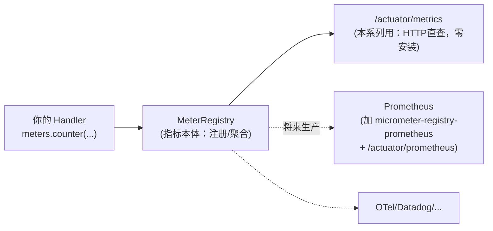
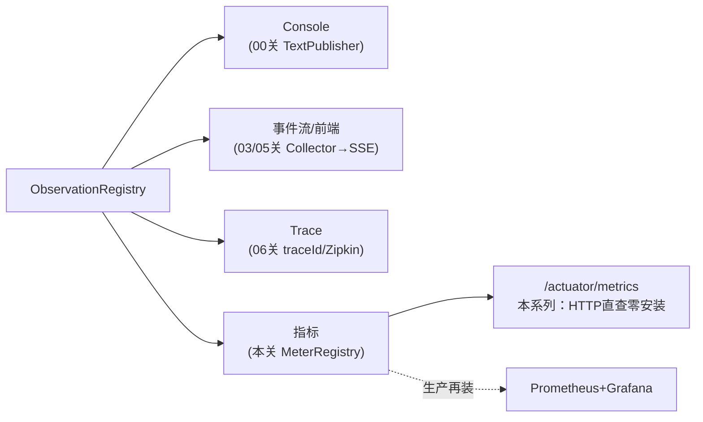

# 07 指标治理：Token 计量、SLO 与基数熔断（零安装版）

> **定位**：console、事件流、trace 都是"单次视角"。这一关补上"聚合视角"：用 Micrometer 把观测转成指标——**Token 成本计量**、工具耗时分桶（SLO）、以及工业系统必备的**基数熔断**（防一个标签打爆指标系统）。**本系列以学会知识点为第一目的，不装 Prometheus/Grafana**——全部指标用 Actuator 自带的 `/actuator/metrics` 端点直接看：知识点（MeterRegistry/Timer/基数纪律）一个不少，后端只是替换项，将来接 Prometheus 只需加一个依赖。
>
> **前置阅读**：[教程 00-基础与核心/01-Spring-AI框架入门 §低高基数]、[教程 04-企业级架构主干/07-成本治理与Token计量]。

---

## 7.1 关键认知：指标的本体是 MeterRegistry，不是 Prometheus



Micrometer 是"指标的 SLF4J"：业务代码只面对 `MeterRegistry` 接口，导出后端（Prometheus/OTel/云厂商）是可插拔实现。**所以本关写的一切代码，将来接 Prometheus 时一行都不用改**——这正是先学本体、后装后端的正确顺序。

## 7.2 你已经免费拥有的：ChatModelMeterObservationHandler

javap 实证：`org.springframework.ai.chat.observation.ChatModelMeterObservationHandler` 构造器接 `MeterRegistry`，在 `onStop` 里把 ChatResponse 的 usage/耗时转成 Micrometer 指标。只要 actuator 依赖在（demo01 已在 pom 直接引入 `spring-boot-starter-actuator`），它就自动装配——**不用写一行代码**，`/actuator/metrics` 里即可查到 LLM 相关指标（按 `gen_ai.*` 低基数标签分维度）。

```yaml
# application-demo01.yaml（业务配置统一进 demo01 profile 文件）
management:
  endpoints:
    web:
      exposure:
        include: health,metrics    # Actuator 自带，无需任何新依赖
```

## 7.3 自己动手：Token 成本归因计数器

内置指标给"耗时分布"，成本归因（每天烧多少 token、按类型分摊）要自己写一个 Handler——这次用 Micrometer 计数器而非内存 AtomicLong（02 关埋的坑：进程内计数多实例各自为政，指标必须走 MeterRegistry 才是"一处注册处处可查"）：

```java
// src/main/java/demo/demo01/obs/TokenCostHandler.java（完整文件）
package demo.demo01.obs;

import io.micrometer.core.instrument.MeterRegistry;
import io.micrometer.observation.Observation;
import io.micrometer.observation.ObservationHandler;
import org.springframework.ai.chat.observation.ChatModelObservationContext;
import org.springframework.beans.factory.annotation.Autowired;
import org.springframework.stereotype.Component;

@Component
public class TokenCostHandler implements ObservationHandler<ChatModelObservationContext> {

    @Autowired
    private MeterRegistry meters;   // ★ demo01 习惯：字段注入

    @Override
    public boolean supportsContext(Observation.Context context) {
        return context instanceof ChatModelObservationContext;
    }

    @Override
    public void onStop(ChatModelObservationContext ctx) {
        if (ctx.getResponse() == null || ctx.getResponse().getMetadata() == null
                || ctx.getResponse().getMetadata().getUsage() == null) {
            return;   // 出错/流式中断时 usage 可能缺失，观测代码不许崩
        }
        var usage = ctx.getResponse().getMetadata().getUsage();
        meters.counter("agent.token.cost", "type", "prompt").increment(usage.getPromptTokens());
        meters.counter("agent.token.cost", "type", "completion").increment(usage.getCompletionTokens());
    }
}
```

要点：`type=prompt/completion` 是**低基数**标签（两种取值）；按班次归因时用 04 关的 `shift`（3 值可枚举）也安全——**但绝不能把完整时间戳/设备编号当标签**，引出 7.5。

## 7.4 SLO 分桶：给工具耗时定达标线

新增两个文件：`ToolLatencyHandler`（记耗时）与 `ObsGovernanceConfig`（Timer + 两级熔断）。

```java
// src/main/java/demo/demo01/obs/ToolLatencyHandler.java（完整文件）
package demo.demo01.obs;

import io.micrometer.core.instrument.MeterRegistry;
import io.micrometer.core.instrument.Timer;
import io.micrometer.observation.Observation;
import io.micrometer.observation.ObservationHandler;
import org.springframework.ai.tool.observation.ToolCallingObservationContext;
import org.springframework.beans.factory.annotation.Autowired;
import org.springframework.stereotype.Component;

import java.time.Duration;

@Component
public class ToolLatencyHandler implements ObservationHandler<ToolCallingObservationContext> {

    /** Context 无 getDuration()（铁律）：onStart 放计时起点，onStop 取出差值 */
    private static final String START_NANOS = ToolLatencyHandler.class.getName() + ".startNanos";

    @Autowired
    private MeterRegistry meters;

    private Timer toolTimer;

    /** @Autowired 字段注入后初始化 Timer（@Bean 方式注册 Handler 时可省此步） */
    @jakarta.annotation.PostConstruct
    void initTimer() {
        this.toolTimer = Timer.builder("agent.tool.latency")
                .publishPercentileHistogram()                       // 发布直方图桶，可算分位数
                .serviceLevelObjectives(Duration.ofMillis(500),
                                        Duration.ofSeconds(2))      // 巡检工具 2s 达标线
                .register(meters);
    }

    @Override
    public boolean supportsContext(Observation.Context context) {
        return context instanceof ToolCallingObservationContext;
    }

    @Override
    public void onStart(ToolCallingObservationContext context) {
        context.put(START_NANOS, System.nanoTime());
    }

    @Override
    public void onStop(ToolCallingObservationContext context) {
        Long start = context.get(START_NANOS);
        if (start != null) {
            toolTimer.record(Duration.ofNanos(System.nanoTime() - start));
        }
    }
}
```

（`getCurrentTime` 这类快工具天然落在 `le=0.5` 桶内——时间工具成了天然的"对照组"。）

SLO 的意义不在看数字，在**把质量要求变成可告警的契约**：P99 超 2s → 告警；达标率 < 95% → 触发排查。这一步在本系列用 `/actuator/metrics` 肉眼验证即可，生产配 Grafana 告警规则——同样的指标，不同的展示端。

## 7.5 基数熔断：工业系统的保险丝

反例：新手把设备号放进指标标签——1 万台设备 × N 类工具 = 指标系统（无论 Prometheus 还是别的）被高基数标签打爆。防线有两层，同放 `ObsGovernanceConfig`：

```java
// src/main/java/demo/demo01/obs/ObsGovernanceConfig.java（完整文件）
package demo.demo01.obs;

import io.micrometer.core.instrument.config.MeterFilter;
import io.micrometer.observation.ObservationPredicate;
import org.springframework.context.annotation.Bean;
import org.springframework.context.annotation.Configuration;

@Configuration
public class ObsGovernanceConfig {

    /** 第一层：观测产生处就掐掉（省 CPU）——Boot 自动收集所有 ObservationPredicate Bean */
    @Bean
    public ObservationPredicate noiseFilter() {
        return (name, context) -> !name.startsWith("spring.security");   // 噪声观测不进管线
    }

    /** 第二层之一：同名指标 tag 组合数超限 → 之后的新组合一律拒绝（基数天花板） */
    @Bean
    public MeterFilter cardinalityCeiling() {
        return MeterFilter.maximumAllowableTags("agent.token.cost", "type", 5, MeterFilter.deny());
    }

    /** 第二层之二：任何想带 device.id 进指标的 meter 一律 deny（编号是高基数禁区） */
    @Bean
    public MeterFilter denyDeviceIdTag() {
        return MeterFilter.deny(id -> id.getTag("device.id") != null);
    }
}
```

两层分工：**Predicate 掐源头（编码规约挡不住所有手滑）**，**MeterFilter 兜登记（基数爆炸的最后防线）**。工业系统两级都要。

## 7.6 观测数据的四条出口（全系列管线终局图）



四条出口各司其职：console 看单次、事件流看实时过程、trace 查因果、指标做治理——同一套 Handler 机制上的四种投影。

## 7.7 Postman 测试（零安装，全部走 /actuator/metrics）

| 用例 | 操作 | 现象 |
|---|---|---|
| 指标清单 | `GET http://localhost:8081/actuator/metrics` | names 列表含 `agent.token.cost`、`agent.tool.latency` 及 Spring AI 内置 chat 指标 |
| Token 增长 | 调 2 次 `/demo01/chat`（一次带工具一次闲聊），再查 `GET /actuator/metrics/agent.token.cost` | `measurements` 里 COUNT 与 TOTAL 明显增长；`availableTags` 有 `type: prompt/completion` |
| 分维度查 | `GET /actuator/metrics/agent.token.cost?tag=type:prompt` | 只返回 prompt 侧 token 累计——成本归因成立 |
| SLO 桶 | 多调几次后查 `GET /actuator/metrics/agent.tool.latency` | histogram 分桶计数（`getCurrentTime` 落 0.5s 桶内） |
| 熔断演练 | 临时写 `meters.counter("test.cardinality","tool.timestamp","2026-08-24 14:03:22")` 调一次 | `/actuator/metrics` 里**没有** `test.cardinality`——deny 生效且不抛错 |
| 噪声观测验证 | `GET /actuator/health` | 事件流/SSE 里不出现 security 类噪声观测 |

## 7.8 什么时候自定义指标——决策表

| 需求 | 方案 |
|---|---|
| LLM 耗时/基础 token | 不写代码，内置 `ChatModelMeterObservationHandler` + `/actuator/metrics` 直查 |
| 成本归因到业务维度（类型/产线） | 自定义 Handler + 低基数标签计数器（7.3） |
| 延迟达标率 | Timer + SLO buckets（7.4） |
| 防基数爆炸 | Predicate + MeterFilter 双层（7.5） |

**将来接 Prometheus 只差两步**（记住即可，本系列不做）：pom 加 `micrometer-registry-prometheus`，`management.endpoints.web.exposure.include` 加 `prometheus`——业务代码零改动，这就是先学本体的红利。

## 7.9 本关沉淀

- 指标本体是 `MeterRegistry`，`/actuator/metrics` 是零安装的查看端，Prometheus 只是可插拔后端；
- 成本归因标签只允许可枚举值，`deviceId` 类编号是高基数禁区；
- Predicate 掐源头 + MeterFilter 兜登记 = 两级基数保险丝；
- 四条观测出口（console/事件流/trace/指标）共用一套 Handler 机制。

**下一关**：前端要打字机效果——流式模式下观测怎么闭合？→ [教程 00-基础与核心/08-Plan-and-Execute模式]
