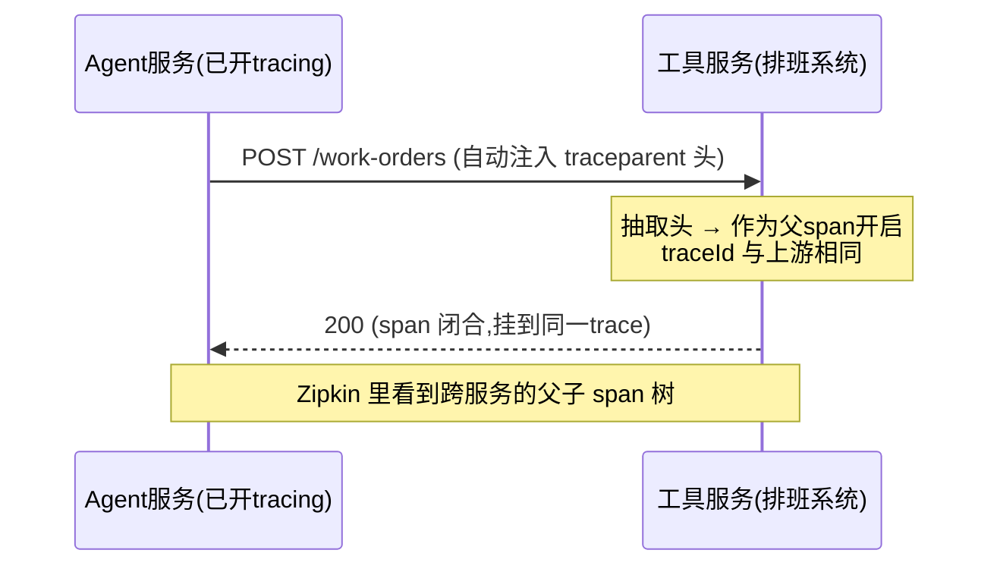

# 10 观测测试与跨服务传播：TestObservationRegistry 与 trace 透传

> **定位**：两个收尾进阶主题。① **观测代码自己怎么测**——Handler/Convention 也是代码，也要单测；用 `micrometer-observation-test` 的 `TestObservationRegistry` 断言 span 名/标签/顺序（实证：1.17.0 jar 含 `TestObservationRegistry`/`TestObservationRegistryAssert`）。② **trace 怎么跨服务传播**——巡检 Agent 迟早拆成 Agent 服务 + 工具服务 + 检索服务（[教程 02-SpringAI核心机制/02-Agent状态管理]），一条 trace 要穿过 HTTP 边界，靠的是 W3C `traceparent` 头。
>
> **前置阅读**：[教程 00-基础与核心/02-ChatClient与对话模型]、[教程 00-基础与核心/06-向量数据库选型]。

---

## 10.1 为什么观测代码必须有测试

观测是"系统的黑匣子"——黑匣子坏了往往没人知道（观测代码抛异常会被 Registry 吞掉，主业务不受影响，于是你安静地失去可观测性）。工业教训：**观测代码的 bug 是静默失效**。因此至少给两类代码配测试：自定义 Handler（标签算对没有、null 安全没有）、Convention（基数纪律没有滑坡）。

> **需在 pom.xml 中添加依赖**（建议放 observation profile 或 test scope）：

```xml
<dependency>
    <groupId>io.micrometer</groupId>
    <artifactId>micrometer-observation-test</artifactId>
    <scope>test</scope>
</dependency>
```

## 10.2 TestObservationRegistry：五分钟上手

核心机制：`TestObservationRegistry` 是一个**内存版 Registry**，配 `SimpleObservationRegistry` 思路把所有观测存下来，配 AssertJ 风格断言链（`TestObservationRegistryAssert`）：

```java
// src/test/java/demo/demo01/obs/ToolObservationTest.java（完整文件）
package demo.demo01.obs;

import io.micrometer.observation.Observation;
import io.micrometer.observation.tck.TestObservationRegistry;
import org.junit.jupiter.api.Test;
import org.springframework.ai.tool.definition.ToolDefinition;
import org.springframework.ai.tool.observation.ToolCallingObservationContext;
import org.springframework.ai.tool.observation.DefaultToolCallingObservationConvention;

import static io.micrometer.observation.tck.TestObservationRegistryAssert.assertThat;

class ToolObservationTest {

    @Test
    void toolObservationCarriesToolName() {
        TestObservationRegistry reg = TestObservationRegistry.create();

        ToolCallingObservationContext ctx = ToolCallingObservationContext.builder()
                .toolDefinition(ToolDefinition.builder()
                        .name("getCurrentTime")
                        .build())
                .build();

        Observation.createNotStarted("spring.ai.tool", () -> ctx, reg)
                .observationConvention(new DefaultToolCallingObservationConvention())
                .observe(() -> { });

        assertThat(reg)
                .hasObservationWithNameEqualTo("spring.ai.tool")
                .that()
                .hasLowCardinalityKeyValue("gen_ai.tool.call.name", "getCurrentTime");   // 工具名标签算对了
    }

    @Test
    void collectorNeverThrowsOnNullResult() {
        // 黑匣子静默失效的防线：null 输入不许抛——Collector 对 null 参数/结果的容忍要被固化
        TestObservationRegistry reg = TestObservationRegistry.create();
        ToolCallingObservationContext ctx = ToolCallingObservationContext.builder()
                .toolDefinition(ToolDefinition.builder()
                        .name("getCurrentTime")
                        .build())
                .build();   // 不 set 参数/结果 → null
        Observation.createNotStarted("spring.ai.tool", () -> ctx, reg).observe(() -> { });
        // AgentEventCollector.onStop 走到 TOOL 分支不抛异常即通过（可将 Collector 注册进 reg 再断言）
    }
}
```

（04 关的 `shift` 班次标签在 ChatModel 观测上、依赖观测发生时刻，单测里构造 `ChatModelObservationContext` 需要 Prompt 与 AiOperationMetadata，成本高于收益——它由 11 关的集成测试覆盖：跑一次 `/inspect` 后断言时间线事件的 shift 值合法。）

> 断言 API 以本地 `micrometer-observation-test` 1.17.0 jar 实证为准（`hasObservationWithNameEqualTo`/`hasLowCardinalityKeyValue` 等在 `TestObservationRegistryAssert` 及其内部类上）；Builder 细节（`ToolDefinition.builder()` 的参数集）写码时 javap 复核一次——测试代码同样守铁律 0。

**另一个层次的测试**：集成测试用 `@SpringBootTest` + 注入真实 `ObservationRegistry`，替换为 TestObservationRegistry Bean（`@TestConfiguration`），跑一次 `/inspect` 后断言时间线里 `LLM → TOOL → LLM` 顺序——**把"事件顺序"当契约固化**，谁改坏了 Advisor/工具编排，测试先红。

## 10.3 跨服务 trace 传播：W3C traceparent

微服务化后（Agent 服务 → 工具服务），trace 要过 HTTP 边界。标准是 W3C Trace Context：下游收到 `traceparent: 00-{traceId}-{spanId}-01` 头，接续同一 trace：



好消息是**零代码**：引入 micrometer-tracing bridge + `context-propagation` 后，RestClient/WebClient 的观测装饰自动注入/抽取 `traceparent`。要做的只有两件：

1. 下游服务也加同样的 tracing 依赖（06 关清单）；
2. 手写 HTTP 客户端（如产线设备网关 SDK）时，需要手动注入。上游注入只用到已实证的 `span.context().traceId()/spanId()`：

```java
// 上游：手动传播（只有绕过 WebClient 时才需要）：把当前 trace 写进头
var span = tracer.currentSpan();
if (span != null) {
    request.header("traceparent",
        "00-" + span.context().traceId() + "-" + span.context().spanId() + "-01");
}
```

下游从 `traceparent` 头恢复父上下文的写法**依赖 tracing bridge 的具体实现**（Brave/OTel 各有 extractor），本机仓库当前只有 `micrometer-tracing-bom`、bridge jar 未下载，无法 javap 实证——按铁律 0 此处不给未实证代码。落地路径：引入 `micrometer-tracing-bridge-brave` 后，对 `io.micrometer.tracing.Tracer` 与 `io.micrometer.tracing.propagation.Propagator`（`extract`/`inject`）做 javap 实证，再写"头 → TraceContext → `tracer.nextSpan(parent)` → `start()`"的抽取链。

## 10.4 进程内传播的坑：@Async 与线程池

除跨服务外，进程内换线程也断链。两条规则（呼应 02 关 WebFlux 铁律）：

- **@Async/自建线程池**：给 Executor 包 `ContextExecutorService.wrap(...)`（micrometer context-propagation 提供，按 1.17.0 jar 实证可用性复核）或用 Boot 自动配置的 `applicationTaskExecutor`（已包装）；
- **Reactor 链**：`Hooks.enableAutomaticContextPropagation()`（06 关已开）覆盖。

## 10.5 测试与传播的 Postman/运维验证

| 用例 | 操作 | 现象 |
|---|---|---|
| 单测跑通 | `mvn test` | 两条观测单测绿——工业标签与 null 安全被固化 |
| 契约测试 | 改坏 Collector（如注释掉 TOOL 分支）再跑集成测试 | 事件顺序断言失败——观测契约先于线上事故报警 |
| 跨服务验证（有下游时） | 下游起一个最小 Boot 服务接排班查询接口，两边都开 tracing；调 `/inspect` 问班次 | Zipkin 一条 trace 含两个服务的 span；两服务日志同一 traceId |
| 手动传 traceparent | Postman 请求头加 `traceparent: 00-64f...-c1a...-01` 再调 `/inspect` | 该请求的日志/事件 traceId 变成你指定的值——理解"入口接续外部 trace"（排障时把前端报错的 traceId 手工重放） |

## 10.6 本关沉淀

- 观测代码静默失效是真实风险，`TestObservationRegistry` + AssertJ 断言链是标准测法；
- 把"事件顺序/标签"当契约测试固化，重构观测管线时先红先改；
- 跨服务传播 = W3C `traceparent` 头注入/抽取，标准客户端零代码，手写 SDK 手动注入；
- 进程内换线程（@Async/线程池/Reactor）各有既定传播方案，禁裸 new Thread。

## 10.7 本篇之后的路

至此 00-10 的零件全部讲透、练熟。下一关（11 综合实战）把它们总装成完整的工业巡检 Agent 可观测闭环；再往生产走，下一个台阶是**观测驱动的闭环治理**（指标/评估反哺 Prompt 与检索策略，即数据飞轮）——那是 [教程 08-架构师进阶/07-数据飞轮与持续改进] 与项目 05-13 的正篇领域。

> 交叉引用：[教程 04-企业级架构主干/02-全链路可观测性]、[教程 04-企业级架构主干/03-工具执行可观测与审计]、[教程 04-企业级架构主干/10-容错与弹性设计]

**下一关**：实战前最后一块拼图——Spring AI 2.0 与 Observation 的完整整合面地图。→ [教程 02-SpringAI核心机制/01-MCP协议]
