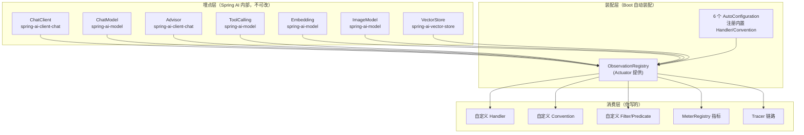
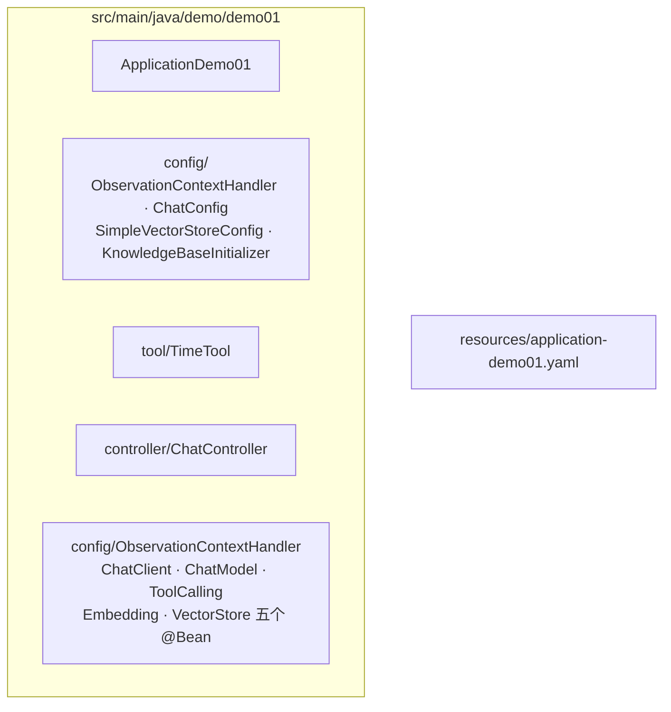

# 11 深度整合：Spring AI 2.0 与 Observation 的完整结合面

> **定位**：实战总装前的**深度基准篇**。00-10 你逐关学会了用观测，这一关把镜头拉远：Spring AI 2.0 到底在**哪些位置**埋了观测、每个位置**给你什么**、**全部配置键**长什么样、Boot **自动装配链**如何把它们串起来、你在**每个环节**的替换点在哪。全部结论来自本地 2.0.0 jar 的 javap/字节码实证（铁律 0），读完这一篇，Spring AI 2.0 的观测整合面在你手里没有盲区。
>
> **前置阅读**：[教程 05-Observation可观测/00-最小闭环：Agent各阶段输出打印到控制台]~[10-观测测试与跨服务传播：TestObservationRegistry与trace透传]。**读者画像**：准备把 Observation 用进生产、需要一张"完整地图"再动手的架构师。
>
> **版本基准**：Spring Boot 4.1.0 + Spring AI 2.0.0 + micrometer-observation 1.17.0。

---

## 11.1 整合全景：三层结构一张图

Spring AI 与 Observation 的结合是清晰的三层——**埋点层（框架代码里的 Observation 调用）→ 装配层（Boot 自动装配把 Registry/Handler/Convention 连起来）→ 消费层（你写的 Handler/指标/trace/前端）**：



**核心契约**：埋点层只依赖 `ObservationRegistry` 一个接口——所以消费层加多少种消费者，框架代码零感知（00 关"收音机"比喻的架构保障）。

## 11.2 七大观测点完全清单（jar 实证）

| # | 观测点 | 领域 Context（真实 FQCN） | 所在 jar | span 名（DEFAULT_NAME 实证） | 你能拿到什么 |
|---|---|---|---|---|---|
| 1 | ChatClient 调用 | `o.s.ai.chat.client.observation.ChatClientObservationContext` | spring-ai-client-chat | `spring.ai.chat.client` | 请求上下文、advisor/工具清单（高基数） |
| 2 | ChatModel 调用 | `o.s.ai.chat.observation.ChatModelObservationContext` | spring-ai-model | `gen_ai.client.operation`（contextual 名 `chat "provider"`） | 完整 Prompt、ChatResponse、**Usage/Token**、全部请求参数（temperature/topK…） |
| 3 | Advisor 执行 | `o.s.ai.chat.client.advisor.observation.AdvisorObservationContext` | spring-ai-client-chat | —（按 advisor 名） | `getAdvisorName()/getOrder()/getChatClientRequest()/getChatClientResponse()` |
| 4 | 工具调用 | `o.s.ai.tool.observation.ToolCallingObservationContext` | spring-ai-model | `spring.ai.tool` | `getToolDefinition()`（名/描述/Schema）、`getToolCallArguments()`、`setToolCallResult()`、`getToolType()/getToolCallId()` |
| 5 | Embedding | `o.s.ai.embedding.observation.EmbeddingModelObservationContext` | spring-ai-model | `gen_ai.client.operation`（embedding 语境） | 输入文本数、维度（`getDimensions()`）、usage |
| 6 | ImageModel | `o.s.ai.image.observation.ImageModelObservationContext` | spring-ai-model | — | prompt、options |
| 7 | VectorStore | `o.s.ai.vectorstore.observation.VectorStoreObservationContext` | spring-ai-vector-store | 按 operation | `getOperationName()/getDatabaseSystem()/getCollectionName()/getQueryRequest()/getQueryResponse()/getDimensions()/getSimilarityMetric()` |

> 这张表就是"你能观测什么"的上限——任何监控需求，先到这里找对应的 Context；表里没有的（如"模型排队时间"），才需要自己埋业务观测（01 关的 `shift.resolve` 姿势）。

## 11.3 配置键总表（全量 9 个，全部本地 2.0.0 metadata 实证）

| 配置键 | 默认 | 作用层 | 说明 |
|---|---|---|---|
| `spring.ai.chat.client.observations.log-prompt` | false | **ChatClient 层** | 请求 prompt 进 ChatClient 观测上下文 |
| `spring.ai.chat.client.observations.log-completion` | false | **ChatClient 层** | 回复内容进 ChatClient 观测上下文 |
| `spring.ai.chat.observations.log-prompt` | false | **ChatModel 层** | 发给 LLM 的完整 prompt 进 ChatModel 观测 |
| `spring.ai.chat.observations.log-completion` | false | **ChatModel 层** | LLM 回复进 ChatModel 观测 |
| `spring.ai.chat.observations.include-error-logging` | false | ChatModel 层 | 错误信息进观测 |
| `spring.ai.image.observations.log-prompt` | false | ImageModel 层 | 图像 prompt 进观测 |
| `spring.ai.tools.observations.include-content` | false | **ToolCalling 层** | 工具参数+结果进观测 |
| `spring.ai.vectorstore.observations.log-query-response` | false | **VectorStore 层** | 检索命中文档进观测 |

**两个易踩的细节**（实证发现，多数教程讲错）：

1. **`chat.client` 与 `chat` 是两层不同的观测**：`spring.ai.chat.client.observations.*` 控制 ChatClient 层 span 的内容；`spring.ai.chat.observations.*` 控制 ChatModel 层。同一次请求里两层 span 都存在（01 关 span 树），打开哪层的内容就在哪层看；
2. **全部默认 false 不是偷懒，是合规设计**：内容（prompt/参数/结果）都是高基数+潜在敏感数据，默认不进观测管道；打开必须配套脱敏（04 关范式）。

## 11.4 自动装配解剖：六个 AutoConfiguration 与 Tracer 双分支

jar 实证的装配类与关键行为：

| 模块（autoconfigure artifact） | AutoConfiguration 类 | 装配了什么 |
|---|---|---|
| model-chat-client | `ChatClientAutoConfiguration` | ChatClient.Builder（观测随 Registry 自动生效）+ chat.client 层内容 handler |
| model-chat-observation | `ChatObservationAutoConfiguration` | `ChatModelMeterObservationHandler`（token/耗时指标）+ 内容/错误 handler |
| model-tool | `ToolCallingAutoConfiguration` | 工具内容 filter/handler（`include-content` 开关） |
| model-embedding-observation | `EmbeddingObservationAutoConfiguration` | embedding 指标 handler |
| model-image-observation | `ImageObservationAutoConfiguration` | image 内容 handler |
| vector-store-observation | `VectorStoreObservationAutoConfiguration` | `VectorStoreQueryResponseObservationHandler`（`log-query-response` 开关） |

**TracerPresent / TracerNotPresent 双分支**（javap 实证存在于 `ChatObservationAutoConfiguration` 内部类）：classpath 有 tracing bridge 时，`ErrorLoggingObservationHandler` 走带 `Tracer` 的构造（错误日志带 traceId），否则走降级构造。**这就是 06 关"引一个依赖，错误日志自动带链路号"的装配层原理**——你不用配任何东西，Boot 按依赖在场与否自动选择。

**你的替换点规则**（与 04 关实践互为印证）：

| 想替换什么 | 怎么做 | 装配依据 |
|---|---|---|
| 默认 Convention | 容器里放同类型 Bean（必要时 `@Primary`） | 自动装配 `@ConditionalOnMissingBean` 退位 |
| 加 Handler | `@Component`/`@Bean` 即自动挂 Registry | Boot 收集所有 `ObservationHandler` Bean |
| 加 Filter | `@Bean ObservationFilter` | 同上 |
| 掐观测 | `@Bean ObservationPredicate` | 同上 |

## 11.5 标签字典：三套 KeyNames 枚举全量（实证枚举值）

**ChatClient 观测**（`ChatClientObservationDocumentation`）：

| 基数 | 枚举 | 落到标签的 key |
|---|---|---|
| Low | `SPRING_AI_KIND` / `STREAM` | `spring.ai.kind`、是否流式 |
| High | `CHAT_CLIENT_ADVISORS` / `CHAT_CLIENT_TOOL_NAMES` / `CHAT_CLIENT_CONVERSATION_ID` | advisor 清单、工具名清单、会话 id |

**ChatModel 观测**（`ChatModelObservationDocumentation`）——**成本治理的金矿**：

| 基数 | 枚举 | key |
|---|---|---|
| Low | `AI_OPERATION_TYPE` / `AI_PROVIDER` / `REQUEST_MODEL` / `RESPONSE_MODEL` | `gen_ai.operation.name`、`gen_ai.system`、请求/响应模型名 |
| High | `REQUEST_TEMPERATURE/TOP_P/TOP_K/MAX_TOKENS/FREQUENCY_PENALTY/PRESENCE_PENALTY/STOP_SEQUENCES/STREAM/TOOL_NAMES`、`RESPONSE_ID/FINISH_REASONS`、**`USAGE_INPUT_TOKENS/OUTPUT_TOKENS/TOTAL_TOKENS/CACHE_READ_INPUT_TOKENS/CACHE_WRITE_INPUT_TOKENS`** | 全部推理参数 + Token 四件套 + 缓存命中 |

**ToolCalling 观测**（`ToolCallingObservationDocumentation`）：

| 基数 | 枚举 | key |
|---|---|---|
| Low | `AI_OPERATION_TYPE` / `AI_PROVIDER` / `SPRING_AI_KIND` / `TOOL_DEFINITION_NAME` / `TOOL_TYPE` | 工具名、工具类型（可聚合） |
| High | `TOOL_DEFINITION_DESCRIPTION` / `TOOL_DEFINITION_SCHEMA` / `TOOL_CALL_ID` / `TOOL_CALL_ARGUMENTS` / `TOOL_CALL_RESULT` | 描述/Schema/调用号/参数/结果 |

读法示范：`USAGE_CACHE_READ_INPUT_TOKENS`（缓存读 token）——DeepSeek 这类支持上下文缓存的模型，这个标签直接量化"缓存省了多少钱"，是 07 关成本计量的框架原生增强点（你只需在 Handler 里从 ChatResponse usage 取数，标签名对齐此约定即可与生态工具互通）。

## 11.6 整合基准工程全集（demo01 风格，每个文件零省略）

把整合面落成**可运行的完整工程**——五个观测点各配一个最朴素 Handler（console 打印各自 Context 里"能拿到什么"），全部按 demo01 风格组织。工程结构：



### 11.6.1 pom 依赖（observation profile，与 demo01 一致）

```xml
<!-- demo01 的 pom.xml 没有 profile 机制：spring-boot-starter-actuator 已是 <dependencies> 下的直接依赖，本关零 pom 改动 -->
```

运行：`mvn spring-boot:run -Dspring-boot.run.profiles=demo01`

### 11.6.2 application-demo01.yaml（最简底座 + 按需注释的内容开关，逐键对应 11.3 总表）

```yaml
# src/main/resources/application-demo01.yaml（完整文件；application.yaml 只保留 .env import 与 profiles.active: demo01 两行）
server:
  port: 8081
spring:
  ai:
    openai:
      base-url: https://api.deepseek.com          # DeepSeek 兼容 OpenAI 协议
      api-key: ${DEEPSEEK_API_KEY}                # 环境变量，不落明文
      chat:
        model: deepseek-v4-flash
        timeout: 600s
      embedding:
        options:
          model: text-embedding-v3   # embedding 观测点需要（RAG 教学规划依赖，按实际可用的 embedding 端填写）
    # ↓↓↓ 内容暴露开关：默认全注释（本地观测不需要，见下方实证说明）。
    #    只有当正文要出现在后端 span 属性 / 框架自带日志时，才按场景解开对应行，生产开前先脱敏（04 关）
    # chat:
    #   observations:
    #     log-prompt: true             # 需要：后端 span 上看完整 prompt / 框架日志打 prompt
    #     log-completion: true         # 需要：后端 span 上看回复正文 / 框架日志打回复
    #     include-error-logging: true  # 需要：排障期让错误信息进观测管道
    # chat.client:
    #   observations:
    #     log-prompt: true             # 需要：ChatClient 层 span 上看请求侧内容（注意与 chat 层互相独立）
    #     log-completion: true         # 需要：ChatClient 层 span 上看响应侧内容
    # tools:
    #   observations:
    #     include-content: true        # 需要：工具参数+结果上后端 span（本地 Handler 不需要，Context 对象里本就有）
    # vectorstore:
    #   observations:
    #     log-query-response: true     # 需要：RAG 排障（09 关框架注册的检索命中文档 Handler 依赖此开关）
management:
  endpoints:
    web:
      exposure:
        include: health,metrics
```

> **这些开关和 11.6.6 的 `ObservationContextHandler` 是什么关系？——常见误解是"不开开关 Handler 就读不到内容"，实证（字节码）恰恰相反**：
>
> ```mermaid
> flowchart LR
>     A["框架执行路径<br/>（无条件）"] -->|"参数/结果/响应写进<br/>Context 对象"| B["Observation.Context<br/>内存对象"]
>     B -->|"自定义 Handler 直接读字段<br/>（不需要任何开关）"| C["ObservationContextHandler<br/>（11.6.6）"]
>     B -->|"开关条件注册的 Filter/Handler<br/>把内容追加为高基数 KeyValues"| D["span 属性导出<br/>Jaeger/OTel/框架日志"]
> ```
>
> 三层实证结论（`DefaultToolCallingManager` / `ToolCallingAutoConfiguration` / `ChatObservationAutoConfiguration` 字节码核对）：
>
> 1. **内容进 Context 对象是无条件的**：`DefaultToolCallingManager` 无分支地 `toolCallArguments(...)` + `setToolCallResult(...)`——所以自研 Handler **不开任何开关**也能 `getToolCallArguments()/getToolCallResult()` 打出参数与结果；
> 2. **开关真正门控的是"内容出口"**：`include-content`/`log-completion` 等按 `@ConditionalOnProperty` 条件注册 `ToolCallingContentObservationFilter`、`ChatModelCompletionObservationHandler` 等框架组件，作用是把 Context 里的内容**追加为高基数 KeyValues**（即 span 属性）导出到观测后端，或用框架自带日志打正文（开启时会警告 sensitive information 风险）；
> 3. **结论**：只在本地看 → 开关全关 + 自研 Handler 就够；要把正文带上后端（Zipkin/OTel span 属性）→ 才需要开对应开关，且生产开前先做 04 关的脱敏。

### 11.6.3 主类与观测配置

```java
// src/main/java/demo/demo01/ApplicationDemo01.java（完整文件）
package demo.demo01;

import org.springframework.boot.SpringApplication;
import org.springframework.boot.autoconfigure.SpringBootApplication;
import reactor.core.publisher.Hooks;

@SpringBootApplication
public class ApplicationDemo01 {

    public static void main(String[] args) {
        Hooks.enableAutomaticContextPropagation();   // 06 关：Reactor Context ↔ ThreadLocal 桥接
        SpringApplication.run(ApplicationDemo01.class, args);
    }
}
```

观测消费统一为 00 关落地的 `ObservationContextHandler`（`@Configuration @Slf4j`，四类 Context 各一个 `@Bean`，完整代码见 [教程 05-Observation可观测/00] §0.2.2），本篇不再重复。调试期若需"整段 toString"的粗粒度对照输出，可临时注册 Micrometer 自带的 `ObservationTextPublisher` Bean，验证完即移除——工程正式代码不采用它。

### 11.6.4 RAG 底座（供 Embedding/VectorStore 两个观测点有事件可发）

```java
// src/main/java/demo/demo01/config/SimpleVectorStoreConfig.java（完整文件，零安装路线）
package demo.demo01.config;

import org.springframework.ai.embedding.EmbeddingModel;
import org.springframework.ai.vectorstore.SimpleVectorStore;
import org.springframework.ai.vectorstore.VectorStore;
import org.springframework.context.annotation.Bean;
import org.springframework.context.annotation.Configuration;

@Configuration
public class SimpleVectorStoreConfig {

    @Bean
    public VectorStore vectorStore(EmbeddingModel embeddingModel) {
        return SimpleVectorStore.builder(embeddingModel).build();
    }
}
```

```java
// src/main/java/demo/demo01/config/KnowledgeBaseInitializer.java（完整文件）
package demo.demo01.config;

import org.springframework.ai.document.Document;
import org.springframework.ai.vectorstore.VectorStore;
import org.springframework.boot.ApplicationArguments;
import org.springframework.boot.ApplicationRunner;
import org.springframework.stereotype.Component;

import java.util.List;

/** 启动时灌入"设备手册"，让 Embedding/VectorStore 观测点有真实事件 */
@Component
public class KnowledgeBaseInitializer implements ApplicationRunner {

    private final VectorStore vectorStore;

    public KnowledgeBaseInitializer(VectorStore vectorStore) {
        this.vectorStore = vectorStore;
    }

    @Override
    public void run(ApplicationArguments args) {
        vectorStore.add(List.of(
                new Document("CNC-001 主轴温度超过75度需停机检查冷却系统，常见原因是冷却液不足或散热器堵塞。"),
                new Document("AGV-07 振动超过4说明导轮磨损，建议更换导轮并校准轨道。")));
    }
}
```

### 11.6.5 工具与 ChatClient（v4 终版）

```java
// src/main/java/demo/demo01/tool/TimeTool.java（完整文件，v2 终版）
package demo.demo01.tool;

import io.micrometer.observation.Observation;
import io.micrometer.observation.ObservationRegistry;
import org.springframework.ai.tool.annotation.Tool;
import org.springframework.beans.factory.annotation.Autowired;

import java.time.LocalDateTime;
import java.time.format.DateTimeFormatter;

public class TimeTool {

    @Autowired
    private ObservationRegistry registry;   // 01 关确立：经 @Bean 注册后字段注入生效

    @Tool(description = "获取系统的当前时间")
    public String getCurrentTime() {
        return LocalDateTime.now().format(DateTimeFormatter.ISO_LOCAL_DATE_TIME);
    }

    @Tool(description = "获取当前班次（morning/afternoon/night），用于巡检排班和交接记录")
    public String getCurrentShift() {
        Observation obs = Observation.start("shift.resolve", Observation.Context::new, registry);
        try (Observation.Scope scope = obs.openScope()) {
            int hour = LocalDateTime.now().getHour();
            String shift = hour < 8 ? "morning" : hour < 16 ? "afternoon" : "night";
            return "{\"shift\":\"" + shift + "\",\"hour\":" + hour + "}";
        } catch (Exception e) {
            obs.error(e);
            throw e;
        } finally {
            obs.stop();
        }
    }
}
```

```java
// src/main/java/demo/demo01/config/ChatConfig.java（完整文件，v4 终版）
package demo.demo01.config;

import demo.demo01.tool.TimeTool;
import org.springframework.ai.chat.client.ChatClient;
import org.springframework.ai.chat.client.advisor.vectorstore.QuestionAnswerAdvisor;
import org.springframework.ai.vectorstore.SearchRequest;
import org.springframework.ai.vectorstore.VectorStore;
import org.springframework.context.annotation.Bean;
import org.springframework.context.annotation.Configuration;

@Configuration
public class ChatConfig {

    private static final String SYSTEM_PROMPT = """
            你是工厂现场巡检与交接助手。规则：
            1. 结论需要时间戳时必须先调用 getCurrentTime 工具，禁止自己编造时间。
            2. 涉及班次/排班时调用 getCurrentShift 工具获取，不要凭时段猜测。
            3. 设备相关建议优先参考知识库检索到的手册内容，检索不到就明说。
            """;

    @Bean
    public TimeTool timeTool() {
        return new TimeTool();   // 01 关确立：@Bean 才能让 TimeTool 的 @Autowired registry 生效
    }

    // 09 关的 SimpleVectorStore（或 pgvector 自动装配）——RAG 教学规划依赖
    @Bean
    public ChatClient chatClient(ChatClient.Builder builder, TimeTool timeTool, VectorStore vectorStore) {
        return builder
                .defaultTools(timeTool)
                .defaultSystem(SYSTEM_PROMPT)
                .defaultAdvisors(QuestionAnswerAdvisor.builder(vectorStore)
                        .searchRequest(SearchRequest.builder()
                                .topK(3)
                                .similarityThreshold(0.5)
                                .build())
                        .build())
                .build();
    }
}
```

```java
// src/main/java/demo/demo01/controller/ChatController.java（完整文件，v6 终版）
package demo.demo01.controller;

import org.springframework.ai.chat.client.ChatClient;
import org.springframework.beans.factory.annotation.Autowired;
import org.springframework.http.codec.ServerSentEvent;
import org.springframework.web.bind.annotation.GetMapping;
import org.springframework.web.bind.annotation.RequestMapping;
import org.springframework.web.bind.annotation.RestController;
import reactor.core.publisher.Flux;

@RestController
@RequestMapping("/demo01")
public class ChatController {

    @Autowired
    private ChatClient client;

    @GetMapping("/chat")
    public String chat(String prompt) {
        return client.prompt().user(prompt).call().content();
    }

    @GetMapping(value = "/chat/stream", produces = "text/event-stream")
    public Flux<ServerSentEvent<String>> chatStream(String prompt) {
        return client.prompt()
                .user(prompt)
                .stream()
                .content()
                .map(token -> ServerSentEvent.<String>builder(token).event("delta").build())
                .concatWith(Flux.just(ServerSentEvent.<String>builder("[完成]").event("done").build()));
    }
}
```

### 11.6.6 五个观测点 Handler 全集（每个完整文件，全部实证 getter）

```java
// src/main/java/demo/demo01/config/ObservationContextHandler.java（完整文件：demo01 习惯——观测 Handler 统一收在这一个 @Configuration @Slf4j 类里，每类 Context 一个 @Bean）
package demo.demo01.config;

import io.micrometer.observation.Observation;
import io.micrometer.observation.ObservationHandler;
import lombok.extern.slf4j.Slf4j;
import org.springframework.ai.chat.client.observation.ChatClientObservationContext;
import org.springframework.ai.chat.metadata.Usage;
import org.springframework.ai.chat.observation.ChatModelObservationContext;
import org.springframework.ai.embedding.observation.EmbeddingModelObservationContext;
import org.springframework.ai.tool.observation.ToolCallingObservationContext;
import org.springframework.ai.vectorstore.observation.VectorStoreObservationContext;
import org.springframework.context.annotation.Bean;
import org.springframework.context.annotation.Configuration;
import org.springframework.util.ObjectUtils;

/**
 * 五个观测点各一个 @Bean（每个 Bean 只认领自己的 Context：泛型写具体类型 + supportsContext instanceof）
 * demo01 习惯：@Slf4j + log.info 中文文案，取模型响应前 ObjectUtils.isEmpty 链式判空，禁止 System.out.println
 */
@Configuration
@Slf4j
public class ObservationContextHandler {

    /** 观测点1：ChatClient 层——编排全程（Advisor+工具+多轮推理的外壳） */
    @Bean
    public ObservationHandler<ChatClientObservationContext> chatClientObservationContextObservationHandler() {
        return new ObservationHandler<>() {
            @Override
            public boolean supportsContext(Observation.Context context) {
                return context instanceof ChatClientObservationContext;
            }

            @Override
            public void onStop(ChatClientObservationContext context) {
                log.info("观测点1 ChatClient：request：{}，streaming：{}，error：{}",
                        context.getRequest(), context.isStreaming(), context.getError());
            }
        };
    }

    /** 观测点2：ChatModel 层——单次推理的参数、回复与 Token（成本治理数据源） */
    @Bean
    public ObservationHandler<ChatModelObservationContext> chatModelTokenObservationHandler() {
        return new ObservationHandler<>() {
            @Override
            public boolean supportsContext(Observation.Context context) {
                return context instanceof ChatModelObservationContext;
            }

            @Override
            public void onStop(ChatModelObservationContext context) {
                if (ObjectUtils.isEmpty(context.getResponse()) || ObjectUtils.isEmpty(context.getResponse().getMetadata())) {
                    return;
                }
                Usage usage = context.getResponse().getMetadata().getUsage();
                String contents = String.valueOf(context.getRequest().getContents());
                log.info("观测点2 ChatModel：streaming：{}，prompt 内容：{}，inputTokens：{}，outputTokens：{}，totalTokens：{}",
                        context.isStreaming(),
                        contents.substring(0, Math.min(60, contents.length())),
                        usage.getPromptTokens(), usage.getCompletionTokens(), usage.getTotalTokens());
            }
        };
    }

    /** 观测点3：ToolCalling 层——工具名/类型/参数/结果/调用号（Agent 行为审计核心） */
    @Bean
    public ObservationHandler<ToolCallingObservationContext> toolCallingTraceObservationHandler() {
        return new ObservationHandler<>() {
            @Override
            public boolean supportsContext(Observation.Context context) {
                return context instanceof ToolCallingObservationContext;
            }

            @Override
            public void onStop(ToolCallingObservationContext context) {
                log.info("观测点3 ToolCalling：tool：{}，type：{}，callId：{}，args：{}，result：{}",
                        context.getToolDefinition().name(), context.getToolType(), context.getToolCallId(),
                        context.getToolCallArguments(), context.getToolCallResult());
            }
        };
    }

    /** 观测点4：Embedding 层——向量化输入数与返回向量数（RAG 延迟大头常在这里） */
    @Bean
    public ObservationHandler<EmbeddingModelObservationContext> embeddingTraceObservationHandler() {
        return new ObservationHandler<>() {
            @Override
            public boolean supportsContext(Observation.Context context) {
                return context instanceof EmbeddingModelObservationContext;
            }

            @Override
            public void onStop(EmbeddingModelObservationContext context) {
                int inCount = context.getRequest() != null ? context.getRequest().getInstructions().size() : -1;
                int outCount = context.getResponse() != null ? context.getResponse().getResults().size() : -1;
                log.info("观测点4 Embedding：输入文本数：{}，返回向量数：{}，error：{}", inCount, outCount, context.getError());
            }
        };
    }

    /** 观测点5：VectorStore 层——检索质量（operation/topK/命中数），RAG 排障第一现场 */
    @Bean
    public ObservationHandler<VectorStoreObservationContext> vectorStoreObservationHandler() {
        return new ObservationHandler<>() {
            @Override
            public boolean supportsContext(Observation.Context context) {
                return context instanceof VectorStoreObservationContext;
            }

            @Override
            public void onStop(VectorStoreObservationContext context) {
                log.info("观测点5 VectorStore：operation：{}，db：{}，topK：{}，命中数：{}，相似度度量：{}",
                        context.getOperationName(), context.getDatabaseSystem(),
                        context.getQueryRequest() != null ? context.getQueryRequest().getTopK() : "?",
                        context.getQueryResponse() != null ? context.getQueryResponse().size() : 0,
                        context.getSimilarityMetric());
            }
        };
    }
}
```

> ImageModel 观测点（第 6 个）同构：`ImageModelObservationContext` + `supportsContext` 认领即可，需要图像模型依赖（`spring-ai-starter-model-openai` 的 image 部分）才会发事件——结构完全一致，留作你按本篇范式自证的自测题（javap `o.s.ai.image.observation.ImageModelObservationContext` 后照抄 Embedding 版）。

**架构师读法**：`ChatClient.Builder` 是 Boot 自动装配的——它内部已注入 `ObservationRegistry`，所以**你从不用手动把 Registry 塞给 ChatClient**；观测生效与否的唯一开关是 classpath（Actuator 在不在）。五个 Handler 全部 `@Bean` 即挂载——这就是"约定优于配置"在观测层的完整形态。

## 11.7 每层自定义入口汇总（决策速查）

| 层 | 自定义入口 | 典型场景（本系列实证过的） |
|---|---|---|
| ChatClient 观测 | `ChatClientObservationConvention` Bean | 加会话/租户标签（多租户归因） |
| ChatModel 观测 | `ChatModelObservationConvention` Bean | 04 关 shift 班次标签；对齐 gen_ai 语义约定 |
| ToolCalling 观测 | `ToolCallingObservationConvention` Bean | 工具名规范化、工具分级标签 |
| VectorStore 观测 | `VectorStoreObservationConvention` Bean | 检索库/集合名标签 |
| 任意层 Handler | `ObservationHandler<T>` + `supportsContext` | 03 关事件流、07 关 token/耗时、11 关审计 |
| 内容收尾 | `ObservationFilter` | 04 关审计标记/脱敏位 |
| 观测降噪 | `ObservationPredicate` | 07 关 security 噪声掐除 |
| 指标兜底 | `MeterFilter` | 07 关基数熔断 |

**选型口诀**：改标签找 Convention、拿数据找 Handler、改内容找 Filter、砍流量找 Predicate、保指标找 MeterFilter——五个动词对应五类组件，永不再混。

## 11.8 Postman 验证（整合面自查清单）

| # | 用例 | 操作 | 验收现象 |
|---|---|---|---|
| 1 | 全观测点生效 | 按 11.6 建好整个工程，`GET /demo01/chat?prompt=现在几点？当前什么班次？` | console 同时打出 `[观测点1 ChatClient]`、`[观测点2 ChatModel]`（含 Token）、`[观测点3 ToolCalling]`（getCurrentTime+getCurrentShift 两条），TextPublisher 的整段输出混排对照 |
| 1b | RAG 观测点 | `GET /demo01/chat?prompt=CNC-001主轴温度高该怎么处理` | 追加出现 `[观测点4 Embedding]`（query 向量化）与 `[观测点5 VectorStore]`（QUERY + 命中数）——五个观测点在一条请求里全部点亮 |
| 2 | 两层内容键独立 | 把 `chat.client.observations.log-prompt` 关掉、`chat.observations.log-prompt` 留着 | ChatClient 层 span 无 prompt 内容、ChatModel 层仍有——验证 11.3 细节 1 |
| 3 | 工具内容开关 | `tools.observations.include-content` 改 false | tool span 里无 `spring.ai.tool.call.arguments/result` |
| 4 | Token 四件套 | 打开 log-completion 后查 ChatModel span 高基数标签 | 出现 `gen_ai.usage.input_tokens/output_tokens/total_tokens`（缓存标签视模型支持） |
| 5 | 替换点验证 | 容器放 04 关 `ShiftChatModelConvention`（@Primary） | ChatModel span 多出 `shift` 标签，默认标签不丢 |

## 11.9 本篇沉淀

- 三层结构（埋点/装配/消费）+ 七观测点 + 九配置键 + 六装配类 = Spring AI 2.0 观测整合面的完整清单；
- `chat.client` 与 `chat` 是两层观测、两套内容键；内容键默认全关是合规设计；
- `ChatClient.Builder` 自带 Registry——观测开关在 classpath，不在代码；
- TracerPresent/NotPresent 双分支解释了 tracing bridge 的"零配置生效"；
- Token 四件套（含缓存读/写）是成本治理的框架原生数据源。

**下一关**：带着这张完整地图，进入总装配。→ [教程 05-Observation可观测/12-综合实战：工业巡检Agent可观测闭环]

## 11.10 适用场景与不适用场景

**✅ 适用场景**：

- 动手前的"完整地图"核对——任何监控需求先到 11.2 七大观测点清单找对应 Context，表里没有的才自己埋业务观测；
- 成本治理方案设计——ChatModel 层标签字典的 USAGE 四件套（含缓存读/写 token）是框架原生的成本数据源；
- 判断"内容要不要上后端 span"——开关门控的是导出出口；本地自研 Handler 读 Context 无条件可用（11.6.2 三层实证）；
- 装配冲突排查——`@ConditionalOnMissingBean` 退位规则、`@Primary` 解 Convention 歧义、TracerPresent/NotPresent 双分支；
- 多租户/多环境标签规划——按 11.7 决策速查表选层：ChatClient 层 Convention 加会话/租户标签做多租户归因。

**❌ 不适用场景**：

- 混淆 `spring.ai.chat.client.observations.*` 与 `spring.ai.chat.observations.*`——两层观测、两套内容键，互相独立（11.3 细节 1）；
- 把默认全关的内容键直接开到生产——高基数 + 潜在敏感，先做 04 关脱敏再开；
- 表里没有的观测需求硬找框架点——如"模型排队时间"需按 01 关姿势自己埋业务观测；
- 手动把 Registry 塞给 ChatClient——自动装配的 Builder 已内置，观测开关在 classpath（actuator 在不在），不在代码；
- 凭 1.x 记忆猜 2.0.0 API——本篇全部结论以本地 jar javap/字节码实证为准（铁律 0），同名类签名可能完全不同。

## 11.11 本章总结

| 核心概念 | 一句话要点 |
|---|---|
| 三层结构 | 埋点层（框架不可改）→ 装配层（Boot 自动装配）→ 消费层（你的 Handler/指标/trace） |
| 七大观测点 | ChatClient/ChatModel/Advisor/Tool/Embedding/Image/VectorStore，Context 跟能力 jar 走 |
| 九个配置键 | 内容键默认全 false 是合规设计；chat.client 与 chat 两层互相独立 |
| 六个 AutoConfiguration | 内置 Handler/Convention 按开关条件注册；Tracer 在场与否决定错误日志是否带 traceId |
| 标签字典 | 三套 KeyNames 枚举：低基数可聚合、高基数只进 trace；USAGE 四件套是成本金矿 |
| 替换点规则 | Convention 同类型 Bean 替换（必要时 @Primary）；Handler/Filter/Predicate @Bean 即挂 |
| 选型口诀 | 改标签找 Convention、拿数据找 Handler、改内容找 Filter、砍流量找 Predicate、保指标找 MeterFilter |

**下一篇**：[教程 05-Observation可观测/12-综合实战：工业巡检Agent可观测闭环]——带着地图进入总装配，收尾成完整闭环。
