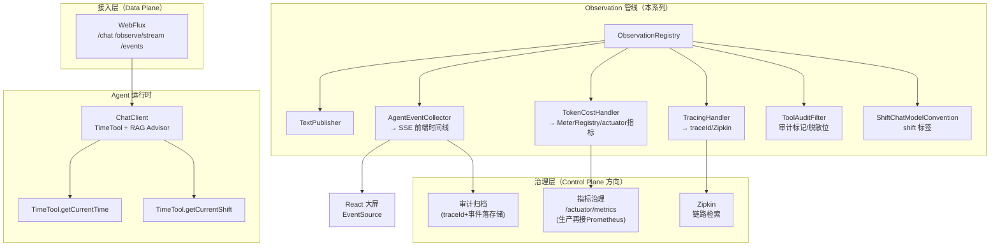
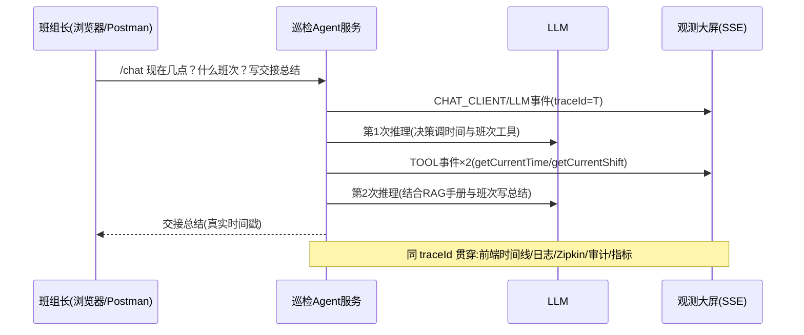

# 12 综合实战：工业巡检 Agent 的可观测闭环

> **定位**：收尾总装配。把 00-11 的全部零件组装成一个贴近你工业目标的完整作品：**TimeTool + 流式输出 + RAG 知识库 + 四条观测出口 + 审计归档 + 前端时间线**，并给出向生产演进的架构路线（管控分离、多实例、合规留存）。本篇代码是"简约实现 + 工业级架构"的最终呈现，全部按 demo01 编程风格组织（`ChatConfig` 建 ChatClient、controller `@Autowired`、工具类不挂容器）。
>
> **前置阅读**：[教程 00-基础与核心/00-Agent核心概念]~[11] 全部（11 关的整合面地图尤其要先看）。

---

## 12.1 业务设定：一条巡检指令的一生

> "现在几点？当前什么班次？结合手册给今天这个班次的交接记录写一段带时间戳的总结。"

Agent 能力：TimeTool（时间 + 班次两个方法）+ RAG 知识库（09 关接入的设备手册）+ 两轮以上 LLM 推理。工具面刻意精简——**观测面才是本系列的主角**：每一步都要"看得见、查得到、算得清"。

## 12.2 完整架构（本系列成果全景）



管控分离视角：左侧接入/Agent 属 Data Plane（高频执行），底部治理属 Control Plane（低频决策：采样率、脱敏规则、SLO 阈值、成本预算）——观测管线正是两者之间天然的"数据面"，这也是为什么它值得从最小 demo 就按对的架构搭（呼应 [教程 04-企业级架构主干/00-管控分离架构]）。

## 12.3 代码总装（本篇两处增量，其余复用 00-11 累积工程）

相对 09 关的累积工程，本篇做两处增强：**① `ChatConfig` 升级为 RAG 终版**（系统契约 + QuestionAnswerAdvisor 进默认配置，controller 彻底瘦身）；**② 新增审计归档 Handler**。流式接口、观测管线（Collector/Convention/Filter/TokenCost/ToolLatency/RAG Handler）全部原样复用。

**① `ChatConfig` 终版（完整文件 v4，RAG + 系统契约）**：

```java
// src/main/java/demo/demo01/config/ChatConfig.java（终版 v4）
package demo.demo01.config;

import demo.demo01.tool.TimeTool;
import org.springframework.ai.chat.client.ChatClient;
import org.springframework.ai.chat.client.advisor.vectorstore.QuestionAnswerAdvisor;
import org.springframework.ai.vectorstore.SearchRequest;
import org.springframework.ai.vectorstore.VectorStore;
import org.springframework.context.annotation.Bean;
import org.springframework.context.annotation.Configuration;

@Configuration
public class ChatConfig {

    /** Agent 行为契约：写在默认配置里，所有入口共用（demo01 习惯：ChatClient 只在这里建） */
    private static final String SYSTEM_PROMPT = """
            你是工厂现场巡检与交接助手。规则：
            1. 结论需要时间戳时必须先调用 getCurrentTime 工具，禁止自己编造时间。
            2. 涉及班次/排班时调用 getCurrentShift 工具获取，不要凭时段猜测。
            3. 设备相关建议优先参考知识库检索到的手册内容，检索不到就明说。
            """;

    @Bean
    public TimeTool timeTool() {
        return new TimeTool();   // 01 关确立：@Bean 才能让 TimeTool 的 @Autowired registry 生效
    }

    // 09 关 SimpleVectorStore（或 pgvector 自动装配）——RAG 教学规划依赖
    @Bean
    public ChatClient chatClient(ChatClient.Builder builder, TimeTool timeTool, VectorStore vectorStore) {
        return builder
                .defaultTools(timeTool)
                .defaultSystem(SYSTEM_PROMPT)
                .defaultAdvisors(QuestionAnswerAdvisor.builder(vectorStore)
                        .searchRequest(SearchRequest.builder()
                                .topK(3)
                                .similarityThreshold(0.5)
                                .build())
                        .build())
                .build();
    }
}
```

**② `ChatController` 终版（完整文件 v6，纯注入零构建）**：

```java
// src/main/java/demo/demo01/controller/ChatController.java（终版 v6，ChatConfig v4 提供 client）
package demo.demo01.controller;

import demo.demo01.obs.AgentEvent;
import demo.demo01.obs.AgentEventCollector;
import io.micrometer.observation.Observation;
import io.micrometer.observation.ObservationRegistry;
import org.springframework.ai.chat.client.ChatClient;
import org.springframework.beans.factory.annotation.Autowired;
import org.springframework.http.codec.ServerSentEvent;
import org.springframework.web.bind.annotation.GetMapping;
import org.springframework.web.bind.annotation.RequestMapping;
import org.springframework.web.bind.annotation.RestController;
import reactor.core.publisher.Flux;

import java.util.List;

@RestController
@RequestMapping("/demo01")
public class ChatController {

    @Autowired
    private ChatClient client;               // ChatConfig 终版：TimeTool + 系统契约 + RAG Advisor

    @Autowired
    private AgentEventCollector eventCollector;

    @Autowired
    private ObservationRegistry registry;    // 手动埋"中断观测"用

    @GetMapping("/chat")
    public String chat(String prompt) {
        return client.prompt().user(prompt).call().content();
    }

    @GetMapping("/events")
    public List<AgentEvent> events() {
        return eventCollector.drain();
    }

    @GetMapping(value = "/observe/stream", produces = "text/event-stream")
    public Flux<ServerSentEvent<AgentEvent>> observeStream() {
        return eventCollector.stream()
                .map(e -> ServerSentEvent.<AgentEvent>builder(e).event("agent-event").build());
    }

    @GetMapping(value = "/chat/stream", produces = "text/event-stream")
    public Flux<ServerSentEvent<String>> chatStream(String prompt) {
        String reqId = String.valueOf(System.nanoTime());
        return doStream(prompt)
                .doOnCancel(() -> Observation
                        .createNotStarted("agent.stream.cancelled", Observation.Context::new, registry)
                        .highCardinalityKeyValue("stream.req", reqId)
                        .observe(() -> { }))
                .doOnError(e -> Observation
                        .createNotStarted("agent.stream.error", Observation.Context::new, registry)
                        .lowCardinalityKeyValue("phase", "stream")
                        .error(e)
                        .observe(() -> { }));
    }

    private Flux<ServerSentEvent<String>> doStream(String prompt) {
        return client.prompt()
                .user(prompt)
                .stream()
                .content()
                .map(token -> ServerSentEvent.<String>builder(token).event("delta").build())
                .concatWith(Flux.just(ServerSentEvent.<String>builder("[完成]").event("done").build()));
    }
}
```

**② 审计归档 Handler（完整文件）**：

```java
// src/main/java/demo/demo01/config/AuditArchiveHandler.java（完整文件）
package demo.demo01.config;

import io.micrometer.observation.Observation;
import io.micrometer.observation.ObservationHandler;
import io.micrometer.tracing.Span;
import io.micrometer.tracing.Tracer;
import lombok.extern.slf4j.Slf4j;
import org.springframework.ai.tool.observation.ToolCallingObservationContext;
import org.springframework.beans.factory.annotation.Autowired;
import org.springframework.stereotype.Component;

@Slf4j
@Component
public class AuditArchiveHandler implements ObservationHandler<ToolCallingObservationContext> {

    @Autowired
    private Tracer tracer;   // demo01 习惯：字段注入（引入 06 关 tracing bridge 后自动装配）

    @Override
    public boolean supportsContext(Observation.Context ctx) {
        return ctx instanceof ToolCallingObservationContext;
    }

    @Override
    public void onStop(ToolCallingObservationContext ctx) {
        // demo：结构化日志即审计。生产：换 MQ/JDBC，带 traceId 落库（06 关 §6.6 决策 3）
        Span span = tracer.currentSpan();
        String traceId = span != null ? span.context().traceId() : "no-trace";
        log.info("AUDIT traceId={} tool={} args={} ok={}",
                traceId,
                ctx.getToolDefinition().name(),
                ctx.getToolCallArguments(),
                ctx.getError() == null);
    }
}
```

审计与事件流的区别：事件流给**实时看**（会过期、可截断），审计给**事后查**（不丢、带责任字段）——同一观测源、两种 SLA，所以分成两个 Handler 而不是一个带开关的。

**③ HITL 触发点（预留）**：将来加入高成本操作工具（如改排班、下发停机指令）时插入人工确认。完整 HITL 落点是 `ToolCallingManager`/`ToolCallback` 包装层（非 Advisor，CLAUDE.md 铁律），本篇不展开——观测已把"哪次调用该审批"的信号（工具名+参数+traceId）备齐，[教程 04-企业级架构主干/08-Human-in-the-Loop与审批流] 是正篇。

## 12.4 一次巡检的完整可观测旅程（结果预期）



## 12.5 Postman 综合测试用例（验收清单）

| # | 用例 | 操作 | 验收现象（全部命中才算闭环） |
|---|---|---|---|
| 1 | 多方法工具巡检 | `GET /demo01/chat?prompt=现在几点？当前什么班次？给交接记录写一句总结` | 结论含真实时间戳 + 班次（工具返回，非编造） |
| 2 | 前端时间线 | 先订阅 `GET /demo01/observe/stream` 再发用例 1 | SSE 按序收到 ≥5 条事件（CHAT_CLIENT+2×LLM+TOOL(getCurrentTime)+TOOL(getCurrentShift)），同一 traceId |
| 3 | 链路完整性 | 用例 1 的 traceId 去查 | console 日志行、审计 AUDIT 行、Zipkin span 树三处同一 traceId |
| 4 | 班次标签合规 | 看 `gen_ai.client.operation` span 的 KeyValues | `shift` 取值仅 morning/afternoon/night 之一（低基数纪律落地） |
| 5 | 成本计量 | 调用前后各查一次 `GET /actuator/metrics/agent.token.cost` | `measurements` 的 TOTAL 增量 ≈ 2 次 LLM 调用 token 之和；`availableTags` 含 `type` 维度 |
| 6 | 错误韧性 | 临时让 `getCurrentShift` 抛异常再调 | 结论降级为"班次获取失败"；事件流出现 ERROR；指标照常；服务不崩 |
| 7 | 断线重连 | 中途断开 SSE 再重连 | replay 补发近期事件后继续实时 |

## 12.6 从 demo 到生产：演进路线（ADR 风格）

| 演进 | 驱动需求 | 方案 | 取舍理由 |
|---|---|---|---|
| V1（本篇）单实例全内存 | 学习/POC | buffer + Sinks + 结构化日志审计 | 零外部依赖，架构契约已对齐生产 |
| V2 多实例 | 高可用 | 事件走 Redis Pub/Sub 聚合；审计走 MQ；traceId 落巡检/交接记录表 | Handler 不改，只换"广播通道"实现 |
| V3 合规留存 | 审计法规 | 事件+trace 全量入对象存储/时序库，保留期按合规（6 个月~2 年） | 观测数据本身成为合规证据链 |
| V4 治理闭环 | 成本/质量 | 接入 Prometheus+Grafana（只加 registry 依赖，业务代码零改动）；采样率与脱敏规则收敛到 Control Plane 配置中心；告警回驱动（如 token 超预算自动降级模型） | 呼应 [教程 03-React前端与AgenticUI/03-Agentic-UI设计]、[教程 05-Observation可观测/08-流式响应的观测：stream模式下的span闭合] |

## 12.7 系列总结：你带走了什么

| 能力 | 关卡 |
|---|---|
| 框架观测点全景 + 最小 console 闭环 | 00 |
| span 树/生命周期/基数纪律 | 01 |
| 五组件协作与扩展点选型 | 02 |
| 自定义 Handler 收集事件流 | 03 |
| Convention 注班次标签、Filter 收尾加工 | 04 |
| SSE 推前端时间线（断线重连） | 05 |
| traceId 全链路贯穿 + 日志定位 | 06 |
| Token 计量、SLO、基数熔断（零安装） | 07 |
| 流式响应观测（span 闭合/中断/部分结果） | 08 |
| Advisor 与 RAG 检索质量观测 | 09 |
| 观测代码测试 + 跨服务 trace 传播 | 10 |
| Spring AI 2.0 × Observation 整合面全景 | 11 |
| 总装 + 审计 + 生产演进 ADR（本篇） | 12 |

**给架构师的一句话**：Observation 的本质是"一源多消费者的观测总线"。你在 demo 里用十来个类搭出的管线，与生产十万 QPS 系统的差异只在消费者实现与存储介质——契约（Context/事件 DTO/低高基数纪律）从第一天就是同一套。这就是"代码简约、架构工业级"的完整含义。

> 交叉引用：[教程 04-企业级架构主干/02-全链路可观测性]、[教程 04-企业级架构主干/03-工具执行可观测与审计]、[教程 04-企业级架构主干/07-成本治理与Token计量]、[教程 08-架构师进阶/07-数据飞轮与持续改进]
