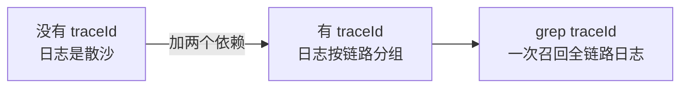
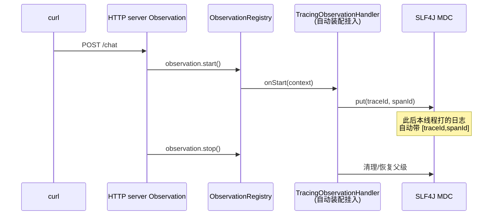

# 00 最小闭环：日志里长出 traceId

> **定位**：本文是 `TraceId 全链路追踪` 系列（教程 06-TraceId全链路追踪/00-最小闭环：日志里长出traceId Java 代码**，让 demo01 的每条日志自动长出 `[traceId,spanId]`，一次 Agent 请求的所有日志可以用同一个 traceId 串起来。后续十关都在这个最小闭环上逐层加码。
>
> **读者画像**：已经跑通过 demo01 的 ChatClient + TimeTool（[教程 00-基础与核心/00-Agent核心概念]），见过 span 树，但还没让 traceId 出现在自己的日志里。
>
> **前置阅读**：[教程 00-基础与核心/00-Agent核心概念]、[教程 00-基础与核心/01-Spring-AI框架入门]（Observation 生命周期）。

---

## 0.1 先看清：traceId 到底解决什么问题

没有 traceId 时，一次 Agent 请求的日志长这样（TimeTool 工具日志、SimpleLogAdvisor 日志、框架日志混在一起）：

```text
14:02:11 INFO  d.d.tools.TimeTool    - 开始调用工具
14:02:11 INFO  d.d.c.SimpleLogAdvisor - before: 用户问当前时间
14:02:12 INFO  d.d.tools.TimeTool    - 开始调用工具
```

第二行 `SimpleLogAdvisor` 的 before 和第一行 TimeTool 的日志**谁属于哪次请求？**并发一上来就彻底分不清——这是工业运维的第一痛点：**报警时无法从一条日志定位整条链路**。

加上 traceId 后：

```text
14:02:11 INFO [demo01,64f8a1c2b9d04e7a,64f8a1c2b9d04e7a] d.d.tools.TimeTool     - 开始调用工具
14:02:11 INFO [demo01,64f8a1c2b9d04e7a,f3c2b9d04e7a1234] d.d.c.SimpleLogAdvisor - before: 用户问当前时间
```

同一个 `64f8a1c2b9d04e7a` 就是**这次请求的全链路身份证**。`grep 64f8a1c2` 一下，HTTP 入口、ChatClient、LLM 调用、工具执行——全部召回。



**与 Observation 系列的关系**（[教程 00-基础与核心/06-向量数据库选型] 已铺过一次）：Micrometer Tracing 不是另一套 API，它就是一组特殊的 `ObservationHandler`。你已有的全部 Observation 知识（Registry/Handler/Convention/Filter）原样有效，本系列专注 traceId 这条线打穿：**生成 → 编程 → Baggage → 记录 → 跨服务 → 展示 → 微服务架构 → 工业闭环**。

## 0.2 依赖：Boot 4.1 的坐标和 Boot 3 不一样（重要差异）

> **需在 pom.xml 中添加依赖**（建议并入 `observation` profile 或新建 `tracing` profile，遵守 demo01 习惯；pom 由你自己改）：

```xml
<!-- ① Micrometer Tracing 的 Brave 桥（Boot 4.1 管理版本为 1.7.0） -->
<dependency>
    <groupId>io.micrometer</groupId>
    <artifactId>micrometer-tracing-bridge-brave</artifactId>
</dependency>
<!-- ② Boot 4 拆分出来的 tracing 自动装配模块（Boot 3 时代不存在，网上旧教程没有它！） -->
<dependency>
    <groupId>org.springframework.boot</groupId>
    <artifactId>spring-boot-micrometer-tracing-brave</artifactId>
</dependency>
```

两个坐标缺一不可，这是 2026 年从旧文档迁移时**最高频的坑**：

| 坐标 | 作用 | 不加会怎样 |
|------|------|-----------|
| `micrometer-tracing-bridge-brave` | 提供 `Tracer`/`Span` 接口的 Brave 实现 | 没有 Tracer Bean |
| `spring-boot-micrometer-tracing-brave` | Boot 4 拆出的自动装配（`BraveAutoConfiguration` 等） | 依赖能编译、运行全无效果 |

版本核对（javap 实证，仓库 `/Volumes/data/software/maven/repository`）：Boot 4.1.0 的 BOM 管理 `micrometer-tracing 1.7.0`、`brave 6.3.1`、`zipkin-reporter 3.5.3`——文档一律不写版本号，交给 BOM。

## 0.3 零代码验证：启动即生效

加完依赖直接启动（`-Ddemo.demo=demo`，与 18 系列同一套 ChatController/TimeTool）：

```bash
mvn clean spring-boot:run -Dspring-boot.run.profiles=demo -Ddemo.demo=demo
```

发一次请求：

```bash
curl -X POST "http://localhost:8080/chat" \
  -H "Content-Type: application/x-www-form-urlencoded" \
  -d "message=现在几点了"
```

控制台日志（关注 level 列后面方括号）：

```text
INFO [demo01,64f8a1c2b9d04e7a,64f8a1c2b9d04e7a] d.d.tools.TimeTool - 开始调用工具
```

方括号里的三段是 `[应用名,traceId,spanId]`。**你没有写任何 pattern 配置**——Boot 4 的 `LogCorrelationEnvironmentPostProcessor`（javap 实证存在于 `spring-boot-micrometer-tracing` 模块）检测到 tracing 在 classpath，自动把 `logging.pattern.level` 追加为 `%5p [${spring.application.name:},%X{traceId:-},%X{spanId:-}]`。

### 什么情况下不会自动生效（边界情况，必看）

- **你自定义过 `logging.pattern.console`/`level`**：自定义 pattern 会覆盖默认，traceId 不出现。解法：在你的 pattern 里手动补 `%X{traceId:-}`（04 关展开）。
- **日志不走 SLF4J MDC 的通道**（如直接 System.out）：traceId 当然不进。
- **没有 span 的线程上打日志**：traceId 为空。哪些线程"有 span"——见 0.4。

## 0.4 为什么零代码就长出了 traceId：一条链路图

你的 demo01 里**已经存在 Observation**（[教程 00-基础与核心/00-Agent核心概念] 埋的点）：ChatClient 调用、ChatModel 调用、Tool 调用、HTTP server 请求。tracing 依赖一加，自动装配把 `TracingObservationHandler` 挂进 `ObservationRegistry`，每个 Observation 的 `start/stop` 就被翻译成 span 的入栈/出栈，当前 span 的 traceId/spanId 同步写入 SLF4J MDC——你的日志就这样"免费"长出了链路号。



适用场景：任何想"从日志定位全链路"的服务——尤其是 LLM 网关、Agent 中台这类一次请求跨越 HTTP/LLM/工具三层的系统。

不适用场景：纯离线批处理无请求边界的任务（没有天然的"一次执行"切割点，需 02 关手动开 span）；已用 OTel Java Agent 全量埋点的系统（会双份 span，选其一）。

## 0.5 用 Tracer 读出 traceId（第一段 traceId 代码）

最小闭环的最后一步：在**代码里**拿到当前 traceId（后面每关都用得上）。给 TimeTool 加一个只读方法——**不改既有方法**，保持零侵入验证：

```java
// src/main/java/demo/demo01/tools/TimeTool.java（本关完整版）
package demo.demo01.tools;

import io.micrometer.tracing.Span;
import io.micrometer.tracing.Tracer;
import lombok.extern.slf4j.Slf4j;
import org.springframework.ai.tool.annotation.Tool;

import java.time.LocalDateTime;
import java.time.format.DateTimeFormatter;

@Slf4j
public class TimeTool {

    private final Tracer tracer;   // ★ Tracer 由 Boot 自动装配成 Bean，构造注入即可

    public TimeTool(Tracer tracer) {
        this.tracer = tracer;
    }

    @Tool(description = "获取系统的当前时间")
    public String getCurrentTime() {
        log.info("开始调用工具");
        // ★ Tracer.currentSpan()：当前线程/Reactor 链上的活跃 span；无 span 时返回 null
        Span span = tracer.currentSpan();
        if (span != null) {
            // ★ TraceContext 携带三件套：traceId() / spanId() / parentId()（javap 实证）
            log.info("当前 traceId={} spanId={}", span.context().traceId(), span.context().spanId());
        } else {
            log.info("当前无活跃 span");
        }
        return LocalDateTime.now().format(DateTimeFormatter.ISO_LOCAL_DATE_TIME);
    }
}
```

注册处同步改构造参数（ChatConfig 其余不动）：

```java
// src/main/java/demo/demo01/config/ChatConfig.java（本关完整版）
package demo.demo01.config;

import demo.demo01.tools.TimeTool;
import io.micrometer.tracing.Tracer;
import org.springframework.ai.chat.client.ChatClient;
import org.springframework.context.annotation.Bean;
import org.springframework.context.annotation.Configuration;

@Configuration
public class ChatConfig {

    @Bean
    public ChatClient chatClient(ChatClient.Builder builder, Tracer tracer) {
        return builder
                .defaultSystem(" 你必须严格遵守：在发起任何工具调用之前，先输出一段以【调用说明】开头的话，解释你需要什么信息、为什么调用该工具。输出【调用说明】之后才允许调用工具。")
                .defaultTools(new TimeTool(tracer))   // ★ 传入自动装配的 Tracer
                .defaultAdvisors(new SimpleLogAdvisor())
                .build();
    }
}
```

> 依赖注入语义说明：`@Bean` 方法返回的对象（这里是 `ChatClient` 内部持有的 `TimeTool`）其构造由你手动完成，所以 Tracer 走 `chatClient` Bean 方法的参数注入——这正是 18 系列"工具不挂 @Component、new 后经 @Bean 注册"风格的延续。

再跑一次 0.3 的 curl，你会看到工具日志里打印的 traceId 与方括号里的完全一致——**日志侧和代码侧拿到的是同一个链路号**，最小闭环完成。

## 0.6 常见误区

- **以为要自己生成 traceId 再塞进 MDC**：不要。Brave 已经在 Observation 生命周期里管理 MDC，手工 set 会与自动清理打架，出现"日志串号"。
- **以为 traceId 是 Spring AI 的功能**：它是 Micrometer Tracing 的；Spring AI 只负责产生 Observation（[教程 02-SpringAI核心机制/07-MCP协议] 的七个观测点），tracing 把观测变链路。
- **在非请求线程（如自建线程池）里期待 traceId**：span 不随线程自动走，WebFlux 场景要开 `Hooks.enableAutomaticContextPropagation()`（[教程 00-基础与核心/06-向量数据库选型 §6.3]，05 关跨服务时同样关键）。

## 0.7 本关交付与下一关

| 交付 | 验证方式 |
|------|---------|
| 日志带 `[app,traceId,spanId]` | 启动后任意请求，看控制台 |
| 代码读出 traceId | `TimeTool` 日志输出与方括号一致 |

下一关 [教程 00-基础与核心/01-Spring-AI框架入门]：把方括号里那串 16 进制**读透**——traceId/spanId/parentId 的族谱关系、W3C `traceparent` 报文格式、采样位怎么读、span 树怎么在脑中成像。

---

**本系列实证基线**（全部来自本地仓库 javap，jar 版本：micrometer-tracing 1.7.0 / bridge-brave 1.7.0 / spring-boot-micrometer-tracing{,-brave} 4.1.0）：`Tracer.currentSpan()/nextSpan()/startScopedSpan(String)/withSpan(Span)`、`Span.context()/tag(String,String)/event(String)/error(Throwable)/end()`、`TraceContext.traceId()/spanId()/parentId()/sampled()` 均真实存在，签名一致。
