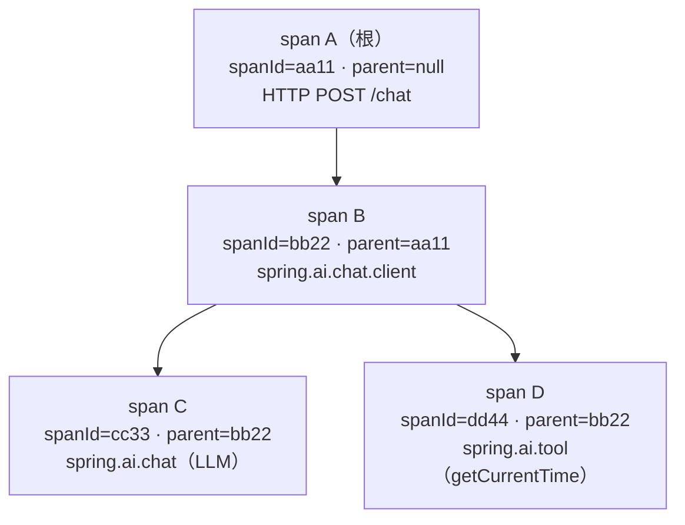
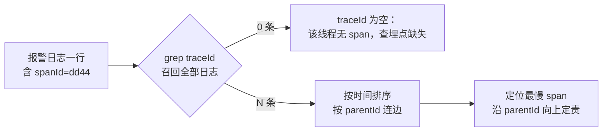

# 01 读懂族谱：traceId、spanId 与 span 树

> **定位**：上一关你"看见"了 traceId，这一关把它**读懂**。traceId/spanId/parentId 三者的族谱关系、W3C `traceparent` 报文怎么逐位读、采样标志位在哪、span 树如何从 id 反推出来——这些是后面手动开 span（02）、跨服务传播（05）、微服务排障（07）的地基。
>
> **读者画像**：跑通 00 关，能解释"日志里那串 16 进制是干嘛的"，但说不清 parentId 为什么有时为空、有时 32 位有时 16 位。
>
> **前置阅读**：[教程 00-基础与核心/00-Agent核心概念]。

---

## 1.1 三个 id 的分工

| id | 长度（hex） | 谁拥有 | 回答的问题 |
|----|------------|--------|-----------|
| **traceId** | 32 | 一次链路（一次用户请求的完整旅程） | "这是哪次请求？" |
| **spanId** | 16 | 链路中的一次操作（一次 HTTP/LLM/工具调用） | "这次操作是谁？" |
| **parentId** | 16（可空） | 当前 span 的父操作 | "谁调用的我？" |

一条铁律先立住：**traceId 在整条链路里不变，spanId 每个操作一个**。所以 00 关日志里两个 span 的 traceId 相同、spanId 不同——同族不同人。

`parentId` 为空时表示**根 span**（链路的起点，通常是 HTTP server 收到请求那个 span）。把每个 span 的 `spanId → parentId` 连边，就还原出整棵 span 树：



排障时从报警日志的 spanId 出发，沿 parentId 向上爬到根，就知道"这次工具慢，是它上面的 LLM 调用先慢"还是"工具本身慢"。

## 1.2 用日志亲手拼一棵树（动手实验）

demo01 临时把 00 关 `TimeTool` 里的打印升级为族谱三件套（其余文件不动）：

```java
// src/main/java/demo/demo01/tools/TimeTool.java（本关完整版）
package demo.demo01.tools;

import io.micrometer.tracing.Span;
import io.micrometer.tracing.Tracer;
import lombok.extern.slf4j.Slf4j;
import org.springframework.ai.tool.annotation.Tool;

import java.time.LocalDateTime;
import java.time.format.DateTimeFormatter;

@Slf4j
public class TimeTool {

    private final Tracer tracer;

    public TimeTool(Tracer tracer) {
        this.tracer = tracer;
    }

    @Tool(description = "获取系统的当前时间")
    public String getCurrentTime() {
        log.info("开始调用工具");
        // ★ 三件套一起打：traceId 定链路，spanId 定自己，parentId 定父
        Span span = tracer.currentSpan();
        if (span != null) {
            log.info("族谱 traceId={} spanId={} parentId={}",
                    span.context().traceId(),
                    span.context().spanId(),
                    span.context().parentId() == null ? "(根span)" : span.context().parentId());
        }
        return LocalDateTime.now().format(DateTimeFormatter.ISO_LOCAL_DATE_TIME);
    }
}
```

请求 `curl -X POST http://localhost:8080/chat -d "message=现在几点了"` 后，把日志里出现的**所有** `[app,traceId,spanId]` 抄下来画树（traceId 相同的行才算同一条链路！）。你会得到类似 1.1 图的结构：工具 span 的 parentId 正是 `spring.ai.chat.client` 那个 span 的 spanId——**工具是 ChatClient 的孩子**，这就是 Spring AI 观测点之间的真实父子关系（span 名实证见 [教程 02-SpringAI核心机制/01-MCP协议]）。

## 1.3 W3C Trace Context：`traceparent` 报文逐位读

traceId 不只活在日志里，它还要**跨服务出差**（05 关）。出差时的标准行囊是 W3C Trace Context 规范的 `traceparent` HTTP 头（来源：<https://www.w3.org/TR/trace-context/>）：

```text
traceparent: 00-64f8a1c2b9d04e7a3b2c1d0e9f8a7b6c-aa11bb22cc33dd44-01
             └┘ └──────────────32位──────────────┘ └──────16位──────┘ └┘
             版本       traceId                        spanId        采样标志
```

| 字段 | 值 | 含义 |
|------|----|------|
| version | `00` | 规范版本 0 |
| trace-id | 32 hex | 全链路身份证 |
| parent-id | 16 hex | **发送方**的 spanId（接收方用它当自己的 parentId） |
| trace-flags | 2 hex | 位标志；`01` = sampled（采样），`00` = 未采样 |

Boot 4.1 的默认传播格式就是 W3C（配置元数据实证：`management.tracing.propagation.produce` 默认 `['W3C']`，`consume` 默认 `['W3C','B3','B3_MULTI']`——即"对外说 W3C，对内能听懂 Zipkin 老家话 B3"）。

读采样位是排障硬技能：**没被采样的 trace，即使 id 存在也不会上报 span**（导出侧见 04/07 关）。demo 里默认采样概率 0.1（`management.tracing.sampling.probability` 默认值，配置元数据实证），所以十次请求只有约一次能在导出端看到完整链路。学习期先全采：

```yaml
# application-observation.yml（本关唯一配置改动）
management:
  tracing:
    sampling:
      probability: 1.0   # ★ demo 全采样；生产常用 0.05~0.2，07 关讲采样策略
```

## 1.4 spanId 复用 traceId 前缀？（16 vs 32 的视觉陷阱）

00 关日志里 `[demo01,64f8a1c2b9d04e7a,64f8a1c2b9d04e7a]` 两段一模一样——这不是巧合也不是 bug：**Brave 的根 span 惯例是用 traceId 的前 16 位当根 spanId**（spanId 只要求链路内唯一，这样肉眼可辨"根"）。子 span 的 spanId 则是全新随机值，与 traceId 无关。看到两段相同 = 你正在看根 span；看到第二段是陌生值 = 子 span，去日志里找 spanId 等于它 parentId 的那一行，就是它爹。

## 1.5 族谱成像：从 grep 到树

一次真实排障的动作序列（工业习惯，后面 07 关微服务版会放大成跨服务排障 SOP）：



注意 `grep traceId` 是**唯一**召回手段的前提是日志格式没被自定义 pattern 破坏（00 关 0.3 的边界情况）。

适用场景：任何要"看日志排障"的人——先懂族谱再学工具；也是读懂 Zipkin/Tempo UI 瀑布图的前置（UI 上每根横条就是一个 span，缩进就是 parentId）。

不适用场景：只想"能用就行"的 demo 阶段可以跳过 1.3 的报文细节，但 1.1 的三者分工不可跳——02 关起写代码全靠它。

## 1.6 常见误区

- **把 spanId 当 traceId 去 grep**：只召回一个 span 的日志，误以为"链路断了"。判别法：日志方括号第二段才是 traceId。
- **以为 parentId 空是异常**：空 = 根 span，恰恰是链路入口；微服务里**每个服务都看到自己第一个 span 有 parentId**（来自上游），全链路只有网关的根没有——07 关的架构图以此为准。
- **以为采样只影响"上报"**：Brave 里未采样 span 仍是有效 span（traceId 照常进 MDC），只是不导出。所以"日志有 traceId、Zipkin 搜不到"第一反应查采样率，不是查埋点。

## 1.7 本关交付与下一关

你已经能：读懂三件套分工、手拼 span 树、逐位读 `traceparent`、识别采样位与"根 span 复用前缀"惯例。

下一关 [教程 00-基础与核心/02-ChatClient与对话模型]：不再只"读"span，而是**用 Tracer 编程创建**——`startScopedSpan`/`withSpan`/`SpanInScope` 三兄弟的正确用法、tag/event/error 的工业语义、try-with-resources 为什么是铁律。

---

**实证基线**（javap，micrometer-tracing 1.7.0）：`TraceContext.traceId()/spanId()/parentId()` 返回 `String`（parentId 可为 null）；`sampled()` 返回 `Boolean`；`TracingContext`/`TracingObservationHandler` 在 `io.micrometer.tracing.handler` 包。
