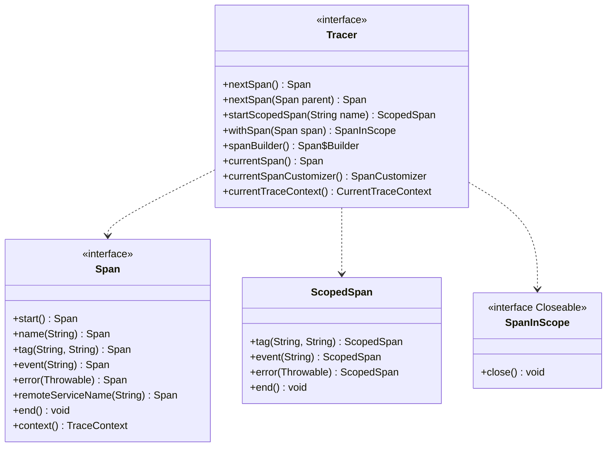
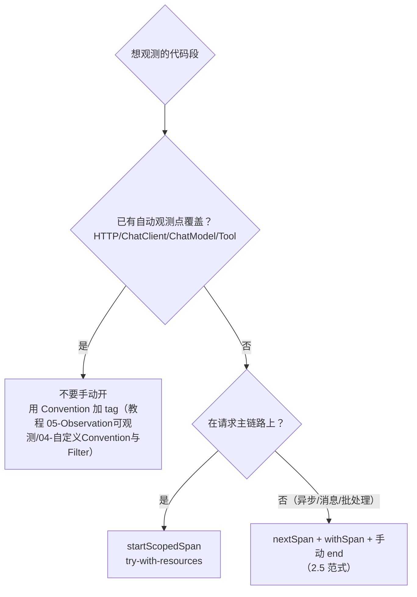

# 02 Tracer 编程模型：手动开 span

> **定位**：自动埋点覆盖不到的角落（自建线程池里的任务、非 HTTP 入口的消息消费、一段你想单独计时的业务逻辑），需要你**手动开 span**。本关把 `Tracer` 的编程模型讲透：`startScopedSpan` 与 `withSpan` 的区别、`SpanInScope` 的 try-with-resources 铁律、tag/event/error 的工业语义、以及"忘关 scope"这个最经典的翻车现场。
>
> **读者画像**：读过 00/01 关，能读 traceId，现在要在自己代码里造 span。
>
> **前置阅读**：[教程 00-基础与核心/01-Spring-AI框架入门]。

---

## 2.1 API 全景（全部 javap 实证，micrometer-tracing 1.7.0）



三兄弟一句话分工：

| API | 返回 | 适用 |
|-----|------|------|
| `startScopedSpan(name)` | `ScopedSpan` | **同步代码块计时**：开 span + 进 scope 一步到位，`end()` 同时收 span 和 scope。最常用。 |
| `tracer.nextSpan()` + `span.start()` | `Span` | 只想要 span 对象、暂不占 scope（如跨线程携带，本关 2.5） |
| `tracer.withSpan(span)` | `SpanInScope` | 把一个已 start 的 span 设为当前（配合 nextSpan 用）；**必须 close** |

**scope 是什么**：span 是"记录"，scope 是"当前线程/Reactor 链上谁在场"。MDC 里的 traceId 来自 scope，不是来自 span 对象本身——所以**没进 scope 的 span 不会让日志带号**。

## 2.2 最小手动 span：给 TimeTool 记一次"业务子段"

场景：`getCurrentTime` 里的格式化逻辑（代表任何你想单独观测的业务子段）想有自己的 span。完整文件：

```java
// src/main/java/demo/demo01/tools/TimeTool.java（本关完整版）
package demo.demo01.tools;

import io.micrometer.tracing.ScopedSpan;
import io.micrometer.tracing.Tracer;
import lombok.extern.slf4j.Slf4j;
import org.springframework.ai.tool.annotation.Tool;

import java.time.LocalDateTime;
import java.time.format.DateTimeFormatter;

@Slf4j
public class TimeTool {

    private final Tracer tracer;

    public TimeTool(Tracer tracer) {
        this.tracer = tracer;
    }

    @Tool(description = "获取系统的当前时间")
    public String getCurrentTime() {
        log.info("开始调用工具");
        // ★ try-with-resources 是铁律：漏 close scope 会污染后续日志的 traceId（2.4 翻车现场）
        try (var ignored = tracer.startScopedSpan("time.format")) {
            // 从这里开始：span=time.format，MDC 的 spanId 变成它的
            log.info("进入业务子段 time.format");
            return LocalDateTime.now().format(DateTimeFormatter.ISO_LOCAL_DATE_TIME);
        }   // ★ try 块退出即关 scope：恢复父级、日志 spanId 回到 spring.ai.tool
        // 注意：ScopedSpan 无需手动 end——close 时自动 end（与裸 Span 不同）
    }
}
```

请求一次，日志可见 spanId 在子段内变化、退出后复原；族谱上 `time.format` 挂在 `spring.ai.tool` 下面（01 关的树多了一层）。**推荐用 try-with-resources 形式的 startScopedSpan**——它是唯一"忘了也安全"的写法。

## 2.3 tag / event / error：span 的三支笔

| 方法 | 语义 | 工业用法 |
|------|------|---------|
| `tag(k, v)` | span 全程有效的键值对 | 业务属性：`tenant=plant-a`（注意基数！值必须有限可枚举，[教程 05-Observation可观测/07-指标治理：Token计量、SLO与基数熔断] 基数熔断同理） |
| `event(name)` | 时间轴上的**点**事件 | 状态迁移：`llm-first-token`（首 token 到达时刻，流式场景定位 TTFT） |
| `error(t)` | 异常标记 | catch 块里打，span 变红、异常摘要进 tag |

给 ScopedSpan 版本补上三支笔（只列方法体，其余同 2.2 完整文件，直接替换 try 块）：

```java
        try (var scoped = tracer.startScopedSpan("time.format")) {
            scoped.tag("biz.module", "time");            // ★ tag：全程属性
            scoped.event("format.begin");                // ★ event：时间轴打点
            try {
                return LocalDateTime.now().format(DateTimeFormatter.ISO_LOCAL_DATE_TIME);
            } catch (RuntimeException e) {
                scoped.error(e);                         // ★ error：异常进 span，链路图上标红
                throw e;
            }
        }
```

（`ScopedSpan.tag/event/error` 均为接口真实方法，javap 实证。）

## 2.4 翻车现场：忘关 scope

把 2.2 的 try-with-resources 故意写成手动版且**不 close**：

```java
ScopedSpan scoped = tracer.startScopedSpan("time.format");
// ... 业务逻辑后忘记处理，方法返回
```

后果：该线程（WebFlux 下是该 EventLoop）之后处理的**别的请求**，日志里 spanId 仍是 `time.format`，甚至 traceId 是**上一次请求**的——日志串号，排障时两条链路证据互相污染。这就是"scope 必须配对关闭"的铁律来源，也解释了为什么本文一律 try-with-resources。

## 2.5 跨线程带 span：nextSpan 的真正用途

自建线程池/`Mono.fromFuture` 场景，span 不会自动跟过去。范式：**在提交前捕获当前 span，在任务内 withSpan 包住执行**：

```java
// 概念片段（嵌入任何需要异步执行的方法；完整可编译示例见 05 关跨服务传播）
Span parent = tracer.currentSpan();                 // 提交线程：抓当前 span（可能为 null）
executorService.submit(() -> {
    Span child = tracer.nextSpan(parent);           // ★ nextSpan(Span)：以 parent 为父造子 span
    child.name("async.task").start();               // 起名并 start
    try (var scope = tracer.withSpan(child)) {      // 子线程内让 child 在场
        log.info("异步任务日志带新 spanId");         // MDC = child 的 id
    } finally {
        child.end();                                // ★ 裸 Span 必须手动 end（与 ScopedSpan 不同）
    }
});
```

两个易错点：① `withSpan` 与 `end` **是两件事**——scope 管日志，end 管记录闭合，缺一个就漏一半；② WebFlux 主链路里**优先用** `Hooks.enableAutomaticContextPropagation()` + Reactor Context（[教程 05-Observation可观测/06-Trace链路：traceId贯穿HTTP、LLM、工具与日志]），手抓 span 只用于"逃出 Reactor 世界"的边界（如legacy 线程池）。

## 2.6 该不该手动开 span：决策指南



适用场景：消息消费者入口（Kafka 监听器内没有 HTTP 自动 span，[教程 07-Kafka事件骨干/00-Kafka全景与核心概念] 场景）、老代码线程池迁移期、任何"业务子段"计时。

不适用场景：给已有的自动观测点包一层"外壳 span"（如包住整个 ChatClient 调用）——树会多一层无信息节点，正确做法是让自动 span 之间自然成树；需要"把属性传给下游所有 span"时用 03 关 Baggage，不要层层手动 tag。

## 2.7 本关交付与下一关

| 交付 | 验证 |
|------|------|
| `time.format` 子 span 出现在族谱 | 日志 spanId 变化 + 01 关拼树法 |
| tag/event/error 三支笔 | 导出后看 span 详情（04 关起有导出） |
| 跨线程范式 | 2.5 概念片段 + 05 关完整落地 |

下一关 [教程 06-TraceId全链路追踪/03-Baggage：业务属性随链路传播]：**Baggage**——tenantId 这类业务属性如何挂在 traceId 上、随整条链路（含跨服务）自动流动、并进 MDC 与日志同行——这是多租户架构（07 关）的关键地基。

---

**实证基线**（javap，micrometer-tracing 1.7.0）：`ScopedSpan` 为独立接口（`io.micrometer.tracing.ScopedSpan`），方法 `tag(String,String)/event(String)/error(Throwable)/end()`；`SpanInScope implements Closeable`；`Tracer.nextSpan(Span)` 存在；`Span.name(String)` 返回 `Span` 可链式。
